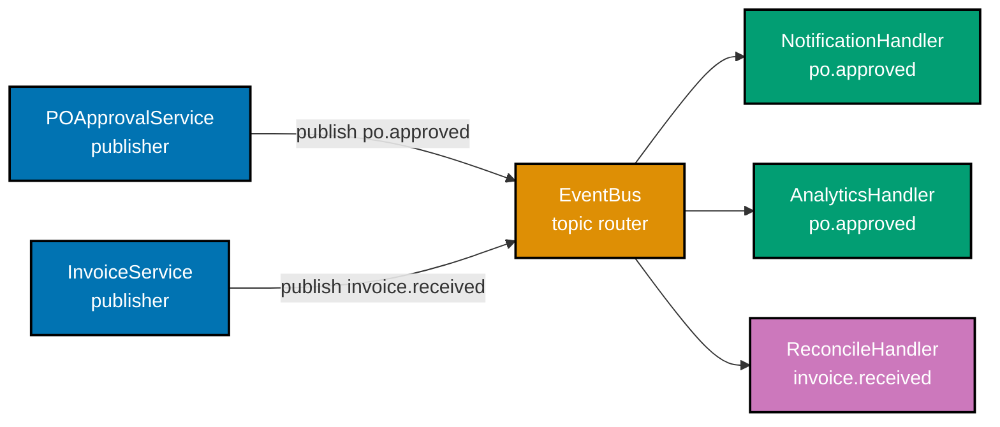
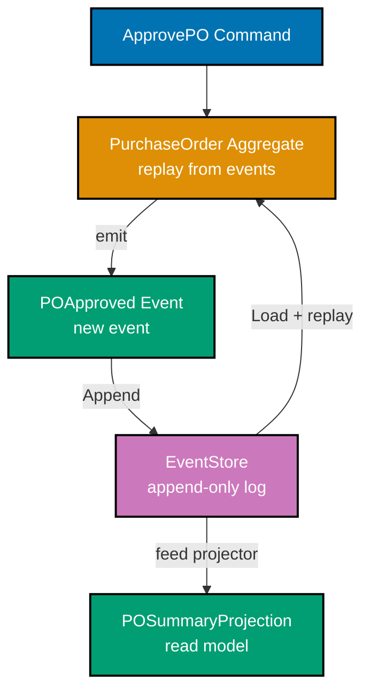
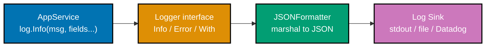
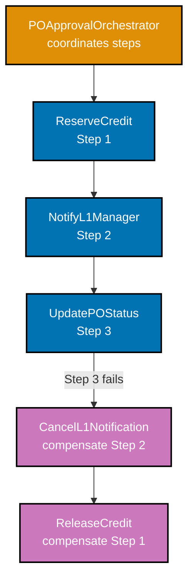

Advanced patterns for production-grade procedural systems. These examples assume familiarity with the structural, compositional, and port-adapter idioms from the beginner and intermediate tiers. The procurement platform domain runs throughout — `PurchaseOrder`, `Supplier`, `Invoice`, `Money`, `LineItem`, `ApprovalLevel`, and `POStatus` provide the concrete vocabulary for every pattern.

The four sections here address concerns that surface at scale: high-throughput event routing (Section 1), instrumentation that survives production fire-drills (Section 2), long-running distributed workflows that must tolerate partial failure (Section 3), and composition techniques that make the whole system testable and comprehensible at a glance (Section 4).

## Section 1: Reactive / Event-Driven Advanced (Examples 58–62)

### Example 58: EventBus with Topic-Based Routing

Topic-based routing dispatches domain events to handlers subscribed to a named topic, fully decoupling producers from consumers. The bus owns the fan-out logic; producers know only a topic string, and consumers know only the event shape — neither knows who else is listening or emitting.






```go
// => DomainEvent is the common interface every domain event must satisfy.
// => Topic() lets the bus dispatch without knowing the concrete event type.
type DomainEvent interface {
    // => Topic returns a dot-separated string: "<aggregate>.<verb>" (e.g. "po.approved")
    Topic() string
}

// => EventHandler is any object that can receive and process one domain event.
type EventHandler interface {
    // => Handle may return an error; the bus treats errors as fatal for that publish.
    Handle(ctx context.Context, event DomainEvent) error
}

// => EventBus routes domain events to registered handlers by topic.
// => Decouples producers (application services) from consumers (notification, analytics).
type EventBus struct {
    // => mu guards the handlers map for concurrent subscribe and publish safety.
    mu sync.RWMutex
    // => handlers maps each topic string to the slice of handlers subscribed to it.
    handlers map[string][]EventHandler
}

// => NewEventBus allocates an EventBus with an empty handler registry.
func NewEventBus() *EventBus {
    // => Make the map eagerly — nil map panics on write.
    return &EventBus{handlers: make(map[string][]EventHandler)}
}

// => Subscribe registers handler as a recipient of all events on topic.
func (b *EventBus) Subscribe(topic string, handler EventHandler) {
    b.mu.Lock()
    defer b.mu.Unlock()
    // => Append to existing slice — multiple handlers per topic are allowed.
    b.handlers[topic] = append(b.handlers[topic], handler)
}

// => Publish delivers event to every handler registered for event.Topic().
func (b *EventBus) Publish(ctx context.Context, event DomainEvent) error {
    b.mu.RLock()
    // => Read lock: concurrent publishes to different topics do not block each other.
    handlers := b.handlers[event.Topic()]
    b.mu.RUnlock()
    // => Snapshot handlers under read lock, then call them outside the lock
    // => to avoid holding the lock during potentially slow handler work.
    for _, h := range handlers {
        if err := h.Handle(ctx, event); err != nil {
            // => First handler error aborts remaining handlers for this publish.
            return fmt.Errorf("handler %T failed for topic %s: %w", h, event.Topic(), err)
        }
    }
    return nil
}

// --- Usage ---

// => POApprovedEvent is the concrete domain event emitted when a PO is approved.
type POApprovedEvent struct {
    POID       string
    SupplierID string
    Total      Money
}

// => Topic satisfies DomainEvent; the bus uses this string to find subscribers.
func (e POApprovedEvent) Topic() string { return "po.approved" }

// => Wire up: notification and analytics both subscribe to the same topic.
bus := NewEventBus()
bus.Subscribe("po.approved", notificationHandler)
bus.Subscribe("po.approved", analyticsHandler)
bus.Subscribe("invoice.received", reconcileHandler)

// => Publish routes the event to both notificationHandler and analyticsHandler.
err := bus.Publish(ctx, POApprovedEvent{POID: "PO-001", SupplierID: "SUP-42", Total: usd(1500)})
```




```rust
// => DomainEvent trait: every domain event exposes its routing topic.
// => The bus owns a trait-object Vec; concrete types are erased at registration.
pub trait DomainEvent {
    // => topic() returns a string slice — no allocation needed for static strings.
    fn topic(&self) -> &str;
}

// => EventHandler trait: any type that can respond to a DomainEvent.
pub trait EventHandler: Send + Sync {
    // => handle takes a shared reference — handlers may not mutate the event.
    fn handle(&self, event: &dyn DomainEvent) -> Result<(), Box<dyn Error>>;
}

// => EventBus stores a map from topic string to a vec of boxed trait objects.
// => Arc<Mutex<...>> enables sharing the bus across async tasks if needed.
pub struct EventBus {
    // => handlers is wrapped in RwLock: multiple concurrent reads, exclusive writes.
    handlers: std::sync::RwLock<HashMap<String, Vec<Box<dyn EventHandler>>>>,
}

impl EventBus {
    // => new() allocates an empty bus; RwLock::new never fails.
    pub fn new() -> Self {
        Self { handlers: std::sync::RwLock::new(HashMap::new()) }
    }

    // => subscribe registers handler under topic; write-locks briefly.
    pub fn subscribe(&self, topic: &str, handler: Box<dyn EventHandler>) {
        let mut map = self.handlers.write().unwrap();
        // => entry API avoids a double-lookup vs contains_key + insert.
        map.entry(topic.to_string()).or_default().push(handler);
    }

    // => publish dispatches event to all handlers registered for its topic.
    pub fn publish(&self, event: &dyn DomainEvent) -> Result<(), Box<dyn Error>> {
        let map = self.handlers.read().unwrap();
        // => get returns None if no subscribers — silently ok (no handler is valid).
        if let Some(handlers) = map.get(event.topic()) {
            for handler in handlers {
                handler.handle(event)?;
                // => ? propagates the first error and aborts remaining handlers.
            }
        }
        Ok(())
    }
}

// => POApprovedEvent carries procurement-domain data for the "po.approved" topic.
pub struct POApprovedEvent {
    pub po_id: String,
    pub supplier_id: String,
}

impl DomainEvent for POApprovedEvent {
    // => Static string literal — zero allocation, correct lifetime.
    fn topic(&self) -> &str { "po.approved" }
}
```




**Key takeaway:** Topic-based routing gives each subscriber a stable, named contract (the topic string) rather than a dependency on a specific publisher type — adding new event sources or sinks requires zero changes to existing code.

---

### Example 59: Async Event Processing with Worker Pool

Synchronous publish blocks the caller until every handler completes. A worker pool decouples publishing speed from handler throughput, letting the application continue processing incoming requests while events drain asynchronously.




```go
// => AsyncEventBus wraps a synchronous EventBus with a buffered channel
// => and a fixed-size worker pool that drains the channel concurrently.
type AsyncEventBus struct {
    // => inner is the synchronous bus; workers call inner.Publish for each event.
    inner *EventBus
    // => queue is a buffered channel; producers enqueue without blocking until full.
    queue chan asyncJob
    // => wg tracks all running workers for clean shutdown via Shutdown().
    wg sync.WaitGroup
}

// => asyncJob pairs an event with its context so deadline/cancellation propagates.
type asyncJob struct {
    ctx   context.Context
    event DomainEvent
}

// => NewAsyncEventBus creates a bus with workerCount goroutines and bufferSize slots.
func NewAsyncEventBus(inner *EventBus, workerCount, bufferSize int) *AsyncEventBus {
    b := &AsyncEventBus{
        inner: inner,
        // => Buffer absorbs bursts; choose bufferSize = peak_rps × expected_handler_ms / 1000.
        queue: make(chan asyncJob, bufferSize),
    }
    b.wg.Add(workerCount)
    for i := 0; i < workerCount; i++ {
        go func() {
            defer b.wg.Done()
            // => Each worker loops until the queue channel is closed.
            for job := range b.queue {
                // => Errors are logged here; callers never see handler errors.
                if err := b.inner.Publish(job.ctx, job.event); err != nil {
                    log.Printf("async handler error: %v", err)
                }
            }
        }()
    }
    return b
}

// => Enqueue drops the event into the channel; returns immediately.
// => Returns ErrQueueFull if the buffer is exhausted — caller handles backpressure.
var ErrQueueFull = errors.New("async event queue is full")

func (b *AsyncEventBus) Enqueue(ctx context.Context, event DomainEvent) error {
    select {
    case b.queue <- asyncJob{ctx: ctx, event: event}:
        // => Happy path: event accepted without blocking.
        return nil
    default:
        // => Default branch fires immediately when channel is full (non-blocking).
        return ErrQueueFull
    }
}

// => Shutdown closes the channel and waits for all workers to drain the queue.
func (b *AsyncEventBus) Shutdown() {
    // => Close signals workers to stop after draining remaining jobs.
    close(b.queue)
    b.wg.Wait()
}
```




```rust
// => AsyncEventBus uses tokio's mpsc channel to decouple publishers from handlers.
// => Arc wraps the bus so both the enqueue side and worker tasks share ownership.
pub struct AsyncEventBus {
    // => Sender is cheap to clone; each publisher holds a clone.
    sender: tokio::sync::mpsc::Sender<Box<dyn DomainEvent + Send>>,
}

impl AsyncEventBus {
    // => new spawns worker_count tasks that drain the channel concurrently.
    pub fn new(
        inner: std::sync::Arc<EventBus>,
        worker_count: usize,
        buffer_size: usize,
    ) -> Self {
        let (tx, rx) = tokio::sync::mpsc::channel(buffer_size);
        // => rx is moved into the first worker; remaining workers share via Arc<Mutex<>>.
        // => Simplified: single consumer drains and fans out to inner bus.
        let rx = std::sync::Arc::new(tokio::sync::Mutex::new(rx));
        for _ in 0..worker_count {
            let rx = rx.clone();
            let inner = inner.clone();
            tokio::spawn(async move {
                loop {
                    let event = { rx.lock().await.recv().await };
                    // => recv() returns None when all Senders are dropped — stop worker.
                    match event {
                        Some(e) => {
                            if let Err(err) = inner.publish(e.as_ref()) {
                                eprintln!("async handler error: {err}");
                            }
                        }
                        None => break,
                    }
                }
            });
        }
        Self { sender: tx }
    }

    // => enqueue is non-blocking; TrySendError::Full signals backpressure to caller.
    pub fn enqueue(
        &self,
        event: Box<dyn DomainEvent + Send>,
    ) -> Result<(), tokio::sync::mpsc::error::TrySendError<Box<dyn DomainEvent + Send>>> {
        // => try_send returns immediately without awaiting — correct for sync callers.
        self.sender.try_send(event)
    }
}
```




**Key takeaway:** A worker pool with a bounded channel converts event publishing from a synchronous call-chain into a producer-consumer pipeline — callers get fast enqueue semantics, and handler throughput scales with worker count.

---

### Example 60: Backpressure with Bounded Queue

An unbounded queue will absorb burst load but grow without limit until the process runs out of memory. Backpressure is the intentional signal returned to producers when the consumer cannot keep up, giving the caller a chance to shed load rather than accumulate it.




```go
// => POApprovalService uses an AsyncEventBus and must handle ErrQueueFull.
type POApprovalService struct {
    repo     PORepository
    eventBus *AsyncEventBus
    logger   Logger
}

// => ApprovePO executes the approval business logic and enqueues the result event.
func (s *POApprovalService) ApprovePO(ctx context.Context, poID string) error {
    po, err := s.repo.FindByID(ctx, poID)
    if err != nil {
        return fmt.Errorf("load PO: %w", err)
    }
    // => Approve mutates status to Approved and returns the event to emit.
    event, err := po.Approve()
    if err != nil {
        return fmt.Errorf("approve: %w", err)
    }
    if err := s.repo.Save(ctx, po); err != nil {
        return fmt.Errorf("save: %w", err)
    }
    // => Enqueue the event; the domain state is already persisted above.
    if err := s.eventBus.Enqueue(ctx, event); err != nil {
        // => Queue full: log and continue — state was saved; event delivery is best-effort.
        // => In high-assurance systems, persist the event in an outbox table here instead.
        s.logger.Error("event queue full, dropping POApproved event",
            err,
            F("po_id", poID))
        // => Return nil: the business operation succeeded even if event delivery is delayed.
        return nil
    }
    return nil
}

// --- HTTP layer backpressure translation ---

// => HandleApprove translates ErrQueueFull into HTTP 429 Too Many Requests.
func HandleApprove(svc *POApprovalService) http.HandlerFunc {
    return func(w http.ResponseWriter, r *http.Request) {
        poID := r.PathValue("id")
        if err := svc.ApprovePO(r.Context(), poID); err != nil {
            // => Distinguish transient overload (503/429) from permanent failure (400/500).
            if errors.Is(err, ErrQueueFull) {
                w.Header().Set("Retry-After", "5")
                http.Error(w, "server overloaded", http.StatusTooManyRequests)
                return
            }
            http.Error(w, err.Error(), http.StatusInternalServerError)
            return
        }
        w.WriteHeader(http.StatusNoContent)
    }
}
```




```rust
// => Backpressure in Rust: try_send on a bounded mpsc channel returns TrySendError::Full.
pub async fn approve_po(
    repo: &dyn PORepository,
    bus: &AsyncEventBus,
    logger: &dyn Logger,
    po_id: &str,
) -> Result<(), AppError> {
    let po = repo.find_by_id(po_id).await?;
    // => approve() is a pure method that returns the mutated PO and the event.
    let (approved_po, event) = po.approve()?;
    repo.save(&approved_po).await?;
    // => try_send is non-blocking; Full variant signals the queue is at capacity.
    match bus.enqueue(Box::new(event)) {
        Ok(()) => {}
        Err(tokio::sync::mpsc::error::TrySendError::Full(_)) => {
            // => Log and continue: the domain state was saved; event is best-effort here.
            logger.warn("event queue full, dropping POApproved event",
                &[("po_id", po_id)]);
            // => Production alternative: write to outbox table before returning.
        }
        Err(tokio::sync::mpsc::error::TrySendError::Closed(_)) => {
            // => Closed means the bus has been shut down — treat as fatal.
            return Err(AppError::ServiceUnavailable("event bus shut down".into()));
        }
    }
    Ok(())
}
```




**Key takeaway:** Backpressure transforms a hidden OOM risk into an explicit, testable error path — the `ErrQueueFull` / `TrySendError::Full` sentinel lets each layer decide the right policy (retry, 429, outbox) rather than silently accumulating work.

---

### Example 61: Event Sourcing Store (Append-Only Log)

Event sourcing replaces current-state storage with an ordered log of every event that changed the aggregate. Replaying the log from the beginning always reconstructs the current state deterministically, providing a full audit trail at no additional cost.






```go
// => EventStore is the append-only log for domain events keyed by aggregate ID.
// => No update or delete operations exist — immutability is the guarantee.
type EventStore interface {
    // => Append adds events to the end of the stream for aggregateID.
    // => expectedVersion enables optimistic concurrency: fail if stream has grown.
    Append(ctx context.Context, aggregateID string, expectedVersion int, events []DomainEvent) error
    // => Load returns all events for aggregateID in the order they were appended.
    Load(ctx context.Context, aggregateID string) ([]DomainEvent, error)
}

// => InMemoryEventStore is a test double; production uses PostgreSQL or EventStoreDB.
type InMemoryEventStore struct {
    mu     sync.RWMutex
    // => streams maps aggregateID to its ordered event slice.
    streams map[string][]DomainEvent
}

func (s *InMemoryEventStore) Append(
    ctx context.Context, aggregateID string, expectedVersion int, events []DomainEvent,
) error {
    s.mu.Lock()
    defer s.mu.Unlock()
    existing := s.streams[aggregateID]
    // => Optimistic concurrency check: reject if another writer has appended since last read.
    if len(existing) != expectedVersion {
        return fmt.Errorf("concurrency conflict: expected version %d, got %d",
            expectedVersion, len(existing))
    }
    s.streams[aggregateID] = append(existing, events...)
    return nil
}

func (s *InMemoryEventStore) Load(
    ctx context.Context, aggregateID string,
) ([]DomainEvent, error) {
    s.mu.RLock()
    defer s.mu.RUnlock()
    // => Return a copy to prevent callers from mutating the stored slice.
    events := make([]DomainEvent, len(s.streams[aggregateID]))
    copy(events, s.streams[aggregateID])
    return events, nil
}

// => RehydratePO reconstructs a PurchaseOrder from its full event history.
func RehydratePO(ctx context.Context, store EventStore, poID string) (*PurchaseOrder, error) {
    events, err := store.Load(ctx, poID)
    if err != nil {
        return nil, fmt.Errorf("load events: %w", err)
    }
    po := &PurchaseOrder{} // => Start from zero value — no current-state row needed.
    for _, event := range events {
        // => Apply each event in sequence to build up the current state.
        if err := po.Apply(event); err != nil {
            return nil, fmt.Errorf("apply %T: %w", event, err)
        }
    }
    // => po now reflects the aggregate state as of its latest event.
    return po, nil
}
```




```rust
// => EventStore trait: append-only semantics enforced at the interface boundary.
// => No update/delete methods exist; the type system prevents accidental mutation.
#[async_trait::async_trait]
pub trait EventStore: Send + Sync {
    // => append writes events after optimistic version check.
    async fn append(
        &self,
        aggregate_id: &str,
        expected_version: usize,
        events: Vec<Box<dyn DomainEvent + Send + Sync>>,
    ) -> Result<(), EventStoreError>;

    // => load returns the full ordered event stream for the given aggregate.
    async fn load(
        &self,
        aggregate_id: &str,
    ) -> Result<Vec<Box<dyn DomainEvent + Send + Sync>>, EventStoreError>;
}

// => rehydrate_po rebuilds PurchaseOrder state by replaying the event log.
pub async fn rehydrate_po(
    store: &dyn EventStore,
    po_id: &str,
) -> Result<PurchaseOrder, AppError> {
    let events = store.load(po_id).await?;
    let mut po = PurchaseOrder::default();
    // => Fold each event into the aggregate; order is guaranteed by the store.
    for event in &events {
        po.apply(event.as_ref())?;
        // => apply() transitions internal state based on the event variant.
    }
    Ok(po)
}
```




**Key takeaway:** An append-only event store makes the audit log and the application state the same artifact — you never need a separate audit table because every state transition is already recorded as an immutable fact.

---

### Example 62: Projection Update Pattern

A projection listens to the event stream and builds a read-optimized view updated incrementally as events arrive. Read models can be shaped for a specific query without affecting the write model, enabling the query-side to be optimized independently.




```go
// => POSummary is the read-model DTO optimized for list-page queries.
// => It contains denormalized data so the query needs no joins.
type POSummary struct {
    ID           string
    Status       POStatus
    SupplierName string
    TotalAmount  Money
    // => UpdatedAt tracks when the projection last processed an event for this PO.
    UpdatedAt time.Time
}

// => POSummaryProjection maintains the in-memory (or DB-backed) read model.
type POSummaryProjection struct {
    mu      sync.RWMutex
    // => summaries maps PO ID to its current denormalized summary.
    summaries map[string]*POSummary
}

// => Handle routes incoming domain events to the appropriate update method.
func (p *POSummaryProjection) Handle(ctx context.Context, event DomainEvent) error {
    switch e := event.(type) {
    case POCreatedEvent:
        // => POCreated initializes the summary row with Draft status.
        return p.onPOCreated(e)
    case POApprovedEvent:
        // => POApproved updates status without touching immutable fields.
        return p.onPOApproved(e)
    case POCancelledEvent:
        // => POCancelled marks the summary as cancelled; row is retained for audit.
        return p.onPOCancelled(e)
    default:
        // => Unknown events are silently ignored — projections are additive.
        return nil
    }
}

func (p *POSummaryProjection) onPOCreated(e POCreatedEvent) error {
    p.mu.Lock()
    defer p.mu.Unlock()
    p.summaries[e.POID] = &POSummary{
        ID:           e.POID,
        Status:       POStatusDraft,
        SupplierName: e.SupplierName,
        TotalAmount:  e.Total,
        UpdatedAt:    e.OccurredAt,
    }
    return nil
}

func (p *POSummaryProjection) onPOApproved(e POApprovedEvent) error {
    p.mu.Lock()
    defer p.mu.Unlock()
    s, ok := p.summaries[e.POID]
    if !ok {
        // => Out-of-order event: the create event may not have arrived yet.
        // => Production: store in a pending queue and replay after create arrives.
        return fmt.Errorf("projection gap: PO %s not found for POApproved", e.POID)
    }
    s.Status = POStatusApproved
    s.UpdatedAt = e.OccurredAt
    return nil
}

// => GetSummaries returns all current PO summaries under a read lock.
func (p *POSummaryProjection) GetSummaries() []POSummary {
    p.mu.RLock()
    defer p.mu.RUnlock()
    result := make([]POSummary, 0, len(p.summaries))
    for _, s := range p.summaries {
        result = append(result, *s)
    }
    return result
}
```




```rust
// => POSummaryProjection builds a HashMap-backed read model from the event stream.
pub struct POSummaryProjection {
    // => RwLock enables concurrent reads while serializing writes.
    summaries: std::sync::RwLock<HashMap<String, POSummary>>,
}

impl POSummaryProjection {
    // => handle routes each event to the correct mutation method.
    pub fn handle(&self, event: &dyn DomainEvent) -> Result<(), ProjectionError> {
        // => Downcast to concrete event types using Any; exhaustive match impossible
        // => in Rust without a sealed trait — use topic string as discriminator instead.
        match event.topic() {
            "po.created" => self.on_po_created(event),
            "po.approved" => self.on_po_approved(event),
            "po.cancelled" => self.on_po_cancelled(event),
            // => Unknown topics are silently ignored — projections must be forward-compatible.
            _ => Ok(()),
        }
    }

    fn on_po_approved(&self, event: &dyn DomainEvent) -> Result<(), ProjectionError> {
        // => Downcast to POApprovedEvent to access typed fields.
        let e = event.as_any().downcast_ref::<POApprovedEvent>()
            .ok_or(ProjectionError::DowncastFailed)?;
        let mut map = self.summaries.write().unwrap();
        let summary = map.get_mut(&e.po_id)
            .ok_or_else(|| ProjectionError::MissingAggregate(e.po_id.clone()))?;
        // => Mutate only the fields affected by this event — immutable fields unchanged.
        summary.status = POStatus::Approved;
        summary.updated_at = e.occurred_at;
        Ok(())
    }
}
```




**Key takeaway:** Projections let the read model evolve independently of the write model — when query requirements change, you rebuild the projection from the event log without touching aggregate logic or the event store schema.

---

## Section 2: Observability Patterns (Examples 63–67)

### Example 63: Structured Logging Pattern

Structured logging attaches machine-readable key-value fields to every log entry. Log management systems (Datadog, Loki, CloudWatch) can then filter and aggregate by field values rather than parsing freeform strings.






```go
// => Logger interface: all application code depends on this abstraction, not on
// => a specific logging library (zerolog, zap, slog). Swap implementations freely.
type Logger interface {
    // => Info logs a message at INFO level with structured key-value fields.
    Info(msg string, fields ...Field)
    // => Error logs at ERROR level; error is a first-class parameter, not just a field,
    // => so log management systems can index it specially.
    Error(msg string, err error, fields ...Field)
    // => With returns a child logger pre-populated with the given fields.
    // => Use With to attach request-scoped data (po_id, user_id) once at the boundary.
    With(fields ...Field) Logger
}

// => Field is a typed key-value pair for log entries.
// => Using a struct (not map[string]interface{}) keeps allocations predictable.
type Field struct {
    Key   string
    Value interface{}
}

// => F is a shorthand constructor; call sites read as English: F("po_id", po.ID).
func F(key string, value interface{}) Field {
    return Field{Key: key, Value: value}
}

// --- Usage in application service ---

func (s *POApprovalService) ApprovePO(ctx context.Context, poID string) error {
    start := time.Now()
    // => Attach po_id once; all subsequent log calls on log inherit it.
    log := s.logger.With(F("po_id", poID))

    po, err := s.repo.FindByID(ctx, poID)
    if err != nil {
        log.Error("failed to load purchase order", err)
        return fmt.Errorf("load PO: %w", err)
    }

    event, err := po.Approve()
    if err != nil {
        // => Domain error: log at INFO level — not an infrastructure failure.
        log.Info("purchase_order_approval_rejected",
            F("reason", err.Error()),
            F("po_status", po.Status.String()))
        return err
    }

    if err := s.repo.Save(ctx, po); err != nil {
        log.Error("failed to save approved purchase order", err)
        return fmt.Errorf("save: %w", err)
    }

    // => Successful approval: log all fields needed for business analytics.
    log.Info("purchase_order_approved",
        F("supplier_id", po.SupplierID),
        F("total", po.Total.String()),
        F("duration_ms", time.Since(start).Milliseconds()))
    return nil
}
```




```rust
// => Logger trait mirrors the Go interface; Send + Sync enables cross-thread sharing.
pub trait Logger: Send + Sync {
    // => info logs a message with typed key-value fields.
    fn info(&self, msg: &str, fields: &[(&str, &dyn std::fmt::Display)]);
    // => error logs an error; the error parameter enables structured error indexing.
    fn error(&self, msg: &str, err: &dyn std::error::Error, fields: &[(&str, &dyn std::fmt::Display)]);
    // => with_fields returns a new logger pre-populated with the given context fields.
    fn with_fields(&self, fields: &[(&str, String)]) -> Box<dyn Logger>;
}

// => Usage: attach po_id to every log call within the function scope.
pub async fn approve_po(
    repo: &dyn PORepository,
    logger: &dyn Logger,
    po_id: &str,
) -> Result<(), AppError> {
    let start = std::time::Instant::now();
    // => Child logger carries po_id into all subsequent calls automatically.
    let log = logger.with_fields(&[("po_id", po_id.to_string())]);

    let po = repo.find_by_id(po_id).await.map_err(|e| {
        log.error("failed to load purchase order", &e, &[]);
        AppError::from(e)
    })?;

    let (approved_po, event) = po.approve().map_err(|e| {
        log.info("purchase_order_approval_rejected", &[("reason", &e.to_string())]);
        AppError::from(e)
    })?;

    repo.save(&approved_po).await?;

    log.info("purchase_order_approved", &[
        ("supplier_id", &approved_po.supplier_id as &dyn std::fmt::Display),
        ("duration_ms", &start.elapsed().as_millis()),
    ]);
    Ok(())
}
```




**Key takeaway:** A `Logger` interface with structured fields makes log entries queryable by machine — operational dashboards and alerts can filter by `po_id` or `supplier_id` without regex parsing, reducing mean-time-to-diagnose by orders of magnitude.

---

### Example 64: Request Correlation ID Middleware

A correlation ID propagated through every log entry, outgoing HTTP request, and database query lets you reconstruct the complete trace of a single request across services by filtering on one field in your log management system.




```go
// => correlationIDKey is an unexported type to prevent key collisions in context.
// => Using a custom type (not string) ensures only this package can read the value.
type contextKey string

const correlationIDKey contextKey = "correlation_id"

// => CorrelationIDMiddleware reads X-Correlation-ID from the request or generates one.
func CorrelationIDMiddleware(next http.Handler) http.Handler {
    return http.HandlerFunc(func(w http.ResponseWriter, r *http.Request) {
        // => Accept existing correlation ID from upstream service (distributed trace).
        correlationID := r.Header.Get("X-Correlation-ID")
        if correlationID == "" {
            // => Generate a new ID when this service is the entry point.
            correlationID = uuid.New().String()
        }
        // => Echo the correlation ID back so callers can correlate their own logs.
        w.Header().Set("X-Correlation-ID", correlationID)
        // => Inject into context so all downstream calls in this request can read it.
        ctx := context.WithValue(r.Context(), correlationIDKey, correlationID)
        next.ServeHTTP(w, r.WithContext(ctx))
    })
}

// => CorrelationIDFromContext extracts the ID; returns empty string if absent.
func CorrelationIDFromContext(ctx context.Context) string {
    id, _ := ctx.Value(correlationIDKey).(string)
    return id
}

// => LoggerFromContext returns a logger pre-populated with the correlation ID.
// => Call this once per handler to get a request-scoped logger.
func LoggerFromContext(ctx context.Context, base Logger) Logger {
    id := CorrelationIDFromContext(ctx)
    if id == "" {
        return base
    }
    // => All log entries from this request will carry correlation_id automatically.
    return base.With(F("correlation_id", id))
}

// --- Usage in HTTP handler ---

func HandleApprovePO(svc *POApprovalService, baseLogger Logger) http.HandlerFunc {
    return func(w http.ResponseWriter, r *http.Request) {
        // => One call; all log entries in the request lifecycle carry the ID.
        log := LoggerFromContext(r.Context(), baseLogger)
        poID := r.PathValue("id")
        if err := svc.ApprovePO(r.Context(), poID); err != nil {
            log.Error("approve_po failed", err, F("po_id", poID))
            http.Error(w, "internal error", http.StatusInternalServerError)
            return
        }
        w.WriteHeader(http.StatusNoContent)
    }
}
```




```rust
// => axum middleware layer that injects or generates a correlation ID per request.
use axum::{extract::Request, middleware::Next, response::Response};
use uuid::Uuid;

// => correlation_id_middleware runs before the handler on every request.
pub async fn correlation_id_middleware(mut req: Request, next: Next) -> Response {
    // => Read upstream-provided ID or generate a fresh one.
    let id = req
        .headers()
        .get("x-correlation-id")
        .and_then(|v| v.to_str().ok())
        .map(String::from)
        .unwrap_or_else(|| Uuid::new_v4().to_string());
    // => Insert into request extensions so handlers can extract it cheaply.
    req.extensions_mut().insert(CorrelationId(id.clone()));
    let mut response = next.run(req).await;
    // => Echo back so the caller can correlate their own downstream logs.
    response.headers_mut().insert(
        "x-correlation-id",
        id.parse().unwrap(),
    );
    response
}

// => CorrelationId newtype wraps String; type safety prevents mixing with other IDs.
#[derive(Clone)]
pub struct CorrelationId(pub String);
```




**Key takeaway:** A single correlation ID header, extracted once at the ingress layer and propagated via `context.Context` (Go) or request extensions (Rust), converts isolated log lines into a complete request trace without any distributed tracing infrastructure.

---

### Example 65: Metrics Collector Pattern (Counter + Histogram)

Counters track monotonically increasing totals (number of POs approved, number of failures). Histograms track value distributions (approval latency in milliseconds). Together they answer the two most important operational questions: how often and how long.




```go
// => MetricsCollector abstracts the metrics backend (Prometheus, StatsD, CloudWatch).
// => Application code calls this interface; the binding is configured at startup.
type MetricsCollector interface {
    // => IncrCounter increments a named counter by 1.
    // => labels is a flat key-value slice: ["po_status", "approved", "supplier_tier", "gold"].
    IncrCounter(name string, labels map[string]string)
    // => RecordHistogram records one observation of a continuous value.
    // => value unit depends on the metric name (milliseconds, bytes, items).
    RecordHistogram(name string, value float64, labels map[string]string)
}

// => PrometheusMetrics implements MetricsCollector backed by the Prometheus client.
type PrometheusMetrics struct {
    // => counters and histograms are registered at startup; never registered on hot path.
    counters   map[string]*prometheus.CounterVec
    histograms map[string]*prometheus.HistogramVec
}

func (m *PrometheusMetrics) IncrCounter(name string, labels map[string]string) {
    c, ok := m.counters[name]
    if !ok {
        return // => Unknown metric: silently skip rather than panic.
    }
    // => With() resolves the label set; Inc() is atomic — safe for concurrent calls.
    c.With(prometheus.Labels(labels)).Inc()
}

func (m *PrometheusMetrics) RecordHistogram(name string, value float64, labels map[string]string) {
    h, ok := m.histograms[name]
    if !ok {
        return
    }
    h.With(prometheus.Labels(labels)).Observe(value)
}

// --- Usage: instrument POApprovalService ---

func (s *POApprovalService) ApprovePO(ctx context.Context, poID string) error {
    start := time.Now()
    _, err := s.approveCore(ctx, poID)
    elapsed := time.Since(start).Seconds() * 1000 // => Convert to milliseconds.

    status := "success"
    if err != nil {
        status = "failure"
    }
    // => Counter: total approvals segmented by outcome.
    s.metrics.IncrCounter("po_approvals_total", map[string]string{"status": status})
    // => Histogram: latency distribution for SLA alerting (p99 > 500ms = alert).
    s.metrics.RecordHistogram("po_approval_duration_ms",
        elapsed,
        map[string]string{"status": status})
    return err
}
```




```rust
// => MetricsCollector trait mirrors the Go interface; Send + Sync for shared state.
pub trait MetricsCollector: Send + Sync {
    // => incr_counter increments a counter; labels are key-value pairs.
    fn incr_counter(&self, name: &str, labels: &[(&str, &str)]);
    // => record_histogram records one sample of a continuous value.
    fn record_histogram(&self, name: &str, value: f64, labels: &[(&str, &str)]);
}

// => Instrument approve_po with counter and histogram around the core operation.
pub async fn approve_po_instrumented(
    repo: &dyn PORepository,
    metrics: &dyn MetricsCollector,
    po_id: &str,
) -> Result<(), AppError> {
    let start = std::time::Instant::now();
    let result = approve_po_core(repo, po_id).await;
    let elapsed_ms = start.elapsed().as_secs_f64() * 1000.0;

    let status = if result.is_ok() { "success" } else { "failure" };
    // => Increment counter regardless of outcome — failures are counted too.
    metrics.incr_counter("po_approvals_total", &[("status", status)]);
    // => Record latency so percentile alerts can fire when p99 exceeds SLA.
    metrics.record_histogram("po_approval_duration_ms", elapsed_ms, &[("status", status)]);
    result
}
```




**Key takeaway:** Wrapping the `MetricsCollector` in an interface keeps application code independent of any specific metrics library — the Prometheus implementation can be replaced with a StatsD or CloudWatch adapter by changing one line in the composition root.

---

### Example 66: Distributed Tracing with Span Propagation

Distributed tracing creates a tree of timing spans. Each span records when a unit of work started and ended. Parent–child relationships reveal exactly where latency hides — whether in the database, an external supplier API call, or the approval business logic itself.




```go
// => Tracer interface: application code creates spans without importing otel directly.
// => This keeps the domain and application layers free of telemetry SDK dependencies.
type Tracer interface {
    // => StartSpan creates a child span under any span already in ctx.
    // => Returns a new context carrying the child span and the span itself.
    StartSpan(ctx context.Context, name string) (context.Context, Span)
}

// => Span represents one unit of traced work.
type Span interface {
    // => End records the span's end time; always call in a defer.
    End()
    // => SetAttribute attaches a key-value annotation to the span.
    SetAttribute(key string, value interface{})
    // => RecordError marks the span as failed and records the error message.
    RecordError(err error)
}

// --- Usage in HTTP handler and repository ---

// => HandleApprovePO creates the root span for the HTTP request.
func HandleApprovePO(tracer Tracer, svc *POApprovalService) http.HandlerFunc {
    return func(w http.ResponseWriter, r *http.Request) {
        // => Root span: name matches the operation visible in the trace UI.
        ctx, span := tracer.StartSpan(r.Context(), "http.POST /purchase-orders/:id/approve")
        defer span.End()
        // => Attach HTTP metadata so the span is searchable by route.
        span.SetAttribute("http.method", "POST")
        span.SetAttribute("http.route", "/purchase-orders/:id/approve")

        poID := r.PathValue("id")
        if err := svc.ApprovePO(ctx, poID); err != nil {
            // => Record error on the span; trace backend shows failed spans in red.
            span.RecordError(err)
            http.Error(w, "internal error", http.StatusInternalServerError)
            return
        }
        w.WriteHeader(http.StatusNoContent)
    }
}

// => PostgresPORepository creates child spans so DB latency is visible separately.
func (r *PostgresPORepository) FindByID(ctx context.Context, id string) (*PurchaseOrder, error) {
    // => Child span: inherits parent trace ID from ctx automatically.
    ctx, span := r.tracer.StartSpan(ctx, "db.purchase_orders.find_by_id")
    defer span.End()
    span.SetAttribute("db.statement", "SELECT * FROM purchase_orders WHERE id = $1")
    span.SetAttribute("po_id", id)
    // => Execute query; span.End() records when the query returned.
    return r.queryPO(ctx, id)
}
```




```rust
// => opentelemetry integration: start a span and propagate it via Context.
use opentelemetry::{global, trace::{Tracer, TraceContextExt, SpanKind}};

pub async fn approve_po_traced(
    tracer: &impl opentelemetry::trace::Tracer,
    repo: &dyn PORepository,
    po_id: &str,
) -> Result<(), AppError> {
    // => span_builder sets span name, kind, and initial attributes before starting.
    let span = tracer
        .span_builder("approve_po")
        .with_kind(SpanKind::Internal)
        .start(tracer);
    // => cx carries the span; pass cx into child operations so they attach as children.
    let cx = opentelemetry::Context::current_with_span(span);
    let result = approve_po_core(repo, po_id)
        .with_context(cx.clone())
        .await;
    // => Access the span to record the outcome before it is dropped.
    if let Err(ref e) = result {
        cx.span().record_error(e);
        cx.span().set_status(opentelemetry::trace::Status::error(e.to_string()));
    }
    // => Span ends when cx is dropped at the end of this function.
    result
}
```




**Key takeaway:** Keeping the `Tracer` interface in your own package means every layer of the application can create spans without a direct dependency on the OpenTelemetry SDK — the binding is resolved once in `main()` and injected via constructors.

---

### Example 67: Health Check Endpoint Pattern

Health checks allow Kubernetes liveness and readiness probes, load balancers, and monitoring systems to detect unhealthy instances. A composite health checker aggregates multiple dependency checks and returns a single status, so the orchestrator knows which instance to restart or drain.




```go
// => HealthStatus represents the result of one dependency health check.
type HealthStatus struct {
    // => OK is false when this dependency is unavailable or degraded.
    OK      bool
    // => Message carries a human-readable description for the health endpoint response.
    Message string
}

// => HealthChecker can check the health of one dependency (DB, cache, vendor API).
type HealthChecker interface {
    // => Name identifies this check in the composite response JSON.
    Name() string
    // => Check performs the health probe; ctx carries a short deadline (e.g. 2 seconds).
    Check(ctx context.Context) HealthStatus
}

// => CompositeHealthChecker aggregates multiple HealthCheckers into one status.
type CompositeHealthChecker struct {
    checkers []HealthChecker
}

// => Check returns aggregated status: OK only if all constituent checkers pass.
func (c *CompositeHealthChecker) Check(ctx context.Context) map[string]HealthStatus {
    results := make(map[string]HealthStatus, len(c.checkers))
    for _, checker := range c.checkers {
        // => Run each check with the shared deadline; one slow check blocks others.
        results[checker.Name()] = checker.Check(ctx)
    }
    return results
}

// => HealthHandler exposes GET /health returning JSON status per dependency.
func HealthHandler(composite *CompositeHealthChecker) http.HandlerFunc {
    return func(w http.ResponseWriter, r *http.Request) {
        // => Short deadline: health checks must respond faster than the probe timeout.
        ctx, cancel := context.WithTimeout(r.Context(), 2*time.Second)
        defer cancel()

        checks := composite.Check(ctx)

        // => Determine overall status: any failing check makes the whole response unhealthy.
        allOK := true
        for _, s := range checks {
            if !s.OK {
                allOK = false
                break
            }
        }

        w.Header().Set("Content-Type", "application/json")
        if !allOK {
            // => 503 signals to Kubernetes readiness probe that this pod should be drained.
            w.WriteHeader(http.StatusServiceUnavailable)
        }
        // => Encode checks map as JSON: {"db":{"ok":true},"cache":{"ok":false,"message":"..."}}
        json.NewEncoder(w).Encode(map[string]interface{}{
            "status": map[bool]string{true: "ok", false: "degraded"}[allOK],
            "checks": checks,
        })
    }
}

// --- Example checker implementations ---

// => DBHealthChecker verifies the database connection with a lightweight ping.
type DBHealthChecker struct{ db *sql.DB }

func (c *DBHealthChecker) Name() string { return "db" }
func (c *DBHealthChecker) Check(ctx context.Context) HealthStatus {
    // => PingContext uses the context deadline — returns error if DB is unreachable.
    if err := c.db.PingContext(ctx); err != nil {
        return HealthStatus{OK: false, Message: err.Error()}
    }
    return HealthStatus{OK: true}
}
```




```rust
// => HealthChecker trait: each dependency implements this for the composite checker.
#[async_trait::async_trait]
pub trait HealthChecker: Send + Sync {
    fn name(&self) -> &str;
    // => check is async to support DB pings and HTTP probes without blocking.
    async fn check(&self) -> HealthStatus;
}

// => HealthStatus carries the result of one check.
#[derive(serde::Serialize)]
pub struct HealthStatus {
    pub ok: bool,
    #[serde(skip_serializing_if = "Option::is_none")]
    pub message: Option<String>,
}

// => CompositeHealthChecker runs all checks and returns a map of results.
pub struct CompositeHealthChecker {
    checkers: Vec<Box<dyn HealthChecker>>,
}

impl CompositeHealthChecker {
    // => check_all runs all checks concurrently via join_all for minimum latency.
    pub async fn check_all(&self) -> HashMap<String, HealthStatus> {
        let futures: Vec<_> = self.checkers
            .iter()
            .map(|c| async move { (c.name().to_string(), c.check().await) })
            .collect();
        // => futures::future::join_all runs all checks in parallel.
        futures::future::join_all(futures)
            .await
            .into_iter()
            .collect()
    }
}
```




**Key takeaway:** A `CompositeHealthChecker` composed of small, single-responsibility checkers scales naturally — adding a new dependency (Redis, supplier webhook endpoint) requires only a new `HealthChecker` implementation, not changes to the HTTP handler or the composite aggregation logic.

---

## Section 3: Saga Coordination Pattern (Examples 68–72)

### Example 68: Saga Orchestrator Interface

The Saga Orchestrator pattern centralizes coordination logic for a long-running business process. The orchestrator drives each participant step-by-step and invokes compensating transactions in reverse order when any step fails, making the distributed workflow observable and controllable from a single place.






```go
// => SagaOrchestrator drives a long-running business process as an explicit state machine.
// => Re-entrant: safe to call Execute again if the previous call was interrupted mid-saga.
type SagaOrchestrator interface {
    // => Execute runs the saga from its current persisted state to completion or failure.
    Execute(ctx context.Context, sagaID SagaID) error
}

// => SagaStep pairs one unit of forward work with its compensating transaction.
type SagaStep struct {
    // => Name is the human-readable step identifier used for logging and state persistence.
    Name string
    // => Action performs the forward operation; must be idempotent (see Example 70).
    Action func(ctx context.Context) error
    // => Compensation undoes Action if a later step fails; also must be idempotent.
    Compensation func(ctx context.Context) error
}

// => SagaID is a typed alias to prevent passing a plain string in the wrong parameter.
type SagaID string

// --- Procurement saga steps ---

// => buildPOApprovalSteps constructs the ordered steps for PO approval.
func buildPOApprovalSteps(po *PurchaseOrder, svc *POApprovalDeps) []SagaStep {
    return []SagaStep{
        {
            Name: "reserve_supplier_credit",
            // => Reserve credit before approval — prevents over-commitment.
            Action:       func(ctx context.Context) error { return svc.creditSvc.Reserve(ctx, po) },
            Compensation: func(ctx context.Context) error { return svc.creditSvc.Release(ctx, po) },
        },
        {
            Name: "notify_l1_manager",
            Action:       func(ctx context.Context) error { return svc.notifier.NotifyL1(ctx, po) },
            // => Compensation sends a cancellation notification so the manager is not left waiting.
            Compensation: func(ctx context.Context) error { return svc.notifier.CancelL1(ctx, po) },
        },
        {
            Name: "update_po_status",
            Action:       func(ctx context.Context) error { return svc.repo.SetStatus(ctx, po.ID, POStatusPendingApproval) },
            // => Revert to Draft if the saga cannot complete.
            Compensation: func(ctx context.Context) error { return svc.repo.SetStatus(ctx, po.ID, POStatusDraft) },
        },
    }
}
```




```rust
// => SagaOrchestrator trait: one Execute method drives the full saga lifecycle.
#[async_trait::async_trait]
pub trait SagaOrchestrator: Send + Sync {
    // => execute is re-entrant: if the process crashes mid-saga, resume from stored state.
    async fn execute(&self, saga_id: SagaId) -> Result<(), SagaError>;
}

// => SagaStep owns boxed async closures for the action and compensation.
// => Box<dyn Fn> is necessary because closures have unique opaque types in Rust.
pub struct SagaStep {
    pub name: String,
    // => action: forward operation; Pin<Box<...>> required for async closures.
    pub action: Box<dyn Fn() -> std::pin::Pin<Box<dyn std::future::Future<Output = Result<(), SagaError>> + Send>> + Send + Sync>,
    // => compensation: undo operation; same async-closure pattern.
    pub compensation: Box<dyn Fn() -> std::pin::Pin<Box<dyn std::future::Future<Output = Result<(), SagaError>> + Send>> + Send + Sync>,
}

// => SagaId is a newtype over String; prevents misuse as a PO ID or correlation ID.
#[derive(Clone, Debug, PartialEq, Eq, Hash)]
pub struct SagaId(pub String);
```




**Key takeaway:** Encoding each saga step as a `{Action, Compensation}` pair turns distributed coordination into a data structure — you can reason about the full workflow by reading the step slice, and compensation is guaranteed to run in reverse order by the execution engine.

---

### Example 69: Sequential Saga Step Execution

The execution engine iterates steps forward; if any step fails, it iterates the completed steps backward, calling each compensation. This reverse-compensation pass is the core correctness guarantee of the saga pattern.




```go
// => runSteps executes steps in order; compensates in reverse on the first failure.
func runSteps(ctx context.Context, steps []SagaStep) error {
    // => completed tracks how many steps succeeded so we compensate exactly those.
    completed := make([]SagaStep, 0, len(steps))

    for _, step := range steps {
        if err := step.Action(ctx); err != nil {
            // => This step failed: compensate all previously completed steps in LIFO order.
            compensationErr := compensate(ctx, completed)
            if compensationErr != nil {
                // => Compensation also failed — log and surface both errors.
                return fmt.Errorf("saga failed at %s: %w; compensation error: %v",
                    step.Name, err, compensationErr)
            }
            return fmt.Errorf("saga failed at step %s: %w", step.Name, err)
        }
        // => Step succeeded: record it so we can compensate it if a later step fails.
        completed = append(completed, step)
    }
    // => All steps succeeded — saga complete.
    return nil
}

// => compensate runs all completed steps' compensations in reverse (LIFO) order.
func compensate(ctx context.Context, completed []SagaStep) error {
    // => Iterate backward: last completed step is compensated first.
    for i := len(completed) - 1; i >= 0; i-- {
        step := completed[i]
        if err := step.Compensation(ctx); err != nil {
            // => Compensation failure leaves the system in a partially-compensated state.
            // => Production: persist to a dead-letter table for manual intervention.
            return fmt.Errorf("compensation of step %s failed: %w", step.Name, err)
        }
    }
    return nil
}
```




```rust
// => run_steps executes the saga steps sequentially with backward compensation on failure.
pub async fn run_steps(steps: &[SagaStep]) -> Result<(), SagaError> {
    let mut completed_indices: Vec<usize> = Vec::with_capacity(steps.len());

    for (i, step) in steps.iter().enumerate() {
        if let Err(e) = (step.action)().await {
            // => Step i failed: compensate all previously completed steps in reverse.
            for &j in completed_indices.iter().rev() {
                if let Err(comp_err) = (steps[j].compensation)().await {
                    // => Compensation failed: surface both the original error and this one.
                    return Err(SagaError::CompensationFailed {
                        step: steps[j].name.clone(),
                        original: Box::new(e),
                        compensation: Box::new(comp_err),
                    });
                }
            }
            return Err(SagaError::StepFailed { step: step.name.clone(), source: Box::new(e) });
        }
        // => Step i succeeded — record index for potential future compensation.
        completed_indices.push(i);
    }
    Ok(())
}
```




**Key takeaway:** The `completed` slice (Go) or `completed_indices` vec (Rust) acts as a runtime rollback journal — it guarantees that exactly the steps that succeeded get compensated, never more and never fewer.

---

### Example 70: Saga Idempotency

Network failures may cause a saga step to be retried after it already succeeded. Without idempotency, a second execution of `ReserveCredit` would reserve twice. The `SagaStateStore` provides a check-then-mark protocol that makes each step safe to re-run.




```go
// => SagaStateStore persists which steps have already completed for a given saga.
// => This is the idempotency journal; backed by a database in production.
type SagaStateStore interface {
    // => IsStepCompleted returns true if stepName was previously marked done for sagaID.
    IsStepCompleted(ctx context.Context, sagaID SagaID, stepName string) (bool, error)
    // => MarkStepCompleted records that stepName completed successfully for sagaID.
    MarkStepCompleted(ctx context.Context, sagaID SagaID, stepName string) error
}

// => idempotentAction wraps any SagaStep action with an idempotency check.
// => If the step was already completed, it is a no-op on re-run.
func idempotentAction(
    store SagaStateStore,
    sagaID SagaID,
    step SagaStep,
) func(ctx context.Context) error {
    return func(ctx context.Context) error {
        done, err := store.IsStepCompleted(ctx, sagaID, step.Name)
        if err != nil {
            return fmt.Errorf("check idempotency for %s: %w", step.Name, err)
        }
        if done {
            // => Step already ran — skip to preserve exactly-once semantics.
            return nil
        }
        // => Execute the real action.
        if err := step.Action(ctx); err != nil {
            return err
        }
        // => Mark completed only after success — if MarkStepCompleted fails here,
        // => the step will re-run on retry, but it must also be idempotent itself.
        return store.MarkStepCompleted(ctx, sagaID, step.Name)
    }
}

// => wrapStepsWithIdempotency returns a new slice of steps with idempotency guards.
func wrapStepsWithIdempotency(store SagaStateStore, sagaID SagaID, steps []SagaStep) []SagaStep {
    wrapped := make([]SagaStep, len(steps))
    for i, step := range steps {
        wrapped[i] = SagaStep{
            Name:         step.Name,
            Action:       idempotentAction(store, sagaID, step),
            // => Compensations are NOT wrapped — always run compensation even if
            // => the step was previously marked completed (conservative approach).
            Compensation: step.Compensation,
        }
    }
    return wrapped
}
```




```rust
// => SagaStateStore trait: check and record step completion atomically.
#[async_trait::async_trait]
pub trait SagaStateStore: Send + Sync {
    async fn is_step_completed(&self, saga_id: &SagaId, step_name: &str) -> Result<bool, StoreError>;
    async fn mark_step_completed(&self, saga_id: &SagaId, step_name: &str) -> Result<(), StoreError>;
}

// => run_idempotent_step executes action only if it has not already been recorded.
pub async fn run_idempotent_step(
    store: &dyn SagaStateStore,
    saga_id: &SagaId,
    step_name: &str,
    action: impl std::future::Future<Output = Result<(), SagaError>>,
) -> Result<(), SagaError> {
    let done = store.is_step_completed(saga_id, step_name).await?;
    if done {
        // => Already completed in a previous execution — skip without re-running.
        return Ok(());
    }
    action.await?;
    // => Record completion after the action succeeds.
    store.mark_step_completed(saga_id, step_name).await?;
    Ok(())
}
```




**Key takeaway:** The idempotency journal is a prerequisite for any saga that touches external systems — without it, retry-on-failure (the mechanism that makes sagas recoverable) becomes retry-and-duplicate.

---

### Example 71: Choreography-Based Saga

Choreography inverts the orchestrator model: each service publishes an event when it completes its part, and the next service listens for that event. There is no central coordinator. Services are more loosely coupled but the overall workflow is harder to observe.




```go
// => In choreography, ProcurementService emits POCreated and moves on.
// => It has no knowledge of what happens next — no coupling to ApprovalService.
func (s *ProcurementService) SubmitPO(ctx context.Context, cmd SubmitPOCommand) error {
    po, err := NewPurchaseOrder(cmd)
    if err != nil {
        return fmt.Errorf("create PO: %w", err)
    }
    if err := s.repo.Save(ctx, po); err != nil {
        return fmt.Errorf("save PO: %w", err)
    }
    // => Emit the domain event; downstream services react independently.
    return s.bus.Publish(ctx, POCreatedEvent{POID: po.ID, SupplierID: po.SupplierID, Total: po.Total})
}

// => ApprovalService subscribes to POCreated and emits POApproved when done.
// => It is unaware of who published POCreated or who will consume POApproved.
type ApprovalService struct {
    repo   PORepository
    bus    *EventBus
    policy ApprovalPolicy
}

func (s *ApprovalService) Handle(ctx context.Context, event DomainEvent) error {
    e, ok := event.(POCreatedEvent)
    if !ok {
        return nil // => Ignore events this service does not own.
    }
    po, err := s.repo.FindByID(ctx, e.POID)
    if err != nil {
        return fmt.Errorf("load PO: %w", err)
    }
    decision := s.policy.Evaluate(po)
    if decision.Approved {
        // => Publish POApproved — NotificationService will react to this.
        return s.bus.Publish(ctx, POApprovedEvent{POID: po.ID, SupplierID: po.SupplierID, Total: po.Total})
    }
    // => Rejected: emit PORejected; no orchestrator needed to route this outcome.
    return s.bus.Publish(ctx, PORejectedEvent{POID: po.ID, Reason: decision.Reason})
}

// --- Trade-off commentary ---
// => Choreography advantage: services have no compile-time dependency on each other.
// => Choreography disadvantage: the overall workflow exists only as emergent behavior
// => across N event handlers — there is no single place to read the business process.
// => Debugging requires correlating events across multiple services' logs.
```




```rust
// => Choreography in Rust: each service is an independent EventHandler implementor.
// => They share the same EventBus but have no direct struct references to each other.
pub struct ApprovalService {
    repo: Arc<dyn PORepository>,
    bus: Arc<EventBus>,
    policy: ApprovalPolicy,
}

impl EventHandler for ApprovalService {
    fn handle(&self, event: &dyn DomainEvent) -> Result<(), Box<dyn Error>> {
        // => Only respond to po.created events; ignore everything else.
        if event.topic() != "po.created" { return Ok(()); }
        let e = event.as_any().downcast_ref::<POCreatedEvent>()
            .ok_or("downcast failed")?;
        // => Evaluate policy and emit the appropriate outcome event.
        let next_event: Box<dyn DomainEvent + Send> = if self.policy.approve(e) {
            Box::new(POApprovedEvent { po_id: e.po_id.clone() })
        } else {
            Box::new(PORejectedEvent { po_id: e.po_id.clone(), reason: "policy".into() })
        };
        // => Publish outcome; the bus handles fan-out to all subscribers.
        self.bus.publish(next_event.as_ref())
            .map_err(|e| Box::new(e) as Box<dyn Error>)
    }
}
```




**Key takeaway:** Choreography maximizes service autonomy at the cost of workflow visibility — prefer orchestration when the business process has compensations, timeouts, or needs an audit log; prefer choreography for simple event reactions with no rollback requirement.

---

### Example 72: Saga Failure Classification

Not all failures should trigger compensation. A network timeout may resolve on retry; a business-rule violation is permanent. Misclassifying a transient failure as permanent triggers unnecessary compensation rollbacks that are harder to reverse.




```go
// => SagaError classifies failures so the execution engine can choose the right strategy.
type SagaError struct {
    // => Retryable is true for transient failures (network timeout, temporary unavailability).
    Retryable bool
    // => Cause is the underlying error for logging and wrapping.
    Cause     error
    // => Step identifies which step produced this error.
    Step      string
}

func (e *SagaError) Error() string {
    return fmt.Sprintf("saga step %s failed (retryable=%v): %v", e.Step, e.Retryable, e.Cause)
}

func (e *SagaError) Unwrap() error { return e.Cause }

// => runWithRetry retries an action up to maxAttempts times for retryable errors only.
func runWithRetry(ctx context.Context, step SagaStep, maxAttempts int) error {
    var lastErr error
    for attempt := 1; attempt <= maxAttempts; attempt++ {
        err := step.Action(ctx)
        if err == nil {
            return nil // => Success.
        }
        var sagaErr *SagaError
        if errors.As(err, &sagaErr) && sagaErr.Retryable {
            // => Transient: back off and retry.
            lastErr = err
            // => Exponential back-off omitted for brevity; use time.Sleep with jitter.
            continue
        }
        // => Permanent failure: do not retry, propagate immediately for compensation.
        return err
    }
    // => Exhausted retries: treat as permanent so saga compensates.
    return fmt.Errorf("step %s failed after %d attempts: %w", step.Name, maxAttempts, lastErr)
}

// --- Concrete classification examples ---
// => Network timeout → Retryable: true  (infrastructure transient)
// => Supplier credit limit exceeded → Retryable: false  (business rule violation)
// => Database deadlock → Retryable: true  (transient concurrency conflict)
// => PO already approved → Retryable: false  (permanent state conflict)
```




```rust
// => SagaError variants enable exhaustive pattern matching on failure classification.
#[derive(Debug)]
pub enum SagaError {
    // => Retryable wraps a transient failure; the executor may retry without compensating.
    Retryable { step: String, source: Box<dyn Error + Send + Sync> },
    // => Permanent wraps a business or validation failure; compensate immediately.
    Permanent { step: String, source: Box<dyn Error + Send + Sync> },
    // => CompensationFailed indicates the compensation itself failed — requires manual fix.
    CompensationFailed { step: String, original: Box<dyn Error + Send + Sync>, compensation: Box<dyn Error + Send + Sync> },
}

// => run_with_retry retries only Retryable variants; Permanent triggers immediate compensation.
pub async fn run_with_retry(
    step_name: &str,
    action: impl Fn() -> std::pin::Pin<Box<dyn std::future::Future<Output = Result<(), SagaError>> + Send>>,
    max_attempts: u32,
) -> Result<(), SagaError> {
    let mut last_err = None;
    for attempt in 1..=max_attempts {
        match action().await {
            Ok(()) => return Ok(()),
            Err(SagaError::Retryable { .. }) if attempt < max_attempts => {
                // => Retryable and attempts remain: continue to next iteration.
                last_err = Some(action().await.err().unwrap_or(SagaError::Permanent {
                    step: step_name.to_string(),
                    source: "unreachable".into(),
                }));
            }
            Err(e) => return Err(e), // => Permanent or exhausted retries.
        }
    }
    Err(last_err.unwrap())
}
```




**Key takeaway:** Explicit failure classification at the error type level prevents the common mistake of compensating on every failure — retrying transient errors is always cheaper than executing compensation transactions.

---

## Section 4: Advanced Composition Patterns (Examples 73–77)

### Example 73: Wire Composition — Manual Dependency Injection

All dependencies are assembled in one composition root (`main.go` / `main.rs`). No service locator, no reflection, no magic. Constructor injection makes every dependency explicit — the dependency graph is readable from `main()` alone.




```go
// => main() is the composition root: all adapters, services, and handlers are wired here.
// => Nothing is constructed anywhere else — the full dependency graph lives in one function.
func main() {
    // --- Infrastructure adapters ---
    // => DB connection established first; all repositories depend on it.
    db, err := sql.Open("postgres", os.Getenv("DATABASE_URL"))
    if err != nil {
        log.Fatalf("open db: %v", err)
    }

    // => Logger constructed before services so it can be injected everywhere.
    logger := newZerologLogger(os.Stdout)
    metrics := newPrometheusMetrics()
    tracer := newOtelTracer("procurement-api")
    eventBus := NewEventBus()

    // --- Repositories (secondary adapters) ---
    poRepo := postgres.NewPORepository(db, tracer)
    supplierRepo := postgres.NewSupplierRepository(db, tracer)
    invoiceRepo := postgres.NewInvoiceRepository(db, tracer)

    // --- Domain services ---
    approvalPolicy := domain.NewThresholdApprovalPolicy(
        // => Policy loaded from environment to enable per-environment configuration.
        money.MustParse(os.Getenv("L1_THRESHOLD_USD")),
        money.MustParse(os.Getenv("L2_THRESHOLD_USD")),
    )

    // --- Application services (use-cases) ---
    // => Each service receives exactly what it needs — no service receives the DB directly.
    poApprovalSvc := application.NewPOApprovalService(poRepo, approvalPolicy, eventBus, logger, metrics)
    invoiceSvc := application.NewInvoiceService(invoiceRepo, poRepo, logger, metrics)

    // --- Event handlers (subscriptions wired here, not inside services) ---
    // => Subscriptions are explicit: readable at a glance from the composition root.
    notificationHandler := notification.NewPOApprovedHandler(logger)
    eventBus.Subscribe("po.approved", notificationHandler)
    eventBus.Subscribe("invoice.received", notification.NewInvoiceReceivedHandler(logger))

    // --- HTTP handlers (primary adapters) ---
    mux := http.NewServeMux()
    mux.HandleFunc("POST /purchase-orders/{id}/approve", HandleApprovePO(poApprovalSvc, logger, tracer))
    mux.HandleFunc("POST /invoices", HandleCreateInvoice(invoiceSvc, logger, tracer))
    mux.HandleFunc("GET /health", HealthHandler(newCompositeChecker(db)))

    // => Single listen call; all wiring is complete above this line.
    log.Fatal(http.ListenAndServe(":8080", mux))
}
```




```rust
// => main() wires the full dependency graph explicitly; no IoC container or macros.
#[tokio::main]
async fn main() -> Result<(), Box<dyn Error>> {
    // --- Infrastructure ---
    // => Pool shared across all repositories via Arc; each repo holds a clone.
    let pool = sqlx::PgPool::connect(&std::env::var("DATABASE_URL")?).await?;
    let logger = Arc::new(StructuredLogger::new());
    let metrics = Arc::new(PrometheusMetrics::new()?);
    let event_bus = Arc::new(EventBus::new());

    // --- Repositories ---
    let po_repo: Arc<dyn PORepository> = Arc::new(PostgresPORepository::new(pool.clone()));
    let invoice_repo: Arc<dyn InvoiceRepository> = Arc::new(PostgresInvoiceRepository::new(pool.clone()));

    // --- Application services ---
    // => Arc<dyn Trait> for each dependency enables mock substitution in tests.
    let po_approval_svc = Arc::new(POApprovalService::new(
        po_repo.clone(), Arc::new(ThresholdApprovalPolicy::from_env()?),
        event_bus.clone(), logger.clone(), metrics.clone(),
    ));

    // --- Event subscriptions ---
    event_bus.subscribe("po.approved",
        Box::new(NotificationHandler::new(logger.clone())));

    // --- HTTP router (axum) ---
    let app = axum::Router::new()
        .route("/purchase-orders/:id/approve", axum::routing::post(approve_po_handler))
        .route("/health", axum::routing::get(health_handler))
        .with_state(AppState { po_approval_svc, logger: logger.clone() });

    // => Bind and serve; every dependency is fully constructed above this point.
    let listener = tokio::net::TcpListener::bind("0.0.0.0:8080").await?;
    axum::serve(listener, app).await?;
    Ok(())
}
```




**Key takeaway:** A single composition root makes the entire dependency graph readable in one function — there is no need to trace annotation metadata or reflection magic to understand which implementation is wired to which interface.

---

### Example 74: Functional Core, Imperative Shell

Pure functions handle all decision-making and return data; impure code (DB reads, HTTP calls, IO writes) handles only side effects. This split makes the business logic testable without any mocks or test doubles.




```go
// --- Functional core: pure, no side effects, fully testable ---

// => Decision captures the outcome of the approval policy evaluation.
type Decision struct {
    // => Approved is the primary outcome.
    Approved bool
    // => RequiredLevel indicates which manager tier must sign off (1, 2, or 3).
    RequiredLevel ApprovalLevel
    // => Events holds the domain events this decision produces — not yet published.
    Events []DomainEvent
}

// => Decide is a pure function: same inputs always produce same outputs.
// => No DB, no HTTP, no clock — completely deterministic and fast to test.
func Decide(po PurchaseOrder, policy ApprovalPolicy) (Decision, error) {
    if po.Status != POStatusDraft {
        // => Business rule: only draft POs can be submitted for approval.
        return Decision{}, fmt.Errorf("PO %s is not in Draft status", po.ID)
    }
    level := policy.RequiredLevel(po.Total)
    // => Construct the approval event in the pure function; the shell will publish it.
    events := []DomainEvent{
        POSubmittedForApprovalEvent{
            POID:          po.ID,
            SupplierID:    po.SupplierID,
            RequiredLevel: level,
        },
    }
    return Decision{Approved: false, RequiredLevel: level, Events: events}, nil
}

// --- Imperative shell: reads from DB, calls pure core, writes side effects ---

// => POApprovalShell orchestrates the impure operations around the pure core.
type POApprovalShell struct {
    repo     PORepository
    eventBus *EventBus
    logger   Logger
}

func (s *POApprovalShell) SubmitForApproval(ctx context.Context, poID string) error {
    // => Impure: load from DB.
    po, err := s.repo.FindByID(ctx, poID)
    if err != nil {
        return fmt.Errorf("load: %w", err)
    }
    // => Pure: all decision logic; testable without any infrastructure.
    decision, err := Decide(*po, s.getPolicy())
    if err != nil {
        return err
    }
    po.RequiredApprovalLevel = decision.RequiredLevel
    po.Status = POStatusPendingApproval
    // => Impure: persist the updated state.
    if err := s.repo.Save(ctx, po); err != nil {
        return fmt.Errorf("save: %w", err)
    }
    // => Impure: publish all events produced by the pure core.
    for _, event := range decision.Events {
        if err := s.eventBus.Publish(ctx, event); err != nil {
            s.logger.Error("failed to publish event", err, F("event", fmt.Sprintf("%T", event)))
        }
    }
    return nil
}
```




```rust
// --- Functional core ---

// => decide is a pure fn: takes owned values, returns an owned result, no side effects.
pub fn decide(po: &PurchaseOrder, policy: &ApprovalPolicy) -> Result<Decision, DomainError> {
    if po.status != POStatus::Draft {
        return Err(DomainError::InvalidStatus {
            expected: POStatus::Draft,
            actual: po.status.clone(),
        });
    }
    let level = policy.required_level(&po.total);
    // => Events are returned as data — the shell decides when and how to publish them.
    let events = vec![
        DomainEventEnum::POSubmittedForApproval(POSubmittedForApprovalEvent {
            po_id: po.id.clone(),
            required_level: level.clone(),
        }),
    ];
    Ok(Decision { required_level: level, events })
}

// --- Imperative shell ---

// => submit_for_approval orchestrates impure I/O around the pure decide function.
pub async fn submit_for_approval(
    repo: &dyn PORepository,
    bus: &EventBus,
    po_id: &str,
    policy: &ApprovalPolicy,
) -> Result<(), AppError> {
    // => Impure: load from database.
    let po = repo.find_by_id(po_id).await?;
    // => Pure: all decision logic — no await, no I/O, instant in tests.
    let decision = decide(&po, policy)?;
    // => Impure: persist side effects of the decision.
    let mut updated = po.clone();
    updated.status = POStatus::PendingApproval;
    updated.required_level = Some(decision.required_level);
    repo.save(&updated).await?;
    // => Impure: publish events returned from pure core.
    for event in &decision.events {
        bus.publish(event)?;
    }
    Ok(())
}
```




**Key takeaway:** The functional core / imperative shell split means the entire business logic of `Decide` is testable with a single function call and no mocks — 90% of the test surface requires only pure inputs and output assertions.

---

### Example 75: Typestate Pattern for Workflow Safety

Distinct types for each workflow stage make illegal state transitions unrepresentable at compile time. Attempting to call `Approve` on a `DraftPO` is a compile error, not a runtime panic.




```go
// => Go does not have parameterized types on structs in the same way Rust does,
// => but distinct types per stage achieve the same compile-time safety.

// => DraftPO is a PO in the Draft stage. Only Submit() is callable on it.
type DraftPO struct {
    ID         string
    SupplierID string
    LineItems  []LineItem
    Total      Money
}

// => SubmittedPO is a PO after submission. Only Approve() or Reject() are callable.
type SubmittedPO struct {
    ID            string
    SupplierID    string
    LineItems     []LineItem
    Total         Money
    // => SubmittedAt is only present after the Submit transition — not in DraftPO.
    SubmittedAt   time.Time
    RequiredLevel ApprovalLevel
}

// => ApprovedPO is a PO after approval. Only CreateGRN() is callable.
type ApprovedPO struct {
    ID           string
    SupplierID   string
    Total        Money
    ApprovedAt   time.Time
    ApprovedByID string
}

// => Submit transitions DraftPO → SubmittedPO.
// => The return type makes it impossible to skip the Draft stage.
func Submit(draft DraftPO, policy ApprovalPolicy) (SubmittedPO, error) {
    if len(draft.LineItems) == 0 {
        return SubmittedPO{}, errors.New("cannot submit PO with no line items")
    }
    return SubmittedPO{
        ID:            draft.ID,
        SupplierID:    draft.SupplierID,
        LineItems:     draft.LineItems,
        Total:         draft.Total,
        SubmittedAt:   time.Now(),
        RequiredLevel: policy.RequiredLevel(draft.Total),
    }, nil
}

// => Approve transitions SubmittedPO → ApprovedPO.
// => Cannot be called on a DraftPO — different type, different function signature.
func Approve(submitted SubmittedPO, approverID string) (ApprovedPO, error) {
    if approverID == "" {
        return ApprovedPO{}, errors.New("approver ID required")
    }
    return ApprovedPO{
        ID:           submitted.ID,
        SupplierID:   submitted.SupplierID,
        Total:        submitted.Total,
        ApprovedAt:   time.Now(),
        ApprovedByID: approverID,
    }, nil
}
```




```rust
// => Rust zero-sized type parameters encode state at the type level with zero runtime cost.
// => PhantomData<S> carries the state marker without adding any bytes to the struct.
use std::marker::PhantomData;

// => State marker types: zero-sized, carry no data, exist only for type-checking.
pub struct Draft;
pub struct Submitted;
pub struct Approved;

// => PurchaseOrder<S> is parameterized by state; each state exposes different methods.
pub struct PurchaseOrder<S> {
    pub id: String,
    pub supplier_id: String,
    pub total: Money,
    // => _state is PhantomData: zero bytes at runtime, full type safety at compile time.
    _state: PhantomData<S>,
}

impl PurchaseOrder<Draft> {
    // => submit consumes self (Draft is moved out); returns PurchaseOrder<Submitted>.
    // => After this call, the caller cannot use the Draft value — ownership enforces the transition.
    pub fn submit(self, policy: &ApprovalPolicy) -> Result<PurchaseOrder<Submitted>, DomainError> {
        Ok(PurchaseOrder {
            id: self.id,
            supplier_id: self.supplier_id,
            total: self.total,
            _state: PhantomData,
        })
    }
}

impl PurchaseOrder<Submitted> {
    // => approve is only callable on PurchaseOrder<Submitted>; DraftPO cannot reach this.
    pub fn approve(self, approver_id: &str) -> Result<PurchaseOrder<Approved>, DomainError> {
        if approver_id.is_empty() {
            return Err(DomainError::ApproverRequired);
        }
        Ok(PurchaseOrder { id: self.id, supplier_id: self.supplier_id, total: self.total, _state: PhantomData })
    }
}

// => Compile error example (would not compile):
// let draft: PurchaseOrder<Draft> = PurchaseOrder::new(...);
// draft.approve("mgr-1");  // ERROR: method `approve` not found in `PurchaseOrder<Draft>`
```




**Key takeaway:** Typestate turns runtime panics ("PO is not in submitted state") into compile errors — the type system proves the workflow invariants hold before the code ever runs, eliminating an entire class of state-machine bugs.

---

### Example 76: Table-Driven Configuration Pattern

A configuration table maps named variants to behavior, replacing if/else chains with a data structure. New variants are added by updating the table; no logic code changes.




```go
// => ApprovalPolicy encodes the approval thresholds and required level for one supplier tier.
type ApprovalPolicy struct {
    // => L1Threshold: POs up to this amount need only L1 manager approval.
    L1Threshold Money
    // => L2Threshold: POs between L1Threshold and L2Threshold need L2 (senior manager).
    L2Threshold Money
    // => Above L2Threshold: requires L3 (CFO) approval.
}

// => RequiredLevel evaluates total against the policy thresholds.
func (p ApprovalPolicy) RequiredLevel(total Money) ApprovalLevel {
    switch {
    case total.LessThanOrEqual(p.L1Threshold):
        return ApprovalLevelL1
    case total.LessThanOrEqual(p.L2Threshold):
        return ApprovalLevelL2
    default:
        return ApprovalLevelL3
    }
}

// => PolicyTable maps supplier tier names to their configured ApprovalPolicy.
// => Adding a new tier (e.g. "preferred") requires only a new map entry, not code changes.
type PolicyTable struct {
    // => policies is the configuration table; keyed by supplier tier string.
    policies map[string]ApprovalPolicy
    // => defaultPolicy is used when the supplier tier is unrecognized.
    defaultPolicy ApprovalPolicy
}

// => Lookup returns the policy for supplierTier, or the default if not found.
func (t *PolicyTable) Lookup(supplierTier string) ApprovalPolicy {
    if p, ok := t.policies[supplierTier]; ok {
        return p
    }
    // => Unknown tier falls back to the most restrictive (default) policy.
    return t.defaultPolicy
}

// --- Table populated at startup from configuration ---
var defaultPolicyTable = &PolicyTable{
    policies: map[string]ApprovalPolicy{
        // => Gold-tier suppliers have higher thresholds (trusted, long relationship).
        "gold": {L1Threshold: usd(10000), L2Threshold: usd(50000)},
        // => Silver-tier suppliers have standard thresholds.
        "silver": {L1Threshold: usd(5000), L2Threshold: usd(25000)},
        // => Bronze-tier suppliers have the lowest thresholds (new or unvetted).
        "bronze": {L1Threshold: usd(1000), L2Threshold: usd(5000)},
    },
    // => Default: treat unknown tiers as bronze (conservative).
    defaultPolicy: ApprovalPolicy{L1Threshold: usd(1000), L2Threshold: usd(5000)},
}
```




```rust
// => PolicyTable in Rust uses a HashMap; SupplierTier is an enum for exhaustiveness.
use std::collections::HashMap;

// => SupplierTier enum: adding a new tier requires updating this enum and the table.
// => The compiler will warn if any match arm is missing after adding a variant.
#[derive(Debug, Hash, Eq, PartialEq, Clone)]
pub enum SupplierTier { Gold, Silver, Bronze }

// => PolicyTable wraps a HashMap from tier to policy configuration.
pub struct PolicyTable {
    policies: HashMap<SupplierTier, ApprovalPolicy>,
    default_policy: ApprovalPolicy,
}

impl PolicyTable {
    // => lookup returns the policy for tier, or the default for unknown tiers.
    pub fn lookup(&self, tier: &SupplierTier) -> &ApprovalPolicy {
        self.policies.get(tier).unwrap_or(&self.default_policy)
    }

    // => from_config builds the table from application configuration at startup.
    pub fn from_config(config: &AppConfig) -> Self {
        let mut policies = HashMap::new();
        // => Gold tier: highest thresholds — most trusted suppliers.
        policies.insert(SupplierTier::Gold, ApprovalPolicy {
            l1_threshold: Money::usd(config.gold_l1_threshold),
            l2_threshold: Money::usd(config.gold_l2_threshold),
        });
        // => Silver tier: mid-range thresholds.
        policies.insert(SupplierTier::Silver, ApprovalPolicy {
            l1_threshold: Money::usd(config.silver_l1_threshold),
            l2_threshold: Money::usd(config.silver_l2_threshold),
        });
        // => Bronze tier: lowest thresholds — new or unvetted suppliers.
        policies.insert(SupplierTier::Bronze, ApprovalPolicy {
            l1_threshold: Money::usd(1000),
            l2_threshold: Money::usd(5000),
        });
        Self { policies, default_policy: ApprovalPolicy { l1_threshold: Money::usd(1000), l2_threshold: Money::usd(5000) } }
    }
}
```




**Key takeaway:** A configuration table is open for extension (new rows) and closed for modification (no logic changes) — it is the simplest application of the Open/Closed Principle, and the runtime cost is one map lookup.

---

### Example 77: Testing Patterns — Test Double Factories

Test double factories create pre-configured fakes, stubs, and spies for common test scenarios, centralizing setup code so test intent is immediately visible. Tests read as specifications, not infrastructure configuration.




```go
// --- Test double factories ---

// => TestPOFactory creates pre-configured PurchaseOrder values for common test scenarios.
// => Each constructor captures the intent in its name: no need to read field assignments.
type TestPOFactory struct{}

// => DraftPO returns a minimal valid PO in Draft status for basic operation tests.
func (TestPOFactory) DraftPO() DraftPO {
    return DraftPO{
        ID:         "PO-TEST-001",
        SupplierID: "SUP-TEST-001",
        // => Single line item makes total predictable without reading all fields.
        LineItems: []LineItem{{ProductID: "PROD-001", Quantity: qty(10), UnitPrice: usd(100)}},
        Total:     usd(1000),
    }
}

// => HighValuePO returns a PO whose total exceeds L2 approval threshold.
// => Tests for CFO approval path use this without hardcoding magic numbers.
func (TestPOFactory) HighValuePO() DraftPO {
    return DraftPO{
        ID:         "PO-TEST-HIGHVAL",
        SupplierID: "SUP-TEST-001",
        LineItems:  []LineItem{{ProductID: "PROD-BIG", Quantity: qty(1), UnitPrice: usd(100000)}},
        Total:      usd(100000), // => Above any tier's L2 threshold — triggers L3 (CFO) approval.
    }
}

// => InMemoryPORepo returns a ready-to-use fake repository pre-seeded with pos.
func NewInMemoryPORepo(pos ...PurchaseOrder) *InMemoryPORepository {
    repo := &InMemoryPORepository{store: make(map[string]PurchaseOrder)}
    for _, po := range pos {
        repo.store[po.ID] = po
    }
    return repo
}

// --- Test using the factories ---

func TestApprove_HighValuePO_RequiresCFO(t *testing.T) {
    // => Factory call communicates test intent in one line; no field setup noise.
    po := TestPOFactory{}.HighValuePO()
    policy := DefaultPolicyTable().Lookup("gold")

    // => Submit the pure function — no DB, no mocks, no network.
    submitted, err := Submit(po, policy)
    require.NoError(t, err)

    // => Assert that the high-value path requires L3 (CFO) approval.
    assert.Equal(t, ApprovalLevelL3, submitted.RequiredLevel)
}

func TestApprovalService_ApprovePO_SavesAndPublishes(t *testing.T) {
    // => Pre-seeded repo: no manual Save call needed in test setup.
    submitted := SubmittedPO{ID: "PO-001", Total: usd(1500), RequiredLevel: ApprovalLevelL1}
    repo := NewInMemoryPORepo()

    bus := NewEventBus()
    published := []DomainEvent{}
    // => Spy: capture published events for assertion without a mock framework.
    bus.Subscribe("po.approved", EventHandlerFunc(func(_ context.Context, e DomainEvent) error {
        published = append(published, e)
        return nil
    }))

    svc := NewApprovalService(repo, bus)
    err := svc.Approve(context.Background(), submitted.ID, "MGR-001")
    require.NoError(t, err)

    // => Assert state and behaviour in the same test without separate mock expectations.
    assert.Len(t, published, 1)
}
```




```rust
// => Test double factories in Rust use impl blocks on marker structs.
// => cfg(test) ensures factories are compiled only for tests, not production.
#[cfg(test)]
pub mod test_doubles {
    use super::*;

    // => TestPOFactory: each method creates a semantically named PO for test scenarios.
    pub struct TestPOFactory;

    impl TestPOFactory {
        // => draft returns a minimal valid DraftPO; name communicates the scenario.
        pub fn draft() -> PurchaseOrder<Draft> {
            PurchaseOrder {
                id: "PO-TEST-001".to_string(),
                supplier_id: "SUP-TEST-001".to_string(),
                // => usd() helper constructs Money without decimal boilerplate.
                total: Money::usd(1000),
                _state: std::marker::PhantomData,
            }
        }

        // => high_value returns a PO whose total exceeds all tier L2 thresholds.
        pub fn high_value() -> PurchaseOrder<Draft> {
            PurchaseOrder {
                id: "PO-TEST-HIGHVAL".to_string(),
                supplier_id: "SUP-TEST-001".to_string(),
                total: Money::usd(100_000),
                _state: std::marker::PhantomData,
            }
        }
    }

    // => InMemoryPORepository is the canonical test double for the PORepository trait.
    pub struct InMemoryPORepository {
        // => Mutex wraps the HashMap so tests can share the repo across async tasks.
        store: std::sync::Mutex<HashMap<String, PurchaseOrder<Approved>>>,
    }

    impl InMemoryPORepository {
        pub fn new() -> Self { Self { store: std::sync::Mutex::new(HashMap::new()) } }

        // => seeded pre-populates the store for tests that need an existing PO.
        pub fn seeded(pos: Vec<PurchaseOrder<Approved>>) -> Self {
            let mut map = HashMap::new();
            for po in pos { map.insert(po.id.clone(), po); }
            Self { store: std::sync::Mutex::new(map) }
        }
    }
}

#[cfg(test)]
mod tests {
    use super::test_doubles::*;

    #[test]
    fn high_value_po_requires_cfo_approval() {
        let po = TestPOFactory::high_value();
        let policy = PolicyTable::default().lookup(&SupplierTier::Gold).clone();
        // => submit consumes po (typestate) and returns Submitted; no mock needed.
        let submitted = po.submit(&policy).expect("submit should succeed");
        assert_eq!(submitted.required_level, Some(ApprovalLevel::L3));
    }
}
```




**Key takeaway:** Centralizing test double construction in factories reduces test setup noise from 15–20 lines to 1–2 lines per test, making the assertion the visually dominant element and the test intent immediately readable.
