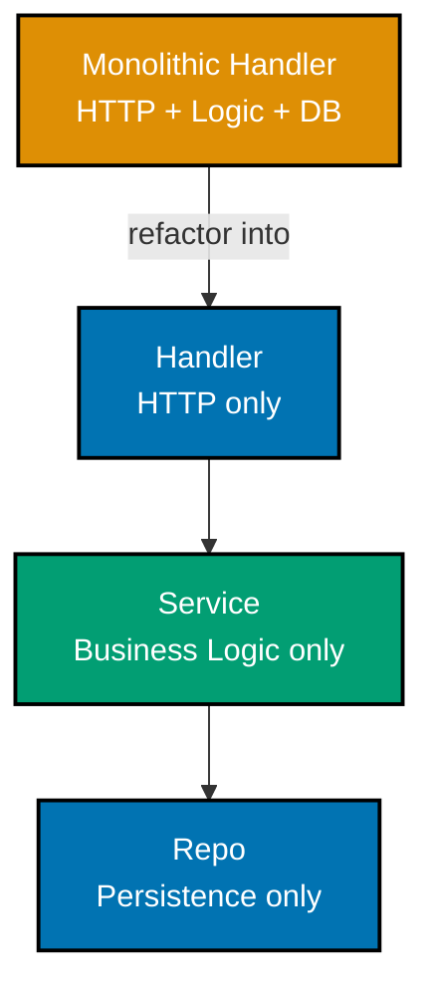

These 28 examples introduce the foundational architecture principles for the procedural track: separation of concerns, SOLID, dependency injection, coupling, DRY/KISS/YAGNI, MVC, encapsulation, and the repository pattern. All examples use the `procurement-platform-be` domain — purchasing context with `PurchaseOrder`, `Supplier`, and `Money` types. Go is canonical; Rust tabs appear where traits or `Result`/`Option` change how the pattern expresses.

## Section 1: Separation of Concerns

### Example 1: Monolithic Handler vs. Clear Separation

A monolithic handler does HTTP parsing, business logic, and database access in one function. When requirements change — a new validation rule, a different persistence store — every concern touches the same file, producing merge conflicts and fragile tests.







```go
// BEFORE: everything lives in one function — hard to test any concern in isolation.
// The HTTP layer, business rules, and SQL all touch the same variables.
func CreatePurchaseOrderHandler(w http.ResponseWriter, r *http.Request) {
    // Concern 1 — HTTP parsing: decode JSON from the request body.
    // Mixing this with business logic means a JSON format change requires touching
    // the same function that contains approval rules.
    var req struct {
        SupplierID string  `json:"supplier_id"`
        Amount     float64 `json:"amount"`
    }
    if err := json.NewDecoder(r.Body).Decode(&req); err != nil {
        // => HTTP 400 sent directly from a function that also writes to the DB.
        // => Any unit test of the approval rule must also set up an HTTP request.
        http.Error(w, "bad request", http.StatusBadRequest)
        return
    }

    // Concern 2 — business rule: orders over 10,000 require approval.
    // This rule is buried inside an HTTP handler; it cannot be tested without
    // spinning up an HTTP server and a real (or mocked) database connection.
    if req.Amount > 10_000 {
        // => Business rule check hard-wired into the HTTP layer.
        http.Error(w, "requires approval", http.StatusForbidden)
        return
    }

    // Concern 3 — persistence: write directly to Postgres.
    // Swapping to a different database (e.g. for staging) requires touching this
    // same function, risking breakage of the HTTP and business-rule concerns above.
    db, _ := sql.Open("postgres", os.Getenv("DATABASE_URL"))
    // => db connection created inside handler — no lifecycle management, no pooling.
    _, err := db.Exec(
        "INSERT INTO purchase_orders (supplier_id, amount) VALUES ($1, $2)",
        req.SupplierID, req.Amount,
    )
    if err != nil {
        // => Database error leaks through HTTP — concern boundary fully collapsed.
        http.Error(w, "db error", http.StatusInternalServerError)
        return
    }
    w.WriteHeader(http.StatusCreated)
    // => 201 Created, but only reachable by running all three concerns together.
}

// AFTER: three separate units, each testable in isolation.

// handler/purchase_order.go — Concern 1 only: HTTP parsing and response shaping.
// This struct depends on the service interface, not on any database package.
type PurchaseOrderHandler struct {
    svc PurchaseOrderService // => depends on interface, not a concrete Postgres struct
}

// ServeHTTP is the HTTP concern: decode, delegate, encode.
// No business rules live here; no SQL strings live here.
func (h *PurchaseOrderHandler) Create(w http.ResponseWriter, r *http.Request) {
    var cmd CreatePurchaseOrderCommand
    // => cmd is the request data transfer object — purely HTTP concern.
    if err := json.NewDecoder(r.Body).Decode(&cmd); err != nil {
        http.Error(w, "bad request", http.StatusBadRequest)
        return
    }
    // => Delegate to service — the handler does not know what happens next.
    if err := h.svc.CreatePurchaseOrder(r.Context(), cmd); err != nil {
        http.Error(w, err.Error(), http.StatusInternalServerError)
        return
    }
    w.WriteHeader(http.StatusCreated)
    // => 201 Created; handler has no knowledge of approval rules or SQL.
}
```





```rust
// BEFORE: one Axum handler function doing all three concerns simultaneously.
// Rust's type system does not prevent this; only discipline (or separation) does.
async fn create_purchase_order_handler(
    State(db): State<PgPool>, // => DB pool injected via Axum State extractor
    Json(req): Json<CreateRequest>, // => HTTP parsing via Axum extractor
) -> impl IntoResponse {
    // Concern 1 already handled by the function signature (Axum extractors).
    // Concern 2 — business rule wired directly into the HTTP layer:
    if req.amount > 10_000.0 {
        // => Business rule check inside the HTTP handler — not separately testable.
        return (StatusCode::FORBIDDEN, "requires approval").into_response();
    }
    // Concern 3 — SQL wired directly into the HTTP layer:
    let result = sqlx::query!(
        "INSERT INTO purchase_orders (supplier_id, amount) VALUES ($1, $2)",
        req.supplier_id,
        req.amount,
    )
    .execute(&db)
    .await;
    // => Both the approval rule and the SQL live in the same function scope.
    match result {
        Ok(_) => StatusCode::CREATED.into_response(),
        Err(_) => StatusCode::INTERNAL_SERVER_ERROR.into_response(),
    }
}

// AFTER: handler delegates to a service trait, no SQL in sight.
// The trait object (Box<dyn PurchaseOrderService>) is the separation boundary.
async fn create_purchase_order_handler_v2(
    State(svc): State<Arc<dyn PurchaseOrderService>>, // => trait object, not PgPool
    Json(cmd): Json<CreatePurchaseOrderCommand>,       // => DTO, not raw SQL params
) -> impl IntoResponse {
    // => Handler's only job: extract, delegate, respond.
    match svc.create_purchase_order(cmd).await {
        Ok(()) => StatusCode::CREATED.into_response(),
        Err(e) => (StatusCode::INTERNAL_SERVER_ERROR, e.to_string()).into_response(),
    }
    // => No business rules. No SQL. One reason to change: HTTP contract changes.
}
```





**Key takeaway:** Separating HTTP, business logic, and persistence into distinct units means each concern can change, be tested, and be reasoned about in isolation. The refactored Go handler has one reason to change: the HTTP contract changes.

**Why it matters:** In a production procurement service, the approval threshold changes every quarter, the database vendor changes once every few years, and the HTTP API changes on every major release. When all three concerns share the same function, a threshold change risks breaking the SQL layer; a database migration forces re-testing HTTP contract logic. Separation limits the blast radius of every change to the one layer it actually affects — reducing regression risk and shrinking pull requests.

---

### Example 2: Three-Layer Architecture

The handler/service/repo split is the canonical three-layer architecture in Go. Each layer imports only the layer directly below it via an interface — never skips a layer or imports horizontally.





```go
// internal/handler/purchase_order.go
// Layer 1 — HTTP layer. Imports only the service interface from Layer 2.
// Does NOT import the repo package or any database driver.
package handler

import (
    "encoding/json"         // => standard library only
    "net/http"              // => HTTP is this layer's only concern
    "procurement/internal/service" // => import only the layer directly below
)

// PurchaseOrderHandler holds the service dependency.
// The concrete service type (Postgres-backed, in-memory, etc.) is injected at startup.
type PurchaseOrderHandler struct {
    svc service.PurchaseOrderService // => interface, not *service.PostgresPurchaseOrderService
}

// NewPurchaseOrderHandler constructs the handler with its dependency.
// Go convention: constructor functions named New<Type> return a pointer.
func NewPurchaseOrderHandler(svc service.PurchaseOrderService) *PurchaseOrderHandler {
    return &PurchaseOrderHandler{svc: svc} // => svc stored as interface value
}

// internal/service/purchase_order.go
// Layer 2 — Business logic layer. Imports only the repo interface from Layer 3.
// Does NOT import net/http or any SQL driver.
package service

import (
    "context"
    "procurement/internal/repo" // => import only the layer directly below
)

// PurchaseOrderService is the business logic interface.
// Handlers depend on this interface, not on any concrete struct.
type PurchaseOrderService interface {
    // CreatePurchaseOrder validates and persists a new purchase order.
    // Returns error if validation fails or persistence is unavailable.
    CreatePurchaseOrder(ctx context.Context, cmd CreatePurchaseOrderCommand) error
}

// purchaseOrderService is the concrete implementation of PurchaseOrderService.
// Unexported so callers must depend on the interface, not the concrete type.
type purchaseOrderService struct {
    repo repo.PurchaseOrderRepository // => repo interface from Layer 3
}

// NewPurchaseOrderService constructs the service with its repo dependency.
func NewPurchaseOrderService(r repo.PurchaseOrderRepository) PurchaseOrderService {
    return &purchaseOrderService{repo: r} // => returns interface, hides concrete type
}

// internal/repo/purchase_order.go
// Layer 3 — Persistence layer. Imports database drivers and SQL.
// Does NOT import net/http or service-level business logic.
package repo

import "context"

// PurchaseOrderRepository is the persistence interface.
// Services depend on this interface; handlers never touch it directly.
type PurchaseOrderRepository interface {
    // Save persists a purchase order; returns error on failure.
    Save(ctx context.Context, po PurchaseOrder) error
    // FindByID retrieves a purchase order by primary key.
    FindByID(ctx context.Context, id string) (PurchaseOrder, error)
}
// => Import graph: handler → service → repo (strictly downward, never sideways).
```





```rust
// src/handler/purchase_order.rs
// Layer 1 — HTTP (Axum). Depends on service trait only.
// No sqlx, no diesel, no database type in scope.
use crate::service::PurchaseOrderService; // => only the service module boundary

pub struct PurchaseOrderHandler<S: PurchaseOrderService> {
    svc: S, // => generic over any PurchaseOrderService implementor
            // => Rust uses generics (monomorphisation) instead of Go's interface boxing
}

// src/service/purchase_order.rs
// Layer 2 — Business logic. Depends on repo trait only.
// No axum, no sqlx in scope here.
use crate::repo::PurchaseOrderRepository; // => only the repo module boundary
use async_trait::async_trait;

#[async_trait]
pub trait PurchaseOrderService: Send + Sync {
    // create_purchase_order is the service contract.
    // Returns Ok(()) on success, Err(AppError) on validation failure or persistence error.
    async fn create_purchase_order(
        &self,
        cmd: CreatePurchaseOrderCommand,
    ) -> Result<(), AppError>; // => Rust uses Result instead of Go's multi-return
}

// src/repo/purchase_order.rs
// Layer 3 — Persistence. Owns all sqlx/database concerns.
// No axum, no service-level types in scope here.
use async_trait::async_trait;

#[async_trait]
pub trait PurchaseOrderRepository: Send + Sync {
    // save persists a purchase order; returns Err on failure.
    async fn save(&self, po: PurchaseOrder) -> Result<(), DbError>;
    // find_by_id retrieves by primary key; returns None if not found.
    async fn find_by_id(&self, id: &str) -> Result<Option<PurchaseOrder>, DbError>;
    // => Result<Option<T>> is idiomatic Rust: Err = infrastructure failure, None = not found.
}
// => Module graph mirrors Go: handler → service → repo, enforced by Rust's module system.
```





**Key takeaway:** Each layer imports only the interface of the layer immediately below it. The import graph is a strict DAG; violating it (e.g. handler importing repo directly) is a design smell detectable with `go list`.

**Why it matters:** The three-layer boundary is the most common architecture decision in backend Go services. When a new engineer joins the team, the directory structure communicates where each type of code lives without any documentation. When the team decides to switch from PostgreSQL to a managed cloud database, only the repo package changes. The handler and service layers do not recompile. The rule "each layer depends only on the interface of the next layer" is enforced structurally in Go (by package paths) and in Rust (by module visibility).

---

### Example 3: Package Layout for Separation

Directory structure is architecture. In Go, the package layout enforces module boundaries by making cross-layer imports visible in `import` statements. In Rust, `mod.rs` files control visibility.





```go
// Canonical Go directory tree for a procurement service.
//
// procurement-platform-be/
// ├── cmd/
// │   └── api/
// │       └── main.go          // => wiring only: construct deps, start server
// ├── internal/
// │   ├── domain/              // => domain types: PurchaseOrder, Supplier, Money
// │   │   ├── purchase_order.go
// │   │   ├── supplier.go
// │   │   └── money.go
// │   ├── handler/             // => HTTP layer: one file per handler type
// │   │   └── purchase_order.go
// │   ├── service/             // => business logic: one file per service
// │   │   └── purchase_order.go
// │   └── repo/                // => persistence: one file per repository
// │       ├── purchase_order.go         // => interface
// │       └── postgres_purchase_order.go // => Postgres implementation
// └── go.mod

// internal/domain/purchase_order.go
// Domain types belong to their own package; they are imported by all layers.
// Having a separate domain package avoids import cycles.
package domain

// PurchaseOrder is the core domain aggregate.
// All three layers reference this type — it must not import handler, service, or repo.
type PurchaseOrder struct {
    ID         string  // => exported fields, accessible to all layers
    SupplierID string  // => the supplier this order is placed with
    Amount     Money   // => Money type prevents float64 arithmetic errors (see Example 15)
    Status     string  // => "draft", "pending_approval", "approved"
}

// One type per file convention keeps diffs small and git blame useful.
// A file named purchase_order.go contains exactly PurchaseOrder and its methods.
// => Convention, not enforced by the compiler; enforced by code review.

// cmd/api/main.go — wiring only.
// This is the composition root: the only place where concrete types appear together.
package main

import (
    "procurement/internal/handler"
    "procurement/internal/repo"
    "procurement/internal/service"
)

func main() {
    // => Construct the dependency graph bottom-up: repo → service → handler.
    r := repo.NewPostgresPurchaseOrderRepository(mustOpenDB())
    // => r implements repo.PurchaseOrderRepository — the concrete Postgres type.
    svc := service.NewPurchaseOrderService(r)
    // => svc implements service.PurchaseOrderService — business logic wired to Postgres repo.
    h := handler.NewPurchaseOrderHandler(svc)
    // => h is the HTTP handler, wired to the service, with no direct knowledge of Postgres.
    http.ListenAndServe(":8080", h)
    // => The entire wiring graph is in one place; swapping any layer is a one-line change here.
}
```





```rust
// Canonical Rust module tree for the same procurement service.
//
// src/
// ├── main.rs          // => composition root: Axum router + dependency wiring
// ├── domain/
// │   ├── mod.rs       // => re-exports domain types
// │   ├── purchase_order.rs
// │   ├── supplier.rs
// │   └── money.rs
// ├── handler/
// │   ├── mod.rs       // => re-exports handler types
// │   └── purchase_order.rs
// ├── service/
// │   ├── mod.rs       // => re-exports service traits + impls
// │   └── purchase_order.rs
// └── repo/
//     ├── mod.rs       // => re-exports repo traits + impls
//     ├── purchase_order.rs       // => trait definition
//     └── postgres_purchase_order.rs // => sqlx implementation

// domain/purchase_order.rs
// Domain types have no dependencies on axum, sqlx, or any framework crate.
// They are re-exported from domain/mod.rs with `pub use`.
pub struct PurchaseOrder {
    pub id: String,          // => pub: accessible to handler, service, repo
    pub supplier_id: String, // => the supplier reference (foreign key equivalent)
    pub amount: Money,       // => Money newtype — see Example 15
    pub status: String,      // => "draft" | "pending_approval" | "approved"
}

// src/main.rs — composition root.
// All concrete types appear here; everywhere else only traits are in scope.
#[tokio::main]
async fn main() {
    // => Build the dependency graph bottom-up: repo → service → handler.
    let pool = PgPool::connect(&std::env::var("DATABASE_URL").unwrap())
        .await
        .unwrap();
    // => pool is the only sqlx type that escapes the repo module.
    let repo = PostgresPurchaseOrderRepository::new(pool);
    // => repo implements PurchaseOrderRepository — Postgres-backed concrete type.
    let svc = PurchaseOrderServiceImpl::new(Arc::new(repo));
    // => svc implements PurchaseOrderService — business logic, no axum in scope.
    let app = Router::new()
        .route("/purchase-orders", post(create_purchase_order_handler))
        .with_state(Arc::new(svc) as Arc<dyn PurchaseOrderService>);
    // => Arc<dyn Trait> is the Rust equivalent of Go's interface value in handler.
    axum::Server::bind(&"0.0.0.0:8080".parse().unwrap())
        .serve(app.into_make_service())
        .await
        .unwrap();
}
```





**Key takeaway:** Directory structure is a first-class architecture decision. The package layout in Go (and module hierarchy in Rust) makes cross-layer dependencies visible at the import level, turning architecture violations into visible code smells.

**Why it matters:** A new engineer can navigate a well-structured procurement service in minutes because the directory names match the architecture diagram. In Go, running `go list -f '{{.Imports}}' ./internal/handler/...` immediately shows whether the handler imports any database package — a violation is visible without reading the code. Keeping the composition root in `cmd/api/main.go` means the rest of the codebase never needs to construct concrete types, which is how large teams maintain loose coupling without a dependency injection framework.

---

## Section 2: Single Responsibility Principle

### Example 4: SRP Violation

A struct that does HTTP parsing, business rule validation, and database writes has three reasons to change: the HTTP contract, the business rules, or the persistence schema. Any one of those changes forces modifications to the same struct.





```go
// SRP VIOLATION: PurchaseOrderService does three unrelated jobs.
// This struct has three reasons to change:
//   1. HTTP request format changes  → ParseRequest must change
//   2. Approval threshold changes   → Validate must change
//   3. Database schema changes      → Save must change
package service

import (
    "database/sql"
    "encoding/json"
    "net/http"
)

// PurchaseOrderService violates SRP by combining HTTP parsing,
// business logic, and database writes in one type.
type PurchaseOrderService struct {
    db *sql.DB // => direct database dependency inside "service" — smell
}

// ParseRequest is an HTTP concern: it reads net/http types.
// This method does not belong in a service; it belongs in a handler.
func (s *PurchaseOrderService) ParseRequest(r *http.Request) (CreateOrderRequest, error) {
    var req CreateOrderRequest
    // => json.NewDecoder requires net/http.Request — HTTP concern in service layer.
    err := json.NewDecoder(r.Body).Decode(&req)
    return req, err // => service now imports "net/http" — a layering violation
}

// Validate is a business rule concern.
// The business rule (amount > 10_000 requires approval) should live here,
// but it is entangled with the HTTP parsing method above in the same struct.
func (s *PurchaseOrderService) Validate(req CreateOrderRequest) error {
    if req.Amount <= 0 {
        return ErrNegativeAmount // => business invariant
    }
    if req.Amount > 10_000 {
        return ErrRequiresApproval // => approval policy — reason #2 to change
    }
    return nil
}

// Save is a persistence concern.
// It writes SQL directly — reason #3 to change (schema migrations).
func (s *PurchaseOrderService) Save(req CreateOrderRequest) error {
    _, err := s.db.Exec(
        // => SQL string hard-coded in the service — schema change forces service change.
        "INSERT INTO purchase_orders (supplier_id, amount) VALUES ($1, $2)",
        req.SupplierID, req.Amount,
    )
    return err
}

// => Three reasons to change: HTTP format, approval threshold, SQL schema.
// => Any unit test of Validate must also set up a *sql.DB and an *http.Request.
```





```rust
// SRP VIOLATION in Rust: one struct with three unrelated responsibilities.
// Rust's trait system makes the violation explicit — the struct implements
// no clean trait boundary because there is no clean responsibility boundary.
use axum::extract::Json;
use sqlx::PgPool;

pub struct PurchaseOrderService {
    db: PgPool, // => direct sqlx dependency — persistence concern leaked into service
}

impl PurchaseOrderService {
    // parse_request is an HTTP concern: it takes axum's Json extractor output.
    // The service now depends on axum — a framework the service layer should not know about.
    pub fn parse_request(&self, Json(req): Json<CreateRequest>) -> CreateOrderCommand {
        // => axum::extract::Json is an HTTP-layer type imported into the service.
        CreateOrderCommand {
            supplier_id: req.supplier_id,
            amount: req.amount,
        }
    }

    // validate is the business rule; it should be the only method here.
    // Instead it coexists with HTTP parsing and SQL execution.
    pub fn validate(&self, cmd: &CreateOrderCommand) -> Result<(), AppError> {
        if cmd.amount <= 0.0 {
            return Err(AppError::NegativeAmount); // => business invariant
        }
        if cmd.amount > 10_000.0 {
            return Err(AppError::RequiresApproval); // => approval policy — reason #2 to change
        }
        Ok(())
    }

    // save is a persistence concern: it runs SQL via sqlx.
    // Schema changes (adding a column) force changes to this same struct.
    pub async fn save(&self, cmd: &CreateOrderCommand) -> Result<(), sqlx::Error> {
        sqlx::query!(
            // => SQL literal in the service — schema migration = service code change.
            "INSERT INTO purchase_orders (supplier_id, amount) VALUES ($1, $2)",
            cmd.supplier_id,
            cmd.amount,
        )
        .execute(&self.db)
        .await?;
        Ok(())
    }
    // => Three reasons to change: axum request format, approval amount, SQL schema.
}
```





**Key takeaway:** A type with multiple reasons to change is fragile because unrelated changes collide in the same code. SRP says each type should have exactly one reason to change.

**Why it matters:** In a real procurement service, the approval threshold changes on a business decision (finance team), the HTTP request schema changes on a frontend API update (product team), and the database schema changes on a migration (platform team). When all three concerns share one struct, a finance-team approval-threshold change and a platform-team migration land on the same file, producing merge conflicts and forcing cross-team coordination for every small change.

---

### Example 5: SRP Fix

Split `PurchaseOrderService` into three types: `PurchaseOrderHandler` (HTTP), `PurchaseOrderService` (business logic), `PurchaseOrderRepository` (persistence). Each type now has exactly one reason to change.





```go
// SRP FIX: three types, three reasons to change, clearly separated.

// internal/handler/purchase_order.go
// Reason to change: HTTP contract changes (new fields, different status codes).
package handler

// PurchaseOrderHandler owns all net/http imports.
// It has one job: decode HTTP request → call service → encode HTTP response.
type PurchaseOrderHandler struct {
    svc service.PurchaseOrderService // => depends on interface, never on concrete struct
}

// Create decodes the request, calls the service, and writes the response.
// No SQL, no business rules — only HTTP shaping.
func (h *PurchaseOrderHandler) Create(w http.ResponseWriter, r *http.Request) {
    var cmd service.CreatePurchaseOrderCommand
    if err := json.NewDecoder(r.Body).Decode(&cmd); err != nil {
        // => HTTP concern: translate decoding error to HTTP 400
        http.Error(w, "bad request", http.StatusBadRequest)
        return
    }
    if err := h.svc.CreatePurchaseOrder(r.Context(), cmd); err != nil {
        // => Translate service error to HTTP status — no business logic here.
        http.Error(w, err.Error(), http.StatusUnprocessableEntity)
        return
    }
    w.WriteHeader(http.StatusCreated)
    // => Reason to change: HTTP contract (status codes, request/response shape).
}

// internal/service/purchase_order.go
// Reason to change: business rules change (approval threshold, validation rules).
package service

// purchaseOrderService owns all business rule logic.
// It has one job: validate commands and coordinate repo calls.
type purchaseOrderService struct {
    repo repo.PurchaseOrderRepository // => depends on repo interface
}

// CreatePurchaseOrder applies business rules and delegates to the repo.
// No net/http types in scope; no SQL strings.
func (s *purchaseOrderService) CreatePurchaseOrder(
    ctx context.Context, cmd CreatePurchaseOrderCommand,
) error {
    if cmd.Amount <= 0 {
        return ErrInvalidAmount // => business invariant, not an HTTP code
    }
    if cmd.Amount > 10_000 {
        return ErrRequiresApproval // => business rule — only reason this file changes
    }
    return s.repo.Save(ctx, toDomain(cmd))
    // => Reason to change: business rules (approval threshold, new validation).
}

// internal/repo/purchase_order.go
// Reason to change: persistence details change (schema migration, new DB vendor).
package repo

// PostgresPurchaseOrderRepository is the Postgres implementation of the repo interface.
// It has one job: translate domain types to SQL and back.
type PostgresPurchaseOrderRepository struct {
    db *sql.DB // => database is this layer's concern; nothing else uses it
}

// Save persists a purchase order.
// No business rules; no HTTP status codes.
func (r *PostgresPurchaseOrderRepository) Save(
    ctx context.Context, po domain.PurchaseOrder,
) error {
    _, err := r.db.ExecContext(ctx,
        "INSERT INTO purchase_orders (id, supplier_id, amount, status) VALUES ($1,$2,$3,$4)",
        po.ID, po.SupplierID, po.Amount.Value, po.Status,
    )
    return err
    // => Reason to change: SQL schema (column rename, new table structure).
}
```





```rust
// SRP FIX in Rust: three trait-bounded types, each with one reason to change.

// src/handler/purchase_order.rs
// Reason to change: HTTP contract (Axum extractor shape, response codes).
pub async fn create_purchase_order_handler<S: PurchaseOrderService>(
    State(svc): State<Arc<S>>,           // => service injected via Axum State
    Json(cmd): Json<CreatePurchaseOrderCommand>, // => Axum deserialises the body
) -> impl IntoResponse {
    // Handler's only job: call service, map result to HTTP response.
    match svc.create_purchase_order(cmd).await {
        Ok(()) => StatusCode::CREATED.into_response(),
        Err(e) => (StatusCode::UNPROCESSABLE_ENTITY, e.to_string()).into_response(),
    }
    // => No business rules, no SQL. Reason to change: HTTP contract.
}

// src/service/purchase_order.rs
// Reason to change: business rules (approval threshold, new invariants).
pub struct PurchaseOrderServiceImpl<R: PurchaseOrderRepository> {
    repo: R, // => generic over any repository implementor
             // => no axum, no sqlx imported in this file
}

impl<R: PurchaseOrderRepository> PurchaseOrderService for PurchaseOrderServiceImpl<R> {
    async fn create_purchase_order(
        &self,
        cmd: CreatePurchaseOrderCommand,
    ) -> Result<(), AppError> {
        // Business rules only — no HTTP, no SQL.
        if cmd.amount <= 0.0 {
            return Err(AppError::InvalidAmount); // => invariant
        }
        if cmd.amount > 10_000.0 {
            return Err(AppError::RequiresApproval); // => approval policy
        }
        self.repo.save(cmd.into()).await.map_err(AppError::from)
        // => Reason to change: business rules only.
    }
}

// src/repo/postgres_purchase_order.rs
// Reason to change: SQL schema or database vendor.
pub struct PostgresPurchaseOrderRepository {
    pool: PgPool, // => sqlx pool is this layer's only concern
}

impl PurchaseOrderRepository for PostgresPurchaseOrderRepository {
    async fn save(&self, po: PurchaseOrder) -> Result<(), DbError> {
        sqlx::query!(
            "INSERT INTO purchase_orders (id, supplier_id, amount, status) VALUES ($1,$2,$3,$4)",
            po.id, po.supplier_id, po.amount.value, po.status,
        )
        .execute(&self.pool)
        .await?;
        Ok(())
        // => Reason to change: SQL schema only.
    }
}
```





**Key takeaway:** When a type has exactly one reason to change, the blast radius of any change is bounded to that type. The three-layer split is the SRP applied to a typical backend service.

**Why it matters:** A procurement team of five engineers can work in parallel across all three layers because no two features owned by different engineers touch the same struct. SRP is not an abstract principle — it is the structural pre-condition for parallel feature development without constant merge conflicts.

---

## Section 3: Open/Closed Principle

### Example 6: OCP with Go Interfaces

The Open/Closed Principle says software entities should be open for extension but closed for modification. In Go, this is achieved through interfaces: adding a new `TaxCalculator` implementation extends behaviour without modifying existing code.





```go
// internal/service/tax.go

// TaxCalculator is the OCP boundary: open for extension (new implementations),
// closed for modification (existing code never changes to accommodate new types).
type TaxCalculator interface {
    // Calculate returns the tax amount for a given Money value.
    // Any type with this method satisfies the interface — structural typing.
    Calculate(amount Money) Money
}

// StandardTaxCalculator implements TaxCalculator for the standard 11% VAT rate.
// This type is complete and closed; adding Sharia tax never touches this file.
type StandardTaxCalculator struct {
    Rate float64 // => e.g. 0.11 for 11% standard VAT
}

func (c StandardTaxCalculator) Calculate(amount Money) Money {
    // => Multiply the gross amount by the tax rate.
    // => e.g. Calculate(Money{1000, "IDR"}) => Money{110, "IDR"}
    return Money{
        Value:    amount.Value * c.Rate,
        Currency: amount.Currency,
    }
}

// ShariaTaxCalculator is a NEW implementation added without modifying any existing code.
// It satisfies TaxCalculator by having the same method signature — Go's structural typing.
// OCP: we extended the system (new file, new type) without modifying TaxCalculator or StandardTaxCalculator.
type ShariaTaxCalculator struct {
    ZakatRate float64 // => e.g. 0.025 for 2.5% zakat on procurement items
}

func (c ShariaTaxCalculator) Calculate(amount Money) Money {
    // => Sharia-compliant tax: zakat at 2.5% of the goods value.
    // => Calculate(Money{1000, "IDR"}) => Money{25, "IDR"}
    return Money{
        Value:    amount.Value * c.ZakatRate,
        Currency: amount.Currency,
    }
}

// PurchaseOrderService uses TaxCalculator by interface, never by concrete type.
// Adding ShariaTaxCalculator required zero changes to this service.
type purchaseOrderService struct {
    repo repo.PurchaseOrderRepository
    tax  TaxCalculator // => interface field: any TaxCalculator works here
}

// CalculateTax delegates to whatever TaxCalculator was injected at construction.
// The service is closed for modification: it never needs a type switch on calculator types.
func (s *purchaseOrderService) CalculateTax(amount Money) Money {
    return s.tax.Calculate(amount)
    // => Works identically for StandardTaxCalculator and ShariaTaxCalculator.
    // => Adding a ThirdPartyTaxCalculator: create new type in new file, zero changes here.
}
```





```rust
// src/service/tax.rs

// TaxCalculator trait is the OCP boundary in Rust.
// Trait definitions are open for new implementors; existing impls never change.
pub trait TaxCalculator: Send + Sync {
    // calculate returns the tax Money for a given gross amount.
    fn calculate(&self, amount: Money) -> Money;
    // => Send + Sync required so the trait object can be used in async Axum handlers.
}

// StandardTaxCalculator: existing code, never modified when adding new calculators.
pub struct StandardTaxCalculator {
    pub rate: f64, // => e.g. 0.11 for 11% standard VAT
}

impl TaxCalculator for StandardTaxCalculator {
    fn calculate(&self, amount: Money) -> Money {
        // => amount.value * rate gives the tax amount.
        // => calculate(Money { value: 1000.0, currency: "IDR".into() }) => Money { value: 110.0, ... }
        Money {
            value: amount.value * self.rate,
            currency: amount.currency,
        }
    }
}

// ShariaTaxCalculator: NEW implementation in a NEW file — no modification to existing code.
// Rust's `impl Trait for Type` is decoupled from the type definition,
// making it natural to add implementations in new modules without touching existing ones.
pub struct ShariaTaxCalculator {
    pub zakat_rate: f64, // => e.g. 0.025 for 2.5% zakat
}

impl TaxCalculator for ShariaTaxCalculator {
    fn calculate(&self, amount: Money) -> Money {
        // => Zakat-based tax: 2.5% of the procurement item value.
        // => calculate(Money { value: 1000.0, currency: "IDR".into() }) => Money { value: 25.0, ... }
        Money {
            value: amount.value * self.zakat_rate,
            currency: amount.currency,
        }
    }
}

// PurchaseOrderService stores the tax calculator as a boxed trait object.
// Box<dyn TaxCalculator> accepts any implementor — OCP at the composition root.
pub struct PurchaseOrderServiceImpl {
    repo: Arc<dyn PurchaseOrderRepository>,
    tax: Box<dyn TaxCalculator>, // => trait object: open for new implementors
}
// => Adding a new TaxCalculator never changes PurchaseOrderServiceImpl.
```





**Key takeaway:** Depend on interfaces (Go) or traits (Rust), not on concrete types. New behaviour is added by creating new implementors — no existing file is modified.

**Why it matters:** Procurement systems in markets with Islamic finance regulations often need to switch between standard VAT and zakat-based tax calculations. With OCP, the switch is a one-line change at the composition root (`main.go`): pass `ShariaTaxCalculator` instead of `StandardTaxCalculator`. Without OCP, the switch requires modifying the service's business logic code, risking regression in the standard tax path and requiring regression tests for previously-passing scenarios.

---

### Example 7: OCP Violation — Type Switching Instead of Interfaces

A common OCP violation is a function that switches on a type string to dispatch to different behaviours. Each new type requires modifying the switch statement, violating "closed for modification."





```go
// OCP VIOLATION: CalculateTax switches on a string to decide which algorithm to use.
// Every new tax type requires modifying this function — it is NOT closed for modification.
func CalculateTaxViolation(amount Money, taxType string) Money {
    switch taxType {
    case "standard":
        // => Standard 11% VAT — hardcoded here.
        return Money{Value: amount.Value * 0.11, Currency: amount.Currency}
    case "sharia":
        // => Sharia 2.5% zakat — added by modifying this function.
        // => Adding "sharia" required changing CalculateTaxViolation — OCP violation.
        return Money{Value: amount.Value * 0.025, Currency: amount.Currency}
    case "export":
        // => Export: 0% VAT for cross-border procurement.
        // => Every new case is a modification to existing code — regression risk grows.
        return Money{Value: 0, Currency: amount.Currency}
    default:
        // => Unknown type: silent zero return is a dangerous default.
        return Money{Value: 0, Currency: amount.Currency}
    }
    // => Problem 1: Adding "municipal" tax requires modifying this function.
    // => Problem 2: Tests for "standard" must be re-run after every new case is added.
    // => Problem 3: The switch statement grows unbounded as the system expands.
}

// OCP COMPLIANT: same logic expressed through the TaxCalculator interface (Example 6).
// Adding "municipal" tax: create MunicipalTaxCalculator in a new file.
// This function never changes regardless of how many tax types are added.
func CalculateTaxCompliant(amount Money, calc TaxCalculator) Money {
    return calc.Calculate(amount)
    // => One line. Never modified. Open for extension via new TaxCalculator implementors.
}
```





```rust
// OCP VIOLATION in Rust: match on a TaxType enum requires modifying the match arm
// every time a new tax variant is introduced.
pub enum TaxType {
    Standard,
    Sharia,
    Export,
    // => Adding Municipal here forces a change to every match in the codebase.
}

pub fn calculate_tax_violation(amount: Money, tax_type: TaxType) -> Money {
    match tax_type {
        TaxType::Standard => {
            // => 11% standard VAT — hardcoded match arm.
            Money { value: amount.value * 0.11, currency: amount.currency }
        }
        TaxType::Sharia => {
            // => 2.5% zakat — added by modifying this match block.
            Money { value: amount.value * 0.025, currency: amount.currency }
        }
        TaxType::Export => {
            // => 0% export rate — each variant is a modification to existing code.
            Money { value: 0.0, currency: amount.currency }
        }
        // => A compiler error fires here when Municipal is added to TaxType —
        // => useful exhaustiveness checking, but it forces modification of this function.
    }
}

// OCP COMPLIANT: trait dispatch requires zero changes to calculate_tax_compliant
// regardless of how many TaxCalculator implementors are added.
pub fn calculate_tax_compliant(amount: Money, calc: &dyn TaxCalculator) -> Money {
    calc.calculate(amount)
    // => Trait dispatch: runtime dispatch to whichever implementor was injected.
    // => Adding MunicipalTaxCalculator: new struct + impl TaxCalculator — this fn unchanged.
}
// => Note: Rust enums with exhaustive match ARE sometimes the right tool
// (closed set of variants, exhaustiveness is desired). The OCP violation occurs
// when the enum is meant to be an open extension point but is used as a closed match.
```





**Key takeaway:** Type-switching on a string or enum to dispatch behaviour is an OCP violation when the set of types is expected to grow. Replace with an interface/trait and dispatch through it.

**Why it matters:** A switch statement that started with two cases grows to ten over three years. Each new case is a merge to the same function, each carry regression risk for the existing cases, and each requires the full test suite for that function to run again. The interface pattern isolates each tax algorithm in its own file and test file — a new tax type adds one file without touching any existing tests.

---

## Section 4: Liskov Substitution and Interface Segregation

### Example 8: Liskov Substitution Principle in Go

The Liskov Substitution Principle (LSP) states that any implementation of an interface must be substitutable for any other without breaking the caller. In Go, this is natural: any type satisfying the `PurchaseOrderRepository` interface can replace any other.





```go
// internal/repo/purchase_order.go

// PurchaseOrderRepository is the interface contract that all implementations must honour.
// LSP: any implementation must behave correctly for all callers of this interface.
type PurchaseOrderRepository interface {
    Save(ctx context.Context, po domain.PurchaseOrder) error
    FindByID(ctx context.Context, id string) (domain.PurchaseOrder, error)
}

// PostgresPurchaseOrderRepository satisfies PurchaseOrderRepository with a real Postgres backend.
// Used in production — injected at startup in main.go.
type PostgresPurchaseOrderRepository struct {
    db *sql.DB // => real database connection
}

func (r *PostgresPurchaseOrderRepository) Save(ctx context.Context, po domain.PurchaseOrder) error {
    _, err := r.db.ExecContext(ctx,
        "INSERT INTO purchase_orders (id, supplier_id, amount, status) VALUES ($1,$2,$3,$4)",
        po.ID, po.SupplierID, po.Amount.Value, po.Status,
    )
    return err // => returns nil on success, error on failure — same contract as InMemory below
}

func (r *PostgresPurchaseOrderRepository) FindByID(
    ctx context.Context, id string,
) (domain.PurchaseOrder, error) {
    var po domain.PurchaseOrder
    row := r.db.QueryRowContext(ctx,
        "SELECT id, supplier_id, amount, status FROM purchase_orders WHERE id = $1", id,
    )
    err := row.Scan(&po.ID, &po.SupplierID, &po.Amount.Value, &po.Status)
    return po, err // => same return types as InMemoryPurchaseOrderRepository.FindByID
}

// InMemoryPurchaseOrderRepository is the test double — satisfies the same interface.
// LSP: services using PurchaseOrderRepository work identically with either implementation.
type InMemoryPurchaseOrderRepository struct {
    mu    sync.Mutex
    store map[string]domain.PurchaseOrder // => simple map, no database required
}

func NewInMemoryPurchaseOrderRepository() *InMemoryPurchaseOrderRepository {
    return &InMemoryPurchaseOrderRepository{store: make(map[string]domain.PurchaseOrder)}
    // => InMemory repo is constructed without a *sql.DB — no test database needed.
}

func (r *InMemoryPurchaseOrderRepository) Save(
    ctx context.Context, po domain.PurchaseOrder,
) error {
    r.mu.Lock()
    defer r.mu.Unlock()
    r.store[po.ID] = po // => write to map instead of Postgres
    return nil          // => same contract: nil on success
}

func (r *InMemoryPurchaseOrderRepository) FindByID(
    ctx context.Context, id string,
) (domain.PurchaseOrder, error) {
    r.mu.Lock()
    defer r.mu.Unlock()
    po, ok := r.store[id]
    if !ok {
        return domain.PurchaseOrder{}, ErrNotFound // => same contract: error when not found
    }
    return po, nil
}

// TestCreatePurchaseOrder demonstrates substitution: the service works with InMemory repo.
func TestCreatePurchaseOrder(t *testing.T) {
    repo := NewInMemoryPurchaseOrderRepository()
    // => InMemoryPurchaseOrderRepository substitutes for PostgresPurchaseOrderRepository.
    // => LSP: substitution does not break the service's behaviour.
    svc := service.NewPurchaseOrderService(repo)
    cmd := service.CreatePurchaseOrderCommand{SupplierID: "s-1", Amount: 500}
    err := svc.CreatePurchaseOrder(context.Background(), cmd)
    // => The service behaves correctly — the test double satisfies the contract.
    if err != nil {
        t.Fatalf("expected nil error, got %v", err)
    }
}
```





```rust
// src/repo/purchase_order.rs

// PurchaseOrderRepository trait defines the contract all implementors must honour.
// LSP: any impl of this trait must be substitutable for any other.
#[async_trait]
pub trait PurchaseOrderRepository: Send + Sync {
    async fn save(&self, po: PurchaseOrder) -> Result<(), DbError>;
    async fn find_by_id(&self, id: &str) -> Result<Option<PurchaseOrder>, DbError>;
    // => Result<Option<T>>: Err = infrastructure failure, None = not found.
    // => Both implementations must honour this exact semantics (LSP).
}

// InMemoryPurchaseOrderRepository: test double implementing the same trait.
// Substitution is enforced by the compiler — impl must match the trait signature exactly.
pub struct InMemoryPurchaseOrderRepository {
    store: Mutex<HashMap<String, PurchaseOrder>>, // => thread-safe map, no database
}

impl InMemoryPurchaseOrderRepository {
    pub fn new() -> Self {
        Self {
            store: Mutex::new(HashMap::new()), // => empty store, no connection string needed
        }
    }
}

#[async_trait]
impl PurchaseOrderRepository for InMemoryPurchaseOrderRepository {
    async fn save(&self, po: PurchaseOrder) -> Result<(), DbError> {
        let mut store = self.store.lock().unwrap();
        store.insert(po.id.clone(), po); // => write to HashMap instead of Postgres
        Ok(())                           // => same contract: Ok(()) on success
    }

    async fn find_by_id(&self, id: &str) -> Result<Option<PurchaseOrder>, DbError> {
        let store = self.store.lock().unwrap();
        Ok(store.get(id).cloned()) // => None if not found — same semantics as Postgres impl
        // => Rust enforces this substitutability at compile time via trait bounds.
    }
}
// => The service is generic over R: PurchaseOrderRepository — it accepts either impl.
// => Tests use InMemoryPurchaseOrderRepository; production uses PostgresPurchaseOrderRepository.
```





**Key takeaway:** LSP is satisfied when every implementation of an interface (or trait) honours the same contract: same return types, same error semantics, same preconditions and postconditions. In Go, this is structural; in Rust, the compiler enforces signature agreement.

**Why it matters:** The in-memory repository makes unit tests for business logic fast (no database) and deterministic (no network). LSP guarantees that the same tests that pass with the in-memory repository will also pass with the Postgres repository — because both honour the same contract. Teams that violate LSP (e.g. the in-memory version returns empty errors where Postgres returns real errors) discover it only in production integration tests, not in unit tests.

---

### Example 9: Interface Segregation Principle — Splitting a Fat Interface

ISP states that clients should not be forced to depend on interfaces they do not use. A fat `PurchaseOrderRepository` with a dozen methods forces every dependent to implement all methods — even if it only needs two. Split it into `PurchaseOrderReader` and `PurchaseOrderWriter`.





```go
// ISP VIOLATION: one fat interface with all repository methods.
// A read-only reporting service is forced to implement Save and Delete
// even though it never calls them.
type FatPurchaseOrderRepository interface {
    Save(ctx context.Context, po domain.PurchaseOrder) error
    FindByID(ctx context.Context, id string) (domain.PurchaseOrder, error)
    FindByStatus(ctx context.Context, status string) ([]domain.PurchaseOrder, error)
    FindByApprover(ctx context.Context, approverID string) ([]domain.PurchaseOrder, error)
    Delete(ctx context.Context, id string) error
    Update(ctx context.Context, po domain.PurchaseOrder) error
    // => A read-only reporting mock must stub all six methods even if it only reads.
}

// ISP FIX: two focused interfaces.

// PurchaseOrderReader contains only read methods.
// A reporting service or approval viewer only depends on this interface.
type PurchaseOrderReader interface {
    // FindByID retrieves a single purchase order by primary key.
    FindByID(ctx context.Context, id string) (domain.PurchaseOrder, error)
    // FindByStatus returns all orders with the given status.
    FindByStatus(ctx context.Context, status string) ([]domain.PurchaseOrder, error)
    // FindByApprover returns all orders awaiting a given approver's action.
    FindByApprover(ctx context.Context, approverID string) ([]domain.PurchaseOrder, error)
}

// PurchaseOrderWriter contains only write methods.
// A creation or cancellation service only depends on this interface.
type PurchaseOrderWriter interface {
    // Save persists a new purchase order.
    Save(ctx context.Context, po domain.PurchaseOrder) error
    // Update replaces a purchase order's mutable fields.
    Update(ctx context.Context, po domain.PurchaseOrder) error
    // Delete removes a purchase order by ID.
    Delete(ctx context.Context, id string) error
}

// ApprovalService depends only on PurchaseOrderReader — it never writes.
// ISP: it does not need to know that Save or Delete exist.
type ApprovalService struct {
    reader PurchaseOrderReader // => only the read interface, not the full fat interface
}

// IssuanceService depends only on PurchaseOrderWriter — it never queries.
type IssuanceService struct {
    writer PurchaseOrderWriter // => only the write interface
}

// PostgresPurchaseOrderRepository can satisfy BOTH interfaces simultaneously.
// Go's structural typing: a type satisfies all interfaces whose methods it has.
// Compose a full-access client from both interfaces at the call site that needs both.
type FullPurchaseOrderRepository interface {
    PurchaseOrderReader // => embed reader interface
    PurchaseOrderWriter // => embed writer interface
}
// => PostgresPurchaseOrderRepository implements FullPurchaseOrderRepository
// => without any declaration — structural typing handles it automatically.
```





```rust
// ISP FIX in Rust: two focused traits instead of one fat trait.

// PurchaseOrderReader: read-only contract.
// Reporting services and approval viewers depend only on this trait.
#[async_trait]
pub trait PurchaseOrderReader: Send + Sync {
    async fn find_by_id(&self, id: &str) -> Result<Option<PurchaseOrder>, DbError>;
    async fn find_by_status(&self, status: &str) -> Result<Vec<PurchaseOrder>, DbError>;
    async fn find_by_approver(&self, approver_id: &str) -> Result<Vec<PurchaseOrder>, DbError>;
    // => Three methods: a read-only mock only needs to implement these three.
}

// PurchaseOrderWriter: write-only contract.
// Issuance and cancellation services depend only on this trait.
#[async_trait]
pub trait PurchaseOrderWriter: Send + Sync {
    async fn save(&self, po: PurchaseOrder) -> Result<(), DbError>;
    async fn update(&self, po: PurchaseOrder) -> Result<(), DbError>;
    async fn delete(&self, id: &str) -> Result<(), DbError>;
    // => Three methods: a write-only mock only needs to implement these three.
}

// PurchaseOrderStore combines both traits for callers that need full access.
// Rust trait composition via supertrait bounds.
pub trait PurchaseOrderStore: PurchaseOrderReader + PurchaseOrderWriter {}

// Blanket impl: any type that implements both traits automatically implements Store.
impl<T: PurchaseOrderReader + PurchaseOrderWriter> PurchaseOrderStore for T {}
// => PostgresPurchaseOrderRepository implements both traits → automatically implements Store.
// => ApprovalService uses Arc<dyn PurchaseOrderReader> — no write methods in scope.
// => IssuanceService uses Arc<dyn PurchaseOrderWriter> — no read methods in scope.
```





**Key takeaway:** Split interfaces at the boundary of what each client actually uses. Small, focused interfaces reduce coupling and make test doubles smaller and easier to maintain.

**Why it matters:** A fat repository interface with twelve methods requires every test double to implement all twelve — even when the test only exercises two. In a team of ten engineers with fifty service unit tests, fat interfaces multiply boilerplate. ISP reduces each test double to only the methods the service under test actually calls, making tests faster to write and easier to read.

---

### Example 10: ISP — One-Method Interfaces and the Validator Pattern

Go's `fmt.Stringer` (one method: `String() string`) is the canonical example of a minimal interface. The same pattern produces a `Validator` interface for procurement domain objects — any type with `Validate() error` satisfies it automatically.





```go
// fmt.Stringer is Go's canonical one-method interface.
// Any type with String() string is printable by fmt.Fprintf and friends.
// This is structural typing in action: no declaration needed.
type Stringer interface {
    String() string
}

// PurchaseOrder satisfies fmt.Stringer automatically by implementing String().
// No "implements Stringer" declaration — Go's structural typing handles it.
func (po PurchaseOrder) String() string {
    // => Returns a human-readable representation for logging and debugging.
    return fmt.Sprintf("PurchaseOrder{ID:%s Supplier:%s Amount:%s Status:%s}",
        po.ID, po.SupplierID, po.Amount, po.Status)
    // => po.Amount uses Money.String() below — Stringer is composable.
}

// Money also satisfies fmt.Stringer independently.
func (m Money) String() string {
    return fmt.Sprintf("%s %.2f", m.Currency, m.Value)
    // => "IDR 1500.00" — used by PurchaseOrder.String() above.
}

// Validator is the procurement-domain equivalent: a one-method interface
// that any domain object can satisfy independently.
type Validator interface {
    // Validate returns nil if the value is valid, or a descriptive error.
    Validate() error
}

// PurchaseOrder satisfies Validator by implementing Validate().
func (po PurchaseOrder) Validate() error {
    if po.SupplierID == "" {
        return errors.New("supplier_id is required") // => missing required field
    }
    if po.Amount.Value <= 0 {
        return errors.New("amount must be positive") // => negative amount invariant
    }
    return nil // => valid: all invariants satisfied
}

// ValidateAll validates a slice of any type satisfying Validator.
// ISP: this function only requires Validate() — it does not need String() or Save().
func ValidateAll(items []Validator) []error {
    var errs []error
    for _, item := range items {
        // => Each item only needs to satisfy Validate() — minimal interface dependency.
        if err := item.Validate(); err != nil {
            errs = append(errs, err)
        }
    }
    return errs
    // => PurchaseOrder, Supplier, LineItem all satisfy Validator independently.
    // => ValidateAll works with all of them — one method, maximum reuse.
}
```





```rust
// Rust's equivalent of fmt.Stringer is the std::fmt::Display trait.
// Implementing Display makes a type usable with format!(), println!(), and friends.
use std::fmt;

// PurchaseOrder implements Display — the Stringer equivalent.
impl fmt::Display for PurchaseOrder {
    fn fmt(&self, f: &mut fmt::Formatter<'_>) -> fmt::Result {
        // => write! formats the struct into the formatter — standard Rust idiom.
        write!(
            f,
            "PurchaseOrder{{id:{} supplier:{} amount:{} status:{}}}",
            self.id, self.supplier_id, self.amount, self.status
        )
        // => self.amount uses Money's Display impl below.
    }
}

impl fmt::Display for Money {
    fn fmt(&self, f: &mut fmt::Formatter<'_>) -> fmt::Result {
        write!(f, "{} {:.2}", self.currency, self.value)
        // => "IDR 1500.00" — composable with PurchaseOrder's Display.
    }
}

// Validate trait: the procurement-domain one-method interface.
pub trait Validate {
    // validate returns Ok(()) if the value is valid, Err with description otherwise.
    fn validate(&self) -> Result<(), ValidationError>;
}

impl Validate for PurchaseOrder {
    fn validate(&self) -> Result<(), ValidationError> {
        if self.supplier_id.is_empty() {
            return Err(ValidationError::new("supplier_id is required")); // => missing field
        }
        if self.amount.value <= 0.0 {
            return Err(ValidationError::new("amount must be positive")); // => invariant
        }
        Ok(()) // => all invariants satisfied
    }
}

// validate_all is generic over T: Validate — accepts any type with validate().
// ISP: only requires validate(), nothing else.
pub fn validate_all<T: Validate>(items: &[T]) -> Vec<ValidationError> {
    items
        .iter()
        .filter_map(|item| item.validate().err()) // => collect only the errors
        .collect()
    // => Works with PurchaseOrder, Supplier, LineItem — any T that implements Validate.
}
```





**Key takeaway:** Single-method interfaces (Go) and single-method traits (Rust) are the most reusable kind: any type satisfying the one method gains access to all utilities built on that interface, enabling maximum composition with minimum coupling.

**Why it matters:** The procurement service validates purchase orders, suppliers, and line items before persisting them. If `ValidateAll` depended on a fat interface, each domain type would need to implement methods it doesn't use. The single-method `Validator`/`Validate` interface means the validation utility works with any future domain type by adding one `Validate() error` method — no changes to the utility, no changes to the interface.

---

## Section 5: Dependency Injection

### Example 11: Constructor Injection

Constructor injection passes dependencies at object creation time. The constructed type depends on the interface, not the concrete implementation — enabling test doubles and multiple implementations.





```go
// internal/service/purchase_order.go

// Clock is an interface for time retrieval — injectable for deterministic tests.
// Without Clock, time.Now() is called directly inside business logic,
// making tests that assert on timestamps flaky and time-dependent.
type Clock interface {
    // Now returns the current time. In production: time.Now(). In tests: fixed time.
    Now() time.Time
}

// PurchaseOrderService interface declares the service contract.
type PurchaseOrderService interface {
    CreatePurchaseOrder(ctx context.Context, cmd CreatePurchaseOrderCommand) error
}

// purchaseOrderService is the concrete implementation.
// All dependencies are declared as interface types — no concrete types in the struct.
type purchaseOrderService struct {
    repo  repo.PurchaseOrderRepository // => persistence interface
    clock Clock                        // => time interface, not time.Time directly
}

// NewPurchaseOrderService is the constructor: dependencies are injected here.
// Go convention: constructor returns the interface type, hiding the concrete struct.
// This forces callers to depend on the interface, not on *purchaseOrderService.
func NewPurchaseOrderService(
    repo repo.PurchaseOrderRepository, // => injected: any PurchaseOrderRepository
    clock Clock,                       // => injected: any Clock (real or test fake)
) PurchaseOrderService {
    // => return interface, not *purchaseOrderService — callers cannot bypass the interface.
    return &purchaseOrderService{repo: repo, clock: clock}
}

// CreatePurchaseOrder uses the injected clock — never calls time.Now() directly.
func (s *purchaseOrderService) CreatePurchaseOrder(
    ctx context.Context, cmd CreatePurchaseOrderCommand,
) error {
    po := domain.PurchaseOrder{
        ID:         newUUID(),
        SupplierID: cmd.SupplierID,
        Amount:     cmd.Amount,
        Status:     "draft",
        CreatedAt:  s.clock.Now(), // => injected clock — deterministic in tests
    }
    return s.repo.Save(ctx, po)
    // => Both dependencies are injected — no global state, no time.Now() call.
}

// realClock implements Clock with time.Now() — used in production.
type realClock struct{}
func (realClock) Now() time.Time { return time.Now() }

// fixedClock implements Clock with a fixed time — used in tests.
type fixedClock struct{ t time.Time }
func (c fixedClock) Now() time.Time { return c.t }

// TestCreatePurchaseOrder demonstrates constructor injection.
func TestCreatePurchaseOrder(t *testing.T) {
    fixedTime := time.Date(2026, 1, 15, 10, 0, 0, 0, time.UTC)
    // => fixedClock injects a deterministic time — no test flakiness.
    svc := NewPurchaseOrderService(
        repo.NewInMemoryPurchaseOrderRepository(), // => test double for repo
        fixedClock{t: fixedTime},                  // => test double for clock
    )
    // => svc is constructed with two test doubles — no Postgres, no real time.Now().
    err := svc.CreatePurchaseOrder(context.Background(), CreatePurchaseOrderCommand{
        SupplierID: "s-1", Amount: domain.Money{Value: 500, Currency: "IDR"},
    })
    if err != nil { t.Fatal(err) }
}
```





```rust
// src/service/purchase_order.rs

// Clock trait: injectable time source — avoids calling SystemTime::now() directly in business logic.
pub trait Clock: Send + Sync {
    // now returns the current instant. Production: SystemTime::now(). Tests: fixed instant.
    fn now(&self) -> std::time::SystemTime;
}

// PurchaseOrderServiceImpl is generic over R: PurchaseOrderRepository and C: Clock.
// Constructor injection: both dependencies must be provided at construction time.
// Rust's generic parameters are resolved at compile time (monomorphisation) —
// no heap allocation for the dispatch, unlike Go's interface boxing.
pub struct PurchaseOrderServiceImpl<R, C>
where
    R: PurchaseOrderRepository, // => any repo implementor
    C: Clock,                   // => any Clock implementor
{
    repo: R,   // => stored by value — ownership model means no Arc needed for ownership
    clock: C,  // => injected clock — deterministic in tests
}

impl<R: PurchaseOrderRepository, C: Clock> PurchaseOrderServiceImpl<R, C> {
    // new is the constructor: both dependencies injected, no defaults, no globals.
    pub fn new(repo: R, clock: C) -> Self {
        Self { repo, clock }
        // => Self { repo: repo, clock: clock } — shorthand field init
    }
}

impl<R: PurchaseOrderRepository, C: Clock> PurchaseOrderService
    for PurchaseOrderServiceImpl<R, C>
{
    async fn create_purchase_order(
        &self,
        cmd: CreatePurchaseOrderCommand,
    ) -> Result<(), AppError> {
        let po = PurchaseOrder {
            id: Uuid::new_v4().to_string(),
            supplier_id: cmd.supplier_id,
            amount: cmd.amount,
            status: "draft".to_string(),
            created_at: self.clock.now(), // => injected clock, not SystemTime::now()
        };
        self.repo.save(po).await.map_err(AppError::from)
    }
}

// FixedClock: test double implementing Clock with a deterministic time.
pub struct FixedClock {
    pub time: std::time::SystemTime, // => fixed at construction, never changes
}

impl Clock for FixedClock {
    fn now(&self) -> std::time::SystemTime {
        self.time // => returns the same instant every time — deterministic
    }
}
// => Tests: PurchaseOrderServiceImpl::new(InMemoryRepo::new(), FixedClock { time: ... })
// => Production: PurchaseOrderServiceImpl::new(PostgresRepo::new(pool), RealClock)
```





**Key takeaway:** Constructor injection means all dependencies are explicit at object creation time. There are no hidden global variables, no static state — only what was passed in. This makes the dependency graph visible and test doubles trivial to inject.

**Why it matters:** Procurement services that call `time.Now()` directly in business logic produce non-deterministic unit tests — a test that creates a purchase order and then checks `CreatedAt == expected` fails depending on when it runs. Constructor injection of a `Clock` interface makes the test completely deterministic by injecting a fixed time. The same pattern applies to random UUIDs, external API clients, and any other source of non-determinism.

---

### Example 12: Method Injection — Passing Dependencies as Function Parameters

Method injection passes a dependency as a function parameter rather than storing it in a struct field. Use it for one-off use cases where a dependency is needed for a single operation but not retained between calls.





```go
// Method injection: the EventPublisher is passed as a parameter, not stored in the struct.
// Use case: the event publisher is only needed for the ApproveOrder operation,
// not for every operation the service performs. Storing it in the struct would
// force every caller to provide an EventPublisher even when creating or listing orders.

// EventPublisher is the interface for publishing domain events.
type EventPublisher interface {
    // Publish sends a domain event to the event bus.
    Publish(ctx context.Context, event domain.Event) error
}

// ApproveOrder takes the EventPublisher as a parameter — method injection.
// The service does NOT store EventPublisher as a struct field.
func (s *purchaseOrderService) ApproveOrder(
    ctx context.Context,
    id string,
    approver string,
    publisher EventPublisher, // => injected here, not in constructor
) error {
    po, err := s.repo.FindByID(ctx, id)
    if err != nil {
        return err // => repo error propagated unchanged
    }
    if po.Status != "pending_approval" {
        return ErrInvalidStatusTransition // => business rule: only pending orders can be approved
    }
    po.Status = "approved"
    po.ApprovedBy = approver
    po.ApprovedAt = s.clock.Now() // => constructor-injected clock still used

    if err := s.repo.Update(ctx, po); err != nil {
        return err // => persistence error
    }
    // => Publisher is only needed here — passing it as a parameter avoids
    // => making it a constructor dependency for the entire service lifecycle.
    return publisher.Publish(ctx, domain.PurchaseOrderApprovedEvent{
        OrderID:  po.ID,
        Approver: approver,
        At:       po.ApprovedAt,
    })
}

// When to use constructor injection vs method injection:
// Constructor injection: dependency used by many methods, needed for service lifetime.
//   => repo (every operation touches the repo), clock (every operation needs time).
// Method injection: dependency used by one operation, injected at call site.
//   => publisher (only ApproveOrder publishes an event).
//   => notifier (only SendApprovalReminder sends a notification).
```





```rust
// Method injection in Rust: the publisher is passed as a function parameter.
// The service trait's approve_order method signature includes the publisher.
#[async_trait]
pub trait PurchaseOrderService: Send + Sync {
    // approve_order takes the publisher as a parameter — method injection.
    // The service impl does not store the publisher in its fields.
    async fn approve_order(
        &self,
        id: &str,
        approver: &str,
        publisher: &dyn EventPublisher, // => trait object reference, injected by caller
    ) -> Result<(), AppError>;
}

impl<R: PurchaseOrderRepository, C: Clock> PurchaseOrderService
    for PurchaseOrderServiceImpl<R, C>
{
    async fn approve_order(
        &self,
        id: &str,
        approver: &str,
        publisher: &dyn EventPublisher, // => caller provides the publisher for this call only
    ) -> Result<(), AppError> {
        let mut po = self
            .repo
            .find_by_id(id)
            .await?
            .ok_or(AppError::NotFound)?; // => ? propagates Err; ok_or converts None to Err

        if po.status != "pending_approval" {
            return Err(AppError::InvalidStatusTransition); // => business rule
        }
        po.status = "approved".to_string();
        po.approved_by = Some(approver.to_string());
        po.approved_at = Some(self.clock.now()); // => constructor-injected clock

        self.repo.update(po.clone()).await?; // => persist the state change

        // Publisher injected as method parameter — not a struct field.
        // This is method injection: the dependency is scoped to one method call.
        publisher
            .publish(AppEvent::PurchaseOrderApproved {
                order_id: po.id,
                approver: approver.to_string(),
                at: po.approved_at.unwrap(),
            })
            .await
            .map_err(AppError::from)
    }
}
// => Rule: constructor injection for lifecycle-long dependencies (repo, clock).
// => Method injection for operation-scoped dependencies (publisher, notifier, audit_logger).
```





**Key takeaway:** Use constructor injection for dependencies needed across the service's lifetime. Use method injection for dependencies scoped to a single operation — it avoids polluting the constructor signature with rarely-used dependencies.

**Why it matters:** A procurement service that publishes events only on state transitions (approve, reject, cancel) should not require an `EventPublisher` for the dozen operations that never publish. Method injection keeps the constructor signature minimal: only `repo` and `clock` are required to construct the service. The publisher is provided only when the operation needs it — making the dependency relationship explicit in the method signature.

---

## Section 6: Coupling

### Example 13: High Coupling Problem

High coupling means a module depends directly on the concrete implementation of another module. Changing the concrete dependency forces changes in the dependent module — even if the behaviour contract did not change.





```go
// HIGH COUPLING: purchaseOrderService imports the postgres package directly.
// The service is now coupled to the specific database library's concrete types.
package service

import (
    "database/sql"
    // => Importing "database/sql" couples the service to the Go standard SQL interface.
    // => Importing a vendor library (e.g. "github.com/jackc/pgx/v5") would be even worse.
    "procurement/internal/domain"
)

// purchaseOrderServiceHighCoupling holds a *sql.DB directly.
// Reason to change #1: business rules change.
// Reason to change #2: SQL schema changes (e.g. rename column, new index).
// Reason to change #3: switch from *sql.DB to pgxpool.Pool (pgx v5 migration).
type purchaseOrderServiceHighCoupling struct {
    db *sql.DB // => concrete *sql.DB — tightly coupled to database/sql
}

// CreatePurchaseOrder executes SQL directly inside the service.
// The business rule (amount > 0) and the SQL INSERT live in the same function.
func (s *purchaseOrderServiceHighCoupling) CreatePurchaseOrder(
    ctx context.Context, cmd CreatePurchaseOrderCommand,
) error {
    if cmd.Amount.Value <= 0 {
        return ErrInvalidAmount // => business rule still here
    }
    // => Direct SQL call inside the service — schema change forces service code change.
    _, err := s.db.ExecContext(ctx,
        "INSERT INTO purchase_orders (id, supplier_id, amount, status) VALUES ($1,$2,$3,$4)",
        newUUID(), cmd.SupplierID, cmd.Amount.Value, "draft",
    )
    return err
    // => Switching to a different ORM or database library requires changing this service.
    // => Unit testing the business rule requires a live database connection.
    // => Three reasons to change: business rules, SQL schema, database library.
}
```





```rust
// HIGH COUPLING in Rust: service directly uses sqlx types.
// sqlx is a database library — it should only appear in the repo layer.
use sqlx::PgPool; // => database library imported directly into the service
use crate::domain::{PurchaseOrder, Money};

pub struct PurchaseOrderServiceHighCoupling {
    pool: PgPool, // => concrete PgPool — tightly coupled to sqlx
}

impl PurchaseOrderServiceHighCoupling {
    pub async fn create_purchase_order(
        &self,
        cmd: CreatePurchaseOrderCommand,
    ) -> Result<(), sqlx::Error> { // => return type leaks sqlx::Error — a library type
        if cmd.amount.value <= 0.0 {
            // => Business rule check — cannot be tested without a PgPool.
            // => sqlx::Error is not AppError — callers must handle sqlx errors directly.
            return Err(sqlx::Error::Protocol("amount must be positive".into()));
        }
        sqlx::query!(
            // => SQL literal in the service — schema migration forces service change.
            "INSERT INTO purchase_orders (id, supplier_id, amount, status) VALUES ($1,$2,$3,$4)",
            uuid::Uuid::new_v4().to_string(),
            cmd.supplier_id,
            cmd.amount.value,
            "draft",
        )
        .execute(&self.pool)
        .await?;
        Ok(())
        // => Problems: business rule tests need a real Postgres server.
        // => Switching to SeaORM or Diesel requires changing the service module.
        // => sqlx::Error leaks into the service's public API — callers depend on sqlx.
    }
}
```





**Key takeaway:** Importing a concrete implementation (a database library, a specific ORM) into a module couples that module to the implementation's version, error types, and API. Any change in the concrete layer propagates upward.

**Why it matters:** Go module upgrades from `pgx/v4` to `pgx/v5` changed the pool type from `*pgx.Conn` to `pgxpool.Pool`. Services that directly imported the `pgx` concrete types required code changes in business logic files — files that should have been insulated from infrastructure changes. Services depending only on the `PurchaseOrderRepository` interface required zero changes when the repo layer was migrated to `pgx/v5`.

---

### Example 14: Low Coupling Through Interfaces

Depending on an interface instead of a concrete type means the service layer does not know which database library, which ORM, or which persistence strategy the repo layer uses. The service's only concern is the contract.





```go
// LOW COUPLING: purchaseOrderService depends only on the PurchaseOrderRepository interface.
// The service has no import of "database/sql", "pgx", or any ORM package.
package service

import (
    "context"
    "procurement/internal/domain" // => domain types: no database imports
    "procurement/internal/repo"   // => repo package: contains only the interface, not the Postgres impl
)

// purchaseOrderService stores the repo as an interface value.
// The concrete type (Postgres, in-memory, mock) is unknown here — only the contract matters.
type purchaseOrderService struct {
    repo  repo.PurchaseOrderRepository // => interface: no database library in scope
    clock Clock                        // => injected clock, not time.Now()
}

// CreatePurchaseOrder contains only business logic.
// No SQL strings, no database error types — only domain types and the repo interface.
func (s *purchaseOrderService) CreatePurchaseOrder(
    ctx context.Context, cmd CreatePurchaseOrderCommand,
) error {
    // => Business rule: amount must be positive.
    if cmd.Amount.Value <= 0 {
        return ErrInvalidAmount // => domain error, not a database error
    }
    po := domain.PurchaseOrder{
        ID:         newUUID(),
        SupplierID: cmd.SupplierID,
        Amount:     cmd.Amount,
        Status:     "draft",
        CreatedAt:  s.clock.Now(), // => injected clock — deterministic
    }
    // => s.repo.Save is the ONLY call that touches persistence.
    // => The service does not know whether repo.Save calls Postgres, writes a file, or publishes to Kafka.
    return s.repo.Save(ctx, po)
}

// Swapping Postgres for in-memory (for tests or for a staging environment):
// main.go changes from:
//   repo := repo.NewPostgresPurchaseOrderRepository(db)
// to:
//   repo := repo.NewInMemoryPurchaseOrderRepository()
// The service code does not change at all — zero coupling to the implementation.

// go list -f '{{.Imports}}' ./internal/service/...
// => Output should NOT contain "database/sql", "pgx", or any ORM package.
// => If it does, the coupling rule is violated — `go list` is the enforcement tool.
```





```rust
// LOW COUPLING in Rust: service is generic over R: PurchaseOrderRepository.
// No sqlx, no diesel, no sea-orm import anywhere in the service module.
// The service's Cargo.toml [dependencies] section does not include sqlx.
use crate::domain::{PurchaseOrder, Money};
use crate::repo::PurchaseOrderRepository; // => trait only, no concrete types
use crate::service::{Clock, PurchaseOrderService, CreatePurchaseOrderCommand, AppError};

// PurchaseOrderServiceImpl is parameterised over the repo and clock.
// The concrete types are resolved at the composition root (main.rs), not here.
pub struct PurchaseOrderServiceImpl<R, C>
where
    R: PurchaseOrderRepository, // => any repo: Postgres, in-memory, DynamoDB
    C: Clock,                   // => any clock: real, fixed, mock
{
    repo: R,   // => stored by value: ownership makes the coupling explicit at compile time
    clock: C,
}

impl<R: PurchaseOrderRepository, C: Clock> PurchaseOrderService
    for PurchaseOrderServiceImpl<R, C>
{
    async fn create_purchase_order(
        &self,
        cmd: CreatePurchaseOrderCommand,
    ) -> Result<(), AppError> {
        // => Business rule only — no sqlx error types in scope.
        if cmd.amount.value <= 0.0 {
            return Err(AppError::InvalidAmount); // => domain error, not DbError
        }
        let po = PurchaseOrder {
            id: uuid::Uuid::new_v4().to_string(),
            supplier_id: cmd.supplier_id,
            amount: cmd.amount,
            status: "draft".to_string(),
            created_at: self.clock.now(),
        };
        // => self.repo.save is the only persistence call.
        // => The service does not know whether the repo uses sqlx, diesel, or an in-memory HashMap.
        self.repo.save(po).await.map_err(AppError::from)
        // => map_err converts DbError to AppError — the service never exposes DbError.
    }
}
// => Swapping Postgres for a mock in tests: PurchaseOrderServiceImpl::new(mock_repo, fixed_clock).
// => Zero changes to the service code — the trait bound enforces the contract, not the implementation.
```





**Key takeaway:** A service layer that imports only interfaces and domain types can be compiled, tested, and reasoned about without any database or infrastructure dependency. Loose coupling is enforced structurally, not by discipline alone.

**Why it matters:** The procurement team at a mid-size company migrated from a self-hosted PostgreSQL instance to a managed cloud database service (different connection pool, different TLS config). Because the service layer depended only on the `PurchaseOrderRepository` interface, only the `PostgresPurchaseOrderRepository` concrete type in the repo layer needed updating — twenty lines of code. The service layer, handler layer, and all unit tests were completely unaffected. The migration was a one-PR change.

---

## Section 7: DRY, KISS, YAGNI

### Example 15: DRY — The Money Type Prevents Float Duplication

DRY (Don't Repeat Yourself) eliminates knowledge duplication. Using `float64` everywhere for monetary values duplicates the knowledge of what "an amount" is — every callsite must remember the currency, the rounding rules, and the comparison semantics. A `Money` type centralises that knowledge.





```go
// DRY VIOLATION: float64 used everywhere for money.
// The knowledge "this is an IDR amount" is duplicated at every callsite.
type PurchaseOrderViolation struct {
    SupplierID string
    Amount     float64 // => float64 loses decimal precision for large IDR amounts
    TaxAmount  float64 // => is this the same currency as Amount? Nobody knows.
    TotalAmount float64 // => Amount + TaxAmount? Or including other fees?
}

// Every function that operates on amounts must rediscover the rules:
func addTaxViolation(amount float64, rate float64) float64 {
    // => float64 arithmetic: 0.1 + 0.2 != 0.3 in IEEE 754 — financial rounding errors.
    return amount * (1 + rate)
}

// DRY FIX: Money type captures all monetary knowledge in one place.
// Every callsite that uses Money automatically gets precision, currency, and comparison.
type Money struct {
    Value    int64  // => store as integer (smallest unit: cents, sen, etc.) — no float errors
    Currency string // => ISO 4217 currency code: "IDR", "USD", "MYR"
}

// Add adds two Money values of the same currency.
// This rule (same currency required) is defined once — not at every callsite.
func (m Money) Add(other Money) (Money, error) {
    if m.Currency != other.Currency {
        // => Currency mismatch: error returned once, not checked everywhere.
        return Money{}, fmt.Errorf("currency mismatch: %s vs %s", m.Currency, other.Currency)
    }
    return Money{Value: m.Value + other.Value, Currency: m.Currency}, nil
    // => Integer addition: no floating-point rounding errors for IDR sen amounts.
}

// Scale multiplies a Money value by a rate (e.g. for tax calculation).
// Rounding rule (round half up) defined once here, not at every tax callsite.
func (m Money) Scale(rate float64) Money {
    // => Convert to float64 for multiplication, then round back to integer.
    scaled := float64(m.Value) * rate
    return Money{Value: int64(math.Round(scaled)), Currency: m.Currency}
}

// PurchaseOrder uses Money everywhere — currency and precision are carried automatically.
type PurchaseOrder struct {
    ID          string
    SupplierID  string
    Amount      Money  // => Money: currency + value together
    TaxAmount   Money  // => same type: currency mismatch caught at compile time by Add()
    TotalAmount Money  // => derivable: Amount.Add(TaxAmount) — one formula, not three float64 fields
}
```





```rust
// DRY FIX in Rust: Money newtype centralises monetary knowledge.
// Rust's newtype pattern (tuple struct wrapping a primitive) is zero-cost.

// Money is a domain newtype — not just an i64 alias, a distinct type with behaviour.
#[derive(Clone, Debug, PartialEq, Eq)]
pub struct Money {
    pub value: i64,        // => smallest unit (sen, cents): no float rounding errors
    pub currency: String,  // => ISO 4217 code — carried everywhere, not repeated
}

impl Money {
    // new constructs Money with explicit currency — prevents bare integer usage.
    pub fn new(value: i64, currency: impl Into<String>) -> Self {
        Self { value, currency: currency.into() }
        // => Callers cannot forget the currency — it is required at construction.
    }

    // add enforces same-currency rule at one location, not at every callsite.
    pub fn add(&self, other: &Money) -> Result<Money, MoneyError> {
        if self.currency != other.currency {
            // => Single source of truth for the currency mismatch rule.
            return Err(MoneyError::CurrencyMismatch {
                left: self.currency.clone(),
                right: other.currency.clone(),
            });
        }
        Ok(Money::new(self.value + other.value, self.currency.clone()))
        // => Integer addition: no f64 precision loss for large monetary values.
    }

    // scale applies a rate (for tax) with half-up rounding — defined once.
    pub fn scale(&self, rate: f64) -> Money {
        let scaled = (self.value as f64 * rate).round() as i64;
        // => round() applies half-up rounding — defined here, not at every tax callsite.
        Money::new(scaled, self.currency.clone())
    }
}

// PurchaseOrder uses Money throughout — the compiler prevents float64 slippage.
pub struct PurchaseOrder {
    pub id: String,
    pub supplier_id: String,
    pub amount: Money,      // => Money: value + currency, not f64
    pub tax_amount: Money,  // => same type: add() enforces currency match
    pub total_amount: Money,// => amount.add(&tax_amount).unwrap() — derived, not stored separately
}
// => The Rust type system prevents passing an f64 where Money is expected —
// => the compiler catches the DRY violation at compile time.
```





**Key takeaway:** DRY is not just about avoiding duplicate lines — it is about having a single authoritative place for each piece of domain knowledge. The `Money` type is the single source of truth for currency, precision, and arithmetic rules.

**Why it matters:** A procurement platform processing IDR (Indonesian Rupiah) transactions must handle amounts in the billions without floating-point rounding errors. When every function uses `float64`, the rounding rule must be re-implemented in every tax calculation, every total computation, and every comparison. When `Money` is the canonical type, the rounding rule is written once and tested once — every computation inherits it automatically.

---

### Example 16: KISS — Flat Code Over Nested Abstractions

KISS (Keep It Simple, Stupid) says to choose the simplest solution that works. A `calculateTotal` function that takes a slice of `LineItem` and returns `Money` is simpler than a chain of factories, strategies, and visitors for the same task.





```go
// KISS VIOLATION: excessive abstraction for a simple sum operation.
// This machinery is appropriate for a plug-in architecture — not for a fixed tax rule.

// TotalCalculatorFactory creates TotalCalculator instances.
type TotalCalculatorFactory struct{}

// Create constructs a TotalCalculator with the given tax strategy.
func (f TotalCalculatorFactory) Create(strategy TaxStrategy) *TotalCalculator {
    // => Factory pattern for constructing a calculator with a strategy.
    // => Justified if the calculator requires complex initialisation — not justified here.
    return &TotalCalculator{strategy: strategy}
}

// TotalCalculator uses a TaxStrategy to compute totals.
type TotalCalculator struct {
    strategy TaxStrategy // => Strategy pattern: tax algorithm injected
}

// Calculate computes the total for a slice of items.
func (c *TotalCalculator) Calculate(items []LineItem) Money {
    // => Visitor-like iteration: each item is "visited" by the accumulator.
    return c.strategy.Apply(items) // => Strategy.Apply hides what is actually a simple loop.
}

// => Three types (factory, calculator, strategy) for a function that is five lines of code.
// => The abstraction overhead exceeds the problem's complexity.

// KISS FIX: a simple function.
// calculateTotal is a pure function: given items, return the total.
// No factory, no strategy, no visitor — just a loop.
func calculateTotal(items []LineItem) Money {
    if len(items) == 0 {
        // => Edge case: empty slice returns zero IDR.
        return Money{Value: 0, Currency: "IDR"}
    }
    total := Money{Value: 0, Currency: items[0].Price.Currency}
    for _, item := range items {
        // => Multiply price by quantity, add to running total.
        lineTotal := item.Price.Scale(float64(item.Quantity))
        var err error
        total, err = total.Add(lineTotal)
        if err != nil {
            // => Currency mismatch is the only error case — handled explicitly.
            panic(fmt.Sprintf("currency mismatch in order: %v", err))
        }
    }
    return total
    // => Five lines. No interfaces. No factories. Directly testable with any []LineItem.
}
```





```rust
// KISS FIX in Rust: a simple function instead of a trait hierarchy.
// calculateTotal is a standalone function — no generics, no trait objects, no factory.
pub fn calculate_total(items: &[LineItem]) -> Result<Money, MoneyError> {
    if items.is_empty() {
        // => Empty slice returns zero IDR — documented edge case.
        return Ok(Money::new(0, "IDR"));
    }
    // => Use fold to accumulate: start with zero, add each line total.
    let first_currency = items[0].price.currency.clone();
    // => The first item's currency determines the expected currency for all items.
    items.iter().try_fold(
        Money::new(0, first_currency), // => accumulator starts at zero
        |acc, item| {
            // => Scale price by quantity (integer × float → rounded integer).
            let line_total = item.price.scale(item.quantity as f64);
            // => Add to accumulator — returns Err on currency mismatch.
            acc.add(&line_total)
        },
    )
    // => try_fold: like fold but short-circuits on the first Err(MoneyError::CurrencyMismatch).
    // => Result<Money, MoneyError>: explicit error handling, no panic.
    // => The entire function is ten lines with no trait hierarchy — KISS.
}

// Contrast: the over-engineered version would require:
// TotalCalculatorFactory, TotalCalculator struct, TaxStrategy trait, LineItemVisitor trait.
// => Four abstractions for what is fundamentally an iterator fold over a slice.
// => KISS: reach for those abstractions when the problem demands them, not by default.
```





**Key takeaway:** Complexity should match the problem. A function that sums line items does not need a factory, strategy, and visitor — it needs a loop (or fold). Apply abstractions when the problem demands extensibility, not by reflex.

**Why it matters:** Over-engineered code is slower to read, slower to debug, and harder to onboard new team members. The procurement service's `calculateTotal` function is called dozens of times per day in purchase order processing. A simple function is readable in thirty seconds; the factory-strategy-visitor version requires understanding three interfaces, three types, and their interactions before making a change.

---

### Example 17: YAGNI — Start Simple, Add Complexity When Needed

YAGNI (You Aren't Gonna Need It) says to implement only what the current requirement demands. Adding Postgres persistence when an in-memory store satisfies the requirement adds complexity before it adds value.





```go
// YAGNI in action: start with an in-memory repo, add Postgres when a requirement demands it.

// Phase 1: in-memory repo satisfies the initial requirement (local dev, prototype).
// No database, no schema migration, no connection management — zero infrastructure cost.
type InMemoryPurchaseOrderRepository struct {
    mu    sync.Mutex
    store map[string]domain.PurchaseOrder
}

func NewInMemoryPurchaseOrderRepository() *InMemoryPurchaseOrderRepository {
    return &InMemoryPurchaseOrderRepository{
        store: make(map[string]domain.PurchaseOrder),
        // => Initialised with an empty map — no connection string, no schema migration.
    }
}

func (r *InMemoryPurchaseOrderRepository) Save(
    ctx context.Context, po domain.PurchaseOrder,
) error {
    r.mu.Lock()
    defer r.mu.Unlock()
    r.store[po.ID] = po // => write to map — O(1), no network round-trip
    return nil
}

func (r *InMemoryPurchaseOrderRepository) FindByID(
    ctx context.Context, id string,
) (domain.PurchaseOrder, error) {
    r.mu.Lock()
    defer r.mu.Unlock()
    po, ok := r.store[id]
    if !ok {
        return domain.PurchaseOrder{}, ErrNotFound
    }
    return po, nil
}

// Phase 2 (added when Postgres is actually needed — not before):
// Because PurchaseOrderRepository is an interface, the service never changes.
// Only main.go changes: swap InMemory for Postgres at the injection site.
//
// func main() {
//     // BEFORE: repo := repo.NewInMemoryPurchaseOrderRepository()
//     // AFTER:  repo := repo.NewPostgresPurchaseOrderRepository(db)
//     // => One line change. Zero service changes. YAGNI paid off.
// }

// YAGNI VIOLATION (what NOT to do):
// Adding pagination, caching, and read-replicas before any requirement demands them.
type OverEngineeredRepository struct {
    primary   *sql.DB    // => Postgres primary
    replica   *sql.DB    // => read replica — not required yet
    cache     *redis.Client // => Redis cache — not required yet
    pageSize  int           // => pagination — not required yet
}
// => All three additions require infrastructure, maintenance, and test complexity.
// => None of them have a current requirement. YAGNI: add when required, not before.
```





```rust
// YAGNI in Rust: in-memory implementation satisfies the prototype requirement.
// Postgres implementation is added when persistence across restarts is required.
use std::collections::HashMap;
use std::sync::Mutex;

pub struct InMemoryPurchaseOrderRepository {
    store: Mutex<HashMap<String, PurchaseOrder>>, // => thread-safe map, no external deps
}

impl InMemoryPurchaseOrderRepository {
    pub fn new() -> Self {
        Self { store: Mutex::new(HashMap::new()) }
        // => Zero infrastructure: no connection string, no Docker, no migrations.
    }
}

#[async_trait]
impl PurchaseOrderRepository for InMemoryPurchaseOrderRepository {
    async fn save(&self, po: PurchaseOrder) -> Result<(), DbError> {
        let mut store = self.store.lock().unwrap();
        store.insert(po.id.clone(), po); // => HashMap insert: O(1) amortised
        Ok(())                           // => never fails — no network involved
    }

    async fn find_by_id(&self, id: &str) -> Result<Option<PurchaseOrder>, DbError> {
        let store = self.store.lock().unwrap();
        Ok(store.get(id).cloned()) // => None if not found — Option instead of error
    }
}

// When Postgres is needed, add PostgresPurchaseOrderRepository in a new file.
// The trait impl forces the same method signatures — no service changes required.
// main.rs switches:
//   let repo = InMemoryPurchaseOrderRepository::new();         // BEFORE
//   let repo = PostgresPurchaseOrderRepository::new(pool);     // AFTER (YAGNI: only when needed)
//
// => Rust's trait system enforces the YAGNI payoff: the service is generic over the trait,
// => so adding a new implementor is additive — no modifications to existing code.
```





**Key takeaway:** Start with the simplest implementation that satisfies the current requirement. Complexity is added incrementally as requirements arrive — not speculatively in anticipation of requirements that may never arrive.

**Why it matters:** A procurement prototype that adds Postgres, Redis, and read-replica routing before its first user has a far higher operational cost than one that starts with in-memory storage and adds Postgres on the first feature that requires it. YAGNI is an economic principle: deferred complexity is cheaper complexity, because the requirements that never arrive cost nothing when they were never implemented.

---

### Example 18: Cohesion — Grouping Related Behaviour in One Package

A cohesive package contains all the types and functions for one domain context. The `purchasing` package has everything for the purchasing bounded context — it does not reach into other packages' internals.





```go
// HIGH COHESION: the purchasing package owns all types and behaviour for procurement.
// Everything a developer needs to understand the purchasing context is in one package.
package purchasing

// The purchasing package contains:
//   - Domain types: PurchaseOrder, LineItem, Supplier reference
//   - Repository interface: where orders are stored
//   - Service: business rules for purchase order lifecycle
//   - Commands/queries: DTOs for the service interface
// => A developer working on procurement reads one package — no cross-package scattering.

// PurchaseOrder is the aggregate root for the purchasing bounded context.
type PurchaseOrder struct {
    ID         string
    SupplierID string
    Lines      []LineItem // => line items are internal to the PurchaseOrder aggregate
    Status     string
    Total      Money
}

// LineItem is part of the PurchaseOrder aggregate — not a separate top-level type.
// It never exists outside a PurchaseOrder; cohesion keeps it in the same package.
type LineItem struct {
    Description string
    Quantity    int
    Price       Money
}

// PurchaseOrderService is the application service for the purchasing context.
// It is defined in the same package as the domain types — no package boundary crossing
// for the core purchasing use cases.
type PurchaseOrderService interface {
    CreatePurchaseOrder(ctx context.Context, cmd CreatePurchaseOrderCommand) (string, error)
    ApprovePurchaseOrder(ctx context.Context, id string, approver string) error
    RejectPurchaseOrder(ctx context.Context, id string, reason string) error
}

// LOW COHESION anti-pattern (what NOT to do):
// Splitting domain types into a "models" package and service logic into a "services" package
// forces developers to navigate two packages for every purchasing feature.
// package models → PurchaseOrder, LineItem, Supplier (types only, no behaviour)
// package services → PurchaseOrderService (behaviour only, imports models)
// => This "anemic domain model" separates data from behaviour — a common Go anti-pattern
//    that produces classes/structs with no methods and services that do everything.
// => Cohesion: keep data and its behaviour together in one package.
```





```rust
// HIGH COHESION in Rust: the purchasing module owns all procurement domain concerns.
// src/purchasing/mod.rs re-exports everything needed for the bounded context.
pub mod purchase_order; // => PurchaseOrder aggregate
pub mod line_item;      // => LineItem (part of PurchaseOrder aggregate)
pub mod service;        // => PurchaseOrderService trait + impl
pub mod commands;       // => CreatePurchaseOrderCommand, ApprovePurchaseOrderCommand
pub mod errors;         // => AppError, ValidationError for the purchasing context

// Everything in crate::purchasing is one cohesive bounded context.
// External code (handler, main) imports from crate::purchasing — not from scattered modules.

// src/purchasing/purchase_order.rs
// PurchaseOrder aggregate: all purchasing-domain behaviour lives on this type.
pub struct PurchaseOrder {
    pub id: String,
    pub supplier_id: String,
    pub lines: Vec<LineItem>, // => LineItem is part of PurchaseOrder's aggregate boundary
    pub status: PurchaseOrderStatus,
    pub total: Money,
}

// PurchaseOrderStatus is a Rust enum — exhaustive, closed set of states.
// Defined in the same module as PurchaseOrder: cohesion keeps related types together.
#[derive(Debug, Clone, PartialEq)]
pub enum PurchaseOrderStatus {
    Draft,           // => initial state
    PendingApproval, // => submitted, awaiting approval
    Approved,        // => approved by an authorized approver
    Rejected,        // => rejected with a reason
}
// => All purchasing-context types are in crate::purchasing/*.
// => A developer working on procurement never needs to leave this module tree.
```





**Key takeaway:** A cohesive package contains all the types and behaviour for one bounded context. Low cohesion (splitting types into `models/` and logic into `services/`) forces developers to navigate multiple packages to understand a single feature.

**Why it matters:** The "anemic domain model" anti-pattern — separating domain structs from domain behaviour across packages — is common in Go and Rust codebases that adopted the Java n-tier convention without adapting it to the languages' package semantics. When the `purchasing` package is cohesive, a developer adding a new status transition reads one package and makes one PR. When `models` and `services` are separate packages, every status transition requires changes in two packages, increasing the surface area for review mistakes.

---

## Section 8: MVC

### Example 19: MVC in Go with net/http

MVC separates the application into Model (domain data and rules), View (response shaping), and Controller (HTTP coordination). In Go with `net/http`, the handler function is the controller, the domain struct is the model, and `json.Marshal` output is the view.





```go
// MVC in Go with net/http — three clearly separated concerns.

// MODEL: PurchaseOrder is the domain model.
// It encapsulates data and the rules governing that data.
// It does NOT know about HTTP or JSON serialisation.
type PurchaseOrder struct {
    ID         string    `json:"id"`
    SupplierID string    `json:"supplier_id"`
    Amount     Money     `json:"amount"`
    Status     string    `json:"status"`
    CreatedAt  time.Time `json:"created_at"`
}

// MODEL method: business rule lives on the model, not in the controller.
func (po *PurchaseOrder) Submit() error {
    if po.Status != "draft" {
        // => Only draft orders can be submitted — business rule on the model.
        return ErrInvalidStatusTransition
    }
    po.Status = "pending_approval" // => state transition enforced by the model
    return nil
}

// VIEW: PurchaseOrderResponse is the HTTP response shape.
// Separate from the domain model: the API contract can change without touching domain logic.
type PurchaseOrderResponse struct {
    ID     string `json:"id"`
    Status string `json:"status"`
    // => Response shape may differ from domain model (e.g. computed fields, renamed fields).
}

// CONTROLLER: GetPurchaseOrder is the HTTP handler — the controller.
// Its only job: extract request, call service, shape response.
func GetPurchaseOrder(svc PurchaseOrderService) http.HandlerFunc {
    return func(w http.ResponseWriter, r *http.Request) {
        id := r.PathValue("id") // => Go 1.22+: extract path variable from URL
        // => Controller extracts the ID from the request — HTTP concern.

        po, err := svc.GetByID(r.Context(), id)
        // => Controller calls the service (model layer) — no business logic here.
        if err != nil {
            http.Error(w, "not found", http.StatusNotFound)
            return
        }

        // VIEW: shape the domain model into an HTTP response.
        resp := PurchaseOrderResponse{ID: po.ID, Status: po.Status}
        w.Header().Set("Content-Type", "application/json")
        json.NewEncoder(w).Encode(resp)
        // => json.NewEncoder(w) is Go's "view layer": serialise model to JSON response.
    }
}
```





```rust
// MVC in Rust with Axum — same three-part separation, different idioms.

// MODEL: PurchaseOrder domain struct — no axum, no serde_json in the domain module.
pub struct PurchaseOrder {
    pub id: String,
    pub supplier_id: String,
    pub amount: Money,
    pub status: String,
    pub created_at: chrono::DateTime<chrono::Utc>,
}

impl PurchaseOrder {
    // submit is a model method: business rule lives on the model.
    pub fn submit(&mut self) -> Result<(), AppError> {
        if self.status != "draft" {
            return Err(AppError::InvalidStatusTransition); // => business rule on model
        }
        self.status = "pending_approval".to_string(); // => state transition
        Ok(())
    }
}

// VIEW: PurchaseOrderResponse is the HTTP response DTO.
// Serde derives live on the DTO, not on the domain model — separation of concerns.
#[derive(serde::Serialize)]
pub struct PurchaseOrderResponse {
    pub id: String,          // => maps from domain PurchaseOrder.id
    pub status: String,      // => maps from domain PurchaseOrder.status
    // => The view shape may omit sensitive fields or add computed fields.
}

// CONTROLLER: get_purchase_order is the Axum handler — the controller.
// Its only job: extract path param, call service, return response DTO.
pub async fn get_purchase_order<S: PurchaseOrderService>(
    State(svc): State<Arc<S>>,     // => service injected via Axum State
    Path(id): Path<String>,        // => id extracted from URL path — HTTP concern
) -> Result<Json<PurchaseOrderResponse>, StatusCode> {
    // => Controller calls the service — no business logic here.
    let po = svc
        .get_by_id(&id)
        .await
        .map_err(|_| StatusCode::NOT_FOUND)?; // => map service error to HTTP status

    // VIEW: convert domain model to response DTO — the view layer.
    Ok(Json(PurchaseOrderResponse {
        id: po.id,
        status: po.status,
    }))
    // => Json<T> is Axum's response serialiser — the "view" serialises to JSON.
}
```





**Key takeaway:** MVC assigns HTTP coordination to the controller (handler), domain data and rules to the model (domain struct), and response shaping to the view (response DTO + serialiser). Each concern changes independently.

**Why it matters:** When the API team decides to rename `supplier_id` to `vendorId` in the JSON response, only the view DTO changes — the domain model and business rules are unaffected. When the finance team changes the status transition rules, only the model changes — the HTTP response shape is unaffected. MVC's separation makes both changes independent, reviewable, and testable in isolation.

---

### Example 20: Model Encapsulates Validation

The model — not the handler — validates its own invariants. A `NewPurchaseOrder` constructor validates and returns an error; no validation logic duplicates itself in the handler.





```go
// VALIDATION IN THE MODEL — not in the handler.
// NewPurchaseOrder is a constructor that validates invariants before creating a PurchaseOrder.
// If validation fails, no PurchaseOrder is created — the invalid state is unreachable.
func NewPurchaseOrder(id, supplierID string, amount Money) (PurchaseOrder, error) {
    // => Guard clause 1: ID must not be empty.
    if id == "" {
        return PurchaseOrder{}, errors.New("id is required")
    }
    // => Guard clause 2: supplier reference must not be empty.
    if supplierID == "" {
        return PurchaseOrder{}, errors.New("supplier_id is required")
    }
    // => Guard clause 3: amount must be positive.
    if amount.Value <= 0 {
        return PurchaseOrder{}, fmt.Errorf("amount must be positive, got %d", amount.Value)
    }
    // => All invariants satisfied: construct and return a valid PurchaseOrder.
    return PurchaseOrder{
        ID:        id,
        SupplierID: supplierID,
        Amount:    amount,
        Status:    "draft",      // => initial status is always "draft"
        CreatedAt: time.Now(),   // => in real code: inject clock, not time.Now() directly
    }, nil
}

// Handler calls NewPurchaseOrder — validation happens in the model, not here.
// The handler does NOT duplicate any of the validation logic above.
func CreatePurchaseOrderHandler(svc PurchaseOrderService) http.HandlerFunc {
    return func(w http.ResponseWriter, r *http.Request) {
        var req CreatePurchaseOrderRequest
        if err := json.NewDecoder(r.Body).Decode(&req); err != nil {
            http.Error(w, "bad request", http.StatusBadRequest)
            return
        }
        // => Handler delegates to service, which delegates to NewPurchaseOrder.
        // => No "if req.SupplierID == """ check here — that lives in the model.
        if err := svc.CreatePurchaseOrder(r.Context(), req); err != nil {
            http.Error(w, err.Error(), http.StatusUnprocessableEntity)
            return
        }
        w.WriteHeader(http.StatusCreated)
    }
}
```





```rust
// Model validation via a fallible constructor in Rust.
// new returns Result<PurchaseOrder, ValidationError> — invalid state is type-level impossible.
impl PurchaseOrder {
    pub fn new(
        id: String,
        supplier_id: String,
        amount: Money,
    ) -> Result<Self, ValidationError> {
        // => Guard 1: id must not be empty.
        if id.is_empty() {
            return Err(ValidationError::new("id is required"));
        }
        // => Guard 2: supplier_id must not be empty.
        if supplier_id.is_empty() {
            return Err(ValidationError::new("supplier_id is required"));
        }
        // => Guard 3: amount must be positive.
        if amount.value <= 0 {
            return Err(ValidationError::new("amount must be positive"));
        }
        // => All guards passed: construct a valid PurchaseOrder.
        Ok(Self {
            id,
            supplier_id,
            amount,
            status: "draft".to_string(), // => initial state always "draft"
            created_at: chrono::Utc::now(),
        })
        // => The type system makes it impossible to construct PurchaseOrder without going through new().
        // => Private fields + Result constructor = compile-time enforced invariants.
    }
}
// => Handler calls svc.create_purchase_order(cmd).await — validation is in the model, not in the handler.
// => The Axum handler contains zero validation logic — it only decodes JSON and maps errors to HTTP codes.
```





**Key takeaway:** Validation belongs in the model constructor, not in the handler. The handler's job is HTTP coordination; the model's job is ensuring its own invariants are always satisfied.

**Why it matters:** When validation lives in the handler, it gets duplicated in every handler that creates a `PurchaseOrder`. The procurement service may create orders from HTTP, from a message queue consumer, and from a scheduled job — three entry points, three copies of the same validation logic, three opportunities for divergence. A model constructor centralises validation so every entry point benefits automatically.

---

### Example 21: Presentation Layer Isolation

The presentation layer (handler) must not contain domain logic. The domain layer must not import `net/http`. These two isolation rules are the structural enforcement of MVC.





```go
// ISOLATION VIOLATION 1: domain type imports net/http.
// PurchaseOrder should never know how it is delivered — HTTP, gRPC, CLI.
package domain

import "net/http" // => VIOLATION: domain importing HTTP framework

// PurchaseOrderHTTPModel is a domain type that knows about HTTP — wrong.
type PurchaseOrderHTTPModel struct {
    PurchaseOrder             // => domain fields
    HTTPStatusCode int        // => HTTP concern in domain — domain is now coupled to HTTP
    request        *http.Request // => domain holding an HTTP request — never acceptable
}

// ISOLATION VIOLATION 2: handler contains business logic.
// Handlers should only translate HTTP ↔ service, never contain rules.
func ApprovePurchaseOrderHandler(w http.ResponseWriter, r *http.Request) {
    id := r.PathValue("id")
    // => Handler reads the order directly from DB — bypassing the service layer.
    po := mustFetchFromDB(id)
    // => Handler applies the approval business rule — this belongs in the service.
    if po.Amount.Value > 10_000 && po.ApproverLevel < 2 {
        http.Error(w, "insufficient approval level", http.StatusForbidden)
        return
    }
    // => Business rule (approval level check) lives in the handler — cannot be reused
    // => by the message queue consumer or the scheduled job that also approves orders.
}

// CORRECT ISOLATION:
// Handler: extract HTTP request → call service → return HTTP response.
// Service: apply business rules → call repo.
// Domain: know nothing about HTTP or persistence.

func ApprovePurchaseOrderHandlerCorrect(svc ApprovalService) http.HandlerFunc {
    return func(w http.ResponseWriter, r *http.Request) {
        id := r.PathValue("id")
        approver := r.Header.Get("X-Approver-ID") // => HTTP concern: read header
        // => No business logic here — just call the service.
        if err := svc.ApprovePurchaseOrder(r.Context(), id, approver); err != nil {
            // => Translate service error to HTTP status — handler's only logic.
            http.Error(w, err.Error(), http.StatusForbidden)
            return
        }
        w.WriteHeader(http.StatusOK)
        // => Handler: zero business rules. Domain: zero HTTP imports.
    }
}
```





```rust
// CORRECT ISOLATION in Rust: domain module has no axum dependency in Cargo.toml.
// The domain crate's [dependencies] does not include axum, tower, or hyper.

// Domain type: no axum imports, no HTTP status codes, no request types.
pub struct PurchaseOrder {
    pub id: String,
    pub supplier_id: String,
    pub amount: Money,
    pub status: String,
    pub approver_level: u8, // => domain field: not an HTTP concept
}

impl PurchaseOrder {
    // approve is a domain method: business rule, no HTTP knowledge.
    pub fn approve(&mut self, approver: &str, approver_level: u8) -> Result<(), AppError> {
        if self.status != "pending_approval" {
            return Err(AppError::InvalidStatusTransition); // => domain rule
        }
        if self.amount.value > 10_000_00 && approver_level < 2 {
            return Err(AppError::InsufficientApprovalLevel); // => business rule on model
        }
        self.status = "approved".to_string();
        Ok(())
        // => Domain method: no StatusCode, no Request, no Response in scope.
    }
}

// Handler: HTTP isolation — business rule NOT repeated here.
pub async fn approve_purchase_order_handler<S: ApprovalService>(
    State(svc): State<Arc<S>>,
    Path(id): Path<String>,
    headers: HeaderMap, // => HTTP concern: extract approver from header
) -> impl IntoResponse {
    let approver = headers
        .get("x-approver-id")
        .and_then(|v| v.to_str().ok())
        .unwrap_or("unknown"); // => HTTP concern: header extraction
    // => No business logic — call service, map result to response.
    match svc.approve_purchase_order(&id, approver).await {
        Ok(()) => StatusCode::OK.into_response(),
        Err(AppError::InsufficientApprovalLevel) => StatusCode::FORBIDDEN.into_response(),
        Err(_) => StatusCode::INTERNAL_SERVER_ERROR.into_response(),
    }
}
// => Cargo.toml for domain crate: no axum dependency → isolation enforced by build system.
```





**Key takeaway:** The handler never contains business logic. The domain never imports HTTP types. These two rules are structurally verifiable: `go list` detects `net/http` in domain packages; Cargo dependency trees detect `axum` in domain crates.

**Why it matters:** A procurement system that adds a Kafka consumer for automatic purchase order approvals needs to reuse the approval business rule from a non-HTTP entry point. If the rule lives in the handler, the Kafka consumer must duplicate it. If the rule lives in the domain (or service), the Kafka consumer calls the service directly — zero duplication, zero divergence risk.

---

## Section 9: Encapsulation and Composition

### Example 22: Encapsulation with Unexported Fields

Encapsulation prevents external code from bypassing invariants by accessing fields directly. Go achieves encapsulation through unexported (lowercase) fields; Rust through private fields and the `pub` modifier.





```go
// Encapsulation: purchaseOrder has unexported fields.
// External code cannot set po.status = "approved" directly — it must call Approve().
// This prevents invalid state transitions that bypass the business rules.
type purchaseOrder struct {
    id         string    // => unexported: external code reads via ID()
    supplierID string    // => unexported: set only at construction, never after
    amount     Money     // => unexported: Amount() getter exposes a copy
    status     string    // => unexported: transitions only via Submit(), Approve(), Reject()
    createdAt  time.Time // => unexported: set at construction, immutable after
}

// PurchaseOrder is the exported type alias or interface.
// Callers see PurchaseOrder, not the internal struct — common Go pattern for encapsulation.
type PurchaseOrder interface {
    ID() string
    SupplierID() string
    Amount() Money
    Status() string
    Submit() error
    Approve(approver string) error
    Reject(reason string) error
}

// ID returns the purchase order's identifier — read-only access to an unexported field.
func (po *purchaseOrder) ID() string { return po.id }

// SupplierID returns the supplier reference — read-only.
func (po *purchaseOrder) SupplierID() string { return po.supplierID }

// Amount returns a copy of the Money value — copying prevents external mutation.
func (po *purchaseOrder) Amount() Money { return po.amount }

// Approve transitions the order to "approved" status.
// The business rule (only "pending_approval" can be approved) is enforced here.
func (po *purchaseOrder) Approve(approver string) error {
    if po.status != "pending_approval" {
        // => Rule enforced: direct po.status = "approved" from outside is impossible.
        return ErrInvalidStatusTransition
    }
    po.status = "approved" // => only reachable via this method
    return nil
}
// => External code: po.status = "approved" is a compile error — unexported field.
// => Only Approve() can transition to "approved" — invariant enforced structurally.
```





```rust
// Encapsulation in Rust: private fields, public methods.
// The status field is private — external code cannot write po.status = "approved".
pub struct PurchaseOrder {
    id: String,          // => private: only readable via id() method
    supplier_id: String, // => private: set at construction, immutable after
    amount: Money,       // => private: readable via amount(), never directly writable
    status: String,      // => private: transitions only via submit(), approve(), reject()
}

impl PurchaseOrder {
    // id returns the identifier — read-only access.
    pub fn id(&self) -> &str { &self.id }

    // supplier_id returns the supplier reference — read-only.
    pub fn supplier_id(&self) -> &str { &self.supplier_id }

    // amount returns a reference to the Money value — no copy needed for reads.
    pub fn amount(&self) -> &Money { &self.amount }

    // status returns the current status string — read-only.
    pub fn status(&self) -> &str { &self.status }

    // approve transitions to "approved" — the only way to reach this state.
    pub fn approve(&mut self, _approver: &str) -> Result<(), AppError> {
        if self.status != "pending_approval" {
            // => Rule: only pending_approval orders can be approved.
            // => direct `po.status = "approved"` is a compile error from outside this module.
            return Err(AppError::InvalidStatusTransition);
        }
        self.status = "approved".to_string(); // => only reachable here
        Ok(())
    }
}
// => Rust's privacy is module-scoped: code outside this module cannot access private fields.
// => Encapsulation is enforced by the compiler — no runtime checks needed.
```





**Key takeaway:** Unexported fields (Go) and private fields (Rust) prevent external code from bypassing invariants. State transitions are only reachable through methods that enforce the business rules, making invalid states structurally unreachable.

**Why it matters:** A procurement audit found that purchase orders were being marked "approved" by setting the status field directly from a background job that skipped the approval level check. Encapsulating the `status` field means the background job must call `Approve()` — the same method used by every other code path — and the approval level check fires unconditionally.

---

### Example 23: Preferring Composition Over Embedding

Go supports struct embedding, which promotes methods from the embedded type. Embedding creates tight coupling between the embedding and embedded types. Composition (holding a value or interface in a named field) is more explicit and easier to test.





```go
// EMBEDDING (use cautiously): promotes all methods from the embedded type.
// PurchaseOrderServiceWithEmbedding embeds *PostgresPurchaseOrderRepository directly.
type PurchaseOrderServiceWithEmbedding struct {
    *PostgresPurchaseOrderRepository // => all repo methods promoted to service level
    // => Problem: callers can now call service.Save(ctx, po) directly — bypassing service logic.
    // => Problem: service is coupled to the concrete *PostgresPurchaseOrderRepository type.
    // => Problem: cannot swap in InMemoryPurchaseOrderRepository for tests.
}

// COMPOSITION (preferred): holds the repo as a named interface field.
// The field name "repo" makes the dependency explicit and the direction clear.
type PurchaseOrderService struct {
    repo PurchaseOrderRepository // => named field: explicit, not promoted
    // => repo.Save(ctx, po) is the only way to call Save — through the named field.
    // => Callers cannot call service.Save(ctx, po) — the method is not promoted.
    // => Swapping: inject InMemoryPurchaseOrderRepository for tests, Postgres for production.
}

// NewPurchaseOrderService uses composition — receives the repo as an interface.
func NewPurchaseOrderService(repo PurchaseOrderRepository) *PurchaseOrderService {
    return &PurchaseOrderService{repo: repo}
    // => repo is the interface: any PurchaseOrderRepository works here.
}

// createPurchaseOrder calls the repo through the named field, not via promoted methods.
func (s *PurchaseOrderService) createPurchaseOrder(
    ctx context.Context, cmd CreatePurchaseOrderCommand,
) error {
    po, err := NewPurchaseOrder(cmd.ID, cmd.SupplierID, cmd.Amount)
    if err != nil {
        return err
    }
    return s.repo.Save(ctx, po)
    // => s.repo.Save: named field access — explicit composition, not promoted embedding.
}

// When is embedding acceptable?
// Embedding is appropriate for "is-a" relationships where method promotion is intended.
// Example: a PostgresLogger that embeds *Logger to promote logging methods.
// => Rule: embed when promotion is the desired behaviour; compose when it is not.
```





```rust
// Rust does not support struct inheritance or embedding in the Go sense.
// All composition in Rust is via struct fields (which is the Go composition pattern).
// This makes the "prefer composition over embedding" rule automatic in Rust.

// PurchaseOrderServiceImpl holds the repo as a named field.
// The repo field is generic (R: PurchaseOrderRepository), not a concrete type.
pub struct PurchaseOrderServiceImpl<R: PurchaseOrderRepository> {
    repo: R,       // => named field: always accessed as self.repo.save(...)
    clock: SystemClock, // => explicit composition: the clock is in a named field
}

// self.repo.save() — explicit field access, never method promotion.
// There is no Rust mechanism that would allow self.save() to call repo.save().
// Rust's composition model forces explicitness — embedding ambiguity cannot arise.
impl<R: PurchaseOrderRepository> PurchaseOrderServiceImpl<R> {
    pub async fn create_purchase_order(
        &self,
        cmd: CreatePurchaseOrderCommand,
    ) -> Result<(), AppError> {
        let po = PurchaseOrder::new(cmd.id, cmd.supplier_id, cmd.amount)?;
        // => self.repo.save: named field access — unambiguous composition.
        self.repo.save(po).await.map_err(AppError::from)
    }
}
// => Rust's ownership model reinforces composition: a struct owns its fields,
// => and field access is always through self.field — there is no promoted method ambiguity.
```





**Key takeaway:** Composition via a named field makes dependencies explicit and prevents unintended method promotion. Prefer composition when the embedded type's methods should not become part of the embedding type's public API.

**Why it matters:** A service that embeds its repository accidentally exposes `Save`, `FindByID`, and `Delete` as public methods on the service. External callers can bypass the service's business logic by calling `svc.Save(ctx, po)` directly. Composition with a named field makes this impossible: only the service's own methods are part of its public interface.

---

### Example 24: Interface Composition in Go

Go interfaces can be composed from smaller interfaces using embedding syntax. The `PurchaseOrderStore` interface composes `PurchaseOrderReader` and `PurchaseOrderWriter` into a single type that satisfies both.





```go
// Interface composition: embed smaller interfaces into a larger one.
// This is the Go idiomatic way to express "this type does everything".

// PurchaseOrderReader: read-only interface (from Example 9).
type PurchaseOrderReader interface {
    FindByID(ctx context.Context, id string) (domain.PurchaseOrder, error)
    FindByStatus(ctx context.Context, status string) ([]domain.PurchaseOrder, error)
}

// PurchaseOrderWriter: write-only interface (from Example 9).
type PurchaseOrderWriter interface {
    Save(ctx context.Context, po domain.PurchaseOrder) error
    Update(ctx context.Context, po domain.PurchaseOrder) error
}

// PurchaseOrderStore composes both via embedding — a full-access interface.
// Any type satisfying both PurchaseOrderReader and PurchaseOrderWriter
// automatically satisfies PurchaseOrderStore — structural typing.
type PurchaseOrderStore interface {
    PurchaseOrderReader // => embeds all methods from PurchaseOrderReader
    PurchaseOrderWriter // => embeds all methods from PurchaseOrderWriter
}

// PostgresPurchaseOrderRepository satisfies PurchaseOrderStore without declaration.
// Go's structural typing: it has all four methods → it satisfies all three interfaces.
type PostgresPurchaseOrderRepository struct{ db *sql.DB }
func (r *PostgresPurchaseOrderRepository) FindByID(ctx context.Context, id string) (domain.PurchaseOrder, error) { /* ... */ ; return domain.PurchaseOrder{}, nil }
func (r *PostgresPurchaseOrderRepository) FindByStatus(ctx context.Context, status string) ([]domain.PurchaseOrder, error) { /* ... */ ; return nil, nil }
func (r *PostgresPurchaseOrderRepository) Save(ctx context.Context, po domain.PurchaseOrder) error { /* ... */ ; return nil }
func (r *PostgresPurchaseOrderRepository) Update(ctx context.Context, po domain.PurchaseOrder) error { /* ... */ ; return nil }
// => PostgresPurchaseOrderRepository satisfies PurchaseOrderStore, PurchaseOrderReader, PurchaseOrderWriter.
// => No "implements" declaration — structural typing determines satisfaction automatically.

// FullAccessService needs both read and write — depends on PurchaseOrderStore.
type FullAccessService struct {
    store PurchaseOrderStore // => composed interface: read + write
}

// ReadOnlyService needs only reads — depends on PurchaseOrderReader.
type ReadOnlyService struct {
    reader PurchaseOrderReader // => minimal interface: only what this service uses
}

// VerifyInterfaceImplementation: compile-time check that the repo satisfies the interface.
// Assigning to a nil interface variable causes a compile error if the interface is not satisfied.
var _ PurchaseOrderStore = (*PostgresPurchaseOrderRepository)(nil)
// => If PostgresPurchaseOrderRepository is missing any method, this line fails to compile.
// => This is Go's standard pattern for compile-time interface satisfaction checks.
```





```rust
// Interface composition in Rust uses supertrait bounds.
// PurchaseOrderStore requires both PurchaseOrderReader and PurchaseOrderWriter.

// PurchaseOrderStore: supertrait composition — requires both Reader and Writer.
pub trait PurchaseOrderStore: PurchaseOrderReader + PurchaseOrderWriter {}

// Blanket implementation: any T implementing both traits automatically implements Store.
// This mirrors Go's structural typing — no explicit "implements" declaration.
impl<T> PurchaseOrderStore for T where T: PurchaseOrderReader + PurchaseOrderWriter {}
// => PostgresPurchaseOrderRepository implements both traits
// => → automatically implements PurchaseOrderStore via the blanket impl.

// FullAccessService uses dyn PurchaseOrderStore — read and write in one boundary.
pub struct FullAccessService {
    store: Arc<dyn PurchaseOrderStore>, // => composed trait: both read and write
}

// ReadOnlyService uses dyn PurchaseOrderReader — ISP: only what it needs.
pub struct ReadOnlyService {
    reader: Arc<dyn PurchaseOrderReader>, // => minimal trait: only read methods
}

// compile_time_check verifies the trait implementation at compile time.
// Rust's type system makes this automatic — if PostgresPurchaseOrderRepository
// doesn't implement a required method, the impl block fails to compile.
fn _compile_time_check() {
    let _: &dyn PurchaseOrderStore = &PostgresPurchaseOrderRepository::new_stub();
    // => This line fails to compile if PurchaseOrderRepository does not implement Store.
}
```





**Key takeaway:** Compose interfaces from smaller focused interfaces. Each dependent receives only the interface it needs; the full-access interface is composed from the focused ones at the call sites that genuinely need both.

**Why it matters:** Interface composition enables the principle of least privilege for dependencies. A read-only reporting service that receives a `PurchaseOrderReader` cannot accidentally call `Save` or `Update` — the methods are not in scope. This prevents an entire class of bugs where a reporting function accidentally modifies production data. The composition is enforced at compile time, not at runtime.

---

## Section 10: Repository Pattern

### Example 25: Repository Basics — Interface, In-Memory Implementation, and Why It's Not a DAO

The repository pattern provides a collection-like interface to domain objects. Unlike a DAO (Data Access Object), a repository operates on domain aggregates, not on database tables. The `PurchaseOrderRepository` knows about `PurchaseOrder` aggregates, not about `purchase_order_lines` join tables.





```go
// Repository pattern: collection-like interface over domain aggregates.
// PurchaseOrderRepository is NOT a DAO — it does not expose SQL or table structure.

// PurchaseOrderRepository is the repository interface.
// It speaks the language of the domain: PurchaseOrder aggregates, not database rows.
type PurchaseOrderRepository interface {
    // Save persists a new PurchaseOrder aggregate (including its LineItems).
    // A DAO would have separate SaveHeader + SaveLines methods — the repo hides this.
    Save(ctx context.Context, po domain.PurchaseOrder) error

    // FindByID retrieves the complete PurchaseOrder aggregate by its identity.
    // The repo assembles the aggregate from however many tables the persistence layer uses.
    FindByID(ctx context.Context, id string) (domain.PurchaseOrder, error)
}

// inMemoryPurchaseOrderRepository is the simplest correct implementation.
// It demonstrates the interface contract without any database complexity.
type inMemoryPurchaseOrderRepository struct {
    mu    sync.RWMutex                      // => protects concurrent access to the map
    store map[string]domain.PurchaseOrder   // => keyed by PurchaseOrder.ID
}

// NewInMemoryPurchaseOrderRepository constructs an empty in-memory repository.
func NewInMemoryPurchaseOrderRepository() PurchaseOrderRepository {
    return &inMemoryPurchaseOrderRepository{
        store: make(map[string]domain.PurchaseOrder),
        // => Empty map: no database, no schema, no migration — pure domain focus.
    }
}

func (r *inMemoryPurchaseOrderRepository) Save(
    ctx context.Context, po domain.PurchaseOrder,
) error {
    r.mu.Lock()
    defer r.mu.Unlock()
    // => Store the entire PurchaseOrder aggregate (including line items) as one value.
    // => A real Postgres impl would split this into header + line item inserts behind the scenes.
    r.store[po.ID] = po
    return nil
}

func (r *inMemoryPurchaseOrderRepository) FindByID(
    ctx context.Context, id string,
) (domain.PurchaseOrder, error) {
    r.mu.RLock()
    defer r.mu.RUnlock()
    po, ok := r.store[id]
    if !ok {
        // => ErrNotFound is a domain error — not a database error (sql.ErrNoRows).
        return domain.PurchaseOrder{}, ErrNotFound
    }
    return po, nil
    // => Returns the complete aggregate: the caller does not know about join tables.
}

// Repository vs DAO distinction:
// DAO: SavePurchaseOrderHeader + SaveLineItem + FindLineItemsByOrderID (table-centric)
// Repository: Save(PurchaseOrder) + FindByID(id) (aggregate-centric)
// => The Postgres impl joins header + lines tables and assembles the aggregate in FindByID.
// => The caller never knows how many tables are involved.
```





```rust
// Repository pattern in Rust: trait-based, aggregate-centric, not table-centric.

#[async_trait]
pub trait PurchaseOrderRepository: Send + Sync {
    // save persists the complete PurchaseOrder aggregate (header + line items).
    // Implementation detail (how many tables) is hidden behind the trait boundary.
    async fn save(&self, po: PurchaseOrder) -> Result<(), DbError>;

    // find_by_id retrieves the complete aggregate by identity.
    // Returns None if no order with the given ID exists — not a DbError.
    async fn find_by_id(&self, id: &str) -> Result<Option<PurchaseOrder>, DbError>;
    // => Result<Option<T>>: Err = infrastructure failure, None = domain "not found".
    // => This separation matters: callers can distinguish between "DB down" and "not in DB".
}

// InMemoryPurchaseOrderRepository: in-memory implementation for tests and development.
pub struct InMemoryPurchaseOrderRepository {
    store: Mutex<HashMap<String, PurchaseOrder>>, // => thread-safe aggregate store
}

impl InMemoryPurchaseOrderRepository {
    pub fn new() -> Self {
        Self { store: Mutex::new(HashMap::new()) }
        // => Zero infrastructure: HashMap replaces Postgres for development speed.
    }
}

#[async_trait]
impl PurchaseOrderRepository for InMemoryPurchaseOrderRepository {
    async fn save(&self, po: PurchaseOrder) -> Result<(), DbError> {
        let mut store = self.store.lock().unwrap();
        // => store the aggregate as a single HashMap entry — no JOIN tables.
        store.insert(po.id.clone(), po);
        Ok(())
    }

    async fn find_by_id(&self, id: &str) -> Result<Option<PurchaseOrder>, DbError> {
        let store = self.store.lock().unwrap();
        Ok(store.get(id).cloned())
        // => cloned(): returns an owned PurchaseOrder, not a reference into the map.
        // => None if absent: distinguishes "not found" from infrastructure errors.
    }
}
// => PostgresPurchaseOrderRepository hides the join: it reads purchase_orders + purchase_order_lines
// => tables and assembles PurchaseOrder { ..., lines: Vec<LineItem> } in find_by_id.
// => The caller sees only PurchaseOrder — never SQL, never table structure.
```





**Key takeaway:** The repository is an aggregate-centric collection, not a table-centric DAO. It hides persistence topology (how many tables, what joins) behind a domain-language interface. The service layer works with `PurchaseOrder` aggregates, never with raw rows.

**Why it matters:** Procurement purchase orders typically span three database tables: order header, line items, and approval history. A DAO pattern exposes all three tables to the service layer. A repository assembles the complete aggregate in `FindByID` and decomposes it in `Save`, so the service layer only ever works with a single `PurchaseOrder` value. When the schema changes (e.g. adding a fourth table for attachments), only the repository implementation changes — the service is unaffected.

---

### Example 26: Repository with Query Methods

Beyond basic `Save` and `FindByID`, repositories provide domain-language query methods: `FindByStatus`, `FindByApprover`. These methods return domain aggregates, not query result sets.





```go
// PurchaseOrderRepository with domain-language query methods.
// All queries return domain aggregates or slices of aggregates — not raw rows.
type PurchaseOrderRepository interface {
    // Basic CRUD
    Save(ctx context.Context, po domain.PurchaseOrder) error
    FindByID(ctx context.Context, id string) (domain.PurchaseOrder, error)
    Update(ctx context.Context, po domain.PurchaseOrder) error

    // Domain-language queries — speak the ubiquitous language of the procurement context.
    // FindByStatus returns all purchase orders with the given status.
    // The query method name uses domain language: "status" not "status_code" or "state_id".
    FindByStatus(ctx context.Context, status string) ([]domain.PurchaseOrder, error)

    // FindByApprover returns all orders awaiting action from a specific approver.
    // This is a domain concept: "orders pending my approval" — not a SQL WHERE clause.
    FindByApprover(ctx context.Context, approverID string) ([]domain.PurchaseOrder, error)
}

// inMemoryPurchaseOrderRepository: query implementations without SQL.
func (r *inMemoryPurchaseOrderRepository) FindByStatus(
    ctx context.Context, status string,
) ([]domain.PurchaseOrder, error) {
    r.mu.RLock()
    defer r.mu.RUnlock()
    var result []domain.PurchaseOrder
    for _, po := range r.store {
        // => Linear scan over the map — acceptable for tests; Postgres impl uses an index.
        if po.Status == status {
            result = append(result, po)
        }
    }
    return result, nil
    // => Returns a slice of PurchaseOrder aggregates — not raw strings or database rows.
}

func (r *inMemoryPurchaseOrderRepository) FindByApprover(
    ctx context.Context, approverID string,
) ([]domain.PurchaseOrder, error) {
    r.mu.RLock()
    defer r.mu.RUnlock()
    var result []domain.PurchaseOrder
    for _, po := range r.store {
        // => Domain query: "pending_approval" and this specific approver must both match.
        if po.Status == "pending_approval" && po.ApproverID == approverID {
            result = append(result, po)
        }
    }
    return result, nil
    // => PostgreSQL impl would use: WHERE status = 'pending_approval' AND approver_id = $1
    // => with an index on (status, approver_id) — the domain query maps to an optimised SQL query.
}
```





```rust
// Repository with domain-language query methods in Rust.
#[async_trait]
pub trait PurchaseOrderRepository: Send + Sync {
    async fn save(&self, po: PurchaseOrder) -> Result<(), DbError>;
    async fn find_by_id(&self, id: &str) -> Result<Option<PurchaseOrder>, DbError>;
    async fn update(&self, po: PurchaseOrder) -> Result<(), DbError>;

    // find_by_status: domain query — all orders with a given status.
    async fn find_by_status(&self, status: &str) -> Result<Vec<PurchaseOrder>, DbError>;

    // find_by_approver: domain query — orders pending a specific approver's action.
    async fn find_by_approver(&self, approver_id: &str) -> Result<Vec<PurchaseOrder>, DbError>;
    // => Both methods return Vec<PurchaseOrder> — domain aggregates, not raw rows or DTOs.
}

#[async_trait]
impl PurchaseOrderRepository for InMemoryPurchaseOrderRepository {
    async fn find_by_status(&self, status: &str) -> Result<Vec<PurchaseOrder>, DbError> {
        let store = self.store.lock().unwrap();
        // => Iterator filter over the map — linear scan for tests; indexed scan in Postgres.
        let result = store
            .values()
            .filter(|po| po.status == status)
            .cloned() // => cloned(): owned values, not references into the Mutex guard
            .collect();
        Ok(result)
    }

    async fn find_by_approver(&self, approver_id: &str) -> Result<Vec<PurchaseOrder>, DbError> {
        let store = self.store.lock().unwrap();
        let result = store
            .values()
            .filter(|po| {
                // => Both conditions must match — domain logic encoded in the filter predicate.
                po.status == "pending_approval"
                    && po.approver_id.as_deref() == Some(approver_id)
                // => as_deref(): converts Option<String> to Option<&str> for comparison.
            })
            .cloned()
            .collect();
        Ok(result)
    }
}
// => The PostgresPurchaseOrderRepository impl translates these to indexed SQL queries.
// => The service only calls find_by_approver — it never writes SQL.
```





**Key takeaway:** Repository query methods use domain language (`FindByApprover`, not `QueryWhereStatusEqualsAndApproverIDEquals`). The implementation maps this to an efficient SQL query; the caller works with the domain concept.

**Why it matters:** An approval dashboard needs to show "all orders waiting for my approval." With a DAO, the dashboard service would construct a SQL WHERE clause. With a repository, it calls `FindByApprover(ctx, approverID)` — a domain-language query that the Postgres implementation maps to an indexed query. When the query's performance is later improved (better index, materialized view), only the repository implementation changes — the service calling `FindByApprover` is unaffected.

---

### Example 27: Service Layer Coordinates Use Cases

The service layer orchestrates repositories, event publishers, and other dependencies to implement complete use cases. A single service method may call multiple repositories and publish events — the service is the use-case coordinator.





```go
// IssuePurchaseOrderService coordinates multiple infrastructure dependencies
// to implement the "issue purchase order" use case end-to-end.
type issuePurchaseOrderService struct {
    poRepo    PurchaseOrderRepository // => persists the purchase order aggregate
    publisher EventPublisher          // => publishes the PurchaseOrderIssued event
    approvalRouter ApprovalRouter     // => routes the order to the correct approver
    clock     Clock                   // => deterministic time (injected)
}

// NewIssuePurchaseOrderService constructs the service with all dependencies.
// All dependencies are interfaces — no concrete types in the constructor parameters.
func NewIssuePurchaseOrderService(
    poRepo PurchaseOrderRepository,
    publisher EventPublisher,
    approvalRouter ApprovalRouter,
    clock Clock,
) *issuePurchaseOrderService {
    return &issuePurchaseOrderService{
        poRepo: poRepo, publisher: publisher,
        approvalRouter: approvalRouter, clock: clock,
    }
}

// IssuePurchaseOrder is the use case: create, persist, route, and publish.
// The service orchestrates the use case; it does not contain infrastructure concerns.
func (s *issuePurchaseOrderService) IssuePurchaseOrder(
    ctx context.Context, cmd IssuePurchaseOrderCommand,
) (string, error) {
    // Step 1: create the aggregate with validated invariants.
    po, err := domain.NewPurchaseOrder(newUUID(), cmd.SupplierID, cmd.Amount)
    if err != nil {
        return "", err // => domain validation failure
    }

    // Step 2: persist the aggregate via the repository.
    if err := s.poRepo.Save(ctx, po); err != nil {
        return "", fmt.Errorf("saving purchase order: %w", err) // => wrap for context
    }

    // Step 3: route the order to the correct approver based on amount and supplier.
    approver, err := s.approvalRouter.Route(ctx, po)
    if err != nil {
        return "", fmt.Errorf("routing approval: %w", err)
    }

    // Step 4: update the aggregate with the assigned approver and new status.
    po.ApproverID = approver.ID
    po.Status = "pending_approval"
    if err := s.poRepo.Update(ctx, po); err != nil {
        return "", fmt.Errorf("updating purchase order status: %w", err)
    }

    // Step 5: publish the domain event for downstream consumers (inventory, notifications).
    event := domain.PurchaseOrderIssuedEvent{
        OrderID:    po.ID,
        SupplierID: po.SupplierID,
        Amount:     po.Amount,
        ApproverID: approver.ID,
        IssuedAt:   s.clock.Now(), // => injected clock — deterministic
    }
    if err := s.publisher.Publish(ctx, event); err != nil {
        // => Event publish failure is logged but does not roll back the order.
        // => Production consideration: use an outbox pattern for guaranteed delivery.
        return po.ID, fmt.Errorf("publishing event (order persisted): %w", err)
    }

    return po.ID, nil
    // => Five steps, four dependencies, one use case — service is the coordinator.
}
```





```rust
// IssuePurchaseOrderService in Rust: use-case coordinator with four dependencies.
pub struct IssuePurchaseOrderServiceImpl<R, P, A, C>
where
    R: PurchaseOrderRepository, // => persistence
    P: EventPublisher,          // => event publishing
    A: ApprovalRouter,          // => approval routing
    C: Clock,                   // => deterministic time
{
    po_repo: R,
    publisher: P,
    approval_router: A,
    clock: C,
}

impl<R, P, A, C> IssuePurchaseOrderService for IssuePurchaseOrderServiceImpl<R, P, A, C>
where
    R: PurchaseOrderRepository,
    P: EventPublisher,
    A: ApprovalRouter,
    C: Clock,
{
    async fn issue_purchase_order(
        &self,
        cmd: IssuePurchaseOrderCommand,
    ) -> Result<String, AppError> {
        // Step 1: construct validated aggregate.
        let mut po = PurchaseOrder::new(
            Uuid::new_v4().to_string(),
            cmd.supplier_id,
            cmd.amount,
        )?; // => ? propagates ValidationError as AppError

        // Step 2: persist via repo trait.
        self.po_repo.save(po.clone()).await.map_err(AppError::from)?;
        // => map_err converts DbError to AppError — service never exposes DbError.

        // Step 3: route to approver.
        let approver = self
            .approval_router
            .route(&po)
            .await
            .map_err(AppError::from)?; // => routing failure = AppError

        // Step 4: update aggregate with approver assignment.
        po.approver_id = Some(approver.id.clone());
        po.status = "pending_approval".to_string();
        self.po_repo.update(po.clone()).await.map_err(AppError::from)?;

        // Step 5: publish domain event.
        let event = AppEvent::PurchaseOrderIssued {
            order_id: po.id.clone(),
            supplier_id: po.supplier_id,
            amount: po.amount,
            approver_id: approver.id,
            issued_at: self.clock.now(),
        };
        self.publisher.publish(event).await.map_err(AppError::from)?;
        // => Same consideration as Go: use outbox pattern for guaranteed event delivery.

        Ok(po.id)
        // => Five steps, four generic dependencies — the service orchestrates, never implements.
    }
}
```





**Key takeaway:** The service layer orchestrates use cases by calling multiple repositories and publishers in sequence. It never contains infrastructure logic (SQL, HTTP, event broker protocol) — that belongs in the injected dependencies.

**Why it matters:** The "issue purchase order" use case spans five steps across four infrastructure concerns. If these five steps lived in a handler or a repository, the use case would be impossible to test without all four infrastructure dependencies being live. The service layer makes the five steps testable with four in-memory test doubles, verifying the orchestration logic in isolation from infrastructure.

---

### Example 28: Recognising Architecture Smells

Architecture smells are patterns that indicate the layering boundaries have been violated. In Go, `go list` can detect import violations. Three common smells: service importing another service's repo, domain types in the handler, and business logic in the repo.





```go
// ARCHITECTURE SMELL 1: service importing another service's repository directly.
// SupplierService should not import the PurchaseOrderRepository —
// it should call the PurchaseOrderService interface instead.
package supplier

import (
    // => SMELL: supplier service imports purchase order repo directly.
    // => This creates a hidden dependency between two bounded contexts.
    // => go list -f '{{.Imports}}' ./internal/service/supplier will reveal this.
    "procurement/internal/repo" // => imports the repo package directly
)

type SupplierServiceSmell struct {
    supplierRepo repo.SupplierRepository
    poRepo       repo.PurchaseOrderRepository // => SMELL: cross-context repo import
}

// GetSupplierWithOrders queries across two bounded contexts via two repos.
// Problem: SupplierService is now coupled to PurchaseOrder persistence details.
// Fix: expose a dedicated query on PurchaseOrderService.GetOrdersBySupplier().
func (s *SupplierServiceSmell) GetSupplierWithOrders(ctx context.Context, id string) error {
    orders, _ := s.poRepo.FindByStatus(ctx, "pending_approval")
    // => s.poRepo is a cross-context leak: supplier context importing purchase order repo.
    _ = orders
    return nil
}

// ARCHITECTURE SMELL 2: domain types in the handler layer.
// Handlers should use DTOs (request/response structs), not domain types directly.
func CreateSupplierHandlerSmell(w http.ResponseWriter, r *http.Request) {
    var supplier domain.Supplier // => SMELL: domain type used directly in handler
    // => domain.Supplier may have business methods — handler should not access them.
    // => Changes to domain.Supplier force handler changes — layering violation.
    json.NewDecoder(r.Body).Decode(&supplier)
    // => Fix: decode into a CreateSupplierRequest DTO, then convert to domain type in service.
}

// ARCHITECTURE SMELL 3: business logic in the repository layer.
// Repos should translate domain aggregates to persistence — not apply business rules.
func (r *PostgresPurchaseOrderRepository) SaveWithApprovalCheck(
    ctx context.Context, po domain.PurchaseOrder,
) error {
    // => SMELL: business rule in the repo layer.
    if po.Amount.Value > 10_000 && po.ApproverID == "" {
        // => Approval check belongs in the service, not the repo.
        // => If this repo is replaced, the business rule disappears silently.
        return errors.New("high-value order requires an approver")
    }
    _, err := r.db.ExecContext(ctx, "INSERT ...", po.ID, po.SupplierID, po.Amount.Value, po.Status)
    return err
}

// DETECTION TOOL: go list reveals import violations.
// Run from the project root:
//   go list -f '{{.ImportPath}}: {{.Imports}}' ./internal/...
// Look for:
//   - internal/service importing internal/repo of another service (cross-context leak)
//   - internal/handler importing internal/domain directly (domain type in handler)
//   - internal/repo importing internal/service (upward import — always wrong)
```





```rust
// ARCHITECTURE SMELL detection in Rust: Cargo.toml dependency declarations.
// Rust's module system + Cargo workspace make cross-context imports structurally visible.

// SMELL 1: supplier crate depending on purchase_order repo module directly.
// In a Cargo workspace, this would appear as:
// [dependencies]
// purchase-order-repo = { path = "../purchase-order/repo" }  # SMELL
// Fix: depend on a purchase-order service crate, not on its repo module directly.

// SMELL 2: domain types (with business methods) used in handler layer.
// The handler should use DTO structs that derive serde traits, not domain types.
pub async fn create_supplier_handler_smell(
    Json(supplier): Json<crate::domain::Supplier>, // => SMELL: domain type in handler
    // => domain::Supplier may have methods like validate() or apply_discount()
    // => that the handler is not meant to call — but now it can.
    // => Fix: Json(req): Json<CreateSupplierRequest> — a DTO with only HTTP-safe fields.
) -> impl IntoResponse {
    StatusCode::CREATED
}

// SMELL 3: business logic in the repository implementation.
#[async_trait]
impl PurchaseOrderRepository for PostgresPurchaseOrderRepository {
    async fn save(&self, po: PurchaseOrder) -> Result<(), DbError> {
        // => SMELL: business rule inside the repository.
        if po.amount.value > 1_000_000 && po.approver_id.is_none() {
            // => Approval check belongs in the service layer, not here.
            // => If this repo is swapped for InMemoryRepo, the rule is silently lost.
            return Err(DbError::BusinessRuleViolation("approver required".into()));
        }
        sqlx::query!("INSERT INTO purchase_orders ...").execute(&self.pool).await?;
        Ok(())
        // => Fix: move the approval check to PurchaseOrderService.create_purchase_order().
    }
}

// DETECTION in Rust: cargo tree and module visibility.
// cargo tree -p supplier --depth 1            # shows supplier's direct dependencies
// cargo tree -p purchase-order --depth 1      # shows purchase-order's direct dependencies
// => If supplier depends on purchase-order-repo, that is the cross-context smell.
// => Rust's pub/pub(crate)/pub(super) visibility modifiers can restrict cross-module access
//    at the language level — use pub(crate) for repo types to prevent cross-crate access.
```





**Key takeaway:** Architecture smells are import-level violations that break layering boundaries. In Go, `go list` makes import violations visible; in Rust, Cargo workspace dependencies and `pub(crate)` visibility make them structurally detectable.

**Why it matters:** A procurement codebase with cross-context repo imports, domain types in handlers, and business logic in repos is difficult to change safely because every modification has unpredictable blast radii. Recognising these smells early — before they propagate — and fixing them by moving code to the correct layer reduces the long-term maintenance cost. The best time to fix an architecture smell is in the same PR that introduces it; the second-best time is in the next PR.

---

## Further Reading

- Rob Pike — [Go at Google: Language Design in the Service of Software Engineering](https://go.dev/talks/2012/splash.article) (2012 SPLASH). Canonical statement of Go's rejection of inheritance hierarchies and its embrace of composition and structural typing. The primary authority for why the procedural track uses interfaces instead of class hierarchies.

- Blandy, Orendorff and Tindall — [_Programming Rust_, 3rd ed.](https://www.oreilly.com/library/view/programming-rust-3rd/9781098176228/) (O'Reilly, 2023). Chapters 10 (Enums and Patterns) and 11 (Traits) provide the Rust paradigm framing for how traits and trait objects implement the same architecture patterns without inheritance.
