This intermediate tier builds on beginner SOLID principles and structural patterns from the beginner tier. It adds behavioral patterns (Strategy, Observer, Command) and structural meta-patterns (Decorator, Builder/functional-options, Pipeline/middleware) through the `procurement-platform-be` domain. Go is canonical; Rust tabs show where closures, trait objects, or ownership change the idiom.

**Canonical sources**: Kir Shatrov — [Practical Go: Real World Advice for Writing Maintainable Go Programs](https://www.practical-go-lessons.com/); Mat Ryer — [Go: Design Patterns for Real-World Projects](https://www.oreilly.com/library/view/go-design-patterns/9781786463883/) (Packt, 2016); Jim Blandy, Jason Orendorff, Leonora F. S. Tindall — [_Programming Rust_, 3rd ed.](https://www.oreilly.com/library/view/programming-rust-3rd/9781098176228/) (O'Reilly, 2024); Erich Gamma, Richard Helm, Ralph Johnson, John Vlissides — [_Design Patterns: Elements of Reusable Object-Oriented Software_](https://www.oreilly.com/library/view/design-patterns-elements/0201633612/) (Addison-Wesley, 1994).

## Strategy Pattern (Examples 29–33)

### Example 29: PricingStrategy Interface

The Strategy pattern replaces a `switch` or if-chain on pricing type with pluggable algorithm objects. New pricing models extend without modifying existing code, satisfying the Open-Closed Principle. The interface or trait is the only contact point between caller and algorithm.

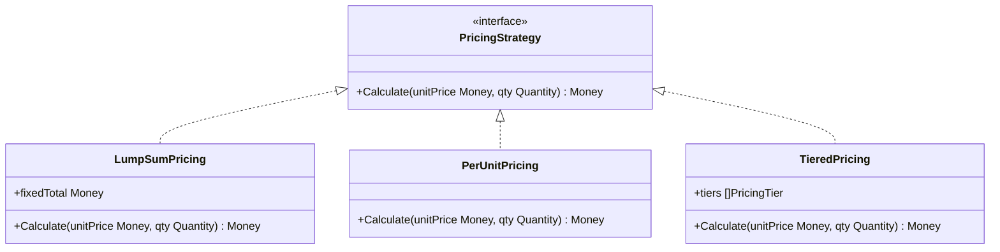




```go
// => PricingStrategy is the Strategy interface — every pricing algorithm satisfies it.
// => The caller (LineItemProcessor) depends only on this interface, never on concrete structs.
type PricingStrategy interface {
    // => Calculate returns the total price for a line item.
    // => unitPrice and qty are inputs; Money is the result value object.
    Calculate(unitPrice Money, qty Quantity) (Money, error)
}

// => LumpSumPricing implements a fixed-total strategy — qty is ignored.
// => Used for blanket-order POs where price is agreed up-front.
type LumpSumPricing struct {
    // => fixedTotal is the negotiated lump sum regardless of quantity.
    fixedTotal Money
}

// => Calculate satisfies PricingStrategy — returns fixedTotal for any qty.
// => The method ignores unitPrice; only fixedTotal matters.
func (l LumpSumPricing) Calculate(unitPrice Money, qty Quantity) (Money, error) {
    // => Return the pre-agreed total; no multiplication needed.
    return l.fixedTotal, nil
}

// => PerUnitPricing multiplies unit price by quantity — the standard pricing model.
// => No fields needed; algorithm is stateless.
type PerUnitPricing struct{}

// => Calculate returns unitPrice × qty.Units as the line total.
// => Error returned only if qty is negative (invalid).
func (p PerUnitPricing) Calculate(unitPrice Money, qty Quantity) (Money, error) {
    // => Guard against invalid quantities before multiplication.
    if qty.Units <= 0 {
        // => Negative or zero quantity is a domain error, not a system error.
        return Money{}, ErrInvalidQuantity
    }
    // => Multiply unit price amount by integer quantity.
    return Money{Amount: unitPrice.Amount * int64(qty.Units), Currency: unitPrice.Currency}, nil
}

// => TieredPricing implements volume-discount tiers.
// => tiers hold per-tier unit prices; tierBreaks are quantity thresholds.
type TieredPricing struct {
    // => tiers[i] applies when qty >= tierBreaks[i].
    tiers      []PricingTier
    // => tierBreaks[0] = minimum qty for tier 0 (usually 1).
    tierBreaks []int
}

// => Calculate finds the applicable tier and multiplies tier unit price × qty.
// => Falls back to first tier if no tier break matches.
func (t TieredPricing) Calculate(unitPrice Money, qty Quantity) (Money, error) {
    // => Start with the first (lowest-volume) tier as the default.
    activeTier := t.tiers[0]
    // => Walk tiers in order; last matching break wins (highest applicable volume).
    for i, breakQty := range t.tierBreaks {
        if qty.Units >= breakQty {
            // => This tier applies; keep going to find the highest applicable tier.
            activeTier = t.tiers[i]
        }
    }
    // => Multiply the tier's unit price by ordered quantity.
    return Money{Amount: activeTier.UnitPrice.Amount * int64(qty.Units), Currency: activeTier.UnitPrice.Currency}, nil
}
```




```rust
// => PricingStrategy is a Rust trait — any type implementing it is a strategy.
// => Traits enable polymorphism without inheritance: no extends, no vtable required at definition.
pub trait PricingStrategy {
    // => calculate is the single required method; &self means the strategy is read-only.
    // => Returns Result to propagate domain errors (negative qty, currency mismatch).
    fn calculate(&self, unit_price: Money, qty: &Quantity) -> Result<Money, PricingError>;
}

// => LumpSumPricing stores the agreed fixed total in its fields.
// => #[derive(Debug, Clone)] gives free debug printing and cloning.
#[derive(Debug, Clone)]
pub struct LumpSumPricing {
    // => fixed_total is the pre-negotiated lump sum amount.
    pub fixed_total: Money,
}

// => impl PricingStrategy for LumpSumPricing binds the strategy trait to this concrete type.
// => Rust requires explicit impl blocks; there is no implicit interface satisfaction.
impl PricingStrategy for LumpSumPricing {
    fn calculate(&self, _unit_price: Money, _qty: &Quantity) -> Result<Money, PricingError> {
        // => Underscore prefixes document that unit_price and qty are intentionally unused.
        // => Return fixed_total cloned — Money is Copy if Amount/Currency are Copy types.
        Ok(self.fixed_total.clone())
    }
}

// => PerUnitPricing is a zero-size struct — no fields, pure algorithm.
// => Zero-size types have no runtime overhead in Rust.
#[derive(Debug, Clone)]
pub struct PerUnitPricing;

impl PricingStrategy for PerUnitPricing {
    fn calculate(&self, unit_price: Money, qty: &Quantity) -> Result<Money, PricingError> {
        // => Validate qty before multiplication — return Err on domain violation.
        if qty.units <= 0 {
            return Err(PricingError::InvalidQuantity(qty.units));
        }
        // => Multiply; checked_mul avoids integer overflow (production safety).
        let amount = unit_price.amount
            .checked_mul(qty.units as i64)
            .ok_or(PricingError::Overflow)?;
        Ok(Money { amount, currency: unit_price.currency })
    }
}

// => TieredPricing owns its tiers vector — Rust ownership means no shared-ptr needed.
#[derive(Debug, Clone)]
pub struct TieredPricing {
    // => tiers and tier_breaks have matching indices — tiers[i] activates at tier_breaks[i].
    pub tiers: Vec<PricingTier>,
    pub tier_breaks: Vec<u32>,
}

impl PricingStrategy for TieredPricing {
    fn calculate(&self, _unit_price: Money, qty: &Quantity) -> Result<Money, PricingError> {
        // => Default to first tier; last applicable tier wins.
        let active_tier = self.tiers.iter().zip(self.tier_breaks.iter())
            // => Keep tiers whose break threshold is <= ordered quantity.
            .filter(|(_, &brk)| qty.units as u32 >= brk)
            // => last() returns the highest-volume applicable tier.
            .last()
            .map(|(t, _)| t)
            .unwrap_or(&self.tiers[0]);
        let amount = active_tier.unit_price.amount
            .checked_mul(qty.units as i64)
            .ok_or(PricingError::Overflow)?;
        Ok(Money { amount, currency: active_tier.unit_price.currency.clone() })
    }
}
```




> **Key takeaway**: The Strategy interface is the only stable contract — callers are isolated from every pricing algorithm change forever.

---

### Example 30: Injecting PricingStrategy into LineItem Processor

Dependency injection delivers the strategy to its consumer — the caller chooses the algorithm, the processor executes it. This separates the "what algorithm to use" decision from the "how to execute the algorithm" concern. Unit tests inject a mock strategy without touching production pricing code.

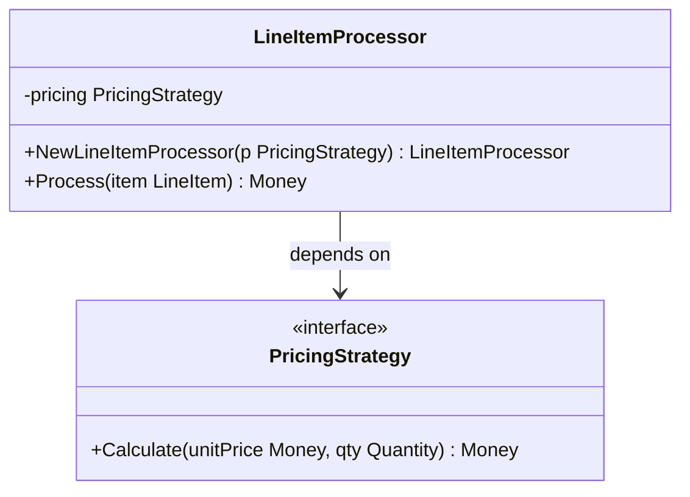




```go
// => LineItemProcessor depends on PricingStrategy interface, not on any concrete type.
// => This is the Dependency Inversion Principle: depend on abstraction, not implementation.
type LineItemProcessor struct {
    // => pricing is private — callers cannot swap it after construction.
    // => Interface field enables runtime polymorphism in Go without inheritance.
    pricing PricingStrategy
}

// => NewLineItemProcessor is the constructor — injects the strategy at creation time.
// => Injection here (constructor injection) is idiomatic Go; field injection via setters is avoided.
func NewLineItemProcessor(p PricingStrategy) *LineItemProcessor {
    // => Return pointer so caller shares one instance; value copy would lose interface state.
    return &LineItemProcessor{pricing: p}
}

// => Process applies the injected strategy to a single line item.
// => LineItem carries UnitPrice and Qty; processor does not know which strategy computes the total.
func (lp *LineItemProcessor) Process(item LineItem) (Money, error) {
    // => Delegate to the injected strategy — the only line that changes between pricing models.
    total, err := lp.pricing.Calculate(item.UnitPrice, item.Qty)
    if err != nil {
        // => Wrap the error with context for the caller (which line item failed).
        return Money{}, fmt.Errorf("process line item %s: %w", item.SKU, err)
    }
    // => Return the computed total — processor adds no further calculation.
    return total, nil
}

// => Usage: swap strategies without changing LineItemProcessor at all.
// => perUnitProcessor := NewLineItemProcessor(PerUnitPricing{})
// => lumpSumProcessor  := NewLineItemProcessor(LumpSumPricing{fixedTotal: contractPrice})
// => In tests: mockProcessor := NewLineItemProcessor(MockPricingStrategy{returns: fixedValue})
```




```rust
// => LineItemProcessor owns a Box<dyn PricingStrategy> — heap-allocated trait object.
// => Box<dyn Trait> is the Rust equivalent of a Go interface field: runtime dispatch, any impl.
pub struct LineItemProcessor {
    // => Box<dyn PricingStrategy> erases the concrete type at runtime.
    // => Send + Sync bounds allow the processor to be shared across threads.
    pricing: Box<dyn PricingStrategy + Send + Sync>,
}

impl LineItemProcessor {
    // => new() is the Rust constructor convention — accepts any PricingStrategy implementor.
    // => The caller passes a concrete type; Rust boxes it into a trait object here.
    pub fn new(pricing: impl PricingStrategy + Send + Sync + 'static) -> Self {
        Self { pricing: Box::new(pricing) }
    }

    // => process() borrows the line item (no ownership transfer needed for read).
    // => Returns Result<Money, ProcessError> — Rust forces explicit error handling at call site.
    pub fn process(&self, item: &LineItem) -> Result<Money, ProcessError> {
        // => Delegate to the boxed trait object — vtable dispatch at runtime.
        self.pricing
            .calculate(item.unit_price.clone(), &item.qty)
            // => map_err converts PricingError to ProcessError with context.
            .map_err(|e| ProcessError::PricingFailed { sku: item.sku.clone(), source: e })
    }
}

// => Swap strategies: let p = LineItemProcessor::new(PerUnitPricing);
// => Test:           let p = LineItemProcessor::new(MockPricingStrategy::fixed(Money::zero()));
// => Lump sum:       let p = LineItemProcessor::new(LumpSumPricing { fixed_total: contract });
```




> **Key takeaway**: Injecting the strategy via constructor makes the dependency explicit, swappable, and testable — the processor never needs to change when pricing rules change.

---

### Example 31: Discount Strategy

Discount strategies apply after pricing — composable with pricing strategies via explicit sequencing. A `NoDiscount` null-object avoids nil checks when no discount applies. Discount and pricing strategies are separate interfaces because their responsibilities differ even though both operate on `Money`.

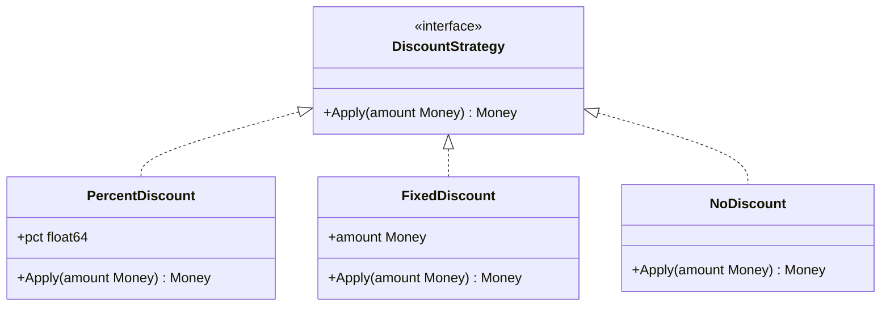




```go
// => DiscountStrategy is its own interface — separate from PricingStrategy by design.
// => Mixing pricing and discount in one interface would violate Interface Segregation Principle.
type DiscountStrategy interface {
    // => Apply takes a pre-computed price and returns the discounted amount.
    // => Returning an error allows rejecting invalid discount configurations.
    Apply(amount Money) (Money, error)
}

// => PercentDiscount reduces price by a percentage (0.0–1.0 range).
// => pct = 0.10 means 10% off; validated at construction, not at Apply time.
type PercentDiscount struct {
    pct float64
}

// => NewPercentDiscount validates the percentage range at creation — fail fast.
// => Callers get a clear error if they pass 110% instead of 0.10.
func NewPercentDiscount(pct float64) (PercentDiscount, error) {
    if pct < 0 || pct > 1 {
        return PercentDiscount{}, fmt.Errorf("percent must be 0.0–1.0, got %f", pct)
    }
    return PercentDiscount{pct: pct}, nil
}

// => Apply multiplies amount by (1 - pct) using integer arithmetic to avoid float rounding.
func (d PercentDiscount) Apply(amount Money) (Money, error) {
    // => Convert to avoid float loss: discount in basis points (10% = 1000 bps).
    discounted := amount.Amount - (amount.Amount * int64(d.pct*10000) / 10000)
    return Money{Amount: discounted, Currency: amount.Currency}, nil
}

// => FixedDiscount subtracts a pre-set absolute amount from the line total.
// => Used for promotional coupons or contract rebates with a fixed value.
type FixedDiscount struct{ amount Money }

// => Apply subtracts fixed amount; clamp to zero to avoid negative line totals.
func (d FixedDiscount) Apply(amount Money) (Money, error) {
    result := amount.Amount - d.amount.Amount
    if result < 0 {
        // => Domain rule: discounts cannot make a line item have negative total.
        result = 0
    }
    return Money{Amount: result, Currency: amount.Currency}, nil
}

// => NoDiscount is the Null Object pattern — returns input unchanged, no nil check needed.
// => Callers always have a discount strategy; the "no discount" case is just this struct.
type NoDiscount struct{}

// => Apply returns amount unchanged — identical to no discount applied.
func (NoDiscount) Apply(amount Money) (Money, error) { return amount, nil }
```




```rust
// => DiscountStrategy trait mirrors the Go interface — same single-method contract.
pub trait DiscountStrategy {
    // => apply consumes nothing; borrows amount and returns new Money or error.
    fn apply(&self, amount: Money) -> Result<Money, DiscountError>;
}

// => PercentDiscount stores an f64 — validated at construction via a smart constructor.
#[derive(Debug, Clone)]
pub struct PercentDiscount { pct: f64 }

impl PercentDiscount {
    // => new() validates the range; returns Err for values outside [0.0, 1.0].
    pub fn new(pct: f64) -> Result<Self, DiscountError> {
        if !(0.0..=1.0).contains(&pct) {
            return Err(DiscountError::InvalidPercent(pct));
        }
        Ok(Self { pct })
    }
}

impl DiscountStrategy for PercentDiscount {
    fn apply(&self, amount: Money) -> Result<Money, DiscountError> {
        // => Use integer arithmetic to avoid floating-point rounding in financial math.
        let discount_bps = (self.pct * 10_000.0) as i64;
        let discounted = amount.amount - (amount.amount * discount_bps / 10_000);
        Ok(Money { amount: discounted, currency: amount.currency })
    }
}

// => FixedDiscount subtracts a pre-set amount — clamped to zero at the lower bound.
#[derive(Debug, Clone)]
pub struct FixedDiscount { amount: Money }

impl DiscountStrategy for FixedDiscount {
    fn apply(&self, amount: Money) -> Result<Money, DiscountError> {
        // => max(0, ...) enforces the no-negative-line-total domain rule.
        let result = (amount.amount - self.amount.amount).max(0);
        Ok(Money { amount: result, currency: amount.currency })
    }
}

// => NoDiscount is the Null Object — unit type, zero size, pass-through Apply.
// => Rust unit struct has no fields and no heap allocation.
#[derive(Debug, Clone)]
pub struct NoDiscount;

impl DiscountStrategy for NoDiscount {
    fn apply(&self, amount: Money) -> Result<Money, DiscountError> {
        // => Return unchanged amount — identical to "no discount applied".
        Ok(amount)
    }
}
```




> **Key takeaway**: The Null Object (`NoDiscount`) eliminates nil checks and keeps callers uniform — every line item always has a discount strategy, even when that strategy does nothing.

---

### Example 32: Approval Routing Strategy

Routing a PO to the right approval level is a strategy — determined by PO value, supplier tier, or category. Routing logic changes frequently as the business adjusts spending limits, so extracting it into a strategy keeps the `PurchaseOrder` aggregate free from routing rules. A new routing policy is a new struct, not a code change.

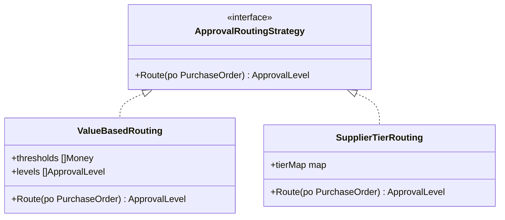




```go
// => ApprovalRoutingStrategy decides which approval level a PO requires.
// => Routing logic is orthogonal to PO lifecycle — strategy keeps it separate.
type ApprovalRoutingStrategy interface {
    // => Route inspects the PO and returns the required approval level.
    // => Error covers misconfigured strategies (empty threshold table, unknown supplier tier).
    Route(po *PurchaseOrder) (ApprovalLevel, error)
}

// => ValueBasedRouting routes by PO total value.
// => thresholds[i] is the minimum total for levels[i]; sorted ascending.
type ValueBasedRouting struct {
    thresholds []Money
    levels     []ApprovalLevel
}

// => Route finds the highest threshold that the PO total meets.
// => POs below the first threshold default to the lowest approval level.
func (r ValueBasedRouting) Route(po *PurchaseOrder) (ApprovalLevel, error) {
    if len(r.thresholds) == 0 {
        // => Misconfigured router — fail loudly rather than silently using wrong level.
        return "", ErrRoutingMisconfigured
    }
    // => Start at the lowest level; iterate to find the highest applicable level.
    result := r.levels[0]
    for i, threshold := range r.thresholds {
        if po.Total().Amount >= threshold.Amount {
            // => PO total meets or exceeds this threshold — use its level.
            result = r.levels[i]
        }
    }
    return result, nil
}

// => SupplierTierRouting routes by the supplier's pre-negotiated tier.
// => Preferred suppliers may require less oversight; new suppliers more scrutiny.
type SupplierTierRouting struct {
    // => tierMap maps each SupplierTier to the required ApprovalLevel.
    tierMap map[SupplierTier]ApprovalLevel
}

// => Route looks up the supplier tier in the tierMap.
// => Missing tier returns an error — prevents silent misrouting.
func (r SupplierTierRouting) Route(po *PurchaseOrder) (ApprovalLevel, error) {
    level, ok := r.tierMap[po.SupplierTier()]
    if !ok {
        // => Unknown supplier tier: fail rather than defaulting to any level.
        return "", fmt.Errorf("no routing rule for supplier tier %q", po.SupplierTier())
    }
    return level, nil
}
```




```rust
// => ApprovalRoutingStrategy trait — same single-method contract as Go interface.
pub trait ApprovalRoutingStrategy {
    fn route(&self, po: &PurchaseOrder) -> Result<ApprovalLevel, RoutingError>;
}

// => ValueBasedRouting stores thresholds and levels as parallel Vecs.
// => thresholds and levels must have the same length — invariant checked in constructor.
#[derive(Debug, Clone)]
pub struct ValueBasedRouting {
    thresholds: Vec<Money>,
    levels: Vec<ApprovalLevel>,
}

impl ValueBasedRouting {
    // => Constructor validates the parallel-vector invariant at creation.
    pub fn new(thresholds: Vec<Money>, levels: Vec<ApprovalLevel>) -> Result<Self, RoutingError> {
        if thresholds.len() != levels.len() || thresholds.is_empty() {
            return Err(RoutingError::Misconfigured);
        }
        Ok(Self { thresholds, levels })
    }
}

impl ApprovalRoutingStrategy for ValueBasedRouting {
    fn route(&self, po: &PurchaseOrder) -> Result<ApprovalLevel, RoutingError> {
        // => iter().zip() pairs each threshold with its corresponding level.
        let result = self.thresholds.iter().zip(self.levels.iter())
            // => Keep all (threshold, level) pairs where PO total meets threshold.
            .filter(|(threshold, _)| po.total().amount >= threshold.amount)
            // => last() returns the highest applicable level (thresholds sorted ascending).
            .last()
            .map(|(_, level)| level.clone())
            // => Default to first level if no threshold met — or error if list empty.
            .unwrap_or_else(|| self.levels[0].clone());
        Ok(result)
    }
}

// => SupplierTierRouting uses a HashMap for O(1) tier lookup.
#[derive(Debug, Clone)]
pub struct SupplierTierRouting {
    tier_map: std::collections::HashMap<SupplierTier, ApprovalLevel>,
}

impl ApprovalRoutingStrategy for SupplierTierRouting {
    fn route(&self, po: &PurchaseOrder) -> Result<ApprovalLevel, RoutingError> {
        self.tier_map
            .get(&po.supplier_tier())
            // => cloned() converts &ApprovalLevel reference to owned value.
            .cloned()
            // => ok_or_else defers error construction until the None case occurs.
            .ok_or_else(|| RoutingError::UnknownTier(po.supplier_tier()))
    }
}
```




> **Key takeaway**: Routing logic in a strategy keeps the PO aggregate clean — the aggregate enforces domain invariants while the strategy answers "who approves this".

---

### Example 33: Strategy Selection via Factory

A factory selects the correct strategy at runtime based on context — strategies remain decoupled from selection logic. The factory is the only place that knows all concrete strategy types. Callers receive an interface, not a concrete type, so they are unaffected by adding new strategies.

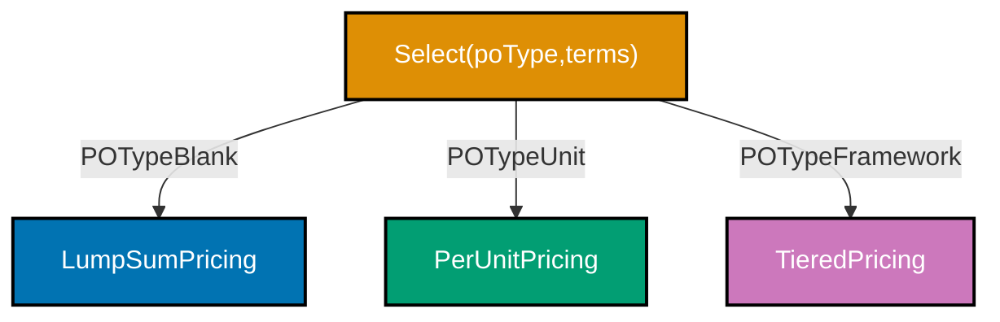




```go
// => SelectPricingStrategy is a factory function — centralises strategy selection logic.
// => Callers pass poType + contractTerms; factory returns the matching PricingStrategy interface.
// => Adding a new PO type means updating only this function, nowhere else.
func SelectPricingStrategy(poType POType, contractTerms ContractTerms) PricingStrategy {
    switch poType {
    case POTypeBlank:
        // => Blanket POs have a negotiated lump sum in the contract terms.
        return LumpSumPricing{fixedTotal: contractTerms.LumpSumTotal}
    case POTypeUnit:
        // => Unit POs price each item separately; PerUnitPricing is stateless.
        return PerUnitPricing{}
    case POTypeFramework:
        // => Framework POs use volume tiers negotiated in the contract.
        return NewTieredPricing(contractTerms.Tiers, contractTerms.TierBreaks)
    default:
        // => Unknown PO types default to per-unit pricing — safest fallback.
        // => Log a warning in production; unknown types may indicate data migration gap.
        return PerUnitPricing{}
    }
}

// => Usage: caller receives PricingStrategy, never knows which concrete type it holds.
// => strategy := SelectPricingStrategy(po.Type, po.ContractTerms)
// => processor := NewLineItemProcessor(strategy)
// => processor.Process(lineItem)

// => The factory can itself be injected as a function parameter for testing.
// => type StrategyFactory func(POType, ContractTerms) PricingStrategy
// => Injecting StrategyFactory lets tests provide a deterministic factory.
```




```rust
// => select_pricing_strategy is a Rust factory function returning a boxed trait object.
// => Box<dyn PricingStrategy> erases the concrete type — caller is type-agnostic.
pub fn select_pricing_strategy(
    po_type: POType,
    terms: &ContractTerms,
) -> Box<dyn PricingStrategy + Send + Sync> {
    // => match is exhaustive — Rust compiler forces every POType variant to be handled.
    // => This means adding a new POType causes a compile error until the factory is updated.
    match po_type {
        POType::Blank => {
            // => Blanket PO: fixed total from contract terms.
            Box::new(LumpSumPricing { fixed_total: terms.lump_sum_total.clone() })
        }
        POType::Unit => {
            // => Unit PO: stateless per-unit pricing.
            Box::new(PerUnitPricing)
        }
        POType::Framework => {
            // => Framework PO: tiered pricing with volume breaks.
            Box::new(TieredPricing {
                tiers: terms.tiers.clone(),
                tier_breaks: terms.tier_breaks.clone(),
            })
        }
    }
    // => Rust match is exhaustive — no default/fallback needed; missing variants are compile errors.
    // => Go switch has a default; Rust match has none when all variants covered.
}

// => The factory can be stored as a function pointer or closure for testing.
// => type StrategyFactory = fn(POType, &ContractTerms) -> Box<dyn PricingStrategy + Send + Sync>;
```




> **Key takeaway**: The factory centralises strategy selection; Rust's exhaustive match guarantees every new `POType` variant forces a factory update at compile time.

---

## Observer / Event-Driven (Examples 34–38)

### Example 34: Observer Interface + Registration

The Observer pattern allows components to react to events without the event source knowing who is listening. An event bus holds a registry of observers keyed by event type and notifies them when events occur. Thread safety requires a read-write lock because registrations and notifications happen concurrently.

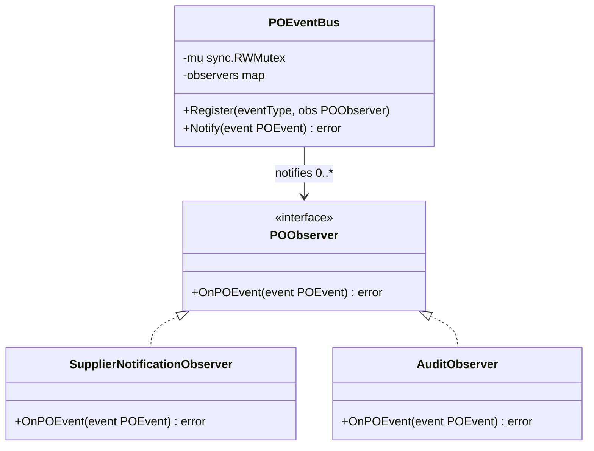




```go
// => POObserver is the subscriber interface — any type that handles PO events satisfies it.
// => The event bus depends only on this interface, never on concrete observer types.
type POObserver interface {
    // => OnPOEvent is called by the bus when a matching event occurs.
    // => Returning an error lets synchronous observers signal failure to the bus.
    OnPOEvent(event POEvent) error
}

// => POEventBus holds the observer registry and dispatches notifications.
// => sync.RWMutex protects concurrent Register (write) and Notify (read) calls.
type POEventBus struct {
    mu        sync.RWMutex
    // => observers is a map from event type to a slice of registered observers.
    // => Multiple observers per event type supported — all are notified.
    observers map[POEventType][]POObserver
}

// => NewPOEventBus initialises the bus with an empty observer map.
func NewPOEventBus() *POEventBus {
    return &POEventBus{observers: make(map[POEventType][]POObserver)}
}

// => Register adds an observer for a specific event type.
// => Write-locks the map — only one goroutine registers at a time.
func (b *POEventBus) Register(eventType POEventType, obs POObserver) {
    b.mu.Lock()
    defer b.mu.Unlock()
    // => Append to the slice for this event type; creates slice if first observer.
    b.observers[eventType] = append(b.observers[eventType], obs)
}

// => Notify invokes all observers registered for the event's type.
// => Read-locks the map — multiple goroutines may notify simultaneously.
func (b *POEventBus) Notify(event POEvent) error {
    b.mu.RLock()
    // => Copy the observer slice before releasing the lock to avoid holding lock during callbacks.
    observers := make([]POObserver, len(b.observers[event.Type()]))
    copy(observers, b.observers[event.Type()])
    b.mu.RUnlock()
    // => Invoke each observer outside the lock — observer callbacks may themselves register.
    for _, obs := range observers {
        if err := obs.OnPOEvent(event); err != nil {
            // => Return first error; callers decide whether to continue or abort.
            return fmt.Errorf("observer %T failed: %w", obs, err)
        }
    }
    return nil
}
```




```rust
// => POObserver trait — implemented by any type that handles PO events.
// => Send + Sync bounds allow observers to be stored in the bus and called across threads.
pub trait POObserver: Send + Sync {
    fn on_event(&self, event: &POEvent) -> Result<(), ObserverError>;
}

// => POEventBus wraps the observer map in RwLock for concurrent access.
// => Arc<dyn POObserver> — shared ownership of observers without lifetime entanglement.
pub struct POEventBus {
    // => RwLock allows many concurrent readers (Notify) and one exclusive writer (Register).
    observers: RwLock<HashMap<POEventType, Vec<Arc<dyn POObserver>>>>,
}

impl POEventBus {
    pub fn new() -> Self {
        Self { observers: RwLock::new(HashMap::new()) }
    }

    // => register() acquires a write lock and appends the observer.
    // => Arc::clone() increments the reference count — no deep copy.
    pub fn register(&self, event_type: POEventType, obs: Arc<dyn POObserver>) {
        self.observers.write().unwrap()
            .entry(event_type)
            // => or_insert_with creates the Vec on first registration for this event type.
            .or_insert_with(Vec::new)
            .push(obs);
    }

    // => notify() acquires a read lock, clones the Arc slice, then releases the lock before callbacks.
    // => Cloning Arc<dyn POObserver> is cheap (increments refcount, no data copy).
    pub fn notify(&self, event: &POEvent) -> Result<(), ObserverError> {
        let observers = {
            let map = self.observers.read().unwrap();
            map.get(&event.event_type())
                .cloned()
                .unwrap_or_default()
        };
        // => Iterate outside the lock — observer callbacks may call register() without deadlock.
        for obs in &observers {
            obs.on_event(event)?;
        }
        Ok(())
    }
}
```




> **Key takeaway**: Releasing the read lock before invoking callbacks prevents deadlocks when observer callbacks themselves call `Register` or `Notify`.

---

### Example 35: Synchronous Observer — Supplier Notification

A synchronous observer executes in the same call stack — simple but blocks the caller until all observers complete. This is appropriate for fast operations such as writing to an in-process audit queue. Heavy I/O observers (email, external API) should be made asynchronous to avoid stalling the approval workflow.

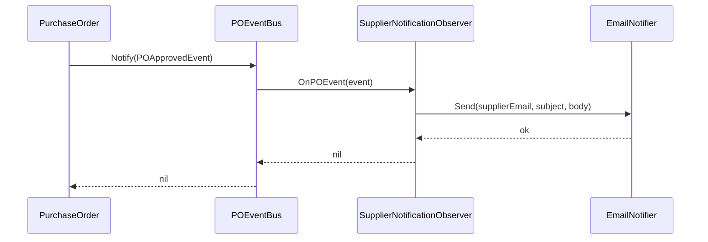




```go
// => SupplierNotificationObserver notifies the supplier when a PO is approved.
// => Holds a notifier (email/SMS port) and a repository for supplier contact details.
type SupplierNotificationObserver struct {
    notifier    EmailNotifier
    supplierRepo SupplierRepository
}

// => NewSupplierNotificationObserver injects dependencies via constructor.
// => Both dependencies are interfaces — testable with mocks.
func NewSupplierNotificationObserver(n EmailNotifier, r SupplierRepository) *SupplierNotificationObserver {
    return &SupplierNotificationObserver{notifier: n, supplierRepo: r}
}

// => OnPOEvent satisfies POObserver; called synchronously by the event bus.
// => The method blocks the Notify call until email dispatch completes.
func (o *SupplierNotificationObserver) OnPOEvent(event POEvent) error {
    // => Switch on event type — observer ignores events it doesn't handle.
    switch e := event.(type) {
    case POApprovedEvent:
        // => Fetch supplier contact details from the repository.
        supplier, err := o.supplierRepo.FindById(context.Background(), e.SupplierID)
        if err != nil {
            // => Return error to bus — bus decides whether to continue with other observers.
            return fmt.Errorf("fetch supplier %s: %w", e.SupplierID, err)
        }
        // => Send notification email to supplier's registered address.
        return o.notifier.Send(supplier.Email, "PO Approved: "+e.PONumber, buildApprovalBody(e))
    default:
        // => Ignore event types this observer doesn't care about.
        return nil
    }
}
```




```rust
// => SupplierNotificationObserver implements POObserver synchronously.
// => Arc<dyn ...> allows the observer to be shared across threads via the event bus.
pub struct SupplierNotificationObserver {
    notifier: Arc<dyn EmailNotifier + Send + Sync>,
    supplier_repo: Arc<dyn SupplierRepository + Send + Sync>,
}

impl POObserver for SupplierNotificationObserver {
    fn on_event(&self, event: &POEvent) -> Result<(), ObserverError> {
        // => Match on the POEvent enum variant — only react to POApproved.
        match event {
            POEvent::Approved(e) => {
                // => Fetch supplier; propagate error via ? operator (early return on Err).
                let supplier = self.supplier_repo
                    .find_by_id(&e.supplier_id)
                    .map_err(|e| ObserverError::RepositoryError(e.to_string()))?;
                // => Send email synchronously — blocks until SMTP responds.
                self.notifier
                    .send(&supplier.email, &format!("PO Approved: {}", e.po_number), &build_approval_body(e))
                    .map_err(|e| ObserverError::NotificationFailed(e.to_string()))
            }
            // => All other event variants: no-op (Rust requires all enum arms to be handled).
            _ => Ok(()),
        }
    }
}
```




> **Key takeaway**: Synchronous observers are simple and correct but block the caller — use them only when the operation is fast enough that blocking is acceptable.

---

### Example 36: Asynchronous Observer via Goroutine / Tokio Task

Asynchronous observers decouple the event publisher from slow operations — the PO approval completes immediately while notifications happen in the background. The trade-off is that errors cannot propagate back to the caller; they must be logged or queued for retry.

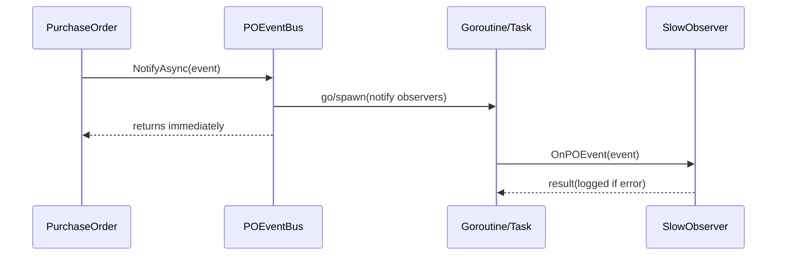




```go
// => NotifyAsync dispatches observers in a new goroutine — caller returns immediately.
// => Fire-and-forget: errors cannot be returned to the original caller.
func (b *POEventBus) NotifyAsync(event POEvent) {
    // => Copy the observer slice before spawning to avoid race on the map.
    b.mu.RLock()
    observers := make([]POObserver, len(b.observers[event.Type()]))
    copy(observers, b.observers[event.Type()])
    b.mu.RUnlock()

    // => Goroutine captures the copied slice and the event value.
    // => The bus does not wait for this goroutine — returns after `go func()`.
    go func() {
        for _, obs := range observers {
            if err := obs.OnPOEvent(event); err != nil {
                // => Log errors; caller has already returned, so we cannot propagate.
                // => In production, publish error to a dead-letter queue for retry.
                b.errLogger.Error("async observer failed",
                    slog.String("observer", fmt.Sprintf("%T", obs)),
                    slog.Any("error", err),
                )
            }
        }
    }()
    // => Return here — observers run concurrently with the rest of the approval workflow.
}

// => At-least-once delivery requires a durable event store, not just a goroutine.
// => If the process crashes before the goroutine completes, the event is lost.
// => For durable delivery: write event to DB inside the PO transaction, then publish async.
```




```rust
// => notify_async spawns a Tokio task — returns immediately, observers run concurrently.
// => The task captures cloned Arcs — lightweight reference-count increments.
pub fn notify_async(&self, event: POEvent) {
    let observers = {
        let map = self.observers.read().unwrap();
        map.get(&event.event_type())
            .cloned()
            .unwrap_or_default()
    };
    // => tokio::spawn creates an async task on the Tokio runtime thread pool.
    // => The calling future (.await) does not wait for this task.
    tokio::spawn(async move {
        for obs in &observers {
            if let Err(e) = obs.on_event(&event).await {
                // => tracing::error! records structured error — observer errors cannot bubble up.
                tracing::error!(
                    observer = std::any::type_name_of_val(obs.as_ref()),
                    error = ?e,
                    "async observer failed"
                );
            }
        }
    });
    // => Caller continues immediately after spawn; observers run on Tokio runtime.
}

// => For durable at-least-once delivery: write event to outbox table in same DB transaction.
// => A separate outbox processor reads and retries undelivered events.
```




> **Key takeaway**: Asynchronous observers free the caller instantly but lose error propagation — durable delivery requires an outbox or queue, not just a goroutine.

---

### Example 37: Channel-Based Fan-Out (Go)

Go channels allow distributing the same event to multiple concurrent observers without coordination. The fan-out goroutine reads from a single input channel and writes to each subscriber's dedicated channel. Non-blocking sends prevent a slow subscriber from stalling all others.

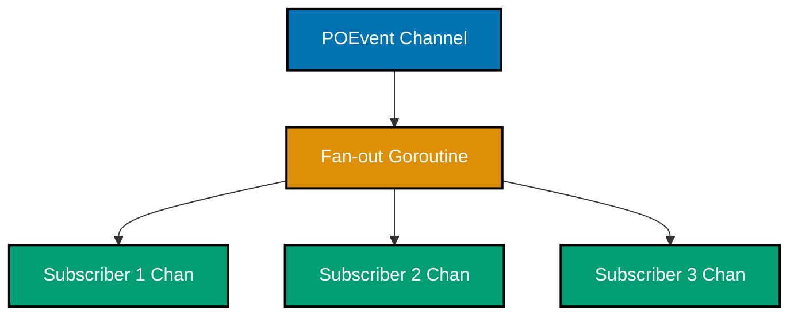




```go
// => ChannelEventBus uses Go channels as the messaging backbone.
// => ch is the input channel; subscribers is a list of per-subscriber output channels.
type ChannelEventBus struct {
    ch          chan POEvent
    subscribers []chan POEvent
    // => wg tracks active fan-out goroutine for clean shutdown.
    wg          sync.WaitGroup
}

// => NewChannelEventBus creates a buffered input channel and starts the fan-out goroutine.
func NewChannelEventBus(bufferSize int) *ChannelEventBus {
    b := &ChannelEventBus{
        ch: make(chan POEvent, bufferSize),
    }
    // => Fan-out goroutine runs for the lifetime of the bus.
    b.wg.Add(1)
    go b.fanOut()
    return b
}

// => Subscribe adds a new subscriber channel and returns it to the caller.
// => Buffered subscriber channels prevent head-of-line blocking.
func (b *ChannelEventBus) Subscribe(bufferSize int) <-chan POEvent {
    ch := make(chan POEvent, bufferSize)
    // => Append must be protected if Subscribe is called after the bus starts.
    b.subscribers = append(b.subscribers, ch)
    return ch
}

// => Publish sends an event to the input channel non-blocking.
// => If input channel is full, the event is dropped to prevent publisher stall.
func (b *ChannelEventBus) Publish(event POEvent) {
    select {
    case b.ch <- event:
        // => Event enqueued successfully.
    default:
        // => Input channel full — drop event, log warning in production.
        // => For at-least-once: block instead, or use a persistent queue.
    }
}

// => fanOut reads from the input channel and writes to each subscriber channel.
func (b *ChannelEventBus) fanOut() {
    defer b.wg.Done()
    for event := range b.ch {
        // => Distribute to every subscriber; non-blocking select prevents slow subscriber stall.
        for _, sub := range b.subscribers {
            select {
            case sub <- event:
                // => Subscriber channel accepted the event.
            default:
                // => Subscriber channel full — drop rather than block other subscribers.
            }
        }
    }
    // => Input channel closed — close all subscriber channels to signal end of stream.
    for _, sub := range b.subscribers {
        close(sub)
    }
}
```




```rust
// => Tokio broadcast channel is the idiomatic Rust equivalent of Go channel fan-out.
// => broadcast::channel creates one sender and any number of receivers.
use tokio::sync::broadcast;

// => ChannelEventBus wraps a broadcast Sender — subscribers call subscribe() for a Receiver.
pub struct ChannelEventBus {
    // => Sender<POEvent> is the input end; Receiver cloned for each subscriber.
    sender: broadcast::Sender<POEvent>,
}

impl ChannelEventBus {
    // => new() creates the bus with a bounded channel capacity.
    // => capacity bounds memory; lagging receivers get RecvError::Lagged.
    pub fn new(capacity: usize) -> Self {
        let (sender, _) = broadcast::channel(capacity);
        Self { sender }
    }

    // => subscribe() returns a new Receiver — each call gets an independent stream of events.
    // => Unlike Go's fan-out goroutine, tokio broadcast handles fan-out internally.
    pub fn subscribe(&self) -> broadcast::Receiver<POEvent> {
        self.sender.subscribe()
    }

    // => publish() sends to all current subscribers; returns error if no subscribers exist.
    pub fn publish(&self, event: POEvent) -> Result<(), broadcast::error::SendError<POEvent>> {
        // => send() distributes to all active receivers; lagging receivers may miss events.
        self.sender.send(event).map(|_| ())
    }
}

// => Each subscriber calls recv().await in its own async task — true concurrent fan-out.
// => async move { while let Ok(event) = rx.recv().await { handle(event); } }
```




> **Key takeaway**: Non-blocking sends to subscriber channels prevent a single slow consumer from back-pressuring all other subscribers — choose dropping versus blocking based on delivery guarantee requirements.

---

### Example 38: Filtering Observers by Event Attribute

Fine-grained subscriptions reduce unnecessary processing — observers declare interest in specific event attributes rather than receiving all events of a type. A `FilteredObserver` wraps any observer with a predicate closure, composing filtering and handling orthogonally.

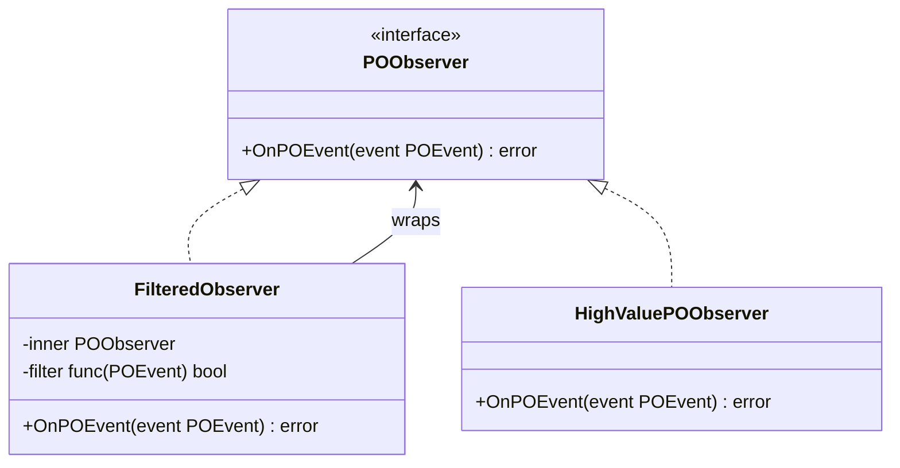




```go
// => FilteredObserver wraps an inner observer with a predicate — only matching events forwarded.
// => FilteredObserver itself satisfies POObserver — it is a transparent wrapper.
type FilteredObserver struct {
    inner  POObserver
    // => filter is a closure capturing any event attribute for comparison.
    filter func(POEvent) bool
}

// => NewFilteredObserver injects both the inner observer and the filter function.
// => The filter is a first-class function — any predicate logic is valid.
func NewFilteredObserver(inner POObserver, filter func(POEvent) bool) *FilteredObserver {
    return &FilteredObserver{inner: inner, filter: filter}
}

// => OnPOEvent applies the filter before delegating to the inner observer.
// => Non-matching events return nil immediately — no work done in inner observer.
func (fo *FilteredObserver) OnPOEvent(event POEvent) error {
    if !fo.filter(event) {
        // => Event does not match the predicate — skip silently.
        return nil
    }
    // => Event matches — delegate to the wrapped observer.
    return fo.inner.OnPOEvent(event)
}

// => Example: notify only for POs above $50,000.
// => highValueFilter := func(e POEvent) bool {
// =>     approved, ok := e.(POApprovedEvent)
// =>     return ok && approved.Total.Amount >= 50_000_00 // cents
// => }
// => filteredObs := NewFilteredObserver(escalationObserver, highValueFilter)
// => bus.Register(POEventTypeApproved, filteredObs)
```




```rust
// => FilteredObserver<O> is generic over the inner observer type.
// => Generic parameter avoids Box<dyn> overhead when concrete type is known.
pub struct FilteredObserver<O: POObserver> {
    inner: O,
    // => Box<dyn Fn> for the predicate — closures with captures need heap allocation.
    // => Send + Sync required because POObserver requires Send + Sync.
    filter: Box<dyn Fn(&POEvent) -> bool + Send + Sync>,
}

impl<O: POObserver> FilteredObserver<O> {
    pub fn new(
        inner: O,
        filter: impl Fn(&POEvent) -> bool + Send + Sync + 'static,
    ) -> Self {
        Self { inner, filter: Box::new(filter) }
    }
}

impl<O: POObserver> POObserver for FilteredObserver<O> {
    fn on_event(&self, event: &POEvent) -> Result<(), ObserverError> {
        // => Call the predicate closure; skip if false.
        if !(self.filter)(event) {
            // => Filter returned false — event is not relevant to this observer.
            return Ok(());
        }
        // => Filter returned true — delegate to the inner observer.
        self.inner.on_event(event)
    }
}

// => Example: observe only high-value approvals.
// => let filtered = FilteredObserver::new(
// =>     escalation_observer,
// =>     |e| matches!(e, POEvent::Approved(a) if a.total.amount >= 5_000_000),
// => );
```




> **Key takeaway**: `FilteredObserver` composes filtering and handling orthogonally — the filter closure is a business rule injected at wiring time, not hardcoded in the observer.

---

## Decorator Pattern (Examples 39–43)

### Example 39: Logging Decorator for Repository

The Decorator pattern adds logging to any repository without modifying the repository's core logic. The logging decorator holds a reference to the real repository (same interface) and wraps each method with timing and error logging. Callers see only the repository interface — they cannot tell whether logging is active.

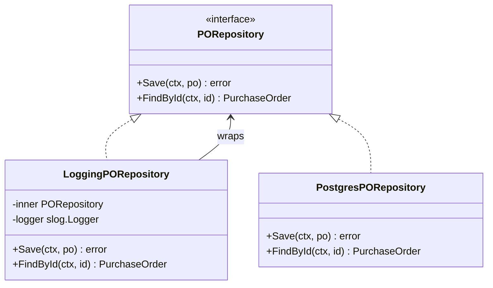




```go
// => LoggingPORepository decorates any PORepository with structured logging.
// => Wrapping an interface means the decorator works with any concrete repo (Postgres, InMemory).
type LoggingPORepository struct {
    inner  PORepository
    // => slog.Logger is Go 1.21's structured logger — structured fields aid log aggregation.
    logger *slog.Logger
}

// => NewLoggingPORepository injects inner repo and logger — both are interfaces/pointers.
func NewLoggingPORepository(inner PORepository, logger *slog.Logger) *LoggingPORepository {
    return &LoggingPORepository{inner: inner, logger: logger}
}

// => Save logs before and after the inner call — captures duration and any error.
func (r *LoggingPORepository) Save(ctx context.Context, po *PurchaseOrder) error {
    start := time.Now()
    // => Delegate to the real repository — all business logic lives here.
    err := r.inner.Save(ctx, po)
    // => Log after the call — always logged, even on error.
    r.logger.InfoContext(ctx, "PORepository.Save",
        slog.String("id", string(po.Id)),
        slog.Duration("duration", time.Since(start)),
        slog.Any("error", err),
    )
    // => Return the original error unchanged — decorator does not swallow errors.
    return err
}

// => FindById wraps the read path with the same timing and error logging pattern.
func (r *LoggingPORepository) FindById(ctx context.Context, id PurchaseOrderId) (*PurchaseOrder, error) {
    start := time.Now()
    po, err := r.inner.FindById(ctx, id)
    r.logger.InfoContext(ctx, "PORepository.FindById",
        slog.String("id", string(id)),
        slog.Duration("duration", time.Since(start)),
        slog.Bool("found", po != nil),
        slog.Any("error", err),
    )
    return po, err
}
```




```rust
// => LoggingPORepository<R> is generic over any PORepository implementor.
// => Generic parameter avoids dynamic dispatch; compiler generates monomorphized code per R.
pub struct LoggingPORepository<R: PORepository> {
    inner: R,
    // => tracing::Span provides structured context propagated through the call tree.
    span: tracing::Span,
}

impl<R: PORepository> LoggingPORepository<R> {
    pub fn new(inner: R) -> Self {
        Self { inner, span: tracing::span!(tracing::Level::INFO, "PORepository") }
    }
}

impl<R: PORepository> PORepository for LoggingPORepository<R> {
    async fn save(&self, po: &PurchaseOrder) -> Result<(), RepoError> {
        let _guard = self.span.enter();
        let start = std::time::Instant::now();
        // => Delegate to the inner repository; ? propagates error after logging.
        let result = self.inner.save(po).await;
        // => Log after call — duration and result recorded regardless of success.
        tracing::info!(
            id = %po.id,
            duration_ms = start.elapsed().as_millis(),
            success = result.is_ok(),
            "PORepository::save"
        );
        result
    }

    async fn find_by_id(&self, id: &PurchaseOrderId) -> Result<PurchaseOrder, RepoError> {
        let _guard = self.span.enter();
        let start = std::time::Instant::now();
        let result = self.inner.find_by_id(id).await;
        tracing::info!(
            id = %id,
            duration_ms = start.elapsed().as_millis(),
            found = result.is_ok(),
            "PORepository::find_by_id"
        );
        result
    }
}
```




> **Key takeaway**: The logging decorator is transparent — callers receive the same `PORepository` interface while every call is silently timed and logged, with zero changes to the real repository.

---

### Example 40: Retry Decorator for External Calls

The Retry decorator transparently retries transient failures — callers see a reliable interface regardless of whether the first call succeeded. Exponential backoff with jitter prevents the thundering herd problem when many clients retry simultaneously. Non-retryable errors (400, 404) break immediately.

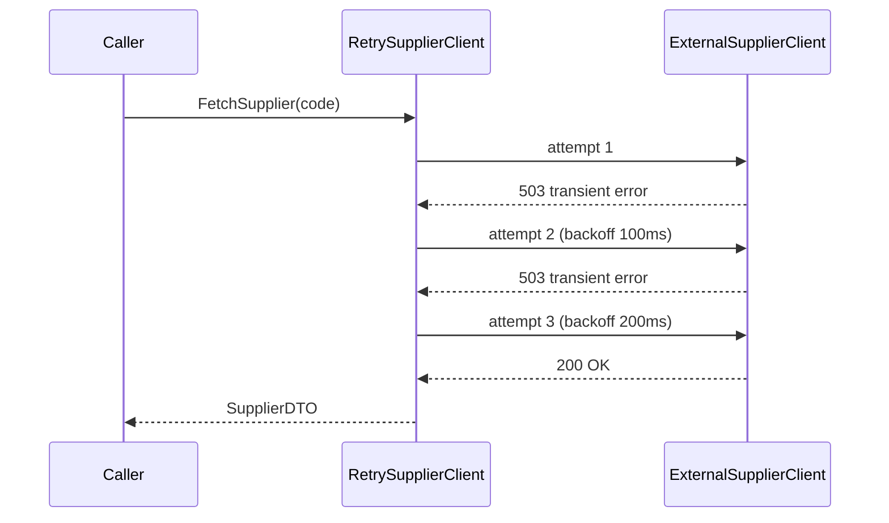




```go
// => RetrySupplierClient decorates any ExternalSupplierClient with retry logic.
// => maxRetries and backoff are configurable — different clients need different policies.
type RetrySupplierClient struct {
    inner      ExternalSupplierClient
    maxRetries int
    // => baseBackoff is the initial wait; doubles on each retry (exponential backoff).
    baseBackoff time.Duration
}

// => FetchSupplier retries on transient errors up to maxRetries times.
func (r *RetrySupplierClient) FetchSupplier(ctx context.Context, code SupplierCode) (ExternalSupplierDTO, error) {
    var lastErr error
    for attempt := 0; attempt <= r.maxRetries; attempt++ {
        dto, err := r.inner.FetchSupplier(ctx, code)
        if err == nil {
            // => Success — return immediately without further retries.
            return dto, nil
        }
        // => Check whether the error is retryable; 404/400 are permanent failures.
        if !isRetryable(err) {
            return ExternalSupplierDTO{}, err
        }
        lastErr = err
        if attempt < r.maxRetries {
            // => Exponential backoff: wait 2^attempt × baseBackoff + jitter.
            backoff := r.baseBackoff * (1 << attempt)
            // => Jitter prevents synchronized retries from multiple callers.
            jitter := time.Duration(rand.Int63n(int64(backoff / 4)))
            select {
            case <-time.After(backoff + jitter):
                // => Backoff complete — proceed to next attempt.
            case <-ctx.Done():
                // => Context cancelled during backoff — stop retrying immediately.
                return ExternalSupplierDTO{}, ctx.Err()
            }
        }
    }
    // => All retries exhausted — return last error with attempt count context.
    return ExternalSupplierDTO{}, fmt.Errorf("after %d retries: %w", r.maxRetries, lastErr)
}
```




```rust
// => RetrySupplierClient<C> decorates any ExternalSupplierClient with configurable retry.
pub struct RetrySupplierClient<C: ExternalSupplierClient> {
    inner: C,
    max_retries: u32,
    // => base_backoff is the starting duration; doubles per attempt.
    base_backoff: Duration,
}

impl<C: ExternalSupplierClient + Send + Sync> ExternalSupplierClient for RetrySupplierClient<C> {
    async fn fetch_supplier(&self, code: &SupplierCode) -> Result<ExternalSupplierDTO, ClientError> {
        let mut last_err = None;
        for attempt in 0..=self.max_retries {
            match self.inner.fetch_supplier(code).await {
                Ok(dto) => return Ok(dto),
                Err(e) if !e.is_retryable() => {
                    // => Non-retryable error (404, 400): return immediately, no retry.
                    return Err(e);
                }
                Err(e) => {
                    last_err = Some(e);
                    if attempt < self.max_retries {
                        // => Compute exponential backoff with jitter.
                        let backoff = self.base_backoff * 2u32.pow(attempt);
                        let jitter = Duration::from_millis(rand::random::<u64>() % (backoff.as_millis() as u64 / 4 + 1));
                        // => tokio::time::sleep yields the async task — does not block thread.
                        tokio::time::sleep(backoff + jitter).await;
                    }
                }
            }
        }
        Err(ClientError::RetriesExhausted {
            attempts: self.max_retries,
            source: Box::new(last_err.unwrap()),
        })
    }
}
```




> **Key takeaway**: Respecting context cancellation during backoff sleep prevents the retry decorator from blocking a request that the caller has already abandoned.

---

### Example 41: Metrics Decorator

A metrics decorator records timing and error rates for every repository call without modifying the underlying adapter. The decorator pattern makes metrics orthogonal to business logic — swapping the metrics backend (Prometheus, OpenTelemetry) only changes the decorator, not the repository.




```go
// => MetricsPORepository decorates PORepository with call timing and error counting.
// => MetricsCollector is a port (hexagonal) — the concrete collector is injected.
type MetricsPORepository struct {
    inner   PORepository
    metrics MetricsCollector
}

// => NewMetricsPORepository injects inner repo and the metrics collector port.
func NewMetricsPORepository(inner PORepository, m MetricsCollector) *MetricsPORepository {
    return &MetricsPORepository{inner: inner, metrics: m}
}

// => Save records start time, delegates, then records duration and error status.
func (r *MetricsPORepository) Save(ctx context.Context, po *PurchaseOrder) error {
    start := time.Now()
    err := r.inner.Save(ctx, po)
    // => RecordDuration records timing even on error — both success and failure latency matter.
    r.metrics.RecordDuration("po_repository_save", time.Since(start))
    if err != nil {
        // => Increment error counter for alerting and SLO tracking.
        r.metrics.IncrementCounter("po_repository_save_errors", map[string]string{
            "error_type": errorType(err),
        })
    }
    return err
}

// => FindById follows the same pattern — one method per interface method.
func (r *MetricsPORepository) FindById(ctx context.Context, id PurchaseOrderId) (*PurchaseOrder, error) {
    start := time.Now()
    po, err := r.inner.FindById(ctx, id)
    r.metrics.RecordDuration("po_repository_find_by_id", time.Since(start))
    if err != nil {
        r.metrics.IncrementCounter("po_repository_find_errors", map[string]string{
            "not_found": fmt.Sprintf("%v", errors.Is(err, ErrNotFound)),
        })
    }
    return po, err
}
```




```rust
// => MetricsPORepository<R> decorates any PORepository with metrics collection.
// => Arc<dyn MetricsCollector> allows the same collector to be shared by multiple decorators.
pub struct MetricsPORepository<R: PORepository> {
    inner: R,
    metrics: Arc<dyn MetricsCollector + Send + Sync>,
}

impl<R: PORepository + Send + Sync> PORepository for MetricsPORepository<R> {
    async fn save(&self, po: &PurchaseOrder) -> Result<(), RepoError> {
        let start = Instant::now();
        let result = self.inner.save(po).await;
        // => record_duration called regardless of result — P99 latency includes errors.
        self.metrics.record_duration("po_repository_save", start.elapsed());
        if result.is_err() {
            // => Increment error counter for SLO violation alerting.
            self.metrics.increment_counter("po_repository_save_errors", &[]);
        }
        result
    }

    async fn find_by_id(&self, id: &PurchaseOrderId) -> Result<PurchaseOrder, RepoError> {
        let start = Instant::now();
        let result = self.inner.find_by_id(id).await;
        self.metrics.record_duration("po_repository_find_by_id", start.elapsed());
        if let Err(RepoError::NotFound(_)) = &result {
            // => Not-found is not a system error — counted separately from failures.
            self.metrics.increment_counter("po_repository_not_found", &[]);
        }
        result
    }
}
```




> **Key takeaway**: Recording latency on both success and failure paths gives accurate P99 data — a slow error response counts as much as a slow success for SLO tracking.

---

### Example 42: Caching Decorator

A caching decorator reduces database load for read-heavy queries — transparent to callers because it wraps the same repository interface. The decorator invalidates its cache entries on write to prevent stale reads. Caching mutable aggregates aggressively risks serving outdated data; use short TTLs or restrict to read-only lookups.

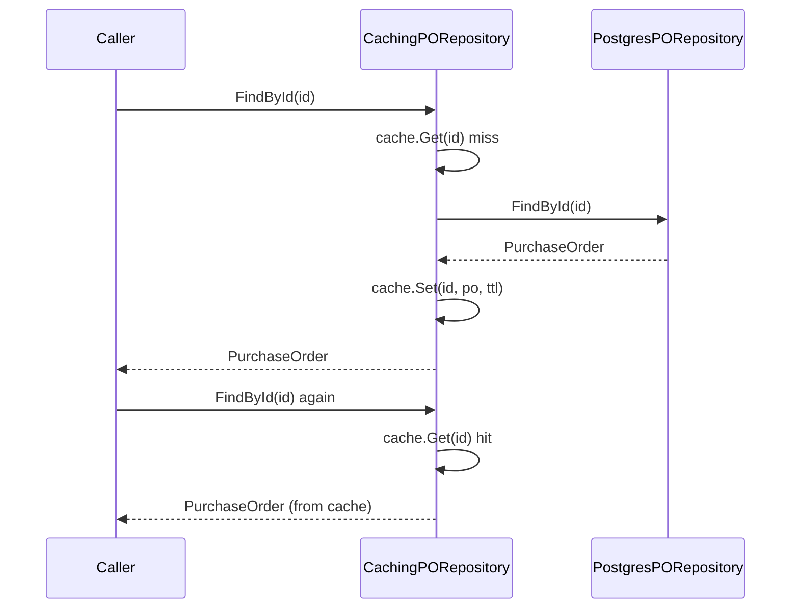




```go
// => CachingPORepository adds a read-through cache in front of the inner repository.
// => Cache and TTL are injected — caller controls cache implementation and expiry.
type CachingPORepository struct {
    inner PORepository
    cache Cache
    // => ttl is the time-to-live for cached entries — balance freshness vs. DB load.
    ttl   time.Duration
}

// => FindById checks the cache first; falls back to the inner repository on a miss.
func (r *CachingPORepository) FindById(ctx context.Context, id PurchaseOrderId) (*PurchaseOrder, error) {
    cacheKey := "po:" + string(id)
    // => Attempt cache hit first — avoids the DB call on a warm cache.
    if cached, ok := r.cache.Get(cacheKey); ok {
        // => Type-assert the cached value back to *PurchaseOrder.
        return cached.(*PurchaseOrder), nil
    }
    // => Cache miss — delegate to the real repository.
    po, err := r.inner.FindById(ctx, id)
    if err != nil {
        // => Do not cache errors — a transient DB error should retry, not be served from cache.
        return nil, err
    }
    // => Populate the cache for future reads within the TTL window.
    r.cache.Set(cacheKey, po, r.ttl)
    return po, nil
}

// => Save invalidates the cached entry to prevent stale reads after writes.
func (r *CachingPORepository) Save(ctx context.Context, po *PurchaseOrder) error {
    err := r.inner.Save(ctx, po)
    if err == nil {
        // => Invalidate only on successful write — avoids stale cache after failed write.
        r.cache.Delete("po:" + string(po.Id))
    }
    return err
}
```




```rust
// => CachingPORepository<R, C> is generic over both repo and cache implementations.
// => Generics allow the compiler to inline cache and repo calls — no dynamic dispatch overhead.
pub struct CachingPORepository<R: PORepository, C: Cache> {
    inner: R,
    cache: C,
    ttl: Duration,
}

impl<R: PORepository + Send + Sync, C: Cache + Send + Sync> PORepository for CachingPORepository<R, C> {
    async fn find_by_id(&self, id: &PurchaseOrderId) -> Result<PurchaseOrder, RepoError> {
        let key = format!("po:{}", id);
        // => Try cache first — returns Some(PurchaseOrder) on hit.
        if let Some(po) = self.cache.get::<PurchaseOrder>(&key).await {
            // => Cache hit: return immediately without touching DB.
            return Ok(po);
        }
        // => Cache miss: fetch from inner repository.
        let po = self.inner.find_by_id(id).await?;
        // => Populate cache; errors in cache.set are logged but not propagated.
        let _ = self.cache.set(&key, &po, self.ttl).await;
        Ok(po)
    }

    async fn save(&self, po: &PurchaseOrder) -> Result<(), RepoError> {
        // => Write to DB first; invalidate cache only on success.
        self.inner.save(po).await?;
        // => delete() on cache miss is a no-op — safe to call unconditionally.
        let _ = self.cache.delete(&format!("po:{}", po.id)).await;
        Ok(())
    }
}
```




> **Key takeaway**: Cache invalidation on `Save` prevents stale reads — but only invalidate after the write succeeds to avoid evicting valid cache entries when the write fails.

---

### Example 43: Chaining Decorators

Multiple decorators can stack — each adds one concern and the stack is assembled once at wiring time. Ordering matters: the outermost decorator executes first on the inbound call and last on the outbound response. Metrics wrapping logging wrapping retry means metrics captures total latency including all retry attempts.

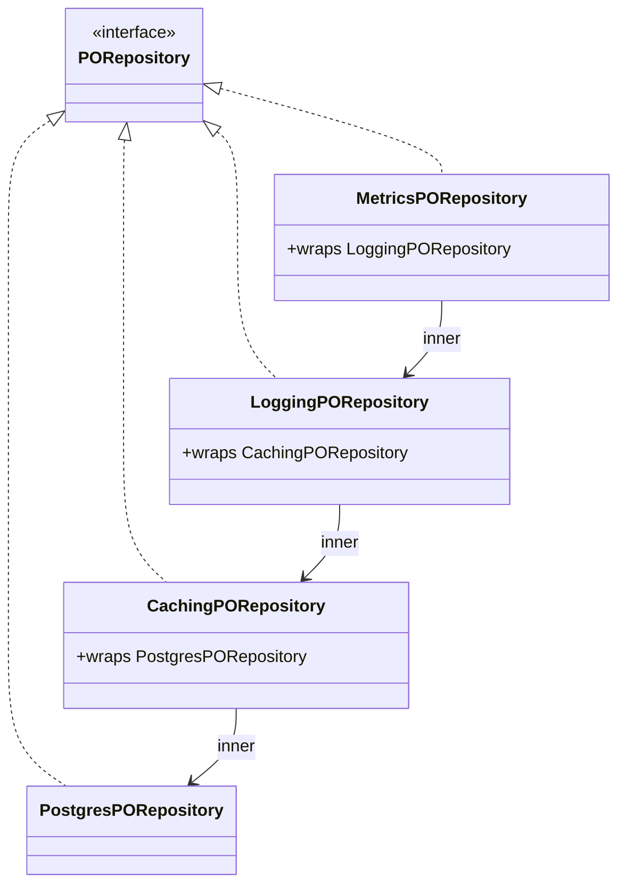




```go
// => Decorator stack assembled in main.go (or wire.go in Wire-based apps).
// => Innermost layer is the real implementation; outermost layer faces the caller.
func BuildPORepository(db *sql.DB, cache Cache, logger *slog.Logger, metrics MetricsCollector) PORepository {
    // => Start with the concrete implementation — no decorators yet.
    postgres := NewPostgresPORepository(db)
    // => Caching layer: reduces DB calls for repeated reads.
    cached := NewCachingPORepository(postgres, cache, 5*time.Minute)
    // => Logging layer: structured log for every method call.
    logged := NewLoggingPORepository(cached, logger)
    // => Metrics layer (outermost): measures total call duration including cache + logging overhead.
    return NewMetricsPORepository(logged, metrics)
}

// => Call order for FindById:
// => Metrics.FindById →  Logging.FindById →  Caching.FindById →  Postgres.FindById
// => ← (timer stop) ← (log result) ←   (populate cache) ←  (return from DB)

// => Adding a new decorator (e.g., circuit breaker) is one line:
// => breaker := NewCircuitBreakerPORepository(logged, cbConfig)
// => return NewMetricsPORepository(breaker, metrics)
// => No existing decorator or the Postgres repo changes at all.
```




```rust
// => In Rust, generic decorators stack via nested generic parameters.
// => The full type encodes the entire decorator stack at compile time — zero dynamic dispatch.
pub fn build_po_repository(
    db: PgPool,
    cache: RedisCache,
    metrics: PrometheusCollector,
) -> impl PORepository {
    // => Inner to outer: Postgres → Caching → Logging → Metrics.
    let postgres = PostgresPORepository::new(db);
    // => Each wrapper layer is a new generic struct wrapping the previous.
    let cached = CachingPORepository::new(postgres, cache, Duration::from_secs(300));
    let logged = LoggingPORepository::new(cached);
    // => MetricsPORepository<LoggingPORepository<CachingPORepository<PostgresPORepository>>>
    // => The compiler generates monomorphized code — no virtual dispatch overhead.
    MetricsPORepository::new(logged, metrics)
}

// => If dynamic dispatch is preferred (simpler types, runtime flexibility):
// => let repo: Box<dyn PORepository> = Box::new(MetricsPORepository::new(
// =>     LoggingPORepository::new(CachingPORepository::new(
// =>         PostgresPORepository::new(db), cache, Duration::from_secs(300)
// =>     )),
// =>     metrics,
// => ));
```




> **Key takeaway**: Decorator stacking adds cross-cutting concerns one layer at a time — each decorator is independently testable, the stack is assembled once at the application boundary.

---

## Command Pattern (Examples 44–48)

### Example 44: Command Pattern — POCommand Interface

The Command pattern encapsulates a request as an object — enabling queuing, logging, and undo. A `CommandBus` routes each command to its registered handler by name, decoupling command senders from command executors. Commands carry all data needed for execution so they can be serialised to a queue or audit log.

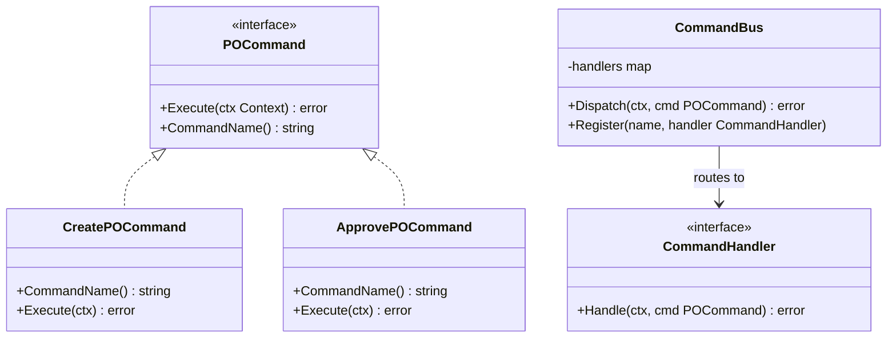




```go
// => POCommand is the Command interface — every command implements Execute and CommandName.
// => CommandName is the routing key used by CommandBus to find the right handler.
type POCommand interface {
    // => Execute carries out the command using the provided context.
    // => Context carries deadline, cancellation, and request-scoped values (e.g., actor ID).
    Execute(ctx context.Context) error
    // => CommandName returns a stable string identifier for routing and audit logging.
    CommandName() string
}

// => CommandHandler is the handler interface — each command type has one handler.
// => Separating Command from Handler allows handlers to be tested independently of dispatch.
type CommandHandler interface {
    Handle(ctx context.Context, cmd POCommand) error
}

// => CommandBus routes commands to registered handlers by command name.
// => The bus is the single dispatch point — callers never reference handlers directly.
type CommandBus struct {
    // => handlers maps command names to their registered handlers.
    handlers map[string]CommandHandler
}

// => NewCommandBus initialises an empty bus — handlers registered before first dispatch.
func NewCommandBus() *CommandBus {
    return &CommandBus{handlers: make(map[string]CommandHandler)}
}

// => Register associates a command name with its handler.
// => Called at application startup when wiring dependencies.
func (b *CommandBus) Register(name string, h CommandHandler) {
    b.handlers[name] = h
}

// => Dispatch looks up the handler for the command and delegates execution.
// => Unregistered commands return an error — fail loudly, never silently drop commands.
func (b *CommandBus) Dispatch(ctx context.Context, cmd POCommand) error {
    handler, ok := b.handlers[cmd.CommandName()]
    if !ok {
        // => Unregistered command: programming error, not a runtime domain error.
        return fmt.Errorf("no handler registered for command %q", cmd.CommandName())
    }
    // => Delegate to the registered handler — bus does not execute business logic itself.
    return handler.Handle(ctx, cmd)
}
```




```rust
// => POCommand trait in Rust — async execute for commands that perform I/O.
// => command_name returns &'static str — zero allocation, stable routing key.
#[async_trait::async_trait]
pub trait POCommand: Send + Sync {
    async fn execute(&self, ctx: &CommandContext) -> Result<(), CommandError>;
    fn command_name(&self) -> &'static str;
}

// => CommandBus stores handlers as Box<dyn CommandHandler> trait objects.
// => HashMap keyed by &'static str — command names are compile-time string literals.
pub struct CommandBus {
    handlers: HashMap<&'static str, Box<dyn CommandHandler + Send + Sync>>,
}

// => CommandHandler trait — one impl per command type.
#[async_trait::async_trait]
pub trait CommandHandler: Send + Sync {
    async fn handle(&self, ctx: &CommandContext, cmd: &dyn POCommand) -> Result<(), CommandError>;
}

impl CommandBus {
    pub fn new() -> Self {
        Self { handlers: HashMap::new() }
    }

    // => register() stores a handler for a given command name.
    pub fn register(&mut self, name: &'static str, handler: impl CommandHandler + 'static) {
        self.handlers.insert(name, Box::new(handler));
    }

    // => dispatch() routes the command to its handler or returns UnknownCommand error.
    pub async fn dispatch(&self, ctx: &CommandContext, cmd: &dyn POCommand) -> Result<(), CommandError> {
        let handler = self.handlers.get(cmd.command_name())
            .ok_or_else(|| CommandError::UnknownCommand(cmd.command_name()))?;
        // => Delegate — bus adds no business logic, only routing.
        handler.handle(ctx, cmd).await
    }
}
```




> **Key takeaway**: `CommandBus` is pure routing — it maps command names to handlers and adds zero business logic, keeping commands, handlers, and the bus independently testable.

---

### Example 45: CreatePOCommand

`CreatePOCommand` carries all input needed to create a new PO — supplier ID, line items, and the requesting user. The handler is an application service: it creates the domain aggregate, persists it, publishes domain events, and returns the new PO ID. Commands carry DTOs (not domain types) because they cross application boundaries.

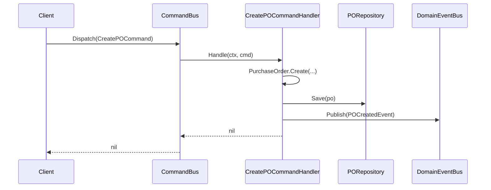




```go
// => CreatePOCommand is a plain struct — all input data for PO creation.
// => Carries primitive types and DTOs, not domain types — safe to serialise/queue.
type CreatePOCommand struct {
    SupplierId  SupplierId
    LineItems   []CreateLineItemInput
    // => RequestedBy is the actor for audit trail — propagated from request context.
    RequestedBy string
}

// => CommandName identifies this command for bus routing and audit logging.
func (c CreatePOCommand) CommandName() string { return "procurement.create_po" }

// => CreatePOCommandHandler is the application service for PO creation.
// => Depends on repository and event bus ports — both are interfaces for testability.
type CreatePOCommandHandler struct {
    repo   PurchaseOrderRepository
    events DomainEventBus
}

// => Handle orchestrates domain creation, persistence, and event publication.
// => This is the application service layer: no business rules here, only coordination.
func (h *CreatePOCommandHandler) Handle(ctx context.Context, cmd POCommand) error {
    // => Type-assert the generic cmd to CreatePOCommand to access typed fields.
    c, ok := cmd.(CreatePOCommand)
    if !ok {
        return fmt.Errorf("unexpected command type %T", cmd)
    }
    // => Create the PO aggregate — domain rules enforced inside PurchaseOrder.Create.
    po, err := PurchaseOrder.Create(c.SupplierId, c.LineItems, c.RequestedBy)
    if err != nil {
        // => Domain validation error — not a system error; return as-is.
        return err
    }
    // => Persist the new aggregate — repository handles the SQL/DB layer.
    if err := h.repo.Save(ctx, po); err != nil {
        return fmt.Errorf("save created PO: %w", err)
    }
    // => Publish domain events collected by the aggregate during creation.
    for _, event := range po.Events() {
        if err := h.events.Publish(event); err != nil {
            // => Log event publication failure; PO already saved — do not roll back.
            // => At-least-once delivery: outbox pattern handles re-publication.
            slog.Error("failed to publish domain event", "event", event, "error", err)
        }
    }
    return nil
}
```




```rust
// => CreatePOCommand is a plain data struct — serialisable, no domain types embedded.
#[derive(Debug, Clone)]
pub struct CreatePOCommand {
    pub supplier_id: SupplierId,
    pub line_items: Vec<CreateLineItemInput>,
    // => requested_by carries the actor for the audit trail.
    pub requested_by: String,
}

// => CommandName returns a &'static str — zero allocation, compile-time constant.
impl POCommand for CreatePOCommand {
    async fn execute(&self, _ctx: &CommandContext) -> Result<(), CommandError> {
        // => execute() not used when CommandBus routes to separate handlers.
        // => If using self-contained commands, business logic goes here.
        unimplemented!("use CreatePOCommandHandler via CommandBus")
    }
    fn command_name(&self) -> &'static str { "procurement.create_po" }
}

// => CreatePOCommandHandler orchestrates aggregate creation and persistence.
pub struct CreatePOCommandHandler {
    repo: Arc<dyn PurchaseOrderRepository + Send + Sync>,
    events: Arc<dyn DomainEventBus + Send + Sync>,
}

#[async_trait::async_trait]
impl CommandHandler for CreatePOCommandHandler {
    async fn handle(&self, _ctx: &CommandContext, cmd: &dyn POCommand) -> Result<(), CommandError> {
        // => Downcast the trait object to the concrete command type.
        let c = cmd.as_any().downcast_ref::<CreatePOCommand>()
            .ok_or(CommandError::WrongCommandType)?;
        // => Create aggregate — domain rules enforced inside PurchaseOrder::create.
        let po = PurchaseOrder::create(&c.supplier_id, &c.line_items, &c.requested_by)
            .map_err(CommandError::DomainError)?;
        // => Persist — ? propagates RepoError as CommandError.
        self.repo.save(&po).await
            .map_err(CommandError::PersistenceError)?;
        // => Publish domain events; log failures but don't roll back already-saved PO.
        for event in po.events() {
            if let Err(e) = self.events.publish(event).await {
                tracing::error!(error = ?e, "failed to publish domain event");
            }
        }
        Ok(())
    }
}
```




> **Key takeaway**: The handler is an application service — it coordinates domain, persistence, and events but contains no business rules; those live exclusively in the `PurchaseOrder` aggregate.

---

### Example 46: ApprovePOCommand with Undo Capability

Commands can support undo by capturing the pre-command state before execution. Approval undo reverts the PO to its pre-approval status. `UndoableApprovePOCommand` decorates the base command, capturing state on the first `Execute` call and restoring it on `Undo`.

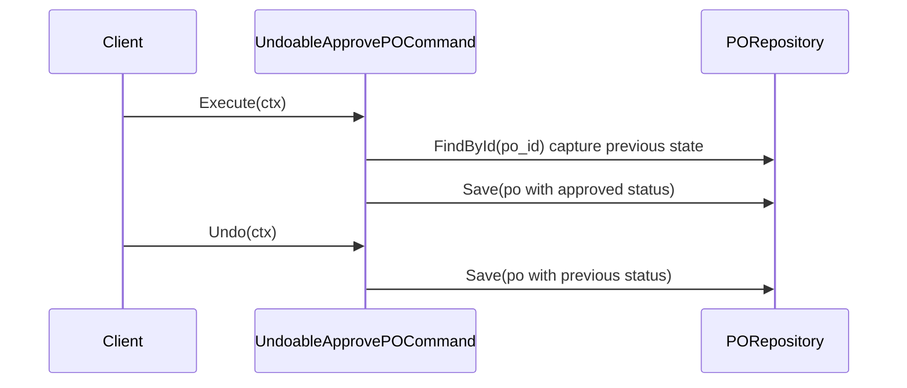




```go
// => ApprovePOCommand carries the PO identifier, approver identity, and approval level.
type ApprovePOCommand struct {
    POId       PurchaseOrderId
    ApprovedBy string
    Level      ApprovalLevel
}

// => CommandName is the routing key for the command bus.
func (c ApprovePOCommand) CommandName() string { return "procurement.approve_po" }

// => UndoableApprovePOCommand decorates ApprovePOCommand with undo capability.
// => previousStatus stores the pre-approval state captured on first Execute.
type UndoableApprovePOCommand struct {
    ApprovePOCommand
    // => previousStatus captured before approval; nil until Execute is called.
    previousStatus *POStatus
    repo           PORepository
}

// => Execute approves the PO and captures the previous status for potential undo.
func (u *UndoableApprovePOCommand) Execute(ctx context.Context) error {
    // => Fetch current state before modification — this is the undo snapshot.
    po, err := u.repo.FindById(ctx, u.POId)
    if err != nil {
        return fmt.Errorf("fetch PO for approval: %w", err)
    }
    // => Capture status before mutation.
    prev := po.Status()
    u.previousStatus = &prev
    // => Apply approval — domain logic inside PO.Approve validates level + actor.
    if err := po.Approve(u.ApprovedBy, u.Level); err != nil {
        return err
    }
    return u.repo.Save(ctx, po)
}

// => Undo reverts the PO to its pre-approval status.
// => Undo is not always safe — e.g., if payment has been released, undo may be blocked.
func (u *UndoableApprovePOCommand) Undo(ctx context.Context) error {
    if u.previousStatus == nil {
        // => Execute was never called — nothing to undo.
        return ErrNothingToUndo
    }
    po, err := u.repo.FindById(ctx, u.POId)
    if err != nil {
        return fmt.Errorf("fetch PO for undo: %w", err)
    }
    // => Revert to the captured status — business rules may reject the revert.
    if err := po.RevertStatus(*u.previousStatus); err != nil {
        return fmt.Errorf("revert approval: %w", err)
    }
    return u.repo.Save(ctx, po)
}
```




```rust
// => ApprovePOCommand: basic command struct.
#[derive(Debug, Clone)]
pub struct ApprovePOCommand {
    pub po_id: PurchaseOrderId,
    pub approved_by: String,
    pub level: ApprovalLevel,
}

// => UndoableApproveCommand wraps the basic command with captured pre-state.
// => Mutex<Option<POStatus>> allows interior mutability in an immutable &self context.
pub struct UndoableApproveCommand {
    inner: ApprovePOCommand,
    previous_status: Mutex<Option<POStatus>>,
    repo: Arc<dyn PORepository + Send + Sync>,
}

impl UndoableApproveCommand {
    pub fn new(inner: ApprovePOCommand, repo: Arc<dyn PORepository + Send + Sync>) -> Self {
        Self { inner, previous_status: Mutex::new(None), repo }
    }

    // => execute() captures status, approves, then saves.
    pub async fn execute(&self) -> Result<(), CommandError> {
        let po = self.repo.find_by_id(&self.inner.po_id).await
            .map_err(CommandError::PersistenceError)?;
        // => Store previous status inside Mutex for later undo.
        *self.previous_status.lock().unwrap() = Some(po.status().clone());
        let mut po = po;
        po.approve(&self.inner.approved_by, self.inner.level.clone())
            .map_err(CommandError::DomainError)?;
        self.repo.save(&po).await.map_err(CommandError::PersistenceError)
    }

    // => undo() restores the previously captured status.
    pub async fn undo(&self) -> Result<(), CommandError> {
        let prev = self.previous_status.lock().unwrap().clone()
            .ok_or(CommandError::NothingToUndo)?;
        let mut po = self.repo.find_by_id(&self.inner.po_id).await
            .map_err(CommandError::PersistenceError)?;
        po.revert_status(prev).map_err(CommandError::DomainError)?;
        self.repo.save(&po).await.map_err(CommandError::PersistenceError)
    }
}
```




> **Key takeaway**: Undo stores the pre-execution snapshot before modifying state — once the system has acted on a PO downstream (payment released, supplier notified), undo may be blocked by domain rules.

---

### Example 47: Command History (Undo Stack)

Recording executed commands in a bounded stack enables both an audit log and multi-step undo. The history is LIFO — the most recently executed command is undone first. Bounded size prevents unbounded memory growth; a durable audit log requires persisting the history to the database.




```go
// => UndoableCommand extends POCommand with an Undo method.
// => Not all commands are undoable — only those that implement this interface.
type UndoableCommand interface {
    POCommand
    Undo(ctx context.Context) error
}

// => CommandHistory maintains a LIFO stack of executed undoable commands.
// => maxLen bounds the stack — commands beyond maxLen are evicted (oldest first).
type CommandHistory struct {
    history []UndoableCommand
    maxLen  int
    mu      sync.Mutex
}

// => NewCommandHistory creates a bounded history stack.
func NewCommandHistory(maxLen int) *CommandHistory {
    return &CommandHistory{maxLen: maxLen, history: make([]UndoableCommand, 0, maxLen)}
}

// => Push appends an executed command to the history stack.
// => If the stack is at capacity, the oldest command is evicted (FIFO eviction).
func (h *CommandHistory) Push(cmd UndoableCommand) {
    h.mu.Lock()
    defer h.mu.Unlock()
    if len(h.history) >= h.maxLen {
        // => Evict the oldest command (front of slice) to stay within bounds.
        h.history = h.history[1:]
    }
    h.history = append(h.history, cmd)
}

// => Undo pops the most recent command from the stack and calls its Undo method.
// => Returns ErrEmptyHistory if there is nothing to undo.
func (h *CommandHistory) Undo(ctx context.Context) error {
    h.mu.Lock()
    if len(h.history) == 0 {
        h.mu.Unlock()
        return ErrEmptyHistory
    }
    // => Pop the last command — LIFO ensures most recent undo happens first.
    last := h.history[len(h.history)-1]
    h.history = h.history[:len(h.history)-1]
    h.mu.Unlock()
    // => Execute Undo outside the lock — undo may call back into the repository.
    return last.Undo(ctx)
}
```




```rust
// => UndoableCommand trait extends POCommand with an async undo method.
#[async_trait::async_trait]
pub trait UndoableCommand: POCommand {
    async fn undo(&self) -> Result<(), CommandError>;
}

// => CommandHistory stores boxed trait objects — any UndoableCommand can be pushed.
pub struct CommandHistory {
    // => VecDeque supports efficient pop from either end; used as a bounded stack.
    history: Mutex<std::collections::VecDeque<Box<dyn UndoableCommand + Send + Sync>>>,
    max_len: usize,
}

impl CommandHistory {
    pub fn new(max_len: usize) -> Self {
        Self {
            history: Mutex::new(std::collections::VecDeque::with_capacity(max_len)),
            max_len,
        }
    }

    // => push() adds a command; evicts front (oldest) when at capacity.
    pub fn push(&self, cmd: Box<dyn UndoableCommand + Send + Sync>) {
        let mut history = self.history.lock().unwrap();
        if history.len() >= self.max_len {
            // => pop_front() removes the oldest command to make room.
            history.pop_front();
        }
        history.push_back(cmd);
    }

    // => undo() pops the most recent command and calls its undo().
    pub async fn undo(&self) -> Result<(), CommandError> {
        let cmd = {
            let mut history = self.history.lock().unwrap();
            // => pop_back() removes the most recently pushed command (LIFO).
            history.pop_back().ok_or(CommandError::EmptyHistory)?
        };
        // => Execute undo outside the lock — may do async I/O.
        cmd.undo().await
    }
}
```




> **Key takeaway**: Releasing the history lock before calling `Undo` prevents deadlocks when the undo implementation itself interacts with the command bus or repository.

---

### Example 48: Macro Command (Composite Command)

A Macro command executes multiple commands as a single logical unit — if any step fails, already-executed commands are compensated in reverse order. This is a application-layer saga for operations that span multiple aggregates or services. Unlike a database transaction, compensation is business logic, not a rollback.

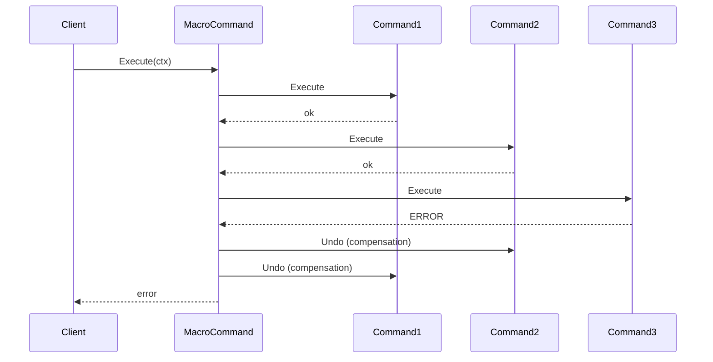




```go
// => MacroCommand composes multiple commands into one atomic-by-compensation unit.
// => commands must all implement UndoableCommand — compensation requires Undo.
type MacroCommand struct {
    commands []UndoableCommand
}

// => NewMacroCommand validates that at least one command is present.
func NewMacroCommand(commands ...UndoableCommand) (*MacroCommand, error) {
    if len(commands) == 0 {
        return nil, ErrEmptyMacroCommand
    }
    return &MacroCommand{commands: commands}, nil
}

// => CommandName identifies the macro for audit logging.
func (m *MacroCommand) CommandName() string { return "macro" }

// => Execute runs all commands in order; compensates in reverse on any failure.
func (m *MacroCommand) Execute(ctx context.Context) error {
    // => executed tracks commands that succeeded so we can undo them on failure.
    executed := make([]UndoableCommand, 0, len(m.commands))
    for _, cmd := range m.commands {
        if err := cmd.Execute(ctx); err != nil {
            // => One command failed — compensate all previously executed commands.
            // => Iterate in reverse order to undo most recent first.
            for i := len(executed) - 1; i >= 0; i-- {
                if undoErr := executed[i].Undo(ctx); undoErr != nil {
                    // => Compensation failure: log and continue — best-effort compensation.
                    slog.Error("compensation failed", "command", executed[i].CommandName(), "error", undoErr)
                }
            }
            return fmt.Errorf("macro command failed at %q: %w", cmd.CommandName(), err)
        }
        // => Command succeeded — track it for potential compensation.
        executed = append(executed, cmd)
    }
    return nil
}
```




```rust
// => MacroCommand owns a Vec of boxed UndoableCommands — executed in order.
pub struct MacroCommand {
    commands: Vec<Box<dyn UndoableCommand + Send + Sync>>,
}

impl MacroCommand {
    pub fn new(commands: Vec<Box<dyn UndoableCommand + Send + Sync>>) -> Result<Self, CommandError> {
        if commands.is_empty() {
            return Err(CommandError::EmptyMacro);
        }
        Ok(Self { commands })
    }

    // => execute() runs commands sequentially with compensation on failure.
    pub async fn execute(&self, ctx: &CommandContext) -> Result<(), CommandError> {
        let mut executed_count = 0usize;
        for cmd in &self.commands {
            if let Err(e) = cmd.execute(ctx).await {
                // => Compensate in reverse — most recently executed command undone first.
                for i in (0..executed_count).rev() {
                    if let Err(undo_err) = self.commands[i].undo().await {
                        // => Log compensation failure — do not abort compensation loop.
                        tracing::error!(
                            command = self.commands[i].command_name(),
                            error = ?undo_err,
                            "compensation failed"
                        );
                    }
                }
                return Err(CommandError::MacroFailed {
                    failed_at: cmd.command_name(),
                    source: Box::new(e),
                });
            }
            executed_count += 1;
        }
        Ok(())
    }
}
```




> **Key takeaway**: MacroCommand compensation is best-effort — a compensation failure is logged but does not abort the remaining compensation loop, accepting partial inconsistency in exchange for completing as much cleanup as possible.

---

## Builder / Functional Options (Examples 49–53)

### Example 49: Builder Pattern for PurchaseOrder Configuration

The Builder pattern constructs complex objects step-by-step — especially useful when an aggregate or configuration struct has many optional fields but a few required ones. Method chaining returns the builder on each call (fluent interface). `Build()` validates required fields and returns an error if any are missing.

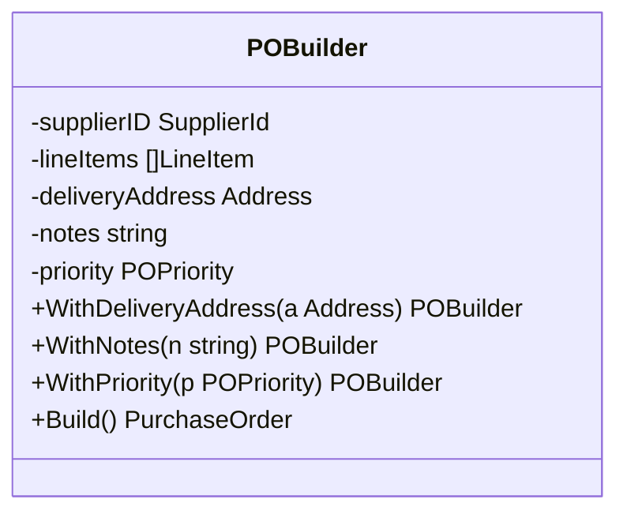




```go
// => POBuilder accumulates optional PO fields before validation and construction.
// => Required fields (supplierID, lineItems) are set via the constructor, not method chaining.
type POBuilder struct {
    supplierID      SupplierId
    lineItems       []LineItem
    // => Optional fields default to zero values when not set.
    deliveryAddress *Address
    notes           string
    priority        POPriority
}

// => NewPOBuilder takes required fields — Build() cannot succeed without them.
func NewPOBuilder(supplierID SupplierId, lineItems []LineItem) *POBuilder {
    return &POBuilder{
        supplierID: supplierID,
        lineItems:  lineItems,
        // => priority defaults to Normal — zero value is valid here.
        priority:   POPriorityNormal,
    }
}

// => WithDeliveryAddress sets the optional delivery address and returns the builder.
// => Return *POBuilder enables method chaining: builder.WithAddress(a).WithNotes(n).Build().
func (b *POBuilder) WithDeliveryAddress(a Address) *POBuilder {
    b.deliveryAddress = &a
    return b
}

// => WithNotes attaches a free-text note to the PO.
func (b *POBuilder) WithNotes(notes string) *POBuilder {
    b.notes = notes
    return b
}

// => WithPriority overrides the default Normal priority.
func (b *POBuilder) WithPriority(p POPriority) *POBuilder {
    b.priority = p
    return b
}

// => Build validates required fields and constructs the PurchaseOrder.
// => All optional fields default to zero values if not set via With* methods.
func (b *POBuilder) Build() (*PurchaseOrder, error) {
    if b.supplierID == "" {
        return nil, ErrMissingSupplier
    }
    if len(b.lineItems) == 0 {
        return nil, ErrNoLineItems
    }
    // => Construct the aggregate from builder state — validation passed.
    return &PurchaseOrder{
        supplierID:      b.supplierID,
        lineItems:       b.lineItems,
        deliveryAddress: b.deliveryAddress,
        notes:           b.notes,
        priority:        b.priority,
        status:          POStatusDraft,
    }, nil
}
```




```rust
// => POBuilder in Rust follows the same pattern but uses Option for optional fields.
// => #[derive(Default)] is not used — required fields have no sensible defaults.
pub struct POBuilder {
    supplier_id: Option<SupplierId>,
    line_items: Vec<LineItem>,
    delivery_address: Option<Address>,
    notes: Option<String>,
    priority: POPriority,
}

impl POBuilder {
    // => new() takes no arguments — required fields set via setter methods or set_supplier().
    pub fn new() -> Self {
        Self {
            supplier_id: None,
            line_items: Vec::new(),
            delivery_address: None,
            notes: None,
            // => Default priority is Normal — sensible zero value for most POs.
            priority: POPriority::Normal,
        }
    }

    // => set_supplier() is required before build() — returns self for chaining.
    pub fn set_supplier(mut self, id: SupplierId) -> Self {
        self.supplier_id = Some(id);
        self
    }

    // => add_line_item() accumulates line items before build().
    pub fn add_line_item(mut self, item: LineItem) -> Self {
        self.line_items.push(item);
        self
    }

    // => with_delivery_address() sets optional address.
    pub fn with_delivery_address(mut self, addr: Address) -> Self {
        self.delivery_address = Some(addr);
        self
    }

    // => build() validates required fields; returns Err if supplier or items missing.
    pub fn build(self) -> Result<PurchaseOrder, BuilderError> {
        let supplier_id = self.supplier_id.ok_or(BuilderError::MissingSupplier)?;
        if self.line_items.is_empty() {
            return Err(BuilderError::NoLineItems);
        }
        Ok(PurchaseOrder {
            supplier_id,
            line_items: self.line_items,
            delivery_address: self.delivery_address,
            notes: self.notes.unwrap_or_default(),
            priority: self.priority,
            status: POStatus::Draft,
        })
    }
}
```




> **Key takeaway**: Builder required fields in the constructor and optional fields via fluent setters makes the "what is mandatory" contract visible at the call site.

---

### Example 50: Functional Options Pattern (Go Idiomatic Builder)

Functional options are the idiomatic Go alternative to Builder — variadic functions of type `func(*Config)` are passed to the constructor. Each option is a closure that sets one field. Zero-value defaults cover unset fields. The pattern is especially natural for configuration structs used in adapters and clients.

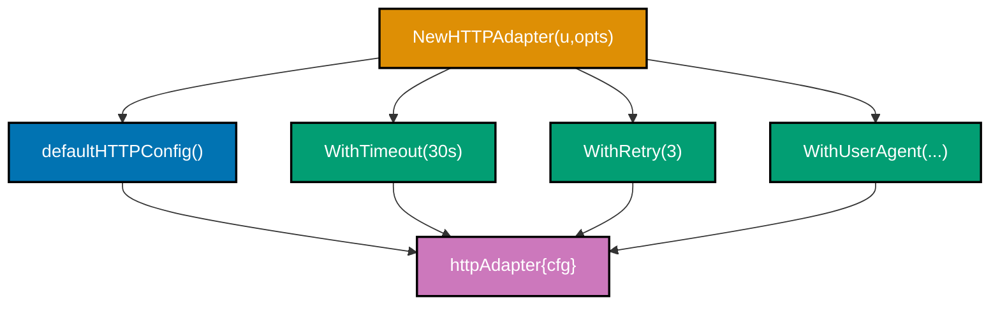




```go
// => HTTPAdapterOption is a function that modifies httpAdapterConfig.
// => Each option is a closure — they are composable and independently testable.
type HTTPAdapterOption func(*httpAdapterConfig)

// => httpAdapterConfig holds all configurable fields for the HTTP adapter.
// => Private type — callers configure via option functions, never direct field access.
type httpAdapterConfig struct {
    timeout    time.Duration
    maxRetries int
    userAgent  string
}

// => WithTimeout returns an option that sets the request timeout.
// => The option is a closure capturing the duration — called by NewHTTPAdapter.
func WithTimeout(d time.Duration) HTTPAdapterOption {
    return func(c *httpAdapterConfig) {
        c.timeout = d
    }
}

// => WithRetry returns an option that sets the maximum retry count.
func WithRetry(max int) HTTPAdapterOption {
    return func(c *httpAdapterConfig) {
        c.maxRetries = max
    }
}

// => WithUserAgent overrides the default User-Agent header string.
func WithUserAgent(ua string) HTTPAdapterOption {
    return func(c *httpAdapterConfig) {
        c.userAgent = ua
    }
}

// => NewHTTPAdapter creates an adapter with defaults then applies each option in order.
// => Variadic `...HTTPAdapterOption` allows zero or more options — clean call site.
func NewHTTPAdapter(baseURL string, opts ...HTTPAdapterOption) *httpAdapter {
    cfg := httpAdapterConfig{
        // => Explicit defaults — zero value for timeout would mean "no timeout" (dangerous).
        timeout:    30 * time.Second,
        maxRetries: 3,
        userAgent:  "procurement-platform/1.0",
    }
    // => Apply each option in order — later options override earlier ones.
    for _, opt := range opts {
        opt(&cfg)
    }
    return &httpAdapter{baseURL: baseURL, cfg: cfg, client: &http.Client{Timeout: cfg.timeout}}
}

// => Usage:
// => adapter := NewHTTPAdapter("https://api.supplier.com")               // all defaults
// => adapter := NewHTTPAdapter("https://api.supplier.com",
// =>     WithTimeout(10 * time.Second),
// =>     WithRetry(5),
// => )
```




```rust
// => Rust idiomatic equivalent is a Builder struct (Go functional options less natural in Rust).
// => Showing Builder for comparison — functional options require additional trait bounds in Rust.
#[derive(Debug)]
pub struct HTTPAdapterConfig {
    pub timeout: Duration,
    pub max_retries: u32,
    pub user_agent: String,
}

// => Default impl provides the same explicit defaults as Go's defaultHTTPConfig().
impl Default for HTTPAdapterConfig {
    fn default() -> Self {
        Self {
            // => Explicit default timeout — avoids the zero-value "no timeout" pitfall.
            timeout: Duration::from_secs(30),
            max_retries: 3,
            user_agent: "procurement-platform/1.0".to_string(),
        }
    }
}

// => HTTPAdapterBuilder uses method chaining; build() finalises.
pub struct HTTPAdapterBuilder {
    base_url: String,
    config: HTTPAdapterConfig,
}

impl HTTPAdapterBuilder {
    // => new() starts with default config — identical to NewHTTPAdapter with no opts.
    pub fn new(base_url: impl Into<String>) -> Self {
        Self { base_url: base_url.into(), config: HTTPAdapterConfig::default() }
    }

    // => Setter methods override specific fields; return Self for chaining.
    pub fn timeout(mut self, d: Duration) -> Self { self.config.timeout = d; self }
    pub fn max_retries(mut self, n: u32) -> Self { self.config.max_retries = n; self }
    pub fn user_agent(mut self, ua: impl Into<String>) -> Self {
        self.config.user_agent = ua.into(); self
    }

    // => build() constructs the adapter — infallible because all fields have valid defaults.
    pub fn build(self) -> HTTPAdapter {
        HTTPAdapter::new(self.base_url, self.config)
    }
}

// => Usage: HTTPAdapterBuilder::new("https://api.supplier.com")
// =>     .timeout(Duration::from_secs(10))
// =>     .max_retries(5)
// =>     .build()
```




> **Key takeaway**: Functional options and Builder both separate "what to configure" from "how to construct" — Go's functional options are idiomatic for variadic config; Rust's Builder enforces required fields at compile time with typestate (Example 53).

---

### Example 51: Functional Options with Validation

Option functions can validate their input at application startup — invalid options fail construction rather than silently producing a broken adapter. Collecting all errors before returning gives callers a complete picture of what is wrong.




```go
// => ValidatedOption is like HTTPAdapterOption but returns an error for invalid values.
// => Returning error from the option allows NewHTTPAdapter to fail early on bad config.
type ValidatedOption func(*httpAdapterConfig) error

// => WithTimeout validates the duration is positive before setting it.
// => Returning an error from the option signals misconfiguration at construction time.
func WithTimeout(d time.Duration) ValidatedOption {
    return func(c *httpAdapterConfig) error {
        if d <= 0 {
            // => Negative or zero timeout would disable the timeout entirely — reject.
            return fmt.Errorf("timeout must be positive, got %v", d)
        }
        c.timeout = d
        return nil
    }
}

// => WithRetry validates the retry count is non-negative.
func WithRetry(max int) ValidatedOption {
    return func(c *httpAdapterConfig) error {
        if max < 0 {
            return fmt.Errorf("max retries must be >= 0, got %d", max)
        }
        c.maxRetries = max
        return nil
    }
}

// => NewHTTPAdapter collects all option errors before returning.
// => Collecting all errors (not just the first) gives callers a complete error report.
func NewHTTPAdapter(baseURL string, opts ...ValidatedOption) (*httpAdapter, error) {
    if baseURL == "" {
        return nil, ErrMissingBaseURL
    }
    cfg := defaultHTTPConfig()
    var errs []error
    for _, opt := range opts {
        if err := opt(&cfg); err != nil {
            // => Collect error but continue applying other options.
            errs = append(errs, err)
        }
    }
    if len(errs) > 0 {
        // => errors.Join (Go 1.20+) combines multiple errors into one.
        return nil, errors.Join(errs...)
    }
    return &httpAdapter{baseURL: baseURL, cfg: cfg}, nil
}
```




```rust
// => AdapterOption is a boxed closure that may fail — validated at build time.
pub type AdapterOption = Box<dyn FnOnce(&mut HTTPAdapterConfig) -> Result<(), OptionError>>;

// => with_timeout returns a validated option closure.
pub fn with_timeout(d: Duration) -> AdapterOption {
    Box::new(move |cfg| {
        if d.is_zero() {
            // => Zero timeout would disable timeout protection — reject at option time.
            return Err(OptionError::InvalidTimeout(d));
        }
        cfg.timeout = d;
        Ok(())
    })
}

// => with_max_retries validates that retry count is reasonable.
pub fn with_max_retries(n: u32) -> AdapterOption {
    Box::new(move |cfg| {
        if n > 10 {
            // => More than 10 retries is likely misconfiguration — hard limit.
            return Err(OptionError::ExcessiveRetries(n));
        }
        cfg.max_retries = n;
        Ok(())
    })
}

// => HTTPAdapterBuilder::build_with_options applies validated options and collects errors.
pub fn build_with_options(
    base_url: String,
    opts: Vec<AdapterOption>,
) -> Result<HTTPAdapter, Vec<OptionError>> {
    let mut config = HTTPAdapterConfig::default();
    let errors: Vec<OptionError> = opts.into_iter()
        // => Apply each option; collect Err variants into a Vec.
        .filter_map(|opt| opt(&mut config).err())
        .collect();
    if !errors.is_empty() {
        // => Return all errors at once — caller sees the full misconfiguration report.
        return Err(errors);
    }
    Ok(HTTPAdapter::new(base_url, config))
}
```




> **Key takeaway**: Collecting all option errors before returning gives callers a complete misconfiguration report — one error per violated constraint instead of one error per build attempt.

---

### Example 52: Default-with-Override Pattern

Explicit defaults documented in a `defaultConfig()` function or `Default::default()` impl make intended values self-documenting. A zero value for `timeout` means "no timeout" in most HTTP clients — a dangerous default that explicit documentation prevents.




```go
// => defaultHTTPConfig returns explicit, documented defaults for the HTTP adapter.
// => Zero values for time.Duration mean "no timeout" — explicitly set here to avoid the trap.
func defaultHTTPConfig() httpAdapterConfig {
    return httpAdapterConfig{
        // => 30s is a reasonable default for supplier API calls — not zero (no timeout).
        timeout:    30 * time.Second,
        // => Three retries balances reliability vs. latency for transient failures.
        maxRetries: 3,
        // => User-Agent identifies the service for supplier API rate limiting and logs.
        userAgent:  "procurement-platform/1.0",
    }
}

// => NewHTTPAdapter applies defaults first, then overrides with caller-provided options.
func NewHTTPAdapter(baseURL string, opts ...HTTPAdapterOption) *httpAdapter {
    // => Start from explicit defaults — never from zero values.
    cfg := defaultHTTPConfig()
    for _, opt := range opts {
        // => Each option overrides exactly one field — others remain at default.
        opt(&cfg)
    }
    return &httpAdapter{baseURL: baseURL, cfg: cfg}
}

// => Pattern benefits:
// => 1. defaultHTTPConfig() documents intended production defaults in one place.
// => 2. Callers override only what differs — minimal, readable call sites.
// => 3. Tests can use NewHTTPAdapter("url") with no opts and get sensible behaviour.
// => 4. Zero-value ambiguity (0 timeout = no timeout) is eliminated by explicit default.
```




```rust
// => Default::default() is the Rust equivalent of defaultHTTPConfig() — standard trait.
// => Deriving Default would give zero values; manual impl here sets domain-appropriate defaults.
impl Default for HTTPAdapterConfig {
    fn default() -> Self {
        Self {
            // => 30 seconds: same rationale as Go — avoid zero-means-no-timeout trap.
            timeout: Duration::from_secs(30),
            // => Three retries: see Go comments above.
            max_retries: 3,
            // => Explicit User-Agent for API rate limiting identification.
            user_agent: "procurement-platform/1.0".to_string(),
        }
    }
}

// => Builder starts from Default and applies only caller-specified overrides.
impl HTTPAdapterBuilder {
    pub fn new(base_url: impl Into<String>) -> Self {
        // => Default::default() provides the documented baseline — no zero-value surprises.
        Self { base_url: base_url.into(), config: HTTPAdapterConfig::default() }
    }
    // => Each setter overrides a single field; all others remain at default.
    pub fn timeout(mut self, d: Duration) -> Self { self.config.timeout = d; self }
}

// => cargo doc generates documentation from doc comments on Default::default() —
// => explicit defaults become part of the public API documentation automatically.
```




> **Key takeaway**: Explicit defaults in a named function or `Default` impl eliminate zero-value ambiguity — a reviewer reading `defaultHTTPConfig()` instantly understands what the system does with no configuration.

---

### Example 53: Builder Validation — Type-State Builder in Rust

The Rust typestate builder enforces required fields at compile time using phantom type parameters. A `build()` method only exists when the builder is in the fully-populated state — incomplete builders cannot call `build()`, and the error is a compile error, not a runtime panic.

```mermaid
classDiagram
    class Missing {
        <<marker>>
    }
    class Present {
        <<marker>>
    }
    class POBuilder_Missing_Missing {
        +set_supplier#40;id#41; POBuilder_Present_Missing
    }
    class POBuilder_Present_Missing {
        +add_items#40;items#41; POBuilder_Present_Present
    }
    class POBuilder_Present_Present {
        +build#40;#41; PurchaseOrder
    }
    POBuilder_Missing_Missing --> POBuilder_Present_Missing : set_supplier
    POBuilder_Present_Missing --> POBuilder_Present_Present : add_items
    POBuilder_Present_Present --> POBuilder_Present_Present : build available
```




```go
// => Go: runtime validation in Build() — compile-time enforcement is not available.
// => The best Go can do is return an error from Build() for missing required fields.
func (b *POBuilder) Build() (*PurchaseOrder, error) {
    // => Validate required fields at build time — fails at runtime if caller forgot them.
    if b.supplierID == "" {
        return nil, fmt.Errorf("POBuilder.Build: supplier ID is required")
    }
    if len(b.lineItems) == 0 {
        return nil, fmt.Errorf("POBuilder.Build: at least one line item is required")
    }
    // => Optional fields have zero values — no validation needed for them.
    return &PurchaseOrder{
        supplierID: b.supplierID,
        lineItems:  b.lineItems,
        priority:   b.priority,
    }, nil
}
// => In Go, the builder is always in a single state — missing required fields only
// => detected at Build() time. Rust typestate moves this to compile time (see Rust tab).
```




```rust
// => Marker types with no data — only used as type parameters to track builder state.
// => Missing and Present are zero-size types (ZSTs); they carry no runtime cost.
pub struct Missing;
pub struct Present;

// => POBuilder is generic over two type parameters: HasSupplier and HasItems.
// => PhantomData<T> carries the type information without any actual field of type T.
pub struct POBuilder<HasSupplier, HasItems> {
    supplier_id: Option<SupplierId>,
    line_items: Vec<LineItem>,
    priority: POPriority,
    // => PhantomData markers track compile-time state without runtime overhead.
    _supplier: std::marker::PhantomData<HasSupplier>,
    _items: std::marker::PhantomData<HasItems>,
}

// => Initial state: both required fields missing.
// => new() returns POBuilder<Missing, Missing> — build() is not available on this type.
impl POBuilder<Missing, Missing> {
    pub fn new() -> Self {
        Self {
            supplier_id: None,
            line_items: Vec::new(),
            priority: POPriority::Normal,
            _supplier: std::marker::PhantomData,
            _items: std::marker::PhantomData,
        }
    }
}

// => set_supplier transitions HasSupplier from Missing to Present.
// => Returns POBuilder<Present, HasItems> — supplier is now known to be set.
impl<H> POBuilder<Missing, H> {
    pub fn set_supplier(mut self, id: SupplierId) -> POBuilder<Present, H> {
        self.supplier_id = Some(id);
        // => Transmute the phantom type — no data movement, only type change.
        POBuilder {
            supplier_id: self.supplier_id,
            line_items: self.line_items,
            priority: self.priority,
            _supplier: std::marker::PhantomData,
            _items: std::marker::PhantomData,
        }
    }
}

// => add_items transitions HasItems from Missing to Present.
impl<S> POBuilder<S, Missing> {
    pub fn add_items(mut self, items: Vec<LineItem>) -> POBuilder<S, Present> {
        self.line_items = items;
        POBuilder {
            supplier_id: self.supplier_id,
            line_items: self.line_items,
            priority: self.priority,
            _supplier: std::marker::PhantomData,
            _items: std::marker::PhantomData,
        }
    }
}

// => build() is ONLY available when BOTH type params are Present.
// => Calling build() on POBuilder<Missing, _> or POBuilder<_, Missing> is a compile error.
impl POBuilder<Present, Present> {
    pub fn build(self) -> PurchaseOrder {
        // => All required fields are guaranteed set — no runtime validation needed.
        PurchaseOrder {
            supplier_id: self.supplier_id.unwrap(), // => unwrap safe: Present guarantees Some
            line_items: self.line_items,
            priority: self.priority,
            status: POStatus::Draft,
        }
    }
}
// => POBuilder::new().set_supplier(id).add_items(items).build() — compiles.
// => POBuilder::new().add_items(items).build() — COMPILE ERROR: build not in scope.
```




> **Key takeaway**: Rust's typestate builder moves "missing required field" from a runtime panic to a compile error — the type system proves completeness before execution begins.

---

## Pipeline and Middleware (Examples 54–57)

### Example 54: Pipeline Pattern — Handler Chain

The Pipeline pattern chains handlers where each processes input and passes to the next — reusable middleware for cross-cutting concerns. Each handler in the chain can inspect, modify, or reject the PO before passing it forward. The pipeline terminates on the first error and does not call subsequent handlers.

```mermaid
graph TD
    A["PO Input"]:::blue
    B["ValidationHandler"]:::teal
    C["AuditLogHandler"]:::orange
    D["BusinessRulesHandler"]:::teal
    E["PO Output"]:::blue
    F["Error"]:::purple
    A --> B
    B -->|ok| C
    B -->|error| F
    C -->|ok| D
    D -->|ok| E
    D -->|error| F

    classDef blue fill:#0173B2,stroke:#000000,color:#FFFFFF,stroke-width:2px
    classDef teal fill:#029E73,stroke:#000000,color:#FFFFFF,stroke-width:2px
    classDef orange fill:#DE8F05,stroke:#000000,color:#FFFFFF,stroke-width:2px
    classDef purple fill:#CC78BC,stroke:#000000,color:#FFFFFF,stroke-width:2px
```




```go
// => POHandler is the pipeline stage interface — each stage receives and returns a *PurchaseOrder.
// => Returning a modified PO allows handlers to enrich or transform the aggregate.
type POHandler interface {
    Handle(ctx context.Context, po *PurchaseOrder) (*PurchaseOrder, error)
}

// => Pipeline executes a sequence of handlers in order.
// => Each handler may transform the PO; the modified PO is passed to the next handler.
type Pipeline struct {
    handlers []POHandler
}

// => NewPipeline constructs a pipeline from a list of handlers.
func NewPipeline(handlers ...POHandler) *Pipeline {
    return &Pipeline{handlers: handlers}
}

// => Execute runs the pipeline; returns the final transformed PO or the first error.
func (p *Pipeline) Execute(ctx context.Context, po *PurchaseOrder) (*PurchaseOrder, error) {
    current := po
    for _, handler := range p.handlers {
        // => Pass the current (possibly modified) PO to the next handler.
        result, err := handler.Handle(ctx, current)
        if err != nil {
            // => First error terminates the pipeline — subsequent handlers not called.
            return nil, fmt.Errorf("pipeline handler %T: %w", handler, err)
        }
        // => Replace current with the handler's output for the next stage.
        current = result
    }
    // => All handlers completed — return the fully processed PO.
    return current, nil
}
```




```rust
// => POHandler trait — each stage takes ownership of PO, returns it (possibly modified).
// => Ownership transfer enforces that each handler works on the most recent version.
#[async_trait::async_trait]
pub trait POHandler: Send + Sync {
    async fn handle(&self, ctx: &Context, po: PurchaseOrder) -> Result<PurchaseOrder, HandlerError>;
}

// => Pipeline owns a Vec of boxed handlers.
pub struct Pipeline {
    // => Box<dyn POHandler> for type erasure — different handler types in one Vec.
    handlers: Vec<Box<dyn POHandler + Send + Sync>>,
}

impl Pipeline {
    pub fn new(handlers: Vec<Box<dyn POHandler + Send + Sync>>) -> Self {
        Self { handlers }
    }

    // => execute() threads the PO through each handler via move semantics.
    // => On error, the PO is lost (consumed by the failing handler) — pipeline aborts.
    pub async fn execute(&self, ctx: &Context, po: PurchaseOrder) -> Result<PurchaseOrder, HandlerError> {
        let mut current = po;
        for handler in &self.handlers {
            // => Move current into handler; handler returns modified PO or error.
            current = handler.handle(ctx, current).await
                .map_err(|e| HandlerError::PipelineFailed {
                    handler: std::any::type_name_of_val(handler.as_ref()),
                    source: Box::new(e),
                })?;
        }
        Ok(current)
    }
}
```




> **Key takeaway**: Threading the modified PO through the chain (not just passing it by reference) allows each handler to return a new or enriched version — handlers are composable transformers, not just validators.

---

### Example 55: Validation Handler in Pipeline

A validation handler placed first in the pipeline blocks invalid POs before they reach business logic or persistence. Centralising validation rules in one handler avoids scattering guard clauses across the codebase. The handler returns a descriptive error naming every violated rule.




```go
// => POValidationHandler enforces structural and domain invariants on incoming POs.
// => Placed first in the pipeline — invalid POs never reach downstream handlers.
type POValidationHandler struct{}

// => Handle validates the PO; returns the PO unchanged on success, error on violation.
func (h *POValidationHandler) Handle(ctx context.Context, po *PurchaseOrder) (*PurchaseOrder, error) {
    // => Collect all validation errors before returning — gives callers a complete report.
    var errs []string
    if po.SupplierID() == "" {
        // => Supplier is required — PO without a supplier cannot be routed for approval.
        errs = append(errs, "supplier ID is required")
    }
    if len(po.LineItems()) == 0 {
        // => PO with no line items has no business value — reject at gate.
        errs = append(errs, "at least one line item is required")
    }
    for i, item := range po.LineItems() {
        if item.UnitPrice.Amount <= 0 {
            // => Negative or zero price is a data quality error — fail loudly.
            errs = append(errs, fmt.Sprintf("line item %d has invalid unit price %v", i, item.UnitPrice))
        }
        if item.Qty.Units <= 0 {
            errs = append(errs, fmt.Sprintf("line item %d has invalid quantity %d", i, item.Qty.Units))
        }
    }
    if len(errs) > 0 {
        // => Join all errors — caller sees every violation in one response.
        return nil, fmt.Errorf("validation failed: %s", strings.Join(errs, "; "))
    }
    // => All checks passed — return PO unchanged for the next handler.
    return po, nil
}
```




```rust
// => POValidationHandler implements POHandler — runs first in the pipeline.
pub struct POValidationHandler;

#[async_trait::async_trait]
impl POHandler for POValidationHandler {
    async fn handle(&self, _ctx: &Context, po: PurchaseOrder) -> Result<PurchaseOrder, HandlerError> {
        let mut errors: Vec<String> = Vec::new();
        // => Validate supplier ID — empty string means unset.
        if po.supplier_id.is_empty() {
            errors.push("supplier ID is required".to_string());
        }
        // => Validate line items exist.
        if po.line_items.is_empty() {
            errors.push("at least one line item is required".to_string());
        }
        // => Validate each line item's price and quantity.
        for (i, item) in po.line_items.iter().enumerate() {
            if item.unit_price.amount <= 0 {
                errors.push(format!("line item {} has invalid unit price {}", i, item.unit_price.amount));
            }
            if item.qty.units <= 0 {
                errors.push(format!("line item {} has invalid quantity {}", i, item.qty.units));
            }
        }
        if !errors.is_empty() {
            // => Return all errors joined — one trip through the pipeline reveals all violations.
            return Err(HandlerError::ValidationFailed(errors.join("; ")));
        }
        // => PO passed all checks — return ownership to the pipeline.
        Ok(po)
    }
}
```




> **Key takeaway**: Placing the validation handler first and collecting all errors (not just the first) means one pipeline execution reveals every data quality issue — callers fix all problems at once.

---

### Example 56: Audit Logging Handler in Pipeline

An audit logging handler records every PO change for compliance — placed as the outermost handler so it logs both the incoming intent and the final outcome. No business handler needs to know about compliance logging; it is an infrastructure concern handled transparently in the pipeline.




```go
// => AuditLogHandler records every PO pipeline execution for compliance and traceability.
// => Placed before business handlers to capture intent; after to capture outcome.
type AuditLogHandler struct {
    auditRepo AuditRepository
    // => actor is the user or service initiating the pipeline execution.
    actor     string
}

// => Handle logs the incoming PO, delegates to implicitly via the pipeline, logs result.
// => As the outermost handler, it wraps the next handler's execution.
func (h *AuditLogHandler) Handle(ctx context.Context, po *PurchaseOrder) (*PurchaseOrder, error) {
    // => Pre-execution log: captures intent — what was requested.
    if err := h.auditRepo.Log(ctx, AuditEntry{
        Actor:    h.actor,
        Action:   "pipeline.before",
        POID:     po.Id,
        Snapshot: po.ToJSON(),
    }); err != nil {
        // => Audit log failure is a compliance blocker — reject the operation.
        return nil, fmt.Errorf("pre-execution audit log: %w", err)
    }
    // => For outermost handler, "inner" execution is the rest of the pipeline.
    // => In practice, the AuditLogHandler is typically wrapped with the pipeline itself.
    // => Here we simply return po and let the pipeline call the next handlers.
    // => Post-execution log is recorded by a deferred call or a wrapping middleware.
    return po, nil
}

// => AuditMiddleware wraps the entire pipeline execution with pre/post audit logs.
// => Middleware pattern: wrap a handler with cross-cutting concern.
func AuditMiddleware(inner POHandler, auditRepo AuditRepository, actor string) POHandler {
    return &auditMiddleware{inner: inner, auditRepo: auditRepo, actor: actor}
}

type auditMiddleware struct {
    inner     POHandler
    auditRepo AuditRepository
    actor     string
}

func (m *auditMiddleware) Handle(ctx context.Context, po *PurchaseOrder) (*PurchaseOrder, error) {
    // => Log before: captures what was submitted.
    m.auditRepo.Log(ctx, AuditEntry{Actor: m.actor, Action: "pipeline.intent", POID: po.Id, Snapshot: po.ToJSON()})
    // => Delegate to the inner pipeline.
    result, err := m.inner.Handle(ctx, po)
    // => Log after: captures outcome — both success and error are audit-worthy.
    m.auditRepo.Log(ctx, AuditEntry{
        Actor:   m.actor, Action: "pipeline.outcome",
        POID:    po.Id, Success: err == nil, Error: errorString(err),
    })
    return result, err
}
```




```rust
// => AuditMiddleware wraps any POHandler with pre/post audit logging.
// => Generic over H to allow monomorphisation — no Box<dyn> overhead for known handler type.
pub struct AuditMiddleware<H: POHandler> {
    inner: H,
    audit_repo: Arc<dyn AuditRepository + Send + Sync>,
    actor: String,
}

#[async_trait::async_trait]
impl<H: POHandler + Send + Sync> POHandler for AuditMiddleware<H> {
    async fn handle(&self, ctx: &Context, po: PurchaseOrder) -> Result<PurchaseOrder, HandlerError> {
        // => Log intent before delegation — compliance requires pre-execution record.
        self.audit_repo.log(AuditEntry {
            actor: self.actor.clone(),
            action: "pipeline.intent".to_string(),
            po_id: po.id.clone(),
            snapshot: po.to_json(),
        }).await.map_err(HandlerError::AuditFailed)?;
        // => Delegate to the wrapped pipeline — capture both result and po_id.
        let po_id = po.id.clone();
        let result = self.inner.handle(ctx, po).await;
        // => Log outcome — always, whether success or error.
        let _ = self.audit_repo.log(AuditEntry {
            actor: self.actor.clone(),
            action: "pipeline.outcome".to_string(),
            po_id,
            success: result.is_ok(),
            error: result.as_ref().err().map(|e| e.to_string()),
            snapshot: String::new(),
        }).await;
        result
    }
}
```




> **Key takeaway**: Logging both intent (before) and outcome (after) satisfies the compliance requirement that every attempted change is traceable, even when the change fails.

---

### Example 57: Circuit Breaker Handler

A circuit breaker handler prevents cascading failures when a downstream service becomes unavailable. The breaker transitions through three states: Closed (normal), Open (fast-fail), and HalfOpen (probe). Once the failure threshold is exceeded, the circuit opens and fast-fails all requests until a probe request succeeds.

```mermaid
stateDiagram-v2
    [*] --> Closed
    Closed --> Open : failures >= threshold
    Open --> HalfOpen : reset timeout elapsed
    HalfOpen --> Closed : probe succeeds
    HalfOpen --> Open : probe fails
    note right of Closed
        Count failures
        Normal operation
    end note
    note right of Open
        Fast-fail all requests
        No downstream calls
    end note
    note right of HalfOpen
        Allow one probe request
        Test downstream health
    end note
```




```go
// => CBState encodes the three circuit breaker states as an integer constant.
type CBState int

const (
    // => CBClosed: normal operation — failures are counted but requests pass through.
    CBClosed CBState = iota
    // => CBOpen: circuit tripped — all requests fast-fail without calling downstream.
    CBOpen
    // => CBHalfOpen: probe state — one request allowed to test if downstream recovered.
    CBHalfOpen
)

// => CircuitBreakerHandler wraps a POHandler with circuit breaker state machine logic.
type CircuitBreakerHandler struct {
    inner        POHandler
    mu           sync.Mutex
    state        CBState
    // => failureCount increments on each error in Closed state.
    failureCount int
    // => threshold is the number of failures required to trip the circuit.
    threshold    int
    // => resetTimeout is how long the circuit stays Open before probing.
    resetTimeout time.Duration
    lastFailure  time.Time
}

// => Handle checks the circuit state before delegating to the inner handler.
func (cb *CircuitBreakerHandler) Handle(ctx context.Context, po *PurchaseOrder) (*PurchaseOrder, error) {
    cb.mu.Lock()
    switch cb.state {
    case CBOpen:
        // => Check if reset timeout has elapsed — if so, transition to HalfOpen.
        if time.Since(cb.lastFailure) > cb.resetTimeout {
            cb.state = CBHalfOpen
        } else {
            cb.mu.Unlock()
            // => Circuit is open — fast-fail immediately without calling downstream.
            return nil, ErrCircuitOpen
        }
    case CBHalfOpen:
        // => Probe request: allow one through; result determines state transition.
    }
    cb.mu.Unlock()

    // => Delegate to inner handler (actual downstream call).
    result, err := cb.inner.Handle(ctx, po)

    cb.mu.Lock()
    defer cb.mu.Unlock()
    if err != nil {
        cb.failureCount++
        cb.lastFailure = time.Now()
        if cb.state == CBHalfOpen || cb.failureCount >= cb.threshold {
            // => HalfOpen probe failed, or threshold exceeded in Closed — open the circuit.
            cb.state = CBOpen
        }
        return nil, err
    }
    // => Success: reset failure count and close the circuit.
    cb.failureCount = 0
    cb.state = CBClosed
    return result, nil
}
```




```rust
// => CBState encodes circuit states; Open captures when it opened for timeout calculation.
#[derive(Debug)]
pub enum CBState {
    // => Closed: normal operation — requests flow through.
    Closed,
    // => Open: fast-fail — opened_at used to compute reset timeout.
    Open { opened_at: Instant },
    // => HalfOpen: one probe request allowed.
    HalfOpen,
}

// => CircuitBreakerHandler<H> wraps any POHandler with the state machine.
// => AtomicU32 for lock-free failure counting; Mutex<CBState> for state transitions.
pub struct CircuitBreakerHandler<H: POHandler> {
    inner: H,
    state: Mutex<CBState>,
    // => AtomicU32 allows reading failure count without acquiring the state mutex.
    failure_count: AtomicU32,
    threshold: u32,
    reset_timeout: Duration,
}

#[async_trait::async_trait]
impl<H: POHandler + Send + Sync> POHandler for CircuitBreakerHandler<H> {
    async fn handle(&self, ctx: &Context, po: PurchaseOrder) -> Result<PurchaseOrder, HandlerError> {
        // => Acquire lock to check/transition state before the downstream call.
        {
            let mut state = self.state.lock().unwrap();
            match &*state {
                CBState::Open { opened_at } => {
                    if opened_at.elapsed() > self.reset_timeout {
                        // => Timeout elapsed — transition to HalfOpen for probe.
                        *state = CBState::HalfOpen;
                    } else {
                        // => Circuit open and timeout not elapsed — fast-fail.
                        return Err(HandlerError::CircuitOpen);
                    }
                }
                CBState::Closed | CBState::HalfOpen => {}
            }
        } // => Lock released here — downstream call runs without holding the state mutex.

        // => Call the inner handler (the actual downstream operation).
        let result = self.inner.handle(ctx, po).await;

        // => Re-acquire lock to update state based on result.
        let mut state = self.state.lock().unwrap();
        match &result {
            Err(_) => {
                let count = self.failure_count.fetch_add(1, Ordering::SeqCst) + 1;
                // => Open circuit on threshold exceeded or HalfOpen probe failure.
                if matches!(*state, CBState::HalfOpen) || count >= self.threshold {
                    *state = CBState::Open { opened_at: Instant::now() };
                }
            }
            Ok(_) => {
                // => Success: reset counter and close the circuit.
                self.failure_count.store(0, Ordering::SeqCst);
                *state = CBState::Closed;
            }
        }
        result
    }
}
```




> **Key takeaway**: Releasing the state mutex before the downstream call prevents the circuit breaker from holding the lock during potentially slow I/O — state transitions are brief critical sections, not long-running operations.
