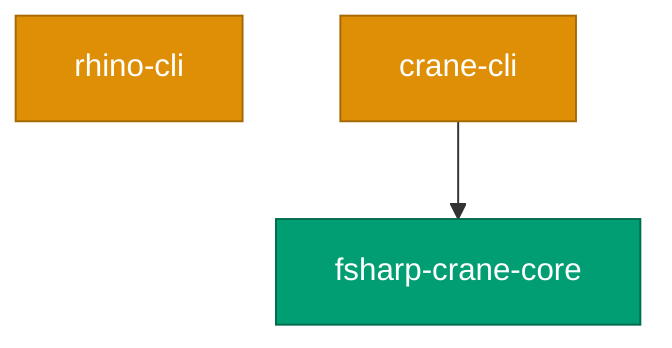
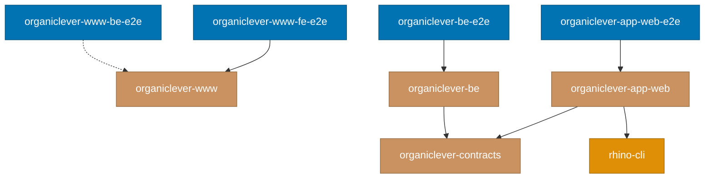

# Project Dependency Graph

Complete reference for how projects depend on each other in the Nx monorepo.
Run `nx graph` to visualize this interactively.

> **Note**: The polyglot demo apps (`a-demo-be-*`, `a-demo-fe-*`, `a-demo-fs-ts-nextjs`) and
> their contract/spec infrastructure were removed from this repo on 2026-04-18.

## Dependency Mechanisms

Nx tracks project relationships through three mechanisms:

### 1. `implicitDependencies` (Project-Level)

Declared in `project.json`. When the dependency project changes, `nx affected`
flags the dependent project for re-testing.

```json
"implicitDependencies": ["rhino-cli"]
```

### 2. `dependsOn` (Task-Level)

Declared per target in `project.json`. Controls execution order — the dependency
task runs before the dependent task.

### 3. `inputs` with `{workspaceRoot}` (File-Level)

Declared per target. When matched files change, the target's cache is
invalidated and `nx affected` flags the project.

```json
"inputs": [
  "default",
  "{workspaceRoot}/specs/apps/organiclever/**/*.feature"
]
```

## Visual Dependency Graph

**CLI ecosystem:**

Content sites no longer depend on any CLI — `ayokoding-www` and `ose-www` dropped their
`implicitDependencies` when the per-domain link-checkers were retired.



**OrganicLever product stack:**



**Legend**:

- Green: Libraries
- Orange: CLI tools
- Purple: Web sites
- Brown: OrganicLever product apps
- Blue: E2E tests

## Shared Infrastructure Projects

### rhino-cli

**Location**: `apps/rhino-cli/`

Repository management CLI used by most projects for spec coverage (`rhino-cli specs coverage`)
and other validation tasks.

- **Dependents**: CLI tools, libs, content platforms, organiclever-app-web
- **Mechanism**: `implicitDependencies`
- **Own dependency**: None (self-contained F# application with only NuGet package dependencies)
- **Note**: rhino-cli was ported from Go to Rust (2026-05-23), then from Rust to F# (2026-08-30).

## Project Dependency Table

### Content Platforms

| Project       | Dependencies | Spec Inputs |
| ------------- | ------------ | ----------- |
| ayokoding-www | (none)       | (none)      |
| ose-www       | (none)       | (none)      |

### OrganicLever

| Project                  | Dependencies                      | Spec Inputs                                     |
| ------------------------ | --------------------------------- | ----------------------------------------------- |
| organiclever-contracts   | (none)                            | (self — project root is spec dir)               |
| organiclever-www         | rhino-cli                         | organiclever-www/\* (test:integration)          |
| organiclever-app-web     | rhino-cli, organiclever-contracts | organiclever-app-web/\* (test:integration)      |
| organiclever-be          | organiclever-contracts            | organiclever-be/\* (test:integration)           |
| organiclever-www-fe-e2e  | organiclever-www                  | organiclever-www/\* (test:e2e)                  |
| organiclever-www-be-e2e  | (none — placeholder slot)         | organiclever-www-be/\* (test:e2e)               |
| organiclever-app-web-e2e | organiclever-app-web              | organiclever-app-web/\* (typecheck, test:quick) |
| organiclever-be-e2e      | organiclever-be                   | organiclever-be/\* (typecheck, test:quick)      |

### CLI Tools

| Project   | Dependencies            | Spec Inputs                     |
| --------- | ----------------------- | ------------------------------- |
| rhino-cli | (none — self-contained) | rhino-cli/\* (test:integration) |
| crane-cli | fsharp-crane-core       | crane-cli/\* (test:integration) |

### Libraries

| Project           | Dependencies | Spec Inputs                      |
| ----------------- | ------------ | -------------------------------- |
| fsharp-crane-core | (none)       | fsharp-crane-core/\* (test:unit) |

## Spec Directory Mapping

All Gherkin specs and API contracts live under `specs/` and are consumed via
`{workspaceRoot}` inputs.

| Spec Directory                                  | Consumed By                                    | Targets                                 |
| ----------------------------------------------- | ---------------------------------------------- | --------------------------------------- |
| `specs/apps/organiclever/containers/contracts/` | organiclever-app-web, organiclever-be          | codegen                                 |
| `specs/apps/organiclever/`                      | organiclever-app-web, organiclever-app-web-e2e | test:integration, typecheck, test:quick |
| `specs/apps/rhino/`                             | rhino-cli                                      | test:integration                        |
| `specs/apps/ayokoding/`                         | ayokoding-www                                  | test:integration                        |
| `specs/apps/ose/`                               | ose-www                                        | test:integration                        |

## Related Documentation

- [Monorepo Structure Reference](./monorepo-structure.md) - Folder organization and file formats
- [Nx Configuration Reference](./nx-configuration.md) - Workspace configuration options
- [Nx Target Standards](../../repo-governance/development/infra/nx-targets.md) - Canonical target names and caching rules
- [Three-Level Testing Standard](../../repo-governance/development/quality/three-level-testing-standard.md) - Unit, integration, and E2E testing requirements
- [Code Coverage Reference](./code-coverage.md) - Coverage measurement and tools
