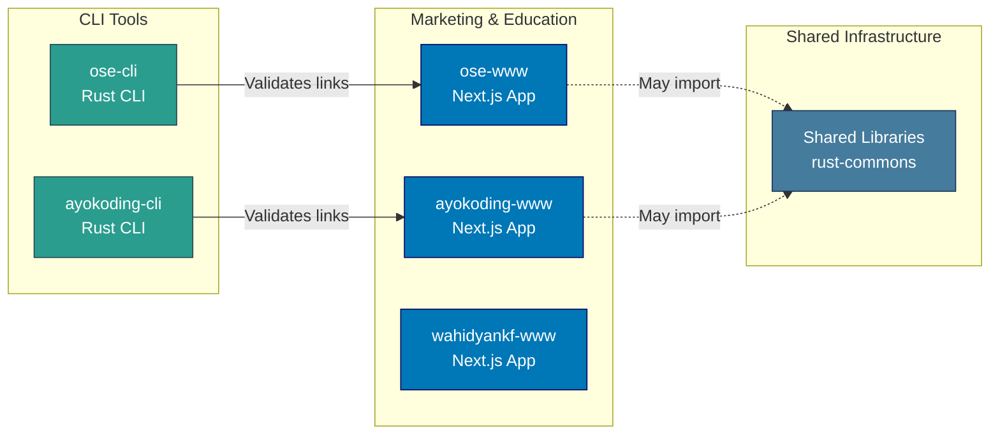
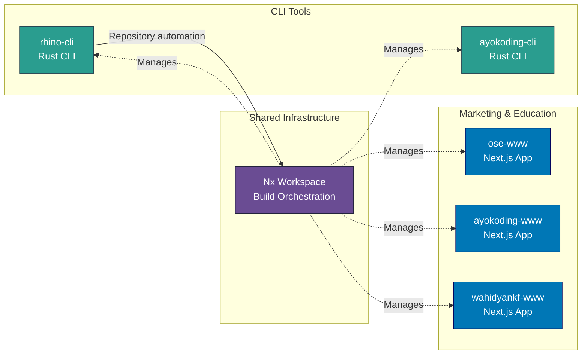
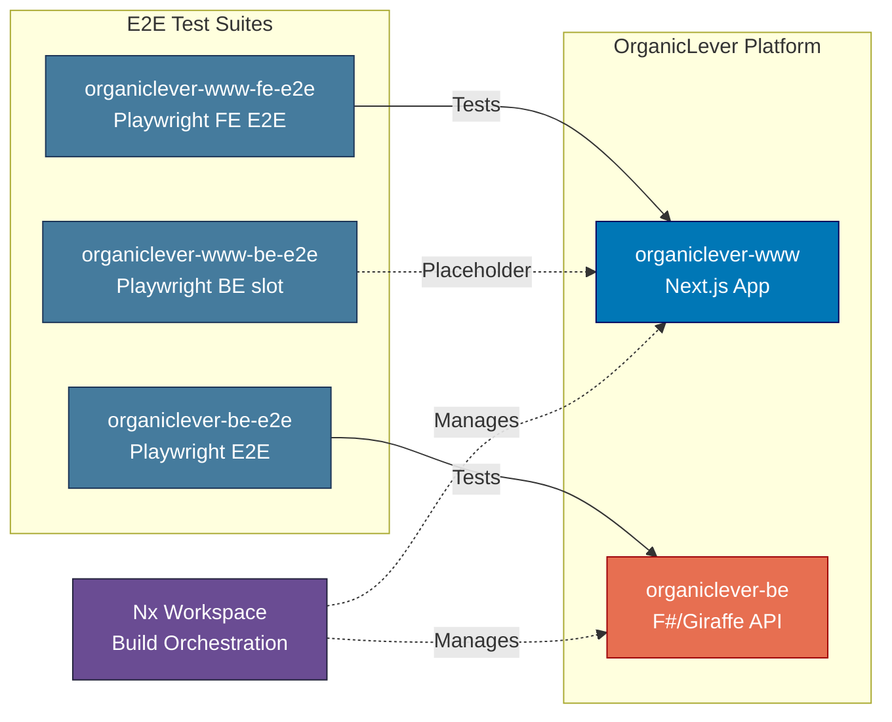

# Applications & Containers

Application inventory and C4 Level 2 container diagram for the Open Sharia Enterprise platform.

## Applications Inventory

The platform consists of the following applications across its technology stacks:

### Web Applications (Next.js)

#### ose-www

- **Purpose**: Public marketing website for OSE Platform
- **URL**: <https://oseplatform.com>
- **Technology**: Next.js 16 (App Router) + TypeScript + tRPC
- **Deployment**: Vercel (via `prod-ose-www` branch)
- **Build Command**: `nx build ose-www`
- **Dev Command**: `nx dev ose-www`
- **Dev Port**: 3100
- **Location**: `apps/ose-www/`

#### ayokoding-www

- **Purpose**: Educational platform for programming, AI, and security
- **URL**: <https://ayokoding.com>
- **Technology**: Next.js 16 (App Router) + TypeScript + tRPC
- **Languages**: Bilingual (default English)
- **Deployment**: Vercel (via `prod-ayokoding-www` branch)
- **Build Command**: `nx build ayokoding-www`
- **Dev Command**: `nx dev ayokoding-www`
- **Dev Port**: 3101
- **Location**: `apps/ayokoding-www/`
- **Content**: Co-located at `apps/ayokoding-www/content/`

#### wahidyankf-www

- **Purpose**: Personal portfolio site for Wahidyan Kresna Fridayoka
- **URL**: <https://www.wahidyankf.com>
- **Technology**: Next.js 16 (App Router) + TypeScript
- **Deployment**: Vercel (via `prod-wahidyankf-www` branch)
- **Build Command**: `nx build wahidyankf-www`
- **Dev Command**: `nx dev wahidyankf-www`
- **Dev Port**: 3201
- **Location**: `apps/wahidyankf-www/`

#### organiclever-www

- **Purpose**: Marketing website for the OrganicLever productivity platform
- **URL**: <https://www.organiclever.com>
- **Technology**: Next.js 16 (App Router) + TypeScript
- **Deployment**: Vercel (via `prod-organiclever-www` branch)
- **Build Command**: `nx build organiclever-www`
- **Dev Command**: `nx dev organiclever-www`
- **Dev Port**: 3200
- **Location**: `apps/organiclever-www/`

### CLI Tools

#### ayokoding-cli

- **Purpose**: Link validation for ayokoding-www content
- **Language**: Rust
- **Build Command**: `nx build ayokoding-cli`
- **Location**: `apps/ayokoding-cli/`
- **Features**:
  - Link validation for ayokoding-www content
- **Usage**: Runs as part of ayokoding-www quality checks

#### rhino-cli

- **Purpose**: Repository management and automation
- **Language**: Rust
- **Build Command**: `nx build rhino-cli`
- **Location**: `apps/rhino-cli/`
- **Status**: Active development

#### ose-cli

- **Purpose**: OSE Platform site link validation
- **Language**: Rust
- **Build Command**: `nx build ose-cli`
- **Location**: `apps/ose-cli/`
- **Features**:
  - Validates all internal links in ose-www content
  - Text, JSON, and markdown output formats
- **Usage**: Runs as first step of `ose-www`'s `test:quick` target

### OrganicLever Applications

#### organiclever-www

- **Purpose**: Landing site for OrganicLever — local-first mode; BE integration deferred
- **URL**: <https://www.organiclever.com>
- **Technology**: Next.js 16 (App Router) + React 19 + TailwindCSS
- **Deployment**: Vercel — staging via `stag-organiclever-app-web` branch (CI-automated by
  `organiclever-app-test-local-deploy-stag.yml`, which deploys by force-pushing the stag
  branch). Production continuous delivery is **deferred** to a separate plan — no
  production-CD workflow exists yet; the gated `organiclever-app-test-stag.yml`
  runs the FE E2E gate against staging and stops on pass without promoting.
- **Build Command**: `nx build organiclever-www`
- **Dev Command**: `nx dev organiclever-www`
- **Location**: `apps/organiclever-www/`
- **Features**:
  - Static landing page at `/` (no network dependency)
  - `/system/status/be` diagnostic page (probes `ORGANICLEVER_BE_URL` at request time)
  - Dormant Effect TS service layer preserved for future BE rewire
  - Radix UI / shadcn-ui component library
  - Production Dockerfile with standalone output

### Backend Services

#### organiclever-be

- **Purpose**: REST API backend for OrganicLever (F#/Giraffe/ASP.NET 10 implementation)
- **Technology**: F# + Giraffe + ASP.NET 10 + EF Core + DbUp
- **Build Command**: `nx build organiclever-be`
- **Dev Command**: `nx dev organiclever-be`
- **Location**: `apps/organiclever-be/`
- **Features**:
  - Coverlet code coverage enforcement (>=90%)
  - Production Dockerfile with multi-stage build
  - OpenAPI 3.1 contract-first development

#### ose-be

- **Purpose**: REST API backend for OSE Application platform (api.oseplatform.com)
- **Technology**: F# + Giraffe + ASP.NET 10 + EF Core + DbUp
- **Build Command**: `nx build ose-be`
- **Dev Command**: `nx dev ose-be`
- **Location**: `apps/ose-be/`
- **Features**:
  - Coverlet code coverage enforcement (>=90%)
  - Hexagonal DDD architecture with 5 bounded contexts
  - OpenAPI 3.1 contract-first development (planned)

### BeaverNest Applications

#### beavernest-be

- **Purpose**: Combined BeaverNest runtime — same-origin REST API and static host for the
  Vite CSR client, served from a single container image
- **Technology**: F# + Giraffe + ASP.NET 10 + SQLite
- **Build Command**: `nx build beavernest-be`
- **Dev Command**: `nx dev beavernest-be` (loopback dev port 19320)
- **Runtime Port**: 19300 (combined image)
- **Location**: `apps/beavernest-be/`
- **Features**:
  - Coverlet code coverage enforcement (>=90%)
  - Production Dockerfile builds both the F# API and the Vite client in one multi-stage image
  - No production branch yet — CI runs on a schedule only; deployment is deferred

#### beavernest-app-web

- **Purpose**: Vite/React client for BeaverNest, built into `beavernest-be`'s combined image
- **Technology**: Vite + React 19 + TypeScript
- **Build Command**: `nx build beavernest-app-web`
- **Dev Command**: `nx dev beavernest-app-web` (dev port 19310)
- **Location**: `apps/beavernest-app-web/`

### E2E Test Suites (Playwright)

#### ose-www-fe-e2e

- **Purpose**: Frontend E2E tests for ose-www UI
- **Technology**: Playwright
- **Run Command**: `nx run ose-www-fe-e2e:test:e2e`
- **Location**: `apps/ose-www-fe-e2e/`

#### ose-www-be-e2e

- **Purpose**: Backend E2E tests for ose-www tRPC API
- **Technology**: Playwright
- **Run Command**: `nx run ose-www-be-e2e:test:e2e`
- **Location**: `apps/ose-www-be-e2e/`

#### ayokoding-www-fe-e2e

- **Purpose**: Frontend E2E tests for ayokoding-www UI
- **Technology**: Playwright
- **Run Command**: `nx run ayokoding-www-fe-e2e:test:e2e`
- **Location**: `apps/ayokoding-www-fe-e2e/`

#### ayokoding-www-be-e2e

- **Purpose**: Backend E2E tests for ayokoding-www tRPC API
- **Technology**: Playwright
- **Run Command**: `nx run ayokoding-www-be-e2e:test:e2e`
- **Location**: `apps/ayokoding-www-be-e2e/`

#### wahidyankf-www-fe-e2e

- **Purpose**: Frontend E2E tests for wahidyankf-www UI (Playwright-BDD)
- **Technology**: Playwright-BDD
- **Run Command**: `nx run wahidyankf-www-fe-e2e:test:e2e`
- **Location**: `apps/wahidyankf-www-fe-e2e/`

#### organiclever-www-fe-e2e

- **Purpose**: Frontend E2E tests for organiclever-www UI
- **Technology**: Playwright
- **Run Command**: `nx run organiclever-www-fe-e2e:test:e2e`
- **Location**: `apps/organiclever-www-fe-e2e/`

#### organiclever-www-be-e2e

- **Purpose**: Backend E2E slot for organiclever-www (placeholder — no backend API)
- **Technology**: Playwright
- **Run Command**: `nx run organiclever-www-be-e2e:test:e2e`
- **Location**: `apps/organiclever-www-be-e2e/`

#### organiclever-be-e2e

- **Purpose**: End-to-end tests for organiclever-be REST API
- **Technology**: Playwright
- **Run Command**: `nx run organiclever-be-e2e:test:e2e`
- **Location**: `apps/organiclever-be-e2e/`

#### beavernest-app-web-e2e

- **Purpose**: Frontend E2E tests for beavernest-app-web UI, run against a disposable
  combined-runtime container
- **Technology**: Playwright
- **Run Command**: `nx run beavernest-app-web-e2e:test:e2e`
- **Location**: `apps/beavernest-app-web-e2e/`

#### beavernest-be-e2e

- **Purpose**: End-to-end tests for the beavernest-be REST API, run against a disposable
  combined-runtime container
- **Technology**: Playwright
- **Run Command**: `nx run beavernest-be-e2e:test:e2e`
- **Location**: `apps/beavernest-be-e2e/`

## C4 Level 2: Container Diagram

Shows the high-level technical building blocks (containers) of the system. In C4 terminology, a "container" is a deployable/executable unit (web app, database, file system, etc.), not a Docker container.

**Content and tooling applications:**

**Nx workspace orchestration:**

**OrganicLever platform applications:**

## Application Interactions

**Independent Application Suites:**

Marketing & Education Sites:

- ose-www: Next.js 16 content platform
- ayokoding-www: Next.js fullstack content platform (with CLI link validation)
- wahidyankf-www: Next.js 16 personal portfolio

CLI Tools:

- ayokoding-cli: Validates links in ayokoding-www content
- rhino-cli: Repository management automation

**Build-Time Dependencies:**

- All applications managed by Nx workspace
- CLI tools executed during build processes
- Shared libraries may be imported at build time via `@open-sharia-enterprise/[lib-name]`

**Link Validation Pipeline (ayokoding-www):**

ayokoding-cli validates internal links in ayokoding-www content as part of the quality gate.
Content is co-located at `apps/ayokoding-www/content/` and served by the Next.js application.
