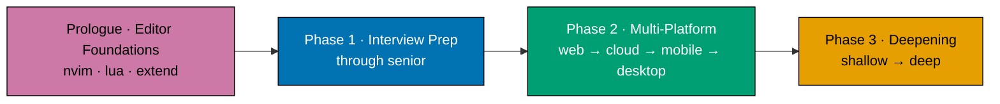

# Fundamentally Strong SE — Interview-First Resequence

Re-sequence the completed **fundamentally-strong/software-engineer** curriculum (94 topics +
capstones, both learning and drilling tracks) from its current five-pass "immediately-effective"
spiral into a new canonical arc: **Editor Foundations (kept prologue) → Interview Preparation
(through senior) → Multi-Platform Productivity (strict market-demand linear) → Deepening
(progressively deeper)**. This plan does **not** author the 94 topics' subject content — it
re-orders the existing topics (weights, nav, overview narrative, syllabus numbering, capstone
anchors) and adds a small set of **new interview-technique modules**.

**Primary persona (north-star): an experienced software engineer re-entering the job market** —
recently laid off, returning from a gap/sabbatical, or a senior wanting to switch. Every decision
optimizes for this person's **"immediately useful"**: lead with interview prep, let them **skip the
editor prologue** via an explicit fast-path, write the new modules as a **refresh** (not first-learn),
target **mid/senior/staff** interview level, and cover the **layoff / employment-gap narrative** in
behavioral rounds. A from-scratch learner is a secondary persona the canonical order still serves.

## Depends-on

**Hard dependency**: [`plans/in-progress/fundamentally-strong-software-engineer/`](../../in-progress/fundamentally-strong-software-engineer/README.md)
must be **fully DONE** — all 94 topics + drilling + capstones authored and live under
`apps/ayokoding-www/content/en/learn/fundamentally-strong/software-engineer/` — **before this plan
executes**. This plan assumes that end state as a Phase 0 precondition; it re-sequences what that
plan produced. [Judgment call] At authoring time (2026-07-18) the live content tree holds only the
prologue through roughly topic 30 [Repo-grounded], so the dependency is **not yet satisfied** — the
Phase 0 precondition gate must confirm completion before any re-sequencing begins.

## Context

The sibling plan built "The Fundamentally Strong Software Engineer" as a **Pass 0 setup prologue +
five-pass spiral** under an _immediately-effective_ principle: set up the editor, then build/store/
test/secure a small system fast, then revisit each concern area at greater depth on later passes.
That spiral optimizes for "get productive early, deepen later."

The maintainer now wants a different canonical arc — one organized around **how a working engineer
actually consumes the material**: get interview-ready first (the most time-pressured, highest-stakes
use), then become productive across the platforms the market demands in a fixed linear order, then
deepen the rest of the field progressively. The five-pass spiral framing is **retired and rewritten**,
not layered on top.

## Scope

**In scope** (all under `apps/ayokoding-www/content/en/learn/fundamentally-strong/software-engineer/`):

- Rewrite `overview.md` around the new 3-phase-plus-prologue arc (retire the five-pass narrative).
- Re-order `_index.md` nav to the new canonical order.
- Recompute every existing topic's `weight` frontmatter (folder / learning / drilling) to the new
  order, preserving the established weight scheme (see [tech-docs.md](./tech-docs.md)).
- Re-anchor the existing capstones (Forge-Ready, First-Working-Software, Full-Stack-App) to the new
  phase boundaries and recompute their weights.
- Renumber the plan-side syllabus files/numbering to the new order (in the sibling plan's
  `syllabus/` folder, per the Decisions-Needed routing question below).
- **Author a small set of NEW interview-technique modules** (both learning and drilling tracks
  each) — see [prd.md](./prd.md) for the exact slugs and scope.
- English only.

**Out of scope**:

- Authoring or rewriting the 94 existing topics' subject content (that is the sibling plan's job).
- Indonesian (`content/id/...`) mirror — deferred, like the sibling.
- Any change under `apps/ayokoding-www/src/` — this is **content-only** markdown.
- Any change to `learn/software-engineering/` or other unrelated content subtrees.

## The New Canonical Arc (summary)

- **Prologue · Editor Foundations** (kept canonically first, but **explicitly skippable for the
  experienced** via an `overview.md` fast-path): Just Enough Nvim → Just Enough Lua → Extending
  Neovim. Forge-Ready capstone stays anchored at the prologue boundary.
- **Phase 1 · Interview Preparation (through senior)** — designed to **stand alone and deliver fast
  value to the experienced re-entrant**. Hybrid: curate the existing interview-facing fundamentals to
  the front (DS&A, Advanced Algorithms, OOP, OO Design & Patterns, SQL, Technical Communication) AND
  author NEW interview-technique modules in a **refresh register** (coding-interview,
  system-design-interview, behavioral-and-leadership-interviews, take-home-and-live-coding). "Through
  senior" is **central**: coding, DS&A, the senior/staff system-design _interview format_, and
  behavioral/leadership rounds (including the **layoff/gap narrative**) — NOT relocating genuine
  systems/internals depth upward (that stays in Phase 3).
- **Phase 2 · Multi-Platform Productivity** — strict market-demand linear, no ◆ branching:
  **web → cloud/backend-at-scale → mobile → desktop**. Two NEW productivity modules land here: an
  **async-Python/FastAPI services** module (web/backend, the `remotebrowser` + FastAPI stack) and a
  **light self-hosting on-ramp** (`self-hosting-essentials`, early in the cloud sub-phase — run one
  box, self-host a service, PaaS git-push deploy; strictly below the heavier containers/cloud-IaC
  topics, and distinct from the full-depth Proxmox topic that stays in Phase 3).
- **Phase 3 · Deepening** — everything else, ordered shallow → deep, and now home to the marquee
  **harness-engineering cluster** (build-your-own agentic coding tool: the agent loop, tools + MCP,
  context/memory, permissions/sandboxing, orchestration/observability) + a
  **build-your-own-coding-agent capstone**, a **Chrome DevTools Protocol / browser-automation**
  module, and (Addition 4, security) a dedicated **`just-enough-cpp`** systems-language on-ramp, a
  hands-on **`detection-engineering-and-siem-operations`** principles module (decoders + correlation
  rules + FP tuning, distinct from the concept-level defensive-security topic), and a
  **build-your-own-pentest-engine capstone** (the security sibling of the coding-agent capstone). Each
  teaches a durable **principle**; `wazuh` (C++ core; XML ruleset) and an agentic pentest engine are
  used only as illustrative worked-examples, never as the subject.

**Outcome-anchor (proof-of-transfer)**: the section teaches durable **principles**; it is measured
against a graduate being able to contribute to **seven real target codebases** —
`ose-public`/`ose-primer`/`ose-infra`, `remotebrowser`, and three security codebases (`wazuh/wazuh`,
`anggipradana/vacti`, `anggipradana/vacti-pentest-engine`) — which serve as **evidence the principles
transfer**, not as subject matter. See
[tech-docs.md §Productive in Target Codebases](./tech-docs.md#productive-in-target-codebases-proof-of-transfer-outcome-anchor).
(`wazuh` is web-verified; the two `vacti` repos are maintainer-supplied and were not publicly
discoverable on 2026-07-18 — treated as unverified, subject to change.)

The complete 108-row mapping (each existing topic + capstone → new phase, new index, new weight,
short summary, language, rationale, plus the fourteen NEW module rows) is the heart of
[tech-docs.md §Canonical Mapping Table](./tech-docs.md#canonical-mapping-table).

## Navigation

- [Business Requirements (brd.md)](./brd.md) — WHY this resequence, who it serves, success signals.
- [Product Requirements (prd.md)](./prd.md) — the new arc as product spec, personas, user stories,
  Gherkin acceptance criteria, and the NEW interview-module specs.
- [Technical Docs (tech-docs.md)](./tech-docs.md) — the canonical mapping table, weight scheme,
  design decisions, and diagrams.
- [Delivery Checklist (delivery.md)](./delivery.md) — phased, executable checklist.
- [Learnings (learnings.md)](./learnings.md) — knowledge-capture running log.

## Delivery Mode: worktree-to-pr

`worktree-to-pr` (the repo default): work in `worktrees/fundamentally-strong-se-interview-first-resequence/`,
open a draft PR against `main`, run the PR-Review Maker→Fixer Cycle, then `[AI]` merges automatically
once the 3-cycle review and all quality gates are green — a plan-scoped AI-auto-merge deviation from
the standard `[HUMAN]` merge gate (see **DN-7 DECIDED** below). See [delivery.md](./delivery.md) for
the `## Worktree` and `## Delivery Mode` declarations and the PR-review-cycle steps.

## Decisions Needed (for maintainer)

Resolve these residual judgment calls before execution. Each lists 2-4 concrete options; the
recommended option is marked.

### DN-1 · Language on-ramp placement (Python + Bash + Git)

Interview coding needs a language on-ramp. Where do Just Enough Python (the canonical interview
language), Just Enough Bash, and Version Control & Git sit?

- **Option A — head of Phase 1 (Interview Prep)** _(Recommended)_ — Python is the interview language
  and Git/Bash are interview table-stakes, so they belong immediately before DS&A. Keeps the
  prologue strictly about the editor.
- **Option B — extend the Editor prologue** — treat Python/Bash/Git as universal tooling setup and
  append them to the prologue, so Phase 1 opens directly on interview technique.
- **Option C — split** — Python at head of Phase 1, but Bash + Git appended to the prologue as
  general tooling.

### DN-2 · Which "essentials that are also interview material" go to Phase 1 vs Phase 3

Software Testing, Security Essentials, Project Management, and Debugging & Profiling are all _touched_
in interviews but also have genuine standalone depth. The recommended mapping (in tech-docs) places
all four in **Phase 3 (Deepening)** and lets the NEW behavioral/coding-interview modules carry their
interview-facing slice. Confirm or override:

- **Option A — all four in Phase 3** _(Recommended)_ — none is a distinct interview _round_; the new
  interview modules reference them forward. Cleanest split of "technique" (Phase 1) from "depth"
  (Phase 3).
- **Option B — Software Testing + Debugging to Phase 1** — they surface often in coding interviews;
  keep Security Essentials + Project Management in Phase 3.
- **Option C — case-by-case** — specify per topic which phase each belongs to.

### DN-3 · Technical Communication placement

Technical Communication is craft used both in behavioral/interview rounds and generally.

- **Option A — Phase 1 (Interview Prep)** _(Recommended)_ — behavioral/leadership rounds lean on
  communication; pairing it with the behavioral module is coherent.
- **Option B — Phase 3 (Deepening)** — treat it as general craft and group it with product/delivery
  depth.

### DN-4 · New interview-phase capstone (mock-interview loop)

Should this plan author a NEW `capstone-interview-loop` (a full mock loop: coding + system-design +
behavioral) at the Phase 1 boundary?

- **Option A — author it** _(Recommended)_ — an interview phase without a capstone breaks the
  section's every-phase-has-a-capstone rhythm; a mock loop is the natural cement.
- **Option B — skip it** — rely on the four new modules' intra-module drills; re-anchor only the
  existing three capstones.

### DN-5 · Capstone re-anchoring targets

Recommended (in tech-docs): Forge-Ready → prologue boundary (kept); First-Working-Software → end of
Phase 2 web sub-phase; Full-Stack-App → end of Phase 2 (all platforms). Confirm or override:

- **Option A — as recommended** _(Recommended)_ — First-Working-Software cements the first working
  web app; Full-Stack-App cements the multi-platform productivity phase.
- **Option B — both First-Working-Software and Full-Stack-App at end of Phase 2** — keep them
  adjacent as a two-part productivity capstone.
- **Option C — move Full-Stack-App to end of Phase 1** — treat it as the interview portfolio piece.

### DN-6 · Syllabus renumbering location + ripple

The sibling plan owns `syllabus/NN-<slug>.md` files numbered to the OLD order, and its `prd.md`
holds the canonical 94-topic table. Re-sequencing ripples into the sibling plan's docs.

- **Option A — renumber the sibling plan's syllabus + update its prd table in place**
  _(Recommended)_ — keeps a single source of truth; this plan's PR edits both the content tree and
  the sibling plan docs.
- **Option B — leave the sibling syllabus numbering alone; add a mapping note** — this plan only
  touches the content tree + adds a redirect/mapping doc, accepting syllabus-number drift.
- **Option C — copy the syllabus into this plan and renumber here** — isolates the change but
  duplicates the source of truth.

### DN-7 · AI-auto-merge deviation for THIS plan — DECIDED (Option B, AI-auto-merge)

**Decided**: `[AI]` merges each phase's PR automatically once the 3-cycle PR-Review Maker→Fixer Cycle
and all quality gates are green — no `[HUMAN]` merge-approval step. This was originally framed as an
open choice between the standard `[HUMAN]` merge gate (Option A) and re-authorizing AI-auto-merge for
this plan (Option B); the maintainer resolved it to **Option B**.

**Authorization**: the maintainer explicitly authorized AI-auto-merge for **this plan**, dated
2026-07-18 (in-session), via two directives: (a) this plan uses the SAME delivery methods as the
sibling plan `fundamentally-strong-software-engineer` (which carries its own, independently-recorded
2026-07-14 AI-auto-merge authorization scoped only to itself); and (b) no maintainer permission is
needed to merge a PR once it has already passed 3 cycles of the PR-Review Maker→Fixer cycle and the PR
quality gate. This is a deliberate, plan-scoped override recorded here and in
[delivery.md](./delivery.md#delivery-mode-worktree-to-pr) — it does **not** amend
`pr-merge-protocol.md` and does not itself authorize AI-auto-merge for any plan other than this one
(the sibling plan's authorization is separate and was granted independently on its own date).

### DN-8 · ose-stack gaps — F#/Giraffe backend depth + Nx-monorepo workflow

The [Productive in Target Codebases](./tech-docs.md#productive-in-target-codebases-proof-of-transfer-outcome-anchor)
mapping flags two soft gaps for the ose workspace family.

- **Option A — covered-by-existing + note** _(Recommended)_ — treat F#/Giraffe backend depth as
  covered by `just-enough-fsharp` and Nx workflow as covered by `build-automation-and-task-runners`,
  adding a note in each rather than new modules; keeps the count lean.
- **Option B — add a small "Nx Monorepo Workflow" module** — a dedicated Phase 2 module for the
  Nx-specific workflow (affected graph, targets, generators) the ose repos lean on.
- **Option C — add both a Nx module AND an "F#/Giraffe Web Backend" module** — maximal coverage of the
  ose stack, at the cost of two more modules.

### DN-9 · Async-Python / FastAPI placement

`just-enough-python` is a refresh/interview on-ramp, not FastAPI-service depth; `remotebrowser` needs
the deeper stack.

- **Option A — NEW `async-python-and-fastapi-services` module in Phase 2 web/backend** _(Recommended)_
  — keeps `just-enough-python` a lean refresh; puts the productivity depth where web/backend lives.
- **Option B — extend `just-enough-python`** — fold async/FastAPI/Pydantic into the existing on-ramp,
  no new module, but bloats the interview refresh.
- **Option C — put it in Phase 3 (deepening)** — treat FastAPI depth as advanced rather than
  productivity-tier.

### DN-10 · Chrome DevTools Protocol / browser-automation module placement

CDP is needed for `remotebrowser` and is a natural harness tool; no existing topic covers it.

- **Option A — standalone Phase 3 module adjacent to the harness cluster** _(Recommended)_ — clean
  separation; reusable beyond the harness.
- **Option B — fold CDP into `agent-tools-and-mcp`** — treat browser automation as one harness tool
  among many, no separate module.

### DN-11 · Build-your-own-coding-agent capstone — browser-driving bonus

The flagship capstone can be a pure local-tools coding agent, or drive `remotebrowser` over MCP.

- **Option A — offer the browser-driving bonus** _(Recommended)_ — ties Addition 1 + 2 together and
  showcases the MCP↔remotebrowser synergy as the flagship payoff.
- **Option B — pure local-tools coding agent** — simpler capstone, no external service dependency.

### DN-12 · Harness-cluster implementation language

The build-your-own-coding-agent cluster + capstone need one primary language.

- **Option A — Python** _(Recommended default)_ — matches the series primary, `remotebrowser`
  (Python + `fastmcp`), and the async-Python module; maximizes consistency and the synergy capstone.
- **Option B — TypeScript** — closest to the Claude-Code/Node idiom the maintainer wants to emulate;
  breaks single-primary-language consistency.

### DN-13 · Self-hosting on-ramp — new module vs reframed essentials

`self-hosting-essentials` (N=24) is a light Phase 2 on-ramp below containers/cloud-IaC; the full-depth
Proxmox topic stays in Phase 3.

- **Option A — NEW light module `self-hosting-essentials`** _(Recommended)_ — a clean productivity
  ramp (run one box, self-host a service, PaaS deploy) below N=26/27, distinct from Proxmox depth.
- **Option B — reframe an existing essentials topic** — e.g. widen `backend-essentials` or
  `containers-and-orchestration` to include a light self-hosting slice, no new module.
- **Option C — fold it into `cicd-and-release-engineering`** — treat "deploy to your own box" as a
  release-engineering concern.

### DN-14 · C++ coverage — dedicated `just-enough-cpp` vs extend `just-enough-c` (Addition 4)

Wazuh's manager/agent core is largest in C++, so the resequence adds C++ coverage. The module ITSELF
is decided (build it); only its shape is a judgment call.

- **Option A — dedicated `just-enough-cpp` (N=76)** _(Recommended)_ — matches the existing
  `just-enough-<lang>` on-ramp family and keeps `just-enough-c` a pure C ramp; C++ is a large enough
  language to warrant its own on-ramp.
- **Option B — extend `just-enough-c` to cover C++** — one combined systems-C/C++ ramp, fewer topics,
  but blurs two distinct languages and breaks the one-language-per-on-ramp pattern.

### DN-15 · `detection-engineering-and-siem-operations` scope/placement (Addition 4)

The hands-on detection-engineering principles module (N=95 — decoders + correlation rules + FP tuning,
with Wazuh XML as the worked example) is decided (build it); its placement relative to the
concept-level `defensive-security` (N=94) is confirmable.

- **Option A — separate hands-on module right after `defensive-security` (N=95)** _(Recommended)_ —
  "detection as a concept" (N=94) and "operate a SIEM + write rules" (N=95) are two altitudes, never
  merged (mirrors the two-altitude self-hosting split).
- **Option B — fold detection engineering into `defensive-security`** — one broader blue-team topic,
  fewer topics, but loses the hands-on-vs-concept separation.

### DN-16 · `capstone-build-your-own-pentest-engine` implementation language (Addition 4)

The flagship security capstone (weight 1075) needs one primary language.

- **Option A — TypeScript** _(Recommended)_ — matches the `vacti-pentest-engine` illustration
  (TypeScript + Shell) and the Claude-Code/Node harness idiom.
- **Option B — Python** — matches the harness cluster's Python default (DN-12) and the series primary;
  diverges from the TS pentest-engine illustration.

### DN-17 · Prereqs/difficulty presentation in the mapping table (Addition 4)

The three Addition-4 gap-closer rows carry assumed-prerequisites + difficulty. A dedicated column
would apply to all 108 rows.

- **Option A — fold prereqs/difficulty into the Rationale cell for the new rows only**
  _(Recommended)_ — keeps the table schema stable (no 108-row column churn); the info lives where it
  matters. [This is the current state.]
- **Option B — add a workspace-wide `Prereqs/Difficulty` column** — uniform schema, but forces a
  best-guess prereqs/difficulty value onto all 108 rows, most of which never needed one.
