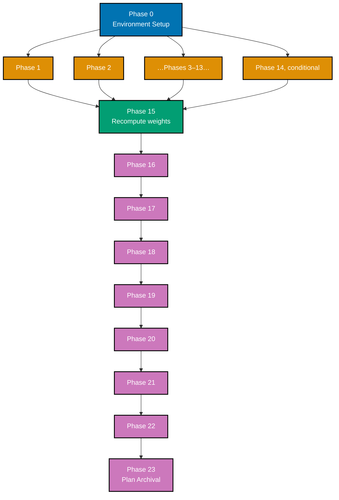
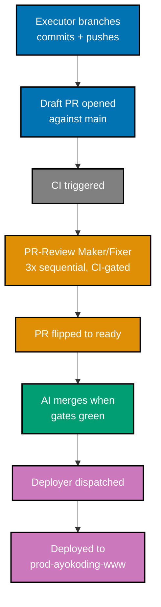

# Delivery Checklist — Fundamentally Strong SE Interview-First Resequence

This checklist is **table-referential**: the canonical new order, per-topic new index, slug, short
summary, language, format, and recomputed weights live in the
[tech-docs.md Canonical Mapping Table](./tech-docs.md#canonical-mapping-table) — the single source of
truth (108 topics after Additions 1–4). Each resequence phase reads its rows from that table.
NEW-module scope lives in
[prd.md §NEW Interview-Technique Modules](./prd.md#new-interview-technique-modules-authored-by-this-plan)
and [prd.md §NEW Productivity & Harness Modules](./prd.md#new-productivity--harness-modules-additions-14).

> **Legend** — `[AI]`: an agent performs the step (the default; unmarked steps are `[AI]`).
> `[HUMAN]`: only a human can do it (physical action, out-of-band approval, real-secret or
> privileged-credential handling). `[AI+HUMAN]`: agent prepares, human approves or finishes.
>
> **Phase Gate** — every phase ends with a `### Phase N Gate` (must-pass verification) plus a
> `> **Pause Safety**:` note (the safe-to-stop state and the single command to resume). Each gate
> covers both the phase's **content correctness** (checkers, build) and its **integration** (draft PR
> opened, 3-cycle PR-Review, CI green, `[AI]` merge, `ayokoding-www` deployed). A phase is not
> complete until every gate check is green. The **content** checks must be green before the phase's PR
> opens; the **integration** checks (review → merge → deploy) then complete asynchronously and — per
> the Parallelization Model — do **not** block branching the next _eligible_ phase (the fourteen
> module phases 1–14 pipeline concurrently; the serial finalization phases 15–23 wait for the prior
> phase's merge).

## Worktree

One **shared worktree** for the whole plan (one checkout, many branches, many PRs):

Worktree path: `worktrees/fundamentally-strong-se-interview-first-resequence/`

Optional manual pre-provisioning (run from repo root):

```bash
claude --worktree fundamentally-strong-se-interview-first-resequence
```

The plan-execution Step 0 gate enters this shared worktree by default: it auto-provisions from the
latest `origin/main` when missing, syncs with `origin/main` before implementing, and prompts before
deleting the worktree after the plan is archived and pushed.

Every phase branches from the **latest `origin/main`** inside this one shared worktree
(`git fetch origin && git checkout main && git pull && git checkout -b
fundamentally-strong-se-interview-first-resequence/<phase-slug>`), authors its content there, commits,
pushes that branch, and opens **its own draft PR**. The worktree is reused across phases rather than
provisioning a fresh worktree per phase — see the Parallelization Model below for how this still lets
several phases be in flight concurrently.

See [Worktree Path Convention](../../../repo-governance/conventions/structure/worktree-path.md) and
[Plans Organization Convention §Worktree Specification](../../../repo-governance/conventions/structure/plans.md#worktree-specification).

## Parallelization Model

Each phase produces **its own PR**, so several phases can be **in flight concurrently** even though they
share one local worktree: once a phase's branch is committed, pushed, and its draft PR opened, the
worktree re-syncs to `origin/main` and starts the next eligible phase's branch immediately — it does not
block on the prior phase's review cycle, merge, or deploy. The parallelism lives in GitHub (several open
PRs moving through review at once), not in simultaneous local checkouts.

**N is not fixed by this plan.** How many phases are pipelined/in-review at once is chosen at execution
time, bounded by whatever subagent/PR-review concurrency policy is in force when the plan runs (the
repo-wide cap in
[Agent Workflow Orchestration](../../../repo-governance/development/agents/agent-workflow-orchestration.md),
the [Subagent Orchestration Convention](../../../repo-governance/development/agents/subagent-orchestration.md),
and the [Parallel-by-Default Practice](../../../repo-governance/development/practice/parallel-by-default.md)),
unless the user explicitly raises that cap for this plan's run.

**What's safe to pipeline**: the fourteen NEW-module authoring phases (**Phases 1–14**, including the
conditional capstones 5 / 11 / 14) are mutually independent content-wise — each writes only to its own
`<SECTION>/<slug>/` subtree and sets its final mapping-table weights at creation — so their PRs can be
open and in review simultaneously.

**Sync points (serial)**:

- **Phase 15** (recompute weights for all 108 topics) is the convergence point — branch it only after
  **every** module-authoring phase (1–14) has **merged to `main`**, never concurrently with them.
- **Phases 16 → 17 → 18 → 19 → 20 → 21 → 22 → 23** run **serially**, each branched only after the prior
  finalization phase has merged, because they edit the same shared `_index.md` / `overview.md` /
  syllabus surfaces and each depends on the previous one's merged state.



_Legend: orange = the fourteen module-authoring phases (1–14, "…Phases 3–13…" stands in for the
nine not drawn individually); teal = the Phase 15 convergence point; purple = the strictly serial
finalization chain (16→23)._

**Merges land serially** (one `[AI]` auto-merge at a time). When several module PRs are open at once,
whichever merges second may need a mechanical rebase onto the just-merged `main` (regenerable frontmatter
reconciliation, not a hand-authored conflict).

**Each phase ends merged + deployed**: a phase's gate only turns green once its PR is `[AI]`-merged to
`main` and `ayokoding-www` is deployed to `prod-ayokoding-www` (a no-op redeploy for the doc-only
finalization phases 0 / 21 / 22 / 23). CI waits and review cycles for earlier phases progress in the
background and never block starting the next eligible phase's branch (CI-monitoring policy: poll every
2 min, never `gh run watch`, never tight-loop).

## Delivery Mode: worktree-to-pr

Each phase works in the shared worktree (see Worktree above) on its **own branch**, opens a **draft PR**
against `main`, runs the **PR-Review Maker→Fixer Cycle** (`pr-review-maker` / `pr-review-fixer`, 3
sequential CI-gated cycles) then flips the PR to ready, and `[AI]` **merges it automatically once all
quality gates are green** — then `[AI]` **deploys `ayokoding-www` to `prod-ayokoding-www` immediately
after every merge** (this plan ships content to ayokoding.com, so each phase reaches production as it
completes). See
[Plans Organization Convention §Delivery Mode](../../../repo-governance/conventions/structure/plans.md#delivery-mode)
and the [PR Review Quality Gate workflow](../../../repo-governance/workflows/pr/pr-review-quality-gate.md).

> **DN-7 DECIDED — `[AI]` auto-merge (plan-scoped deviation from standing policy)**: the repo's
> [PR Merge Protocol](../../../repo-governance/development/workflow/pr-merge-protocol.md) normally
> requires a `[HUMAN]` to merge every PR with explicit per-instance approval, with no blanket
> pre-authorization. For **this plan only**, the maintainer explicitly authorized (2026-07-18,
> in-session — a plan-scoped authorization independent of, though modeled on, the sibling plan
> `fundamentally-strong-software-engineer`'s own separately-recorded 2026-07-14 authorization) that
> `[AI]` merges automatically once the 3-cycle review and all quality gates are green, via two
> directives: (a) this plan uses the SAME delivery methods as the sibling plan, and (b) no maintainer
> permission is needed to merge a PR once it has already passed 3 cycles of the PR-Review
> Maker→Fixer cycle and the PR quality gate. This resolves **DN-7 = AI-auto-merge** (see the DN-7
> decision record in [README.md](./README.md)); it is a deliberate, plan-scoped override that does
> **not** amend `pr-merge-protocol.md` and does not apply to any other plan.

**Push cadence — one PR per completed phase, deployed on merge (HARD RULE)**: this plan does not batch
phases into a single PR. The moment a phase's content work passes, `[AI]` opens that phase's PR, drives
it through the review cycle, merges it once green, and deploys immediately. This applies to **every**
phase 0–23, including the finalization phases (recompute, nav/overview, verification, section
verification, knowledge capture, archival).

**Per-Phase Integration Protocol** (each phase's gate lists its outcomes as must-pass conditions):

1. [AI] Sync the shared worktree to latest `origin/main` and branch for the phase:
   `git fetch origin && git checkout main && git pull && git checkout -b
fundamentally-strong-se-interview-first-resequence/<phase-slug>`.
2. [AI] Stage only this phase's paths (`git add <explicit paths>` — never `git add -A`), commit
   thematically (Conventional Commits, imperative, no period), push the branch, and open a **draft PR**
   against `main` (`gh pr create --draft --base main ...`) — CI runs on the PR.
3. [AI] Run the **PR-Review Maker→Fixer Cycle** (3 sequential CI-gated cycles), resolve every finding,
   then `gh pr ready`. This wait runs **in parallel with authoring the next eligible phase**.
4. [AI] **Merge** the PR once all quality gates are green (typecheck, lint, test:quick, specs:coverage,
   CI, the 3-cycle review) — `[AI]` auto-merge per the DN-7 deviation above.
5. [AI] Dispatch `apps-ayokoding-www-deployer` to deploy `ayokoding-www` to `prod-ayokoding-www` (Vercel
   auto-builds on push) — a no-op redeploy for the doc-only finalization phases 0 / 21 / 22 / 23.



**Section path** (referenced throughout as `<SECTION>`):
`apps/ayokoding-www/content/en/learn/fundamentally-strong/software-engineer/`

**Module-authoring convention** (Phases 1–14): each NEW module follows the same shape — create the
folder skeleton (`_index.md` + `learning/_index.md` + `drilling/_index.md`) with the mapping-table
weights, author the learning track, author the drilling track (four drill forms), run the
matching maker/checker + `apps-ayokoding-www-facts-checker` + `apps-ayokoding-www-link-checker`, then run
the **Per-Phase Integration Protocol** above (branch → draft PR → 3× review → `[AI]` merge → deploy).
New-module weights are set to their final mapping-table values at creation; transient order collisions
with existing topics' old weights are reconciled by the Phase 15 recompute (the build renders green
throughout).

---

## Phase 0: Environment Setup, Baseline & Precondition

> _Executor: repo-setup-manager_

- [ ] [AI] **Precondition gate** — confirm the sibling plan
      `plans/in-progress/fundamentally-strong-software-engineer/` is DONE: verify all 94 existing topic
      folders from the mapping table exist under `<SECTION>` via
      `for s in just-enough-nvim just-enough-lua extending-neovim just-enough-python just-enough-bash version-control-and-git data-structures-and-algorithms-essentials advanced-algorithms object-oriented-programming-essentials object-oriented-design-and-patterns sql-essentials technical-communication just-enough-typescript frontend-essentials backend-essentials networking-essentials api-design advanced-frontend backend-at-scale containers-and-orchestration cloud-and-iac cicd-and-release-engineering build-automation-and-task-runners just-enough-kotlin android-app-development just-enough-swift ios-app-development just-enough-dart hybrid-app-development just-enough-csharp windows-app-development linux-app-development building-production-cli-tools computer-science-foundations computer-architecture programming-paradigms functional-programming concurrency-and-parallelism just-enough-go csp-style-concurrency just-enough-elixir actor-model-concurrency advanced-networking advanced-sql-and-query-performance data-access-orms-and-query-builders build-your-own-orm-and-query-builder nosql-databases graph-databases database-internals-and-storage-engines data-engineering search-and-information-retrieval software-architecture domain-driven-design system-design event-driven-architecture distributed-systems build-your-own-web-framework build-your-own-reactive-ui software-engineering-practices agentic-coding creating-ai-powered-apps agentic-ai just-enough-c linux-os windows-os system-programming just-enough-rust modern-system-programming just-enough-java enterprise-java-and-the-jvm lisp just-enough-fsharp type-systems compilers-parsers-and-transpilers build-your-own-git build-your-own-database build-your-own-raft security-essentials it-and-application-security offensive-security defensive-security vulnerability-management-and-assessment it-governance-grc bare-metal-virtualization self-managed-kubernetes-and-gitops platform-engineering-and-devex site-reliability-engineering software-testing debugging-and-profiling analytics-and-experimentation information-architecture-and-seo software-product-engineering engineering-management project-management; do test -d <SECTION>/$s || echo "MISSING $s"; done`
      — acceptance: zero `MISSING` lines; if any topic is missing, STOP — the dependency is not
      satisfied and this plan cannot proceed.
- [ ] [AI] Enter/provision the worktree and install dependencies in the root worktree:
      `npm install` — acceptance: exits 0, `node_modules/` synchronized.
- [ ] [AI] Converge the toolchain in the root worktree: `npm run doctor -- --fix`
      — acceptance: exits 0 with no unresolved drift.
- [ ] [AI] Establish content baseline: `npx nx run ayokoding-www:build`
      — acceptance: build exits 0; record pass state.
- [ ] [AI] Snapshot current ordering state to `evidence/phase-0-snapshot.txt`: for every topic +
      capstone folder under `<SECTION>`, record the current `weight` from `_index.md`,
      `learning/_index.md`, `drilling/_index.md`, plus the current `_index.md` nav list and
      `overview.md` — acceptance: snapshot file committed; full topic inventory captured.
- [ ] [AI] Confirm the seventeen new slugs are absent (no collision):
      `for s in coding-interview take-home-and-live-coding system-design-interview behavioral-and-leadership-interviews capstone-interview-loop async-python-and-fastapi-services self-hosting-essentials browser-automation-with-cdp the-agent-loop agent-tools-and-mcp agent-context-and-memory agent-permissions-and-sandboxing agent-orchestration-subagents-and-observability capstone-build-your-own-coding-agent just-enough-cpp detection-engineering-and-siem-operations capstone-build-your-own-pentest-engine; do test -e <SECTION>/$s && echo "EXISTS $s"; done`
      — acceptance: zero `EXISTS` lines.
- [ ] [AI] Confirm `learnings.md` scaffold exists in the plan folder — acceptance: file present with
      its H1.

### Phase 0 Gate

> All checks below must pass before starting Phase 1.

- [ ] [AI] Precondition met: all 94 mapped topic folders exist (zero `MISSING`); all 17 new slugs
      absent (zero `EXISTS`).
- [ ] [AI] `npm install` exited 0 and `npm run doctor -- --fix` reports no unresolved drift.
- [ ] [AI] `npx nx run ayokoding-www:build` baseline recorded green.
- [ ] [AI] `evidence/phase-0-snapshot.txt` committed with the full weight/nav/overview inventory.
- [ ] [AI] Draft PR for this phase opened against `main` (snapshot + `learnings.md` scaffold); CI triggered.
- [ ] [AI] PR-Review Maker→Fixer Cycle (3 CI-gated cycles) complete; no unresolved findings; CI green.
- [ ] [AI] PR `[AI]`-merged to `main` (DN-7 auto-merge).
- [ ] [AI] `ayokoding-www` deployed to `prod-ayokoding-www` (no-op redeploy — no content change).

> **Pause Safety**: only the toolchain was verified and the current ordering snapshotted — no content
> changed yet; this phase's setup PR is merged. Safe to stop indefinitely. To resume: re-run the
> precondition gate and the baseline build, then branch Phase 1.

---

## Phase 1: Author NEW module — `coding-interview`

> _Suggested executor: `apps-ayokoding-www-by-example-maker` (author) + `apps-ayokoding-www-by-example-checker`, `apps-ayokoding-www-facts-checker`, `apps-ayokoding-www-link-checker` (validate)_

- [ ] [AI] **V (accuracy pre-verify)** — spot-check current 2026 senior-loop market realities and any
      language-version facts via `web-researcher` before authoring; fold dated citations into notes —
      acceptance: no version-pinned or market claim is written `[Unverified]`; patterns stay
      language-agnostic (Python reference solutions).
- [ ] [AI] **Skeleton** — create `<SECTION>/coding-interview/` skeleton: `_index.md` (folder weight
      **190**, title "9 · Coding Interview"), `overview.md` (weight 1), `learning/_index.md`
      (weight **109**), `drilling/_index.md` (weight **209**) — mirror the sibling By-Example bundle
      `<SECTION>/data-structures-and-algorithms-essentials/` — acceptance: `test -d` passes for the
      folder + `learning/` + `drilling/`; frontmatter weights equal the mapping-table values.
- [ ] [AI] **A-overview** — author `learning/overview.md`: the **refresh-register** contract
      (experienced re-entrant who hasn't run LeetCode-style loops recently — fast reload, NOT
      teach-from-zero), `## Prerequisites` (DS&A N=7 + Advanced Algorithms N=8 fluency), the
      "narrate while you solve" contract, and the short **2026 senior interview-loop-map** intro
      (recruiter screen → coding → system design → behavioral/leadership → hiring-manager/team-fit) per
      [prd.md §NEW Module & Capstone Specifications](./prd.md#new-module--capstone-specifications) —
      acceptance: overview present with Prerequisites + loop-map; reads as a refresh, not a first-learn.
- [ ] [AI] **A-concepts** — author the learning concept coverage (one checkbox per `co-NN`, enumerated
      at authoring time from the authored concept set) covering the core patterns: two-pointers, sliding
      window, fast/slow pointers, hashing-for-lookup, recursion/backtracking, BFS/DFS,
      binary-search-on-answer, heap/greedy, interval merging, DP shapes, time-boxing, stuck-state
      recovery — acceptance:
      `grep -oh 'co-[0-9]\{2\}' <SECTION>/coding-interview/learning/*.md | sort -u | wc -l` ≥ **10**
      (DD-34 floor); concepts precede examples.
  - _Suggested executor: `apps-ayokoding-www-by-example-maker`_
- [ ] [AI] **A-examples** — author `learning/{beginner,intermediate,advanced}.md` + colocated
      `learning/code/ex-NN-<slug>/` runnable typed-Python reference solutions (one checkbox per `ex-NN`,
      enumerated at authoring time): beginner = per-pattern warm-ups, intermediate = multi-pattern +
      optimization passes, advanced = hard DP/graph + time-box recovery drills — acceptance:
      `grep -oh 'ex-[0-9]\{2\}' <SECTION>/coding-interview/learning/*.md | sort -u | wc -l` in **75–85**
      (By-Example band, DD-8 floor-not-cap); comment density 1.0–2.25 per code-line.
- [ ] [AI] **A-capstone** — author `learning/capstone/` (`_index.md` stub + full `overview.md`) = a full
      timed mock coding round with a worked narration transcript per the prd capstone spec — acceptance:
      capstone follow-along-complete end-to-end; concepts-exercised checklist fully hit.
- [ ] [AI] **D-drilling** — author `drilling/coding-interview.md` (+ `drilling/overview.md`) in the fixed
      five-section order: (1) pattern-trigger flashcards ("sorted array + pair-sum ⇒ ?"), (2) "which
      pattern and why" applied scenarios, (3) one code kata per pattern with a `<details>` reference
      solution, (4) self-check ("name the pattern in 30s"), (5) elaborative-interrogation prompts —
      acceptance: all five sections present; drilling covers the same patterns as learning.
- [ ] [AI] **RED (checkers)** — run `apps-ayokoding-www-by-example-checker` +
      `apps-ayokoding-www-facts-checker` + `apps-ayokoding-www-link-checker` on
      `<SECTION>/coding-interview/`, and `apps-ayokoding-www-general-checker` on `drilling/overview.md`
      — acceptance: all findings surfaced and recorded (the checker run is the RED signal).
- [ ] [AI] **GREEN (fixers)** — resolve every CRITICAL/HIGH/MEDIUM finding via the matching fixer
      (`apps-ayokoding-www-by-example-fixer` / `apps-ayokoding-www-facts-fixer` /
      `apps-ayokoding-www-link-fixer`; drilling-page findings via `apps-ayokoding-www-general-fixer`) —
      acceptance: every finding addressed.
- [ ] [AI] **REFACTOR (re-check + build)** — re-run the checkers and `npx nx run ayokoding-www:build` +
      `npm run lint:md` — acceptance: zero CRITICAL/HIGH/MEDIUM findings remain (LOW informational
      acceptable); build + lint exit 0.

### Phase 1 Gate

> All checks below must pass before starting Phase 2.

- [ ] [AI] `<SECTION>/coding-interview/{learning,drilling}/_index.md` exist with correct weights.
- [ ] [AI] By-example, facts, and link checkers all green for the module.
- [ ] [AI] `npx nx run ayokoding-www:build` exits 0.
- [ ] [AI] Draft PR for this phase opened against `main`; CI triggered.
- [ ] [AI] PR-Review Maker→Fixer Cycle (3 CI-gated cycles) complete; no unresolved findings; CI green.
- [ ] [AI] PR `[AI]`-merged to `main` (DN-7 auto-merge).
- [ ] [AI] `ayokoding-www` deployed to `prod-ayokoding-www`.

> **Pause Safety**: one self-contained new module added; nothing else reordered yet. Safe to stop.
> To resume: re-run the three checkers on `<SECTION>/coding-interview/`.

---

## Phase 2: Author NEW module — `take-home-and-live-coding`

> _Suggested executor: `apps-ayokoding-www-by-example-maker` + matching checker + facts + link checkers_

- [ ] [AI] **V (accuracy pre-verify)** — spot-check current take-home / live-coding rubric norms via
      `web-researcher` before authoring — acceptance: no rubric or tooling claim written `[Unverified]`.
- [ ] [AI] **Skeleton** — create `<SECTION>/take-home-and-live-coding/` skeleton: `_index.md` (folder
      weight **200**, title "10 · Take-Home & Live Coding"), `overview.md` (weight 1),
      `learning/_index.md` (weight **110**), `drilling/_index.md` (weight **210**) — mirror the sibling
      By-Example bundle `<SECTION>/data-structures-and-algorithms-essentials/` — acceptance: `test -d`
      passes for the folder + `learning/` + `drilling/`; weights equal the mapping-table values.
- [ ] [AI] **A-overview** — author `learning/overview.md`: the "respect limited prep time" refresh
      contract, `## Prerequisites`, how examples progress, and the take-home rubric reviewers actually
      use per [prd.md §NEW Module & Capstone Specifications](./prd.md#new-module--capstone-specifications)
      — acceptance: overview present with Prerequisites + rubric; refresh register.
- [ ] [AI] **A-concepts** — author concept coverage (one checkbox per `co-NN`, enumerated at authoring
      time): scoping to a shippable core, repo/README hygiene, honest TODO boundaries, minimum
      signal-tests, live/pair narration, graceful hint-taking, deliberate scope-cutting, clock
      management — acceptance:
      `grep -oh 'co-[0-9]\{2\}' <SECTION>/take-home-and-live-coding/learning/*.md | sort -u | wc -l`
      ≥ **10** (DD-34 floor); concepts precede examples.
  - _Suggested executor: `apps-ayokoding-www-by-example-maker`_
- [ ] [AI] **A-examples** — author `learning/{beginner,intermediate,advanced}.md` + colocated
      `learning/code/ex-NN-<slug>/` runnable typed-Python samples (one checkbox per `ex-NN`): beginner =
      scoping + README hygiene on a small prompt, intermediate = a full worked take-home built
      incrementally with tests, advanced = live/pair session transcripts + hint-recovery drills —
      acceptance:
      `grep -oh 'ex-[0-9]\{2\}' <SECTION>/take-home-and-live-coding/learning/*.md | sort -u | wc -l`
      in **75–85** (By-Example band); comment density 1.0–2.25 per code-line.
- [ ] [AI] **A-capstone** — author `learning/capstone/` = one complete, submission-ready take-home with
      README, tests, and a self-review note per the prd capstone spec — acceptance: capstone
      follow-along-complete end-to-end; concepts-exercised checklist fully hit.
- [ ] [AI] **D-drilling** — author `drilling/take-home-and-live-coding.md` (+ `drilling/overview.md`) in
      the fixed five-section order: rubric-signal flashcards, "scope this prompt to a 4-hour box" applied
      scenarios, katas (add the missing test / cut the over-built abstraction), self-check ("defend
      every file you'd submit"), elaborative-interrogation — acceptance: all five sections present.
- [ ] [AI] **RED (checkers)** — run `apps-ayokoding-www-by-example-checker` +
      `apps-ayokoding-www-facts-checker` + `apps-ayokoding-www-link-checker` on the module, and
      `apps-ayokoding-www-general-checker` on `drilling/overview.md` — acceptance: findings recorded.
- [ ] [AI] **GREEN (fixers)** — resolve every CRITICAL/HIGH/MEDIUM finding via the matching fixer
      (`apps-ayokoding-www-by-example-fixer` / `apps-ayokoding-www-facts-fixer` /
      `apps-ayokoding-www-link-fixer` / `apps-ayokoding-www-general-fixer`) — acceptance: every finding
      addressed.
- [ ] [AI] **REFACTOR (re-check + build)** — re-run the checkers and `npx nx run ayokoding-www:build` +
      `npm run lint:md` — acceptance: zero CRITICAL/HIGH/MEDIUM findings remain; build + lint exit 0.

### Phase 2 Gate

- [ ] [AI] Module folders + weights correct; by-example/facts/link checkers green.
- [ ] [AI] `npx nx run ayokoding-www:build` exits 0.
- [ ] [AI] Draft PR for this phase opened against `main`; CI triggered.
- [ ] [AI] PR-Review Maker→Fixer Cycle (3 CI-gated cycles) complete; no unresolved findings; CI green.
- [ ] [AI] PR `[AI]`-merged to `main` (DN-7 auto-merge).
- [ ] [AI] `ayokoding-www` deployed to `prod-ayokoding-www`.

> **Pause Safety**: two new modules added; existing order untouched. Safe to stop. To resume: re-run
> the checkers on `<SECTION>/take-home-and-live-coding/`.

---

## Phase 3: Author NEW module — `system-design-interview`

> _Suggested executor: `apps-ayokoding-www-annotated-concept-maker` + matching checker + facts + link checkers_

- [ ] [AI] **V (accuracy pre-verify)** — spot-check current senior/staff system-design rubric norms +
      estimation constants via `web-researcher` before authoring — acceptance: no estimation constant or
      rubric claim written `[Unverified]`.
- [ ] [AI] **Skeleton** — create `<SECTION>/system-design-interview/` skeleton: `_index.md` (folder
      weight **240**, title "14 · System Design Interview"), `overview.md` (weight 1),
      `learning/_index.md` (weight **114**), `drilling/_index.md` (weight **214**), plus a
      `learning/artifacts/` folder for design diagrams (no runnable `code/` — concept, no-code) — mirror
      the sibling Annotated-concept bundle `<SECTION>/computer-science-foundations/` — acceptance:
      `test -d` passes for the folder + `learning/` + `drilling/`; weights equal the mapping-table values.
- [ ] [AI] **A-overview** — author `learning/overview.md`: the senior/staff interview rubric, the
      requirements → estimation → high-level design → deep-dive → trade-off flow, `## Prerequisites`, and
      an explicit **forward cross-link to the Phase-3 depth topic `system-design` (N=60)** without
      duplicating its mechanics (RD-5) per
      [prd.md §NEW Module & Capstone Specifications](./prd.md#new-module--capstone-specifications) —
      acceptance: overview present with rubric + forward cross-link; refresh register.
- [ ] [AI] **A-concepts** — author concept coverage (one checkbox per `co-NN`, enumerated at authoring
      time): requirements clarification, back-of-envelope estimation (QPS/storage/bandwidth), high-level
      design justification, deep-dive on request, trade-off signalling (consistency vs availability,
      latency vs throughput), scoring model — acceptance:
      `grep -oh 'co-[0-9]\{2\}' <SECTION>/system-design-interview/learning/*.md | sort -u | wc -l`
      ≥ **10** (DD-34 floor).
  - _Suggested executor: `apps-ayokoding-www-annotated-concept-maker`_
- [ ] [AI] **A-scenarios** — author per-theme worked-design pages (one checkbox per `ex-NN` worked
      scenario), each a fully worked prompt (URL shortener, news feed, rate limiter, chat, object
      store, …) with accessible color-blind-friendly Mermaid diagrams at each stage and an explicit
      trade-off ledger — acceptance:
      `grep -oh 'ex-[0-9]\{2\}' <SECTION>/system-design-interview/learning/*.md | sort -u | wc -l`
      in **45–60** (annotated-concept no-code band, upper range — scenario-rich); mermaid validation
      passes.
- [ ] [AI] **A-capstone** — author `learning/capstone/` = one end-to-end mock design round transcript
      scored against the rubric per the prd capstone spec — acceptance: capstone follow-along-complete;
      concepts-exercised checklist fully hit.
- [ ] [AI] **D-drilling** — author `drilling/system-design-interview.md` (+ `drilling/overview.md`) in
      the fixed five-section order: estimation-constant + component-role flashcards, "design X in 40
      minutes" applied scenarios with model walk-throughs, design exercises (extend for 10× scale),
      self-check ("estimate QPS without notes"), elaborative-interrogation — acceptance: all five
      sections present.
- [ ] [AI] **RED (checkers)** — run `apps-ayokoding-www-annotated-concept-checker` +
      `apps-ayokoding-www-facts-checker` + `apps-ayokoding-www-link-checker` on the module, and
      `apps-ayokoding-www-general-checker` on `drilling/overview.md` — acceptance: findings recorded;
      forward cross-link to `system-design` flagged only if broken.
- [ ] [AI] **GREEN (fixers)** — resolve every CRITICAL/HIGH/MEDIUM finding via the matching fixer
      (`apps-ayokoding-www-annotated-concept-fixer` / `apps-ayokoding-www-facts-fixer` /
      `apps-ayokoding-www-link-fixer` / `apps-ayokoding-www-general-fixer`) — acceptance: every finding
      addressed; forward cross-link to `system-design` resolves.
- [ ] [AI] **REFACTOR (re-check + build)** — re-run the checkers and `npx nx run ayokoding-www:build` +
      `npm run lint:md` — acceptance: zero CRITICAL/HIGH/MEDIUM findings remain; build + lint exit 0.

### Phase 3 Gate

- [ ] [AI] Module folders + weights correct; annotated-concept/facts/link checkers green.
- [ ] [AI] `npx nx run ayokoding-www:build` exits 0.
- [ ] [AI] Draft PR for this phase opened against `main`; CI triggered.
- [ ] [AI] PR-Review Maker→Fixer Cycle (3 CI-gated cycles) complete; no unresolved findings; CI green.
- [ ] [AI] PR `[AI]`-merged to `main` (DN-7 auto-merge).
- [ ] [AI] `ayokoding-www` deployed to `prod-ayokoding-www`.

> **Pause Safety**: three new modules added; existing order untouched. Safe to stop. To resume:
> re-run the checkers on `<SECTION>/system-design-interview/`.

---

## Phase 4: Author NEW module — `behavioral-and-leadership-interviews`

> _Suggested executor: `apps-ayokoding-www-annotated-concept-maker` + matching checker + facts + link checkers_

- [ ] [AI] **V (accuracy pre-verify)** — spot-check current senior/staff/EM behavioral-round competency
      frameworks via `web-researcher` before authoring — acceptance: no framework claim written
      `[Unverified]`.
- [ ] [AI] **Skeleton** — create `<SECTION>/behavioral-and-leadership-interviews/` skeleton: `_index.md`
      (folder weight **260**, title "16 · Behavioral & Leadership Interviews"), `overview.md` (weight 1),
      `learning/_index.md` (weight **116**), `drilling/_index.md` (weight **216**), plus a
      `learning/artifacts/` folder for story-worksheet templates (no runnable `code/`) — mirror the
      sibling Annotated-concept bundle `<SECTION>/computer-science-foundations/` — acceptance: `test -d`
      passes for the folder + `learning/` + `drilling/`; weights equal the mapping-table values.
- [ ] [AI] **A-overview** — author `learning/overview.md`: STAR + the leadership-competency map + the
      **employment-gap / layoff / re-entry narrative** contract as first-class material, `## Prerequisites`
      per [prd.md §NEW Module & Capstone Specifications](./prd.md#new-module--capstone-specifications) —
      acceptance: overview present; the gap/layoff narrative is named as core, not optional.
- [ ] [AI] **A-concepts** — author concept coverage (one checkbox per `co-NN`, enumerated at authoring
      time): STAR with quantified result, competency mapping (conflict, influence-without-authority,
      failure, prioritization, mentoring), **layoff/gap/sabbatical reframing**, "walk me through your
      resume", "tell me about a failure", level-appropriate reverse questions — acceptance:
      `grep -oh 'co-[0-9]\{2\}' <SECTION>/behavioral-and-leadership-interviews/learning/*.md | sort -u | wc -l`
      ≥ **10** (DD-34 floor).
  - _Suggested executor: `apps-ayokoding-www-annotated-concept-maker`_
- [ ] [AI] **A-scenarios** — author per-theme worked-scenario pages (one checkbox per `ex-NN`): conflict,
      failure, influence, leadership-at-level, and a **dedicated employment-gap / layoff / re-entry page**
      with before/after story reframes — acceptance:
      `grep -oh 'ex-[0-9]\{2\}' <SECTION>/behavioral-and-leadership-interviews/learning/*.md | sort -u | wc -l`
      in **30–45** (annotated-concept no-code refresh band); the dedicated gap/layoff page exists.
- [ ] [AI] **A-capstone** — author `learning/capstone/` = a full mock behavioral round with model answers
      scored against a senior/staff/EM rubric per the prd capstone spec — acceptance: capstone
      follow-along-complete; concepts-exercised checklist fully hit.
- [ ] [AI] **D-drilling** — author `drilling/behavioral-and-leadership-interviews.md` (+
      `drilling/overview.md`) in the fixed five-section order: competency-to-story flashcards, "answer
      this at staff level" applied scenarios, design exercises (turn a messy real event into a STAR
      story), self-check ("tell your gap story in 60s without apologizing"), elaborative-interrogation —
      acceptance: all five sections present.
- [ ] [AI] **RED (checkers)** — run `apps-ayokoding-www-annotated-concept-checker` +
      `apps-ayokoding-www-facts-checker` + `apps-ayokoding-www-link-checker` on the module, and
      `apps-ayokoding-www-general-checker` on `drilling/overview.md` — acceptance: findings recorded.
- [ ] [AI] **GREEN (fixers)** — resolve every CRITICAL/HIGH/MEDIUM finding via the matching fixer
      (`apps-ayokoding-www-annotated-concept-fixer` / `apps-ayokoding-www-facts-fixer` /
      `apps-ayokoding-www-link-fixer` / `apps-ayokoding-www-general-fixer`) — acceptance: every finding
      addressed.
- [ ] [AI] **REFACTOR (re-check + build)** — re-run the checkers and `npx nx run ayokoding-www:build` +
      `npm run lint:md` — acceptance: zero CRITICAL/HIGH/MEDIUM findings remain; build + lint exit 0.

### Phase 4 Gate

- [ ] [AI] Module folders + weights correct; annotated-concept/facts/link checkers green.
- [ ] [AI] `npx nx run ayokoding-www:build` exits 0.
- [ ] [AI] Draft PR for this phase opened against `main`; CI triggered.
- [ ] [AI] PR-Review Maker→Fixer Cycle (3 CI-gated cycles) complete; no unresolved findings; CI green.
- [ ] [AI] PR `[AI]`-merged to `main` (DN-7 auto-merge).
- [ ] [AI] `ayokoding-www` deployed to `prod-ayokoding-www`.

> **Pause Safety**: all four new interview modules added; existing order still untouched. Safe to
> stop. To resume: re-run the checkers on the four new module folders.

---

## Phase 5: (Conditional on DN-4) Author NEW capstone — `capstone-interview-loop`

> _Executor: `apps-ayokoding-www-by-example-maker`. Skip this phase entirely if the maintainer picks
> DN-4 Option B (skip the capstone) — record the skip in `learnings.md`._

- [ ] [AI] **Skeleton** — create `<SECTION>/capstone-interview-loop/` with `_index.md` (folder weight
      **265**, title "Phase 1 Capstone · Interview Loop"), full `overview.md` body, and a `code/` bundle
      — mirror the anatomy of `<SECTION>/capstone-first-working-software/` — acceptance: `test -d` passes;
      `_index.md` weight **265** places it at the Phase 1 boundary (after N=16).
- [ ] [AI] **A-capstone** — author the full mock-loop capstone per the prd DD-27 capstone shape
      (goal/outcome, concepts-exercised checklist, ordered step outline, testable acceptance criteria,
      done bar) per [prd.md §`capstone-interview-loop`](./prd.md#new-module--capstone-specifications):
      (1) a timed coding round with a narration transcript, (2) a system-design prompt driven to a scored
      diagram with a trade-off ledger, (3) a behavioral set **including the gap-narrative prompt** scored
      against the rubric, (4) a self-scored loop scorecard — one checkbox per ordered step — acceptance:
      all three rounds present, each self-scored against its module rubric; artifacts
      follow-along-complete (DD-30); done bar = runnable end-to-end + web-verified.
  - _Suggested executor: `apps-ayokoding-www-by-example-maker`_
- [ ] [AI] **RED (checkers)** — run `apps-ayokoding-www-by-example-checker` +
      `apps-ayokoding-www-facts-checker` + `apps-ayokoding-www-link-checker` on
      `<SECTION>/capstone-interview-loop/` — acceptance: findings recorded (checker run = RED signal).
- [ ] [AI] **GREEN (fixers)** — resolve every CRITICAL/HIGH/MEDIUM finding via the matching fixer
      (`apps-ayokoding-www-by-example-fixer` / `apps-ayokoding-www-facts-fixer` /
      `apps-ayokoding-www-link-fixer`) — acceptance: every finding addressed.
- [ ] [AI] **REFACTOR (re-check + build)** — re-run the checkers and `npx nx run ayokoding-www:build` +
      `npm run lint:md` — acceptance: zero CRITICAL/HIGH/MEDIUM findings remain; build + lint exit 0.

### Phase 5 Gate

- [ ] [AI] Capstone folder + weight correct (or phase explicitly skipped and recorded); checkers green.
- [ ] [AI] `npx nx run ayokoding-www:build` exits 0.
- [ ] [AI] (If not skipped per DN-4) Draft PR for this phase opened against `main`; CI triggered.
- [ ] [AI] (If not skipped) PR-Review Maker→Fixer Cycle (3 CI-gated cycles) complete; no unresolved findings; CI green.
- [ ] [AI] (If not skipped) PR `[AI]`-merged to `main` (DN-7 auto-merge).
- [ ] [AI] (If not skipped) `ayokoding-www` deployed to `prod-ayokoding-www`.

> **Pause Safety**: interview-phase content is complete (all new modules + optional capstone); no
> existing topic reordered yet. Safe to stop. To resume: re-run the section build.

---

## Phase 6: Author NEW module — `async-python-and-fastapi-services` (Addition 1)

> _Suggested executor: `apps-ayokoding-www-by-example-maker` + matching checker + facts + link checkers_

- [ ] [AI] **V (accuracy pre-verify)** — **re-verify the current remotebrowser stack** (pre-1.0:
      FastAPI/Uvicorn/Pydantic + `uv`/`ruff`/`pyright`/`pytest-asyncio` versions) via `web-researcher`
      before writing any version-pinned fact; capture dated citations — acceptance: every version-pinned
      fact has a dated source; none written `[Unverified]`.
- [ ] [AI] **Skeleton** — create `<SECTION>/async-python-and-fastapi-services/` skeleton: `_index.md`
      (folder weight **300**, title "20 · Async Python & FastAPI Services"), `overview.md` (weight 1),
      `learning/_index.md` (weight **120**), `drilling/_index.md` (weight **220**) — mirror
      `<SECTION>/backend-essentials/` — acceptance: `test -d` passes for the folder + `learning/` +
      `drilling/`; weights equal the mapping-table values.
- [ ] [AI] **A-overview** — author `learning/overview.md`: the async mental model, the
      `uv`/`ruff`/`pyright` toolchain, `## Prerequisites`, and the productivity depth `just-enough-python`
      deliberately omits, per
      [prd.md §NEW Module & Capstone Specifications](./prd.md#new-module--capstone-specifications);
      `remotebrowser`'s FastAPI backend named only as an illustrative pickup (RD-9) — acceptance: overview
      present with Prerequisites; principle-first framing.
- [ ] [AI] **A-concepts** — author concept coverage (one checkbox per `co-NN`, enumerated at authoring
      time): `async`/`await`, the event loop, coroutines, when-async-helps-vs-hurts, FastAPI routing,
      Pydantic typed models, Uvicorn lifecycle/startup hooks, dependency injection, async DB access,
      `pytest-asyncio` — acceptance:
      `grep -oh 'co-[0-9]\{2\}' <SECTION>/async-python-and-fastapi-services/learning/*.md | sort -u | wc -l`
      ≥ **10** (DD-34 floor).
  - _Suggested executor: `apps-ayokoding-www-by-example-maker`_
- [ ] [AI] **A-examples** — author `learning/{beginner,intermediate,advanced}.md` + colocated
      `learning/code/ex-NN-<slug>/` `pyright`-strict-clean runnable services (one checkbox per `ex-NN`):
      beginner = event loop + coroutines + first FastAPI route, intermediate = Pydantic models + DI +
      error handling + async DB, advanced = concurrency patterns + background tasks + streaming + testing
      — acceptance:
      `grep -oh 'ex-[0-9]\{2\}' <SECTION>/async-python-and-fastapi-services/learning/*.md | sort -u | wc -l`
      in **75–85** (By-Example band); comment density 1.0–2.25 per code-line.
- [ ] [AI] **A-capstone** — author `learning/capstone/` = a small typed async service with validated
      endpoints and an async test suite per the prd capstone spec — acceptance: capstone
      follow-along-complete; concepts-exercised checklist fully hit.
- [ ] [AI] **D-drilling** — author `drilling/async-python-and-fastapi-services.md` (+
      `drilling/overview.md`) in the fixed five-section order: event-loop/await flashcards, "why does this
      block the loop?" applied scenarios, katas (make a blocking handler async; add a Pydantic
      validator), self-check ("explain when async does not help"), elaborative-interrogation —
      acceptance: all five sections present.
- [ ] [AI] **RED (checkers)** — run `apps-ayokoding-www-by-example-checker` +
      `apps-ayokoding-www-facts-checker` + `apps-ayokoding-www-link-checker` on the module, and
      `apps-ayokoding-www-general-checker` on `drilling/overview.md` — acceptance: findings recorded.
- [ ] [AI] **GREEN (fixers)** — resolve every CRITICAL/HIGH/MEDIUM finding via the matching fixer
      (`apps-ayokoding-www-by-example-fixer` / `apps-ayokoding-www-facts-fixer` /
      `apps-ayokoding-www-link-fixer` / `apps-ayokoding-www-general-fixer`) — acceptance: every finding
      addressed.
- [ ] [AI] **REFACTOR (re-check + build)** — re-run the checkers and `npx nx run ayokoding-www:build` +
      `npm run lint:md` — acceptance: zero CRITICAL/HIGH/MEDIUM findings remain; build + lint exit 0.

### Phase 6 Gate

- [ ] [AI] Module folders + weights correct; by-example/facts/link checkers green.
- [ ] [AI] `npx nx run ayokoding-www:build` exits 0.
- [ ] [AI] Draft PR for this phase opened against `main`; CI triggered.
- [ ] [AI] PR-Review Maker→Fixer Cycle (3 CI-gated cycles) complete; no unresolved findings; CI green.
- [ ] [AI] PR `[AI]`-merged to `main` (DN-7 auto-merge).
- [ ] [AI] `ayokoding-www` deployed to `prod-ayokoding-www`.

> **Pause Safety**: async-Python productivity module added. Safe to stop. To resume: re-run the
> checkers on `<SECTION>/async-python-and-fastapi-services/`.

---

## Phase 7: Author NEW module — `self-hosting-essentials` (Addition 3)

> _Suggested executor: `apps-ayokoding-www-by-example-maker` + matching checker + facts + link checkers_

- [ ] [AI] **V (accuracy pre-verify)** — re-verify current Docker/Podman, reverse-proxy (Caddy/nginx),
      Fly.io `flyctl`, and Dokku facts via `web-researcher` before writing any version-pinned fact —
      acceptance: every version-pinned fact has a dated source; none written `[Unverified]`.
- [ ] [AI] **Skeleton** — create `<SECTION>/self-hosting-essentials/` skeleton: `_index.md` (folder
      weight **340**, title "24 · Self-Hosting Essentials"), `overview.md` (weight 1),
      `learning/_index.md` (weight **124**), `drilling/_index.md` (weight **224**) — mirror
      `<SECTION>/backend-essentials/` — acceptance: `test -d` passes for the folder + `learning/` +
      `drilling/`; weights equal the mapping-table values.
- [ ] [AI] **A-overview** — author `learning/overview.md`: the **explicit scope boundary** — "one box,
      not a cluster; no Terraform/Packer/Ansible IaC; Proxmox depth stays at N=98" — stated vs
      `containers-and-orchestration` (N=26), `cloud-and-iac` (N=27), and `bare-metal-virtualization`
      (N=98), plus `## Prerequisites`, per
      [prd.md §NEW Module & Capstone Specifications](./prd.md#new-module--capstone-specifications) —
      acceptance: the "not a cluster / not IaC / not Proxmox" boundary is explicit and names N=26/27/98.
- [ ] [AI] **A-concepts** — author concept coverage (one checkbox per `co-NN`, enumerated at authoring
      time): provision/reach one box/VM, containerize with Docker/Podman + restart policy, reverse proxy + TLS, systemd/ports, env/secrets hygiene, lightweight backup/restore, PaaS git-push deploy
      (Fly.io/Dokku) — acceptance:
      `grep -oh 'co-[0-9]\{2\}' <SECTION>/self-hosting-essentials/learning/*.md | sort -u | wc -l`
      ≥ **10** (DD-34 floor).
  - _Suggested executor: `apps-ayokoding-www-by-example-maker`_
- [ ] [AI] **A-examples** — author `learning/{beginner,intermediate,advanced}.md` + colocated
      `learning/code/ex-NN-<slug>/` runnable compose/config files (bash + YAML/Dockerfile + Fly.io/Dokku
      config, minimal app code; one checkbox per `ex-NN`): beginner = one box + a containerized service +
      ports, intermediate = reverse proxy + TLS + systemd + env/secrets, advanced = backups/restore +
      PaaS git-push deploy — acceptance:
      `grep -oh 'ex-[0-9]\{2\}' <SECTION>/self-hosting-essentials/learning/*.md | sort -u | wc -l`
      in **75–85** (By-Example band); comment density 1.0–2.25 per code-line.
- [ ] [AI] **A-capstone** — author `learning/capstone/` = self-host one small service end-to-end behind
      a proxy with a backup and a PaaS deploy per the prd capstone spec — acceptance: capstone
      follow-along-complete; concepts-exercised checklist fully hit.
- [ ] [AI] **D-drilling** — author `drilling/self-hosting-essentials.md` (+ `drilling/overview.md`) in
      the fixed five-section order: reverse-proxy/systemd/secrets flashcards, "this service is
      unreachable — what did you miss?" applied scenarios, katas (write the compose file; add the proxy
      route), self-check ("restore from your backup"), elaborative-interrogation ("when reach for
      N=26/27 instead?") — acceptance: all five sections present.
- [ ] [AI] **RED (checkers)** — run `apps-ayokoding-www-by-example-checker` +
      `apps-ayokoding-www-facts-checker` + `apps-ayokoding-www-link-checker` on the module, and
      `apps-ayokoding-www-general-checker` on `drilling/overview.md` — acceptance: findings recorded.
- [ ] [AI] **GREEN (fixers)** — resolve every CRITICAL/HIGH/MEDIUM finding via the matching fixer
      (`apps-ayokoding-www-by-example-fixer` / `apps-ayokoding-www-facts-fixer` /
      `apps-ayokoding-www-link-fixer` / `apps-ayokoding-www-general-fixer`) — acceptance: every finding
      addressed.
- [ ] [AI] **REFACTOR (re-check + build)** — re-run the checkers and `npx nx run ayokoding-www:build` +
      `npm run lint:md` — acceptance: zero CRITICAL/HIGH/MEDIUM findings remain; build + lint exit 0.

### Phase 7 Gate

- [ ] [AI] Module folders + weights correct; boundary vs N=26/27/98 stated; checkers green.
- [ ] [AI] `npx nx run ayokoding-www:build` exits 0.
- [ ] [AI] Draft PR for this phase opened against `main`; CI triggered.
- [ ] [AI] PR-Review Maker→Fixer Cycle (3 CI-gated cycles) complete; no unresolved findings; CI green.
- [ ] [AI] PR `[AI]`-merged to `main` (DN-7 auto-merge).
- [ ] [AI] `ayokoding-www` deployed to `prod-ayokoding-www`.

> **Pause Safety**: light self-hosting on-ramp added, distinct from the Proxmox depth topic. Safe to
> stop. To resume: re-run the checkers on `<SECTION>/self-hosting-essentials/`.

---

## Phase 8: Author NEW module — `browser-automation-with-cdp` (Addition 1)

> _Suggested executor: `apps-ayokoding-www-by-example-maker` + matching checker + facts + link checkers_

- [ ] [AI] **V (accuracy pre-verify)** — **re-verify the current CDP-client stack** (pre-1.0: the
      remote-debugging port; the nodriver/zendriver-family client versions) via `web-researcher` before
      writing any version-pinned fact — acceptance: every version-pinned fact has a dated source; none
      written `[Unverified]`.
- [ ] [AI] **Skeleton** — create `<SECTION>/browser-automation-with-cdp/` skeleton: `_index.md` (folder
      weight **790**, title "69 · Browser Automation with CDP"), `overview.md` (weight 1),
      `learning/_index.md` (weight **169**), `drilling/_index.md` (weight **269**) — mirror
      `<SECTION>/backend-essentials/` — acceptance: `test -d` passes for the folder + `learning/` +
      `drilling/`; weights equal the mapping-table values.
- [ ] [AI] **A-overview** — author `learning/overview.md`: the CDP mental model,
      why-a-protocol-not-a-library, `## Prerequisites`, positioned as a harness tool and the core
      `remotebrowser` skill (RD-9 — repo named only as illustrative pickup) per
      [prd.md §NEW Module & Capstone Specifications](./prd.md#new-module--capstone-specifications) —
      acceptance: overview present with Prerequisites; principle-first framing.
- [ ] [AI] **A-concepts** — author concept coverage (one checkbox per `co-NN`, enumerated at authoring
      time): attaching over CDP, the CDP domain model (Page/DOM/Runtime/Target), navigation, DOM query +
      structured extraction, input driving, waits/conditions, sessions/targets, headless vs headed, why
      CDP underlies higher-level clients — acceptance:
      `grep -oh 'co-[0-9]\{2\}' <SECTION>/browser-automation-with-cdp/learning/*.md | sort -u | wc -l`
      ≥ **10** (DD-34 floor).
  - _Suggested executor: `apps-ayokoding-www-by-example-maker`_
- [ ] [AI] **A-examples** — author `learning/{beginner,intermediate,advanced}.md` + colocated
      `learning/code/ex-NN-<slug>/` runnable typed-Python CDP clients (one checkbox per `ex-NN`):
      beginner = attach + navigate + read the DOM, intermediate = input + waits + extraction +
      sessions/targets, advanced = headless fleets + robustness + anti-flakiness — acceptance:
      `grep -oh 'ex-[0-9]\{2\}' <SECTION>/browser-automation-with-cdp/learning/*.md | sort -u | wc -l`
      in **75–85** (By-Example band); comment density 1.0–2.25 per code-line.
- [ ] [AI] **A-capstone** — author `learning/capstone/` = a small CDP-driven extractor/automation over a
      local target per the prd capstone spec — acceptance: capstone follow-along-complete;
      concepts-exercised checklist fully hit.
- [ ] [AI] **D-drilling** — author `drilling/browser-automation-with-cdp.md` (+ `drilling/overview.md`)
      in the fixed five-section order: CDP-domain flashcards, "this automation is flaky — why?" applied
      scenarios, katas (extract this field; wait on this condition), self-check ("attach over CDP without
      a wrapper"), elaborative-interrogation — acceptance: all five sections present.
- [ ] [AI] **RED (checkers)** — run `apps-ayokoding-www-by-example-checker` +
      `apps-ayokoding-www-facts-checker` + `apps-ayokoding-www-link-checker` on the module, and
      `apps-ayokoding-www-general-checker` on `drilling/overview.md` — acceptance: findings recorded.
- [ ] [AI] **GREEN (fixers)** — resolve every CRITICAL/HIGH/MEDIUM finding via the matching fixer
      (`apps-ayokoding-www-by-example-fixer` / `apps-ayokoding-www-facts-fixer` /
      `apps-ayokoding-www-link-fixer` / `apps-ayokoding-www-general-fixer`) — acceptance: every finding
      addressed.
- [ ] [AI] **REFACTOR (re-check + build)** — re-run the checkers and `npx nx run ayokoding-www:build` +
      `npm run lint:md` — acceptance: zero CRITICAL/HIGH/MEDIUM findings remain; build + lint exit 0.

### Phase 8 Gate

- [ ] [AI] Module folders + weights correct; by-example/facts/link checkers green.
- [ ] [AI] `npx nx run ayokoding-www:build` exits 0.
- [ ] [AI] Draft PR for this phase opened against `main`; CI triggered.
- [ ] [AI] PR-Review Maker→Fixer Cycle (3 CI-gated cycles) complete; no unresolved findings; CI green.
- [ ] [AI] PR `[AI]`-merged to `main` (DN-7 auto-merge).
- [ ] [AI] `ayokoding-www` deployed to `prod-ayokoding-www`.

> **Pause Safety**: CDP browser-automation module added. Safe to stop. To resume: re-run the checkers
> on `<SECTION>/browser-automation-with-cdp/`.

---

## Phase 9: Author harness cluster (part 1) — agent loop, tools/MCP, context/memory (Addition 2)

> _Suggested executor: `apps-ayokoding-www-by-example-maker` (N=70, 71) and
> `apps-ayokoding-www-annotated-concept-maker` (N=72), each + facts + link checkers._
> Harness-cluster implementation language = **Python** (DN-12 default; TypeScript is the alternative).

**Module 70 · `the-agent-loop`** (By-Example · Python DN-12; folder **800** / learn **170** / drill **270**):

- [ ] [AI] **V** — spot-check current tool-calling / streaming API facts via `web-researcher` —
      acceptance: no version-pinned fact written `[Unverified]`.
- [ ] [AI] **Skeleton** — create `<SECTION>/the-agent-loop/` (`_index.md` folder **800** title "70 · The
      Agent Loop", `overview.md`, `learning/_index.md` **170**, `drilling/_index.md` **270**), mirror
      `<SECTION>/backend-essentials/` — acceptance: `test -d` passes; weights match the table.
  - _Suggested executor: `apps-ayokoding-www-by-example-maker`_
- [ ] [AI] **A-overview + concepts** — author `learning/overview.md` (loop mental model,
      `## Prerequisites` on prior AI topics 66–68) + concept coverage (one checkbox per `co-NN`):
      read-eval-act cycle, tool-call parse/dispatch, feeding observations back, streaming/partial output,
      stop conditions, loop guards — acceptance:
      `grep -oh 'co-[0-9]\{2\}' <SECTION>/the-agent-loop/learning/*.md | sort -u | wc -l` ≥ **10**.
- [ ] [AI] **A-examples** — author `learning/{beginner,intermediate,advanced}.md` + `learning/code/ex-NN-<slug>/`
      runnable typed loops (one checkbox per `ex-NN`): beginner = one-tool loop, intermediate = multi-tool
      dispatch + observations + streaming, advanced = stop conditions + loop guards + error recovery —
      acceptance: `grep -oh 'ex-[0-9]\{2\}' <SECTION>/the-agent-loop/learning/*.md | sort -u | wc -l` in
      **75–85** (By-Example band); density 1.0–2.25.
- [ ] [AI] **A-capstone** — author `learning/capstone/` = a minimal working single-file agent loop —
      acceptance: follow-along-complete; concepts-exercised checklist hit.
- [ ] [AI] **D-drilling** — author `drilling/the-agent-loop.md` (+ `drilling/overview.md`) in the fixed
      five-section order (read-eval-act flashcards, "this loop never stops — why?" scenarios, katas,
      self-check, elaborative-interrogation) — acceptance: all five sections present.

**Module 71 · `agent-tools-and-mcp`** (By-Example · Python DN-12; folder **810** / learn **171** / drill **271**):

- [ ] [AI] **V** — re-verify the current MCP spec + `fastmcp` (or equivalent) facts via `web-researcher`;
      confirm this is the **same MCP** `remotebrowser` exposes — acceptance: no MCP fact written
      `[Unverified]`.
- [ ] [AI] **Skeleton** — create `<SECTION>/agent-tools-and-mcp/` (`_index.md` folder **810** title
      "71 · Agent Tools & MCP", `overview.md`, `learning/_index.md` **171**, `drilling/_index.md` **271**)
      — acceptance: `test -d` passes; weights match the table.
  - _Suggested executor: `apps-ayokoding-www-by-example-maker`_
- [ ] [AI] **A-overview + concepts** — author `learning/overview.md` (tool-contract mental model + MCP
      overview + `## Prerequisites`) + concept coverage (one checkbox per `co-NN`): tool/function-schema
      design, MCP server, MCP client, resources, prompts, transport + capability negotiation, connecting
      to a harness; note `remotebrowser`'s bundled MCP server as the illustrative pickup (RD-9) —
      acceptance: `grep -oh 'co-[0-9]\{2\}' <SECTION>/agent-tools-and-mcp/learning/*.md | sort -u | wc -l`
      ≥ **10**.
- [ ] [AI] **A-examples** — author `learning/{beginner,intermediate,advanced}.md` + `learning/code/ex-NN-<slug>/`
      runnable server/client pairs (one checkbox per `ex-NN`): beginner = single-tool schema + minimal MCP
      server, intermediate = resources/prompts + client consumption, advanced = multi-tool servers +
      transport + capability negotiation — acceptance:
      `grep -oh 'ex-[0-9]\{2\}' <SECTION>/agent-tools-and-mcp/learning/*.md | sort -u | wc -l` in **75–85**;
      density 1.0–2.25.
- [ ] [AI] **A-capstone** — author `learning/capstone/` = a working MCP server + client pair exposing a
      small tool — acceptance: follow-along-complete; concepts-exercised checklist hit.
- [ ] [AI] **D-drilling** — author `drilling/agent-tools-and-mcp.md` (+ `drilling/overview.md`) in the
      fixed five-section order — acceptance: all five sections present.

**Module 72 · `agent-context-and-memory`** (Annotated-concept, code-bearing · Python DN-12; folder **820** / learn **172** / drill **272**):

- [ ] [AI] **V** — spot-check current context-budgeting / retrieval facts via `web-researcher` —
      acceptance: no version-pinned fact written `[Unverified]`.
- [ ] [AI] **Skeleton** — create `<SECTION>/agent-context-and-memory/` (`_index.md` folder **820** title
      "72 · Agent Context & Memory", `overview.md`, `learning/_index.md` **172**, `drilling/_index.md`
      **272**), mirror `<SECTION>/computer-science-foundations/` — acceptance: `test -d` passes; weights
      match the table.
  - _Suggested executor: `apps-ayokoding-www-annotated-concept-maker`_
- [ ] [AI] **A-overview + concepts** — author `learning/overview.md` (finite-window mental model +
      `## Prerequisites`) + concept coverage (one checkbox per `co-NN`): context budgeting + token cost,
      compaction/summarization, retrieval injection, persistent memory across sessions,
      recall-vs-cost trade-off — acceptance:
      `grep -oh 'co-[0-9]\{2\}' <SECTION>/agent-context-and-memory/learning/*.md | sort -u | wc -l` ≥ **10**.
- [ ] [AI] **A-examples** — author per-theme worked-example pages (budgeting, compaction/summarization,
      retrieval, persistent memory) + colocated `learning/code/ex-NN-<slug>/` runnable memory components
      or accessible Mermaid where prose fits (one checkbox per `ex-NN`) — acceptance:
      `grep -oh 'ex-[0-9]\{2\}' <SECTION>/agent-context-and-memory/learning/*.md | sort -u | wc -l` in
      **45–60** (annotated-concept code-bearing band).
- [ ] [AI] **A-capstone** — author `learning/capstone/` = a memory/compaction layer for the Phase-3 agent
      loop — acceptance: follow-along-complete; concepts-exercised checklist hit.
- [ ] [AI] **D-drilling** — author `drilling/agent-context-and-memory.md` (+ `drilling/overview.md`) in
      the fixed five-section order — acceptance: all five sections present.

**Validation (all three modules):**

- [ ] [AI] **RED (checkers)** — run the matching learning checker per module
      (`apps-ayokoding-www-by-example-checker` for 70/71, `apps-ayokoding-www-annotated-concept-checker`
      for 72) + `apps-ayokoding-www-facts-checker` + `apps-ayokoding-www-link-checker` on all three module
      folders, and `apps-ayokoding-www-general-checker` on each `drilling/overview.md` — acceptance:
      findings recorded per module.
- [ ] [AI] **GREEN (fixers)** — resolve every CRITICAL/HIGH/MEDIUM finding via the matching fixer
      (`apps-ayokoding-www-by-example-fixer` / `apps-ayokoding-www-annotated-concept-fixer` /
      `apps-ayokoding-www-facts-fixer` / `apps-ayokoding-www-link-fixer` /
      `apps-ayokoding-www-general-fixer`) — acceptance: every finding addressed.
- [ ] [AI] **REFACTOR (re-check + build)** — re-run the checkers and `npx nx run ayokoding-www:build` +
      `npm run lint:md` — acceptance: zero CRITICAL/HIGH/MEDIUM findings remain across all three modules;
      build + lint exit 0.

### Phase 9 Gate

- [ ] [AI] All three modules' folders + weights correct; every matching checker + facts + link checker
      green.
- [ ] [AI] `npx nx run ayokoding-www:build` exits 0.
- [ ] [AI] Draft PR for this phase opened against `main`; CI triggered.
- [ ] [AI] PR-Review Maker→Fixer Cycle (3 CI-gated cycles) complete; no unresolved findings; CI green.
- [ ] [AI] PR `[AI]`-merged to `main` (DN-7 auto-merge).
- [ ] [AI] `ayokoding-www` deployed to `prod-ayokoding-www`.

> **Pause Safety**: first three harness modules added. Safe to stop. To resume: re-run the checkers on
> the three module folders.

---

## Phase 10: Author harness cluster (part 2) — permissions/sandboxing, orchestration/observability (Addition 2)

> _Suggested executor: `apps-ayokoding-www-by-example-maker` (N=73) and
> `apps-ayokoding-www-annotated-concept-maker` (N=74), each + facts + link checkers._

**Module 73 · `agent-permissions-and-sandboxing`** (By-Example · Python DN-12; folder **830** / learn **173** / drill **273**):

- [ ] [AI] **V** — spot-check current sandboxing/approval-model facts via `web-researcher` — acceptance:
      no version-pinned fact written `[Unverified]`.
- [ ] [AI] **Skeleton** — create `<SECTION>/agent-permissions-and-sandboxing/` (`_index.md` folder
      **830** title "73 · Agent Permissions & Sandboxing", `overview.md`, `learning/_index.md` **173**,
      `drilling/_index.md` **273**), mirror `<SECTION>/backend-essentials/` — acceptance: `test -d`
      passes; weights match the table.
  - _Suggested executor: `apps-ayokoding-www-by-example-maker`_
- [ ] [AI] **A-overview + concepts** — author `learning/overview.md` (least-privilege mental model +
      `## Prerequisites`) + concept coverage (one checkbox per `co-NN`): approval models (auto/ask/deny),
      sandboxed execution, guardrails (allowlists, resource limits, path scoping),
      safety-vs-autonomy trade-off, fail-closed defaults — acceptance:
      `grep -oh 'co-[0-9]\{2\}' <SECTION>/agent-permissions-and-sandboxing/learning/*.md | sort -u | wc -l`
      ≥ **10**.
- [ ] [AI] **A-examples** — author `learning/{beginner,intermediate,advanced}.md` + `learning/code/ex-NN-<slug>/`
      runnable guardrail components (one checkbox per `ex-NN`): beginner = approval gate on a tool call,
      intermediate = sandboxed execution + allowlists, advanced = resource limits + path scoping +
      fail-closed defaults — acceptance:
      `grep -oh 'ex-[0-9]\{2\}' <SECTION>/agent-permissions-and-sandboxing/learning/*.md | sort -u | wc -l`
      in **75–85** (By-Example band); density 1.0–2.25.
- [ ] [AI] **A-capstone** — author `learning/capstone/` = a permission + sandbox layer wrapping the agent
      loop — acceptance: follow-along-complete; concepts-exercised checklist hit.
- [ ] [AI] **D-drilling** — author `drilling/agent-permissions-and-sandboxing.md` (+ `drilling/overview.md`)
      in the fixed five-section order — acceptance: all five sections present.

**Module 74 · `agent-orchestration-subagents-and-observability`** (Annotated-concept, code-bearing · Python DN-12; folder **840** / learn **174** / drill **274**):

- [ ] [AI] **V** — spot-check current subagent/tracing/telemetry facts via `web-researcher` —
      acceptance: no version-pinned fact written `[Unverified]`.
- [ ] [AI] **Skeleton** — create `<SECTION>/agent-orchestration-subagents-and-observability/` (`_index.md`
      folder **840** title "74 · Agent Orchestration, Subagents & Observability", `overview.md`,
      `learning/_index.md` **174**, `drilling/_index.md` **274**), mirror
      `<SECTION>/computer-science-foundations/` — acceptance: `test -d` passes; weights match the table.
  - _Suggested executor: `apps-ayokoding-www-annotated-concept-maker`_
- [ ] [AI] **A-overview + concepts** — author `learning/overview.md` (orchestration + observability
      mental model + `## Prerequisites`) + concept coverage (one checkbox per `co-NN`): subagent
      orchestration/delegation, background tasks + schedulers, hooks/skills/instruction-file systems,
      agent UX (TUI), evals, tracing/telemetry — acceptance:
      `grep -oh 'co-[0-9]\{2\}' <SECTION>/agent-orchestration-subagents-and-observability/learning/*.md | sort -u | wc -l`
      ≥ **10**.
- [ ] [AI] **A-examples** — author per-theme worked-example pages (subagents, background/scheduling,
      hooks/skills/instruction-files, TUI, evals + tracing) + colocated `learning/code/ex-NN-<slug>/`
      runnable orchestration/telemetry components or accessible Mermaid (one checkbox per `ex-NN`) —
      acceptance:
      `grep -oh 'ex-[0-9]\{2\}' <SECTION>/agent-orchestration-subagents-and-observability/learning/*.md | sort -u | wc -l`
      in **45–60** (annotated-concept code-bearing band).
- [ ] [AI] **A-capstone** — author `learning/capstone/` = a small multi-agent orchestrator with tracing
      over the Phase-3 agent loop — acceptance: follow-along-complete; concepts-exercised checklist hit.
- [ ] [AI] **D-drilling** — author `drilling/agent-orchestration-subagents-and-observability.md` (+
      `drilling/overview.md`) in the fixed five-section order — acceptance: all five sections present.

**Validation (both modules):**

- [ ] [AI] **RED (checkers)** — run the matching learning checker per module
      (`apps-ayokoding-www-by-example-checker` for 73, `apps-ayokoding-www-annotated-concept-checker` for 74) + `apps-ayokoding-www-facts-checker` + `apps-ayokoding-www-link-checker` on both module folders,
      and `apps-ayokoding-www-general-checker` on each `drilling/overview.md` — acceptance: findings
      recorded per module.
- [ ] [AI] **GREEN (fixers)** — resolve every CRITICAL/HIGH/MEDIUM finding via the matching fixer
      (`apps-ayokoding-www-by-example-fixer` / `apps-ayokoding-www-annotated-concept-fixer` /
      `apps-ayokoding-www-facts-fixer` / `apps-ayokoding-www-link-fixer` /
      `apps-ayokoding-www-general-fixer`) — acceptance: every finding addressed.
- [ ] [AI] **REFACTOR (re-check + build)** — re-run the checkers and `npx nx run ayokoding-www:build` +
      `npm run lint:md` — acceptance: zero CRITICAL/HIGH/MEDIUM findings remain across both modules;
      build + lint exit 0.

### Phase 10 Gate

- [ ] [AI] Both modules' folders + weights correct; every matching checker + facts + link checker green.
- [ ] [AI] `npx nx run ayokoding-www:build` exits 0.
- [ ] [AI] Draft PR for this phase opened against `main`; CI triggered.
- [ ] [AI] PR-Review Maker→Fixer Cycle (3 CI-gated cycles) complete; no unresolved findings; CI green.
- [ ] [AI] PR `[AI]`-merged to `main` (DN-7 auto-merge).
- [ ] [AI] `ayokoding-www` deployed to `prod-ayokoding-www`.

> **Pause Safety**: the five-module harness cluster is complete. Safe to stop. To resume: re-run the
> checkers on the two module folders.

---

## Phase 11: Author flagship capstone — `capstone-build-your-own-coding-agent` (Addition 2)

> _Executor: `apps-ayokoding-www-by-example-maker` + facts + link checkers._

- [ ] [AI] **V (accuracy pre-verify)** — re-verify the current tool-calling model API + MCP + (for the
      DN-11 bonus) pre-1.0 `remotebrowser` facts via `web-researcher` before writing any version-pinned
      fact — acceptance: every version-pinned fact has a dated source; none written `[Unverified]`.
- [ ] [AI] **Skeleton** — create `<SECTION>/capstone-build-your-own-coding-agent/` with `_index.md`
      (folder weight **845**, title "Phase 3 Capstone · Build Your Own Coding Agent"), full `overview.md`
      body, and a `code/` bundle — mirror `<SECTION>/capstone-full-stack-app/` — acceptance: `test -d`
      passes; `_index.md` weight **845**.
  - _Suggested executor: `apps-ayokoding-www-by-example-maker`_
- [ ] [AI] **A-capstone** — author the flagship capstone per the prd DD-27 capstone shape
      (goal/outcome, concepts-exercised checklist, ordered step outline, testable acceptance criteria,
      done bar) per
      [prd.md §`capstone-build-your-own-coding-agent`](./prd.md#new-module--capstone-specifications),
      assembling the harness cluster into a **working minimal coding-agent CLI** ("pi.dev / Claude Code
      from scratch") in Python — one checkbox per ordered step: (1) wire the agent loop over a
      tool-calling model, (2) expose tools via an MCP server + client, (3) add context compaction +
      memory, (4) add a permission/sandbox layer, (5) add tracing, (6) **DN-11 bonus** — register
      `remotebrowser` as an MCP tool backend — acceptance: the CLI runs a multi-step tool-using task
      end-to-end with permissions + tracing active; a disallowed action fails closed; the bonus path,
      when taken, drives `remotebrowser` over the same MCP the cluster built (or is omitted per DN-11
      Option B, recorded in `learnings.md`); done bar = runnable end-to-end + web-verified.
- [ ] [AI] **RED (checkers)** — run `apps-ayokoding-www-by-example-checker` +
      `apps-ayokoding-www-facts-checker` + `apps-ayokoding-www-link-checker` on
      `<SECTION>/capstone-build-your-own-coding-agent/` — acceptance: findings recorded (checker run =
      RED signal).
- [ ] [AI] **GREEN (fixers)** — resolve every CRITICAL/HIGH/MEDIUM finding via the matching fixer
      (`apps-ayokoding-www-by-example-fixer` / `apps-ayokoding-www-facts-fixer` /
      `apps-ayokoding-www-link-fixer`) — acceptance: every finding addressed.
- [ ] [AI] **REFACTOR (re-check + build)** — re-run the checkers and `npx nx run ayokoding-www:build` +
      `npm run lint:md` — acceptance: zero CRITICAL/HIGH/MEDIUM findings remain; build + lint exit 0.

### Phase 11 Gate

- [ ] [AI] Capstone folder + weight correct (**845**); checkers green.
- [ ] [AI] `npx nx run ayokoding-www:build` exits 0.
- [ ] [AI] Draft PR for this phase opened against `main`; CI triggered.
- [ ] [AI] PR-Review Maker→Fixer Cycle (3 CI-gated cycles) complete; no unresolved findings; CI green.
- [ ] [AI] PR `[AI]`-merged to `main` (DN-7 auto-merge).
- [ ] [AI] `ayokoding-www` deployed to `prod-ayokoding-www`.

> **Pause Safety**: the coding-agent flagship capstone is authored; existing topics not yet reordered.
> Safe to stop. To resume: re-run the section build.

---

## Phase 12: Author NEW module — `just-enough-cpp` (Addition 4)

> _Suggested executor: `apps-ayokoding-www-primer-maker` + `apps-ayokoding-www-facts-checker` + `apps-ayokoding-www-link-checker`_

- [ ] [AI] **V (accuracy pre-verify)** — **re-verify Wazuh's current language stack** (C++ core
      proportions) + current `clang++`/`g++`/CMake facts via `web-researcher` before writing any
      version-pinned fact — acceptance: every version-pinned fact has a dated source; none written
      `[Unverified]`.
- [ ] [AI] **Skeleton** — create `<SECTION>/just-enough-cpp/` skeleton: `_index.md` (folder weight
      **860**, title "76 · Just Enough C++"), `overview.md` (weight 1), `learning/_index.md`
      (weight **176**), `drilling/_index.md` (weight **276**) — mirror the sibling Primer topic
      `<SECTION>/just-enough-c/` — acceptance: `test -d` passes for the folder + `learning/` +
      `drilling/`; weights equal the mapping-table values.
- [ ] [AI] **A-overview** — author `learning/overview.md`: the "just enough C++ to be productive" primer
      scope, which later material it feeds, `## Prerequisites` naming `just-enough-c` (N=75); frame it as
      a dedicated principle-based ramp (NOT a fold-in of `just-enough-c`, per RD-13/DN-14; Wazuh's
      C++-heavy core is one illustration, NOT a tutorial, per RD-9) per
      [prd.md §NEW Module & Capstone Specifications](./prd.md#new-module--capstone-specifications) —
      acceptance: overview present with Prerequisites; principle-first framing.
- [ ] [AI] **A-concepts** — author concept coverage (one checkbox per `co-NN`, enumerated at authoring
      time): idiomatic modern C++, RAII, smart pointers, templates/generics, STL containers/algorithms,
      value vs reference vs move semantics, manual memory, small terminal build (`clang++`/`g++`, CMake
      basics) — acceptance:
      `grep -oh 'co-[0-9]\{2\}' <SECTION>/just-enough-cpp/learning/*.md | sort -u | wc -l` ≥ **8**
      (Primer DD-34 floor).
  - _Suggested executor: `apps-ayokoding-www-primer-maker`_
- [ ] [AI] **A-examples** — author `learning/{beginner,intermediate,advanced}.md` + colocated
      `learning/code/ex-NN-<slug>/` runnable, compilable C++ sources (one checkbox per `ex-NN`): beginner
      = syntax + values + references + RAII, intermediate = smart pointers + templates + STL, advanced =
      move semantics + a small multi-file CMake build — acceptance:
      `grep -oh 'ex-[0-9]\{2\}' <SECTION>/just-enough-cpp/learning/*.md | sort -u | wc -l` in **75–85**
      (Primer band, By-Example pace); comment density 1.0–2.25 per code-line.
- [ ] [AI] **A-capstone** — author `learning/capstone/` = a light consolidation program using RAII +
      templates + STL together (primer capstone, not a full project) per the prd capstone spec —
      acceptance: capstone follow-along-complete; concepts-exercised checklist fully hit.
- [ ] [AI] **D-drilling** — author `drilling/just-enough-cpp.md` (+ `drilling/overview.md`) in the fixed
      five-section order: RAII/smart-pointer/STL flashcards, "who owns this memory?" applied scenarios,
      katas (fix the leak with RAII; template this function), self-check ("explain move semantics"),
      elaborative-interrogation — acceptance: all five sections present.
- [ ] [AI] **RED (checkers)** — run `apps-ayokoding-www-primer-checker` +
      `apps-ayokoding-www-facts-checker` + `apps-ayokoding-www-link-checker` on the module, and
      `apps-ayokoding-www-general-checker` on `drilling/overview.md` — acceptance: findings recorded.
- [ ] [AI] **GREEN (fixers)** — resolve every CRITICAL/HIGH/MEDIUM finding via the matching fixer
      (`apps-ayokoding-www-primer-fixer` / `apps-ayokoding-www-facts-fixer` /
      `apps-ayokoding-www-link-fixer` / `apps-ayokoding-www-general-fixer`) — acceptance: every finding
      addressed.
- [ ] [AI] **REFACTOR (re-check + build)** — re-run the checkers and `npx nx run ayokoding-www:build` +
      `npm run lint:md` — acceptance: zero CRITICAL/HIGH/MEDIUM findings remain; build + lint exit 0.

### Phase 12 Gate

- [ ] [AI] Module folders + weights correct (**860 / 176 / 276**); primer/facts/link checkers green.
- [ ] [AI] `npx nx run ayokoding-www:build` exits 0.
- [ ] [AI] Draft PR for this phase opened against `main`; CI triggered.
- [ ] [AI] PR-Review Maker→Fixer Cycle (3 CI-gated cycles) complete; no unresolved findings; CI green.
- [ ] [AI] PR `[AI]`-merged to `main` (DN-7 auto-merge).
- [ ] [AI] `ayokoding-www` deployed to `prod-ayokoding-www`.

> **Pause Safety**: C++ on-ramp added. Safe to stop. To resume: re-run the checkers on
> `<SECTION>/just-enough-cpp/`.

---

## Phase 13: Author NEW module — `detection-engineering-and-siem-operations` (Addition 4)

> _Suggested executor: `apps-ayokoding-www-by-example-maker` + matching checker + facts + link checkers_

- [ ] [AI] **V (accuracy pre-verify)** — **re-verify Wazuh's current XML decoder/rule syntax** +
      OpenSearch-derived dashboard facts via `web-researcher` before writing any version-pinned fact —
      acceptance: every version-pinned fact has a dated source; none written `[Unverified]`.
- [ ] [AI] **Skeleton** — create `<SECTION>/detection-engineering-and-siem-operations/` skeleton:
      `_index.md` (folder weight **1050**, title "95 · Detection Engineering & SIEM Operations"),
      `overview.md` (weight 1), `learning/_index.md` (weight **195**), `drilling/_index.md`
      (weight **295**) — mirror the sibling By-Example security topic `<SECTION>/defensive-security/` —
      acceptance: `test -d` passes for the folder + `learning/` + `drilling/`; weights equal the
      mapping-table values.
- [ ] [AI] **A-overview** — author `learning/overview.md`: the detection-engineering mental model, the
      **"principles-not-a-Wazuh-tutorial"** framing (RD-9), and the **explicit boundary** vs the
      concept-level `defensive-security` (N=94) — this is the hands-on SIEM-operations altitude, never
      merged (RD-14) — plus `## Prerequisites` naming `defensive-security`, per
      [prd.md §NEW Module & Capstone Specifications](./prd.md#new-module--capstone-specifications) —
      acceptance: the "principles-not-tutorial" and "distinct-from-N=94" framings are explicit.
- [ ] [AI] **A-concepts** — author concept coverage (one checkbox per `co-NN`, enumerated at authoring
      time): decoders, correlation rules, log ingestion/parsing/normalization, heterogeneous-source
      normalization, false-positive tuning, dashboard building, alert triage, detection-as-code hygiene
      — acceptance:
      `grep -oh 'co-[0-9]\{2\}' <SECTION>/detection-engineering-and-siem-operations/learning/*.md | sort -u | wc -l`
      ≥ **10** (DD-34 floor).
  - _Suggested executor: `apps-ayokoding-www-by-example-maker`_
- [ ] [AI] **A-examples** — author `learning/{beginner,intermediate,advanced}.md` + colocated
      `learning/code/ex-NN-<slug>/` runnable Wazuh-style XML decoders/rules + config + Python
      parsing/normalization helpers (one checkbox per `ex-NN`): beginner = a decoder + a first rule on a
      sample log, intermediate = correlation rules + normalization + FP tuning, advanced = dashboards +
      alert-triage runbook + detection-as-code hygiene — acceptance:
      `grep -oh 'ex-[0-9]\{2\}' <SECTION>/detection-engineering-and-siem-operations/learning/*.md | sort -u | wc -l`
      in **75–85** (By-Example band); comment density 1.0–2.25 per code-line.
- [ ] [AI] **A-capstone** — author `learning/capstone/` = an end-to-end detection pipeline (decoder →
      rules → dashboard → triage) over a sample log corpus per the prd capstone spec — acceptance:
      capstone follow-along-complete; concepts-exercised checklist fully hit.
- [ ] [AI] **D-drilling** — author `drilling/detection-engineering-and-siem-operations.md` (+
      `drilling/overview.md`) in the fixed five-section order: decoder/rule/correlation flashcards, "this
      rule is noisy — how do you tune it?" applied scenarios, katas (write a decoder for this log line;
      add a correlation rule), self-check ("take a raw log to a tuned detection"),
      elaborative-interrogation — acceptance: all five sections present.
- [ ] [AI] **RED (checkers)** — run `apps-ayokoding-www-by-example-checker` +
      `apps-ayokoding-www-facts-checker` + `apps-ayokoding-www-link-checker` on the module, and
      `apps-ayokoding-www-general-checker` on `drilling/overview.md` — acceptance: findings recorded.
- [ ] [AI] **GREEN (fixers)** — resolve every CRITICAL/HIGH/MEDIUM finding via the matching fixer
      (`apps-ayokoding-www-by-example-fixer` / `apps-ayokoding-www-facts-fixer` /
      `apps-ayokoding-www-link-fixer` / `apps-ayokoding-www-general-fixer`) — acceptance: every finding
      addressed.
- [ ] [AI] **REFACTOR (re-check + build)** — re-run the checkers and `npx nx run ayokoding-www:build` +
      `npm run lint:md` — acceptance: zero CRITICAL/HIGH/MEDIUM findings remain; build + lint exit 0.

### Phase 13 Gate

- [ ] [AI] Module folders + weights correct (**1050 / 195 / 295**); boundary vs N=94 stated;
      by-example/facts/link checkers green.
- [ ] [AI] `npx nx run ayokoding-www:build` exits 0.
- [ ] [AI] Draft PR for this phase opened against `main`; CI triggered.
- [ ] [AI] PR-Review Maker→Fixer Cycle (3 CI-gated cycles) complete; no unresolved findings; CI green.
- [ ] [AI] PR `[AI]`-merged to `main` (DN-7 auto-merge).
- [ ] [AI] `ayokoding-www` deployed to `prod-ayokoding-www`.

> **Pause Safety**: hands-on detection-engineering module added, distinct from concept-level
> defensive-security. Safe to stop. To resume: re-run the checkers on
> `<SECTION>/detection-engineering-and-siem-operations/`.

---

## Phase 14: Author flagship capstone — `capstone-build-your-own-pentest-engine` (Addition 4)

> _Executor: `apps-ayokoding-www-by-example-maker` + facts + link checkers._
> Implementation language = **TypeScript** (DN-16 default, matching `vacti-pentest-engine`; Python is
> the alternative).

- [ ] [AI] **V (accuracy pre-verify)** — **re-verify the security tool-chain**
      (subfinder/httpx/naabu/nuclei/sqlmap) + MCP + CDP facts via `web-researcher` before writing any
      version-pinned fact; the two `vacti` repos are **unverified** (see tech-docs citation note) — do
      NOT write any unverified vacti specific as a fact — acceptance: every version-pinned tool fact has a
      dated source; no vacti specific is written as a version-pinned claim.
- [ ] [AI] **Skeleton** — create `<SECTION>/capstone-build-your-own-pentest-engine/` with `_index.md`
      (folder weight **1075**, title "Phase 3 Capstone · Build Your Own Pentest Engine"), full
      `overview.md` body, and a `code/` bundle — mirror `<SECTION>/capstone-build-your-own-coding-agent/`
      — acceptance: `test -d` passes; `_index.md` weight **1075** (between folder(97)=1070 and
      folder(98)=1080).
  - _Suggested executor: `apps-ayokoding-www-by-example-maker`_
- [ ] [AI] **A-capstone** — author the flagship security-sibling capstone per the prd DD-27 capstone
      shape (goal/outcome, concepts-exercised checklist, ordered step outline, testable acceptance
      criteria, done bar) per
      [prd.md §`capstone-build-your-own-pentest-engine`](./prd.md#new-module--capstone-specifications),
      teaching the **agentic-engine engineering PRINCIPLES** — assemble **swarm orchestration** (N=74) +
      **MCP tool arsenal** (N=71) + **CDP browser driving** (N=69) + **security tool-chaining**
      (subfinder/httpx/naabu/nuclei/sqlmap) + **evidence-capture pipeline** + **scope enforcement** + a
      **deterministic-prober-vs-AI-verifier** split — into a working minimal pentest/scanning engine in
      **TypeScript** (DN-16 default; Python is the alternative). Name prereqs in the opener (harness
      cluster 70–74, `browser-automation-with-cdp` 69, security suite 91–97,
      `detection-engineering-and-siem-operations` 95); use `vacti-pentest-engine` only as the
      **illustrative worked-example**, NOT the subject (RD-9/RD-15). One checkbox per ordered step: (1)
      orchestrate a minimal agent swarm, (2) expose the security tools as an MCP arsenal, (3) drive a
      scoped browser engagement over CDP, (4) capture evidence + enforce scope, (5) layer a deterministic
      prober vs an AI verifier — acceptance: the engine runs a scope-enforced engagement end-to-end;
      scope enforcement demonstrably refuses out-of-scope targets; a finding is confirmed by both the
      prober and the verifier; done bar = runnable end-to-end + web-verified; `vacti-pentest-engine`
      appears only as an illustration.
- [ ] [AI] **RED (checkers)** — run `apps-ayokoding-www-by-example-checker` +
      `apps-ayokoding-www-facts-checker` + `apps-ayokoding-www-link-checker` on
      `<SECTION>/capstone-build-your-own-pentest-engine/` — acceptance: findings recorded; the
      facts-checker confirms no unverified vacti specific was written as a version-pinned claim.
- [ ] [AI] **GREEN (fixers)** — resolve every CRITICAL/HIGH/MEDIUM finding via the matching fixer
      (`apps-ayokoding-www-by-example-fixer` / `apps-ayokoding-www-facts-fixer` /
      `apps-ayokoding-www-link-fixer`) — acceptance: every finding addressed.
- [ ] [AI] **REFACTOR (re-check + build)** — re-run the checkers and `npx nx run ayokoding-www:build` +
      `npm run lint:md` — acceptance: zero CRITICAL/HIGH/MEDIUM findings remain; build + lint exit 0.

### Phase 14 Gate

- [ ] [AI] Capstone folder + weight correct (**1075**); checkers green; no unverified vacti fact written
      as a version-pinned claim.
- [ ] [AI] `npx nx run ayokoding-www:build` exits 0.
- [ ] [AI] Draft PR for this phase opened against `main`; CI triggered.
- [ ] [AI] PR-Review Maker→Fixer Cycle (3 CI-gated cycles) complete; no unresolved findings; CI green.
- [ ] [AI] PR `[AI]`-merged to `main` (DN-7 auto-merge).
- [ ] [AI] `ayokoding-www` deployed to `prod-ayokoding-www`.

> **Pause Safety**: all fourteen new modules + the three new capstones are authored; existing topics
> not yet reordered. Safe to stop. To resume: re-run the section build.

---

## Phase 15: Recompute weights for all topics + capstones (108 topics)

> _Suggested executor: `apps-ayokoding-www-general-fixer` (mechanical frontmatter edits) — one edit
> per `_index.md`. Reads the mapping table row-for-row._

- [ ] [AI] For **every** topic row in the
      [Canonical Mapping Table](./tech-docs.md#canonical-mapping-table) (all 108, including the fourteen
      new modules), set the folder `_index.md` `weight` to the table's Folder value (`100+10N`),
      `learning/_index.md` `weight` to `100+N`, and `drilling/_index.md` `weight` to `200+N` —
      acceptance: `grep -r "^weight:" <SECTION>` yields exactly the table's values; a diff-vs-snapshot
      script confirms every changed topic.
- [ ] [AI] Re-anchor capstone weights per the Capstones table: `capstone-forge-ready` → **135**,
      `capstone-interview-loop` → **265**, `capstone-first-working-software` → **335**,
      `capstone-full-stack-app` → **495**, `capstone-build-your-own-coding-agent` → **845**,
      `capstone-build-your-own-pentest-engine` → **1075** — acceptance: the six capstone `_index.md`
      weights match.
- [ ] [AI] Update each topic's `_index.md` title prefix ("N · Title") to its **new** index N —
      acceptance: title numbering matches the mapping table (N runs 1…108).
- [ ] [AI] Verify mapping integrity invariants (tech-docs): all 94 existing topics appear exactly once;
      the fourteen new slugs present exactly once; folder weights strictly increasing with N
      (`110 … 1180`); `self-hosting-essentials` (N=24) vs `bare-metal-virtualization` (N=98) distinct;
      `defensive-security` (N=94) vs `detection-engineering-and-siem-operations` (N=95) distinct;
      `just-enough-c` (N=75) vs `just-enough-cpp` (N=76) distinct. Per-folder learn/drill weights order
      siblings within one topic; global uniqueness is not required and overlap across topics is harmless
      — acceptance: an integrity-check script reports zero violations.

### Phase 15 Gate

- [ ] [AI] Convergence precondition met: **all** module-authoring phases (1–14) merged to `main` before
      this phase branched (no open plan PRs from Phases 1–14).
- [ ] [AI] Every topic + capstone weight equals its mapping-table value (diff-vs-snapshot clean).
- [ ] [AI] Integrity invariants hold (exactly-once, monotonic folder weights, the three distinct-pairs).
- [ ] [AI] `npx nx run ayokoding-www:build` exits 0.
- [ ] [AI] Draft PR for this phase opened against `main`; CI triggered.
- [ ] [AI] PR-Review Maker→Fixer Cycle (3 CI-gated cycles) complete; no unresolved findings; CI green.
- [ ] [AI] PR `[AI]`-merged to `main` (DN-7 auto-merge).
- [ ] [AI] `ayokoding-www` deployed to `prod-ayokoding-www`.

> **Pause Safety**: weights now encode the new 108-topic order, but `_index.md` nav and `overview.md`
> still describe the old arc — the section renders in new order with stale framing (coherent but
> inconsistent narrative). Safe to stop. To resume: re-run the integrity-check script.

---

## Phase 16: Rewrite `_index.md` navigation

> _Suggested executor: `apps-ayokoding-www-general-fixer`_

- [ ] [AI] Rewrite `<SECTION>/_index.md` so the nav list order matches the mapping table row-for-row —
      all 108 topics (the fourteen new modules each with Learning + Drilling sub-links) and the six
      capstones at their new boundaries — acceptance: nav order equals the mapping table; every linked
      slug resolves to an existing folder (`apps-ayokoding-www-link-checker` passes).
- [ ] [AI] Update the section `_index.md` phase headers/framing text from "five-pass" to the new
      Prologue + three-phase arc labels — acceptance:
      `grep -Ei "five-pass|Pass [0-5]|spiral" <SECTION>/_index.md` returns zero matches.

### Phase 16 Gate

- [ ] [AI] `_index.md` nav order matches the mapping table row-for-row; link-checker green.
- [ ] [AI] No five-pass/spiral framing remains in `_index.md`.
- [ ] [AI] `npx nx run ayokoding-www:build` exits 0.
- [ ] [AI] Draft PR for this phase opened against `main`; CI triggered.
- [ ] [AI] PR-Review Maker→Fixer Cycle (3 CI-gated cycles) complete; no unresolved findings; CI green.
- [ ] [AI] PR `[AI]`-merged to `main` (DN-7 auto-merge).
- [ ] [AI] `ayokoding-www` deployed to `prod-ayokoding-www`.

> **Pause Safety**: nav and weights now agree on the new order; only `overview.md` narrative remains
> on the old arc. Safe to stop. To resume: re-run the link-checker on `<SECTION>/_index.md`.

---

## Phase 17: Rewrite `overview.md` arc + fast-path + interview-loop-map

> _Suggested executor: `apps-ayokoding-www-general-maker`_

- [ ] [AI] Rewrite `<SECTION>/overview.md` around the new Prologue + three-phase arc: replace the
      "Five-Pass Journey" section with the three-phase description, replace the pass phase diagram with
      the new arc `flowchart` (from [README](./README.md#the-new-canonical-arc-summary)), and update
      the skill-tree diagram intro text — acceptance: overview describes exactly the new arc; accessible
      color-blind-friendly Mermaid palette retained.
- [ ] [AI] Add the **"experienced & job-hunting? start here" fast-path affordance** to
      `<SECTION>/overview.md`: a short reading-path callout stating the editor prologue is canonical
      first but **skippable for the experienced**, routing an experienced re-entrant (primary persona)
      directly into Phase 1 — acceptance: overview contains the fast-path callout linking to the Phase 1
      landing; a from-scratch reader path is also named.
- [ ] [AI] Add the **interview-loop-map** orientation to `<SECTION>/overview.md` (or the Phase 1
      intro): what a 2026 senior interview loop looks like end-to-end (recruiter screen → coding →
      system design → behavioral/leadership → hiring-manager/team-fit) — acceptance: loop-map present;
      matches the framing in [prd.md](./prd.md#new-interview-technique-modules-authored-by-this-plan).
- [ ] [AI] Sweep the whole section body for stale framing:
      `grep -Rni "five-pass|Pass [0-5]|spiral" <SECTION>` — acceptance: zero matches outside
      historical/quoted context; fix stragglers in topic bodies as Root-Cause-Orientation work.
- [ ] [AI] Update the "How to Use This Journey" text to reference the interview-first arc — acceptance:
      no residual spiral-cadence language.

### Phase 17 Gate

- [ ] [AI] `overview.md` describes the new three-phase arc with the new diagram, fast-path, and
      loop-map; no five-pass framing.
- [ ] [AI] Section-wide grep for pass/spiral framing returns zero non-historical matches.
- [ ] [AI] `npx nx run ayokoding-www:build` exits 0; mermaid validation passes.
- [ ] [AI] Draft PR for this phase opened against `main`; CI triggered.
- [ ] [AI] PR-Review Maker→Fixer Cycle (3 CI-gated cycles) complete; no unresolved findings; CI green.
- [ ] [AI] PR `[AI]`-merged to `main` (DN-7 auto-merge).
- [ ] [AI] `ayokoding-www` deployed to `prod-ayokoding-www`.

> **Pause Safety**: weights, nav, and overview all now describe the same new arc — the section is
> internally consistent. Safe to stop. To resume: re-run the framing grep + build.

---

## Phase 18: Re-anchor capstones + renumber syllabus

> _Suggested executor: `apps-ayokoding-www-general-fixer` (capstone titles) + plain edits (syllabus).
> Syllabus routing follows DN-6 — default Option A edits the sibling plan's `syllabus/` + `prd.md`._

- [ ] [AI] Update each capstone `_index.md`/`overview.md` title + boundary label to its new phase
      anchor (Forge-Ready → Prologue boundary; Interview-Loop → Phase 1 boundary; First-Working-Software
      → end of Phase 2 Web; Full-Stack-App → end of Phase 2; Build-Your-Own-Coding-Agent → after the
      harness cluster; Build-Your-Own-Pentest-Engine → after the security suite) — acceptance: all six
      capstone titles name the new phase boundaries.
- [ ] [AI] Per DN-6 Option A (default): renumber the sibling plan's
      `plans/in-progress/fundamentally-strong-software-engineer/syllabus/NN-<slug>.md` files and its
      `syllabus/README.md` index to the new order, and update the sibling `prd.md` topic table's
      order/weights to the new 108-topic order (adding the fourteen new modules, incl. stub entries for
      `just-enough-cpp` at 76 and `detection-engineering-and-siem-operations` at 95 — the full syllabus
      bodies for the new modules come in a later pass; ensure the row/slug/number exists now) —
      acceptance: sibling syllabus numbering + prd table reflect the new order; if the maintainer picked
      DN-6 Option B/C instead, execute that option and record it. _(This step is skipped if DN-6 selects
      Option B.)_
- [ ] [AI] Run `apps-ayokoding-www-link-checker` across `<SECTION>` and the sibling plan docs —
      acceptance: no broken links introduced by renumbering.

### Phase 18 Gate

- [ ] [AI] All six capstone titles/anchors updated; syllabus routing (per DN-6) executed and recorded
      (incl. stub rows for the two new Addition-4 modules).
- [ ] [AI] Link-checker green across the section and any edited sibling-plan docs.
- [ ] [AI] Draft PR for this phase opened against `main`; CI triggered.
- [ ] [AI] PR-Review Maker→Fixer Cycle (3 CI-gated cycles) complete; no unresolved findings; CI green.
- [ ] [AI] PR `[AI]`-merged to `main` (DN-7 auto-merge).
- [ ] [AI] `ayokoding-www` deployed to `prod-ayokoding-www`.

> **Pause Safety**: the full resequence is content-complete and internally consistent. Safe to stop.
> To resume: re-run the link-checker.

---

## Phase 19: Section Verification

- [ ] [AI] Run affected quality gates from the worktree:
      `npx nx affected -t typecheck lint test:quick specs:coverage` — acceptance: exits 0. Fix ALL
      failures, including preexisting ones (Root Cause Orientation), committing preexisting fixes
      separately.
- [ ] [AI] Build the site: `npx nx run ayokoding-www:build` — acceptance: exits 0.
- [ ] [AI] Run link + heading-hierarchy + markdown validation:
      `npx nx run rhino-cli:links:validation` and
      `npx nx run rhino-cli:headings:hierarchy-validation` and `npm run lint:md` — acceptance: all
      green for the section.
- [ ] [AI] Assert nav order matches the mapping table row-for-row (script comparing rendered nav
      against the 108-row table) — acceptance: zero ordering diffs.
- [ ] [AI] **Progression smoothness review** (experienced-SWE arc, RD-16) against
      [tech-docs §Smoothness Verification](./tech-docs.md#smoothness-verification-experienced-swe-progression-audit) —
      verify all five levers hold in the landed content, walking the frozen N=1..108 order (do NOT
      reorder; regressions are fixed by soften/bridge edits in place):
  - [ ] [AI] **Prereq chain holds** — no module assumes content taught later; every language primer
        precedes its first By-Example use. Confirm the two documented forward-references are mitigated
        in the landed bodies: `grep -Rnil "just-enough-c" <SECTION>/computer-architecture/` shows the
        SF-1 bridge/soften note, and `grep -RniE "just-enough-(go|rust)" <SECTION>/building-production-cli-tools/`
        shows the SF-2 bridge/soften note — acceptance: both bridges present; no NEW forward-reference
        introduced by the fourteen NEW modules (each NEW module's `Prerequisites` names only earlier N).
  - [ ] [AI] **Difficulty ramp monotonic** — folder weights are strictly increasing across the rendered
        nav (`100+10N`, +10 per step, no gaps/inversions) — acceptance: the nav-order script also
        reports weights strictly ascending 110…1180.
  - [ ] [AI] **Phase-boundary bridges present** — the C-1 bridge (head of Phase 3 narrative, N=39→40
        altitude change) and the C-2 bridge (head of the Phase 3 low-level sub-cluster, N=74→75) exist
        in `<SECTION>/overview.md` / `<SECTION>/_index.md` — acceptance:
        `grep -Rni "altitude\|deepen\|self-contained on-ramp" <SECTION>/overview.md` returns both bridge
        paragraphs.
  - [ ] [AI] **Skip affordances live** — `overview.md` carries the "experienced & job-hunting? start
        here" fast-path, the skippable-prologue marking, and "if you already know X, jump to Y"
        primer-skip guidance — acceptance: fast-path callout + prologue-skip + primer-skip guidance all
        present and link-resolve.
  - [ ] [AI] **Refresh register intact** — spot-check the four interview modules (N=9/10/14/16) frame
        as refresh-not-first-learn — acceptance: each opens in the refresh register (no "here is what a
        hash map is" first-teach framing).

> **Important**: Fix ALL failures found during quality gates, not just those caused by your changes
> (Root Cause Orientation). Commit preexisting fixes separately with appropriate conventional-commit
> messages.

### Phase 19 Gate

- [ ] [AI] `npx nx affected -t typecheck lint test:quick specs:coverage` exits 0.
- [ ] [AI] Build + link + heading + markdown validation all green.
- [ ] [AI] Nav order matches the mapping table (zero diffs).
- [ ] [AI] Progression smoothness review passes (RD-16): prereq chain holds (SF-1/SF-2 bridges present,
      no NEW forward-reference), difficulty ramp strictly ascending, C-1/C-2 phase-boundary bridges
      present, skip affordances live, refresh register intact.
- [ ] [AI] Draft PR for this phase opened against `main`; CI triggered.
- [ ] [AI] PR-Review Maker→Fixer Cycle (3 CI-gated cycles) complete; no unresolved findings; CI green.
- [ ] [AI] PR `[AI]`-merged to `main` (DN-7 auto-merge).
- [ ] [AI] `ayokoding-www` deployed to `prod-ayokoding-www`.

> **Pause Safety**: the resequence passes all automated gates. Safe to stop. To resume: re-run the
> affected quality gates + build.

---

## Phase 20: Manual UI Verification + Rule-15 Three-Tester Retest

> Nav/reading-order is a user-facing change, so a live-site retest is required before archival. The
> `fundamentally-strong` section is authored **English-only** [Repo-grounded — content under
>
> > `content/en/...` only]; discover the app's supported locales and, if the section renders under other
> > locales too, retest each.

- [ ] [AI] Discover supported locales: read `apps/ayokoding-www/next.config.ts` (or the app i18n
      config) — acceptance: locale set recorded in notes; confirm the section is served under `/en/...`.
- [ ] [AI] Start dev server: `npx nx dev ayokoding-www` — acceptance: server up.
- [ ] [AI] For each supported locale × breakpoints (375 / 768 / 1280 px), navigate to the section
      landing + `overview.md` + one sample NEW module via Playwright MCP `browser_navigate` +
      `browser_resize`; verify the nav renders in the new order and `html[lang]` is correct —
      acceptance: order matches the table; correct language.
- [ ] [AI] Check `browser_console_messages` (zero errors) and capture one screenshot per locale ×
      breakpoint to `evidence/phase-20-nav-<locale>-<breakpoint>px.png` — acceptance: files exist;
      console clean.
- [ ] [AI] Run the three live-site testers (the `web-ux-test-fixing-planning` workflow:
      `web-exploratory-tester` + `web-usability-tester` + `web-design-tester`) against the running
      section URL(s) across all supported locales — acceptance: EWT/UWT/DWT findings + spec-gaps
      recorded.
- [ ] [AI] Append each finding below as a new unchecked checkbox, source-attributed
      (`- [ ] EWT-NNN:` / `- [ ] UWT-NNN:` / `- [ ] DWT-NNN: <defect> — fix before archival`); append
      any SG-###/USS-### items to the relevant content step.

### Rule-15 retest follow-ups

- [ ] [AI] _(populated during the retest — every EWT/UWT/DWT defect finding must be fixed/ticked before
      archival; deferral of a defect requires explicit user permission and only when genuinely
      impossible; SG-###/USS-### may be triaged or deferred with rationale)_

### Phase 20 Gate

- [ ] [AI] Nav verified in the new order across all supported locales × breakpoints; screenshots in
      `evidence/`; console clean.
- [ ] [AI] All rule-15 EWT/UWT/DWT defect findings fixed (ticked) or explicitly permitted to defer.
- [ ] [AI] Draft PR for this phase opened against `main` (retest evidence + any fixes); CI triggered.
- [ ] [AI] PR-Review Maker→Fixer Cycle (3 CI-gated cycles) complete; no unresolved findings; CI green.
- [ ] [AI] PR `[AI]`-merged to `main` (DN-7 auto-merge).
- [ ] [AI] `ayokoding-www` deployed to `prod-ayokoding-www`.

> **Pause Safety**: the resequenced section is verified live and defect-clean. Safe to stop. To
> resume: re-run the three testers against the running section.

---

## Phase 21: Final `origin/main` Integration & CI Verification

> Per-phase review + merge is handled **inside each phase** under `worktree-to-pr` (see Delivery Mode);
> the per-phase PR-Review Maker→Fixer Cycle (3 CI-gated cycles) and `[AI]` auto-merge run at every phase
> gate, not once for the whole plan. This phase is the **final integration checkpoint**: confirm every
> prior phase has landed on `main` and that `main` itself is green end-to-end. See the
> [PR Review Quality Gate workflow](../../../repo-governance/workflows/pr/pr-review-quality-gate.md).

- [ ] [AI] Confirm no plan PR is still open: every Phase 0–20 branch has been `[AI]`-merged to `main`
      (`gh pr list --search "fundamentally-strong-se-interview-first-resequence" --state open` returns
      zero) — acceptance: no open plan PRs remain.
- [ ] [AI] Sync the shared worktree to latest `origin/main` (`git fetch origin && git checkout main &&
git pull`) and run the full affected suite on the integrated `main`:
      `npx nx affected -t typecheck lint test:quick specs:coverage` plus
      `npx nx run ayokoding-www:build` — acceptance: all exit 0 on the merged `main`.
- [ ] [AI] Monitor the final `main` CI run (poll every ~2 min; one `gh run view --json
status,conclusion` per wakeup; never `gh run watch`) — acceptance: all GitHub Actions green; fix root
      causes and push follow-ups (own PR → review → `[AI]` merge) until green.
- [ ] [AI] Confirm `prod-ayokoding-www` reflects the fully integrated section (last per-phase deploy
      succeeded); re-dispatch `apps-ayokoding-www-deployer` if any earlier deploy lagged — acceptance:
      production serves the resequenced section.

### Phase 21 Gate

- [ ] [AI] Zero open plan PRs; every prior phase merged to `main`.
- [ ] [AI] Full affected suite + build green on the integrated `main`; final `main` CI run green.
- [ ] [AI] `prod-ayokoding-www` deployed and serving the fully integrated resequenced section.

> **Pause Safety**: the whole resequence is integrated on `main`, green in CI, and live in production.
> Safe to stop. To resume: re-run the affected suite on `main` and check CI/prod status.

---

## Phase 22: Knowledge Capture

> _Triage every surviving `learnings.md` entry before archival. See the
> [Knowledge Capture Convention](../../../repo-governance/development/quality/knowledge-capture.md)._

- [ ] [AI] Apply the litmus test to every `learnings.md` entry — keep only if a durable surface would
      catch this automatically next time; discard the rest with a one-line reason — acceptance: every
      entry has a route or a discard reason.
- [ ] [AI] Apply the **secret/sensitivity gate** to every surviving entry — sanitize any secret to a
      `<placeholder>` token or discard if unsanitizable — acceptance: `learnings.md` contains no raw
      secret.
- [ ] [AI] Apply the **repo-relevance gate** — infra-private content stays in `ose-infra` only and is
      never cross-routed here; public-governance content may propagate via the parity loop —
      acceptance: no infra-private content in routed output.
- [ ] [AI] Route each surviving learning to exactly one durable home; **code-homed** learnings
      (`apps/`, `libs/`, tests) are ALWAYS filed as a separate `plans/backlog/<slug>/` plan, never
      landed inline — acceptance: every entry records its terminal routing state.
- [ ] [AI] If no generalizable learning surfaced, record `No generalizable learnings — <reason>` in
      `learnings.md` — acceptance: `learnings.md` is never silently empty.

### Phase 22 Gate

- [ ] [AI] Every `learnings.md` entry is terminal (routed inline / filed as backlog / discarded) or
      the explicit "none" escape is present.
- [ ] [AI] No code-homed learning landed inline in this plan's own commits/PR.
- [ ] [AI] Draft PR for this phase opened against `main` (`learnings.md` triage); CI triggered.
- [ ] [AI] PR-Review Maker→Fixer Cycle (3 CI-gated cycles) complete; no unresolved findings; CI green.
- [ ] [AI] PR `[AI]`-merged to `main` (DN-7 auto-merge).
- [ ] [AI] `ayokoding-www` deployed to `prod-ayokoding-www` (no-op redeploy — no content change).

> **Pause Safety**: `learnings.md` is fully triaged; nothing depends on querying it later. Safe to
> stop. To resume: re-read `learnings.md` and confirm every entry is terminal.

---

## Phase 23: Plan Archival

- [ ] [AI] Verify ALL delivery checklist items are ticked.
- [ ] [AI] Verify the Knowledge Capture phase is complete (every entry terminal or explicit "none"
      escape; both safety gates applied).
- [ ] [AI] Verify ALL quality gates pass (local + CI) and the build is green.
- [ ] [AI] Verify ALL manual assertions pass (Playwright MCP) with committed evidence in `evidence/`;
      all supported locales exercised.
- [ ] [AI] Verify every rule-15 EWT/UWT/DWT defect finding is fixed (ticked) — deferral requires
      explicit user permission (only when genuinely impossible); SG-###/USS-### may be triaged/deferred.
- [ ] [AI] Verify every per-phase PR (Phases 0–22) is `[AI]`-merged to `main` and `ayokoding-www` is
      deployed to `prod-ayokoding-www` at the fully integrated section (Phase 21 checkpoint green).
- [ ] [AI] Move: `git mv plans/in-progress/fundamentally-strong-se-interview-first-resequence/
plans/done/YYYY-MM-DD__fundamentally-strong-se-interview-first-resequence/` using today's
      completion date (the `evidence/` subfolder moves with it).
- [ ] [AI] Update `plans/in-progress/README.md` — remove the plan entry.
- [ ] [AI] Update `plans/done/README.md` — add the plan entry with completion date.
- [ ] [AI] Update any other READMEs that reference this plan (e.g. `plans/README.md`,
      `plans/backlog/README.md`).
- [ ] [AI] Commit the archival: `chore(plans): move fundamentally-strong-se-interview-first-resequence to done`.

### Phase 23 Gate

- [ ] [AI] Plan folder is under `plans/done/YYYY-MM-DD__...`; all READMEs updated; archival committed.
- [ ] [AI] Draft PR for this phase opened against `main` (archival move); CI triggered.
- [ ] [AI] PR-Review Maker→Fixer Cycle (3 CI-gated cycles) complete; no unresolved findings; CI green.
- [ ] [AI] PR `[AI]`-merged to `main` (DN-7 auto-merge).
- [ ] [AI] `ayokoding-www` deployed to `prod-ayokoding-www` (no-op redeploy — no content change).

> **Pause Safety**: the plan is archived and its final PR `[AI]`-merged to `main`. Terminal state. To
> resume: nothing — the plan is complete.

---

### Commit Guidelines (all phases)

- [ ] [AI] Commit changes thematically — group related changes into logically cohesive commits.
- [ ] [AI] Follow Conventional Commits: `<type>(<scope>): <description>` (imperative, no period).
- [ ] [AI] Split domains/concerns into separate commits; preexisting fixes get their own commits.
- [ ] [AI] Do NOT bundle unrelated changes into a single commit.

### Note: this plan does not start in `in-progress/`

The `git mv` in Phase 23 assumes the plan was promoted from `backlog/` to `in-progress/` (stripping
the date prefix) when work began, per the plan lifecycle. If still in `backlog/` at archival time,
adjust the source path accordingly.
