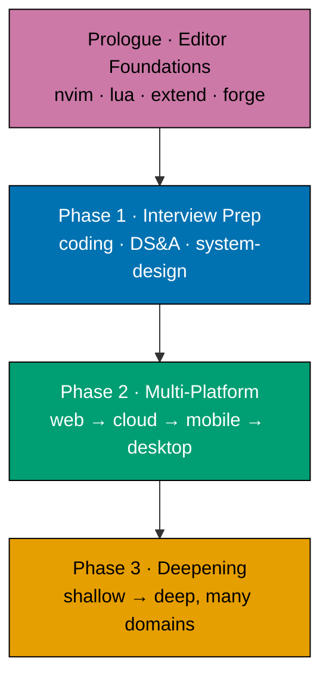

# Product Requirements — Fundamentally Strong SE Interview-First Resequence

## Product Overview

The **primary persona is an experienced software engineer re-entering the job market** (laid off,
returning from a gap, or a senior wanting to switch); the north-star is **"immediately useful"** for
this person. The "Fundamentally Strong Software Engineer" section is re-sequenced from a Pass 0
prologue + five-pass spiral into a **prologue + three-phase canonical arc** that leads with interview
preparation for exactly that reader. The topic content is unchanged;
what changes is **order, framing (`overview.md` + `_index.md`), weights, capstone anchors, and
syllabus numbering** — plus a small set of NEW interview-technique modules this plan authors. English
only. Static markdown; the only executable artifacts are the colocated code samples the NEW modules
ship, excluded from build/test/lint gates (matching the sibling plan's DD-24 stance).

This is **content-only** (markdown under `apps/ayokoding-www/content/`, plus colocated code samples
for the NEW code-bearing modules). It is not a UI/component change, so the UI-design-funnel
requirement does not apply.

## The New Canonical Arc



**Prologue · Editor Foundations** (kept canonically first, but **explicitly skippable for the
experienced**): Just Enough Nvim → Just Enough Lua → Extending Neovim. Forge-Ready capstone stays at
the prologue boundary. `overview.md` gains an **"experienced & job-hunting? start here" fast-path**
that routes an experienced re-entrant (the primary persona) straight into Phase 1 — a from-scratch
reader still starts here.

**Phase 1 · Interview Preparation (through senior)**: designed to **stand alone and deliver fast
value** to an experienced re-entrant. It contains a language on-ramp (Python + Bash + Git, per DN-1;
skimmable for the experienced), the curated existing interview-facing fundamentals (DS&A, Advanced
Algorithms, OOP, OO Design & Patterns, SQL, Technical Communication per DN-3), and four NEW
interview-technique modules written in a **refresh register**. "Through senior" is **central, not
optional**: mid/senior/staff-level system-design and leadership/behavioral rounds are core, because
experienced re-entrants interview at that level. It does **not** relocate genuine systems/internals
mastery upward (that stays in Phase 3).

**Phase 2 · Multi-Platform Productivity**: one fixed market-demand linear sequence, no ◆ branching —
**web → cloud/backend-at-scale → mobile → desktop**.

**Phase 3 · Deepening**: everything else, ordered shallow → deep.

The complete 108-row mapping (each existing topic + capstone → new phase/index/weight/rationale, plus
NEW modules) lives in [tech-docs.md §Canonical Mapping Table](./tech-docs.md#canonical-mapping-table).

## NEW Interview-Technique Modules (authored by this plan)

Each NEW module ships **both** a `learning/` and a `drilling/` subfolder, matching the sibling plan's
dual-track topic anatomy (folder `_index.md` + `learning/` + `drilling/`, each with the standard
weight scheme). Slugs are stable and verified not to collide with any existing folder [Repo-grounded —
none of these four slugs exist in the content tree today].

**Register (HARD authoring constraint): refresh, not first-learn.** Every NEW module assumes the
reader is an **experienced engineer re-entering the job market** (see Personas) — it focuses on
interview-specific **technique**, breadth **refresh**, and **current 2026-market realities**, not on
teaching concepts from zero. The tone is "you've done this professionally for years but haven't run a
LeetCode-style loop / a design whiteboard / a behavioral round recently — here's the fast reload," not
"here is what a hash map is."

| New slug                               | Learning format   | Maker agent                                  | One-line scope (refresh register for an experienced re-entrant)                                                                                                                                                              |
| -------------------------------------- | ----------------- | -------------------------------------------- | ---------------------------------------------------------------------------------------------------------------------------------------------------------------------------------------------------------------------------- |
| `coding-interview`                     | By Example        | `apps-ayokoding-www-by-example-maker`        | Fast refresh + **pattern recognition** for someone who's coded for years but hasn't done LeetCode-style loops recently: two-pointers, sliding window, recursion/backtracking, hashing, time-boxing, narrating while solving. |
| `system-design-interview`              | Annotated-concept | `apps-ayokoding-www-annotated-concept-maker` | The **senior/staff-level** system-design _interview_ rubric & drills — requirements clarification, estimation, whiteboard flow, trade-off signalling — distinct from the depth topic "System Design".                        |
| `behavioral-and-leadership-interviews` | Annotated-concept | `apps-ayokoding-www-annotated-concept-maker` | STAR + **senior/staff/EM** leadership/behavioral rounds, AND explicitly **framing an employment-gap / layoff / re-entry narrative** — a persona-specific need for the re-entrant.                                            |
| `take-home-and-live-coding`            | By Example        | `apps-ayokoding-www-by-example-maker`        | **Time-boxed** take-home + live/pair-coding technique for a working professional: scoping, testing, README hygiene, thinking aloud under observation — respecting limited prep time.                                         |

**Job-search-readiness / interview-loop-map framing.** In addition to the four modules, the plan adds
a short **interview-loop-map** orientation (what a **2026 senior interview loop** looks like
end-to-end — recruiter screen → coding → system design → behavioral/leadership → hiring-manager /
team-fit) so a re-entrant orients fast. Placement decision: authored as the **overview-level fast-path
affordance + a short intro section inside the `coding-interview` module** (rather than a separate
folder), keeping the loop-map adjacent to where a re-entrant enters. See README DN-4 (interview-loop
capstone) as the complementary hands-on mock.

Optional NEW capstone `capstone-interview-loop` (a full mock loop: coding + system-design +
behavioral) at the Phase 1 boundary — see README DN-4.

## NEW Productivity & Harness Modules (Additions 1–4)

Beyond the four interview modules, this plan authors ten more NEW modules (each with `learning/` +
`drilling/` tracks) so the reader becomes **productive in real target codebases** and can **build
their own agentic coding tool and an agentic pentest engine**. All slugs are verified absent from the
content tree [Repo-grounded]. Full index/weight/language detail is in
[tech-docs.md §Canonical Mapping Table](./tech-docs.md#canonical-mapping-table); scope summary:

| New slug                                                 | Phase / anchor                 | Language(s)                      | One-line scope                                                                                                                                                                                                                                                        |
| -------------------------------------------------------- | ------------------------------ | -------------------------------- | --------------------------------------------------------------------------------------------------------------------------------------------------------------------------------------------------------------------------------------------------------------------- |
| `async-python-and-fastapi-services` `(A1)`               | Phase 2 web (N=20)             | Python                           | Modern async Python 3.11+, FastAPI/Uvicorn, Pydantic, `uv`/`ruff`/`pyright`/`pytest-asyncio` — the `remotebrowser` + FastAPI-backend stack.                                                                                                                           |
| `self-hosting-essentials` `(A3)`                         | Phase 2 cloud, head (N=24)     | — (ops/config, minimal app code) | **Light** on-ramp: run one box/VM, self-host a service (Docker/Podman), systemd/ports/reverse proxy, env/secrets hygiene, lightweight backups, PaaS git-push (Fly.io/Dokku). NOT a cluster, NOT Terraform/Packer/Ansible IaC, NOT Proxmox.                            |
| `browser-automation-with-cdp` `(A1)`                     | Phase 3, before harness (N=69) | Python (CDP client)              | Chrome DevTools Protocol browser automation (port 9222; nodriver/zendriver family) — the core `remotebrowser` skill and a natural harness tool.                                                                                                                       |
| `the-agent-loop` `(A2)`                                  | Phase 3 harness cluster (N=70) | Python (DN-12)                   | The LLM tool-use / function-calling loop: read-eval-act cycle, streaming, stop conditions.                                                                                                                                                                            |
| `agent-tools-and-mcp` `(A2)`                             | Phase 3 harness cluster (N=71) | Python (DN-12)                   | Tool/function schema design; building an MCP server + client (the **same MCP** `remotebrowser` exposes); resources/prompts.                                                                                                                                           |
| `agent-context-and-memory` `(A2)`                        | Phase 3 harness cluster (N=72) | Python (DN-12)                   | Context-window budgeting, compaction/summarization, retrieval, persistent memory.                                                                                                                                                                                     |
| `agent-permissions-and-sandboxing` `(A2)`                | Phase 3 harness cluster (N=73) | Python (DN-12)                   | Approval models, sandboxed execution, guardrails.                                                                                                                                                                                                                     |
| `agent-orchestration-subagents-and-observability` `(A2)` | Phase 3 harness cluster (N=74) | Python (DN-12)                   | Multi-agent/subagent patterns, background tasks, schedulers, hooks/skills/instruction-file systems, plus agent UX (TUI) + evals + tracing/telemetry.                                                                                                                  |
| `just-enough-cpp` `(A4)`                                 | Phase 3 low-level (N=76)       | C++                              | Systems-language principle on-ramp (RAII, templates/generics, STL, smart pointers, manual memory); Wazuh's C++ core is one illustration, not the subject. Prereq `just-enough-c` (N=75); intermediate. Dedicated on-ramp vs extend-`just-enough-c` is DN-14.          |
| `detection-engineering-and-siem-operations` `(A4)`       | Phase 3 security (N=95)        | XML/rules + config + Python      | Detection-engineering principles: decoders, correlation rules, log parsing, false-positive tuning, dashboards, alert triage — Wazuh XML is the worked example, not the subject. Distinct from concept-level `defensive-security` (N=94), never merged (RD-14, DN-15). |

**Flagship capstones** (two build-your-own payoffs):

- `capstone-build-your-own-coding-agent` (`A2`, weight 845, after N=74) — assemble the harness cluster
  into a working minimal coding-agent CLI ("pi.dev / Claude Code from scratch"). The DN-11 bonus option
  drives `remotebrowser` over MCP as a real tool backend, tying Additions 1–3 together.
- `capstone-build-your-own-pentest-engine` (`A4`, weight 1075, after the security suite / N=97) — the
  **security sibling** of the coding-agent capstone: assemble agentic swarm orchestration + MCP tool
  arsenal + CDP browser driving + tool-chaining (subfinder/httpx/naabu/nuclei/sqlmap) + evidence
  capture + scope enforcement + deterministic-prober-vs-AI-verifier layers into a working engine —
  `vacti-pentest-engine` is the illustrative worked-example, not the subject. Prereqs: the harness
  cluster (70–74) +
  `browser-automation-with-cdp` (69) + the security suite (91–97) +
  `detection-engineering-and-siem-operations` (95). Language: TypeScript default (DN-16).

**Two altitudes of self-hosting (never merged, RD-12):** `self-hosting-essentials` (N=24) is the
**light** productivity ramp; the full-depth `bare-metal-virtualization` (Proxmox, N=98) stays in
Phase 3. The light module's scope stays strictly below `containers-and-orchestration` (N=26) and
`cloud-and-iac` (N=27) — its rationale explicitly names that boundary.

**Two altitudes of blue-team security (never merged, RD-14):** the concept-level `defensive-security`
(N=94) teaches detection/monitoring/incident-response as ideas; the hands-on
`detection-engineering-and-siem-operations` (N=95) is where the reader writes real Wazuh-style
decoders + rules and operates a SIEM. Distinct altitudes, never merged.

## NEW Module & Capstone Specifications

This section is the full product spec for the **fourteen NEW modules + three NEW capstones** this plan
authors. The existing 94 topics are owned by the sibling plan
([`plans/in-progress/fundamentally-strong-software-engineer/prd.md`](../../in-progress/fundamentally-strong-software-engineer/prd.md))
and are **referenced, not re-specified**. Every NEW module inherits the sibling's cross-cutting
authoring guarantees verbatim — accuracy-verified via `web-researcher` before authoring (DD-28),
follow-along-complete (DD-30), typed-Python where Python (DD-39), colocated runnable `code/`
page-bundle files (DD-24), the exhaustive `co-NN`/`ex-NN` enumeration (DD-34), and prerequisites +
prev/next navigation (DD-31, DD-32). The specs below instantiate the shared **dual-track anatomy**
(learning subtree + single drilling page) for each new slug; they do not restate the global rules.

**Principle-first framing (HARD, per RD-9).** Every module teaches a **durable principle**; the target
codebases (`remotebrowser`, `wazuh`, `vacti`/`vacti-pentest-engine`, the ose family) are **illustrative
worked-examples that prove the principle transfers** — never the subject. No module is a repo tutorial;
a repo's specific libraries are named only as fast on-the-job pickups. The learning outcomes below are
phrased as principle mastery, with the illustrative repo in parentheses.

**Register.** The four interview-technique modules are authored in a **refresh register** (assume prior
professional experience; reload technique, do not teach concepts from zero — see the HARD authoring
constraint above). The ten Addition-1/2/3/4 modules are authored in the sibling's normal **first-learn
By-Example register** (they teach genuinely new build-your-own skills), the `just-enough-cpp` primer at
**primer scope** ("just enough to be productive," By-Example pace).

### Shared dual-track anatomy (applies to every NEW module)

Each NEW module is a single topic folder owning both a `learning/` subtree and a `drilling/` single
page, exactly per the sibling's [Topic-First Layout (DD-26)] and anatomy rules:

- **Learning track** — `_index.md` (topic nav) · `overview.md` (what/why, `## Prerequisites`, how the
  examples progress, Editor Setup matrix links, and the module's Big-Idea tags) · one or more example
  pages (`beginner.md` / `intermediate.md` / `advanced.md` for By-Example/Primer, or per-theme
  worked-example pages for Annotated-concept) at the **1.0–2.25 comments/code-line** density · a
  `learning/capstone/` intra-topic capstone · a colocated `code/` bundle. Concept-no-code interview
  modules substitute annotated worked-scenarios + accessible Mermaid diagrams for `code/`.
- **Drilling track** — a single `drilling/` page in the fixed five-section order: (1) Recall Q&A
  flashcards in `<details>`, (2) Applied problems/scenarios, (3) Code katas / design exercises with
  reference solutions, (4) Self-check mastery checklist, (5) Elaborative-interrogation / self-explanation
  prompts tied to the module's Big-Idea tags.

### Volume-target bands (inherited from sibling DD-34; floor not cap, DD-8)

| Module shape                                  | Concept floor (`co-NN`) | Worked-example / scenario band (`ex-NN`)      |
| --------------------------------------------- | ----------------------- | --------------------------------------------- |
| By Example                                    | ≥ 10                    | 75–85 code examples                           |
| Primer (_Just Enough X_)                      | ≥ 8                     | 75–85 code examples (By-Example pace)         |
| Annotated-concept, code-bearing               | ≥ 10                    | 45–60 worked examples                         |
| Annotated-concept, no-code (refresh register) | ≥ 8                     | 30–60 worked scenarios (subject-richness set) |

### Interview-technique modules (Phase 1 · refresh register)

#### `coding-interview` (N=9 · By Example · Python, patterns language-agnostic)

- **Purpose**: reload LeetCode-style **pattern recognition and time-boxed problem-solving** for an
  engineer who has coded professionally for years but has not run a coding-interview loop recently — the
  durable principle is _mapping an unseen prompt to a known algorithmic pattern under observation and a
  clock_, not learning what a hash map is.
- **Learning outcomes**: the reader can (a) recognize and apply the core patterns — two-pointers,
  sliding window, fast/slow pointers, hashing-for-lookup, recursion/backtracking, BFS/DFS, binary
  search on the answer, heap/greedy, interval merging, dynamic-programming shapes; (b) time-box a
  45-minute problem (clarify → brute force → optimize → test); (c) narrate reasoning aloud while coding;
  (d) recover from a stuck state without freezing. Also hosts the short **2026 senior interview-loop-map**
  intro (recruiter screen → coding → system design → behavioral/leadership → hiring-manager/team-fit).
- **Learning-track anatomy**: `overview.md` states the refresh scope + the interview-loop-map + the
  "narrate while you solve" contract; `beginner.md` (pattern-recognition warm-ups per pattern),
  `intermediate.md` (multi-pattern problems + optimization passes), `advanced.md` (hard DP/graph
  problems + time-box recovery drills); `learning/capstone/` = a full timed mock coding round with a
  worked narration transcript; `code/` holds each pattern's runnable, typed-Python reference solution.
- **Drilling-track anatomy**: flashcards on pattern-trigger cues ("sorted array + pair-sum ⇒ ?");
  applied "which pattern and why" scenarios; code katas (one kata per pattern with a reference solution
  in `<details>`); self-check ("can you name the pattern for this prompt in 30s?"); elaborative-
  interrogation ("why does two-pointers beat the nested loop here, and when does it _not_ apply?").
- **Volume targets**: ≥ 10 `co-NN` concepts; 75–85 `ex-NN` code examples (By Example band).

```gherkin
Scenario: coding-interview refreshes pattern recognition, not first principles
  Given the coding-interview module is authored in the refresh register
  When an experienced engineer reads its learning track
  Then each pattern page maps unseen-prompt cues to a named algorithmic pattern with a runnable typed-Python solution
  And it assumes prior data-structure fluency rather than teaching hash maps or arrays from zero
  And its overview hosts the 2026 senior interview-loop-map orientation
```

#### `take-home-and-live-coding` (N=10 · By Example · Python)

- **Purpose**: reload **time-boxed take-home and observed live/pair-coding technique** for a working
  professional with limited prep time — the durable principle is _scoping and shipping a defensible,
  tested slice under a deadline while thinking aloud_, not language syntax.
- **Learning outcomes**: the reader can (a) scope a take-home to a shippable core within the stated box;
  (b) structure a repo with a README, tests, and honest TODO boundaries reviewers respect; (c) drive a
  live/pair session — restating the prompt, narrating trade-offs, taking hints gracefully; (d) write
  the minimum tests that signal engineering maturity; (e) manage the clock and cut scope deliberately.
- **Learning-track anatomy**: `overview.md` states the "respect limited prep time" contract + the
  take-home rubric reviewers actually use; `beginner.md` (scoping + README hygiene on a small prompt),
  `intermediate.md` (a full worked take-home built incrementally with tests), `advanced.md` (live/pair
  session transcripts + hint-recovery drills); `learning/capstone/` = one complete, submission-ready
  take-home with README, tests, and a self-review note; `code/` holds the runnable, typed take-home
  project and its test suite.
- **Drilling-track anatomy**: flashcards on take-home rubric signals; applied "scope this prompt to a
  4-hour box" scenarios; code katas (add the missing test / cut the over-built abstraction);
  self-check ("can you defend every file you'd submit?"); elaborative-interrogation ("why does a small
  tested slice out-signal a large untested one?").
- **Volume targets**: ≥ 10 `co-NN` concepts; 75–85 `ex-NN` code examples (By Example band).

```gherkin
Scenario: take-home-and-live-coding teaches time-boxed scoping and observed technique
  Given the take-home-and-live-coding module is authored
  When an experienced engineer reads its learning track
  Then it teaches scoping a shippable tested slice within a stated time box
  And it includes live/pair-coding transcripts covering narration and graceful hint-taking
  And its capstone ships one complete submission-ready take-home with README and tests
```

#### `system-design-interview` (N=14 · Annotated-concept · no code)

- **Purpose**: reload the **senior/staff-level system-design _interview_ rubric and whiteboard flow** —
  the durable principle is _driving an ambiguous design prompt through requirements → estimation →
  high-level design → deep-dive → trade-off signalling under interview time_. Distinct from the Phase-3
  depth topic `system-design` (N=60), which is referenced forward for the underlying mechanics.
- **Learning outcomes**: the reader can (a) clarify functional + non-functional requirements and pin
  scope; (b) do back-of-envelope estimation (QPS, storage, bandwidth); (c) sketch a defensible
  high-level design and justify each component; (d) deep-dive one component on request; (e) name and
  signal trade-offs (consistency vs availability, latency vs throughput) the way an interviewer scores.
- **Learning-track anatomy**: `overview.md` states the interview rubric + the requirements→estimation→
  design→deep-dive→trade-off flow; per-theme worked-scenario pages, each a fully worked design prompt
  (e.g. URL shortener, news feed, rate limiter, chat, object store) with accessible Mermaid diagrams at
  each stage and an explicit trade-off ledger; `learning/capstone/` = one end-to-end mock design round
  transcript scored against the rubric; `artifacts/` holds the design diagrams (no runnable `code/`).
- **Drilling-track anatomy**: flashcards on estimation constants + component roles; applied "design X in
  40 minutes" scenarios with model walk-throughs; design exercises (extend the design for 10× scale);
  self-check ("can you estimate QPS without notes?"); elaborative-interrogation ("why this datastore and
  not that one, and what breaks at the next order of magnitude?").
- **Volume targets**: ≥ 10 `co-NN` concepts; 45–60 worked design scenarios/drills (annotated-concept
  no-code band, upper range — system design is scenario-rich).

```gherkin
Scenario: system-design-interview teaches the interview rubric distinct from the depth topic
  Given the system-design-interview module is authored
  When a senior/staff candidate reads its learning track
  Then it drives worked prompts through requirements, estimation, high-level design, deep-dive, and trade-off signalling
  And it treats senior/staff-level design rounds as core rather than optional
  And it references the Phase-3 system-design depth topic forward without duplicating its mechanics
```

#### `behavioral-and-leadership-interviews` (N=16 · Annotated-concept · no code)

- **Purpose**: reload **STAR-structured behavioral technique plus senior/staff/EM leadership rounds**,
  and — the persona-specific need — **framing an employment-gap / layoff / re-entry narrative** with
  confidence. The durable principle is _converting real experience into scored, honest, level-appropriate
  stories under behavioral-round pressure_.
- **Learning outcomes**: the reader can (a) structure any story as STAR with a quantified result; (b)
  map stories to the leadership competencies senior/staff/EM loops probe (conflict, influence without
  authority, failure, prioritization, mentoring); (c) **reframe a layoff, an employment gap, or a
  sabbatical into a confident, non-defensive narrative**; (d) handle the "walk me through your resume"
  and "tell me about a failure" prompts; (e) ask level-appropriate reverse questions.
- **Learning-track anatomy**: `overview.md` states STAR + the competency map + the **gap/layoff
  narrative** contract as first-class material; per-theme worked-scenario pages (conflict, failure,
  influence, leadership at level, and a dedicated **employment-gap / layoff / re-entry** page with
  before/after story reframes); `learning/capstone/` = a full mock behavioral round with model answers
  scored against a senior/staff/EM rubric; `artifacts/` holds story-worksheet templates (no `code/`).
- **Drilling-track anatomy**: flashcards on competency-to-story mapping; applied "answer this behavioral
  prompt at staff level" scenarios; design exercises (turn a messy real event into a STAR story);
  self-check ("can you tell your gap story in 60s without apologizing?"); elaborative-interrogation
  ("why does a specific quantified failure story out-signal a polished generic one?").
- **Volume targets**: ≥ 10 `co-NN` concepts; 30–45 worked scenarios (annotated-concept no-code band,
  refresh register).

```gherkin
Scenario: behavioral-and-leadership-interviews covers the layoff and employment-gap narrative as core
  Given the behavioral-and-leadership-interviews module is authored
  When a laid-off or returning-from-a-gap engineer reads its learning track
  Then it explicitly teaches reframing an employment gap, a layoff, or a re-entry story into a confident narrative
  And it treats senior/staff/EM leadership rounds as core material with a scored rubric
  And it structures every worked story as STAR with a quantified result
```

### Productivity modules (Additions 1 & 3 · first-learn By-Example register)

#### `async-python-and-fastapi-services` (N=20 · By Example · Python)

- **Purpose**: teach **modern async Python service construction** — the durable principle is _building a
  correct, typed, non-blocking HTTP service with an async runtime and schema-validated boundaries_
  (illustrated by the FastAPI/Uvicorn/Pydantic stack `remotebrowser` runs on).
- **Learning outcomes**: the reader can (a) reason about `async`/`await`, the event loop, coroutines,
  and when async helps vs hurts; (b) build a FastAPI service with typed request/response models via
  Pydantic; (c) run it under Uvicorn with lifecycle/startup hooks; (d) test async code with
  `pytest-asyncio`; (e) drive the modern toolchain (`uv`, `ruff`, `pyright`). Repo pickup: `remotebrowser`'s
  FastAPI backend.
- **Learning-track anatomy**: `overview.md` (async mental model + the `uv`/`ruff`/`pyright` toolchain +
  `## Prerequisites`); `beginner.md` (event loop + coroutines + first FastAPI route), `intermediate.md`
  (Pydantic models, dependency injection, error handling, async DB access), `advanced.md` (concurrency
  patterns, background tasks, streaming responses, testing); `learning/capstone/` = a small typed async
  service with validated endpoints and an async test suite; `code/` holds runnable, `pyright`-strict-clean
  services.
- **Drilling-track anatomy**: flashcards on event-loop + await semantics; applied "why does this block
  the loop?" scenarios; code katas (make a blocking handler async; add a Pydantic validator); self-check
  ("can you explain when async does _not_ help?"); elaborative-interrogation ("why is a typed boundary
  worth the Pydantic overhead here?").
- **Volume targets**: ≥ 10 `co-NN` concepts; 75–85 `ex-NN` code examples (By Example band).

```gherkin
Scenario: async-python-and-fastapi-services teaches async service principles with a typed boundary
  Given the async-python-and-fastapi-services module is authored
  When a reader targeting an async-Python service reads its learning track
  Then it teaches the event loop, coroutines, and a schema-validated FastAPI boundary with runnable typed examples
  And it drives the uv/ruff/pyright toolchain as the raw-form workflow
  And it names remotebrowser's FastAPI backend only as an illustrative pickup, not the subject
```

#### `self-hosting-essentials` (N=24 · By Example · ops/config, minimal app code)

- **Purpose**: teach the **light self-hosting on-ramp** — the durable principle is _running one box and
  self-hosting a service without a cluster or IaC_: run a VM, containerize with Docker/Podman, manage
  systemd/ports/a reverse proxy, keep env/secrets hygiene, take lightweight backups, and PaaS
  git-push deploy (Fly.io/Dokku). Strictly **below** `containers-and-orchestration` (N=26) and
  `cloud-and-iac` (N=27); the full-depth Proxmox topic is `bare-metal-virtualization` (N=98) (RD-12).
- **Learning outcomes**: the reader can (a) provision and reach one box/VM; (b) run a service in a
  container with a restart policy; (c) put it behind a reverse proxy with TLS; (d) manage
  ports/systemd/env-vars/secrets safely; (e) take and restore a lightweight backup; (f) deploy via a
  PaaS git push. Repo pickup: the `ose-infra` self-hosted-runner stack, `remotebrowser` Docker/Podman
  self-hosting.
- **Learning-track anatomy**: `overview.md` (the explicit "one box, not a cluster; no Terraform/Ansible;
  Proxmox depth stays at N=98" scope boundary + `## Prerequisites`); `beginner.md` (one box + a
  containerized service + ports), `intermediate.md` (reverse proxy + TLS + systemd + env/secrets),
  `advanced.md` (backups/restore + PaaS git-push deploy); `learning/capstone/` = self-host one small
  service end-to-end behind a proxy with a backup and a PaaS deploy; `code/` holds the compose/config
  files and the minimal deployed app.
- **Drilling-track anatomy**: flashcards on reverse-proxy + systemd + secrets basics; applied "this
  service is unreachable — what did you miss?" scenarios; katas (write the compose file; add the proxy
  route); self-check ("can you restore from your backup?"); elaborative-interrogation ("why stop below a
  cluster here, and when would you reach for N=26/27 instead?").
- **Volume targets**: ≥ 10 `co-NN` concepts; 75–85 `ex-NN` worked examples (By Example band; ops/config
  examples where app code is minimal).

```gherkin
Scenario: self-hosting-essentials stays a light on-ramp below clusters and IaC
  Given the self-hosting-essentials module is authored
  When a reader compares it with containers-and-orchestration and cloud-and-iac
  Then it teaches running one box, containerizing a service, a reverse proxy, and PaaS git-push deploy
  And its overview explicitly excludes clusters, Terraform/Packer/Ansible IaC, and Proxmox
  And it references bare-metal-virtualization as the separate full-depth metal layer
```

#### `browser-automation-with-cdp` (N=69 · By Example · Python)

- **Purpose**: teach **Chrome DevTools Protocol browser automation** — the durable principle is _driving
  a real browser programmatically over a control protocol_ (port 9222; the nodriver/zendriver client
  family), a natural agent-harness tool and the core `remotebrowser` skill.
- **Learning outcomes**: the reader can (a) attach to a Chrome instance over CDP; (b) navigate, query
  the DOM, and extract structured data; (c) drive input, wait on conditions, and handle navigation;
  (d) manage sessions/targets and headless vs headed; (e) understand why CDP underlies the
  higher-level client libraries. Repo pickup: `remotebrowser`'s CDP-driven isolated Chrome.
- **Learning-track anatomy**: `overview.md` (CDP mental model + why-a-protocol-not-a-library +
  `## Prerequisites`); `beginner.md` (attach + navigate + read the DOM), `intermediate.md` (input,
  waits, extraction, sessions/targets), `advanced.md` (headless fleets, robustness, anti-flakiness);
  `learning/capstone/` = a small CDP-driven extractor/automation over a local target; `code/` holds
  runnable typed CDP clients.
- **Drilling-track anatomy**: flashcards on the CDP domain model (Page/DOM/Runtime/Target); applied
  "this automation is flaky — why?" scenarios; katas (extract this field; wait on this condition);
  self-check ("can you attach over CDP without a wrapper library?"); elaborative-interrogation ("why
  automate over a protocol rather than a single vendor library?").
- **Volume targets**: ≥ 10 `co-NN` concepts; 75–85 `ex-NN` code examples (By Example band).

```gherkin
Scenario: browser-automation-with-cdp teaches protocol-level browser control
  Given the browser-automation-with-cdp module is authored
  When a reader targeting agent-driven browser automation reads its learning track
  Then it teaches attaching over CDP, driving the DOM, and extracting data with runnable typed examples
  And it frames CDP as the protocol underlying client libraries like nodriver/zendriver
  And it names remotebrowser's isolated Chrome only as an illustrative pickup
```

### Harness-engineering cluster (Addition 2 · first-learn By-Example register · Python default, DN-12)

The five cluster modules are the **build-your-own agentic-coding-tool track** (RD-10); the MCP built in
`agent-tools-and-mcp` is the _same MCP_ `remotebrowser` exposes. All five feed the
`capstone-build-your-own-coding-agent` payoff.

#### `the-agent-loop` (N=70 · By Example · Python)

- **Purpose**: teach the **LLM tool-use / function-calling loop** — the durable principle is _the
  read-eval-act cycle that turns a chat model into an agent_: prompt → model → tool call → observation →
  loop, with streaming and stop conditions.
- **Learning outcomes**: the reader can (a) implement a minimal agent loop around a tool-calling model;
  (b) parse and dispatch tool calls; (c) feed observations back into context; (d) stream tokens and
  handle partial output; (e) define correct stop conditions and loop guards.
- **Learning-track anatomy**: `overview.md` (the loop mental model + `## Prerequisites` on prior AI
  topics 66–68); `beginner.md` (a one-tool loop), `intermediate.md` (multi-tool dispatch, observations,
  streaming), `advanced.md` (stop conditions, loop guards, error recovery); `learning/capstone/` = a
  minimal working single-file agent loop; `code/` holds the runnable typed loop.
- **Drilling-track anatomy**: flashcards on the read-eval-act cycle; applied "this loop never stops —
  why?" scenarios; katas (add a tool; add a stop condition); self-check ("can you draw the loop from
  memory?"); elaborative-interrogation ("why must observations re-enter context, and what breaks if they
  don't?").
- **Volume targets**: ≥ 10 `co-NN` concepts; 75–85 `ex-NN` code examples (By Example band).

```gherkin
Scenario: the-agent-loop teaches the read-eval-act cycle as runnable code
  Given the the-agent-loop module is authored
  When a reader building an agent reads its learning track
  Then it implements a minimal tool-calling loop with dispatch, observations, streaming, and stop conditions
  And every stage ships a runnable typed-Python example
  And it builds on the prior agentic-AI topics rather than re-teaching LLM basics
```

#### `agent-tools-and-mcp` (N=71 · By Example · Python)

- **Purpose**: teach **tool/function-schema design and the Model Context Protocol** — the durable
  principle is _exposing capabilities to an agent through a typed tool contract_: building an MCP server
  and client, plus resources and prompts (the same MCP `remotebrowser` exposes).
- **Learning outcomes**: the reader can (a) design a tool/function schema an LLM can call reliably; (b)
  build an MCP server exposing tools/resources/prompts; (c) build an MCP client that consumes them; (d)
  reason about transport and capability negotiation; (e) connect the server to a harness. Repo pickup:
  `remotebrowser`'s bundled MCP server.
- **Learning-track anatomy**: `overview.md` (tool-contract mental model + MCP overview + `## Prerequisites`);
  `beginner.md` (a single-tool schema + a minimal MCP server), `intermediate.md` (resources, prompts,
  client consumption), `advanced.md` (multi-tool servers, transport, capability negotiation);
  `learning/capstone/` = a working MCP server + client pair exposing a small tool; `code/` holds the
  runnable server/client.
- **Drilling-track anatomy**: flashcards on the MCP capability set; applied "the model won't call this
  tool — why?" scenarios; katas (add a tool schema; expose a resource); self-check ("can you build a
  minimal MCP server from memory?"); elaborative-interrogation ("why a protocol boundary rather than
  in-process function calls?").
- **Volume targets**: ≥ 10 `co-NN` concepts; 75–85 `ex-NN` code examples (By Example band).

```gherkin
Scenario: agent-tools-and-mcp teaches tool-schema design and a working MCP server plus client
  Given the agent-tools-and-mcp module is authored
  When a reader building an agent's tool layer reads its learning track
  Then it teaches typed tool/function schemas and builds a runnable MCP server and client
  And it exposes resources and prompts alongside tools
  And it names remotebrowser's bundled MCP server as the illustrative pickup for the same protocol
```

#### `agent-context-and-memory` (N=72 · Annotated-concept · Python)

- **Purpose**: teach **context-window budgeting and agent memory** — the durable principle is _managing a
  finite context window_: compaction/summarization, retrieval, and persistent memory across turns.
- **Learning outcomes**: the reader can (a) budget a context window and measure token cost; (b) compact
  and summarize history without losing signal; (c) add retrieval to inject relevant context; (d) design
  persistent memory across sessions; (e) reason about the recall-vs-cost trade-off.
- **Learning-track anatomy**: `overview.md` (the finite-window mental model + `## Prerequisites`);
  per-theme worked-example pages (budgeting, compaction/summarization, retrieval, persistent memory)
  each with a code-backed worked example or accessible Mermaid where prose fits; `learning/capstone/` =
  a memory/compaction layer for the Phase-3 agent loop; `code/` holds the runnable memory components.
- **Drilling-track anatomy**: flashcards on context-budget terms; applied "the agent forgot the goal —
  why?" scenarios; design exercises (choose a compaction strategy for this transcript); self-check
  ("can you explain the recall-vs-cost trade-off?"); elaborative-interrogation ("why summarize rather
  than truncate, and when is truncation actually right?").
- **Volume targets**: ≥ 10 `co-NN` concepts; 45–60 worked examples (annotated-concept code-bearing band).

```gherkin
Scenario: agent-context-and-memory teaches finite-window management principles
  Given the agent-context-and-memory module is authored
  When a reader extending an agent reads its learning track
  Then it teaches context budgeting, compaction/summarization, retrieval, and persistent memory
  And each strategy ships a code-backed worked example or an accessible Mermaid diagram
  And it frames every technique as managing a finite context window
```

#### `agent-permissions-and-sandboxing` (N=73 · By Example · Python)

- **Purpose**: teach **agent safety boundaries** — the durable principle is _constraining what an agent
  may do_: approval models, sandboxed execution, and guardrails around tool use.
- **Learning outcomes**: the reader can (a) design an approval model (auto/ask/deny) for tool calls; (b)
  run agent-invoked code in a sandbox; (c) add guardrails (allowlists, resource limits, path scoping);
  (d) reason about the safety-vs-autonomy trade-off; (e) fail closed on ambiguous permission requests.
- **Learning-track anatomy**: `overview.md` (the least-privilege mental model + `## Prerequisites`);
  `beginner.md` (an approval gate on a tool call), `intermediate.md` (sandboxed execution + allowlists),
  `advanced.md` (resource limits, path scoping, fail-closed defaults); `learning/capstone/` = a
  permission + sandbox layer wrapping the agent loop; `code/` holds the runnable guardrail components.
- **Drilling-track anatomy**: flashcards on approval-model states; applied "this agent deleted a file it
  shouldn't — what guardrail was missing?" scenarios; katas (add an allowlist; scope a path); self-check
  ("can you name your fail-closed default?"); elaborative-interrogation ("why fail closed, and what does
  failing open cost here?").
- **Volume targets**: ≥ 10 `co-NN` concepts; 75–85 `ex-NN` code examples (By Example band).

```gherkin
Scenario: agent-permissions-and-sandboxing teaches least-privilege agent boundaries
  Given the agent-permissions-and-sandboxing module is authored
  When a reader hardening an agent reads its learning track
  Then it teaches approval models, sandboxed execution, and guardrails with runnable typed examples
  And it establishes fail-closed defaults for ambiguous permission requests
  And it frames every control as constraining what the agent may do
```

#### `agent-orchestration-subagents-and-observability` (N=74 · Annotated-concept · Python)

- **Purpose**: teach **multi-agent orchestration and agent observability** — the durable principle is
  _composing and observing many agents_: subagent patterns, background tasks/schedulers,
  hooks/skills/instruction-file systems, agent UX (TUI), and evals + tracing/telemetry.
- **Learning outcomes**: the reader can (a) orchestrate subagents and delegate work; (b) run background
  tasks and schedulers; (c) wire hooks/skills/instruction-file extension systems; (d) build a minimal
  agent TUI; (e) add evals and tracing/telemetry to see what an agent did.
- **Learning-track anatomy**: `overview.md` (the orchestration + observability mental model +
  `## Prerequisites`); per-theme worked-example pages (subagents, background/scheduling,
  hooks/skills/instruction-files, TUI, evals + tracing) with code-backed examples or accessible Mermaid;
  `learning/capstone/` = a small multi-agent orchestrator with tracing over the Phase-3 agent loop;
  `code/` holds the runnable orchestration + telemetry components.
- **Drilling-track anatomy**: flashcards on orchestration patterns; applied "a subagent hung — how would
  you see it?" scenarios; design exercises (choose a subagent decomposition); self-check ("can you trace
  a run end-to-end?"); elaborative-interrogation ("why observe before you scale the swarm?").
- **Volume targets**: ≥ 10 `co-NN` concepts; 45–60 worked examples (annotated-concept code-bearing band).

```gherkin
Scenario: agent-orchestration-subagents-and-observability teaches composing and observing agents
  Given the agent-orchestration-subagents-and-observability module is authored
  When a reader scaling an agent system reads its learning track
  Then it teaches subagent orchestration, background tasks, hooks/skills systems, a TUI, and tracing/telemetry
  And each concern ships a code-backed worked example or an accessible Mermaid diagram
  And it treats observability and evals as prerequisites for scaling a swarm
```

### Security & systems gap-closers (Addition 4)

#### `just-enough-cpp` (N=76 · Primer · C++)

- **Purpose**: a **systems-language principle on-ramp** — the durable principle is _manual-memory /
  zero-cost-abstraction reasoning_: RAII, templates/generics, the STL, smart pointers, and manual
  memory, at primer scope ("just enough to be productive"). Prereq `just-enough-c` (N=75); Wazuh's C++
  core is one illustration, not the subject (RD-13).
- **Learning outcomes**: the reader can (a) read and write idiomatic modern C++; (b) apply RAII and
  smart pointers for deterministic resource management; (c) use templates/generics and the STL
  containers/algorithms; (d) reason about value vs reference vs move semantics; (e) build and run a
  small C++ program from the terminal (`clang++`/`g++`, CMake basics).
- **Learning-track anatomy**: `overview.md` ("just enough C++ to be productive" scope, which later
  material it feeds, `## Prerequisites` naming `just-enough-c`); `beginner.md` (syntax, values,
  references, RAII), `intermediate.md` (smart pointers, templates, STL containers/algorithms),
  `advanced.md` (move semantics, a small multi-file build with CMake); `learning/capstone/` = a light
  consolidation program using RAII + templates + STL together (primer capstone, not a full project);
  `code/` holds runnable, compilable C++ sources.
- **Drilling-track anatomy**: flashcards on RAII/smart-pointer/STL terms; applied "who owns this memory?"
  scenarios; code katas (fix the leak with RAII; template this function); self-check ("can you explain
  move semantics?"); elaborative-interrogation ("why does RAII beat manual free/delete, and when do you
  still reach for raw pointers?").
- **Volume targets**: ≥ 8 `co-NN` concepts; 75–85 `ex-NN` code examples (Primer band, By-Example pace).

```gherkin
Scenario: just-enough-cpp is a systems-language primer, not a Wazuh tutorial
  Given the just-enough-cpp primer is authored
  When a reader who completed just-enough-c reads its learning track
  Then it teaches RAII, templates/generics, the STL, smart pointers, and manual memory at primer scope
  And every example is a runnable terminal-built C++ program
  And it names Wazuh's C++ core only as one illustration of the systems-language principle
```

#### `detection-engineering-and-siem-operations` (N=95 · By Example · XML/rules + config + Python)

- **Purpose**: teach **detection-engineering principles** hands-on — the durable principle is _turning
  raw logs into reliable detections_: decoders, correlation rules, log parsing/normalization,
  false-positive tuning, dashboards, and alert triage. Wazuh's XML ruleset is the worked example, not the
  subject; distinct from concept-level `defensive-security` (N=94) (RD-14). Prereq `defensive-security`.
- **Learning outcomes**: the reader can (a) write a decoder that parses a raw log into fields; (b) author
  a correlation rule that fires on a real pattern; (c) normalize heterogeneous log sources; (d) tune a
  noisy rule down to an acceptable false-positive rate; (e) build a dashboard and run an alert-triage
  workflow. Repo pickup: Wazuh's XML decoder/rule syntax + OpenSearch-derived dashboards.
- **Learning-track anatomy**: `overview.md` (detection-engineering mental model, the "principles not a
  Wazuh tutorial" framing, `## Prerequisites` naming `defensive-security`); `beginner.md` (a decoder +
  a first rule on a sample log), `intermediate.md` (correlation rules, normalization, FP tuning),
  `advanced.md` (dashboards, alert-triage runbook, detection-as-code hygiene); `learning/capstone/` =
  an end-to-end detection pipeline (decoder → rules → dashboard → triage) over a sample log corpus;
  `code/` holds runnable XML decoders/rules + config + Python parsing/normalization helpers.
- **Drilling-track anatomy**: flashcards on decoder/rule/correlation terms; applied "this rule is noisy —
  how do you tune it?" scenarios; katas (write a decoder for this log line; add a correlation rule);
  self-check ("can you take a raw log to a tuned detection?"); elaborative-interrogation ("why tune
  false positives rather than chase every alert, and where does that trade-off bite?").
- **Volume targets**: ≥ 10 `co-NN` concepts; 75–85 `ex-NN` worked examples (By Example band; XML rules +
  config + Python helpers).

```gherkin
Scenario: detection-engineering-and-siem-operations is hands-on and distinct from defensive-security
  Given the detection-engineering-and-siem-operations module is authored
  When a reader compares it with the concept-level defensive-security topic
  Then it has the reader author working decoders, correlation rules, and a dashboard with false-positive tuning
  And it uses the Wazuh XML ruleset only as the worked example, not the subject
  And it builds on defensive-security rather than repeating its concept-level material
```

### NEW capstones

Capstones follow the sibling's [Capstone Policy (DD-27)] spec shape: **(a) goal/outcome, (b)
concepts-exercised checklist, (c) ordered step outline (each step names a file + the code + the verify
command), (d) testable acceptance criteria, (e) done bar = runnable end-to-end + web-verified**. Full
step-by-step specs live in the plan's syllabus; the specs below fix each capstone's goal, exercised
concepts, and acceptance shape.

#### `capstone-interview-loop` (weight 265 · Phase 1 boundary · optional, DN-4)

- **Purpose**: a **full mock interview loop** cementing Phase 1 — a hands-on complement to the
  interview-loop-map orientation.
- **Outcome**: the reader runs one end-to-end senior loop against themselves — a timed coding round, a
  system-design round, and a behavioral round — and self-scores each against its module rubric.
- **Concepts exercised**: `coding-interview` pattern recognition + time-boxing; `system-design-interview`
  requirements→estimation→design→trade-off flow; `behavioral-and-leadership-interviews` STAR + gap
  narrative; the 2026 loop-map sequencing.
- **Ordered step outline (representative)**: (1) run a timed coding problem and record a narration
  transcript — verify: a complete typed solution + transcript exist; (2) run a system-design prompt to
  a scored diagram — verify: a design artifact with a trade-off ledger exists; (3) run a behavioral set
  including the gap-narrative prompt — verify: STAR answers scored against the rubric exist; (4)
  self-score the loop — verify: a filled scorecard.
- **Acceptance criteria**: all three rounds present, each scored against its module's rubric; artifacts
  are follow-along-complete (DD-30) and web-verified where any tool/fact is cited.
- **Done bar**: the mock loop is runnable end-to-end by a reader and web-verified.

```gherkin
Scenario: capstone-interview-loop runs all three senior rounds end-to-end
  Given the capstone-interview-loop is authored at the Phase 1 boundary
  When a reader completes the capstone
  Then they have run a timed coding round, a system-design round, and a behavioral round including the gap narrative
  And each round is self-scored against its module rubric
  And every artifact is follow-along-complete and web-verified
```

#### `capstone-build-your-own-coding-agent` (weight 845 · after N=74 · Python, DN-12)

- **Purpose**: the **flagship harness-cluster payoff** — assemble the five harness modules into a
  working minimal coding-agent CLI ("Claude Code / pi.dev from scratch").
- **Outcome**: the reader has a runnable CLI agent that loops over tool calls, exposes tools via MCP,
  manages context/memory, enforces permissions/sandboxing, and traces its runs.
- **Concepts exercised**: `the-agent-loop` (70) read-eval-act; `agent-tools-and-mcp` (71) MCP
  server/client; `agent-context-and-memory` (72) compaction/memory; `agent-permissions-and-sandboxing`
  (73) guardrails; `agent-orchestration-subagents-and-observability` (74) tracing. **DN-11 bonus path**:
  drive `remotebrowser` over MCP as a real tool backend (ties Additions 1–3 together).
- **Ordered step outline (representative)**: (1) wire the agent loop over a tool-calling model — verify:
  the CLI completes a one-tool task; (2) expose tools via an MCP server + client — verify: the agent
  calls an MCP tool; (3) add context compaction + memory — verify: the agent survives a long transcript;
  (4) add a permission/sandbox layer — verify: a disallowed action fails closed; (5) add tracing —
  verify: a run trace is emitted; (6) **bonus** — register `remotebrowser` as an MCP tool backend —
  verify: the agent drives a browser task over MCP.
- **Acceptance criteria**: the CLI runs a multi-step tool-using task end-to-end with permissions and
  tracing active; the bonus path, when taken, drives `remotebrowser` over the same MCP the module built.
- **Done bar**: the coding-agent CLI is runnable end-to-end and web-verified.

```gherkin
Scenario: capstone-build-your-own-coding-agent assembles the harness cluster into a working CLI
  Given the harness-engineering cluster and this capstone are authored
  When a reader completes the capstone
  Then they have a runnable coding-agent CLI built from the agent loop, tools/MCP, memory, permissions, and orchestration modules
  And a disallowed action fails closed while every run emits a trace
  And a bonus path drives remotebrowser over the same MCP the cluster built
```

#### `capstone-build-your-own-pentest-engine` (weight 1075 · after N=97 · TypeScript default, DN-16)

- **Purpose**: the **security-sibling flagship** — assemble agentic orchestration + an MCP tool arsenal +
  CDP browser driving + security-tool-chaining into a working agentic pentest engine
  (`vacti-pentest-engine` is the illustrative worked-example, not the subject; RD-15).
- **Outcome**: the reader has a runnable engine that orchestrates an agent swarm, drives scoped
  engagements through a real browser + chained security tools, captures evidence, enforces scope, and
  layers a deterministic prober against an AI verifier.
- **Concepts exercised**: `agent-orchestration-subagents-and-observability` (74) swarm + tracing;
  `agent-tools-and-mcp` (71) MCP tool arsenal; `browser-automation-with-cdp` (69) scoped browser driving;
  `offensive-security` (93) + `vulnerability-management-and-assessment` (96) tool-chaining
  (subfinder/httpx/naabu/nuclei/sqlmap) + evidence pipeline + scope enforcement + deterministic-vs-AI
  verification. Prereqs: harness cluster (70–74) + CDP (69) + security suite (91–97) +
  `detection-engineering-and-siem-operations` (95).
- **Ordered step outline (representative)**: (1) orchestrate a minimal agent swarm — verify: two
  subagents coordinate a task; (2) expose the security tools as an MCP arsenal — verify: the agent
  invokes a chained tool; (3) drive a scoped browser engagement over CDP — verify: an in-scope target is
  reached, an out-of-scope target refused; (4) capture evidence + enforce scope — verify: an evidence
  record + a scope-violation refusal exist; (5) layer a deterministic prober vs an AI verifier — verify:
  a finding is confirmed by both layers.
- **Acceptance criteria**: the engine runs a scope-enforced engagement end-to-end with orchestration,
  MCP tooling, CDP browser driving, evidence capture, and the prober-vs-verifier layers; scope
  enforcement demonstrably refuses out-of-scope targets.
- **Done bar**: the pentest engine is runnable end-to-end and web-verified; `vacti-pentest-engine`
  appears only as an illustration.

```gherkin
Scenario: capstone-build-your-own-pentest-engine assembles the convergence track into a scoped engine
  Given the harness cluster, the CDP module, the security suite, and detection-engineering are authored
  When a reader completes the build-your-own-pentest-engine capstone
  Then they have a runnable engine from swarm orchestration, MCP tooling, CDP browser driving, and security-tool-chaining
  And scope enforcement refuses an out-of-scope target while a deterministic prober and an AI verifier confirm a finding
  And the capstone uses vacti-pentest-engine only as an illustrative worked-example, not its subject
```

## Personas

- **Experienced engineer re-entering the job market (PRIMARY — north-star)** — recently laid off,
  returning from a gap/sabbatical, or an employed senior wanting to switch. Already has the editor
  workflow and deep fundamentals; needs to **refresh breadth fast and relearn interview technique** at
  **mid/senior/staff** level, without walking a from-scratch curriculum first. Wants to drop straight
  into Phase 1 via the fast-path, get interview-ready, and land the loop — including handling a
  layoff/gap narrative in behavioral rounds. Every decision optimizes for this person's **"immediately
  useful."**
- **From-scratch learner (secondary)** — career-switcher / bootcamp grad; the canonical order
  (prologue → interview → platforms → depth) still serves them top-to-bottom.
- **Mid-career platform switcher** — wants one opinionated market-demand productivity path
  (web → cloud → mobile → desktop) rather than a pick-your-own branch.
- **Depth-seeker at leisure** — works Phase 3 shallow → deep to close breadth gaps.
- **Maintainer (content strategist/author/reviewer)** — owns the arc and authors the NEW modules via
  the ayokoding maker agents.

## User Stories

- As an **experienced engineer re-entering the job market**, I want to drop straight into interview
  prep via an explicit fast-path, so that I get interview-ready fast without first walking the editor
  prologue or from-scratch fundamentals I already know.
- As a **laid-off / returning-from-a-gap engineer**, I want guidance on framing my employment
  gap/layoff/re-entry story in behavioral rounds, so that I can turn a persona-specific worry into a
  confident narrative.
- As an **experienced re-entrant**, I want the interview modules written as a technique **refresh**
  (assuming prior professional experience), so that I reload fast instead of being taught concepts
  from zero.
- As a **senior/staff candidate**, I want senior-level system-design and leadership/behavioral rounds
  treated as core (not optional), so that Phase 1 matches the level I actually interview at.
- As a **re-entrant orienting to today's market**, I want an interview-loop-map of a 2026 senior loop,
  so that I know end-to-end what I am preparing for.
- As a **mid-career platform switcher**, I want a single fixed platform sequence in market-demand
  order, so that I know exactly what to learn next.
- As a **re-entrant targeting an AI-agent-infra org**, I want async-Python/FastAPI, CDP browser
  automation, and MCP-server modules, so that I can contribute to a project like `remotebrowser`.
- As an **engineer who wants to build their own coding agent**, I want a build-your-own harness cluster
  and capstone, so that I can build a Claude-Code-style tool from scratch.
- As a **re-entrant targeting a security codebase**, I want a C++ on-ramp and a hands-on
  detection-engineering / SIEM-operations module, so that I can contribute to a platform like `wazuh`
  (C++/C/Python core + XML detection ruleset).
- As an **engineer who wants to build their own agentic pentest engine**, I want a build-your-own
  pentest-engine capstone that assembles the harness cluster, CDP browser driving, MCP, and
  security-tool-chaining, so that I can build a tool like `vacti-pentest-engine` from scratch.
- As an **engineer contributing to self-hosted infra**, I want a light self-hosting on-ramp (run one
  box, self-host a service, PaaS deploy), so that I can run a service without first learning clusters or
  Terraform.
- As a **depth-seeker**, I want the remaining topics ordered shallow → deep, so that I can go as deep
  as I want without back-and-forth.
- As the **maintainer**, I want the resequence to preserve every existing topic's content and slug, so
  that only order and framing change and nothing breaks.

## Acceptance Criteria (Gherkin)

Gherkin-style scenarios; this is a content/docs resequence, so these live in `prd.md` (no `specs/`
companion is required — content is exempt from `specs:coverage`). Each scenario uses exactly one
primary Given/When/Then; extras chain with And.

```gherkin
Scenario: Overview describes the new three-phase arc
  Given the resequence is complete
  When a reader opens the section overview.md
  Then it describes the Prologue + Interview Preparation + Multi-Platform Productivity + Deepening arc
  And it contains no residual "five-pass spiral" or "Pass 0..Pass 5" framing
```

```gherkin
Scenario: Nav order matches the canonical mapping table
  Given the resequence is complete
  When the _index.md navigation is rendered
  Then the topic order matches the canonical mapping table in tech-docs.md row-for-row
  And every linked topic slug resolves to an existing folder in the content tree
```

```gherkin
Scenario: Editor prologue stays first but is explicitly skippable for the experienced
  Given the resequence is complete
  When an experienced re-entrant opens overview.md
  Then Just Enough Nvim, Just Enough Lua, and Extending Neovim still appear first in canonical order
  And an "experienced & job-hunting? start here" fast-path routes the reader directly into Phase 1
```

```gherkin
Scenario: Behavioral module covers the layoff / employment-gap narrative
  Given the behavioral-and-leadership-interviews module is authored
  When an experienced re-entrant reads its learning track
  Then it explicitly covers framing an employment gap, a layoff, or a re-entry story in behavioral rounds
  And it treats senior/staff/EM leadership rounds as core material
```

```gherkin
Scenario: Interview modules are written in a refresh register
  Given the four new interview-technique modules are authored
  When an experienced engineer reads them
  Then each assumes prior professional experience and focuses on interview technique and breadth refresh
  And none teaches core concepts from zero
```

```gherkin
Scenario: Phase 1 groups interview-facing fundamentals and new technique modules
  Given the resequence is complete
  When a reader opens Phase 1 · Interview Preparation
  Then it presents the curated existing interview fundamentals ahead of the platform and depth topics
  And it includes the four new interview-technique modules
```

```gherkin
Scenario: New interview module ships both tracks and passes checks
  Given a new interview-technique module has been authored
  When its checker, facts-checker, and link-checker run against it
  Then the module has both a learning and a drilling subfolder
  And all three checks pass with no unresolved findings
```

```gherkin
Scenario: Phase 2 follows the strict market-demand linear order
  Given the resequence is complete
  When a reader walks Phase 2 · Multi-Platform Productivity
  Then the platform groups appear in the order web, then cloud/backend-at-scale, then mobile, then desktop
  And no "pick-your-path" optional branching remains in the Phase 2 framing
```

```gherkin
Scenario: Phase 3 orders remaining topics shallow to deep
  Given the resequence is complete
  When a reader walks Phase 3 · Deepening
  Then the remaining topics appear in the shallow-to-deep order defined by the mapping table
  And every one of the 94 existing topics appears exactly once across the whole arc
```

```gherkin
Scenario: Capstones re-anchored to new phase boundaries
  Given the resequence is complete
  When a reader reaches each capstone
  Then First-Working-Software and Full-Stack-App appear at their re-anchored Phase 2 boundaries
  And each capstone's weight places it correctly relative to its surrounding topics
```

```gherkin
Scenario: Reader becomes productive in the seven target codebases
  Given the resequence and the new productivity/harness/security modules are complete
  When a reader who worked the section approaches the ose family, remotebrowser, and the security codebases
  Then each target's stack skill maps to a named delivered module in the outcome-anchor table
  And the async-Python/FastAPI, self-hosting, CDP, MCP, C++, and detection-engineering gaps are filled by named new modules
```

```gherkin
Scenario: Reader can build their own coding agent
  Given the harness-engineering cluster and its capstone are authored
  When a reader completes the cluster and the build-your-own-coding-agent capstone
  Then they have built a working minimal coding-agent CLI from the agent loop, tools/MCP, memory, permissions, and orchestration modules
  And the capstone offers a bonus path that drives remotebrowser over MCP
```

```gherkin
Scenario: Hands-on detection engineering stays distinct from concept-level defensive security
  Given the resequence is complete
  When a reader compares defensive-security with detection-engineering-and-siem-operations
  Then defensive-security teaches detection/monitoring/incident-response as concepts
  And detection-engineering-and-siem-operations has the reader author Wazuh-style XML decoders and rules and operate a SIEM
```

```gherkin
Scenario: Reader can build their own agentic pentest engine
  Given the harness cluster, the CDP module, the security suite, and detection-engineering are authored
  When a reader completes the build-your-own-pentest-engine capstone
  Then they have assembled a working engine from swarm orchestration, MCP tooling, CDP browser driving, and security-tool-chaining
  And the capstone uses vacti-pentest-engine only as an illustrative worked-example, not as its subject
```

```gherkin
Scenario: Light self-hosting on-ramp stays distinct from the Proxmox depth topic
  Given the resequence is complete
  When a reader compares self-hosting-essentials with bare-metal-virtualization
  Then self-hosting-essentials teaches running one box/service and PaaS deploy without clusters or IaC
  And bare-metal-virtualization remains the full-depth Proxmox topic in Phase 3
```

```gherkin
Scenario: A new productivity, harness, or security module ships both tracks and passes checks
  Given a new Addition-1/2/3/4 module has been authored
  When its checker, facts-checker, and link-checker run against it
  Then the module has both a learning and a drilling subfolder
  And all three checks pass with no unresolved findings
```

```gherkin
Scenario: Section builds and validates green
  Given the resequence is complete
  When nx run ayokoding-www:build runs and the link and heading validators run
  Then the build succeeds
  And link, heading-hierarchy, and markdownlint validation report no errors for the section
```

## Product Scope

**In-scope features**:

- Rewritten `overview.md` arc narrative + phase diagrams + the "experienced" fast-path.
- Re-ordered `_index.md` nav.
- Recomputed topic + capstone weights (108 topics; six capstones).
- Four NEW interview-technique modules (learning + drilling each), optional interview-loop capstone.
- Ten NEW productivity/harness/security modules (Additions 1–4: `async-python-and-fastapi-services`,
  `self-hosting-essentials`, `browser-automation-with-cdp`, the five harness-cluster modules,
  `just-enough-cpp`, and `detection-engineering-and-siem-operations`), learning + drilling each, plus
  the `capstone-build-your-own-coding-agent` and `capstone-build-your-own-pentest-engine` flagship
  capstones.
- The Productive-in-Target-Codebases outcome-anchor (seven targets, tech-docs) and its gap-filling
  modules.
- Syllabus renumbering (routing per DN-6).

**Out-of-scope features**:

- Any change to the 94 existing topics' subject content.
- Indonesian mirror.
- `apps/ayokoding-www/src/` changes.
- Interactive flashcards.

## Product-Level Risks

- **Ordering drift**: a mis-computed weight silently reorders nav. Mitigated by verifying rendered nav
  against the mapping table as a phase gate.
- **Stale cross-links**: topic bodies may reference the old pass framing. Mitigated by a section-wide
  grep for pass/spiral language plus the link-checker sweep.
- **New-module quality**: interview modules must meet ayokoding pace/accuracy bars. Mitigated by the
  maker → checker → facts-checker → link-checker pipeline per module.
