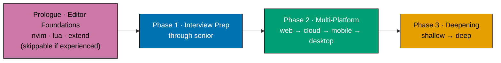

# Syllabus Overview — Fundamentally Strong SE, Interview-First Resequence

This `syllabus/` folder is the **per-topic detail layer** for the resequenced section. It mirrors the
sibling plan's `syllabus/` shape
([`fundamentally-strong-software-engineer/syllabus/`](../../../in-progress/fundamentally-strong-software-engineer/syllabus/overview.md))
but reorders everything into the **new canonical arc** and adds the fourteen NEW modules plus the
three NEW/re-anchored capstones this plan authors.

**Source of truth for this folder**: the **frozen** [tech-docs §Canonical Mapping Table](../tech-docs.md#canonical-mapping-table)
(108 topics + capstones — slug, phase, index `N`, short summary, language, format, rationale) is the
authoritative order/weight/summary/language source. The [prd.md](../prd.md) holds the arc as product
spec (personas, user stories, Gherkin, NEW-module scope). This folder never restates weights as fact;
it adds the dimension the mapping table cannot hold: per topic, the concrete **Concepts** (`co-NN`),
the named **Worked examples** (`ex-NN`), and the **Capstone spec**.

> **Authoring status note**: this plan is in `backlog/`; the fourteen NEW modules are **not yet
> authored**. Version-sensitive claims in each file's **Accuracy notes** are marked
> `[Needs Verification]` — the pre-authoring `web-researcher` sweep (DD-28 convention, inherited from
> the sibling plan) resolves them **before** a maker authors the page. Do not treat any version
> string here as `[Verified]` until that sweep runs.

## The new canonical arc

The five-pass "immediately-effective" spiral of the sibling section is **retired and rewritten** into
a prologue-plus-three-phase arc organized around **how a working engineer actually consumes the
material** — get interview-ready first, become productive across the platforms the market demands,
then deepen the whole field progressively.



- **Prologue · Editor Foundations (topics 1–3)** — kept canonically first, but **explicitly skippable
  for the experienced**. Just Enough Nvim → Just Enough Lua → Extending Neovim, cemented by the
  `capstone-forge-ready` milestone. See [Skip / fast-path affordances](#skip--fast-path-affordances).
- **Phase 1 · Interview Preparation, through senior (topics 4–16)** — designed to **stand alone and
  deliver fast value to the experienced re-entrant**. Curates the interview-facing fundamentals to the
  front (language on-ramp, DS&A, advanced algorithms, OOP, OO design & patterns, SQL, technical
  communication) AND authors the four NEW interview-technique modules in a **refresh register**
  (coding-interview, take-home-and-live-coding, system-design-interview,
  behavioral-and-leadership-interviews). "Through senior" is central: coding, DS&A, the senior/staff
  system-design _interview format_, and behavioral/leadership rounds including the **layoff / gap
  narrative** — NOT relocating genuine systems/internals depth upward (that stays in Phase 3).
- **Phase 2 · Multi-Platform Productivity (topics 17–39)** — **strict market-demand linear**, no
  branching: **web → cloud/backend-at-scale → mobile → desktop**. Two NEW productivity modules land
  here: `async-python-and-fastapi-services` (web/backend) and a light `self-hosting-essentials`
  on-ramp (early in the cloud sub-phase, strictly below the heavier containers/cloud-IaC topics, and
  distinct from the full-depth Proxmox topic that stays in Phase 3).
- **Phase 3 · Deepening (topics 40–108)** — everything else, ordered shallow → deep, and home to the
  marquee **harness-engineering cluster** (build-your-own agentic coding tool: the agent loop, tools +
  MCP, context/memory, permissions/sandboxing, orchestration/observability) capped by the
  `capstone-build-your-own-coding-agent` flagship, plus `browser-automation-with-cdp`, the
  `just-enough-cpp` systems-language on-ramp, the hands-on
  `detection-engineering-and-siem-operations` module, and the
  `capstone-build-your-own-pentest-engine` security flagship.

## Skip / fast-path affordances

The **primary persona is an experienced software engineer re-entering the job market** — recently laid
off, returning from a gap/sabbatical, or a senior switching roles. Every decision optimizes for this
person's "immediately useful." A from-scratch learner is a secondary persona the canonical order still
serves. Three affordances make the arc non-linear for the experienced:

- **Skip the prologue.** Editor Foundations (1–3) is canonically first but marked **skippable** — an
  experienced reader who already has an editor can jump straight to Phase 1. The prologue is a
  self-contained on-ramp, not a hard prerequisite for the interview phase.
- **Start at Phase 1.** Phase 1 (Interview Preparation) is authored to **stand alone**: it opens with a
  language/tooling on-ramp (Python + Bash + Git) and delivers interview value without the reader having
  walked Phase 2 or 3 first.
- **Refresh register, not first-learn.** The NEW interview modules are written to **re-ground a
  working engineer fast** (mid/senior/staff level), not to teach the concept from zero — they reference
  the depth topics forward rather than reproducing them.
- **Skip any primer or topic you already own ("if you already know X, jump to Y").** The
  `just-enough-<lang>` primers (Python 4, TypeScript 17, Kotlin 30, Swift 32, Dart 34, C# 36, Go 45,
  Elixir 47, C 75, C++ 76, Rust 80, Java 82, F# 85) are self-contained on-ramps — an experienced reader
  already fluent in a language skips straight to its subject topic (e.g. already fluent in TypeScript?
  skip N=17 and start at `frontend-essentials` N=18). The same holds per phase: an engineer already
  productive on the web can skim Phase 2's web sub-phase and enter at the cloud/backend-at-scale
  sub-phase; a reader who only wants job-readiness can stop after Phase 1 and treat Phase 3 as
  return-for-depth-later material.
- **Phase-boundary bridges soften the two sharp transitions.** Where the _kind_ of thinking jumps
  (Phase 2 productivity → Phase 3 CS theory at N=40; and, inside Phase 3, high-level AI harness work →
  manual-memory C at N=75) the later phase's narrative opens with a short bridge paragraph naming the
  altitude change and reassuring that each systems/theory on-ramp is self-contained. See
  [tech-docs §Smoothness Verification](../tech-docs.md#smoothness-verification-experienced-swe-progression-audit).

## Principle-transfer productivity note (proof-of-transfer, NOT repo tutorials)

The section teaches **durable principles**. It is _measured_ against a graduate being able to
contribute to seven real target codebases — but those codebases are **evidence the principles
transfer**, never subject matter, and this syllabus contains **no repo-specific tutorial content** for
any of them:

- **`ose-public` / `ose-primer` / `ose-infra`** (the ose workspace family) — Nx monorepo, F#/Giraffe
  backends, polyglot governance harness. Proof that the engineering-practice, build-automation,
  typed-FP, and platform topics transfer.
- **`remotebrowser`** — async-Python / FastAPI browser-fleet orchestration over CDP + MCP. Proof that
  `async-python-and-fastapi-services` (N=20), `browser-automation-with-cdp` (N=69), and the harness
  cluster (N=70–74) transfer.
- **`wazuh/wazuh`** — C++ manager/agent core with an XML detection ruleset. Proof that
  `just-enough-cpp` (N=76) and `detection-engineering-and-siem-operations` (N=95) transfer. (Web-verified.)
- **`vacti` and `vacti-pentest-engine`** — a TypeScript/Nx product and its agentic pentest engine.
  Proof that the security suite (N=91–97) and `capstone-build-your-own-pentest-engine` transfer.
  (Maintainer-supplied; not publicly discoverable on 2026-07-18 — treated as unverified.)

See [tech-docs §Productive in Target Codebases](../tech-docs.md#productive-in-target-codebases-proof-of-transfer-outcome-anchor).
No topic or capstone names any of these repos as its subject; they appear only as illustrative
proof-of-transfer targets.

## How to read a topic file

Order, slug, format, and language come from the [frozen mapping table](../tech-docs.md#canonical-mapping-table).
Each `NN-<slug>.md` carries these sections in order:

1. **Header** — title, mapping-row echo (phase, format, language, weights), scope note.
2. **Why this exists · the big idea** — the problem before the solution, the one keep-forever mental
   model, and the cross-cutting big ideas the topic advances.
3. **Prerequisites** — prior topics, tools & environment, assumed knowledge.
4. **Accuracy notes** — dated `web-researcher` findings folded in before authoring; version-sensitive
   items flagged `[Needs Verification]` until the pre-authoring sweep runs.
5. **Concepts** — the numbered `co-NN` enumeration of every concept the topic teaches, each mapping 1:1
   to one delivery.md checkbox. Count is a **floor, not a cap**.
6. **Tensions & trade-offs + Lineage** — judgment topics only; omitted for primers and pure how-to
   modules where they would be padding.
7. **Worked examples** — the numbered `ex-NN` enumeration grouped Beginner / Intermediate / Advanced (By
   Example / Primer) or per-theme clusters (Annotated-concept / no-code). Each example cites the
   `co-NN` it demonstrates. This list is a **representative starting set, not the full authored set** —
   see "Coverage is a floor, not a cap" below; a syllabus file whose `ex-NN` count sits below its
   volume-target band carries an inline note naming the delta the maker adds at authoring time.
8. **Capstone spec** — the topic's intra-topic capstone (and, in the six capstone files, the full
   inter-topic capstone spec).
9. **Navigation footer** — explicit ← Previous / Next → links in reading order.

## Legend (language / format markers)

- **Primer** — a _Just Enough_ language on-ramp (fluency, not judgment).
- **By Example** — worked-code subject topic (Beginner / Intermediate / Advanced example bands).
- **Annotated-concept** — concept-centric topic; code where it fits, prose + WCAG-accessible Mermaid
  diagrams where it does not.
- **— (concept, no code)** — leadership / governance / format topics: prose, worked scenarios,
  artifacts, no runnable code.
- **Language marker** — the topic's primary language from the mapping table (Python unless the platform
  or subject mandates otherwise: SQL, Kotlin, Swift, Dart, C#, Go, Elixir, C, C++, Rust, Java, F#,
  TypeScript, XML/rules, HCL/YAML, etc.).

## Cross-cutting authoring guarantees

- **Coverage is a floor, not a cap** — the `co-NN` / `ex-NN` counts a syllabus file lists are the
  minimum surface a topic must reach at authoring time, not the full authored set; a maker may add
  more, never fewer, and must reach the per-format volume-target band in
  [prd.md §Volume-target bands](../prd.md#volume-target-bands-inherited-from-sibling-dd-34-floor-not-cap-dd-8)
  regardless of how many `ex-NN` entries the syllabus file itself enumerates.
- **Raw-form-first tooling** — every topic assumes the reader edits in Neovim and drives
  build/run/test/debug/git from the terminal on a macOS/Linux-compatible environment. IDE-mandatory
  app domains (iOS → Xcode, Android → Android Studio, Windows → Visual Studio) are called out in place.
- **Free-to-use-and-teachable-first materials** — every language, tool, database, and standard named is
  free to obtain and legal to author training material on.
- **CVE-free dependencies** — every dependency an example installs is standard-library-first, pinned to
  an exact CVE-clean version, verified before authoring.
- **Follow-along completeness** — every worked example and capstone is followable step-by-step with no
  hidden assumptions: prerequisites + pinned versions + install/run commands up front, expected output
  shown inline.
- **Principle-first, not tutorial-first** — each topic teaches a durable principle; named tools and
  repos are illustrations, never the subject.

## Capstone policy

Every subject topic ships an **intra-topic capstone** (subject → full runnable; primer → light
consolidation; leadership → design/decision artifact). This plan additionally authors or re-anchors
**six inter-topic capstones**, each a self-contained milestone bundle at a phase boundary. Capstone
weight sits between its two neighbouring topic folder weights, computed `105 + 10 × N` where `N` is the
anchor topic (so a capstone sorts immediately after the topic that anchors it).

**Capstone file-naming convention (this folder)**: capstones are given their own `NNc-<slug>.md` files,
where `NN` is the zero-padded **anchor topic index** and the `c` suffix marks the file as a capstone —
so `03c-capstone-forge-ready.md` sorts immediately after `03-extending-neovim.md`. This differs from
the sibling plan (which embeds capstone specs inside their anchor topic files); this plan gives each of
the six a standalone file for a narrower diff and clearer review.

| Capstone slug                            | Kind                 | Anchor (after N) | Weight | File                                                                                             |
| ---------------------------------------- | -------------------- | ---------------- | ------ | ------------------------------------------------------------------------------------------------ |
| `capstone-forge-ready`                   | Prologue boundary    | N=3              | 135    | [03c-capstone-forge-ready.md](./03c-capstone-forge-ready.md)                                     |
| `capstone-interview-loop`                | Phase 1 boundary     | N=16             | 265    | [16c-capstone-interview-loop.md](./16c-capstone-interview-loop.md)                               |
| `capstone-first-working-software`        | Phase 2 web boundary | N=23             | 335    | [23c-capstone-first-working-software.md](./23c-capstone-first-working-software.md)               |
| `capstone-full-stack-app`                | Phase 2 boundary     | N=39             | 495    | [39c-capstone-full-stack-app.md](./39c-capstone-full-stack-app.md)                               |
| `capstone-build-your-own-coding-agent`   | Phase 3 (harness)    | N=74             | 845    | [74c-capstone-build-your-own-coding-agent.md](./74c-capstone-build-your-own-coding-agent.md)     |
| `capstone-build-your-own-pentest-engine` | Phase 3 (security)   | N=97             | 1075   | [97c-capstone-build-your-own-pentest-engine.md](./97c-capstone-build-your-own-pentest-engine.md) |

Every capstone spec states (a) goal/outcome, (b) a concepts-exercised checklist, (c) an ordered step
outline (each step naming a file + the code + the verify command), (d) testable acceptance criteria,
and (e) the done bar = **"runnable end-to-end + web-verified"** (or "produces the stated artifact +
web-verified" for no-code capstones).

## Per-topic file template

```markdown
# NN · <Title> (<Format>, <Language>)

**Mapping row** (frozen [tech-docs §Canonical Mapping Table](../tech-docs.md#canonical-mapping-table)):
N=<n> · <Phase / sub-phase> · <Format> · <Language> · folder weight <w> / learn <100+n> / drill <200+n>.

**Scope note**: <what this topic covers; what it defers to a later/deeper topic>.

## Why this exists · the big idea

- **The problem before the solution**: <the pain this topic answers>.
- **Keep-this-if-you-forget-everything**: <the one core mental model>.
- **Big ideas touched**: <spine tags>.

## Prerequisites

- **Prior topics**: <linked earlier topics this builds on, or "none — entry point">.
- **Tools & environment**: <pinned toolchain + OS/platform assumption>.
- **Assumed knowledge**: <concepts the reader must already be comfortable with>.

## Accuracy notes

- <YYYY-MM-DD> — <finding, flagged [Needs Verification] until the pre-authoring sweep runs>.

## Concepts

1. **co-01 · <slug>** — <one-line claim>.
   … (contiguous; floor ≥ 10 for subject/By Example/Annotated-concept, ≥ 8 for leadership)

## Tensions & trade-offs — when NOT to reach for this <!-- judgment topics only -->

## Lineage — why it beat the alternative <!-- judgment topics only -->

## Worked examples

### Beginner (ex 01–NN) <!-- or a per-theme cluster heading for Annotated-concept / no-code -->

1. **ex-01 · <slug>** — <one-line spec> — verify <observable>. (co-NN)
   … (contiguous)

## Capstone spec — intra-topic (<kind>)

- **Goal**: …
- **Concepts exercised**: [ ] … [ ] …
- **Ordered steps**: 1. `<file>` — <code> — verify `<command>` …
- **Acceptance criteria**: …
- **Done bar**: runnable end-to-end + web-verified.

---

← Previous: [<prev>](./<prev>.md) · Next: [<next>](./<next>.md) →
```

## Scope of this folder (current task)

This folder currently authors the **20 full-detail files** the resequence introduces: the fourteen NEW
modules and the six inter-topic capstones. The remaining **94 existing topics** keep their subject
content from the sibling plan and receive lightweight pointer files in a **later task** — they are
indexed here by [README.md](./README.md) but not yet detailed in this folder.

---

Next: [README.md — per-phase topic index](./README.md) →
