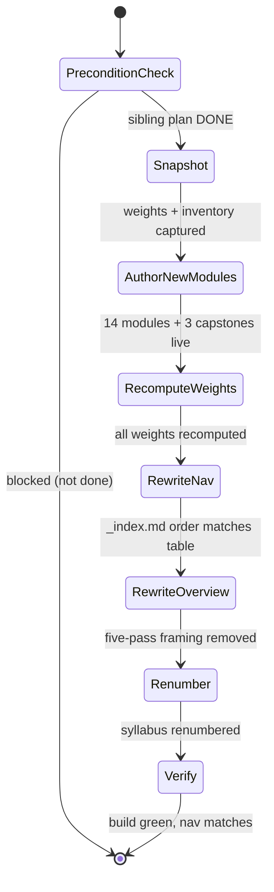

# Technical Docs — Fundamentally Strong SE Interview-First Resequence

## Overview

This is a **content-only** resequence of an existing Hugo content section, plus a set of NEW modules.
No application/component code changes. The technical work is: (1) recompute frontmatter `weight`
values for every topic and capstone; (2) rewrite the two framing files (`overview.md`, `_index.md`);
(3) author **fourteen NEW modules** (four interview-technique + `async-python-and-fastapi-services` +
`self-hosting-essentials` + `browser-automation-with-cdp` + a five-module harness-engineering cluster

- `just-enough-cpp` + `detection-engineering-and-siem-operations`) and **three NEW capstones**
  (`capstone-interview-loop`, `capstone-build-your-own-coding-agent`,
  `capstone-build-your-own-pentest-engine`); (4) renumber the plan-side syllabus. The **Canonical
  Mapping Table** below is the single source of truth for the new order, weights, per-topic summary, and
  language.

**UI-design-funnel exemption**: this plan changes no user-facing screens or components under `apps/`
or `libs/` — it edits markdown content and frontmatter only. The UI-design-funnel requirement does
not apply. **Specs/Gherkin exemption**: content/docs under `apps/ayokoding-www/content/` is exempt
from `specs:coverage`; the Gherkin-style acceptance criteria live in [prd.md](./prd.md), not in
`specs/`.

## How Ordering Works in This Section (ground truth)

Topic folders are **slug-only** (NOT numeric-prefixed) [Repo-grounded — every folder under the
section is a bare slug, e.g. `just-enough-nvim/`, `computer-architecture/`]. Ordering is carried by
three coordinated surfaces, all of which this plan rewrites:

1. **Hugo `weight` frontmatter** on each topic's `_index.md` (folder weight), its `learning/_index.md`
   (learn weight), and its `drilling/_index.md` (drill weight).
2. **The hand-maintained `_index.md` nav list** ("N · Title" link text, in order).
3. **The `overview.md` narrative** (phase arc + diagrams).

Because ordering is data (weights) + hand-maintained lists, **re-sequencing existing topics requires
NO folder renames** — only weight/nav/overview edits. The fourteen NEW modules DO get new slug folders.

### Weight scheme (preserved from the sibling plan) [Repo-grounded]

Verified against the live tree:

- Topic **folder** `_index.md` weight = `100 + 10 × N`, where `N` is the topic's 1-based order index
  (topic 1 `just-enough-nvim` = `110`; topic 20 = `300`).
- Topic **learning** `learning/_index.md` weight = `100 + N` (topic 1 = `101`).
- Topic **drilling** `drilling/_index.md` weight = `200 + N` (topic 1 = `201`).
- **Capstone** folder weight sits between its two neighbouring topic folder weights (e.g. Forge-Ready
  = `135`, between topic 3 = `130` and topic 4 = `140`) [Repo-grounded — `capstone-forge-ready`
  weight `135`, `capstone-first-working-software` weight `275`, `capstone-full-stack-app` weight
  `276` at authoring time; recomputed here].

The resequence recomputes each value from the topic's **new** index N using the same formulas. With
the fourteen NEW modules the section grows to **108 topics**, so folder weights run `110 … 1180`.

**Weight-scope note**: learn (`100+N`) and drill (`200+N`) weights are scoped **per topic folder**
(they order the `learning/` and `drilling/` siblings inside one topic), so global uniqueness across
folders is NOT required. At 108 topics the learn range (`101…208`) numerically overlaps the drill
range (`201…308`); this is harmless because within every topic folder `learn(100+N) < drill(200+N)`,
so learning always precedes drilling. Do not treat the overlap as a defect.

## Content-Tree Layout & Frontmatter Parity

Parity with the sibling plan's content-tree layout — every topic in this section (existing and NEW) is
a **topic-first page bundle**: one slug folder owning both its `learning/` and `drilling/` subtrees.
[Repo-grounded — verified against the live `data-structures-and-algorithms-essentials/` bundle
2026-07-18]

```text
apps/ayokoding-www/content/en/learn/fundamentally-strong/software-engineer/   # <SECTION>
├── _index.md                     # section landing (nav list — Phase 16 rewrite)
├── overview.md                   # section narrative + arc + fast-path (Phase 17 rewrite)
├── <topic-slug>/                 # one folder per canonical topic (slug-only, NO numeric prefix)
│   ├── _index.md                 # topic nav; weight = 100 + 10 × N (folder weight)
│   ├── overview.md               # what/why + primary language + prerequisites (weight 1)
│   ├── learning/
│   │   ├── _index.md             # weight = 100 + N (learn weight)
│   │   ├── overview.md
│   │   ├── <example pages>       # by-example: beginner/intermediate/advanced; annotated-concept: themes
│   │   ├── capstone/             # intra-topic capstone
│   │   └── code/                 # colocated runnable sources (excluded from Nx gates)
│   └── drilling/
│       ├── _index.md             # weight = 200 + N (drill weight)
│       ├── overview.md
│       └── <topic-slug>.md       # four-section drill page
└── <capstone-slug>/              # inter-topic capstone bundle
    ├── _index.md                 # weight in the ×10 gap at its phase boundary
    ├── overview.md
    └── code/                     # colocated runnable capstone sources
```

Frontmatter is unchanged from the sibling's convention — `title` (the "N · Title" human title),
`weight` (per the formulas above), `date`, `draft: false`, `description`. The resequence rewrites only
the **`weight`** value and the **`title` numeric prefix**; it never renames a folder (RD-2).

## Hugo Ordering Mechanics (nav + overview fast-path)

Three coordinated surfaces carry order; the resequence rewrites all three but by different mechanisms:

1. **Weight frontmatter (data)** — recomputed mechanically in Phase 15 from each topic's NEW index N
   (`100+10N` folder / `100+N` learn / `200+N` drill). Capstone folder weights sit in the ×10 gap
   between their two neighbouring topic folder weights (see [Capstones](#capstones)). This is the
   authoritative sort key Hugo renders by.
2. **`_index.md` nav list (hand-maintained)** — rewritten row-for-row against the mapping table in
   Phase 16; the five-pass framing labels are replaced with the Prologue + three-phase arc labels;
   every linked slug must resolve (link-checker gate).
3. **`overview.md` narrative (hand-maintained)** — rewritten in Phase 17 around the new arc, and
   additionally carrying the two NEW affordances specific to this resequence:
   - the **"experienced & job-hunting? start here" fast-path** — a callout naming the editor prologue
     (N=1–3) as canonical-first but **skippable**, routing the primary persona (experienced
     re-entrant, RD-8) straight into Phase 1 Interview Preparation;
   - the **interview-loop-map** — a 2026 senior loop orientation (recruiter screen → coding → system
     design → behavioral/leadership → hiring-manager/team-fit), also surfaced at the `coding-interview`
     intro.

Because order is data + hand-maintained lists, re-sequencing existing topics needs **no folder
renames** (RD-2) — only weight/nav/overview edits. Only the fourteen NEW modules and three NEW
capstones create net-new folders.

## Content-Model & Architecture Parity

This plan is a **thin content-model overlay** on the sibling plan's already-authored prose:

- **Existing 94 topics** — their `learning/` + `drilling/` prose, examples, capstones, and syllabus
  bodies are authored by the **sibling** plan
  (`plans/in-progress/fundamentally-strong-software-engineer/`), which remains the **single source of
  truth** for that content. This plan touches those 94 topics only **mechanically**: it edits their
  `_index.md` / `learning/_index.md` / `drilling/_index.md` **`weight`** and the `_index.md` **title
  numeric prefix** (Phase 15). No existing topic's body prose is rewritten.
- **Fourteen NEW modules + three NEW capstones** — the only net-new authored content (Phases 1–14),
  each a full topic (or capstone) page bundle authored to the ayokoding maker/checker bar, matching the
  sibling's per-topic anatomy.
- **Renumber-in-place via weight (RD-2 / RD-3)** — the resequence is expressed entirely as weight
  recompute + nav/overview rewrite; folder slugs are stable, so external links and page bundles never
  break.
- **Syllabus routing (DN-6)** — the plan-side syllabus renumber (Phase 18) defaults to **Option A**:
  edit the sibling plan's `syllabus/NN-<slug>.md` files + `syllabus/README.md` + `prd.md` topic table
  to the new 108-topic order (adding rows for the fourteen NEW modules). This plan carries no
  independent `syllabus/` folder under Option A; Options B/C reroute per DN-6. [Repo-grounded — sibling
  `syllabus/` holds `NN-<slug>.md` files today]

This keeps the resequence's authored surface small (17 net-new bundles) while the 94 existing topics
are re-ordered purely by data.

## Smoothness Architecture (prereq-chaining + monotonic difficulty)

Reading-order smoothness is **encoded, not narrated** — it falls out of the mapping table's ordering
signals rather than a separate rubric:

- **Prereq-chaining** — every `just-enough-<lang>` primer precedes that language's first use (e.g.
  `just-enough-python` N=4 before DS&A N=7; `just-enough-c` N=75 before `just-enough-cpp` N=76 before
  `system-programming` N=79), and each NEW module names its assumed prior topics in the mapping-table
  Rationale cell (e.g. `just-enough-cpp` prereq `just-enough-c`; `detection-engineering-and-siem-operations`
  prereq `defensive-security`; the pentest-engine capstone prereqs the harness cluster 70–74 +
  `browser-automation-with-cdp` 69 + security suite 91–97). The harness cluster (70–74) is deliberately
  placed **after** the AI cluster (66–68) so its prereqs precede it (RD-10).
- **Monotonic difficulty** — the strictly-increasing folder weight (`110 … 1180`) is the difficulty
  gradient: Prologue (editor) → Phase 1 (interview technique, refresh register) → Phase 2
  (multi-platform productivity, market-demand linear, RD-6) → Phase 3 (deepening, shallow → deep).
  Difficulty for the three Addition-4 gap-closers is recorded inline in their Rationale cells
  ("Difficulty: intermediate").

Both signals live in the frozen [Canonical Mapping Table](#canonical-mapping-table); this note
references them rather than restating per-row values. That the chain holds is verified by the Phase 15
integrity-invariant check and the Phase 16/19 nav-order assertion.

### Smoothness Verification (experienced-SWE progression audit)

A one-pass smoothness audit of the **frozen** N=1..108 order for the primary persona — an experienced
engineer re-entering the job market. **The order is frozen (RD-2/RD-3): findings below are documented
as risks with soften/bridge remediations, NOT reorderings.** The remediations are authored into the
NEW modules' `overview.md` / `Prerequisites` sections (Phases 1–14) and the section framing (Phases
16–17), and are re-verified by the Phase 19 smoothness-review step.

**Prereq-chaining verdict — near-clean, two documented language-primer forward-references.** Walking
the order confirms every module's _listed_ prereqs (mapping-table Rationale cells + the Smoothness
Architecture note above) point **backward**: `just-enough-python` (4) precedes DS&A (7); every
platform primer precedes its first use (TS 17→18, Kotlin 30→31, Swift 32→33, Dart 34→35, C# 36→37,
Go 45→46, Elixir 47→48, Java 82→83, F# 85→86/87); `just-enough-c` (75) precedes `just-enough-cpp`
(76) precedes `system-programming` (79); `detection-engineering-and-siem-operations` (95) follows
`defensive-security` (94); the harness cluster (70–74) follows the AI cluster (66–68) and
`browser-automation-with-cdp` (69); and the two flagship capstones follow all their prereqs
(coding-agent after 74; pentest-engine after 69 + 70–74 + 91–97). **Two language-primer
forward-references** survive from the inherited order — the _language_ is used By-Example before its
dedicated `just-enough-<lang>` primer, an implicit (not table-listed) forward assumption:

| ID   | Where (frozen N)                                 | Forward-reference                                                                | Severity (primary persona)                                | Remediation (order stays frozen)                                                                                                                                                                                                                                     |
| ---- | ------------------------------------------------ | -------------------------------------------------------------------------------- | --------------------------------------------------------- | -------------------------------------------------------------------------------------------------------------------------------------------------------------------------------------------------------------------------------------------------------------------- |
| SF-1 | N=41 `computer-architecture` (Language: C)       | Uses C before the C primer `just-enough-c` at N=75                               | Low for the experienced re-entrant; real for from-scratch | Soften assumed-knowledge to "reading-level familiarity with C syntax" and add a one-line bridge in `computer-architecture/overview.md`: the module uses only basic, annotated C to expose hardware; the full C on-ramp is `just-enough-c` (N=75, Phase 3 low-level). |
| SF-2 | N=39 `building-production-cli-tools` (Go + Rust) | Uses Go before `just-enough-go` (N=45) and Rust before `just-enough-rust` (N=80) | Low for the experienced re-entrant; real for from-scratch | Soften assumed-knowledge to "familiarity with one compiled language" and add a bridge in `building-production-cli-tools/overview.md`: it teaches CLI-delivery _principles_ with Go/Rust as vehicles, using only the surface needed; the full on-ramps are N=45/N=80. |

Two further in-context language uses are **not** findings — they are self-teaching depth topics with
no dedicated primer by design: `lisp` (84, Scheme/Clojure) and `type-systems` (86, OCaml/Haskell
alongside the F# primer at 85). SQL (13), Cypher (54), and PowerShell (78) likewise teach their
surface in-module. These are acceptable and require no bridge.

**Monotonic-ish difficulty ramp — confirmed non-decreasing; two conceptual phase-boundary cliffs.**
The difficulty gradient is folder weight `100 + 10N`, which is **strictly increasing** with N by
construction — so the numeric ramp is monotonic with **no numeric cliffs** (every step is exactly
+10). The audit instead flags two _conceptual_ difficulty cliffs at phase boundaries where the _kind_
of thinking jumps sharply; each gets a phase-boundary **bridge** paragraph (authored in the later
phase's narrative, Phase 16 `_index.md` label + Phase 17 `overview.md`):

| ID  | Boundary (frozen N)                                                                            | Cliff                                                                                             | Prescribed bridge (in the later phase's narrative)                                                                                                                                                                                                                                                           |
| --- | ---------------------------------------------------------------------------------------------- | ------------------------------------------------------------------------------------------------- | ------------------------------------------------------------------------------------------------------------------------------------------------------------------------------------------------------------------------------------------------------------------------------------------------------------ |
| C-1 | Phase 2 → Phase 3 (N=39 `building-production-cli-tools` → N=40 `computer-science-foundations`) | Shipping practical multi-platform CLIs → abstract CS theory (automata, computability, complexity) | A connective paragraph at the head of the Phase 3 narrative: name the altitude change (doing → understanding-why), state that Phase 3 deepens the whole field for durability, and tell the job-hunting persona this phase is skimmable-for-depth-later — return once interview + productivity goals are met. |
| C-2 | Within Phase 3: N=74 `capstone-build-your-own-coding-agent` → N=75 `just-enough-c`             | High-level Python/AI harness engineering → manual-memory C systems programming                    | A connective paragraph at the head of the Phase 3 low-level-systems sub-cluster: name the language + altitude shift (managed Python → manual-memory C), and reassure that the systems primers (C 75, C++ 76, Rust 80) are self-contained on-ramps that do not assume prior systems experience.               |

The Prologue → Phase 1 and Phase 1 → Phase 2 boundaries are **soft** (Phase 1 opens on a language
on-ramp; Phase 2 opens on the `just-enough-typescript` primer) and need no bridge. The harness cluster
(70–74) is a within-Phase-3 difficulty rise but is **already bridged** by its prereq placement (AI
cluster 66–68 + `browser-automation-with-cdp` 69 immediately precede it, RD-10).

**Skip / fast-path affordances — live.** The experienced re-entrant's non-linear entry is served by
the fast-path callout (`overview.md`, Phase 17), the skippable-prologue marking, the stand-alone Phase
1, and the primer-skip guidance in [syllabus/overview.md §Skip / fast-path affordances](./syllabus/overview.md#skip--fast-path-affordances).
The interview modules' **refresh register** (a HARD authoring constraint, [prd.md](./prd.md#new-interview-technique-modules-authored-by-this-plan))
guarantees they re-ground rather than first-teach.

## Resequence Process (state view)



## Design Decisions

- **RD-1 · Retire, do not layer.** The five-pass spiral framing is deleted from `overview.md` and
  `_index.md` and replaced with the three-phase-plus-prologue arc. Rationale: the maintainer's read
  of consumption differs from the spiral's authoring cadence; a half-retired framing would confuse.
- **RD-2 · No folder renames.** Ordering is weight/nav/overview data, so existing topics keep their
  slugs. Rationale: zero-churn, zero broken external links, minimal diff surface.
- **RD-3 · Preserve the exact weight formulas.** Recompute from new N with the same `100+10N` /
  `100+N` / `200+N` formulas. Rationale: consistency with the section's scheme; mechanical, auditable.
- **RD-4 · Interview technique is NEW content, interview fundamentals are curated.** The four NEW
  interview modules teach technique the spiral never had; existing fundamentals are only reordered,
  never rewritten. Rationale: separates "technique" (Phase 1) from "subject depth" (Phase 3) cleanly.
- **RD-5 · System Design split by module, not by folder.** The NEW `system-design-interview` module
  (Phase 1) teaches the interview format; the existing depth topic `system-design` (Phase 3) stays
  intact and is referenced forward. Same pattern for Software Architecture. Rationale: a single folder
  can't be in two phases.
- **RD-6 · Strict linear Phase 2.** The ◆ pick-your-path branching is retired for one opinionated
  market-demand order (web → cloud/backend-at-scale → mobile → desktop). Rationale: matches hiring
  demand; gives switchers a single confident answer.
- **RD-7 · Judgment-call placements flagged.** Topics that are both interview-material and
  standalone-depth (Software Testing, Security Essentials, Project Management, Debugging & Profiling,
  Technical Communication) are placed by recommendation and surfaced in README `## Decisions Needed`.
  Rationale: genuinely debatable; the maintainer is the tiebreaker.
- **RD-8 · Primary persona = experienced re-entrant; prologue canonical-but-skippable.** The
  north-star is "immediately useful" for an experienced engineer re-entering the job market. The
  editor prologue stays canonically first but `overview.md` carries an explicit
  **"experienced & job-hunting? start here" fast-path** into Phase 1. The four interview modules are
  authored in a **refresh register**; the behavioral module covers the **layoff/employment-gap
  narrative**; "through senior" is central. An **interview-loop-map** (2026 senior loop) lives at the
  overview fast-path + the `coding-interview` intro. Rationale: serve the re-entrant on the first
  sitting.
- **RD-9 · Proof-of-transfer outcome-anchor (principles, not repo-specifics).** The curriculum teaches
  durable **principles**; the seven target codebases (`ose-public`/`ose-primer`/`ose-infra`,
  `remotebrowser`, and three security codebases `wazuh/wazuh`, `anggipradana/vacti`,
  `anggipradana/vacti-pentest-engine`) are **evidence the principles transfer** — proof that a
  principle-strong graduate can contribute — NOT the subject matter. No module is "about" a target
  repo; a repo's specific libraries are fast on-the-job pickups. The
  [Productive in Target Codebases](#productive-in-target-codebases-proof-of-transfer-outcome-anchor)
  mapping is shaped as principle → principle-module → (repo tooling as quick pickup). Rationale: the
  parent thesis is "fundamentally strong → contribute to anything, especially in the age of AI"; the
  repos keep the principle set honest and market-relevant without becoming repo tutorials.
- **RD-10 · Harness-engineering cluster as a marquee build-your-own track.** The maintainer wants to
  learn to build their own agentic coding tool. Addition 2 adds a five-module Phase 3 cluster plus a
  flagship capstone, placed after the AI cluster so prereqs precede it. The MCP built in
  `agent-tools-and-mcp` is the **same MCP** `remotebrowser` exposes — the capstone's bonus option
  drives remotebrowser over MCP. Rationale: harness engineering is the highest-leverage 2026 skill and
  the marquee payoff.
- **RD-11 · Harness-cluster implementation language = Python (default; DN-12).** The harness cluster,
  `browser-automation-with-cdp`, and `async-python-and-fastapi-services` all use **Python** — keeping
  the series' single-primary-language consistency (Python), matching `remotebrowser` (Python + `uv` +
  `fastmcp`), and enabling the synergy capstone. Rationale: maximum consistency and synergy;
  TypeScript is the DN-12 alternative for readers who want the Claude-Code/Node idiom.
- **RD-12 · Two altitudes of self-hosting, kept separate.** A NEW **light** self-hosting on-ramp
  (`self-hosting-essentials`, N=24) sits EARLY in Phase 2 (run one box/VM, self-host a service,
  reverse proxy, PaaS git-push deploy) — explicitly NOT a cluster, NOT Terraform/Packer/Ansible IaC,
  NOT Proxmox. The full-depth `bare-metal-virtualization` (Proxmox) topic stays in Phase 3 (N=98).
  These are two different altitudes and are never merged. Rationale: the light on-ramp is what
  contributing to `remotebrowser` (Docker/Podman self-hosting, Fly.io/Dokku) and running the
  `ose-infra` self-hosted-runner stack actually require; cluster/IaC depth belongs later. Whether this
  should instead reframe an existing essentials topic is DN-13.
- **RD-13 · Systems-language principle on-ramp `just-enough-cpp` (Addition 4).** A NEW `just-enough-cpp`
  (N=76) sits in the Phase 3 low-level cluster immediately after `just-enough-c` (N=75), teaching the
  **systems-language principle** (manual memory, RAII, zero-cost abstraction, templates/generics, the
  standard library) — consistent with the `just-enough-<lang>` on-ramp family. It is NOT a Wazuh
  tutorial; Wazuh's C++-heavy core is simply one place the principle shows up. Rationale: a dedicated
  principle on-ramp matches the family pattern and keeps `just-enough-c` a pure C ramp; folding C++
  into `just-enough-c` is the DN-14 alternative.
- **RD-14 · Detection-engineering PRINCIPLES module, distinct from concept-level defensive security
  (Addition 4).** The NEW `detection-engineering-and-siem-operations` (N=95) teaches the
  **detection-engineering principles** — decoders, correlation rules, log parsing/normalization,
  false-positive tuning, dashboards, alert triage — as a hands-on module placed immediately after the
  concept-level `defensive-security` (N=94). Wazuh's XML ruleset is used only as the concrete
  **worked-example** of those principles, never as the subject. Rationale: "detection & response as a
  concept" and "operate a SIEM / write detections" are two altitudes, never merged (mirrors RD-12).
- **RD-15 · Agentic-engine engineering PRINCIPLES capstone `capstone-build-your-own-pentest-engine`
  (Addition 4).** A NEW capstone anchors after the security suite (weight 1075), the security sibling
  of `capstone-build-your-own-coding-agent`. It teaches the **agentic-engine engineering principles** —
  agent orchestration + tool-chaining + evidence pipelines + deterministic-vs-AI verification + scope
  enforcement — by assembling them into a working engine. `vacti-pentest-engine` (and the concrete
  tools subfinder/httpx/naabu/nuclei/sqlmap) is the **illustration**, not the subject. Prereqs: the
  harness cluster (70–74) + `browser-automation-with-cdp` (69) + the security suite (91–97) +
  `detection-engineering-and-siem-operations` (95). Language: **TypeScript** default (matching the
  `vacti-pentest-engine` illustration), Python alternative (DN-16). Rationale: the convergence of the
  harness +
  browser + security tracks earns its own marquee build-your-own payoff.
- **RD-16 · Progression smoothness is a first-class, audited property (experienced-SWE).** The arc must
  read **smoothly** for the primary persona (an experienced engineer re-entering the market), and
  smoothness is enforced by **five durable levers**, not left to chance: **(1) prereq-chaining** —
  nothing assumes content taught later; every language primer precedes its first use, and documented
  forward-references (SF-1 `computer-architecture`→`just-enough-c`; SF-2 `building-production-cli-tools`
  →Go/Rust primers) are softened + bridged in place, never reordered. **(2) Monotonic-ish difficulty**
  — folder weight `100+10N` is strictly increasing (no numeric cliffs); the two conceptual phase-boundary
  cliffs (C-1 Phase 2→3; C-2 into the low-level cluster) each carry a **bridge** paragraph in the later
  phase's narrative. **(3) Skip / fast-path affordances** — the experienced re-entrant can skip the
  prologue, start at the stand-alone Phase 1, and skip any primer/topic they already own via explicit
  "if you already know X, jump to Y" guidance. **(4) Refresh-not-first-learn register** — interview and
  breadth modules re-ground a working engineer rather than teaching from zero. **(5) A standing
  smoothness-review gate** — a Phase 19 delivery step re-verifies all four of the above before archival,
  so smoothness cannot silently regress as content lands. Rationale: for a re-entrant on a deadline, a
  jagged or forward-referencing arc is the difference between "immediately useful" and "abandoned"; the
  levers make smoothness a checkable invariant, consistent with the frozen ordering (RD-2/RD-3). See the
  [Smoothness Verification](#smoothness-verification-experienced-swe-progression-audit) subsection for
  the concrete findings (SF-1/SF-2, C-1/C-2) this rule governs.

## Canonical Mapping Table

**Authoritative** table for the resequenced section after Additions 1–4 — **108 topics**. Every
existing topic + NEW module → new phase, new index (N), short summary, language(s), format, and a
one-line rationale. Rows authored by this plan are flagged **NEW** in the rationale (interview = the
four interview modules; A1 = Addition 1; A2 = Addition 2; A3 = Addition 3, the self-hosting on-ramp;
A4 = Addition 4, the security/C++ gap-closers). For the three Addition-4 gap-closer rows, the
Rationale cell also records **assumed prerequisites + difficulty** (a dedicated prereqs/difficulty
column is folded into Rationale rather than added workspace-wide — [Judgment call], see DN-17).
Weights follow the formulas — folder `100+10N`, learn `100+N`, drill `200+N`; capstones are listed
with explicit weights in the [Capstones](#capstones) subsection. All slugs verified against the live
content tree — existing slugs sourced from the sibling plan's canonical list, NEW slugs confirmed
absent [Repo-grounded — the three Addition-4 slugs `just-enough-cpp`,
`detection-engineering-and-siem-operations`, `capstone-build-your-own-pentest-engine` verified absent
2026-07-18]. Existing topics' **Language(s)** are copied from the sibling plan's canonical per-topic
language column (`plans/in-progress/fundamentally-strong-software-engineer/prd.md`) [Repo-grounded],
not invented.

### Prologue · Editor Foundations (kept first)

| N   | Slug               | Short summary                                   | Language(s)          | Format     | Rationale     |
| --- | ------------------ | ----------------------------------------------- | -------------------- | ---------- | ------------- |
| 1   | `just-enough-nvim` | Modal editing, motions, buffers, terminal text  | Neovim (ex-commands) | Primer     | Kept prologue |
| 2   | `just-enough-lua`  | Lua fundamentals as Neovim's scripting language | Lua                  | Primer     | Kept prologue |
| 3   | `extending-neovim` | Neovim config, plugins, LSP, keymaps in Lua     | Lua                  | By Example | Kept prologue |

### Phase 1 · Interview Preparation (through senior)

| N   | Slug                                        | Short summary                                     | Language(s)                         | Format            | Rationale                       |
| --- | ------------------------------------------- | ------------------------------------------------- | ----------------------------------- | ----------------- | ------------------------------- |
| 4   | `just-enough-python`                        | Python syntax, types, structures, idioms          | Python                              | Primer            | On-ramp [DN-1]                  |
| 5   | `just-enough-bash`                          | Shell scripting, pipes, redirection, composition  | Bash/shell                          | Primer            | On-ramp [DN-1]                  |
| 6   | `version-control-and-git`                   | Version control, branching, merging, history      | Git                                 | By Example        | On-ramp [DN-1]                  |
| 7   | `data-structures-and-algorithms-essentials` | Core data structures and algorithms, complexity   | Python                              | By Example        | Coding-interview foundation     |
| 8   | `advanced-algorithms`                       | Graphs, dynamic programming, advanced techniques  | Python                              | By Example        | Hard-interview material forward |
| 9   | `coding-interview`                          | Coding-interview patterns, strategy, narration    | Python (patterns language-agnostic) | By Example        | **NEW (interview)**             |
| 10  | `take-home-and-live-coding`                 | Take-home + live/pair-coding technique            | Python                              | By Example        | **NEW (interview)**             |
| 11  | `object-oriented-programming-essentials`    | Classes, inheritance, encapsulation, polymorphism | Python                              | By Example        | OO interview ground             |
| 12  | `object-oriented-design-and-patterns`       | SOLID, design patterns, refactoring toward them   | Python                              | By Example        | Design questions forward        |
| 13  | `sql-essentials`                            | Relational modeling, joins, querying with SQL     | SQL + Python (SQLite)               | By Example        | SQL rounds common               |
| 14  | `system-design-interview`                   | System-design interview format, rubric, drills    | — (concept, no code)                | Annotated-concept | **NEW (interview)**             |
| 15  | `technical-communication`                   | Clear docs, proposals, reviews, technical prose   | — (concept, no code)                | Annotated-concept | Behavioral comms [DN-3]         |
| 16  | `behavioral-and-leadership-interviews`      | STAR + senior rounds; layoff/gap narrative        | — (concept, no code)                | Annotated-concept | **NEW (interview)**             |

### Phase 2 · Multi-Platform Productivity (strict market-demand linear)

Web sub-phase:

| N   | Slug                                | Short summary                                        | Language(s)         | Format     | Rationale                                        |
| --- | ----------------------------------- | ---------------------------------------------------- | ------------------- | ---------- | ------------------------------------------------ |
| 17  | `just-enough-typescript`            | TypeScript types, tooling, idioms for typed JS       | TypeScript          | Primer     | Web on-ramp                                      |
| 18  | `frontend-essentials`               | Interactive web UIs with components and state        | TypeScript          | By Example | Web frontend                                     |
| 19  | `backend-essentials`                | HTTP backends with persistence, routing              | Python (PostgreSQL) | By Example | Web backend                                      |
| 20  | `async-python-and-fastapi-services` | Async Python, FastAPI, Pydantic, uv/ruff/pyright     | Python              | By Example | **NEW (A1)** — productivity; remotebrowser stack |
| 21  | `networking-essentials`             | TCP/IP, HTTP, DNS, sockets from first principles     | Python              | By Example | Web network layer                                |
| 22  | `api-design`                        | REST, versioning, contracts, pragmatic design        | Python              | By Example | Web API contracts                                |
| 23  | `advanced-frontend`                 | State management, performance, frontend architecture | TypeScript          | By Example | Web advanced frontend                            |

Cloud / backend-at-scale sub-phase:

| N   | Slug                                | Short summary                                                            | Language(s)                      | Format            | Rationale                                                                                              |
| --- | ----------------------------------- | ------------------------------------------------------------------------ | -------------------------------- | ----------------- | ------------------------------------------------------------------------------------------------------ |
| 24  | `self-hosting-essentials`           | Run one box/VM, self-host a service, reverse proxy, PaaS git-push deploy | — (ops/config, minimal app code) | By Example        | **NEW (A3)** — light self-hosting on-ramp; strictly below N=26/27; Proxmox depth stays at N=98 [DN-13] |
| 25  | `backend-at-scale`                  | Caching, sharding, queues, scaling backends                              | Python                           | By Example        | Cloud scaling                                                                                          |
| 26  | `containers-and-orchestration`      | Docker containers and Kubernetes orchestration                           | YAML/CLI                         | By Example        | Cloud deployment unit (heavier than N=24)                                                              |
| 27  | `cloud-and-iac`                     | Provisioning cloud infrastructure declaratively                          | HCL/YAML                         | Annotated-concept | Cloud provisioning (IaC — heavier than N=24)                                                           |
| 28  | `cicd-and-release-engineering`      | Pipelines, artifacts, deployment, release                                | YAML + Python                    | By Example        | Cloud release automation                                                                               |
| 29  | `build-automation-and-task-runners` | Build systems, task runners, build graphs                                | multi-tool                       | By Example        | Cloud build substrate (Nx)                                                                             |

Mobile sub-phase:

| N   | Slug                      | Short summary                                  | Language(s) | Format     | Rationale       |
| --- | ------------------------- | ---------------------------------------------- | ----------- | ---------- | --------------- |
| 30  | `just-enough-kotlin`      | Kotlin syntax, null safety, coroutines         | Kotlin      | Primer     | Android on-ramp |
| 31  | `android-app-development` | Native Android apps with Kotlin and the SDK    | Kotlin      | By Example | Mobile Android  |
| 32  | `just-enough-swift`       | Swift syntax, optionals, value-oriented idioms | Swift       | Primer     | iOS on-ramp     |
| 33  | `ios-app-development`     | Native iOS apps with Swift and the SDK         | Swift       | By Example | Mobile iOS      |
| 34  | `just-enough-dart`        | Dart syntax, async, idioms for Flutter         | Dart        | Primer     | Hybrid on-ramp  |
| 35  | `hybrid-app-development`  | Cross-platform apps from one Dart codebase     | Dart        | By Example | Mobile hybrid   |

Desktop sub-phase:

| N   | Slug                            | Short summary                                | Language(s) | Format     | Rationale            |
| --- | ------------------------------- | -------------------------------------------- | ----------- | ---------- | -------------------- |
| 36  | `just-enough-csharp`            | C# syntax, LINQ, async, .NET idioms          | C#          | Primer     | Windows on-ramp      |
| 37  | `windows-app-development`       | Native Windows desktop applications in C#    | C#          | By Example | Desktop Windows      |
| 38  | `linux-app-development`         | Native Linux desktop applications, packaging | Python      | By Example | Desktop Linux        |
| 39  | `building-production-cli-tools` | Robust, distributable CLI tools in Go/Rust   | Go + Rust   | By Example | Desktop CLI delivery |

### Phase 3 · Deepening (shallow → deep)

Theory foundations:

| N   | Slug                           | Short summary                                     | Language(s) | Format            | Rationale              |
| --- | ------------------------------ | ------------------------------------------------- | ----------- | ----------------- | ---------------------- |
| 40  | `computer-science-foundations` | Automata, computability, complexity, foundations  | Python      | Annotated-concept | Theory grounding first |
| 41  | `computer-architecture`        | CPU, memory, caches, instruction execution        | C           | By Example        | Hardware grounding     |
| 42  | `programming-paradigms`        | Imperative, functional, logic, declarative survey | Python      | By Example        | Paradigm survey        |
| 43  | `functional-programming`       | Pure functions, immutability, composition, HOFs   | Python      | By Example        | FP discipline          |

Concurrency:

| N   | Slug                          | Short summary                                         | Language(s) | Format     | Rationale               |
| --- | ----------------------------- | ----------------------------------------------------- | ----------- | ---------- | ----------------------- |
| 44  | `concurrency-and-parallelism` | Threads, async, locks, coordinating work              | Python      | By Example | Concurrency foundations |
| 45  | `just-enough-go`              | Go syntax, tooling, goroutines, idioms                | Go          | Primer     | CSP on-ramp             |
| 46  | `csp-style-concurrency`       | Channels, goroutines, CSP-style concurrency           | Go          | By Example | CSP model               |
| 47  | `just-enough-elixir`          | Elixir syntax, pattern matching, functional idioms    | Elixir      | Primer     | Actor on-ramp           |
| 48  | `actor-model-concurrency`     | Actors, supervision trees, fault-tolerant concurrency | Elixir      | By Example | Actor model             |

Data depth:

| N   | Slug                                     | Short summary                                   | Language(s)               | Format            | Rationale               |
| --- | ---------------------------------------- | ----------------------------------------------- | ------------------------- | ----------------- | ----------------------- |
| 49  | `advanced-networking`                    | Load balancing, proxies, TLS, performance       | Python                    | Annotated-concept | Networking depth        |
| 50  | `advanced-sql-and-query-performance`     | Query plans, indexing, tuning SQL               | SQL + Python (PostgreSQL) | By Example        | SQL depth               |
| 51  | `data-access-orms-and-query-builders`    | Using ORMs and query builders safely            | Python                    | By Example        | Data-access mediation   |
| 52  | `build-your-own-orm-and-query-builder`   | Implementing a small ORM and query builder      | Python                    | By Example        | Demystify the ORM       |
| 53  | `nosql-databases`                        | Document, key-value, column stores              | Python                    | By Example        | Non-relational models   |
| 54  | `graph-databases`                        | Modeling and querying connected data            | Cypher + Python           | By Example        | Connected-data model    |
| 55  | `database-internals-and-storage-engines` | B-trees, LSM-trees, WAL, storage                | Python                    | By Example        | Storage internals       |
| 56  | `data-engineering`                       | Pipelines, batch/stream processing, warehousing | Python                    | Annotated-concept | Pipelines & warehousing |
| 57  | `search-and-information-retrieval`       | Inverted indexes, ranking, full-text search     | Python                    | By Example        | Search & IR             |

Architecture & distributed:

| N   | Slug                           | Short summary                                   | Language(s) | Format            | Rationale                  |
| --- | ------------------------------ | ----------------------------------------------- | ----------- | ----------------- | -------------------------- |
| 58  | `software-architecture`        | Architectural styles, tradeoffs, structuring    | Python      | Annotated-concept | Architecture depth (RD-5)  |
| 59  | `domain-driven-design`         | Bounded contexts, ubiquitous language, modeling | Python      | By Example        | Domain modeling            |
| 60  | `system-design`                | Designing systems for scale, availability       | Python      | Annotated-concept | System-design depth (RD-5) |
| 61  | `event-driven-architecture`    | Events, message brokers, event-driven design    | Python      | By Example        | EDA                        |
| 62  | `distributed-systems`          | Consensus, replication, partitions, CAP         | Python      | By Example        | Distributed correctness    |
| 63  | `build-your-own-web-framework` | Routing, middleware, a web framework core       | Python      | By Example        | Demystify the framework    |
| 64  | `build-your-own-reactive-ui`   | Reactive UI library with a virtual DOM          | TypeScript  | By Example        | Demystify the UI framework |

AI & harness engineering (marquee build-your-own track):

| N   | Slug                                              | Short summary                                            | Language(s)         | Format            | Rationale                                           |
| --- | ------------------------------------------------- | -------------------------------------------------------- | ------------------- | ----------------- | --------------------------------------------------- |
| 65  | `software-engineering-practices`                  | Code review, CI, quality gates, team practice            | Python              | Annotated-concept | Team engineering                                    |
| 66  | `agentic-coding`                                  | Driving AI coding agents to plan, generate, verify       | polyglot            | Annotated-concept | AI-age core skill (harness prereq)                  |
| 67  | `creating-ai-powered-apps`                        | Integrating LLMs, embeddings, RAG into apps              | Python              | By Example        | LLM/RAG integration (harness prereq)                |
| 68  | `agentic-ai`                                      | Autonomous agents with tools, memory, planning           | Python              | By Example        | Autonomous agents (harness prereq)                  |
| 69  | `browser-automation-with-cdp`                     | Chrome DevTools Protocol browser automation              | Python (CDP client) | By Example        | **NEW (A1)** — harness tool + remotebrowser [DN-10] |
| 70  | `the-agent-loop`                                  | LLM tool-use loop, read-eval-act, streaming, stops       | Python (DN-12)      | By Example        | **NEW (A2)** harness cluster                        |
| 71  | `agent-tools-and-mcp`                             | Tool/function schemas; MCP server + client               | Python (DN-12)      | By Example        | **NEW (A2)** — same MCP remotebrowser exposes       |
| 72  | `agent-context-and-memory`                        | Context budgeting, compaction, retrieval, memory         | Python (DN-12)      | Annotated-concept | **NEW (A2)** harness cluster                        |
| 73  | `agent-permissions-and-sandboxing`                | Approval models, sandboxed execution, guardrails         | Python (DN-12)      | By Example        | **NEW (A2)** harness cluster                        |
| 74  | `agent-orchestration-subagents-and-observability` | Sub-agents, background tasks, hooks/skills, TUI, tracing | Python (DN-12)      | Annotated-concept | **NEW (A2)** harness cluster                        |

Low-level systems:

| N   | Slug                        | Short summary                                      | Language(s)    | Format     | Rationale                                                                                                                                                                                |
| --- | --------------------------- | -------------------------------------------------- | -------------- | ---------- | ---------------------------------------------------------------------------------------------------------------------------------------------------------------------------------------- |
| 75  | `just-enough-c`             | C syntax, pointers, memory, manual management      | C              | Primer     | Systems on-ramp                                                                                                                                                                          |
| 76  | `just-enough-cpp`           | C++ syntax, RAII, templates, STL, smart pointers   | C++            | Primer     | **NEW (A4)** — systems-language principle on-ramp (manual memory/RAII/templates); Wazuh's C++ core is one illustration. Prereq: `just-enough-c` (N=75). Difficulty: intermediate [DN-14] |
| 77  | `linux-os`                  | Processes, syscalls, filesystems, kernel interface | C + shell      | By Example | Linux internals                                                                                                                                                                          |
| 78  | `windows-os`                | Windows internals, the API, PowerShell             | C + PowerShell | By Example | Windows internals                                                                                                                                                                        |
| 79  | `system-programming`        | Memory, files, processes, OS-level programming     | C              | By Example | OS-level programming                                                                                                                                                                     |
| 80  | `just-enough-rust`          | Rust syntax, ownership, borrowing, type system     | Rust           | Primer     | Modern-systems on-ramp                                                                                                                                                                   |
| 81  | `modern-system-programming` | Safe, high-performance systems programming         | Rust           | By Example | Safe systems in Rust                                                                                                                                                                     |

JVM & languages:

| N   | Slug                                | Short summary                                     | Language(s)          | Format     | Rationale                       |
| --- | ----------------------------------- | ------------------------------------------------- | -------------------- | ---------- | ------------------------------- |
| 82  | `just-enough-java`                  | Java syntax, the JVM, collections, idioms         | Java                 | Primer     | JVM on-ramp                     |
| 83  | `enterprise-java-and-the-jvm`       | Spring, the JVM ecosystem, enterprise patterns    | Java                 | By Example | Enterprise JVM                  |
| 84  | `lisp`                              | Lisp, macros, homoiconic programming              | Scheme + Clojure     | By Example | Homoiconic programming          |
| 85  | `just-enough-fsharp`                | F# syntax, discriminated unions, functional-first | F#                   | Primer     | Typed-FP on-ramp (ose F# stack) |
| 86  | `type-systems`                      | Algebraic types, inference, ML-family type theory | OCaml + Haskell + F# | By Example | Type theory                     |
| 87  | `compilers-parsers-and-transpilers` | Lexers, parsers, ASTs, compilers/transpilers      | F#                   | By Example | Compilers/transpilers           |

Internals builds:

| N   | Slug                      | Short summary                                   | Language(s) | Format     | Rationale          |
| --- | ------------------------- | ----------------------------------------------- | ----------- | ---------- | ------------------ |
| 88  | `build-your-own-git`      | Implementing Git's object model and plumbing    | Python      | By Example | Rebuild Git        |
| 89  | `build-your-own-database` | A database with storage, indexing, transactions | Python      | By Example | Rebuild a database |
| 90  | `build-your-own-raft`     | Raft consensus and a replicated key-value store | Go          | By Example | Rebuild consensus  |

Security suite:

| N   | Slug                                        | Short summary                                                                                 | Language(s)                 | Format            | Rationale                                                                                                                                                                                                                            |
| --- | ------------------------------------------- | --------------------------------------------------------------------------------------------- | --------------------------- | ----------------- | ------------------------------------------------------------------------------------------------------------------------------------------------------------------------------------------------------------------------------------ |
| 91  | `security-essentials`                       | Common vulnerabilities, auth, secrets, defaults                                               | Python                      | By Example        | Security foundations [judgment — DN-2]                                                                                                                                                                                               |
| 92  | `it-and-application-security`               | Enterprise security controls, identity, hardening                                             | Python                      | Annotated-concept | Enterprise security controls                                                                                                                                                                                                         |
| 93  | `offensive-security`                        | Penetration testing, exploitation, attacker techniques                                        | Python + shell              | By Example        | Red team                                                                                                                                                                                                                             |
| 94  | `defensive-security`                        | Detection, monitoring, incident response (concept)                                            | Python + shell              | By Example        | Blue team (concept-level)                                                                                                                                                                                                            |
| 95  | `detection-engineering-and-siem-operations` | Detection principles: decoders, correlation rules, log parsing, FP tuning, dashboards, triage | XML/rules + config + Python | By Example        | **NEW (A4)** — detection-engineering principles; Wazuh XML ruleset is the worked example, not the subject. Distinct from N=94 concept-level defensive (RD-14). Prereq: `defensive-security` (N=94). Difficulty: intermediate [DN-15] |
| 96  | `vulnerability-management-and-assessment`   | Scanning, triaging, remediating vulnerabilities                                               | Python                      | By Example        | Vuln management                                                                                                                                                                                                                      |
| 97  | `it-governance-grc`                         | Governance, risk, compliance, audit frameworks                                                | — (concept, no code)        | Annotated-concept | GRC                                                                                                                                                                                                                                  |

Ops & platform:

| N   | Slug                                 | Short summary                                          | Language(s)          | Format            | Rationale                                     |
| --- | ------------------------------------ | ------------------------------------------------------ | -------------------- | ----------------- | --------------------------------------------- |
| 98  | `bare-metal-virtualization`          | Bare-metal hosts and hypervisors below cloud (Proxmox) | HCL/YAML/shell       | By Example        | Full-depth metal layer (NOT the N=24 on-ramp) |
| 99  | `self-managed-kubernetes-and-gitops` | Self-hosted Kubernetes with GitOps                     | YAML/CLI             | By Example        | On-prem k8s + GitOps                          |
| 100 | `platform-engineering-and-devex`     | Internal platforms, golden paths, DevEx                | — (concept, no code) | Annotated-concept | Internal platforms                            |
| 101 | `site-reliability-engineering`       | SLOs, observability, incident response                 | Python               | Annotated-concept | Reliability engineering                       |

Quality / product / delivery:

| N   | Slug                               | Short summary                                  | Language(s)          | Format            | Rationale                         |
| --- | ---------------------------------- | ---------------------------------------------- | -------------------- | ----------------- | --------------------------------- |
| 102 | `software-testing`                 | Unit, integration, end-to-end testing          | Python + TypeScript  | By Example        | Testing depth [judgment — DN-2]   |
| 103 | `debugging-and-profiling`          | Systematic debugging and performance profiling | Python + native      | By Example        | Debugging depth [judgment — DN-2] |
| 104 | `analytics-and-experimentation`    | Metrics, A/B testing, product experimentation  | Python               | By Example        | Product experimentation           |
| 105 | `information-architecture-and-seo` | Structuring content, optimizing for search     | HTML                 | Annotated-concept | Findability                       |
| 106 | `software-product-engineering`     | Turning engineering into shipped products      | — (concept, no code) | Annotated-concept | Product engineering (depth)       |
| 107 | `engineering-management`           | Leading engineers, teams, delivery, direction  | — (concept, no code) | Annotated-concept | Leadership depth                  |
| 108 | `project-management`               | Scoping, planning, estimating, tracking work   | — (concept, no code) | Annotated-concept | Delivery depth [judgment — DN-2]  |

### Capstones

| Capstone slug                            | Weight | Boundary                           | Note                                                    |
| ---------------------------------------- | ------ | ---------------------------------- | ------------------------------------------------------- |
| `capstone-forge-ready`                   | 135    | Prologue boundary (after N=3)      | Kept                                                    |
| `capstone-interview-loop`                | 265    | Phase 1 boundary (after N=16)      | **NEW**, optional per DN-4                              |
| `capstone-first-working-software`        | 335    | End of Phase 2 web (after N=23)    | Re-anchored per DN-5                                    |
| `capstone-full-stack-app`                | 495    | End of Phase 2 (after N=39)        | Re-anchored per DN-5                                    |
| `capstone-build-your-own-coding-agent`   | 845    | After harness cluster (after N=74) | **NEW (A2)** — flagship; DN-11 bonus option             |
| `capstone-build-your-own-pentest-engine` | 1075   | After security suite (after N=97)  | **NEW (A4)** — flagship; maps to `vacti-pentest-engine` |

### Augmentation Modules (maker agent + insertion anchor)

Delivery detail for the fourteen NEW modules — maker agent and insertion anchor (summary + language
are in the tables above). Interview modules:

| Slug                                   | Language(s)          | Maker agent                                  | Insertion anchor |
| -------------------------------------- | -------------------- | -------------------------------------------- | ---------------- |
| `coding-interview`                     | Python               | `apps-ayokoding-www-by-example-maker`        | Phase 1 (N=9)    |
| `take-home-and-live-coding`            | Python               | `apps-ayokoding-www-by-example-maker`        | Phase 1 (N=10)   |
| `system-design-interview`              | — (concept, no code) | `apps-ayokoding-www-annotated-concept-maker` | Phase 1 (N=14)   |
| `behavioral-and-leadership-interviews` | — (concept, no code) | `apps-ayokoding-www-annotated-concept-maker` | Phase 1 (N=16)   |

Additions 1–4 modules + capstones:

| Slug                                              | Language(s)                      | Maker agent                                  | Insertion anchor                                          |
| ------------------------------------------------- | -------------------------------- | -------------------------------------------- | --------------------------------------------------------- |
| `async-python-and-fastapi-services`               | Python                           | `apps-ayokoding-www-by-example-maker`        | Phase 2 Web, after backend-essentials (N=20)              |
| `self-hosting-essentials`                         | — (ops/config, minimal app code) | `apps-ayokoding-www-by-example-maker`        | Phase 2 Cloud, head of sub-phase (N=24)                   |
| `browser-automation-with-cdp`                     | Python (CDP client)              | `apps-ayokoding-www-by-example-maker`        | Phase 3, before harness cluster (N=69)                    |
| `the-agent-loop`                                  | Python (DN-12)                   | `apps-ayokoding-www-by-example-maker`        | Phase 3 harness cluster (N=70)                            |
| `agent-tools-and-mcp`                             | Python (DN-12)                   | `apps-ayokoding-www-by-example-maker`        | Phase 3 harness cluster (N=71)                            |
| `agent-context-and-memory`                        | Python (DN-12)                   | `apps-ayokoding-www-annotated-concept-maker` | Phase 3 harness cluster (N=72)                            |
| `agent-permissions-and-sandboxing`                | Python (DN-12)                   | `apps-ayokoding-www-by-example-maker`        | Phase 3 harness cluster (N=73)                            |
| `agent-orchestration-subagents-and-observability` | Python (DN-12)                   | `apps-ayokoding-www-annotated-concept-maker` | Phase 3 harness cluster (N=74)                            |
| `capstone-build-your-own-coding-agent`            | Python (DN-12)                   | `apps-ayokoding-www-by-example-maker`        | Phase 3, after harness cluster (weight 845)               |
| `just-enough-cpp`                                 | C++                              | `apps-ayokoding-www-primer-maker`            | Phase 3 low-level, after `just-enough-c` (N=76)           |
| `detection-engineering-and-siem-operations`       | XML/rules + config + Python      | `apps-ayokoding-www-by-example-maker`        | Phase 3 security suite, after `defensive-security` (N=95) |
| `capstone-build-your-own-pentest-engine`          | TypeScript (DN-16)               | `apps-ayokoding-www-by-example-maker`        | Phase 3, after security suite (weight 1075)               |

### Mapping integrity invariants (verify during execution)

- All 94 existing topics appear **exactly once** in the table above (old-plan slugs, sourced from the
  sibling plan's canonical list).
- The fourteen NEW slugs (four interview + `async-python-and-fastapi-services`,
  `self-hosting-essentials`, `browser-automation-with-cdp`, the five harness modules, `just-enough-cpp`,
  and `detection-engineering-and-siem-operations`) do not collide with any existing folder
  [Repo-grounded — none of these slugs exist in the content tree today; the three Addition-4 slugs
  re-verified absent 2026-07-18].
- The light `self-hosting-essentials` (N=24) and the full-depth `bare-metal-virtualization` (N=98)
  are **distinct topics at different altitudes** — never merged (RD-12).
- The concept-level `defensive-security` (N=94) and the hands-on
  `detection-engineering-and-siem-operations` (N=95) are **distinct topics at different altitudes** —
  never merged (RD-14).
- `just-enough-c` (N=75) and `just-enough-cpp` (N=76) are **distinct on-ramps** — C++ is not folded
  into the C ramp (RD-13; DN-14 is the fold-in alternative).
- Folder weights are strictly increasing with N (`110 … 1180`); the learn/drill per-folder scoping
  note above applies (numeric overlap is harmless).

## File Impact (per delivery phase)

Concrete files created/modified per delivery phase (0–23), derived from the frozen
[Canonical Mapping Table](#canonical-mapping-table) phase column and [delivery.md](./delivery.md).
`<SECTION>` = `apps/ayokoding-www/content/en/learn/fundamentally-strong/software-engineer/`. Each
**New bundle** creates a full topic page bundle mirroring the sibling per-topic anatomy (folder
`_index.md` + `overview.md`; `learning/` `_index.md` + `overview.md` + example pages + `capstone/` +
`code/`; `drilling/` `_index.md` + `overview.md` + `<slug>.md`). Each **New capstone** creates
`_index.md` + `overview.md` + `code/`. Weights (folder / learn / drill) are the mapping-table formula
values `100+10N` / `100+N` / `200+N`.

| Phase | Target                                                                                          | Change                         | Files (+ weights)                                                                                                                                                                                                                                         |
| ----- | ----------------------------------------------------------------------------------------------- | ------------------------------ | --------------------------------------------------------------------------------------------------------------------------------------------------------------------------------------------------------------------------------------------------------- |
| 0     | baseline / precondition                                                                         | plan-side only                 | `evidence/phase-0-snapshot.txt` (New); `learnings.md` scaffold present. **No `<SECTION>` content changed**                                                                                                                                                |
| 1     | `coding-interview` (N=9)                                                                        | New bundle (by-example)        | `<SECTION>/coding-interview/` — folder **190** / learn **109** / drill **209**                                                                                                                                                                            |
| 2     | `take-home-and-live-coding` (N=10)                                                              | New bundle (by-example)        | `<SECTION>/take-home-and-live-coding/` — **200** / **110** / **210**                                                                                                                                                                                      |
| 3     | `system-design-interview` (N=14)                                                                | New bundle (annotated-concept) | `<SECTION>/system-design-interview/` — **240** / **114** / **214**                                                                                                                                                                                        |
| 4     | `behavioral-and-leadership-interviews` (N=16)                                                   | New bundle (annotated-concept) | `<SECTION>/behavioral-and-leadership-interviews/` — **260** / **116** / **216**                                                                                                                                                                           |
| 5     | `capstone-interview-loop` (conditional, DN-4)                                                   | New capstone                   | `<SECTION>/capstone-interview-loop/` — `_index.md` weight **265**. Skipped entirely under DN-4 Option B                                                                                                                                                   |
| 6     | `async-python-and-fastapi-services` (N=20)                                                      | New bundle (by-example)        | `<SECTION>/async-python-and-fastapi-services/` — **300** / **120** / **220**                                                                                                                                                                              |
| 7     | `self-hosting-essentials` (N=24)                                                                | New bundle (by-example)        | `<SECTION>/self-hosting-essentials/` — **340** / **124** / **224**                                                                                                                                                                                        |
| 8     | `browser-automation-with-cdp` (N=69)                                                            | New bundle (by-example)        | `<SECTION>/browser-automation-with-cdp/` — **790** / **169** / **269**                                                                                                                                                                                    |
| 9     | `the-agent-loop` (70), `agent-tools-and-mcp` (71), `agent-context-and-memory` (72)              | New bundles ×3                 | **800**/**170**/**270**, **810**/**171**/**271**, **820**/**172**/**272**                                                                                                                                                                                 |
| 10    | `agent-permissions-and-sandboxing` (73), `agent-orchestration-subagents-and-observability` (74) | New bundles ×2                 | **830**/**173**/**273**, **840**/**174**/**274**                                                                                                                                                                                                          |
| 11    | `capstone-build-your-own-coding-agent`                                                          | New capstone                   | `<SECTION>/capstone-build-your-own-coding-agent/` — `_index.md` weight **845**                                                                                                                                                                            |
| 12    | `just-enough-cpp` (N=76)                                                                        | New bundle (primer)            | `<SECTION>/just-enough-cpp/` — **860** / **176** / **276**                                                                                                                                                                                                |
| 13    | `detection-engineering-and-siem-operations` (N=95)                                              | New bundle (by-example)        | `<SECTION>/detection-engineering-and-siem-operations/` — **1050** / **195** / **295**                                                                                                                                                                     |
| 14    | `capstone-build-your-own-pentest-engine`                                                        | New capstone                   | `<SECTION>/capstone-build-your-own-pentest-engine/` — `_index.md` weight **1075**                                                                                                                                                                         |
| 15    | all 94 existing topics + 6 capstones                                                            | Modify (weight + title)        | each existing topic's `_index.md` / `learning/_index.md` / `drilling/_index.md` `weight` recomputed to `100+10N` / `100+N` / `200+N`; `_index.md` title prefix → new N; 6 capstone `_index.md` weights re-anchored (135 / 265 / 335 / 495 / 845 / 1075)   |
| 16    | section nav                                                                                     | Modify                         | `<SECTION>/_index.md` (nav list row-for-row; five-pass → Prologue + three-phase arc labels)                                                                                                                                                               |
| 17    | section narrative                                                                               | Modify                         | `<SECTION>/overview.md` (new arc diagram + fast-path callout + interview-loop-map); stray "five-pass/spiral" fixes in topic bodies as encountered (Root Cause Orientation)                                                                                |
| 18    | capstone titles + syllabus                                                                      | Modify (+ sibling plan)        | 6 capstone `_index.md` / `overview.md` titles + boundary labels; **sibling** `plans/in-progress/fundamentally-strong-software-engineer/syllabus/NN-<slug>.md` + `syllabus/README.md` + `prd.md` renumbered to the 108-topic order (DN-6 Option A default) |
| 19    | verification                                                                                    | none                           | no content files (quality gates, build, link/heading/markdown validators)                                                                                                                                                                                 |
| 20    | UI + rule-15 retest                                                                             | plan-side only                 | `evidence/phase-20-nav-<locale>-<breakpoint>px.png`; rule-15 follow-ups appended to `delivery.md`                                                                                                                                                         |
| 21    | PR-review cycle                                                                                 | plan-side only                 | commits + draft PR only                                                                                                                                                                                                                                   |
| 22    | Knowledge Capture                                                                               | plan-side only                 | `learnings.md` triaged; any code-homed learning → separate `plans/backlog/<slug>/` plan                                                                                                                                                                   |
| 23    | Plan Archival                                                                                   | Move                           | `git mv` plan folder → `plans/done/YYYY-MM-DD__…`; update `plans/in-progress/README.md`, `plans/done/README.md`, `plans/README.md`                                                                                                                        |

**Net authored surface**: 14 new topic bundles + 3 new capstone bundles = **17 net-new folders**
(Phases 1–14). All 94 existing topics are touched **only** by mechanical weight/title edits (Phase 15).
Two section-root files are rewritten (`<SECTION>/_index.md`, `<SECTION>/overview.md`). The sibling-plan
syllabus is renumbered (Phase 18, DN-6). No files under `apps/ayokoding-www/src/`, no `project.json`,
no new npm packages — consistent with the sibling plan's additive, content-only footprint.

## Productive in Target Codebases (proof-of-transfer outcome-anchor)

**Philosophy (read this first).** This curriculum teaches durable **PRINCIPLES**, not repo-specific
stacks. The target codebases below are **evidence the principles transfer** — proof that a
principle-strong graduate can contribute productively to real 2026 systems — **NOT** the subject
matter. No module is "about" a target repo; a repo's specific libraries are **fast on-the-job pickups**
for an engineer who already owns the underlying principle. This is the parent curriculum's whole
thesis: _fundamentally strong → you can judge, adapt, and contribute to anything, especially in the age
of AI._ Read every row as **principle exercised → principle-module(s) that build it → (the repo's
specific tooling, a quick pickup)** — never as "teach this repo." The three Addition-4 gap-closers
(`just-enough-cpp`, `detection-engineering-and-siem-operations`, `capstone-build-your-own-pentest-engine`)
are **principle modules** that merely use these repos as illustrative worked-examples.

### Target 1–3: `ose-public` / `ose-primer` / `ose-infra` (this workspace family) [Repo-grounded — `AGENTS.md`]

| Principle exercised                               | Principle-module(s) that build it                                                | Repo's specific tooling (quick pickup)       |
| ------------------------------------------------- | -------------------------------------------------------------------------------- | -------------------------------------------- |
| Typed component-based UI + client state           | `just-enough-typescript`, `frontend-essentials`, `advanced-frontend`             | (Next.js / React `-www` + `-app-web`)        |
| Statically-typed functional backend + web service | `just-enough-fsharp`, `type-systems`, `compilers-parsers-and-transpilers`        | (F# ASP.NET/Giraffe; deep-backend note DN-8) |
| Systems programming + production CLI delivery     | `just-enough-rust`, `modern-system-programming`, `building-production-cli-tools` | (Rust CLIs `rhino-cli`/…, `rust-commons`)    |
| Build-graph / task-runner / monorepo workflow     | `build-automation-and-task-runners`                                              | (Nx; workflow note DN-8)                     |
| CI/CD + self-hosting a build runner               | `cicd-and-release-engineering`, `self-hosting-essentials` (24) `NEW (A3)`        | (GitHub Actions self-hosted runner)          |
| Deploy pipeline / declarative provisioning        | `cicd-and-release-engineering`, `cloud-and-iac`                                  | (Vercel)                                     |
| Automated acceptance testing                      | `software-testing` (E2E tier)                                                    | (Playwright)                                 |
| Engineering-quality gates & review discipline     | `software-engineering-practices`                                                 | (markdown/governance validators)             |
| Extending a host with an agent/skill harness      | The **harness-engineering cluster** (70–74) + `agentic-coding` (66) `NEW (A2)`   | (multi-harness AI-agent binding)             |

### Target 4: `remotebrowser` (GitHub org) [Web-cited — see citation note; pre-1.0, version-pinned facts subject to change]

Self-hosted browser-fleet orchestration **for AI agents**: isolated containerized Chrome via a
browser-control protocol, exposed to agent harnesses via an agent-tool protocol.

| Principle exercised                                     | Principle-module(s) that build it                                              | Repo's specific tooling (quick pickup)            |
| ------------------------------------------------------- | ------------------------------------------------------------------------------ | ------------------------------------------------- |
| Async service design + typed request/response contracts | `async-python-and-fastapi-services` (20) `NEW (A1)`                            | (FastAPI/Uvicorn/Pydantic; `uv`/`ruff`/`pyright`) |
| Browser-control **protocol** automation                 | `browser-automation-with-cdp` (69) `NEW (A1)`                                  | (CDP; nodriver/zendriver are just clients)        |
| Agent-tool **protocol** — exposing tools to agents      | `agent-tools-and-mcp` (71) `NEW (A2)`                                          | (MCP; `fastmcp` is one SDK)                       |
| Self-hosting a service / fleet                          | `self-hosting-essentials` (24) `NEW (A3)`, `containers-and-orchestration` (26) | (Docker/Podman, Fly.io/Dokku)                     |
| Containerization + lifecycle API                        | `containers-and-orchestration` (26), `api-design` (22)                         | (Podman/s6-overlay; REST control API)             |
| Observability / operational visibility                  | `cicd-and-release-engineering` (28), `site-reliability-engineering` (101)      | (Logfire, Sentry)                                 |
| Retrieval / structured extraction from documents        | `search-and-information-retrieval` (57), `advanced-networking` (49)            | (BeautifulSoup, proxy/geolocation)                |
| Realtime + full-stack demo surface                      | `advanced-frontend` (23), `backend-essentials` (19)                            | (WebSockets; React/Vite/TS/Tailwind + Express)    |

### Target 5: `wazuh/wazuh` (GitHub) [Web-cited, accessed 2026-07-18 — see citation note]

Open-source **XDR + SIEM** (OSSEC lineage, GPLv2): a manager/agent core, an indexer, a dashboard, and
an XML detection ruleset — used here purely as evidence the principles below transfer.

| Principle exercised                                                                    | Principle-module(s) that build it                                                                    | Repo's specific tooling (quick pickup)    |
| -------------------------------------------------------------------------------------- | ---------------------------------------------------------------------------------------------------- | ----------------------------------------- |
| Systems-language memory discipline (manual memory, RAII, zero-cost abstraction)        | `just-enough-c` (75), `just-enough-cpp` (76) `NEW (A4)`, `system-programming` (79)                   | (C++/C manager+agent core, CMake)         |
| Search-engine internals (inverted index, ranking) + JVM platform                       | `search-and-information-retrieval` (57), `just-enough-java` (82), `enterprise-java-and-the-jvm` (83) | (Java/OpenSearch/Lucene indexer)          |
| Plugin architecture — extending a host application                                     | `software-architecture` (58, extension points), `advanced-frontend` (23)                             | (OpenSearch-Dashboards TS plugins)        |
| Detection-engineering principles (decoders, correlation rules, log parsing, FP tuning) | `detection-engineering-and-siem-operations` (95) `NEW (A4)`                                          | (Wazuh XML ruleset as the worked example) |
| Declarative deploy / orchestration                                                     | `containers-and-orchestration` (26), `cloud-and-iac` (27), `self-hosting-essentials` (24)            | (Docker/K8s/Ansible/Puppet)               |

### Target 6: `anggipradana/vacti` (GitHub) [Unverified — maintainer-supplied; not publicly discoverable on GitHub as of 2026-07-18 search; pre-1.0, treat all specifics as subject to change]

Self-hosted **Vulnerability-Assessment + CTI** platform. Per the maintainer, an Nx monorepo on the
same web stack as `ose-public` — so it exercises essentially the **same principles** as Targets 1–3.

| Principle exercised                       | Principle-module(s) that build it                                                                                             | Repo's specific tooling (quick pickup) |
| ----------------------------------------- | ----------------------------------------------------------------------------------------------------------------------------- | -------------------------------------- |
| Component UI + monorepo workflow          | `just-enough-typescript` (17), `frontend-essentials` (18), `advanced-frontend` (23), `build-automation-and-task-runners` (29) | (Next.js/React/Radix, Nx)              |
| Typed-RPC + schema-validation contract    | `backend-essentials` (19), `api-design` (22)                                                                                  | (Hono/tRPC/Zod)                        |
| Relational modeling + ORM / query-builder | `sql-essentials` (13), `advanced-sql-and-query-performance` (50), `data-access-orms-and-query-builders` (51)                  | (Drizzle + PostgreSQL)                 |
| Job-queue / async-worker                  | `event-driven-architecture` (61), `concurrency-and-parallelism` (44)                                                          | (pg-boss)                              |
| LLM-in-app integration                    | `creating-ai-powered-apps` (67)                                                                                               | (Vercel AI SDK)                        |
| Tool-orchestration recon pipeline         | `vulnerability-management-and-assessment` (96), `offensive-security` (93)                                                     | (subfinder/httpx/naabu/nuclei Go bins) |

> **Note**: `vacti` exercises the same principle set as Targets 1–3 (web/monorepo/typed-RPC) + data +
> LLM-in-app — it adds **no NEW principle gap** beyond what Additions 1–3 already fill.

### Target 7: `anggipradana/vacti-pentest-engine` (GitHub) [Unverified — maintainer-supplied; not publicly discoverable on GitHub as of 2026-07-18 search; pre-1.0, treat all specifics as subject to change]

Per the maintainer: an agent swarm + tool arsenal running scope-enforced engagements through a real
browser + a deterministic prober + a QA-verifier — the illustration for the BYO-pentest-engine capstone.

| Principle exercised                                                                      | Principle-module(s) that build it                                                    | Repo's specific tooling (quick pickup)                 |
| ---------------------------------------------------------------------------------------- | ------------------------------------------------------------------------------------ | ------------------------------------------------------ |
| Agent orchestration / swarm + observability                                              | `agent-orchestration-subagents-and-observability` (74) `NEW (A2)`, `agentic-ai` (68) | (Claude Code swarm)                                    |
| Agent-tool **protocol** arsenal                                                          | `agent-tools-and-mcp` (71) `NEW (A2)`                                                | (MCP tool arsenal)                                     |
| Browser-control **protocol** for scoped engagements                                      | `browser-automation-with-cdp` (69) `NEW (A1)`                                        | (real CDP browser)                                     |
| Tool-chaining + evidence pipeline + scope enforcement + deterministic-vs-AI verification | `offensive-security` (93), `vulnerability-management-and-assessment` (96)            | (subfinder/httpx/naabu/nuclei/sqlmap; prober/verifier) |
| Assembling an agentic engine from those principles (the whole)                           | `capstone-build-your-own-pentest-engine` (weight 1075) `NEW (A4)`                    | (vacti-pentest-engine as the illustration)             |

> **Convergence note**: `vacti-pentest-engine` exercises the **same principle shape** as
> `remotebrowser` (agent orchestration + protocol-based tools + browser control) applied to security.
> The Addition-1/2 principle-modules already build those skills; the NEW
> `capstone-build-your-own-pentest-engine` is the principle **payoff** — assemble-the-engine — with
> `vacti-pentest-engine` as its illustrative worked-example, not its subject.

**remotebrowser citation note** [Web-cited, accessed 2026-07-18]: repository/org
<https://github.com/remotebrowser> and its MCP server <https://github.com/remotebrowser/mcp>. Facts
used here (Python app; `uv` + Podman; CDP-driven isolated Chrome instances; bundled MCP server
consumable by Claude Code / LM Studio / Gemini CLI; REST browser-control API) are drawn from the
project's public GitHub surface via web search on the access date. The project is **pre-1.0** — treat
all version-pinned specifics (exact package names, ports, deploy providers) as **subject to change**;
the `async-python-and-fastapi-services`, `self-hosting-essentials`, and `browser-automation-with-cdp`
modules must re-verify the current stack via `apps-ayokoding-www-facts-checker` at authoring time.

**wazuh citation note** [Web-cited, accessed 2026-07-18]: repository <https://github.com/wazuh/wazuh>,
documentation <https://documentation.wazuh.com/current/index.html>. Facts used here (open-source
XDR + SIEM of OSSEC lineage; manager/agent + indexer + dashboard architecture; 3000+ out-of-the-box
XML decoders/rules with a custom-rule XML syntax; OpenSearch-derived indexer and dashboard) are drawn
from the public GitHub + documentation surface on the access date. Exact per-language proportions
(C++ largest, plus C, Python, Java, TypeScript) reflect the public repo language breakdown and may
shift across releases; the `detection-engineering-and-siem-operations` and `just-enough-cpp` modules
must re-verify current specifics via `apps-ayokoding-www-facts-checker` at authoring time.

**vacti / vacti-pentest-engine citation note** [Unverified, searched 2026-07-18]: the two repos
`anggipradana/vacti` and `anggipradana/vacti-pentest-engine` were **not publicly discoverable** via
web search on the access date (the account `anggipradana` exists and belongs to a security researcher,
but these two repositories did not surface — they may be private, renamed, or not yet public). All
stack facts for Targets 6–7 are **maintainer-supplied**, not independently verified; treat every
specific (framework versions, tool names, architecture) as **subject to change** and re-verify before
authoring any version-pinned claim into content. The gap-closer modules driven by these targets
(`just-enough-cpp`, `detection-engineering-and-siem-operations`,
`capstone-build-your-own-pentest-engine`) are grounded primarily in the **publicly verified** `wazuh`
target and the general security domain, so the plan does not depend on the unverified repos being
public.

## Dependencies

- **Hard**: the sibling in-progress plan fully executed (all 94 topics + capstones live). See README
  `## Depends-on`.
- Tooling: Hugo (via `nx run ayokoding-www:build`), the ayokoding maker/checker agents, and the
  repo's markdown/link/heading validators [Repo-grounded — `rhino-cli:links:validation`,
  `rhino-cli:headings:hierarchy-validation`].

## Rollback

Every phase lands as its own merged PR (see [delivery.md](./delivery.md) Delivery Mode), so rollback
is scoped per phase rather than plan-wide:

- **Phases 1–14 (module authoring)** revert **independently** — each phase writes only its own
  `<SECTION>/<slug>/` subtree (a New bundle or New capstone), so `git revert <merge-commit-sha>` on a
  fresh branch cleanly removes that one module with no cross-phase entanglement.
- **Phases 15–23 (finalization)** must revert **in reverse merge order** — each depends on the prior
  finalization phase's merged state (Phase 16's nav rewrite assumes Phase 15's recomputed weights;
  Phase 17's overview rewrite assumes Phase 16's nav; and so on through Phase 23's archival). Reverting
  out of order re-introduces an inconsistent nav/weight/overview state.
- **No folder renames, so no path breakage (RD-2)**: because the resequence never renames a topic
  folder — only its `weight` and title numeric prefix — reverting any phase never orphans an external
  link or a page bundle.
- **Content-only, so no data migration**: there is no database, no `project.json` target change, and
  no runtime state — a revert is a pure content-tree change, verified by the same
  `nx run ayokoding-www:build` + link/heading validators used to verify the forward change.
- **Recovery command pattern**: `git checkout main && git pull && git checkout -b
<phase-slug>-revert && git revert <merge-commit-sha> && git push` — own PR, own PR-Review
  Maker→Fixer Cycle, own `[AI]` merge, same as any other phase.

## Testing / Verification Strategy

Content plan — verification is build + validators + manual nav review, not unit tests:

- **Ordering**: after weight recompute, render nav and assert it matches the mapping table row-for-row
  (Gherkin "Nav order matches the canonical mapping table").
- **Framing**: grep the section for `five-pass`, `Pass 0`..`Pass 5`, `spiral` — zero matches in
  `overview.md`/`_index.md` after rewrite (Gherkin "Overview describes the new three-phase arc").
- **NEW modules**: each passes its maker's matching checker + `apps-ayokoding-www-facts-checker` +
  `apps-ayokoding-www-link-checker`. Pre-1.0 / web-sourced stacks (remotebrowser-, wazuh-, and
  vacti-facing modules) re-verify current facts at authoring time; the unverified vacti specifics are
  never written as version-pinned facts.
- **Build/link/heading**: `nx run ayokoding-www:build` green; link + heading-hierarchy + markdownlint
  clean.
- **Rule-15 web retest**: because nav/reading-order is a user-facing change, run the three live-site
  testers before archival (see [delivery.md](./delivery.md)).
