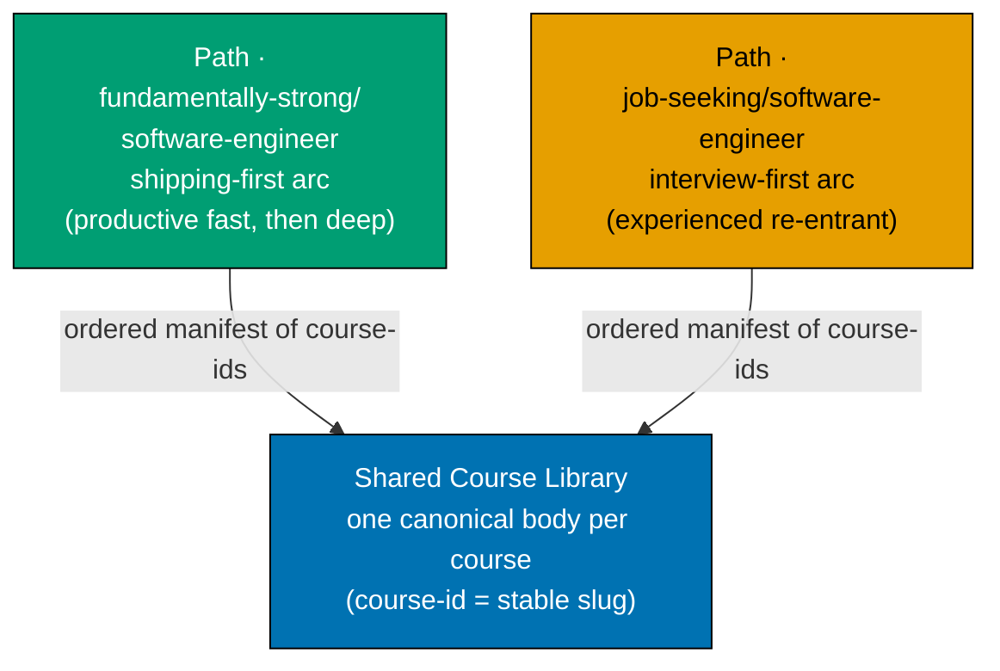
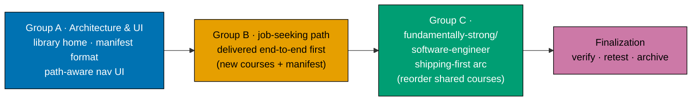

# Fundamentally Strong — Shared Course Library, Two Learning Tracks

Turn the "Fundamentally Strong" curriculum into a **shared course library** consumed by **two
learning paths**. One canonical body per course (a "building block"); each path is an **ordered
manifest** that references course IDs. Zero content duplication, single source of truth per course.
This plan also builds the **real ayokoding-www UI change** that makes path-aware navigation work —
a single canonical course URL plus client-side path context.

## The two paths, one library

- **Course = building block, 1 topic = 1 course.** Each self-contained topic module is a **course**
  with a stable **course ID** (its kebab-case slug, e.g. `coding-interview`). One canonical body,
  authored once, living at one canonical URL — never forked per path.
- **Path = ordered manifest.** A "path" (a.k.a. track) is a data manifest that lists course IDs in a
  chosen order. Two paths ship:
  - **`fundamentally-strong/software-engineer`** — learn SWE with an "immediately effective" principle, then go deeper.
    The arc is **shipping-first**: editor/tooling → one language end-to-end → **build a real app
    FIRST** (productive fast) → **THEN** CS fundamentals / data structures / algorithms / systems
    depth.
  - **`job-seeking/software-engineer`** — the **interview-first** arc for an experienced SWE
    re-entering the job market (Editor Foundations → Interview Prep → Multi-Platform Productivity →
    Deepening), recently laid off, returning from a gap, or a senior wanting to switch.
- **Shared building blocks, omit-or-create.** The two paths **share courses**. If a shared course
  does not fit a given path, it is simply **omitted** from that path's manifest. If a path needs
  something no course covers, a **new course is created** — and immediately becomes available to both
  paths. A path may add optional **lightweight framing** per course (an intro/outro callout) ONLY
  when it fits; it never forks the course body.

## Course-ID and manifest model (summary)

- **Canonical course home**: `apps/ayokoding-www/content/en/courses/<course-id>/`
  — one page-bundle per course (its `_index.md` + `overview.md` + `learning/` + `drilling/`).
  [Repo-grounded — the existing bundles live under
  `.../fundamentally-strong/software-engineer/<slug>/` today; this plan re-homes them to the top-level
  `courses/<course-id>/` with redirects.]
- **Canonical course URL**: `/{locale}/c/courses/<course-id>` — surfaced
  as `/en/courses/<course-id>`. One URL per course, path-independent.
- **Path manifest**: a standalone data file under
  `apps/ayokoding-www/src/features/course-paths/manifests/` (globbed `manifests/**/*.yaml`, nested to
  mirror each slash path ID — the machine-consumed source of truth) carrying `pathId`, display
  `title`, `description`, and an ordered `courseOrder` list of course IDs. It is NOT frontmatter on a
  content `_index.md`; the path landing page renders from the loaded manifest. The flat
  `syllabus/manifest-*.md` files are the human-readable mirror.
- **Path context**: a course page reads `?path=<path-id>`; its prev/next and breadcrumb then follow
  **that path's manifest ordering**. With no path context the course renders its **canonical
  standalone view**. Full design in
  [tech-docs.md §Path-Aware Navigation UI (ayokoding-www)](./tech-docs.md#path-aware-navigation-ui-ayokoding-www).

## Course library source

The canonical courses come from two places, and the library retains **ALL** of them:

1. **The existing published `fundamentally-strong/software-engineer` topics** (94 topics + 3 existing
   capstones = 97 existing courses) become the canonical courses, re-homed into `courses/<course-id>/`.
2. **The new courses this plan authors** — the four interview-technique modules, the
   harness/build-your-own-coding-agent cluster, browser/CDP, async-Python/FastAPI, light
   self-hosting, C++, detection-engineering, and the build-your-own-pentest-engine capstone — are
   added to the library. More courses are created if a path needs them (omit-or-create).

The complete catalog (every course + its ID, format, language, short summary) is the
[tech-docs §Course Library Catalog](./tech-docs.md#course-library-catalog). The two path orderings
are the [tech-docs §Path Manifests](./tech-docs.md#path-manifests).

## Build order (job-seeking path first)

Delivery is sequenced in three groups; the **job-seeking/software-engineer path ships first,
end-to-end**, before the fundamentally-strong/software-engineer path begins. Shared courses are **retro-extracted into the
formal `courses/` library incrementally**, as each path needs them.

- **Group A — Architecture & UI foundation**: define the shared-course-library architecture, the
  course-ID scheme, and the path-manifest format; build the **ayokoding-www path-aware navigation UI**
  (routing, `?path=` context, manifest-driven prev/next + breadcrumb, graceful deep-link fallback,
  accessibility, path landing pages) with unit + integration + e2e tests and a `specs/` Gherkin
  companion.
- **Group B — `job-seeking/software-engineer` path (first)**: re-home **all ~97 existing courses** into
  `courses/` (the interview-first path spans the whole library), author the 17 NEW courses/capstones it
  needs, and
  write its **interview-first manifest** as the `manifests/job-seeking/software-engineer.yaml` data
  file. Ship it end-to-end (landing page, path-aware nav, deployed) so it is fully usable before
  Group C.
- **Group C — `fundamentally-strong/software-engineer` path (shipping-first)**: **zero new bodies** — write only the
  `manifests/fundamentally-strong/software-engineer.yaml` data file that reorders the already-re-homed library into the
  shipping-first arc, ending with the optional "ready to job-hunt?" bridge tail into the shared
  interview courses. Pure manifest reuse — the strongest proof of the shared-library architecture.

Full phase list in [delivery.md](./delivery.md).

## Depends-on

**Hard dependency**: [`plans/done/2026-07-19__fundamentally-strong-software-engineer/`](../../done/2026-07-19__fundamentally-strong-software-engineer/README.md)
must be **fully DONE** — all 94 topics + 3 capstones authored and live under the sibling plan's
`.../fundamentally-strong/software-engineer/` content home — **before this plan
executes**. [Judgment call] At authoring time (2026-07-18) the live content tree holds only the
prologue through roughly topic 30 [Repo-grounded], so the dependency is **not yet satisfied** — the
Group A precondition gate hard-blocks until the sibling plan is confirmed DONE.

## Primary personas

- **`job-seeking/software-engineer` path — experienced SWE re-entering the job market (north-star for
  path B)**: recently laid off, returning from a gap/sabbatical, or a senior switching. Wants to
  refresh breadth fast, relearn interview technique at mid/senior/staff level, and handle a
  layoff/gap narrative — without walking a from-scratch curriculum.
- **`fundamentally-strong/software-engineer` path — a builder who wants to be productive fast (north-star for path C)**:
  wants "immediately effective" SWE — set up the editor, learn one language end-to-end, **build a
  real app first**, and only then deepen into CS fundamentals, data structures, algorithms, and
  systems. A from-scratch learner and a mid-career switcher are both served by this arc.

## Navigation

- [Business Requirements (brd.md)](./brd.md) — WHY the shared-library two-path model, who it serves.
- [Product Requirements (prd.md)](./prd.md) — the model as product spec, personas, user stories,
  Gherkin acceptance criteria, the NEW-course specs, and the **UI-design-funnel** for the
  path-aware navigation screens.
- [Technical Docs (tech-docs.md)](./tech-docs.md) — the shared-course-library architecture, the
  course-ID + manifest schema, the ayokoding-www path-aware-navigation UI design, the course library
  catalog, and both path manifests.
- [Delivery Checklist (delivery.md)](./delivery.md) — phased A/B/C executable checklist.
- [Syllabus](./syllabus/overview.md) — the per-course detail layer (course library catalog + the two
  path manifests as orderings over it).
- [Learnings (learnings.md)](./learnings.md) — knowledge-capture running log.

## Delivery Mode: worktree-to-pr

`worktree-to-pr` (the repo default): work in `worktrees/fundamentally-strong-shared-course-tracks/`,
open a draft PR per phase against `main`, run the PR-Review Maker→Fixer Cycle (3 sequential CI-gated
cycles), then `[AI]` merges automatically once the review and all quality gates are green — a
plan-scoped AI-auto-merge deviation from the standard `[HUMAN]` merge gate (see **DN-7 DECIDED**
below). `ayokoding-www` is deployed to `prod-ayokoding-www` after every merge. See
[delivery.md](./delivery.md) for the `## Worktree` and `## Delivery Mode` declarations and the
PR-review-cycle steps.

## Decisions Locked (from grilling the maintainer)

The following are **decided** and drive the plan. The residual per-path ordering judgment calls
(which shared courses each path omits, exact shipping-first order) are resolved in the manifests
(tech-docs) rather than re-grilled.

- **DL-1 · Two paths, one shared library.** `fundamentally-strong/software-engineer` (shipping-first) and
  `job-seeking/software-engineer` (interview-first) share one canonical course library. **Decided.**
- **DL-2 · Course = building block; path = ordered manifest.** 1 topic = 1 course with a stable ID;
  a path references course IDs in order; zero body duplication, single source of truth. **Decided.**
- **DL-3 · Omit-or-create semantics.** A path omits a shared course that does not fit, or creates a
  new course (added to the library, available to both). Optional per-path lightweight framing only;
  never a body fork. **Decided.**
- **DL-4 · Library source.** The 94 existing published `fundamentally-strong/software-engineer` topics + 3 existing
  capstones (97 existing courses) become canonical courses; the plan's 17 new courses/capstones are
  added; the library retains ALL 114. **Decided.**
- **DL-5 · Build order.** Deliver the `job-seeking/software-engineer` path FIRST, end-to-end (its
  Group B re-homes **all ~97 existing courses** into the formal library, per OQ-1, and authors the 17
  NEW courses/capstones directly); the `fundamentally-strong/software-engineer` shipping-first path follows in Group C as a
  **zero-new-body** manifest over the same library. **Decided.**
- **DL-6 · Path-aware navigation = a real ayokoding-www UI change.** Mechanic: single canonical
  course URL + client-side path context (`?path=<path-id>`); prev/next + breadcrumb follow that
  path's manifest ordering; graceful canonical fallback when context is missing. Proper frontend/UI
  design in tech-docs; concrete UI implementation + unit/integration/e2e steps + `specs/` Gherkin in
  delivery. **Decided.**
- **DN-7 DECIDED — `[AI]` auto-merge (plan-scoped).** `[AI]` merges each phase's PR automatically once
  the 3-cycle PR-Review Maker→Fixer Cycle and all quality gates are green — no `[HUMAN]` merge gate.
  The maintainer authorized AI-auto-merge for **this plan** (2026-07-18, in-session): (a) this plan
  uses the SAME delivery methods as the sibling plan `fundamentally-strong-software-engineer` (which
  carries its own, independently-recorded authorization scoped only to itself); and (b) no maintainer
  permission is needed to merge a PR once it has passed 3 review cycles and the PR quality gate. A
  deliberate, plan-scoped override recorded here and in
  [delivery.md](./delivery.md#delivery-mode-worktree-to-pr); it does **not** amend
  `pr-merge-protocol.md` and applies to no other plan.

## Open Questions — RESOLVED

All three open questions were resolved by the maintainer before execution.

- **OQ-1 · When to physically re-home the shared course bodies into `courses/` — RESOLVED
  (default confirmed).** Group B re-homes **all ~97 existing courses** into `courses/<course-id>/`
  (the interview-first path spans the whole library, so its delivery re-homes every existing course)
  and authors the 17 NEW courses/capstones directly into `courses/` (never re-homed, since they have
  no prior home); Group C (fundamentally-strong/software-engineer) then adds **zero new bodies** — it is pure manifest
  reuse over the already-populated 114-course library, the strongest proof of the shared-library
  architecture.
- **OQ-2 · Manifest storage form — RESOLVED (changed from default).** Each path manifest is a
  **standalone data file in the feature** under
  `apps/ayokoding-www/src/features/course-paths/manifests/` (globbed `manifests/**/*.yaml`, nested to
  mirror each slash path ID), NOT `courseOrder` frontmatter on a content `_index.md`. The feature core
  loads the data file; `?path=` selects which manifest is active; prev/next resolves against it. The
  flat `syllabus/manifest-*.md` files are the human-readable mirror; the data file is the
  machine-consumed source of truth.
- **OQ-3 · Shipping-first exact ordering — RESOLVED (changed from default).** The fundamentally-strong/software-engineer
  path does **not** hard-omit the interview courses. It ends with an **optional "ready to job-hunt?"
  bridge tail** linking into the four interview-technique courses + `capstone-interview-loop` — the
  same shared courses the job-seeking/software-engineer path uses (referenced by ID, zero new bodies) — for an SE-path
  learner who decides to job-hunt. Full order in
  [syllabus/manifest-fundamentally-strong-software-engineer.md](./syllabus/manifest-fundamentally-strong-software-engineer.md).
