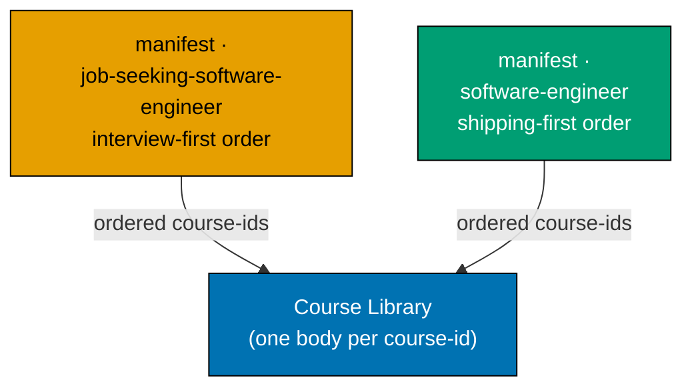

# Syllabus Overview — Fundamentally Strong Shared Course Library, Two Tracks

This `syllabus/` folder is the **per-course detail layer** for the shared course library and the two
learning paths built over it. It has three parts:

1. **The course library catalog** — [README.md](./README.md) indexes every course by its stable
   **course ID**, with one **`<course-id>.md`** detail file per course (concepts, worked examples,
   capstone spec). Courses have **no single order** here — order is a per-path property.
2. **The two path manifests** — [manifest-job-seeking-software-engineer.md](./manifest-job-seeking-software-engineer.md)
   (interview-first) and [manifest-software-engineer.md](./manifest-software-engineer.md)
   (shipping-first), each an **ordered list of course IDs** over the shared library.
3. **This overview** — the architecture, the legend, the authoring guarantees, the capstone policy,
   and the per-course file template.

**Source of truth**: the [tech-docs §Course Library Catalog](../tech-docs.md#course-library-catalog)
(course ID, format, language, short summary) and [tech-docs §Path Manifests](../tech-docs.md#path-manifests)
(the two orderings) are authoritative. The [prd.md](../prd.md) holds the product spec (personas, user
stories, Gherkin, the UI-design-funnel, NEW-course specs). This folder adds the dimension the tables
cannot hold: per course, the concrete **Concepts** (`co-NN`), **Worked examples** (`ex-NN`), and
**Capstone spec**; and per path, the concrete ordered manifest.

> **Authoring status note**: this plan is in `backlog/`; the **syllabus specs** for the fourteen NEW
> courses are authored here (this folder), but the **live ayokoding-www site content** is **not yet
> authored** — that happens during `delivery.md` Phase 6. Do not conflate "the syllabus spec exists in
> this folder" with "the site page is live." Version-sensitive claims in each file's **Accuracy notes**
> are marked `[Needs Verification]` — the pre-authoring `web-researcher` sweep resolves them before a
> maker authors the live page. Do not treat any version string here as `[Verified]` until that sweep
> runs.

## Shared-course-library + two-path architecture



- **Course = building block, 1 topic = 1 course.** A course is a self-contained topic module
  (learning + drilling track) with a stable **course ID** (its kebab-case slug). One canonical body,
  one canonical URL (`/fundamentally-strong/courses/<course-id>`), authored once, never forked.
- **Path = ordered manifest.** A path lists course IDs in an order; a course page reads the active
  path context (`?path=<path-id>`) and its prev/next + breadcrumb follow that path's order. See
  [tech-docs §Path-Aware Navigation UI](../tech-docs.md#path-aware-navigation-ui-ayokoding-www).
- **Omit-or-create.** A path omits a course that does not fit and creates a new course only for a real
  gap (added to the library, available to both paths). Optional per-path framing is a lightweight
  intro/outro callout, never a body fork.

## The two paths

- **`job-seeking-software-engineer` (interview-first)** — for an **experienced engineer re-entering
  the job market**. Order: Prologue · Editor Foundations (skippable) → Phase 1 · Interview Preparation
  (through senior) → Phase 2 · Multi-Platform Productivity (web → cloud → mobile → desktop) → Phase 3 ·
  Deepening (shallow → deep). Delivered **first**. Full order:
  [manifest-job-seeking-software-engineer.md](./manifest-job-seeking-software-engineer.md).
- **`software-engineer` (shipping-first)** — for a **builder who wants to be effective fast**. Order:
  Stage 1 · Editor & tooling → Stage 2 · one language end-to-end + **build a real app first** → Stage 3
  · CS fundamentals, DS&A, algorithms → Stage 4 · systems / data / architecture / security / ops depth.
  Delivered **second**, reusing the same courses reordered (zero body duplication). Full order:
  [manifest-software-engineer.md](./manifest-software-engineer.md).

## Skip / fast-path affordances (per path)

- **Interview-first path** — skip the editor prologue; start at the stand-alone Phase 1; refresh
  register (re-ground a working engineer, not first-teach); skip any `just-enough-<lang>` primer you
  already own ("if you already know X, jump to Y"); phase-boundary bridges soften the two sharp
  transitions (productivity → CS theory; high-level AI harness → manual-memory C). See
  [tech-docs §Smoothness Architecture](../tech-docs.md#smoothness-architecture-per-path).
- **Shipping-first path** — "already fluent in a language? jump straight to the build-an-app stage";
  a Stage-2→Stage-3 bridge ("you shipped it; now understand why it worked") softens the transition
  from shipping to CS depth.

## Principle-transfer productivity note (proof-of-transfer, NOT repo tutorials)

The library teaches **durable principles**; the seven target codebases
(`ose-public`/`ose-primer`/`ose-infra`, `remotebrowser`, `wazuh/wazuh`, `vacti`, `vacti-pentest-engine`)
are **evidence the principles transfer**, never subject matter. No course names any repo as its
subject. See [tech-docs §Productive in Target Codebases](../tech-docs.md#productive-in-target-codebases-proof-of-transfer-outcome-anchor).
This anchor justifies the **library** and is inherited by both paths.

## How to read a course file

Each `<course-id>.md` carries these sections in order:

1. **Header** — title, course ID, format, language, scope note. **No single order index** (order is
   per-path; see the two manifests).
2. **Why this exists · the big idea** — the problem before the solution, the keep-forever mental
   model, the cross-cutting big ideas.
3. **Prerequisites** — prior **courses** (by ID) this builds on, tools & environment, assumed
   knowledge. (Prereqs are course-level, not path-level; a path's order must respect them.)
4. **Accuracy notes** — dated `web-researcher` findings; version-sensitive items `[Needs Verification]`.
5. **Concepts** — the numbered `co-NN` enumeration (floor, not cap).
6. **Tensions & trade-offs + Lineage** — judgment courses only.
7. **Worked examples** — the numbered `ex-NN` enumeration; each cites the `co-NN` it demonstrates.
8. **Capstone spec** — the course's intra-course capstone (and, in the six capstone files, the full
   inter-course capstone spec).
9. **In which paths** — which path manifests list this course (replaces the old single prev/next
   footer; order is path-dependent).

## Legend (format markers)

- **Primer** — a _Just Enough_ language on-ramp (fluency, not judgment).
- **By Example** — worked-code subject course (Beginner / Intermediate / Advanced bands).
- **Annotated-concept** — concept-centric course; code where it fits, prose + WCAG-accessible Mermaid
  where it does not.
- **— (concept, no code)** — leadership / governance / format courses: prose, worked scenarios,
  artifacts, no runnable code.

## Cross-cutting authoring guarantees

- **Coverage is a floor, not a cap** — the `co-NN` / `ex-NN` counts are the minimum a course must
  reach at authoring time; a maker may add more, never fewer, reaching the per-format volume band in
  [prd.md §Volume-target bands](../prd.md#new-course--capstone-specifications).
- **Raw-form-first tooling** — Neovim + terminal build/run/test/debug/git on a macOS/Linux-compatible
  environment; IDE-mandatory app domains called out in place.
- **Free-to-use-and-teachable-first materials**; **CVE-free dependencies** pinned to exact clean
  versions; **follow-along completeness**; **principle-first, not tutorial-first**.

## Capstone policy

Every subject course ships an **intra-course capstone**. The library additionally holds **six
inter-course capstones** (`capstone-forge-ready`, `capstone-interview-loop`,
`capstone-first-working-software`, `capstone-full-stack-app`, `capstone-build-your-own-coding-agent`,
`capstone-build-your-own-pentest-engine`) — each a course in its own right (a building block with a
stable ID), placed by each path's manifest at the appropriate boundary. Each capstone spec states
(a) goal/outcome, (b) a concepts-exercised checklist, (c) an ordered step outline (file + code +
verify command), (d) testable acceptance criteria, and (e) the done bar = **runnable end-to-end +
web-verified**.

## Per-course file template

```markdown
# <Title> (<Format>, <Language>)

**Course ID**: `<course-id>` · **Format**: <Format> · **Language**: <Language>.

**Scope note**: <what this course covers; what it defers to a deeper course>.

## Why this exists · the big idea

- **The problem before the solution**: …
- **Keep-this-if-you-forget-everything**: …
- **Big ideas touched**: …

## Prerequisites

- **Prior courses**: <course-ids this builds on, or "none — entry point">.
- **Tools & environment**: <pinned toolchain + OS/platform assumption>.
- **Assumed knowledge**: …

## Accuracy notes

- <YYYY-MM-DD> — <finding, flagged [Needs Verification] until the pre-authoring sweep runs>.

## Concepts

1. **co-01 · <slug>** — <one-line claim>. … (floor ≥ 10 subject / ≥ 8 primer|leadership)

## Worked examples

1. **ex-01 · <slug>** — <one-line spec> — verify <observable>. (co-NN) … (contiguous)

## Capstone spec — intra-course (<kind>)

- **Goal**: … · **Concepts exercised**: [ ] … · **Ordered steps**: 1. `<file>` — <code> — verify `<cmd>`
- **Acceptance criteria**: … · **Done bar**: runnable end-to-end + web-verified.

## In which paths

- `job-seeking-software-engineer` — <phase/position, or "omitted">.
- `software-engineer` — <stage/position, or "omitted">.
```

## Scope of this folder (current task)

This folder authors **19 full-detail files** (the fourteen NEW courses + the three NEW inter-course
capstones, plus the two existing capstones — `capstone-first-working-software`,
`capstone-full-stack-app` — that carry substantial authored integration content of their own) and the
**two path-manifest files**. The remaining **95 existing courses** (94 existing topics +
`capstone-forge-ready`) keep their subject content from the sibling plan; their pointer files are
indexed by [README.md](./README.md).

---

Next: [README.md — course library catalog + path manifests](./README.md) →
