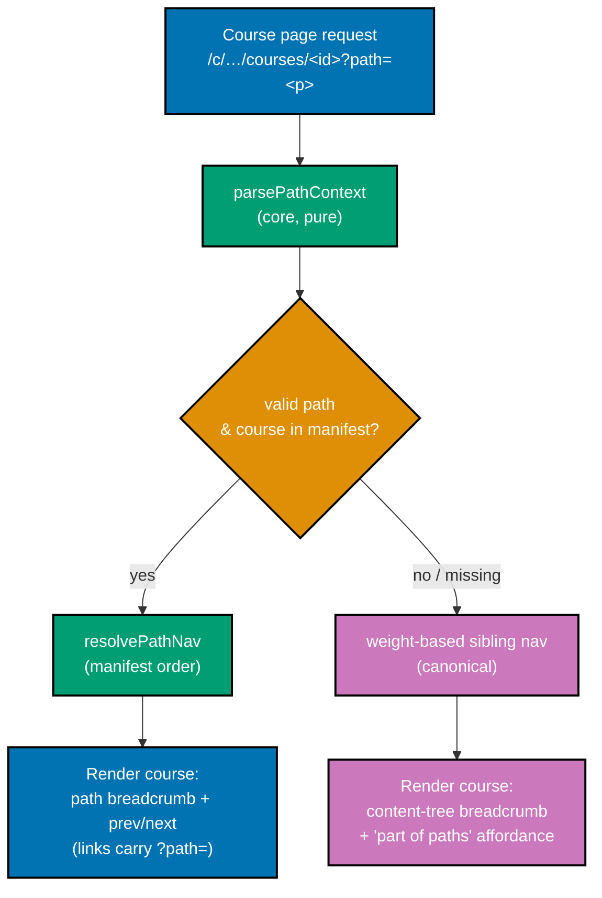

# Technical Docs — Fundamentally Strong Shared Course Library, Two Tracks

## Overview

This plan has two technical halves:

1. **A content-architecture change** — turn the existing single-order "Fundamentally Strong"
   section into a **shared course library** (one canonical body per course, keyed by a stable
   course ID) plus **two path manifests** (`software-engineer` shipping-first,
   `job-seeking-software-engineer` interview-first) that each reference course IDs in a chosen order.
   This includes authoring **fourteen NEW courses + three NEW capstones** and re-homing the existing
   published topics into a path-neutral `courses/` home with redirects.
2. **A real ayokoding-www frontend change** — a `course-paths` feature that carries a client-side
   **path context** (`?path=<path-id>`) so a course page's prev/next and breadcrumb follow the active
   path's manifest ordering, with a graceful canonical fallback when no path context is present. This
   is a genuine Next.js feature with unit + integration + e2e tests and a `specs/` Gherkin companion.

Because part 2 adds user-facing screens under `apps/`, this is a **UI-bearing plan**: its
UI-design-funnel lives in [prd.md](./prd.md#ui-design-funnel-path-aware-navigation-screens). The
**content** part remains exempt from `specs:coverage` (content under `content/**` is exempt), but the
**navigation feature** is app code and carries a full `specs/` Gherkin companion.

## Shared-Course-Library Architecture

### Course = building block (course-ID scheme)

- A **course** is one self-contained topic module (learning track + drilling track), exactly the
  page-bundle anatomy the sibling plan already uses [Repo-grounded — verified against the live
  `data-structures-and-algorithms-essentials/` bundle 2026-07-18].
- Its **course ID** is its **stable kebab-case slug** (e.g. `coding-interview`,
  `data-structures-and-algorithms-essentials`, `capstone-forge-ready`). The ID never carries a
  numeric order prefix (order is a per-path property, not a body property).
- **One canonical body per course, one canonical URL.** A course is authored once and referenced by
  ID from any number of path manifests. No course body is ever duplicated or forked per path.

### Canonical course home + URL

- **Home**: `apps/ayokoding-www/content/en/learn/fundamentally-strong/courses/<course-id>/`.
- **URL**: the app maps a content slug to `/{locale}/c/<slug>` [Repo-grounded —
  `apps/ayokoding-www/src/features/content/core/content-url.ts`], so a course resolves at
  `/{locale}/c/learn/fundamentally-strong/courses/<course-id>` — surfaced in prose as
  `/fundamentally-strong/courses/<course-id>`.
- **Migration**: existing bundles live at `.../fundamentally-strong/software-engineer/<slug>/` today
  [Repo-grounded]. Re-homing each into `courses/<course-id>/` is a `git mv` of the folder plus a
  redirect from the old URL (see [Redirects](#redirects)). The `software-engineer` name is freed to
  become a **path ID**, so there is no folder/path name clash.

### Path = ordered manifest (manifest format)

- A **path** (track) is a manifest: a **path ID**, a display **title**, a **description**, and an
  ordered **`courseOrder`** list of course IDs.
- **Storage (RESOLVED, OQ-2)**: each manifest is a **standalone data file in the feature** at
  `apps/ayokoding-www/src/features/course-paths/manifests/<path-id>.yaml`. This data file is the
  **single machine-consumed source of truth** for the path — it is NOT stored as `courseOrder`
  frontmatter on any content `_index.md`. The path landing page renders _from_ this loaded manifest
  (see [Path landing + paths hub](#path-landing--paths-hub)):

  ```yaml
  # apps/ayokoding-www/src/features/course-paths/manifests/job-seeking-software-engineer.yaml
  pathId: job-seeking-software-engineer
  title: "Job-Seeking Software Engineer"
  description: "Interview-first track for an experienced engineer re-entering the job market."
  courseOrder:
    - just-enough-nvim
    - just-enough-lua
    - extending-neovim
    - capstone-forge-ready
    - just-enough-python
    # … ordered course IDs …
  ```

- **Human-readable mirror**: `syllabus/manifest-<path-id>.md` in this plan folder is the
  human-readable ordering used during authoring/review. The machine-consumed source of truth is the
  `manifests/<path-id>.yaml` data file above; the syllabus markdown is a documentation mirror, not
  what the app loads.
- **Course reference**: each `courseOrder` entry is a course ID string, optionally a mapping
  `{ id, framing?: { intro?, outro? } }` when the path adds a **lightweight per-course framing**
  callout (DL-3). The framing is rendered by the path layer around the shared body; the body itself
  is never modified.
- **Omit-or-create**: a path lists only the courses that fit its arc (others are omitted). A path
  that needs something no course covers triggers creation of a new course in the library (available
  to both paths thereafter).

### Manifest integrity invariants (verified as gates + unit tests)

- Every `courseOrder` ID resolves to an existing course under `courses/<course-id>/` (no dangling
  reference).
- No course ID appears twice within one manifest.
- No course body is duplicated per path (both manifests reference courses **by ID**, never copy a
  body) — a "no forked body" check.
- Course IDs are stable slugs; a re-home changes a body's URL (with a redirect) but never its ID.

## Path-Aware Navigation UI (ayokoding-www)

`ayokoding-www` is a **Next.js app** [Repo-grounded — `apps/ayokoding-www/next.config.ts`,
`src/app/[locale]/(content)/c/[...slug]/page.tsx`] following the repo's
**functional-core/imperative-shell** feature layout (`src/features/<name>/{core,shell}`)
[Repo-grounded — `src/features/{content,navigation}/{core,shell}`].

### Why the UI must change

Today, reading order is a single global property carried by `weight` frontmatter:
`computePrevNext` groups pages by parent slug and sorts siblings by `weight`, path-independently
[Repo-grounded — `apps/ayokoding-www/src/features/content/core/tree-builder.ts`]. One body cannot
encode two orders. The new model **moves order out of the body and into the manifest**, and makes
prev/next + breadcrumb **resolve against the active path**.

### New feature: `course-paths` (functional core + imperative shell)

```text
apps/ayokoding-www/src/features/course-paths/
├── core/                      # PURE — no IO
│   ├── schemas.ts             # PathManifest zod schema (pathId, title, description, courseOrder[])
│   ├── manifest.ts            # PathManifest type + course-ref normalization (id | {id, framing})
│   ├── path-nav.ts            # resolvePathNav(manifest, courseId) -> {prev, next} (pure)
│   ├── path-context.ts        # parsePathContext(searchParams, manifests) -> pathId | null (validate)
│   └── path-nav.test.ts       # unit tests for the pure resolver + context parser
└── shell/                     # IO / React
    ├── manifest-repository.ts # load manifests/*.yaml data files into PathManifest[] (fs)
    ├── manifests/             # SOURCE OF TRUTH — one <path-id>.yaml manifest data file per path
    ├── path-landing.tsx       # renders a path landing page from a manifest (ordered course list)
    ├── path-banner.tsx        # in-path affordance on a course page (path name + position + a11y)
    └── path-course-links.tsx  # "this course is part of: [path A] [path B]" affordance
```

- **`resolvePathNav(manifest, courseId)`** (pure, core): finds `courseId` in `manifest.courseOrder`;
  returns `{ prev, next }` as the neighboring course refs (title + id), or `{prev:null,next:null}`
  when `courseId` is not in the manifest (course not part of this path → canonical view).
- **`parsePathContext(searchParams, manifests)`** (pure, core): reads the `path` search param;
  returns the matching `pathId` only when it names a loaded manifest, else `null` (graceful
  fallback). This is the validation gate against invalid/renamed path IDs.
- **`manifest-repository.ts`** (shell): reads each `manifests/<path-id>.yaml` data file, parses it,
  and validates it through the `schemas.ts` zod schema into a `PathManifest`; manifests are cached in
  the content index alongside `trees`/`prevNext` [Repo-grounded — `ContentIndex` in
  `apps/ayokoding-www/src/features/content/core/types.ts`]. The `?path=` param selects which loaded
  manifest is active; prev/next then resolves against that manifest's `courseOrder`.

### Routing + path context propagation

- **Course pages** stay at their canonical `/{locale}/c/learn/fundamentally-strong/courses/<course-id>`
  URL; **path context rides in the `?path=<path-id>` query param**, never in the path segment. One
  canonical URL per course; the param is additive and shareable.
- **`c/[...slug]/page.tsx`** [Repo-grounded] reads `searchParams.path`, calls
  `parsePathContext`, and — when a valid path context resolves and the course is in that manifest —
  renders **path-aware** prev/next + breadcrumb; otherwise renders the **canonical** view. `searchParams`
  makes the route dynamic for these pages (or a client component reads the param) — the exact
  static/dynamic boundary is a Group-A implementation decision recorded in delivery.
- **Link propagation**: `contentUrl(locale, slug, pathId?)` gains an optional `pathId` that appends
  `?path=<path-id>` [Repo-grounded — extend `content-url.ts`], so path-aware prev/next and breadcrumb
  links carry the context forward as the reader walks the path.

### Prev/next resolution

- **With path context**: prev/next come from `resolvePathNav(activeManifest, courseId)` — the
  manifest ordering, **not** weight. Links carry `?path=`.
- **Without path context** (canonical/standalone): the existing weight-based sibling prev/next is
  used (or none), exactly as today — no regression for non-path readers
  [Repo-grounded — `apps/ayokoding-www/src/features/navigation/shell/prev-next.tsx`].

### Breadcrumb

- **With path context**: `Home / Fundamentally Strong / <Path Title> / <Course Title>` — the path
  crumb links to the path landing page (carrying `?path=`).
- **Without path context**: the existing content-tree breadcrumb, unchanged
  [Repo-grounded — `apps/ayokoding-www/src/app/[locale]/(content)/c/[...slug]/page.tsx buildBreadcrumbs`].

### Graceful fallback (deep-link / share)

- A course URL shared without `?path=` lands on the **canonical standalone view** — full body,
  content-tree breadcrumb, weight-based (or no) prev/next — never an error.
- Every course page shows a **"this course is part of: [path A] [path B]"** affordance
  (`path-course-links.tsx`) so a deep-linked reader can enter either path. This affordance is derived
  from the manifests (which paths list this course ID).
- An **invalid** `?path=` value (unknown/renamed path) is treated as no context (fallback), never a
  crash — enforced by `parsePathContext` + a Gherkin scenario + an e2e test.

### Path landing + paths hub

- **Path landing** (`paths/<path-id>/_index.md` route rendered by `path-landing.tsx`): the thin
  content `_index.md` supplies only the landing prose/SEO anchor; the ordered course list is rendered
  **from the loaded `manifests/<path-id>.yaml` manifest** (grouped by the path's phase headings), each
  course link carrying `?path=`. Ordering never lives in the `_index.md` frontmatter.
- **Paths hub** (`fundamentally-strong/paths/_index.md` or the `fundamentally-strong/_index.md`
  landing): a "choose your path" screen with the two path cards, each card built from a loaded
  manifest (title + description + course count). Design in the funnel (prd).

### Accessibility

- Breadcrumb and prev/next remain `nav` landmarks with `aria-label`s [Repo-grounded — existing
  components]; the path crumb marks the current path with `aria-current` where appropriate.
- The path banner and "part of paths" affordance are keyboard-operable, visible-focus, and
  colour-contrast WCAG-AA; `html[lang]` stays correct per locale.
- The path landing course list is a semantic ordered list; screen readers announce course position.

### Redirects

Old `.../fundamentally-strong/software-engineer/<topic>` URLs redirect to
`.../fundamentally-strong/courses/<course-id>` via the app's redirect layer
[Repo-grounded — `apps/ayokoding-www/src/redirects/`; precedent
`specs/apps/ayokoding/behavior/ayokoding-www/gherkin/navigation/learn-reorg-redirects.feature`]. One
redirect per re-homed course; verified by the redirect specs + an e2e test.

### UI data-flow diagram



### Testing strategy (three levels + specs)

Per the repo's three-level testing standard and TDD mandate, the navigation feature is built
test-first:

- **Unit** (`test:unit`, pure core): `resolvePathNav` (prev/next at boundaries, missing course),
  `parsePathContext` (valid/invalid/missing param), manifest schema validation, `contentUrl` with
  `pathId`.
- **Integration** (`test:integration`): the manifest repository loads `manifests/*.yaml` data files
  into a validated `PathManifest[]`; the content service resolves a course + active path into
  path-aware prev/next; redirect resolution old-URL → new-URL.
- **E2E** (`test:e2e`, Playwright): from a path landing page, walk the course order via prev/next
  (param persists); breadcrumb shows the path; deep-link a course without `?path=` → canonical view;
  invalid `?path=` → canonical view; old URL → redirect to `courses/<id>`. Across all supported
  locales.
- **`specs/` Gherkin companion**: authored under
  `specs/apps/ayokoding/behavior/ayokoding-www/gherkin/course-paths/` (new domain folder beside
  `navigation/`) [Repo-grounded — sibling `navigation/` exists], consumed by `specs:coverage`.

## Course Library Catalog

The library retains **all 114 courses**: the 94 existing published topics + 3 existing capstones
(97 existing courses) + the fourteen NEW modules + the three NEW capstones (17 net-new). Each row is
one course, keyed by its **course ID**
(stable slug). **Order is NOT a catalog property** — it lives in the two
[Path Manifests](#path-manifests). Formats and languages are copied from the sibling plan's canonical
per-topic columns [Repo-grounded], not invented; NEW courses are flagged.

### Editor & tooling foundations

| Course ID                 | Format     | Language(s)          | Short summary                                    |
| ------------------------- | ---------- | -------------------- | ------------------------------------------------ |
| `just-enough-nvim`        | Primer     | Neovim (ex-commands) | Modal editing, motions, buffers, terminal text   |
| `just-enough-lua`         | Primer     | Lua                  | Lua fundamentals as Neovim's scripting language  |
| `extending-neovim`        | By Example | Lua                  | Neovim config, plugins, LSP, keymaps in Lua      |
| `just-enough-python`      | Primer     | Python               | Python syntax, types, structures, idioms         |
| `just-enough-bash`        | Primer     | Bash/shell           | Shell scripting, pipes, redirection, composition |
| `version-control-and-git` | By Example | Git                  | Version control, branching, merging, history     |

### Coding, DS&A & interview technique

| Course ID                                      | Format            | Language(s)          | Short summary                                     |
| ---------------------------------------------- | ----------------- | -------------------- | ------------------------------------------------- |
| `data-structures-and-algorithms-essentials`    | By Example        | Python               | Core data structures and algorithms, complexity   |
| `advanced-algorithms`                          | By Example        | Python               | Graphs, dynamic programming, advanced techniques  |
| `coding-interview` **NEW**                     | By Example        | Python (agnostic)    | Coding-interview patterns, strategy, narration    |
| `take-home-and-live-coding` **NEW**            | By Example        | Python               | Take-home + live/pair-coding technique            |
| `object-oriented-programming-essentials`       | By Example        | Python               | Classes, inheritance, encapsulation, polymorphism |
| `object-oriented-design-and-patterns`          | By Example        | Python               | SOLID, design patterns, refactoring toward them   |
| `sql-essentials`                               | By Example        | SQL + Python         | Relational modeling, joins, querying with SQL     |
| `system-design-interview` **NEW**              | Annotated-concept | — (concept, no code) | System-design interview format, rubric, drills    |
| `technical-communication`                      | Annotated-concept | — (concept, no code) | Clear docs, proposals, reviews, technical prose   |
| `behavioral-and-leadership-interviews` **NEW** | Annotated-concept | — (concept, no code) | STAR + senior rounds; layoff/gap narrative        |

### Web & platform productivity

| Course ID                                   | Format            | Language(s)                      | Short summary                                        |
| ------------------------------------------- | ----------------- | -------------------------------- | ---------------------------------------------------- |
| `just-enough-typescript`                    | Primer            | TypeScript                       | TypeScript types, tooling, idioms for typed JS       |
| `frontend-essentials`                       | By Example        | TypeScript                       | Interactive web UIs with components and state        |
| `backend-essentials`                        | By Example        | Python (PostgreSQL)              | HTTP backends with persistence, routing              |
| `async-python-and-fastapi-services` **NEW** | By Example        | Python                           | Async Python, FastAPI, Pydantic, uv/ruff/pyright     |
| `networking-essentials`                     | By Example        | Python                           | TCP/IP, HTTP, DNS, sockets from first principles     |
| `api-design`                                | By Example        | Python                           | REST, versioning, contracts, pragmatic design        |
| `advanced-frontend`                         | By Example        | TypeScript                       | State management, performance, frontend architecture |
| `self-hosting-essentials` **NEW**           | By Example        | — (ops/config, minimal app code) | Run one box/VM, self-host a service, PaaS deploy     |
| `backend-at-scale`                          | By Example        | Python                           | Caching, sharding, queues, scaling backends          |
| `containers-and-orchestration`              | By Example        | YAML/CLI                         | Docker containers and Kubernetes orchestration       |
| `cloud-and-iac`                             | Annotated-concept | HCL/YAML                         | Provisioning cloud infrastructure declaratively      |
| `cicd-and-release-engineering`              | By Example        | YAML + Python                    | Pipelines, artifacts, deployment, release            |
| `build-automation-and-task-runners`         | By Example        | multi-tool                       | Build systems, task runners, build graphs            |

### Mobile & desktop platforms

| Course ID                       | Format     | Language(s) | Short summary                                  |
| ------------------------------- | ---------- | ----------- | ---------------------------------------------- |
| `just-enough-kotlin`            | Primer     | Kotlin      | Kotlin syntax, null safety, coroutines         |
| `android-app-development`       | By Example | Kotlin      | Native Android apps with Kotlin and the SDK    |
| `just-enough-swift`             | Primer     | Swift       | Swift syntax, optionals, value-oriented idioms |
| `ios-app-development`           | By Example | Swift       | Native iOS apps with Swift and the SDK         |
| `just-enough-dart`              | Primer     | Dart        | Dart syntax, async, idioms for Flutter         |
| `hybrid-app-development`        | By Example | Dart        | Cross-platform apps from one Dart codebase     |
| `just-enough-csharp`            | Primer     | C#          | C# syntax, LINQ, async, .NET idioms            |
| `windows-app-development`       | By Example | C#          | Native Windows desktop applications in C#      |
| `linux-app-development`         | By Example | Python      | Native Linux desktop applications, packaging   |
| `building-production-cli-tools` | By Example | Go + Rust   | Robust, distributable CLI tools in Go/Rust     |

### CS foundations, paradigms & concurrency

| Course ID                      | Format            | Language(s) | Short summary                                         |
| ------------------------------ | ----------------- | ----------- | ----------------------------------------------------- |
| `computer-science-foundations` | Annotated-concept | Python      | Automata, computability, complexity, foundations      |
| `computer-architecture`        | By Example        | C           | CPU, memory, caches, instruction execution            |
| `programming-paradigms`        | By Example        | Python      | Imperative, functional, logic, declarative survey     |
| `functional-programming`       | By Example        | Python      | Pure functions, immutability, composition, HOFs       |
| `concurrency-and-parallelism`  | By Example        | Python      | Threads, async, locks, coordinating work              |
| `just-enough-go`               | Primer            | Go          | Go syntax, tooling, goroutines, idioms                |
| `csp-style-concurrency`        | By Example        | Go          | Channels, goroutines, CSP-style concurrency           |
| `just-enough-elixir`           | Primer            | Elixir      | Elixir syntax, pattern matching, functional idioms    |
| `actor-model-concurrency`      | By Example        | Elixir      | Actors, supervision trees, fault-tolerant concurrency |

### Data depth

| Course ID                                | Format            | Language(s)               | Short summary                                   |
| ---------------------------------------- | ----------------- | ------------------------- | ----------------------------------------------- |
| `advanced-networking`                    | Annotated-concept | Python                    | Load balancing, proxies, TLS, performance       |
| `advanced-sql-and-query-performance`     | By Example        | SQL + Python (PostgreSQL) | Query plans, indexing, tuning SQL               |
| `data-access-orms-and-query-builders`    | By Example        | Python                    | Using ORMs and query builders safely            |
| `build-your-own-orm-and-query-builder`   | By Example        | Python                    | Implementing a small ORM and query builder      |
| `nosql-databases`                        | By Example        | Python                    | Document, key-value, column stores              |
| `graph-databases`                        | By Example        | Cypher + Python           | Modeling and querying connected data            |
| `database-internals-and-storage-engines` | By Example        | Python                    | B-trees, LSM-trees, WAL, storage                |
| `data-engineering`                       | Annotated-concept | Python                    | Pipelines, batch/stream processing, warehousing |
| `search-and-information-retrieval`       | By Example        | Python                    | Inverted indexes, ranking, full-text search     |

### Architecture, distributed & AI/harness

| Course ID                                                 | Format            | Language(s)         | Short summary                                       |
| --------------------------------------------------------- | ----------------- | ------------------- | --------------------------------------------------- |
| `software-architecture`                                   | Annotated-concept | Python              | Architectural styles, tradeoffs, structuring        |
| `domain-driven-design`                                    | By Example        | Python              | Bounded contexts, ubiquitous language, modeling     |
| `system-design`                                           | Annotated-concept | Python              | Designing systems for scale, availability           |
| `event-driven-architecture`                               | By Example        | Python              | Events, message brokers, event-driven design        |
| `distributed-systems`                                     | By Example        | Python              | Consensus, replication, partitions, CAP             |
| `build-your-own-web-framework`                            | By Example        | Python              | Routing, middleware, a web framework core           |
| `build-your-own-reactive-ui`                              | By Example        | TypeScript          | Reactive UI library with a virtual DOM              |
| `software-engineering-practices`                          | Annotated-concept | Python              | Code review, CI, quality gates, team practice       |
| `agentic-coding`                                          | Annotated-concept | polyglot            | Driving AI coding agents to plan, generate, verify  |
| `creating-ai-powered-apps`                                | By Example        | Python              | Integrating LLMs, embeddings, RAG into apps         |
| `agentic-ai`                                              | By Example        | Python              | Autonomous agents with tools, memory, planning      |
| `browser-automation-with-cdp` **NEW**                     | By Example        | Python (CDP client) | Chrome DevTools Protocol browser automation         |
| `the-agent-loop` **NEW**                                  | By Example        | Python              | LLM tool-use loop, read-eval-act, streaming, stops  |
| `agent-tools-and-mcp` **NEW**                             | By Example        | Python              | Tool/function schemas; MCP server + client          |
| `agent-context-and-memory` **NEW**                        | Annotated-concept | Python              | Context budgeting, compaction, retrieval, memory    |
| `agent-permissions-and-sandboxing` **NEW**                | By Example        | Python              | Approval models, sandboxed execution, guardrails    |
| `agent-orchestration-subagents-and-observability` **NEW** | Annotated-concept | Python              | Sub-agents, background tasks, hooks/skills, tracing |

### Low-level systems, JVM & languages, internals builds

| Course ID                           | Format     | Language(s)          | Short summary                                      |
| ----------------------------------- | ---------- | -------------------- | -------------------------------------------------- |
| `just-enough-c`                     | Primer     | C                    | C syntax, pointers, memory, manual management      |
| `just-enough-cpp` **NEW**           | Primer     | C++                  | C++ syntax, RAII, templates, STL, smart pointers   |
| `linux-os`                          | By Example | C + shell            | Processes, syscalls, filesystems, kernel interface |
| `windows-os`                        | By Example | C + PowerShell       | Windows internals, the API, PowerShell             |
| `system-programming`                | By Example | C                    | Memory, files, processes, OS-level programming     |
| `just-enough-rust`                  | Primer     | Rust                 | Rust syntax, ownership, borrowing, type system     |
| `modern-system-programming`         | By Example | Rust                 | Safe, high-performance systems programming         |
| `just-enough-java`                  | Primer     | Java                 | Java syntax, the JVM, collections, idioms          |
| `enterprise-java-and-the-jvm`       | By Example | Java                 | Spring, the JVM ecosystem, enterprise patterns     |
| `lisp`                              | By Example | Scheme + Clojure     | Lisp, macros, homoiconic programming               |
| `just-enough-fsharp`                | Primer     | F#                   | F# syntax, discriminated unions, functional-first  |
| `type-systems`                      | By Example | OCaml + Haskell + F# | Algebraic types, inference, ML-family type theory  |
| `compilers-parsers-and-transpilers` | By Example | F#                   | Lexers, parsers, ASTs, compilers/transpilers       |
| `build-your-own-git`                | By Example | Python               | Implementing Git's object model and plumbing       |
| `build-your-own-database`           | By Example | Python               | A database with storage, indexing, transactions    |
| `build-your-own-raft`               | By Example | Go                   | Raft consensus and a replicated key-value store    |

### Security, ops, quality & delivery

| Course ID                                           | Format            | Language(s)                 | Short summary                                          |
| --------------------------------------------------- | ----------------- | --------------------------- | ------------------------------------------------------ |
| `security-essentials`                               | By Example        | Python                      | Common vulnerabilities, auth, secrets, defaults        |
| `it-and-application-security`                       | Annotated-concept | Python                      | Enterprise security controls, identity, hardening      |
| `offensive-security`                                | By Example        | Python + shell              | Penetration testing, exploitation, attacker techniques |
| `defensive-security`                                | By Example        | Python + shell              | Detection, monitoring, incident response (concept)     |
| `detection-engineering-and-siem-operations` **NEW** | By Example        | XML/rules + config + Python | Decoders, correlation rules, FP tuning, dashboards     |
| `vulnerability-management-and-assessment`           | By Example        | Python                      | Scanning, triaging, remediating vulnerabilities        |
| `it-governance-grc`                                 | Annotated-concept | — (concept, no code)        | Governance, risk, compliance, audit frameworks         |
| `bare-metal-virtualization`                         | By Example        | HCL/YAML/shell              | Bare-metal hosts and hypervisors (Proxmox)             |
| `self-managed-kubernetes-and-gitops`                | By Example        | YAML/CLI                    | Self-hosted Kubernetes with GitOps                     |
| `platform-engineering-and-devex`                    | Annotated-concept | — (concept, no code)        | Internal platforms, golden paths, DevEx                |
| `site-reliability-engineering`                      | Annotated-concept | Python                      | SLOs, observability, incident response                 |
| `software-testing`                                  | By Example        | Python + TypeScript         | Unit, integration, end-to-end testing                  |
| `debugging-and-profiling`                           | By Example        | Python + native             | Systematic debugging and performance profiling         |
| `analytics-and-experimentation`                     | By Example        | Python                      | Metrics, A/B testing, product experimentation          |
| `information-architecture-and-seo`                  | Annotated-concept | HTML                        | Structuring content, optimizing for search             |
| `software-product-engineering`                      | Annotated-concept | — (concept, no code)        | Turning engineering into shipped products              |
| `engineering-management`                            | Annotated-concept | — (concept, no code)        | Leading engineers, teams, delivery, direction          |
| `project-management`                                | Annotated-concept | — (concept, no code)        | Scoping, planning, estimating, tracking work           |

### Capstones (courses too — each a building block)

| Course ID                                        | Kind                 | Language(s)    | Note                                                |
| ------------------------------------------------ | -------------------- | -------------- | --------------------------------------------------- |
| `capstone-forge-ready`                           | Prologue milestone   | multi          | Reproducible dev forge (nvim + lua + extend)        |
| `capstone-interview-loop` **NEW**                | Interview milestone  | Python + prose | Full mock loop: coding + system-design + behavioral |
| `capstone-first-working-software`                | Web milestone        | Python + TS    | First complete secure, tested working web app       |
| `capstone-full-stack-app`                        | Full-stack milestone | TS + Python    | Typed frontend ↔ backend ↔ SQL vertical slice       |
| `capstone-build-your-own-coding-agent` **NEW**   | Harness milestone    | Python         | Build a working agentic coding tool                 |
| `capstone-build-your-own-pentest-engine` **NEW** | Security milestone   | TypeScript     | Build an agentic pentest engine                     |

**Fourteen NEW courses** (four interview + `async-python-and-fastapi-services` +
`self-hosting-essentials` + `browser-automation-with-cdp` + the five-module harness cluster +
`just-enough-cpp` + `detection-engineering-and-siem-operations`) and **three NEW capstones**
(`capstone-interview-loop`, `capstone-build-your-own-coding-agent`,
`capstone-build-your-own-pentest-engine`) are the only net-new authored bodies. Full per-course specs
are in [prd.md §NEW Course & Capstone Specifications](./prd.md#new-course--capstone-specifications).
All NEW slugs verified absent from the content tree today [Repo-grounded — the three Addition-4 slugs
re-verified absent 2026-07-18].

## Path Manifests

Each manifest is the **authoritative order** for one path. Both reference the same course IDs; a
course listed in both appears **once** in the library. A manifest **omits** courses that do not fit;
either path may **create** a new course (added to the catalog, available to both). The manifests are
authored as standalone data files at
`apps/ayokoding-www/src/features/course-paths/manifests/<path-id>.yaml` (RESOLVED, OQ-2) — the
machine-consumed source of truth — with `syllabus/manifest-<path-id>.md` in this plan folder as the
human-readable mirror.

### Path `job-seeking-software-engineer` (interview-first)

The interview-first arc for an experienced re-entrant: **Editor Foundations → Interview Preparation →
Multi-Platform Productivity → Deepening**. Delivered **first** (Group B).

- **Prologue · Editor Foundations** (skippable for the experienced): `just-enough-nvim` →
  `just-enough-lua` → `extending-neovim` → `capstone-forge-ready`.
- **Phase 1 · Interview Preparation (through senior)**: `just-enough-python` → `just-enough-bash` →
  `version-control-and-git` → `data-structures-and-algorithms-essentials` → `advanced-algorithms` →
  `coding-interview` → `take-home-and-live-coding` → `object-oriented-programming-essentials` →
  `object-oriented-design-and-patterns` → `sql-essentials` → `system-design-interview` →
  `technical-communication` → `behavioral-and-leadership-interviews` → `capstone-interview-loop`.
- **Phase 2 · Multi-Platform Productivity** (web → cloud → mobile → desktop): `just-enough-typescript`
  → `frontend-essentials` → `backend-essentials` → `async-python-and-fastapi-services` →
  `networking-essentials` → `api-design` → `advanced-frontend` → `capstone-first-working-software` →
  `self-hosting-essentials` → `backend-at-scale` → `containers-and-orchestration` → `cloud-and-iac` →
  `cicd-and-release-engineering` → `build-automation-and-task-runners` → (mobile) `just-enough-kotlin`
  → `android-app-development` → `just-enough-swift` → `ios-app-development` → `just-enough-dart` →
  `hybrid-app-development` → (desktop) `just-enough-csharp` → `windows-app-development` →
  `linux-app-development` → `building-production-cli-tools` → `capstone-full-stack-app`.
- **Phase 3 · Deepening** (shallow → deep): the remaining courses — CS foundations, paradigms,
  concurrency, data depth, architecture/distributed, AI + the harness cluster +
  `browser-automation-with-cdp` + `capstone-build-your-own-coding-agent`, low-level systems (incl.
  `just-enough-cpp`), JVM/languages, internals builds, the security suite (incl.
  `detection-engineering-and-siem-operations` + `capstone-build-your-own-pentest-engine`), ops/
  platform, and quality/product/delivery — in the order enumerated in
  [syllabus/manifest-job-seeking-software-engineer.md](./syllabus/manifest-job-seeking-software-engineer.md).

This ordering is the interview-first arc the prior draft of this plan validated for smoothness; the
full per-course list (with prereq-chaining + phase-boundary bridges) is the syllabus manifest file.

### Path `software-engineer` (shipping-first)

The "immediately effective" arc: **Editor & tooling → one language end-to-end → BUILD A REAL APP
FIRST → THEN CS fundamentals / DS&A / algorithms / systems depth**. Delivered **second** (Group C),
reusing the same courses reordered — zero body duplication.

- **Stage 1 · Editor & tooling** (get set up fast): `just-enough-nvim` → `just-enough-lua` →
  `extending-neovim` → `just-enough-python` → `just-enough-bash` → `version-control-and-git` →
  `capstone-forge-ready`.
- **Stage 2 · One language end-to-end, then BUILD A REAL APP FIRST** (productive early — this is the
  "immediately effective" payoff): `just-enough-typescript` → `frontend-essentials` →
  `backend-essentials` → `sql-essentials` → `api-design` → `advanced-frontend` →
  `async-python-and-fastapi-services` → `capstone-first-working-software` → `self-hosting-essentials`
  → `cicd-and-release-engineering` → `capstone-full-stack-app`. The reader ships a real, deployed,
  tested app **before** any CS-theory course.
- **Stage 3 · Now go deep — CS fundamentals, DS&A, algorithms** (the depth the shipping-first reader
  earns after shipping): `data-structures-and-algorithms-essentials` → `advanced-algorithms` →
  `object-oriented-programming-essentials` → `object-oriented-design-and-patterns` →
  `computer-science-foundations` → `computer-architecture` → `programming-paradigms` →
  `functional-programming`.
- **Stage 4 · Systems, data, architecture, distributed, AI/harness, languages, security, ops** — the
  full remaining library ordered shallow → deep, mirroring the Deepening tail (concurrency → data
  depth → architecture/distributed → AI + harness cluster + CDP + coding-agent capstone → low-level
  systems incl. `just-enough-cpp` → JVM/languages → internals builds → security suite incl.
  detection-engineering + pentest-engine capstone → ops/platform → quality/product/delivery), plus
  the remaining platform courses (mobile/desktop) and `backend-at-scale` / `containers-and-orchestration`
  / `cloud-and-iac` / `build-automation-and-task-runners`.

**Optional job-hunt bridge for the software-engineer path (RESOLVED, OQ-3)**: the shipping-first path
does **not** hard-omit the interview-technique courses. It keeps the underlying DS&A, OOP, and
system-design **depth** courses inline (general SWE skill), and **ends with an optional "ready to
job-hunt?" bridge tail** — an opt-in section linking into the four interview-technique courses
(`coding-interview`, `take-home-and-live-coding`, `system-design-interview`,
`behavioral-and-leadership-interviews`) plus `capstone-interview-loop`. These are the **same shared
courses** the `job-seeking-software-engineer` path uses (referenced by ID, zero new bodies); the
bridge simply appends them to the software-engineer manifest's `courseOrder` under a clearly-labelled
optional tail, so an SE-path learner who decides to job-hunt flows straight into the interview
material. The full proposed per-course order, including the bridge tail, is in
[syllabus/manifest-software-engineer.md](./syllabus/manifest-software-engineer.md).

## Design Decisions

- **RD-1 · Order lives in the manifest, not the body.** Reading order is a per-path property carried
  by `courseOrder`, not by a global `weight`. Rationale: one body cannot encode two orders; moving
  order to the manifest is what enables the shared library. The body keeps a `weight` only for the
  canonical (no-path) sidebar/prev-next fallback and the library catalog sort.
- **RD-2 · One canonical body + URL per course; re-home with redirects.** Existing bodies move from
  `software-engineer/<slug>/` to `courses/<course-id>/`; old URLs redirect. Rationale: frees the
  `software-engineer` name to be a path ID and gives every course one path-neutral home.
- **RD-3 · Path-aware nav via `?path=` client context, not per-path URLs.** A course has exactly one
  URL; the active path rides in a query param. Rationale: one canonical URL (no duplicate content /
  SEO split), shareable, with a clean fallback when the param is absent.
- **RD-4 · Graceful canonical fallback is first-class.** A course without path context renders a full
  standalone view + a "part of paths" affordance. Rationale: deep-links and shares must never break;
  the canonical view is the existing, already-correct behavior.
- **RD-5 · Job-seeking path first; retro-extract incrementally.** Deliver the interview-first path
  end-to-end before the shipping-first path; extract shared courses into `courses/` as each path
  needs them. Rationale: ship value early, avoid a big-bang migration, and only build the formal
  shared library where a second consumer proves it earns its keep (DL-5).
- **RD-6 · Omit-or-create keeps paths honest and non-duplicative.** A path omits a course that does
  not fit and creates a new shared course only for a genuine gap; per-path framing is a callout, never
  a body fork. Rationale: single source of truth per course.
- **RD-7 · Functional-core/imperative-shell for the nav feature.** Pure `resolvePathNav` /
  `parsePathContext` in `core/`; IO manifest loading + React in `shell/`. Rationale: matches the repo
  standard and makes the ordering logic unit-testable without IO.
- **RD-8 · Interview technique is NEW content; fundamentals are shared courses.** The four interview
  modules teach technique; DS&A/OOP/system-design **depth** are library courses both paths can use.
  Rationale: separates "technique" from "subject depth" cleanly and keeps the depth reusable.
- **RD-9 · Proof-of-transfer outcome-anchor (principles, not repo-specifics).** Retained from the
  prior scope: courses teach durable principles; the seven target codebases are evidence the
  principles transfer, never subject matter. See
  [Productive in Target Codebases](#productive-in-target-codebases-proof-of-transfer-outcome-anchor).
- **RD-10 · Harness-engineering cluster as a marquee build-your-own track.** The five harness courses
  - `capstone-build-your-own-coding-agent`, placed after the AI cluster so prereqs precede it, in
    **Python** (matching `remotebrowser`). Available to both paths; central to the Deepening tail.
- **RD-11..RD-15 · Two-altitude splits + gap-closers (retained).** Light `self-hosting-essentials`
  vs full-depth `bare-metal-virtualization`; concept `defensive-security` vs hands-on
  `detection-engineering-and-siem-operations`; dedicated `just-enough-cpp` on-ramp; the
  `capstone-build-your-own-pentest-engine` security-sibling flagship. All are library courses; each
  path decides whether to include them (both do, in their Deepening tail).
- **RD-16 · Per-path progression smoothness is a first-class, audited property.** Each path's manifest
  must read smoothly for its persona — prereq-chaining, monotonic-ish difficulty, skip/fast-path
  affordances, and (interview path) refresh register — verified per path before archival. See
  [Smoothness Architecture](#smoothness-architecture-per-path).

## Smoothness Architecture (per-path)

Smoothness is a per-manifest property now (each path has its own order). Both manifests must satisfy
the four levers:

1. **Prereq-chaining** — no course assumes a course listed later in the same manifest; every
   `just-enough-<lang>` primer precedes that language's first use **within that path's order**. Two
   documented in-context language forward-references survive from the inherited interview-first order
   (SF-1 `computer-architecture` uses C before `just-enough-c`; SF-2 `building-production-cli-tools`
   uses Go/Rust before their primers) — softened + bridged in the course bodies, never reordered.
2. **Monotonic-ish difficulty** — each manifest ramps difficulty smoothly; conceptual phase-boundary
   cliffs (interview-path C-1 productivity→CS-theory; C-2 into low-level systems) carry a **bridge**
   paragraph in the path landing narrative. The shipping-first path's own cliff (Stage 2 shipping →
   Stage 3 CS depth) carries an analogous bridge: "you shipped; now understand why it worked."
3. **Skip / fast-path affordances** — the interview path keeps its "experienced & job-hunting? start
   here" fast-path and skippable prologue; the shipping-first path keeps "already know a language?
   jump to the build-an-app stage." Both are rendered on the path landing page.
4. **Refresh vs first-learn register** — the interview path's technique modules re-ground a working
   engineer; the shipping-first path uses the normal first-learn By-Example register.

A **per-path smoothness-review gate** (Group B for job-seeking, Group C for software-engineer)
re-verifies all four levers in the landed manifest + bodies before archival, so smoothness cannot
silently regress. The inherited interview-first findings (SF-1/SF-2, C-1/C-2) and their in-place
soften/bridge remediations carry over from the prior draft.

## Productive in Target Codebases (proof-of-transfer outcome-anchor)

**Philosophy.** The library teaches durable **PRINCIPLES**; the target codebases are **evidence the
principles transfer**, never subject matter. No course is "about" a target repo. This anchor is
path-independent — it justifies the **library**, and both paths inherit it.

The seven targets and the principle-modules that build each stack skill are unchanged from the prior
scope; the gap-filling NEW courses (`async-python-and-fastapi-services`, `browser-automation-with-cdp`,
the harness cluster, `just-enough-cpp`, `detection-engineering-and-siem-operations`,
`capstone-build-your-own-pentest-engine`) are library courses both paths can include:

- **`ose-public` / `ose-primer` / `ose-infra`** (this workspace family) [Repo-grounded — `AGENTS.md`]
  — Nx monorepo, F#/Giraffe backends, Rust CLIs, Playwright E2E, multi-harness AI-agent binding.
- **`remotebrowser`** [Web-cited — <https://github.com/remotebrowser/remotebrowser>, accessed
  2026-07-18] — async-Python/FastAPI browser-fleet orchestration over CDP + MCP; built by
  `async-python-and-fastapi-services`, `browser-automation-with-cdp`, and the harness cluster.
- **`wazuh/wazuh`** [Web-cited — <https://github.com/wazuh/wazuh>, accessed 2026-07-18] — C++
  manager/agent core + XML detection ruleset; built by `just-enough-cpp` and
  `detection-engineering-and-siem-operations`.
- **`anggipradana/vacti` + `anggipradana/vacti-pentest-engine`** [Unverified — maintainer-supplied;
  not publicly discoverable on 2026-07-18 search; treat all specifics as subject to change] — a
  TypeScript/Nx product and its agentic pentest engine; built by the web/monorepo courses + the
  security suite + `capstone-build-your-own-pentest-engine`.

**Citation notes**: `remotebrowser` (Python; `uv` + Podman; CDP-driven isolated Chrome; bundled MCP
server; REST control API) and `wazuh` (open-source XDR+SIEM, OSSEC lineage; manager/agent + indexer +
dashboard; 3000+ XML decoders/rules) facts are drawn from their public GitHub + docs surfaces on the
access date; both are pre-1.0 or version-sensitive, so the driven NEW courses must re-verify current
specifics via `apps-ayokoding-www-facts-checker` at authoring time. The two `vacti` repos were **not
publicly discoverable** on 2026-07-18 — all their specifics are maintainer-supplied and must never be
written as version-pinned facts; the gap-closer courses are grounded primarily in the publicly
verified `wazuh` target.

## File Impact (by delivery group)

`<COURSES>` = `apps/ayokoding-www/content/en/learn/fundamentally-strong/courses/`;
`<PATHS>` = `apps/ayokoding-www/content/en/learn/fundamentally-strong/paths/`;
`<FEAT>` = `apps/ayokoding-www/src/features/course-paths/`;
`<SPECS>` = `specs/apps/ayokoding/behavior/ayokoding-www/gherkin/course-paths/`.

| Group | Target                    | Change                           | Files                                                                                                                                                                                                                                                                                                         |
| ----- | ------------------------- | -------------------------------- | ------------------------------------------------------------------------------------------------------------------------------------------------------------------------------------------------------------------------------------------------------------------------------------------------------------- |
| A     | nav feature               | New app code (TDD)               | `<FEAT>core/{schemas,manifest,path-nav,path-context}.ts` + tests; `<FEAT>shell/{manifest-repository,path-landing,path-banner,path-course-links}.tsx`; edits to `content-url.ts`, `prev-next.tsx`, `breadcrumb.tsx`, `c/[...slug]/page.tsx`                                                                    |
| A     | specs + redirects         | New Gherkin + redirect config    | `<SPECS>*.feature` + `README.md`; `apps/ayokoding-www/src/redirects/` entries for re-homed courses                                                                                                                                                                                                            |
| A     | library + paths homes     | New content scaffolding          | `<COURSES>_index.md` (library landing); `<PATHS>_index.md` (paths hub / choose-a-path)                                                                                                                                                                                                                        |
| B     | job-seeking path          | Re-home + new courses + manifest | `git mv` the shared subset into `<COURSES><id>/` (+ redirects); author the 14 NEW course bundles + 3 NEW capstones into `<COURSES>`; author `<FEAT>manifests/job-seeking-software-engineer.yaml` (manifest data file, source of truth) + thin `<PATHS>job-seeking-software-engineer/_index.md` landing anchor |
| C     | software-engineer path    | Re-home remainder + manifest     | `git mv` the remaining shared courses into `<COURSES><id>/` (+ redirects); any shipping-first-only NEW course; author `<FEAT>manifests/software-engineer.yaml` (manifest data file, incl. optional job-hunt bridge tail) + thin `<PATHS>software-engineer/_index.md` landing anchor                           |
| Final | verify / retest / archive | plan-side + evidence             | `evidence/…`; `learnings.md` triage; `git mv` plan → `plans/done/…`; README updates                                                                                                                                                                                                                           |

**Net authored surface**: the `course-paths` feature (new app code) + 14 new course bundles + 3 new
capstone bundles + 2 path manifests + the library/paths landing pages. Existing bodies are **moved**
(not rewritten) into `courses/`. No `project.json` target changes; no new npm packages beyond what the
existing content/nav stack already provides (zod is already used [Repo-grounded —
`apps/ayokoding-www` schemas use zod]).

## Dependencies

- **Hard**: the sibling in-progress plan fully executed (all 94 topics + 3 capstones live). See README
  `## Depends-on`.
- **Tooling**: Next.js build (`nx run ayokoding-www:build`), the three-level test targets
  (`test:unit` / `test:integration` / `test:e2e`) [Repo-grounded — `apps/ayokoding-www/project.json`],
  Playwright MCP for manual verification, the ayokoding maker/checker agents, and the markdown/link/
  heading validators [Repo-grounded — `rhino-cli:links:validation`,
  `rhino-cli:headings:hierarchy-validation`].

## Rollback

- **Per-phase PRs** (Delivery Mode) → per-phase rollback via `git revert <merge-commit-sha>`.
- **Feature revert (Group A)**: the `course-paths` feature is additive; reverting it restores
  weight-based nav (canonical view) with no content loss. Re-homed courses keep working because the
  redirects and `courses/` bodies revert together.
- **Manifest revert (Group B/C)**: a path manifest is one file; reverting it removes that path's
  landing + `?path=` nav without touching any course body.
- **Re-home revert**: because each re-home is a `git mv` + redirect, reverting restores the old
  `software-engineer/<slug>/` location and drops the redirect atomically.

## Testing / Verification Strategy

- **Nav feature**: unit (pure core), integration (manifest loading + service resolution + redirects),
  e2e (Playwright path walk + fallback + redirect), all across supported locales; `specs:coverage`
  green for the new `course-paths` Gherkin domain.
- **Manifest integrity**: every `courseOrder` ID resolves; no duplicate ID per manifest; no forked
  body — a script + unit test, run as a phase gate.
- **Content**: `nx run ayokoding-www:build` green; link + heading-hierarchy + markdownlint clean;
  each NEW course passes its maker's checker + facts-checker + link-checker.
- **Manual behavioral**: Playwright MCP walks each path landing → course order → prev/next → fallback,
  per locale, with committed evidence; curl not applicable (no new API).
- **Rule-15 web retest**: path-aware nav is a user-facing change → run the three live-site testers
  before archival (see [delivery.md](./delivery.md)).
