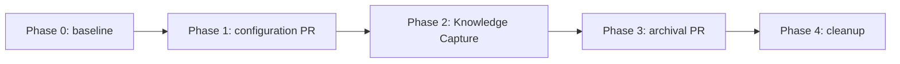

# Delivery Checklist — Database Internals Course Ruff Configuration

> **Legend** — `[AI]`: an agent performs the step (the default; unmarked steps are `[AI]`).
> `[HUMAN]`: only a human can perform a physical or credential-bound action.

## Parallelization Model

This plan chooses **N=3** background reviewers, the repository default. The configuration delivery
must serialize before the closeout delivery because the latter records its merged result. Within each
delivery PR, the three reviewer lenses may fan out concurrently; the review cycles themselves remain
strictly sequential. Cleanup is the terminal node and depends on both merged delivery units.

### Delivery Boundaries

| Phase(s) | Delivery unit | Worktree / branch | PR opens |
| --- | --- | --- | --- |
| 0 | Setup and baseline | — | no |
| 1 | Scoped Ruff configuration | `worktrees/ayokoding-database-internals-ruff-config/` / `ayokoding-database-internals-ruff-config-base` | yes — at Phase 1 |
| 2–3 | Knowledge Capture and archival | `worktrees/ayokoding-database-internals-ruff-config-closeout/` / `ayokoding-database-internals-ruff-config-closeout-base` | yes — at Phase 3 |
| 4 | Cleanup | — | no |

## Worktree

Phase 1 uses `worktrees/ayokoding-database-internals-ruff-config/`. After its PR merges, Phases 2–3
use `worktrees/ayokoding-database-internals-ruff-config-closeout/` from current `origin/main`.
Both delivery units use `worktree-to-pr`; neither worktree may carry another plan's changes.

## Phase 0: Environment Setup and Baseline

- [ ] [AI] Run `npm install` from the provisioned worktree — acceptance: dependencies install without an unresolved package error.
- [ ] [AI] Run `npm run doctor -- --fix` from the provisioned worktree — acceptance: required local development tools are available.
- [ ] [AI] Run `npx nx affected -t typecheck lint test:quick specs:coverage` — acceptance: every baseline target exits 0; fix any failure before Phase 1.
- [ ] [AI] Run `test ! -f apps/ayokoding-www/content/en/learn/courses/database-internals-and-storage-engines/ruff.toml` — acceptance: it exits 0 and no file is changed.
- [ ] [AI] Run `find apps/ayokoding-www/content/en/learn/courses/database-internals-and-storage-engines/{learning,drilling} -name '*.py' -print0 | xargs -0 awk 'length > max { max = length } END { print max }'` — acceptance: it prints one numeric longest-line baseline.
- [ ] [AI] Record the exact baseline command and output in `plans/in-progress/ayokoding-database-internals-ruff-config/learnings.md` — acceptance: a fresh executor can reproduce the value.

### Phase 0 Gate

- [ ] [AI] Re-run `test ! -f apps/ayokoding-www/content/en/learn/courses/database-internals-and-storage-engines/ruff.toml` — acceptance: it exits 0.
- [ ] [AI] Re-run `npx nx affected -t typecheck lint test:quick specs:coverage` — acceptance: every baseline target exits 0.
- [ ] [AI] Run `git ls-remote --heads origin "$(git branch --show-current)"` and `gh pr list --head "$(git branch --show-current)" --json number --jq 'length'` — acceptance: the first prints no ref and the second returns `0`.

> **Pause Safety**: baseline is recorded and no remote delivery exists. Resume with:
> `git -C worktrees/ayokoding-database-internals-ruff-config status --short`.

## Phase 1: Scoped Ruff Configuration

- [ ] [AI] Add `apps/ayokoding-www/content/en/learn/courses/database-internals-and-storage-engines/ruff.toml` with the baseline-derived, Ruff-supported line length and rationale — acceptance: it is the only runtime-adjacent file changed.
- [ ] [AI] Run `ruff format --check apps/ayokoding-www/content/en/learn/courses/database-internals-and-storage-engines` — acceptance: it exits 0 without rewriting a source file.
- [ ] [AI] Run `git diff --name-only origin/main...HEAD -- 'apps/ayokoding-www/src/features/course-paths/manifests/'` — acceptance: it prints no path.
- [ ] [AI] Run `npx nx affected -t typecheck lint test:quick specs:coverage` — acceptance: every affected target exits 0.
- [ ] [AI] Commit the scoped configuration as `fix(ayokoding-www): add database internals ruff config` — acceptance: `git show --name-only --format=HEAD` contains only the configuration and planned evidence.
- [ ] [AI] Push `ayokoding-database-internals-ruff-config` and open its sole draft PR — acceptance: the PR contains the scoped configuration delivery unit only.
- [ ] [AI] Run PR-Review Maker→Fixer Cycle 1 and wait for green CI — acceptance: one consolidated review is posted, every thread is resolved, and `gh pr checks <PR>` has no pending or failing check.
- [ ] [AI] Run PR-Review Maker→Fixer Cycle 2 and wait for green CI — acceptance: one additional consolidated review is posted, every thread is resolved, and `gh pr checks <PR>` has no pending or failing check.
- [ ] [AI] Run PR-Review Maker→Fixer Cycle 3 and wait for green CI — acceptance: one final consolidated review is posted, every thread is resolved, and `gh pr checks <PR>` has no pending or failing check.
- [ ] [AI] Merge the Phase 1 PR under hardened preconditions — acceptance: `gh pr view <PR> --json state,mergeCommit` reports `MERGED` and a merge commit.

### Phase 1 Gate

- [ ] [AI] Run `ruff format --check apps/ayokoding-www/content/en/learn/courses/database-internals-and-storage-engines` — acceptance: it exits 0.
- [ ] [AI] Run `gh pr checks <PR>` — acceptance: it has no pending or failing check.
- [ ] [AI] Run `gh pr list --head ayokoding-database-internals-ruff-config-base --state all --json number,state,mergedAt` — acceptance: the Phase 1 PR reports `MERGED` with a non-null `mergedAt` value.

> **Pause Safety**: configuration is merged and independently deployable. Resume with:
> `git fetch origin && git log -1 --oneline origin/main`.

## Phase 2: Knowledge Capture

- [ ] [AI] Verify the Phase 1 worktree is clean with `git -C worktrees/ayokoding-database-internals-ruff-config status --porcelain` and that its PR is merged with `gh pr list --head ayokoding-database-internals-ruff-config-base --state all --json number,state,mergedAt` — acceptance: the worktree is empty and the PR reports `MERGED` with `mergedAt`.
- [ ] [HUMAN] Confirm deletion of the completed Phase 1 worktree and its merged branch — acceptance: explicit approval is recorded in the execution conversation.
- [ ] [AI] Remove the Phase 1 worktree with `git worktree remove worktrees/ayokoding-database-internals-ruff-config` and run `git worktree prune` — acceptance: `git worktree list` contains no Phase 1 path.
- [ ] [AI] Create `plans/in-progress/ayokoding-database-internals-ruff-config/learnings.md` if no entry was recorded earlier — acceptance: the file is present for the final triage.
- [ ] [AI] Triage each `learnings.md` entry to exactly one durable home — acceptance: every entry records its terminal route and both Knowledge Capture safety gates.
- [ ] [AI] Record `none` in `learnings.md` if no generalizable learning survives — acceptance: the explicit terminal record is present.

### Phase 2 Gate

- [ ] [AI] Run `test -f plans/in-progress/ayokoding-database-internals-ruff-config/learnings.md` — acceptance: it exits 0.
- [ ] [AI] Run `rg -n 'terminal route|none' plans/in-progress/ayokoding-database-internals-ruff-config/learnings.md` — acceptance: every entry has a terminal record.

> **Pause Safety**: Knowledge Capture is terminal; only archival remains. Resume with:
> `git -C worktrees/ayokoding-database-internals-ruff-config-closeout status --short`.

## Phase 3: Archival and Closeout PR

- [ ] [AI] Move the plan with `git mv plans/in-progress/ayokoding-database-internals-ruff-config plans/done/YYYY-MM-DD__ayokoding-database-internals-ruff-config` — acceptance: the full plan folder is under `plans/done/`.
- [ ] [AI] Remove the plan entry from `plans/in-progress/README.md` — acceptance: the former path is absent from that index.
- [ ] [AI] Add the completion-dated entry to `plans/done/README.md` — acceptance: the new archive path resolves from the index.
- [ ] [AI] Update `plans/backlog/README.md` for the archival move — acceptance: no plan index links to the former location.
- [ ] [AI] Commit the archival as `chore(plans): move ayokoding-database-internals-ruff-config to done` — acceptance: the archive and index updates are in the same commit.
- [ ] [AI] Push `ayokoding-database-internals-ruff-config-closeout` and open its sole draft PR — acceptance: it contains only Knowledge Capture and archival changes.
- [ ] [AI] Run PR-Review Maker→Fixer Cycle 1 and wait for green CI — acceptance: one consolidated review is posted, every thread is resolved, and `gh pr checks <PR>` has no pending or failing check.
- [ ] [AI] Run PR-Review Maker→Fixer Cycle 2 and wait for green CI — acceptance: one additional consolidated review is posted, every thread is resolved, and `gh pr checks <PR>` has no pending or failing check.
- [ ] [AI] Run PR-Review Maker→Fixer Cycle 3 and wait for green CI — acceptance: one final consolidated review is posted, every thread is resolved, and `gh pr checks <PR>` has no pending or failing check.
- [ ] [AI] Merge the Phase 3 PR under hardened preconditions — acceptance: `gh pr view <PR> --json state,mergeCommit` reports `MERGED` and a merge commit.
- [ ] [AI] Request the production course URL after deployment — acceptance: the response is successful and the rendered course remains reachable.

### Phase 3 Gate

- [ ] [AI] Run `git -C worktrees/ayokoding-database-internals-ruff-config-closeout status --short` — acceptance: it prints nothing.
- [ ] [AI] Run `gh pr checks <PR>` — acceptance: it has no pending or failing check.
- [ ] [AI] Run `gh pr list --head ayokoding-database-internals-ruff-config-closeout-base --state all --json number,state,mergedAt` — acceptance: the Phase 3 PR reports `MERGED` with a non-null `mergedAt` value.

> **Pause Safety**: archival is merged and deployment is verified. Resume with:
> `git fetch origin && git log -1 --oneline origin/main`.

## Phase 4: Cleanup

- [ ] [AI] Verify `git -C worktrees/ayokoding-database-internals-ruff-config-closeout status --porcelain` is empty and its PR is merged with `gh pr list --head ayokoding-database-internals-ruff-config-closeout-base --state all --json number,state,mergedAt` — acceptance: the worktree is empty and the PR reports `MERGED` with `mergedAt`.
- [ ] [HUMAN] Confirm deletion of the completed Phase 3 worktree and its merged branch — acceptance: explicit approval is recorded in the execution conversation.
- [ ] [AI] Remove the Phase 3 worktree with `git worktree remove worktrees/ayokoding-database-internals-ruff-config-closeout` and run `git worktree prune` — acceptance: `git worktree list` contains no Phase 3 path.

### Phase 4 Gate

- [ ] [AI] Run `git worktree list | rg 'ayokoding-database-internals-ruff-config'` — acceptance: it returns no match and both merged delivery branches are deleted locally and remotely.

> **Pause Safety**: terminal cleanup is complete. Resume command: `git worktree list`.
