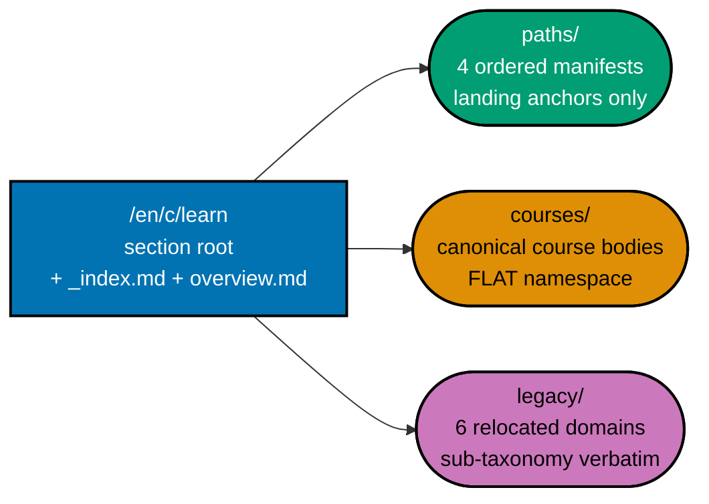
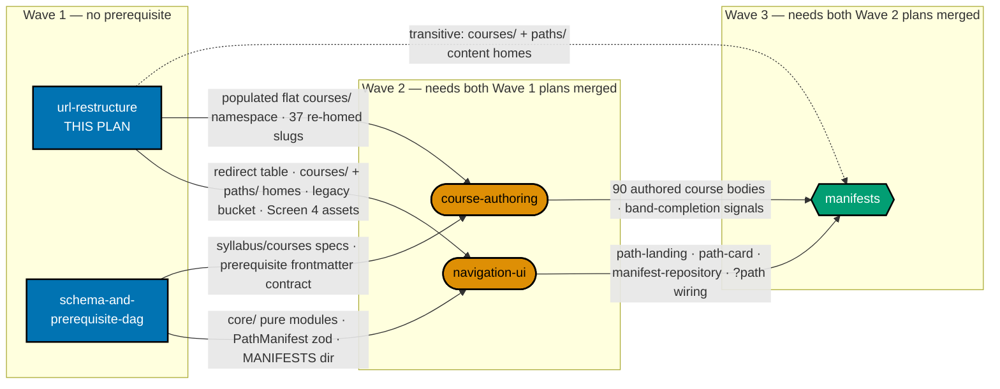

# ayokoding-www Learning-Path URL Restructure — courses/, legacy/, and the redirects that hold them together

This plan owns the **URL and IA layer** of the ayokoding-www learn section. It re-homes the 33
shipped topics + 4 existing capstones into a flat `courses/` namespace with per-course redirects,
relocates the six remaining `en/learn/` subject domains into a new `legacy/` bucket behind per-domain
308 prefix rules, creates the `courses/` and `paths/` content homes, and closes
`/{locale}/c/learn/` at **exactly three** structural buckets: `paths/`, `courses/`, `legacy/`.

It is **Wave 1** of a five-plan split of the closed `shared-course-library-and-learning-paths` plan
and has **no plan-level prerequisite** — it starts immediately.

> **Cross-plan source of truth** — The authoritative per-course and per-path specs live in
> `plans/<stage>/ayokoding-learning-path-02-schema-and-prerequisite-dag/syllabus/`. Do not copy
> them; do not author from any other source. Cross-plan `syllabus/` paths are written in this plan as
> inline code rather than as markdown links, because the sibling plan's stage folder
> (`backlog/` → `in-progress/` → `done/YYYY-MM-DD__…`) changes over the lifecycle and a hard link
> would rot exactly while this plan still needs it.

## What this plan delivers

| Deliverable                                 | Surface                                                                            |
| ------------------------------------------- | ---------------------------------------------------------------------------------- |
| Flat course namespace                       | `apps/ayokoding-www/content/en/learn/courses/` — 37 re-homed bundles + `_index.md` |
| Paths content home                          | `apps/ayokoding-www/content/en/learn/paths/_index.md` — 2×2 grid, room for four    |
| Per-course re-home redirects                | `apps/ayokoding-www/src/redirects/` — 37 old-URL → canonical-URL rules             |
| Legacy bucket                               | `apps/ayokoding-www/content/en/learn/legacy/` — 1,148 `.md` relocated verbatim     |
| Per-domain 308 prefix module                | `apps/ayokoding-www/src/redirects/learn-three-bucket.ts` — 12 rules + unit test    |
| Legacy landing + rewritten section overview | `legacy/_index.md`, `en/learn/overview.md`                                         |
| Screen 4 design funnel                      | `prd.md` §Screen 4 + `assets/legacy-landing-option-{a,b}-{mobile,tablet,desktop}`  |

Explicitly **not** in this plan: the `course-paths` feature code, the `PathManifest` schema, any
manifest file, any path landing renderer, any authored course body. Those belong to the four sibling
plans named in [Depends-on](#depends-on).

## The three-bucket learn section

The source plan converted **one** of the seven domains under `en/learn/` (`fundamentally-strong`)
and left six in place — a top level mixing two structural buckets with six subject domains, which is
neither the old IA nor the new one. This plan closes the section at **exactly three** structural
buckets (DD-40):

| Bucket     | URL shape                                   | Contents                                                             |
| ---------- | ------------------------------------------- | -------------------------------------------------------------------- |
| `paths/`   | `/en/c/learn/paths/<arc>/<role-or-subject>` | The four ordered path manifests (landing anchors only)               |
| `courses/` | `/en/c/learn/courses/<course-id>`           | Canonical, path-neutral course bodies, **flat** namespace            |
| `legacy/`  | `/en/c/learn/legacy/<domain>/<…verbatim…>`  | **NEW** — the six remaining domains, **1,148** `.md` [Repo-grounded] |



The relocation is a **prefix move, not a rewrite**: each domain keeps its sub-taxonomy verbatim, so
the redirect is a **per-domain 308 prefix rule** (six domains × two inbound tiers = 12 rules for
`en`), never 1,713 per-file rules and never a blanket `/en/c/learn/:path*` rule — which would swallow
`courses/` and `paths/` and self-recurse (DD-41, DD-42). `fundamentally-strong/` does **not** appear
in the bucket module: its 37 topic directories collapse into flat `courses/` bodies with **per-course**
redirects, which this plan also owns (DD-43). The `id` locale is left untouched and the deferral is
recorded explicitly (DD-45). Navigation needs **zero** code changes — sidebar, browse index, section
cards, search, `sitemap.ts`, and `feed.xml` are all tree-derived (DD-44).

Condensed target tree (full BEFORE/AFTER trees, source tree, and URL-mapping table in
[tech-docs](./tech-docs.md#content-tree--after-target-state); markers: `✓` verified on disk, `+` new,
`→` moved by `git mv`, `~` changed):

```text
apps/ayokoding-www/content/en/learn/                ✓  1,713 .md today
├── _index.md                                       ~  machine-regenerated
├── overview.md                                     ~  hand-rewritten: 6 domains → 3 buckets
├── paths/                                          +  BUCKET 1
│   └── _index.md                                   +  paths hub (2×2 grid, room for 4 cards)
├── courses/                                        +  BUCKET 2 — flat, one dir per course-id
│   ├── _index.md                                   +  library landing
│   └── just-enough-python/  advanced-algorithms/  capstone-solid-core/  …   →  37 re-homed
└── legacy/                                         +  BUCKET 3 — relocated, not rewritten
    ├── _index.md                                   +  REQUIRED (see DD-44)
    ├── software-engineering/                       →  979 .md, sub-taxonomy verbatim
    ├── artificial-intelligence/                    →   55 .md
    ├── information-security/                       →   51 .md
    ├── personal-development/                       →   50 .md
    ├── it-governance/                              →    9 .md
    └── business/                                   →    4 .md
```

**Six decisions are still open** and are recorded with recommended defaults rather than silently
applied — `legacy/` as staging pen vs archive (Q-A), `id` scope (Q-B) and segment translation (Q-C),
`legacy/` SEO treatment (Q-D), the three residual `fundamentally-strong` index pages (Q-E), and
`en/learn/overview.md` (Q-F). **This plan owns all six verbatim**; the navigation-UI and
course-authoring plans carry one-line "blocked-on" notes pointing back here. See
[tech-docs §Open Questions](./tech-docs.md#open-questions--learn-section-scope-extension-unresolved).

## Depends-on

| Direction      | Plan (full folder name)                                  | Relationship                                         |
| -------------- | -------------------------------------------------------- | ---------------------------------------------------- |
| **Upstream**   | _(none)_                                                 | Wave 1 — no plan-level prerequisite                  |
| Wave-1 sibling | `ayokoding-learning-path-02-schema-and-prerequisite-dag` | Parallel, not blocking — shared frontmatter contract |
| **Downstream** | `ayokoding-learning-path-03-navigation-ui`               | Hard — needs this plan merged                        |
| **Downstream** | `ayokoding-learning-path-04-course-authoring`            | Hard — needs this plan merged                        |
| Downstream     | `ayokoding-learning-path-05-manifests`                   | Transitive, via the two plans above                  |



**Accessibility note.** The diagram never relies on colour alone. Wave membership is carried by node
shape (rectangle / stadium / hexagon) **and** by the three labelled subgraph containers. Edge kind is
carried by line style (solid = hard blocking edge; dotted = transitive artefact need already
satisfied by a solid path) **and** by the edge labels. Fills use the verified accessible palette with
black borders and WCAG-AA-contrasting text, per the
[Color Accessibility Convention](../../../repo-governance/conventions/formatting/color-accessibility.md).

## Implementation Sequence and Prerequisites

This plan is **Wave 1** of a five-plan split of the closed
`shared-course-library-and-learning-paths` plan. It owns the **URL and IA layer**: the flat
`courses/` namespace, the `legacy/` bucket, both redirect modules, and the additive legacy
`_index.md` browse.

### Upstream — what must exist before this plan starts

**None.** This plan has no plan-level prerequisite and starts immediately.

| Upstream plan | Artefact needed | Why |
| ------------- | --------------- | --- |
| _(none)_      | —               | —   |

**Start precondition (checkable):** `origin/main` is green and
`test -d apps/ayokoding-www/content/en/learn/fundamentally-strong/software-engineer` returns 0
(the re-home source tree is still in place).

### Downstream — what this plan hands off, and to whom

| Downstream plan                                                          | Artefact handed over                                                                 | Consumed by                                                                             |
| ------------------------------------------------------------------------ | ------------------------------------------------------------------------------------ | --------------------------------------------------------------------------------------- |
| `ayokoding-learning-path-03-navigation-ui`                               | `apps/ayokoding-www/src/redirects/` per-course re-home redirect table (37 rules)     | its no-path regression guard and its Phase-4 e2e redirect assertion                     |
| `ayokoding-learning-path-03-navigation-ui`                               | `apps/ayokoding-www/content/en/learn/courses/_index.md` and `.../paths/_index.md`    | the paths hub and path landings have nowhere to render without them                     |
| `ayokoding-learning-path-03-navigation-ui`                               | `apps/ayokoding-www/src/redirects/learn-three-bucket.ts` + the six relocated domains | the nav regression sweep must run against the final three-bucket tree, not a hybrid one |
| `ayokoding-learning-path-03-navigation-ui`                               | `prd.md` Screen 4 section + the six `assets/legacy-landing-option-*-*.png` renders   | closes the DD-47 30-render matrix across the two plans                                  |
| `ayokoding-learning-path-03-navigation-ui`                               | Open Questions **Q-A … Q-F** (this plan owns all six verbatim)                       | Q-E gates the three residual `fundamentally-strong` index pages the nav plan renders    |
| `ayokoding-learning-path-04-course-authoring`                            | 37 re-homed course bundles occupying the flat `courses/` namespace                   | the 23-new-slug collision check is only meaningful against a populated namespace        |
| `ayokoding-learning-path-05-manifests` _(transitive, via the two above)_ | canonical `/en/c/learn/courses/<id>` URLs for the 33 topics + 4 capstones            | the first manifest's `courseOrder` references exactly these IDs                         |

### Wave-1 sibling coordination (not a dependency)

`ayokoding-learning-path-02-schema-and-prerequisite-dag` runs in parallel. This plan writes
`prerequisites: [course-id, ...]` frontmatter into each re-homed `_index.md`; that field's canonical
shape is owned by the schema plan and is reproduced verbatim in this plan's `tech-docs.md`. If the
two statements ever diverge, the schema plan's wins.

### Handoff signal

This plan is done for downstream purposes when its final PR is **merged to `origin/main`** AND
`ls apps/ayokoding-www/content/en/learn` lists exactly `_index.md`, `courses`, `legacy`,
`overview.md`, `paths`.

## Build order (inherited)

Reproduced verbatim from the source plan. **Do not paraphrase** — the amendment chain
(DD-15 → DD-27) is load-bearing, and a paraphrase that drops "amended by DD-27" reads as
authoritative while being stale. Canonical owner for citation purposes:
`ayokoding-learning-path-05-manifests` (it is the plan whose phase ordering DD-27 most directly
constrains).

- **DD-15 · Build order (locked; amended 2026-07-20 by DD-27 — see below).** Group A (architecture +
  `course-paths` UI — hard prerequisite) → `interview-ready` MVP ships first (re-home 1–33, author the
  4 interview courses + `capstone-interview-loop`, one manifest, deploy) → `immediately-effective`
  manifest → `fundamentally-strong` manifest → backfill topics 34–94 native into `courses/` as the
  library fills. **DD-27 amends steps 2 onward**: the MVP is narrowed to an architecture smoke test
  only (interview-course authoring is no longer bundled into it), and the fourth path is inserted as
  authoring priority #1 immediately after the MVP.
- **DD-27 · Build order amended: the fourth path is authoring priority #1, behind an
  architecture-smoke-test-only MVP (D7, amends DD-15).** Locked order: **Group A** (architecture + UI,
  unchanged hard prerequisite) → **`interview-ready` MVP, narrowed to an architecture smoke test only**
  (ships against topics 1–33, already live on disk; proves routing, manifest loading, `?path` context,
  prev/next, breadcrumb, and prerequisite display against real content, in days not months —
  authoring the 4 NEW interview courses + `capstone-interview-loop` is **no longer bundled into this
  MVP gate**) → **`software-engineer-to-ai-engineer`** (authoring priority #1 for all authoring effort)
  → **`immediately-effective/software-engineer`** manifest → **`fundamentally-strong/software-engineer`**
  manifest → **backfill topics 34–94**. Rationale (preserved from the original build-order decision):
  nothing in the AI path exists on disk (~17 courses); making it literally first — ahead of even the
  MVP — would mean nothing ships until all 17 are authored, with the UI architecture unvalidated the
  entire time. Ordering it immediately after an architecture-smoke-test MVP gives the AI path first
  claim on every unit of real authoring effort while keeping the architecture proven early against
  content that already exists.

**How the five-way split maps onto that order.** Group A's architecture work splits across
`ayokoding-learning-path-02-schema-and-prerequisite-dag` (the pure core) and
`ayokoding-learning-path-03-navigation-ui` (the rendering layer); this plan carries Group A's IA
scaffolding (the two content homes) plus the whole re-home and relocation. The MVP manifest and every
later manifest belong to `ayokoding-learning-path-05-manifests`; the backfill belongs to
`ayokoding-learning-path-04-course-authoring`. The wave table in [Depends-on](#depends-on) is the
split's expression of DD-15/DD-27, not a replacement for it.

## Decisions Locked (inherited)

Two entries below are **this plan's own** (DL-8, DL-16); two are **cross-cutting** and are reproduced
verbatim in all five split plans (DL-7, DN-11). The source plan's list has **17** entries —
`DL-1`…`DL-10`, `DN-11`, `DL-12`…`DL-17`. **`DL-11` does not exist**; the slot is occupied by `DN-11`,
a Delivery Note. Do **not** renumber to close the gap — `DN-11` is cited by ID in two places and both
citations must survive.

### Owned by this plan

- **DL-8 · URL model.** Courses at `/en/c/learn/courses/<course-id>` and path landings at
  `/en/c/learn/paths/<path-id>`, both via the existing `/c/[...slug]` content route; `?path=<path-id>`
  carries path context. (Renamed from the prior `/en/courses/<id>` + `/en/path/...` forms.) **Decided.**
- **DL-16 · Whole-section IA revamp — `/{locale}/c/learn/` closes at three structural buckets
  (2026-07-21 scope extension).** Summary of the decision record folded into
  [tech-docs.md DD-40 through DD-45](./tech-docs.md#design-decisions): the learn section ends with
  exactly `paths/`, `courses/`, and a new `legacy/` bucket, plus the section's own two hub files
  (DD-40); the legacy move is a **prefix relocation preserving each domain's sub-taxonomy verbatim**,
  rewriting no page (DD-41); redirects are **per-domain 308 prefix rules** in a new
  `apps/ayokoding-www/src/redirects/learn-three-bucket.ts`, with a blanket `/en/c/learn/:path*` rule
  explicitly FORBIDDEN and the `next.config.ts` ordering load-bearing (DD-42);
  `fundamentally-strong/` stays on its **per-course** re-home redirects and is excluded from the
  bucket module (DD-43); navigation needs **zero** code changes because the IA is tree-derived, with
  `legacy/_index.md` and `generated/search-data.json` named as the two surfaces that do not self-heal
  (DD-44); and the extension is **`en`-only**, with the `id` deferral recorded rather than implied
  (DD-45). Delivered by **Phase 3** in [delivery.md](./delivery.md). **Six questions remain OPEN**
  with recommended defaults — Q-A through Q-F in
  [tech-docs §Open Questions](./tech-docs.md#open-questions--learn-section-scope-extension-unresolved).
  **Decided 2026-07-21** (the six `Q-` items are explicitly _not_ decided).

### Cross-cutting (verbatim in all five split plans)

- **DL-7 · Build order — amended 2026-07-20, see DL-15 / tech-docs DD-27.** Deliver Group A
  (architecture + UI) first as a hard prerequisite; then an **interview-ready MVP that is an
  architecture smoke test only** (shipped against already-live topics 1–33, not the full interview
  cluster); then `immediately-effective/software-engineer-to-ai-engineer` (authoring priority #1); then
  the `immediately-effective/software-engineer` manifest; then the `fundamentally-strong/software-engineer`
  manifest; then backfill topics 34–94 native as the library fills. **Decided; amended 2026-07-20.**
- **DN-11 DECIDED — `[AI]` auto-merge (now the repo default).** `[AI]` merges each phase's PR
  automatically once the 3-cycle PR-Review Maker→Fixer Cycle and all quality gates are green — this
  plan declares no `[HUMAN]` merge gate. When DN-11 was first recorded, `pr-merge-protocol.md` still
  defaulted to a `[HUMAN]` merge, so the maintainer authorized AI-auto-merge for **this plan**
  (in-session): (a) it uses the SAME delivery methods as the now-closed sibling plan
  `fundamentally-strong-software-engineer`; and (b) no maintainer permission is needed to merge a PR
  once it has passed 3 review cycles and the PR quality gate. The protocol has since been changed so
  that `[AI]` merges by default and `[HUMAN]` is an explicit per-plan opt-in, making DN-11 a
  confirmation of the default rather than an override. Recorded here and in
  [delivery.md](./delivery.md#delivery-mode-worktree-to-pr).

## Provenance — where this plan came from

Split out of `plans/done/2026-07-21__shared-course-library-and-learning-paths/` (the source plan, retired by a
separate process). This plan inherits the source's Phases 5 and 5A whole, plus its own scoped copies
of the per-plan phases (0 and 13–17). Phase numbers are renumbered contiguously here; the mapping is:

| This plan | Source plan phase | Scope                                                               |
| --------- | ----------------- | ------------------------------------------------------------------- |
| Phase 0   | Phase 0 (scoped)  | Baseline + the re-home and legacy-bucket inventories, `id` baseline |
| Phase 1   | Phase 1 (partial) | `<COURSES>_index.md` + `<PATHS>_index.md` content homes             |
| Phase 2   | Phase 5           | Re-home 33 topics + 4 capstones, **plus** the per-course redirects  |
| Phase 3   | Phase 5A          | Six-domain relocation, 308 module, Screen 4 funnel                  |
| Phase 4   | Phase 13 (scoped) | Section + app verification, three-bucket sweep, redirect ordering   |
| Phase 5   | Phase 14 (scoped) | Manual UI verification + rule-15 three-tester retest                |
| Phase 6   | Phase 15 (scoped) | Final `origin/main` integration + CI                                |
| Phase 7   | Phase 16          | Knowledge Capture                                                   |
| Phase 8   | Phase 17 (scoped) | Plan Archival                                                       |

Two boundary corrections applied at split time, both settled and not to be re-litigated:

1. **The per-course re-home redirect table moved into this plan** (out of the navigation plan's
   phase). The source plan's Phase-5 confirm step read _"Confirm each re-homed course has its
   redirect (Phase 3)…"_ — Phase 3 belonged to a Wave-2 plan, so this plan could not pass its own
   gate. The redirect module is a `next.config.ts` redirect table with **zero** dependency on the
   `course-paths` feature, exactly like `learn-three-bucket.ts` which this plan already owns, and
   DD-42/DD-43 reason about the two modules together.
2. **The two content-home `_index.md` files moved into this plan** (out of the source's Phase 1).
   This plan's Phase-3 gate asserts `ls .../en/learn` lists exactly the three buckets plus two hub
   files, which is unsatisfiable unless `courses/_index.md` and `paths/_index.md` exist.

## Delivery Mode: worktree-to-pr

`worktree-to-pr` (the repo default, inherited from the source plan as a tier-2 plan field): work in
`worktrees/ayokoding-learning-path-01-url-restructure/`, open a draft PR per phase against `main`,
run the PR-Review Maker→Fixer Cycle (3 sequential CI-gated cycles), then `[AI]` merges automatically
once the review and all quality gates are green (**DN-11**, above). `ayokoding-www` is deployed to
`prod-ayokoding-www` after every merge. See [delivery.md](./delivery.md) for the `## Worktree` and
`## Delivery Mode` declarations and the PR-review-cycle steps.

## Navigation

- [Business Requirements (brd.md)](./brd.md) — WHY the section is closed at three buckets, who it
  serves, what the URL-breakage risk is.
- [Product Requirements (prd.md)](./prd.md) — personas, user stories, the 14 Gherkin acceptance
  criteria, product scope, and the **Screen 4 UI-design funnel** (legacy landing + page banner).
- [Technical Docs (tech-docs.md)](./tech-docs.md) — the three-bucket IA, BEFORE/AFTER content and
  source trees, the URL-mapping table, the two redirect modules, the ten design decisions this plan
  owns, and the six Open Questions Q-A…Q-F.
- [Delivery Checklist (delivery.md)](./delivery.md) — the phased executable checklist.
- [Learnings (learnings.md)](./learnings.md) — knowledge-capture running log.
- Per-course and per-path specs: `plans/<stage>/ayokoding-learning-path-02-schema-and-prerequisite-dag/syllabus/`
  — the catalog at `.../syllabus/courses/README.md` is the re-home inventory's reference; the path
  orderings at `.../syllabus/paths/README.md` belong to the manifests plan. **Never copied here.**
