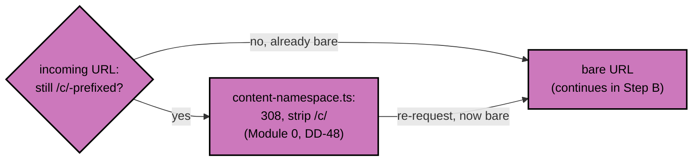
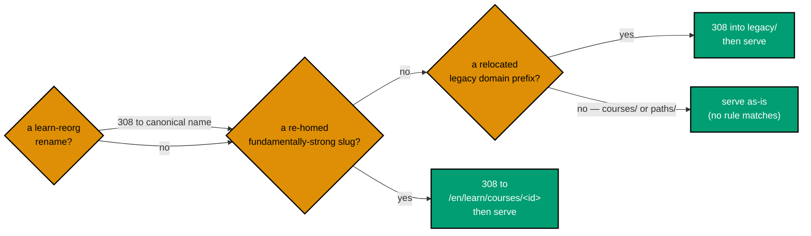
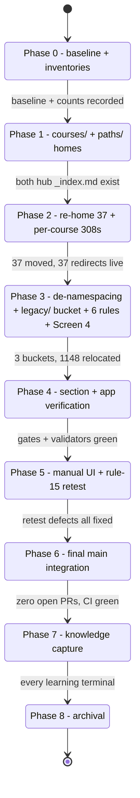
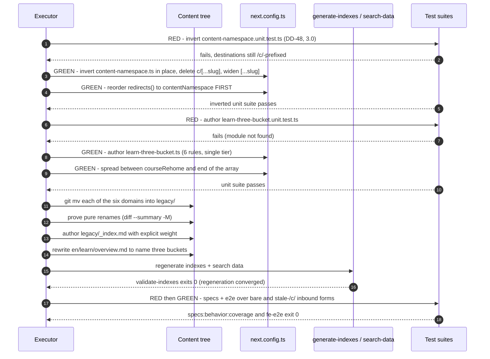

# Technical Docs — ayokoding-www Learning-Path URL Restructure

## Scope of this document

The **URL and IA layer** of the ayokoding-www learn section: the flat `courses/` namespace, the
`paths/` content home, the `legacy/` bucket, all four redirect modules this plan touches or adds
(`content-namespace.ts` inverted, `learn-reorg.ts` reordered around, `course-rehome.ts` and
`learn-three-bucket.ts` new), the site-wide de-namespacing (DD-48), and the additive legacy
`_index.md` browse. The `course-paths` feature architecture (pure core, shell components, `?path=`
context, manifest loading) is **not** documented here — it belongs to
`ayokoding-learning-path-02-schema-and-prerequisite-dag` and
`ayokoding-learning-path-03-navigation-ui`.

**UI-design-funnel**: this plan is UI-bearing (Screen 4 — the legacy-bucket landing and per-page
banner). The complete funnel record — low-fi alternatives at three viewports, the responsive strategy,
the R5 grounding note, the R7 prior-art citation, the hi-fi finalist plan, and the rationale table —
lives in [prd.md §UI-Design-Funnel](./prd.md#ui-design-funnel--screen-4--legacy-bucket-landing-and-page-banner),
per the placement rule. It is not duplicated here.

## Ground-truth inventory (measured 2026-07-21, re-verified at authoring)

`en/learn/` holds **1,713** `.md` files across seven top-level domains, plus its own `_index.md` and
`overview.md` [Repo-grounded — `find apps/ayokoding-www/content/en/learn -name '*.md' | wc -l`].
Content root is `apps/ayokoding-www/content/`; the route
`src/app/[locale]/(content)/[...slug]/page.tsx` serves a content path `en/learn/X` at
`/en/learn/X` [Repo-grounded].

| Domain under `en/learn/`  | `.md` files | Disposition                                   |
| ------------------------- | ----------- | --------------------------------------------- |
| `fundamentally-strong`    | 563         | → `courses/` (per-course re-home; DD-2/DD-43) |
| `software-engineering`    | 979         | → `legacy/software-engineering`               |
| `artificial-intelligence` | 55          | → `legacy/artificial-intelligence`            |
| `information-security`    | 51          | → `legacy/information-security`               |
| `personal-development`    | 50          | → `legacy/personal-development`               |
| `it-governance`           | 9           | → `legacy/it-governance`                      |
| `business`                | 4           | → `legacy/business`                           |

The six relocated domains total **1,148** `.md` [Repo-grounded — the six rows above sum to 1,148].
`fundamentally-strong/` itself contains only `_index.md`, `software-engineer/_index.md`,
`software-engineer/overview.md`, and **37 already-built course-shaped directories** [Repo-grounded —
`ls apps/ayokoding-www/content/en/learn/fundamentally-strong/software-engineer` returns 39 entries:
2 files + 37 directories, re-verified at authoring time]. The full catalog target is **127** courses,
so `courses/` starts with these 37 real bodies and grows through
`ayokoding-learning-path-04-course-authoring` — the bucket is deliberately under-filled at first, not
broken.

The `id` tree is much smaller: `id/belajar/` holds **one** domain (`manusia`, 50 `.md`) plus
`_index.md`, `ikhtisar.md`, and `perkenalan.md` — **53** `.md` in total [Repo-grounded —
`find apps/ayokoding-www/content/id/belajar -name '*.md' | wc -l`]. Note the per-locale
**section-slug asymmetry**: `learn` (en) vs `belajar` (id), already load-bearing in
`content-namespace.ts`, `LOOSE_PAGE_ALLOWLIST`, and `LANDING_SECTION_OVERRIDES` [Repo-grounded].

## De-namespacing — retiring the `/c/` content route (DD-48)

**Scope note (read before Learn-Section IA below).** This section is **site-wide**, not
learn-scoped: it retires the `/c/` content namespace for **every** currently-namespaced section —
`en/learn`, `en/rants`, `id/belajar`, `id/celoteh`, `id/konten-video` — reversing the routing
decision `plans/done/2026-06-22__ayokoding-www-ia-navigation-revamp/` made (that plan's DD-1/DD-2/DD-3).
The three-bucket model in the next section (`paths/`/`courses/`/`legacy/`) is `en/learn`-only and
layers **on top of** the de-namespaced URL model this section establishes; the two are orthogonal
axes and neither implies the other. In particular: de-namespacing `id/belajar` (this section) is
**not** the same decision as extending the three-bucket shape to `id` (DD-45/Q-B, still deferred,
still out of scope) — a reader must not conflate the two.

### Why the direction inverts, not supplements

`content-namespace.ts` currently 308s **into** `/c/`: `/en/learn/:path*` → `/en/c/learn/:path*`, and
symmetrically for the other four sections [Repo-grounded —
`apps/ayokoding-www/src/redirects/content-namespace.ts`]. De-namespacing needs the **opposite**
direction. **If both rule sets existed at once, `/en/learn/x` → `/en/c/learn/x` → `/en/learn/x` would
be an infinite 308 loop that takes the whole content tree down.** The module is therefore **inverted
in place**, never supplemented: the same five rules, same file, same test file, with `source` and
`destination` swapped —

```ts
// BEFORE (current production): { source: "/en/learn/:path*", destination: "/en/c/learn/:path*", permanent: true }
// AFTER  (this plan):          { source: "/en/c/learn/:path*", destination: "/en/learn/:path*", permanent: true }
```

— for all five section rules (`en/learn`, `en/rants`, `id/belajar`, `id/celoteh`, `id/konten-video`).
**No rule in any of this plan's four redirect modules may have a `/c/`-containing destination** —
this is the standing invariant the loop hazard demands, and it is asserted as a falsifiable unit-test
property (below) and as a Phase 3 gate check, not left as an unstated expectation.

### File inventory (measured; do not re-derive, re-verify what an acceptance clause cites)

24 non-plan files reference the `/c/` segment: **21** under `apps/ayokoding-www/src/`, **3** Gherkin
features, and **3** step-definition files. `apps/ayokoding-www-be-e2e` has zero — no work there.

| Group               | Files                                                                                                                                                      | Disposition                                                                                                                                                                                          |
| ------------------- | ---------------------------------------------------------------------------------------------------------------------------------------------------------- | ---------------------------------------------------------------------------------------------------------------------------------------------------------------------------------------------------- |
| Route (deleted)     | `app/[locale]/(content)/c/[...slug]/page.tsx` + `page.unit.test.ts`                                                                                        | **Removed** — logic merges into the widened bare `[...slug]/page.tsx` below                                                                                                                          |
| Route (relocated)   | `app/[locale]/(content)/c/page.tsx` (the browse index, listing top-level sections)                                                                         | **Moved** to `app/[locale]/(content)/browse/page.tsx` — `/c` has no bare home to inherit; `browse` is the closest one-word equivalent to the existing "Browse" breadcrumb label                      |
| Route (widened)     | `app/[locale]/(content)/[...slug]/page.tsx`                                                                                                                | **Changed** — absorbs the deleted route's full-content-tree `generateStaticParams`, canonical-URL, and breadcrumb logic (see below)                                                                  |
| Core (changed)      | `features/content/core/content-url.ts` + `.test.ts`                                                                                                        | `contentUrl()` drops the `/c/`-prefix branch entirely — see below                                                                                                                                    |
| Core (doc-only)     | `features/content/core/slug.ts` + `.test.ts`, `features/content/core/content-link-rewrite.ts`                                                              | No logic change — both delegate to `contentUrl()`/plain joins; their doc comments name the retired `/c/[...slug]` route and the `/c/` namespace and must stop doing so                               |
| Redirect (inverted) | `redirects/content-namespace.ts` + `content-namespace.unit.test.ts`                                                                                        | Inverted in place — see above; **filename kept** (see below)                                                                                                                                         |
| Navigation shell    | `breadcrumb.tsx` + `.test.tsx`, `prev-next.test.tsx`, `sidebar-tree.test.tsx`, `resizable-sidebar.test.tsx`                                                | `breadcrumb.tsx`'s `contentHrefs` prop and its `hrefFor` branch become a no-op once `contentUrl()` never differs from the bare form — collapse it (see below); the rest are test-fixture URL updates |
| Content shell       | `browse-index.tsx` + `.test.tsx`, `section-card.test.tsx`                                                                                                  | `browse-index.tsx` links to the relocated `browse/` route instead of `/c`; the two test files update fixture URLs                                                                                    |
| Test-fixture only   | `app/sitemap.unit.test.ts`, `app/feed.xml/route.unit.test.ts`, `features/search/shell/search-dialog.test.tsx`, `features/app-shell/shell/landing.test.tsx` | Production `sitemap.ts` / `feed.xml/route.ts` already derive every URL from `contentUrl()` (DD-44) — **no production code change** here, only fixture URLs in these four test files                  |
| Gherkin             | `content-namespace-redirects.feature`, `ia-navigation-revamp.feature`, `learn-reorg-redirects.feature`                                                     | Content inverts to match; **filenames kept** (see below)                                                                                                                                             |
| Step definitions    | `content-namespace.steps.ts`, `ia-navigation-revamp.steps.ts`, `landing.steps.ts`                                                                          | Step bodies updated to match the inverted scenarios; no rename                                                                                                                                       |

### Naming decisions (so sibling plans are not silently broken)

- **`content-namespace-redirects.feature` keeps its filename**, even though its content inverts.
  Three other plan folders in this five-way split reference this filename as a landmark in their own
  `<NAVSPECS>` path constant (this plan's own [delivery.md §Parallelization Model](./delivery.md#parallelization-model)
  does too — "the three-bucket Gherkin lands beside `content-namespace-redirects.feature`"). Renaming
  it would silently break every one of those cross-plan references. The file's _content_ changing
  while its _name_ does not is exactly the same shape as `content-namespace.ts` itself (module kept,
  behavior inverted) — a reader who has not re-read the file after the inversion is the only one at
  risk, and that is an accepted, bounded cost against the alternative of breaking cross-plan links.
- **`content-namespace.ts` and `content-namespace.unit.test.ts` keep their filenames** for the same
  reason — this plan's own `<REDIR>` path constant and `next.config.ts`'s import statement both cite
  the module by this name today, and every sibling plan that mentions the module (as prior art, e.g.
  DD-42's "the same hazard `content-namespace.ts` already warns about") cites it by this name too.

### `contentUrl()` and `LOOSE_PAGE_ALLOWLIST` after the merge

`contentUrl()` currently branches: loose top-level pages (per-locale `LOOSE_PAGE_ALLOWLIST`) render
bare (`/{locale}/{slug}`); everything else (content-tree slugs) renders `/c/`-prefixed
(`/{locale}/c/{slug}`) [Repo-grounded — `apps/ayokoding-www/src/features/content/core/content-url.ts`].
Once nothing is ever `/c/`-prefixed, that branch collapses: `contentUrl()` becomes `/{locale}` for the
root slug and `/{locale}/{normalizeSlug(slug)}` for everything else, uniformly — **no case ever looks
at `LOOSE_PAGE_ALLOWLIST` inside `contentUrl()` again**, and its one existing call site, `isLoosePage()`,
has no other caller [Repo-grounded — `isLoosePage`'s only production call site is inside `contentUrl()`
itself], so `isLoosePage()` is dead code post-merge and is removed with it.

`LOOSE_PAGE_ALLOWLIST` itself is **not** dead, though its role narrows to exactly one remaining
question: **does the merged route's `generateStaticParams` still need it to enumerate the two loose
pages, or does the content index already carry them?** The retired bare route imported
`LOOSE_PAGE_ALLOWLIST` directly (not via `isLoosePage`) to build its static-params list, while the
retired `c/[...slug]` route enumerated the **entire** `index.contentMap` for the locale with no
loose-page exclusion mentioned in its own comment. Whether the loose pages are already members of
that map is not established by this document — it is a delivery-time verification step (Phase 3.0),
not an assumed fact: if they are already members, `LOOSE_PAGE_ALLOWLIST`'s last production call site
disappears and it is removed entirely; if they are not, the merged `generateStaticParams` unions
`index.contentMap`'s slugs with `LOOSE_PAGE_ALLOWLIST[locale]` and the constant survives for exactly
that purpose. Either outcome is a **coherent, correctly-functioning** merged route — the uncertainty
is only about which of the two files still imports the constant afterward, never about whether the
route works.

`breadcrumb.tsx`'s `contentHrefs` prop exists **only** to choose between `contentUrl()` (content-tree
hrefs) and a plain `/{locale}/{slug}` join (non-content hrefs) [Repo-grounded —
`apps/ayokoding-www/src/features/navigation/shell/breadcrumb.tsx` `hrefFor`]. Once `contentUrl()`
**is** the plain join for every content slug, the two branches of `hrefFor` return identical strings
for every content href, making the prop a no-op distinction. It is collapsed: `hrefFor` always resolves
through `contentUrl()`, and the `contentHrefs` prop and its call-site plumbing are removed.

### The `/c` browse index has no bare home to inherit

`c/page.tsx` (the section-browse index at `/{locale}/c`, listing top-level sections such as `learn`,
`rants`) is a **third** route under `c/`, distinct from the catch-all — the file-inventory table above
does not derive it from a literal `/c/` grep (its own canonical-URL string, `` `/${locale}/c` ``, has
no trailing slash) but it is unambiguously part of the retired namespace by construction. There is no
bare URL it can silently inherit (`/{locale}` is already the locale home, rendered by
`app/[locale]/page.tsx`), so it **moves** to `app/[locale]/(content)/browse/page.tsx`, served at
`/{locale}/browse` — the closest one-word equivalent to its own existing "Browse" breadcrumb label
(`t(locale, "browseTitle")`), avoiding a fabricated new information-architecture decision beyond what
de-namespacing itself requires. The "Browse" breadcrumb segment (currently only present in the retired
`c/[...slug]` route's `buildBreadcrumbs`, `href: /${locale}/c`) is carried into the merged route's
breadcrumb builder and repointed at `/${locale}/browse`.

### Collision verdict — widening `[...slug]` against `tools/` and the locale root

**Verdict: no collision, on structural grounds — verified against the actual route tree, not
asserted.** [Repo-grounded — `find apps/ayokoding-www/src/app/[locale] -maxdepth 2`]:

- `app/[locale]/page.tsx` renders the exact-match locale root (`/{locale}`, zero path segments).
  Next.js catch-all segments (`[...slug]`) require **at least one** segment by definition, so this
  route can never be reached by `[...slug]` regardless of widening — no collision is possible, not
  merely unlikely.
- `app/[locale]/tools/page.tsx` and `app/[locale]/tools/cost-of-living-calculator/page.tsx` are
  **statically-named sibling directories** of the `(content)` route group, both living directly under
  `app/[locale]/`. Next.js file-system routing always resolves a request to the most specific matching
  segment in the tree; a literal directory named `tools` at the same level as `(content)` intercepts
  `/{locale}/tools*` before the router ever considers `(content)/[...slug]`, independent of what
  `[...slug]` itself widens to serve. Widening `[...slug]`'s **handler logic** (to also serve
  content-tree slugs, not just loose pages) does not change this — it is a routing-tree fact, not a
  handler-logic fact, so the merge under DD-48 cannot introduce this collision.
- The remaining theoretical collision class — a content slug or a `LOOSE_PAGE_ALLOWLIST` entry
  literally named `tools` or `browse` — is checked directly: neither `tools` nor `browse` appears in
  `LOOSE_PAGE_ALLOWLIST` (`en: ["about-ayokoding", "terms-and-conditions"]`,
  `id: ["tentang-ayokoding", "syarat-dan-ketentuan"]`) [Repo-grounded — `content-url.ts`], and no
  top-level content directory is named `tools` or `browse` in either locale
  [Repo-grounded — `ls apps/ayokoding-www/content/en apps/ayokoding-www/content/id`: `learn`, `rants`
  for `en`; `belajar`, `celoteh`, `konten-video` for `id`]. This is re-asserted as a delivery-time
  negative check in Phase 3.0, not left as a one-time authoring-time observation.

### Churn consequence — sequenced to minimize double-churn, not eliminate it

Every relocated or re-homed page's RSS `<guid>` changes with its URL (already an accepted, one-time
cost of the six-domain relocation and the 37-course re-home, per
[brd.md's business risks](./brd.md#business-risks-and-mitigations) and
[prd.md's product-level risks](./prd.md#product-level-risks)). De-namespacing is a **second**
URL-changing event layered on top, and landing it in the wrong phase would double that churn for far
more pages than necessary. **This plan lands the inversion inside Phase 3**, atomically with the
six-domain relocation, rather than earlier:

- The **1,148** legacy-relocated pages change URL **once** — directly from their old namespaced
  domain address to their new bare `legacy/` address — because both changes land in the same commit.
- `en/rants` and `id`'s three untouched sections (`belajar`, `celoteh`, `konten-video`) change URL
  **once** — namespaced to bare — regardless of phase placement, since no other change touches them.
- The **37** re-homed courses are the one population that **cannot** avoid a second change under any
  phase placement that keeps "Phase 2 lands before Phase 3" (the existing sequencing rule, itself
  required so `en/learn/` is never transiently `legacy/`-only): Phase 2 already moves them once
  (`fundamentally-strong/software-engineer/<slug>` → `courses/<course-id>`, still `/c/`-prefixed at
  that point), and Phase 3's inversion changes them a second time (namespaced `courses/<id>` → bare
  `courses/<id>`). Landing the inversion **earlier** (before Phase 2) does not remove this
  double-churn — it merely moves which phase causes the second hop — and it would **additionally**
  double-churn all 1,148 legacy pages the same way, which is strictly worse. Landing it in Phase 3 is
  therefore the ordering that **minimizes** the double-churn population, not the one that eliminates
  it: **37** pages accept a second `<guid>` change, an explicitly accepted, bounded cost.

### Testing-strategy naming inheritance

The de-namespacing behavior is asserted at the same levels the existing plan already uses for
`content-namespace.ts` (unit + specs + e2e), per [Testing strategy](#testing-strategy) — no new
testing tier is introduced.

## Canonical course home + URL (DD-2)

- **Home**: `apps/ayokoding-www/content/en/learn/courses/<course-id>/`.
- **URL**: `contentUrl` maps a content slug `learn/courses/<course-id>` to
  `/{locale}/learn/courses/<course-id>` [Repo-grounded —
  `apps/ayokoding-www/src/features/content/core/content-url.ts`:
  `contentUrl("en", "learn/courses/x")` → `/en/learn/courses/x`], so a course resolves at
  **`/en/learn/courses/<course-id>`**.
- **Migration**: existing bundles live at
  `content/en/learn/fundamentally-strong/software-engineer/<slug>/` today [Repo-grounded]. Re-homing
  each into `content/en/learn/courses/<course-id>/` is a `git mv` of the folder plus a redirect from
  the old URL. The old `fundamentally-strong/software-engineer/` section name is freed, so the
  slash-form path IDs never clash with a course folder name.
- **Course ID = slug, unchanged.** The re-home renames no directory: `course-id` is exactly the
  existing slug. A re-home changes a body's URL (with a redirect) but never its ID.

## Prerequisite frontmatter contract (reproduced verbatim; canonical owner is the schema plan)

Each re-homed course `_index.md` gains this field. The **canonical statement of its shape is owned by
`ayokoding-learning-path-02-schema-and-prerequisite-dag`**, which builds the resolver that parses it.
It is reproduced here verbatim rather than linked because both plans are Wave 1 and merge
independently; if the two statements ever diverge, **the schema plan's wins**.

| Field                           | Meaning                                                                                                                                            |
| ------------------------------- | -------------------------------------------------------------------------------------------------------------------------------------------------- |
| `prerequisites: [course-id, …]` | **EVERY course declares this.** The union of all `prerequisites` edges forms the library's **prerequisite DAG**. Entry-point courses declare `[]`. |

Declared in each course `_index.md` frontmatter, naming only other library course IDs. This plan
writes the field into 37 files; it does **not** write the resolver, the DAG validator, or the page
component that surfaces it.

The field is **inert until a Wave-2 consumer reads it**, which is the whole hazard: a shape mismatch
between the two Wave-1 plans fails nothing during Wave 1 and surfaces later as an empty prerequisite
list on 37 course pages with a green build. The mitigation is this verbatim reproduction plus the
named canonical owner — not a dependency edge, which would collapse the wave structure.

## Learn-Section IA — the three-bucket model

When this plan lands, `/{locale}/learn/` has **exactly three** structural children and nothing else
(DD-40):

| Bucket     | URL shape                                 | What lives there                                                       |
| ---------- | ----------------------------------------- | ---------------------------------------------------------------------- |
| `paths/`   | `/en/learn/paths/<arc>/<role-or-subject>` | The four ordered path manifests' landing anchors                       |
| `courses/` | `/en/learn/courses/<course-id>`           | Canonical, path-neutral course bodies                                  |
| `legacy/`  | `/en/learn/legacy/<domain>/<…verbatim…>`  | **NEW** — everything under `/en/learn/` that is not yet course or path |

### Content tree — BEFORE (current reality, re-verified at authoring)

> **Marker legend** (used in every tree in this document): `✓` = **verified on disk** in the current
> commit; `+` = **NEW**, the plan creates it; `→` = **MOVED** by `git mv`, contents byte-identical;
> `~` = **CHANGED**, edited or machine-regenerated. Anything without a marker is an elision (`…`) or
> a comment. A reader never has to guess which nodes are today's reality and which are the target
> state.

```text
apps/ayokoding-www/content/
├── en/
│   ├── _index.md                                                  ✓
│   ├── about-ayokoding.md                                         ✓  loose page (not under /c)
│   ├── terms-and-conditions.md                                    ✓  loose page (not under /c)
│   ├── rants/                                                     ✓  sibling section — untouched
│   └── learn/                                                     ✓  1,713 .md total
│       ├── _index.md                                              ✓  machine-generated (generate-indexes)
│       ├── overview.md                                            ✓  hand-authored; links all 6 domains
│       ├── fundamentally-strong/                                  ✓  563 .md
│       │   ├── _index.md                                          ✓
│       │   └── software-engineer/                                 ✓  39 entries = 2 files + 37 dirs
│       │       ├── _index.md                                      ✓  spiral-ordered section index
│       │       ├── overview.md                                    ✓
│       │       ├── just-enough-python/                            ✓  1 of the 37 built course-shaped dirs
│       │       │   ├── _index.md                                  ✓
│       │       │   ├── learning/                                  ✓  (_index, overview, beginner,
│       │       │   │                                                 intermediate, advanced, capstone/, code/)
│       │       │   └── drilling/                                  ✓  (_index, overview, code/)
│       │       └── … 36 more course-shaped dirs …                 ✓  (advanced-algorithms, sql-essentials,
│       │                                                             capstone-solid-core, …)
│       ├── software-engineering/                                  ✓  979 .md
│       │   ├── _index.md                                          ✓
│       │   ├── overview.md                                        ✓
│       │   ├── programming-languages/                             ✓
│       │   │   ├── python/                                        ✓
│       │   │   │   └── by-example/                                ✓  (_index, overview, beginner,
│       │   │   │                                                     intermediate, advanced)
│       │   │   └── … c-sharp/ clojure/ dart/ elixir/ f-sharp/ golang/ java/ kotlin/ rust/ typescript/ …   ✓
│       │   └── … algorithms-and-data-structures/ automation-testing/ automation-tools/                   ✓
│       │         compilers-and-interpreters/ data/ development/ infrastructure/ networking/
│       │         platforms/ software-architecture/ system-design/ …
│       ├── artificial-intelligence/                               ✓  55 .md
│       ├── information-security/                                  ✓  51 .md
│       ├── personal-development/                                  ✓  50 .md
│       ├── it-governance/                                         ✓   9 .md
│       └── business/                                              ✓   4 .md
└── id/
    ├── _index.md                                                  ✓
    ├── celoteh/                                                   ✓  sibling section — untouched
    ├── konten-video/                                              ✓  sibling section — untouched
    └── belajar/                                                   ✓  53 .md (section slug is `belajar`, NOT `learn`)
        ├── _index.md                                              ✓
        ├── ikhtisar.md                                            ✓
        ├── perkenalan.md                                          ✓
        └── manusia/                                               ✓  50 .md — the locale's ONLY domain
```

### Content tree — AFTER (target state)

`en/learn/` ends with **exactly three structural buckets** plus the section's own two hub files
(DD-40, DD-45). Under `courses/` the namespace is **flat** — one directory per stable `course-id`,
with **no** arc, role, or subject nesting — which is what makes a course path-neutral (DD-2). Under
`legacy/` each relocated domain keeps its sub-taxonomy **byte-identical** (DD-41): compare the
`software-engineering/programming-languages/python/by-example/` branch below with the same branch in
the BEFORE tree — only the `legacy/` prefix differs.

```text
apps/ayokoding-www/content/
├── en/
│   ├── _index.md                                                  ✓  unchanged
│   ├── rants/                                                     ✓  unchanged
│   └── learn/                                                     ✓  section root — now closed (DD-40)
│       ├── _index.md                                              ~  regenerated by `generate-indexes`
│       ├── overview.md                                            ~  hand-rewritten: 6-domain inventory
│       │                                                             → 3-bucket orientation (DD-45 / Q-F)
│       │
│       ├── paths/                                                 +  BUCKET 1 — landing anchors only
│       │   └── _index.md                                          +  paths hub, 2×2 grid, room for 4 cards
│       │                                                             (the four per-path landings are
│       │                                                              authored by the manifests plan)
│       │
│       ├── courses/                                               +  BUCKET 2 — FLAT namespace, one dir per course-id
│       │   ├── _index.md                                          +  library landing
│       │   ├── just-enough-python/                                →  git mv from fundamentally-strong/software-engineer/
│       │   │   ├── _index.md                                      ~  + `prerequisites: [...]` added
│       │   │   ├── learning/                                      →  contents byte-identical
│       │   │   └── drilling/                                      →  contents byte-identical
│       │   ├── just-enough-nvim/                                  →
│       │   ├── advanced-algorithms/                               →
│       │   ├── sql-essentials/                                    →
│       │   ├── capstone-solid-core/                               →  (DD-20, already live on disk)
│       │   └── … 32 more re-homed dirs (37 total) …               →
│       │                                                             (net-new bodies land later, in
│       │                                                              ayokoding-learning-path-04-course-authoring)
│       │
│       └── legacy/                                                +  BUCKET 3 — relocated, NOT rewritten (DD-41)
│           ├── _index.md                                          +  REQUIRED: generate-indexes only rewrites
│           │                                                         existing section files; without it
│           │                                                         buildTreeForLocale synthesizes a weight:0
│           │                                                         node that sorts FIRST (DD-44).
│           │                                                         Carries the Q-D notice (prd Screen 4).
│           ├── software-engineering/                              →  979 .md — sub-taxonomy verbatim
│           │   └── programming-languages/python/by-example/       →  identical to the BEFORE branch;
│           │                                                         only the prefix moved
│           ├── artificial-intelligence/                           →  55 .md
│           ├── information-security/                              →  51 .md
│           ├── personal-development/                              →  50 .md
│           ├── it-governance/                                     →   9 .md
│           └── business/                                          →   4 .md
│                                                                     └─ 1,148 .md relocated in total
│
│       ── NOT PRESENT after the plan: fundamentally-strong/ ──
│          Its 37 course dirs become courses/; its three residual index pages
│          (_index.md, software-engineer/_index.md, software-engineer/overview.md) fold into the
│          fundamentally-strong/software-engineer path landing under Q-E's recommended answer.
│          It is NOT relocated into legacy/ — see DD-43.
│
└── id/                                            ⚠ CONDITIONAL on Q-B — rendered per its RECOMMENDED answer (A: out of scope)
    └── belajar/                                                   ✓  UNCHANGED — no bucket, no move, no redirect (DD-45)
        └── manusia/                                               ✓  50 .md — stays exactly where it is
```

**If Q-B is overturned** (maintainer picks option B or C), `id/belajar/` takes this shape instead —
segment names per [Q-C](#q-c--if-id-is-in-scope-are-the-bucket-segments-translated), shown here under
its recommended answer A (translated: `kursus` / `jalur` / `arsip`):

```text
└── id/belajar/                                    ⚠ ONLY IF Q-B resolves to B or C — not the recommended path
    ├── jalur/                                                     +  = paths/   — EMPTY today   [Q-B option B only]
    ├── kursus/                                                    +  = courses/ — EMPTY today   [Q-B option B only]
    └── arsip/                                                     +  = legacy/
        ├── _index.md                                              +
        └── manusia/                                               →  50 .md, sub-taxonomy verbatim
```

Under **Q-B option C** the two empty buckets (`jalur/`, `kursus/`) are omitted and only `arsip/` is
created. Either variant additionally requires `id` rule pairs in the redirect module and makes the
bucket URL shape per-locale, which the `course-paths` feature does not currently model — the cost
noted in [Q-C](#q-c--if-id-is-in-scope-are-the-bucket-segments-translated).

### Source tree — BEFORE and AFTER (`apps/ayokoding-www/src/`)

Same marker legend. Only the paths **this plan** touches are shown. Files the sibling plans create
(the whole `features/course-paths/` subtree) are marked as such and are **not** this plan's work.

**BEFORE** (re-verified at authoring):

```text
apps/ayokoding-www/
├── next.config.ts                                                 ✓  redirects(): [...learnReorg, ...contentNamespace]
└── src/
    ├── app/
    │   ├── sitemap.ts                                             ✓  iterates contentMap → contentUrl()
    │   ├── feed.xml/route.ts                                      ✓  iterates contentMap → contentUrl()
    │   └── [locale]/(content)/
    │       ├── [...slug]/page.tsx                                 ✓  NARROWED (2026-06-22 DD-2) to loose top-level
    │       │                                                         pages only, via LOOSE_PAGE_ALLOWLIST
    │       ├── c/page.tsx                                         ✓  browse index — TOP-LEVEL sections only
    │       └── c/[...slug]/page.tsx                               ✓  content route + buildBreadcrumbs()
    ├── features/
    │   ├── content/
    │   │   ├── core/{content-url.ts, tree-builder.ts, types.ts}   ✓  contentUrl / buildTrees / computePrevNext
    │   │   ├── core/slug.ts                                       ✓  normalizeSlug / slugFromSegments
    │   │   ├── core/content-link-rewrite.ts                       ✓  resolves in-body markdown links via contentUrl
    │   │   ├── core/landing-sections.ts                           ✓  LANDING_SECTION_OVERRIDES (top-level slugs)
    │   │   └── shell/{browse-index.tsx, section-card.tsx,         ✓
    │   │              index-generator.ts}                         ✓  generate-indexes: rewrites EXISTING section files
    │   ├── navigation/shell/{sidebar.tsx, sidebar-tree.tsx,       ✓
    │   │                     breadcrumb.tsx, prev-next.tsx}       ✓
    │   └── search/shell/generate-search-data.ts                   ✓  doc id = `${locale}:${slug}`
    └── redirects/
        ├── learn-reorg.ts                                         ✓  within-/en/learn/ renames
        ├── content-namespace.ts                                   ✓  bare → /c/ (FORWARD direction, current prod)
        └── content-namespace.unit.test.ts                         ✓  the pattern both new tests mirror
```

**AFTER** (target state — this plan's edits only):

```text
apps/ayokoding-www/
├── next.config.ts                                                 ~  redirects(): [...contentNamespace,
│                                                                     ...learnReorg, ...courseRehome,
│                                                                     ...learnThreeBucket]
│                                                                     ORDER IS LOAD-BEARING — see DD-42/DD-48
└── src/
    ├── app/
    │   ├── sitemap.ts                                             ✓  UNCHANGED code; emits 1,148+ changed URLs
    │   │                                                             (DD-44/DD-48 — includes the de-namespaced
    │   │                                                             site-wide URL set, not just legacy/)
    │   ├── feed.xml/route.ts                                      ✓  UNCHANGED code; <link> AND <guid> change
    │   │                                                             sitewide, not just for relocated pages
    │   └── [locale]/(content)/
    │       ├── [...slug]/page.tsx                                 ~  WIDENED (DD-48) — absorbs the deleted
    │       │                                                         c/[...slug] route's full-content-tree
    │       │                                                         generateStaticParams, canonical-URL, and
    │       │                                                         Browse-crumb logic; serves loose pages AND
    │       │                                                         content-tree slugs at one route
    │       ├── browse/page.tsx                                    +  NEW (DD-48) — c/page.tsx's browse index,
    │       │                                                         relocated; served at /{locale}/browse
    │       ├── c/page.tsx                                         −  REMOVED (DD-48) — moved to browse/page.tsx
    │       └── c/[...slug]/page.tsx                                −  REMOVED (DD-48) — logic merged into the
    │                                                                  widened [...slug]/page.tsx above
    ├── features/
    │   ├── content/core/content-url.ts                            ~  CHANGED (DD-48) — contentUrl() drops the
    │   │                                                              /c/-prefix branch entirely; isLoosePage()
    │   │                                                              removed (no caller left)
    │   ├── content/core/slug.ts                                   ~  DOC-ONLY (DD-48) — comment no longer names
    │   │                                                              the retired two-route split
    │   ├── content/core/content-link-rewrite.ts                   ~  DOC-ONLY (DD-48) — comment no longer names
    │   │                                                              the /{locale}/c/{slug} namespace
    │   ├── content/**  (everything else)                          ✓  UNCHANGED by this plan (tree-derived, DD-44)
    │   ├── navigation/shell/breadcrumb.tsx                        ~  CHANGED (DD-48) — contentHrefs prop and its
    │   │                                                              hrefFor branch removed (no-op post-merge);
    │   │                                                              Browse crumb repointed to /{locale}/browse
    │   ├── navigation/shell/**  (everything else)                 ✓  UNCHANGED by this plan
    │   ├── search/shell/generate-search-data.ts                   ✓  UNCHANGED code; `generated/search-data.json`
    │   │                                                             MUST be regenerated
    │   └── course-paths/                                          —  NOT THIS PLAN — created by the schema and
    │                                                                 navigation-ui plans
    └── redirects/
        ├── content-namespace.ts                                   ~  INVERTED IN PLACE (DD-48) — same 5 rules,
        │                                                              source/destination swapped; now runs FIRST
        ├── content-namespace.unit.test.ts                         ~  CHANGED — assertions invert (destination
        │                                                              never contains /c/; source always does)
        ├── learn-reorg.ts                                         ✓  UNCHANGED — must still run before the two
        │                                                              modules below (DD-42)
        ├── learn-three-bucket.ts                                  +  NEW — 6 rules, single tier: one per relocated
        │                                                              domain (DD-42, collapsed by DD-48 — the
        │                                                              /c-form tier is unreachable once
        │                                                              content-namespace always runs first)
        ├── learn-three-bucket.unit.test.ts                        +  NEW — mirrors content-namespace.unit.test.ts
        ├── course-rehome.ts                                       +  NEW — 37 per-course rules (DD-43)
        └── course-rehome.unit.test.ts                             +  NEW — asserts all 37 mappings + negatives
```

> **Module-naming note.** The source plan specified the per-course re-home redirects only as
> "a redirect … in `apps/ayokoding-www/src/redirects/`", without naming a file. `course-rehome.ts` /
> `course-rehome.unit.test.ts` are this plan's concrete choice, following the existing
> `<verb>-<noun>.ts` + `.unit.test.ts` naming of `learn-reorg.ts` and `content-namespace.ts`
> [Repo-grounded]. The name is not inherited from the source plan and may be changed at execution
> time as long as both files move together and `next.config.ts` is updated with them.

### URL mapping (old → new → covering rule)

Every row is a **308** (`permanent: true`). Every row's "old URL" is a **bare** address — under DD-48,
`content-namespace.ts` never leaves a `/c/`-form URL for any downstream rule below to see, so no row
needs its own `/c`-form twin (contrast the single-tier collapse this table reflects with the retired
two-tier design that used to appear here). A reader arriving with a **stale `/c`-bookmark** for any of
these URLs (e.g. `/en/c/learn/software-engineering/…`) gets there in exactly one extra hop, described
once in prose rather than once per row: `content-namespace.ts` strips the `/c/` segment first
(`/en/c/learn/software-engineering/…` → `/en/learn/software-engineering/…`), and the resulting bare
URL then matches whichever row below applies, normally.

| #   | Old URL                                                                                         | New URL                                                                                     | Covering rule                                                                                                                                                                                                                                          |
| --- | ----------------------------------------------------------------------------------------------- | ------------------------------------------------------------------------------------------- | ------------------------------------------------------------------------------------------------------------------------------------------------------------------------------------------------------------------------------------------------------ |
| 1   | `/en/learn/software-engineering/…`                                                              | `/en/learn/legacy/software-engineering/…`                                                   | `learn-three-bucket.ts`                                                                                                                                                                                                                                |
| 2   | `/en/learn/software-engineering/programming-languages/python/by-example/advanced` _(deep path)_ | `/en/learn/legacy/software-engineering/programming-languages/python/by-example/advanced`    | `learn-three-bucket.ts` — one `:path*` covers arbitrary depth                                                                                                                                                                                          |
| 3   | `/en/learn/artificial-intelligence/…`                                                           | `/en/learn/legacy/artificial-intelligence/…`                                                | `learn-three-bucket.ts`                                                                                                                                                                                                                                |
| 4   | `/en/learn/information-security/…`                                                              | `/en/learn/legacy/information-security/…`                                                   | `learn-three-bucket.ts`                                                                                                                                                                                                                                |
| 5   | `/en/learn/personal-development/…`                                                              | `/en/learn/legacy/personal-development/…`                                                   | `learn-three-bucket.ts`                                                                                                                                                                                                                                |
| 6   | `/en/learn/it-governance/…`                                                                     | `/en/learn/legacy/it-governance/…`                                                          | `learn-three-bucket.ts`                                                                                                                                                                                                                                |
| 7   | `/en/learn/business/…`                                                                          | `/en/learn/legacy/business/…`                                                               | `learn-three-bucket.ts`                                                                                                                                                                                                                                |
| 8   | `/en/learn/human/…` _(historical rename)_                                                       | `/en/learn/legacy/personal-development/…`                                                   | `learn-reorg.ts` (→ `personal-development`) **then** `learn-three-bucket.ts` — the reason ordering is load-bearing                                                                                                                                     |
| 9   | `/en/learn/fundamentally-strong/software-engineer/<slug>` _(per-course collapse)_               | `/en/learn/courses/<course-id>`                                                             | **per-course** re-home rule in `course-rehome.ts` — **NOT** `learn-three-bucket.ts` (DD-43)                                                                                                                                                            |
| 10  | `/en/c/learn/…` _(any stale `/c`-bookmark, any of the four sections not otherwise moved)_       | the row above with the `/c/` segment stripped, one hop earlier                              | `content-namespace.ts` (DD-48) — runs FIRST, so every row above receives an already-bare URL                                                                                                                                                           |
| 11  | `/en/learn/courses/<course-id>`                                                                 | _(no redirect — served)_                                                                    | **none by design** — a blanket bucket rule would swallow this (DD-42)                                                                                                                                                                                  |
| 12  | `/en/learn/paths/<arc>/<role-or-subject>`                                                       | _(no redirect — served)_                                                                    | **none by design** — same hazard (DD-42)                                                                                                                                                                                                               |
| 13  | `/id/belajar/manusia/…`                                                                         | _(no redirect — served unchanged, but de-namespaced per DD-48 if it arrived `/c`-prefixed)_ | **none** for the three-bucket shape — `id` is out of scope under Q-B's recommended answer (DD-45); de-namespacing IS in scope (DD-48) — the two are independent, see [De-namespacing §Scope note](#de-namespacing--retiring-the-c-content-route-dd-48) |

Rows 11–13 are **negative** cases for the three-bucket relocation and are asserted as such in the
redirect unit tests: a rule in `learn-three-bucket.ts` or `course-rehome.ts` matching any of them would
be a defect, not an omission. Row 10 is the site-wide de-namespacing catch — it is **not** learn-scoped
(the same rule pattern also covers `/en/rants`, `/id/belajar`, `/id/celoteh`, `/id/konten-video`); it is
shown once here because it is the row that determines every other row's starting state.

## Redirect design

The repo already has two redirect modules. Before this plan, they spread into `next.config.ts`
`redirects()` in the order `[...learnReorgRedirects, ...contentNamespaceRedirects]` [Repo-grounded —
`apps/ayokoding-www/next.config.ts`], with `contentNamespaceRedirects` running LAST and 308ing bare
URLs **into** `/c/`. This plan inverts that module (DD-48) and, as a direct consequence, moves it to
run **FIRST** instead — see [Module 0](#module-0--content-namespacets-inversion-de-namespacing-dd-48)
immediately below. `contentNamespaceRedirects` still uses prefix-wildcard rules
(`{ source: "/en/c/learn/:path*", destination: "/en/learn/:path*", permanent: true }` after inversion)
at 308, and still carries the header-comment warning that a blanket `/{locale}/:path*` rule "would
wrongly swallow" sibling routes [Repo-grounded —
`apps/ayokoding-www/src/redirects/content-namespace.ts`] — that guard is orthogonal to which direction
the rule points and survives the inversion unchanged.

This plan adds **two new** modules (`course-rehome.ts`, `learn-three-bucket.ts`) and **inverts one
existing** module (`content-namespace.ts`) — three modules touched in total, not two.

### Module 0 — `content-namespace.ts` inversion (de-namespacing, DD-48)

Full rationale, file inventory, and the churn-sequencing decision are in
[De-namespacing — retiring the `/c/` content route](#de-namespacing--retiring-the-c-content-route-dd-48)
above; this subsection states only what changes about the module **as a redirect rule set**, for
symmetry with Modules 1 and 2 below.

- **Same five rules, same two files, `source`/`destination` swapped** — `en/learn`, `en/rants`,
  `id/belajar`, `id/celoteh`, `id/konten-video`. No sixth rule is added and no rule is removed.
- **Moves from LAST to FIRST** in the `next.config.ts` spread. Once inverted, its only remaining job
  is to strip a retired `/c/` prefix, generically, before any other module gets a chance to see the
  URL — every other module's rules pattern-match **bare** URLs only (they always have; that was never
  namespace-aware), so a `/c`-prefixed request must be normalized before anything downstream can act
  on it. Running it first is not a style preference — a `/c`-prefixed request for a renamed
  (`learnReorgRedirects`) or relocated (`learnThreeBucketRedirects`) domain falls through the whole
  chain unprocessed if `content-namespace.ts` runs after those modules, because their rules would
  never match the still-`/c`-prefixed form.
- **Forces `learn-three-bucket.ts`'s two-tier design (below) to collapse to one tier.** The retired
  design carried a `/c`-form tier specifically because `content-namespace.ts` used to run LAST — a
  `/c`-prefixed relocated-domain URL would otherwise never be seen by the bucket module at all. Once
  `content-namespace.ts` runs FIRST, every URL the bucket module ever sees is already bare (by
  construction — nothing upstream of it can hand it a `/c`-prefixed URL), so the `/c`-form tier is
  unreachable dead code and is deleted, not kept as vestigial complexity.

### Module 1 — `course-rehome.ts` (per-course, DD-43)

One rule per re-homed bundle: `.../fundamentally-strong/software-engineer/<slug>` →
`/en/learn/courses/<course-id>`, 37 in total (33 shipped topics + 4 existing capstones, including
`capstone-solid-core`). `course-id` equals `<slug>`, so the table is mechanically derivable from the
re-home set and should be generated from a single exported slug array rather than hand-typed twice.

The redirect **preserves any path context query parameter**: Next.js redirects forward the query
string by default, and the redirect scenario asserts it, so a shared `?path=`-carrying link survives
the move.

### Module 2 — `learn-three-bucket.ts` (per-domain, DD-42, collapsed to one tier by DD-48)

**A blanket `/en/learn/:path*` → `/en/learn/legacy/:path*` rule is FORBIDDEN.** It would (a)
swallow `courses/` and `paths/`, and (b) self-recurse, since its own destination re-matches its own
source. The six moved domains are therefore **enumerated explicitly**, exactly as
`content-namespace.ts` enumerates its moved sections.

The module declares **six** rules for `en` — one per relocated domain, single tier. The retired
two-tier (`/c`-form + bare-form, 12-rule) design is gone: with `content-namespace.ts` now running
FIRST (Module 0 above), this module never sees a `/c`-prefixed URL, so a dedicated `/c`-form rule
would be unreachable dead code.

```ts
// single tier — content-namespace.ts (Module 0) has already stripped any /c/ prefix by the time
// this module's rules are evaluated, so one bare-form rule per domain is sufficient.
{ source: "/en/learn/software-engineering/:path*",
  destination: "/en/learn/legacy/software-engineering/:path*", permanent: true },
```

All six rules map over one exported `RELOCATED_DOMAINS` array, so a seventh domain cannot be added
without also authoring its rule.

### Ordering in `next.config.ts` (load-bearing) — re-derived for DD-48, not reused from the old order

`[...contentNamespaceRedirects, ...learnReorgRedirects, ...courseRehomeRedirects, ...learnThreeBucketRedirects]`.
This is a **different** order from the one this plan originally fixed
(`learnReorg` → `courseRehome` → `learnThreeBucket` → `contentNamespace`, `contentNamespace` LAST) —
DD-48's inversion moves it from last to **first**, and every other module keeps its prior relative
order:

- **`contentNamespaceRedirects` FIRST** — its only job post-inversion is to strip a retired `/c/`
  prefix, generically, across all five namespaced sections. Every rule in every module below it
  pattern-matches bare URLs only; if `content-namespace.ts` ran anywhere else, a `/c`-prefixed request
  for a renamed or relocated domain would fall through the whole chain unmatched (see
  [Module 0](#module-0--content-namespacets-inversion-de-namespacing-dd-48) for the worked failure
  case). Running it first costs at most **one extra hop** for a stale `/c`-bookmark, never a
  correctness failure.
- **`learnReorgRedirects` next** — those rules rewrite _within_ `/en/learn/<domain>/…` (e.g.
  `human/` → `personal-development/`, `algorithm-and-data-structures/` → plural) [Repo-grounded —
  `apps/ayokoding-www/src/redirects/learn-reorg.ts`]. They must resolve to their canonical
  legacy-domain path **before** the bucket rule relocates it, otherwise an old rename would land in
  `legacy/` under its pre-rename name. This is unchanged from the retired order — only its position
  relative to `contentNamespaceRedirects` moved (from after to still-after, since `contentNamespace`
  itself moved from last to first).
- **`courseRehomeRedirects` before `learnThreeBucketRedirects`** — the per-course rules are more
  specific than any domain-prefix rule and must win. In practice the bucket module carries **no**
  `fundamentally-strong` rule at all (DD-43), so the two sets are disjoint and the relative order is
  defence in depth rather than a live conflict; the unit test asserts the disjointness directly.
- **Hop count by case, stated precisely rather than as a single number.** The common cases resolve in
  **1** hop (a bare URL needing only relocation, or only a historical rename) or **2** hops (a stale
  `/c`-bookmark needing only relocation, or a bare URL needing both a rename and a relocation). The one
  **compound** case — a stale `/c`-bookmark for a domain that was **both** historically renamed **and**
  later relocated (the `human/` → `personal-development/` → `legacy/` chain, URL-mapping row 9) — costs
  `content-namespace.ts` (strip `/c`) → `learn-reorg.ts` (resolve rename) → `learn-three-bucket.ts`
  (relocate) = **3** hops. This is not a regression this ordering introduces — it is the same 3-hop
  shape any ordering produces once a URL genuinely needs all three transformations — and it is bounded
  and loop-free, which is the property that matters (see
  [Why the direction inverts, not supplements](#why-the-direction-inverts-not-supplements)). The
  `content-namespace-redirects.feature` scenarios (inverted, filename kept — see
  [De-namespacing §Naming decisions](#naming-decisions-so-sibling-plans-are-not-silently-broken))
  assert the 1–2 hop cases directly; the 3-hop compound case is asserted by e2e (Phase 3.3).





### Redirect unit tests

Both new tests mirror the existing `content-namespace.unit.test.ts` pattern [Repo-grounded].

`learn-three-bucket.unit.test.ts` asserts: exactly **one** rule per relocated domain (**6** total, not
12 — the retired `/c`-form tier is gone, see [Module 0](#module-0--content-namespacets-inversion-de-namespacing-dd-48));
every rule `permanent: true` with non-empty `source`/`destination`; destination equals source with
`legacy/` inserted at the bucket position; **no rule whose source is `/en/learn/:path*`** (the
self-recursing blanket); **no rule whose source prefix is `courses`, `paths`, or
`fundamentally-strong`**; and **no rule's `source` or `destination` contains a `/c/` segment** — this
module only ever sees or produces bare URLs.

`course-rehome.unit.test.ts` asserts: exactly 37 rules; every rule `permanent: true`; each
destination is `/en/learn/courses/<slug>` for the same `<slug>` its source names; and the rule set's
slug list equals the re-home inventory captured in Phase 0.

`content-namespace.unit.test.ts` **assertions invert** (DD-48): the existing suite currently asserts
"each rule keeps the section and only swaps in the `/c/` namespace" (`source` bare, `destination`
`/c`-prefixed); after inversion it asserts the reverse (`source` `/c`-prefixed, `destination` bare),
and the same five sections are covered either way. The **loop-safety invariant** is asserted directly,
and it is the one property that is falsifiable in both directions across the plan's whole redirect
surface: **before** this plan, at least one rule (every rule in `content-namespace.ts`) has a
`/c/`-containing `destination`; **after**, `grep -rn '"/[a-z][a-z]/c/' apps/ayokoding-www/src/redirects/`
returns nothing across all four modules (`content-namespace.ts`, `learn-reorg.ts`, `course-rehome.ts`,
`learn-three-bucket.ts`) — see the Phase 3 gate check and the new Gherkin scenario "The de-namespaced
redirect chain never loops" in [prd.md](./prd.md#acceptance-criteria-gherkin).

### `fundamentally-strong/` is the exception — per-course redirects (DD-43)

`fundamentally-strong/`'s topic directories collapse into **flat** `courses/<course-id>` bodies, so
its redirects are **per-course**, not a prefix rule. The boundary rule:

> `learn-three-bucket.ts` carries **no** `fundamentally-strong` rule. The `fundamentally-strong`
> prefix belongs entirely to the per-course re-home redirect set, and a prefix rule there would
> shadow the per-course rules for the 37 already-built directories.

The residual `fundamentally-strong/_index.md`, `software-engineer/_index.md`, and
`software-engineer/overview.md` — which are section indexes, not courses — are the subject of
[Q-E](#q-e--what-happens-to-fundamentally-strongs-three-residual-index-pages).

## Legacy `_index.md` browse coexistence (additive model, DD-19)

The library/paths model is **additive** — it adds new navigation without removing the old one. The
legacy hand-curated **section browse** (the spiral-ordered `_index.md` section tree under
`apps/ayokoding-www/content/en/learn/fundamentally-strong/**`) MUST keep working. A reader can
navigate the material **the old way** (the ordered `_index.md` section tree) **in addition to** the
new way (path landings + canonical course pages). Both navigations resolve, side by side.

- **The impacted `_index.md` files are UPDATED, never deleted.** Re-homing topics 1–33 out of
  `.../fundamentally-strong/software-engineer/<slug>/` into `courses/<course-id>/` does not orphan the
  section index. Every entry in the affected section-index files — the parent
  `fundamentally-strong/_index.md`, the spiral-ordered
  `fundamentally-strong/software-engineer/_index.md`, and each per-topic `_index.md` — is
  **re-pointed to wherever the content now lives**: either the re-homed canonical
  `/en/learn/courses/<course-id>` URL directly, or through the redirect layer. No dead links, no
  orphaned section.
- **Two independent navigations over one body set.** The re-homed body is the single canonical
  source; the legacy `_index.md` tree and the (later) manifest-driven paths both link to that same
  canonical course page. Because order lives outside the body, the legacy spiral order (carried by the
  `_index.md` tree + `weight`) and the manifest orders coexist without conflict. No body is forked to
  serve the two navigations.
- **Enforced as a re-home gate.** [delivery.md](./delivery.md) carries an explicit step in the
  re-home phase to enumerate + update every impacted `_index.md`, with an acceptance check (Gherkin +
  link-validator green + an e2e "old-way browse" nav walk) proving every legacy section-tree link
  still resolves end-to-end after re-homing.

**Amendment note.** Q-E's recommended answer supersedes part of DD-19's "UPDATED, never deleted"
instruction for **three files specifically** — `fundamentally-strong/_index.md`,
`software-engineer/_index.md`, `software-engineer/overview.md` — whose content moves into the
`careers/fundamentally-strong/software-engineer` path landing rather than being re-pointed in place. That is a
deliberate, narrow amendment recorded here, not an oversight. The path landing that receives the prose
is authored by `ayokoding-learning-path-05-manifests`, so this plan's own Phase-2 work re-points the
other impacted files and hands Q-E's three-file disposition forward.

## IA / navigation consequences (every affected source file, read-verified)

`ayokoding-www`'s navigation is **entirely tree-derived** — no production source file hardcodes a
`learn/` domain slug [Repo-grounded — a repo-wide search for the six domain slugs under
`apps/ayokoding-www/src` returns hits only in `src/redirects/learn-reorg.ts` and in `*.test.ts*`
fixtures]. That is why the relocation is affordable. **Every "No code change" verdict below is scoped
to the six-domain relocation (DD-40/DD-41/DD-42/DD-44) specifically** — several of these same files
are separately touched by DD-48's de-namespacing (a different, explicitly-scoped change; see the
callout on the `[...slug]/page.tsx` row below and the
[De-namespacing file inventory](#file-inventory-measured-do-not-re-derive-re-verify-what-an-acceptance-clause-cites) for the complete list).

| Surface (file, read-verified)                                                 | Derivation                                                             | Verdict                                                                                                                                                                                                                                                                                                                                                                                                                         |
| ----------------------------------------------------------------------------- | ---------------------------------------------------------------------- | ------------------------------------------------------------------------------------------------------------------------------------------------------------------------------------------------------------------------------------------------------------------------------------------------------------------------------------------------------------------------------------------------------------------------------- |
| `src/features/navigation/shell/sidebar.tsx` + `sidebar-tree.tsx`              | `getTree(locale)`, root's `isSection` children, recursive              | **No code change.** `learn` gains a `legacy` child; the six domains sit one level deeper; auto-expand keys off `pathname`.                                                                                                                                                                                                                                                                                                      |
| `src/features/content/shell/browse-index.tsx` + `app/…/page.tsx`              | **Top-level** sections only (`learn`, `rants`)                         | **No code change for the relocation itself.** The browse index never listed `learn`'s children. **This file IS separately changed by DD-48** (relinked to the relocated `browse/` route instead of `/c` — see [File inventory](#file-inventory-measured-do-not-re-derive-re-verify-what-an-acceptance-clause-cites)).                                                                                                           |
| `src/features/content/shell/section-card.tsx`                                 | Presentational, fed by browse index                                    | **No code change.**                                                                                                                                                                                                                                                                                                                                                                                                             |
| `src/features/content/core/landing-sections.ts` (`LANDING_SECTION_OVERRIDES`) | Keyed by **top-level** locale section slug (`learn` / `belajar`)       | **No code change.** Bucket slugs are one level below the override keys.                                                                                                                                                                                                                                                                                                                                                         |
| `src/app/sitemap.ts`                                                          | Iterates `index.contentMap`, emits `contentUrl(locale, meta.slug)`     | **No code change**, but **1,148 URLs change**. Old URLs leave the sitemap (correct — they become 308s).                                                                                                                                                                                                                                                                                                                         |
| `src/app/feed.xml/route.ts`                                                   | Same derivation, `en` non-section pages                                | **No code change**, but every relocated item's `<link>` **and `<guid>`** changes → feed readers may re-surface items as new. Risk-listed.                                                                                                                                                                                                                                                                                       |
| `src/features/search/shell/generate-search-data.ts`                           | Reads disk, doc id `${locale}:${slug}`                                 | **No code change**, but `generated/search-data.json` **must be regenerated** (`nx run ayokoding-www:generate-search-data`).                                                                                                                                                                                                                                                                                                     |
| `src/features/content/shell/index-generator.ts` (`generate-indexes`)          | Rewrites each **existing** `isSection` file's child list from the tree | **No code change**, but it only rewrites `_index.md` files that already exist → `legacy/_index.md` **must be authored** first.                                                                                                                                                                                                                                                                                                  |
| `src/features/content/core/tree-builder.ts` (`buildTreeForLocale`)            | Synthesizes a missing ancestor node with `weight: 0`                   | **No code change**, but a missing `legacy/_index.md` would yield a synthetic "Legacy" node sorting **first** — a second reason to author it with an explicit `weight`.                                                                                                                                                                                                                                                          |
| `src/features/content/core/tree-builder.ts` (`computePrevNext`)               | Groups by parent slug, sorts siblings by `weight`                      | **No code change.** A whole subtree moving together preserves intra-domain prev/next; only `learn`'s own direct children shift.                                                                                                                                                                                                                                                                                                 |
| `src/app/…/[...slug]/page.tsx` `buildBreadcrumbs`                             | Mechanical title-casing of slug parts                                  | **No code change for the relocation itself**, cosmetic consequence: legacy pages gain one extra crumb (`Home / Browse / Learn / Legacy / …`). **This file IS separately changed by DD-48** (widened to merge the retired `c/[...slug]/page.tsx`'s logic — see [File inventory](#file-inventory-measured-do-not-re-derive-re-verify-what-an-acceptance-clause-cites)); the two changes are independent and both land in Phase 3. |
| `apps/ayokoding-www/content/en/learn/overview.md`                             | **Hand-authored** links to `/en/learn/<domain>` (pre-`/c` form)        | **MUST be edited** — it is the one hand-maintained inventory of the six domains.                                                                                                                                                                                                                                                                                                                                                |
| `apps/ayokoding-www/content/en/learn/_index.md`                               | **Generated** by `generate-indexes`                                    | Regenerates automatically; committed as part of the move.                                                                                                                                                                                                                                                                                                                                                                       |

## Delivery flow and phase gates



### Why Phase 3 is one phase, not two

The six `git mv`s and the redirect module must land **together**: a live 308 pointing at a
not-yet-moved path 404s, and a moved path with no 308 breaks ~1,148 URLs. Neither half is a safe
stopping state, so the phase boundary sits after both. The same reasoning puts the per-course
redirect table inside Phase 2 rather than a phase of its own. The de-namespacing inversion (DD-48,
Phase 3.0) lands in this same phase for an even stricter reason than "safe stopping state": inverting
`content-namespace.ts` **without** landing it atomically with everything downstream of it would leave
the forward-direction and inverted-direction rule sets coexisting for however long the gap lasted —
the literal infinite-308-loop hazard DD-48 exists to forbid, not merely an inconvenient interim state.

### Why Phase 2 precedes Phase 3

After Phase 2 the `courses/` bucket already exists, so `en/learn/` is never transiently `legacy/`-only.
The ordering is also what makes Phase 3's structural gate (`ls .../en/learn` lists exactly five
entries) satisfiable in one step rather than two.

### The relocation, step by step



### A relocated URL's lifecycle

```mermaid
%% What a single legacy page URL goes through across the plan.
%% Accessibility: no colour encoding — each state names its serving address in text.
stateDiagram-v2
    [*] --> ServedAtDomain: today
    ServedAtDomain: Served at /en/learn/<domain>/...
    ServedAtDomain --> Relocated: Phase 3 git mv
    Relocated: Body now at legacy/<domain>/... (byte-identical)
    Relocated --> Redirected: redirects wired (DD-48)
    Redirected: Old URL 308s to /en/learn/legacy/<domain>/...
    Redirected --> Verified: e2e asserts both forms
    Verified: Bare form lands in one hop; a stale /c/ bookmark lands in two
    Verified --> Promoted: FUTURE promotion (Q-A)
    Promoted: Rewritten as a courses/ body - NOT this plan
    Verified --> [*]: steady state
    Promoted --> [*]
```



## UI-gate and API-gate posture (R9)

Both postures are declared explicitly. Per the
[api-quality-gate workflow](../../../repo-governance/workflows/api/api-quality-gate.md)'s
§Relationship to Other Gates, a plan bearing neither surface **is not thereby exempt** — exemption
belongs only to a plan with no reachable behavioural delta at all, and it must be stated here.

### UI gate — **NOT exempt**, and this is the trap a redirect/IA plan invites

`swe-ui-checker` validates component **source**: it globs for `.tsx` files in its target scope and
audits token compliance, accessibility, component patterns, dark mode, and responsive behaviour. This
plan's name ("URL Restructure") invites the assumption that it has no component surface — that
assumption is **wrong**. DD-48's site-wide de-namespacing (see
[De-namespacing §File inventory](#de-namespacing--retiring-the-c-content-route-dd-48)) edits real
`.tsx` files under `apps/ayokoding-www/src/`, not just redirect config:

- `breadcrumb.tsx` — the `contentHrefs` prop and its `hrefFor` branch are removed (collapsed no-op
  post-merge) and the Browse crumb is repointed to `/{locale}/browse`.
- `browse-index.tsx` — relinked to the relocated `browse/page.tsx` route instead of `/c`.
- `app/[locale]/(content)/[...slug]/page.tsx` — **widened**, absorbing the deleted route's
  full-content-tree `generateStaticParams`, canonical-URL, and breadcrumb logic.
- `app/[locale]/(content)/c/page.tsx` — **moved** to `app/[locale]/(content)/browse/page.tsx`.
- `app/[locale]/(content)/c/[...slug]/page.tsx` — **removed**.

A checker run scoped to this plan's diff would find real `.tsx` component source to scan — the
opposite of a vacuous pass. **`ui-quality-gate` (`swe-ui-checker` / `swe-ui-fixer`) is therefore not
exempt and must run against exactly this file set** as part of Phase 3/4 verification. This plan's
delivery checklist does not yet name that step explicitly; recording the non-exemption here surfaces
the gap rather than leaving it implicit, per R9, rather than smoothing it into an assumed pass.

**Independently**, this plan is also UI-bearing by content: Screen 4 (the legacy-bucket landing and
per-page banner), already declared in [Scope of this document](#scope-of-this-document). That is a
second, separate reason the gate binds here — manual behavioural verification via Playwright MCP is
**mandatory and performed** (Phase 5), with committed screenshot evidence, and the **Rule-15
three-tester retest is mandatory and performed** (Phase 5) — this plan relocates 1,148 legacy pages
and re-homes 37 course pages, all user-visible.

### API gate — **NOT exempt**

This plan has a reachable behavioural delta: **the redirect table is behaviour.** A malformed or
mis-ordered rule in `content-namespace.ts`, `course-rehome.ts`, or `learn-three-bucket.ts` changes
what a caller's browser is sent to for any of the ~1,713 affected URLs — including the literal
infinite-308-loop hazard this plan exists to forbid (see
[De-namespacing §Why the direction inverts, not supplements](#why-the-direction-inverts-not-supplements)).
That the delta is exercised through Next.js `redirects()` config rather than a REST or GraphQL
endpoint does not make it unreachable — every request for a relocated or re-homed URL is served by
exactly this logic.

**How it is exercised, named explicitly**: `learn-three-bucket.unit.test.ts`,
`course-rehome.unit.test.ts`, and `content-namespace.unit.test.ts` (inverted assertions) run as unit
assertions at every redirect change (see [Redirect unit tests](#redirect-unit-tests)); the
`content-namespace-redirects.feature`, `ia-navigation-revamp.feature`, and
`learn-reorg-redirects.feature` Gherkin scenarios assert the 1–2 hop cases; the one compound 3-hop
case is asserted by `ayokoding-www-fe-e2e` (Phase 3.3).

**What cannot run, and why** [Repo-grounded, re-verified 2026-07-21]: `api-quality-gate` requires a
running service and an identified contract (OpenAPI 3.x or GraphQL SDL). `ayokoding-www` publishes
**neither**; its only API route is `src/app/api/trpc/[trpc]/route.ts` (internal tRPC), and the
redirect table itself is Next.js routing configuration, not a documented REST/GraphQL contract. **This
plan therefore does not claim the gate was run and passed.** It records what it exercises instead,
which is what the workflow's own §Relationship to Other Gates asks for.

**Rule-16 API exploratory retest — not applicable.** No REST or GraphQL endpoint changes;
`api-exploratory-tester` has nothing to exercise.

## Design Decisions

Eleven decisions are owned by this plan (ten from the learn-section IA revamp plus DD-48, added for
the site-wide de-namespacing scope extension). Two further decisions are **cross-cutting** (DD-15,
DD-27) and are reproduced verbatim in
[README §Build order (inherited)](./README.md#build-order-inherited) rather than here. Decisions owned
by sibling plans are referenced by ID only and are not restated.

- **DD-2 · One canonical body + URL per course; re-home with redirects.** Bodies live at
  `content/en/learn/courses/<course-id>/` and render at `/en/learn/courses/<course-id>`. Existing
  bodies move from `fundamentally-strong/software-engineer/<slug>/`; old URLs redirect. Frees the old
  section name for the slash-form path IDs and gives every course one path-neutral home.
- **DD-19 · Additive model — preserve the "old-way" `_index.md` browse.** The new library/paths nav is
  additive: the legacy spiral-ordered section browse under `content/en/learn/fundamentally-strong/**`
  keeps working. Re-homing 1–33 **updates** those `_index.md` files (re-points every entry to the
  re-homed course URLs or via redirects), never deletes them, so both navigations resolve over the one
  canonical body set. Enforced by a re-home gate. See
  [Legacy `_index.md` browse coexistence](#legacy-_indexmd-browse-coexistence-additive-model-dd-19).
  **Narrowly amended by Q-E** for the three residual `fundamentally-strong` index pages, as recorded
  in that section.
- **DD-20 (re-home half) · `capstone-solid-core` is a first-class catalog entry and is in the re-home
  set.** The source plan's DD-20 promoted seven previously-orphaned inter-topic capstones to
  first-class library courses. **Six of the seven have no legacy home** and are authored native by
  `ayokoding-learning-path-04-course-authoring`, which owns DD-20 in full. The **seventh**,
  `capstone-solid-core`, is **already live on disk** at
  `apps/ayokoding-www/content/en/learn/fundamentally-strong/software-engineer/capstone-solid-core/`
  [Repo-grounded — re-verified at authoring], which makes it this plan's concern: it is the fourth of
  the "4 existing capstones" and is re-homed and redirected exactly like the 33 shipped topics, for a
  re-home set of **37**. This plan restates only that half; the promotion ruling, the catalog
  arithmetic (114 → 121), and the manifest placements are not restated here.
- **DD-23 (URL-shape half) · The `paths/` bucket's second segment is `<endpoint>` — the role or
  subject the path converges on — never a starting-point or a transition between two roles.** Path
  landings live at `/en/learn/paths/<first-segment>/<second-segment>`, where the first segment is the
  arc style (`interview-ready` / `immediately-effective` / `fundamentally-strong`) and the second
  names the endpoint role: `software-engineer` for three of the four paths, `ai-engineer` for the
  fourth. **There is no role-to-role-transition category** — the fourth path was originally modelled
  as `software-engineer-to-ai-engineer`, encoding an assumed prior software-engineering role the
  reader must already hold, but a 2026-07-21 ruling retired that framing along with its id: the path
  no longer assumes prior SWE competence (its needed SWE fundamentals are now composed into the path
  itself from existing library courses, not assumed background), so encoding a role transition in its
  id became factually wrong the moment the framing changed. **Paths are named by their endpoint,
  never by an assumed starting point** — this is the general rule the id grammar now states, not an
  exception carved out for one path. **Why this plan carries it**: the `paths/` bucket and its
  2×2-grid hub landing must accommodate a **two-segment, slash-bearing** path ID, and a hub built on
  the assumption that the second segment is always `software-engineer` would need rework the moment a
  path with a different endpoint lands. The rest of DD-23 (the fourth path's ID registration and its
  manifest location) belongs to `ayokoding-learning-path-05-manifests`.
- **DD-40 · `/{locale}/learn/` has exactly three structural buckets: `paths/`, `courses/`,
  `legacy/`.** The learn section's IA is closed: a URL under `/en/learn/` is either an ordered path
  manifest landing, a canonical course body, or relocated legacy material — nothing else. The section
  also keeps its own two hub files (`_index.md`, machine-generated; `overview.md`, hand-authored — see
  DD-45 and [Q-F](#q-f--what-happens-to-enlearnoverviewmd)); those are the section's landing prose,
  not a fourth taxonomy bucket. **Why**: the original plan converted one of seven domains and left the
  other six in place, producing a hybrid taxonomy that is neither the old IA nor the new one — the
  worst of both, and unexplainable to a reader.
- **DD-41 · The legacy move is a prefix relocation, not a rewrite.** Each of the six non-course
  domains moves via a single `git mv <domain>/ legacy/<domain>/`, preserving its existing sub-taxonomy
  **verbatim**: no file renamed, no body edited, no heading touched. **Why**: (a) it makes the redirect
  a per-domain prefix rule rather than 1,713 per-file rules; (b) it keeps a 1,148-file move reviewable
  as a pure rename diff; (c) promoting a legacy page into a real course is genuinely different work
  with its own editorial judgment, and bundling it here would make the move unreviewable. Promotion is
  later work — see [Q-A](#q-a--is-legacy-a-staging-pen-or-a-permanent-archive).
- **DD-42 · Per-domain prefix redirects; a blanket `/en/learn/:path*` rule is FORBIDDEN.** A new
  module `apps/ayokoding-www/src/redirects/learn-three-bucket.ts` _(New file)_ enumerates the six
  relocated domains explicitly, as **6** rules, single tier — one bare-form prefix rule per domain.
  (The module was originally designed as two tiers of 12 rules, pre-`/c` short-circuit + post-`/c`
  catch; DD-48 collapses this to one tier, since a dedicated `/c`-form rule becomes unreachable dead
  code once `content-namespace.ts` always runs first and strips any `/c/` prefix before this module
  evaluates.) Spread into `next.config.ts` **after** `courseRehomeRedirects` and **last**, per DD-48's
  order below. **Why the ban**: a blanket rule would (a) swallow `courses/` and `paths/` and (b)
  self-recurse, since its own destination re-matches its own source. This is the same hazard
  `content-namespace.ts` already warns about in its header comment for `/{locale}/:path*`
  [Repo-grounded]. **Why the ordering**: `learnReorgRedirects` must resolve within-`/en/learn/`
  renames to their canonical domain names first, or an old rename lands in `legacy/` under its
  pre-rename name. Enforced by a unit test mirroring `content-namespace.unit.test.ts`. Full ordering
  reasoning, including DD-48's placement of `contentNamespaceRedirects` first, is in
  [Ordering in next.config.ts](#ordering-in-nextconfigts-load-bearing--re-derived-for-dd-48-not-reused-from-the-old-order).
- **DD-43 · `fundamentally-strong/` stays on per-course redirects; `learn-three-bucket.ts` carries no
  rule for it.** Its topic directories collapse into flat `courses/<course-id>` bodies, so its
  redirects are per-course. **Why the explicit exclusion**: a `fundamentally-strong` prefix rule in the
  bucket module would shadow the per-course rules for all 37 already-built directories, silently
  sending every re-homed course to a legacy URL that holds nothing. **Split-time amendment**: the
  source plan located the per-course redirect set in a phase belonging to
  `ayokoding-learning-path-03-navigation-ui`. It is **moved into this plan**, because the negative
  assertion above can only be written by whichever plan owns both rule sets, and because the redirect
  module has no dependency on the `course-paths` feature.
- **DD-44 · No navigation code changes for the six-domain relocation itself; the IA is tree-derived,
  and the two non-derived surfaces are named.** Sidebar, browse index, section cards, landing-section
  overrides, `sitemap.ts`, `feed.xml`, search data, `generate-indexes`, breadcrumbs, and
  `computePrevNext` all derive from the content tree, so the **relocation** needs **zero** production
  code edits beyond its own redirect module [Repo-grounded — no production source file hardcodes a
  `learn/` domain slug]. **This claim is scoped to the relocation, not to Phase 3 as a whole** — DD-48's
  de-namespacing is a separate, explicitly-scoped production-code change (route removal/widening,
  `contentUrl()`, `breadcrumb.tsx`, and others — see
  [De-namespacing's file inventory](#file-inventory-measured-do-not-re-derive-re-verify-what-an-acceptance-clause-cites)) that also lands in Phase 3, in its own
  earlier sub-step (3.0), and is not a violation of this decision. The two surfaces that
  do **not** self-heal are called out and given delivery steps: `legacy/_index.md` must be
  **authored** (because `generate-indexes` only rewrites `_index.md` files that already exist, and
  `buildTreeForLocale` would otherwise synthesize a `weight: 0` "Legacy" node that sorts **first**),
  and `generated/search-data.json` must be **regenerated** (every relocated doc's `id` is
  `${locale}:${slug}`). Full per-surface verdicts in
  [IA / navigation consequences](#ia--navigation-consequences-every-affected-source-file-read-verified).
- **DD-45 · The extension is `en`-only by default, and the `id` deferral is recorded, not implied.**
  `id/belajar/` holds one domain (`manusia`, 50 `.md`) and has **zero** courses and **zero** paths, so
  a three-bucket `id` today would ship two permanently-empty sections. The extension therefore stays
  `en`-scoped and states the deferral explicitly in [brd.md](./brd.md#business-scope-non-goals) and in
  [delivery.md](./delivery.md) Phase 3. **Why it is a decision, not an omission**:
  `apps/ayokoding-www/content` is bilingual and an `en` change normally needs its `id` counterpart, so
  silently skipping `id` would read as a bug. The reversal conditions and the segment-translation
  question are [Q-B](#q-b--does-the-id-locale-get-the-same-three-bucket-shape-now) and
  [Q-C](#q-c--if-id-is-in-scope-are-the-bucket-segments-translated). **This deferral is scoped to
  content structure only** — DD-48's de-namespacing separately covers `id/belajar`, `id/celoteh`, and
  `id/konten-video` on the same footing as `en`, because de-namespacing is a site-wide URL-layer
  change, not a per-locale IA decision; DD-45 and DD-48 are different axes.
- **DD-48 · De-namespacing — invert `content-namespace.ts` in place; do not supplement it.**
  `content-namespace.ts` currently 308s bare content URLs **into** `/c/` for five sections
  (`en/learn`, `en/rants`, `id/belajar`, `id/celoteh`, `id/konten-video`); this plan reverses that
  routing decision by inverting the same module's five rules in place — same file, same test file,
  swapped `source`/`destination` — never adding a second, forward-direction rule set alongside it.
  **Why inversion, not addition**: the two directions coexisting is a literal infinite 308 loop
  (`/en/learn/x` → `/en/c/learn/x` → `/en/learn/x`), forbidden by a standing invariant ("no rule in
  any of this plan's four redirect modules may have a `/c/`-containing destination") asserted by a
  unit test and by a new Gherkin scenario. **Why the new redirect order is `contentNamespace` →
  `learnReorg` → `courseRehome` → `learnThreeBucket`** (`contentNamespace` moves from LAST to FIRST):
  once inverted, `content-namespace.ts`'s only remaining job is to strip a retired `/c/` prefix
  generically, across all five sections; every other module's rules pattern-match bare-form URLs
  only, so they must see an already-stripped URL, or a `/c`-form request for a renamed or relocated
  domain falls through the whole chain unprocessed. Running it first also collapses
  `learn-three-bucket.ts`'s previous two-tier (bare + `/c`-form), 12-rule design down to a
  **single-tier, 6-rule** design — the `/c`-form tier becomes unreachable dead code once
  `content-namespace.ts` always intercepts a `/c`-prefixed URL first, so it is deleted rather than
  kept as vestigial complexity. **Scope**: site-wide (all five namespaced sections), not
  `en/learn`-only — the widest axis this plan touches, and orthogonal to DD-45's `id`-bucket-shape
  deferral (de-namespacing `id/belajar` is not the same decision as extending the three-bucket shape
  to it). Full exposition, file inventory, and the churn-sequencing rationale in
  [De-namespacing — retiring the `/c/` content route](#de-namespacing--retiring-the-c-content-route-dd-48).

**Referenced but not owned here**: DD-1, DD-3 through DD-18, DD-21, DD-22, DD-24 through DD-39, DD-46
and DD-47 belong to sibling plans. **DD-34, DD-35 and DD-39 are not this family's decisions at all** —
they are tokens inherited from the closed FS-SE plan and used inside the schema plan's `syllabus/`
tree with different meanings, and `DD-36`/`DD-37`/`DD-38` are unused. **Do not renumber to close the
apparent gap.** DD-47 (three viewports per screen per option) governs this plan's Screen 4 renders and
is restated where it binds, in [prd.md's asset matrix](./prd.md#hi-fi-asset-matrix--this-plans-slice).

## Open Questions — Learn-Section Scope Extension (UNRESOLVED)

These six decisions are **not made**. **This plan owns all six verbatim**;
`ayokoding-learning-path-03-navigation-ui` and `ayokoding-learning-path-04-course-authoring` each
carry a one-line "blocked-on" note pointing here. Each carries a recommended default and the reasoning
behind it, so the maintainer can accept or overturn each in a single pass. Nothing below is silently
applied: [delivery.md](./delivery.md) Phase 3 executes the **recommended default** for each and names
the alternative inline, so an overturned ruling is a bounded edit rather than a rewrite.

### Q-A — Is `legacy/` a staging pen or a permanent archive?

| Option                                        | Consequence                                                                                                          |
| --------------------------------------------- | -------------------------------------------------------------------------------------------------------------------- |
| **A. Staging pen (Recommended)**              | The bucket is expected to **shrink** as legacy material is promoted into real `courses/`; each promotion is tracked. |
| B. Permanent archive                          | The bucket is frozen; nothing ever leaves it; overlap with `courses/` is permanent and acknowledged.                 |
| C. Hybrid (pen for SWE, archive for the rest) | Only `legacy/software-engineering` is a pen; the five small domains are frozen.                                      |

**Recommendation: A — staging pen.** Much of the legacy material **already overlaps courses the
catalog plans**: `legacy/software-engineering/programming-languages/python/by-example` overlaps
`just-enough-python`; the `information-security` domain overlaps `security-essentials` /
`offensive-security` / `defensive-security`; `it-governance` overlaps `it-governance-grc`. A permanent
archive would leave two competing bodies on the same subject indefinitely — exactly the duplication
the shared-library model exists to prevent.

**What "staging pen" implies for tracking** — a lightweight, in-repo ledger, not a new system:

- `legacy/_index.md` states the bucket's **transitional** status in prose, so the intent is visible to
  a reader and to a future author.
- Each `courses/<course-id>` whose subject is covered by a legacy page names that page as
  **superseded** in its own `overview.md`, so promotion is recorded where the survivor lives. For the
  37 bundles this plan re-homes, that recording is in scope; for bodies authored later it is
  `ayokoding-learning-path-04-course-authoring`'s.
- The residual bucket contents are re-inventoried at archival, so a shrinking count is an observable
  fact rather than an aspiration.
- **No** per-page migration backlog plan is filed by this plan — that would be scope creep. Filing one
  is a Knowledge-Capture routing outcome if the audit finds it warranted.

### Q-B — Does the `id` locale get the same three-bucket shape now?

| Option                                                  | Consequence                                                                                                     |
| ------------------------------------------------------- | --------------------------------------------------------------------------------------------------------------- |
| **A. `id` stays out of scope (Recommended)**            | `id/belajar/` is untouched; the extension is `en`-only; the deferral is recorded in `brd.md` Non-Goals.         |
| B. `id` gets the full three-bucket shape now            | `id/belajar/manusia` → `id/belajar/<legacy-slug>/manusia`; two empty buckets are created; `id` redirects added. |
| C. `id` gets `legacy/` only, no empty `courses`/`paths` | `manusia` is relocated but no empty buckets are scaffolded; the shape is completed when `id` gets courses.      |

**Recommendation: A — out of scope.** The plan family already declares an Indonesian content mirror a
non-goal, and `id` has **zero** courses and **zero** paths. Creating `id/belajar/kursus/` and
`id/belajar/jalur/` today would ship two permanently-empty sections into production navigation, and
relocating the single `manusia` domain into a `legacy/` bucket buys structural symmetry at the price
of one more 308 hop for `id`'s only content — a cost with no corresponding reader benefit while the
other two buckets stay empty. Option C is the strongest runner-up and becomes the right answer the
moment `id` gains its first course.

### Q-C — If `id` is in scope, are the bucket segments translated?

Only live if Q-B resolves to B or C.

| Option                                                                  | Consequence                                                                                                   |
| ----------------------------------------------------------------------- | ------------------------------------------------------------------------------------------------------------- |
| **A. Translated — `kursus`/`jalur`/`arsip` (Recommended, conditional)** | Matches the existing `learn`/`belajar` precedent; `id` readers see Indonesian URLs end to end.                |
| B. Untranslated — `courses`/`paths`/`legacy`                            | One vocabulary for both locales; simpler manifest `pathId`s; but breaks the established per-locale slug rule. |
| C. Translated buckets, untranslated `path-id`s                          | Bucket segments localized; manifest IDs stay English so one manifest serves both locales.                     |

**Recommendation: A (conditional on Q-B).** The `learn`-vs-`belajar` asymmetry is **already** the
repo's precedent and is load-bearing in three places [Repo-grounded — `content-namespace.ts`
per-locale rules, `LOOSE_PAGE_ALLOWLIST`, `LANDING_SECTION_OVERRIDES` "The asymmetry between locales
is intentional"]. Mixing an Indonesian section slug with English bucket slugs
(`/id/belajar/courses/…`) would be a new, third convention. Note the cost honestly: translated
buckets mean the `courses/`/`paths/` URL shapes become per-locale, which the `course-paths` feature
does not currently model — that is a real design delta for the sibling plans, and it is the main
reason Q-B's recommended answer is "defer".

### Q-D — SEO treatment of `legacy/`

| Option                                                                           | Consequence                                                                                        |
| -------------------------------------------------------------------------------- | -------------------------------------------------------------------------------------------------- |
| **A. Keep indexed as-is + a visible "legacy / superseded" banner (Recommended)** | Traffic preserved; readers warned; a superseding course can be linked from the banner.             |
| B. Keep indexed as-is, no banner                                                 | Zero work; readers get no signal that a canonical course may supersede the page.                   |
| C. `noindex` the whole bucket                                                    | Search engines drop ~1,148 pages; the bucket becomes reachable only by direct link or in-site nav. |

**Recommendation: A.** Option C's traffic risk is the decisive factor: **1,148 pages** is ~67% of the
`en/learn/` corpus, and `software-engineering` alone (979 pages) is the single largest body of content
in the app. `noindex`-ing it would surrender that search surface **before** the replacement courses
exist — the catalog is 127 courses of which ~37 bodies are built today, so the replacement is a long
way off under the plan family's own build order (DD-27/DD-15). The 308s already preserve link equity
for the moved URLs; adding `noindex` on top would discard it. Option A costs one `Alert`-style callout
partial on the legacy section landing plus a per-page banner, and it is **reversible** — switching to
C later is a one-line metadata change, whereas recovering de-indexed traffic is not. **The banner is a
user-facing UI change, so it carries a design-funnel entry**: see
[prd.md Screen 4](./prd.md#ui-design-funnel--screen-4--legacy-bucket-landing-and-page-banner).

**Q-D gates this plan's Screen 4 selection**, which is why the funnel records its selection as PENDING
rather than fabricating one. The three low-fi alternatives map 1:1 onto A / B / C.

### Q-E — What happens to `fundamentally-strong`'s three residual index pages?

`fundamentally-strong/_index.md`, `software-engineer/_index.md`, and `software-engineer/overview.md`
survive once the 37 topic directories become `courses/` bodies.

| Option                                                                                           | Consequence                                                                                                  |
| ------------------------------------------------------------------------------------------------ | ------------------------------------------------------------------------------------------------------------ |
| **A. Fold into the `careers/fundamentally-strong/software-engineer` path landing (Recommended)** | Their prose becomes the path landing's narrative; the old URLs 308 to the path landing.                      |
| B. Move to `legacy/fundamentally-strong/`                                                        | Preserves them verbatim, but strands the plan's own brand section inside the legacy bucket.                  |
| C. Delete them                                                                                   | Cleanest tree, but discards hand-written framing prose and breaks two live URLs with nothing to redirect to. |

**Recommendation: A — fold into the path landing.** This is the only option consistent with **DD-19**,
the additive-model decision: the legacy `_index.md` browse must keep resolving after re-homing, and
this plan's re-home phase already carries a gate that re-points **every** entry in those files. Option
A honors that gate and gives the prose a real home — the `careers/fundamentally-strong/software-engineer` path
landing is the direct successor of `software-engineer/overview.md`. Option B contradicts DD-40's
"nothing else" invariant by putting a plan-owned section into the legacy pen; Option C loses the DD-19
gate's redirect targets. **Caveat**: Option A supersedes part of DD-19's "UPDATED, never deleted"
instruction for these three files specifically (their content moves rather than being re-pointed in
place) — a deliberate, narrow amendment, not an oversight.

**Cross-plan consequence**: the receiving path landing is authored by
`ayokoding-learning-path-05-manifests`, which merges after this plan. This plan therefore **preserves
the three files and their redirect targets** rather than deleting them, and hands the fold-in forward.
`ayokoding-learning-path-03-navigation-ui` is blocked on this ruling too — it determines what its
legacy-browse coexistence guard asserts.

### Q-F — What happens to `en/learn/overview.md`?

`en/learn/overview.md` is a **fourth** child URL at `/en/learn/overview`, so "exactly three children
and nothing else" (DD-40) is not literally true while it exists [Repo-grounded —
`ls apps/ayokoding-www/content/en/learn`].

| Option                                                                | Consequence                                                                                               |
| --------------------------------------------------------------------- | --------------------------------------------------------------------------------------------------------- |
| **A. Keep it as the section's own hub page, rewritten (Recommended)** | It is the section landing's prose, not a taxonomy bucket; DD-40 is scoped to **structural buckets**.      |
| B. Fold its prose into `learn/_index.md` and delete it                | Literal three-child tree; but `_index.md` is machine-regenerated, so hand prose there would be clobbered. |
| C. Move it to `legacy/`                                               | Literal three-child tree; but the section loses its only orientation page.                                |

**Recommendation: A.** Option B is actively unsafe: `generate-indexes` **rewrites every `isSection`
file's body** from the tree [Repo-grounded — `processAllIndexFiles` in `index-generator.ts` writes
`rebuildIndexFile(withFields, childList)`], so hand-written prose placed in `learn/_index.md` is
destroyed on the next `nx run ayokoding-www:generate-indexes`. DD-40's invariant is therefore stated as
**"exactly three structural buckets"**, with `overview.md` named as the section's hub page — and its
hand-authored six-domain inventory is rewritten in Phase 3 to point at the three buckets instead.

## Testing strategy

Per the repo's three-level testing standard and TDD mandate, every code change in this plan is built
test-first. Each Gherkin acceptance criterion in [prd.md](./prd.md#acceptance-criteria-gherkin) is
covered at exactly one level:

| Gherkin scenario                                                            | Level              | Home                                                                                                                                            |
| --------------------------------------------------------------------------- | ------------------ | ----------------------------------------------------------------------------------------------------------------------------------------------- |
| A legacy fundamentally-strong URL redirects to the canonical course URL     | unit + e2e         | `course-rehome.unit.test.ts`; `ayokoding-www-fe-e2e`                                                                                            |
| Every re-homed course declares its prerequisites                            | unit               | frontmatter assertion over the 37 re-homed `_index.md`                                                                                          |
| The legacy section-index browse still resolves after re-homing              | e2e                | `ayokoding-www-fe-e2e` old-way nav walk                                                                                                         |
| The legacy section-index browse resolves to the canonical course body       | e2e                | `ayokoding-www-fe-e2e` old-way nav walk                                                                                                         |
| The learn section exposes exactly three structural buckets                  | specs + phase gate | `<NAVSPECS>learn-three-bucket.feature`; `ls` structural check                                                                                   |
| A relocated legacy domain URL redirects to its legacy address               | unit + specs + e2e | `learn-three-bucket.unit.test.ts`; `<NAVSPECS>`; `fe-e2e`                                                                                       |
| A deep legacy path keeps its sub-taxonomy verbatim                          | e2e                | `ayokoding-www-fe-e2e` deep-path assertion                                                                                                      |
| The legacy redirect never swallows the courses or paths buckets             | unit + e2e         | negative assertions in `learn-three-bucket.unit.test.ts`; `fe-e2e`                                                                              |
| A re-homed fundamentally-strong course is not routed into the legacy bucket | unit               | negative assertion (no `fundamentally-strong`-prefixed source)                                                                                  |
| The relocation rewrites no page content                                     | phase gate         | `git diff --cached --summary -M` pure-rename proof                                                                                              |
| Navigation surfaces follow the relocated tree with no code change           | phase gate         | `generate-indexes` + `generate-search-data` + `validate-indexes`                                                                                |
| The legacy bucket landing tells a reader what the bucket is                 | e2e + manual       | `fe-e2e` landing assertion; Playwright MCP verification                                                                                         |
| The Indonesian locale is left unchanged and the deferral is recorded        | phase gate         | `find id/belajar` count + `test -e` absence check                                                                                               |
| The relocated tree builds and validates green                               | build + validators | `ayokoding-www:build`; `md links`/`heading-hierarchy`; markdownlint                                                                             |
| The de-namespaced redirect chain never loops                                | unit + specs + e2e | `content-namespace.unit.test.ts` (inverted); `content-namespace-redirects.feature` (inverted, filename kept); `fe-e2e` compound-chain assertion |

**Target notes (verified, and load-bearing for RED steps).** `ayokoding-www:test:e2e` and
`ayokoding-www:test:integration` are **no-op echo stubs** [Repo-grounded —
`apps/ayokoding-www/project.json`], so they always exit 0. A RED step pointed at either can never
fail and proves nothing. E2E for this app lives in the **paired `ayokoding-www-fe-e2e` project**; the
integration tier is deliberately unused for content apps, with unit consuming the Gherkin mocked.
Every RED step in [delivery.md](./delivery.md) therefore targets `ayokoding-www:test:unit`,
`ayokoding-www:specs:behavior:coverage`, or `ayokoding-www-fe-e2e:test:e2e`.

**`specs/` Gherkin companion**: the three-bucket scenarios are authored into the **existing**
`navigation/` domain folder, beside `content-namespace-redirects.feature` [Repo-grounded — the sibling
`navigation/` domain exists], as
`specs/apps/ayokoding/behavior/ayokoding-www/gherkin/navigation/learn-three-bucket.feature`. This plan
creates **no** new `course-paths/` specs domain — that belongs to the schema and navigation-ui plans.

## Rollback

The relocation is a pure `git mv`, so `git revert` on the Phase-3 commit restores every one of the
1,148 files atomically and removes the 6 `learn-three-bucket.ts` rules with it. Reverting the same
commit also un-inverts `content-namespace.ts` (DD-48) back to its forward, pre-plan direction — the
inversion and the relocation land in one commit specifically so they revert together and the site
never passes through an inconsistent state (both-directions-at-once, the very loop hazard DD-48
exists to prevent). The re-home is likewise a pure `git mv` plus a redirect table; reverting Phase 2
restores the 37 bundles under `<SE_OLD>` and drops their rules — but Phase 2 does **not** touch
`content-namespace.ts`, so a Phase-2-only revert does not affect the site-wide de-namespacing. The two
phases are revertible independently **in reverse order only** — reverting Phase 2 while Phase 3 stands
would leave `en/learn/` holding `paths/`, `legacy/`, and a re-populated `fundamentally-strong/`, which
is a coherent (if undesirable) state; reverting Phase 3 alone is always safe.

The one non-revertible side effect is **feed churn**, now from two sources landed together: the
six-domain relocation (~1,148 items) and, sitewide, the de-namespacing itself (every URL under all
five namespaced sections). Subscribers who fetched the feed between the Phase-3 commit and a revert
would see the affected items re-surface. That is accepted and risk-listed — see
[De-namespacing §Churn consequence](#churn-consequence--sequenced-to-minimize-double-churn-not-eliminate-it)
for why landing both together, rather than in separate phases, minimizes rather than compounds this
cost.
