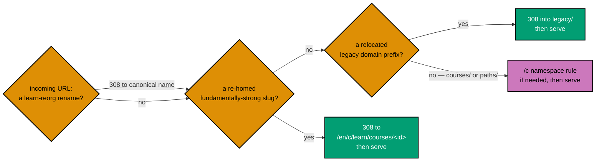
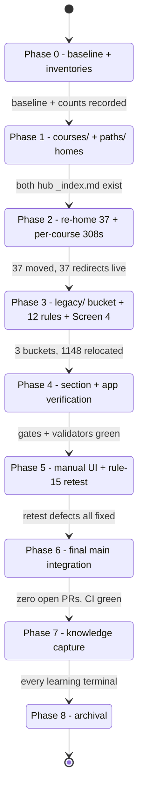
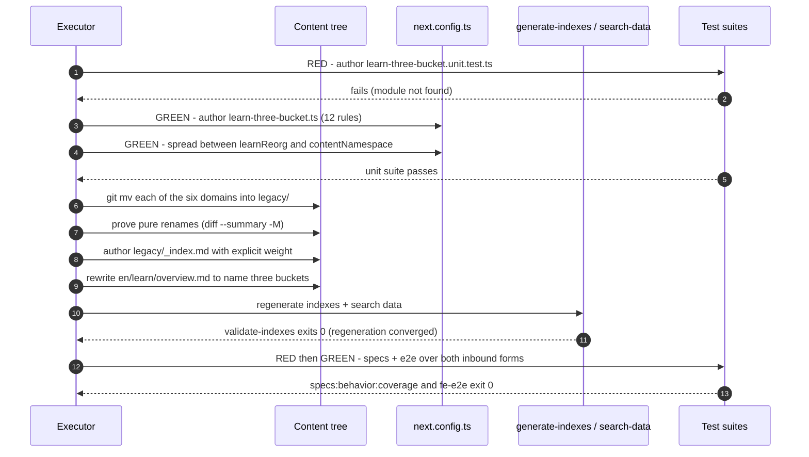
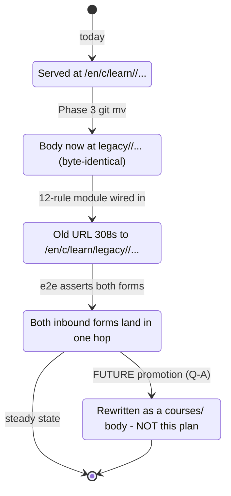

# Technical Docs — ayokoding-www Learning-Path URL Restructure

## Scope of this document

The **URL and IA layer** of the ayokoding-www learn section: the flat `courses/` namespace, the
`paths/` content home, the `legacy/` bucket, both redirect modules, and the additive legacy
`_index.md` browse. The `course-paths` feature architecture (pure core, shell components, `?path=`
context, manifest loading) is **not** documented here — it belongs to
`ayokoding-learning-path-02-schema-and-prerequisite-dag` and
`ayokoding-learning-path-03-navigation-ui`.

**UI-design-funnel**: this plan is UI-bearing (Screen 4 — the legacy-bucket landing and per-page
banner). The complete funnel record — low-fi alternatives at three viewports, the responsive strategy,
the R5 grounding note, the R7 prior-art citation, the hi-fi finalist plan, and the rationale table —
lives in [prd.md §UI-Design-Funnel](./prd.md#ui-design-funnel--screen-4--legacy-bucket-landing-and-page-banner),
per the placement rule. It is not duplicated here.

## Ground-truth inventory (measured 2026-07-21, re-verified at authoring)

`en/learn/` holds **1,713** `.md` files across seven top-level domains, plus its own `_index.md` and
`overview.md` [Repo-grounded — `find apps/ayokoding-www/content/en/learn -name '*.md' | wc -l`].
Content root is `apps/ayokoding-www/content/`; the route
`src/app/[locale]/(content)/c/[...slug]/page.tsx` serves a content path `en/learn/X` at
`/en/c/learn/X` [Repo-grounded].

| Domain under `en/learn/`  | `.md` files | Disposition                                   |
| ------------------------- | ----------- | --------------------------------------------- |
| `fundamentally-strong`    | 563         | → `courses/` (per-course re-home; DD-2/DD-43) |
| `software-engineering`    | 979         | → `legacy/software-engineering`               |
| `artificial-intelligence` | 55          | → `legacy/artificial-intelligence`            |
| `information-security`    | 51          | → `legacy/information-security`               |
| `personal-development`    | 50          | → `legacy/personal-development`               |
| `it-governance`           | 9           | → `legacy/it-governance`                      |
| `business`                | 4           | → `legacy/business`                           |

The six relocated domains total **1,148** `.md` [Repo-grounded — the six rows above sum to 1,148].
`fundamentally-strong/` itself contains only `_index.md`, `software-engineer/_index.md`,
`software-engineer/overview.md`, and **37 already-built course-shaped directories** [Repo-grounded —
`ls apps/ayokoding-www/content/en/learn/fundamentally-strong/software-engineer` returns 39 entries:
2 files + 37 directories, re-verified at authoring time]. The full catalog target is **127** courses,
so `courses/` starts with these 37 real bodies and grows through
`ayokoding-learning-path-04-course-authoring` — the bucket is deliberately under-filled at first, not
broken.

The `id` tree is much smaller: `id/belajar/` holds **one** domain (`manusia`, 50 `.md`) plus
`_index.md`, `ikhtisar.md`, and `perkenalan.md` — **53** `.md` in total [Repo-grounded —
`find apps/ayokoding-www/content/id/belajar -name '*.md' | wc -l`]. Note the per-locale
**section-slug asymmetry**: `learn` (en) vs `belajar` (id), already load-bearing in
`content-namespace.ts`, `LOOSE_PAGE_ALLOWLIST`, and `LANDING_SECTION_OVERRIDES` [Repo-grounded].

## Canonical course home + URL (DD-2)

- **Home**: `apps/ayokoding-www/content/en/learn/courses/<course-id>/`.
- **URL**: `contentUrl` maps a content slug `learn/courses/<course-id>` to
  `/{locale}/c/learn/courses/<course-id>` [Repo-grounded —
  `apps/ayokoding-www/src/features/content/core/content-url.ts`:
  `contentUrl("en", "learn/courses/x")` → `/en/c/learn/courses/x`], so a course resolves at
  **`/en/c/learn/courses/<course-id>`**.
- **Migration**: existing bundles live at
  `content/en/learn/fundamentally-strong/software-engineer/<slug>/` today [Repo-grounded]. Re-homing
  each into `content/en/learn/courses/<course-id>/` is a `git mv` of the folder plus a redirect from
  the old URL. The old `fundamentally-strong/software-engineer/` section name is freed, so the
  slash-form path IDs never clash with a course folder name.
- **Course ID = slug, unchanged.** The re-home renames no directory: `course-id` is exactly the
  existing slug. A re-home changes a body's URL (with a redirect) but never its ID.

## Prerequisite frontmatter contract (reproduced verbatim; canonical owner is the schema plan)

Each re-homed course `_index.md` gains this field. The **canonical statement of its shape is owned by
`ayokoding-learning-path-02-schema-and-prerequisite-dag`**, which builds the resolver that parses it.
It is reproduced here verbatim rather than linked because both plans are Wave 1 and merge
independently; if the two statements ever diverge, **the schema plan's wins**.

| Field                           | Meaning                                                                                                                                            |
| ------------------------------- | -------------------------------------------------------------------------------------------------------------------------------------------------- |
| `prerequisites: [course-id, …]` | **EVERY course declares this.** The union of all `prerequisites` edges forms the library's **prerequisite DAG**. Entry-point courses declare `[]`. |

Declared in each course `_index.md` frontmatter, naming only other library course IDs. This plan
writes the field into 37 files; it does **not** write the resolver, the DAG validator, or the page
component that surfaces it.

The field is **inert until a Wave-2 consumer reads it**, which is the whole hazard: a shape mismatch
between the two Wave-1 plans fails nothing during Wave 1 and surfaces later as an empty prerequisite
list on 37 course pages with a green build. The mitigation is this verbatim reproduction plus the
named canonical owner — not a dependency edge, which would collapse the wave structure.

## Learn-Section IA — the three-bucket model

When this plan lands, `/{locale}/c/learn/` has **exactly three** structural children and nothing else
(DD-40):

| Bucket     | URL shape                                   | What lives there                                                         |
| ---------- | ------------------------------------------- | ------------------------------------------------------------------------ |
| `paths/`   | `/en/c/learn/paths/<arc>/<role-or-subject>` | The four ordered path manifests' landing anchors                         |
| `courses/` | `/en/c/learn/courses/<course-id>`           | Canonical, path-neutral course bodies                                    |
| `legacy/`  | `/en/c/learn/legacy/<domain>/<…verbatim…>`  | **NEW** — everything under `/en/c/learn/` that is not yet course or path |

### Content tree — BEFORE (current reality, re-verified at authoring)

> **Marker legend** (used in every tree in this document): `✓` = **verified on disk** in the current
> commit; `+` = **NEW**, the plan creates it; `→` = **MOVED** by `git mv`, contents byte-identical;
> `~` = **CHANGED**, edited or machine-regenerated. Anything without a marker is an elision (`…`) or
> a comment. A reader never has to guess which nodes are today's reality and which are the target
> state.

```text
apps/ayokoding-www/content/
├── en/
│   ├── _index.md                                                  ✓
│   ├── about-ayokoding.md                                         ✓  loose page (not under /c)
│   ├── terms-and-conditions.md                                    ✓  loose page (not under /c)
│   ├── rants/                                                     ✓  sibling section — untouched
│   └── learn/                                                     ✓  1,713 .md total
│       ├── _index.md                                              ✓  machine-generated (generate-indexes)
│       ├── overview.md                                            ✓  hand-authored; links all 6 domains
│       ├── fundamentally-strong/                                  ✓  563 .md
│       │   ├── _index.md                                          ✓
│       │   └── software-engineer/                                 ✓  39 entries = 2 files + 37 dirs
│       │       ├── _index.md                                      ✓  spiral-ordered section index
│       │       ├── overview.md                                    ✓
│       │       ├── just-enough-python/                            ✓  1 of the 37 built course-shaped dirs
│       │       │   ├── _index.md                                  ✓
│       │       │   ├── learning/                                  ✓  (_index, overview, beginner,
│       │       │   │                                                 intermediate, advanced, capstone/, code/)
│       │       │   └── drilling/                                  ✓  (_index, overview, code/)
│       │       └── … 36 more course-shaped dirs …                 ✓  (advanced-algorithms, sql-essentials,
│       │                                                             capstone-solid-core, …)
│       ├── software-engineering/                                  ✓  979 .md
│       │   ├── _index.md                                          ✓
│       │   ├── overview.md                                        ✓
│       │   ├── programming-languages/                             ✓
│       │   │   ├── python/                                        ✓
│       │   │   │   └── by-example/                                ✓  (_index, overview, beginner,
│       │   │   │                                                     intermediate, advanced)
│       │   │   └── … c-sharp/ clojure/ dart/ elixir/ f-sharp/ golang/ java/ kotlin/ rust/ typescript/ …   ✓
│       │   └── … algorithms-and-data-structures/ automation-testing/ automation-tools/                   ✓
│       │         compilers-and-interpreters/ data/ development/ infrastructure/ networking/
│       │         platforms/ software-architecture/ system-design/ …
│       ├── artificial-intelligence/                               ✓  55 .md
│       ├── information-security/                                  ✓  51 .md
│       ├── personal-development/                                  ✓  50 .md
│       ├── it-governance/                                         ✓   9 .md
│       └── business/                                              ✓   4 .md
└── id/
    ├── _index.md                                                  ✓
    ├── celoteh/                                                   ✓  sibling section — untouched
    ├── konten-video/                                              ✓  sibling section — untouched
    └── belajar/                                                   ✓  53 .md (section slug is `belajar`, NOT `learn`)
        ├── _index.md                                              ✓
        ├── ikhtisar.md                                            ✓
        ├── perkenalan.md                                          ✓
        └── manusia/                                               ✓  50 .md — the locale's ONLY domain
```

### Content tree — AFTER (target state)

`en/learn/` ends with **exactly three structural buckets** plus the section's own two hub files
(DD-40, DD-45). Under `courses/` the namespace is **flat** — one directory per stable `course-id`,
with **no** arc, role, or subject nesting — which is what makes a course path-neutral (DD-2). Under
`legacy/` each relocated domain keeps its sub-taxonomy **byte-identical** (DD-41): compare the
`software-engineering/programming-languages/python/by-example/` branch below with the same branch in
the BEFORE tree — only the `legacy/` prefix differs.

```text
apps/ayokoding-www/content/
├── en/
│   ├── _index.md                                                  ✓  unchanged
│   ├── rants/                                                     ✓  unchanged
│   └── learn/                                                     ✓  section root — now closed (DD-40)
│       ├── _index.md                                              ~  regenerated by `generate-indexes`
│       ├── overview.md                                            ~  hand-rewritten: 6-domain inventory
│       │                                                             → 3-bucket orientation (DD-45 / Q-F)
│       │
│       ├── paths/                                                 +  BUCKET 1 — landing anchors only
│       │   └── _index.md                                          +  paths hub, 2×2 grid, room for 4 cards
│       │                                                             (the four per-path landings are
│       │                                                              authored by the manifests plan)
│       │
│       ├── courses/                                               +  BUCKET 2 — FLAT namespace, one dir per course-id
│       │   ├── _index.md                                          +  library landing
│       │   ├── just-enough-python/                                →  git mv from fundamentally-strong/software-engineer/
│       │   │   ├── _index.md                                      ~  + `prerequisites: [...]` added
│       │   │   ├── learning/                                      →  contents byte-identical
│       │   │   └── drilling/                                      →  contents byte-identical
│       │   ├── just-enough-nvim/                                  →
│       │   ├── advanced-algorithms/                               →
│       │   ├── sql-essentials/                                    →
│       │   ├── capstone-solid-core/                               →  (DD-20, already live on disk)
│       │   └── … 32 more re-homed dirs (37 total) …               →
│       │                                                             (net-new bodies land later, in
│       │                                                              ayokoding-learning-path-04-course-authoring)
│       │
│       └── legacy/                                                +  BUCKET 3 — relocated, NOT rewritten (DD-41)
│           ├── _index.md                                          +  REQUIRED: generate-indexes only rewrites
│           │                                                         existing section files; without it
│           │                                                         buildTreeForLocale synthesizes a weight:0
│           │                                                         node that sorts FIRST (DD-44).
│           │                                                         Carries the Q-D notice (prd Screen 4).
│           ├── software-engineering/                              →  979 .md — sub-taxonomy verbatim
│           │   └── programming-languages/python/by-example/       →  identical to the BEFORE branch;
│           │                                                         only the prefix moved
│           ├── artificial-intelligence/                           →  55 .md
│           ├── information-security/                              →  51 .md
│           ├── personal-development/                              →  50 .md
│           ├── it-governance/                                     →   9 .md
│           └── business/                                          →   4 .md
│                                                                     └─ 1,148 .md relocated in total
│
│       ── NOT PRESENT after the plan: fundamentally-strong/ ──
│          Its 37 course dirs become courses/; its three residual index pages
│          (_index.md, software-engineer/_index.md, software-engineer/overview.md) fold into the
│          fundamentally-strong/software-engineer path landing under Q-E's recommended answer.
│          It is NOT relocated into legacy/ — see DD-43.
│
└── id/                                            ⚠ CONDITIONAL on Q-B — rendered per its RECOMMENDED answer (A: out of scope)
    └── belajar/                                                   ✓  UNCHANGED — no bucket, no move, no redirect (DD-45)
        └── manusia/                                               ✓  50 .md — stays exactly where it is
```

**If Q-B is overturned** (maintainer picks option B or C), `id/belajar/` takes this shape instead —
segment names per [Q-C](#q-c--if-id-is-in-scope-are-the-bucket-segments-translated), shown here under
its recommended answer A (translated: `kursus` / `jalur` / `arsip`):

```text
└── id/belajar/                                    ⚠ ONLY IF Q-B resolves to B or C — not the recommended path
    ├── jalur/                                                     +  = paths/   — EMPTY today   [Q-B option B only]
    ├── kursus/                                                    +  = courses/ — EMPTY today   [Q-B option B only]
    └── arsip/                                                     +  = legacy/
        ├── _index.md                                              +
        └── manusia/                                               →  50 .md, sub-taxonomy verbatim
```

Under **Q-B option C** the two empty buckets (`jalur/`, `kursus/`) are omitted and only `arsip/` is
created. Either variant additionally requires `id` rule pairs in the redirect module and makes the
bucket URL shape per-locale, which the `course-paths` feature does not currently model — the cost
noted in [Q-C](#q-c--if-id-is-in-scope-are-the-bucket-segments-translated).

### Source tree — BEFORE and AFTER (`apps/ayokoding-www/src/`)

Same marker legend. Only the paths **this plan** touches are shown. Files the sibling plans create
(the whole `features/course-paths/` subtree) are marked as such and are **not** this plan's work.

**BEFORE** (re-verified at authoring):

```text
apps/ayokoding-www/
├── next.config.ts                                                 ✓  redirects(): [...learnReorg, ...contentNamespace]
└── src/
    ├── app/
    │   ├── sitemap.ts                                             ✓  iterates contentMap → contentUrl()
    │   ├── feed.xml/route.ts                                      ✓  iterates contentMap → contentUrl()
    │   └── [locale]/(content)/
    │       ├── c/page.tsx                                         ✓  browse index — TOP-LEVEL sections only
    │       └── c/[...slug]/page.tsx                               ✓  content route + buildBreadcrumbs()
    ├── features/
    │   ├── content/
    │   │   ├── core/{content-url.ts, tree-builder.ts, types.ts}   ✓  contentUrl / buildTrees / computePrevNext
    │   │   ├── core/landing-sections.ts                           ✓  LANDING_SECTION_OVERRIDES (top-level slugs)
    │   │   └── shell/{browse-index.tsx, section-card.tsx,         ✓
    │   │              index-generator.ts}                         ✓  generate-indexes: rewrites EXISTING section files
    │   ├── navigation/shell/{sidebar.tsx, sidebar-tree.tsx,       ✓
    │   │                     breadcrumb.tsx, prev-next.tsx}       ✓
    │   └── search/shell/generate-search-data.ts                   ✓  doc id = `${locale}:${slug}`
    └── redirects/
        ├── learn-reorg.ts                                         ✓  within-/en/learn/ renames
        ├── content-namespace.ts                                   ✓  /{locale}/{section}/:path* → /{locale}/c/{section}/:path*
        └── content-namespace.unit.test.ts                         ✓  the pattern both new tests mirror
```

**AFTER** (target state — this plan's edits only):

```text
apps/ayokoding-www/
├── next.config.ts                                                 ~  redirects(): [...learnReorg,
│                                                                     ...learnThreeBucket, ...contentNamespace]
│                                                                     ORDER IS LOAD-BEARING — see DD-42
└── src/
    ├── app/
    │   ├── sitemap.ts                                             ✓  UNCHANGED code; emits 1,148 changed URLs (DD-44)
    │   ├── feed.xml/route.ts                                      ✓  UNCHANGED code; <link> AND <guid> change
    │   └── [locale]/(content)/
    │       ├── c/page.tsx                                         ✓  UNCHANGED — never listed learn's children
    │       └── c/[...slug]/page.tsx                               ✓  UNCHANGED by this plan; breadcrumbs gain a
    │                                                                 "Legacy" crumb mechanically
    ├── features/
    │   ├── content/**                                             ✓  UNCHANGED by this plan (tree-derived, DD-44)
    │   ├── navigation/shell/**                                    ✓  UNCHANGED by this plan
    │   ├── search/shell/generate-search-data.ts                   ✓  UNCHANGED code; `generated/search-data.json`
    │   │                                                             MUST be regenerated
    │   └── course-paths/                                          —  NOT THIS PLAN — created by the schema and
    │                                                                 navigation-ui plans
    └── redirects/
        ├── learn-reorg.ts                                         ✓  UNCHANGED — must still run FIRST (DD-42)
        ├── content-namespace.ts                                   ✓  UNCHANGED — must still run LAST (DD-42)
        ├── content-namespace.unit.test.ts                         ✓  UNCHANGED
        ├── learn-three-bucket.ts                                  +  NEW — 12 rules: 6 domains × 2 tiers (DD-42)
        ├── learn-three-bucket.unit.test.ts                        +  NEW — mirrors content-namespace.unit.test.ts
        ├── course-rehome.ts                                       +  NEW — 37 per-course rules (DD-43)
        └── course-rehome.unit.test.ts                             +  NEW — asserts all 37 mappings + negatives
```

> **Module-naming note.** The source plan specified the per-course re-home redirects only as
> "a redirect … in `apps/ayokoding-www/src/redirects/`", without naming a file. `course-rehome.ts` /
> `course-rehome.unit.test.ts` are this plan's concrete choice, following the existing
> `<verb>-<noun>.ts` + `.unit.test.ts` naming of `learn-reorg.ts` and `content-namespace.ts`
> [Repo-grounded]. The name is not inherited from the source plan and may be changed at execution
> time as long as both files move together and `next.config.ts` is updated with them.

### URL mapping (old → new → covering rule)

Every row is a **308** (`permanent: true`). The "covering rule" column names the module and tier that
handles it. Note the two inbound forms per legacy URL: the bare pre-`/c` form (which the tier-1 rule
short-circuits) and the `/c` form (tier 2).

| #   | Old URL                                                                                           | New URL                                                                                    | Covering rule                                                                                                          |
| --- | ------------------------------------------------------------------------------------------------- | ------------------------------------------------------------------------------------------ | ---------------------------------------------------------------------------------------------------------------------- |
| 1   | `/en/c/learn/software-engineering/…`                                                              | `/en/c/learn/legacy/software-engineering/…`                                                | `learn-three-bucket.ts` tier 2                                                                                         |
| 2   | `/en/learn/software-engineering/…` _(bare, pre-`/c`)_                                             | `/en/c/learn/legacy/software-engineering/…`                                                | `learn-three-bucket.ts` tier 1 (short-circuits `content-namespace`)                                                    |
| 3   | `/en/c/learn/software-engineering/programming-languages/python/by-example/advanced` _(deep path)_ | `/en/c/learn/legacy/software-engineering/programming-languages/python/by-example/advanced` | `learn-three-bucket.ts` tier 2 — one `:path*` covers arbitrary depth                                                   |
| 4   | `/en/c/learn/artificial-intelligence/…`                                                           | `/en/c/learn/legacy/artificial-intelligence/…`                                             | `learn-three-bucket.ts` tier 2                                                                                         |
| 5   | `/en/c/learn/information-security/…`                                                              | `/en/c/learn/legacy/information-security/…`                                                | `learn-three-bucket.ts` tier 2                                                                                         |
| 6   | `/en/c/learn/personal-development/…`                                                              | `/en/c/learn/legacy/personal-development/…`                                                | `learn-three-bucket.ts` tier 2                                                                                         |
| 7   | `/en/c/learn/it-governance/…`                                                                     | `/en/c/learn/legacy/it-governance/…`                                                       | `learn-three-bucket.ts` tier 2                                                                                         |
| 8   | `/en/c/learn/business/…`                                                                          | `/en/c/learn/legacy/business/…`                                                            | `learn-three-bucket.ts` tier 2                                                                                         |
| 9   | `/en/learn/human/…` _(historical rename)_                                                         | `/en/c/learn/legacy/personal-development/…`                                                | `learn-reorg.ts` (→ `personal-development`) **then** `learn-three-bucket` tier 1 — the reason ordering is load-bearing |
| 10  | `/en/c/learn/fundamentally-strong/software-engineer/<slug>` _(per-course collapse)_               | `/en/c/learn/courses/<course-id>`                                                          | **per-course** re-home rule in `course-rehome.ts` — **NOT** `learn-three-bucket.ts` (DD-43)                            |
| 11  | `/en/c/learn/courses/<course-id>`                                                                 | _(no redirect — served)_                                                                   | **none by design** — a blanket bucket rule would swallow this (DD-42)                                                  |
| 12  | `/en/c/learn/paths/<arc>/<role-or-subject>`                                                       | _(no redirect — served)_                                                                   | **none by design** — same hazard (DD-42)                                                                               |
| 13  | `/id/c/belajar/manusia/…`                                                                         | _(no redirect — served unchanged)_                                                         | **none** — `id` is out of scope under Q-B's recommended answer (DD-45)                                                 |

Rows 11–13 are **negative** cases and are asserted as such in the redirect unit tests: a rule matching
any of them would be a defect, not an omission.

## Redirect design

The repo already has two redirect modules, spread into `next.config.ts` `redirects()` in a deliberate
order — `[...learnReorgRedirects, ...contentNamespaceRedirects]` [Repo-grounded —
`apps/ayokoding-www/next.config.ts`]. `contentNamespaceRedirects` uses prefix-wildcard rules
(`{ source: "/en/learn/:path*", destination: "/en/c/learn/:path*", permanent: true }`) at 308, and
carries an explicit warning in its own header comment that a blanket `/{locale}/:path*` rule "would
wrongly swallow" sibling routes [Repo-grounded —
`apps/ayokoding-www/src/redirects/content-namespace.ts`].

This plan adds **two** modules to that chain's middle slot.

### Module 1 — `course-rehome.ts` (per-course, DD-43)

One rule per re-homed bundle: `.../fundamentally-strong/software-engineer/<slug>` →
`/en/c/learn/courses/<course-id>`, 37 in total (33 shipped topics + 4 existing capstones, including
`capstone-solid-core`). `course-id` equals `<slug>`, so the table is mechanically derivable from the
re-home set and should be generated from a single exported slug array rather than hand-typed twice.

The redirect **preserves any path context query parameter**: Next.js redirects forward the query
string by default, and the redirect scenario asserts it, so a shared `?path=`-carrying link survives
the move.

### Module 2 — `learn-three-bucket.ts` (per-domain, DD-42)

**A blanket `/en/c/learn/:path*` → `/en/c/learn/legacy/:path*` rule is FORBIDDEN.** It would (a)
swallow `courses/` and `paths/`, and (b) self-recurse, since its own destination re-matches its own
source. The six moved domains are therefore **enumerated explicitly**, exactly as
`content-namespace.ts` enumerates its moved sections.

The module declares **twelve** rules for `en` — a matched pair per relocated domain:

```ts
// tier 1 — pre-/c form, short-circuits the two-hop chain (spread BEFORE contentNamespaceRedirects)
{ source: "/en/learn/software-engineering/:path*",
  destination: "/en/c/learn/legacy/software-engineering/:path*", permanent: true },
// tier 2 — post-/c form, catches links already living in the /c namespace
{ source: "/en/c/learn/software-engineering/:path*",
  destination: "/en/c/learn/legacy/software-engineering/:path*", permanent: true },
```

Both tiers map over one exported `RELOCATED_DOMAINS` array, so a seventh domain cannot be added to
one tier and forgotten in the other.

### Ordering in `next.config.ts` (load-bearing)

`[...learnReorgRedirects, ...courseRehomeRedirects, ...learnThreeBucketRedirects, ...contentNamespaceRedirects]`:

- **After `learnReorgRedirects`** — those rules rewrite _within_ `/en/learn/<domain>/…` (e.g.
  `human/` → `personal-development/`, `algorithm-and-data-structures/` → plural) [Repo-grounded —
  `apps/ayokoding-www/src/redirects/learn-reorg.ts`]. They must resolve to their canonical
  legacy-domain path **before** the bucket rule relocates it, otherwise an old rename would land in
  `legacy/` under its pre-rename name.
- **`courseRehomeRedirects` before `learnThreeBucketRedirects`** — the per-course rules are more
  specific than any domain-prefix rule and must win. In practice the bucket module carries **no**
  `fundamentally-strong` rule at all (DD-43), so the two sets are disjoint and the relative order is
  defence in depth rather than a live conflict; the unit test asserts the disjointness directly.
- **Before `contentNamespaceRedirects`** — the tier-1 rules short-circuit what would otherwise be a
  three-hop chain (`/en/learn/X` → `/en/c/learn/X` → `/en/c/learn/legacy/X`) down to one hop. The
  tier-2 rules remain necessary for links that already point into `/c`.



### Redirect unit tests

Both new tests mirror the existing `content-namespace.unit.test.ts` pattern [Repo-grounded].

`learn-three-bucket.unit.test.ts` asserts: exactly one rule pair per relocated domain (12 total);
every rule `permanent: true` with non-empty `source`/`destination`; destination equals source with
`legacy/` inserted at the bucket position; **no rule whose source is `/en/c/learn/:path*`** (the
self-recursing blanket); and **no rule whose source prefix is `courses`, `paths`, or
`fundamentally-strong`**.

`course-rehome.unit.test.ts` asserts: exactly 37 rules; every rule `permanent: true`; each
destination is `/en/c/learn/courses/<slug>` for the same `<slug>` its source names; and the rule set's
slug list equals the re-home inventory captured in Phase 0.

### `fundamentally-strong/` is the exception — per-course redirects (DD-43)

`fundamentally-strong/`'s topic directories collapse into **flat** `courses/<course-id>` bodies, so
its redirects are **per-course**, not a prefix rule. The boundary rule:

> `learn-three-bucket.ts` carries **no** `fundamentally-strong` rule. The `fundamentally-strong`
> prefix belongs entirely to the per-course re-home redirect set, and a prefix rule there would
> shadow the per-course rules for the 37 already-built directories.

The residual `fundamentally-strong/_index.md`, `software-engineer/_index.md`, and
`software-engineer/overview.md` — which are section indexes, not courses — are the subject of
[Q-E](#q-e--what-happens-to-fundamentally-strongs-three-residual-index-pages).

## Legacy `_index.md` browse coexistence (additive model, DD-19)

The library/paths model is **additive** — it adds new navigation without removing the old one. The
legacy hand-curated **section browse** (the spiral-ordered `_index.md` section tree under
`apps/ayokoding-www/content/en/learn/fundamentally-strong/**`) MUST keep working. A reader can
navigate the material **the old way** (the ordered `_index.md` section tree) **in addition to** the
new way (path landings + canonical course pages). Both navigations resolve, side by side.

- **The impacted `_index.md` files are UPDATED, never deleted.** Re-homing topics 1–33 out of
  `.../fundamentally-strong/software-engineer/<slug>/` into `courses/<course-id>/` does not orphan the
  section index. Every entry in the affected section-index files — the parent
  `fundamentally-strong/_index.md`, the spiral-ordered
  `fundamentally-strong/software-engineer/_index.md`, and each per-topic `_index.md` — is
  **re-pointed to wherever the content now lives**: either the re-homed canonical
  `/en/c/learn/courses/<course-id>` URL directly, or through the redirect layer. No dead links, no
  orphaned section.
- **Two independent navigations over one body set.** The re-homed body is the single canonical
  source; the legacy `_index.md` tree and the (later) manifest-driven paths both link to that same
  canonical course page. Because order lives outside the body, the legacy spiral order (carried by the
  `_index.md` tree + `weight`) and the manifest orders coexist without conflict. No body is forked to
  serve the two navigations.
- **Enforced as a re-home gate.** [delivery.md](./delivery.md) carries an explicit step in the
  re-home phase to enumerate + update every impacted `_index.md`, with an acceptance check (Gherkin +
  link-validator green + an e2e "old-way browse" nav walk) proving every legacy section-tree link
  still resolves end-to-end after re-homing.

**Amendment note.** Q-E's recommended answer supersedes part of DD-19's "UPDATED, never deleted"
instruction for **three files specifically** — `fundamentally-strong/_index.md`,
`software-engineer/_index.md`, `software-engineer/overview.md` — whose content moves into the
`fundamentally-strong/software-engineer` path landing rather than being re-pointed in place. That is a
deliberate, narrow amendment recorded here, not an oversight. The path landing that receives the prose
is authored by `ayokoding-learning-path-05-manifests`, so this plan's own Phase-2 work re-points the
other impacted files and hands Q-E's three-file disposition forward.

## IA / navigation consequences (every affected source file, read-verified)

`ayokoding-www`'s navigation is **entirely tree-derived** — no production source file hardcodes a
`learn/` domain slug [Repo-grounded — a repo-wide search for the six domain slugs under
`apps/ayokoding-www/src` returns hits only in `src/redirects/learn-reorg.ts` and in `*.test.ts*`
fixtures]. That is why the relocation is affordable.

| Surface (file, read-verified)                                                 | Derivation                                                             | Verdict                                                                                                                                                                |
| ----------------------------------------------------------------------------- | ---------------------------------------------------------------------- | ---------------------------------------------------------------------------------------------------------------------------------------------------------------------- |
| `src/features/navigation/shell/sidebar.tsx` + `sidebar-tree.tsx`              | `getTree(locale)`, root's `isSection` children, recursive              | **No code change.** `learn` gains a `legacy` child; the six domains sit one level deeper; auto-expand keys off `pathname`.                                             |
| `src/features/content/shell/browse-index.tsx` + `app/…/c/page.tsx`            | **Top-level** sections only (`learn`, `rants`)                         | **No code change.** The browse index never listed `learn`'s children.                                                                                                  |
| `src/features/content/shell/section-card.tsx`                                 | Presentational, fed by browse index                                    | **No code change.**                                                                                                                                                    |
| `src/features/content/core/landing-sections.ts` (`LANDING_SECTION_OVERRIDES`) | Keyed by **top-level** locale section slug (`learn` / `belajar`)       | **No code change.** Bucket slugs are one level below the override keys.                                                                                                |
| `src/app/sitemap.ts`                                                          | Iterates `index.contentMap`, emits `contentUrl(locale, meta.slug)`     | **No code change**, but **1,148 URLs change**. Old URLs leave the sitemap (correct — they become 308s).                                                                |
| `src/app/feed.xml/route.ts`                                                   | Same derivation, `en` non-section pages                                | **No code change**, but every relocated item's `<link>` **and `<guid>`** changes → feed readers may re-surface items as new. Risk-listed.                              |
| `src/features/search/shell/generate-search-data.ts`                           | Reads disk, doc id `${locale}:${slug}`                                 | **No code change**, but `generated/search-data.json` **must be regenerated** (`nx run ayokoding-www:generate-search-data`).                                            |
| `src/features/content/shell/index-generator.ts` (`generate-indexes`)          | Rewrites each **existing** `isSection` file's child list from the tree | **No code change**, but it only rewrites `_index.md` files that already exist → `legacy/_index.md` **must be authored** first.                                         |
| `src/features/content/core/tree-builder.ts` (`buildTreeForLocale`)            | Synthesizes a missing ancestor node with `weight: 0`                   | **No code change**, but a missing `legacy/_index.md` would yield a synthetic "Legacy" node sorting **first** — a second reason to author it with an explicit `weight`. |
| `src/features/content/core/tree-builder.ts` (`computePrevNext`)               | Groups by parent slug, sorts siblings by `weight`                      | **No code change.** A whole subtree moving together preserves intra-domain prev/next; only `learn`'s own direct children shift.                                        |
| `src/app/…/c/[...slug]/page.tsx` `buildBreadcrumbs`                           | Mechanical title-casing of slug parts                                  | **No code change**, cosmetic consequence: legacy pages gain one extra crumb (`Home / Browse / Learn / Legacy / …`).                                                    |
| `apps/ayokoding-www/content/en/learn/overview.md`                             | **Hand-authored** links to `/en/learn/<domain>` (pre-`/c` form)        | **MUST be edited** — it is the one hand-maintained inventory of the six domains.                                                                                       |
| `apps/ayokoding-www/content/en/learn/_index.md`                               | **Generated** by `generate-indexes`                                    | Regenerates automatically; committed as part of the move.                                                                                                              |

## Delivery flow and phase gates



### Why Phase 3 is one phase, not two

The six `git mv`s and the redirect module must land **together**: a live 308 pointing at a
not-yet-moved path 404s, and a moved path with no 308 breaks ~1,148 URLs. Neither half is a safe
stopping state, so the phase boundary sits after both. The same reasoning puts the per-course
redirect table inside Phase 2 rather than a phase of its own.

### Why Phase 2 precedes Phase 3

After Phase 2 the `courses/` bucket already exists, so `en/learn/` is never transiently `legacy/`-only.
The ordering is also what makes Phase 3's structural gate (`ls .../en/learn` lists exactly five
entries) satisfiable in one step rather than two.

### The relocation, step by step



### A relocated URL's lifecycle



## Design Decisions

Ten decisions are owned by this plan. Two further decisions are **cross-cutting** (DD-15, DD-27) and
are reproduced verbatim in [README §Build order (inherited)](./README.md#build-order-inherited) rather
than here. Decisions owned by sibling plans are referenced by ID only and are not restated.

- **DD-2 · One canonical body + URL per course; re-home with redirects.** Bodies live at
  `content/en/learn/courses/<course-id>/` and render at `/en/c/learn/courses/<course-id>`. Existing
  bodies move from `fundamentally-strong/software-engineer/<slug>/`; old URLs redirect. Frees the old
  section name for the slash-form path IDs and gives every course one path-neutral home.
- **DD-19 · Additive model — preserve the "old-way" `_index.md` browse.** The new library/paths nav is
  additive: the legacy spiral-ordered section browse under `content/en/learn/fundamentally-strong/**`
  keeps working. Re-homing 1–33 **updates** those `_index.md` files (re-points every entry to the
  re-homed course URLs or via redirects), never deletes them, so both navigations resolve over the one
  canonical body set. Enforced by a re-home gate. See
  [Legacy `_index.md` browse coexistence](#legacy-_indexmd-browse-coexistence-additive-model-dd-19).
  **Narrowly amended by Q-E** for the three residual `fundamentally-strong` index pages, as recorded
  in that section.
- **DD-20 (re-home half) · `capstone-solid-core` is a first-class catalog entry and is in the re-home
  set.** The source plan's DD-20 promoted seven previously-orphaned inter-topic capstones to
  first-class library courses. **Six of the seven have no legacy home** and are authored native by
  `ayokoding-learning-path-04-course-authoring`, which owns DD-20 in full. The **seventh**,
  `capstone-solid-core`, is **already live on disk** at
  `apps/ayokoding-www/content/en/learn/fundamentally-strong/software-engineer/capstone-solid-core/`
  [Repo-grounded — re-verified at authoring], which makes it this plan's concern: it is the fourth of
  the "4 existing capstones" and is re-homed and redirected exactly like the 33 shipped topics, for a
  re-home set of **37**. This plan restates only that half; the promotion ruling, the catalog
  arithmetic (114 → 121), and the manifest placements are not restated here.
- **DD-23 (URL-shape half) · The `paths/` bucket's second segment is
  `<role-transition-or-subject>`, not `<role>`.** Path landings live at
  `/en/c/learn/paths/<first-segment>/<second-segment>`, where the first segment is the arc style
  (`interview-ready` / `immediately-effective` / `fundamentally-strong`) and the second names either a
  role (`software-engineer`) or a role-to-role transition (`software-engineer-to-ai-engineer`). The
  segment was never actually `<role>` in general — it was `<role>` by accident because only one role
  existed. **Why this plan carries it**: the `paths/` bucket and its 2×2-grid hub landing must
  accommodate a **two-segment, slash-bearing** path ID, and a hub built on the assumption that the
  second segment is a role would need rework the moment the fourth path lands. The rest of DD-23 (the
  fourth path's ID registration and its manifest location) belongs to
  `ayokoding-learning-path-05-manifests`.
- **DD-40 · `/{locale}/c/learn/` has exactly three structural buckets: `paths/`, `courses/`,
  `legacy/`.** The learn section's IA is closed: a URL under `/en/c/learn/` is either an ordered path
  manifest landing, a canonical course body, or relocated legacy material — nothing else. The section
  also keeps its own two hub files (`_index.md`, machine-generated; `overview.md`, hand-authored — see
  DD-45 and [Q-F](#q-f--what-happens-to-enlearnoverviewmd)); those are the section's landing prose,
  not a fourth taxonomy bucket. **Why**: the original plan converted one of seven domains and left the
  other six in place, producing a hybrid taxonomy that is neither the old IA nor the new one — the
  worst of both, and unexplainable to a reader.
- **DD-41 · The legacy move is a prefix relocation, not a rewrite.** Each of the six non-course
  domains moves via a single `git mv <domain>/ legacy/<domain>/`, preserving its existing sub-taxonomy
  **verbatim**: no file renamed, no body edited, no heading touched. **Why**: (a) it makes the redirect
  a per-domain prefix rule rather than 1,713 per-file rules; (b) it keeps a 1,148-file move reviewable
  as a pure rename diff; (c) promoting a legacy page into a real course is genuinely different work
  with its own editorial judgment, and bundling it here would make the move unreviewable. Promotion is
  later work — see [Q-A](#q-a--is-legacy-a-staging-pen-or-a-permanent-archive).
- **DD-42 · Per-domain prefix redirects; a blanket `/en/c/learn/:path*` rule is FORBIDDEN.** A new
  module `apps/ayokoding-www/src/redirects/learn-three-bucket.ts` _(New file)_ enumerates the six
  relocated domains explicitly, as two tiers of 308 prefix rules (pre-`/c` short-circuit + post-`/c`
  catch), spread into `next.config.ts` **between** `learnReorgRedirects` and
  `contentNamespaceRedirects`. **Why the ban**: a blanket rule would (a) swallow `courses/` and
  `paths/` and (b) self-recurse, since its own destination re-matches its own source. This is the same
  hazard `content-namespace.ts` already warns about in its header comment for `/{locale}/:path*`
  [Repo-grounded]. **Why the ordering**: `learnReorgRedirects` must resolve within-`/en/learn/`
  renames to their canonical domain names first, or an old rename lands in `legacy/` under its
  pre-rename name; and placing the bucket rules ahead of `contentNamespaceRedirects` collapses a
  three-hop chain to one hop for the common pre-`/c` inbound link. Enforced by a unit test mirroring
  `content-namespace.unit.test.ts`.
- **DD-43 · `fundamentally-strong/` stays on per-course redirects; `learn-three-bucket.ts` carries no
  rule for it.** Its topic directories collapse into flat `courses/<course-id>` bodies, so its
  redirects are per-course. **Why the explicit exclusion**: a `fundamentally-strong` prefix rule in the
  bucket module would shadow the per-course rules for all 37 already-built directories, silently
  sending every re-homed course to a legacy URL that holds nothing. **Split-time amendment**: the
  source plan located the per-course redirect set in a phase belonging to
  `ayokoding-learning-path-03-navigation-ui`. It is **moved into this plan**, because the negative
  assertion above can only be written by whichever plan owns both rule sets, and because the redirect
  module has no dependency on the `course-paths` feature.
- **DD-44 · No navigation code changes; the IA is tree-derived, and the two non-derived surfaces are
  named.** Sidebar, browse index, section cards, landing-section overrides, `sitemap.ts`, `feed.xml`,
  search data, `generate-indexes`, breadcrumbs, and `computePrevNext` all derive from the content
  tree, so the relocation needs **zero** production code edits beyond the redirect modules
  [Repo-grounded — no production source file hardcodes a `learn/` domain slug]. The two surfaces that
  do **not** self-heal are called out and given delivery steps: `legacy/_index.md` must be
  **authored** (because `generate-indexes` only rewrites `_index.md` files that already exist, and
  `buildTreeForLocale` would otherwise synthesize a `weight: 0` "Legacy" node that sorts **first**),
  and `generated/search-data.json` must be **regenerated** (every relocated doc's `id` is
  `${locale}:${slug}`). Full per-surface verdicts in
  [IA / navigation consequences](#ia--navigation-consequences-every-affected-source-file-read-verified).
- **DD-45 · The extension is `en`-only by default, and the `id` deferral is recorded, not implied.**
  `id/belajar/` holds one domain (`manusia`, 50 `.md`) and has **zero** courses and **zero** paths, so
  a three-bucket `id` today would ship two permanently-empty sections. The extension therefore stays
  `en`-scoped and states the deferral explicitly in [brd.md](./brd.md#business-scope-non-goals) and in
  [delivery.md](./delivery.md) Phase 3. **Why it is a decision, not an omission**:
  `apps/ayokoding-www/content` is bilingual and an `en` change normally needs its `id` counterpart, so
  silently skipping `id` would read as a bug. The reversal conditions and the segment-translation
  question are [Q-B](#q-b--does-the-id-locale-get-the-same-three-bucket-shape-now) and
  [Q-C](#q-c--if-id-is-in-scope-are-the-bucket-segments-translated).

**Referenced but not owned here**: DD-1, DD-3 through DD-18, DD-21, DD-22, DD-24 through DD-39, DD-46
and DD-47 belong to sibling plans. **DD-34, DD-35 and DD-39 are not this family's decisions at all** —
they are tokens inherited from the closed FS-SE plan and used inside the schema plan's `syllabus/`
tree with different meanings, and `DD-36`/`DD-37`/`DD-38` are unused. **Do not renumber to close the
apparent gap.** DD-47 (three viewports per screen per option) governs this plan's Screen 4 renders and
is restated where it binds, in [prd.md's asset matrix](./prd.md#hi-fi-asset-matrix--this-plans-slice).

## Open Questions — Learn-Section Scope Extension (UNRESOLVED)

These six decisions are **not made**. **This plan owns all six verbatim**;
`ayokoding-learning-path-03-navigation-ui` and `ayokoding-learning-path-04-course-authoring` each
carry a one-line "blocked-on" note pointing here. Each carries a recommended default and the reasoning
behind it, so the maintainer can accept or overturn each in a single pass. Nothing below is silently
applied: [delivery.md](./delivery.md) Phase 3 executes the **recommended default** for each and names
the alternative inline, so an overturned ruling is a bounded edit rather than a rewrite.

### Q-A — Is `legacy/` a staging pen or a permanent archive?

| Option                                        | Consequence                                                                                                          |
| --------------------------------------------- | -------------------------------------------------------------------------------------------------------------------- |
| **A. Staging pen (Recommended)**              | The bucket is expected to **shrink** as legacy material is promoted into real `courses/`; each promotion is tracked. |
| B. Permanent archive                          | The bucket is frozen; nothing ever leaves it; overlap with `courses/` is permanent and acknowledged.                 |
| C. Hybrid (pen for SWE, archive for the rest) | Only `legacy/software-engineering` is a pen; the five small domains are frozen.                                      |

**Recommendation: A — staging pen.** Much of the legacy material **already overlaps courses the
catalog plans**: `legacy/software-engineering/programming-languages/python/by-example` overlaps
`just-enough-python`; the `information-security` domain overlaps `security-essentials` /
`offensive-security` / `defensive-security`; `it-governance` overlaps `it-governance-grc`. A permanent
archive would leave two competing bodies on the same subject indefinitely — exactly the duplication
the shared-library model exists to prevent.

**What "staging pen" implies for tracking** — a lightweight, in-repo ledger, not a new system:

- `legacy/_index.md` states the bucket's **transitional** status in prose, so the intent is visible to
  a reader and to a future author.
- Each `courses/<course-id>` whose subject is covered by a legacy page names that page as
  **superseded** in its own `overview.md`, so promotion is recorded where the survivor lives. For the
  37 bundles this plan re-homes, that recording is in scope; for bodies authored later it is
  `ayokoding-learning-path-04-course-authoring`'s.
- The residual bucket contents are re-inventoried at archival, so a shrinking count is an observable
  fact rather than an aspiration.
- **No** per-page migration backlog plan is filed by this plan — that would be scope creep. Filing one
  is a Knowledge-Capture routing outcome if the audit finds it warranted.

### Q-B — Does the `id` locale get the same three-bucket shape now?

| Option                                                  | Consequence                                                                                                     |
| ------------------------------------------------------- | --------------------------------------------------------------------------------------------------------------- |
| **A. `id` stays out of scope (Recommended)**            | `id/belajar/` is untouched; the extension is `en`-only; the deferral is recorded in `brd.md` Non-Goals.         |
| B. `id` gets the full three-bucket shape now            | `id/belajar/manusia` → `id/belajar/<legacy-slug>/manusia`; two empty buckets are created; `id` redirects added. |
| C. `id` gets `legacy/` only, no empty `courses`/`paths` | `manusia` is relocated but no empty buckets are scaffolded; the shape is completed when `id` gets courses.      |

**Recommendation: A — out of scope.** The plan family already declares an Indonesian content mirror a
non-goal, and `id` has **zero** courses and **zero** paths. Creating `id/belajar/kursus/` and
`id/belajar/jalur/` today would ship two permanently-empty sections into production navigation, and
relocating the single `manusia` domain into a `legacy/` bucket buys structural symmetry at the price
of one more 308 hop for `id`'s only content — a cost with no corresponding reader benefit while the
other two buckets stay empty. Option C is the strongest runner-up and becomes the right answer the
moment `id` gains its first course.

### Q-C — If `id` is in scope, are the bucket segments translated?

Only live if Q-B resolves to B or C.

| Option                                                                  | Consequence                                                                                                   |
| ----------------------------------------------------------------------- | ------------------------------------------------------------------------------------------------------------- |
| **A. Translated — `kursus`/`jalur`/`arsip` (Recommended, conditional)** | Matches the existing `learn`/`belajar` precedent; `id` readers see Indonesian URLs end to end.                |
| B. Untranslated — `courses`/`paths`/`legacy`                            | One vocabulary for both locales; simpler manifest `pathId`s; but breaks the established per-locale slug rule. |
| C. Translated buckets, untranslated `path-id`s                          | Bucket segments localized; manifest IDs stay English so one manifest serves both locales.                     |

**Recommendation: A (conditional on Q-B).** The `learn`-vs-`belajar` asymmetry is **already** the
repo's precedent and is load-bearing in three places [Repo-grounded — `content-namespace.ts`
per-locale rules, `LOOSE_PAGE_ALLOWLIST`, `LANDING_SECTION_OVERRIDES` "The asymmetry between locales
is intentional"]. Mixing an Indonesian section slug with English bucket slugs
(`/id/c/belajar/courses/…`) would be a new, third convention. Note the cost honestly: translated
buckets mean the `courses/`/`paths/` URL shapes become per-locale, which the `course-paths` feature
does not currently model — that is a real design delta for the sibling plans, and it is the main
reason Q-B's recommended answer is "defer".

### Q-D — SEO treatment of `legacy/`

| Option                                                                           | Consequence                                                                                        |
| -------------------------------------------------------------------------------- | -------------------------------------------------------------------------------------------------- |
| **A. Keep indexed as-is + a visible "legacy / superseded" banner (Recommended)** | Traffic preserved; readers warned; a superseding course can be linked from the banner.             |
| B. Keep indexed as-is, no banner                                                 | Zero work; readers get no signal that a canonical course may supersede the page.                   |
| C. `noindex` the whole bucket                                                    | Search engines drop ~1,148 pages; the bucket becomes reachable only by direct link or in-site nav. |

**Recommendation: A.** Option C's traffic risk is the decisive factor: **1,148 pages** is ~67% of the
`en/learn/` corpus, and `software-engineering` alone (979 pages) is the single largest body of content
in the app. `noindex`-ing it would surrender that search surface **before** the replacement courses
exist — the catalog is 127 courses of which ~37 bodies are built today, so the replacement is a long
way off under the plan family's own build order (DD-27/DD-15). The 308s already preserve link equity
for the moved URLs; adding `noindex` on top would discard it. Option A costs one `Alert`-style callout
partial on the legacy section landing plus a per-page banner, and it is **reversible** — switching to
C later is a one-line metadata change, whereas recovering de-indexed traffic is not. **The banner is a
user-facing UI change, so it carries a design-funnel entry**: see
[prd.md Screen 4](./prd.md#ui-design-funnel--screen-4--legacy-bucket-landing-and-page-banner).

**Q-D gates this plan's Screen 4 selection**, which is why the funnel records its selection as PENDING
rather than fabricating one. The three low-fi alternatives map 1:1 onto A / B / C.

### Q-E — What happens to `fundamentally-strong`'s three residual index pages?

`fundamentally-strong/_index.md`, `software-engineer/_index.md`, and `software-engineer/overview.md`
survive once the 37 topic directories become `courses/` bodies.

| Option                                                                                   | Consequence                                                                                                  |
| ---------------------------------------------------------------------------------------- | ------------------------------------------------------------------------------------------------------------ |
| **A. Fold into the `fundamentally-strong/software-engineer` path landing (Recommended)** | Their prose becomes the path landing's narrative; the old URLs 308 to the path landing.                      |
| B. Move to `legacy/fundamentally-strong/`                                                | Preserves them verbatim, but strands the plan's own brand section inside the legacy bucket.                  |
| C. Delete them                                                                           | Cleanest tree, but discards hand-written framing prose and breaks two live URLs with nothing to redirect to. |

**Recommendation: A — fold into the path landing.** This is the only option consistent with **DD-19**,
the additive-model decision: the legacy `_index.md` browse must keep resolving after re-homing, and
this plan's re-home phase already carries a gate that re-points **every** entry in those files. Option
A honors that gate and gives the prose a real home — the `fundamentally-strong/software-engineer` path
landing is the direct successor of `software-engineer/overview.md`. Option B contradicts DD-40's
"nothing else" invariant by putting a plan-owned section into the legacy pen; Option C loses the DD-19
gate's redirect targets. **Caveat**: Option A supersedes part of DD-19's "UPDATED, never deleted"
instruction for these three files specifically (their content moves rather than being re-pointed in
place) — a deliberate, narrow amendment, not an oversight.

**Cross-plan consequence**: the receiving path landing is authored by
`ayokoding-learning-path-05-manifests`, which merges after this plan. This plan therefore **preserves
the three files and their redirect targets** rather than deleting them, and hands the fold-in forward.
`ayokoding-learning-path-03-navigation-ui` is blocked on this ruling too — it determines what its
legacy-browse coexistence guard asserts.

### Q-F — What happens to `en/learn/overview.md`?

`en/learn/overview.md` is a **fourth** child URL at `/en/c/learn/overview`, so "exactly three children
and nothing else" (DD-40) is not literally true while it exists [Repo-grounded —
`ls apps/ayokoding-www/content/en/learn`].

| Option                                                                | Consequence                                                                                               |
| --------------------------------------------------------------------- | --------------------------------------------------------------------------------------------------------- |
| **A. Keep it as the section's own hub page, rewritten (Recommended)** | It is the section landing's prose, not a taxonomy bucket; DD-40 is scoped to **structural buckets**.      |
| B. Fold its prose into `learn/_index.md` and delete it                | Literal three-child tree; but `_index.md` is machine-regenerated, so hand prose there would be clobbered. |
| C. Move it to `legacy/`                                               | Literal three-child tree; but the section loses its only orientation page.                                |

**Recommendation: A.** Option B is actively unsafe: `generate-indexes` **rewrites every `isSection`
file's body** from the tree [Repo-grounded — `processAllIndexFiles` in `index-generator.ts` writes
`rebuildIndexFile(withFields, childList)`], so hand-written prose placed in `learn/_index.md` is
destroyed on the next `nx run ayokoding-www:generate-indexes`. DD-40's invariant is therefore stated as
**"exactly three structural buckets"**, with `overview.md` named as the section's hub page — and its
hand-authored six-domain inventory is rewritten in Phase 3 to point at the three buckets instead.

## Testing strategy

Per the repo's three-level testing standard and TDD mandate, every code change in this plan is built
test-first. Each Gherkin acceptance criterion in [prd.md](./prd.md#acceptance-criteria-gherkin) is
covered at exactly one level:

| Gherkin scenario                                                            | Level              | Home                                                                |
| --------------------------------------------------------------------------- | ------------------ | ------------------------------------------------------------------- |
| A legacy fundamentally-strong URL redirects to the canonical course URL     | unit + e2e         | `course-rehome.unit.test.ts`; `ayokoding-www-fe-e2e`                |
| Every re-homed course declares its prerequisites                            | unit               | frontmatter assertion over the 37 re-homed `_index.md`              |
| The legacy section-index browse still resolves after re-homing              | e2e                | `ayokoding-www-fe-e2e` old-way nav walk                             |
| The legacy section-index browse resolves to the canonical course body       | e2e                | `ayokoding-www-fe-e2e` old-way nav walk                             |
| The learn section exposes exactly three structural buckets                  | specs + phase gate | `<NAVSPECS>learn-three-bucket.feature`; `ls` structural check       |
| A relocated legacy domain URL redirects to its legacy address               | unit + specs + e2e | `learn-three-bucket.unit.test.ts`; `<NAVSPECS>`; `fe-e2e`           |
| A deep legacy path keeps its sub-taxonomy verbatim                          | e2e                | `ayokoding-www-fe-e2e` deep-path assertion                          |
| The legacy redirect never swallows the courses or paths buckets             | unit + e2e         | negative assertions in `learn-three-bucket.unit.test.ts`; `fe-e2e`  |
| A re-homed fundamentally-strong course is not routed into the legacy bucket | unit               | negative assertion (no `fundamentally-strong`-prefixed source)      |
| The relocation rewrites no page content                                     | phase gate         | `git diff --cached --summary -M` pure-rename proof                  |
| Navigation surfaces follow the relocated tree with no code change           | phase gate         | `generate-indexes` + `generate-search-data` + `validate-indexes`    |
| The legacy bucket landing tells a reader what the bucket is                 | e2e + manual       | `fe-e2e` landing assertion; Playwright MCP verification             |
| The Indonesian locale is left unchanged and the deferral is recorded        | phase gate         | `find id/belajar` count + `test -e` absence check                   |
| The relocated tree builds and validates green                               | build + validators | `ayokoding-www:build`; `md links`/`heading-hierarchy`; markdownlint |

**Target notes (verified, and load-bearing for RED steps).** `ayokoding-www:test:e2e` and
`ayokoding-www:test:integration` are **no-op echo stubs** [Repo-grounded —
`apps/ayokoding-www/project.json`], so they always exit 0. A RED step pointed at either can never
fail and proves nothing. E2E for this app lives in the **paired `ayokoding-www-fe-e2e` project**; the
integration tier is deliberately unused for content apps, with unit consuming the Gherkin mocked.
Every RED step in [delivery.md](./delivery.md) therefore targets `ayokoding-www:test:unit`,
`ayokoding-www:specs:behavior:coverage`, or `ayokoding-www-fe-e2e:test:e2e`.

**`specs/` Gherkin companion**: the three-bucket scenarios are authored into the **existing**
`navigation/` domain folder, beside `content-namespace-redirects.feature` [Repo-grounded — the sibling
`navigation/` domain exists], as
`specs/apps/ayokoding/behavior/ayokoding-www/gherkin/navigation/learn-three-bucket.feature`. This plan
creates **no** new `course-paths/` specs domain — that belongs to the schema and navigation-ui plans.

## Rollback

The relocation is a pure `git mv`, so `git revert` on the Phase-3 commit restores every one of the
1,148 files atomically and removes the 12 redirect rules with it. The re-home is likewise a pure
`git mv` plus a redirect table; reverting Phase 2 restores the 37 bundles under `<SE_OLD>` and drops
their rules. The two phases are revertible independently **in reverse order only** — reverting Phase 2
while Phase 3 stands would leave `en/learn/` holding `paths/`, `legacy/`, and a re-populated
`fundamentally-strong/`, which is a coherent (if undesirable) state; reverting Phase 3 alone is always
safe.

The one non-revertible side effect is **feed churn**: subscribers who fetched the feed between the
relocation and a revert would have seen ~1,148 items re-surface. That is accepted and risk-listed.
