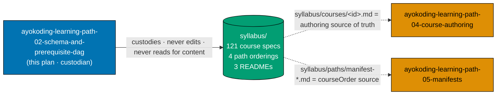
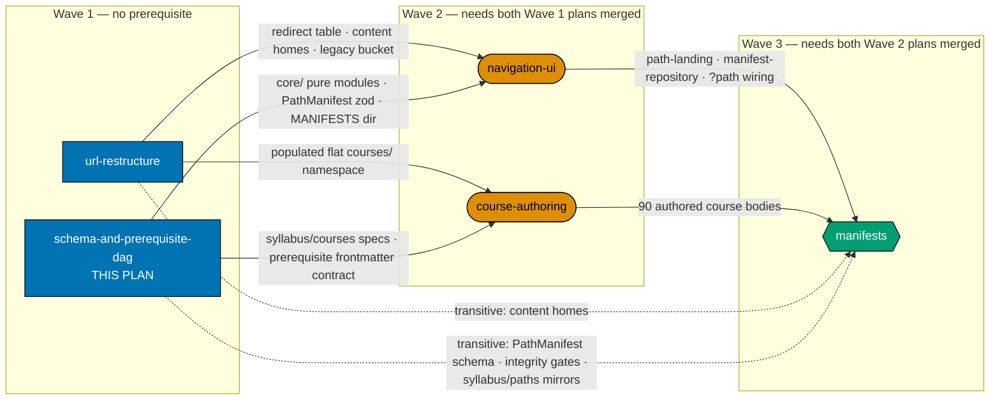
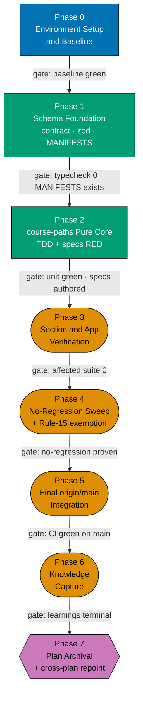
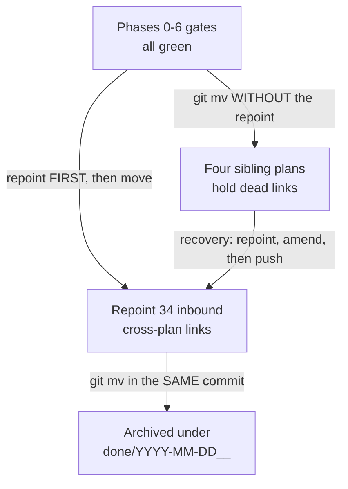

# Learning Path — Schema and Prerequisite DAG (ayokoding-www)

The **data layer** of the shared-course-library architecture: the `PathManifest` zod schema, the pure
`course-paths` functional core, the course-prerequisite frontmatter contract, the `<MANIFESTS>`
directory, and the whole `syllabus/` detail layer (128 files).

This is **plan #2 of a five-way split** of the closed
[`shared-course-library-and-learning-paths`](../../done/2026-07-21__shared-course-library-and-learning-paths/README.md)
plan. It is **Wave 1** and has **no plan-level prerequisite** — it starts immediately, in parallel
with `ayokoding-learning-path-01-url-restructure`.

> **Custody notice.** The `syllabus/` folder in this plan is a **moved corpus, already correct**. It
> is not authored, edited, or re-derived by this plan. Its consumers are two downstream plans (see
> [Custody of `syllabus/`](#custody-of-syllabus--a-corpus-this-plan-never-reads)). Do not modify any
> file under `syllabus/`.

## Context

`ayokoding-www` carries reading order as a single global `weight` frontmatter value per page:
`computePrevNext` groups pages by parent slug and sorts siblings by `weight`, path-independently
[Repo-grounded — `apps/ayokoding-www/src/features/content/core/tree-builder.ts`]. One body cannot
encode four orders.

The shared-library architecture moves order **out of the body and into a manifest**, and adds a
**prerequisite DAG** formed from each course's declared `prerequisites`. Both are pure data
structures with pure resolvers over them — which is exactly this plan's surface. No component, no
route, no rendered page ships here. Everything downstream (`navigation-ui`, `manifests`,
`course-authoring`) consumes the types and functions this plan creates.

The feature does not exist yet: `test -d apps/ayokoding-www/src/features/course-paths` returns
non-zero on `origin/main` today [Repo-grounded — verified 2026-07-21].

## Four paths, one library, per-role convergence

The architecture this data layer serves, in one paragraph — reproduced here because the custodied
`syllabus/` corpus back-references it and because no reader can evaluate a manifest schema without
knowing what a manifest composes.

Paths converge **within a role**, not globally — the library serves **more than one endpoint**. The
three `software-engineer` paths (`interview-ready/software-engineer`,
`immediately-effective/software-engineer`, `fundamentally-strong/software-engineer`) end at the same
software-engineering deep mastery; only their entry point, journey ordering, and teaching emphasis
differ. The fourth path, `immediately-effective/software-engineer-to-ai-engineer`, converges on a
distinct **AI-engineering** deep mastery — it assumes an already-working software engineer and does
not aim at the other three paths' endpoint. Each path is a fresh, bespoke ordering authored over the
one library and over the one prerequisite DAG the library forms.

Every one of those four orderings is expressible **only** because order lives in the manifest rather
than in the body (DD-1), and every one is checkable **only** because each course declares its
prerequisites (DD-6). Those two decisions are this plan's.

## What this plan owns

| Surface                                                             | Detail                                                                                                                            |
| ------------------------------------------------------------------- | --------------------------------------------------------------------------------------------------------------------------------- |
| `apps/ayokoding-www/src/features/course-paths/core/`                | Five pure modules — `schemas.ts`, `manifest.ts`, `path-nav.ts`, `path-context.ts`, `prerequisites.ts`, `manifest-integrity.ts`    |
| `apps/ayokoding-www/src/features/course-paths/manifests/`           | The `<MANIFESTS>` directory and its `README.md` (empty of `.yaml` files — those belong to `ayokoding-learning-path-05-manifests`) |
| `apps/ayokoding-www/src/features/content/core/content-url.ts`       | Extended with the optional `pathId` param and the canonical `/en/c/learn/courses/<course-id>` shape                               |
| `specs/apps/ayokoding/behavior/ayokoding-www/gherkin/course-paths/` | The `course-paths` Gherkin companion (specs RED)                                                                                  |
| The `prerequisites: [course-id, ...]` frontmatter contract          | **Canonical here.** `ayokoding-learning-path-01-url-restructure` writes the field; this plan defines its shape                    |
| `syllabus/` (128 files)                                             | Custodied, not authored — see below                                                                                               |

**Explicitly NOT owned** (each named with its owning plan, so a reader never assumes a gap):

- The `<COURSES>_index.md` / `<PATHS>_index.md` content homes → `ayokoding-learning-path-01-url-restructure`.
- The UI design funnel, every mockup render, and every `shell/` component →
  `ayokoding-learning-path-03-navigation-ui`.
- Every `.yaml` manifest file and every step that creates, appends to, reorders, or re-verifies one →
  `ayokoding-learning-path-05-manifests`.
- Every course body under `<COURSES>` → `ayokoding-learning-path-04-course-authoring`.

## Custody of `syllabus/` — a corpus this plan never reads

`syllabus/` lives here because it must exist, versioned and stable, **before** its consumers start —
and because a single owner is the only structure that keeps 121 course specs and four path orderings
from forking. But this plan is **not** its consumer:

- `syllabus/courses/<course-id>.md` (121 files) is the **literal source of truth for authoring each
  course body**, consumed by `ayokoding-learning-path-04-course-authoring`. Authoring "from a fresh
  judgment call" instead of from the spec is explicitly forbidden.
- `syllabus/paths/manifest-*.md` (4 files) are the **authoritative human-readable manifest
  orderings**, consumed by `ayokoding-learning-path-05-manifests`. Each YAML manifest's
  `courseOrder` is transcribed from its mirror.
- `syllabus/README.md`, `syllabus/courses/README.md`, `syllabus/paths/README.md` (3 files) are the
  navigation layer over both.

So this plan is a **custodian**, not a reader. Its obligations are exactly three: keep the corpus
byte-identical, keep it linkable from the other four plan folders, and — at archival — repoint every
inbound cross-plan link in the same commit as the move (see
[Archival is gated on downstream archival](#archival-is-gated-on-downstream-archival)).



**Accessibility note.** The diagram never relies on colour alone: custody versus consumption is
carried by line style (solid versus dotted) **and** by the edge labels; corpus versus plan is carried
by node shape (cylinder versus rectangle). Fills use the verified accessible palette (`#0173B2`
blue, `#029E73` teal, `#DE8F05` orange) with black borders and WCAG-AA-contrasting text, per the
[Color Accessibility Convention](../../../repo-governance/conventions/formatting/color-accessibility.md).

## The DD-34 / DD-35 / DD-39 numbering gap is deliberate

`DD-34`, `DD-35` and `DD-39` are **not this plan's design decisions**. They are FS-SE-inherited
tokens used inside `syllabus/courses/**` with different meanings — 113, 114 and 49 occurrences
respectively. `DD-36`, `DD-37` and `DD-38` are unused anywhere. The source plan documented this
deliberately at `tech-docs.md:1837-1844`; that passage is restated **verbatim** below so a future
reader does not "fix" the apparent gap and corrupt the corpus:

> **The following six decisions (DD-40 through DD-45) were made in the 2026-07-21 learn-section
> scope-extension pass.** They are numbered from **40**, not 34: the tokens `DD-34`, `DD-35`, and
> `DD-39` are already in use **inside this plan's own folder** — they appear throughout
> `syllabus/courses/**` carrying **FS-SE-inherited** meanings (concept enumeration, primary-source
> citation policy, typed-Python policy) rather than this document's numbering
> [Repo-grounded — `grep -rl "DD-3[4-9]" syllabus/courses/`, run from this plan folder, lists 94
> files; every occurrence outside `syllabus/` is prose about this very collision]. Starting at 40
> keeps every `DD-NN` token in this plan folder unambiguous for an execution-grade reader.

The `[Repo-grounded]` path in that quotation names the **pre-split** folder, because that is what the
passage said when it was written. Post-split the equivalent check is
`grep -rn "DD-3[4-9]" plans/backlog/ayokoding-learning-path-02-schema-and-prerequisite-dag/`, which
still returns hits only under `syllabus/courses/`.

**Never renumber to close the gap.** A renumbering pass would rewrite 276 in-corpus tokens whose
meanings belong to a different, closed plan.

## Implementation Sequence and Prerequisites

This plan is **Wave 1** of a five-plan split of the closed
`shared-course-library-and-learning-paths` plan. It owns the **data layer**: the `PathManifest`
schema, the pure `course-paths` core, the prerequisite DAG contract, the `<MANIFESTS>` directory,
and the whole `syllabus/` detail layer (128 files).

### Upstream — what must exist before this plan starts

**None.** This plan has no plan-level prerequisite and starts immediately.

| Upstream plan | Artefact needed | Why |
| ------------- | --------------- | --- |
| _(none)_      | —               | —   |

**Start precondition (checkable):** `origin/main` is green and
`test -d apps/ayokoding-www/src/features/course-paths` returns **non-zero** (the feature does not
exist yet — this plan creates it).

### Downstream — what this plan hands off, and to whom

| Downstream plan                               | Artefact handed over                                                                                                                               | Consumed by                                                                           |
| --------------------------------------------- | -------------------------------------------------------------------------------------------------------------------------------------------------- | ------------------------------------------------------------------------------------- |
| `ayokoding-learning-path-03-navigation-ui`    | `apps/ayokoding-www/src/features/course-paths/core/` — `schemas.ts`, `path-nav.ts`, `path-context.ts`, `prerequisites.ts`, `manifest-integrity.ts` | every shell component and the route wiring import from these pure modules             |
| `ayokoding-learning-path-03-navigation-ui`    | `apps/ayokoding-www/src/features/course-paths/manifests/` + its `README.md`                                                                        | the manifest repository loads `**/*.yaml` from this directory                         |
| `ayokoding-learning-path-04-course-authoring` | `syllabus/courses/<course-id>.md` — 121 settled per-course spec files                                                                              | each course body is authored **from** its spec file, never from a fresh judgment call |
| `ayokoding-learning-path-04-course-authoring` | the `prerequisites: [course-id, ...]` frontmatter contract                                                                                         | every net-new course `_index.md` declares it                                          |
| `ayokoding-learning-path-05-manifests`        | `syllabus/paths/manifest-*.md` — the four authoritative human-readable orderings                                                                   | each YAML manifest's `courseOrder` is transcribed from its mirror                     |
| `ayokoding-learning-path-05-manifests`        | `checkManifestIntegrity` + `checkPrerequisiteConsistency`                                                                                          | every manifest phase gate runs these                                                  |

### Cross-plan `syllabus/` ownership (binding)

`syllabus/` lives **only** here. The other four plans link into it by relative path and **never
copy it**. A copy forks the source of truth for 121 course specs and four manifest orderings.

`syllabus/courses/**` is the only place the tokens `DD-34`, `DD-35` and `DD-39` appear (113 / 114 /
49 occurrences). Those are **FS-SE-inherited tokens with different meanings**, not this plan's
decisions, and `DD-36`/`DD-37`/`DD-38` are unused. **Do not renumber to close the apparent gap.**

### Archival is gated on downstream archival

Because four plans link into this folder, this plan's `Plan Archival` phase carries an extra step:
in the **same commit** as the `git mv` to `plans/done/YYYY-MM-DD__…`, repoint every cross-plan
`syllabus/` link in the other four plan folders to the new archived path, then run the link
validator in **the pre-push hook's exact form** (the bare repo-wide command is unsatisfiable — 93
pre-existing broken links under `plans/done/` make it always fail):

```bash
cargo run --release --manifest-path apps/rhino-cli/Cargo.toml -- md links validate \
  --exclude plans/done --exclude apps/ayokoding-www/content --exclude apps/ose-www/content
```

— acceptance: prints `All links valid! No broken links found.`

### Handoff signal

This plan is done for downstream purposes when its final PR is **merged to `origin/main`** AND
`test -f apps/ayokoding-www/src/features/course-paths/core/schemas.ts` returns 0 AND
`npx nx run ayokoding-www:typecheck` exits 0.

## Depends-on

**Upstream (hard `blockedBy`): none.** This plan is Wave 1 and starts immediately.

**Downstream (`blocks`), by full folder name:**

- `ayokoding-learning-path-03-navigation-ui` — Wave 2. Cannot start until this plan's PR is merged;
  every `shell/` component imports the five `core/` modules, and `manifest-repository.ts` cannot
  validate without `schemas.ts`.
- `ayokoding-learning-path-04-course-authoring` — Wave 2. Cannot start until this plan's PR is
  merged; each course body is authored from its `syllabus/courses/<course-id>.md` spec and declares
  the `prerequisites:` frontmatter contract.
- `ayokoding-learning-path-05-manifests` — Wave 3, **transitively**. Every `courseOrder` is
  transcribed from a `syllabus/paths/manifest-*.md` mirror and validated by
  `checkManifestIntegrity` + `checkPrerequisiteConsistency`.

**Wave-1 sibling (soft coupling, NOT a blocking edge):**
`ayokoding-learning-path-01-url-restructure` writes `prerequisites: [course-id, ...]` frontmatter
into 37 re-homed `_index.md` files. **This plan owns that field's shape.** Because both plans are
Wave 1 and merge independently, nothing serialises them — so the contract is **reproduced verbatim
in both plans' `tech-docs.md`, with this plan canonical**. If the two statements ever diverge, this
plan's wins. The failure mode is silent (an empty prerequisite list on 37 course pages with a green
build, surfacing only inside `ayokoding-learning-path-03-navigation-ui`), which is precisely why the
contract is duplicated rather than linked. Full statement:
[tech-docs.md §The prerequisite frontmatter contract](./tech-docs.md#the-prerequisite-frontmatter-contract-canonical-here).

## Wave and dependency position



**Accessibility note.** Wave membership is carried by node shape (rectangle / stadium / hexagon)
**and** by the three labelled subgraph containers, never by colour alone. Edge kind is carried by
line style (solid = hard blocking edge; dotted = transitive artefact need already satisfied by a
solid path) **and** by the edge labels. Fills use the verified accessible palette (`#0173B2` blue,
`#DE8F05` orange, `#029E73` teal) with black borders and WCAG-AA-contrasting text.

## Build order (inherited)

Reproduced **verbatim** from the source plan, amendment annotations intact. Neither decision has a
single owner — Group A alone spans three of the five plans — so both are duplicated into all five
plan READMEs rather than linked. `ayokoding-learning-path-05-manifests` is the canonical owner for
citation purposes (its phase ordering is what DD-27 most directly constrains).

- **DD-15 · Build order (locked; amended 2026-07-20 by DD-27 — see below).** Group A (architecture +
  `course-paths` UI — hard prerequisite) → `interview-ready` MVP ships first (re-home 1–33, author the
  4 interview courses + `capstone-interview-loop`, one manifest, deploy) → `immediately-effective`
  manifest → `fundamentally-strong` manifest → backfill topics 34–94 native into `courses/` as the
  library fills. **DD-27 amends steps 2 onward**: the MVP is narrowed to an architecture smoke test
  only (interview-course authoring is no longer bundled into it), and the fourth path is inserted as
  authoring priority #1 immediately after the MVP.
- **DD-27 · Build order amended: the fourth path is authoring priority #1, behind an
  architecture-smoke-test-only MVP (D7, amends DD-15).** Locked order: **Group A** (architecture + UI,
  unchanged hard prerequisite) → **`interview-ready` MVP, narrowed to an architecture smoke test only**
  (ships against topics 1–33, already live on disk; proves routing, manifest loading, `?path` context,
  prev/next, breadcrumb, and prerequisite display against real content, in days not months —
  authoring the 4 NEW interview courses + `capstone-interview-loop` is **no longer bundled into this
  MVP gate**) → **`software-engineer-to-ai-engineer`** (authoring priority #1 for all authoring effort)
  → **`immediately-effective/software-engineer`** manifest → **`fundamentally-strong/software-engineer`**
  manifest → **backfill topics 34–94**. Rationale (preserved from the original build-order decision):
  nothing in the AI path exists on disk (~17 courses); making it literally first — ahead of even the
  MVP — would mean nothing ships until all 17 are authored, with the UI architecture unvalidated the
  entire time. Ordering it immediately after an architecture-smoke-test MVP gives the AI path first
  claim on every unit of real authoring effort while keeping the architecture proven early against
  content that already exists.

**How the split's waves map onto that build order.** Group A's "architecture" half is this plan
(pure core + schema); its "UI" half is `ayokoding-learning-path-03-navigation-ui`; its content-home
half is `ayokoding-learning-path-01-url-restructure`. Everything from the MVP onward lives in
`ayokoding-learning-path-05-manifests` and `ayokoding-learning-path-04-course-authoring`. Do not
"optimize" the sequence — DD-27's rationale paragraph exists to prevent exactly that.

## Decisions Locked

### Inherited, cross-cutting — verbatim in all five plans

- **DL-7 · Build order — amended 2026-07-20, see DL-15 / tech-docs DD-27.** Deliver Group A
  (architecture + UI) first as a hard prerequisite; then an **interview-ready MVP that is an
  architecture smoke test only** (shipped against already-live topics 1–33, not the full interview
  cluster); then `immediately-effective/software-engineer-to-ai-engineer` (authoring priority #1); then
  the `immediately-effective/software-engineer` manifest; then the `fundamentally-strong/software-engineer`
  manifest; then backfill topics 34–94 native as the library fills. **Decided; amended 2026-07-20.**
- **DN-11 DECIDED — `[AI]` auto-merge (now the repo default).** `[AI]` merges each phase's PR
  automatically once the 3-cycle PR-Review Maker→Fixer Cycle and all quality gates are green — this
  plan declares no `[HUMAN]` merge gate. When DN-11 was first recorded, `pr-merge-protocol.md` still
  defaulted to a `[HUMAN]` merge, so the maintainer authorized AI-auto-merge for **this plan**
  (in-session): (a) it uses the SAME delivery methods as the now-closed sibling plan
  `fundamentally-strong-software-engineer`; and (b) no maintainer permission is needed to merge a PR
  once it has passed 3 review cycles and the PR quality gate. The protocol has since been changed so
  that `[AI]` merges by default and `[HUMAN]` is an explicit per-plan opt-in, making DN-11 a
  confirmation of the default rather than an override. Recorded here and in
  [delivery.md](./delivery.md#delivery-mode-worktree-to-pr).

**`DL-11` does not exist.** The source plan's `## Decisions Locked` list holds **17** entries —
`DL-1`…`DL-10`, `DN-11`, `DL-12`…`DL-17`. The slot between `DL-10` and `DL-12` is occupied by
`DN-11`, a Delivery **Note**, not a Decision Locked. `DN-11` is cited **by ID** in two places and
both citations must survive. Never renumber to close the gap.

### This plan's own

- **DL-2 · Course = path-neutral building block; path = ordered manifest over a curated subset.**
  1 topic = 1 course with a stable ID; a path references a curated subset of course IDs in order and
  freely omits courses that do not fit; zero body duplication, single source of truth. **Decided.**
- **DL-4 · Prerequisite DAG.** Every course declares `prerequisites: [course-id, ...]` in its
  canonical metadata; the library forms one prerequisite DAG; the canonical course page surfaces its
  prerequisites; every path manifest MUST be a valid topological entry into the DAG. The four paths
  (as of DL-15) are four different entry points into the one DAG. **Decided.**

`ayokoding-learning-path-05-manifests` references both. This plan is the canonical owner of both.

## Phase flow



**Accessibility note.** Phase kind is carried by node shape (rectangle = code/schema, stadium =
verification, hexagon = terminal) **and** by each node's own label text, never by colour alone.
Every edge carries its gate condition as a visible label. Fills use the verified accessible palette
with black borders and WCAG-AA-contrasting text.

## Archival lifecycle

The archival move is not a routine `git mv`: it relocates the target of **34** cross-plan `syllabus/`
links spread across five files in the other four plan folders (13 unique targets). The repoint must
land in the **same commit** as the move.



**Accessibility note.** This diagram uses no colour classes at all — every node and edge is
distinguished by its label text alone, so it reads identically in monochrome and to a screen reader.

**Why the broken branch is drawn.** Nothing fails at commit time if the repoint is skipped:
`md links validate` does **not** run pre-commit. It runs in the **pre-push** hook, so the failure
lands on the **next push** from any of the four surviving plans, for a reason having nothing to do
with that push.

## Delivery Mode: worktree-to-pr

`worktree-to-pr` (the repo default, and the source plan's declared mode — inherited at tier-2 "plan
field" precedence, not re-derived): work in
`worktrees/ayokoding-learning-path-02-schema-and-prerequisite-dag/`, open a draft PR per phase
against `main`, run the PR-Review Maker→Fixer Cycle (3 sequential CI-gated cycles), then `[AI]`
merges automatically once the review and all quality gates are green (DN-11). See
[delivery.md](./delivery.md) for the `## Worktree` and `## Delivery Mode` declarations and the
PR-review-cycle steps.

## Navigation

- [Business Requirements (brd.md)](./brd.md) — WHY the data layer is its own plan and its own wave.
- [Product Requirements (prd.md)](./prd.md) — personas, user stories, and the Gherkin acceptance
  criteria for the pure resolvers and the integrity gates.
- [Technical Docs (tech-docs.md)](./tech-docs.md) — the functional-core architecture, the
  course-block schema, the prerequisite DAG, the `PathManifest` manifest format, the manifest
  integrity invariants, the canonical prerequisite frontmatter contract, and the design decisions.
- [Delivery Checklist (delivery.md)](./delivery.md) — phased executable checklist.
- [Syllabus](./syllabus/README.md) — the custodied per-course detail layer: the
  [`courses/` catalog](./syllabus/courses/README.md) and the
  [`paths/` manifests](./syllabus/paths/README.md). **Read-only for this plan.**
- [Learnings (learnings.md)](./learnings.md) — knowledge-capture running log.
