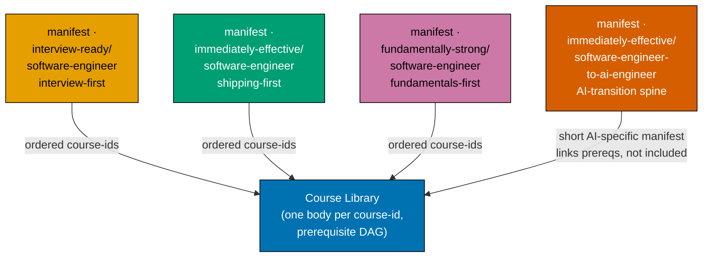

# Syllabus — Fundamentally Strong Shared Course Library + Path Manifests

This `syllabus/` folder is the design surface for a **shared course library** and the **path manifests**
built over it. It has three parts:

- **[courses/](./courses/README.md)** — the **per-course-block detail layer**: the index of the
  **127-course catalog** and one **`<course-id>.md`** detail file per course (concepts, worked examples,
  capstone spec). Courses have **no single order** here — order is a per-path property.
- **[paths/](./paths/README.md)** — the **path manifests**, each an ordered, prerequisite-consistent
  list of course IDs over the shared library.
- **This root README** — the architecture: how a course (building block) and a path (ordered manifest)
  relate, the paths at a glance, and the library-wide guarantees.

**Source of truth**: the [tech-docs §Course Library Catalog](../tech-docs.md#course-library-catalog)
(course ID, format, language, short summary) and [tech-docs §Path Manifests](../tech-docs.md#path-manifests)
(the path orderings) are authoritative. The [prd.md](../prd.md) holds the product spec (personas, user
stories, Gherkin, NEW-course specs). This folder adds the dimension the tables cannot hold: per course,
the concrete **Concepts** (`co-NN`), **Worked examples** (`ex-NN`), and **Capstone spec**; and per path,
the concrete ordered manifest.

## Core model — one shared library, composing path manifests

- **Course = standalone, path-neutral building block.** A course is a self-contained topic module
  (learning + drilling track) with a stable **course ID** (its kebab-case slug). One canonical body,
  one canonical URL (`/en/c/learn/courses/<course-id>`), authored once, never forked. Rendering a course
  with no path context shows its canonical standalone view.
- **Path = ordered manifest composing course-ids.** A path lists course IDs in a chosen order over a
  curated selection of the library; a course page reads the active path context (`?path=<path-id>`) and
  its prev/next + breadcrumb follow that path's order. Path landings live at
  `/en/c/learn/paths/<path-id>`. See
  [tech-docs §Path-Aware Navigation UI](../tech-docs.md#path-aware-navigation-ui-ayokoding-www).
- **Prerequisite DAG.** Every course declares `prerequisites: [course-id, ...]` in its canonical
  metadata; the library forms a **prerequisite DAG**. Each path manifest MUST be a valid topological
  entry into that DAG (a prerequisite-consistent ordering). The path manifests are different topological
  entries into the one DAG; the three `software-engineer` paths converge on the same software-engineering
  endpoint, while the AI-transition path converges on its own AI-engineering endpoint — convergence is
  **per role, not a single library-wide endpoint**.
- **Omit-or-create.** A path omits a course that does not fit its arc and creates a new course only for
  a real gap (added to the library, available to every path). Optional per-path framing is a
  lightweight intro/outro callout, never a body fork. When a path needs a genuinely different teaching
  approach for a topic, author a separate course _variant_ (distinct course-id); the default is still
  one shared, path-neutral block.

## The paths

The three `software-engineer` paths end at the **same software-engineering deep mastery** — only the
**entry point, journey ordering, and teaching emphasis** differ. The AI-transition path converges on a
distinct **AI-engineering** endpoint: convergence is **per role, not a single library-wide endpoint**
(see [README.md §per-role convergence](../README.md#four-paths-one-library-per-role-convergence) and
[tech-docs DD-22](../tech-docs.md#design-decisions)). `fundamentally-strong` is **both** the
library/section brand and the fundamentals-first `software-engineer` path's id.

- **[`interview-ready/software-engineer`](./paths/manifest-interview-ready-software-engineer.md)
  (interview-first)** — for an **experienced engineer re-entering the job market**: interview/job prep
  **first** → production-effective → deeper. Ships first. (Formerly `job-seeking`.)
- **[`immediately-effective/software-engineer`](./paths/manifest-immediately-effective-software-engineer.md)
  (shipping-first)** — for a **builder who wants to be effective fast**: editor → one language → build a
  real app **first** → then deepen. (Formerly the `fundamentally-strong` shipping-first path.)
- **[`fundamentally-strong/software-engineer`](./paths/manifest-fundamentally-strong-software-engineer.md)
  (fundamentals-first)** — university-style: CS theory and fundamentals **first** → breadth →
  application → deeper. (New path.)
- **[`immediately-effective/software-engineer-to-ai-engineer`](./paths/manifest-immediately-effective-software-engineer-to-ai-engineer.md)
  (AI-transition-first)** — for an **already-working software engineer transitioning to AI engineering**:
  assumes SWE competence (prerequisites **linked, not included**) and teaches **building** AI systems, not
  driving coding agents. Converges on a distinct AI-engineering endpoint. (**NEW**, 2026-07-20.)

## Skip / fast-path affordances (per path)

- **Interview-first** — skip the editor prologue; start at the stand-alone Phase 1; refresh register
  (re-ground a working engineer, not first-teach); skip any `just-enough-<lang>` primer you already own;
  phase-boundary bridges soften the two sharp transitions.
- **Shipping-first** — "already fluent in a language? jump straight to the build-an-app stage"; a
  Stage-2→Stage-3 bridge ("you shipped it; now understand why it worked") softens the shipping → CS-depth
  transition.
- **Fundamentals-first** — the editor prologue is skippable; primers are skippable ("if you already know
  X, jump to Y"); a Stage-8→Stage-9 bridge softens the internals-builds → application-development
  transition.
- **AI-transition-first** — fast because it **assumes competence**, not because it skips depth: every
  software-engineer prerequisite is **linked, not included** and reachable from each course page; skip any
  AI/harness cluster course you already own.

See [tech-docs §Smoothness Architecture](../tech-docs.md#smoothness-architecture-per-path).

## Principle-transfer productivity note (proof-of-transfer, NOT repo tutorials)

The library teaches **durable principles**; the seven target codebases
(`ose-public`/`ose-primer`/`ose-infra`, `remotebrowser`, `wazuh/wazuh`, `vacti`, `vacti-pentest-engine`)
are **evidence the principles transfer**, never subject matter. No course names any repo as its subject.
See [tech-docs §Productive in Target Codebases](../tech-docs.md#productive-in-target-codebases-proof-of-transfer-outcome-anchor).
This anchor justifies the **library** and is inherited by all paths.

---

Next: [courses/README.md — the 127-course catalog](./courses/README.md) ·
[paths/README.md — the path manifests](./paths/README.md)
</content>
</invoke>
