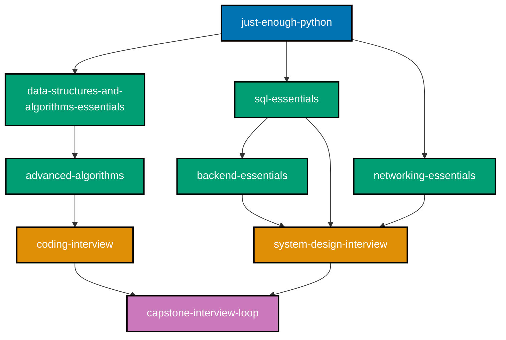
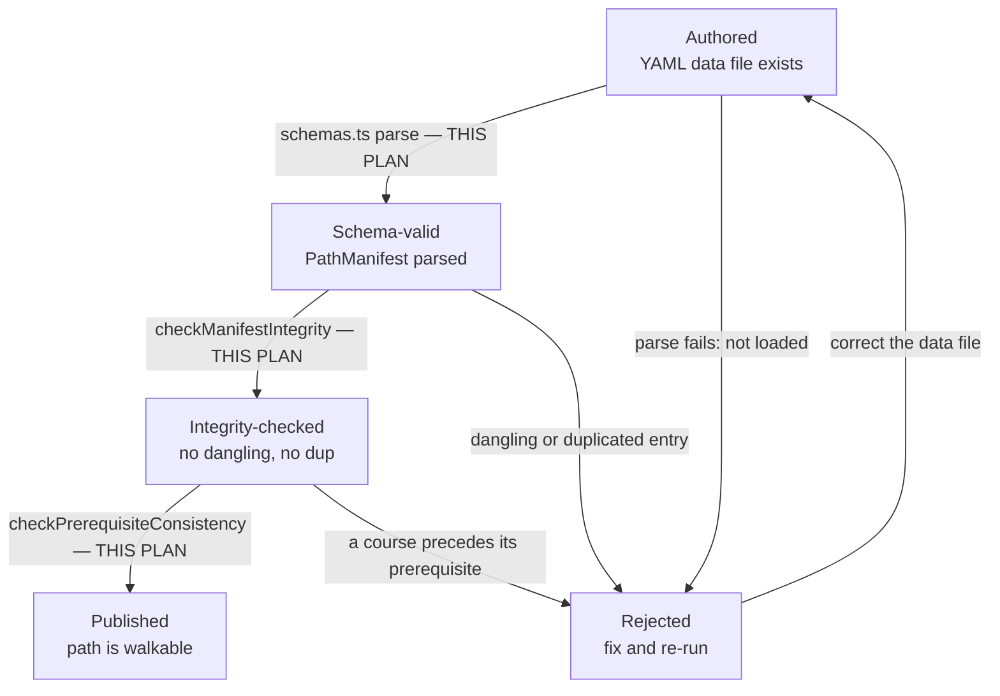
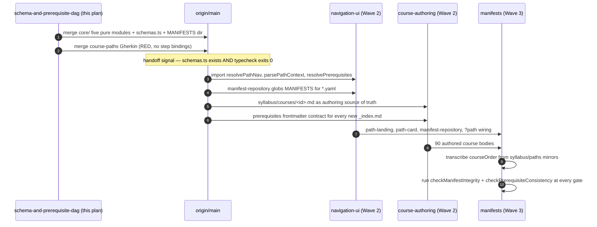

# Technical Documentation — Learning Path Schema and Prerequisite DAG

## Overview

This plan creates the `course-paths` feature's **pure functional core** inside `ayokoding-www`, plus
the two data contracts it operates over: the **course-prerequisite frontmatter contract** and the
**`PathManifest` schema**. It creates no component, no route, and no rendered page.

`ayokoding-www` is a Next.js app [Repo-grounded — `apps/ayokoding-www/next.config.ts`,
`apps/ayokoding-www/src/app/[locale]/(content)/[...slug]/page.tsx`] following the repo's
**functional-core/imperative-shell** feature layout, `src/features/<name>/{core,shell}`
[Repo-grounded — `apps/ayokoding-www/src/features/{content,navigation}/{core,shell}` all exist]. The
`course-paths` feature is **new**: `test -d apps/ayokoding-www/src/features/course-paths` returns
non-zero on `origin/main` today [Repo-grounded — verified 2026-07-21]. This plan creates its `core/`
half; `ayokoding-learning-path-03-navigation-ui` creates its `shell/` half.

## Path constants

Used throughout this document and `delivery.md`. Reproduced verbatim in all five split plans — a
checklist whose `<FEAT>` placeholders cannot be expanded is not executable.

- `<COURSES>` = `apps/ayokoding-www/content/en/learn/courses/` (course bundles; served at `/en/learn/courses/<course-id>`)
- `<PATHS>` = `apps/ayokoding-www/content/en/learn/paths/` (thin path-landing anchors; served at `/en/learn/paths/<path-id>`)
- `<SE_OLD>` = `apps/ayokoding-www/content/en/learn/fundamentally-strong/software-engineer/` (legacy home of the 33 shipped topics + 4 existing capstones, incl. `capstone-solid-core` — the re-home source)
- `<FEAT>` = `apps/ayokoding-www/src/features/course-paths/`
- `<MANIFESTS>` = `<FEAT>manifests/` (standalone YAML data files, nested to mirror slash path ids —
  `<MANIFESTS><path-id>.yaml`; `<path-id>` is **variable-depth**: `careers/<arc>/<role>` (3 segments) or
  `skills/<subject>` (2 segments) — see
  [§Variable-depth `pathId`](#variable-depth-pathid-careers-vs-skills--r2-r8))
- `<LEGACY>` = `apps/ayokoding-www/content/en/learn/legacy/` (**new bucket**, scope extension; served at `/en/learn/legacy/<domain>/…`)
- `<REDIR>` = `apps/ayokoding-www/src/redirects/`
- `<SPECS>` = `specs/apps/ayokoding/behavior/ayokoding-www/gherkin/course-paths/`
- `<NAVSPECS>` = `specs/apps/ayokoding/behavior/ayokoding-www/gherkin/navigation/` (existing domain — the three-bucket Gherkin lands beside `content-namespace-redirects.feature`)
- **This plan is careers-only** (R4): the 4 path ids it owns are `careers/interview-ready/software-engineer`,
  `careers/immediately-effective/software-engineer`, `careers/fundamentally-strong/software-engineer`,
  `careers/immediately-effective/ai-engineer` (fourth path, corrected 2026-07-21 — see
  [§Path `careers/immediately-effective/ai-engineer`](#path-careersimmediately-effectiveai-engineer-fourth-path-corrected-2026-07-21) —
  manifest at `<MANIFESTS>careers/immediately-effective/ai-engineer.yaml`). A sibling `skills/` category
  (2 path ids, e.g. `skills/enterprise-resource-planning`) exists in the wider programme but is out of
  this plan's scope — see [§Ownership split](#ownership-split-careers-vs-skills--r4).

## Architecture — the pure core this plan builds

```text
apps/ayokoding-www/src/features/course-paths/          # NEW feature — this plan creates core/
├── core/                      # PURE — no IO. THIS PLAN.
│   ├── schemas.ts             # PathManifest zod schema (pathId, title, description, courseOrder[])
│   ├── manifest.ts            # PathManifest type + course-ref normalization (id | {id, framing})
│   ├── path-nav.ts            # resolvePathNav(manifest, courseId) -> {prev, next} (pure)
│   ├── path-context.ts        # parsePathContext(searchParams, manifests) -> pathId | null
│   ├── prerequisites.ts       # resolvePrerequisites + checkPrerequisiteConsistency (pure)
│   ├── manifest-integrity.ts  # checkManifestIntegrity(manifest, libraryCourseIds) (pure)
│   └── *.test.ts              # unit tests for every resolver, checker, and the context parser
├── manifests/                 # THIS PLAN creates the directory + README.md, EMPTY of .yaml
│   └── README.md              # notes that <path-id>.yaml data files land here later
└── shell/                     # NOT this plan — ayokoding-learning-path-03-navigation-ui
```

Plus one edit outside the feature:
`apps/ayokoding-www/src/features/content/core/content-url.ts` [Repo-grounded — file exists] gains an
optional `pathId` param and the canonical `/en/learn/courses/<course-id>` shape.

### Module interaction


**Accessibility note.** Ownership is carried by node shape (rectangle = this plan, stadium =
downstream, cylinder = data contract) **and** by each node's own label naming its owning plan, never
by colour alone. Call direction versus downstream consumption is carried by line style (solid versus
dotted) **and** by the edge labels. Fills use the verified accessible palette (`#0173B2` blue,
`#029E73` teal, `#DE8F05` orange) with black borders and WCAG-AA-contrasting text, per the
[Color Accessibility Convention](../../../repo-governance/conventions/formatting/color-accessibility.md).

## Course-block schema

Each course block carries this canonical metadata (the body is authored once and never forked):

| Field                           | Meaning                                                                                                                                            |
| ------------------------------- | -------------------------------------------------------------------------------------------------------------------------------------------------- |
| `course-id`                     | Stable kebab-case slug (e.g. `coding-interview`). No numeric order prefix — order is a per-path property, never a body property.                   |
| Canonical body                  | One bundle at `content/en/learn/courses/<course-id>/`, one canonical URL.                                                                          |
| `prerequisites: [course-id, …]` | **EVERY course declares this.** The union of all `prerequisites` edges forms the library's **prerequisite DAG**. Entry-point courses declare `[]`. |
| Format                          | `Primer` / `By Example` / `Annotated-concept` (or a capstone milestone kind).                                                                      |
| Primary language                | The course's primary teaching language (or `none` for concept-only).                                                                               |

Additional rules:

- **Prerequisites are surfaced on the page.** The canonical course page renders its declared
  `prerequisites` (each linking to its own canonical course). This is path-independent — it is the
  body's own honest dependency statement. (The rendering itself is
  `ayokoding-learning-path-03-navigation-ui`'s; the resolver behind it is this plan's.)
- **Manifests must be prerequisite-consistent.** Every path's `courseOrder` must be a **valid
  topological ordering**: no course precedes any of its prerequisites **within that path's order**.
  This is a machine-checkable gate — see
  [Manifest integrity invariants](#manifest-integrity-invariants-verified-as-gates--unit-tests).
- **Per-path framing is a callout, never a body fork.** A path may attach an optional lightweight
  intro/outro framing callout around a shared block; the shared body itself is never modified per path.
- **Path context via `?path=<path-id>`.** Prev/next + breadcrumb follow that path's manifest ordering;
  no context → canonical standalone view.

## The prerequisite frontmatter contract (canonical here)

> **Canonical owner: this plan.** `ayokoding-learning-path-01-url-restructure` **writes** this field
> into 37 re-homed `_index.md` files while this plan **defines its shape**. Both plans are Wave 1 and
> merge independently, so nothing serialises them — which is why the contract is **reproduced
> verbatim in both plans' `tech-docs.md`** rather than linked across folders. **If the two statements
> ever diverge, this plan's wins.**

The contract, stated in full:

```yaml
# apps/ayokoding-www/content/en/learn/courses/<course-id>/_index.md — frontmatter
prerequisites:
  - data-structures-and-algorithms-essentials
  - just-enough-python
```

Binding rules:

1. The key is exactly `prerequisites` — lowercase, plural, no prefix, no namespace.
2. Its value is a **YAML sequence of course-ID strings**. Each string is a stable kebab-case course
   slug, identical to the course's directory name under `<COURSES>`.
3. An entry-point course with no prerequisites declares an **empty sequence** (`prerequisites: []`),
   never an omitted key and never `null`. The resolver treats an omitted key as an empty list, but a
   body that omits the key is a contract violation, because a missing declaration and a deliberate
   "no prerequisites" are then indistinguishable to a reviewer.
4. IDs reference **courses**, never paths, never URLs, never file paths.
5. The list is **unordered** — it is a set of edges into the DAG, not a reading order. Order is the
   manifest's job (DD-1).
6. A referenced ID that is not in the library is a **resolver miss**, not a crash:
   `resolvePrerequisites` returns only the IDs it can resolve, and `checkPrerequisiteConsistency`
   reports the rest.

**Why this failure mode is dangerous.** The field is inert until a Wave-2 consumer reads it. If
`ayokoding-learning-path-01-url-restructure` writes a shape this plan's resolver does not parse —
say a comma-separated string, or a nested `meta.prerequisites` — **nothing fails in Wave 1**. Both
plans merge green. The defect surfaces much later, inside
`ayokoding-learning-path-03-navigation-ui`, as 37 course pages rendering an empty prerequisite list
with a passing build and no error anywhere. Duplication of a six-line contract is a cheap insurance
premium against that.

## Prerequisite DAG (illustrative excerpt)

The full DAG is the union of every course's `prerequisites` edges. A representative slice:



Each of the four path manifests is a distinct topological walk over this DAG that respects every
edge. `checkPrerequisiteConsistency` is the function that proves a given walk respects them.

## Path = ordered manifest (manifest format)

- A **path** is a manifest: a **path ID**, an **arc**, a display **title**, a **description**, and an
  ordered **`courseOrder`** list of course IDs. See
  [§Variable-depth `pathId`](#variable-depth-pathid-careers-vs-skills--r2-r8) for why `arc` is its own
  field, separate from `pathId`.
- **Storage**: each manifest is a standalone data file under `<MANIFESTS>` — the loader globs
  `manifests/**/*.yaml` and a **slash in a path ID becomes a nested directory** (e.g.
  `manifests/careers/interview-ready/software-engineer.yaml`, or, for the 2-segment `skills/` category
  owned by a separate plan, `manifests/skills/enterprise-resource-planning.yaml`). This data file is
  the **single machine-consumed source of truth** for the path — it is NOT `courseOrder` frontmatter on
  any content `_index.md`.

  ```yaml
  # apps/ayokoding-www/src/features/course-paths/manifests/careers/interview-ready/software-engineer.yaml
  pathId: careers/interview-ready/software-engineer
  arc: interview-ready
  title: "Interview-Ready Software Engineer"
  description: "Interview-first track for an experienced engineer re-entering the market."
  courseOrder:
    - just-enough-nvim
    - just-enough-lua
    - extending-neovim
    - just-enough-python
    - capstone-forge-ready
    # … ordered course IDs, prerequisite-consistent …
  ```

- **Human-readable mirror**: the per-path files under `syllabus/paths/` in this plan folder are the
  human-readable orderings used during authoring and review. The machine-consumed source of truth is
  the nested `manifests/**/*.yaml` data file above.
- **Course reference**: each `courseOrder` entry is a course ID string, optionally a mapping
  `{ id, framing?: { intro?, outro? } }` when the path adds a **lightweight per-course framing**
  callout. The framing is rendered by the path layer around the shared body; the body itself is never
  modified. `manifest.ts` normalizes both forms to one internal shape so no downstream caller has to
  branch on it.

## Variable-depth `pathId` (careers vs. skills — R2, R8)

**Ruling, 2026-07-21.** `pathId` is the slash-shaped id after `paths/`, and it is **variable-depth by
design**: `careers/<arc>/<role>` (3 segments) or `skills/<subject>` (2 segments). This plan's schema,
`?path=` parser (`path-context.ts`), and `<MANIFESTS>` directory globbing must all handle **both**
depths from day one, without hardcoding either — and this plan is careers-only (R4), so it is the
`careers/` (3-segment) shape that this plan's own four manifests actually instantiate; the 2-segment
shape is exercised only via unit-test fixtures proving the code does not silently assume 3 segments.

- **Do NOT hardcode a 3-segment assumption anywhere** — not in `schemas.ts`'s zod refine, not in
  `path-context.ts`'s parsing, not in the `<MANIFESTS>` glob pattern (`manifests/**/*.yaml` already
  matches any depth; nothing here needs to change for that reason alone).
- **Do NOT encode "skills always has exactly 2 segments" as a validated invariant.** That is precisely
  the constraint the ruling keeps open, so that a future `skills/<arc>/<subject>` (3 segments) is a
  purely additive change, never a breaking URL/schema migration.
- **DO validate that the first segment is one of `careers` | `skills`**, and that the id resolves to a
  loaded manifest. Depth itself is never the thing asserted.
- **`arc` is a required manifest field, independent of the URL grammar (R8).** Every `PathManifest` —
  careers or skills — carries an explicit `arc` string. For `careers/*` paths the arc is also the
  `pathId`'s middle segment (`interview-ready`, `immediately-effective`, or `fundamentally-strong`).
  For `skills/*` paths the arc is **omitted from the URL** (every skills path is currently the
  `immediately-effective` arc — R8 — so naming it in every URL would be noise) but **still present in
  the manifest data**. Conflating "arc" with "a URL segment" is the trap: modelling skills paths as
  arc-less would make a future second skills arc a schema migration **and** a URL migration — exactly
  what R2 forbids. Keeping `arc` a required field regardless of category means only the URL grammar
  would ever need to widen.
- **Unit-test proof of depth-independence** (Phase 1.2, `schemas.test.ts`): a fixture manifest with a
  2-segment `skills/<subject>` `pathId` and a fixture manifest with a 3-segment `careers/<arc>/<role>`
  `pathId` both validate successfully through the same `PathManifestSchema`, and a fixture whose
  `pathId` starts with neither `careers/` nor `skills/` is rejected. No fixture asserts a specific
  segment count.

This plan does not itself validate that a `skills/` manifest exists or resolves to any real content —
the `skills/` category, its manifests, and its corpus are owned end-to-end by a separate, not-yet-created
plan (see [§Ownership split](#ownership-split-careers-vs-skills--r4)). What this plan guarantees is that
its own schema and resolvers never structurally prevent that plan's manifests from loading.

### Canonical `pathId` form (2026-07-21 ruling — binding on every sibling plan)

**This plan owns the `pathId` definition; this ruling is citable by every plan that writes or reads
one.** It resolves a live discrepancy: plan
`ayokoding-learning-path-01-url-restructure` (and possibly others) used a **2-segment shorthand**
for careers paths (`interview-ready/software-engineer`) instead of the 3-segment canonical form
(`careers/interview-ready/software-engineer`). Ruled as follows.

> **Canonical form.** `pathId` is always the **full path string including its category segment as
> the first `/`-delimited token** — `careers/<arc>/<role>` (3 segments) or `skills/<subject>`
> (2 segments). There is **no separate `category` field**: the category is the first segment of the
> one `pathId` string, never a field carried alongside it.

1. **Full form, not a 2-field split.** `PathManifest` has exactly one identifier field, `pathId`,
   never a `pathId` + `category` pair. Splitting them would let the two drift (a manifest's `category`
   field disagreeing with its own `pathId`'s first segment) for no benefit — a single string is both
   the URL suffix (`/en/learn/paths/<pathId>`), the YAML file's nested path
   (`<MANIFESTS><pathId>.yaml`), and the `?path=` query value, so keeping it one string keeps all
   three uses trivially in sync.
2. **A bare 2-segment careers shorthand is never legal — not an alias, not a legacy form. It is
   invalid.** `interview-ready/software-engineer` is **structurally indistinguishable in arity** from
   a 2-segment `skills/<subject>` id (R2's own point: a fixed-arity assumption anywhere is already
   wrong, which is exactly why an arity-only-implied-category shorthand is hazardous). The schema's
   `.refine()` checks the **literal value** of the first segment, not segment count — so
   `interview-ready/software-engineer`'s first segment (`interview-ready`) is neither `careers` nor
   `skills` and `PathManifestSchema.safeParse(...)` **rejects it outright**, exactly like any other
   malformed `pathId`. No code path in this plan special-cases or coerces the 2-segment shorthand.
3. **Resolution of the other form is a hard, typed validation failure — never silent acceptance.**
   `safeParse` returns `success: false`; nothing in this plan's core normalizes, upgrades, or aliases
   a category-less careers id into its 3-segment canonical form. Silent acceptance is exactly the
   failure mode this ruling forecloses: it would let two spellings of the same path coexist and
   diverge without anything failing (per the concern that prompted this ruling). Any plan whose
   content still writes the 2-segment shorthand for a careers path (plan 01, confirmed; possibly
   others) is citing an **invalid** `pathId` and must update to the 3-segment canonical form — that
   conformance sweep is **not** this plan's to run (see the escalation-response note below).

**Filename convention for `syllabus/paths/manifest-*.md` mirrors.** These filenames do **not** encode
the category today (`manifest-interview-ready-software-engineer.md`,
`manifest-immediately-effective-ai-engineer.md` — arc + role, dash-joined, no `careers` marker),
per the flat dash-joined convention this plan's four mirrors already shipped under. Ruling: **the four
existing careers mirror filenames are not renamed** — no collision risk exists today (the careers
vocabulary — three arcs, two roles — shares no token with any skills subject), and renaming
already-settled filenames is pure churn with no correctness benefit. **Going forward, a skills
manifest mirror filename MUST carry an explicit `skills-` marker** — `manifest-skills-<subject>.md`
(e.g. `manifest-skills-accounting.md`, `manifest-skills-enterprise-resource-planning.md`) — keeping
the same flat dash-joined shape (no literal slash in the filename) but making the category
unambiguous in the filename itself, by design rather than by vocabulary coincidence. This asymmetry
(careers unmarked, skills marked) is deliberate: the careers filenames are locked, shipped-adjacent
history; the skills filenames do not exist yet, so there is zero cost to making them collision-proof
from the start. This is **this plan's ruling for its own `syllabus/paths/` mirrors and the pattern it
recommends**; it does not itself create or rename any skills-owning plan's files (owned end-to-end by
the skills plans, R4) — those plans decide their own mirror location, and are pointed at this ruling
for the naming pattern to apply if their own folder uses an equivalent mirror concept.

**Escalation-response note.** This ruling is recorded here so it is citable; it does not itself edit
`ayokoding-learning-path-01-url-restructure` or any other sibling plan folder — those stay out of
scope for this plan-fixer pass (folder-scope restriction) and are conformed by whoever runs the
cross-plan sweep.

### The `PathManifest` zod schema

The schema is written in `<FEAT>core/schemas.ts` using **zod 4.3.6** [Repo-grounded —
`apps/ayokoding-www/package.json` declares `"zod": "4.3.6"`], the version already on the app's
dependency list. Shape:

- `pathId` — string, the slash-form path ID. Validated (via `.refine()`) to start with `careers/` or
  `skills/`; **never** validated by segment count (R2).
- `arc` — string, **required** on every manifest regardless of category (R8). Not constrained to a
  fixed enum — new arcs (careers or skills) are expected to be added later without a schema change.
- `title` — string, display title.
- `description` — string, landing-page prose.
- `courseOrder` — array whose elements are either a course-ID string or an object carrying `id` and
  an optional `framing` object with optional `intro` and `outro` strings.

The schema is the **only** definition of a valid manifest. `manifest-repository.ts` (built by
`ayokoding-learning-path-03-navigation-ui`) parses each YAML file through it; a manifest that does
not validate is not loaded.

## Manifest integrity invariants (verified as gates + unit tests)

- Every `courseOrder` ID resolves to an existing course under `courses/<course-id>/` (no dangling ref).
- No course ID appears twice within one manifest.
- **Prerequisite-consistency**: for every course in a manifest, all of its declared `prerequisites`
  that are **also present in that manifest** appear **before** it. **Scope is ordering-only, not
  completeness**: a declared prerequisite that is simply **absent** from the manifest is not a
  violation and is never reported — see [§Link-don't-walk: prerequisite omission is
  permitted](#link-dont-walk-prerequisite-omission-is-permitted-oi-4-ruling-2026-07-21) for the
  binding ruling and the reasoning.
- No course body is duplicated per path (all manifests reference courses **by ID**, never copy a
  body) — a "no forked body" check.
- Course IDs are stable slugs; a re-home changes a body's URL (with a redirect) but never its ID.

This plan implements the first three as pure functions. The fourth and fifth are properties of the
authoring and manifest plans, enforced there.

### Manifest validation lifecycle



**Accessibility note.** This diagram uses no colour classes at all; every node and edge is
distinguished by label text alone.

Three of the four transitions above are gated by a function **this plan** ships. This plan ships no
manifest to run them against — `ayokoding-learning-path-05-manifests` does. The `Published` state is
reached only once `ayokoding-learning-path-03-navigation-ui` has a renderer for it.

### Path-context resolution — the decision branch


**Accessibility note.** Every branch carries an explicit edge label naming the condition that
selected it, and the two terminal outcomes differ by node shape (stadium versus hexagon) as well as
by colour. Fills use the verified accessible palette with black borders and WCAG-AA-contrasting text.

**Three of the four branches end in the canonical view.** That is deliberate — graceful fallback is a
first-class behaviour of the core, not an error path bolted on by the renderer.

## Link-don't-walk: prerequisite omission is permitted (OI-4 ruling, 2026-07-21)

**This section resolves a real contradiction** between this file's own prose and its own
implementation spec, surfaced by `ayokoding-learning-path-06-skills-accounting` as **OI-4** and
correctly routed here rather than fixed in that plan's folder. The prose formerly read: _"A path may
omit a prerequisite only if it also omits every course that needs it — enforced as a gate."_ That
sentence was **false as a description of `checkPrerequisiteConsistency`** — the function has never
enforced it, and its own TDD spec ([delivery.md §2.6](./delivery.md#26-tdd-cycle-6--checkprerequisiteconsistency-prerequisitests))
explicitly asserts the opposite: _"a prerequisite that is declared but omitted from the manifest is
not reported."_ Two documents inside the same plan disagreed; this section is the single ruling.

### 1. Direction and disposition

Two directions exist, and only one is at issue:

- **Direction A — a path includes a course but omits (links out to) its declared prerequisite.**
  **Permitted.** This is the pattern in question.
- **Direction B — a path includes both a course and its prerequisite.** Always legal and the common
  case; nothing here restricts it, and ordering between the two is still enforced (below).

**Ruling: Direction A is PERMITTED, not required, and not forbidden.** Grounded independently of any
single path's history:

1. **Curation already implies partial coverage (DL-2).** A path is defined as _"a curated subset of
   course IDs... freely omits courses that do not fit."_ A rule that forbade omitting a course's
   prerequisite while keeping the course itself would make ordinary curation nearly impossible — the
   overwhelming majority of non-trivial courses in a 121+-course library have _some_ declared
   prerequisite, so "keep the course, must therefore keep (or exclude) whole prerequisite chains"
   would collapse the curated-subset model DL-2 already establishes as this plan's foundational
   design.
2. **Manifest completeness is an editorial property, not a machine-checkable one — this plan already
   draws that line elsewhere.** [§Smoothness Architecture](#smoothness-architecture-per-path) already
   states that difficulty monotonicity, skip affordances, and the refresh register are editorial
   properties audited by a human, with prerequisite-**ordering** singled out as _"the one
   machine-checkable component."_ Whether an omitted prerequisite is _appropriate for this path's
   audience_ requires knowing who the path is for — information a pure function over a DAG and a
   `courseOrder` array does not and structurally cannot have. Extending the ruling to prerequisite
   **completeness** would contradict this plan's own already-drawn boundary between what a pure
   resolver can prove and what only an author/reviewer can judge.

### 2. Does the implementation match? (it already does — the prose was wrong)

**Yes, exactly.** `checkPrerequisiteConsistency`'s scope, as specified in
[delivery.md §2.6](./delivery.md#26-tdd-cycle-6--checkprerequisiteconsistency-prerequisitests), is
**ordering-only**: for each course in `courseOrder`, report every declared prerequisite that is
**both** in the library **and** in the same manifest but appears at a later index. A prerequisite
that is declared but **absent** from the manifest entirely produces no report — not because of a bug,
but because the function's RED spec contains an explicit assertion that this case must **not** be
reported. **The prose changed to match the implementation, not the reverse** — the implementation was
already correct and required no code change (none has been written yet; this plan has not started
Phase 0).

### 3. Distinguishing a legitimate linked prerequisite from a genuinely forgotten one

This is the genuinely hard question, and the honest answer has two parts.

**Part A — `checkPrerequisiteConsistency` cannot and should not try.** As established in §1.2 above,
"was this omission intentional" requires audience context the function never receives. Any attempt to
infer intent from the DAG alone (e.g., "flag it if the omitted prerequisite has many dependents" or
"flag it if it's a _direct_ rather than _transitive_ prerequisite") would be a heuristic standing in
for a judgment call, producing exactly the false-positive/false-negative churn this plan's own
[Anti-Hallucination](../../../repo-governance/development/quality/plan-anti-hallucination.md)
discipline warns against for machine-generated claims. **The check's silence in this direction is by
design, not a hole to be closed by more cleverness inside the function.**

**Part B — the actual distinguishing signal lives one layer up, in documentation, and this plan adds
one small, additive, non-breaking mechanism to make it checkable by a human reviewer without becoming
a hard gate.** A **legitimate** linked prerequisite is one the manifest's own human-readable mirror
(`syllabus/paths/manifest-*.md` for this plan's careers manifests; the equivalent mirror concept for
any other plan's manifests) **names explicitly** — e.g. a stated "Linked prerequisites (not included
in this path): `<course-id>`, ... — because `<reason>`" note. A **genuinely forgotten** prerequisite
has no such note anywhere. This is a **documentation-level, human-reviewable** distinction — the same
class of guarantee this plan already relies on for smoothness — not a schema field and not a new
required input, so it creates **zero new authoring burden** on any manifest-owning plan, including
the two that already conformed to this plan's other rulings.

**The additive mechanism**: `checkPrerequisiteConsistency`'s REFACTOR step
([delivery.md §2.6](./delivery.md#26-tdd-cycle-6--checkprerequisiteconsistency-prerequisitests)) now
also returns a second, purely **informational** list —
`linkedPrerequisites: { courseId, missingPrerequisiteId }[]` — enumerating every declared-but-absent
prerequisite the function already has enough data to compute (it is a read of the same
`prerequisitesByCourse` + `courseOrder` inputs the ordering check already uses; **no new manifest
field, no new required input, and no change to pass/fail semantics** — a manifest is never rejected
for anything on this list). A reviewer (or a future documentation-linting step, out of this plan's
scope to build) can then mechanically diff this list against the manifest's own "linked, not
included" prose: every ID present in `linkedPrerequisites` but **not named** in that prose is the
concrete, checkable signal of a plausibly-forgotten prerequisite — turning "look identical to the
checker" into "look identical to the checker, but not to a reviewer holding both artefacts side by
side." This is diagnostic tooling, not a gate; the manifest still validates either way.

## Downstream consumption



## Design Decisions

Five decisions are this plan's own, reproduced **verbatim** from the source plan with their
amendment annotations intact.

- **DD-1 · Order lives in the manifest, not the body.** Reading order is a per-path property carried by
  `courseOrder`, not by a global `weight`. One body cannot encode four orders; moving order to the
  manifest is what enables the shared library. The body keeps a `weight` only for the canonical
  (no-path) sidebar/prev-next fallback and the catalog sort.
- **DD-3 · Path-aware nav via `?path=` client context, not per-path URLs.** A course has exactly one
  URL; the active path rides in a query param. One canonical URL (no duplicate content / SEO split),
  shareable, with a clean fallback when the param is absent.
- **DD-6 · Every course declares `prerequisites` → a prerequisite DAG.** The union of all
  `prerequisites` edges is the library DAG; each manifest must be a valid topological ordering of it
  (a machine-checkable gate); the course page surfaces its prerequisites. The four paths are four
  entry points into the one DAG (amended 2026-07-20 — was three; see DD-22, DD-24). This is the
  structural guarantee that replaces ad-hoc "does this order read smoothly?" judgement with a
  checkable invariant.
- **DD-9 · Functional-core/imperative-shell for the nav feature.** Pure `resolvePathNav` /
  `parsePathContext` / `resolvePrerequisites` in `core/`; IO manifest loading + React in `shell/`.
  Matches the repo standard and makes the ordering/prereq logic unit-testable without IO.
- **DD-16 · Prerequisite-consistency is the audited smoothness property.** Each manifest is a verified
  topological ordering (DD-6); the old ad-hoc SF-1/SF-2 in-body forward-references are **eliminated** by
  making `just-enough-c` a prerequisite of `computer-architecture` and the language primers
  prerequisites of `building-production-cli-tools` (no course now precedes its own prereqs in any path).
- **R2 / R8 · Variable-depth `pathId` with a required `arc` field (2026-07-21 ruling; cited by R-number,
  not `DD-NN`, to avoid colliding with the numbering-gap tokens documented below).** `pathId` is
  `careers/<arc>/<role>` (3 segments) or `skills/<subject>` (2 segments); the schema validates only the
  first segment (`careers` | `skills`) and manifest resolvability, never segment count, so a future
  `skills/<arc>/<subject>` is purely additive. `arc` is a required `PathManifest` field independent of
  the URL grammar — present even where the URL omits it (every `skills/*` path, always the
  `immediately-effective` arc per R8). See
  [§Variable-depth `pathId`](#variable-depth-pathid-careers-vs-skills--r2-r8).

**Referenced but not owned here.** DD-2 (one canonical body + URL, re-home with redirects) and DD-40
(three structural buckets) are owned by `ayokoding-learning-path-01-url-restructure`; DD-4 (graceful
canonical fallback) is owned by `ayokoding-learning-path-03-navigation-ui`; DD-15 and DD-27 (build
order) are cross-cutting and reproduced in this plan's `README.md`.

### The DD-34 / DD-35 / DD-39 numbering gap is deliberate

Restated **verbatim** from the source plan (`tech-docs.md:1837-1844`), so that no future reader
"closes" the apparent gap and rewrites 276 tokens whose meanings belong to a different, closed plan:

> **The following six decisions (DD-40 through DD-45) were made in the 2026-07-21 learn-section
> scope-extension pass.** They are numbered from **40**, not 34: the tokens `DD-34`, `DD-35`, and
> `DD-39` are already in use **inside this plan's own folder** — they appear throughout
> `syllabus/courses/**` carrying **FS-SE-inherited** meanings (concept enumeration, primary-source
> citation policy, typed-Python policy) rather than this document's numbering
> [Repo-grounded — `grep -rl "DD-3[4-9]" syllabus/courses/`, run from this plan folder, lists 94
> files; every occurrence outside `syllabus/` is prose about this very collision]. Starting at 40
> keeps every `DD-NN` token in this plan folder unambiguous for an execution-grade reader.

Occurrence counts, verified: `DD-34` 113, `DD-35` 114, `DD-39` 49. `DD-36`, `DD-37` and `DD-38` are
unused anywhere. **Never renumber.**

## `syllabus/` folder structure and custody

This plan's `syllabus/` directory carries the human-readable mirror of the library and the four
paths — **128 files**:

- `syllabus/README.md` — overview of the library + the four paths.
- `syllabus/courses/` — **121 per-course spec files** + `README.md` (122 directory entries). One file
  per course-id, each stating origin, format, primary language, `prerequisites`, and scope.
- `syllabus/paths/` — **4 path-manifest mirrors** + `README.md` (5 directory entries):
  `manifest-interview-ready-software-engineer.md`,
  `manifest-immediately-effective-software-engineer.md`,
  `manifest-fundamentally-strong-software-engineer.md`, and — **renamed 2026-07-21, R3 custody
  exception** (was `manifest-immediately-effective-software-engineer-to-ai-engineer.md`) —
  `manifest-immediately-effective-ai-engineer.md`.

These markdown files are documentation mirrors; the machine-consumed source of truth for each path is
the nested `manifests/**/*.yaml` data file in the `course-paths` feature.

### Custody rules (binding)

1. **This plan owns the folder and performs no content edit inside it, with exactly one recorded
   content exception (rule 2).** The corpus's curriculum content — course specs, orderings,
   pedagogical framing — arrived settled and is never re-derived, added to, or removed by this plan,
   **except** the single R3 content exception below. This is distinct from — and does not conflict
   with — the mechanical, non-substantive correction in rule 1a.
   1. **1a — Mechanical `careers/`-prefix correction (not a content exception).** This plan-fixer
      pass corrected the path-id **strings** already present in `syllabus/README.md`,
      `syllabus/paths/README.md`, and all four manifest mirrors, to carry the `careers/` category
      prefix R1/R2 made canonical. This is a **string substitution**, never a curriculum, ordering,
      or framing decision — the same class of change as repointing a link after a rename (rule 5),
      required because the R1/R2 URL-grammar ruling changed every path id's canonical spelling
      programme-wide (see [§Canonical `pathId`
      form](#canonical-pathid-form-2026-07-21-ruling--binding-on-every-sibling-plan)); leaving the
      corpus's own cross-references citing a `pathId` form the schema itself now rejects would make
      the corpus internally broken, not merely stale. It does **not** count against the "one content
      exception" invariant, and no delivery step performs it — like the R3 exception's rename, it
      was applied directly in this plan-authoring pass, before Phase 0.
2. **The R3 custody exception (2026-07-21 ruling).** `careers/immediately-effective/ai-engineer`
   (formerly modelled as a transition path assuming SWE competence, prerequisites linked not included)
   is now a genuine from-scratch path. This is a **content change, not a rename** — the retired
   framing is factually wrong once the ruling lands, so leaving it unedited would mean this plan
   custodies a known-incorrect corpus rather than a frozen-but-correct one. The rename
   (`manifest-immediately-effective-software-engineer-to-ai-engineer.md` →
   `manifest-immediately-effective-ai-engineer.md`) and the top-matter/composition-framing correction
   were performed directly in this pass; the detailed stage-by-stage re-ordering of the newly-included
   prerequisite courses is **pending**, tracked as
   [delivery.md Phase 1.4](./delivery.md#14-syllabus-custody-exception--ai-engineer-path-correction-r3).
   No new course body was authored — every included course is an existing library course (2026-07-21
   clarification to R3); the growth is a manifest-composition change, owned by
   `ayokoding-learning-path-05-manifests` in its eventual YAML transcription, not by
   `ayokoding-learning-path-04-course-authoring`. **The rename's one mechanical corollary**: the
   in-corpus link to the old filename in `syllabus/courses/README.md`'s path list was repointed to
   the new filename in the same pass, for the same reason the Phase 7 archival move repoints its own
   inbound links in the same commit (see [README.md §Archival is gated on downstream
   archival](./README.md#archival-is-gated-on-downstream-archival)) — a rename obligates fixing its
   own inbound references; that is a mechanical corollary of the one recorded exception, not a
   second, independent content exception.
3. **The other four plans link into it and never copy it.** A copy forks the source of truth for 121
   course specs and four manifest orderings, so a later spec correction lands in one copy only.
4. **Cross-plan references use the full relative path** —
   `../ayokoding-learning-path-02-schema-and-prerequisite-dag/syllabus/<rest>` while both plans sit
   in the same stage folder. The source plan's `./syllabus/...` form resolves to nothing from any
   other folder.
5. **Archival repoints every inbound link in the same commit as the move.** See
   [delivery.md Phase 7](./delivery.md#phase-7-plan-archival-and-cross-plan-link-repoint).

## Sections that route to sibling plans

The `syllabus/` corpus custodied here carries **28 back-references** into this plan's `tech-docs.md`,
`prd.md` and `README.md`, targeting sections that the five-way split routed to **other** plans. The
corpus is frozen — no step in this plan edits a file under `syllabus/` — so those anchors are kept
resolvable from **this** side instead, as pointer sections.

Each heading below exists **only** to keep an inbound anchor alive and to name the plan that now owns
that content. None of them duplicates the content itself: duplicating a 200-line catalog or a
four-manifest ordering would fork exactly the source of truth this split exists to keep singular.

The 12 distinct broken targets and their owners:

| Anchor target                                                 | Owning plan                                       |
| ------------------------------------------------------------- | ------------------------------------------------- |
| `tech-docs.md#course-library-catalog`                         | `ayokoding-learning-path-04-course-authoring`     |
| `tech-docs.md#path-manifests` (and its four per-path anchors) | `ayokoding-learning-path-05-manifests`            |
| `tech-docs.md#path-aware-navigation-ui-ayokoding-www`         | `ayokoding-learning-path-03-navigation-ui`        |
| `tech-docs.md#smoothness-architecture-per-path`               | `ayokoding-learning-path-05-manifests`            |
| `prd.md#new-course--capstone-specifications`                  | `ayokoding-learning-path-04-course-authoring`     |
| `README.md#four-paths-one-library-per-role-convergence`       | this plan's `README.md` (carried as real content) |

### Course Library Catalog

Moved to **`ayokoding-learning-path-04-course-authoring`**. The catalog enumerates the **127-course
careers/software-engineering library** (121 software-engineer-role baseline + 6 net-new AI-engineering
courses, DD-28) — this figure is the careers-only total (R4/R5); the `skills/` category's ERP +
accounting corpus is additional and owned end-to-end by a separate, not-yet-created plan. The
authoritative per-course detail is [`syllabus/courses/`](./syllabus/courses/README.md), custodied
here.

### Path Manifests

Moved to **`ayokoding-learning-path-05-manifests`**, which owns every **careers** manifest file and
every manifest mutation — **exactly the 4 manifests below**, not 6 (R4). A sibling `skills/` category
(2 manifests) is owned end-to-end by a separate plan; see
[§Ownership split](#ownership-split-careers-vs-skills--r4). The authoritative human-readable orderings
are [`syllabus/paths/`](./syllabus/paths/README.md), custodied here; each YAML manifest's `courseOrder`
is transcribed from its mirror.

#### Path `careers/interview-ready/software-engineer` (interview-first)

Ordering owned by `ayokoding-learning-path-05-manifests`; mirror at
[`syllabus/paths/manifest-interview-ready-software-engineer.md`](./syllabus/paths/manifest-interview-ready-software-engineer.md).

#### Path `careers/immediately-effective/software-engineer` (build-fast-first)

Ordering owned by `ayokoding-learning-path-05-manifests`; mirror at
[`syllabus/paths/manifest-immediately-effective-software-engineer.md`](./syllabus/paths/manifest-immediately-effective-software-engineer.md).

#### Path `careers/fundamentally-strong/software-engineer` (theory-first)

Ordering owned by `ayokoding-learning-path-05-manifests`; mirror at
[`syllabus/paths/manifest-fundamentally-strong-software-engineer.md`](./syllabus/paths/manifest-fundamentally-strong-software-engineer.md).

#### Path `careers/immediately-effective/ai-engineer` (fourth path, corrected 2026-07-21)

Ordering owned by `ayokoding-learning-path-05-manifests`; mirror at
[`syllabus/paths/manifest-immediately-effective-ai-engineer.md`](./syllabus/paths/manifest-immediately-effective-ai-engineer.md).
Added 2026-07-20 as a transition path; **corrected 2026-07-21 (R3)** to a from-scratch path — see
[§Custody rules](#custody-rules-binding), rule 2.

## Ownership split (careers vs. skills — R4)

**Ruling, 2026-07-21.** Plans 01-05 (this plan included) absorb the `careers/` URL category segment and
its content; their wave DAG (W1: 01, 02 · W2: 03, 04 · W3: 05) is unchanged, and they stay
**careers-only**. A new, not-yet-created "plan 06" owns the `skills/` category **end-to-end** — both
path landings, both manifests (`skills/enterprise-resource-planning`, `skills/accounting`), and the
full ERP + accounting course corpus (syllabus specs and authored bodies). Neither category's plans
touch the other's manifests, corpus, or landing pages.

This scopes the manifest-ownership invariant **per category**, not globally: `ayokoding-learning-path-05-manifests`
is the sole owner of the **4 careers manifests** (unchanged from its original "owns every manifest
file" framing, now stated precisely as careers-only); the separate skills plan is the sole owner of the
**2 skills manifests**. Neither owns the other's. Every place in this plan's docs that states "the
manifest owner" or "four manifests" is scoped to careers — see the corrections in
[§Path constants](#path-constants), [§`syllabus/` folder structure](#syllabus-folder-structure-and-custody),
and [§Path Manifests](#path-manifests) above.

This plan's own surface (schema, resolvers, `<MANIFESTS>` directory) is **category-agnostic by
construction** (see [§Variable-depth `pathId`](#variable-depth-pathid-careers-vs-skills--r2-r8)) — it
does not need to know about the skills category's existence to remain correct for it, which is the
point of not hardcoding depth or category-specific assumptions.

### Path-Aware Navigation UI (ayokoding-www)

Moved to **`ayokoding-learning-path-03-navigation-ui`**, which owns the `shell/` half of the
`course-paths` feature, the `?path=` route wiring, the path rail, the path banner, the paths hub, and
the whole UI design funnel. This plan owns only the pure `core/` half those components import — see
[Architecture](#architecture--the-pure-core-this-plan-builds).

### Smoothness Architecture (per-path)

Moved to **`ayokoding-learning-path-05-manifests`**, which runs the per-path smoothness audits. The
one machine-checkable component of smoothness — prerequisite-consistency, DD-16 — is implemented here
as `checkPrerequisiteConsistency`; everything else in the smoothness architecture (difficulty
monotonicity, skip affordances, refresh register) is an editorial property of a manifest and is
audited there.

## Orphan-segment / one-pathId-one-page investigation (R7)

**Task, 2026-07-21**: the decision record's R7 asks every plan touching path ids to check whether its
own surface assumes a `pathId` maps to exactly one renderable page — since `/paths/careers/` (category
landing) and `/paths/careers/<arc>/` (arc landing) are now also pages, alongside the existing per-role
path landing (`/paths/careers/<arc>/<role>`). Findings below are reported per the task's own
instruction even though the fix, if any is needed, belongs to a sibling plan.

- **This plan's four core modules never assume 1:1 `pathId` → page.** `parsePathContext` and
  `resolvePathNav` (`path-context.ts`, `path-nav.ts`) treat `pathId` as an **opaque string**, matched
  only against the set of loaded manifests — they resolve "does a manifest with this id exist," never
  "is there exactly one page for this id." `manifest-integrity.ts` operates purely over the manifest
  set, with no page-count assumption. None of the four would need to change if a `pathId` were reachable
  from more than one page, or from none.
- **`content-url.ts`'s `contentUrl` only ever builds one URL shape**: the canonical course page,
  optionally carrying `?path=<pathId>`. It has no function that constructs or enumerates an
  **arc-landing** (`/paths/careers/<arc>/`) or **category-landing** (`/paths/careers/`,
  `/paths/skills/`) URL — those two page types are entirely outside this plan's surface.
- **Conclusion**: this plan's schema/resolvers are **already category-and-depth-agnostic** (R2) and, as
  of R8, every `PathManifest` carries an explicit `arc` field independent of the URL. That means the
  data downstream breadcrumb/hub components need to derive an arc-landing or category-landing URL
  (arc string, category string) is **already present** in this plan's schema output — no new pure
  function is needed here to support that. Whether a `pathId`-adjacent function to construct those two
  new page-type URLs is actually needed, and where it should live, is **not this plan's call**: per R7's
  own table, `/paths/careers/` and `/paths/careers/<arc>/` are pages owned by
  `ayokoding-learning-path-01-url-restructure` (routing/IA) and rendered by
  `ayokoding-learning-path-03-navigation-ui` (hub/breadcrumbs). This plan does not add a URL-building
  function for them, and this finding is reported to those plans' agents rather than acted on here.

## UI-gate and API-gate posture (R9)

Both postures are declared explicitly. Per the
[api-quality-gate workflow](../../../repo-governance/workflows/api/api-quality-gate.md)'s
§Relationship to Other Gates, a plan bearing neither surface **is not thereby exempt** — exemption
belongs only to a plan with no reachable behavioural delta at all, and it must be stated here.

### UI gate — **exempt**, and here is the reasoning rather than the assertion

`swe-ui-checker` validates component **source** — it globs for `.tsx` files. This plan's entire
`apps/` surface (see [File Impact](#file-impact)) is six pure TypeScript modules under `<FEAT>core/`,
none of which imports React or renders anything, plus one additive optional parameter on an existing
pure function in `content-url.ts`. **Zero `.tsx` files.** A checker run scoped to this plan's diff
would scan zero component files and return zero findings — a vacuous pass, recorded as an exemption
rather than a claimed one. The rendering components that will eventually consume this plan's core
(`path-landing.tsx`, `path-card.tsx`, the `?path=` wiring) are owned and gated by
`ayokoding-learning-path-03-navigation-ui`.

**The exemption is narrow.** It covers `ui-quality-gate` **only**. Manual behavioural verification via
Playwright MCP is **mandatory and performed** —
[delivery.md Phase 4](./delivery.md#phase-4-manual-no-regression-verification-and-rule-15-exemption-record)'s
no-regression sweep, both supported locales (`en`/`id`) at all three breakpoints — because the one
shipped-code change (`contentUrl`'s optional `pathId` parameter and canonical URL shape) touches an
existing, already-rendered surface. The **Rule-15 three-tester retest is already exempted, with its
own stated reason**, in that same phase: this plan ships no new screen or component for the triad to
explore, and the retest obligation belongs to `ayokoding-learning-path-03-navigation-ui`. This posture
reproduces that exemption rather than re-deciding it — the two records must not diverge.

### API gate — **NOT exempt**

This plan has a reachable behavioural delta: **it authors the manifest-integrity and path-resolution
functions themselves.** `checkManifestIntegrity`, `checkPrerequisiteConsistency` (whose OI-4 ruling
adds an additive, non-breaking `linkedPrerequisites` diagnostic output — see
[Link-don't-walk](#link-dont-walk-prerequisite-omission-is-permitted-oi-4-ruling-2026-07-21)),
`parsePathContext`, and `resolvePathNav` are the mechanism by which a malformed manifest fails closed
and by which a `?path=` query decides which navigation view a reader sees. That this plan ships no
manifest data of its own to run them against yet does not make the functions unreachable — every
manifest any Wave-2/3 plan will ever publish is validated by exactly this code, and nothing else in
the programme re-implements it.

**How it is exercised, named explicitly**: each function's own TDD-authored unit suite
(`path-context.test.ts`, `prerequisites.test.ts`, `manifest-integrity.test.ts`, `path-nav.test.ts`),
re-run at every phase gate, plus `content-url.test.ts` for the modified `contentUrl()`.

**What cannot run, and why** [Repo-grounded, re-verified 2026-07-21]: `api-quality-gate` requires a
running service and an identified contract (OpenAPI 3.x or GraphQL SDL). `ayokoding-www` publishes
neither; its only API route is the internal tRPC handler. There is also, as yet, no manifest for a
live loop to exercise — `ayokoding-learning-path-05-manifests` publishes the first one. **This plan
therefore does not claim the gate was run and passed.** It records the unit-level substitute instead.

**Rule-16 API exploratory retest — not applicable**, already recorded alongside the Rule-15 exemption
in
[delivery.md Phase 4](./delivery.md#phase-4-manual-no-regression-verification-and-rule-15-exemption-record):
this plan exposes no REST or GraphQL endpoint and adds no HTTP surface.

## UI-design-funnel exemption

**This plan is exempt from the UI-design-funnel requirement**, explicitly and with reasoning rather
than by silent omission.

The funnel binds a plan that adds or changes **user-facing screens or components** under `apps/` or
`libs/`. This plan adds neither. Its entire `apps/` surface is:

- six pure TypeScript modules under `<FEAT>core/`, none of which imports React or renders anything;
- one directory plus a `README.md` under `<MANIFESTS>`;
- one additive optional parameter on an existing pure function in `content-url.ts`.

The design funnel for every screen in the parent architecture — Screens 0 through 3 (landing hero,
paths hub, path landing, course page in path context) — is owned by
`ayokoding-learning-path-03-navigation-ui`; Screen 4 (legacy landing) is owned by
`ayokoding-learning-path-01-url-restructure`. Neither set of artefacts is carried here, and no
archival check in this plan asserts a render exists.

## Specs and Gherkin delivery applicability

**This plan is NOT exempt.** It creates observable behaviour under `apps/` — six pure functions with
externally-observable contracts — so it carries companion Gherkin under `<SPECS>`, authored RED in
Phase 2.

The step bindings that turn that Gherkin green are **not** this plan's: they live in the shell
components and route wiring built by `ayokoding-learning-path-03-navigation-ui`. So
`npx nx run ayokoding-www:specs:behavior:coverage` will report a coverage delta at this plan's Phase 2
gate. That delta is **recorded explicitly with its closing plan named**, rather than treated as an
anonymous regression — see the Phase 2 gate in `delivery.md`.

The existing Gherkin domain layout is [Repo-grounded]:
`specs/apps/ayokoding/behavior/ayokoding-www/gherkin/` currently holds `app-shell/`, `content/`,
`i18n/`, `navigation/`, `search/`, `tools/` and a `README.md`. `course-paths/` is a **new sibling
domain folder**.

## File Impact

| Path                                                                                                                                | Change                            | Note                                                                                                                                          |
| ----------------------------------------------------------------------------------------------------------------------------------- | --------------------------------- | --------------------------------------------------------------------------------------------------------------------------------------------- |
| `apps/ayokoding-www/src/features/course-paths/core/schemas.ts`                                                                      | _New file_                        | `PathManifest` zod schema                                                                                                                     |
| `apps/ayokoding-www/src/features/course-paths/core/manifest.ts`                                                                     | _New file_                        | Type + course-ref normalization                                                                                                               |
| `apps/ayokoding-www/src/features/course-paths/core/path-nav.ts`                                                                     | _New file_                        | `resolvePathNav`                                                                                                                              |
| `apps/ayokoding-www/src/features/course-paths/core/path-nav.test.ts`                                                                | _New test_                        | Boundaries + missing course                                                                                                                   |
| `apps/ayokoding-www/src/features/course-paths/core/path-context.ts`                                                                 | _New file_                        | `parsePathContext`                                                                                                                            |
| `apps/ayokoding-www/src/features/course-paths/core/path-context.test.ts`                                                            | _New test_                        | Valid / unknown / absent                                                                                                                      |
| `apps/ayokoding-www/src/features/course-paths/core/prerequisites.ts`                                                                | _New file_                        | `resolvePrerequisites`, `checkPrerequisiteConsistency`                                                                                        |
| `apps/ayokoding-www/src/features/course-paths/core/prerequisites.test.ts`                                                           | _New test_                        | Declared / missing; consistent + deliberately-violating fixtures                                                                              |
| `apps/ayokoding-www/src/features/course-paths/core/manifest-integrity.ts`                                                           | _New file_                        | `checkManifestIntegrity`                                                                                                                      |
| `apps/ayokoding-www/src/features/course-paths/core/manifest-integrity.test.ts`                                                      | _New test_                        | Unresolved + duplicate ID fixtures                                                                                                            |
| `apps/ayokoding-www/src/features/course-paths/manifests/README.md`                                                                  | _New file_                        | Directory marker; states which plan writes `.yaml` here                                                                                       |
| `apps/ayokoding-www/src/features/content/core/content-url.ts`                                                                       | Modified                          | Optional `pathId` param + canonical `/en/learn/courses/<course-id>` shape [Repo-grounded — file exists]                                       |
| `apps/ayokoding-www/src/features/content/core/content-url.test.ts`                                                                  | Modified                          | New assertions; existing assertions updated for the canonical shape in the same commit                                                        |
| `specs/apps/ayokoding/behavior/ayokoding-www/gherkin/course-paths/`                                                                 | _New dir_                         | Gherkin companion + `README.md`                                                                                                               |
| `plans/backlog/ayokoding-learning-path-02-schema-and-prerequisite-dag/syllabus/paths/manifest-immediately-effective-ai-engineer.md` | Modified (one recorded exception) | R3 custody exception; Stage 0 ordered in [delivery.md Phase 1.4](./delivery.md#14-syllabus-custody-exception--ai-engineer-path-correction-r3) |
| `plans/backlog/ayokoding-learning-path-02-schema-and-prerequisite-dag/syllabus/` (all other files)                                  | Unchanged                         | Custodied; **no delivery step edits any other file**                                                                                          |

## Dependencies

- **zod 4.3.6** [Repo-grounded — `apps/ayokoding-www/package.json`] — already a dependency of
  `ayokoding-www`. No new package is added by this plan.
- **No YAML parser is needed here.** `<MANIFESTS>` ships empty of `.yaml` files; the parser is
  `manifest-repository.ts`'s concern, in `ayokoding-learning-path-03-navigation-ui`.
- **Nx targets used** [Repo-grounded — `apps/ayokoding-www/project.json`]: `typecheck`, `lint`,
  `test:quick`, `test:unit`, `test:integration`, `test:e2e`, `specs:behavior:coverage`, `build`,
  `dev`.
- **rhino-cli** for `md links validate` and `md heading-hierarchy validate`, invoked as raw
  `cargo run --manifest-path apps/rhino-cli/Cargo.toml` commands, not Nx targets
  [Repo-grounded — `apps/rhino-cli/Cargo.toml` exists].

## Rollback

Every phase in this plan is additive and independently revertable:

- **Phase 1 and Phase 2** create a new feature directory and add one optional parameter to an
  existing function. `git revert` of the phase commits removes the feature wholesale; nothing else
  imports it yet, because the only importers are Wave-2 plans that have not started.
- **The `content-url.ts` edit** is the one change touching shipped code. It is additive (an optional
  parameter) and reversible in isolation; the Phase 4 no-regression sweep across both locales is what
  proves it is safe to keep.
- **The `syllabus/` corpus** is never modified, so there is nothing in it to roll back.
- **The archival repoint** touches only markdown links in four sibling plan folders. Reverting the
  archival commit restores both the folder location and the links atomically, because they land in
  the same commit.

## Testing and Verification Strategy

Per the repo's three-level testing standard and TDD mandate, every module here is built test-first.

- **Unit** (`test:unit`, pure core) — the entire substance of this plan: `resolvePathNav` (prev/next
  at both boundaries, course missing from the manifest), `parsePathContext` (valid / unknown /
  absent), `resolvePrerequisites` (declared IDs returned; missing course → empty),
  `checkPrerequisiteConsistency` (clean fixture passes; deliberately-violating fixture is reported),
  `checkManifestIntegrity` (clean fixture passes; unresolved-ID and duplicate-ID fixtures are
  reported), `PathManifest` schema validation, and `contentUrl` with `pathId`.
- **Integration** (`test:integration`) — **not exercised by this plan**. Loading manifests from disk
  is `manifest-repository.ts`'s job, in `ayokoding-learning-path-03-navigation-ui`. The affected
  target is still run to prove no regression.
- **E2E** (`test:e2e`) — **no new E2E is authored here**; this plan renders nothing. The affected
  target is run to prove the `content-url.ts` change regresses no existing journey.
- **`specs/` Gherkin companion** — authored RED under `<SPECS>`, consumed by
  `specs:behavior:coverage`; step bindings land in `ayokoding-learning-path-03-navigation-ui`.
- **Manual behavioural verification** — a targeted **no-regression sweep**, not a feature walk-through:
  the `content-url.ts` change alters link generation across the site, so Phase 4 opens existing learn
  pages in **both** supported locales (`en` and `id` [Repo-grounded — `SUPPORTED_LOCALES` in
  `apps/ayokoding-www/src/features/i18n/core/config.ts`]) at three breakpoints via Playwright MCP,
  confirms the console is clean and links resolve, and commits screenshot evidence.
- **Rule-15 three-tester retest** — **exemption recorded**, with reasoning, in Phase 4. This plan
  ships no rendered surface, so there is no new UI for `web-exploratory-tester`,
  `web-usability-tester` or `web-design-tester` to explore. The no-regression sweep above is run
  instead, and is not a substitute claim.
- **Rule-16 API exploratory retest** — **not applicable**. This plan exposes no REST or GraphQL
  endpoint and adds no HTTP surface.
