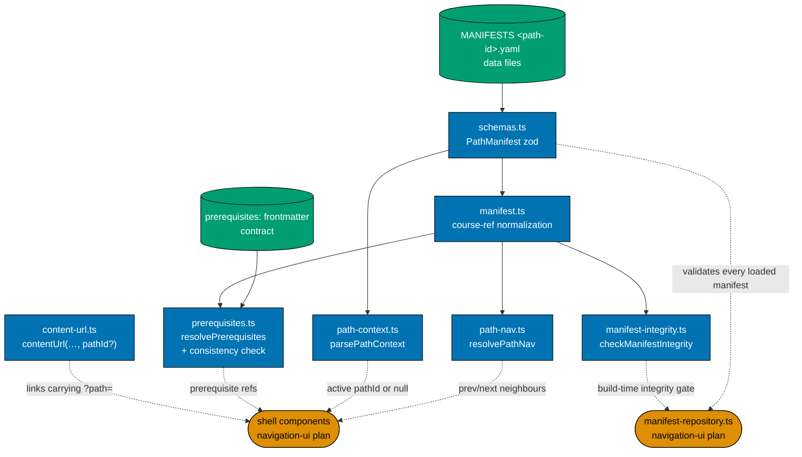
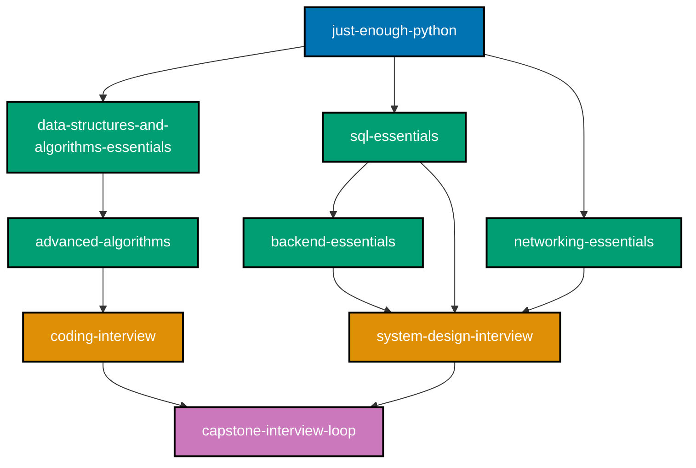
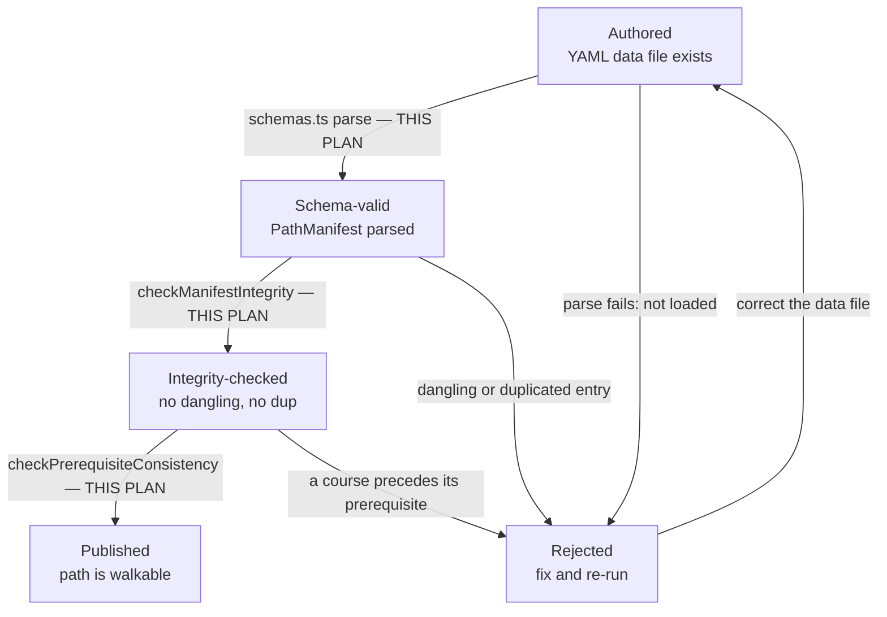
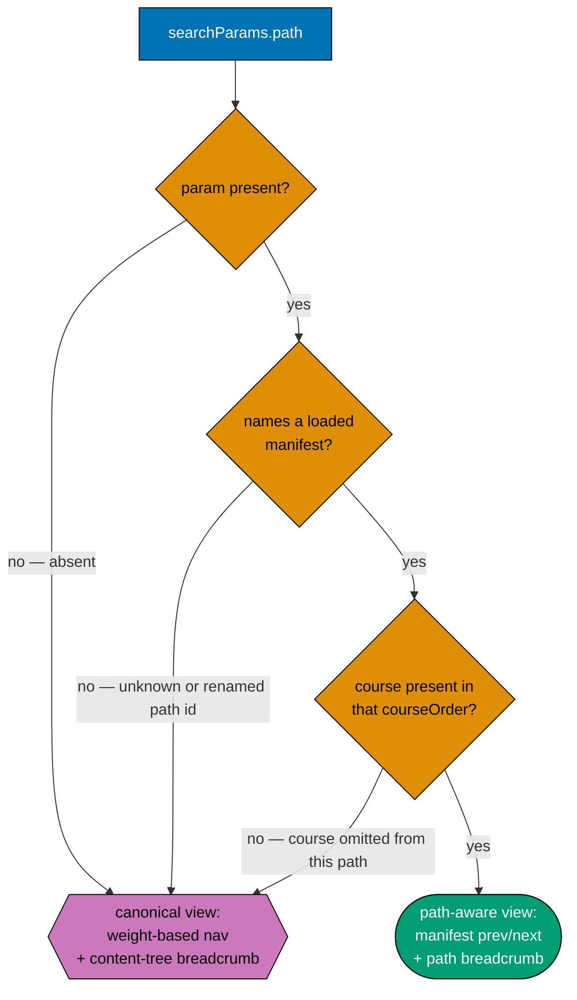
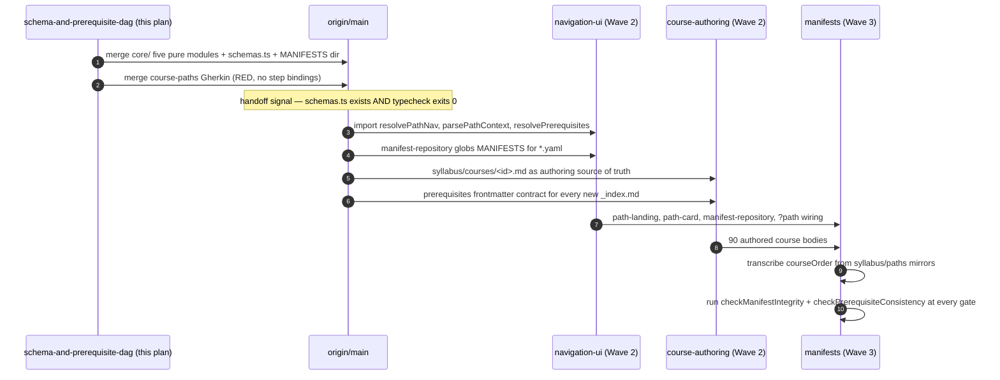

# Technical Documentation — Learning Path Schema and Prerequisite DAG

## Overview

This plan creates the `course-paths` feature's **pure functional core** inside `ayokoding-www`, plus
the two data contracts it operates over: the **course-prerequisite frontmatter contract** and the
**`PathManifest` schema**. It creates no component, no route, and no rendered page.

`ayokoding-www` is a Next.js app [Repo-grounded — `apps/ayokoding-www/next.config.ts`,
`apps/ayokoding-www/src/app/[locale]/(content)/c/[...slug]/page.tsx`] following the repo's
**functional-core/imperative-shell** feature layout, `src/features/<name>/{core,shell}`
[Repo-grounded — `apps/ayokoding-www/src/features/{content,navigation}/{core,shell}` all exist]. The
`course-paths` feature is **new**: `test -d apps/ayokoding-www/src/features/course-paths` returns
non-zero on `origin/main` today [Repo-grounded — verified 2026-07-21]. This plan creates its `core/`
half; `ayokoding-learning-path-03-navigation-ui` creates its `shell/` half.

## Path constants

Used throughout this document and `delivery.md`. Reproduced verbatim in all five split plans — a
checklist whose `<FEAT>` placeholders cannot be expanded is not executable.

- `<COURSES>` = `apps/ayokoding-www/content/en/learn/courses/` (course bundles; served at `/en/c/learn/courses/<course-id>`)
- `<PATHS>` = `apps/ayokoding-www/content/en/learn/paths/` (thin path-landing anchors; served at `/en/c/learn/paths/<path-id>`)
- `<SE_OLD>` = `apps/ayokoding-www/content/en/learn/fundamentally-strong/software-engineer/` (legacy home of the 33 shipped topics + 4 existing capstones, incl. `capstone-solid-core` — the re-home source)
- `<FEAT>` = `apps/ayokoding-www/src/features/course-paths/`
- `<MANIFESTS>` = `<FEAT>manifests/` (standalone YAML data files, nested to mirror slash path ids — `<MANIFESTS><path-id>.yaml`)
- `<LEGACY>` = `apps/ayokoding-www/content/en/learn/legacy/` (**new bucket**, scope extension; served at `/en/c/learn/legacy/<domain>/…`)
- `<REDIR>` = `apps/ayokoding-www/src/redirects/`
- `<SPECS>` = `specs/apps/ayokoding/behavior/ayokoding-www/gherkin/course-paths/`
- `<NAVSPECS>` = `specs/apps/ayokoding/behavior/ayokoding-www/gherkin/navigation/` (existing domain — the three-bucket Gherkin lands beside `content-namespace-redirects.feature`)
- Path ids: `interview-ready/software-engineer`, `immediately-effective/software-engineer`, `fundamentally-strong/software-engineer`, `immediately-effective/software-engineer-to-ai-engineer` (fourth path, manifest at `<MANIFESTS>immediately-effective/software-engineer-to-ai-engineer.yaml`)

## Architecture — the pure core this plan builds

```text
apps/ayokoding-www/src/features/course-paths/          # NEW feature — this plan creates core/
├── core/                      # PURE — no IO. THIS PLAN.
│   ├── schemas.ts             # PathManifest zod schema (pathId, title, description, courseOrder[])
│   ├── manifest.ts            # PathManifest type + course-ref normalization (id | {id, framing})
│   ├── path-nav.ts            # resolvePathNav(manifest, courseId) -> {prev, next} (pure)
│   ├── path-context.ts        # parsePathContext(searchParams, manifests) -> pathId | null
│   ├── prerequisites.ts       # resolvePrerequisites + checkPrerequisiteConsistency (pure)
│   ├── manifest-integrity.ts  # checkManifestIntegrity(manifest, libraryCourseIds) (pure)
│   └── *.test.ts              # unit tests for every resolver, checker, and the context parser
├── manifests/                 # THIS PLAN creates the directory + README.md, EMPTY of .yaml
│   └── README.md              # notes that <path-id>.yaml data files land here later
└── shell/                     # NOT this plan — ayokoding-learning-path-03-navigation-ui
```

Plus one edit outside the feature:
`apps/ayokoding-www/src/features/content/core/content-url.ts` [Repo-grounded — file exists] gains an
optional `pathId` param and the canonical `/en/c/learn/courses/<course-id>` shape.

### Module interaction



**Accessibility note.** Ownership is carried by node shape (rectangle = this plan, stadium =
downstream, cylinder = data contract) **and** by each node's own label naming its owning plan, never
by colour alone. Call direction versus downstream consumption is carried by line style (solid versus
dotted) **and** by the edge labels. Fills use the verified accessible palette (`#0173B2` blue,
`#029E73` teal, `#DE8F05` orange) with black borders and WCAG-AA-contrasting text, per the
[Color Accessibility Convention](../../../repo-governance/conventions/formatting/color-accessibility.md).

## Course-block schema

Each course block carries this canonical metadata (the body is authored once and never forked):

| Field                           | Meaning                                                                                                                                            |
| ------------------------------- | -------------------------------------------------------------------------------------------------------------------------------------------------- |
| `course-id`                     | Stable kebab-case slug (e.g. `coding-interview`). No numeric order prefix — order is a per-path property, never a body property.                   |
| Canonical body                  | One bundle at `content/en/learn/courses/<course-id>/`, one canonical URL.                                                                          |
| `prerequisites: [course-id, …]` | **EVERY course declares this.** The union of all `prerequisites` edges forms the library's **prerequisite DAG**. Entry-point courses declare `[]`. |
| Format                          | `Primer` / `By Example` / `Annotated-concept` (or a capstone milestone kind).                                                                      |
| Primary language                | The course's primary teaching language (or `none` for concept-only).                                                                               |

Additional rules:

- **Prerequisites are surfaced on the page.** The canonical course page renders its declared
  `prerequisites` (each linking to its own canonical course). This is path-independent — it is the
  body's own honest dependency statement. (The rendering itself is
  `ayokoding-learning-path-03-navigation-ui`'s; the resolver behind it is this plan's.)
- **Manifests must be prerequisite-consistent.** Every path's `courseOrder` must be a **valid
  topological ordering**: no course precedes any of its prerequisites **within that path's order**.
  This is a machine-checkable gate — see
  [Manifest integrity invariants](#manifest-integrity-invariants-verified-as-gates--unit-tests).
- **Per-path framing is a callout, never a body fork.** A path may attach an optional lightweight
  intro/outro framing callout around a shared block; the shared body itself is never modified per path.
- **Path context via `?path=<path-id>`.** Prev/next + breadcrumb follow that path's manifest ordering;
  no context → canonical standalone view.

## The prerequisite frontmatter contract (canonical here)

> **Canonical owner: this plan.** `ayokoding-learning-path-01-url-restructure` **writes** this field
> into 37 re-homed `_index.md` files while this plan **defines its shape**. Both plans are Wave 1 and
> merge independently, so nothing serialises them — which is why the contract is **reproduced
> verbatim in both plans' `tech-docs.md`** rather than linked across folders. **If the two statements
> ever diverge, this plan's wins.**

The contract, stated in full:

```yaml
# apps/ayokoding-www/content/en/learn/courses/<course-id>/_index.md — frontmatter
prerequisites:
  - data-structures-and-algorithms-essentials
  - just-enough-python
```

Binding rules:

1. The key is exactly `prerequisites` — lowercase, plural, no prefix, no namespace.
2. Its value is a **YAML sequence of course-ID strings**. Each string is a stable kebab-case course
   slug, identical to the course's directory name under `<COURSES>`.
3. An entry-point course with no prerequisites declares an **empty sequence** (`prerequisites: []`),
   never an omitted key and never `null`. The resolver treats an omitted key as an empty list, but a
   body that omits the key is a contract violation, because a missing declaration and a deliberate
   "no prerequisites" are then indistinguishable to a reviewer.
4. IDs reference **courses**, never paths, never URLs, never file paths.
5. The list is **unordered** — it is a set of edges into the DAG, not a reading order. Order is the
   manifest's job (DD-1).
6. A referenced ID that is not in the library is a **resolver miss**, not a crash:
   `resolvePrerequisites` returns only the IDs it can resolve, and `checkPrerequisiteConsistency`
   reports the rest.

**Why this failure mode is dangerous.** The field is inert until a Wave-2 consumer reads it. If
`ayokoding-learning-path-01-url-restructure` writes a shape this plan's resolver does not parse —
say a comma-separated string, or a nested `meta.prerequisites` — **nothing fails in Wave 1**. Both
plans merge green. The defect surfaces much later, inside
`ayokoding-learning-path-03-navigation-ui`, as 37 course pages rendering an empty prerequisite list
with a passing build and no error anywhere. Duplication of a six-line contract is a cheap insurance
premium against that.

## Prerequisite DAG (illustrative excerpt)

The full DAG is the union of every course's `prerequisites` edges. A representative slice:



Each of the four path manifests is a distinct topological walk over this DAG that respects every
edge. `checkPrerequisiteConsistency` is the function that proves a given walk respects them.

## Path = ordered manifest (manifest format)

- A **path** is a manifest: a **path ID**, a display **title**, a **description**, and an ordered
  **`courseOrder`** list of course IDs.
- **Storage**: each manifest is a standalone data file under `<MANIFESTS>` — the loader globs
  `manifests/**/*.yaml` and a **slash in a path ID becomes a nested directory** (e.g.
  `manifests/interview-ready/software-engineer.yaml`). This data file is the **single
  machine-consumed source of truth** for the path — it is NOT `courseOrder` frontmatter on any
  content `_index.md`.

  ```yaml
  # apps/ayokoding-www/src/features/course-paths/manifests/interview-ready/software-engineer.yaml
  pathId: interview-ready/software-engineer
  title: "Interview-Ready Software Engineer"
  description: "Interview-first track for an experienced engineer re-entering the market."
  courseOrder:
    - just-enough-nvim
    - just-enough-lua
    - extending-neovim
    - just-enough-python
    - capstone-forge-ready
    # … ordered course IDs, prerequisite-consistent …
  ```

- **Human-readable mirror**: the per-path files under `syllabus/paths/` in this plan folder are the
  human-readable orderings used during authoring and review. The machine-consumed source of truth is
  the nested `manifests/**/*.yaml` data file above.
- **Course reference**: each `courseOrder` entry is a course ID string, optionally a mapping
  `{ id, framing?: { intro?, outro? } }` when the path adds a **lightweight per-course framing**
  callout. The framing is rendered by the path layer around the shared body; the body itself is never
  modified. `manifest.ts` normalizes both forms to one internal shape so no downstream caller has to
  branch on it.

### The `PathManifest` zod schema

The schema is written in `<FEAT>core/schemas.ts` using **zod 4.3.6** [Repo-grounded —
`apps/ayokoding-www/package.json` declares `"zod": "4.3.6"`], the version already on the app's
dependency list. Shape:

- `pathId` — string, the slash-form path ID.
- `title` — string, display title.
- `description` — string, landing-page prose.
- `courseOrder` — array whose elements are either a course-ID string or an object carrying `id` and
  an optional `framing` object with optional `intro` and `outro` strings.

The schema is the **only** definition of a valid manifest. `manifest-repository.ts` (built by
`ayokoding-learning-path-03-navigation-ui`) parses each YAML file through it; a manifest that does
not validate is not loaded.

## Manifest integrity invariants (verified as gates + unit tests)

- Every `courseOrder` ID resolves to an existing course under `courses/<course-id>/` (no dangling ref).
- No course ID appears twice within one manifest.
- **Prerequisite-consistency**: for every course in a manifest, all of its declared `prerequisites`
  that are **also present in that manifest** appear **before** it. (A path may omit a prerequisite only
  if it also omits every course that needs it — enforced as a gate.)
- No course body is duplicated per path (all manifests reference courses **by ID**, never copy a
  body) — a "no forked body" check.
- Course IDs are stable slugs; a re-home changes a body's URL (with a redirect) but never its ID.

This plan implements the first three as pure functions. The fourth and fifth are properties of the
authoring and manifest plans, enforced there.

### Manifest validation lifecycle



**Accessibility note.** This diagram uses no colour classes at all; every node and edge is
distinguished by label text alone.

Three of the four transitions above are gated by a function **this plan** ships. This plan ships no
manifest to run them against — `ayokoding-learning-path-05-manifests` does. The `Published` state is
reached only once `ayokoding-learning-path-03-navigation-ui` has a renderer for it.

### Path-context resolution — the decision branch



**Accessibility note.** Every branch carries an explicit edge label naming the condition that
selected it, and the two terminal outcomes differ by node shape (stadium versus hexagon) as well as
by colour. Fills use the verified accessible palette with black borders and WCAG-AA-contrasting text.

**Three of the four branches end in the canonical view.** That is deliberate — graceful fallback is a
first-class behaviour of the core, not an error path bolted on by the renderer.

## Downstream consumption



## Design Decisions

Five decisions are this plan's own, reproduced **verbatim** from the source plan with their
amendment annotations intact.

- **DD-1 · Order lives in the manifest, not the body.** Reading order is a per-path property carried by
  `courseOrder`, not by a global `weight`. One body cannot encode four orders; moving order to the
  manifest is what enables the shared library. The body keeps a `weight` only for the canonical
  (no-path) sidebar/prev-next fallback and the catalog sort.
- **DD-3 · Path-aware nav via `?path=` client context, not per-path URLs.** A course has exactly one
  URL; the active path rides in a query param. One canonical URL (no duplicate content / SEO split),
  shareable, with a clean fallback when the param is absent.
- **DD-6 · Every course declares `prerequisites` → a prerequisite DAG.** The union of all
  `prerequisites` edges is the library DAG; each manifest must be a valid topological ordering of it
  (a machine-checkable gate); the course page surfaces its prerequisites. The four paths are four
  entry points into the one DAG (amended 2026-07-20 — was three; see DD-22, DD-24). This is the
  structural guarantee that replaces ad-hoc "does this order read smoothly?" judgement with a
  checkable invariant.
- **DD-9 · Functional-core/imperative-shell for the nav feature.** Pure `resolvePathNav` /
  `parsePathContext` / `resolvePrerequisites` in `core/`; IO manifest loading + React in `shell/`.
  Matches the repo standard and makes the ordering/prereq logic unit-testable without IO.
- **DD-16 · Prerequisite-consistency is the audited smoothness property.** Each manifest is a verified
  topological ordering (DD-6); the old ad-hoc SF-1/SF-2 in-body forward-references are **eliminated** by
  making `just-enough-c` a prerequisite of `computer-architecture` and the language primers
  prerequisites of `building-production-cli-tools` (no course now precedes its own prereqs in any path).

**Referenced but not owned here.** DD-2 (one canonical body + URL, re-home with redirects) and DD-40
(three structural buckets) are owned by `ayokoding-learning-path-01-url-restructure`; DD-4 (graceful
canonical fallback) is owned by `ayokoding-learning-path-03-navigation-ui`; DD-15 and DD-27 (build
order) are cross-cutting and reproduced in this plan's `README.md`.

### The DD-34 / DD-35 / DD-39 numbering gap is deliberate

Restated **verbatim** from the source plan (`tech-docs.md:1837-1844`), so that no future reader
"closes" the apparent gap and rewrites 276 tokens whose meanings belong to a different, closed plan:

> **The following six decisions (DD-40 through DD-45) were made in the 2026-07-21 learn-section
> scope-extension pass.** They are numbered from **40**, not 34: the tokens `DD-34`, `DD-35`, and
> `DD-39` are already in use **inside this plan's own folder** — they appear throughout
> `syllabus/courses/**` carrying **FS-SE-inherited** meanings (concept enumeration, primary-source
> citation policy, typed-Python policy) rather than this document's numbering
> [Repo-grounded — `grep -rl "DD-3[4-9]" syllabus/courses/`, run from this plan folder, lists 94
> files; every occurrence outside `syllabus/` is prose about this very collision]. Starting at 40
> keeps every `DD-NN` token in this plan folder unambiguous for an execution-grade reader.

Occurrence counts, verified: `DD-34` 113, `DD-35` 114, `DD-39` 49. `DD-36`, `DD-37` and `DD-38` are
unused anywhere. **Never renumber.**

## `syllabus/` folder structure and custody

This plan's `syllabus/` directory carries the human-readable mirror of the library and the four
paths — **128 files**:

- `syllabus/README.md` — overview of the library + the four paths.
- `syllabus/courses/` — **121 per-course spec files** + `README.md` (122 directory entries). One file
  per course-id, each stating origin, format, primary language, `prerequisites`, and scope.
- `syllabus/paths/` — **4 path-manifest mirrors** + `README.md` (5 directory entries):
  `manifest-interview-ready-software-engineer.md`,
  `manifest-immediately-effective-software-engineer.md`,
  `manifest-fundamentally-strong-software-engineer.md`, and
  `manifest-immediately-effective-software-engineer-to-ai-engineer.md`.

These markdown files are documentation mirrors; the machine-consumed source of truth for each path is
the nested `manifests/**/*.yaml` data file in the `course-paths` feature.

### Custody rules (binding)

1. **This plan owns the folder and edits nothing inside it.** The corpus arrived settled. No delivery
   step in this plan modifies, adds, or removes a file under `syllabus/`.
2. **The other four plans link into it and never copy it.** A copy forks the source of truth for 121
   course specs and four manifest orderings, so a later spec correction lands in one copy only.
3. **Cross-plan references use the full relative path** —
   `../ayokoding-learning-path-02-schema-and-prerequisite-dag/syllabus/<rest>` while both plans sit
   in the same stage folder. The source plan's `./syllabus/...` form resolves to nothing from any
   other folder.
4. **Archival repoints every inbound link in the same commit as the move.** See
   [delivery.md Phase 7](./delivery.md#phase-7-plan-archival-and-cross-plan-link-repoint).

## Sections that route to sibling plans

The `syllabus/` corpus custodied here carries **28 back-references** into this plan's `tech-docs.md`,
`prd.md` and `README.md`, targeting sections that the five-way split routed to **other** plans. The
corpus is frozen — no step in this plan edits a file under `syllabus/` — so those anchors are kept
resolvable from **this** side instead, as pointer sections.

Each heading below exists **only** to keep an inbound anchor alive and to name the plan that now owns
that content. None of them duplicates the content itself: duplicating a 200-line catalog or a
four-manifest ordering would fork exactly the source of truth this split exists to keep singular.

The 12 distinct broken targets and their owners:

| Anchor target                                                 | Owning plan                                       |
| ------------------------------------------------------------- | ------------------------------------------------- |
| `tech-docs.md#course-library-catalog`                         | `ayokoding-learning-path-04-course-authoring`     |
| `tech-docs.md#path-manifests` (and its four per-path anchors) | `ayokoding-learning-path-05-manifests`            |
| `tech-docs.md#path-aware-navigation-ui-ayokoding-www`         | `ayokoding-learning-path-03-navigation-ui`        |
| `tech-docs.md#smoothness-architecture-per-path`               | `ayokoding-learning-path-05-manifests`            |
| `prd.md#new-course--capstone-specifications`                  | `ayokoding-learning-path-04-course-authoring`     |
| `README.md#four-paths-one-library-per-role-convergence`       | this plan's `README.md` (carried as real content) |

### Course Library Catalog

Moved to **`ayokoding-learning-path-04-course-authoring`**. The catalog enumerates the 127-course
library (121 software-engineer-role baseline + 6 net-new AI-engineering courses, DD-28). The
authoritative per-course detail is [`syllabus/courses/`](./syllabus/courses/README.md), custodied
here.

### Path Manifests

Moved to **`ayokoding-learning-path-05-manifests`**, which owns every manifest file and every
manifest mutation. The authoritative human-readable orderings are
[`syllabus/paths/`](./syllabus/paths/README.md), custodied here; each YAML manifest's `courseOrder`
is transcribed from its mirror.

#### Path `interview-ready/software-engineer` (interview-first)

Ordering owned by `ayokoding-learning-path-05-manifests`; mirror at
[`syllabus/paths/manifest-interview-ready-software-engineer.md`](./syllabus/paths/manifest-interview-ready-software-engineer.md).

#### Path `immediately-effective/software-engineer` (build-fast-first)

Ordering owned by `ayokoding-learning-path-05-manifests`; mirror at
[`syllabus/paths/manifest-immediately-effective-software-engineer.md`](./syllabus/paths/manifest-immediately-effective-software-engineer.md).

#### Path `fundamentally-strong/software-engineer` (theory-first)

Ordering owned by `ayokoding-learning-path-05-manifests`; mirror at
[`syllabus/paths/manifest-fundamentally-strong-software-engineer.md`](./syllabus/paths/manifest-fundamentally-strong-software-engineer.md).

#### Path `immediately-effective/software-engineer-to-ai-engineer` (fourth path, added 2026-07-20)

Ordering owned by `ayokoding-learning-path-05-manifests`; mirror at
[`syllabus/paths/manifest-immediately-effective-software-engineer-to-ai-engineer.md`](./syllabus/paths/manifest-immediately-effective-software-engineer-to-ai-engineer.md).

### Path-Aware Navigation UI (ayokoding-www)

Moved to **`ayokoding-learning-path-03-navigation-ui`**, which owns the `shell/` half of the
`course-paths` feature, the `?path=` route wiring, the path rail, the path banner, the paths hub, and
the whole UI design funnel. This plan owns only the pure `core/` half those components import — see
[Architecture](#architecture--the-pure-core-this-plan-builds).

### Smoothness Architecture (per-path)

Moved to **`ayokoding-learning-path-05-manifests`**, which runs the per-path smoothness audits. The
one machine-checkable component of smoothness — prerequisite-consistency, DD-16 — is implemented here
as `checkPrerequisiteConsistency`; everything else in the smoothness architecture (difficulty
monotonicity, skip affordances, refresh register) is an editorial property of a manifest and is
audited there.

## UI-design-funnel exemption

**This plan is exempt from the UI-design-funnel requirement**, explicitly and with reasoning rather
than by silent omission.

The funnel binds a plan that adds or changes **user-facing screens or components** under `apps/` or
`libs/`. This plan adds neither. Its entire `apps/` surface is:

- six pure TypeScript modules under `<FEAT>core/`, none of which imports React or renders anything;
- one directory plus a `README.md` under `<MANIFESTS>`;
- one additive optional parameter on an existing pure function in `content-url.ts`.

The design funnel for every screen in the parent architecture — Screens 0 through 3 (landing hero,
paths hub, path landing, course page in path context) — is owned by
`ayokoding-learning-path-03-navigation-ui`; Screen 4 (legacy landing) is owned by
`ayokoding-learning-path-01-url-restructure`. Neither set of artefacts is carried here, and no
archival check in this plan asserts a render exists.

## Specs and Gherkin delivery applicability

**This plan is NOT exempt.** It creates observable behaviour under `apps/` — six pure functions with
externally-observable contracts — so it carries companion Gherkin under `<SPECS>`, authored RED in
Phase 2.

The step bindings that turn that Gherkin green are **not** this plan's: they live in the shell
components and route wiring built by `ayokoding-learning-path-03-navigation-ui`. So
`npx nx run ayokoding-www:specs:behavior:coverage` will report a coverage delta at this plan's Phase 2
gate. That delta is **recorded explicitly with its closing plan named**, rather than treated as an
anonymous regression — see the Phase 2 gate in `delivery.md`.

The existing Gherkin domain layout is [Repo-grounded]:
`specs/apps/ayokoding/behavior/ayokoding-www/gherkin/` currently holds `app-shell/`, `content/`,
`i18n/`, `navigation/`, `search/`, `tools/` and a `README.md`. `course-paths/` is a **new sibling
domain folder**.

## File Impact

| Path                                                                             | Change     | Note                                                                                                      |
| -------------------------------------------------------------------------------- | ---------- | --------------------------------------------------------------------------------------------------------- |
| `apps/ayokoding-www/src/features/course-paths/core/schemas.ts`                   | _New file_ | `PathManifest` zod schema                                                                                 |
| `apps/ayokoding-www/src/features/course-paths/core/manifest.ts`                  | _New file_ | Type + course-ref normalization                                                                           |
| `apps/ayokoding-www/src/features/course-paths/core/path-nav.ts`                  | _New file_ | `resolvePathNav`                                                                                          |
| `apps/ayokoding-www/src/features/course-paths/core/path-nav.test.ts`             | _New test_ | Boundaries + missing course                                                                               |
| `apps/ayokoding-www/src/features/course-paths/core/path-context.ts`              | _New file_ | `parsePathContext`                                                                                        |
| `apps/ayokoding-www/src/features/course-paths/core/path-context.test.ts`         | _New test_ | Valid / unknown / absent                                                                                  |
| `apps/ayokoding-www/src/features/course-paths/core/prerequisites.ts`             | _New file_ | `resolvePrerequisites`, `checkPrerequisiteConsistency`                                                    |
| `apps/ayokoding-www/src/features/course-paths/core/prerequisites.test.ts`        | _New test_ | Declared / missing; consistent + deliberately-violating fixtures                                          |
| `apps/ayokoding-www/src/features/course-paths/core/manifest-integrity.ts`        | _New file_ | `checkManifestIntegrity`                                                                                  |
| `apps/ayokoding-www/src/features/course-paths/core/manifest-integrity.test.ts`   | _New test_ | Unresolved + duplicate ID fixtures                                                                        |
| `apps/ayokoding-www/src/features/course-paths/manifests/README.md`               | _New file_ | Directory marker; states which plan writes `.yaml` here                                                   |
| `apps/ayokoding-www/src/features/content/core/content-url.ts`                    | Modified   | Optional `pathId` param + canonical `/en/c/learn/courses/<course-id>` shape [Repo-grounded — file exists] |
| `apps/ayokoding-www/src/features/content/core/content-url.test.ts`               | Modified   | New assertions; existing assertions updated for the canonical shape in the same commit                    |
| `specs/apps/ayokoding/behavior/ayokoding-www/gherkin/course-paths/`              | _New dir_  | Gherkin companion + `README.md`                                                                           |
| `plans/backlog/ayokoding-learning-path-02-schema-and-prerequisite-dag/syllabus/` | Unchanged  | Custodied; **no delivery step edits it**                                                                  |

## Dependencies

- **zod 4.3.6** [Repo-grounded — `apps/ayokoding-www/package.json`] — already a dependency of
  `ayokoding-www`. No new package is added by this plan.
- **No YAML parser is needed here.** `<MANIFESTS>` ships empty of `.yaml` files; the parser is
  `manifest-repository.ts`'s concern, in `ayokoding-learning-path-03-navigation-ui`.
- **Nx targets used** [Repo-grounded — `apps/ayokoding-www/project.json`]: `typecheck`, `lint`,
  `test:quick`, `test:unit`, `test:integration`, `test:e2e`, `specs:behavior:coverage`, `build`,
  `dev`.
- **rhino-cli** for `md links validate` and `md heading-hierarchy validate`, invoked as raw
  `cargo run --manifest-path apps/rhino-cli/Cargo.toml` commands, not Nx targets
  [Repo-grounded — `apps/rhino-cli/Cargo.toml` exists].

## Rollback

Every phase in this plan is additive and independently revertable:

- **Phase 1 and Phase 2** create a new feature directory and add one optional parameter to an
  existing function. `git revert` of the phase commits removes the feature wholesale; nothing else
  imports it yet, because the only importers are Wave-2 plans that have not started.
- **The `content-url.ts` edit** is the one change touching shipped code. It is additive (an optional
  parameter) and reversible in isolation; the Phase 4 no-regression sweep across both locales is what
  proves it is safe to keep.
- **The `syllabus/` corpus** is never modified, so there is nothing in it to roll back.
- **The archival repoint** touches only markdown links in four sibling plan folders. Reverting the
  archival commit restores both the folder location and the links atomically, because they land in
  the same commit.

## Testing and Verification Strategy

Per the repo's three-level testing standard and TDD mandate, every module here is built test-first.

- **Unit** (`test:unit`, pure core) — the entire substance of this plan: `resolvePathNav` (prev/next
  at both boundaries, course missing from the manifest), `parsePathContext` (valid / unknown /
  absent), `resolvePrerequisites` (declared IDs returned; missing course → empty),
  `checkPrerequisiteConsistency` (clean fixture passes; deliberately-violating fixture is reported),
  `checkManifestIntegrity` (clean fixture passes; unresolved-ID and duplicate-ID fixtures are
  reported), `PathManifest` schema validation, and `contentUrl` with `pathId`.
- **Integration** (`test:integration`) — **not exercised by this plan**. Loading manifests from disk
  is `manifest-repository.ts`'s job, in `ayokoding-learning-path-03-navigation-ui`. The affected
  target is still run to prove no regression.
- **E2E** (`test:e2e`) — **no new E2E is authored here**; this plan renders nothing. The affected
  target is run to prove the `content-url.ts` change regresses no existing journey.
- **`specs/` Gherkin companion** — authored RED under `<SPECS>`, consumed by
  `specs:behavior:coverage`; step bindings land in `ayokoding-learning-path-03-navigation-ui`.
- **Manual behavioural verification** — a targeted **no-regression sweep**, not a feature walk-through:
  the `content-url.ts` change alters link generation across the site, so Phase 4 opens existing learn
  pages in **both** supported locales (`en` and `id` [Repo-grounded — `SUPPORTED_LOCALES` in
  `apps/ayokoding-www/src/features/i18n/core/config.ts`]) at three breakpoints via Playwright MCP,
  confirms the console is clean and links resolve, and commits screenshot evidence.
- **Rule-15 three-tester retest** — **exemption recorded**, with reasoning, in Phase 4. This plan
  ships no rendered surface, so there is no new UI for `web-exploratory-tester`,
  `web-usability-tester` or `web-design-tester` to explore. The no-regression sweep above is run
  instead, and is not a substitute claim.
- **Rule-16 API exploratory retest** — **not applicable**. This plan exposes no REST or GraphQL
  endpoint and adds no HTTP surface.
