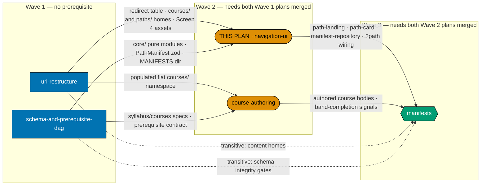

# AyoKoding Learning Paths — Path-Aware Navigation UI

The **rendering layer** of the four-path shared-course-library product on `ayokoding-www`. This plan
owns the UI design funnel for Screens 0–3, the `course-paths` **shell** components, the `?path=`
route wiring, the left path rail, the path landing pages, the paths hub, and the site landing hero
that surfaces the four paths.

It is **Wave 2** of a five-plan split of the closed `shared-course-library-and-learning-paths` plan.
It builds nothing that stores order (that is the schema plan's), moves no content bundle (that is the
URL-restructure plan's), authors no course body, and writes no path manifest.

> **Cross-plan source of truth** — the authoritative per-course and per-path specs live in
> `plans/<stage>/ayokoding-learning-path-02-schema-and-prerequisite-dag/syllabus/`. Do not copy
> them; do not author from any other source.

## Scope in one screen

| Owned here                                                                                    | Owned elsewhere                                                                          |
| --------------------------------------------------------------------------------------------- | ---------------------------------------------------------------------------------------- |
| UI design funnel, Screens 0–3 — low-fi wireframes, 24 hi-fi renders, selections, rationale    | Screen 4 funnel and its 6 renders — `ayokoding-learning-path-01-url-restructure`         |
| `course-paths` **shell**: repository, path landing, path card, path rail, banner, prereq list | `course-paths` **core** — `ayokoding-learning-path-02-schema-and-prerequisite-dag`       |
| `?path=` route wiring, path-aware prev/next and breadcrumb, canonical fallback                | the `courses/` and `paths/` content homes — `ayokoding-learning-path-01-url-restructure` |
| The `/en` landing hero's four goal cards and "Compare all paths" escape hatch                 | Every `.yaml` path manifest — `ayokoding-learning-path-05-manifests`                     |
| The paths hub and the four path landing routes (rendered against a **fixture** manifest)      | Every course body — `ayokoding-learning-path-04-course-authoring`                        |
| The fixture-manifest e2e suite and the accessibility contract for path-aware navigation       | The per-course re-home redirect table — `ayokoding-learning-path-01-url-restructure`     |

## Wave and dependency position

**Accessibility note.** The diagram never relies on colour alone. Wave membership is carried by node
shape — rectangle, stadium, hexagon — **and** by the three labelled subgraph containers. Edge kind is
carried by line style (solid = hard blocking edge; dotted = transitive artefact need already satisfied
by a solid path) **and** by every edge's own label. Fills use the verified accessible palette
(`#0173B2` blue, `#DE8F05` orange, `#029E73` teal) with black borders and WCAG-AA-contrasting text per
the
[Color Accessibility Convention](../../../repo-governance/conventions/formatting/color-accessibility.md).

## Depends-on

| Direction     | Plan (full folder name)                                  | Relationship                                              |
| ------------- | -------------------------------------------------------- | --------------------------------------------------------- |
| **blockedBy** | `ayokoding-learning-path-01-url-restructure`             | hard — must be **merged to `origin/main`** before Phase 1 |
| **blockedBy** | `ayokoding-learning-path-02-schema-and-prerequisite-dag` | hard — must be **merged to `origin/main`** before Phase 1 |
| **blocks**    | `ayokoding-learning-path-05-manifests`                   | hard — that plan cannot publish a manifest without this   |
| _sibling_     | `ayokoding-learning-path-04-course-authoring`            | runs in parallel in Wave 2; no edge in either direction   |

**No FS-SE dependency.** The sibling `fundamentally-strong-software-engineer` plan is **closed**
([`plans/done/2026-07-19__fundamentally-strong-software-engineer/`](../../done/2026-07-19__fundamentally-strong-software-engineer/README.md));
its Passes 3–5 scope was absorbed by the split's course-authoring plan, not by this one (DL-12).

## Implementation Sequence and Prerequisites

This plan is **Wave 2** of a five-plan split of the closed
`shared-course-library-and-learning-paths` plan. It owns the **rendering layer**: the UI design
funnel for Screens 0–3, the `course-paths` shell components, `?path=` route wiring, the path rail,
path landings, and the paths hub.

### Upstream — what must exist before this plan starts

| Upstream plan                                            | Artefact needed                                                                   | Why this plan cannot start without it                                                                                                               |
| -------------------------------------------------------- | --------------------------------------------------------------------------------- | --------------------------------------------------------------------------------------------------------------------------------------------------- |
| `ayokoding-learning-path-01-url-restructure`             | `apps/ayokoding-www/src/redirects/` per-course re-home table                      | the Phase-4 e2e asserts a legacy `fundamentally-strong` URL redirects to `/en/c/learn/courses/<id>`; without the table that spec can never go green |
| `ayokoding-learning-path-01-url-restructure`             | `apps/ayokoding-www/content/en/learn/courses/_index.md` and `.../paths/_index.md` | `PathLanding` and `PathCard` render from `<PATHS>_index.md`; with no content home there is no route to render into                                  |
| `ayokoding-learning-path-01-url-restructure`             | the final three-bucket tree (`courses/`, `paths/`, `legacy/`)                     | the no-path regression sweep must compare against the final IA, not a hybrid one                                                                    |
| `ayokoding-learning-path-01-url-restructure`             | Open Question **Q-E** ruling (three residual `fundamentally-strong` index pages)  | determines what the legacy-browse coexistence guard asserts                                                                                         |
| `ayokoding-learning-path-02-schema-and-prerequisite-dag` | `apps/ayokoding-www/src/features/course-paths/core/` (all five pure modules)      | every shell component imports them; `manifest-repository.ts` cannot validate without `schemas.ts`                                                   |
| `ayokoding-learning-path-02-schema-and-prerequisite-dag` | `apps/ayokoding-www/src/features/course-paths/manifests/`                         | the repository globs `**/*.yaml` from this directory                                                                                                |

**Start precondition (checkable — all four must hold):**

1. PR for `ayokoding-learning-path-01-url-restructure` is **merged to `origin/main`**.
2. PR for `ayokoding-learning-path-02-schema-and-prerequisite-dag` is **merged to `origin/main`**.
3. `test -f apps/ayokoding-www/src/features/course-paths/core/schemas.ts` returns 0.
4. `test -f apps/ayokoding-www/content/en/learn/paths/_index.md` returns 0.

### Downstream — what this plan hands off, and to whom

| Downstream plan                        | Artefact handed over                                                                             | Consumed by                                                                          |
| -------------------------------------- | ------------------------------------------------------------------------------------------------ | ------------------------------------------------------------------------------------ |
| `ayokoding-learning-path-05-manifests` | `<FEAT>shell/path-landing.tsx`, `path-card.tsx`                                                  | every path landing and the 2×2 paths-hub grid renders through these                  |
| `ayokoding-learning-path-05-manifests` | `<FEAT>shell/manifest-repository.ts`                                                             | a published YAML manifest is inert until this loads and validates it                 |
| `ayokoding-learning-path-05-manifests` | `?path=` wiring in `apps/ayokoding-www/src/app/[locale]/(content)/c/[...slug]/page.tsx`          | path context, prev/next, breadcrumb                                                  |
| `ayokoding-learning-path-05-manifests` | `<FEAT>shell/path-rail.tsx`, `path-banner.tsx`, `path-course-links.tsx`, `prerequisite-list.tsx` | the manifest plan's manual verification walks all of these                           |
| `ayokoding-learning-path-05-manifests` | the fixture-manifest e2e pattern                                                                 | the manifest plan re-asserts the same four nav behaviours against **real** manifests |

### Screen 0 is design-only in this plan unless an implementation step is added

Screen 0 (the `/en` landing hero) carries a full funnel record and six renders but **no
implementing step existed in the source plan**. This plan either adds the implementation step
against `apps/ayokoding-www/src/features/app-shell/shell/hero.tsx` and `landing.tsx`, or records
the deferral explicitly here. Silently carrying the artefacts is the one outcome to avoid.

### Handoff signal

This plan is done for downstream purposes when its final PR is **merged to `origin/main`** AND
`test -f apps/ayokoding-www/src/features/course-paths/shell/path-landing.tsx` returns 0 AND
`npx nx run ayokoding-www-fe-e2e:test:e2e` exits 0.

## Screen 0 ruling — Option A, implementation carried (RECORDED)

The choice the section above demands is made here and is **not** deferred: **Option A**. Screen 0's
implementation lands in this plan's **Phase 3** as an explicit RED/GREEN/REFACTOR triplet against
`apps/ayokoding-www/src/features/app-shell/shell/hero.tsx` (which `landing.tsx` renders via
`<Hero locale={locale} />`) [Repo-grounded — both files exist today], alongside the `PathCard`
component Phase 3 already builds. The Gherkin scenario
**"The landing hero surfaces the four goal paths directly"** binds that RED step, and
[tech-docs §File Impact](./tech-docs.md#file-impact) lists `hero.tsx` and `path-card.tsx` in its
Group A row.

Consequently the archival gate's "all renders present, all selections recorded" check is **not** the
only Screen 0 assertion — the Phase 3 gate additionally requires the hero e2e spec to be green, so
this plan cannot tick archival on an unshipped screen. Screen 0 is **not** recorded as design-only.

## Blocked-on (open questions owned by another plan)

- **Q-E — what happens to `fundamentally-strong`'s three residual index pages?** Owned verbatim by
  `ayokoding-learning-path-01-url-restructure` (all six of Q-A…Q-F live there). Its ruling
  determines what this plan's legacy-browse coexistence guard and no-path regression sweep assert.
  See that plan's `tech-docs.md` §Open Questions for the authoritative copy and its recommended
  default (fold the three pages into the `fundamentally-strong/software-engineer` path landing).

## Build order (inherited)

Reproduced **verbatim** from the source plan because Group A alone spans three of the five split
plans, so no single plan owns the sequencing rule.
`ayokoding-learning-path-05-manifests` is the canonical owner for citation purposes.

- **DD-15 · Build order (locked; amended 2026-07-20 by DD-27 — see below).** Group A (architecture +
  `course-paths` UI — hard prerequisite) → `interview-ready` MVP ships first (re-home 1–33, author the
  4 interview courses + `capstone-interview-loop`, one manifest, deploy) → `immediately-effective`
  manifest → `fundamentally-strong` manifest → backfill topics 34–94 native into `courses/` as the
  library fills. **DD-27 amends steps 2 onward**: the MVP is narrowed to an architecture smoke test
  only (interview-course authoring is no longer bundled into it), and the fourth path is inserted as
  authoring priority #1 immediately after the MVP.

- **DD-27 · Build order amended: the fourth path is authoring priority #1, behind an
  architecture-smoke-test-only MVP (D7, amends DD-15).** Locked order: **Group A** (architecture + UI,
  unchanged hard prerequisite) → **`interview-ready` MVP, narrowed to an architecture smoke test only**
  (ships against topics 1–33, already live on disk; proves routing, manifest loading, `?path` context,
  prev/next, breadcrumb, and prerequisite display against real content, in days not months —
  authoring the 4 NEW interview courses + `capstone-interview-loop` is **no longer bundled into this
  MVP gate**) → **`software-engineer-to-ai-engineer`** (authoring priority #1 for all authoring effort)
  → **`immediately-effective/software-engineer`** manifest → **`fundamentally-strong/software-engineer`**
  manifest → **backfill topics 34–94**. Rationale (preserved from the original build-order decision):
  nothing in the AI path exists on disk (~17 courses); making it literally first — ahead of even the
  MVP — would mean nothing ships until all 17 are authored, with the UI architecture unvalidated the
  entire time. Ordering it immediately after an architecture-smoke-test MVP gives the AI path first
  claim on every unit of real authoring effort while keeping the architecture proven early against
  content that already exists.

**Split mapping of the inherited order.** Group A is delivered by three plans, not one:
`ayokoding-learning-path-02-schema-and-prerequisite-dag` builds the pure core,
`ayokoding-learning-path-01-url-restructure` builds the IA and content homes, and **this plan**
builds everything that renders. The MVP and every manifest step after it belong to
`ayokoding-learning-path-05-manifests`; all authoring belongs to
`ayokoding-learning-path-04-course-authoring`. Do not "optimize" the order — DD-27's rationale
paragraph exists to prevent exactly that.

## Decisions Locked (inherited)

Reproduced **verbatim**. `DL-11` does not exist — the slot between `DL-10` and `DL-12` is occupied by
`DN-11`, a Delivery Note. **Do not renumber to close the gap.**

- **DL-7 · Build order — amended 2026-07-20, see DL-15 / tech-docs DD-27.** Deliver Group A
  (architecture + UI) first as a hard prerequisite; then an **interview-ready MVP that is an
  architecture smoke test only** (shipped against already-live topics 1–33, not the full interview
  cluster); then `immediately-effective/software-engineer-to-ai-engineer` (authoring priority #1); then
  the `immediately-effective/software-engineer` manifest; then the `fundamentally-strong/software-engineer`
  manifest; then backfill topics 34–94 native as the library fills. **Decided; amended 2026-07-20.**
- **DN-11 DECIDED — `[AI]` auto-merge (now the repo default).** `[AI]` merges each phase's PR
  automatically once the 3-cycle PR-Review Maker→Fixer Cycle and all quality gates are green — this
  plan declares no `[HUMAN]` merge gate. When DN-11 was first recorded, `pr-merge-protocol.md` still
  defaulted to a `[HUMAN]` merge, so the maintainer authorized AI-auto-merge for **this plan**
  (in-session): (a) it uses the SAME delivery methods as the now-closed sibling plan
  `fundamentally-strong-software-engineer`; and (b) no maintainer permission is needed to merge a PR
  once it has passed 3 review cycles and the PR quality gate. The protocol has since been changed so
  that `[AI]` merges by default and `[HUMAN]` is an explicit per-plan opt-in, making DN-11 a
  confirmation of the default rather than an override. Recorded here and in
  [delivery.md](./delivery.md#delivery-mode-worktree-to-pr).

### This plan's own locked decision

- **DL-17 · Screen 3 is the left path rail (Option B), and the design funnel covers three viewports
  (2026-07-21 design revision).** The maintainer overturned the earlier Screen 3 selection: the course
  page in path context now carries the **path's whole ordered arc as the left rail** rather than a
  one-line top banner. The rail is a **content swap in two already-shipped hosts** — `ResizableSidebar`
  on `md+` and the `MobileNav` left `Sheet` below `md` — so the "needs a mobile sheet" objection that
  originally sank Option B is answered by an overlay that already exists; the residual cost (one
  net-new `PathRail`, truncation at the ~115 px width floor) is accepted deliberately and recorded, not
  quietly dropped. The `PathBanner` survives as the rail's compact readout and hosts the below-`md`
  disclosure trigger. With no `?path=`, both hosts render exactly what they render today. Alongside it,
  the funnel now carries **a lo-fi wireframe and a hi-fi render per screen, per option, at three
  viewports** (375 / 768 / 1280 px) — **30 `.png` total** — because the reselection turned on precisely
  the mobile question that desktop-only artefacts could not surface. See
  [tech-docs.md DD-46 / DD-47](./tech-docs.md#design-decisions),
  [prd.md Screen 3](./prd.md#screen-3--course-page-in-path-context), and
  [prd.md §Hi-fi asset matrix](./prd.md#hi-fi-asset-matrix-screen--option--viewport).
  **Decided 2026-07-21.**

> **DD-47 arithmetic after the split.** DL-17's "30 `.png` total" is a **two-plan** total. This plan
> produces and holds **24** of them (Screens 0–3 × 2 options × 3 viewports);
> `ayokoding-learning-path-01-url-restructure` produces and holds the remaining **6** (Screen 4 × 2
> options × 3 viewports). A reader auditing DD-47 against this plan alone must **not** read 24 as
> under-delivery, and no executor may "fix" the gap by copying the other plan's renders here — a
> duplicated matrix drifts.

## Design decisions owned here

Three of the source plan's 41 design decisions are canonically owned by this plan; the full text is in
[tech-docs §Design Decisions](./tech-docs.md#design-decisions).

| ID    | Subject                                                                         |
| ----- | ------------------------------------------------------------------------------- |
| DD-4  | Graceful canonical fallback is first-class                                      |
| DD-46 | Screen 3 is the left path rail (Option B); the banner survives as its readout   |
| DD-47 | Every screen's every option carries a wireframe and a render at three viewports |

## Personas (one per path)

Duplicated verbatim into every split plan: a plan whose personas live in a sibling folder cannot be
reviewed for fit-for-purpose. All four are carried, not just the ones this surface serves — every
screen this plan builds is reached by readers of all four paths. See
[prd.md §Personas](./prd.md#personas-one-per-path) for the authoritative copy in this folder.

## Navigation

- [Business Requirements (brd.md)](./brd.md) — WHY the navigation UI is a real frontend change, who
  it serves, and the business risks this plan carries.
- [Product Requirements (prd.md)](./prd.md) — personas, user stories, the **complete UI-design-funnel
  for Screens 0–3** (low-fi wireframes at three viewports, hi-fi finalists, selections, rationale,
  responsive strategy), the hi-fi asset matrix, the R7 prior-art record, and the thirteen Gherkin
  acceptance criteria.
- [Technical Docs (tech-docs.md)](./tech-docs.md) — the `course-paths` shell architecture, routing and
  `?path=` propagation, prev/next and breadcrumb resolution, the path rail's two hosts, the
  accessibility contract, design decisions, file impact, and the testing strategy.
- [Delivery Checklist (delivery.md)](./delivery.md) — the phased executable checklist.
- [Syllabus (cross-plan)](../ayokoding-learning-path-02-schema-and-prerequisite-dag/syllabus/README.md)
  — the per-course and per-path detail layer, owned by
  `ayokoding-learning-path-02-schema-and-prerequisite-dag`. Read-only from here; never copied.
- [Learnings (learnings.md)](./learnings.md) — knowledge-capture running log.

## Delivery Mode: worktree-to-pr

`worktree-to-pr` (the repo default, inherited from the source plan as a tier-2 plan-field value): work
in `worktrees/ayokoding-learning-path-03-navigation-ui/`, open a draft PR per phase against `main`,
run the PR-Review Maker→Fixer Cycle (3 sequential CI-gated cycles), then `[AI]` merges once the review
and all quality gates are green — a plan-scoped confirmation of the repo-default `[AI]` merge, which
this plan does not opt out of (see **DN-11 DECIDED** above). `ayokoding-www` is deployed to
`prod-ayokoding-www` after every merge. See [delivery.md](./delivery.md) for the `## Worktree` and
`## Delivery Mode` declarations and the PR-review-cycle steps.
