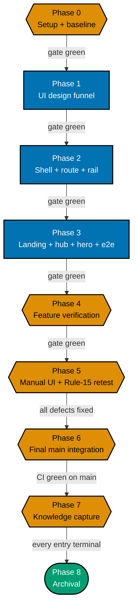

# Delivery Checklist — Path-Aware Navigation UI

This checklist delivers the **rendering layer** of the `course-paths` feature in `ayokoding-www`: the
shell modules, the `?path=` route wiring, the Screen 3 left path rail, the landing hero's four goal
cards, the paths hub, the path landing, and the accessibility contract for all of them — proven
end-to-end against a **fixture manifest**, because the four real manifests ship downstream in
`ayokoding-learning-path-05-manifests`.

**Hard prerequisite**: `ayokoding-learning-path-01-url-restructure` **and**
`ayokoding-learning-path-02-schema-and-prerequisite-dag` must both be merged to `main` before Phase 1
starts. See [README §Depends-on](./README.md#depends-on) for the checkable start preconditions.

> **Legend** — `[AI]`: an agent performs the step (the default; unmarked steps are `[AI]`).
> `[HUMAN]`: only a human can do it (physical action, out-of-band approval, real-secret or
> privileged-credential handling). `[AI+HUMAN]`: agent prepares, human approves or finishes.
> Git-mechanical steps (worktree create/remove, branch, push, merge) are `[AI]`.
>
> **Phase Gate** — every phase ends with a `### Phase N Gate` (must-pass verification) plus a
> `> **Pause Safety**:` note (safe-to-stop state + resume command). Each gate covers the phase's
> **code correctness** (tests, checkers, build) and its **integration** (draft PR opened, 3-cycle
> PR-Review, CI green, `[AI]` merge, `ayokoding-www` deployed). A phase is not complete until every
> gate check is green.

## Worktree

Worktree path: `worktrees/ayokoding-learning-path-03-navigation-ui/`

Optional manual pre-provisioning (run from repo root):

```bash
claude --worktree ayokoding-learning-path-03-navigation-ui
```

The plan-execution Step 0 gate enters this worktree by default: it auto-provisions from the latest
`origin/main` when missing, syncs with `origin/main` before implementing, and prompts before deleting
the worktree after the plan is archived and pushed.

Every phase branches from the **latest `origin/main`** inside this one worktree
(`git fetch origin && git checkout main && git pull && git checkout -b
ayokoding-learning-path-03-navigation-ui/<phase-slug>`), authors its work there, commits, pushes that
branch, and opens **its own draft PR**.

See [Worktree Path Convention](../../../repo-governance/conventions/structure/worktree-path.md) and
[Plans Organization Convention §Worktree Specification](../../../repo-governance/conventions/structure/plans.md#worktree-specification).

## Delivery Mode: worktree-to-pr

Each phase works in this worktree on its **own branch**, opens a **draft PR** against `main`, runs the
**PR-Review Maker→Fixer Cycle** (`pr-review-maker` / `pr-review-fixer`, 3 sequential CI-gated cycles),
flips the PR to ready, and `[AI]` **merges it automatically once all quality gates are green** — then
`[AI]` **deploys `ayokoding-www` to `prod-ayokoding-www` after every merge** (this plan ships to
ayokoding.com). See
[Plans Organization Convention §Delivery Mode](../../../repo-governance/conventions/structure/plans.md#delivery-mode)
and the [PR Review Quality Gate workflow](../../../repo-governance/workflows/pr/pr-review-quality-gate.md).

> **DN-11 DECIDED — `[AI]` auto-merge (now the repo default)**: the repo's
> [PR Merge Protocol](../../../repo-governance/development/workflow/pr-merge-protocol.md) has `[AI]`
> merge the PR **by default** once its five hardened preconditions hold; a `[HUMAN]` merge gate is an
> explicit per-plan opt-in, and this plan does not opt in. When DN-11 was first recorded the protocol
> still defaulted to a `[HUMAN]` merge, so the maintainer authorized `[AI]` merge for this plan
> specifically (2026-07-18, in-session — modeled on the sibling plan
> `fundamentally-strong-software-engineer`'s own separately-recorded authorization) via two directives:
> (a) this plan uses the SAME delivery methods as the sibling plan, and (b) no maintainer permission is
> needed to merge a PR once it has passed 3 review cycles and the PR quality gate. The protocol has
> since been changed to match, so **DN-11 = AI-auto-merge** now simply confirms the repo default rather
> than deviating from it. The preconditions are unchanged either way — only the actor differs.

**Per-Phase Integration Protocol** (each phase's gate lists these as must-pass):

1. [AI] Sync the worktree to latest `origin/main` and branch:
   `git fetch origin && git checkout main && git pull && git checkout -b
ayokoding-learning-path-03-navigation-ui/<phase-slug>`.
2. [AI] Stage only this phase's paths (`git add <explicit paths>` — never `git add -A`), commit
   thematically (Conventional Commits, imperative, no period), push the branch, open a **draft PR**
   against `main` (`gh pr create --draft --base main ...`) — CI runs on the PR.
3. [AI] Run the **PR-Review Maker→Fixer Cycle** (3 sequential CI-gated cycles), resolve every finding,
   then `gh pr ready`.
4. [AI] **Merge** once all quality gates are green (typecheck, lint, `test:quick`, `test:unit`,
   `test:e2e` where affected, `specs:behavior:coverage`, CI, the 3-cycle review) — `[AI]` auto-merge
   per DN-11.
5. [AI] Dispatch `apps-ayokoding-www-deployer` to deploy `ayokoding-www` to `prod-ayokoding-www` — a
   no-op redeploy for plan-side-only phases.

## Parallelization Model

**Cap**: honor the in-force subagent/PR-review concurrency cap (parallel-by-default, background
subagents capped per the orchestration convention). The main thread self-promotes nothing.

Every phase in this plan is **serial** — each builds directly on the prior feature slice
(funnel → shell + route → landing/hub/hero + e2e → verification → retest → integration → capture →
archival). There is no independent fan-out inside this plan; the parallelism in the wider effort is
**across** the five split plans, and this plan is the Wave-2 node that unblocks
`ayokoding-learning-path-05-manifests`.



**Accessibility note.** Phase kind is carried by node **shape** (hexagon = setup/verify, rectangle =
feature code, stadium = terminal) and by each node's own label; every edge carries a text condition, so
nothing depends on distinguishing the fills.

**Path constants** (referenced throughout):

- `<FEAT>` = `apps/ayokoding-www/src/features/course-paths/`
- `<NAV>` = `apps/ayokoding-www/src/features/navigation/shell/`
- `<APPSHELL>` = `apps/ayokoding-www/src/features/app-shell/shell/`
- `<ROUTE>` = `apps/ayokoding-www/src/app/[locale]/(content)/[...slug]/page.tsx`
- `<SPECS>` = `specs/apps/ayokoding/behavior/ayokoding-www/gherkin/course-paths/`
- `<E2E>` = `apps/ayokoding-www-fe-e2e/`
- `<PLAN>` = `plans/in-progress/ayokoding-learning-path-03-navigation-ui/` (this plan's folder — while
  the plan still sits in `plans/backlog/`, substitute that prefix instead; every `<PLAN>`-scoped
  acceptance command is run **from the repo root** so the path is unambiguous)
- Path ids (fixture and real — **renamed 2026-07-21 by the category-split ruling**: every careers path
  id gains the `careers/` prefix, and the fourth path's terminal segment is renamed
  `software-engineer-to-ai-engineer` → `ai-engineer` per R3):
  `careers/interview-ready/software-engineer`, `careers/immediately-effective/software-engineer`,
  `careers/fundamentally-strong/software-engineer`, `careers/immediately-effective/ai-engineer`,
  and — new, 2-segment, R2 — the two skills path ids: `skills/enterprise-resource-planning`,
  `skills/accounting`

## Markdown validation commands

These three commands are the **only** sanctioned markdown-validation forms in this plan. Every gate that
says "run the markdown validation" means exactly these; do not substitute a shorter form.

> **CLI facts, verified against the binary.** `md links validate` accepts **no positional path** —
> passing one fails with `error: unexpected argument '<path>' found` — and it cannot be scoped by
> `cd`-ing into a folder; it always walks the repo. `md heading-hierarchy validate` **does** accept
> positional paths. The bare repo-wide `md links validate` is **unsatisfiable** on this tree (93
> pre-existing broken links, all under `plans/done/`, unrelated to this work), which is why the
> exclusion form below is the one that gates a push.

1. **Link validation (this repo's pre-push form)**:

   ```bash
   cargo run --release --manifest-path apps/rhino-cli/Cargo.toml -- md links validate \
     --exclude plans/done \
     --exclude apps/ayokoding-www/content \
     --exclude apps/ose-www/content
   ```

   — acceptance: prints `All links valid! No broken links found.`

2. **Cross-plan link filter (catches a stale link into a sibling plan's archived location)**:

   ```bash
   cargo run --release --manifest-path apps/rhino-cli/Cargo.toml -- md links validate \
     --exclude plans/done \
     --exclude apps/ayokoding-www/content \
     --exclude apps/ose-www/content 2>&1 | grep -F "ayokoding-learning-path-03-navigation-ui"
   ```

   — acceptance: the `grep` finds **no** matching line (exit 1). Falsifiable the other way too:
   introduce one bad cross-plan link in this folder and the same command prints that file and exits 0.
   **Both checks are required — neither alone is sufficient**, because check 1 excludes `plans/done`
   and therefore cannot see a link pointing into a sibling plan's newly archived location.

3. **Heading hierarchy + markdownlint (scoped to this plan's folder)**:

   ```bash
   cargo run --release --manifest-path apps/rhino-cli/Cargo.toml -- md heading-hierarchy validate <PLAN>
   npx markdownlint-cli2 "<PLAN>*.md"
   ```

   — acceptance: both exit 0.

**Provenance of the phase numbering.** This plan's Phases 0/1/2/3/4/5/6/7/8 correspond to the closed
source plan's Phases 0/1/3/4/13/14/15/16/17. The source's Phase 2 (pure core) belongs to
`ayokoding-learning-path-02-schema-and-prerequisite-dag`, and its Phases 5-12 belong to the
url-restructure, manifests, and course-authoring plans. Keep this mapping in mind when tracing a step
back to the source plan; do not renumber to "close the gaps".

---

## Phase 0: Environment Setup & Baseline

> _Executor: repo-setup-manager_
>
> **Cross-plan precondition (hard).** This plan is Wave 2. Both upstream plans must be merged before
> Phase 1 begins; Phase 0 itself is safe to run at any time, and its last two checks are the gate that
> proves the upstreams landed.

- [ ] [AI] Enter/provision the worktree and install dependencies in the root worktree: `npm install`
      — acceptance: exits 0, `node_modules/` synchronized.
- [ ] [AI] Converge the toolchain in the root worktree: `npm run doctor -- --fix`
      — acceptance: exits 0 with no unresolved drift.
- [ ] [AI] Establish baselines: `npx nx run ayokoding-www:build` and
      `npx nx run ayokoding-www:test:unit` and `npx nx run ayokoding-www-fe-e2e:test:e2e`
      — acceptance: all exit 0; record the pass/fail counts in `evidence/phase-0-snapshot.txt`. Any
      preexisting failure is resolved before Phase 1 (Root Cause Orientation), not deferred.
- [ ] [AI] **Extension-point snapshot** — record the current behaviour and public shape of the four
      files this plan extends into `evidence/phase-0-snapshot.txt`:
      `apps/ayokoding-www/src/features/content/core/content-url.ts`, `<NAV>prev-next.tsx`,
      `<NAV>breadcrumb.tsx`, and `apps/ayokoding-www/src/features/content/core/tree-builder.ts`
      (specifically `computePrevNext`'s weight-based grouping, which the manifest ordering supersedes
      only inside path context) — acceptance: snapshot committed; each file's exported signature quoted
      verbatim so a later diff shows exactly what this plan changed.
- [ ] [AI] **Host snapshot (Screen 3)** — record the current `<NAV>resizable-sidebar.tsx` and
      `<APPSHELL>mobile-nav.tsx` contracts into `evidence/phase-0-snapshot.txt`: the `<aside>` class
      list including the `hidden … md:block` gate, the `ResizablePanel` min/max percentages, the
      `localStorage` width key name, and the `Sheet`/`SheetContent side="left"` usage — acceptance:
      snapshot committed. These are the invariants Phase 2 must leave untouched.
- [ ] [AI] Confirm the `course-paths` feature directory does **not** yet exist:
      `test -e apps/ayokoding-www/src/features/course-paths/shell && echo "EXISTS shell"` — acceptance:
      prints nothing (falsifiable the other way: it prints `EXISTS shell` once Phase 2 has run).
- [ ] [AI] **Upstream precondition 1** — confirm `ayokoding-learning-path-01-url-restructure` has
      merged: `test -d apps/ayokoding-www/content/en/learn/paths && test -d apps/ayokoding-www/content/en/learn/courses`
      — acceptance: both exit 0 (both fail today; the directories are that plan's deliverable).
- [ ] [AI] **Upstream precondition 2** — confirm
      `ayokoding-learning-path-02-schema-and-prerequisite-dag` has merged:
      `for f in schemas manifest path-nav path-context prerequisites manifest-integrity; do test -f "<FEAT>core/$f.ts" || echo "MISSING $f"; done`
      — acceptance: prints nothing (prints all six lines today).
- [ ] [AI] Confirm the two upstream plans are archived rather than merely branch-merged:
      `test -d plans/done && ls plans/done | grep -o -- "ayokoding-learning-path-01-url-restructure" | wc -l`
      returns **1**, and the same form for
      `ayokoding-learning-path-02-schema-and-prerequisite-dag` returns **1** — acceptance: both return
      1 (both return 0 today).

### Phase 0 Gate

> All checks below must pass before starting Phase 1.

- [ ] [AI] `npm install` exited 0 and `npm run doctor -- --fix` reports no unresolved drift.
- [ ] [AI] `npx nx run ayokoding-www:build`, `:test:unit`, and `npx nx run ayokoding-www-fe-e2e:test:e2e`
      all exit 0; every preexisting failure resolved (zero unresolved).
- [ ] [AI] `evidence/phase-0-snapshot.txt` committed, holding the extension-point and host snapshots.
- [ ] [AI] Both upstream preconditions hold: the `paths/` and `courses/` content homes exist, and all
      six `<FEAT>core/` modules exist.

> **Pause Safety**: only the local toolchain was verified, the baseline recorded, and the upstream
> preconditions checked — no feature work exists yet. Safe to stop indefinitely. To resume: re-run
> `npx nx run ayokoding-www:build && npx nx run ayokoding-www:test:unit` and confirm it is still clean.

---

## Phase 1: UI design funnel (Screens 0, 1, 1a, 1b, 2, 3)

> _Suggested executor: `web-researcher` (R7 prior art) + the `swe-developing-frontend-ui` skill for the
> funnel work._
>
> This phase produces **plan artefacts only** — no app code changes. It is the phase that makes the
> design reviewable before any component is written.

- [ ] [AI] **R5 survey** — read `libs/web-ui` component inventory + tokens + Storybook and the
      ayokoding app-shell + existing `sidebar-tree`/`breadcrumb`/`prev-next`/`section-card`
      [Repo-grounded] — plus `<NAV>resizable-sidebar.tsx` and `<APPSHELL>mobile-nav.tsx`, the two
      existing hosts the selected Screen 3 Option B swaps content into — acceptance: net-new components
      (`PathCard`, `PathLanding`, `PathRail`, `PathBanner`, `PathCourseLinks`, `PrerequisiteList`) named
      in `tech-docs.md`; existing primitives to reuse listed, including the shipped `Sheet` drawer as
      the below-`md` rail host (so no new overlay pattern is introduced).
  - _Suggested executor: `swe-developing-frontend-ui` skill_
- [ ] [AI] **R7 prior art** — delegate to `web-researcher` a survey of how comparable platforms present
      a track/path over shared lessons **with prerequisites** (roadmap.sh, Exercism, freeCodeCamp,
      Coursera) — acceptance: cited findings folded into
      [prd.md §R7 Prior-Art Findings](./prd.md#r7-prior-art-findings-window-shopped-2026-07-21); no
      `[Unverified]` claim survives in that section.
  - _Suggested executor: `web-researcher`_

### Hi-fi mockup matrix — 6 screens × 2 options × 3 viewports = 36 `.png`

> **This is a large render volume, so it is enumerated per asset rather than hidden behind one
> "render all mockups" checkbox.** **Amended 2026-07-21 by the category-split ruling (R6/R7)**: 12
> desktop HTML sources now exist in `<PLAN>assets/src/` (the original 8, content-fixed/rebuilt in place
> for R6/R8/path-id renames — same filenames — plus 4 new stems for Screens 1a/1b), but **zero of the
> 36 target `.png` files are currently valid** — the 8 pre-existing renders are stale against their
> edited HTML (this is a superset of, not a duplicate of, the already-known de-namespacing staleness:
> the hub and hero HTML changed for **content**, not just URL strings), and the 4 new screens have no
> render at all yet. **All 36 are produced here.** Naming scheme, render widths, and alt-text rules:
> [prd.md §Hi-fi asset matrix](./prd.md#hi-fi-asset-matrix-screen--option--viewport). Every file is
> `<PLAN>assets/<screen>-option-<a|b>-<mobile|tablet|desktop>.png`, rendered from
> `<PLAN>assets/src/<same-stem>.html` at **375 / 768 / 1280 px** — `.png` only, per the
> [UI Mockups convention](../../../repo-governance/conventions/formatting/diagrams.md#ui-mockups-in-plan-docs)
> (`.excalidraw.svg` and inline HTML+CSS are ruled out: GitHub strips styles and blocks Excalidraw fonts).
>
> **Screen 4's six renders are NOT produced here** — they belong to
> `ayokoding-learning-path-01-url-restructure`. DD-47's total of 42 is a two-plan total; see the
> [cross-plan note](./tech-docs.md#owned-by-this-plan).

- [ ] [AI] **Verify all 12 desktop HTML sources exist and no longer reference the retired flat-grid
      grammar or the retired AI-path id** — acceptance (run from the repo root):
      `for s in landing-hero paths-hub category-landing arc-landing path-landing course-path; do for o in a b; do test -f "<PLAN>assets/src/$s-option-$o-desktop.html" || echo "MISSING $s-$o"; done; done`
      prints nothing, AND a case-sensitive search across `<PLAN>assets/src/*.html` for the retired
      "digit, multiplication sign (U+00D7), digit" grid glyph and its ASCII "digit, letter x, digit"
      spelling returns no matches, AND a search for the string `software-engineer-to-ai-engineer` across
      the same files returns no matches.
- [ ] [AI] **Re-render all 12 desktop `.png` from their (new or content-changed) HTML sources** — every
      one of the 8 pre-existing HTML sources changed content under the category-split ruling (the hub
      was redesigned; the AI-engineer card copy and id were fixed; the path-landing/course-path sources'
      `?path=` strings gained the `careers/` prefix), and the 4 new stems have no render at all — command:
      render each at 1280 px from its `src/<same-stem>.html` — acceptance: for every one of the 12 stems,
      `f="<PLAN>assets/$s-option-$o-desktop"; test "$f.png" -nt "$f.html"` holds (mtime check), i.e.
      `for s in landing-hero paths-hub category-landing arc-landing path-landing course-path; do for o in a b; do
f="<PLAN>assets/$s-option-$o-desktop"; test "$f.png" -nt "$f.html" || echo "STALE $s-$o"; done; done`
      prints nothing. Falsifiable the other way: before this step the loop prints all 12 pairs (the 4 new
      stems because their `.png` does not exist yet — `test -nt` on a missing file fails — and the 8
      existing stems because their `.html` mtime now postdates their committed `.png`).
- [ ] [AI] Render `<PLAN>assets/landing-hero-option-a-mobile.png` from
      `<PLAN>assets/src/landing-hero-option-a-mobile.html` at 375 px — acceptance: file exists;
      single-column goal cards, four careers cards only (skills reachable via the tertiary link, not a
      fifth card), no retired grid-glyph text anywhere in the rendered copy.
- [ ] [AI] Render `<PLAN>assets/landing-hero-option-b-mobile.png` from
      `<PLAN>assets/src/landing-hero-option-b-mobile.html` at 375 px — acceptance: file exists; the two
      primary CTAs stack above the goal strip.
- [ ] [AI] Render `<PLAN>assets/landing-hero-option-a-tablet.png` from
      `<PLAN>assets/src/landing-hero-option-a-tablet.html` at 768 px — acceptance: file exists;
      two-column grid visible (`md:grid-cols-2` active), "Explore skills paths" link present.
- [ ] [AI] Render `<PLAN>assets/landing-hero-option-b-tablet.png` from
      `<PLAN>assets/src/landing-hero-option-b-tablet.html` at 768 px — acceptance: file exists; CTAs
      inline, goal strip two-column.
- [ ] [AI] Render `<PLAN>assets/paths-hub-option-a-mobile.png` from
      `<PLAN>assets/src/paths-hub-option-a-mobile.html` at 375 px — acceptance: file exists; a Careers
      section (arc sub-headings, `immediately-effective` showing two cards) stacked above a Skills
      section (two cards), both single-column; no flat undifferentiated grid.
- [ ] [AI] Render `<PLAN>assets/paths-hub-option-b-mobile.png` from
      `<PLAN>assets/src/paths-hub-option-b-mobile.html` at 375 px — acceptance: file exists; all six
      cards single-column, each carrying its category·arc badge.
- [ ] [AI] Render `<PLAN>assets/paths-hub-option-a-tablet.png` from
      `<PLAN>assets/src/paths-hub-option-a-tablet.html` at 768 px — acceptance: file exists; Careers arc
      groups two-up, Skills section two-up, sidebar column present.
- [ ] [AI] Render `<PLAN>assets/paths-hub-option-b-tablet.png` from
      `<PLAN>assets/src/paths-hub-option-b-tablet.html` at 768 px — acceptance: file exists; six badged
      cards, two-up.
- [ ] [AI] Render `<PLAN>assets/category-landing-option-a-mobile.png` from
      `<PLAN>assets/src/category-landing-option-a-mobile.html` at 375 px — acceptance: file exists;
      careers instance shows three stacked arc cards, `immediately-effective` previewing two member
      roles; skills instance (composited in the same image) shows the ramp-milestone strip and the
      empty state, both single-column.
- [ ] [AI] Render `<PLAN>assets/category-landing-option-b-mobile.png` from
      `<PLAN>assets/src/category-landing-option-b-mobile.html` at 375 px — acceptance: file exists; the
      careers instance as a single-column plain list.
- [ ] [AI] Render `<PLAN>assets/category-landing-option-a-tablet.png` from
      `<PLAN>assets/src/category-landing-option-a-tablet.html` at 768 px — acceptance: file exists;
      careers arc cards two-up with the third wrapping full-width; sidebar column present.
- [ ] [AI] Render `<PLAN>assets/category-landing-option-b-tablet.png` from
      `<PLAN>assets/src/category-landing-option-b-tablet.html` at 768 px — acceptance: file exists; the
      plain list, sidebar column present.
- [ ] [AI] Render `<PLAN>assets/arc-landing-option-a-mobile.png` from
      `<PLAN>assets/src/arc-landing-option-a-mobile.html` at 375 px — acceptance: file exists; both the
      two-role state and the single-role state (with its inline syllabus preview) stack full-width, and
      the single-role card is never a visibly bare stub.
- [ ] [AI] Render `<PLAN>assets/arc-landing-option-b-mobile.png` from
      `<PLAN>assets/src/arc-landing-option-b-mobile.html` at 375 px — acceptance: file exists; the
      single-role state's second grid cell renders visibly empty (this is the rejected option — the
      emptiness is the point of the comparison).
- [ ] [AI] Render `<PLAN>assets/arc-landing-option-a-tablet.png` from
      `<PLAN>assets/src/arc-landing-option-a-tablet.html` at 768 px — acceptance: file exists; two-role
      state two-up, sidebar column present.
- [ ] [AI] Render `<PLAN>assets/arc-landing-option-b-tablet.png` from
      `<PLAN>assets/src/arc-landing-option-b-tablet.html` at 768 px — acceptance: file exists; the
      visibly-empty second grid cell reproduced at this width too.
- [ ] [AI] Render `<PLAN>assets/path-landing-option-a-mobile.png` from
      `<PLAN>assets/src/path-landing-option-a-mobile.html` at 375 px — acceptance: file exists; phase
      headings inline (not sticky — sticky is `lg+` only).
- [ ] [AI] Render `<PLAN>assets/path-landing-option-b-mobile.png` from
      `<PLAN>assets/src/path-landing-option-b-mobile.html` at 375 px — acceptance: file exists; only the
      first stage expanded.
- [ ] [AI] Render `<PLAN>assets/path-landing-option-a-tablet.png` from
      `<PLAN>assets/src/path-landing-option-a-tablet.html` at 768 px — acceptance: file exists; sidebar
      column present (`md:block` active).
- [ ] [AI] Render `<PLAN>assets/path-landing-option-b-tablet.png` from
      `<PLAN>assets/src/path-landing-option-b-tablet.html` at 768 px — acceptance: file exists; two
      stages expanded, the rest collapsed with counts.
- [ ] [AI] Render `<PLAN>assets/course-path-option-a-mobile.png` from
      `<PLAN>assets/src/course-path-option-a-mobile.html` at 375 px — acceptance: file exists; banner
      strip full-width, no rail, `PrevNext` stacked.
- [ ] [AI] Render `<PLAN>assets/course-path-option-b-mobile.png` **showing the collapsed rail plus the
      opened left drawer** (the selected design's mobile form) from
      `<PLAN>assets/src/course-path-option-b-mobile.html` at 375 px — acceptance: file exists; the
      drawer's ordered course list and the banner disclosure trigger are both visible.
- [ ] [AI] Render `<PLAN>assets/course-path-option-a-tablet.png` from
      `<PLAN>assets/src/course-path-option-a-tablet.html` at 768 px — acceptance: file exists; generic
      content-tree sidebar visible beside the banner.
- [ ] [AI] Render `<PLAN>assets/course-path-option-b-tablet.png` **showing the rail truncated at the
      15 % width floor (~115 px)** from `<PLAN>assets/src/course-path-option-b-tablet.html` at 768 px —
      acceptance: file exists; rows render as number + ellipsised title, phase separators are bare rules
      with no labels.
- [ ] [AI] **Embed all 24 new (mobile + tablet) renders in `prd.md`** under their screen's "Hi-fi
      finalists" block, each with viewport-specific descriptive alt text that names what differs **at
      that width** (never a copy of the desktop alt text) — acceptance:
      `grep -o -- "assets/[a-z-]*option-[ab]-mobile.png" <PLAN>prd.md | sort -u | wc -l` returns **12**
      and the same form with `-tablet.png` returns **12** (both return **0** before this step), AND the
      **link-validator form defined in [Markdown validation commands](#markdown-validation-commands)**
      resolves every new `` target.
- [ ] [AI] **Append each selected option's three finalist render filenames to its selection line** in
      `prd.md` (e.g. `… — finalist renders: landing-hero-option-a-{mobile,tablet,desktop}.png`) —
      acceptance: `grep -o -- "finalist renders:" <PLAN>prd.md | wc -l` returns **6** (returns **0**
      before this step, verified), AND Screen 3's selection still names Option B —
      `grep -o -- "Selected: Option B — Left path rail" <PLAN>prd.md | wc -l` returns **1** (returns
      **0** if the selection is ever flipped back to Option A).
      **A bare `grep -c "Selected:" prd.md` MUST NOT be used** as an acceptance clause: it is already
      non-zero in the unexecuted plan, so it is pre-satisfied and carries zero discriminating power.
      `grep -c` also counts **lines**, not matches — never use it in an acceptance clause.

### Phase 1 Gate

> All checks below must pass before starting Phase 2.

- [ ] [AI] Funnel record complete in `prd.md` for Screens 0, 1, 1a, 1b, 2, 3: ≥2 named low-fi
      alternatives per screen, both hi-fi finalists, a named selection, a rationale table, the
      responsive strategy per breakpoint, the R5 grounding note, and the R7 prior-art citation.
- [ ] [AI] **All 36 of this plan's hi-fi renders exist** —
      `find <PLAN>assets -name '*-option-*-*.png' | wc -l` returns **36** (returns **8** before this
      phase), and every one is embedded in `prd.md` with viewport-specific alt text.
      Screen 4's remaining 6 renders belong to `ayokoding-learning-path-01-url-restructure`; **36 is
      the complete deliverable here**, not a shortfall against DD-47's cross-plan total of 42.
- [ ] [AI] Screen 3's selection reads **Option B — Left path rail**, and no surviving text in
      `README.md`, `prd.md`, `tech-docs.md`, or `delivery.md` asserts that every screen selected Option A.
- [ ] [AI] No retired grid-glyph text survives anywhere in `<PLAN>*.md` or `<PLAN>assets/src/*.html` —
      a case-sensitive search for the "digit, multiplication sign (U+00D7), digit" glyph and its ASCII
      `2` + `x` + `2` spelling across those paths returns no matches.
- [ ] [AI] All three checks in [Markdown validation commands](#markdown-validation-commands) pass
      (filtered link validation, heading-hierarchy on this plan's folder, markdownlint on
      `<PLAN>*.md`).
- [ ] [AI] Draft PR opened; 3-cycle PR-Review complete; CI green; PR `[AI]`-merged; deployed (no-op —
      plan artefacts only).

> **Pause Safety**: the design is fixed and fully reviewable in `prd.md`; **no app code has changed**,
> so the running site is untouched. Safe to stop indefinitely. To resume:
> `find <PLAN>assets -name '*-option-*-*.png' | wc -l` and confirm it still returns 36.

---

## Phase 2: `course-paths` shell + route wiring + the path rail — TDD

> _Suggested executor: `swe-typescript-dev`._
>
> Every cycle below is RED → GREEN → REFACTOR, one Gherkin scenario per cycle. Scenario text is quoted
> verbatim from [prd.md §Acceptance Criteria](./prd.md#acceptance-criteria-gherkin).

### Cycle 2.1 — Manifest repository (fixture-backed)

- [ ] [AI] **RED** — write a failing unit test at `<FEAT>shell/manifest-repository.test.ts` _(New test)_
      asserting the repository loads the fixture manifest into a `PathManifest[]` validated through the
      upstream `<FEAT>core/schemas.ts` zod schema, and **throws** on a manifest whose `courseOrder`
      names an unresolvable course ID — command: `npx nx run ayokoding-www:test:unit` — acceptance: the
      suite fails with `manifest-repository` module not found
      (`test -f <FEAT>shell/manifest-repository.ts` returns non-zero before this cycle).

  **Gherkin (underpins) →** "A path landing page lists its courses in manifest order" — the repository
  is the loading substrate that scenario stands on; the scenario itself is bound in Cycle 3.1.

- [ ] [AI] **GREEN** — implement `<FEAT>shell/manifest-repository.ts` _(New file)_: glob the manifest
      data directory, parse each file, validate through `<FEAT>core/schemas.ts`, and extend the content
      index to carry loaded manifests + per-course `prerequisites` alongside `trees`/`prevNext`
      [Repo-grounded — `ContentIndex` in `apps/ayokoding-www/src/features/content/core/types.ts`] —
      command: `npx nx run ayokoding-www:test:unit` — acceptance: exits 0. **The repository defines no
      validation of its own** — it calls the upstream schema, so a fixture that would not load in
      production cannot load in a test.
- [ ] [AI] **REFACTOR** — keep all IO inside `shell/`; the repository returns plain validated data and
      calls no React — command: `npx nx run ayokoding-www:test:unit && npx nx run ayokoding-www:typecheck && npx nx run ayokoding-www:lint`
      — acceptance: all exit 0.

### Cycle 2.2 — Route wiring + path-aware prev/next

- [ ] [AI] **RED** — write a failing test at `<NAV>prev-next.test.tsx` _(New test)_ asserting that, with
      an active fixture path context, `prev`/`next` are the fixture manifest's neighbours (not the
      weight-based siblings) and both hrefs carry `?path=<path-id>` — command:
      `npx nx run ayokoding-www:test:unit` — acceptance: the assertion fails (today `prev-next.tsx` has
      no path-context prop; `computePrevNext` is weight-based [Repo-grounded — `tree-builder.ts`]).

  **Gherkin (binds) →** "Prev and next follow the active path's order"

  ```gherkin
  Scenario: Prev and next follow the active path's order
    Given a reader is on a fixture-manifest course with an active path context
    When the reader reads the prev/next navigation
    Then prev and next are the neighboring courses in that fixture manifest
    And both links preserve the path context query parameter
  ```

- [ ] [AI] **GREEN** — add the optional `pathId` parameter to
      `apps/ayokoding-www/src/features/content/core/content-url.ts` (appends `?path=<path-id>`), add the
      optional path-context prop to `<NAV>prev-next.tsx` (**markup unchanged** — data source and href
      construction only), and wire `<ROUTE>` to read `searchParams.path`, call the upstream
      `parsePathContext`, and resolve prev/next via `resolvePathNav` when a valid context resolves —
      command: `npx nx run ayokoding-www:test:unit && npx nx run ayokoding-www:build` — acceptance: both
      exit 0; the canonical (no-path) prev/next output is byte-identical to the Phase 0 snapshot.
- [ ] [AI] **REFACTOR** — route every path-preserving href through `contentUrl` so no component
      hand-concatenates `?path=` — command:
      `grep -ro -- "?path=" apps/ayokoding-www/src/features --include=*.tsx | wc -l` — acceptance: every
      remaining occurrence is inside a test file or `content-url.ts`; no component builds the query
      string itself. Then `npx nx run ayokoding-www:test:unit && npx nx run ayokoding-www:lint` exit 0.

### Cycle 2.3 — Path-aware breadcrumb

- [ ] [AI] **RED** — write a failing test at `<NAV>breadcrumb.test.tsx` _(New test)_ asserting that with
      an active fixture path context the trail renders `Home / Learn / <Path Title> / <Course Title>`
      and the path crumb links to `/en/learn/paths/<path-id>` with the context preserved — command:
      `npx nx run ayokoding-www:test:unit` — acceptance: the assertion fails (today's breadcrumb is the
      content-tree trail with no path segment [Repo-grounded — `buildBreadcrumbs` in `<ROUTE>`]).

  **Gherkin (binds) →** "The breadcrumb reflects the active path"

  ```gherkin
  Scenario: The breadcrumb reflects the active path
    Given a reader is on a fixture-manifest course with an active path context
    When the breadcrumb renders
    Then it shows Home, Learn, the path title, and the course title
    And the path crumb links to the path landing page /en/learn/paths/<path-id> with the path context preserved
  ```

- [ ] [AI] **GREEN** — extend `<NAV>breadcrumb.tsx` with an optional path context that injects the path
      segment and carries `?path=` on downstream hrefs; leave `showCurrent` / `aria-current="page"`
      behaviour unchanged — command: `npx nx run ayokoding-www:test:unit` — acceptance: exits 0.
- [ ] [AI] **REFACTOR** — collapse the path-vs-canonical branch into one segment builder so the two
      trails cannot drift — command: `npx nx run ayokoding-www:test:unit && npx nx run ayokoding-www:typecheck`
      — acceptance: both exit 0.

### Cycle 2.4 — Prerequisite display (both views)

- [ ] [AI] **RED** — write a failing test at `<FEAT>shell/prerequisite-list.test.tsx` _(New test)_
      asserting the list renders each declared prerequisite as a link to its canonical
      `/en/learn/courses/<id>` URL **in both** the path-aware and the canonical render, and renders
      **nothing at all** (not an empty "Prerequisites:" label) for a course with no prerequisites —
      command: `npx nx run ayokoding-www:test:unit` — acceptance: the suite fails with
      `prerequisite-list` module not found.

  **Gherkin (binds) →** "A course page surfaces its declared prerequisites"

  ```gherkin
  Scenario: A course page surfaces its declared prerequisites
    Given a fixture course declares prerequisites in its canonical metadata
    When a reader opens the course page with or without a path context
    Then the page lists each prerequisite course with a link to its canonical URL
    And the prerequisite list renders even in the canonical no-path view
  ```

- [ ] [AI] **GREEN** — author `<FEAT>shell/prerequisite-list.tsx` _(New file)_ consuming the upstream
      `resolvePrerequisites`, and render it from `<ROUTE>` in **both** branches — command:
      `npx nx run ayokoding-www:test:unit` — acceptance: exits 0, including the empty-state assertion.
- [ ] [AI] **REFACTOR** — the component takes resolved refs and performs no lookup of its own (functional
      core / imperative shell) — command: `npx nx run ayokoding-www:test:unit && npx nx run ayokoding-www:lint`
      — acceptance: both exit 0.

### Cycle 2.5 — Canonical deep-link view + "part of paths"

- [ ] [AI] **RED** — write a failing test at `<FEAT>shell/path-course-links.test.tsx` _(New test)_
      asserting that a course opened with **no** `?path=` renders the full body, the content-tree
      breadcrumb, its prerequisite list, and one badge link per path whose `courseOrder` lists the
      course — using **two** fixture manifests sharing a course ID, so the multi-badge case is real —
      command: `npx nx run ayokoding-www:test:unit` — acceptance: the suite fails with
      `path-course-links` module not found.

  **Gherkin (binds) →** "A course deep-linked without path context renders the canonical view"

  ```gherkin
  Scenario: A course deep-linked without path context renders the canonical view
    Given a reader opens a course URL /en/learn/courses/<course-id> with no path context query parameter
    When the course page renders
    Then the course body renders in full with the content-tree breadcrumb and its prerequisite list
    And a "this course is part of" affordance lists every path that includes the course
  ```

- [ ] [AI] **GREEN** — author `<FEAT>shell/path-course-links.tsx` _(New file)_ deriving its badges from
      the loaded manifests, and render it in the canonical branch of `<ROUTE>` — command:
      `npx nx run ayokoding-www:test:unit` — acceptance: exits 0.
- [ ] [AI] **No-forked-body acceptance clause (not Gherkin here)** — assert over the **two** fixture
      manifests that a course ID appearing in both resolves to exactly one canonical body directory —
      acceptance: a unit assertion proves one body for the shared ID and fails if a second body is
      introduced. The Gherkin form of this property ("The three software-engineer paths reference a
      shared course with no body duplication") belongs to `ayokoding-learning-path-05-manifests`, the
      first plan where all three real manifests exist.
- [ ] [AI] **REFACTOR** — badge derivation reads the manifest index once, not per badge — command:
      `npx nx run ayokoding-www:test:unit && npx nx run ayokoding-www:typecheck` — acceptance: both exit 0.

### Cycle 2.6 — Invalid path context falls back

- [ ] [AI] **RED** — write a failing test in `<FEAT>shell/manifest-repository.test.ts` (extend) plus a
      `<ROUTE>`-level test asserting that `?path=` naming no loaded manifest renders the canonical view
      with no error boundary and no thrown exception — command: `npx nx run ayokoding-www:test:unit` —
      acceptance: the assertion fails before the fallback branch exists.

  **Gherkin (binds) →** "An invalid path context falls back to the canonical view"

  ```gherkin
  Scenario: An invalid path context falls back to the canonical view
    Given a reader opens a course URL with a path context that names no known path
    When the course page renders
    Then the course renders the canonical standalone view
    And no error is shown
  ```

- [ ] [AI] **GREEN** — treat a `null` return from the upstream `parsePathContext` as "no context" in
      `<ROUTE>` — command: `npx nx run ayokoding-www:test:unit` — acceptance: exits 0.
- [ ] [AI] **REFACTOR** — there is exactly one place in `<ROUTE>` that decides path-aware vs. canonical,
      so invalid, missing, and omitted all converge on the same branch — command:
      `npx nx run ayokoding-www:test:unit && npx nx run ayokoding-www:lint` — acceptance: both exit 0.

### Cycle 2.7 — Course omitted from a path

- [ ] [AI] **RED** — write a failing `<ROUTE>`-level test asserting that a fixture course **absent** from
      the named fixture path's `courseOrder` renders the canonical view with neither rail nor banner for
      that path — command: `npx nx run ayokoding-www:test:unit` — acceptance: the assertion fails.

  **Gherkin (binds) →** "A course omitted from a path shows no path nav for that path"

  ```gherkin
  Scenario: A course omitted from a path shows no path nav for that path
    Given a fixture course is not listed in a given fixture path's manifest
    When a reader opens that course with that path's context
    Then the course renders the canonical standalone view
    And neither the path rail nor the path banner is shown for that path
  ```

- [ ] [AI] **GREEN** — require **both** a valid path id and membership in that manifest's `courseOrder`
      before rendering path chrome — command: `npx nx run ayokoding-www:test:unit` — acceptance: exits 0.
- [ ] [AI] **REFACTOR** — express the membership test through the upstream `resolvePathNav` result rather
      than a second scan of `courseOrder` — command: `npx nx run ayokoding-www:test:unit` — acceptance:
      exits 0.

### Cycle 2.8 — The path rail at desktop width

- [ ] [AI] **RED** — write failing component tests at `<FEAT>shell/path-rail.test.tsx` _(New test)_ — the
      **selected Screen 3 Option B** — asserting: a `<nav>` whose accessible name is
      `{Path} course list`; a semantic `<ol>` in manifest order; the current course carrying
      `aria-current="page"` **and** a non-colour signal (`▸` marker + `font-semibold` class); every row
      link carrying `?path=<path-id>`; each row's `aria-label` holding the untruncated title; and the
      footer's `view full path` + `browse all courses` escape links present — command:
      `npx nx run ayokoding-www:test:unit` — acceptance: the suite fails with `path-rail` module not
      found (`test -f <FEAT>shell/path-rail.tsx` returns non-zero before this cycle).

  **Gherkin (binds) →** "The path rail shows the whole ordered arc beside a course at desktop width"

  ```gherkin
  Scenario: The path rail shows the whole ordered arc beside a course at desktop width
    Given a reader opens a course in path context on a desktop-width viewport
    When the page renders
    Then the left rail lists that path's courses in manifest order with the current course marked
    And the current course is distinguished by a marker and weight, not by colour alone
    And the rail offers a link back to the full path and to the whole course library
  ```

- [ ] [AI] **GREEN** — author `<FEAT>shell/path-rail.tsx` _(New file)_ and wire it as a **content swap in
      the existing desktop host**: pass `<PathRail>` instead of `<Sidebar>` as `ResizableSidebar`'s
      `children` when `parsePathContext` resolves. **Do not fork `ResizableSidebar`, do not add a second
      `<aside>`, and do not add a second `localStorage` width key** — the `hidden … md:block` gate, the
      15 %-35 % band, the resize handle, and `ayokoding-sidebar-width` are all reused unchanged
      [Repo-grounded — `<NAV>resizable-sidebar.tsx`] — command:
      `npx nx run ayokoding-www:test:unit && npx nx run ayokoding-www:build` — acceptance: both exit 0,
      AND `grep -ro -- "function ResizableSidebar" apps/ayokoding-www/src | wc -l` returns **1** (returns
      **2** if the component is forked), AND
      `grep -ro -- "ayokoding-sidebar-width" apps/ayokoding-www/src | wc -l` returns the same value as
      the Phase 0 snapshot (a second width key would increase it).
- [ ] [AI] **REFACTOR** — extract the row renderer so the desktop and drawer forms share one
      implementation with only truncation differing — command:
      `npx nx run ayokoding-www:test:unit && npx nx run ayokoding-www:lint` — acceptance: both exit 0.

### Cycle 2.9 — The rail collapses into the shipped drawer on a phone

- [ ] [AI] **RED** — write a failing component test at `<FEAT>shell/path-banner.test.tsx` _(New test)_
      asserting the `md:hidden` disclosure `<button>` has accessible name
      `Open path course list — {Path}, course {k} of {N}`, carries `aria-expanded` and `aria-controls`,
      and flips `aria-expanded` on activation — command: `npx nx run ayokoding-www:test:unit` —
      acceptance: the suite fails with `path-banner` module not found.

  **Gherkin (binds) →** "The path rail collapses into the existing navigation drawer on a phone"

  ```gherkin
  Scenario: The path rail collapses into the existing navigation drawer on a phone
    Given a reader opens a course in path context on a phone-width viewport
    When they activate the path readout's "open path course list" control
    Then the existing left navigation drawer opens showing that path's ordered courses
    And focus moves into the drawer and returns to the control when the drawer is dismissed
  ```

- [ ] [AI] **GREEN** — author `<FEAT>shell/path-banner.tsx` _(New file)_ with the compact
      `on path · course k of N` readout plus the disclosure trigger, and swap `<PathRail>` for
      `<SidebarTree>` inside `<APPSHELL>mobile-nav.tsx`'s `SheetContent` when a path context is active,
      setting `SheetTitle` to the path name. The trigger opens the **same** sheet the header `☰` opens
      (single `open` state in `header.tsx`, **not** a second overlay) — command:
      `npx nx run ayokoding-www:test:unit && npx nx run ayokoding-www:build` — acceptance: both exit 0,
      AND `grep -ro -- "SheetContent" apps/ayokoding-www/src/features | wc -l` returns the same value as
      the Phase 0 snapshot (a second overlay would increase it).
- [ ] [AI] **REFACTOR** — no new focus machinery: the drawer's focus trap, focus restore, and `Esc`
      handling are Radix `Dialog` behaviour inherited from the shipped `Sheet` — command:
      `grep -ro -- "useFocusTrap\|focus-trap\|trapFocus" apps/ayokoding-www/src/features | wc -l` returns
      **0**, then `npx nx run ayokoding-www:test:unit` exits 0 — acceptance: both hold.

### Cycle 2.10 — No-path regression guard (the invariant)

- [ ] [AI] **RED** — write a failing test at `<FEAT>shell/no-path-regression.test.tsx` _(New test)_
      asserting **both directions**: with no `?path=`, `ResizableSidebar` receives `<Sidebar>`,
      `MobileNav` receives `<SidebarTree>`, and neither rail nor banner nor path breadcrumb segment
      appears; **and** with a valid `?path=`, the rail does appear and the generic tree does not —
      command: `npx nx run ayokoding-www:test:unit` — acceptance: the suite fails before the conditional
      exists. A one-directional test would pass with the sidebar permanently replaced, which is the exact
      defect this guard exists to prevent.

  **Gherkin (binds) →** "A course opened without path context renders the generic sidebar unchanged"

  ```gherkin
  Scenario: A course opened without path context renders the generic sidebar unchanged
    Given a reader opens a canonical course URL with no path context query parameter
    When the page renders
    Then the left sidebar shows the generic content tree exactly as it does elsewhere in the site
    And no path rail, path readout, or path breadcrumb segment appears
  ```

- [ ] [AI] **GREEN** — make the guard pass without touching either host's shell — command:
      `npx nx run ayokoding-www:test:unit` — acceptance: exits 0 in both directions.
- [ ] [AI] **REFACTOR** — deduplicate the breadcrumb/prev-next path-vs-canonical branches; keep `shell/`
      the only IO — command:
      `npx nx run ayokoding-www:test:unit && npx nx run ayokoding-www:typecheck && npx nx run ayokoding-www:lint`
      — acceptance: all exit 0. (`ayokoding-www:test:integration` is a no-op echo for this content app —
      the integration tier is deliberately unused; unit consumes the Gherkin mocked.)

### Specs & Gherkin Delivery

- [ ] [AI] **RED (specs)** — author the `course-paths` Gherkin companion under `<SPECS>` _(New folder;
      sibling `.../gherkin/navigation/` exists — Repo-grounded)_, one `.feature` per behavior group
      (path-order nav, breadcrumb, canonical fallback, invalid-path fallback, omitted course,
      prerequisite display, rail desktop, rail drawer, no-path regression, a11y, build-green), copied
      verbatim from [prd.md §Acceptance Criteria](./prd.md#acceptance-criteria-gherkin), plus
      `<SPECS>README.md` — command: `npx nx run ayokoding-www:specs:behavior:coverage` — acceptance:
      exits non-zero (scenarios present, no step definitions yet).
  - _Suggested executor: `specs-maker`_
- [ ] [AI] **GREEN (specs)** — implement the step bindings so every `<SPECS>` scenario executes —
      command: `npx nx run ayokoding-www:specs:behavior:coverage` — acceptance: exits 0.

### Local Quality Gates (Before Push)

- [ ] [AI] `npx nx affected -t typecheck` exits 0.
- [ ] [AI] `npx nx affected -t lint` exits 0.
- [ ] [AI] `npx nx affected -t test:quick test:unit` exits 0.
- [ ] [AI] `npx nx affected -t specs:behavior:coverage` exits 0.
- [ ] [AI] Fix ALL failures — including preexisting issues not caused by these changes.
- [ ] [AI] Re-run failing checks to confirm resolution; verify zero failures before pushing.

### Post-Push CI Verification

- [ ] [AI] Commit and push to `origin ayokoding-learning-path-03-navigation-ui/<phase-slug>` (the PR
      branch — this plan's Delivery Mode is `worktree-to-pr`).
- [ ] [AI] Monitor the PR's check run (poll every ~2 min; one
      `gh run view --json status,conclusion` per wakeup; never `gh run watch`).
- [ ] [AI] Verify ALL CI checks pass — no exceptions; fix root causes and push follow-up commits until
      green. Do NOT proceed to Phase 3 until CI is fully green.

### Phase 2 Gate

> All checks below must pass before starting Phase 3.

- [ ] [AI] Manifest loading + path-aware route wiring + prev/next + breadcrumb + prerequisite display +
      "part of paths" implemented; all ten cycles' tests green.
- [ ] [AI] `PathRail` (selected Screen 3 Option B) renders in **both** hosts via content swap —
      `grep -ro -- "function ResizableSidebar" apps/ayokoding-www/src | wc -l` returns **1**, no second
      `<aside>` and no second width key exist, and the no-path render is proven unchanged **in both
      directions**.
- [ ] [AI] `npx nx run ayokoding-www:specs:behavior:coverage` exits 0 for the new `course-paths` domain;
      the retained navigation specs still pass.
- [ ] [AI] `npx nx run ayokoding-www:test:unit` + `:build` + `:typecheck` + `:lint` exit 0.
      (`:test:integration` is a no-op echo — omitted deliberately, not overlooked.)
- [ ] [AI] Draft PR opened; 3-cycle PR-Review complete; CI green; PR `[AI]`-merged; deployed.

> **Pause Safety**: the feature resolves a manifest + path context + prerequisites end-to-end against
> the fixture, and the rail renders in both hosts. **No real manifest is published, so production still
> renders exactly the canonical view it renders today** — the site is in a self-consistent, shippable
> state. Safe to stop. To resume: `npx nx run ayokoding-www:test:unit`.

---

## Phase 3: Path landing + paths hub + landing hero + e2e

> _Suggested executor: `swe-typescript-dev` + `swe-e2e-dev`._
>
> **E2E target discipline**: `ayokoding-www:test:e2e` is `echo 'no-op: target not applicable for this
project'` and always exits 0, so **no RED clause may point at it**. E2E for this app lives entirely in
> the paired `ayokoding-www-fe-e2e` project (`npx bddgen && npx playwright test`) [Repo-grounded].

### Cycle 3.1 — Path landing + path card

- [ ] [AI] **RED (e2e)** — write a failing Playwright spec in `<E2E>` asserting the fixture path's
      landing page renders its courses in `courseOrder`, numbered, phase-grouped, with every course link
      carrying `?path=` — command: `npx nx run ayokoding-www-fe-e2e:test:e2e` — acceptance: the spec
      fails (no `path-landing.tsx` exists yet).
  - _Suggested executor: `swe-e2e-dev`_

  **Gherkin (binds) →** "A path landing page lists its courses in manifest order"

  ```gherkin
  Scenario: A path landing page lists its courses in manifest order
    Given a fixture path manifest is loaded by the manifest repository
    When a reader opens that fixture path's landing page under /en/learn/paths/
    Then the courses appear in the fixture manifest's courseOrder
    And every course link carries the path context query parameter
  ```

- [ ] [AI] **GREEN (e2e fixture)** — add the fixture manifest under `<E2E>` _(New file)_ — a small
      `courseOrder` over real, already-live course IDs with declared prerequisites, validated through the
      upstream `<FEAT>core/schemas.ts` — plus a **second** fixture manifest sharing one course ID (the
      multi-badge / no-forked-body case) — command: `npx nx run ayokoding-www-fe-e2e:test:e2e` —
      acceptance: the fixtures load; the spec now fails on the missing component rather than on missing
      data.
- [ ] [AI] **GREEN** — author `<FEAT>shell/path-landing.tsx` and `<FEAT>shell/path-card.tsx` _(New
      files)_ per [prd.md Screens 1/2 selected designs](./prd.md#ui-design-funnel-path-aware-navigation-screens);
      `path-card.tsx` exposes a `context` prop with `"hub"` and `"hero"` variants so one component serves
      Screens 0 and 1, plus the category-grouped `CategorySection`/`ArcGroup` wrapper the hub uses (R6)
      — command: `npx nx run ayokoding-www:build && npx nx run ayokoding-www-fe-e2e:test:e2e` —
      acceptance: both exit 0; the hub renders a **Careers section grouped by arc, and a separate Skills
      section** (populated from whatever manifests are loaded — with only the fixtures present, each
      section renders its fixture cards and no placeholder).
- [ ] [AI] **REFACTOR** — the landing's ordered list and the rail's ordered list share one ordering
      helper; no bespoke CSS where a `libs/web-ui` token exists — command:
      `npx nx run ayokoding-www-fe-e2e:test:e2e && npx nx run ayokoding-www:lint` — acceptance: both exit 0.

### Cycle 3.1a — Empty path-list state (shared, R7)

- [ ] [AI] **RED** — write a failing component test at `<FEAT>shell/empty-path-list-state.test.tsx`
      _(New test)_ asserting the component renders a stated "being written, check back soon" message
      plus a `<Link>` CTA to a named fallback category, and that it is **not** a bare empty `<div>` (has
      real text content and a real landmark role) — command: `npx nx run ayokoding-www:test:unit` —
      acceptance: the suite fails with `empty-path-list-state` module not found.

  **Gherkin (binds) →** "A category landing with no populated manifest renders an explicit empty state"

  ```gherkin
  Scenario: A category landing with no populated manifest renders an explicit empty state
    Given a structural category index exists with zero published path manifests
    When a reader opens that category's landing page
    Then the page renders a stated "being written, check back soon" message with a fallback link
    And the page never renders a blank content area with no message
  ```

- [ ] [AI] **GREEN** — author `<FEAT>shell/empty-path-list-state.tsx` _(New file)_ per
      [prd.md Screen 1a hi-fi spec](./prd.md#screen-1a-hi-fi--category-landing-enlearnpathscareers-enlearnpathsskills-option-a-arc-cards-with-member-role-preview)
      — command: `npx nx run ayokoding-www:test:unit` — acceptance: exits 0.
- [ ] [AI] **REFACTOR** — the component takes a `fallbackHref`/`fallbackLabel` prop pair, no hardcoded
      "careers" string inside it (so `arc-landing.tsx` can reuse it verbatim with a different fallback)
      — command: `npx nx run ayokoding-www:test:unit && npx nx run ayokoding-www:lint` — acceptance:
      both exit 0.

### Cycle 3.1b — Category landing (Screen 1a, R7)

- [ ] [AI] **RED (e2e)** — write a failing Playwright spec in `<E2E>` asserting: the careers-shaped
      fixture's category landing at `/en/learn/paths/careers/` renders one `ArcCard` per arc with a
      member-role preview (the `immediately-effective` fixture arc previewing two roles); and the
      skills-shaped fixture's category landing at `/en/learn/paths/skills/` renders the fixed-arc ramp
      statement with **no** arc-selection control present anywhere on the page — command:
      `npx nx run ayokoding-www-fe-e2e:test:e2e` — acceptance: the spec fails (no
      `category-landing.tsx` exists yet).
  - _Suggested executor: `swe-e2e-dev`_

  **Gherkin (binds) →** "The careers category landing offers an arc chooser" AND "The skills category
  landing states its fixed arc once, with no chooser"

  ```gherkin
  Scenario: The careers category landing offers an arc chooser
    Given a fixture careers manifest set with three arcs is loaded
    When a reader opens the careers category landing at /en/learn/paths/careers/
    Then the page renders one arc card per arc with its member role(s) previewed
    And the immediately-effective arc card previews exactly two member roles

  Scenario: The skills category landing states its fixed arc once, with no chooser
    Given a fixture skills manifest set is loaded
    When a reader opens the skills category landing at /en/learn/paths/skills/
    Then the page renders the ramp promise once as a statement, not a question
    And no arc-selection control is present anywhere on the page
  ```

- [ ] [AI] **GREEN** — author `<FEAT>shell/category-landing.tsx` _(New file)_ per
      [prd.md Screen 1a hi-fi spec](./prd.md#screen-1a-hi-fi--category-landing-enlearnpathscareers-enlearnpathsskills-option-a-arc-cards-with-member-role-preview):
      **two separate render branches** (careers = `ArcCard` grid; skills = `path-card.tsx`
      `context="hub"` grid + `RampMilestoneStrip`), never one grid driven by a boolean prop (R8) — falls
      back to `empty-path-list-state.tsx` when the category's manifest set is empty — command:
      `npx nx run ayokoding-www:build && npx nx run ayokoding-www-fe-e2e:test:e2e` — acceptance: both
      exit 0.
- [ ] [AI] **REFACTOR** — confirm the two branches are structurally distinct (not a single JSX tree with
      a chooser conditionally hidden) — command:
      `grep -A5 -- "function CategoryLanding" <FEAT>shell/category-landing.tsx | grep -c "arc ===" || true`
      then `npx nx run ayokoding-www-fe-e2e:test:e2e && npx nx run ayokoding-www:lint` — acceptance: both
      commands exit 0; a human/agent review confirms no shared chooser markup renders conditionally
      hidden for the skills branch (checked at PR review, not asserted by a single grep).

### Cycle 3.1c — Arc landing (Screen 1b, R7)

- [ ] [AI] **RED (e2e)** — write a failing Playwright spec in `<E2E>` asserting: a two-role fixture arc
      (`immediately-effective`) renders both role cards side by side with no placeholder; and a
      one-role fixture arc (`interview-ready`) renders exactly one role card with an inline first-phase
      syllabus preview, and the layout never reserves or renders a visibly empty second card — command:
      `npx nx run ayokoding-www-fe-e2e:test:e2e` — acceptance: the spec fails (no `arc-landing.tsx`
      exists yet).
  - _Suggested executor: `swe-e2e-dev`_

  **Gherkin (binds) →** "An arc landing with two paths renders both role cards without a placeholder"
  AND "An arc landing with one path renders a full card, not a sparse stub"

  ```gherkin
  Scenario: An arc landing with two paths renders both role cards without a placeholder
    Given the fixture immediately-effective arc manifest lists two roles
    When a reader opens the arc landing at /en/learn/paths/careers/immediately-effective/
    Then both role cards render side by side with their own course counts
    And neither card is a placeholder or an empty grid cell

  Scenario: An arc landing with one path renders a full card, not a sparse stub
    Given a fixture arc manifest lists exactly one role
    When a reader opens that arc's landing page
    Then the single role card renders with an inline first-phase syllabus preview
    And the layout does not reserve or render a visibly empty second card
  ```

- [ ] [AI] **GREEN** — author `<FEAT>shell/arc-landing.tsx` _(New file)_ per
      [prd.md Screen 1b hi-fi spec](./prd.md#screen-1b-hi-fi--arc-landing-enlearnpathscareersarc-option-a-always-render-arc-header--role-cards-single-role-gets-a-syllabus-preview):
      render **exactly as many** role cards as the arc has roles (never a fixed 2-slot grid); the
      single-role state renders `SyllabusPreview` inline in that card — command:
      `npx nx run ayokoding-www:build && npx nx run ayokoding-www-fe-e2e:test:e2e` — acceptance: both
      exit 0.
- [ ] [AI] **REFACTOR** — the role grid and `SyllabusPreview` list share the same "number is order"
      list-rendering helper `path-landing.tsx`'s syllabus uses (no duplicated ordered-list markup) —
      command: `npx nx run ayokoding-www-fe-e2e:test:e2e && npx nx run ayokoding-www:lint` — acceptance:
      both exit 0.

### Cycle 3.2 — Landing hero (Screen 0)

- [ ] [AI] **RED (Screen 0 hero)** — write a failing Playwright spec in `<E2E>` asserting the landing
      hero at `/en` renders a "Choose your path" eyebrow with a `PathCard` grid (populated from the same
      fixture manifests as the other `course-paths` specs) and a "Compare all paths" link to
      `/en/learn/paths`, per
      [prd.md Screen 0 hi-fi spec](./prd.md#screen-0-hi-fi--landing-hero-en-option-a-four-goal-cards-in-the-hero)
      — command: `npx nx run ayokoding-www-fe-e2e:test:e2e` — acceptance: the new spec fails (today's
      `<APPSHELL>hero.tsx` renders only the H1/tagline/Learn+Tools buttons — no "Choose your path"
      eyebrow, no `PathCard` grid, no "Compare all paths" link [Repo-grounded]).

  **Gherkin (binds) →** "The landing hero surfaces the four goal paths directly"

  ```gherkin
  Scenario: The landing hero surfaces the four goal paths directly
    Given a first-time visitor opens the site landing page at /en
    When the hero section renders
    Then the hero shows a goal-labeled path card for each published path
    And a "Compare all paths" link to /en/learn/paths is visible below the cards
  ```

- [ ] [AI] **GREEN (Screen 0 hero)** — edit `<APPSHELL>hero.tsx` per the same hi-fi spec: add the
      "Choose your path" eyebrow + a `PathCard` grid (`context="hero"` variant, two columns at `md+`,
      single column below, sourced from the same loaded-manifest data as the paths hub, still capped at
      the four careers-arc cards per R1) plus the tertiary "Explore skills paths →" escape-hatch link and
      the existing "Compare all paths →" (`/en/learn/paths`) / "Browse the full course library →"
      (`/en/learn/courses`) row; move the existing Learn/Tools CTAs into the global nav —
      command: `npx nx run ayokoding-www-fe-e2e:test:e2e` — acceptance: the Screen 0 hero spec passes,
      and the existing `<APPSHELL>landing.test.tsx` is extended rather than deleted (it still exits 0).
- [ ] [AI] **REFACTOR** — the hero's `PathCard` grid is the **same component and the same
      manifest-loading path** as the hub's (no duplicated card markup, no second data source) — command:
      `grep -ro -- "function PathCard" apps/ayokoding-www/src | wc -l` returns **1**, then
      `npx nx run ayokoding-www-fe-e2e:test:e2e && npx nx run ayokoding-www:lint` exit 0 — acceptance:
      all three hold.

### Cycle 3.3 — Accessibility

- [ ] [AI] **RED (a11y)** — this suite is **playwright-bdd**, so the a11y scenario is authored as Gherkin
      under `<SPECS>` and bound by a step definition at `<E2E>src/steps/course-paths-a11y.steps.ts`
      _(New file; follow the existing `accessibility.steps.ts` pattern — Repo-grounded)_. The steps
      assert, on a course rendered in path context: the path rail, path banner, path breadcrumb,
      prerequisite list, and prev/next are each a labelled landmark reachable and operable by keyboard
      with a visible focus ring; the current item carries `aria-current`; and `<html lang>` equals the
      active locale (`en`) — command: `npx nx run ayokoding-www-fe-e2e:test:e2e` — acceptance: the
      `course-paths-a11y` scenario fails (the landmarks do not exist yet).

  **Gherkin (binds) →** "The navigation feature meets accessibility requirements"

  ```gherkin
  Scenario: The navigation feature meets accessibility requirements
    Given a reader uses a keyboard and a screen reader on a course in path context
    When they navigate the path rail, banner, breadcrumb, prerequisite list, and prev/next
    Then each is a labelled landmark reachable and operable by keyboard with visible focus
    And the document language attribute matches the active locale
  ```

- [ ] [AI] **GREEN (a11y)** — add the landmark roles, accessible labels, `aria-current`, focus styling,
      and locale-correct `lang` attribute so the scenario passes — command:
      `npx nx run ayokoding-www-fe-e2e:test:e2e` — acceptance: the `course-paths-a11y` scenario passes.
- [ ] [AI] **REFACTOR** — a11y attributes come from the components themselves, not from the step
      definitions' expectations being loosened — command: `npx nx run ayokoding-www-fe-e2e:test:e2e` —
      acceptance: exits 0 with no `.skip`, `.fixme`, or soft assertion introduced
      (`grep -ro -- "test.skip\|test.fixme" <E2E>src | wc -l` returns **0**).

### Cycle 3.4 — Aggregate feature binder + regression guard

> **Sanctioned multi-scenario step.** This binder consumes whole `.feature` files, so it is one of the
> two exceptions to the one-scenario-per-cycle rule (the other being pure-core `underpins` steps).

- [ ] [AI] **GREEN (aggregate binder)** — implement the remaining `playwright-bdd` step definitions so
      **every** scenario in `<SPECS>` executes against the fixture manifests, covering the deep-link
      fallback, the invalid-path fallback, the omitted-course case, the rail at desktop, the rail in the
      drawer, and the no-path sidebar — command: `npx nx run ayokoding-www-fe-e2e:test:e2e` —
      acceptance: exits 0; every `<SPECS>` scenario reports as executed, none as undefined or pending.
- [ ] [AI] **Legacy-redirect regression guard (not owned Gherkin)** — assert that one already-shipped
      legacy redirect still resolves after the route-wiring change — command:
      `npx nx run ayokoding-www-fe-e2e:test:e2e` — acceptance: the guard passes. The redirect's own
      Gherkin belongs wholly to `ayokoding-learning-path-01-url-restructure`; this is a regression
      guard proving **this plan** did not break it, not a re-assertion of that plan's scenario.

### Local Quality Gates (Before Push)

- [ ] [AI] `npx nx affected -t typecheck lint test:quick test:unit specs:behavior:coverage` exits 0.
- [ ] [AI] `npx nx run ayokoding-www-fe-e2e:test:e2e` exits 0.
- [ ] [AI] Fix ALL failures — including preexisting issues not caused by these changes.

### Post-Push CI Verification

- [ ] [AI] Commit and push to `origin ayokoding-learning-path-03-navigation-ui/<phase-slug>`.
- [ ] [AI] Monitor the PR's check run (poll every ~2 min) until every check is green; fix root causes
      and push follow-ups. Do NOT proceed to Phase 4 until CI is fully green.

### Phase 3 Gate

> All checks below must pass before starting Phase 4.

- [ ] [AI] Path landing + the category-grouped paths hub (Careers arc-grouped, up to four cards; Skills
      section separate) + `category-landing.tsx` + `arc-landing.tsx` + `empty-path-list-state.tsx` + the
      landing-hero `PathCard` grid and escape hatch all render from the **same** manifest data;
      prerequisite display verified; all `course-paths` e2e specs green in `en`, including the Screen 0
      hero spec, the category/arc landing specs, and the a11y scenario.
- [ ] [AI] Exactly one `PathCard` implementation exists —
      `grep -ro -- "function PathCard" apps/ayokoding-www/src | wc -l` returns **1**.
- [ ] [AI] `npx nx run ayokoding-www:test:unit` + `:build` + `:lint` + `:specs:behavior:coverage`
      **and** `npx nx run ayokoding-www-fe-e2e:test:e2e` exit 0. (`ayokoding-www:test:e2e` and
      `:test:integration` are both no-op echoes — e2e lives in the paired `ayokoding-www-fe-e2e`
      project, and the integration tier is deliberately unused for content apps.)
- [ ] [AI] Draft PR opened; 3-cycle PR-Review complete; CI green; PR `[AI]`-merged; deployed.

> **Pause Safety**: the full path-aware navigation UI is implemented, tested (unit + e2e + specs), and
> live — but **no real path manifests are published yet**, so production still shows the canonical
> library and the hero's grid renders only what the loaded manifests provide. **This plan's feature
> scope is complete**; `ayokoding-learning-path-05-manifests` is unblocked. Safe to stop. To resume:
> `npx nx run ayokoding-www-fe-e2e:test:e2e`.

---

## Phase 4: Feature verification

- [ ] [AI] Run affected quality gates from the worktree:
      `npx nx affected -t typecheck lint test:quick test:unit test:e2e specs:behavior:coverage`
      — acceptance: exits 0. Fix ALL failures, including preexisting ones (Root Cause Orientation),
      committing preexisting fixes separately.
- [ ] [AI] Build the site: `npx nx run ayokoding-www:build` — acceptance: exits 0.
- [ ] [AI] Run all three checks in [Markdown validation commands](#markdown-validation-commands)
      — acceptance: all three exit 0 / print no matching line. Use those exact forms; the bare
      repo-wide `md links validate` is **unsatisfiable** (the repo carries pre-existing broken links
      under `plans/done/` that this plan neither owns nor may fix), so an unscoped clause could never
      go green and would silently license skipping the check.

  **Gherkin (binds) →** "The navigation feature builds and validates green"

  ```gherkin
  Scenario: The navigation feature builds and validates green
    Given the course-paths rendering layer is complete over a fixture manifest
    When the ayokoding-www build, the unit tier, the fixture e2e suite, and the link and heading validators run
    Then the build and every tier succeed
    And link, heading-hierarchy, and markdownlint validation report no errors
  ```

- [ ] [AI] **Static/dynamic boundary check** — confirm the canonical (no-`?path=`) course route is still
      statically generated after the `searchParams` wiring: inspect the build output for the course
      route's rendering mode — acceptance: the canonical route's mode matches the Phase 0 snapshot; if it
      regressed to dynamic, fix the boundary (move the param read into the thin client component) rather
      than accepting the regression.
- [ ] [AI] **Host-invariant sweep** — `grep -ro -- "function ResizableSidebar" apps/ayokoding-www/src | wc -l`
      returns **1**; `grep -ro -- "ayokoding-sidebar-width" apps/ayokoding-www/src | wc -l` matches the
      Phase 0 snapshot; `grep -ro -- "SheetContent" apps/ayokoding-www/src/features | wc -l` matches the
      Phase 0 snapshot — acceptance: all three hold (each would change if a host were forked or a second
      overlay introduced).
- [ ] [AI] **UI Quality Gate (R9 — this plan is the programme's only component-bearing plan, so it runs
      the gate itself; see [tech-docs.md §UI-gate and API-gate posture](./tech-docs.md#ui-gate-and-api-gate-posture-r9))**
      — invoke the [`ui-quality-gate` workflow](../../../repo-governance/workflows/ui/ui-quality-gate.md)
      (`swe-ui-checker` → `swe-ui-fixer` loop, `mode=strict`) scoped to
      `apps/ayokoding-www/src/features/course-paths/` plus the touched files under
      `apps/ayokoding-www/src/features/app-shell/shell/` and
      `apps/ayokoding-www/src/features/navigation/shell/` — acceptance: the workflow reports
      `final-status: pass` (zero findings confirmed on two consecutive `swe-ui-checker` runs, per the
      workflow's own termination condition); any HIGH/CRITICAL finding is fixed before this checkbox is
      ticked, not deferred.

> **Important**: Fix ALL failures found during quality gates, not just those caused by your changes
> (Root Cause Orientation). Commit preexisting fixes separately with conventional-commit messages.

### Phase 4 Gate

> All checks below must pass before starting Phase 5.

- [ ] [AI] Affected `typecheck/lint/test:quick/test:unit/test:e2e/specs:behavior:coverage` exit 0.
- [ ] [AI] Build + link + heading + markdownlint green (all scoped to `<PLAN>` for the markdown checks).
- [ ] [AI] Static/dynamic boundary unchanged from the Phase 0 snapshot; host-invariant sweep green.
- [ ] [AI] `ui-quality-gate` (R9) reports `final-status: pass` — zero findings on two consecutive
      `swe-ui-checker` runs; API gate exemption stands (no API surface — see tech-docs.md §R9).
- [ ] [AI] Draft PR opened; 3-cycle PR-Review complete; CI green; PR `[AI]`-merged; deployed.

> **Pause Safety**: the rendering layer passes every automated gate. Safe to stop. To resume: re-run the
> affected quality gates + build.

---

## Phase 5: Manual UI Verification + Rule-15 Three-Tester Retest

> Path-aware navigation is a user-facing change, and this plan owns the largest UI surface of the five,
> so a live-site retest is **mandatory** before archival.
>
> **Locale scope**: this plan's course/path content is authored `en`-only — per
> [brd.md §Business-Scope Non-Goals](./brd.md#business-scope-non-goals), an Indonesian content mirror is
> explicitly deferred. Verify content screens in `en` only; do not fabricate an `id` walk-through for a
> feature with no `id` content. The nav code itself is locale-neutral (it renders whatever
> locale-specific content exists), so this scoping is a content-availability fact, not a code limitation.

### Manual UI Verification (Playwright MCP)

- [ ] [AI] Confirm `en` is the content locale for the course library — command:
      `test -d apps/ayokoding-www/content/en/learn/courses` — acceptance: exits 0; no sibling
      `id/learn/courses` directory is expected or required.
- [ ] [AI] Start dev server: `npx nx dev ayokoding-www` — acceptance: server up on port 3101.
- [ ] [AI] For `en` × breakpoints (375 / 768 / 1280 px), via Playwright MCP (`browser_navigate` +
      `browser_resize` + `browser_snapshot`): open `/en` (hero grid + escape hatch), the paths hub
      (Careers arc-grouped section + Skills section), the careers category landing (arc chooser), the
      skills category landing (fixed-arc ramp statement, no chooser), a two-role arc landing and a
      one-role arc landing (confirm the single-role card renders its syllabus preview, not a placeholder
      second card), the fixture path landing, walk 2-3 courses via prev/next (confirm `?path=` persists +
      order + breadcrumb), open a course and confirm its **prerequisite display**, deep-link a course
      without `?path=` (canonical view + "part of paths" affordance), and hit an invalid `?path=`
      (canonical view). Also open a fixture category with zero populated manifests and confirm
      `empty-path-list-state.tsx` renders its stated message + fallback link, never a blank area. Verify
      `html[lang]` is `en` and `browser_console_messages` is clean — acceptance: all behaviors correct;
      zero console errors at every breakpoint.
- [ ] [AI] **Path-rail responsive contract (the selected Screen 3 Option B, DD-46)** — on a course in
      path context, verify each breakpoint against
      [prd.md §Screen 3 responsive specification](./prd.md#screen-3-responsive-specification-the-selected-option-b-breakpoint-by-breakpoint):
      at **1280 px** the rail shows full course titles with labelled phase separators, `course k of N`,
      and the two escape links; at **768 px** the rail is present but truncated (rows read
      `<number> <ellipsised title>`, full title in the link's `aria-label`, phase separators are bare
      rules); at **375 px** there is **no** rail and the banner readout carries the disclosure button —
      acceptance: all three states match; the rail never appears below `md` and never disappears at or
      above `md`.
- [ ] [AI] **Path-rail mobile drawer** — at 375 px activate the banner's "Open path course list" control
      via `browser_click`, confirm the **same** left drawer the header `☰` opens now lists the path's
      ordered courses, that `Esc` and the scrim both dismiss it, and that focus enters the drawer on open
      and returns to the trigger on close — acceptance: all four behaviors correct; no second overlay
      appears (only one dialog in the accessibility tree at a time).
- [ ] [AI] **No-path regression sweep** — at all three breakpoints, open a canonical course URL with no
      `?path=` and confirm the generic content-tree sidebar (desktop/tablet) and generic drawer (mobile)
      render exactly as on any other content page, with no rail, no readout, and no path breadcrumb
      segment — acceptance: the no-path experience is indistinguishable from the pre-plan behaviour
      recorded in the Phase 0 snapshot.
- [ ] [AI] Capture one screenshot per screen per breakpoint via `browser_take_screenshot` to
      `<PLAN>evidence/phase-5-<screen>-en-<breakpoint>px.png`, **including** the three rail states
      (`rail-desktop`, `rail-tablet-truncated`, `rail-mobile-drawer-open`) and the empty-state capture
      — acceptance: files exist in `<PLAN>evidence/`;
      `find <PLAN>evidence -name 'phase-5-*-en-*px.png' | wc -l` returns at least **18** (6 screens × 3
      breakpoints: hero, hub, category landing, arc landing, path landing, course) plus the 3 rail-state
      captures plus the empty-state capture.
- [ ] [AI] Document evidence in this checklist: reference each screenshot (``) and
      note console/network status per breakpoint — acceptance: every captured file is referenced; no
      "verified manually" claim stands without a committed artifact.

> **Manual API verification is not applicable** — this plan adds no API endpoint. Recorded explicitly so
> the omission reads as a decision rather than an oversight.

### Rule-15 Three-Tester Retest (before archival)

- [ ] [AI] Run the three live-site testers (the `web-ux-test-fixing-planning` workflow:
      `web-exploratory-tester` + `web-usability-tester` + `web-design-tester`) against the running
      landing hero, paths hub, fixture path landing, and sample courses **in path context (the
      `PathRail` at all three breakpoints, including the mobile drawer)**, in `en` — acceptance:
      EWT/UWT/DWT findings + spec-gaps recorded.
- [ ] [AI] Append each finding below as a new unchecked checkbox, source-attributed
      (`- [ ] EWT-NNN:` / `- [ ] UWT-NNN:` / `- [ ] DWT-NNN: <defect> — fix before archival`); append
      any SG-###/USS-### items to the Specs & Gherkin Delivery steps in Phase 2.
- [ ] [AI] Fix every rule-15 EWT/UWT/DWT defect finding before archival — deferral requires explicit user
      permission (only when genuinely impossible) for defect findings; SG-### spec-gap proposals and
      USS-### spec-suggestions may be triaged or deferred with written rationale.

#### Rule-15 retest follow-ups

- [ ] [AI] _(populated during the retest — every EWT/UWT/DWT defect finding must be fixed/ticked before
      archival; deferral of a defect requires explicit user permission and only when genuinely
      impossible; SG-###/USS-### may be triaged or deferred with rationale)_

### Phase 5 Gate

> All checks below must pass before starting Phase 6.

- [ ] [AI] All screens (hero + hub + category landing (both category shapes) + arc landing (both
      role-count shapes) + path landing + sample courses + prerequisite display + empty-state) verified
      in `en` across all three breakpoints; screenshots committed in `<PLAN>evidence/`; console clean.
- [ ] [AI] Rail responsive contract, mobile drawer, and no-path regression sweep all verified with
      committed evidence.
- [ ] [AI] All rule-15 EWT/UWT/DWT defect findings fixed (ticked) or explicitly permitted to defer.
- [ ] [AI] Draft PR opened (retest evidence + any fixes); 3-cycle PR-Review complete; CI green; PR
      `[AI]`-merged; deployed.

> **Pause Safety**: the navigation UI is verified live and defect-clean in `en`. Safe to stop. To
> resume: re-run the three testers against the running app.

---

## Phase 6: Final `origin/main` Integration & CI Verification

- [ ] [AI] Confirm no plan PR is still open — `gh pr list --search "ayokoding-learning-path-03-navigation-ui" --state open`
      returns zero rows — acceptance: no open plan PRs remain. (Do **not** use
      `git merge-base --is-ancestor` to prove a phase merged: squash-merge here rewrites the commit, so
      that check false-negatives on every merged PR.)
- [ ] [AI] Sync the worktree to latest `origin/main` and run the full affected suite:
      `npx nx affected -t typecheck lint test:quick test:unit test:e2e specs:behavior:coverage` +
      `npx nx run ayokoding-www:build` — acceptance: all exit 0 on the integrated `main`.
- [ ] [AI] Monitor the final `main` CI run (poll every ~2 min; one
      `gh run view --json status,conclusion` per wakeup; never `gh run watch`) — acceptance: all GitHub
      Actions green; fix root causes and push follow-ups (own PR → review → `[AI]` merge) until green.
- [ ] [AI] Confirm `prod-ayokoding-www` serves the landing hero and the paths hub without error, and that
      a canonical course URL with no `?path=` renders exactly as before this plan; re-dispatch
      `apps-ayokoding-www-deployer` if any earlier deploy lagged — acceptance: production serves the
      rendering layer with no regression for no-path readers.
- [ ] [AI] Fast-forward local `main` after the last side-worktree push (`git checkout main && git pull
--ff-only`) so the primary checkout does not silently diverge — acceptance: `git status` reports
      `main` up to date with `origin/main`.

### Phase 6 Gate

> All checks below must pass before starting Phase 7.

- [ ] [AI] Zero open plan PRs; every prior phase merged to `main`.
- [ ] [AI] Full affected suite + build green on integrated `main`; final `main` CI run green.
- [ ] [AI] `prod-ayokoding-www` serving the rendering layer; no-path pages unchanged.

> **Pause Safety**: the whole plan is integrated on `main`, green in CI, and live in production. Safe to
> stop. To resume: re-run the affected suite on `main` and check CI/prod status.

---

## Phase 7: Knowledge Capture

> _Triage every surviving `learnings.md` entry before archival. See the
> [Knowledge Capture Convention](../../../repo-governance/development/quality/knowledge-capture.md)._

- [ ] [AI] Apply the litmus test to every `learnings.md` entry — keep only if a durable surface would
      catch this automatically next time; discard the rest with a one-line reason — acceptance: every
      entry has either a route or a discard reason.
- [ ] [AI] Apply the **secret/sensitivity gate** to every surviving entry — sanitize any secret,
      credential, token, or private hostname to a `<placeholder>` token, or discard if unsanitizable —
      acceptance: `learnings.md` contains no raw secret.
- [ ] [AI] Apply the **repo-relevance gate** — infra-private content (Terraform, k3s, Proxmox, real
      hostnames/inventories) stays in `ose-infra` only and is NEVER cross-routed into
      `ose-public`/`ose-primer`; public-governance content may propagate via the existing parity loop —
      acceptance: no infra-private content appears in this repo's routed output.
- [ ] [AI] Route each surviving learning to exactly one durable home per the open-ended routing matrix —
      non-code homes may land inline (small edit) or as a `plans/backlog/` follow-up (large); **code
      homes (`apps/`, `libs/`, tests) are ALWAYS filed as a separate `plans/backlog/<slug>/` plan and
      NEVER landed inline** in this plan's commits or PR — acceptance: every `learnings.md` entry records
      its terminal routing state.
- [ ] [AI] If no generalizable learning surfaced, record the explicit escape in `learnings.md`:
      `No generalizable learnings — <one-line reason>` — acceptance: `learnings.md` is never silently
      empty.

### Phase 7 Gate

> All checks below must pass before Plan Archival.

- [ ] [AI] Every `learnings.md` entry is in a terminal state (routed inline, filed as backlog, or
      discarded with reason), or the file records the explicit "none" escape.
- [ ] [AI] No code-homed learning landed inline in this plan's own commits/PR.
- [ ] [AI] Draft PR opened (`learnings.md` triage); 3-cycle PR-Review complete; CI green; PR
      `[AI]`-merged; deployed (no-op).

> **Pause Safety**: `learnings.md` is fully triaged (or explicitly recorded as empty); no future process
> depends on querying it later. Safe to stop. To resume: re-read `learnings.md` and confirm every entry
> is terminal.

---

## Phase 8: Plan Archival

- [ ] [AI] Verify ALL delivery checklist items are ticked.
- [ ] [AI] Verify the Knowledge Capture phase is complete — every `learnings.md` entry reached a terminal
      state or the file records the explicit "none" escape; both the secret/sensitivity gate and the
      repo-relevance gate were applied to every surviving entry.
- [ ] [AI] Verify ALL quality gates pass (local + CI) and the build is green.
- [ ] [AI] **Cross-plan link gate (BF-8)** — run **both** commands 1 and 2 in
      [Markdown validation commands](#markdown-validation-commands) — acceptance: command 1 prints
      `All links valid! No broken links found.` AND command 2's `grep` finds no matching line (exit 1).
      This is the check that catches a stale `../ayokoding-learning-path-02-schema-and-prerequisite-dag/syllabus/…`
      link after that plan archives into `plans/done/YYYY-MM-DD__…` — command 1 alone cannot see it,
      because it excludes `plans/done`.
- [ ] [AI] Verify ALL manual assertions pass (Playwright MCP) with committed evidence in
      `<PLAN>evidence/`; the `en` content locale exercised (per brd.md's Indonesian-mirror-deferred
      non-goal). Manual API verification is not applicable — this plan adds no endpoint.
- [ ] [AI] Verify every rule-15 EWT/UWT/DWT defect finding is fixed (ticked) — deferral requires explicit
      user permission (only when genuinely impossible); SG-###/USS-### may be triaged or deferred with
      rationale.
- [ ] [AI] **Verify this plan's design-funnel artefacts are complete (DD-46 / DD-47)** —
      `find <PLAN>assets -name '*-option-*-*.png' | wc -l` returns **36** (6 screens × 2 options × 3
      viewports: hero, paths hub, category landing, arc landing, path landing, course path); every one
      is embedded in `prd.md` with viewport-specific alt text; Screen 3's selection reads **Option B —
      Left path rail** (`grep -o -- "Selected: Option B — Left path rail" <PLAN>prd.md | wc -l` returns
      **1**); no "Selection: PENDING" remains.
      **36 is the complete deliverable for this plan.** DD-47's total of 42 is a two-plan total: the
      remaining 6 (Screen 4) belong to `ayokoding-learning-path-01-url-restructure`. Do NOT copy that
      plan's renders into this folder to make the number read 42 — a duplicated matrix drifts.
- [ ] [AI] Verify the no-path invariant one last time on production: a canonical course URL renders the
      generic sidebar with no path chrome — acceptance: confirmed with a committed screenshot.
- [ ] [AI] Move: `git mv plans/in-progress/ayokoding-learning-path-03-navigation-ui/
plans/done/YYYY-MM-DD__ayokoding-learning-path-03-navigation-ui/` using today's completion date (the
      `evidence/` and `assets/` subfolders move with it).
- [ ] [AI] Update `plans/in-progress/README.md` — remove the plan entry.
- [ ] [AI] Update `plans/done/README.md` — add the plan entry with completion date.
- [ ] [AI] Update any other READMEs that reference this plan (e.g. `plans/README.md`,
      `plans/backlog/README.md`), and the four sibling split plans' `Depends-on` sections if they name
      this plan's location.
- [ ] [AI] Commit the archival:
      `chore(plans): move ayokoding-learning-path-03-navigation-ui to done`.

### Phase 8 Gate

- [ ] [AI] All 36 funnel renders present and embedded; Screen 3 recorded as Option B; the cross-plan
      DD-47 note intact so 36 is not misread as under-delivery.
- [ ] [AI] Plan folder is under `plans/done/YYYY-MM-DD__ayokoding-learning-path-03-navigation-ui/`; all
      READMEs updated; archival committed.
- [ ] [AI] Draft PR opened (archival move); 3-cycle PR-Review complete; CI green; PR `[AI]`-merged;
      deployed (no-op).

> **Pause Safety**: the plan is archived and its final PR `[AI]`-merged to `main`. Terminal state. To
> resume: nothing — the plan is complete.

---

### Commit Guidelines (all phases)

- [ ] [AI] Commit changes thematically — group related changes into logically cohesive commits.
- [ ] [AI] Follow Conventional Commits: `<type>(<scope>): <description>` (imperative, no period).
- [ ] [AI] Split domains/concerns into separate commits; preexisting fixes get their own commits.
- [ ] [AI] Do NOT bundle unrelated changes into a single commit.
- [ ] [AI] Stage explicit paths only (`git add <path>`) — never `git add -A`; sibling repos and adjacent
      plan folders carry concurrent work that must not be swept into this plan's commits.

### Local Quality Gates (Before Every Push)

- [ ] [AI] `npx nx affected -t typecheck` exits 0.
- [ ] [AI] `npx nx affected -t lint` exits 0.
- [ ] [AI] `npx nx affected -t test:quick test:unit` exits 0 (add `test:e2e` for the feature phases).
- [ ] [AI] `npx nx affected -t specs:behavior:coverage` exits 0.
- [ ] [AI] Fix ALL failures — including preexisting issues not caused by your changes (Root Cause
      Orientation).

> **Important**: Fix ALL failures found during quality gates, not just those caused by your changes.
> Commit preexisting fixes separately with appropriate conventional-commit messages.

### Note: plan location at execution time

This plan is authored in `plans/backlog/ayokoding-learning-path-03-navigation-ui/`. When work starts it
is promoted to `plans/in-progress/ayokoding-learning-path-03-navigation-ui/` (pure move, no date
prefix); the `git mv` in Phase 8 then archives it to
`plans/done/YYYY-MM-DD__ayokoding-learning-path-03-navigation-ui/` using the completion date. Substitute
the current location wherever `<PLAN>` appears.
