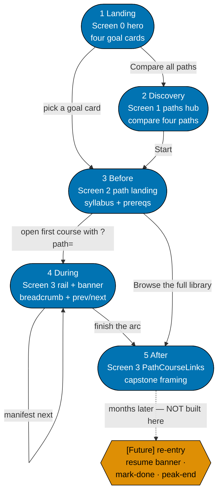
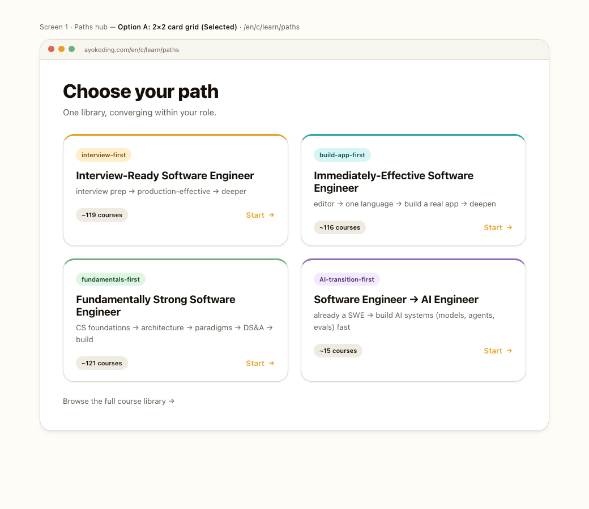
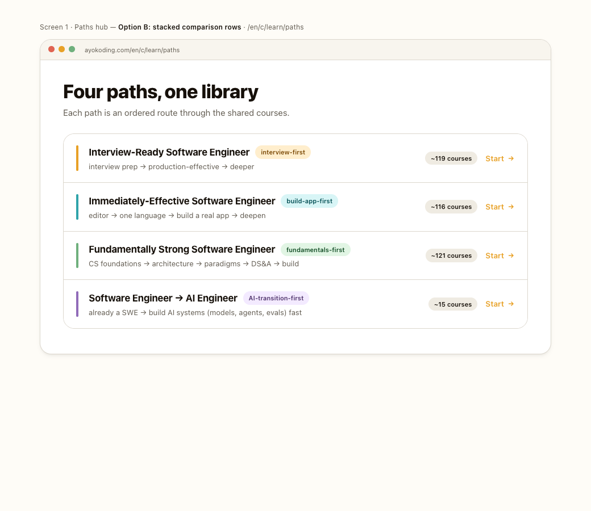
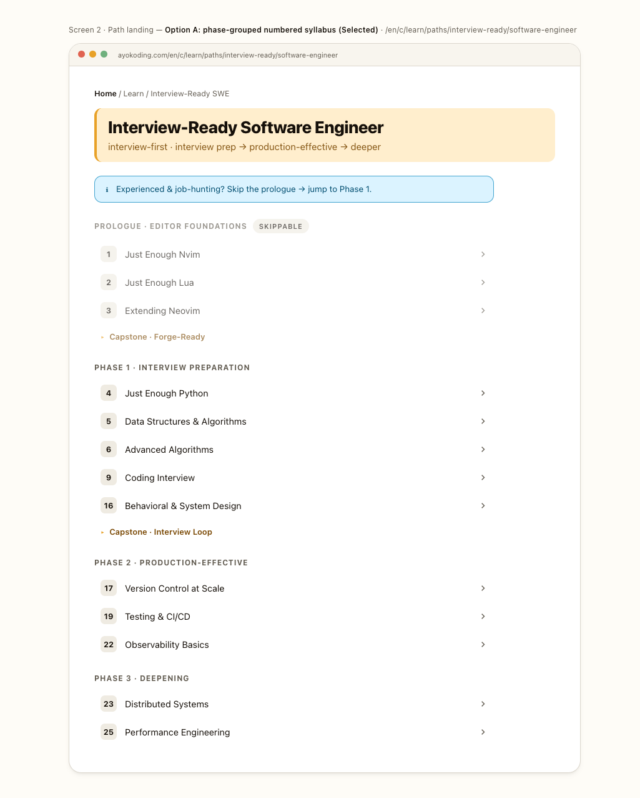
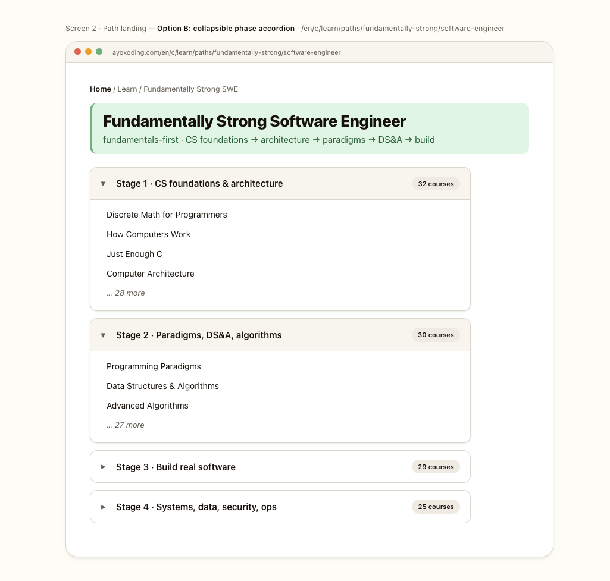

# Product Requirements — Path-Aware Navigation UI

## Product Overview

`ayokoding-www` gains a **`course-paths` rendering layer** that makes one canonical, path-neutral
course body behave correctly under four different reading orders. A **path** is an ordered manifest of
course IDs; **path context rides in the `?path=<path-id>` query parameter**, never in the URL path
segment, so a course keeps exactly one canonical URL
(`/en/c/learn/courses/<course-id>`) no matter how many paths list it.

This plan builds five user-facing surfaces and the shell that feeds them:

| Screen | Surface                                       | What this plan ships                                                                         |
| ------ | --------------------------------------------- | -------------------------------------------------------------------------------------------- |
| 0      | Site landing hero at `/en`                    | Four goal-labelled `PathCard`s plus the "Compare all paths" and "Browse the library" escapes |
| 1      | Paths hub at `/en/c/learn/paths`              | The 2×2 four-card chooser                                                                    |
| 2      | Path landing at `/en/c/learn/paths/<path-id>` | The manifest rendered as a phase-grouped, numbered syllabus                                  |
| 3      | Course page in path context                   | The left `PathRail`, `PathBanner` readout, path breadcrumb, `PrerequisiteList`, prev/next    |
| 4      | Legacy-bucket landing and page banner         | **Not this plan** — owned by `ayokoding-learning-path-01-url-restructure`                    |

The `course-paths` **pure core** (`schemas.ts`, `path-nav.ts`, `path-context.ts`, `prerequisites.ts`,
`manifest-integrity.ts`) is an upstream artefact from
`ayokoding-learning-path-02-schema-and-prerequisite-dag`; this plan imports it and never edits it.
Every rendering behaviour is proven against a **fixture manifest**, because the four real manifests are
published by the Wave-3 plan `ayokoding-learning-path-05-manifests`.

The navigation feature is **app code**, so it carries a `specs/` Gherkin companion and three-level
tests per the repo's feature-change completeness rule.

## Personas (one per path)

Duplicated verbatim from the source plan into every split plan — all four paths' readers reach every
screen this plan builds, so all four personas are carried, not just one.

- **Experienced engineer re-entering the job market (north-star for the
  `interview-ready/software-engineer` path)** — recently laid off, returning from a gap/sabbatical, or
  an employed senior wanting to switch. Already owns the editor workflow and deep fundamentals; needs
  to **refresh breadth fast, relearn interview technique** at mid/senior/staff level, and handle a
  **layoff / employment-gap narrative** — without walking a from-scratch curriculum. Interview/job prep
  FIRST.
- **A builder who wants to be effective fast (north-star for the
  `immediately-effective/software-engineer` path)** — wants "immediately effective" SWE: set up the
  editor, learn one language end-to-end, **ship a real app early**, then deepen into CS fundamentals,
  DS&A, algorithms, and systems. Serves both a from-scratch learner and a mid-career switcher.
- **A university-style, fundamentals-first learner (north-star for the
  `fundamentally-strong/software-engineer` path)** — wants the rigorous bottom-up route: CS
  foundations, computer architecture, paradigms, and data structures & algorithms **before** building
  apps at scale. Prefers to understand the machine and the theory first, then apply it.
- **An already-working software engineer transitioning to AI engineering (north-star for the
  `immediately-effective/software-engineer-to-ai-engineer` path, added 2026-07-20)** — already owns the
  SWE fundamentals the other three paths teach; wants to become immediately effective at **building**
  AI systems (models, agents, evals, inference serving), not at driving coding agents. Prerequisite
  courses are **linked, not included** in this path's manifest. Converges on a distinct AI-engineering
  endpoint, not the other three paths' shared software-engineering endpoint.
- **A reader who lands on a shared course by deep-link / share** — arrives at a course URL without a
  path context and must get a coherent standalone view (with its prerequisites surfaced) plus an
  obvious way to enter a path.
- **Maintainer (content strategist / frontend engineer / content author / reviewer)** — owns the
  four-path architecture, builds the navigation feature, and authors the NEW courses via the ayokoding
  maker agents.

## User Stories

Scoped to the rendering layer. Authoring, manifest, and IA stories live in the sibling plans.

- As a **first-time visitor**, I want the landing page to show me the four goals directly, so that I
  can pick a route without first learning the site's taxonomy.
- As an **undecided visitor**, I want a "compare all paths" escape hatch beside the four cards, so that
  I am not forced to guess when the four goal labels do not resolve my situation.
- As a **topic-led seeker**, I want a "browse the full library" route that skips paths entirely, so
  that knowing the topic I want is a first-class way in.
- As a **reader choosing a path**, I want the hub to show all four paths at equal weight with their
  arcs and course counts, so that the fourth path is not visually de-ranked into invisibility.
- As a **reader previewing a path**, I want the whole ordered syllabus visible at a glance with the
  path order as the visible number, so that I can judge the arc before committing to it.
- As an **experienced re-entrant**, I want an explicit "skip the prologue" affordance that lands me
  further down the **same** ordered syllabus, so that skipping ahead does not fork me into a different
  variant to maintain.
- As a **reader on any path**, I want prev/next and the breadcrumb to follow **my path's order**, so
  that "next" always means the next course in the arc I chose.
- As a **reader inside a long path**, I want the whole ordered arc visible beside the course body, so
  that "where am I / what's next / what did I skip" costs no navigation.
- As a **reader on a phone**, I want the same ordered arc one tap away in the drawer the site already
  uses, so that path orientation is not a desktop-only privilege.
- As a **reader on any course page**, I want to see the course's **prerequisites**, so that I know what
  to complete first regardless of which path (or no path) I entered from.
- As a **reader who shares or deep-links a course**, I want the course to render coherently with no
  path context, so that a shared link never breaks — and to see which paths include this course.
- As a **reader who mistypes or holds a stale `?path=` value**, I want the page to fall back to the
  canonical view silently, so that a renamed path never produces an error page.
- As a **reader of a course that a path deliberately omits**, I want no path chrome for that path, so
  that the UI never implies an ordering the manifest does not contain.
- As a **screen-reader / keyboard user**, I want the path rail, banner, breadcrumb, prerequisite list,
  and prev/next to be fully accessible, so that path-aware navigation works without a mouse.
- As a **reader who never uses paths**, I want every non-path page to look and behave exactly as it
  does today, so that this feature costs me nothing.

## Learner Journey (End-to-End)

The design screens are not judged in isolation — they must make the **whole learner arc** smooth, from
the first cold visit through returning months later. This section maps the five journey stages to the
screens/affordances that serve them, the ergonomics principle behind each, and the **scope tag**
separating what **this plan builds** from **[Future]** enhancements it deliberately leaves for a
follow-up (this plan ships _path-aware navigation_, not a per-user progress backend). It is grounded in
a `web-researcher` window-shop of ~14 platforms on **2026-07-21** (sources in
[R7 Prior-Art Findings](#r7-prior-art-findings-window-shopped-2026-07-21)).



**Accessibility note.** Scope is carried by node **shape** (stadium = in-scope, hexagon = `[Future]`)
and by the literal `[Future]` text inside the node, never by fill colour alone; the single dotted edge
is additionally labelled "NOT built here".

| Stage           | Learner's need                               | Design response (screen / affordance)                                                                                                                           | Scope    |
| --------------- | -------------------------------------------- | --------------------------------------------------------------------------------------------------------------------------------------------------------------- | -------- |
| **1 Landing**   | "Where do I even start?"                     | **Screen 0** hero surfaces the 4 goal cards + "Compare all paths" escape hatch                                                                                  | In-scope |
| **2 Discovery** | "Which path fits me? what's shared?"         | **Screen 1** paths hub (compare paths, course counts); "Browse the full library" for topic-led seekers                                                          | In-scope |
| **3 Before**    | "Am I ready? can I skip ahead?"              | **Screen 2** syllabus preview + advisory `PrerequisiteList` + fast-path "skip the prologue" callout                                                             | In-scope |
| **4 During**    | "Keep me oriented and moving"                | **Screen 3** `PathRail` (whole ordered arc, current course marked) + `PathBanner` readout (step k of N) + path breadcrumb + manifest prev/next keeping `?path=` | In-scope |
| **5 After**     | "I finished — what now? where else is this?" | **Screen 3** `PathCourseLinks` ("this course is also in …") + manifest next → capstone framing                                                                  | In-scope |

**Stage-by-stage smoothness**

- **1 · Landing** — the failure mode today is a hero that dumps a goal-driven learner into a
  recall-heavy browse index. Screen 0 replaces that with four **goal-labeled** cards. Because the
  labels are the learner's own goal ("pass an interview soon"), the four options are trivially
  comparable and carry a built-in heuristic — the exact condition under which choice-overload does
  **not** bite — and the "Compare all paths" link is the Codecademy-style escape hatch for the
  genuinely undecided. **[Future]** a `localStorage`-read "welcome back — resume _Coding Interview_"
  banner would close the industry's weakest seam (cold returning visitor); noted, not built here.
- **2 · Discovery** — the seam from Landing must not "bait-and-switch": the hub the "Compare all paths"
  link opens shows the _same four paths_ with more detail (course counts, one-line arcs), not a
  different taxonomy. Topic-led seekers who don't want a path get "Browse the full library" → the course
  index. A shared course legitimately has several parent paths — a **polyhierarchy** — applied with
  restraint (a course appears only in the paths whose manifest actually lists it, not every path).
- **3 · Before** — readiness is **advisory, never gated**: prerequisites render as an inline list that
  points sideways ("take X first"), and experienced/re-entrant learners get an explicit skip-ahead
  (the fast-path callout lands them further down the _same_ ordered syllabus, not a separate stripped
  variant). No quiz-wall, no lock.
- **4 · During** — orientation without a login: the `PathRail` keeps the whole ordered arc beside the
  body (in the shipped drawer below `md`) with the current course marked, the `PathBanner` readout
  shows "on path: … · course k of N", the breadcrumb and prev/next all keep `?path=`, so the learner
  never falls out of path context by clicking forward. Deep-links/shares keep the path via the query
  param; opening a course with no `?path=` degrades to the canonical view. **[Future]** a client-only
  `localStorage` "mark done" + "k of N done" indicator (Zeigarnik re-engagement) — keyed by
  **course-ID alone** so completion **carries across every path** that shares the course; noted, not
  built here.
- **5 · After** — close the loop, don't dead-end: manifest `next` hands off to the following course;
  the terminal node is a **capstone** framed as a portfolio artifact (distinct treatment from a
  mid-path course); and `PathCourseLinks` answers "where else does this course live?" — a
  cross-path-continuity affordance the survey found **no platform** ships, so it is a deliberate
  differentiator here. **[Future]** a peak-end completion celebration (with an `aria-live`
  announcement, not colour/confetti alone).

**The seams** (where journeys usually break) — Landing→Discovery keeps the same four paths visible so
information scent is preserved; Before→During turns "skip ahead" into a starting offset in the _same_
structure, not a forked variant to maintain; During→After uses one boolean per course-ID so "in
progress" and "done" would be the same data model, and finishing a course in Path A would register when
it reappears in Path B; After→re-entry is the industry's weakest seam and is explicitly parked as
**[Future]** rather than hand-waved.

**Ergonomics principles (evidence-backed, applied across the journey)**

- **Choice overload is contextual, not automatic.** The canonical jam study (24 vs. 6 options) is real,
  but the largest meta-analysis ([Scheibehenne, Greifeneder & Todd 2010](https://www.psychologytoday.com/us/blog/pop-psych/201602/is-choice-overload-real-thing),
  50 studies) found a near-zero _average_ effect — overload bites mainly when the user has **no
  preexisting preference, options are hard to compare, and no heuristic/filter exists**. Screen 0's
  goal-labeled cards + escape hatch neutralize all three, so four cards in the hero is safe.
- **Hick's Law is logarithmic** (`RT = a + b·log₂n`), with **no magic-number cutoff** — the "7±2" figure
  is Miller's working-memory law, a different construct, and is not used here. [lawsofux.com/hicks-law](https://lawsofux.com/hicks-law/).
- **Polyhierarchy** — one course, a _few restrained_ parent paths, not cross-listed everywhere. [NN/g](https://www.nngroup.com/articles/polyhierarchy/).
- **Breadcrumb = location, not history** ([NN/g](https://www.nngroup.com/articles/breadcrumbs/)). NN/g's
  default is a single canonical parent; our path-aware breadcrumb is a **deliberate, documented
  departure** — justified because the active path is explicit and shareable in the URL (`?path=`), so
  the trail is deterministic _given the URL_ rather than silently referrer-driven.
- **Recognition over recall / information scent** — persistent path banner + breadcrumb so the learner
  never has to remember which path they're in. [NN/g recognition](https://www.nngroup.com/articles/recognition-and-recall/),
  [NN/g scent](https://www.nngroup.com/articles/information-scent/).
- **Zeigarnik & peak-end** (both **[Future]**) — an unfinished-count indicator drives return visits;
  completion should end on a rewarding note without an upsell. [NN/g Zeigarnik](https://www.nngroup.com/videos/zeigarnik-effect/),
  [NN/g peak-end](https://www.nngroup.com/articles/peak-end-rule/).
- **Mobile & a11y per stage** — advisory-vs-hard signifiers never colour-only; tap targets ≥44px (above
  the [WCAG 2.2 §2.5.8](https://www.w3.org/WAI/WCAG22/Understanding/target-size-minimum.html) 24px
  floor); no multi-line breadcrumb wrap on small screens; completion state announced via `aria-live`.

## UI-Design-Funnel (Path-Aware Navigation Screens)

The path-aware navigation adds/changes **four user-facing screens owned by this plan**: **Screen 0** is
the site **landing hero** at `/en` (where a first-time visitor first meets the paths); **Screens 1-3**
live under the `/en/c/learn` URL model (paths hub, path landing, course-in-path). A fifth screen —
**Screen 4**, the legacy-bucket landing and page banner — belongs to
`ayokoding-learning-path-01-url-restructure`; see
[Screen 4 (cross-plan)](#screen-4--legacy-bucket-landing-cross-plan) below.

Each screen runs the diverge → narrow → select → justify funnel. Low-fidelity wireframes are authored
below at **all three viewports**; the two high-fidelity finalists per screen are rendered as `.png`
assets under this plan's [`assets/`](./assets/) and embedded inline here. Repo-grounded **textual**
hi-fi specifications for each chosen screen are authored in
[Hi-Fi Specifications](#hi-fi-specifications-textual-repo-grounded) below and are the source of truth
those PNGs render. The screens are sequenced along the [Learner Journey](#learner-journey-end-to-end)
— landing → discovery → before → during → after — so the funnel optimizes the _whole_ arc, not each
screen in isolation.

> **Assets note**: the eight hi-fi finalist PNGs (two per screen, Screens 0-3) are **already produced**
> and embedded below. They are rendered from self-contained HTML mockups (kept alongside as
> [`assets/src/*.html`](./assets/src/)) styled with the **exact AyoKoding token palette**
> (`libs/web-ui-token/src/ayokoding.css` — the same `oklch` hues, `--warm-*` neutral scale, radius,
> and shadow tokens the running app uses), so the mockups are colour- and spacing-accurate rather than
> sketches. To regenerate: serve `assets/src/` over HTTP and full-page-screenshot each page. The
> sixteen mobile and tablet renders are produced by
> [delivery.md Phase 1](./delivery.md#phase-1-ui-design-funnel-screens-03).

**R5 grounding note (all screens)** — before drafting, survey the existing UI to reuse rather than
reinvent: `libs/web-ui` component inventory + tokens + Storybook; the ayokoding app-shell
(`apps/ayokoding-www/src/features/app-shell/`); the existing `sidebar-tree`, `breadcrumb`, `prev-next`,
and `section-card` components [Repo-grounded — `apps/ayokoding-www/src/features/navigation/shell/` and
`.../content/shell/section-card.tsx`]; and — decisively for Screen 3 — `resizable-sidebar.tsx` and
`app-shell/shell/mobile-nav.tsx`, the two already-shipped hosts the selected Option B swaps content
into. Reference the `swe-developing-frontend-ui` skill. **Net-new components**: `PathCard`,
`PathLanding`, `PathRail`, `PathBanner`, `PathCourseLinks`, `PrerequisiteList` — all composed from
existing `libs/web-ui` primitives; named in
[tech-docs §New feature: `course-paths`](./tech-docs.md#new-feature-course-paths-functional-core--imperative-shell).

**R7 prior-art survey (all screens) — COMPLETE.** A `web-researcher` window-shop of 13 learning
platforms ran on **2026-07-21**; the selections below are **prior-art-informed** (this discharges the
earlier provisional-diverge caveat). Sources and the full adopt/adapt/avoid mapping are in
[R7 Prior-Art Findings](#r7-prior-art-findings-window-shopped-2026-07-21) below. Headline results that
drove the selections:

- **No platform puts more than 3-4 large path choices in/near the hero** — the dense catalog is always
  one click deeper (roadmap.sh's 92-roadmap catalog, Codecademy's 12-path center). Our four
  goal-labeled paths sit safely under every choice-overload threshold ([Hick's Law](https://lawsofux.com/hicks-law/);
  Iyengar & Lepper's jam study), so Screen 0 puts the **4 goal cards directly in the hero** with an
  "Not sure? Compare paths" escape hatch (Boot.dev + Codecademy model).
- **Path landings are numbered flat lists + an advisory "take in order, content builds" note**, never
  a DAG diagram or 3-level nesting ([Coursera](https://www.coursera.org/professional-certificates/google-data-analytics);
  NN/g caps disclosure at [two levels](https://www.nngroup.com/articles/progressive-disclosure/)) —
  validates Screen 2 Option A.
- **Prerequisites are advisory prose, not hard gates** across every platform (Scrimba, DataCamp,
  Pluralsight's "skip modules you already know") — validates our advisory `PrerequisiteList` + the
  fast-path "skip the prologue" callout for re-entrant users.
- **A course-page path banner and a "this course is in N paths" affordance are an industry-wide
  whitespace** — no surveyed platform surfaces them ([Boot.dev](https://www.boot.dev/paths/backend-python-golang)
  path pages have no breadcrumb; Frontend Masters shows no cross-path indicator). Our `PathRail`,
  `PathBanner`, and `PathCourseLinks` are therefore **net-new differentiators**, built on the nearest
  adjacent precedents (Coursera's program breadcrumb; the persistent lesson rail every docs-style site
  ships) rather than copied.

### Screen 0 · Landing hero (path entry)

The site landing hero at `/en`
([`app-shell/shell/hero.tsx`](../../../apps/ayokoding-www/src/features/app-shell/shell/hero.tsx),
rendered by [`landing.tsx`](../../../apps/ayokoding-www/src/features/app-shell/shell/landing.tsx) via
`<Hero locale={locale} />`) [Repo-grounded — both files exist today]. **Today** it offers only two
generic CTAs — **Start learning** → `/en/c` (a recall-heavy browse index of sections) and **Explore
tools** — so a goal-driven learner ("I want to get interview-ready") has **zero path scent** above the
fold. This screen fixes that: the hero must **surface `/paths` directly**, turning the landing page
into the first step of the learner journey rather than a dead-drop into a taxonomy.

**Low-fi Option A — Four goal cards in the hero (Recommended)**

_Mobile — 375 px (`<sm`): one column, cards full-width_

```text
┌────────────────────────────────────┐
│ ☰  AyoKoding            ⌕  ☾       │
├────────────────────────────────────┤
│ Learn to build software,           │
│ the clear way.                     │
│ Start from your goal — every path  │
│ is one route through one library.  │
│ CHOOSE YOUR PATH                   │
│ ┌────────────────────────────────┐ │
│ │ Pass a SWE interview soon      │ │
│ │ Interview-Ready SWE      ~119  │ │
│ └────────────────────────────────┘ │
│ ┌────────────────────────────────┐ │
│ │ Get productive & ship fast     │ │
│ │ Immediately-Effective    ~116  │ │
│ └────────────────────────────────┘ │
│ ┌────────────────────────────────┐ │
│ │ Build durable fundamentals     │ │
│ │ Fundamentally Strong     ~121  │ │
│ └────────────────────────────────┘ │
│ ┌────────────────────────────────┐ │
│ │ Move from SWE into AI          │ │
│ │ SWE → AI Engineer         ~15  │ │
│ └────────────────────────────────┘ │
│ Compare all paths →                │
│ Browse the full library →          │
└────────────────────────────────────┘
```

_Tablet — 768 px (`md`): the 2×2 grid turns on (`md:grid-cols-2`)_

```text
┌────────────────────── AyoKoding · /en ───────────────────────┐
│ Learn to build software, the clear way.                       │
│ Start from your goal — one route through one library.         │
│ CHOOSE YOUR PATH                                              │
│  ┌────────────────────────┐  ┌────────────────────────┐      │
│  │ Pass a SWE interview   │  │ Get productive & ship  │      │
│  │ Interview-Ready   ~119 │  │ Immediately-Eff.  ~116 │      │
│  └────────────────────────┘  └────────────────────────┘      │
│  ┌────────────────────────┐  ┌────────────────────────┐      │
│  │ Build fundamentals     │  │ Move from SWE into AI  │      │
│  │ Fundamentally S.  ~121 │  │ SWE → AI Eng.      ~15 │      │
│  └────────────────────────┘  └────────────────────────┘      │
│  Compare all paths →        Browse the full library →         │
└───────────────────────────────────────────────────────────────┘
```

_Desktop — 1280 px (`xl`)_

```text
┌──────────────────────────── AyoKoding · /en ─────────────────────────────┐
│ Learn to build software, the clear way.                                   │
│ Start from your goal — every path is one route through one library.       │
│ CHOOSE YOUR PATH                                                          │
│  ┌───────────────────────────┐  ┌───────────────────────────┐            │
│  │ Pass a SWE interview soon │  │ Get productive & ship fast │           │
│  │ Interview-Ready SWE  ~119 │  │ Immediately-Effective ~116 │           │
│  └───────────────────────────┘  └───────────────────────────┘            │
│  ┌───────────────────────────┐  ┌───────────────────────────┐            │
│  │ Build durable fundamentals│  │ Move from SWE into AI      │           │
│  │ Fundamentally Strong ~121 │  │ SWE → AI Engineer     ~15  │           │
│  └───────────────────────────┘  └───────────────────────────┘            │
│  Not sure which fits? Compare all paths →     Browse the full library →   │
└────────────────────────────────────────────────────────────────────────────┘
```

**Low-fi Option B — Goal-question strip below a single-CTA hero (Coursera model)**

_Mobile — 375 px: the two CTAs stack, so all four goals sit below the fold_

```text
┌────────────────────────────────────┐
│ Learn to build software,           │
│ the clear way.                     │
│ [ Start learning →              ]  │
│ [ Explore tools                 ]  │
│ ────────────────────────────────── │
│ What brings you here today?        │  ← typically below the fold
│  • Pass a SWE interview soon →     │
│  • Get productive & ship fast →    │
│  • Build durable fundamentals →    │
│  • Move from SWE into AI →         │
└────────────────────────────────────┘
```

_Tablet — 768 px: CTAs sit inline; the goal strip becomes two columns_

```text
┌────────────────────── AyoKoding · /en ───────────────────────┐
│ Learn to build software, the clear way.                       │
│ [ Start learning → ]   [ Explore tools ]                      │
│ ───────────────────────────────────────────────────────────── │
│ What brings you here today?                                   │
│  • Pass a SWE interview soon →   • Get productive & ship →     │
│  • Build durable fundamentals →  • Move from SWE into AI →     │
└───────────────────────────────────────────────────────────────┘
```

_Desktop — 1280 px_

```text
┌──────────────────────────── AyoKoding · /en ─────────────────────────────┐
│ Learn to build software, the clear way.                                   │
│ [ Start learning → ]   [ Explore tools ]                                  │
│ ───────────────────────────────────────────────────────────────────────  │
│ What brings you here today?                                               │
│  • Pass a SWE interview soon →     • Get productive & ship fast →         │
│  • Build durable fundamentals →    • Move from SWE into AI →              │
└────────────────────────────────────────────────────────────────────────────┘
```

**Low-fi Option C — Single "Find your path" CTA + guided quiz (edX/Educative model)**

_Mobile — 375 px_

```text
┌────────────────────────────────────┐
│ Learn to build software,           │
│ the clear way.                     │
│ [ Find your path →              ]  │
│ (answer 3 questions)               │
│ or browse all paths →              │
└────────────────────────────────────┘
```

_Tablet — 768 px_

```text
┌────────────────────── AyoKoding · /en ───────────────────────┐
│ Learn to build software, the clear way.                       │
│ [ Find your path → ]  (answer 3 questions)                    │
│ or browse all paths →                                         │
└───────────────────────────────────────────────────────────────┘
```

_Desktop — 1280 px_

```text
┌──────────────────────────── AyoKoding · /en ─────────────────────────────┐
│ Learn to build software, the clear way.                                   │
│ [ Find your path → ]  (answer 3 questions)      or browse all paths →     │
└────────────────────────────────────────────────────────────────────────────┘
```

**Responsive (mobile ↔ desktop)** — Option A shows a **2×2 card grid** at `md+` and **stacks to one
column** below `md`; each card is a full-width tap target (≥ the WCAG 2.2 §2.5.8 24px floor, sized to
the ~48px comfort target). The "Compare all paths" / "Browse library" links wrap under the grid on
mobile. The four cards fit above the fold on desktop and within one short scroll on mobile — no card is
pushed below a fold-and-a-half the way Option B's strip is once the primary CTAs precede it.

**Hi-fi finalists** (rendered from the token-accurate HTML mockups):


**Selected: Option A — four goal cards in the hero.**

| Design                      | Why it won / lost                                                                                                     |
| --------------------------- | --------------------------------------------------------------------------------------------------------------------- |
| A — 4 goal cards in hero ✅ | Zero clicks/scroll to the core decision; strongest information scent (goal verbs + course counts); 4 ≪ overload cap   |
| B — goal-question strip     | Proven (Coursera), but the primary CTA precedes it, so path choice needs a scroll and competes with "Start learning"  |
| C — guided quiz             | Best only when paths are ambiguous; ours are already goal-labeled, and no surveyed platform uses a quiz as sole entry |

**Ergonomics rationale** — our four paths are **already goal-labeled**, so no quiz is needed to
translate intent into a route (avoids Option C's mandatory extra step). Four cards is at the low end of
every threshold surveyed ([Hick's Law](https://lawsofux.com/hicks-law/); Iyengar & Lepper 2000 jam
study; NN/g "show a few of the most important options"), so putting them **in** the hero — not one
scroll below it like Option B — removes the single friction point every "goal-question-then-cards"
platform still has. The subordinate **"Compare all paths →"** link (→ Screen 1) is the escape hatch for
undecided visitors (Codecademy's "sorting quiz alongside the grid" pattern) without diluting the
four-card decision; **"Browse the full library →"** preserves the non-path, self-directed entry
(recognition-over-recall for learners who know the topic they want). The existing **Start learning /
Explore tools** buttons are **not deleted** — they move into the global nav so the hero's primary
visual weight is the path decision.

**Implementation is in scope here.** Screen 0 is **not** design-only: this plan's
[delivery.md Phase 3](./delivery.md#phase-3-path-landing--paths-hub--landing-hero--e2e) carries a
RED/GREEN/REFACTOR triplet against `hero.tsx`, bound by the Gherkin scenario
["The landing hero surfaces the four goal paths directly"](#acceptance-criteria-gherkin). See
[README §Screen 0 ruling](./README.md#screen-0-ruling--option-a-implementation-carried-recorded).

### Screen 1 · Paths hub ("choose your path")

Entry screen at `/en/c/learn/paths` (the paths hub) offering the four paths. The fourth path converges
on a different endpoint than the other three (per-role convergence, DD-22), so the hub's copy states
"converging within your role" rather than the earlier single-endpoint framing.

**Low-fi Option A — Path cards, 2×2 grid (Recommended)**

_Mobile — 375 px (`<sm`): one column; no sidebar (it is `hidden` below `md`)_

```text
┌────────────────────────────────────┐
│ ☰  AyoKoding            ⌕  ☾       │
├────────────────────────────────────┤
│ Choose your path.                  │
│ One library, converging within     │
│ your role.                         │
│ ┌────────────────────────────────┐ │
│ │ Interview-Ready SWE            │ │
│ │ interview-first · ~N courses   │ │
│ │ [ Start →                    ] │ │
│ └────────────────────────────────┘ │
│ ┌────────────────────────────────┐ │
│ │ Immediately-Effective          │ │
│ │ build-app-first · ~N courses   │ │
│ │ [ Start →                    ] │ │
│ └────────────────────────────────┘ │
│ ┌────────────────────────────────┐ │
│ │ Fundamentally Strong           │ │
│ │ fundamentals-first · ~N        │ │
│ │ [ Start →                    ] │ │
│ └────────────────────────────────┘ │
│ ┌────────────────────────────────┐ │
│ │ SWE → AI Engineer              │ │
│ │ AI-transition-first · ~N       │ │
│ │ [ Start →                    ] │ │
│ └────────────────────────────────┘ │
│ Or browse the full library →       │
└────────────────────────────────────┘
```

_Tablet — 768 px (`md`): sidebar appears; grid goes two-up_

```text
┌── Sidebar ───┬────────────────────────────────────────────────┐
│ ▸ Learn      │ Choose your path. One library, converging       │
│   ▸ Paths    │ within your role.                               │
│   ▸ Courses  │ ┌──────────────────┐ ┌──────────────────┐      │
│   ▸ Legacy   │ │ Interview-Ready  │ │ Immediately-Eff. │      │
│              │ │ ~N · [ Start → ] │ │ ~N · [ Start → ] │      │
│              │ └──────────────────┘ └──────────────────┘      │
│              │ ┌──────────────────┐ ┌──────────────────┐      │
│              │ │ Fundamentally S. │ │ SWE → AI Eng.    │      │
│              │ │ ~N · [ Start → ] │ │ ~N · [ Start → ] │      │
│              │ └──────────────────┘ └──────────────────┘      │
│              │ Or browse the full course library →             │
└──────────────┴────────────────────────────────────────────────┘
```

_Desktop — 1280 px (`xl`)_

```text
┌────────────────────────── Fundamentally Strong · Learn ──────────────────────────┐
│  Choose your path. One library, converging within your role.                      │
│                                                                                    │
│  ┌────────────────────┐  ┌────────────────────┐                                   │
│  │ Interview-Ready SWE │  │ Immediately-Effect. │                                  │
│  │ Interview-first     │  │ Build-app-first     │                                  │
│  │ Get interview-ready │  │ Ship a real app     │                                  │
│  │ fast (re-entrant).  │  │ fast, then deepen.  │                                  │
│  │ ~N courses          │  │ ~N courses          │                                  │
│  │ [ Start → ]         │  │ [ Start → ]         │                                  │
│  └────────────────────┘  └────────────────────┘                                   │
│  ┌────────────────────┐  ┌────────────────────┐                                   │
│  │ Fundamentally Strong│  │ SWE → AI Engineer   │                                  │
│  │ Fundamentals-first  │  │ AI-transition-first │                                  │
│  │ CS theory first,    │  │ Already a SWE? Build│                                  │
│  │ then deepen.        │  │ AI systems, fast.    │                                 │
│  │ ~N courses          │  │ ~N courses           │                                 │
│  │ [ Start → ]         │  │ [ Start → ]          │                                 │
│  └────────────────────┘  └────────────────────┘                                   │
│                                                                                    │
│  Or browse the full course library →                                               │
└────────────────────────────────────────────────────────────────────────────────────┘
```

**Low-fi Option B — Stacked comparison rows**

_Mobile — 375 px: each row wraps to three lines, pushing the fourth path far below the fold_

```text
┌────────────────────────────────────┐
│ Interview-Ready SWE                │
│ interview-first · ~N courses       │
│ [ Start → ]                        │
│ ────────────────────────────────── │
│ Immediately-Effective              │
│ build-app-first · ~N courses       │
│ [ Start → ]                        │
│ ────────────────────────────────── │
│ Fundamentally Strong               │
│ fundamentals-first · ~N courses    │
│ [ Start → ]                        │
│ ────────────────────────────────── │
│ SWE → AI Engineer                  │  ← ~3 screens down
│ AI-transition-first · ~N courses   │
│ [ Start → ]                        │
└────────────────────────────────────┘
```

_Tablet — 768 px: rows fit on two lines each; still a vertical ranking_

```text
┌── Sidebar ───┬────────────────────────────────────────────────┐
│ ▸ Learn      │ Interview-Ready SWE (interview-first)  ~N       │
│              │   interview prep → production → deeper  [Start]│
│              │ ──────────────────────────────────────────────  │
│              │ Immediately-Effective (build-app-first) ~N      │
│              │   editor → one language → BUILD → deepen [Start]│
│              │ ──────────────────────────────────────────────  │
│              │ Fundamentally Strong … / SWE → AI Engineer …    │
└──────────────┴────────────────────────────────────────────────┘
```

_Desktop — 1280 px_

```text
┌───────────────── Fundamentally Strong · Four Paths ──────────────────┐
│ Interview-Ready SWE (interview-first) [ Start → ]  ~N courses         │
│   interview prep → production-effective → deeper                      │
│ ────────────────────────────────────────────────────────────────────│
│ Immediately-Effective (build-app-first) [ Start → ]  ~N courses      │
│   editor → one language → BUILD APP → deepen                         │
│ ────────────────────────────────────────────────────────────────────│
│ Fundamentally Strong (fundamentals-first) [ Start → ]  ~N courses    │
│   CS foundations → architecture → paradigms → DS&A → build           │
│ ────────────────────────────────────────────────────────────────────│
│ SWE → AI Engineer (AI-transition-first) [ Start → ]  ~N courses      │
│   already a SWE → build AI systems (models, agents, evals) fast      │
└───────────────────────────────────────────────────────────────────────┘
```

**Responsive (mobile ↔ desktop)** — Option A shows a **2×2 grid** of four cards at `lg` (≥1024px),
two-up at `md` (≥768px), and **stacks to one column** below `sm`. The "Start" CTA is a full-width tap
target on mobile.

**Hi-fi finalists** (rendered from the token-accurate HTML mockups):





**Selected: Option A — Path cards, 2×2 grid.**

| Design                 | Why it won / lost                                                                          |
| ---------------------- | ------------------------------------------------------------------------------------------ |
| A — 2×2 card grid ✅   | Four equal, scannable choices; reuses `section-card`; reflows cleanly to stacked mobile    |
| B — stacked comparison | Denser, but buries the fourth path further below the fold on mobile and reads as a ranking |

### Screen 2 · Path landing page

At `/en/c/learn/paths/<path-id>` — the manifest rendered as an ordered, phase-grouped course list;
every course link carries `?path=<path-id>`. The ordering is a valid topological entry into the
prerequisite DAG.

**Low-fi Option A — Phase-grouped numbered syllabus (Recommended)**

_Mobile — 375 px: one course per row, phase headings inline (never sticky — sticky is `lg+`)_

```text
┌────────────────────────────────────┐
│ ☰  AyoKoding            ⌕  ☾       │
├────────────────────────────────────┤
│ Interview-Ready SWE                │
│ interview-first                    │
│ ⓘ Experienced & job-hunting?       │
│   Skip the prologue → Phase 1.     │
│ PROLOGUE · EDITOR (skippable)      │
│   1. Just Enough Nvim              │
│   2. Just Enough Lua               │
│   3. Extending Neovim              │
│   ▸ Capstone · Forge-Ready         │
│ PHASE 1 · INTERVIEW PREPARATION    │
│   4. Just Enough Python            │
│   …                                │
│   9. Coding Interview              │
└────────────────────────────────────┘
```

_Tablet — 768 px: sidebar returns; list stays one column, phase headings still inline_

```text
┌── Sidebar ───┬────────────────────────────────────────────────┐
│ ▸ Learn      │ Interview-Ready SWE · interview-first           │
│   ▾ Paths    │ ⓘ Skip the prologue → jump to Phase 1.          │
│   ▸ Courses  │ PROLOGUE · EDITOR FOUNDATIONS (skippable)        │
│              │   1. Just Enough Nvim   2. Just Enough Lua      │
│              │   3. Extending Neovim   ▸ Capstone · Forge-Ready│
│              │ PHASE 1 · INTERVIEW PREPARATION                  │
│              │   4. Just Enough Python … 9. Coding Interview   │
└──────────────┴────────────────────────────────────────────────┘
```

_Desktop — 1280 px: `max-w-3xl` reading column; phase headings sticky (`lg:sticky lg:top-16`)_

```text
┌──────────── Interview-Ready Software Engineer · interview-first ─────────┐
│ Experienced & job-hunting? Skip the prologue → jump to Phase 1.          │
│                                                                          │
│ Prologue · Editor Foundations (skippable)                               │
│   1. Just Enough Nvim        2. Just Enough Lua     3. Extending Neovim  │
│   ▸ Capstone · Forge-Ready                                               │
│ Phase 1 · Interview Preparation                                         │
│   4. Just Enough Python …  9. Coding Interview  … 16. Behavioral        │
│   ▸ Capstone · Interview Loop                                           │
│ Phase 2 · Production-Effective …                                        │
│ Phase 3 · Deepening …                                                   │
└──────────────────────────────────────────────────────────────────────────┘
```

**Low-fi Option B — Collapsible phase accordion**

_Mobile — 375 px: all stages collapsed except the first — the arc is hidden_

```text
┌────────────────────────────────────┐
│ Fundamentally Strong SWE           │
│ ▼ Stage 1 · CS foundations   (N)   │
│     1. Just Enough Git             │
│     2. Computer Systems            │
│ ▶ Stage 2 · Paradigms, DS&A  (N)   │
│ ▶ Stage 3 · Build real SW    (N)   │
│ ▶ Stage 4 · Systems & ops    (N)   │
└────────────────────────────────────┘
```

_Tablet — 768 px: two stages expanded_

```text
┌── Sidebar ───┬────────────────────────────────────────────────┐
│ ▸ Learn      │ ▼ Stage 1 · CS foundations & architecture  (N)  │
│              │ ▼ Stage 2 · Paradigms, DS&A, algorithms    (N)  │
│              │ ▶ Stage 3 · Build real software (collapsed)     │
│              │ ▶ Stage 4 · Systems, data, security, ops        │
└──────────────┴────────────────────────────────────────────────┘
```

_Desktop — 1280 px_

```text
┌──────────── Fundamentally Strong SWE · fundamentals-first ──────────────┐
│ ▼ Stage 1 · CS foundations & architecture       (N courses)             │
│ ▼ Stage 2 · Paradigms, DS&A, algorithms          (N courses)            │
│ ▶ Stage 3 · Build real software (collapsed)                             │
│ ▶ Stage 4 · Systems, data, security, ops (collapsed)                    │
└──────────────────────────────────────────────────────────────────────────┘
```

**Responsive (mobile ↔ desktop)** — Option A renders the numbered list full-width single-column on
mobile (each course a full-width row) and a comfortable reading column on desktop; the fast-path
callout stays pinned at the top. Phase headings are sticky sub-headers on desktop, inline on mobile.
Option B's accordion collapses all but the first stage on mobile to keep the list short.

**Hi-fi finalists** (rendered from the token-accurate HTML mockups):





**Selected: Option A — Phase-grouped numbered syllabus.**

| Design                   | Why it won / lost                                                                   |
| ------------------------ | ----------------------------------------------------------------------------------- |
| A — numbered syllabus ✅ | Shows the whole ordered arc at a glance; the number IS the path order; SEO-friendly |
| B — phase accordion      | Compact, but hides the arc behind collapsed sections and adds interaction cost      |

### Screen 3 · Course page in path context

A shared course body rendered with the active path's affordances: the active path's **ordered course
list** as the left rail, a path breadcrumb, a **prerequisite list**, and manifest-driven prev/next.
Without `?path=` → canonical view (generic content-tree sidebar, which still surfaces prerequisites).

**Low-fi Option A — Top path banner + path breadcrumb + prerequisites + bottom prev/next**

_Mobile — 375 px (`<sm`)_

```text
┌────────────────────────────────────┐
│ ☰  AyoKoding            ⌕  ☾       │
├────────────────────────────────────┤
│ ▸ On path: Interview-Ready SWE     │
│   course 9 of N   [view full path] │
│ Home / … / Coding Interview        │
│ Prereqs: DS&A · Advanced Algos     │
│                                    │
│ # Coding Interview                 │
│ …body (unchanged, path-neutral)…   │
│                                    │
│ ← Prev: Advanced Algorithms        │
│ Next: Take-Home & Live Coding →    │
└────────────────────────────────────┘
```

_Tablet — 768 px (`md`)_

```text
┌── Sidebar (content tree) ─┬──────────────────────────────────────┐
│ ▸ Learn                   │ ▸ On path: Interview-Ready SWE ·      │
│   ▸ Paths                 │   course 9 of N     [view full path] │
│   ▾ Courses               │ Home / … / Coding Interview           │
│     · Advanced Algorithms │ Prereqs: DS&A · Advanced Algorithms   │
│     · Coding Interview    │ # Coding Interview … body …           │
│   ▸ Legacy                │ ← Prev: Advanced Algos   Next: … →    │
└───────────────────────────┴──────────────────────────────────────┘
```

_Desktop — 1280 px (`xl`)_

```text
┌── Sidebar ────┬──────────────────────────────────────────────────────────────────────────┐
│ ▸ Learn       │ ▸ On path: Interview-Ready SWE · course 9 of N       [ view full path ]   │
│   ▸ Paths     │ Home / Learn / Interview-Ready SWE / Coding Interview                     │
│   ▾ Courses   │ Prerequisites: Data Structures & Algorithms · Advanced Algorithms         │
│     · Adv Alg │                                                                          │
│     · Coding  │ # Coding Interview                                                        │
│   ▸ Legacy    │ …course body (unchanged, canonical, path-neutral)…                        │
│               │                                                                          │
│               │ ← Prev: Advanced Algorithms        Next: Take-Home & Live Coding →        │
│               │   (both links keep ?path=interview-ready/software-engineer)               │
└───────────────┴──────────────────────────────────────────────────────────────────────────┘
```

**Low-fi Option B — Left path rail replacing the sidebar (SELECTED)**

The rail is the same `<aside>` slot the generic content-tree sidebar occupies today; only its
**contents** swap when `?path=` is present. Below `md` that slot does not exist at all — the tree
already lives in the shipped left `Sheet` drawer — so the rail collapses into the **same drawer**, and
the banner strip is retained as its always-visible compact readout.

_Mobile — 375 px (`<sm`): rail collapsed into the shipped drawer; banner strip is the readout_

```text
┌────────────────────────────────────┐
│ ☰  AyoKoding            ⌕  ☾       │   ← ☰ = "Open navigation menu"
├────────────────────────────────────┤
│ ▸ Interview-Ready SWE · 9 of N  ⌄  │   ← tap ⌄ = "Open path course list"
│ Home / … / Coding Interview        │
│ Prereqs: DS&A · Advanced Algos     │
│ # Coding Interview  …body…         │
│ ← Prev …            Next … →       │
└────────────────────────────────────┘
  ⌄ opens the SAME left drawer, path-scoped:
┌──────────────────────┬─────────────┐
│ Interview-Ready SWE ✕│  (scrim)    │
│  8  Data Structures  │             │
│ ▸9  Coding Interview │             │
│ 10  Take-Home & Live │             │
│ 11  System Design    │             │
│  [ view full path → ]│             │
└──────────────────────┴─────────────┘
```

_Tablet — 768 px (`md`): rail present at the panel's 15 % floor (~115 px) — number + truncated title_

```text
┌── Path rail ─┬───────────────────────────────────────────────────┐
│ Interview-R… │ Home / Learn / Interview-Ready SWE / Coding Int…   │
│  8 Data Str… │ Prereqs: DS&A · Advanced Algorithms                │
│ ▸9 Coding I… │ # Coding Interview … body …                        │
│ 10 Take-Hom… │ ← Prev: Advanced Algos        Next: Take-Home →    │
│ 11 System D… │   (both links keep ?path=…)                        │
│ [full path →]│                                                    │
└──────────────┴───────────────────────────────────────────────────┘
```

_Desktop — 1280 px (`xl`): rail at its resizable default; full titles + phase grouping_

```text
┌── Path rail ───────────┬─────────────────────────────────────────────────────────┐
│ Interview-Ready SWE    │ Home / Learn / Interview-Ready SWE / Coding Interview    │
│ course 9 of N          │ Prerequisites: Data Structures & Algorithms ·            │
│ ── PHASE 2 · PRACTICE ─│               Advanced Algorithms                        │
│   8  Data Structures   │                                                         │
│ ▸ 9  Coding Interview ●│ # Coding Interview                                       │
│  10  Take-Home & Live  │ …course body (unchanged, canonical, path-neutral)…       │
│ ── PHASE 3 · DESIGN ───│                                                         │
│  11  System Design     │ ← Prev: Advanced Algorithms   Next: Take-Home & Live →   │
│ [ view full path → ]   │   (both links keep ?path=interview-ready/software-engineer)│
└────────────────────────┴─────────────────────────────────────────────────────────┘
```

Canonical fallback (no `?path=`, all breakpoints) — the rail slot reverts to the **generic
content-tree sidebar exactly as it renders today**; nothing about the no-path reader's experience
changes:

```text
┌── Sidebar (unchanged) ─┬─────────────────────────────────────────────────────────┐
│ ▸ Learn                │ Home / Learn / Courses / Coding Interview                │
│   ▸ Paths              │ Prerequisites: Data Structures & Algorithms ·            │
│   ▾ Courses            │               Advanced Algorithms                        │
│   ▸ Legacy             │ # Coding Interview … body …                              │
│                        │ This course is part of: [ Interview-Ready ] ·            │
│                        │   [ Immediately-Effective ] · [ Fundamentally Strong ]   │
└────────────────────────┴─────────────────────────────────────────────────────────┘
```

`coding-interview` shows only three badges because the `software-engineer-to-ai-engineer` path
**links** rather than includes SWE-fundamentals courses in its manifest (DD-24); the affordance
generically renders **one badge per path whose `courseOrder` actually lists the course**, so an
AI-specific course would instead show a single `[ SWE → AI Engineer ]` badge.

#### Screen 3 responsive specification (the selected Option B, breakpoint by breakpoint)

Choosing B **obligates this plan to design the very thing the earlier rationale used to reject it**.
That specification is below; the accepted cost is recorded in the decision table that follows.

| Breakpoint                      | What the path rail does                                                                                                                                                                                                                                                                                                                                                                                                               |
| ------------------------------- | ------------------------------------------------------------------------------------------------------------------------------------------------------------------------------------------------------------------------------------------------------------------------------------------------------------------------------------------------------------------------------------------------------------------------------------- |
| **Mobile `<md`** (<768)         | The `<aside>` is `hidden` [Repo-grounded — `resizable-sidebar.tsx` L46 `hidden … md:block`], so there is **no rail**. The path's ordered list moves into the **already-shipped left `Sheet` drawer** that renders `SidebarTree` today; the `PathBanner` strip stays as the always-visible readout and gains a disclosure trigger.                                                                                                     |
| **Tablet `md`–`lg`** (768-1023) | Rail occupies the `<aside>`, which is live from `md` up. `ResizablePanel`'s band is **15 %-35 % of viewport** [Repo-grounded — `MIN_WIDTH_PCT`/`MAX_WIDTH_PCT`], i.e. **~115-269 px** at 768: rows render as `<number> <truncated title>` with the full title in the link's `aria-label`. Phase separators collapse to a thin rule (no phase label). The right TOC rail is `hidden xl:block`, so there is never a three-column crush. |
| **Desktop `lg+`** (≥1024)       | Rail at the reader's persisted width (**~192-448 px** at 1280): full course titles, phase-group separators with labels, `course k of N` header, and the `view full path →` footer link.                                                                                                                                                                                                                                               |

**Collapse affordance below `md` — the shipped left drawer, not a new pattern.** This is the single
decisive fact that overturns the old objection: the "mobile sheet" B was rejected for needing **already
exists and is in production** — `apps/ayokoding-www/src/features/app-shell/shell/mobile-nav.tsx` renders
`SidebarTree` inside `Sheet` / `SheetContent side="left"` with persisted preset widths, opened from the
header's `aria-label="Open navigation menu"` button [Repo-grounded — `mobile-nav.tsx`, `header.tsx` L34].
The path rail therefore reuses that drawer with a **content swap**, exactly as it reuses the desktop
`<aside>`. Chosen over the two alternatives:

- **Bottom sheet** (a second, different overlay) — rejected: a second sheet idiom in one app, and the
  existing `Sheet` is already `side="left"`.
- **In-flow disclosure under the banner** — rejected: it would push the H1 below the fold on a phone
  when the path has 20+ courses, and it duplicates a list the drawer already shows.

**Trigger** — a `<button>` inside the `PathBanner` strip, accessible name **"Open path course list —
Interview-Ready SWE, course 9 of N"**, carrying `aria-expanded` + `aria-controls` pointed at the drawer;
the existing header `☰` continues to open the same drawer (path-scoped when `?path=` is present, generic
otherwise). **Dismiss** — Radix `Dialog` semantics inherited from `Sheet`: `Esc`, scrim click, the
drawer's own `✕`, and route change (`onOpenChange(false)` on link click, as `MobileNav` already does).
**Focus** — also inherited: focus moves into the drawer on open, is trapped while open, and returns to
the trigger on close; no new focus machinery is written.

**Reconciliation with the shipped `ResizableSidebar` — reuse, not replace, not coexist.** "Replacing the
sidebar" means replacing its **contents**, not the component. `ResizableSidebar` keeps owning the
`<aside>` shell, the `md:block` gate, the drag/keyboard resize handle, and the persisted width; only its
`children` change from `<Sidebar>` (content tree) to `<PathRail>` when a `?path=` is present. Consequences,
stated explicitly:

- **With `?path=`** — the reader sees the path's ordered courses **instead of** the content tree, at the
  same width, with the same resize handle and the same `localStorage` width key.
- **Without `?path=`** — byte-identical to today: `ResizableSidebar` + `Sidebar` + `SidebarTree`. No
  regression surface for the majority of pages.
- **Escape hatch** — the rail footer carries `view full path →` (→ the path landing) and
  `browse all courses →` (→ `/en/c/learn/courses`), so a reader is never trapped inside a path with no
  route back to the generic tree.

**A11y (the rail is a navigation landmark).** `<nav aria-label="Interview-Ready SWE course list">`
wrapping a semantic `<ol>` — the visible number **is** the list semantics, matching Screen 2's syllabus.
The current course carries `aria-current="page"` **and** a text/shape signal, never colour alone (WCAG AA
1.4.1): a `▸` marker plus `font-semibold` plus the `bg-accent` row fill. Keyboard order is
header → rail (`<nav>` in DOM order before `<article>`, reachable by the existing skip-link's sibling
route) → content → prev/next; within the rail, plain `Tab` order follows course order with the canonical
`focus-visible:ring-2 focus-visible:ring-ring`. The mobile trigger's accessible name is the full string
above (not "Menu" or an icon alone), and the drawer's `SheetTitle` becomes the path name so the dialog is
announced with a meaningful label.

**Hi-fi finalists** (desktop renders; the mobile and tablet renders are produced by the delivery steps in
[Phase 1 · UI design funnel](./delivery.md#phase-1-ui-design-funnel-screens-03) — see the
[asset matrix](#hi-fi-asset-matrix-screen--option--viewport)):


**Selected: Option B — Left path rail replacing the sidebar.**

The earlier draft of this plan selected Option A and rejected B on mobile-first grounds, in these words:
_"Option B's left rail is desktop-only and would need to collapse into a top sheet on mobile — extra
complexity, so Option A wins on mobile-first grounds."_ That objection is **not deleted here** — it is
**answered and its residual cost accepted deliberately**: (a) the mobile sheet is not extra complexity
because it is already shipped and already renders the same tree component, so the collapse is a content
swap rather than new overlay machinery; (b) what remains genuinely more expensive than A is the rail
itself (a net-new `PathRail` component, a conditional `ResizableSidebar` child, and truncation behaviour
at the 15 % width floor) — that cost is accepted in exchange for continuous path orientation instead of a
one-line position readout. A later reader should see this as a trade made with eyes open, not as an
objection that was quietly dropped.

| Design                | Why it won / lost                                                                                                                                                                                                                   |
| --------------------- | ----------------------------------------------------------------------------------------------------------------------------------------------------------------------------------------------------------------------------------- |
| B — left path rail ✅ | The **whole ordered arc stays visible** while reading, so "where am I / what's next / what did I skip" needs no navigation; reuses the shipped `ResizableSidebar` shell **and** the shipped mobile `Sheet` — no new overlay pattern |
| A — top banner        | Cheaper and untouched-layout, but a one-line "course 9 of N" readout gives position without context; the reader must leave the page to see the arc. Its banner strip survives inside B as the rail's compact readout                |

**What B inherits from A (recorded explicitly, so the selection is not read as a clean sweep).** B keeps
A's `PathBanner` strip, path-aware `Breadcrumb`, `PrerequisiteList`, and manifest-driven `PrevNext`
verbatim. The strip is demoted from "the design" to "the rail's always-visible compact readout", which is
what makes B viable below `md`. Net component delta versus A: **one** net-new component (`PathRail`) plus
one conditional prop on `ResizableSidebar`.

### Screen 4 · Legacy-bucket landing (cross-plan)

**Not owned here.** The `legacy/` bucket's landing (`/en/c/learn/legacy`) and its per-page
"legacy / superseded" banner are introduced by the whole-section IA revamp, which belongs to
`ayokoding-learning-path-01-url-restructure`. That plan carries Screen 4's funnel prose, its six
`legacy-landing-option-{a,b}-{mobile,tablet,desktop}.png` renders, and its selection — which is pending
that plan's **Q-D** (SEO treatment of `legacy/`) ruling.

This plan links to it from the [asset matrix](#hi-fi-asset-matrix-screen--option--viewport) row below
and asserts nothing about it. Nothing in this plan's delivery checklist produces a Screen 4 artefact.

### Hi-fi asset matrix (screen × option × viewport)

Every screen's every option carries a wireframe **and** a rendered mockup at **three viewports** —
mobile-first, not one desktop drawing with a prose footnote about phones.

**Naming scheme** — `assets/<screen>-option-<a|b>-<mobile|tablet|desktop>.png`, rendered from a
token-accurate source at `assets/src/<same-stem>.html`. Screen slugs: `landing-hero` (0), `paths-hub`
(1), `path-landing` (2), `course-path` (3), `legacy-landing` (4). The eight pre-existing desktop
renders were renamed into this scheme (`…-option-a.png` → `…-option-a-desktop.png`) so the set is
uniform; every `` reference was updated with them.

**Render widths** — exactly the three in the shared design legend: **375 px** (mobile, below `sm`),
**768 px** (tablet, `md`), **1280 px** (desktop, `xl`). Identical across all screens, and identical to
the widths this plan's Playwright verification steps resize to.

**Format** — `.png` only, per the
[UI Mockups convention](../../../repo-governance/conventions/formatting/diagrams.md#ui-mockups-in-plan-docs):
`.excalidraw.svg` is ruled out (GitHub blocks the Excalidraw font) and inline HTML+CSS is ruled out
(GitHub strips styles). The `.html` sources are build inputs, never the embedded artefact.

**Alt text** — each image gets its own descriptive alt text naming **what differs at that width**
(stacked vs. 2×2, rail present vs. collapsed-into-drawer, truncated vs. full titles). Copying the
desktop alt text onto the mobile render is a defect, not a shortcut.

| Screen           | Option A stem               | Option B stem               | Viewports produced        | Owner and status                                                   |
| ---------------- | --------------------------- | --------------------------- | ------------------------- | ------------------------------------------------------------------ |
| 0 Landing hero   | `landing-hero-option-a-*`   | `landing-hero-option-b-*`   | mobile / tablet / desktop | **this plan** — desktop on disk; 2 pending (Phase 1)               |
| 1 Paths hub      | `paths-hub-option-a-*`      | `paths-hub-option-b-*`      | mobile / tablet / desktop | **this plan** — desktop on disk; 2 pending (Phase 1)               |
| 2 Path landing   | `path-landing-option-a-*`   | `path-landing-option-b-*`   | mobile / tablet / desktop | **this plan** — desktop on disk; 2 pending (Phase 1)               |
| 3 Course in path | `course-path-option-a-*`    | `course-path-option-b-*`    | mobile / tablet / desktop | **this plan** — desktop on disk; 2 pending (Phase 1)               |
| 4 Legacy landing | `legacy-landing-option-a-*` | `legacy-landing-option-b-*` | mobile / tablet / desktop | `ayokoding-learning-path-01-url-restructure` — all 6 pending there |

**This plan's total: 4 screens × 2 options × 3 viewports = 24 `.png`** — 8 on disk today, 16 produced in
[Phase 1](./delivery.md#phase-1-ui-design-funnel-screens-03). The delivery checklist enumerates them
**one checkbox per asset** rather than one coarse "render all mockups" step, because the volume is large
enough that a single checkbox could be ticked with most of the set missing.

> **Cross-plan note on DD-47.** DD-47 mandates **30** renders across **two** plans — **24 here** and
> **6** in `ayokoding-learning-path-01-url-restructure` (Screen 4). A reader auditing DD-47 against
> this plan alone must not conclude the matrix was under-delivered, and no executor may close the gap by
> copying the other plan's six renders into this folder — a matrix duplicated across two folders drifts.

### Hi-Fi Specifications (Textual, Repo-Grounded)

These **textual hi-fi specifications** are the source of truth the embedded `.png` finalists render —
they pin the **selected option of each screen** to concrete, existing design-system facts so both the
mockups and the build have an unambiguous target. The selections are **not uniformly Option A**:
Screens 0, 1, and 2 selected Option A; **Screen 3 selected Option B** (left path rail — see
[Screen 3](#screen-3--course-page-in-path-context)). Every primitive, token, and class named below is
**repo-grounded** in `@open-sharia-enterprise/web-ui` (barrel) /
`@open-sharia-enterprise/web-ui/primitives` and the AyoKoding token layer (`libs/web-ui-token`,
`apps/ayokoding-www/src/app/globals.css`), verified against the existing `prev-next`, `breadcrumb`,
`section-card`, and `hero`/`landing` components — nothing here invents a primitive or token.

#### Shared design legend (all four screens)

- **Import surface**: `@open-sharia-enterprise/web-ui` (composite `Button`, `Badge`, `Card*`,
  `Alert*`) and `@open-sharia-enterprise/web-ui/primitives` where a primitive is required — **not**
  `ts-web-ui`.
- **Color tokens** (Tailwind classes): surfaces `bg-background` / `bg-card` / `bg-accent`; text
  `text-foreground` / `text-muted-foreground` / `text-card-foreground` / `text-primary`; borders
  `border-border`; focus `ring-ring`. AyoKoding brand primary is **honey/amber**
  (`--color-primary: var(--hue-honey)`).
- **Per-path accent hue** (the 6-hue system with `-wash` fill / `-ink` text variants): interview-ready
  → `honey`, immediately-effective → `teal`, fundamentally-strong → `sage`,
  swe→ai-engineer → `plum` — used as `bg-[var(--hue-<h>-wash)]` fills and `text-[var(--hue-<h>-ink)]`
  accents so the four paths are colour-coded consistently across hub, landing, and banner. Hue is
  **never the sole signal** (always paired with the path name/number/icon); the final hue↔path map is
  confirmed at draw time and must hold WCAG-AA for `-ink` text on `-wash`.
- **Radius / elevation**: cards `rounded-xl` (20px on the AyoKoding scale); insets `rounded-lg`;
  `shadow-sm` at rest → `shadow-md` on hover.
- **Breakpoints**: `sm` 640 / `md` 768 / `lg` 1024 / `xl` 1280 — the only prefixes this app uses. The
  content column stays fluid `flex-1 px-6 py-8 lg:px-8` inside the `max-w-screen-2xl` content shell;
  the right TOC rail (`w-[200px]`, `hidden xl:block`) and resizable sidebar (`hidden md:block`) are
  untouched **except** for the Screen 3 `<aside>` content swap (`ResizableSidebar` keeps its shell,
  gate, handle, and persisted width — only its `children` change).
- **The three render viewports** (used by every lo-fi wireframe and every hi-fi `.png`, identical across
  all screens): **mobile 375 px** (below `sm` 640), **tablet 768 px** (exactly `md`), **desktop
  1280 px** (exactly `xl`). These are Tailwind's default breakpoints [Web-cited —
  <https://tailwindcss.com/docs/responsive-design>, accessed 2026-07-21: `sm` 40rem/640px, `md`
  48rem/768px, `lg` 64rem/1024px, `xl` 80rem/1280px], and 375/768/1280 are already the widths this
  plan's Playwright verification steps resize to, so mockups and verification agree by construction.
- **A11y baseline** (mirrors existing components): each new navigation region is a
  `<nav aria-label="…">`; lists are semantic `<ol>`/`<ul>` (this app uses semantic lists, not
  `role="list"`); the canonical focus ring is `focus-visible:ring-2 focus-visible:ring-ring`; the
  current location uses `aria-current="page"`; the global skip-link → `#main-content` is unchanged.

#### Screen 0 hi-fi — Landing hero (`/en`), Option A (four goal cards in the hero)

- **Where it lands**: extends [`app-shell/shell/hero.tsx`](../../../apps/ayokoding-www/src/features/app-shell/shell/hero.tsx)
  (currently H1 + tagline + `Button` Learn/Tools). The two existing CTAs move into the global nav; the
  hero's primary visual weight becomes the path decision.
- **Container**: keep the existing `<section className="px-6 pt-12 pb-10 lg:px-8 lg:pt-16">` with the
  inner `mx-auto max-w-6xl`. H1 unchanged (`text-4xl … sm:text-5xl lg:text-6xl font-extrabold`,
  `t(locale,"heroHeading")`); tagline `mt-5 max-w-2xl text-lg text-muted-foreground` (goal-framed copy).
- **"Choose your path" eyebrow**: `<p className="mt-8 text-sm font-semibold uppercase tracking-wide text-muted-foreground">`.
- **Grid**: `<ul className="mt-4 grid grid-cols-1 gap-4 md:grid-cols-2">` — 2×2 at `md+`, single column
  below. Each `<li>` a **`PathCard`** (same net-new component as Screen 1, `context="hero"` variant):
  the whole card is one `<Link>` to `/{locale}/c/learn/paths/{pathId}` (SectionCard pattern, no
  link-in-link). Card = `Card` (`rounded-lg border-border shadow-sm hover:bg-accent hover:shadow-md`,
  `border-l-4` in the path hue `border-[var(--hue-<h>)]`). Contents — **goal phrase** as the prominent
  line (`text-lg font-semibold`), the **formal path name** beneath (`text-xs text-muted-foreground`), a
  course-count `Badge` (`variant="secondary" size="sm"` + hue wash), and a "Start →" `meta`
  (`text-sm font-medium text-primary`, lucide `ArrowRight`).
- **Escape hatch row**: below the grid, `<div className="mt-6 flex flex-wrap items-center gap-x-5 gap-y-2">`
  — a primary-weight `<Link className="text-sm font-medium text-[var(--hue-honey-ink)]">` "Not sure
  which fits? Compare all paths →" (→ `/en/c/learn/paths`, Screen 1) and a subordinate
  `text-sm text-muted-foreground` "Browse the full course library →" (→ `/en/c/learn/courses`).
- **States**: card hover `bg-accent shadow-md`, arrow nudges `group-hover:translate-x-0.5`;
  focus-visible `ring-2 ring-ring` on the card. All four cards equal weight — none de-ranked.
- **Responsive**: 2×2 `md+`; single column `<md` (full-width cards, ≥44px tap height); escape-hatch
  links wrap under the grid on mobile; four cards + eyebrow stay within one short scroll on a phone.
- **A11y**: `<ul>`/`<li>`; each card `<a aria-label="Start the {path} path — {goal}, ~{N} courses">`;
  hue is decorative (goal phrase + path name carry meaning); eyebrow is a real heading landmark, not
  styled text alone if it introduces the list.
- **Data source**: the same loaded-manifest data the paths hub uses — **not** a second hard-coded list.
  Before any manifest is published, the hero renders the fixture-manifest cards in test and an empty
  grid in production, so shipping order never produces a broken hero.

#### Screen 1 hi-fi — Paths hub (`/en/c/learn/paths`), Option A (2×2 card grid)

- **Container**: content column; inner `<section className="mx-auto max-w-6xl px-6 py-8 lg:px-8">`.
  Header: `<h1 className="text-4xl font-extrabold tracking-tight">` "Choose your path" +
  `<p className="mt-2 text-muted-foreground">` "One library, converging within your role."
- **Grid**: `<ul className="mt-8 grid grid-cols-1 gap-6 md:grid-cols-2">` — one column `<md`, **2×2** at
  `md+`; four `<li>`.
- **`PathCard`** (net-new, composes the existing **`SectionCard` pattern** — the whole card is a single
  `<Link className="group block focus-visible:outline-none">`, so there is **no** nested button and no
  link-in-link trap): wraps `Card`
  (`h-full rounded-xl transition-colors hover:bg-accent hover:shadow-md group-focus-visible:ring-2 group-focus-visible:ring-ring`).
  Contents — a kind `Badge` (`variant="outline"` + `hue`), `CardTitle` (`text-lg font-semibold`) = path
  name, `CardDescription` (`text-sm text-muted-foreground`) = the one-line arc
  ("interview prep → production-effective → deeper"), a course-count `Badge`
  (`variant="secondary" size="sm"`) "~N courses", and the `meta` affordance "Start →"
  (`text-sm font-medium text-primary` + lucide `ArrowRight h-3.5 w-3.5`) exactly as `SectionCard`.
- **States**: default (`bg-card border-border shadow-sm`); hover (`bg-accent shadow-md`, arrow nudges
  `group-hover:translate-x-0.5`); focus-visible (`ring-2 ring-ring` on the card). The fourth card is
  never visually de-ranked — equal weight is why Option A beat B.
- **Below the grid**: a tertiary
  `<a className="mt-6 inline-flex text-sm text-muted-foreground hover:text-foreground">` "Browse the
  full course library →" → `/en/c/learn/courses`.
- **Responsive**: 2×2 `md+`; single column `<md` (full-width cards, comfortable tap height; the "Start"
  affordance lives inside the full-card tap target).
- **A11y**: `<ul>`/`<li>`; each card `<a aria-label="Start the {path} path — {N} courses">`; the hue is
  decorative (path name carries the meaning).
- **Grid capacity**: the layout has room for **all four** paths from day one and is populated as each
  manifest ships in `ayokoding-learning-path-05-manifests`. That plan populates cards; it does not
  re-invent the grid.

#### Screen 2 hi-fi — Path landing (`/en/c/learn/paths/<path-id>`), Option A (phase-grouped numbered syllabus)

- **Container**: content column `flex-1 px-6 py-8 lg:px-8`; inner reading column `max-w-3xl`. A
  path-aware `Breadcrumb` (`Home / Learn / <Path Title>`), `<h1 className="text-4xl font-extrabold tracking-tight">`
  = path title, `<p className="text-muted-foreground">` = arc summary, framed by a hue strip
  (`bg-[var(--hue-<h>-wash)]`) matching the path's hub card.
- **Fast-path callout** (interview-ready etc.): `Alert variant="info"` above the list — "Experienced &
  job-hunting? Skip the prologue → jump to Phase 1." with an in-page anchor.
- **Syllabus**: each phase is a `<section>` with heading
  `<h2 className="mt-8 text-sm font-semibold uppercase tracking-wide text-muted-foreground">`
  (`lg:sticky lg:top-16` on desktop, inline on mobile). Courses are a **semantic ordered list**
  `<ol className="mt-3 space-y-1">` where the visible number **is** the path order; each row is a
  `<Link>` (carrying `?path=<path-id>`) styled like the sidebar-tree link
  (`rounded-md px-2 py-1 text-sm hover:bg-accent hover:text-foreground`). Capstone rows carry a `▸`
  marker + a `Badge variant="outline" hue` "Capstone".
- **States**: rows are **stateless links** (no per-user progress store in scope); the skippable prologue
  phase is dimmed (`text-muted-foreground`) with a `Badge size="sm"` "skippable".
- **Responsive**: full-width single column `<lg`; `max-w-3xl` reading column `lg+`; phase headings
  sticky only where there is vertical room (`lg+`).
- **A11y**: `<nav aria-label="{Path} syllabus">` around the phases; each phase an `<ol>` so reading
  order and "course k of N" are programmatically derivable — numbers are list semantics, not decoration.

#### Screen 3 hi-fi — Course page in path context, Option B (left path rail + banner readout + prereqs + prev/next)

The **unchanged, path-neutral course body** renders as today (`article className="min-w-0 flex-1 px-6 py-8 lg:px-8"`,
`h1 text-4xl font-extrabold`, `MarkdownRenderer`) with the path rail beside it and four affordances
layered around it.

- **`PathRail`** (net-new — the selected Option B's centrepiece; rendered as `ResizableSidebar`'s
  `children` instead of `<Sidebar>` when `?path=` is present, and inside `MobileNav`'s `SheetContent`
  below `md`): `<nav aria-label="{Path} course list">` wrapping a header block (path title
  `text-sm font-semibold`, `course k of N` `text-xs text-muted-foreground`, a
  `bg-[var(--hue-<h>-wash)]` tint tying it to the hub card) and a semantic
  `<ol className="mt-3 space-y-0.5">`. Each row is a `<Link>` carrying `?path=<path-id>`, styled like
  `sidebar-tree`'s links (`rounded-md px-2 py-1 text-sm hover:bg-accent hover:text-foreground`) with
  the order number in a fixed-width `<span className="tabular-nums text-muted-foreground">`. Phase
  groups are `<li>` separators (`mt-3 border-t pt-2 text-xs uppercase tracking-wide text-muted-foreground`)
  at `lg+`, degrading to a bare `border-t` rule at `md`. **Current row**: `aria-current="page"` plus a
  `▸` marker plus `font-semibold` plus `bg-accent` — never hue alone. **Footer**: `view full path →`
  and `browse all courses →` links (`text-xs`), so the generic tree is always one click away.
  **Truncation**: rows are `truncate` with the full title in the link's `aria-label`, which is what the
  `~115 px` 15 %-floor width at `md` requires.
- **`PathBanner`** (net-new, above the breadcrumb, only when `?path=` is present; **retained from
  Option A as the rail's compact readout** — it is the only path affordance visible below `md` before
  the drawer is opened): full-width strip
  `<div className="mb-4 flex items-center justify-between rounded-lg bg-[var(--hue-<h>-wash)] px-4 py-2 text-sm">`
  — left `▸ On path: <Path> · course <k> of <N>` (`text-[var(--hue-<h>-ink)] font-medium`), right a
  "view full path" `<Link>` (`underline-offset-2 hover:underline`) → the path landing, and — below
  `md` only (`md:hidden`) — a disclosure `<button aria-expanded aria-controls>` with accessible name
  `Open path course list — {Path}, course {k} of {N}` that opens the shipped left drawer.
- **Path-aware `Breadcrumb`**: `Home / Learn / <Path Title> / <Course Title>` (the `<Path Title>` crumb
  links to the landing with `?path=`), via the extended component below.
- **`PrerequisiteList`** (net-new, shown in **both** path and canonical views):
  `<p className="text-sm text-muted-foreground"><span className="font-medium text-foreground">Prerequisites:</span> …</p>`
  where each prerequisite is a `<Link>` (carrying `?path=` in path context) separated by `·`. **Empty
  state**: the whole line is omitted when the course has no prerequisites (never an empty
  "Prerequisites:").
- **`PrevNext` (path-aware)**: existing component, markup unchanged; `prev`/`next` come from the
  **manifest** (not `weight`) and both hrefs keep `?path=<path-id>`; bottom of article as today
  (`mt-12 border-t pt-6`).
- **Canonical fallback (no `?path=`)**: no rail (the `<aside>` reverts to `<Sidebar>` / `SidebarTree`,
  and `MobileNav`'s drawer stays generic — byte-identical to today); no banner; breadcrumb
  `Home / Learn / Courses / <Course Title>`;
  `PrerequisiteList` still shows; and a **`PathCourseLinks`** (net-new) affordance renders below the
  body: `<div className="mt-8 text-sm"><span className="text-muted-foreground">This course is part of:</span> …</div>`
  with **one `Badge` link per path whose manifest `courseOrder` actually lists this course** (hue per
  path, `variant="outline"`, wrapped in a `<Link>` to that path's landing). A course a path only
  **links** (not includes) shows no badge for it (DD-24) — `coding-interview` shows three badges; an
  AI-specific course shows a single `SWE → AI Engineer` badge.
- **States**: with-path (rail + banner readout + path breadcrumb + manifest prev/next); without-path
  (generic sidebar + canonical breadcrumb + `PathCourseLinks` + canonical neighbours or omitted
  prev/next); no-prereq (list omitted); single-path course (one `PathCourseLinks` badge); rail-in-drawer
  (below `md`, opened from either the header `☰` or the banner disclosure).
- **Responsive** (full breakpoint-by-breakpoint contract in
  [Screen 3 responsive specification](#screen-3-responsive-specification-the-selected-option-b-breakpoint-by-breakpoint)):
  rail hidden `<md` → drawer; rail truncated at the 15 % floor `md`-`lg`; rail full-width-of-panel with
  phase labels `lg+`. Banner full-width at all breakpoints (with the `md:hidden` disclosure button);
  `PrevNext` stacks `<sm`, left/right `sm+` (unchanged); `PathCourseLinks` badges wrap.
- **A11y**: rail is `<nav aria-label="{Path} course list">` over a semantic `<ol>` with
  `aria-current="page"` + `▸` + `font-semibold` on the current row (never colour alone, WCAG AA 1.4.1);
  banner is a `<nav aria-label="Path position">`; "course k of N" is real text; the mobile disclosure
  button carries the full accessible name and `aria-expanded`/`aria-controls`; the drawer inherits Radix
  `Dialog` focus trap / restore / `Esc` from the shipped `Sheet`, and its `SheetTitle` becomes the path
  name; prerequisite and path-course affordances are semantic inline link lists; hue badges always carry
  the path name as text.

#### Extended existing components (additive props, no fork)

- **`PrevNext`** (`apps/ayokoding-www/src/features/navigation/shell/prev-next.tsx`): markup unchanged
  (`<nav aria-label="Page navigation">`, `ChevronLeft/Right`, eyebrow + title). Change is
  **data-source only** — `prev`/`next` resolve from the active path manifest and both `<Link>` hrefs
  append `?path=<path-id>`; with no path context they fall back to canonical neighbours (or render
  `null` when both are null, as today).
- **`Breadcrumb`** (`.../navigation/shell/breadcrumb.tsx`): reuse `segments` + `contentHrefs` as-is; add
  optional path context so a `<Path Title>` segment is injected (linking to the landing with `?path=`)
  and downstream `href`s carry `?path=`. `showCurrent` / `aria-current="page"` behaviour unchanged.
- **`contentUrl()`** (`.../content/core/content-url.ts`): add an optional `pathId` that appends
  `?path=<path-id>`, so breadcrumb, prev/next, and prerequisite link builders all produce
  path-preserving URLs from one place.
- **`ResizableSidebar`** (`.../navigation/shell/resizable-sidebar.tsx`) — **selected Option B's only
  change to an existing shell**: the `<aside>`, the `hidden … md:block` gate, `ResizablePanel`, the
  15 %-35 % band, the drag/keyboard handle, and the `ayokoding-sidebar-width` `localStorage` key are all
  unchanged [Repo-grounded]. Only the `children` passed by `ContentLayout` change — `<PathRail>` when
  the request carries `?path=`, `<Sidebar>` otherwise. No fork, no second `<aside>`, no second width key.
- **`MobileNav`** (`.../app-shell/shell/mobile-nav.tsx`): same content swap inside the already-shipped
  `Sheet` / `SheetContent side="left"` — `<SidebarTree>` is replaced by `<PathRail>` when a path context
  is active, and `SheetTitle` becomes the path name. The preset-width `fieldset`, the `PRIMARY_NAV_LINKS`
  menu, the tRPC tree fetch, and `onOpenChange(false)`-on-link-click all stay as they are
  [Repo-grounded]. The component additionally accepts the banner's disclosure button as a second opener,
  so `open` state stays single-sourced in `header.tsx`.

### R7 Prior-Art Findings (window-shopped 2026-07-21)

A `web-researcher` surveyed 13 learning platforms on 2026-07-21 for how a "path/track over a shared
library" is presented end-to-end. Every claim below carries a source URL (access date 2026-07-21).

**Per-platform highlights**

- **roadmap.sh** — the home page _is_ the catalog: role-based + skill-based roadmaps as chunked text
  links, 92-item catalog one level deep; deliberately not a hero-style chooser.
  [roadmap.sh](https://roadmap.sh/), [/roadmaps](https://roadmap.sh/roadmaps).
- **Coursera** — generic value-prop hero + single CTA; a **4-option goal-question** ("What brings you
  to Coursera today?") sits _below_ the hero; Professional-Certificate landings use a **numbered
  "Course 1 of 9" list + advisory "take in order, content builds"** note, with a breadcrumb.
  [home](https://www.coursera.org/), [Google Data Analytics cert](https://www.coursera.org/professional-certificates/google-data-analytics).
- **Boot.dev** — generic hero → **"Pick a Learning Path" section with 3 cards**; path landing is a
  **flat numbered list (1-23)**, no breadcrumb/banner. [boot.dev](https://www.boot.dev/),
  [backend path](https://www.boot.dev/paths/backend-python-golang).
- **Codecademy** — Career Center shows **12 path cards + a "sorting quiz" alongside** (not gating);
  two-tier syllabus (path → unit). [career-center](https://www.codecademy.com/career-center).
- **Pluralsight** — optional **Skill IQ** entry; once inside a path you **"skip modules you already
  know"** (advisory, not gated). [product/paths](https://www.pluralsight.com/product/paths).
- **Exercism** — join a track, **completion unlocks** more; **Practice-Mode opt-out** unlocks
  everything for experienced users. [getting-started](https://exercism.org/docs/using/getting-started).
- **Scrimba / DataCamp** — prerequisites shown as **advisory prose** ("for intermediate devs; if not,
  do X first" / "no prerequisites for this track"), never a gate or DAG. [Scrimba AI path](https://scrimba.com/the-ai-engineer-path-c02v),
  [DataCamp track](https://www.datacamp.com/tracks/associate-data-scientist-in-python).
- **edX / Educative** — "answer a few questions" quiz offered as an **alternative** route, never the
  sole entry. [edX find-your-path](https://www.edx.org/find-your-path), [Educative paths](https://www.educative.io/paths).
- **Frontend Masters / Khan Academy** — level-tiered path cards with **no cross-path overlap
  indicator**; Khan's mastery model is the strongest "what's next" precedent. [FEM learn](https://frontendmasters.com/learn/),
  [Khan mastery](https://support.khanacademy.org/hc/en-us/articles/115002552631-What-are-Course-and-Unit-Mastery).

**Adopt / adapt / avoid (mapped to our screens)**

| Pattern (source)                                                    | Screen           | Verdict                                                       |
| ------------------------------------------------------------------- | ---------------- | ------------------------------------------------------------- |
| 3-4 path cards under a value-prop hero (Boot.dev)                   | 0 Landing hero   | **Adopt** — extend 3→4; put the cards _in_ the hero           |
| 4-option goal-question (Coursera)                                   | 0 (Option B)     | **Adapt** — kept as the runner-up; goal verbs reused on cards |
| Guided quiz as sole entry (edX/Educative)                           | 0 (Option C)     | **Avoid** — our paths are already goal-labeled                |
| Filterable card grid w/ course-count metadata (DataCamp)            | 1 Paths hub      | **Adopt** — differentiate overlapping paths without a table   |
| Full categorized catalog, dense (roadmap.sh)                        | 1 (browse all)   | **Adopt for hub, avoid for hero**                             |
| Sorting quiz _alongside_ direct cards (Codecademy)                  | 0→1 escape hatch | **Adapt** — "Compare all paths" link, never a gate            |
| Numbered list + advisory "builds on earlier" (Coursera)             | 2 Path landing   | **Adopt** — validates Option A over the accordion             |
| Two-level syllabus, max 2 disclosure levels (Codecademy + NN/g)     | 2                | **Adopt** — phase → course, never phase → unit → lesson       |
| Advisory prereqs + skip-ahead for experienced (Scrimba/Pluralsight) | 2, 3             | **Adopt** — `PrerequisiteList` + fast-path callout            |
| Breadcrumb on a nested/shared page (Coursera)                       | 3 Course-in-path | **Adopt** — nearest precedent for `PathBanner`                |
| Course-page path banner + "in N paths" affordance                   | 3                | **Build net-new** — industry-wide whitespace, no precedent    |
| Undifferentiated role+skill list (LinkedIn Learning)                | 1                | **Avoid** — keep path types legible                           |

**Evidence-backed UX principles applied** (each drives a selection above)

- **Hick's Law** — decision time grows with the number/complexity of choices; minimize and highlight a
  recommended option. [lawsofux.com/hicks-law](https://lawsofux.com/hicks-law/). → 4 cards, not 12.
- **Choice overload (Iyengar & Lepper 2000, "jam study")** — 6 options converted ~10× better than 24.
  [study summary](https://www.researchgate.net/publication/12189991_When_Choice_is_Demotivating_Can_One_Desire_Too_Much_of_a_Good_Thing).
  → dense catalog deferred to the hub.
- **Progressive disclosure** — show a few key options first; **more than two levels hurts usability**.
  [NN/g](https://www.nngroup.com/articles/progressive-disclosure/). → phase → course only.
- **Information scent** — cue value before the click. [NN/g](https://www.nngroup.com/articles/information-scent/).
  → goal verbs + course counts on cards.
- **Recognition over recall** — show, don't make them remember. [NN/g](https://www.nngroup.com/articles/recognition-and-recall/).
  → persistent path banner/breadcrumb on the course page.
- **Target size** — WCAG 2.2 §2.5.8 AA floor 24×24px; ~48px comfort. [W3C](https://www.w3.org/WAI/WCAG22/Understanding/target-size-minimum.html).
  → full-card tap targets on mobile.

**Whitespace / gaps** — no surveyed platform surfaces "this course is in N paths" or a course-page
path banner; both are **net-new** here (built on Coursera's breadcrumb as the nearest analog). Freshness
caveats: Codecademy/DataCamp homepages returned 403 and Scrimba's exact prereq wording is search-derived
— re-verify verbatim before quoting in shipped UI copy.

## Acceptance Criteria (Gherkin)

These are the source of the `specs/` Gherkin companion for the `course-paths` navigation feature (app
code). Each scenario uses exactly **one** primary `Given`, **one** `When`, and **one** `Then`; extras
chain with `And`.

**Provenance and the fixture rewrite.** Eleven of the thirteen scenarios below are routed to this plan
from the closed source plan. Four of them — "A path landing page lists its courses in manifest order",
"Prev and next follow the active path's order", "The breadcrumb reflects the active path", and "A
course omitted from a path shows no path nav for that path" — originally opened
`Given the … path manifest is published`, and publication belongs to the Wave-3 plan
`ayokoding-learning-path-05-manifests`. Each `Given` is therefore rewritten to name the **fixture
manifest**. This is not a fudge: the source plan's own delivery checklist already provisions exactly
that fixture ("add a minimal fixture manifest — a few real course IDs with declared prerequisites — so
the e2e specs exercise the real components") for this plan's e2e suite. The manifest plan re-asserts the
same four behaviours against the **real** manifests as checklist acceptance clauses in its own gates; no
duplicate Gherkin is authored there.

The same fixture rewrite applies to "A course page surfaces its declared prerequisites": the pure
prerequisite-resolver scenarios stay in
`ayokoding-learning-path-02-schema-and-prerequisite-dag`, the "every re-homed course declares its
prerequisites" scenario goes to `ayokoding-learning-path-01-url-restructure`, and the **rendering**
scenario below stays here with a fixture `Given`.

**Two scenarios are this plan's own additions.** "The landing hero surfaces the four goal paths
directly" binds the Screen 0 implementation (see
[README §Screen 0 ruling](./README.md#screen-0-ruling--option-a-implementation-carried-recorded)).
"The navigation feature builds and validates green" is this plan's scoped share of the source plan's
composite "The app builds and validates green" scenario, whose `Given` conjoined the navigation feature
**and** the interview-ready path and therefore spanned two plans by construction; each of the five split
plans writes its own surface-scoped replacement instead.

**Two behaviours are deliberately NOT Gherkin here.** The no-forked-body check across manifests is a
**checklist acceptance clause** in this plan (run over two fixture manifests); its Gherkin form —
"The three software-engineer paths reference a shared course with no body duplication" — belongs to
`ayokoding-learning-path-05-manifests`, which is the first place all three real manifests exist.
Likewise, the legacy-redirect scenario belongs wholly to
`ayokoding-learning-path-01-url-restructure`; this plan asserts the redirect only as an e2e regression
guard.

```gherkin
Scenario: The landing hero surfaces the four goal paths directly
  Given a first-time visitor opens the site landing page at /en
  When the hero section renders
  Then the hero shows a goal-labeled path card for each published path
  And a "Compare all paths" link to /en/c/learn/paths is visible below the cards
```

```gherkin
Scenario: A path landing page lists its courses in manifest order
  Given a fixture path manifest is loaded by the manifest repository
  When a reader opens that fixture path's landing page under /en/c/learn/paths/
  Then the courses appear in the fixture manifest's courseOrder
  And every course link carries the path context query parameter
```

```gherkin
Scenario: A course page surfaces its declared prerequisites
  Given a fixture course declares prerequisites in its canonical metadata
  When a reader opens the course page with or without a path context
  Then the page lists each prerequisite course with a link to its canonical URL
  And the prerequisite list renders even in the canonical no-path view
```

```gherkin
Scenario: Prev and next follow the active path's order
  Given a reader is on a fixture-manifest course with an active path context
  When the reader reads the prev/next navigation
  Then prev and next are the neighboring courses in that fixture manifest
  And both links preserve the path context query parameter
```

```gherkin
Scenario: The breadcrumb reflects the active path
  Given a reader is on a fixture-manifest course with an active path context
  When the breadcrumb renders
  Then it shows Home, Learn, the path title, and the course title
  And the path crumb links to the path landing page /en/c/learn/paths/<path-id> with the path context preserved
```

```gherkin
Scenario: A course deep-linked without path context renders the canonical view
  Given a reader opens a course URL /en/c/learn/courses/<course-id> with no path context query parameter
  When the course page renders
  Then the course body renders in full with the content-tree breadcrumb and its prerequisite list
  And a "this course is part of" affordance lists every path that includes the course
```

```gherkin
Scenario: An invalid path context falls back to the canonical view
  Given a reader opens a course URL with a path context that names no known path
  When the course page renders
  Then the course renders the canonical standalone view
  And no error is shown
```

```gherkin
Scenario: A course omitted from a path shows no path nav for that path
  Given a fixture course is not listed in a given fixture path's manifest
  When a reader opens that course with that path's context
  Then the course renders the canonical standalone view
  And neither the path rail nor the path banner is shown for that path
```

```gherkin
Scenario: The path rail shows the whole ordered arc beside a course at desktop width
  Given a reader opens a course in path context on a desktop-width viewport
  When the page renders
  Then the left rail lists that path's courses in manifest order with the current course marked
  And the current course is distinguished by a marker and weight, not by colour alone
  And the rail offers a link back to the full path and to the whole course library
```

```gherkin
Scenario: The path rail collapses into the existing navigation drawer on a phone
  Given a reader opens a course in path context on a phone-width viewport
  When they activate the path readout's "open path course list" control
  Then the existing left navigation drawer opens showing that path's ordered courses
  And focus moves into the drawer and returns to the control when the drawer is dismissed
```

```gherkin
Scenario: A course opened without path context renders the generic sidebar unchanged
  Given a reader opens a canonical course URL with no path context query parameter
  When the page renders
  Then the left sidebar shows the generic content tree exactly as it does elsewhere in the site
  And no path rail, path readout, or path breadcrumb segment appears
```

```gherkin
Scenario: The navigation feature meets accessibility requirements
  Given a reader uses a keyboard and a screen reader on a course in path context
  When they navigate the path rail, banner, breadcrumb, prerequisite list, and prev/next
  Then each is a labelled landmark reachable and operable by keyboard with visible focus
  And the document language attribute matches the active locale
```

```gherkin
Scenario: The navigation feature builds and validates green
  Given the course-paths rendering layer is complete over a fixture manifest
  When the ayokoding-www build, the unit tier, the fixture e2e suite, and the link and heading validators run
  Then the build and every tier succeed
  And link, heading-hierarchy, and markdownlint validation report no errors
```

## Product Scope

**In-scope features**

- The `course-paths` **shell**: `manifest-repository.ts`, `path-landing.tsx`, `path-card.tsx`,
  `path-rail.tsx`, `path-banner.tsx`, `prerequisite-list.tsx`, `path-course-links.tsx`.
- `?path=` route wiring in `apps/ayokoding-www/src/app/[locale]/(content)/c/[...slug]/page.tsx`, plus
  the additive path-context props on `prev-next.tsx`, `breadcrumb.tsx`, and `content-url.ts`.
- The Screen 3 content swap in the two shipped hosts — `ResizableSidebar` on `md+` and `MobileNav`'s
  left `Sheet` below `md` — with no fork, no second `<aside>`, and no second `localStorage` width key.
- The `/en` landing hero's four goal cards and escape-hatch row (`hero.tsx`).
- The paths hub and the path landing renderers, plus the accessibility contract for all of them.
- The **fixture manifest** and the fixture-backed e2e suite in `ayokoding-www-fe-e2e`.
- The `specs/` Gherkin companion under
  `specs/apps/ayokoding/behavior/ayokoding-www/gherkin/course-paths/` and its step definitions.
- The complete UI-design funnel for Screens 0–3: 24 renders, embeds, selections, rationale tables, and
  the per-breakpoint responsive strategy.
- The Rule-15 three-tester retest against this plan's own surfaces.

**Out-of-scope features**

- Publishing any real path manifest, or growing one (`ayokoding-learning-path-05-manifests`).
- Authoring or editing any course body (`ayokoding-learning-path-04-course-authoring`).
- Creating the `courses/` or `paths/` content homes, relocating the `legacy/` bucket, or writing either
  redirect module (`ayokoding-learning-path-01-url-restructure`).
- The pure `course-paths/core/` modules, the `PathManifest` zod schema, the `<MANIFESTS>` directory, and
  the whole `syllabus/` detail layer (`ayokoding-learning-path-02-schema-and-prerequisite-dag`).
- Screen 4 (legacy-bucket landing and page banner) and its six renders.
- Path progress persistence, accounts, or bookmarking — the `[Future]` items in the learner journey.
- Interactive flashcards.
- An Indonesian mirror of the section content; manual verification runs in `en` only.

## Product-Level Risks

- **Path rail regresses the generic sidebar** (Screen 3 Option B, DD-46): the rail shares the shipped
  `ResizableSidebar` shell, so a careless implementation could change width persistence, the resize
  handle, or the `md:block` gate for **every** content page, not just courses in path context.
  Mitigated by making the change a **`children` swap only** (no fork, no second `<aside>`, no second
  `localStorage` key), a no-path regression guard test asserting both directions, and a no-path sweep at
  all three breakpoints in the manual-verification phase.
- **Rail unusable at the tablet width floor**: at 768 px the `ResizablePanel` 15 % floor is ~115 px, so
  long course titles truncate hard and could make the rail unreadable. Mitigated by the specified
  truncation contract (number + ellipsised title, full title in `aria-label`, phase labels dropped to
  bare rules) and by a dedicated 768 px verification step and hi-fi render.
- **Mobile path context invisible until the drawer is opened**: below `md` the rail is not on screen.
  Mitigated by retaining the `PathBanner` readout at every breakpoint as the always-visible
  "course k of N" signal, with the drawer as the on-demand expansion.
- **Deep-link fallback gap**: a course without path context renders poorly. Mitigated by a first-class
  canonical view (with prerequisites surfaced, DD-4) plus a Gherkin scenario plus an e2e test.
- **A second overlay idiom creeps in for the mobile rail**: mitigated by reusing the shipped `Sheet`;
  the bottom-sheet and in-flow-disclosure alternatives are recorded as rejected with reasons.
- **Fixture drift**: the fixture manifest diverges from the real `PathManifest` shape, so this plan's
  green e2e proves nothing about the Wave-3 manifests. Mitigated by validating the fixture through the
  **same** `schemas.ts` zod schema the repository uses for real manifests — a fixture that would not
  load in production cannot load in the test either.
- **Hero renders an empty grid before any manifest exists**: mitigated by sourcing the hero cards from
  the same loaded-manifest data as the hub (never a second hard-coded list) and by asserting the hero
  against the fixture manifest, so shipping order never yields a broken landing page.
- **A11y retrofitted after the visuals**: mitigated by giving the a11y scenario its own RED step and its
  own `playwright-bdd` step definition, authored before the landmarks exist.
- **The DD-47 matrix reads as under-delivered at 24**: mitigated by the cross-plan note beside the asset
  matrix, beside the Phase-1 gate clause, and again in the archival gate.
- **Q-E's ruling lands late and changes what the coexistence guard asserts**: mitigated by carrying an
  explicit blocked-on note (see [README §Blocked-on](./README.md#blocked-on-open-questions-owned-by-another-plan))
  and by asserting the legacy browse only as a regression guard here, with the authoritative scenario in
  `ayokoding-learning-path-01-url-restructure`.
