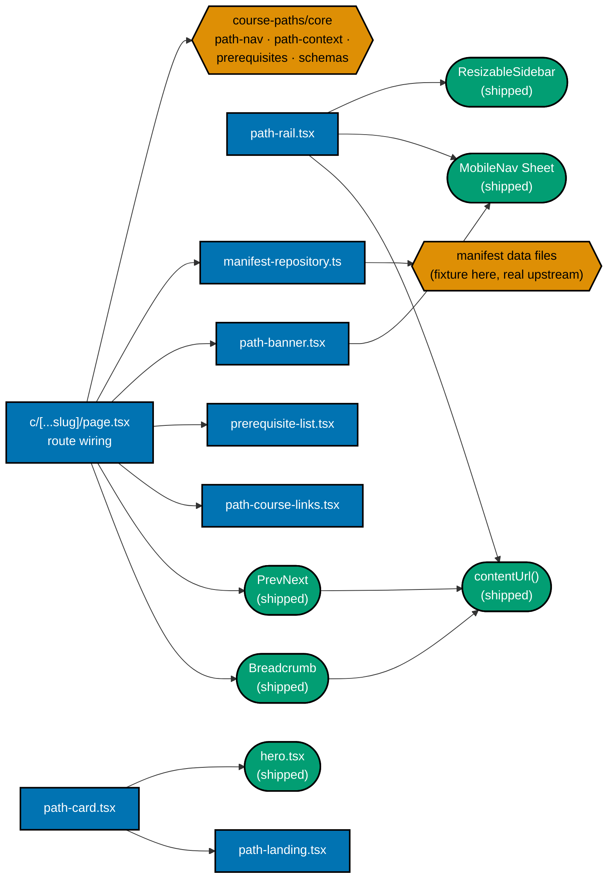
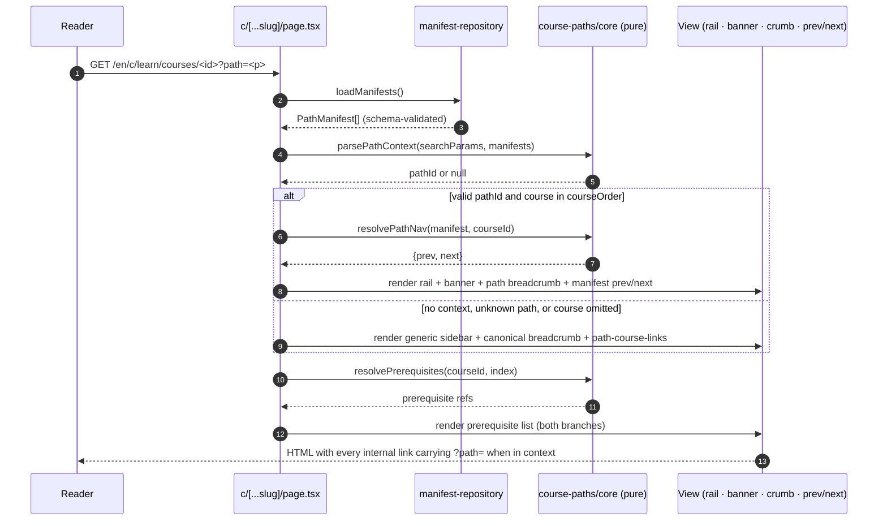
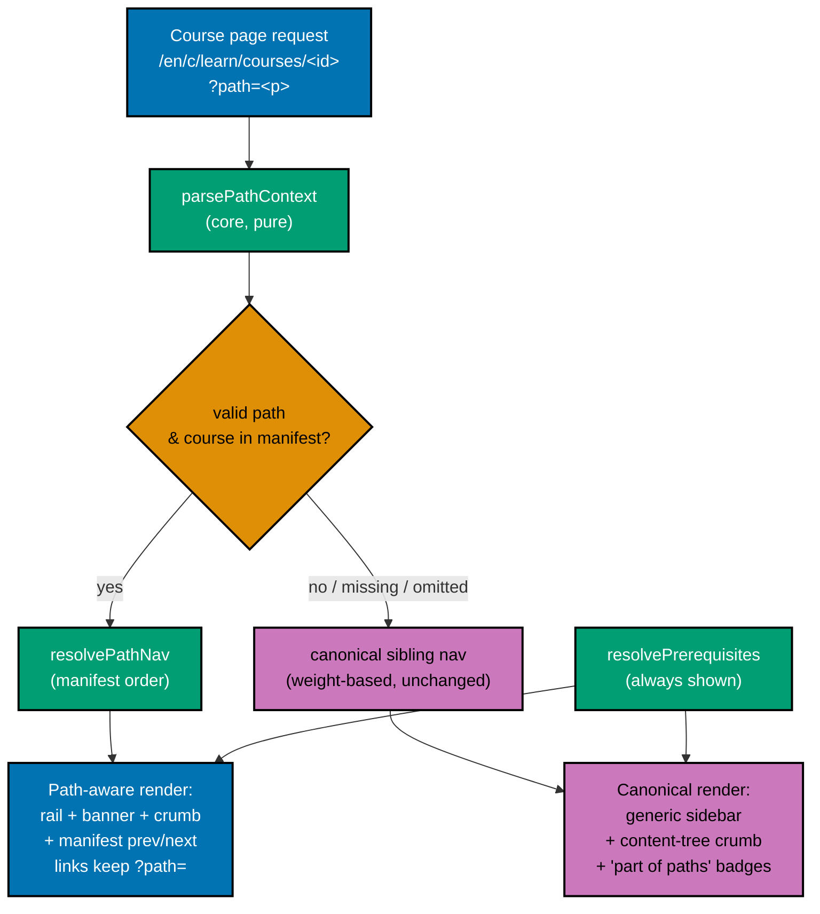
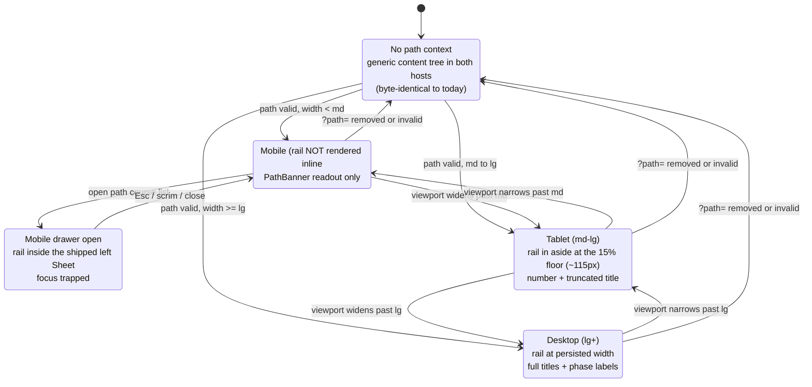

# Technical Documentation — Path-Aware Navigation UI

## Scope of this document

This plan builds the **rendering layer** of the `course-paths` feature in `ayokoding-www`: the shell
modules, the `?path=` route wiring, the Screen 3 rail content swap, the landing hero cards, the paths
hub, the path landing, and the accessibility contract for all of them. The pure `course-paths/core/`
modules are consumed here and **owned by**
`ayokoding-learning-path-02-schema-and-prerequisite-dag`; the content homes, the `legacy/`
relocation, and both redirect modules are **owned by** `ayokoding-learning-path-01-url-restructure`;
the real manifests are **owned by** `ayokoding-learning-path-05-manifests`.

**This plan is UI-bearing**, so the mandatory design funnel applies and is authored in full in
[prd.md §UI-Design-Funnel](./prd.md#ui-design-funnel-path-aware-navigation-screens) — no exemption is
claimed.

## Why the UI must change

Today, reading order is a single global property carried by `weight` frontmatter: `computePrevNext`
groups pages by parent slug and sorts siblings by `weight`, path-independently [Repo-grounded —
`apps/ayokoding-www/src/features/content/core/tree-builder.ts`]. One body cannot encode four orders.
The new model **moves order out of the body and into the manifest**, and makes prev/next + breadcrumb

- prerequisite display **resolve against the active path**. That resolution is a rendering concern, so
  it lives here.

`ayokoding-www` is a **Next.js app** [Repo-grounded — `apps/ayokoding-www/next.config.ts`,
`src/app/[locale]/(content)/c/[...slug]/page.tsx`] following the repo's
**functional-core/imperative-shell** feature layout (`src/features/<name>/{core,shell}`)
[Repo-grounded — `src/features/{content,navigation}/{core,shell}`]. The `course-paths` feature is
**new** — no such feature directory exists today [Repo-grounded — verified absent at
`apps/ayokoding-www/src/features/course-paths`].

## New feature: `course-paths` (functional core + imperative shell)

```text
apps/ayokoding-www/src/features/course-paths/
├── core/                      # PURE — no IO — OWNED BY ayokoding-learning-path-02-schema-and-prerequisite-dag
│   ├── schemas.ts             # PathManifest zod schema
│   ├── manifest.ts            # PathManifest type + course-ref normalization (id | {id, framing})
│   ├── path-nav.ts            # resolvePathNav(manifest, courseId) -> {prev, next} (pure)
│   ├── path-context.ts        # parsePathContext(searchParams, manifests) -> pathId | null (validate)
│   ├── prerequisites.ts       # resolvePrerequisites(courseId, index) -> course refs (pure)
│   ├── manifest-integrity.ts  # order/prereq/duplicate invariants (pure)
│   └── *.test.ts              # unit tests for the pure resolvers
└── shell/                     # IO / React — OWNED BY THIS PLAN
    ├── manifest-repository.ts # load manifest data files into validated PathManifest[] (fs)
    ├── path-landing.tsx       # Screen 2 — a path landing rendered from a manifest
    ├── path-card.tsx          # Screens 0 + 1 — one path as a card (hero variant + hub variant)
    ├── path-rail.tsx          # Screen 3 (Option B) — the path's ordered course list as the left rail
    ├── path-banner.tsx        # Screen 3 — compact readout + the below-`md` disclosure trigger
    ├── prerequisite-list.tsx  # a course's prerequisites, rendered in BOTH views
    └── path-course-links.tsx  # "this course is part of: [path A] [path B]" affordance
```

**`shell/manifests/` is NOT created here.** The manifest data directory and its four files belong to
`ayokoding-learning-path-05-manifests`; this plan's `manifest-repository.ts` globs whatever directory
that plan will populate and is proven against a **fixture manifest** committed under the e2e suite's
fixture area. See [Fixture strategy](#fixture-strategy-how-this-plan-is-provable-before-any-manifest-exists).

### Component interaction



**Accessibility note.** Ownership is carried by node **shape** (rectangle = built here, hexagon =
upstream artefact, stadium = already-shipped component) as well as by fill colour, and every node's
label names its file, so no meaning depends on colour alone.

### Shell module contracts

- **`manifest-repository.ts`** (shell): globs the manifest data directory, parses each file, and
  validates it through the upstream `schemas.ts` into a `PathManifest`; manifests are cached in the
  content index alongside `trees`/`prevNext` [Repo-grounded — `ContentIndex` in
  `apps/ayokoding-www/src/features/content/core/types.ts`]. **The repository never defines its own
  validation** — a fixture that would not load in production must not load in a test either.
- **`path-card.tsx`**: one path rendered as a card. Two variants from one component — `context="hero"`
  (goal phrase prominent, formal name subordinate; Screen 0) and `context="hub"` (formal name
  prominent, arc summary, course count; Screen 1). Both are a single `<Link>` wrapping a `Card`, per
  the shipped `SectionCard` pattern, so there is no link-in-link.
- **`path-landing.tsx`**: renders a manifest as phase-grouped semantic `<ol>` sections; the visible
  number **is** the `courseOrder` index. Every course link carries `?path=`.
- **`path-rail.tsx`**: `<nav aria-label="{Path} course list">` over a semantic `<ol>`. Renders
  identically in both hosts; the only host-dependent behaviour is truncation (see
  [Screen 3 responsive contract](#screen-3-the-rail-is-a-content-swap-not-a-new-shell)).
- **`path-banner.tsx`**: the compact `on path · course k of N` readout plus a `md:hidden` disclosure
  `<button aria-expanded aria-controls>` that opens the shipped drawer.
- **`prerequisite-list.tsx`**: renders `resolvePrerequisites` output in **both** the path-aware and the
  canonical view; renders **nothing at all** (not an empty label) when the course declares none.
- **`path-course-links.tsx`**: one badge link per path whose `courseOrder` **actually lists** this
  course. A path that only _links_ a course as a prerequisite (DD-24) contributes no badge.

## Routing and path-context propagation

- **Course pages** stay at their canonical `/en/c/learn/courses/<course-id>` URL; **path context rides
  in the `?path=<path-id>` query param**, never in the path segment. One canonical URL per course; the
  param is additive and shareable.
- **`c/[...slug]/page.tsx`** [Repo-grounded] reads `searchParams.path`, calls the upstream
  `parsePathContext`, and — when a valid path context resolves **and** the course is in that manifest —
  renders the **path-aware** view; otherwise the **canonical** view.
- **Static/dynamic boundary**: reading `searchParams` makes the route dynamic. This plan resolves the
  boundary by keeping the **server component static** and reading the param in a **thin client
  boundary** for the affordances that need it, so the canonical (no-`?path=`) render stays statically
  generated exactly as today. The chosen boundary is recorded as a delivery step with a build-output
  acceptance criterion, because the wrong choice silently de-optimizes every content page.
- **Link propagation**: `contentUrl(locale, slug, pathId?)` gains an optional `pathId` that appends
  `?path=<path-id>` [Repo-grounded — extend
  `apps/ayokoding-www/src/features/content/core/content-url.ts`], so rail, breadcrumb, prev/next, and
  prerequisite links all carry the context forward from **one** builder rather than four.

### Request → render sequence



### Decision branch (UI data flow)



**Accessibility note.** Every edge out of the branch node carries a text label (`yes` /
`no / missing / omitted`), and each render node's label states its full contents, so the diagram is
readable without distinguishing the fills.

## Prev/next resolution

- **With path context**: prev/next come from `resolvePathNav(activeManifest, courseId)` — the manifest
  ordering, **not** weight. Both links carry `?path=`.
- **Without path context**: the existing weight-based sibling prev/next is used (or none), exactly as
  today — no regression for non-path readers [Repo-grounded —
  `apps/ayokoding-www/src/features/navigation/shell/prev-next.tsx`].
- The component's **markup does not change**; only its data source and href construction do. This is
  deliberate: a markup rewrite would put the shipped `<nav aria-label="Page navigation">` contract at
  risk for every page on the site, not just courses in path context.

## Breadcrumb

- **With path context**: `Home / Learn / <Path Title> / <Course Title>` — the path crumb links to the
  path landing `/en/c/learn/paths/<path-id>` (carrying `?path=`).
- **Without path context**: the existing content-tree breadcrumb, unchanged [Repo-grounded —
  `buildBreadcrumbs` in `apps/ayokoding-www/src/app/[locale]/(content)/c/[...slug]/page.tsx`].
- The path-aware trail is a **documented departure** from NN/g's single-canonical-parent default,
  justified because the active path is explicit and shareable in the URL, so the trail is deterministic
  given the URL rather than referrer-driven. Rationale in
  [prd.md §Learner Journey](./prd.md#learner-journey-end-to-end).

## Prerequisite display

Every course page renders its declared `prerequisites` (from the upstream `resolvePrerequisites`) as a
semantic list of links to the prerequisite courses' canonical pages. Shown in **both** the canonical
and the path-aware view — it is the body's own honest dependency statement and is path-independent.
When a path context is active, each prerequisite link carries `?path=` so the reader stays in-path.
Prerequisites are **advisory, never gated**: no lock, no quiz-wall.

## Graceful fallback (deep-link / share)

- A course URL opened without `?path=` lands on the **canonical standalone view** — full body,
  content-tree breadcrumb, canonical (or no) prev/next, prerequisite list — never an error.
- Every course page shows a **"this course is part of: [path A] [path B]"** affordance
  (`path-course-links.tsx`) so a deep-linked reader can enter any path that lists it.
- An **invalid** `?path=` value (unknown or renamed path) is treated as no context, never a crash —
  enforced upstream by `parsePathContext` and proven here by a Gherkin scenario plus an e2e test.

## Screen 3: the rail is a content swap, not a new shell

The selected Screen 3 design (Option B, [DL-17](./README.md#this-plans-own-locked-decision)) introduces
**no new shell and no new overlay pattern**. It swaps the `children` of two already-shipped hosts:

| Host                | Breakpoint | Today's `children`        | With `?path=` | Unchanged                                                                                                           |
| ------------------- | ---------- | ------------------------- | ------------- | ------------------------------------------------------------------------------------------------------------------- |
| `ResizableSidebar`  | `md+`      | `<Sidebar>`/`SidebarTree` | `<PathRail>`  | `<aside>`, `hidden … md:block` gate, `ResizablePanel` 15 %-35 % band, handle, `ayokoding-sidebar-width` key         |
| `MobileNav` `Sheet` | `<md`      | `SidebarTree`             | `<PathRail>`  | `Sheet`/`SheetContent side="left"`, preset-width fieldset, `PRIMARY_NAV_LINKS`, `onOpenChange(false)` on link click |

[Repo-grounded — `apps/ayokoding-www/src/features/navigation/shell/resizable-sidebar.tsx`,
`apps/ayokoding-www/src/features/app-shell/shell/mobile-nav.tsx`.]

**Invariant, and the single most important test in this plan**: with no `?path=`, both hosts render
exactly what they render today. The no-path reader has zero regression surface. This is asserted in
both directions — a with-path test proving the rail appears **and** a no-path test proving the generic
tree appears and no path chrome does.

### Rail responsive states



The full breakpoint-by-breakpoint contract — widths, truncation rule, trigger name, dismissal, and
focus behaviour — is in
[prd.md §Screen 3 responsive specification](./prd.md#screen-3-responsive-specification-the-selected-option-b-breakpoint-by-breakpoint).

## Path landing and paths hub

- **Path landing** at `/en/c/learn/paths/<path-id>`, rendered by `path-landing.tsx`: the thin content
  `_index.md` supplies only the landing prose/SEO anchor; the ordered course list is rendered from the
  loaded manifest data, grouped by the path's phase headings, each course link carrying `?path=`.
  **Ordering never lives in the `_index.md` frontmatter.**
- **Paths hub** at `/en/c/learn/paths`: the "choose your path" screen with **four** path cards in a 2×2
  grid, each built from a loaded manifest (title + description + course count).
- **Content homes are not created here.** `content/en/learn/paths/_index.md` and
  `content/en/learn/courses/_index.md` are authored by
  `ayokoding-learning-path-01-url-restructure`; this plan builds the renderers that those routes mount
  and proves them against the fixture. This is the boundary that keeps the two plans from racing on the
  same files.

## Accessibility contract

- Breadcrumb and prev/next remain `nav` landmarks with `aria-label`s [Repo-grounded — existing
  components]; the path crumb marks the current path with `aria-current` where appropriate.
- The path rail is a `<nav aria-label="{Path} course list">` landmark over a semantic `<ol>`; the
  current course is marked with `aria-current="page"` **and** a text/shape signal (`▸` +
  `font-semibold`), never hue alone (WCAG AA 1.4.1).
- Below `md`, the rail's disclosure trigger carries a full accessible name — "Open path course list —
  {Path}, course {k} of {N}" — plus `aria-expanded`/`aria-controls`; the drawer inherits Radix `Dialog`
  focus-trap / focus-restore / `Esc` from the shipped `Sheet`, so **no new focus machinery is written**.
- The path landing course list and the prerequisite list are semantic ordered/unordered lists, so screen
  readers announce course position and prerequisite relationships.
- Hue is never the sole carrier of meaning anywhere in the feature: every hue-coded badge or card also
  carries the path name as text.
- `html[lang]` stays correct per locale; the global skip-link → `#main-content` is unchanged.

## Legacy browse coexistence (this plan's share)

The library/paths model is **additive** — it adds navigation without removing the old one. The legacy
hand-curated section browse must keep working alongside path navigation. **Ownership split**: relocating
the `legacy/` bucket, updating every impacted `_index.md`, and authoring both redirect modules belong to
`ayokoding-learning-path-01-url-restructure`. **This plan's share** is narrower and purely a rendering
invariant: a course URL reached from the legacy tree (i.e. with no `?path=`) renders the canonical view
with no path chrome, and the shipped redirect behaviour is not broken by the route-wiring change. That
is asserted here as an **e2e regression guard**, not as an owned Gherkin scenario.

> **Blocked-on Q-E.** Whether residual `fundamentally-strong` index pages survive as-is is open question
> **Q-E**, owned by `ayokoding-learning-path-01-url-restructure`. Its ruling changes what that plan's
> coexistence scenario asserts; it does **not** change this plan's regression guard, which only asserts
> "no path chrome without `?path=`". See [README §Blocked-on](./README.md#blocked-on-open-questions-owned-by-another-plan).

## Fixture strategy (how this plan is provable before any manifest exists)

The four real manifests ship in the Wave-3 plan `ayokoding-learning-path-05-manifests`, which depends
on this plan. Building the renderer against nothing would leave every behaviour unverified until Wave 3
— so this plan commits a **fixture manifest** (a small `courseOrder` over real, already-live course IDs
with declared prerequisites) and proves every rendering behaviour against it.

Three rules make the fixture trustworthy rather than a self-fulfilling stub:

1. **Same schema.** The fixture is validated through the upstream `schemas.ts`, not a test-local shape.
   A fixture that would not load in production cannot load in a test.
2. **Two fixtures where a behaviour needs two.** The "shared course, no forked body" property and the
   `path-course-links` multi-badge case are asserted over **two** fixture manifests that share a course
   ID, because one manifest cannot exhibit sharing.
3. **No re-assertion downstream.** The manifest plan re-asserts the same four nav behaviours against the
   **real** manifests as checklist acceptance clauses in its own gates — not as duplicate Gherkin. See
   [prd.md §Acceptance Criteria](./prd.md#acceptance-criteria-gherkin) for the provenance note.

## Design Decisions

### Owned by this plan

- **DD-4 · Graceful canonical fallback is first-class.** A course without path context renders a full
  standalone view + prerequisite list + a "part of paths" affordance. Deep-links and shares must never
  break; the canonical view is the existing, already-correct behavior.

- **DD-46 · Screen 3 is the left path rail (Option B), and the banner survives as its compact
  readout.** The plan originally selected Option A (a top banner) and rejected Option B on mobile-first
  grounds — _"desktop-only … would need to collapse into a top sheet on mobile"_. That objection is
  **answered, not deleted**: the collapse target already exists. `MobileNav` is a shipped left `Sheet`
  that already renders `SidebarTree` below `md`, opened from the header's
  `aria-label="Open navigation menu"` button [Repo-grounded —
  `apps/ayokoding-www/src/features/app-shell/shell/mobile-nav.tsx`, `.../header.tsx`], so the rail's
  mobile form is a **content swap in an existing overlay**, not new overlay machinery. Likewise on
  desktop: `ResizableSidebar` keeps its `<aside>`, `hidden … md:block` gate, 15 %-35 % `ResizablePanel`
  band, resize handle, and `ayokoding-sidebar-width` key — only its `children` change
  [Repo-grounded — `.../navigation/shell/resizable-sidebar.tsx`]. **What is genuinely more expensive
  than Option A and accepted deliberately**: one net-new `PathRail` component, a conditional child in
  two hosts, and truncation behaviour at the ~115 px 15 %-floor width at `md`. **Bought with it**: the
  whole ordered arc stays visible while reading, so "where am I / what's next / what did I skip" costs
  no navigation. `PathBanner` is retained from Option A, demoted to the rail's always-visible compact
  readout and the host of the below-`md` disclosure trigger. **Invariant**: with no `?path=`, both hosts
  render exactly what they render today — the no-path reader has zero regression surface. Full
  breakpoint contract in
  [prd.md §Screen 3 responsive specification](./prd.md#screen-3-responsive-specification-the-selected-option-b-breakpoint-by-breakpoint).

- **DD-47 · Every screen's every option carries a wireframe and a render at three viewports.** The
  funnel previously held desktop-only artefacts (8 `.png`, one per screen per option) with mobile
  behaviour described in prose. A prose footnote cannot be reviewed the way a drawing can, and the
  Screen 3 reselection turned on exactly a mobile question — which is the argument for the rule, not an
  anecdote against it. The funnel therefore renders **5 screens × 2 options × 3 viewports = 30 `.png`**
  at **375 / 768 / 1280 px** (Tailwind's default `sm`/`md`/`lg`/`xl` scale [Web-cited —
  <https://tailwindcss.com/docs/responsive-design>, accessed 2026-07-21]), matching the widths the
  plan's Playwright verification already resizes to, plus a lo-fi wireframe per viewport. Naming is
  `assets/<screen>-option-<a|b>-<mobile|tablet|desktop>.png` from `assets/src/<same-stem>.html`; the
  eight pre-existing files were renamed into the scheme and every `` reference updated. `.png`
  only, per the
  [UI Mockups convention](../../../repo-governance/conventions/formatting/diagrams.md#ui-mockups-in-plan-docs).
  Delivery enumerates the renders **one checkbox per asset** — a coarse "render all mockups" step can
  be ticked with most of the set missing.

> **DD-47 after the split.** DD-47's **30** is a **two-plan** total: **24** are produced and held here
> (Screens 0-3), and **6** by `ayokoding-learning-path-01-url-restructure` (Screen 4). Every
> DD-47-derived acceptance clause in this plan asserts **24** against this plan's own `assets/`. A
> reader auditing DD-47 against this folder alone must not read 24 as under-delivery, and no executor
> may close the gap by copying the other plan's six renders here — a matrix duplicated across two
> folders drifts.

### Inherited verbatim (build order — no single plan owns it)

Reproduced verbatim because Group A alone spans three of the five split plans.
`ayokoding-learning-path-05-manifests` is the canonical owner for citation purposes.

- **DD-15 · Build order (locked; amended 2026-07-20 by DD-27 — see below).** Group A (architecture +
  `course-paths` UI — hard prerequisite) → `interview-ready` MVP ships first (re-home 1–33, author the
  4 interview courses + `capstone-interview-loop`, one manifest, deploy) → `immediately-effective`
  manifest → `fundamentally-strong` manifest → backfill topics 34–94 native into `courses/` as the
  library fills. **DD-27 amends steps 2 onward**: the MVP is narrowed to an architecture smoke test
  only (interview-course authoring is no longer bundled into it), and the fourth path is inserted as
  authoring priority #1 immediately after the MVP.

- **DD-27 · Build order amended: the fourth path is authoring priority #1, behind an
  architecture-smoke-test-only MVP (D7, amends DD-15).** Locked order: **Group A** (architecture + UI,
  unchanged hard prerequisite) → **`interview-ready` MVP, narrowed to an architecture smoke test only**
  (ships against topics 1–33, already live on disk; proves routing, manifest loading, `?path` context,
  prev/next, breadcrumb, and prerequisite display against real content, in days not months —
  authoring the 4 NEW interview courses + `capstone-interview-loop` is **no longer bundled into this
  MVP gate**) → **`software-engineer-to-ai-engineer`** (authoring priority #1 for all authoring effort)
  → **`immediately-effective/software-engineer`** manifest → **`fundamentally-strong/software-engineer`**
  manifest → **backfill topics 34–94**. Rationale (preserved from the original build-order decision):
  nothing in the AI path exists on disk (~17 courses); making it literally first — ahead of even the
  MVP — would mean nothing ships until all 17 are authored, with the UI architecture unvalidated the
  entire time. Ordering it immediately after an architecture-smoke-test MVP gives the AI path first
  claim on every unit of real authoring effort while keeping the architecture proven early against
  content that already exists.

**This plan's position in that order**: it is the "+ UI" half of Group A's hard prerequisite. Nothing
after Group A can start until the rendering layer exists, which is why this plan sits in Wave 2 and
blocks `ayokoding-learning-path-05-manifests`.

### Consumed from sibling plans (not restated)

| Decision    | Subject                                            | Owning plan                                              |
| ----------- | -------------------------------------------------- | -------------------------------------------------------- |
| DD-1        | Order lives outside the body                       | `ayokoding-learning-path-02-schema-and-prerequisite-dag` |
| DD-3        | Path-aware nav via `?path=` client context         | `ayokoding-learning-path-02-schema-and-prerequisite-dag` |
| DD-24       | AI path links, does not include, SWE prerequisites | `ayokoding-learning-path-05-manifests`                   |
| DD-40–DD-45 | Three-bucket IA, `legacy/` relocation, redirects   | `ayokoding-learning-path-01-url-restructure`             |

This plan **implements the rendering consequences** of DD-3 and DD-24 (query-param context; badge only
for paths that list the course) without re-deciding either.

## File Impact

`<FEAT>` = `apps/ayokoding-www/src/features/course-paths/`;
`<NAV>` = `apps/ayokoding-www/src/features/navigation/shell/`;
`<SHELL>` = `apps/ayokoding-www/src/features/app-shell/shell/`;
`<SPECS>` = `specs/apps/ayokoding/behavior/ayokoding-www/gherkin/course-paths/`;
`<E2E>` = `apps/ayokoding-www-fe-e2e/`.

| Area                    | Change                                    | Files                                                                                                                                                                                      |
| ----------------------- | ----------------------------------------- | ------------------------------------------------------------------------------------------------------------------------------------------------------------------------------------------ |
| `course-paths` shell    | New app code (TDD)                        | `<FEAT>shell/{manifest-repository.ts,path-landing.tsx,path-card.tsx,path-rail.tsx,path-banner.tsx,prerequisite-list.tsx,path-course-links.tsx}` _(all New files)_ + colocated `*.test.tsx` |
| Route wiring            | Edit                                      | `apps/ayokoding-www/src/app/[locale]/(content)/c/[...slug]/page.tsx` [Repo-grounded]                                                                                                       |
| Extended nav components | Additive props, no fork                   | `<NAV>prev-next.tsx`, `<NAV>breadcrumb.tsx`, `apps/ayokoding-www/src/features/content/core/content-url.ts` [all Repo-grounded]                                                             |
| Screen 3 hosts          | `children` swap only                      | `<NAV>resizable-sidebar.tsx`, `<SHELL>mobile-nav.tsx` [both Repo-grounded]                                                                                                                 |
| Screen 0 hero           | Edit — `PathCard` grid + escape-hatch row | `<SHELL>hero.tsx` [Repo-grounded]; existing `<SHELL>landing.test.tsx` extended                                                                                                             |
| Specs (Gherkin)         | New domain folder                         | `<SPECS>*.feature` + `<SPECS>README.md` _(New files; sibling `navigation/` exists — Repo-grounded)_                                                                                        |
| E2E                     | New fixture + step defs                   | `<E2E>` fixture manifest _(New file)_ + `course-paths` step definitions _(New files; sibling `resizable-sidebar.steps.ts` exists — Repo-grounded)_                                         |
| Plan artefacts          | Funnel + evidence                         | `assets/*.png` (16 new), `prd.md` embeds, `evidence/*.png`                                                                                                                                 |

**Not touched by this plan**: any file under `apps/ayokoding-www/content/`, `<FEAT>core/`,
`<FEAT>shell/manifests/`, `apps/ayokoding-www/src/redirects/`, or `next.config.ts`. If a delivery step
appears to require one of those, it belongs to a sibling plan — stop and re-read
[README §Depends-on](./README.md#depends-on) rather than editing across the boundary.

**No `project.json` target changes and no new npm packages** — zod is already used [Repo-grounded —
`apps/ayokoding-www` schemas use zod], and every target this plan runs
(`build`, `typecheck`, `lint`, `test:unit`, `test:quick`, `test:integration`, `specs:behavior:coverage`,
`test:e2e`) already exists [Repo-grounded — `apps/ayokoding-www/project.json`,
`apps/ayokoding-www-fe-e2e/project.json`].

## Dependencies

- **Hard plan prerequisites**: `ayokoding-learning-path-01-url-restructure` **and**
  `ayokoding-learning-path-02-schema-and-prerequisite-dag`, both merged to `main`. The first supplies
  the routes this plan's renderers mount; the second supplies every pure module this plan imports.
  Starting before both merge produces import errors against files that do not exist.
- **Downstream consumer**: `ayokoding-learning-path-05-manifests` cannot publish a manifest that
  nothing renders.
- **Tooling**: Next.js build (`nx run ayokoding-www:build`), the three-level test targets, the
  `playwright-bdd` e2e harness (`npx bddgen && npx playwright test`), Playwright MCP for manual
  verification, and the markdown/link/heading validators, which are invoked as **raw cargo commands,
  not Nx targets** — `cargo run --release --manifest-path apps/rhino-cli/Cargo.toml -- md links validate`
  and `... -- md heading-hierarchy validate` [Repo-grounded — `apps/rhino-cli/src/cli.rs`; wired into
  the pre-commit/pre-push hooks and CI per `AGENTS.md` §Markdown Quality]. **There are no
  `rhino-cli:links:validation` or `rhino-cli:headings:hierarchy-validation` Nx targets** — an earlier
  revision of the source plan cited both as `[Repo-grounded]`; neither appears among `project.json`'s
  real targets.

## Rollback

- **Whole-plan rollback**: Delivery Mode is `worktree-to-pr` with a PR per phase, so
  `git revert <merge-commit-sha>` undoes one phase without touching the others.
- **Feature revert**: the `course-paths` shell is additive; reverting it restores weight-based nav (the
  canonical view) with no content loss, because **no course body and no content file is edited by this
  plan**.
- **Screen 3 host revert**: the rail is a `children` swap, so reverting the conditional restores
  `ResizableSidebar` + `Sidebar` and `MobileNav` + `SidebarTree` exactly — no width key to migrate, no
  `<aside>` to delete, no orphaned overlay.
- **Screen 0 hero revert**: `hero.tsx` reverts to its two-CTA form; because the hero's cards are
  sourced from loaded-manifest data rather than a hard-coded list, reverting leaves no dangling
  reference to a path that no longer renders.
- **Fixture revert**: the fixture manifest lives only under the e2e suite, so removing it cannot affect
  production content or the real manifests.

## Testing / Verification Strategy

Built test-first per the repo's TDD mandate; each acceptance criterion in
[prd.md](./prd.md#acceptance-criteria-gherkin) is mapped to exactly one test level below.

| Level                                | Covers                                                                                                                                                                                                                                                                                                                    |
| ------------------------------------ | ------------------------------------------------------------------------------------------------------------------------------------------------------------------------------------------------------------------------------------------------------------------------------------------------------------------------- |
| **Unit** (`test:unit`)               | `contentUrl` with `pathId`; `manifest-repository` parse/validate against the fixture; each shell component's rendering branches (rail current-row marking, banner `k of N`, prerequisite empty state, `path-course-links` badge selection, `path-card` hero vs. hub variant)                                              |
| **Integration** (`test:integration`) | Route wiring: a course + valid path resolves to the path-aware view; an invalid path and an omitted course both resolve to the canonical view; every emitted internal link carries `?path=`                                                                                                                               |
| **E2E** (`test:e2e`, playwright-bdd) | The fixture path walk (landing → course order via prev/next, param persists), breadcrumb trail, prerequisite links, deep-link fallback, rail at desktop, rail-in-drawer on a phone (focus in and back out), generic sidebar unchanged with no `?path=`, accessibility sweep, and the legacy-redirect **regression guard** |
| **Specs coverage**                   | `nx run ayokoding-www:specs:behavior:coverage` green for the new `course-paths` Gherkin domain [Repo-grounded — target exists]                                                                                                                                                                                            |
| **Manual behavioral**                | Playwright MCP at 375 / 768 / 1280 px, in `en`, with committed evidence under `evidence/`; curl not applicable (no new API)                                                                                                                                                                                               |
| **Rule-15 web retest**               | The three live-site testers before archival — mandatory here, since this plan owns the largest UI surface of the five                                                                                                                                                                                                     |

**The two-direction rule.** Every acceptance clause must be falsifiable in both directions. The
regression-critical pair is: _with_ `?path=` the rail renders and the generic tree does not; _without_
`?path=` the generic tree renders and no path chrome does. A test suite that only asserts the first half
would pass with the sidebar permanently replaced — the exact defect this plan most needs to prevent.

**Locale.** Content verification runs in `en` only — this plan's content locale. The `?path=` mechanism
itself is locale-neutral, and the `html[lang]` assertion in the accessibility scenario covers the locale
attribute. See [brd.md §Business-Scope Non-Goals](./brd.md#business-scope-non-goals).
