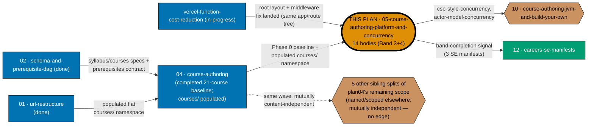

# Learning Path — Course Authoring: Platform & Concurrency Languages

## Delivery amendment — one final PR

All 14 courses remain within one plan branch and one delivery unit. The sole draft PR opens only in
Phase 7, after verification and Knowledge Capture, and carries the archival move, review cycle, CI,
merge, and deploy. Earlier cohort or delivery-boundary PR wording is superseded.

Author **14 course bodies** — the platform-development pairs and the concurrency-language pairs that
`ayokoding-learning-path-04-course-authoring` scoped as its **Band 3** ("Mobile & desktop platforms",
originally 10 courses) and **Band 4** ("Concurrency languages", originally 4 courses) — landing under
`apps/ayokoding-www/content/en/learn/courses/`.

This plan is one of **seven** new plans splitting the remaining, not-yet-authored scope of
[`ayokoding-learning-path-04-course-authoring`](../../done/2026-08-02__ayokoding-learning-path-04-course-authoring/README.md)
(itself Wave 2 of the five-plan split of the closed
[`shared-course-library-and-learning-paths`](../../done/2026-07-21__shared-course-library-and-learning-paths/README.md)
plan). It owns **exactly** Bands 3 and 4, merged into one plan and renamed thematically **"Platform &
Concurrency Languages"** because both bands share one authoring shape: a `just-enough-<language>`
primer paired with the platform or paradigm that primer exists to unlock. It owns no schema, no
route, no component, no redirect — and, per the invariant inherited from plan04, **no manifest**.

> **Cross-plan source of truth (binding, inherited from plan04 verbatim).** The authoritative
> per-course specs live at
> [`plans/done/2026-07-24__ayokoding-learning-path-02-schema-and-prerequisite-dag/syllabus/courses/<course-id>.md`](../../done/2026-07-24__ayokoding-learning-path-02-schema-and-prerequisite-dag/syllabus/courses/README.md).
> Every course body in this plan is authored **from** its own `syllabus/courses/<course-id>.md` spec
> file — never from a fresh judgment call, and never copied into this plan's folder. If this document
> and the schema plan's own statement of a spec ever disagree, the schema plan's wins.

## The exact course list (in authoring order)

| #   | Course ID                       | Pairs with | Role                                  |
| --- | ------------------------------- | ---------- | ------------------------------------- |
| 1   | `just-enough-kotlin`            | #2         | Primer, Kotlin                        |
| 2   | `android-app-development`       | #1         | Native Android with the Kotlin SDK    |
| 3   | `just-enough-swift`             | #4         | Primer, Swift                         |
| 4   | `ios-app-development`           | #3         | Native iOS with the Swift SDK         |
| 5   | `just-enough-dart`              | #6         | Primer, Dart                          |
| 6   | `hybrid-app-development`        | #5         | Cross-platform from one Dart codebase |
| 7   | `just-enough-csharp`            | #8         | Primer, C#                            |
| 8   | `windows-app-development`       | #7         | Native Windows desktop with C#        |
| 9   | `linux-app-development`         | —          | Native Linux desktop, Python          |
| 10  | `building-production-cli-tools` | —          | Distributable CLI tools, Go + Rust    |
| 11  | `just-enough-go`                | #12        | Primer, Go                            |
| 12  | `csp-style-concurrency`         | #11        | Channels, CSP concurrency (Go)        |
| 13  | `just-enough-elixir`            | #14        | Primer, Elixir                        |
| 14  | `actor-model-concurrency`       | #13        | Actors, supervision trees (Elixir)    |

Courses 1–10 are plan04's **Band 3 — Mobile & desktop platforms**; courses 11–14 are its **Band 4 —
Concurrency languages**. Every course is `T(n)` origin in plan04's catalog (a transferred FS-SE
topic, authored here for the first time — see [tech-docs.md §Course Library
Catalog](./tech-docs.md#course-library-catalog) for the full row detail, copied verbatim from plan04's
own catalog table). None is net-new content invention; all fourteen are transferred-topic authoring,
identical in kind to the rest of plan04's backfill.

## The manifest ownership invariant (binding — read before anything else)

> **This plan never edits a manifest file.** Every file under
> `apps/ayokoding-www/src/features/course-paths/manifests/` is owned by the downstream manifest-growth
> plan (`ayokoding-learning-path-12-careers-se-manifests` — the successor to plan04's original,
> since-renamed/split `ayokoding-learning-path-05-manifests` name; the same invariant applies here
> unchanged). A step in this plan that creates, appends to, reorders, or re-verifies a `.yaml`
> manifest is a **boundary violation**, not a convenience.

When a band lands here, this plan records a **band-completion signal** in its own
[`delivery.md`](./delivery.md), using the identical five-field contract plan04 defined, and the
manifest-growth plan performs the growth. See [Band-completion signal contract](#band-completion-signal-contract)
below.

## Position in the split



**Accessibility note.** Plan kind is carried by node **shape** (rectangle = upstream, hexagon =
sibling/downstream-consumer, stadium = this plan) and by literal text in every label, never by fill
colour alone. This plan carries a thicker border. The dotted edge to `OTHER` denotes "no dependency
edge, shown only for orientation" — the five other unnamed sibling splits are not blocking and not
blocked by this plan, per plan04's own finding that "Bands 1–4, 6, 7 are mutually content-independent
… their relative order is a convenience, not a constraint." **[Judgment call]**: the exact names and
scopes of the five other sibling splits (beyond the two named in this plan's own authoring brief —
`10-course-authoring-jvm-and-build-your-own` and the future `12-careers-se-manifests`) were not
supplied to this plan's author and are not invented here; they are drawn as one placeholder node
rather than guessed individually.

## Depends-on

| Direction     | Plan (full folder name)                                                                                           | Nature                                                                                                                                                                                                                                                                                                                                                                                                                                                                                                                                                                                                                                                                                                                                                                                                                                                                                                                                                                                                                                                                                                                                                                       |
| ------------- | ----------------------------------------------------------------------------------------------------------------- | ---------------------------------------------------------------------------------------------------------------------------------------------------------------------------------------------------------------------------------------------------------------------------------------------------------------------------------------------------------------------------------------------------------------------------------------------------------------------------------------------------------------------------------------------------------------------------------------------------------------------------------------------------------------------------------------------------------------------------------------------------------------------------------------------------------------------------------------------------------------------------------------------------------------------------------------------------------------------------------------------------------------------------------------------------------------------------------------------------------------------------------------------------------------------------- |
| **blockedBy** | `ayokoding-learning-path-01-url-restructure`                                                                      | **Hard, transitive via 04.** Populated flat `courses/` namespace this plan's 14 slugs join.                                                                                                                                                                                                                                                                                                                                                                                                                                                                                                                                                                                                                                                                                                                                                                                                                                                                                                                                                                                                                                                                                  |
| **blockedBy** | `ayokoding-learning-path-02-schema-and-prerequisite-dag`                                                          | **Hard, transitive via 04.** Owns `syllabus/courses/` (this plan's 14 authoring source specs) and the `prerequisites` frontmatter contract.                                                                                                                                                                                                                                                                                                                                                                                                                                                                                                                                                                                                                                                                                                                                                                                                                                                                                                                                                                                                                                  |
| **blockedBy** | `ayokoding-learning-path-04-course-authoring`                                                                     | **Hard, satisfied.** Plan 04 merged and archived with its Phase 0 baseline (toolchain converged, both Wave-1 plans verified merged) and already-populated `courses/` namespace — **not** Band 2 specifically; Bands are mutually independent (see below).                                                                                                                                                                                                                                                                                                                                                                                                                                                                                                                                                                                                                                                                                                                                                                                                                                                                                                                    |
| **blockedBy** | `vercel-function-cost-reduction`                                                                                  | **Hard, new.** Changes `apps/ayokoding-www`'s root layout, removes the dynamic-rendering causes, deletes `middleware.ts` — this plan authors new content pages into the same app/route tree and must not land against a still-dynamic, still-middlewared app. Treated as **already merged/done** per explicit instruction; see the checkable precondition below.                                                                                                                                                                                                                                                                                                                                                                                                                                                                                                                                                                                                                                                                                                                                                                                                             |
| **blocks**    | [`ayokoding-learning-path-12-careers-se-manifests`](../ayokoding-learning-path-12-careers-se-manifests/README.md) | Needs this plan's band-completion signal to grow the three `software-engineer`-role manifests.                                                                                                                                                                                                                                                                                                                                                                                                                                                                                                                                                                                                                                                                                                                                                                                                                                                                                                                                                                                                                                                                               |
| **blocks**    | `ayokoding-learning-path-10-course-authoring-jvm-and-build-your-own`                                              | That plan's `build-your-own-raft` declares `just-enough-go` (#11 in this plan's list) as a direct prerequisite per plan04's own catalog row (`build-your-own-raft` — prerequisites: `just-enough-go`, `distributed-systems`). **Correction from this plan's authoring brief**: the brief's framing named `csp-style-concurrency` (#12) and `actor-model-concurrency` (#14) as the needed courses via a "Band 4 → Band 8 (hard)" ordering-rationale note; that literal phrase was not found verbatim anywhere in plan04's current text, and the actual DAG edge — independently confirmed by reading `ayokoding-learning-path-10-course-authoring-jvm-and-build-your-own/README.md` §"What each edge is, precisely" once that plan's own folder appeared on disk during this plan's authoring — names only `just-enough-go`, not the two By-Example concurrency courses. This plan corrects the claim to the verified edge rather than repeating the brief's unverified one. `csp-style-concurrency` and `actor-model-concurrency` remain part of Band 4 and still land in the same phase, but they are not, on current evidence, a hard prerequisite of anything in plan 10. |
| **blocks**    | `ayokoding-learning-path-11-course-authoring-capstones`                                                           | **Added 2026-08-01, reconciliation pass.** That plan's own per-capstone dependency audit (direct read of `syllabus/courses/compilers-parsers-and-transpilers.md`) confirmed `capstone-concurrency-and-systems` needs `csp-style-concurrency` (#12) and `actor-model-concurrency` (#14) — plus plan04's `containers-and-orchestration` and plan08's `site-reliability-engineering` — and `capstone-concurrency-showdown` needs `csp-style-concurrency` and `actor-model-concurrency` **only**, with no further prerequisite. This edge was originally omitted from this plan's own Depends-on table; added here to match plan 11's authoritative table.                                                                                                                                                                                                                                                                                                                                                                                                                                                                                                                       |
| _(no edge)_   | Every other new sibling plan splitting plan04's remaining scope                                                   | **None.** This plan does not need Band 2, 5, 6, 7, 8, or 9's content — plan04 itself records Bands 1–4, 6, 7 as "mutually content-independent … their relative order is a convenience, not a constraint," and this plan's own 14 courses share no prerequisite edge with any other band's courses in either direction (verified against plan04's catalog: none of the 14 rows lists a Band 1/2/5/6/7/8/9 course as a prerequisite, and no other band's catalogued course lists any of these 14 as a prerequisite, aside from the two Band-4-downstream edges — to plan 10 and plan 11 — already stated above).                                                                                                                                                                                                                                                                                                                                                                                                                                                                                                                                                               |

**Checkable precondition for the `vercel-function-cost-reduction` dependency** — both must hold:

```bash
test ! -f apps/ayokoding-www/src/app/layout.tsx && test ! -f apps/ayokoding-www/src/middleware.ts
```

`apps/ayokoding-www/src/app/layout.tsx` is deleted (its contents merged into
`apps/ayokoding-www/src/app/[locale]/layout.tsx`, which becomes the root layout) and
`apps/ayokoding-www/src/middleware.ts` is deleted, per that plan's own File Impact table
([Repo-grounded] — `vercel-function-cost-reduction/tech-docs.md` lines 366–370, read in full at
authoring time). [Repo-grounded] — as of this plan's authoring date, `apps/ayokoding-www/src/middleware.ts`
still exists on disk (`test -f` exits 0), confirming `vercel-function-cost-reduction` has not yet
landed; this plan's own Phase 0 re-checks the same command and refuses to proceed if it still exists.

## Delivery Mode: worktree-to-pr

This plan has exactly one dedicated worktree, one persistent final-delivery branch, and one PR.
All authoring, verification, and Knowledge Capture phases commit on that branch without a push, PR,
review cycle, merge, or deployment. In Phase 7, the executor commits the archival move and
any index updates, opens the sole draft PR, completes the PR-Review Maker→Fixer Cycle and CI gates,
marks it ready, and performs the normal AI merge/deploy after the hardened preconditions hold.
No per-course, cohort, stage, or phase worktree/branch/PR is permitted.

## Depends-on scope note (Band-independence, stated explicitly)

Per the explicit instruction in this plan's authoring brief: this plan needs plan04's Phase 0 baseline
and populated `courses/` namespace, and does **not** need Band 2 (or any other band) specifically —
Bands are mutually independent by plan04's own finding. Nobody should read the `blockedBy` on plan04
above as a tighter coupling than that.

## Rule-15 three-tester retest — exemption recorded

**Exempt, with reasons stated (not silently omitted) — identical reasoning to plan04's own exemption,
reused verbatim because this plan is the same kind of content-only plan.**

1. **It ships no screen and no component.** Every artefact is a markdown page bundle under
   `apps/ayokoding-www/content/en/learn/courses/`. The screens that render those pages (`PathRail`,
   `PathLanding`, `PathCard`, the paths hub) are owned by
   `ayokoding-learning-path-03-navigation-ui`, which carries the mandatory retest.
2. **Its output surface is already covered by dedicated checkers.** Every authored body passes
   `apps-ayokoding-www-{primer,by-example}-checker`, `apps-ayokoding-www-facts-checker`, and
   `apps-ayokoding-www-link-checker` — content-domain checkers strictly stronger, for prose
   correctness, than a generalist live-site UX triad.
3. **The retest would test the other plan's surface.** Pointing the triad at a course page exercises
   the navigation plan's rendering layer, producing findings this plan cannot act on.

**This is an exemption, not an omission**, and it is **narrow**: manual behavioural verification via
Playwright MCP is **still mandatory and still performed** (see `delivery.md` Phase 4) — a sample of
the authored course pages is opened at all three breakpoints in the `en` content locale, with
committed screenshot evidence. Only the three-tester triad is waived.

## Locale scope

This plan's content is authored **`en`-only**, the same deferral plan04 states. Every manual
verification step exercises `en` and states the deferral inline.

## Band-completion signal contract

The manifest-growth plan cannot act on a vague signal. Every band-completion signal recorded in this
plan's `delivery.md` MUST carry all five fields below, verbatim, in a fenced `text` block directly
under the band's gate — the identical contract plan04 defined:

| Field               | Content                                                                                 |
| ------------------- | --------------------------------------------------------------------------------------- |
| `BAND`              | the band number and title, e.g. `Band 3 — Mobile & desktop platforms`                   |
| `PLAN`              | `ayokoding-learning-path-05-course-authoring-platform-and-concurrency`                  |
| `LANDED_COURSE_IDS` | every course ID the band authored, one per line, in this plan's own listing order       |
| `GROW_MANIFESTS`    | every manifest the manifest-growth plan must grow, by **full path** under `<MANIFESTS>` |
| `FINAL_PR`          | the number of this plan's sole terminal archival PR, verified merged before consumption |

`GROW_MANIFESTS` for **both** Band 3 and Band 4 is exactly the three software-engineer-role manifests
— confirmed by re-reading plan04's own `README.md` §Band-completion signal contract ("Bands 1–8 →
`careers/interview-ready/software-engineer.yaml`, `careers/immediately-effective/software-engineer.yaml`,
`careers/fundamentally-strong/software-engineer.yaml`") and independently confirmed by plan04's own
Phase 5 and Phase 6 delivery-checklist text, each of which states verbatim: "Apply the three per-band
closing steps. `GROW_MANIFESTS` = the three software-engineer-role manifests." Bands 3 and 4 do
**not** additionally grow the `ai-engineer` manifest (that extra growth is reserved for Bands 5 and 8
only, per plan04's own routing table) and do **not** touch `interview-ready`-only or
`fundamentally-strong`-only routing (that is Band 9's narrower routing):

```text
BAND: Band 3 — Mobile & desktop platforms
PLAN: ayokoding-learning-path-05-course-authoring-platform-and-concurrency
LANDED_COURSE_IDS:
just-enough-kotlin
android-app-development
just-enough-swift
ios-app-development
just-enough-dart
hybrid-app-development
just-enough-csharp
windows-app-development
linux-app-development
building-production-cli-tools
GROW_MANIFESTS:
apps/ayokoding-www/src/features/course-paths/manifests/careers/interview-ready/software-engineer.yaml
apps/ayokoding-www/src/features/course-paths/manifests/careers/immediately-effective/software-engineer.yaml
apps/ayokoding-www/src/features/course-paths/manifests/careers/fundamentally-strong/software-engineer.yaml
FINAL_PR: <filled only after the terminal PR merges>
```

```text
BAND: Band 4 — Concurrency languages
PLAN: ayokoding-learning-path-05-course-authoring-platform-and-concurrency
LANDED_COURSE_IDS:
just-enough-go
csp-style-concurrency
just-enough-elixir
actor-model-concurrency
GROW_MANIFESTS:
apps/ayokoding-www/src/features/course-paths/manifests/careers/interview-ready/software-engineer.yaml
apps/ayokoding-www/src/features/course-paths/manifests/careers/immediately-effective/software-engineer.yaml
apps/ayokoding-www/src/features/course-paths/manifests/careers/fundamentally-strong/software-engineer.yaml
FINAL_PR: <filled only after the terminal PR merges>
```

A signal that names manifests loosely, or omits the merged `FINAL_PR`, is incomplete and the receiving
plan must reject it rather than guess.

## Navigation

- [Business Requirements (brd.md)](./brd.md) — WHY these 14 bodies exist, who they serve, the
  business risks of authoring them, and what "done" means in business terms.
- [Product Requirements (prd.md)](./prd.md) — personas (reused from plan04), user stories, the
  Gherkin acceptance criteria this plan owns, and product scope.
- [Technical Docs (tech-docs.md)](./tech-docs.md) — the 14-course Course Library Catalog with full
  detail, the manifest-ownership diagram, design decisions inherited from plan04 by DD-id, and the
  File Impact table.
- [Delivery Checklist (delivery.md)](./delivery.md) — the phased, executable checklist.
- [Learnings (learnings.md)](./learnings.md) — knowledge-capture running log.
- **Cross-plan**:
  [`syllabus/` source of truth](../../done/2026-07-24__ayokoding-learning-path-02-schema-and-prerequisite-dag/syllabus/README.md)
  ·
  [`syllabus/courses/` catalog](../../done/2026-07-24__ayokoding-learning-path-02-schema-and-prerequisite-dag/syllabus/courses/README.md)
  · [plan04 — course-authoring](../../done/2026-08-02__ayokoding-learning-path-04-course-authoring/README.md)
  · [manifest plan — careers-se-manifests](../../backlog/ayokoding-learning-path-12-careers-se-manifests/README.md)
  · [`vercel-function-cost-reduction`](../../done/2026-08-02__vercel-function-cost-reduction/README.md)
  · [URL-restructure plan](../../done/2026-07-23__ayokoding-learning-path-01-url-restructure/README.md)
  · [schema plan](../../done/2026-07-24__ayokoding-learning-path-02-schema-and-prerequisite-dag/README.md)

## Provenance

This plan is one of seven folders produced by splitting the remaining, not-yet-authored scope of
`plans/done/2026-08-02__ayokoding-learning-path-04-course-authoring/` — itself one of five folders produced
by splitting `plans/done/2026-07-21__shared-course-library-and-learning-paths/`. It owns exactly
plan04's Band 3 ("Mobile & desktop platforms") merged with Band 4 ("Concurrency languages"), renamed
"Platform & Concurrency Languages" to name the authoring shape both bands share. Plan 04 has since
completed and archived with its retained 21-course baseline; this plan's course list, catalog rows,
and dependency claims remain drawn from that archived source of truth.
