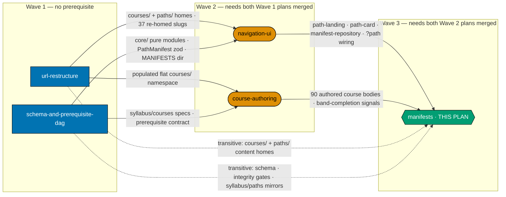
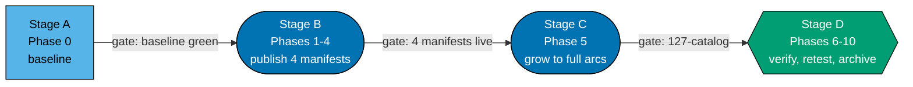

# Learning Path Manifests — author, publish, grow, and verify all four path manifests

> **Cross-plan source of truth**: the authoritative per-course and per-path specs live in
> `plans/backlog/ayokoding-learning-path-02-schema-and-prerequisite-dag/syllabus/`. Do not copy
> them; do not author from any other source.

This plan is **Wave 3** — the terminal plan — of the five-way split of the closed
`shared-course-library-and-learning-paths` plan. It owns the **composition layer**: the four
`PathManifest` YAML data files, their thin content landing anchors, the paths-hub card population,
the per-path progression-smoothness audits, and every manifest growth as backfill content lands.

Four manifests ship here, in the DD-27 build order:

1. `interview-ready/software-engineer` — the architecture smoke test, published over already-live
   re-homed content.
2. `immediately-effective/software-engineer-to-ai-engineer` — the fourth path, authoring priority #1.
3. `immediately-effective/software-engineer` — the build-app-first arc.
4. `fundamentally-strong/software-engineer` — the university-style theory-first arc.

## The manifest ownership invariant

_Binding — and the reason this plan exists as a separate unit._

**This plan owns every file under `apps/ayokoding-www/src/features/course-paths/manifests/` and
every step that creates, appends to, reorders, or re-verifies one.**
`ayokoding-learning-path-04-course-authoring` owns course **bodies only** and **never edits a
manifest**.

A genuine dependency cycle existed between the two plans before this invariant was ruled: the
course-authoring plan's backfill phase grew manifests this plan authors, while this plan's AI-path
phase publishes a manifest over courses that plan authors. No wave ordering satisfies both
directions — flipping the waves simply reverses the cycle. Only the ownership invariant breaks it,
which is why this plan's hard prerequisite is **both** Wave-2 plans (`ayokoding-learning-path-03-navigation-ui`
**and** `ayokoding-learning-path-04-course-authoring`) rather than the navigation plan alone.

Its two mechanical consequences:

- **Five steps are absorbed** from `ayokoding-learning-path-04-course-authoring` into this plan —
  the four manifest-growth steps of its backfill phase, plus the manifest re-verification step of its
  course-surgery phase. See [Phase 5](./delivery.md#phase-5-manifest-growth-as-backfill-lands) and
  [Phase 2](./delivery.md#phase-2-author-the-ai-path-manifest-landing-and-smoothness-audit).
- **The terminal 127-course catalog assertion is this plan's**, at its own archival gate. The
  course-authoring plan asserts only the count of bodies it itself authored.

## Scope

**In scope**

- The four `PathManifest` YAML data files under `apps/ayokoding-www/src/features/course-paths/manifests/`.
- The four thin path landing anchors under `apps/ayokoding-www/content/en/learn/paths/<path-id>/_index.md`
  (prose/SEO only — no `courseOrder`).
- Population of the paths-hub 2×2 grid cards, one card per manifest as each ships.
- Manifest integrity + prerequisite-consistency + no-forked-body verification at every phase gate.
- Per-path progression-smoothness audits, including the interview-ready refresh-register re-audit
  deferred by the smoke-test phase.
- All manifest growth as backfill bands land (Bands 1–8, Band 9, and the AI path's growth to its full
  15-course composition per DD-33).

**Out of scope**

- Any course **body** — authored by `ayokoding-learning-path-04-course-authoring`.
- The `PathManifest` zod schema, the pure `course-paths` core modules, the `<MANIFESTS>` directory
  itself, and the `syllabus/` detail layer — owned by
  `ayokoding-learning-path-02-schema-and-prerequisite-dag`.
- Every rendering component (`path-landing.tsx`, `path-card.tsx`, `path-rail.tsx`,
  `manifest-repository.ts`, `?path=` wiring) — owned by `ayokoding-learning-path-03-navigation-ui`.
- The flat `courses/` namespace, the `legacy/` bucket, and both redirect modules — owned by
  `ayokoding-learning-path-01-url-restructure`.

## Where this plan sits

**Accessibility note.** Wave membership is carried by node shape (rectangle / stadium / hexagon)
**and** by the three labelled subgraph containers, never by colour alone. Edge kind is carried by
line style (solid = hard blocking edge; dotted = transitive need already satisfied by a solid path)
**and** by the edge labels. Fills use the verified accessible palette (`#0173B2` blue, `#DE8F05`
orange, `#029E73` teal) with black borders and WCAG-AA-contrasting text, per the
[Color Accessibility Convention](../../../repo-governance/conventions/formatting/color-accessibility.md).

## Delivery flow

The eleven phases group into four stages, each ending in a green Phase Gate:

Stage kind is carried by node shape (rectangle = setup, stadium = publish/grow, hexagon = terminal)
as well as by fill, so the progression reads correctly without colour.

Inside Stage B the four manifest phases are **strictly serial**, in DD-27's locked order. The
per-phase gate that closes each one:

| Phase | Manifest published                                       | Closing gate                                     |
| ----- | -------------------------------------------------------- | ------------------------------------------------ |
| 1     | `interview-ready/software-engineer`                      | architecture proven; 1 manifest, 1 hub card      |
| 2     | `immediately-effective/software-engineer-to-ai-engineer` | AI path live; 2 manifests, 2 hub cards           |
| 3     | `immediately-effective/software-engineer`                | 3 manifests, 3 hub cards; arcs provably distinct |
| 4     | `fundamentally-strong/software-engineer`                 | 4 manifests, 4 hub cards; no forked body         |
| 5     | _(growth only)_                                          | full arcs; 127-course catalog resolves           |
| 6     | —                                                        | all sweeps green; ownership boundary intact      |
| 7     | —                                                        | 15 screenshots committed; zero open defects      |
| 8     | —                                                        | CI green on `main`; production serving 4 paths   |
| 9     | —                                                        | every `learnings.md` entry terminal              |
| 10    | —                                                        | archived; the five-way split is complete         |

### Phase provenance against the source plan

| This plan | Source plan phase  | Note                                                                       |
| --------- | ------------------ | -------------------------------------------------------------------------- |
| Phase 0   | Phase 0            | Own copy, scoped to the manifest surface                                   |
| Phase 1   | Phase 6            | `interview-ready/software-engineer` manifest + landing + smoothness        |
| Phase 2   | Phase 9            | AI-path manifest + landing + smoothness; absorbs Phase 8's re-verification |
| Phase 3   | Phase 10           | `immediately-effective/software-engineer` manifest                         |
| Phase 4   | Phase 11           | `fundamentally-strong/software-engineer` manifest                          |
| Phase 5   | Phase 12 (partial) | The four absorbed manifest-growth steps                                    |
| Phase 6   | Phase 13           | Own copy; carries the manifest-integrity + all-path smoothness sweeps      |
| Phase 7   | Phase 14           | Own copy; carries the four path landings + hub walk + Rule-15 retest       |
| Phase 8   | Phase 15           | Own copy                                                                   |
| Phase 9   | Phase 16           | Own copy                                                                   |
| Phase 10  | Phase 17           | Own copy; carries the four-manifest / 127-catalog archival assertion       |

## Depends-on

| Direction   | Plan (full folder name)                                  | Relationship                            |
| ----------- | -------------------------------------------------------- | --------------------------------------- |
| `blockedBy` | `ayokoding-learning-path-03-navigation-ui`               | hard — merged to `origin/main` first    |
| `blockedBy` | `ayokoding-learning-path-04-course-authoring`            | hard — merged to `origin/main` first    |
| `blockedBy` | `ayokoding-learning-path-01-url-restructure`             | transitive, via both Wave-2 plans       |
| `blockedBy` | `ayokoding-learning-path-02-schema-and-prerequisite-dag` | transitive, via both Wave-2 plans       |
| `blocks`    | _(none)_                                                 | terminal plan; its archival is the last |

**No dependency on any plan outside this five-way split.** The FS-SE hard dependency was removed
before the split (DL-12 / DD-17); the sibling FS-SE plan is closed at
[`plans/done/2026-07-19__fundamentally-strong-software-engineer/`](../../done/2026-07-19__fundamentally-strong-software-engineer/README.md).

## Implementation Sequence and Prerequisites

This plan is **Wave 3** — the terminal plan — of a five-plan split of the closed
`shared-course-library-and-learning-paths` plan. It owns **every manifest file and every manifest
mutation**: authoring, publishing, growing, re-ordering and re-verifying all four path manifests,
plus their landing anchors and the smoothness audits.

### The manifest ownership invariant (binding)

**This plan owns every file under `apps/ayokoding-www/src/features/course-paths/manifests/` and
every step that creates, appends to, reorders, or re-verifies one.**
`ayokoding-learning-path-04-course-authoring` owns course **bodies only** and never edits a
manifest. This invariant is what breaks the otherwise-genuine dependency cycle between the two
plans, and it is the reason this plan's hard prerequisite is **both** Wave-2 plans rather than the
navigation plan alone.

### Upstream — what must exist before this plan starts

| Upstream plan                                                           | Artefact needed                                                                                                                                        | Why this plan cannot start without it                                                                        |
| ----------------------------------------------------------------------- | ------------------------------------------------------------------------------------------------------------------------------------------------------ | ------------------------------------------------------------------------------------------------------------ |
| `ayokoding-learning-path-03-navigation-ui`                              | `<FEAT>shell/path-landing.tsx` + `path-card.tsx`                                                                                                       | a published manifest with no renderer is invisible; every landing phase gate asserts a rendered ordered list |
| `ayokoding-learning-path-03-navigation-ui`                              | `<FEAT>shell/manifest-repository.ts`                                                                                                                   | a YAML manifest is inert until this loads and validates it at build time                                     |
| `ayokoding-learning-path-03-navigation-ui`                              | `?path=` route wiring + prev/next + breadcrumb                                                                                                         | every path-walk e2e in this plan exercises them                                                              |
| `ayokoding-learning-path-04-course-authoring`                           | 90 authored course bundles under `<COURSES>` (61 transferred topics + 10 new courses + 8 capstones + 5 Band-9 interview bodies + 6 net-new AI courses) | manifest integrity fails on any `courseOrder` ID with no resolving bundle                                    |
| `ayokoding-learning-path-04-course-authoring`                           | the six net-new AI course bodies                                                                                                                       | the fourth path's six-course spine references exactly these                                                  |
| `ayokoding-learning-path-04-course-authoring`                           | the locked evals / D9-citation / D11-concept contract record                                                                                           | the four-path blast-radius statement cites it                                                                |
| `ayokoding-learning-path-01-url-restructure` _(transitive)_             | 37 re-homed course bundles + `<PATHS>_index.md`                                                                                                        | the first manifest's `courseOrder` is exactly these IDs; the hub renders under `<PATHS>`                     |
| `ayokoding-learning-path-02-schema-and-prerequisite-dag` _(transitive)_ | `PathManifest` zod schema, integrity gates, `syllabus/paths/manifest-*.md` mirrors                                                                     | each `courseOrder` is transcribed from its mirror and validated by the gates                                 |

**Start precondition (checkable — all five must hold):**

1. PR for `ayokoding-learning-path-03-navigation-ui` is **merged to `origin/main`**.
2. PR for `ayokoding-learning-path-04-course-authoring` is **merged to `origin/main`**.
3. `test -f apps/ayokoding-www/src/features/course-paths/shell/manifest-repository.ts` returns 0.
4. `test -d apps/ayokoding-www/src/features/course-paths/manifests` returns 0.
5. `find apps/ayokoding-www/content/en/learn/courses -maxdepth 1 -mindepth 1 -type d | wc -l`
   returns **127**.

### Downstream

**None — this is the terminal plan.** Its archival is the last of the five.

### Steps absorbed from the course-authoring plan (per the manifest ownership invariant)

Five steps that the source plan placed inside authoring phases mutate or re-verify manifests and
therefore belong here, appended after this plan's fourth-manifest phase:

| Source location         | Step                                                                 | Note                                                                                                                               |
| ----------------------- | -------------------------------------------------------------------- | ---------------------------------------------------------------------------------------------------------------------------------- |
| `delivery.md:1735-1740` | Bands 1–8 manifest growth (three software-engineer manifests)        | genuine mutation                                                                                                                   |
| `delivery.md:1741-1754` | Band 9 manifest growth (interview-ready + fundamentally-strong only) | genuine mutation                                                                                                                   |
| `delivery.md:1755-1759` | Interview-ready refresh-register smoothness re-audit                 | mutation-adjacent; closes the Phase-6 deferral                                                                                     |
| `delivery.md:1760-1778` | AI-path manifest growth to the full 15-course composition            | genuine mutation                                                                                                                   |
| `delivery.md:1363-1368` | Phase-8 manifest re-verification                                     | read-only by its own acceptance text, but it re-verifies a manifest this plan authored and inverts the wave order if left upstream |

### Handoff signal

This plan is complete when its final PR is **merged to `origin/main`** AND all four manifests
validate AND
`find apps/ayokoding-www/content/en/learn/courses -maxdepth 1 -mindepth 1 -type d | wc -l`
returns **127**.

## Build order (inherited)

Reproduced verbatim from the source plan. This plan is the canonical owner for citation purposes —
its phase ordering is what DD-27 most directly constrains — but the text is duplicated in all five
split plans with its amendment chain intact. Do not paraphrase.

- **DD-15 · Build order (locked; amended 2026-07-20 by DD-27 — see below).** Group A (architecture +
  `course-paths` UI — hard prerequisite) → `interview-ready` MVP ships first (re-home 1–33, author the
  4 interview courses + `capstone-interview-loop`, one manifest, deploy) → `immediately-effective`
  manifest → `fundamentally-strong` manifest → backfill topics 34–94 native into `courses/` as the
  library fills. **DD-27 amends steps 2 onward**: the MVP is narrowed to an architecture smoke test
  only (interview-course authoring is no longer bundled into it), and the fourth path is inserted as
  authoring priority #1 immediately after the MVP.
- **DD-27 · Build order amended: the fourth path is authoring priority #1, behind an
  architecture-smoke-test-only MVP (D7, amends DD-15).** Locked order: **Group A** (architecture + UI,
  unchanged hard prerequisite) → **`interview-ready` MVP, narrowed to an architecture smoke test only**
  (ships against topics 1–33, already live on disk; proves routing, manifest loading, `?path` context,
  prev/next, breadcrumb, and prerequisite display against real content, in days not months —
  authoring the 4 NEW interview courses + `capstone-interview-loop` is **no longer bundled into this
  MVP gate**) → **`software-engineer-to-ai-engineer`** (authoring priority #1 for all authoring effort)
  → **`immediately-effective/software-engineer`** manifest → **`fundamentally-strong/software-engineer`**
  manifest → **backfill topics 34–94**. Rationale (preserved from the original build-order decision):
  nothing in the AI path exists on disk (~17 courses); making it literally first — ahead of even the
  MVP — would mean nothing ships until all 17 are authored, with the UI architecture unvalidated the
  entire time. Ordering it immediately after an architecture-smoke-test MVP gives the AI path first
  claim on every unit of real authoring effort while keeping the architecture proven early against
  content that already exists.

**Split mapping of that order.** Group A is delivered by `ayokoding-learning-path-01-url-restructure`,
`ayokoding-learning-path-02-schema-and-prerequisite-dag` and
`ayokoding-learning-path-03-navigation-ui` (Waves 1–2). Every remaining step — MVP manifest, AI-path
manifest, immediately-effective manifest, fundamentally-strong manifest, and the backfill-driven
manifest growth — is delivered by **this plan**, in exactly that order, as its Phases 1 → 5. The
backfill **bodies** are delivered by `ayokoding-learning-path-04-course-authoring` in Wave 2, ahead of
this plan; only their manifest consequences land here.

## Decisions Locked (inherited)

Reproduced verbatim from the source plan's `## Decisions Locked` section. Duplicated, not linked: a
plan whose merge policy and sequencing rule live in a sibling folder cannot be read, executed, or
reviewed standalone.

- **DL-7 · Build order — amended 2026-07-20, see DL-15 / tech-docs DD-27.** Deliver Group A
  (architecture + UI) first as a hard prerequisite; then an **interview-ready MVP that is an
  architecture smoke test only** (shipped against already-live topics 1–33, not the full interview
  cluster); then `immediately-effective/software-engineer-to-ai-engineer` (authoring priority #1); then
  the `immediately-effective/software-engineer` manifest; then the `fundamentally-strong/software-engineer`
  manifest; then backfill topics 34–94 native as the library fills. **Decided; amended 2026-07-20.**
- **DN-11 DECIDED — `[AI]` auto-merge (now the repo default).** `[AI]` merges each phase's PR
  automatically once the 3-cycle PR-Review Maker→Fixer Cycle and all quality gates are green — this
  plan declares no `[HUMAN]` merge gate. When DN-11 was first recorded, `pr-merge-protocol.md` still
  defaulted to a `[HUMAN]` merge, so the maintainer authorized AI-auto-merge for **this plan**
  (in-session): (a) it uses the SAME delivery methods as the now-closed sibling plan
  `fundamentally-strong-software-engineer`; and (b) no maintainer permission is needed to merge a PR
  once it has passed 3 review cycles and the PR quality gate. The protocol has since been changed so
  that `[AI]` merges by default and `[HUMAN]` is an explicit per-plan opt-in, making DN-11 a
  confirmation of the default rather than an override. Recorded here and in
  [delivery.md](./delivery.md#delivery-mode-worktree-to-pr).

> **`DL-11` does not exist.** The slot between `DL-10` and `DL-12` is occupied by `DN-11`, a Delivery
> Note, not a Decision Locked. The source plan carries **17** entries — `DL-1`…`DL-10`, `DN-11`,
> `DL-12`…`DL-17`. Do not renumber to close the apparent gap: `DN-11` is cited by ID in two places
> and both citations must survive.

## Decisions Locked (owned by this plan)

Reproduced verbatim from the source plan; this plan is their receiving home in the split.

- **DL-1 · Four paths, one shared library, per-role convergence (amended 2026-07-20 — see DL-15 /
  tech-docs DD-22).** `interview-ready/software-engineer` (interview-first),
  `immediately-effective/software-engineer` (build-app-first), `fundamentally-strong/software-engineer`
  (theory-first), and `immediately-effective/software-engineer-to-ai-engineer` (AI-transition-first)
  compose one canonical course library. The three `software-engineer` paths end at the same
  software-engineering deep mastery; the fourth path converges on a distinct AI-engineering endpoint.
  Convergence is a per-role property, not a library-wide axiom — only entry point, journey ordering,
  and teaching emphasis differ **within a role**. **Decided; amended 2026-07-20.**
- **DL-3 · All manifests are FRESH.** None maps to the existing built spiral order; each is a
  bespoke ordering authored over the library. **Decided; now four manifests as of DL-15.**
- **DL-5 · Omit-or-create + variant policy.** A path omits a shared course that does not fit, or a new
  course is created (added to the library, available to all paths). The default is one shared,
  path-neutral block; a **separate course variant** (same topic, distinct course ID, distinct
  pedagogy) is authored **only** when a path needs a genuinely different teaching approach. Optional
  per-path lightweight framing (intro/outro callout) only; never a body fork. Variants added on
  demand, not enumerated speculatively. **Decided.**
- **DL-13 · Path composition = "curated + converge" (not all-comprehensive; scoped to the three
  `software-engineer` paths).** Not every course is in every path. `fundamentally-strong/software-engineer`
  = the complete-mastery path (all 121 software-engineer-role courses, theory-first); `interview-ready`
  = interview + core + production spine that OMITS deep-systems/OS/kernel/niche courses from its spine
  (offered as an optional "go deeper" tail); `immediately-effective/software-engineer` = build-first
  spine that DEFERS heavy theory into a later deepening band. These three still converge on the same
  software-engineering deep endpoint; each manifest is prerequisite-consistent. Supersedes the earlier
  all-comprehensive draft. The fourth path (DL-15) is a different, curated-only composition against a
  distinct endpoint and is not claimed to converge with these three. **Decided 2026-07-19.**
- **DL-15 · Fourth path added — `immediately-effective/software-engineer-to-ai-engineer`
  (2026-07-20 grilling session).** Summary of the full decision record, folded into
  [tech-docs.md DD-21 through DD-28](./tech-docs.md#design-decisions): the path teaches **building**
  AI systems, not driving them (`agentic-coding` stays a separate axis, DD-21); the convergence axiom
  is amended to a per-role property — the library now serves more than one endpoint (DD-22, amends
  DL-1); the path's ID and the second-URL-segment convention are registered explicitly (DD-23); its
  entry point assumes an already-working software engineer, with prerequisites linked rather than
  included (DD-24); evals are split into an early light gate and a later deep-evals course (DD-25); a
  scoped statistics-for-evals course is authored (DD-26); the locked build order is amended so the path
  is authoring priority #1 behind an architecture-smoke-test MVP (DD-27, amends DL-7); and course
  surgery is now permitted, with six net-new AI courses bringing the catalog to 127 (DD-28, amends
  DL-6). **Decided 2026-07-20.**

> **DL-6 lands in `ayokoding-learning-path-04-course-authoring`, and DL-15 amends it.** Because the
> amended entry and its amendment are split across two plans, the amendment sentence above ("course
> surgery is now permitted, with six net-new AI courses bringing the catalog to 127") is reproduced
> here in full rather than referenced, and the course-authoring plan's copy of DL-6 carries the
> reciprocal pointer back to DL-15. See
> [tech-docs §The DD-7 and DD-28 amendment pair](./tech-docs.md#the-dd-7-and-dd-28-amendment-pair).

## Recorded judgment calls

Two decisions the split forced this plan to make explicitly rather than resolve silently.

### JC-1: the build-order scenario is kept, not deleted

The Gherkin scenario **"The AI path is authored before the other two manifests are composed"** is a
build-order assertion, not an application behaviour — no test harness can execute it. The split
ruling allowed either keeping it in this plan or deleting it in favour of DD-27 alone, provided the
choice was written down.

**Choice: keep it.** It is bound to
[Phase 2](./delivery.md#phase-2-author-the-ai-path-manifest-landing-and-smoothness-audit)'s gate as a
**documentation-verified** assertion, with its non-executability stated inline on the step.

**Reason.** This plan owns the relative order of its own four manifest phases, so the scenario is a
statement about this plan's own delivery checklist, checkable by reading it. Deleting it would leave
DD-27's ordering claim with no Gherkin record at all, and the split-mapping's own binding table lists
this scenario as bindable to the AI-path gate. Keeping an unexecutable scenario costs one
documentation check per run; deleting it costs the only structured trace of why the fourth path jumps
ahead of two manifests whose content already exists.

### JC-2: the composite build-green scenario is decomposed, not inherited

The source scenario **"The app builds and validates green"** conjoins the navigation feature **and**
the interview-ready path in its `Given`, spanning `ayokoding-learning-path-03-navigation-ui` and this
plan by construction, and it binds no delivery step. It has no single receiving plan.

**Choice: each of the five plans writes its own scoped build-green scenario naming its own surface.**
This plan's replacement is **"The manifest layer builds and validates green"**, bound to
[Phase 6](./delivery.md#phase-6-section-and-app-verification). The composite original is not inherited
by any plan.

## Delivery Mode: worktree-to-pr

`worktree-to-pr` (the repo default, inherited from the source plan as a tier-2 plan field): work in
`worktrees/ayokoding-learning-path-05-manifests/`, open a draft PR per phase against `main`, run the
PR-Review Maker→Fixer Cycle (3 sequential CI-gated cycles), then `[AI]` merges automatically once the
review and all quality gates are green — a plan-scoped confirmation of the repo-default `[AI]` merge,
which this plan does not opt out of (see **DN-11** above). `ayokoding-www` is deployed to
`prod-ayokoding-www` after every merge. See [delivery.md](./delivery.md) for the `## Worktree` and
`## Delivery Mode` declarations and the PR-review-cycle steps.

## Navigation

- [Business Requirements (brd.md)](./brd.md) — WHY the manifest layer is its own deliverable and who
  it serves.
- [Product Requirements (prd.md)](./prd.md) — the four personas, user stories, the nine Gherkin
  acceptance criteria, and product scope.
- [Technical Docs (tech-docs.md)](./tech-docs.md) — the ownership invariant, the manifest format and
  integrity invariants, the nine owned design decisions, the architecture diagrams, and the
  UI-design-funnel exemption record.
- [Delivery Checklist (delivery.md)](./delivery.md) — the phased executable checklist.
- [Learnings (learnings.md)](./learnings.md) — knowledge-capture running log.
- [Syllabus (cross-plan, read-only)](../ayokoding-learning-path-02-schema-and-prerequisite-dag/syllabus/README.md) —
  the per-course and per-path detail layer, owned by
  `ayokoding-learning-path-02-schema-and-prerequisite-dag`. The four
  [`paths/` manifest mirrors](../ayokoding-learning-path-02-schema-and-prerequisite-dag/syllabus/paths/README.md)
  are the authoritative orderings this plan transcribes into `courseOrder`.
