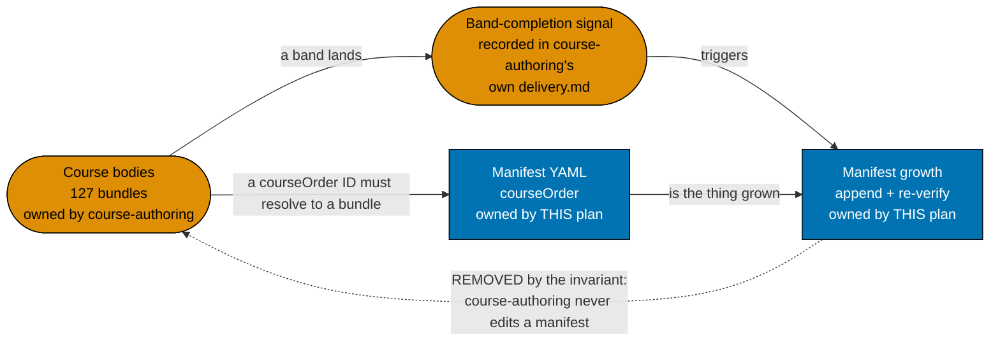
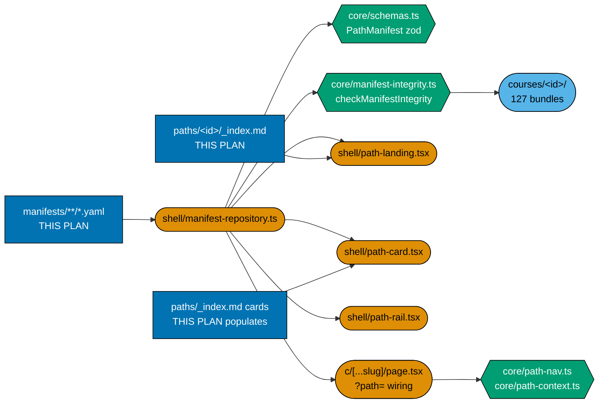
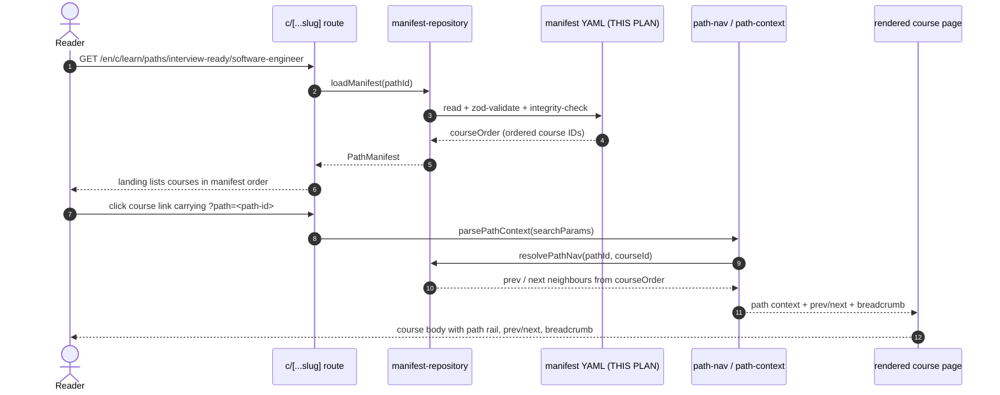
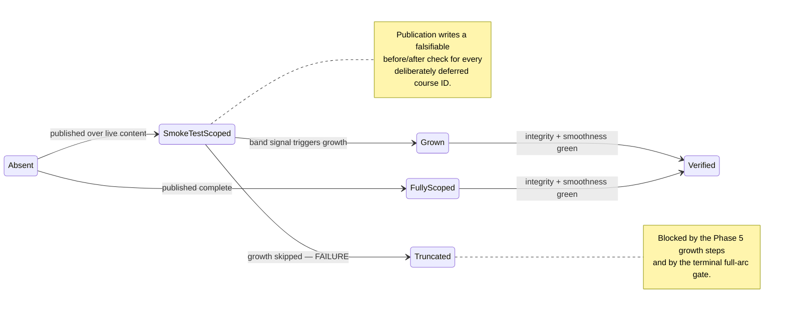
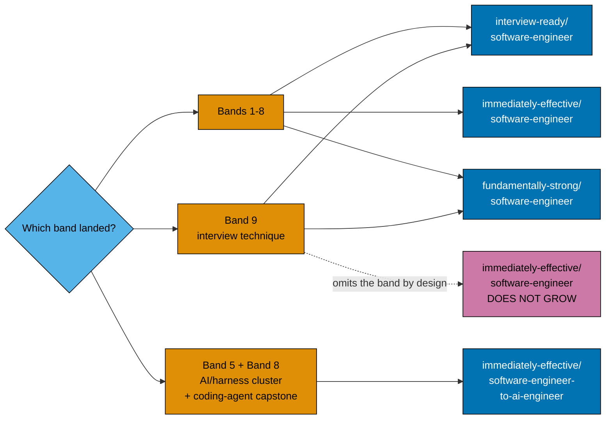

# Technical Documentation — Learning Path Manifests

> **Cross-plan source of truth**: the authoritative per-course and per-path specs live in
> `plans/backlog/ayokoding-learning-path-02-schema-and-prerequisite-dag/syllabus/`. Do not copy
> them; do not author from any other source. In particular, each manifest's `courseOrder` is
> **transcribed** from its
> [`syllabus/paths/manifest-*.md`](../ayokoding-learning-path-02-schema-and-prerequisite-dag/syllabus/paths/README.md)
> mirror, never re-derived.

## Overview

This plan delivers the **composition layer** of the four-path shared-library product: four
`PathManifest` YAML data files, their thin content landing anchors, the paths-hub card population,
the per-path smoothness audits, and every manifest growth as backfill content lands.

It consumes three upstream layers and produces one:

| Layer                     | Owner                                                    | This plan's relationship        |
| ------------------------- | -------------------------------------------------------- | ------------------------------- |
| URL / IA                  | `ayokoding-learning-path-01-url-restructure`             | consumes (`courses/`, `paths/`) |
| Schema / core / integrity | `ayokoding-learning-path-02-schema-and-prerequisite-dag` | consumes (zod, gates, syllabus) |
| Rendering / route wiring  | `ayokoding-learning-path-03-navigation-ui`               | consumes (components, `?path=`) |
| Course bodies             | `ayokoding-learning-path-04-course-authoring`            | consumes (127 bundles)          |
| **Manifests + landings**  | **this plan**                                            | **produces**                    |

## The manifest ownership invariant

**This plan owns every file under `apps/ayokoding-www/src/features/course-paths/manifests/` and
every step that creates, appends to, reorders, or re-verifies one.**
`ayokoding-learning-path-04-course-authoring` owns course **bodies only** and **never edits a
manifest**.

### What this plan writes

| Path                                                                                      | Kind    | Note                                                                                     |
| ----------------------------------------------------------------------------------------- | ------- | ---------------------------------------------------------------------------------------- |
| `apps/ayokoding-www/src/features/course-paths/manifests/**/*.yaml`                        | data    | all four manifests, exclusively                                                          |
| `apps/ayokoding-www/src/features/course-paths/manifests/published-manifests.unit.test.ts` | test    | asserts every published manifest's shape, integrity, and growth state                    |
| `apps/ayokoding-www/content/en/learn/paths/<path-id>/_index.md`                           | content | four thin landing anchors, prose/SEO only                                                |
| `apps/ayokoding-www/content/en/learn/paths/_index.md`                                     | content | card population only — the file itself is `ayokoding-learning-path-01-url-restructure`'s |

### What this plan never touches

- Any file under `apps/ayokoding-www/content/en/learn/courses/` — course bodies are read (to verify a
  `courseOrder` ID resolves) and never written.
- Any file under `apps/ayokoding-www/src/features/course-paths/core/` or `.../shell/` — the pure
  modules and the rendering components are consumed, never modified.
- Any redirect module, any `next.config.ts` entry, any `legacy/` content.

### Why the invariant exists

Without it the two Wave-2/Wave-3 plans form a genuine dependency cycle. The diagram below shows the
cycle and the single cut that removes it.



**Accessibility note.** Ownership is carried by node shape (rectangle = this plan's artefact, stadium
= the course-authoring plan's artefact) as well as by fill; edge status is carried by line style
(solid = surviving, dotted = removed) as well as by the edge label. Fills use the verified accessible
palette (`#0173B2` blue with white text, `#DE8F05` orange with black text) with black borders, per the
[Color Accessibility Convention](../../../repo-governance/conventions/formatting/color-accessibility.md).

The dotted edge is the whole problem. With it present, the course-authoring plan (Wave 2) would have
to grow manifests authored by a Wave-3 plan — steps whose acceptance clauses reference `.yaml` files
no plan has created yet. Flipping the waves does not help: this plan's AI-path phase publishes a
manifest over the six net-new AI course bodies the course-authoring plan writes, so the cycle simply
reverses. **There is no wave ordering that satisfies both directions; only the ownership invariant
does.** A split that leaves manifest mutation in the course-authoring plan is not merely mis-ordered
— it is unschedulable.

The replacement mechanism is the **band-completion signal**: when a band of course bodies lands, the
course-authoring plan records in its own `delivery.md` that Band _N_ has landed and names every
manifest that must grow, by full path. This plan's Phase 5 performs the growth.

## Manifest format (inherited contract)

The `PathManifest` shape, its zod schema, and the integrity gates are authored and owned by
`ayokoding-learning-path-02-schema-and-prerequisite-dag`. They are restated here because every
acceptance clause in this plan's checklist is written against them, and a plan whose data contract
lives only in a sibling folder cannot be executed standalone. If the two statements ever diverge, the
schema plan's wins.

### Storage and shape

A **path** is a manifest: a **path ID**, a display **title**, a **description**, and an ordered
**`courseOrder`** list of course IDs. Each manifest is a standalone data file under
`apps/ayokoding-www/src/features/course-paths/manifests/`; the loader globs `manifests/**/*.yaml` and
a **slash in a path ID becomes a nested directory**. This data file is the **single machine-consumed
source of truth** for the path — it is NOT `courseOrder` frontmatter on any content `_index.md`. The
path landing page renders _from_ this loaded manifest.

```yaml
# apps/ayokoding-www/src/features/course-paths/manifests/interview-ready/software-engineer.yaml
pathId: interview-ready/software-engineer
title: "Interview-Ready Software Engineer"
description: "Interview-first track for an experienced engineer re-entering the market."
courseOrder:
  - just-enough-nvim
  - just-enough-lua
  - extending-neovim
  - just-enough-python
  - capstone-forge-ready
  # … ordered course IDs, prerequisite-consistent …
```

The path ID's second segment names either a **role** (`software-engineer`) or a **role transition or
subject** — `<role-transition-or-subject>` is the explicit convention for that segment (DD-23).

Each `courseOrder` entry is a course ID string, optionally a mapping
`{ id, framing?: { intro?, outro? } }` when the path adds a **lightweight per-course framing**
callout (DD-7). The framing is rendered by the path layer around the shared body; the body itself is
never modified.

### Manifest integrity invariants

Verified as phase gates and unit tests. Every one is re-run at every manifest phase gate in this plan
— not only at the gate that introduced the manifest.

- Every `courseOrder` ID resolves to an existing course under `courses/<course-id>/` (no dangling
  reference).
- No course ID appears twice within one manifest.
- **Prerequisite-consistency**: for every course in a manifest, all of its declared `prerequisites`
  that are **also present in that manifest** appear **before** it. (A path may omit a prerequisite
  only if it also omits every course that needs it.)
- **Course-surgery blast-radius statement** (DD-28): any course surgery names every manifest it
  touches before it lands, and each named manifest is re-verified against the invariants above
  afterward.
- **No forked body**: all manifests reference courses by ID, never copy a body.
- Course IDs are stable slugs; a re-home changes a body's URL (with a redirect) but never its ID.

## Architecture

### Component interaction



Owning plan is carried by node shape (rectangle = this plan, hexagon = the schema plan, stadium =
the navigation and upstream-content plans) as well as by fill, and every node label names its own
file, so the diagram reads without colour. Node labels are abbreviated to fit: `manifests/**/*.yaml`
is rooted at `apps/ayokoding-www/src/features/course-paths/`, `core/` and `shell/` are that same
feature's subfolders, `paths/` is rooted at `apps/ayokoding-www/content/en/learn/`, and
`courses/&lt;id&gt;/` is `apps/ayokoding-www/content/en/learn/courses/&lt;id&gt;/`.

**The load-bearing consequence**: a `.yaml` this plan writes is inert until `manifest-repository.ts`
loads it. That is why this plan's hard prerequisite includes
`ayokoding-learning-path-03-navigation-ui` — a manifest published against no repository is never
parsed, never validated, and never rendered, and every phase gate here asserts a rendered ordered
list.

### A path walk, end to end



### Manifest lifecycle

Every manifest in this plan is published once and may be grown once. The lifecycle is explicit
because the dangerous state is not failure — it is a manifest that stops at
`SmokeTestScoped` and looks correct forever, because integrity passes over a truncated
`courseOrder`.



`Absent` is the entry state for every manifest and `Verified` the terminal one; `Truncated` is the
only other absorbing state and it is a defect, never an accepted outcome. The
`integrity + smoothness green` transition is shorthand for the full re-run: schema validation,
`checkManifestIntegrity`, prerequisite-consistency (topological), and the per-path smoothness audit.
The `band signal triggers growth` transition is the band-completion signal from
`ayokoding-learning-path-04-course-authoring` that opens Phase 5.

Two of the four manifests enter through `SmokeTestScoped`:

- `interview-ready/software-engineer` — published over the 33 re-homed topics + 4 existing capstones;
  the five Band-9 interview-technique courses are inserted when they land.
- `immediately-effective/software-engineer-to-ai-engineer` — published over the six net-new AI courses;
  grows to its full 15-course composition when the nine-course AI/harness cluster lands (DD-33).

The other two (`immediately-effective/software-engineer`, `fundamentally-strong/software-engineer`)
are published over the currently-available library and grow through the ordinary Bands 1–8 growth
step.

### Which manifest grows when a band lands

The single highest-risk step in this plan is appending a course to the wrong manifest. Band 9 is the
trap: `immediately-effective/software-engineer` **deliberately omits** the interview-technique band —
its reader reaches those courses through their canonical pages, not through the manifest.



The `DOES NOT GROW` node is a diamond-free rectangle with an explicit label and a dotted edge, so the
exclusion reads without relying on its distinct fill. The corresponding acceptance clause asserts
**both** directions in one step: the five interview IDs must be present in the two growing manifests
**and** still absent from the third.

## Path Manifests (the four orderings)

Each manifest is the **authoritative order** for one path: a curated, prerequisite-consistent subset
ordering over the catalog. Every ordering is a **valid topological walk** over the prerequisite DAG:
no course precedes any of its listed prerequisites. The exhaustive per-course orderings live in the
[`syllabus/paths/` mirrors](../ayokoding-learning-path-02-schema-and-prerequisite-dag/syllabus/paths/README.md)
and are **authoritative** — this plan transcribes them into `courseOrder`, it does not re-derive them.

### `interview-ready/software-engineer` (interview-first)

Experienced SWE re-entering the market. Arc: **interview/job prep first → production-effective →
deeper.** Delivered **first**, as an architecture smoke test (DD-27). Per **DL-13** this is a curated
spine plus an optional "Go deeper" tail, not all-comprehensive. Published smoke-test-scoped over the
33 re-homed topics + 4 existing capstones; grows with Band 9's five interview-technique courses.
Mirror:
[`manifest-interview-ready-software-engineer.md`](../ayokoding-learning-path-02-schema-and-prerequisite-dag/syllabus/paths/manifest-interview-ready-software-engineer.md).

### `immediately-effective/software-engineer` (build-fast-first)

Editor/tooling → one language end-to-end → **build a real app first** → then deepen. Adds no new
course body; composes existing library courses. Grows through Bands 1–8 only — it **omits the
interview-technique band by design**. Mirror:
[`manifest-immediately-effective-software-engineer.md`](../ayokoding-learning-path-02-schema-and-prerequisite-dag/syllabus/paths/manifest-immediately-effective-software-engineer.md).

### `fundamentally-strong/software-engineer` (theory-first)

University-style: CS foundations / computer architecture / paradigms / DS&A FIRST, then
systems/architecture depth. Per **DL-13** this is the complete-mastery path over the
software-engineer-role catalog. Grows through Bands 1–8 and Band 9 (its own trailing optional
interview band). Mirror:
[`manifest-fundamentally-strong-software-engineer.md`](../ayokoding-learning-path-02-schema-and-prerequisite-dag/syllabus/paths/manifest-fundamentally-strong-software-engineer.md).

### `immediately-effective/software-engineer-to-ai-engineer` (fourth path)

Role-transition principle, not an arc over the software-engineer-role baseline. Assumes an
**already-working software engineer** (DD-24) — the manifest is a short, AI-specific spine;
prerequisite software-engineer-**fundamentals** courses it depends on are **linked** to their
canonical pages from the landing narrative, not included in `courseOrder`. DD-24 scopes
"linked, not included" to SWE-fundamentals **only** — the AI/harness cluster is **walked**, not
linked (DD-33). Converges on a **distinct AI-engineer endpoint** (DD-22).

**Spine: 15 courses** — the nine-course AI/harness cluster walked, plus the six new AI-engineer-role
courses. Settled order per the mirror
[`manifest-immediately-effective-software-engineer-to-ai-engineer.md`](../ayokoding-learning-path-02-schema-and-prerequisite-dag/syllabus/paths/manifest-immediately-effective-software-engineer-to-ai-engineer.md),
which is **already authoritative**: `creating-ai-powered-apps` → light eval gate
(`evaluating-ai-output-essentials`) → `agentic-ai` → `browser-automation-with-cdp` → the harness
cluster (`the-agent-loop` → `agent-tools-and-mcp` → `agent-context-and-memory` →
`agent-permissions-and-sandboxing` → `agent-orchestration-subagents-and-observability`) →
`capstone-build-your-own-coding-agent` → `statistics-for-evaluation` →
`evaluating-ai-systems-in-depth` → `product-patterns-for-probabilistic-systems` →
`inference-serving-and-model-deployment` → `fine-tuning-and-adaptation`.

Published smoke-test-scoped to the six new AI courses (the only spine members whose bodies exist when
this plan's Phase 2 runs), grown to the full 15 in Phase 5.

## Smoothness Architecture (per-path)

Smoothness is a per-manifest property (each path has its own order), underwritten by the machine
invariant of DD-6/DD-16. Each manifest must satisfy four levers:

1. **Prereq-chaining (a hard gate)** — no course precedes any of its declared `prerequisites` within
   the path's order; every `just-enough-<lang>` primer precedes that language's first use. The old
   in-context forward-references (SF-1 `computer-architecture` before `just-enough-c`; SF-2
   `building-production-cli-tools` before its Go/Rust primers) are **removed** by declaring those
   primers as prerequisites — the DAG has no forward edges to soften.
2. **Monotonic-ish difficulty** — each manifest ramps difficulty smoothly; a conceptual
   phase-boundary cliff carries a **bridge** paragraph in the path landing narrative (for example
   `immediately-effective`'s shipping → CS-depth boundary: "you shipped; now understand why it
   worked").
3. **Skip / fast-path affordances** — each path renders its persona's fast-path on the path landing:
   `interview-ready` "experienced and job-hunting? start at Phase 1"; `immediately-effective` "already
   know a language? jump to Build A Real App"; `fundamentally-strong` "have a CS degree? skim Stage 2."
4. **Register** — `interview-ready`'s technique modules re-ground a working engineer (refresh
   register); `immediately-effective` and `fundamentally-strong` use the normal first-learn
   By-Example register.

**A regression is fixed by softening or bridging in place, never by reordering.** Reordering a
manifest to smooth a perceived cliff can silently break prerequisite-consistency; the integrity gate
is re-run after any change either way.

**The refresh-register lever is not assessable at Phase 1.** It lives inside the four deferred
interview-technique courses, whose bodies land in the course-authoring plan's Band 9. Phase 1
explicitly defers it; Phase 5 closes the deferral with a re-audit. That deferral is recorded, not
fabricated.

## Design Decisions

Nine decisions land in this plan. Each is reproduced verbatim from the source plan, with its
amendment annotations intact.

- **DD-5 · Three software-engineer paths, one library, one converging endpoint (amended 2026-07-20 by
  DD-22 — see below).** `interview-ready/software-engineer`, `immediately-effective/software-engineer`,
  and `fundamentally-strong/software-engineer` differ only in entry point + ordering + emphasis; all
  end at the same deep mastery. Serving one persona per path without forking any body is exactly what
  the shared library buys. **DD-22 amends the founding claim itself**: convergence is now a per-role
  property, not a single global endpoint — this DD-5 statement still holds for the three
  software-engineer paths, but the library as a whole now serves more than one endpoint.
- **DD-7 · Omit-or-create; per-path framing is a callout, never a body fork (amended 2026-07-20 by
  DD-28 — see below).** A path omits a course that does not fit and creates a new shared course only
  for a genuine gap; per-path framing is a lightweight intro/outro callout around the shared body.
  Single source of truth per course. **DD-28 supersedes the "create-only, never modify existing"
  half of this invariant**: course surgery (update/merge/split against an _existing_ course) is now
  permitted, subject to a mandatory four-path blast-radius statement.
  - **DD-28 lives in a different plan.** Read it at
    [`ayokoding-learning-path-04-course-authoring` §Design Decisions](../ayokoding-learning-path-04-course-authoring/tech-docs.md#design-decisions).
    See [the DD-7 and DD-28 amendment pair](#the-dd-7-and-dd-28-amendment-pair) below.
- **DD-13 · Harness-engineering cluster as a marquee build-your-own track** (manifest half). The five
  harness courses + `capstone-build-your-own-coding-agent`, in **Python** (matching `remotebrowser`),
  sit after the AI band so prerequisites precede them. Available to all four paths; central to the
  three software-engineer paths' converging endpoint, and directly relevant to the fourth path's
  build-AI-systems scope (D1/DD-21) — the AI path's own manifest composition, including whether it
  walks or links to this cluster, is decided during that path's authoring (DD-27).
  - **Resolved by DD-33**: it walks. The course **bodies** for this cluster are owned by
    `ayokoding-learning-path-04-course-authoring`; only their manifest placement is this plan's.
- **DD-21 · Scope: the AI path teaches building AI systems, not driving them (D1).** The fourth path,
  `immediately-effective/software-engineer-to-ai-engineer`, teaches learners to **build** AI systems.
  `agentic-coding` (the practice of using an AI agent to write code faster — the user's side of the
  agent relationship) stays exactly where it is in the library, unchanged, and is explicitly **not**
  the subject of this path — a separate, unrelated axis.
- **DD-22 · Convergence axiom amended: paths converge per role, not globally (D2, amends DD-5).** The
  plan's founding claim — all paths end at the same deep mastery — no longer holds globally. Paths now
  converge **within a role**: the three `software-engineer` paths (`interview-ready`,
  `immediately-effective`, `fundamentally-strong`) still converge on one shared software-engineer
  deep-mastery endpoint (DD-5 continues to hold for those three); the fourth path converges on a
  separate AI-engineer endpoint. The library now serves **more than one endpoint**, and this axiom
  leaves room for future roles without requiring another founding-claim change.
- **DD-23 · Path ID registered; second URL segment redefined from `<role>` to
  `<role-transition-or-subject>` (D3).** The fourth path's ID is
  `immediately-effective/software-engineer-to-ai-engineer`
  (`/en/c/learn/paths/immediately-effective/software-engineer-to-ai-engineer`; manifest at
  `apps/ayokoding-www/src/features/course-paths/manifests/immediately-effective/software-engineer-to-ai-engineer.yaml`).
  Registering a role-to-role transition ID surfaced that the second URL segment was never actually
  `<role>` in general — it was `<role>` by accident because only one role existed. The convention is
  now **stated explicitly**: `/en/c/learn/paths/<first-segment>/<role-or-role-transition>`, where the
  first segment is the arc style (`interview-ready` / `immediately-effective` / `fundamentally-strong`)
  and the second segment is either a role (`software-engineer`) or a role-to-role transition
  (`software-engineer-to-ai-engineer`) that names the transition explicitly.
- **DD-24 · Fourth path's entry point: linked, not included, prerequisites (D4).** The manifest assumes
  an **already-working software engineer** and is a **short, AI-specific spine** — prerequisite
  software-engineer courses are **linked** to their canonical pages from the path landing narrative,
  never duplicated into `courseOrder`. This is what "immediately effective" means for a specialization:
  fast because it assumes competence already exists, not because it skips depth.
  - **Clarified by DD-33** (both in this plan, so the amendment pair is intact): the exclusion is
    scoped to SWE-fundamentals only and never applied to the AI/harness cluster.
- **DD-27 · Build order amended: the fourth path is authoring priority #1, behind an
  architecture-smoke-test-only MVP (D7, amends DD-15).** Locked order: **Group A** (architecture + UI,
  unchanged hard prerequisite) → **`interview-ready` MVP, narrowed to an architecture smoke test only**
  (ships against topics 1–33, already live on disk; proves routing, manifest loading, `?path` context,
  prev/next, breadcrumb, and prerequisite display against real content, in days not months —
  authoring the 4 NEW interview courses + `capstone-interview-loop` is **no longer bundled into this
  MVP gate**) → **`software-engineer-to-ai-engineer`** (authoring priority #1 for all authoring effort)
  → **`immediately-effective/software-engineer`** manifest → **`fundamentally-strong/software-engineer`**
  manifest → **backfill topics 34–94**. Rationale (preserved from the original build-order decision):
  nothing in the AI path exists on disk (~17 courses); making it literally first — ahead of even the
  MVP — would mean nothing ships until all 17 are authored, with the UI architecture unvalidated the
  entire time. Ordering it immediately after an architecture-smoke-test MVP gives the AI path first
  claim on every unit of real authoring effort while keeping the architecture proven early against
  content that already exists.
  - **This plan is DD-27's canonical owner** for citation purposes — its phase ordering is what DD-27
    most directly constrains. The text is nonetheless duplicated verbatim in all five split plans,
    per the cross-cutting-content rule.
- **DD-33 · Fourth path's manifest WALKS the AI/harness cluster; spine is 15 courses, not 6 (D13,
  resolves the DD-24/DD-27 open item).** DD-24 scopes "linked, not included" to the shared
  **software-engineer-fundamentals** courses only (`just-enough-python`, `software-testing`,
  `cicd-and-release-engineering`, `backend-at-scale`, `containers-and-orchestration`,
  `computer-architecture`, `site-reliability-engineering`, `data-engineering`,
  `data-structures-and-algorithms-essentials`, `software-product-engineering`, `frontend-essentials`) —
  it never said to link out the AI/harness cluster. The fourth path's `courseOrder` **walks** the
  existing 9-course AI/harness cluster (`creating-ai-powered-apps`, `agentic-ai`,
  `browser-automation-with-cdp`, `the-agent-loop`, `agent-tools-and-mcp`, `agent-context-and-memory`,
  `agent-permissions-and-sandboxing`, `agent-orchestration-subagents-and-observability`,
  `capstone-build-your-own-coding-agent`) **plus** the six new AI-engineer-role courses — **15 courses
  total** — matching
  `syllabus/paths/manifest-immediately-effective-software-engineer-to-ai-engineer.md` (already
  authoritative) and `syllabus/paths/README.md`'s "15 courses" summary. **Rationale**: (a) the user
  explicitly required context- and harness-engineering to be **included** in this path — walking puts
  them in the reading order; linking hides them; (b) an AI-engineer onramp whose walk omits the
  agent-building courses would contradict DD-21's own scope (teach **building** AI systems, not just
  using an LLM in an app); (c) DD-24's own text only ever excluded SWE-fundamentals, never the
  AI/harness cluster — treating it as excluded was an overreach of DD-24, not a restatement of it.
  **Build-order consequence**: the 9 harness-cluster course bodies are authored by
  `ayokoding-learning-path-04-course-authoring` **after** this plan's AI-path manifest phase. That
  phase therefore ships the manifest **smoke-test-scoped** to the six new AI courses, and the manifest
  **grows** to the full 15 in this plan's Phase 5 — mirroring the same partial-ship-then-grow pattern
  the `interview-ready` manifest already uses for its own deferred interview-technique courses. This
  does **not** delay the AI path's ship — DD-27's "authoring priority #1" stands; only the manifest's
  _published_ subset differs from its long-run full composition until the cluster bodies land.

### The DD-7 and DD-28 amendment pair

DD-7 lands in **this plan**. Its amendment, DD-28 (course surgery now permitted; six net-new AI
courses; catalog 121 → 127), lands in **`ayokoding-learning-path-04-course-authoring`**. The amended
invariant and its amendment are therefore separated by the split, and a reader of either plan alone
would inherit a stale claim.

The source plan names exactly this class of confusion as a live product risk, mitigated only by the
amendment record being cross-referenced from every site making the original claim. The mitigation is
mechanical, not stylistic:

1. This plan's DD-7 above carries the full amendment sentence **verbatim**, not paraphrased:

   > **DD-28 supersedes the "create-only, never modify existing" half of this invariant**: course
   > surgery (update/merge/split against an _existing_ course) is now permitted, subject to a
   > mandatory four-path blast-radius statement.

2. This plan's DD-7 carries a working cross-plan link to DD-28 at
   [`../ayokoding-learning-path-04-course-authoring/tech-docs.md#design-decisions`](../ayokoding-learning-path-04-course-authoring/tech-docs.md#design-decisions).
3. That plan's DD-28 carries the reciprocal link back to this DD-7 and restates DD-7's **surviving
   half** — no body fork; per-path framing is a callout — so a course-authoring-only reader does not
   read "surgery permitted" as "forking permitted".

The other amendment pairs this plan holds are **intact within it** and need no cross-plan treatment:
DD-5 → DD-22 (both here), DD-24 → DD-33 (both here), DL-1 → DL-15 (both here). DD-15 → DD-27 needs no
special handling either: both are cross-cutting and duplicated verbatim in all five plans, amendment
chain intact.

The one remaining split pair is **DL-6 → DL-15**: DL-6 lands in the course-authoring plan and DL-15
lands here. It gets the same treatment as DD-7/DD-28 — see
[README §Decisions Locked (owned by this plan)](./README.md#decisions-locked-owned-by-this-plan).

### Build order (inherited, duplicated verbatim)

**DD-15** and **DD-27** are cross-cutting sequencing decisions with no single owner; both are
reproduced verbatim in every one of the five split plans. DD-27 appears above in full. DD-15 appears
in full in [README §Build order (inherited)](./README.md#build-order-inherited), alongside DD-27 and
DL-7, so a reader of the README alone gets the whole sequencing decision without opening a second
file.

## UI-design-funnel exemption (recorded explicitly)

**This plan is exempt from the UI-design-funnel requirement, and the exemption is scoped narrowly.**

The requirement binds a plan that **adds or changes user-facing screens or components** under `apps/`
or `libs/`. This plan adds neither:

- **No net-new component.** Every rendering component the four landings and the hub use —
  `path-landing.tsx`, `path-card.tsx`, `path-rail.tsx`, `path-banner.tsx`, `path-course-links.tsx`,
  `prerequisite-list.tsx` — is built and owned by `ayokoding-learning-path-03-navigation-ui`. This
  plan writes no `.tsx` file at all.
- **No net-new screen.** The two screens this plan populates are Screen 1 (paths hub) and Screen 2
  (path landing). Both carry **completed funnel records** — low-fi alternatives, hi-fi finalists at
  three viewports, a named selection, a rationale table, the R5 grounding note, the R7 prior-art
  citation, and the responsive strategy — owned by `ayokoding-learning-path-03-navigation-ui`'s
  `prd.md`. Re-running a funnel here would produce a second, drifting design record for screens
  already selected.
- **What this plan contributes to those screens is content and data**: a `courseOrder` the existing
  `PathLanding` renders, prose in a landing `_index.md`, and card copy in the hub. No layout, no
  breakpoint behaviour, no component composition is decided here.

**What the exemption does NOT cover.** Because this plan ships user-visible surfaces — four path
landings plus a hub that goes from zero to four populated cards — the following remain **mandatory**
and are delivered in [Phase 7](./delivery.md#phase-7-manual-ui-verification-and-rule-15-three-tester-retest):

- Manual UI verification via Playwright MCP at 375 / 768 / 1280 px across every landing and the hub.
- Evidence capture — one screenshot per screen per breakpoint, committed to `evidence/`.
- The **Rule-15 three-tester retest** (`web-exploratory-tester` + `web-usability-tester` +
  `web-design-tester`) against all four landings and the hub, with every EWT/UWT/DWT defect finding
  fixed before archival.

**Locale scope.** The path content is authored `en`-only; `id/belajar/` has zero courses and zero
paths, so a manifest over it would compose nothing. This is a content-availability fact recorded as a
non-goal, not a code limitation — the navigation mechanism itself is locale-neutral.

## File Impact

| Path                                                                                                                 | Change                                    | Phase      |
| -------------------------------------------------------------------------------------------------------------------- | ----------------------------------------- | ---------- |
| `apps/ayokoding-www/src/features/course-paths/manifests/published-manifests.unit.test.ts`                            | created (Phase 1), extended (2, 3, 4)     | 1-4        |
| `apps/ayokoding-www/src/features/course-paths/manifests/interview-ready/software-engineer.yaml`                      | created                                   | 1          |
| `apps/ayokoding-www/content/en/learn/paths/interview-ready/software-engineer/_index.md`                              | created                                   | 1          |
| `apps/ayokoding-www/src/features/course-paths/manifests/immediately-effective/software-engineer-to-ai-engineer.yaml` | created                                   | 2          |
| `apps/ayokoding-www/content/en/learn/paths/immediately-effective/software-engineer-to-ai-engineer/_index.md`         | created                                   | 2          |
| `apps/ayokoding-www/src/features/course-paths/manifests/immediately-effective/software-engineer.yaml`                | created                                   | 3          |
| `apps/ayokoding-www/content/en/learn/paths/immediately-effective/software-engineer/_index.md`                        | created                                   | 3          |
| `apps/ayokoding-www/src/features/course-paths/manifests/fundamentally-strong/software-engineer.yaml`                 | created                                   | 4          |
| `apps/ayokoding-www/content/en/learn/paths/fundamentally-strong/software-engineer/_index.md`                         | created                                   | 4          |
| `apps/ayokoding-www/content/en/learn/paths/_index.md`                                                                | edited (card population, once per phase)  | 1, 2, 3, 4 |
| All four manifest `.yaml` files                                                                                      | edited (growth)                           | 5          |
| `specs/apps/ayokoding/behavior/ayokoding-www/gherkin/course-paths/path-composition.feature`                          | created (Phase 1), extended (4)           | 1, 4       |
| `apps/ayokoding-www-fe-e2e/src/steps/course-paths.steps.ts`                                                          | extended (created by the navigation plan) | 1, 4       |
| `plans/backlog/ayokoding-learning-path-05-manifests/evidence/`                                                       | created                                   | 7          |

All paths are marked `_New file_` except `paths/_index.md`, which is created by
`ayokoding-learning-path-01-url-restructure` and only **populated** here. None of the manifest paths
exists on the current tree — `apps/ayokoding-www/src/features/course-paths/` is absent today
[Repo-grounded — `test -d` returns non-zero on the current commit] and is created by
`ayokoding-learning-path-02-schema-and-prerequisite-dag`.

## Testing Strategy

| Level                    | What it covers here                                                                                             | Command                                                               |
| ------------------------ | --------------------------------------------------------------------------------------------------------------- | --------------------------------------------------------------------- |
| Unit                     | manifest loads + zod-validates; integrity; prerequisite-consistency; no-forked-body; before/after growth checks | `npx nx run ayokoding-www:test:unit`                                  |
| Specs (Gherkin coverage) | every scenario in `prd.md` binds a step definition under `specs/`                                               | `npx nx run ayokoding-www:specs:behavior:coverage`                    |
| E2E                      | path-walk from each landing; `?path=` persistence; breadcrumb; prerequisite display; part-of-paths affordance   | `npx nx run ayokoding-www-fe-e2e:test:e2e`                            |
| Build                    | all four manifests resolve against 127 bundles at build time                                                    | `npx nx run ayokoding-www:build`                                      |
| Manual                   | four landings + hub at 375 / 768 / 1280 px, `en`, with committed evidence                                       | Playwright MCP (Phase 7)                                              |
| Live-site triad          | Rule-15 EWT / UWT / DWT retest before archival                                                                  | `web-exploratory-tester`, `web-usability-tester`, `web-design-tester` |

**TDD shape.** The manifests are data files under `src/` consumed by app code, so every manifest step
is Red→Green→Refactor: RED writes the failing integrity/e2e assertion for the manifest that does not
exist yet, GREEN authors the YAML, REFACTOR tidies and re-runs. The **landing anchors are content**
and follow the maker → checker → fixer cycle instead — no RED/GREEN/REFACTOR labels, per the source
plan's own convention.

**`ayokoding-www:test:e2e` and `:test:integration` are no-op echo targets** and can never fail; the
real e2e lives in the paired `ayokoding-www-fe-e2e` project. Every acceptance clause in this plan
names `ayokoding-www-fe-e2e:test:e2e`, never the no-op.

## Dependencies

- **Upstream plans** — all four siblings; see [README §Depends-on](./README.md#depends-on).
- **Runtime / build** — no net-new npm dependency. The YAML loader, the zod schema, and the integrity
  gates are delivered by `ayokoding-learning-path-02-schema-and-prerequisite-dag`.
- **Tooling** — `rhino-cli` for `md links validate` and `md heading-hierarchy validate`, invoked as
  raw `cargo run` (not Nx targets), matching the pre-push hook's own form.

## Rollback

Each phase is its own branch and PR, so rollback is per-phase and non-destructive:

- **A manifest phase (1–4)**: `git revert` the phase's merge commit. The manifest file and its landing
  disappear; the hub card count drops by one; every other path keeps working, because manifests are
  independent data files with no cross-references between them.
- **The growth phase (5)**: `git revert` returns each manifest to its smoke-test-scoped or Bands-1-8
  state. Integrity still passes at the smaller scope — which is precisely why the terminal full-arc
  gate exists rather than relying on integrity alone.
- **No content or component rollback is ever required**, because this plan writes neither. That is a
  direct benefit of the ownership invariant: the blast radius of reverting this plan is four YAML
  files, four landing anchors, and one hub file.
