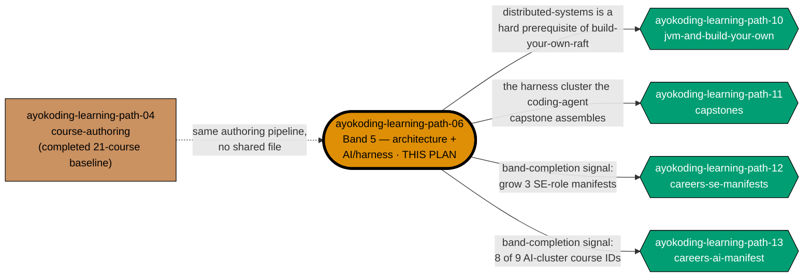
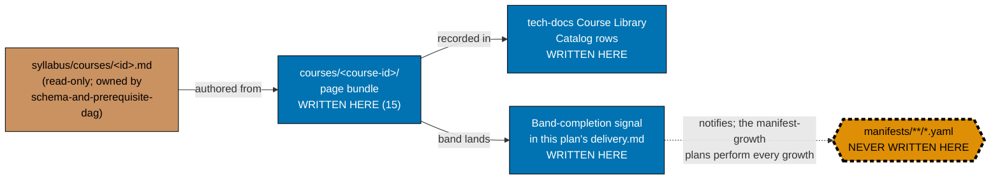

# Learning Path — Course Authoring: Architecture, Distributed & AI/Harness (Band 5)

## Delivery amendment — one final PR

All 15 courses remain within one plan branch and one delivery unit. The sole draft PR opens only in
Phase 9, after verification and Knowledge Capture, and carries the archival move, review cycle, CI,
merge, and deploy. Earlier cohort or delivery-boundary PR wording is superseded.

This plan authors **Band 5 — Architecture, distributed & AI/harness** of the shared course library:
**15 course bodies**, landing under `apps/ayokoding-www/content/en/learn/courses/`. It also owns the
three **course-surgery scope contracts** (evals forward-link, D9 naming-and-citation, D11
concept-additions) as its own documentation-only **Phase 1** — these contracts exist purely to
constrain how this band's bodies are authored, and this plan is where they are locked and then
applied by construction.

This plan is a **further split** of
[`ayokoding-learning-path-04-course-authoring`](../../done/2026-08-02__ayokoding-learning-path-04-course-authoring/README.md),
which originally owned all nine authoring bands plus these three contracts (as its own "Phase 2").
Band 5 and the three contracts are carved out into this standalone plan so the band's 15 bodies —
including the entire AI/harness cluster — can be authored, reviewed, and merged independently of the
other eight bands. This plan owns **course bodies only**, exactly as its parent did: no schema, no
route, no component, no redirect — and, most importantly, **no manifest**.

> **Cross-plan source of truth** — the authoritative per-course specs live in
> `plans/done/2026-07-24__ayokoding-learning-path-02-schema-and-prerequisite-dag/syllabus/courses/`.
> Do not copy them; do not author from any other source. Every course body in this plan is authored
> **from** its `syllabus/courses/<course-id>.md` spec file — never from a fresh judgment call.

## Exact scope: 15 courses, in order

| #   | Course ID                                         | Cluster                              |
| --- | ------------------------------------------------- | ------------------------------------ |
| 1   | `software-architecture`                           | Architecture fundamentals (Cohort 1) |
| 2   | `domain-driven-design`                            | Architecture fundamentals (Cohort 1) |
| 3   | `system-design`                                   | Architecture fundamentals (Cohort 1) |
| 4   | `event-driven-architecture`                       | Architecture fundamentals (Cohort 1) |
| 5   | `distributed-systems`                             | Architecture fundamentals (Cohort 1) |
| 6   | `build-your-own-web-framework`                    | Frameworks + AI on-ramp (Cohort 2)   |
| 7   | `build-your-own-reactive-ui`                      | Frameworks + AI on-ramp (Cohort 2)   |
| 8   | `creating-ai-powered-apps`                        | Frameworks + AI on-ramp (Cohort 2)   |
| 9   | `agentic-ai`                                      | Frameworks + AI on-ramp (Cohort 2)   |
| 10  | `browser-automation-with-cdp`                     | Frameworks + AI on-ramp (Cohort 2)   |
| 11  | `the-agent-loop`                                  | AI/harness cluster core (Cohort 3)   |
| 12  | `agent-tools-and-mcp`                             | AI/harness cluster core (Cohort 3)   |
| 13  | `agent-context-and-memory`                        | AI/harness cluster core (Cohort 3)   |
| 14  | `agent-permissions-and-sandboxing`                | AI/harness cluster core (Cohort 3)   |
| 15  | `agent-orchestration-subagents-and-observability` | AI/harness cluster core (Cohort 3)   |

**Courses 10–15 are the "AI/harness cluster"** — six of the nine courses that grow the
`careers/immediately-effective/ai-engineer` manifest from its six-course smoke-test spine to its full
DD-35-governed composition. Courses 8 and 9 (`creating-ai-powered-apps`, `agentic-ai`) are the other
two AI-cluster courses this plan lands. The ninth AI-cluster course,
`capstone-build-your-own-coding-agent`, assembles courses 11–15 into a working coding-agent CLI and
lives in the sibling plan
[`ayokoding-learning-path-11-course-authoring-capstones`](../ayokoding-learning-path-11-course-authoring-capstones/README.md) —
so this plan lands **8 of 9** AI-cluster bodies, and the capstone plan lands the 9th.

## The manifest ownership invariant (binding — read before anything else)

> **This plan never edits a manifest file.** Every file under
> `apps/ayokoding-www/src/features/course-paths/manifests/` is owned by
> [`ayokoding-learning-path-12-careers-se-manifests`](../ayokoding-learning-path-12-careers-se-manifests/README.md)
> and [`ayokoding-learning-path-13-careers-ai-manifest`](../ayokoding-learning-path-13-careers-ai-manifest/README.md)
> (the successor manifest-growth plans; see [Depends-on](#depends-on) below). A step in this plan
> that creates, appends to, reorders, or re-verifies a `.yaml` manifest is a **boundary violation**,
> not a convenience.

When this band lands, this plan records a **band-completion signal** in its own
[`delivery.md`](./delivery.md) and the manifest-growth plan performs the growth. The signal is the
entire handoff contract — see [Band-completion signal contract](#band-completion-signal-contract)
below.

## Position in the split



**Accessibility note.** Role is carried by node **shape** (rectangle = sibling, stadium
double-bordered = this plan, hexagon = downstream consumer) and by explicit edge labels stating what
each dependency actually needs, never by fill colour alone. Fills use the repo's verified
color-blind-friendly palette (`#CA9161` tan, `#DE8F05` orange, `#029E73` teal) per the
[Color Accessibility Convention](../../../repo-governance/conventions/formatting/color-accessibility.md).

## Manifest-ownership boundary



**Accessibility note.** Write permission is carried by node **shape** and explicit label text
(`WRITTEN HERE` / `NEVER WRITTEN HERE` / `read-only`), and edge kind by **line style** plus edge
labels — never by fill colour alone. The forbidden node additionally carries a dashed thick border.

## Band-completion signal contract

Reproduced from the parent plan's own contract (this plan is the sole author of Band 5's signal, so
it inherits the shape verbatim). Every band-completion signal recorded in this plan's `delivery.md`
MUST carry all five fields below, verbatim, in a fenced `text` block directly under the band's gate:

| Field               | Content                                                                                                                    |
| ------------------- | -------------------------------------------------------------------------------------------------------------------------- |
| `BAND`              | `Band 5 — Architecture, distributed & AI/harness`                                                                          |
| `PLAN`              | `ayokoding-learning-path-06-course-authoring-architecture-and-ai-harness`                                                  |
| `LANDED_COURSE_IDS` | all 15 course IDs this plan authors, one per line, in the order listed in [§Exact scope](#exact-scope-15-courses-in-order) |
| `GROW_MANIFESTS`    | every manifest a downstream plan must grow, by **full path** under `<MANIFESTS>`                                           |
| `FINAL_PR`          | the number of this plan's sole terminal archival PR, verified merged before consumption                                    |

**`GROW_MANIFESTS` for this band is four manifests** — Band 5 is one of only two bands (the other is
Band 8, in `ayokoding-learning-path-11-course-authoring-capstones`) that grows the fourth path's
manifest in addition to the three software-engineer-role manifests, per the parent plan's own
README: "this band lands eight of the nine courses that manifest walks (DD-33)":

- `<MANIFESTS>careers/interview-ready/software-engineer.yaml`
- `<MANIFESTS>careers/immediately-effective/software-engineer.yaml`
- `<MANIFESTS>careers/fundamentally-strong/software-engineer.yaml`
- `<MANIFESTS>careers/immediately-effective/ai-engineer.yaml`

A signal that names manifests loosely, or omits the merged `FINAL_PR`, is incomplete and the receiving
plan(s) must reject it rather than guess.

## Phase-ordering fact (internal, not cross-plan)

The parent plan's own "Band ordering rationale" stated: _"Band 5 must follow Phase 2 [surgery
contracts] because it is the band whose bodies the three course-surgery contracts target — the
contracts are applied by construction at authoring time rather than retrofitted afterwards."_ Now
that both the contracts and Band 5 live inside this single plan, that statement becomes an
**internal phase-ordering fact**: this plan's own **Phase 1** (the contract lock, 0 courses,
documentation-only) MUST complete before this plan's own course-authoring phases (Phase 2 onward)
begin. It is no longer a cross-plan dependency — nothing outside this plan's own `delivery.md` gates
this ordering.

## Delivery Mode: worktree-to-pr

This plan has exactly one dedicated worktree, one persistent final-delivery branch, and one PR.
All authoring, verification, and Knowledge Capture phases commit on that branch without a push, PR,
review cycle, merge, or deployment. In Phase 9, the executor commits the archival move and
any index updates, opens the sole draft PR, completes the PR-Review Maker→Fixer Cycle and CI gates,
marks it ready, and performs the normal AI merge/deploy after the hardened preconditions hold.
No per-course, cohort, stage, or phase worktree/branch/PR is permitted.

## Depends-on

| Direction       | Plan (full folder name)                                                                  | Nature                                                                                                                                                                                                                                              |
| --------------- | ---------------------------------------------------------------------------------------- | --------------------------------------------------------------------------------------------------------------------------------------------------------------------------------------------------------------------------------------------------- |
| **blockedBy**   | `ayokoding-learning-path-01-url-restructure`                                             | hard, transitive — populated flat `courses/` namespace + `courses/_index.md` (inherited from the parent plan)                                                                                                                                       |
| **blockedBy**   | `ayokoding-learning-path-02-schema-and-prerequisite-dag`                                 | hard, transitive — `syllabus/courses/` specs + the `prerequisites` frontmatter contract                                                                                                                                                             |
| **blockedBy**   | `ayokoding-learning-path-04-course-authoring`                                            | hard, satisfied — its Phase 0 baseline and Phase 1 (the six net-new AI-engineering courses) merged to `origin/main` before the 2026-08-02 archival; `creating-ai-powered-apps` (course 8) and `agentic-ai` (course 9) here build on that foundation |
| **blockedBy**   | `vercel-function-cost-reduction`                                                         | hard — see [§`vercel-function-cost-reduction` precondition](#vercel-function-cost-reduction-precondition) below                                                                                                                                     |
| **blocks**      | `ayokoding-learning-path-10-course-authoring-jvm-and-build-your-own`                     | hard — its `build-your-own-raft` course declares `distributed-systems` (course 5 here) as a prerequisite                                                                                                                                            |
| **blocks**      | `ayokoding-learning-path-11-course-authoring-capstones`                                  | hard — its `capstone-build-your-own-coding-agent` assembles this plan's five-course harness cluster (courses 11–15)                                                                                                                                 |
| **blocks**      | `ayokoding-learning-path-12-careers-se-manifests`                                        | hard — needs this band's completion signal to grow the three software-engineer-role manifests                                                                                                                                                       |
| **blocks**      | `ayokoding-learning-path-13-careers-ai-manifest`                                         | hard — needs 8 of its 9-course AI-cluster walk from this band                                                                                                                                                                                       |
| _(independent)_ | `ayokoding-learning-path-05-course-authoring-platform-and-concurrency`, `07`, `08`, `09` | none — sibling band-authoring splits of the same parent plan; each writes only its own band's course subtree, no shared file, per the parent plan's own "mutually content-independent" statement about Bands 1–4, 6, 7                              |

**Start precondition (checkable — all four `blockedBy` rows must hold):**

1. PR for `ayokoding-learning-path-01-url-restructure` is merged to `origin/main`.
2. PR for `ayokoding-learning-path-02-schema-and-prerequisite-dag` is merged to `origin/main`.
3. `ayokoding-learning-path-04-course-authoring`'s Phase 0 baseline and Phase 1 (the six net-new AI
   courses) are merged to `origin/main` — checkable via
   `for s in evaluating-ai-output-essentials statistics-for-evaluation evaluating-ai-systems-in-depth product-patterns-for-probabilistic-systems inference-serving-and-model-deployment fine-tuning-and-adaptation; do test -d "apps/ayokoding-www/content/en/learn/courses/$s" || echo "ABSENT $s"; done | grep -c .`
   returning **0**.
4. `vercel-function-cost-reduction`'s Phases 1–4 changes are merged to `origin/main` — see next
   section for the concrete checkable signal.

### `vercel-function-cost-reduction` precondition

This plan authors new content pages into `apps/ayokoding-www` — the same app
`vercel-function-cost-reduction` is actively restructuring for static generation. Per that plan's own
[README](../../done/2026-08-02__vercel-function-cost-reduction/README.md), its Phase 1 deletes
`apps/ayokoding-www/src/app/layout.tsx` (promoting the locale layout to root) and its Phase 2 removes
the `searchParams` read from the content catch-all page — both touch the exact route tree this plan's
15 new course pages render into. Authoring against the pre-fix dynamic-rendering shape risks the new
pages inheriting the same all-dynamic cost problem the moment the fix lands underneath them, or the
fix landing after and needing to re-verify against 15 more pages than it planned for. **Assumed
complete by this plan's execution start, per explicit instruction; not yet true as of this plan's
authoring date** — `apps/ayokoding-www/src/app/layout.tsx` still exists and a `searchParams` read is
still present as of authoring. Phase 0's checkable gate below re-verifies the real state and blocks
authoring if the dependency has not actually landed by then. The concrete checkable signal from its
actual Phase 1–4 changes:

```bash
test ! -f apps/ayokoding-www/src/app/layout.tsx \
  && grep -rn "await searchParams" apps/ayokoding-www/src/app --exclude-dir=node_modules | grep -c .
```

Acceptance: the `test` exits 0 (root layout deleted, Phase 1 GREEN) and the `grep -c .` returns **0**
(no remaining server-side `searchParams` read, Phase 2 GREEN). A production build additionally
confirms the fix at scale: `jq '.routes | length' apps/ayokoding-www/.next/prerender-manifest.json`
returns **≥ 2000** (was 4 pre-fix) after `nx build ayokoding-www`.

## Parallelization Model

- **Phase 0** is a single serial baseline.
- **Phase 1** (the three course-surgery contracts) is a serial sync point — documentation-only, but
  every Cohort 2/3 acceptance criterion for the evals-donor and harness-cluster courses derives from
  it.
- **Phases 2–4** (the three cohorts) run **content-independent bodies within each cohort
  concurrently**, bounded by the in-force concurrency cap; cohorts themselves are ordered because
  `agentic-ai` (Cohort 2) is a hard prerequisite of `the-agent-loop` (Cohort 3), and
  `the-agent-loop` is in turn a hard prerequisite of the other four Cohort-3 harness courses.
- **Phases 5–9** (finalization) are serial.

See [delivery.md §Parallelization Model](./delivery.md#parallelization-model) for the full DAG
statement and the `### Delivery Boundaries` table.

## Locale scope

This plan's content is authored **`en`-only**, inherited from the parent plan's own Business-Scope
Non-Goals. An Indonesian mirror is explicitly deferred, and the deferral is a recorded decision rather
than an omission.

## Rule-15 three-tester retest — exemption recorded

**Exempt, with reasons stated (not silently omitted) — same reasoning as the parent plan.** The
[User-Facing Delivery Hardening Convention](../../../repo-governance/development/quality/user-facing-delivery-hardening.md)
Rule 15 mandates a near-end three-tester round for web-UI feature-change plans. This plan is not one:

1. **It ships no screen and no component.** Every artefact is a markdown page bundle under
   `apps/ayokoding-www/content/en/learn/courses/`. The screens that render those pages are owned by
   `ayokoding-learning-path-03-navigation-ui`, which carries the mandatory retest.
2. **Its output surface is already covered by dedicated checkers.** Every authored body passes
   `apps-ayokoding-www-{by-example,annotated-concept}-checker`, `apps-ayokoding-www-facts-checker`,
   and `apps-ayokoding-www-link-checker`.
3. **The retest would test the other plan's surface.** Pointing the triad at a course page exercises
   the navigation plan's rendering layer, producing findings this plan cannot act on.

Manual behavioural verification via Playwright MCP is **still mandatory and performed** (see
`delivery.md` Phase 6) — a sample of authored course pages is opened at all three breakpoints in the
`en` content locale, with committed screenshot evidence. Only the three-tester triad is waived.

## Navigation

- [Business Requirements (brd.md)](./brd.md) — WHY these 15 bodies exist, affected roles, business
  risks, and what "done" means in business terms.
- [Product Requirements (prd.md)](./prd.md) — personas, user stories, Gherkin acceptance criteria, the
  15-course catalog with prerequisites, and product scope.
- [Technical Docs (tech-docs.md)](./tech-docs.md) — the authoring architecture, the verbatim
  course-surgery contracts, the Course Library Catalog rows this plan owns, and the manifest-ownership
  diagram.
- [Delivery Checklist (delivery.md)](./delivery.md) — the phased, executable checklist.
- [Learnings (learnings.md)](./learnings.md) — knowledge-capture running log.
- **Cross-plan**:
  [parent course-authoring plan](../../done/2026-08-02__ayokoding-learning-path-04-course-authoring/README.md)
  ·
  [`syllabus/courses/` catalog](../../done/2026-07-24__ayokoding-learning-path-02-schema-and-prerequisite-dag/syllabus/courses/README.md)
  · [SE-manifests plan](../ayokoding-learning-path-12-careers-se-manifests/README.md)
  · [AI-manifest plan](../ayokoding-learning-path-13-careers-ai-manifest/README.md)
  · [capstones plan](../ayokoding-learning-path-11-course-authoring-capstones/README.md)

## Provenance

This plan is carved out of
[`ayokoding-learning-path-04-course-authoring`](../../done/2026-08-02__ayokoding-learning-path-04-course-authoring/README.md),
which itself is Wave 2 of the five-way split of the closed
[`shared-course-library-and-learning-paths`](../../done/2026-07-21__shared-course-library-and-learning-paths/README.md)
plan. The parent plan's own Phase 2 (the three course-surgery contracts) and Phase 7 (Band 5, 15
courses) are the exact source material this plan reproduces and continues natively — see
[tech-docs.md](./tech-docs.md) for the verbatim contract text and per-course detail.
