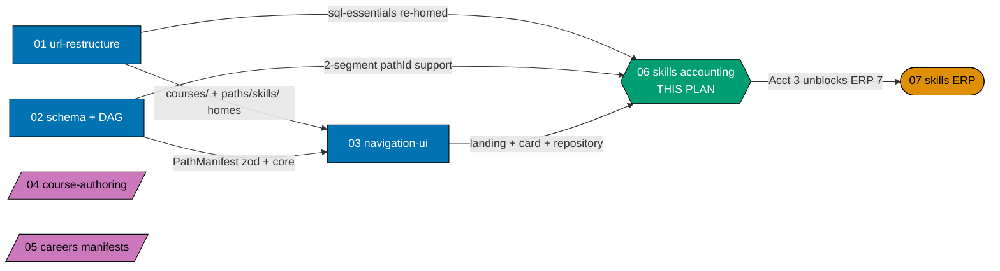
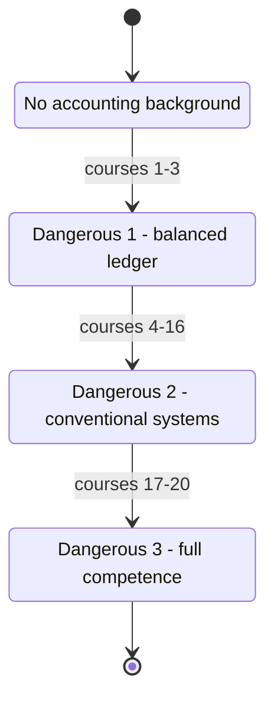
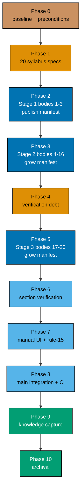

# Skills Path — Accounting for Systems Builders

> **This plan owns one path end-to-end**: `/en/learn/paths/skills/accounting` — its landing content,
> its manifest, and the twenty-course corpus underneath it (syllabus specs **and** authored bodies).
> It creates **no `_index.md`** (plan 01 owns every structural index under `paths/`, per the
> 2026-07-21 A3 ruling) and authors **no ERP content** (plan 07 owns that, and it is `blockedBy` this
> plan).

This is plan **06** of the six-plan `ayokoding-learning-path-*` programme. Plans 01–05 deliver the
`careers/` category and the shared machinery; plans 06 and 07 deliver the `skills/` category, one
subject each. Accounting lands first because **ERP depends on Accounting one-directionally and
nothing in Accounting needs ERP** — see [§Where this plan sits](#where-this-plan-sits).

## The one constraint that shapes everything

**Accounting's characteristic failure mode is silent.**

A trial balance still balances when revenue is recognised in the wrong period, when a lease is
misclassified as an operating cost, or when a murabaha markup is booked as interest income. Unlike
most software domains — where a wrong abstraction fails loudly, at compile time, in a test, or in
production — these mistakes **look correct on the page**. Every total foots. Every control adds up.
The numbers are plausible and substantively wrong.

That single property is why this corpus is shaped the way it is:

- It is why the ramp **slows down after course #3** instead of accelerating. Three courses buy a
  reader a correctly balancing ledger and the three statements — and that competence is exactly what
  makes the next mistakes invisible to them.
- It is why every course from #4 onward carries an explicit **"what still balances while being
  wrong"** section as an authoring requirement, not as optional colour (see
  [tech-docs DD-609](./tech-docs.md#design-decisions)).
- It is why the Sharia stage sits at the **end** rather than being sprinkled through: applying
  conventional accrual/interest models to murabaha, ijara, mudaraba or musharaka is the exact silent
  mistake AAOIFI and PSAK Syariah exist to prevent.

The full statement, with its consequences for personas and acceptance criteria, is in
[prd.md §The silent-failure constraint](./prd.md#the-silent-failure-constraint-the-corpus-shaping-fact).

## Scope

**In scope**

- The path landing **content** at `apps/ayokoding-www/content/en/learn/paths/skills/accounting/_index.md`
  — its copy, its ramp narrative, and its outbound links. _(Content and data only; the landing's
  visual design is owned by `ayokoding-learning-path-03-navigation-ui`. This plan ships no `assets/`
  folder, no mockup, and no render.)_
- The single manifest `apps/ayokoding-www/src/features/course-paths/manifests/skills/accounting.yaml`.
- **20 syllabus specs** under this plan's own `syllabus/courses/` folder — the per-course contract
  layer (id, format, prerequisites, concept enumeration, scope boundary).
- **One path mirror** at `syllabus/paths/manifest-skills-accounting.md` — the human-readable ordering
  the manifest transcribes. The `skills-` prefixed filename is fixed by plan 02's ruling; a bare
  `manifest-accounting.md` is not acceptable.
- **20 course bodies** under `apps/ayokoding-www/content/en/learn/courses/<course-id>/`.
- The three stage-completion signals that unblock `ayokoding-learning-path-07-skills-erp`.

**Out of scope**

- **Any `_index.md` under `paths/`** — `paths/_index.md`, `paths/careers/_index.md`, the three
  `paths/careers/<arc>/_index.md`, and `paths/skills/_index.md` are **all** plan 01's (A3). This plan
  creates its own path-landing bundle only.
- **Any ERP content** — the 20-course ERP corpus, the ERP manifest, and the ERP landing belong to
  `ayokoding-learning-path-07-skills-erp`.
- **Re-authoring any existing library course.** `sql-essentials` and `backend-essentials` are
  **linked**, never re-walked (see [tech-docs DD-602](./tech-docs.md#design-decisions)).
- **The `PathManifest` schema, the `course-paths` core modules, and every rendering component** —
  owned by plans 02 and 03. This plan consumes them.
- **The `careers/` manifests** — owned by `ayokoding-learning-path-05-manifests`. The manifest
  ownership invariant is scoped per category: 05 owns `manifests/careers/`, this plan owns
  `manifests/skills/accounting.yaml`, plan 07 owns
  `manifests/skills/enterprise-resource-planning.yaml`. Neither skills plan writes the other's file.
- **An Indonesian mirror.** `id/belajar/` holds zero courses and zero paths; a manifest over it would
  compose nothing.

## Prior art

_(Repo convention: every promoted plan states what already exists and how it is used.)_

| Prior artefact                                                                      | Size    | Relationship to this plan                                                                                                                                                                                                                                                |
| ----------------------------------------------------------------------------------- | ------- | ------------------------------------------------------------------------------------------------------------------------------------------------------------------------------------------------------------------------------------------------------------------------ |
| `apps/ayokoding-www/content/en/learn/business/accounting.md` [Repo-grounded]        | 34.2 KB | Covers nearly all of course **#1**'s scope via a running example — but is written **for small-business owners, not systems builders**, and never touches schema or data modelling. **A source to mine, not a drop-in body.** Plan 01 relocates it to `legacy/business/`. |
| `apps/ayokoding-www/content/en/learn/business/corporate-finance.md` [Repo-grounded] | 41.1 KB | Adjacent, **not** a source. Corporate finance is valuation and capital structure; this corpus is bookkeeping, recognition, and reporting. No course in this plan re-teaches it, and no course cites it as a prerequisite.                                                |
| The 121-course software-engineering library                                         | —       | **No course duplicates accounting.** Two courses are linked as cross-domain prerequisites (`sql-essentials`, `backend-essentials`); the other twelve library courses named by the research are ERP's edges, not this plan's.                                             |
| `ayokoding-learning-path-05-manifests`                                              | —       | **Structural analogue, not a content source.** This plan matches its file set, gate shape, and Gherkin style; it copies none of its content.                                                                                                                             |

**How `business/accounting.md` is used, concretely** (see
[tech-docs DD-606](./tech-docs.md#design-decisions)): course #1 harvests its **running example** and
its **narrative sequencing** (the order in which a first-time reader meets debits, credits, and the
accounting equation), then discards the small-business-owner register and reframes for a systems
builder. The schema and data-modelling layer the article lacks is **not** back-filled into #1 — it is
course **#2**'s subject. The article is read at authoring time and never transplanted; no paragraph
moves verbatim.

## Where this plan sits

**Accessibility note.** Role is carried by node **shape** (rectangle = upstream, hexagon = this plan,
stadium = downstream, parallelogram = concurrent-with-no-edge) and by every edge's explicit label,
never by colour alone. Fills use the repo's verified colour-blind-friendly palette with black
borders and WCAG-AA-contrasting text, per the
[Color Accessibility Convention](../../../repo-governance/conventions/formatting/color-accessibility.md).

**Two structural facts the diagram encodes, both load-bearing:**

1. **This plan is NOT blocked by `ayokoding-learning-path-04-course-authoring`.** Accounting draws
   exactly **two** prerequisite edges into the software-engineering library — `sql-essentials`
   (course #2) and `backend-essentials` (course #19) — and **both are among the 37 bundles plan 01
   re-homes** [Repo-grounded — both directories are present today under
   `apps/ayokoding-www/content/en/learn/fundamentally-strong/software-engineer/`]. Plan 04 authors
   the other 90 bodies and none of them is on this plan's critical path. This plan therefore runs
   **concurrently** with plans 04 and 05 rather than behind them. See
   [tech-docs DD-605](./tech-docs.md#design-decisions).
2. **ERP #7 is where the hard edge bites, and this plan's first three courses clear it.** ERP
   `record-to-report-systems` (#7) requires Accounting `financial-statements-and-close-cycle` (#3),
   because subledger→GL posting is meaningless without a balanced ledger. ERP #1–4 and Accounting
   #1–3 are parallel-authorable; convergence is only required by ERP's stage 2. Shipping this plan's
   **Stage 1** therefore unblocks most of plan 07's early work — which is why the manifest publishes
   at three courses rather than waiting for twenty.

## The ramp — the spine of this path's pedagogy

Every path under `/en/learn/paths/skills/` is the **immediately-effective** arc, always (R8): get up
and running and become dangerous as fast as possible, then go deeper and deeper, on solid ground.
The arc is constant, which is why it is omitted from the URL — **not** because skills paths lack a
pedagogy. The manifest still records `arc: immediately-effective`.

For this subject the arc has three named boundaries. They come from the research, they are decided,
and they are the structure of both the corpus and this plan's delivery phases.

| Boundary           | After | A reader **can**                                                                                                             | A reader **cannot yet**                                                                                                                                                                           |
| ------------------ | ----- | ---------------------------------------------------------------------------------------------------------------------------- | ------------------------------------------------------------------------------------------------------------------------------------------------------------------------------------------------- |
| **Dangerous 1** ⚡ | #3    | Build a working, correctly balancing ledger; make routine postings; produce the three statements for a simple single entity. | Safely recognise multi-period or variable-consideration revenue (#4), cost inventory (#9), handle capitalisation and leases (#8/#10), consolidate (#11), or support IFRS-and-GAAP together (#12). |
| **Dangerous 2** ⚡ | #16   | Model most conventional systems a mid-size company runs.                                                                     | Build or reason about a Sharia-compliant ledger — conventional accrual/interest models applied to murabaha, ijara, mudaraba or musharaka produce plausible, substantively wrong numbers.          |
| **Dangerous 3** ⚡ | #20   | Full competence across the corpus, including a Sharia-compliant ledger.                                                      | —                                                                                                                                                                                                 |

**#1 alone is standalone-useful** (correct cash-basis hand-posting). **#2 with #1** is
standalone-useful for designing a real ledger schema. This is what makes the arc honest: an early
subset genuinely pays off rather than only making sense end-to-end.

**Note the shape.** The ramp is deliberately **fast then slow** — three courses to first payoff,
thirteen to the second boundary. That is not padding. It is the direct consequence of the
silent-failure property above: the fast start is safe precisely because a hand-built single-entity
ledger fails loudly, and everything after it fails quietly.

## Delivery flow

**Accessibility note.** Every phase carries its number in its own label, so the sequence reads
without colour; fill is a redundant grouping cue only.

| Phase | Closing gate                                                                      |
| ----- | --------------------------------------------------------------------------------- |
| 0     | Three start preconditions hold; baselines recorded green                          |
| 1     | 20 specs exist; every prerequisite edge transcribed; verification markers carried |
| 2     | Manifest live with 3 courses; the first 2-segment `pathId` resolves end-to-end    |
| 3     | Manifest at 16 courses; Stage-2 signal recorded                                   |
| 4     | Zero `[Needs Verification]` items remain open in this folder                      |
| 5     | Manifest at 20 courses; Stage-3 signal recorded                                   |
| 6     | Integrity, prerequisite-consistency, smoothness and ownership sweeps all green    |
| 7     | Landing + ramp verified live at three breakpoints; zero open rule-15 defects      |
| 8     | CI green on `main`; production serves the accounting path                         |
| 9     | Every `learnings.md` entry terminal                                               |
| 10    | Archived; plan 07 is unblocked end-to-end                                         |

**Why the manifest publishes at Phase 2 rather than Phase 5** — three independent reasons, recorded
in [tech-docs DD-603](./tech-docs.md#design-decisions): the immediately-effective arc demands early
payoff; this is the **first 2-segment `pathId` ever instantiated** in the system (plan 02 only
exercises the shape via unit-test fixtures), so publishing early is the architecture smoke test for
the variable-depth ruling; and it emits the Stage-1 signal that unblocks ERP #7 soonest.

> **"2-segment" is descriptive, never an invariant.** `pathId` is variable-depth by design and
> **nothing keys on segment count** — validation is the first-segment literal (`careers` | `skills`)
> plus manifest resolvability. This plan's id is the full slash string `skills/accounting`, with no
> separate `category` field, and every pattern in this plan matches the full id. An unresolvable or
> malformed id is a hard `safeParse` rejection — no coercion, alias, or normalization. Plan 02 owns
> this contract; see
> [tech-docs §`pathId` conformance rules](./tech-docs.md#pathid-conformance-rules-plan-02s-ruling--binding-not-re-derived-here).

## Depends-on

| Direction   | Plan (full folder name)                                  | Strength                                                                                        |
| ----------- | -------------------------------------------------------- | ----------------------------------------------------------------------------------------------- |
| `blockedBy` | `ayokoding-learning-path-01-url-restructure`             | **hard** — the `courses/` namespace, `paths/skills/_index.md`, and the two linked prerequisites |
| `blockedBy` | `ayokoding-learning-path-02-schema-and-prerequisite-dag` | **hard** — `PathManifest` schema with `arc` + variable-depth `pathId` support                   |
| `blockedBy` | `ayokoding-learning-path-03-navigation-ui`               | **hard** — a manifest with no renderer is invisible                                             |
| `blocks`    | `ayokoding-learning-path-07-skills-erp`                  | **soft overall, hard from ERP #7** — see the stage-signal contract below                        |
| _(none)_    | `ayokoding-learning-path-04-course-authoring`            | **no edge** — verified: both linked prerequisites are plan 01's re-homed bundles                |
| _(none)_    | `ayokoding-learning-path-05-manifests`                   | **no edge** — disjoint manifest subtrees; neither is on the other's critical path               |

### Stage-signal contract (the handoff to plan 07)

Plan 07 does not wait for this plan to archive. It consumes three **stage-completion signals**, each
recorded in this plan's `delivery.md` at the closing gate of its authoring phase. Modelled on
`ayokoding-learning-path-04-course-authoring`'s band-completion signal; five fields, same shape.

| Signal      | Emitted at | `LANDED_COURSE_IDS` includes                                                                                                                           | Unblocks in plan 07                               |
| ----------- | ---------- | ------------------------------------------------------------------------------------------------------------------------------------------------------ | ------------------------------------------------- |
| **Stage 1** | Phase 2    | `financial-statements-and-close-cycle`                                                                                                                 | ERP #7 `record-to-report-systems` (the hard edge) |
| **Stage 2** | Phase 3    | `inventory-and-cogs-accounting`, `consolidation-and-multi-entity-accounting`, `audit-controls-and-compliance`, `payroll-and-tax-accounting-essentials` | ERP #8, #13, #14, #15                             |
| **Stage 3** | Phase 5    | `sharia-accounting-and-aaoifi-standards`, `islamic-contract-modeling-for-systems`, `capstone-build-a-general-ledger-system`                            | ERP #19, #20                                      |

An incomplete signal is **rejected** by plan 07 rather than guessed at — the same discipline plan 05
applies to plan 04's band signals. Full field list in
[tech-docs §Stage-signal contract](./tech-docs.md#stage-signal-contract-the-plan-07-handoff).

## Verification status carried forward (never laundered)

The research seeding this plan marked only **three** items `[Verified]`. Everything else is
search-summarised `[Unverified]`, and two items are `[Needs Verification]`. Those markers travel into
this plan's own documents as **open items with named primary sources and named resolution steps** —
they are not restated as fact anywhere, and Phase 4 exists to close them before the Sharia stage is
authored.

| ID       | Status                 | Item                                                                                                                                          | Resolves in                      |
| -------- | ---------------------- | --------------------------------------------------------------------------------------------------------------------------------------------- | -------------------------------- |
| **OI-1** | `[Needs Verification]` | Indonesian PSAK numbering — "PSAK 59 / SIFAS 101-109" vs "PSAK 101-110"                                                                       | Phase 4                          |
| **OI-2** | `[Needs Verification]` | Riba doctrinal basis — currently Wikipedia-sourced only, not a primary source                                                                 | Phase 4                          |
| **OI-3** | `[Unverified]`         | The three-jurisdiction model claim beyond the three fetched indexes                                                                           | Phase 4                          |
| **OI-4** | open, cross-plan       | Plan 02's doc-level "a path may omit a prerequisite only if it omits every course that needs it" rule vs this plan's link-don't-walk manifest | Phase 0 (routed, not fixed here) |

Full detail, primary sources, and the exact resolution steps:
[tech-docs §Open verification items](./tech-docs.md#open-verification-items-oi-1-through-oi-4).

**Also non-negotiable in the content**: there is **no single "Sharia accounting standard."** Three
structurally different jurisdictional models coexist — AAOIFI (Bahrain), PSAK Syariah (Indonesia,
which uses AAOIFI as a **basis**, not an adoption), and MFRS plus Bank Negara Malaysia's Shariah
Governance Policy 2019. **Malaysia is not on AAOIFI's mandatory-adoption list.** The three Sharia
courses (17, 18 and 20) present three models; a course presenting AAOIFI as "the" standard would be
wrong.

**The 20-course count is curriculum judgment, not a sourced fact** [Judgment call]. It is labelled as
such everywhere it appears, including in the catalog table itself.

## Delivery Mode: worktree-to-pr

`worktree-to-pr` — the repo default, declared explicitly. Work in
`worktrees/ayokoding-learning-path-06-skills-accounting/`, open a draft PR per phase (and per course
sub-phase) against `main`, run the PR-Review Maker→Fixer Cycle (3 sequential CI-gated cycles), then
`[AI]` merges once every quality gate is green. `ayokoding-www` deploys to `prod-ayokoding-www` after
each merge. See [delivery.md](./delivery.md#delivery-mode-worktree-to-pr) for the `## Worktree` and
`## Delivery Mode` declarations and the per-phase integration protocol.

## Navigation

- [Business Requirements (brd.md)](./brd.md) — why accounting is its own path, why it lands before
  ERP, and what "done" means in business terms.
- [Product Requirements (prd.md)](./prd.md) — the silent-failure constraint, personas, user stories,
  the Gherkin acceptance criteria, and product scope.
- [Technical Docs (tech-docs.md)](./tech-docs.md) — the 20-course catalog, the DAG join, the landing
  content contract, the open verification items, the design decisions, and the UI/API gate postures.
- [Delivery Checklist (delivery.md)](./delivery.md) — the eleven-phase executable checklist.
- [Learnings (learnings.md)](./learnings.md) — knowledge-capture running log.
- [Verification Log (verification-log.md)](./verification-log.md) — the grep-checkable ledger for the
  four carried open items (OI-1 through OI-4).
- `syllabus/courses/` and `syllabus/paths/` — created by Phase 1; the 20 per-course specs and the
  `manifest-skills-accounting.md` path mirror this plan authors and owns.
