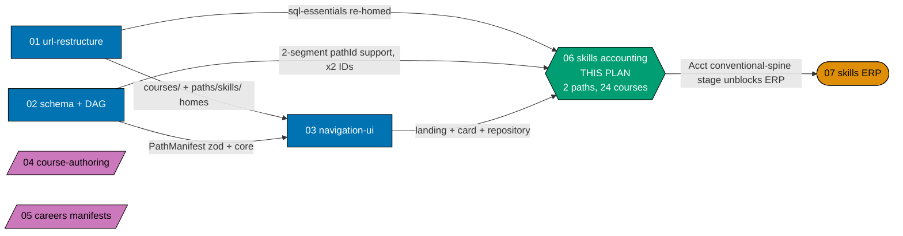
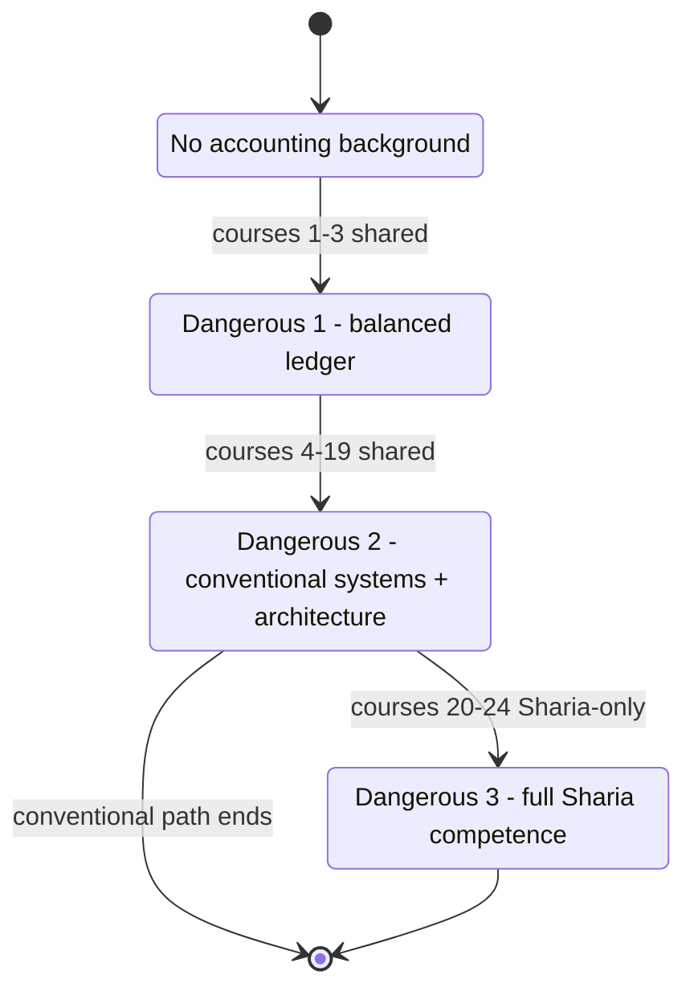
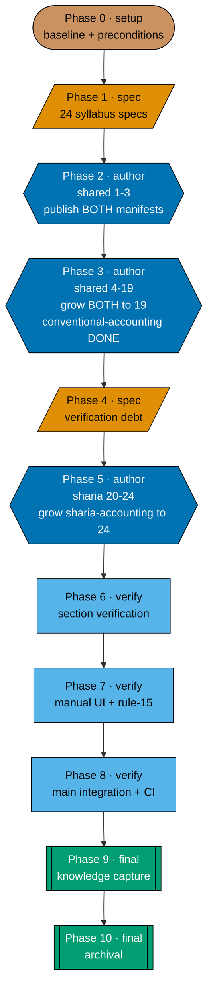

# Skills Paths — Accounting for Systems Builders

> **This plan owns two paths end-to-end**: `/en/learn/paths/skills/conventional-accounting` and
> `/en/learn/paths/skills/sharia-accounting` (A10) — their landing content, their two manifests, and
> the twenty-four-course corpus underneath them (syllabus specs **and** authored bodies). It creates
> **no `_index.md`** (plan 01 owns every structural index under `paths/`, per the 2026-07-21 A3
> ruling) and authors **no ERP content** (plan 07 owns that, and it is `blockedBy` this plan).

This is plan **06** of the seven-plan `ayokoding-learning-path-*` programme. Plans 01–05 deliver the
`careers/` category and the shared machinery; plans 06 and 07 deliver the `skills/` category, one
subject each. Accounting lands first because **ERP depends on Accounting one-directionally and
nothing in Accounting needs ERP** — see [§Where this plan sits](#where-this-plan-sits).

> **Programme decisions** — this plan cites the shared `R*`/`A*` decision ids (`A6`, `A8`, `A9`, `A10`,
> `A11`, `A12`, and so on) throughout; their definitions and the wave DAG now live locally in
> [tech-docs.md §Programme decisions](./tech-docs.md#programme-decisions) (folded from the retired
> shared programme file), not in this file.

## Prior art

_(Repo convention: every promoted plan states what already exists and how it is used.)_

| Prior artefact                                                                                                                                                                                                    | Size    | Relationship to this plan                                                                                                                                                                                                                                                                                                                                                                                           |
| ----------------------------------------------------------------------------------------------------------------------------------------------------------------------------------------------------------------- | ------- | ------------------------------------------------------------------------------------------------------------------------------------------------------------------------------------------------------------------------------------------------------------------------------------------------------------------------------------------------------------------------------------------------------------------- |
| `apps/ayokoding-www/content/en/learn/business/accounting.md` [Repo-grounded — verified at this path, 35,055 bytes] → moves to `content/en/legacy/business/accounting.md` [Planned — depends on plan 01, unmerged] | 34.2 KB | Covers nearly all of course **#1**'s scope via a running example — but is written **for small-business owners, not systems builders**, and never touches schema, data modelling, multi-currency, or Sharia treatment. **A source to mine, not a drop-in body.** Plan 01 relocates it to `legacy/business/`; until that plan merges, the file is only at the `learn/` path, so cite the current path when mining it. |
| `apps/ayokoding-www/content/en/learn/business/corporate-finance.md` [Repo-grounded]                                                                                                                               | 41.1 KB | Adjacent, **not** a source. Corporate finance is valuation and capital structure; this corpus is bookkeeping, recognition, and reporting. No course in this plan re-teaches it or cites it as a prerequisite.                                                                                                                                                                                                       |
| The 121-course software-engineering library                                                                                                                                                                       | —       | **No course duplicates it.** Two courses link it as a cross-domain prerequisite (`sql-essentials`, `backend-essentials`); no other library course is cited.                                                                                                                                                                                                                                                         |
| `ayokoding-learning-path-05-manifests`                                                                                                                                                                            | —       | **Structural analogue, not a content source.** This plan matches its file set and gate shape; it copies none of its content.                                                                                                                                                                                                                                                                                        |
| The original single-path `skills/accounting` design (pre-A10/A6/A8/A9 rewrite)                                                                                                                                    | —       | **The direct predecessor of this rewrite.** Its twenty-course catalog, ramp reasoning, and stage-signal mechanism are the baseline this document restates, corrects, and extends — see [§Why two paths](#why-two-paths-not-one-a10--a11) and [tech-docs §What changed](./tech-docs.md#what-changed-from-the-original-twenty-course-single-path-catalog-and-why).                                                    |

**How `business/accounting.md` is used, concretely** (see [tech-docs DD-626](./tech-docs.md#design-decisions)):
course #1 harvests its **running example** and its **narrative sequencing** (the order in which a
first-time reader meets debits, credits, and the accounting equation), then discards the
small-business-owner register and reframes for a systems builder. The schema and data-modelling
layer the article lacks is **not** back-filled into #1 — it is course **#2**'s subject. The article is
read at authoring time and never transplanted; no paragraph moves verbatim.

## Why two paths, not one (A10 + A11)

A single `skills/accounting` path cannot honestly serve both readers this domain has: the systems
builder who will never touch a Sharia contract, and the systems builder building specifically for
Bahrain, Indonesia or Malaysia. Bundling both into one path either pads the conventional reader with
material they will never use, or — worse — buries the Sharia depth as an optional tail nobody
reaches. **A10** splits the corpus into two paths instead:

- **`/en/learn/paths/skills/conventional-accounting`** — the conventional spine alone, nineteen
  courses, terminal in itself.
- **`/en/learn/paths/skills/sharia-accounting`** — **the same nineteen courses plus five
  Sharia-specific ones**, twenty-four courses total. **Both paths cover all the basics.** A reader
  entering `sharia-accounting` cold gets the full grounding — it is never an add-on module that
  assumes the conventional path.

**A11 governs how, and it is the schema's existing rule, not a new mechanism.** Plan 02's own
`tech-docs.md` already establishes that manifest uniqueness is scoped **per manifest**, not globally,
and that every manifest references course bodies **by ID** — never by copy:

> Citations anchor on the **quoted phrase**, not a line number — plan 02 is now archived under
> `plans/done/`; citing by quoted phrase rather than a line number stays the safer anchor if the
> archived file is ever amended. `grep -F` each quoted string against
> `plans/done/2026-07-24__ayokoding-learning-path-02-schema-and-prerequisite-dag/tech-docs.md` to locate it.

- _"No course ID appears twice **within one manifest**"_ [Repo-grounded —
  `ayokoding-learning-path-02-schema-and-prerequisite-dag/tech-docs.md`, locate via
  `grep -F 'No course ID appears twice'`] — the scope is per-manifest, so the same ID may appear in
  both this plan's manifests.
- _"No course body is duplicated per path (all manifests reference courses **by ID**, never copy a
  body)"_ [Repo-grounded — same file, locate via `grep -F 'No course body is duplicated'`].
- _"One body cannot encode four orders; moving order to the manifest [is what enables the shared
  library]"_ [Repo-grounded — same file, DD-1, locate via
  `grep -F 'One body cannot encode four orders'`].

So the nineteen shared courses are **authored once**, under `<COURSES>`, exactly as every other
course in the library is. `sharia-accounting.yaml`'s `courseOrder` **interleaves** the shared IDs
with the five Sharia-specific IDs into one ordered array — the array mixes two authored-once pools
into a single sequence rather than the manifest forking a second copy of any body. See
[tech-docs §Two manifests, nineteen shared courses](./tech-docs.md#two-manifests-nineteen-shared-courses-a10--a11)
for the full mechanics, and [tech-docs DD-601](./tech-docs.md#design-decisions) for why "interleave"
resolves to shared-then-Sharia ordering rather than mid-ramp alternation — the silent-failure
reasoning that put the Sharia stage at the end of the old single path survives the split unchanged.

**Never duplicate a course file to serve two paths.** A duplicated file desyncs silently: an edit to
one copy that is never propagated to the other produces two courses that answer the same question
differently, and nothing in the toolchain would catch it — the checkers validate each file in
isolation, and there is no cross-file consistency gate for prose. Reference by ID is the only safe
mechanism, and it is also the cheaper one: nineteen bodies are authored, not thirty-eight.

## No building — architecture, not construction (A6)

`A6` draws a line between **founding** an implementation and **building** one. This plan teaches to
the founding depth and stops there:

- **In scope**: double-entry mechanics, the subledger-to-general-ledger relationship, costing methods,
  period close, document state machines, posting rules, and the failure modes each produces.
  Architecture is domain knowledge here — a course may describe **how** a ledger system is
  architected.
- **Out of scope**: **building** it. No capstone that constructs a system, no "implement X" exercise,
  no scaffolded codebase the reader extends.

Two courses in the original research seed — `capstone-build-a-general-ledger-system` and
`capstone-sharia-compliant-ledger` — asked the reader to build. Both are **deleted**. In their place,
two architecture courses that teach the same domain knowledge **without** the build instruction:
`general-ledger-system-architecture` (conventional, closes the shared spine) and
`sharia-ledger-system-architecture` (Sharia-specific, closes the Sharia stage). Both carry the same
linked cross-domain prerequisites the deleted capstones carried — see
[tech-docs §The twenty-four-course catalog](./tech-docs.md#the-twenty-four-course-catalog).

## The one constraint that shapes everything

**Accounting's characteristic failure mode is silent.**

A trial balance still balances when revenue is recognised in the wrong period, when a lease is
misclassified as an operating cost, or when a murabaha markup is booked as interest income. Unlike
most software domains — where a wrong abstraction fails loudly, at compile time, in a test, or in
production — these mistakes **look correct on the page**. Every total foots. Every control adds up.
The numbers are plausible and substantively wrong.

That single property is why this corpus is shaped the way it is:

- It is why the ramp **slows down after course #3** instead of accelerating. Three courses buy a
  reader a correctly balancing ledger and the three statements — and that competence is exactly what
  makes the next mistakes invisible to them.
- It is why every course from #4 onward carries an explicit **"what still balances while being
  wrong"** section as an authoring requirement, not as optional colour (see
  [tech-docs DD-609](./tech-docs.md#design-decisions)).
- It is why the Sharia stage sits at the **end** of the `sharia-accounting` path rather than being
  sprinkled through: applying conventional accrual/interest models to murabaha, ijara, mudaraba or
  musharaka is the exact silent mistake AAOIFI and PSAK Syariah exist to prevent.

The full statement, with its consequences for personas and acceptance criteria, is in
[prd.md §The silent-failure constraint](./prd.md#the-silent-failure-constraint-the-corpus-shaping-fact).

## Scope

**In scope**

- The two path landing **contents** at
  `apps/ayokoding-www/content/en/learn/paths/skills/conventional-accounting/_index.md` and
  `…/paths/skills/sharia-accounting/_index.md` — copy, ramp narrative, and outbound links.
  _(Content and data only; visual design is owned by `ayokoding-learning-path-03-navigation-ui`. This
  plan ships no `assets/` folder, no mockup, and no render.)_
- **Two manifest data files** —
  `apps/ayokoding-www/src/features/course-paths/manifests/skills/conventional-accounting.yaml` and
  `…/manifests/skills/sharia-accounting.yaml` — **plus each manifest's own co-located unit test**.
  Each manifest-owning plan owns its manifests and their tests (2026-07-21 ruling, extended here to
  two files within one plan — see [tech-docs DD-602](./tech-docs.md#design-decisions)).
- One shared Gherkin feature file (a Scenario Outline with two Examples rows, one per path) and its
  one step-definition file (see [tech-docs §File Impact](./tech-docs.md#file-impact)).
- **Twenty-four syllabus specs** under this plan's own `syllabus/courses/` folder — the per-course
  contract layer, now carrying an explicit **module/topic breakdown** an author can write from
  without re-deriving scope (see [§Syllabus layer](#syllabus-layer-new-requirement)).
- **Two path mirrors** at `syllabus/paths/manifest-skills-conventional-accounting.md` and
  `syllabus/paths/manifest-skills-sharia-accounting.md`.
- **Twenty-four course bodies** under `apps/ayokoding-www/content/en/learn/courses/<course-id>/` —
  nineteen shared, five Sharia-specific.
- The stage-completion signals that unblock `ayokoding-learning-path-07-skills-erp`, now expressed at
  **stage granularity** rather than ERP course numbers — see
  [§The 06→07 dependency edge](#the-0607-dependency-edge-stage-granularity-not-course-numbers).

**Out of scope**

- **Any `_index.md` under `paths/`** — `paths/_index.md`, `paths/careers/_index.md`, the three
  `paths/careers/<arc>/_index.md`, and `paths/skills/_index.md` are **all** plan 01's (A3). This plan
  creates its own two path-landing bundles only.
- **Any ERP content** — the ERP corpus, its manifest(s), and its landing(s) belong to
  `ayokoding-learning-path-07-skills-erp`.
- **Re-authoring any existing library course.** `sql-essentials` and `backend-essentials` are
  **linked**, never re-walked (see [tech-docs DD-603](./tech-docs.md#design-decisions)).
- **The `PathManifest` schema, the `course-paths` core modules, and every rendering component** —
  owned by plans 02 and 03. This plan consumes them.
- **The `careers/` manifests** — owned by `ayokoding-learning-path-05-manifests`.
- **An Indonesian mirror.** `id/belajar/` holds zero courses and zero paths.
- **Any building exercise, capstone, or scaffolded codebase** (A6) — see above.

## Syllabus layer (new requirement)

Every one of the twenty-four courses now carries a syllabus with an explicit **concept/worked-example
breakdown** — not just a spec's top matter and prerequisites, but the enumerated concepts (`co-NN`)
and worked examples (`ex-NN`) an author can write from directly. **The file shape itself is inherited
from `ayokoding-learning-path-02-schema-and-prerequisite-dag`'s 121 existing `syllabus/courses/*.md`
files, not invented here** — same header fields, same section names and order, same
problem-before-solution framing (see [tech-docs DD-627](./tech-docs.md#design-decisions)), adapted for
a non-code, no-build domain: no `Language` field, and no `Capstone spec` section (A6 forbids a build
exercise at any granularity; each course carries `Applied synthesis (no build — A6)` instead). This
plan authors its own corpus inside its own folder — `syllabus/courses/<course-id>.md` per course,
`syllabus/paths/manifest-skills-*.md` for the two path mirrors — per `A3`'s ownership split, rather
than editing plan 02's custody-frozen corpus. See
[tech-docs §Syllabus layer](./tech-docs.md#syllabus-layer--custody-and-shape) for the required section
shape and [§Verification](#verification-status-carried-forward-never-laundered) below for how each
concept's placement claims are marked.

**Every syllabus is authored first, confirmed second (A12).** Each syllabus is written from domain
reasoning and this plan's own grounding file **before** any external research touches it. Only after a
syllabus exists does Phase 1 dispatch `web-researcher`, and only to check **coverage** — what a
practitioner would expect that is missing, what is present that the field does not recognise — never
to supply or correct the syllabus's structure, module order, or wording. A concept or worked example
asserted on domain-reasoning grounds rather than sourced from the seeding research is marked `[Needs
Verification]` so the coverage pass has something concrete to confirm or refute; a vague concept
cannot be checked either way. See
[tech-docs §Programme decisions — A12](./tech-docs.md#programme-decisions).

## Licensing (A8) — read before authoring any standards content

**IAI (Indonesia) is the strictest of the four bodies this corpus touches — it forbids reproduction
or translation with no educational exception at all.** AAOIFI is free to read but has no published
permission-to-reproduce policy (treated as closed). **No public-domain chart of accounts exists
anywhere** — every chart of accounts in this corpus is originally authored. Full posture table, the
eleven safe-authoring rules, and the _Baker v. Selden_ basis for why domain reimplementation is
lawful: [tech-docs §Licensing and IP Compliance](./tech-docs.md#licensing-and-ip-compliance-a8).

## Where this plan sits

**Accessibility note.** Role is carried by node **shape** (rectangle = upstream, hexagon = this plan,
stadium = downstream, parallelogram = concurrent-with-no-edge) and by every edge's explicit label,
never by colour alone. Fills use the repo's verified colour-blind-friendly palette with black
borders and WCAG-AA-contrasting text, per the
[Color Accessibility Convention](../../../repo-governance/conventions/formatting/color-accessibility.md).

**Two structural facts the diagram encodes, both load-bearing:**

1. **This plan is NOT blocked by `ayokoding-learning-path-04-course-authoring`.** Accounting draws
   exactly **two** prerequisite edges into the software-engineering library — `sql-essentials`
   (`chart-of-accounts-and-data-modeling`) and `backend-essentials`
   (`general-ledger-system-architecture`) — and **both are among the 37 bundles plan 01 re-homes**
   [Repo-grounded — both directories present today under
   `apps/ayokoding-www/content/en/learn/fundamentally-strong/software-engineer/`]. This plan therefore
   runs **concurrently** with plans 04 and 05 rather than behind them.
2. **ERP is where the hard edge bites, and this plan's first three courses clear it — same as
   before the split.** The Dangerous-1 boundary (courses #1–#3) is shared by both paths and lands in
   Phase 2, unchanged by the two-path restructuring.

## The ramp — the spine of both paths' pedagogy

Every path under `/en/learn/paths/skills/` is the **immediately-effective** arc, always (R8). For
this subject the arc has boundaries that now differ by path, because `conventional-accounting`
terminates where `sharia-accounting` continues:

| Boundary           | After | Path(s)                                              | A reader **can**                                                                                                      | A reader **cannot yet**                                                                                                                                                                                |
| ------------------ | ----- | ---------------------------------------------------- | --------------------------------------------------------------------------------------------------------------------- | ------------------------------------------------------------------------------------------------------------------------------------------------------------------------------------------------------ |
| **Dangerous 1** ⚡ | #3    | both                                                 | Build a working, correctly balancing ledger; make routine postings; produce the three statements for a single entity. | Safely recognise multi-period revenue, cost inventory, handle leases, consolidate, or translate multi-currency balances.                                                                               |
| **Dangerous 2** ⚡ | #19   | both (`conventional-accounting` **terminates here**) | Model most conventional systems a mid-size company runs, **and architect (not build) a general-ledger system**.       | Build or reason about a Sharia-compliant ledger — conventional accrual/interest models applied to murabaha, ijara, mudaraba, musharaka, zakah or sukuk produce plausible, substantively wrong numbers. |
| **Dangerous 3** ⚡ | #24   | `sharia-accounting` only                             | Full competence across both corpora, including architecting (not building) a Sharia-compliant ledger.                 | —                                                                                                                                                                                                      |

**#1 alone is standalone-useful** (correct cash-basis hand-posting). **#1 + #2** is standalone-useful
for designing a real ledger schema. **The whole `conventional-accounting` path is standalone-useful
at #19** — it is not a truncated on-ramp to the Sharia path, it is a complete, shippable product in
its own right, and its manifest **stops growing** at that point while `sharia-accounting`'s continues.

## Delivery flow

**Accessibility note.** Phase category is carried by node **shape** (stadium = setup, parallelogram =
spec, hexagon = authoring, rectangle = verification, subroutine = finalisation) and is additionally
named **in each label's text**, never by colour alone. Fills use the repo's verified
colour-blind-friendly palette with black borders and WCAG-AA-contrasting text, per the
[Color Accessibility Convention](../../../repo-governance/conventions/formatting/color-accessibility.md).

| Phase | Closing gate                                                                                                                  |
| ----- | ----------------------------------------------------------------------------------------------------------------------------- |
| 0     | Three start preconditions hold; baselines recorded green                                                                      |
| 1     | 24 specs exist, each with a module/topic breakdown; every prerequisite edge transcribed                                       |
| 2     | Both manifests live with 3 shared courses; the first 2-segment `pathId`s resolve end-to-end; Stage-1 signal recorded          |
| 3     | Both manifests at 19 IDs; **`conventional-accounting` is DONE and production-serving** (Stage 2 carries no cross-plan signal) |
| 4     | Every `[Needs Verification]` marker still standing is registered with a reason in `verification-log.md` (zero _unregistered_) |
| 5     | `sharia-accounting` at 24 IDs; Stage-3 signal recorded                                                                        |
| 6     | Integrity, prerequisite-consistency, licensing, smoothness and ownership sweeps all green                                     |
| 7     | Both landings + ramp verified live at three breakpoints; zero open rule-15 defects                                            |
| 8     | CI green on `main`; production serves both accounting paths                                                                   |
| 9     | Every `learnings.md` entry terminal                                                                                           |
| 10    | Archived; plan 07 is unblocked end-to-end                                                                                     |

## The 06→07 dependency edge (stage granularity, not course numbers)

The original single-path plan expressed the handoff to plan 07 as `UNBLOCKS_ERP_COURSES: 7` (and
similar course-number lists). **This rewrite invalidates that mapping twice over**: plan 06's own
course numbers moved (A9's expansion, A6's capstone removal), and plan 07 will undergo the identical
A9 expansion when it is rewritten, invalidating whatever ERP course numbers this plan cited. **Course
numbers do not survive either plan's renumbering; stage names do.** The stage-signal contract
therefore now names the **ERP capability stage** a given accounting stage unblocks — described
functionally (e.g. "the ERP stage delivering subledger-to-GL posting / record-to-report capability")
rather than by an ERP course number this plan has no authority to assert, since plan 07 has not yet
been rewritten and its post-rewrite stage names are not this plan's to invent. Full mechanics:
[tech-docs §Stage-signal contract](./tech-docs.md#stage-signal-contract-the-plan-07-handoff-stage-granularity).

## Depends-on

| Direction   | Plan (full folder name)                                  | Strength                                                                                        |
| ----------- | -------------------------------------------------------- | ----------------------------------------------------------------------------------------------- |
| `blockedBy` | `ayokoding-learning-path-01-url-restructure`             | **hard** — the `courses/` namespace, `paths/skills/_index.md`, and the two linked prerequisites |
| `blockedBy` | `ayokoding-learning-path-02-schema-and-prerequisite-dag` | **hard** — `PathManifest` schema with `arc` + variable-depth `pathId` support, x2 manifests     |
| `blockedBy` | `ayokoding-learning-path-03-navigation-ui`               | **hard** — a manifest with no renderer is invisible                                             |
| `blocks`    | `ayokoding-learning-path-07-skills-erp`                  | **soft overall, hard at the record-to-report stage** — stage-granularity contract, see above    |
| _(none)_    | `ayokoding-learning-path-04-course-authoring`            | **no edge** — verified: both linked prerequisites are plan 01's re-homed bundles                |
| _(none)_    | `ayokoding-learning-path-05-manifests`                   | **no edge** — disjoint manifest subtrees; neither is on the other's critical path               |

## Verification status carried forward (never laundered)

The 2026-07-22 `web-researcher` grounding run **resolves OI-1** (the operative Indonesian series is
PSAK 101-110, not PSAK 59) and **confirms the core of OI-3** (Malaysia is absent from AAOIFI's
mandatory-adoption list; Indonesia uses AAOIFI as a basis, not an adoption). **OI-2 (the riba
doctrinal basis) remains OPEN** — only secondary sources were located, and A4 forbids restating it as
fact. Full status ledger, with sources and access dates: [verification-log.md](./verification-log.md).

## Delivery Mode: worktree-to-pr

`worktree-to-pr` — the repo default, declared explicitly. Sequential phases work in the base
worktree `worktrees/ayokoding-learning-path-06-skills-accounting/`; each parallel course-authoring
leaf gets **its own** worktree (strict 1 PR ↔ 1 worktree — git allows one branch per worktree, so
concurrent course PRs cannot share one). PRs open at **delivery boundaries**, not every phase: each
course (Phases 2, 3, 5), each manifest-growth TDD cycle, and each landing-authoring sub-phase is its
own delivery unit with its own draft PR against `main`. Phases 1, 4, 6 and 7 are intermediate — they
commit to the base worktree's branch without opening a PR of their own — and fold forward into the
plan's one final-integration delivery unit, which Phase 8 pushes and opens as a draft PR, Phases 9-10
commit into, and Phase 10's `[AI]` merge closes. Phase 0 is setup/baseline and opens none. Every
delivery-unit PR runs the PR-Review Maker→Fixer Cycle (3 sequential CI-gated cycles) before its
`[AI]` merge, once every quality gate is green. `ayokoding-www` deploys to `prod-ayokoding-www` after
each merge that lands app content. See [delivery.md](./delivery.md#delivery-mode-worktree-to-pr) for
the `## Worktree` and `## Delivery Mode` declarations,
[delivery.md §Delivery Boundaries](./delivery.md#delivery-boundaries) for the full phase-to-PR
mapping, and the per-merge integration protocol.

## Navigation

- [Business Requirements (brd.md)](./brd.md) — why accounting splits into two paths, why it lands
  before ERP, and what "done" means in business terms.
- [Product Requirements (prd.md)](./prd.md) — the silent-failure constraint, personas, user stories,
  the Gherkin acceptance criteria, and product scope for both paths.
- [Technical Docs (tech-docs.md)](./tech-docs.md) — the twenty-four-course catalog, the two-manifest
  mechanics, the licensing posture, the DAG join, the landing content contracts, the open
  verification items, the design decisions, and the UI/API gate postures.
- [Delivery Checklist (delivery.md)](./delivery.md) — the eleven-phase executable checklist.
- [Learnings (learnings.md)](./learnings.md) — knowledge-capture running log.
- [Verification Log (verification-log.md)](./verification-log.md) — the grep-checkable ledger for the
  four carried open items (OI-1 through OI-4).
- `syllabus/courses/` and `syllabus/paths/` — created by Phase 1; the 24 per-course specs (each with
  a module/topic breakdown) and the two `manifest-skills-*.md` path mirrors this plan authors and
  owns.
