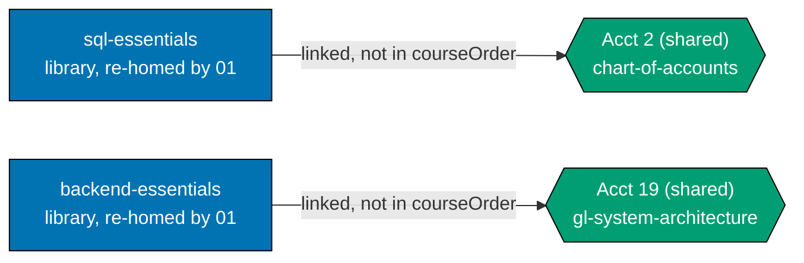
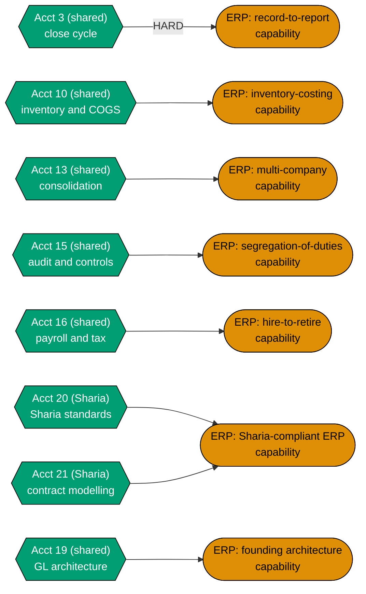
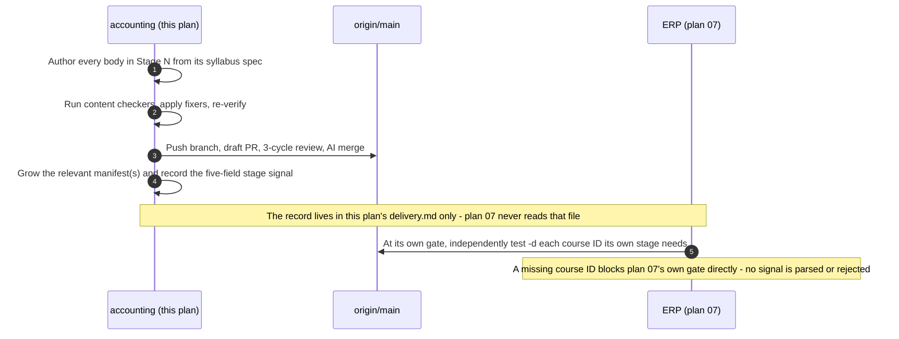
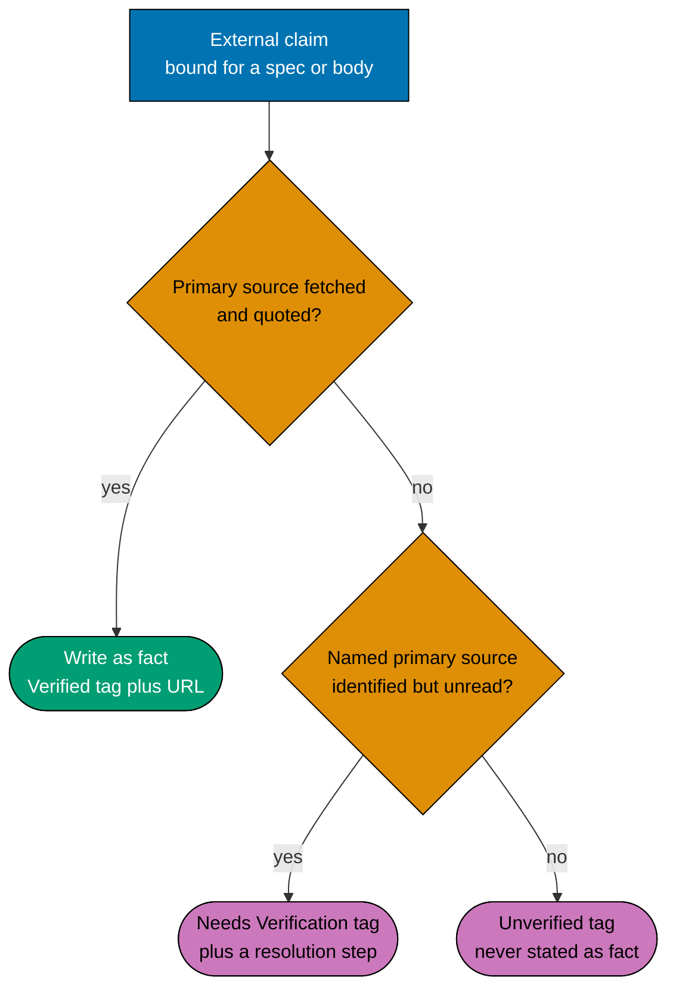

# Technical Documentation — Skills Paths: Accounting

## Corpus Disposition

`archive-with-plan` — this plan custodies its own `syllabus/` corpus and no consumer **outside
`plans/`** reads it (no checker, agent, Nx target, build/generation step, or shipped content
front-matter names a syllabus path). The corpus therefore moves to `plans/done/` with the plan folder
on archival; the promotion trigger (name a non-plan reader) is not met. See
[Learning-Plan Syllabus Convention §Corpus Disposition](../../../repo-governance/conventions/structure/learning-plan-syllabus.md#corpus-disposition).

## Overview

This plan delivers **two** `skills/` paths end-to-end (A10): a nineteen-course conventional spine
shared by both, and a five-course Sharia-specific extension exclusive to `sharia-accounting` —
twenty-four authored bodies total (A9). It is the **first non-software-engineering subject** on the
platform, the **first pair of 2-segment `pathId`s** ever instantiated, and the **first instance of one
course belonging to two manifests** in the programme.

It touches **no application code**. Its artefacts are markdown page bundles under
`apps/ayokoding-www/content/`, two YAML data files under
`apps/ayokoding-www/src/features/course-paths/manifests/skills/`, and twenty-four markdown spec files
inside this plan folder. Every component, resolver, schema, and route it depends on is built by
plans 01–03 and consumed here.

## The manifest ownership invariant (scoped to two data files, one plan)

The programme's manifest-ownership invariant is scoped **per category**, and within `skills/` it is
scoped **per plan** — this plan owns **two** data files, both under its own subject subtree, plus
each manifest's co-located unit test:

| Plan | Owns                                                                                                                                                                                                                                      | Never writes                                                                                         |
| ---- | ----------------------------------------------------------------------------------------------------------------------------------------------------------------------------------------------------------------------------------------- | ---------------------------------------------------------------------------------------------------- |
| 05   | `manifests/careers/**` (four files)                                                                                                                                                                                                       | anything under `manifests/skills/`                                                                   |
| 06   | `manifests/skills/conventional-accounting.yaml` + `conventional-accounting-manifest.unit.test.ts`, **and** `manifests/skills/sharia-accounting.yaml` + `sharia-accounting-manifest.unit.test.ts` (**this plan** — exactly two data files) | `manifests/careers/**`, `manifests/skills/conventional-erp.yaml`, `manifests/skills/sharia-erp.yaml` |
| 07   | `manifests/skills/conventional-erp.yaml`, `manifests/skills/sharia-erp.yaml`                                                                                                                                                              | `manifests/careers/**`, either accounting manifest                                                   |

**No plan among 05, 06 and 07 creates an `_index.md` under `paths/`.** Every structural index —
`paths/_index.md`, `paths/careers/_index.md`, the three `paths/careers/<arc>/_index.md`, and
`paths/skills/_index.md` — belongs to `ayokoding-learning-path-01-url-restructure` (A3 ruling,
2026-07-21). Both path **landings** (`paths/skills/conventional-accounting/_index.md` and
`paths/skills/sharia-accounting/_index.md`) are this plan's; the **bucket** they sit in is not.

**Consequence this plan must design for, not discover** (A3): `paths/skills/_index.md` renders
**empty** between plan 01's landing and this plan's Phase 2 publishing the first skills manifest.
That empty state is real and user-visible, and **plan 03 owns designing it**. This plan does not
paper over it, does not create a placeholder index, and does not treat it as a defect of its own.

## Two manifests, nineteen shared courses (A10 + A11)

**A11 is the schema's existing rule, not a new mechanism this plan invents.** Plan 02's own
`tech-docs.md` already establishes exactly the invariants this design needs:

> Citations below anchor on the **quoted phrase**, not a line number. Plan 02 is unmerged and under
> active edit, so any line number cited here goes stale without warning; `grep -F` the quoted string
> against `plans/done/2026-07-24__ayokoding-learning-path-02-schema-and-prerequisite-dag/tech-docs.md` to
> locate each.

- _"No course ID appears twice **within one manifest**"_ [Repo-grounded —
  `ayokoding-learning-path-02-schema-and-prerequisite-dag/tech-docs.md`, locate via
  `grep -F 'No course ID appears twice'`]. The uniqueness constraint is **per manifest**. The same ID
  appearing in both `conventional-accounting.yaml` and `sharia-accounting.yaml` violates nothing.
- _"No course body is duplicated per path (all manifests reference courses **by ID**, never copy a
  body)"_ [Repo-grounded — same file, locate via `grep -F 'No course body is duplicated'`].
  Reference-by-ID across manifests is already mandatory, not optional.
- _"One body cannot encode four orders; moving order to the manifest [is what enables the shared
  library]"_ [Repo-grounded — same file, DD-1, locate via
  `grep -F 'One body cannot encode four orders'`]. Order is a manifest property; the same body can
  sit at position 5 in one manifest's `courseOrder` and be entirely absent from another's.

**Consequence**: the nineteen shared courses (`ACCT_SHARED`, catalog #1–#19) are authored **once**,
under `<COURSES>`, exactly like every other library course. `conventional-accounting.yaml`'s
`courseOrder` is those nineteen IDs. `sharia-accounting.yaml`'s `courseOrder` is those **same**
nineteen IDs, in the same order, followed by the five Sharia-specific IDs (`ACCT_S3`, catalog
\#20–#24). No file under `<COURSES>` is ever written twice.

**"Interleaves" resolves to shared-then-Sharia composition, not mid-ramp alternation — a decision,
stated explicitly** (see [DD-601](#design-decisions)). A10's own wording says the Sharia path's
`courseOrder` "interleaves shared and Sharia-specific ids rather than duplicating files." Read as
composition mechanics — an array built by combining IDs from two different authored-once pools — this
is exactly what shared-then-Sharia ordering does: the array is not homogeneous, it interleaves two
provenances into one sequence. Read as a pedagogical instruction to scatter Sharia content through
the conventional spine, it would contradict the load-bearing silent-failure argument that put the
Sharia stage at the end of the original single path (see
[prd.md §The silent-failure constraint](./prd.md#the-silent-failure-constraint-the-corpus-shaping-fact)),
an argument A10/A11 neither mention nor override. This plan adopts the composition-mechanics reading.

## Path constants

- `<COURSES>` = `apps/ayokoding-www/content/en/learn/courses/` — course bundles; served at
  `/en/learn/courses/<course-id>` _(created by plan 01)_
- `<PATHS>` = `apps/ayokoding-www/content/en/learn/paths/` — path landings; served at
  `/en/learn/paths/<path-id>` _(created by plan 01)_
- `<LANDING_CA>` = `<PATHS>skills/conventional-accounting/` — this plan's first content home outside
  `<COURSES>`
- `<LANDING_SA>` = `<PATHS>skills/sharia-accounting/` — this plan's second
- `<FEAT>` = `apps/ayokoding-www/src/features/course-paths/` _(created by plans 02 and 03)_
- `<MANIFESTS>` = `<FEAT>manifests/` — YAML data files, nested to mirror slash path IDs
- `<MANIFEST_CA>` = `<MANIFESTS>skills/conventional-accounting.yaml`
- `<MANIFEST_SA>` = `<MANIFESTS>skills/sharia-accounting.yaml`
- `<MTEST_CA>` = `<MANIFESTS>skills/conventional-accounting-manifest.unit.test.ts`
- `<MTEST_SA>` = `<MANIFESTS>skills/sharia-accounting-manifest.unit.test.ts` — both match the vitest
  `unit` project's `**/*.unit.{test,spec}.{ts,tsx}` include [Repo-grounded —
  `apps/ayokoding-www/vitest.config.ts`] and are excluded from the coverage denominator by that
  config's `**/*.{test,spec}.{ts,tsx}` exclude. **Not shared with any sibling plan**: plan 05 owns
  the `careers/` test(s), plan 07 owns the ERP one(s) (2026-07-21 ruling, extended here to two files
  within one plan — see [DD-602](#design-decisions))
- `<PLANDIR>` = this plan's folder — `plans/backlog/ayokoding-learning-path-06-skills-accounting/`
  today, `plans/in-progress/…` once promoted for execution, `plans/done/YYYY-MM-DD__…` after Phase 10.
  [delivery.md §Path constants](./delivery.md#path-constants) carries the shell block that detects the
  current stage and re-derives every dependent constant in one command
- `<SPEC>` = `<PLANDIR>syllabus/courses/` — this plan's own 24-file spec layer, each carrying a
  module/topic breakdown _(see [DD-603](#design-decisions) and [§Syllabus layer](#syllabus-layer--custody-and-shape))_
- `<SPECPATHS>` = `<PLANDIR>syllabus/paths/` — this plan's own path mirrors, holding exactly
  `manifest-skills-conventional-accounting.md` and `manifest-skills-sharia-accounting.md`
- `<DELIVERY>` = `<PLANDIR>delivery.md` — named through the constant, never as a bare `delivery.md`
- Path IDs: **`skills/conventional-accounting`** and **`skills/sharia-accounting`** — full slash
  strings, category segment included, no separate `category` field. Arc: `immediately-effective` on
  both, a required manifest field, recorded as data and omitted from the URL. **Nothing keys on
  segment count** — see [§`pathId` conformance rules](#pathid-conformance-rules-plan-02s-ruling--binding-not-re-derived-here).

## The twenty-four-course catalog

`(SWE)` marks a **linked** cross-domain prerequisite into the existing software-engineering library —
linked, never walked ([DD-604](#design-decisions)). **Shared** means the course is authored once and
referenced by both manifests. **Sharia** means the course exists only in `sharia-accounting.yaml`.

> **The count of twenty-four is curriculum judgment, not a sourced fact** [Judgment call], as is the
> partition into nineteen-shared-plus-five-Sharia and the three-stage grouping. What is sourced is the
> dependency structure and the domain facts each course teaches (see each course's syllabus at
> `<SPEC>`); the packaging is an editorial decision. Every module/topic claim inside a syllabus that
> is not directly sourced from the seeding research is marked `[Needs Verification]` there, not here —
> this table states IDs, formats, prerequisites, and stage only.

| #   | Course ID                                      | Manifest    | Format            | Prerequisites                    | Stage |
| --- | ---------------------------------------------- | ----------- | ----------------- | -------------------------------- | ----- |
| 1   | `accounting-foundations`                       | shared      | By Example        | —                                | 1     |
| 2   | `chart-of-accounts-and-data-modeling`          | shared      | By Example        | 1, `sql-essentials` (SWE)        | 1     |
| 3   | `financial-statements-and-close-cycle`         | shared      | By Example        | 2                                | 1     |
| 4   | `journal-entries-and-posting-mechanics`        | shared      | By Example        | 3                                | 2     |
| 5   | `accrual-accounting-and-revenue-recognition`   | shared      | By Example        | 4                                | 2     |
| 6   | `accounts-payable-and-procure-to-pay`          | shared      | By Example        | 4                                | 2     |
| 7   | `accounts-receivable-and-order-to-cash`        | shared      | By Example        | 4, 5                             | 2     |
| 8   | `managerial-and-cost-accounting`               | shared      | By Example        | 3                                | 2     |
| 9   | `fixed-assets-and-depreciation`                | shared      | By Example        | 2                                | 2     |
| 10  | `inventory-and-cogs-accounting`                | shared      | By Example        | 2, 8                             | 2     |
| 11  | `lease-and-intangible-asset-accounting`        | shared      | By Example        | 9                                | 2     |
| 12  | `multi-currency-accounting-and-fx-translation` | shared      | By Example        | 3                                | 2     |
| 13  | `consolidation-and-multi-entity-accounting`    | shared      | By Example        | 3, 2, 12                         | 2     |
| 14  | `financial-reporting-standards-ifrs-vs-gaap`   | shared      | Annotated-concept | 5, 11                            | 2     |
| 15  | `audit-controls-and-compliance`                | shared      | Annotated-concept | 3                                | 2     |
| 16  | `payroll-and-tax-accounting-essentials`        | shared      | By Example        | 2                                | 2     |
| 17  | `treasury-and-cash-management`                 | shared      | By Example        | 6, 7                             | 2     |
| 18  | `financial-reporting-and-xbrl`                 | shared      | Annotated-concept | 14                               | 2     |
| 19  | `general-ledger-system-architecture`           | shared      | By Example        | 2, 3, `backend-essentials` (SWE) | 2     |
| 20  | `sharia-accounting-and-aaoifi-standards`       | Sharia only | Annotated-concept | 5, 14                            | 3     |
| 21  | `islamic-contract-modeling-for-systems`        | Sharia only | By Example        | 20, 2                            | 3     |
| 22  | `zakah-computation-and-reporting-for-systems`  | Sharia only | By Example        | 21                               | 3     |
| 23  | `sukuk-and-islamic-capital-markets-accounting` | Sharia only | Annotated-concept | 21, 12                           | 3     |
| 24  | `sharia-ledger-system-architecture`            | Sharia only | By Example        | 21, 19                           | 3     |

**Format counts**: 19 By Example, 5 Annotated-concept. Each maps to an existing maker/checker/fixer
agent trio (`apps-ayokoding-www-by-example-*`, `apps-ayokoding-www-annotated-concept-*`)
[Repo-grounded — all six agent files verified present under `.claude/agents/`].

**The ramp order is a valid topological order** for every prerequisite edge above — every numbered
prerequisite of course _n_ is a course with a lower number, so `courseOrder` in catalog order (the
first 19 rows for `conventional-accounting.yaml`; all 24 for `sharia-accounting.yaml`) satisfies
`checkPrerequisiteConsistency` by construction. Verified by inspection of the table; re-checked
mechanically at every phase gate.

**No course ID collides with an existing library course** and no ID is a substring of another, which
is what makes the alternation-grep acceptance clauses in `delivery.md` sound.

### What changed from the original twenty-course single-path catalog, and why

- **Deleted (A6)**: `capstone-build-a-general-ledger-system`, `capstone-sharia-compliant-ledger` —
  both asked the reader to build a system.
- **Added, replacing the deleted capstones' domain knowledge without the build instruction**:
  `general-ledger-system-architecture` (carries the same `backend-essentials` (SWE) linked edge the
  deleted conventional capstone carried) and `sharia-ledger-system-architecture` (the Sharia
  equivalent).
- **Added to the shared spine (A9)**: `journal-entries-and-posting-mechanics` (posting-rule mechanics
  the original catalog implied but never taught as its own subject) and
  `multi-currency-accounting-and-fx-translation` (a real domain gap — the original catalog named
  consolidation, which cannot be taught honestly without FX translation, but never taught FX
  translation itself).
- **Added to the Sharia stage (A9)**: `zakah-computation-and-reporting-for-systems` (AAOIFI FAS 9 is
  `[Verified]` in the seeding research; the original corpus never taught it) and
  `sukuk-and-islamic-capital-markets-accounting` (AAOIFI FAS 32–34 are `[Verified]`; also never
  taught).
- **Unchanged in identity**: every other course ID, its format, and its position relative to its own
  prerequisites.

## Syllabus layer — custody and shape

This plan's syllabus layer follows the same folder convention
`ayokoding-learning-path-02-schema-and-prerequisite-dag` already established for custodied
human-readable mirrors (`syllabus/paths/manifest-*.md`), applied inside this plan's own folder rather
than a new structure. **The per-course file shape is inherited from plan 02's 121 existing
`syllabus/courses/*.md` files, not invented here** (DD-627) — same header fields, same section names
and order, same problem-before-solution framing, so the accounting corpus reads as one corpus with
the careers corpus rather than forking the format.

| Half             | Location                                                                                                   | Contents                                                                                                  |
| ---------------- | ---------------------------------------------------------------------------------------------------------- | --------------------------------------------------------------------------------------------------------- |
| Per-course specs | `<SPEC>`                                                                                                   | 24 `<course-id>.md` files plus a folder `README.md`                                                       |
| Path mirrors     | `<SPECPATHS>manifest-skills-conventional-accounting.md`, `<SPECPATHS>manifest-skills-sharia-accounting.md` | The human-readable orderings this plan transcribes into `<MANIFEST_CA>` / `<MANIFEST_SA>`'s `courseOrder` |

**Path ids inside every spec use the canonical prefixed form from the start** — `skills/conventional-accounting`
or `skills/sharia-accounting`, never a bare subject slug. Plan 02's 121 existing course specs still
carry stale un-prefixed ids in their "In which paths" sections; this plan does not edit them and does
not add to that debt.

Each per-course spec is one `<course-id>.md` file, sectioned exactly as plan 02's own files are, in
the same order, adapted for a non-code domain (DD-627):

- **H1 + top matter** — `# <Title> (<Format>)` and a `**Course ID**` / `**Format**` line. No
  `**Language**` field — plan 02's files carry one because every careers course is language-scoped;
  nothing in this corpus is. A short summary and scope note follow, in prose, exactly as plan 02's
  files carry them.
- **`## Why this exists · the big idea`** — three bullets, verbatim in shape from plan 02: **the
  problem before the solution**, **keep-this-if-you-forget-everything**, and **big ideas touched**
  (citing this plan's own fixed five-token vocabulary — see DD-627 — the accounting-corpus analogue of
  plan 02's `taming-state` / `abstraction-and-its-cost` cross-cutting themes).
- **`## Prerequisites`** — prior courses (including any linked `(SWE)` edge) and assumed knowledge.
- **`## Accuracy notes`** — every claim this course depends on that is dated, standard-specific, or
  jurisdiction-specific, carried with its `[Verified]` / `[Unverified]` / `[Needs Verification]` tag
  from the grounding file or `verification-log.md`; where nothing beyond stable, decades-old domain
  mechanics is asserted, this section says so explicitly rather than being silently dropped.
- **`## Concepts`** — the `co-NN` enumeration plan 02 uses, one 1:1-numbered bullet per concept, floor
  ≥ 8 (scaled from plan 02's ≥ 10 — see DD-627 on why). Concepts are **domain knowledge and
  architecture, never build exercises** (A6 stays in force at concept granularity, not just course
  granularity — a concept phrased as "implement a posting engine" is as much a violation as a whole
  course would be).
- **`## Worked examples`** — `ex-NN`, each citing the `co-NN` it exercises and closing on an explicit
  **verify** clause. By Example courses use plan 02's Beginner/Intermediate/Advanced bands; the five
  Annotated-concept courses (#14, #15, #18, #20, #23) use plan 02's themed grouping instead, per its
  own convention for that format. Because this corpus has no runnable code, "verify" means **recompute
  by hand or in a spreadsheet and compare against a stated expected figure**, not "run and observe
  output" — the domain-appropriate reading of the same instruction plan 02's code-verify clauses give.
- **No `## Capstone spec` section.** Plan 02's inherited Capstone Policy (its own DD-27: a full
  runnable intra-topic capstone per course) is **deliberately not inherited here** — A6 forbids a
  build exercise at any granularity. In its place: **`## Applied synthesis (no build — A6)`** — one
  integrative worked scenario that traces a single transaction or scenario through several of the
  course's concepts to a checkable numeric or classificatory outcome, without asking the reader to
  build, scaffold, or extend any software. See DD-627 for the full DD-15/DD-27 reconciliation.
- **`## Read more`** — 2–3 real, citable sources (textbooks, official standard-body pages), nominative
  citation only, matching plan 02's own `## Read more` shape and the A8/A12 no-reproduction rule.
- **`## In which paths`** — replaces the top-matter "which manifest(s)" field with plan 02's own
  bottom-of-file convention: one line per consuming manifest (`conventional-accounting`,
  `sharia-accounting`), each stating its stage and a short thematic label.
- **Scope boundary** and **silent failure modes** (for every course from #4 onward) are folded into
  `## Why this exists · the big idea` and `## Accuracy notes` respectively rather than kept as
  separate headings plan 02's format does not have — content unchanged, placement conformed.

**Post-authoring verification (A12-compliant)**: every syllabus is **authored first**, from domain
reasoning and this plan's own grounding file — never from an external curriculum. Only **after** a
syllabus exists does Phase 1 dispatch `web-researcher`, and only to check **coverage**: what a
practitioner would expect that the draft omits, and what it includes that the field does not
recognise. A coverage finding is actionable only as "add/remove this concept"; it is never actionable
as "reorder to match theirs," and no syllabus is rewritten to mirror an external curriculum's module
titles or sequence. Naming a body as corroboration ("this appears in ASCM's CPIM body of knowledge")
is nominative use and is fine; the syllabus text itself never transcribes one. A syllabus with vague
concept or worked-example descriptions cannot be checked for coverage either way and is itself a
Phase 1 finding. See [§Programme decisions — A12](#programme-decisions)
for the full rule this section implements.

## Licensing and IP Compliance (A8)

**`A8` binds the whole seven-plan programme, not only this plan** — see
[§Programme decisions — A8](#programme-decisions)
for the canonical, programme-wide statement (code examples, documentation prose, figures, book/course
structure, trademarks, datasets). What follows is this plan's own **specialization** of that rule for
the accounting/Sharia-accounting standards bodies specifically — it restates nothing the programme
doc already states generally.

**Strict clean-room licensing binds every course in both paths.** No standards text, proprietary
schema, or copyleft code is ever reproduced; every concept is restated in original words citing
number and title only.

**Relationship to `DD-15`** (inherited via plan 02's course corpus under `syllabus/courses/`,
originating in the closed `fundamentally-strong-software-engineer` plan). `DD-15` is "License-aware
technology choices" — when a course names a real tool, it explains that tool's current license and
the free/teachable option it drives (the Redis→SSPL, Akka→BSL precedent). That is a
**different axis** from this section: `DD-15` governs which **third-party tools** are safe to name
and teach; this section (and `A8`) governs whether **this corpus's own teaching material** may
reproduce a **standards body's** copyrighted text. Both apply together wherever this corpus names
real accounting software — `general-ledger-system-architecture` and
`sharia-ledger-system-architecture` extend `DD-15`'s
precedent rather than re-deriving a rule: ledger-cli (BSD-3-Clause) and Apache Fineract (Apache-2.0)
are named as permissively-licensed examples; GnuCash (GPLv2+), hledger (GPLv3), and Beancount
(GPL-2.0-only) are described behaviourally, never quoted from. `DD-27` (plan 02's inherited Capstone
Policy) is the one FS-SE-origin decision this plan explicitly does **not** inherit — see
[DD-627](#design-decisions).

### Posture per body

| Body            | Posture                                                                                                                                                                            |
| --------------- | ---------------------------------------------------------------------------------------------------------------------------------------------------------------------------------- |
| IFRS Foundation | **The most open of the four, but narrowly so** — see the correction note below. Its own designated teaching materials are reproducible under conditions; the Standards text is not |
| AAOIFI          | Free to **read**; **no published permission-to-reproduce policy** — treated as closed                                                                                              |
| IAI (Indonesia) | **Strictest of the four — no educational exception at all.** Terms forbid reproduction or translation                                                                              |
| MASB, FASB      | Closed copyright                                                                                                                                                                   |

**What the IFRS Foundation actually permits** `[Verified, 2026-07-22]`. The Foundation publishes its
**own designated training materials** — for example its IFRS for SMEs modules — which **recognised
institutions of higher learning** may reproduce under **attribution and non-commercial** conditions.
That permission does **not** extend to the **IFRS Standards text itself**: reproducing, translating,
editing or distributing the Standards, in whole or in part, still requires a **separate permission or
licence**. Sources:
[ifrs.org/use-around-the-world/adoption-and-copyright/](https://www.ifrs.org/use-around-the-world/adoption-and-copyright/),
[ifrs.org/legal/education-material-licensing/](https://www.ifrs.org/legal/education-material-licensing/).

> **Correction note (2026-07-22).** Earlier revisions of this table, and the "Read more" sections of
> six courses, described the IFRS Foundation as carrying an "explicit free-educational-use carve-out."
> That **overstated the permission** by eliding the distinction between the Foundation's own free
> teaching material and the copyrighted Standards text. The **directional conclusion was and remains
> correct** — the IFRS Foundation is meaningfully more open than AAOIFI or IAI — only the mechanism
> cited to justify it was wrong. **No conduct in this corpus was ever non-compliant**: every affected
> course already recorded "no clause text reproduced," so the cite-number-and-title-never-quote
> posture (`A8`) held throughout regardless of the faulty justification.

**No public-domain chart of accounts exists anywhere.** [Verified, 2026-07-22 grounding run]. Every
chart of accounts that appears in this corpus — course #2 onward — is **originally authored**, never
copied from any textbook, standard, or reference implementation.

### The eleven safe-authoring rules (bind every course in this plan)

1. Restate concepts in original words; never reproduce standards text, tables, or clause numbering
   layouts.
2. Cite standard number + title + official link; quote nothing.
3. Never translate a standard.
4. Author every chart of accounts, worked example and dataset originally.
5. Reference implementations: prefer permissive (ledger-cli BSD-3-Clause, Apache Fineract
   Apache-2.0); describe copyleft projects (GnuCash GPLv2+, hledger GPLv3, Beancount GPL-2.0-only)
   behaviourally rather than quoting their code.
6. Never paste code from a copyleft codebase, in any quantity.
7. Use vendor names nominatively only — never in a title or path segment.
8. Screenshots of proprietary software are out.
9. Carry `[Verified]` / `[Unverified]` / `[Needs Verification]` markers verbatim into course
   frontmatter or body where a claim depends on them.
10. Where a doctrinal claim rests on secondary sources only (OI-2), say so in the course.
11. When in doubt between describing and reproducing, describe.

### The _Baker v. Selden_ basis — why domain reimplementation is lawful

- **17 U.S.C. §102(b)** and **EU Directive 2009/24/EC Art. 1(2)** both exclude ideas, procedures,
  processes and systems from copyright. Learning how a system works and reimplementing it is not
  infringement.
- **_Baker v. Selden_** (101 U.S. 99, 1879) is **directly on point — it concerned a bookkeeping
  system.** The Court held the system itself unprotectable even though the book describing it was
  protected. This is the strongest authority for this corpus's posture, and it is the reason
  `general-ledger-system-architecture` and `sharia-ledger-system-architecture` can teach how a ledger
  system is architected in detail without infringing any accounting-software vendor's copyright — the
  **system** (double-entry mechanics, posting rules, document state machines) is the unprotectable
  layer; only a vendor's **particular expression** of it (its actual source code, its actual UI) is
  protected, and this corpus never reproduces either.
- Short identifiers such as table and field names fall outside copyright per **Copyright Office
  Circular 34** (names, titles and short phrases are not protected) — a chart-of-accounts account
  code like `1100` or a field name like `posting_date` carries no copyright on its own.
- The genuinely contested zone is **non-literal structural copying**, tested under **_Computer
  Associates v. Altai_** abstraction-filtration-comparison. Because A6 removes all building from the
  corpus, the corpus never approaches this zone — there is no codebase this corpus produces that
  could be compared structurally against a vendor's.
- **_Google v. Oracle_** did **not** hold APIs uncopyrightable — it decided on fair use and assumed
  copyrightability arguendo. This corpus does not cite it for the broader proposition.

### Trademarks

SAP, Oracle, NetSuite, QuickBooks, Xero and similar accounting-software vendors are trademarks.
Nominative reference ("how a ledger system like the one behind common ERP suites models a
subledger-to-GL relationship") is fine; using a vendor name in a course title, path name, or product
name is not, and no course in this corpus does.

### Where this binds mechanically

Phase 1's syllabus authoring records each course's licensing-sensitive sources (which standard
numbers it cites, whether it references any reference implementation) so Phase 6's licensing reading
audit has a concrete list to check against rather than re-deriving it from twenty-four bodies cold.
See [delivery.md Phase 6](./delivery.md#phase-6-section-and-app-verification) for the audit step.

## The ramp and its stages (per path)

| Stage | Courses | Boundary           | Path(s)                                              | Delivery phase | Reader outcome                                                                                       |
| ----- | ------- | ------------------ | ---------------------------------------------------- | -------------- | ---------------------------------------------------------------------------------------------------- |
| 1     | #1–#3   | **Dangerous 1** ⚡ | both                                                 | Phase 2        | Working, correctly balancing ledger; routine postings; three statements, single entity               |
| 2     | #4–#19  | **Dangerous 2** ⚡ | both — `conventional-accounting` **terminates here** | Phase 3        | Most conventional systems a mid-size company runs, plus how to architect (not build) a ledger system |
| 3     | #20–#24 | **Dangerous 3** ⚡ | `sharia-accounting` only                             | Phase 5        | Full competence, including how to architect (not build) a Sharia-compliant ledger                    |

**Standalone-useful subsets**, unchanged in kind from the original single-path design:

- **#1 alone** — correct cash-basis hand-posting.
- **#1 + #2** — designing a real ledger schema.
- **#1–#3** — the first genuinely dangerous point.
- **The whole `conventional-accounting` path (#1–#19)** — a complete, shippable competence in its own
  right, not a truncated on-ramp.

**Why the ramp is fast then slow.** Unchanged: a hand-built single-entity ledger fails **loudly**;
everything after it fails **quietly** (see
[prd.md §The silent-failure constraint](./prd.md#the-silent-failure-constraint-the-corpus-shaping-fact)).

### Landing content contract — what each landing must convey

Each of the two landings states, in prose, before any rendered course list: (1) its arc promise,
stated once, with no arc chooser; (2) every ramp boundary its manifest has reached so far, each naming
both the capability the boundary confers and the limit the reader has not yet cleared;
(3) `sharia-accounting`'s landing additionally states the **path-choice affordance** distinguishing it
from `conventional-accounting`, so a reader lands on the correct path deliberately rather than by
guessing; and (4) the two linked cross-domain prerequisites (`sql-essentials`, `backend-essentials`),
linked at their canonical `/en/learn/courses/<id>` URLs once each course carrying the linked edge is
authored. The **rendered course list itself is never hand-listed in the landing** — it is rendered by
plan 03's component from the loaded manifest, so "before the list" means the landing's prose ends
before that render slot. See [DD-611](#design-decisions) for the ownership split (this plan states the
contract; plan 03 owns the rendering) and
[delivery.md Phase 2 §2.3](./delivery.md#23--both-landings-content--maker-checker-fixer-not-tdd) /
[Phase 5 §5.3](./delivery.md#53--update-the-sharia-accounting-landing-to-reflect-all-three-stages) for
where each landing is authored and grown.

## How accounting joins the library DAG

**Ruling: it joins, as a near-disjoint leaf cluster with exactly two inbound edges and zero outbound
edges into software engineering** — unchanged from the original single-path finding; the split does
not add or remove a cross-domain edge, because both linked prerequisites sit in the **shared** spine
(#2 and #19), reachable identically from either manifest.



**Accessibility note.** Domain is carried by node **shape** (rectangle = existing library course,
hexagon = accounting course) and by every edge's explicit label, never by colour alone.

Three properties follow:

1. **Two inbound edges only, both in the shared spine** — reachable from both manifests, authored
   once. Both source courses are among plan 01's **37 re-homed bundles** [Repo-grounded — both
   directories present today under
   `apps/ayokoding-www/content/en/learn/fundamentally-strong/software-engineer/`], which is why this
   plan carries **no dependency on `ayokoding-learning-path-04-course-authoring`** ([DD-605](#design-decisions)).
2. **Zero outbound edges into software engineering.** No existing library course gains an accounting
   prerequisite from either path.
3. **The accounting subgraph is internally dense and externally sparse.** 22 of the 24 courses have
   only in-domain prerequisites.

The outbound direction — accounting into ERP — is now named by **ERP capability**, not ERP course
number, because plan 07 has not yet undergone its own A9 rewrite and any course number this plan
cited would be invalidated the moment it does:



**Accessibility note.** Plan ownership is carried by node **shape** (hexagon = this plan, stadium =
plan 07); the one hard edge carries an explicit `HARD` label rather than relying on styling.

**The hard edge is `Acct 3 → ERP's record-to-report capability`.** Subledger-to-GL posting is
meaningless without a balanced ledger. Every other edge is a soft ordering preference. This is the
whole reason Stage 1 publishes before Stages 2 and 3 exist, and it is unchanged by the two-path
split, since course #3 sits in the shared spine reachable at the same point from either manifest.

## Link, do not walk (the cross-domain composition rule)

Unchanged in mechanism from the original single-path design ([DD-604](#design-decisions)): neither
manifest's `courseOrder` contains `sql-essentials` or `backend-essentials`. Both are **linked** —
declared in the dependent course's `prerequisites:` frontmatter, surfaced on that course's page by
plan 03's prerequisite display, and linked from **both** landings.

## Manifest format

```yaml
# apps/ayokoding-www/src/features/course-paths/manifests/skills/conventional-accounting.yaml
pathId: skills/conventional-accounting
arc: immediately-effective
title: "Conventional Accounting for Systems Builders"
description: "Build a ledger that balances, then learn the mistakes that still balance — the complete conventional path."
courseOrder:
  - accounting-foundations
  - chart-of-accounts-and-data-modeling
  - financial-statements-and-close-cycle
  # … grows to 19 at Stage 2, then STOPS — this manifest never grows again …
```

```yaml
# apps/ayokoding-www/src/features/course-paths/manifests/skills/sharia-accounting.yaml
pathId: skills/sharia-accounting
arc: immediately-effective
title: "Sharia-Compliant Accounting for Systems Builders"
description: "Every basic the conventional path teaches, plus murabaha, ijara, mudaraba, musharaka, zakah and sukuk modelled correctly."
courseOrder:
  - accounting-foundations
  - chart-of-accounts-and-data-modeling
  - financial-statements-and-close-cycle
  # … the SAME 16 remaining shared IDs as the conventional manifest, in the same order, growing to 19 at Stage 2 …
  # … then 5 Sharia-specific IDs, growing to 24 at Stage 3 …
```

Six properties both manifests must hold, each asserted at a gate:

1. **`pathId` is the FULL slash string, category segment included** — `skills/conventional-accounting`
   or `skills/sharia-accounting`, exactly that. Never a bare subject slug, never a separate
   `category` field.
2. **`arc` is a separate required field, present and set to `immediately-effective`** on both.
3. **Every `courseOrder` entry is a plain course-ID string.** No `{ id, framing }` mappings
   ([DD-606](#design-decisions)).
4. **Neither manifest's `courseOrder` contains `sql-essentials` or `backend-essentials`.**
5. **The first 19 entries of `sharia-accounting.yaml`'s `courseOrder` are byte-identical, in order,
   to the entirety of `conventional-accounting.yaml`'s `courseOrder`.** This is the mechanical
   expression of "shared, authored once, referenced by both."
6. **`conventional-accounting.yaml` does not change after Phase 3.** Its terminal state is 19 IDs;
   any later phase touching it is itself a defect.

### `pathId` conformance rules (plan 02's ruling — binding, not re-derived here)

Unchanged from the original single-path design: variable-depth by design, validation on the
first-segment literal plus resolvability, no clause anywhere in this plan keys on segment count, and
an unresolvable or malformed id is a hard `safeParse` rejection. See
[delivery.md §Path constants](./delivery.md#path-constants) for the full restated rule; this plan now
has **two** ids exercising the 2-segment shape instead of one, which strengthens rather than weakens
the smoke test.

### Syllabus mirror filenames (plan 02's ruling — binding, extended for two paths)

`manifest-skills-conventional-accounting.md` and `manifest-skills-sharia-accounting.md`, both
carrying the `skills-` category marker.

## Stage-signal contract (the plan-07 handoff, stage granularity)

**This record is a human/audit-readable handoff note, not a machine contract** — unchanged in kind
from the original design. What changed is the **vocabulary of the `UNBLOCKS_ERP_*` field**:

**The original single-path plan named ERP courses by number** (`UNBLOCKS_ERP_COURSES: 7`). **This
rewrite invalidates that mapping twice over**: this plan's own course numbers moved (A9's expansion,
A6's capstone removal), and plan 07 will undergo the identical A9 expansion when it is rewritten,
invalidating whatever ERP course numbers this plan might have cited fresh. **Course numbers do not
survive either plan's renumbering; stage names and capability descriptions do.** The field is
therefore renamed `UNBLOCKS_ERP_CAPABILITY` and its value is a short functional description, not a
number:



**Five fields, all required**:

| Field                     | Meaning                                                                                                       |
| ------------------------- | ------------------------------------------------------------------------------------------------------------- |
| `STAGE`                   | `1` or `3` — **only these two are ever recorded**; see the Stage-2 note below                                 |
| `PLAN`                    | `ayokoding-learning-path-06-skills-accounting`                                                                |
| `LANDED_COURSE_IDS`       | Every accounting course ID authored in this stage                                                             |
| `UNBLOCKS_ERP_CAPABILITY` | A functional description of the ERP capability this stage clears — **never** an ERP course number (see below) |
| `MERGED_COMMIT`           | A real 40-character SHA on `origin/main`, checkable with `git cat-file -e`                                    |

**Values for `UNBLOCKS_ERP_CAPABILITY`, one per stage** — deliberately descriptive rather than a
citation of plan 07's stage names, since plan 07 has not been rewritten and its post-rewrite stage
titles are not this plan's to assert:

- **Stage 1**: "the ERP stage delivering subledger-to-GL posting and record-to-report capability
  (the hard edge)"
- **Stage 2**: "the ERP stages delivering inventory-costing, multi-company/consolidation,
  hire-to-retire/payroll, and segregation-of-duties/security capability — and the whole
  `conventional-accounting` path is complete at this point"
- **Stage 3**: "the ERP stages delivering Sharia-compliant ERP capability and founding-architecture
  capability"

> **Stage 2 emits no recorded signal — the table above gives its capability wording for completeness
> only.** Stage 2 is the `conventional-accounting`-completion milestone, which is internal to this
> plan: it hands plan 07 nothing that Stage 1 did not already clear, so there is no cross-plan
> handoff to record. `delivery.md` therefore contains exactly **two** `STAGE:` blocks — `STAGE: 1`
> (end of Phase 2) and `STAGE: 3` (end of Phase 5) — and Phase 8's final confirmation asserts exactly
> that. Do not read the three-row list above as a promise of three recorded signals; a `STAGE: 2`
> block appearing in `delivery.md` would be a defect, not a completion.

**Recording format (grep-checkable — mirrors the OI-line convention).** Record the five fields as
their own paragraph in `delivery.md`, each field name anchored at **column 0**, outside any table,
bullet, or blockquote — never as a bulleted sub-list, a table row, or an inline-code span. Literal
shape, shown once for Stage 1:

```
STAGE: 1
PLAN: ayokoding-learning-path-06-skills-accounting
LANDED_COURSE_IDS: accounting-foundations, chart-of-accounts-and-data-modeling, financial-statements-and-close-cycle
UNBLOCKS_ERP_CAPABILITY: the ERP stage delivering subledger-to-GL posting and record-to-report capability (the hard edge)
MERGED_COMMIT: <40-character SHA>
```

## Open verification items (OI-1 through OI-4)

The 2026-07-22 `web-researcher` grounding run **resolves OI-1** and **confirms the core of OI-3**.
**OI-2 remains OPEN** — A4 forbids restating it as fact regardless.

### The rule every authoring step follows



### The four items

| ID       | Status                                                                                                | Claim at risk                                                                                                                                                                                                                                                                                                                                                                                                                                                                                                                                                                       | Named primary source                                                                                                                                              | Blocks                                                        |
| -------- | ----------------------------------------------------------------------------------------------------- | ----------------------------------------------------------------------------------------------------------------------------------------------------------------------------------------------------------------------------------------------------------------------------------------------------------------------------------------------------------------------------------------------------------------------------------------------------------------------------------------------------------------------------------------------------------------------------------- | ----------------------------------------------------------------------------------------------------------------------------------------------------------------- | ------------------------------------------------------------- |
| **OI-1** | `RESOLVED`                                                                                            | **Indonesian PSAK numbering.** Resolved by the 2026-07-22 grounding run: the operative series is **PSAK 101-110**; **PSAK 59 is superseded**. The exact PPSAK ratification date for PSAK 101 remains **unconfirmed** and is tracked as OI-1's residual, **not** as a `[Needs Verification]` marker in any course — course #20 cites the **series** and never a date, so there is no unverified published claim to mark. See [verification-log §Not registered here](./verification-log.md).                                                                                         | IAI's published PSAK Syariah standard list (`iaiglobal.or.id`), re-confirmed 2026-07-22.                                                                          | Was course #17 (original numbering); now course #20 authoring |
| **OI-2** | `OPEN`                                                                                                | **Riba doctrinal basis.** Still sourced only from Wikipedia, not a primary source. **A4 forbids restating this as fact regardless of any other resolution in this rewrite.**                                                                                                                                                                                                                                                                                                                                                                                                        | An **AAOIFI Shari'ah Standard** or an **IFSB publication** — not yet fetched.                                                                                     | Course #20 authoring                                          |
| **OI-3** | `RESOLVED` (adoption-relationship claim; governance minutiae beyond it remain re-verify-at-authoring) | **Three-jurisdiction adoption relationship.** Confirmed by the 2026-07-22 grounding run: **Malaysia is not on AAOIFI's mandatory-adoption list**; MASB standards are IFRS-converged with Sharia treatment via Bank Negara policy documents; **Indonesia uses AAOIFI as a basis, not an adoption.** Governance-mechanics minutiae beyond this specific relationship (e.g. the internal provisions of BNM's Shariah Governance Policy 2019) were not directly fetched by the grounding run and remain subject to the standing "fast-moving facts, re-verify at authoring" rule below. | AAOIFI's adoption-by-country index, re-confirmed 2026-07-22.                                                                                                      | Courses #20, #21, #24                                         |
| **OI-4** | `OPEN` (routed, already answered — Phase 0 flips it)                                                  | Plan 02's `tech-docs.md` used to state a doc-level rule forbidding this plan's link-don't-walk manifests, read literally. Plan 02 has since published a dated ruling resolving it.                                                                                                                                                                                                                                                                                                                                                                                                  | Not a research item — a wording seam, closed on plan 02's side (`tech-docs.md` §"Link-don't-walk: prerequisite omission is permitted (OI-4 ruling, 2026-07-21)"). | Nothing mechanically; Phase 0 confirms and records the ruling |

**OI-1's residual**: the grounding run explicitly could not confirm the exact PPSAK ratification
date for PSAK 101 — "cite the series, not a date" is the corpus's operative rule for this residual,
not a blocking condition. Course #20 states the series (PSAK 101-110) and never states a specific
ratification date.

**OI-3's scope, stated precisely**: what the grounding run confirmed is the **adoption-relationship**
claim — the single fact that DD-608 [renumbered; see the successor DD in this rewrite] names as most
commonly got wrong. It did not re-fetch Bank Negara Malaysia's Shariah Governance Policy 2019
document itself, so any claim about that document's internal governance mechanics (rather than the
adoption-relationship fact) still follows the "fast-moving facts, re-verify at authoring" rule below,
same as before this rewrite.

**Escape hatch for OI-2.** If a primary source cannot be reached before course #20 is authored, the
course **scopes around the unresolved claim** — teaching that profit must arise from real economic
activity (trade, leasing, partnership or service risk) without asserting the specific doctrinal
derivation. Refusing to write the claim is always available and always preferred.

### Fast-moving facts, re-verify at authoring

Stable and safe to state: double-entry mechanics, the ASC 606 / IFRS 15 five-step model, process
names (P2P / O2C / R2R), FX translation method names (current-rate vs. temporal). Volatile and
requiring a dated accuracy-note sidebar: any tooling version pin, any XBRL taxonomy release, any
standard's effective date, and — newly relevant with the Sukuk/Zakah additions — any AAOIFI FAS
number not already on the `[Verified]` list below.

## Sharia accounting — three models, not one

Unchanged from the original single-path design, now asserted per course across five Sharia-specific
courses instead of three.

| Jurisdiction  | Model                                        | The fact most often got wrong                                                                                                                                                                  |
| ------------- | -------------------------------------------- | ---------------------------------------------------------------------------------------------------------------------------------------------------------------------------------------------- |
| **Bahrain**   | AAOIFI — standard-setting-body model         | AAOIFI keeps **two separate series**: Financial Accounting Standards ("what to book") and Shari'ah Standards ("what makes the contract compliant"). Conflating them is the common error.       |
| **Indonesia** | PSAK Syariah — parallel standard series      | DSAS proposes, DSN-MUI ratifies. AAOIFI is used as a **basis**, **not adopted**. The operative series is **PSAK 101-110** (OI-1, `RESOLVED`); the exact PPSAK ratification date is not stated. |
| **Malaysia**  | MFRS plus BNM Shariah Governance Policy 2019 | Single-standard-plus-governance-overlay. **Malaysia is not on AAOIFI's mandatory-adoption list** (OI-3, `RESOLVED` for this claim).                                                            |

### The load-bearing modelling fact

Unchanged: in murabaha the markup is **fixed and disclosed at the point of sale, in a trade with an
underlying asset changing hands** — not accrued over time. AAOIFI FAS 28 treats it as a **trading
transaction**.

`[Verified]` **AAOIFI FAS numbers** for the contract types this corpus covers: FAS 3 (Mudaraba),
FAS 4 (Musharaka), FAS 7 (Salam), FAS 9 (Zakah — now taught, course #22), FAS 10 (Istisnaa), FAS 28
(Murabaha and deferred payment sales), FAS 32–34 (Ijarah through sukuk-holder reporting — Sukuk now
taught, course #23). **FAS numbers outside this list are `[Unverified]`** and must be re-verified
before being written.

## Programme decisions

> **Folded from the retired programme file (2026-07-22).** The shared programme file that formerly
> held the `R*`/`A*` decisions has been deleted and each plan is now self-contained. The decision
> definitions this plan cites are copied **verbatim** below from that file and are now **owned
> locally** by plan 06. Any `[Unverified]` text is preserved verbatim (A4).

**Wave position (stated locally, no longer by linking the programme file).** Plan 06 is a **Wave 2**
plan: it needs both **Wave 1** plans — `01` (url-restructure) and `02` (schema + prerequisite DAG) —
merged before it can publish. It is **additionally hard-`blockedBy` plan `03`** (navigation-ui),
because its two skills paths render through plan 03's category-agnostic shell components, so its
manifest-publishing steps wait on plan 03's merge even though its corpus authoring can begin as soon
as Wave 1 lands. This restates this plan's own [Depends-on](./README.md#depends-on) table; the
programme-level three-wave DAG is **Wave 1** = `01`, `02` (start immediately, in parallel); **Wave 2**
= `03`, `04`, `06` (need both Wave 1 plans merged); **Wave 3** = `05`, `07` (each needs its own Wave 2
predecessor merged).

The seven plans cite these ids throughout. They are **programme-scope decisions, not governance rule
ids** — nothing under [`../../../repo-governance/`](../../../repo-governance/README.md) defines them,
and they bind only this programme. `A*` amendments are **later than** the `R*` rules and **win on
conflict**. Only the ids plan 06 cites (`R8`, `R9`, `A2`, `A3`, `A4`, `A6`, `A8`, `A9`, `A10`, `A11`,
`A12`) are reproduced here.

| Id  | Decision                                                                                                                                                                                     |
| --- | -------------------------------------------------------------------------------------------------------------------------------------------------------------------------------------------- |
| R8  | Every `skills/` path uses the **immediately-effective** arc, always                                                                                                                          |
| R9  | Every plan declares its **UI-gate and API-gate posture explicitly**; a plan bearing neither surface is _not_ thereby exempt and must state why                                               |
| A2  | The skills category splits into **two** plans — 06 (accounting) and 07 (ERP), the latter `blockedBy` the former                                                                              |
| A3  | Plan 01 owns **every structural `_index.md`** under `paths/`; plans 05-07 own only their path landings, manifests and corpora                                                                |
| A4  | Research verification status is carried forward verbatim — an `[Unverified]` claim must never be restated as fact                                                                            |
| A6  | Plans 06-07 teach the **domain to build-founding depth** — enough to implement the software — but contain **no system-building courses**; building is out of scope for a path                |
| A8  | **Strict clean-room licensing, programme-wide** — binds all seven plans, not only 06-07; nothing copyrighted is reproduced, and every concept is restated in original words with a citation  |
| A9  | Both corpora **expand past 20 courses** as the domain requires; every derived count follows                                                                                                  |
| A10 | The skills category carries **four** paths — `conventional-accounting`, `sharia-accounting`, `conventional-erp`, `sharia-erp`; each Sharia path covers the basics too, and `A11` governs how |
| A11 | Shared courses are **referenced by both manifests, authored once** — a Sharia path's `courseOrder` interleaves shared and Sharia-specific ids rather than duplicating files                  |
| A12 | Every syllabus is **independently authored, then externally confirmed** — a published curriculum may corroborate coverage but must never supply the structure being written                  |

### A6 — the build-founding-depth line

`A6` draws a line that is easy to misread in both directions, so it is stated positively and
negatively:

- **In scope**: the domain knowledge an implementer needs — double-entry mechanics, the
  subledger-to-general-ledger relationship, costing methods, period close, document state machines,
  posting rules, the failure modes each of these produces. Architecture is domain knowledge here: you
  cannot found an implementation without knowing how a ledger is structured.
- **Out of scope**: building it. No capstone that constructs a system, no "implement X" exercise, no
  scaffolded codebase the reader extends. A course may describe how a ledger system is architected;
  it may not ask the reader to build one.

The four courses this removes are `capstone-build-a-general-ledger-system`,
`capstone-sharia-compliant-ledger`, `capstone-build-a-minimal-erp-core`, and
`capstone-stand-up-and-integrate-an-open-source-erp`. The first three fail the build test; the fourth
fails `A7` as well, being buyer-competence material.

### A8 — licensing binds the whole programme

`A8` originally read as a plan-06/07 concern because the standards bodies are most visibly
restrictive there. That scoping was wrong: **every plan in the programme authors teaching material,
and teaching material is where copyright exposure concentrates.** The careers corpus carries its own
distinct hazards, and they are easy to miss precisely because programming content feels free:

- **Code examples** copied from documentation, tutorials, blog posts or Stack Overflow. Stack
  Overflow contributions are CC-BY-SA — attribution _and_ share-alike, which is a licence most course
  material cannot satisfy. Author examples originally.
- **Documentation prose** from a framework's official docs. Being free to read is not permission to
  reproduce; most project docs carry their own licence, and it is frequently copyleft.
- **Figures, diagrams and screenshots** lifted from vendor or project sites.
- **Book and course structure.** Reproducing a well-known book's chapter progression, or a paid
  course's module sequence, is the same derivative-work risk as `A12` addresses for syllabi.
- **Trademarks.** Language, framework and vendor names may be used nominatively but never in a course
  title, path segment, or anything that implies endorsement or affiliation.
- **Datasets and sample data** — author them; do not lift a dataset whose licence is unexamined.

The `A8` posture is therefore uniform across all seven plans: **describe, cite and link; never
reproduce.** Where a reader needs the source text, send them to the source.

### A12 — how a syllabus may and may not be confirmed

`A12` exists because the confirmation step introduces the exact risk the rest of `A8` guards against.
Published curricula — ACCA, CPA, CIMA, ASCM/APICS CPIM and CSCP, university course catalogues — are
**copyrighted works**, and several are commercial products whose syllabus _is_ the product. Checking
a syllabus against one is legitimate; deriving a syllabus from one is not.

The order of operations is what keeps this clean, and it is not optional:

1. Author the syllabus from domain reasoning and the plan's own research grounding.
2. **Then** research externally to ask whether the coverage is right — what a practitioner would
   expect that a draft omits, and what it includes that the field does not recognise.
3. Treat the answer as **evidence about coverage**, never as a structure to adopt. A finding is
   actionable as "this topic is missing"; it is never actionable as "reorder to match theirs."

Confirmation must never reproduce a curriculum's text, its module titles, or its sequence. Naming a
body as corroboration ("the topic appears in ASCM's CPIM outline") is nominative use and is fine;
transcribing its outline is not.

## Design Decisions

> **Numbering note.** This plan uses the `DD-6NN` range, same as before this rewrite. This section
> supersedes the pre-split single-path decision set in full — the amendments (A6, A8, A9, A10, A11)
> that triggered this rewrite invalidated or extended most of the original DD-601 through DD-623
> decisions, so this is a fresh, internally consistent sequence rather than a patch over the old one.
> Any prior decision whose substance is unchanged is restated here rather than cross-referenced by its
> old number, to keep this document self-contained for an execution-grade reader.

- **DD-601 · "Interleaves" (A11) resolves to shared-then-Sharia composition, not mid-ramp
  alternation.** See [§Two manifests, nineteen shared courses](#two-manifests-nineteen-shared-courses-a10--a11)
  for the full reasoning. The silent-failure argument that put the Sharia stage at the end of the
  original single path survives the split unchanged, because nothing in A10 or A11 addresses or
  overrides it.
- **DD-602 · Each of this plan's two manifests owns its own co-located unit test; no test file is
  shared even within this plan.** The 2026-07-21 cross-plan ruling ("each manifest-owning plan owns
  its manifest and that manifest's test") is extended here at the file level: two manifests, two
  tests, mirroring the one-test-per-data-file granularity used everywhere else in the programme
  rather than inventing a combined test file that would need updating from two different authoring
  phases.
- **DD-603 · The 24 syllabus specs live in this plan's own folder, not plan 02's corpus**, and now
  carry a mandatory module/topic breakdown. Plan 02 custodies `syllabus/` under a binding freeze; this
  plan authors `<SPEC>` inside its own folder, mirroring plan 02's spec shape so a later consolidation
  is a pure move.
- **DD-604 · Link, do not walk.** Both `courseOrder`s hold accounting IDs only; `sql-essentials` and
  `backend-essentials` are declared as frontmatter prerequisites and linked from both landings.
  Unchanged in mechanism from the pre-split design.
- **DD-605 · This plan has NO dependency on `ayokoding-learning-path-04-course-authoring`.**
  Unchanged: both cross-domain prerequisite edges resolve to courses among plan 01's 37 re-homed
  bundles, both edges sitting in the shared spine reachable identically from either manifest.
- **DD-606 · `courseOrder` entries are plain ID strings, with no `framing` mappings.** Per-course
  framing exists so several careers paths can wrap one shared body differently; the accounting shared
  spine has exactly two consumers (both accounting manifests, not the careers category), and neither
  needs to frame a course differently from the other — a reader on `sharia-accounting` sees the exact
  same course #1 body a `conventional-accounting` reader sees, which is precisely the "both paths
  cover all the basics identically" guarantee.
- **DD-607 · Two capstones deleted, two architecture courses added, in their place (A6).** Full
  reasoning: [tech-docs §What changed from the original catalog](#what-changed-from-the-original-twenty-course-single-path-catalog-and-why).
  The linked cross-domain prerequisite each deleted capstone carried survives on its replacement
  course, unchanged.
- **DD-608 · Two courses added to the shared spine, three to the Sharia stage (A9).** Full reasoning:
  same section as DD-607. Every addition traces to either a domain gap the seeding research already
  evidenced (`[Verified]` AAOIFI FAS 9 for Zakah, FAS 32–34 for Sukuk) or a structural requirement of
  the split itself (the two architecture courses).
- **DD-609 · Every course from #4 onward, across both stages, carries a "what still balances while
  being wrong" section.** Twenty-one courses total (`ACCT_SILENT` = Stage 2's sixteen plus Stage 3's
  five). Unchanged in mechanism, expanded in scope from the original seventeen.
- **DD-610 · Formats are transcribed from this plan's own catalog design, not the original research
  table verbatim** (the original table only covered the pre-split twenty courses). The five
  Annotated-concept courses (#14, #15, #18, #20, #23) are the ones whose subject is a landscape or a
  judgment framework rather than a mechanism a reader can execute.
- **DD-611 · The ramp is content, and its design is plan 03's, for both landings.** This plan states
  what each landing must convey (see [§Landing content contract](#landing-content-contract--what-each-landing-must-convey))
  and hands the **ramp affordance** plus the **new path-choice affordance** (distinguishing
  `conventional-accounting` from `sharia-accounting` before entry) to
  `ayokoding-learning-path-03-navigation-ui`. If plan 03 ships no dedicated component, both degrade
  gracefully to landing prose plus a markdown table.
- **DD-612 · Mixed TDD posture, per manifest.** Both manifests' publication and growth steps **are**
  RED → GREEN → REFACTOR cycles against their own co-located unit test. Course bodies and landings
  are **content**, produced by maker-checker-fixer with no RED/GREEN/REFACTOR labels.
- **DD-613 · The corpus is authored stage-by-stage, one course per sub-phase**, unchanged in
  mechanism. Each course writes only its own subtree, so each gets its own branch, draft PR, 3-cycle
  review, and `[AI]` merge, pipelining up to the in-force concurrency cap.
- **DD-614 · The 24-course count, the nineteen-plus-five split, and the three-stage partition are all
  labelled `[Judgment call]`** everywhere they appear.
- **DD-615 · Ownership is two manifest data files (each plus its own co-located unit test), and no
  `_index.md` under `paths/`.** Asserted mechanically at the Phase 6 gate as an **authorship-scoped
  commit-footprint check**, unchanged in mechanism from the pre-split design, now checking against
  two manifest paths instead of one.
- **DD-616 · Both landings read as an arc, not a table of contents.** Unchanged in mechanism.
- **DD-617 · Accounting joins the library DAG as a near-disjoint leaf cluster** — two inbound edges,
  both in the shared spine; zero outbound edges into software engineering. Unchanged.
- **DD-618 · Course-existence is asserted by ID, never by a global directory count.** Unchanged
  mechanism; the loop now runs over 24 IDs instead of 20 for `sharia-accounting`'s terminal assertion,
  19 for `conventional-accounting`'s.
- **DD-619 · No accounting course cites an ERP course.** Unchanged.
- **DD-620 · This plan conforms to plan 02's `pathId` and mirror-filename rulings rather than
  restating a variant of them**, extended to two path ids and two mirror filenames. Unchanged
  mechanism otherwise.
- **DD-621 · "Never create an `_index.md`" means never create a STRUCTURAL index — both path landings
  ARE this plan's.** Extended from the single-landing original to cover both
  `<LANDING_CA>_index.md` and `<LANDING_SA>_index.md`; the position-not-filename distinction is
  unchanged.
- **DD-622 · Every id list in `delivery.md` is a shell ARRAY, never a space-separated string.**
  Unchanged HARD rule, now covering six arrays instead of five (`ACCT_S1`, `ACCT_S2`, `ACCT_S3`,
  `ACCT_SHARED`, `ACCT_ALL`, `ACCT_SILENT`).
- **DD-623 · The stage-signal contract is expressed at ERP-capability granularity, never ERP course
  numbers.** See [§Stage-signal contract](#stage-signal-contract-the-plan-07-handoff-stage-granularity)
  for the full reasoning: course numbers do not survive either plan's own renumbering, and this plan
  has no authority to assert plan 07's post-rewrite stage names, so a functional capability
  description is used instead.
- **DD-624 · Licensing is a first-class, gated concern (A8), not an afterthought.** The eleven
  safe-authoring rules bind every course; a Phase 6 reading audit checks against the per-course
  licensing-sensitive-sources list Phase 1 records; no course reproduces standards text, a
  proprietary chart-of-accounts structure, or copyleft reference-implementation code.
- **DD-625 · Every syllabus carries a concept/worked-example breakdown, authored first, coverage-checked
  second (A12).** New requirement, addressing that a course table row alone is insufficient for an
  author to write from. The order of operations is fixed and not optional: (1) author from domain
  reasoning and this plan's own grounding file; (2) only then dispatch `web-researcher` to check
  **coverage** — what a practitioner would expect that is missing, what is present that the field
  does not recognise; (3) a coverage finding is actionable only as "add/remove a concept," never as
  "reorder to match theirs." Concepts asserted on domain-reasoning grounds rather than sourced from
  the seeding research carry `[Needs Verification]` at the concept level, not just the course level.
  Supersedes this DD's earlier "verified against recognised curricula" framing, which read as license
  to adopt an external curriculum's structure and was corrected before any syllabus was authored under
  it.
- **DD-626 · `business/accounting.md` is mined, not transplanted.** Course #1 harvests the article's
  **running example** and its **narrative sequencing** (the order a first-time reader meets debits,
  credits, and the accounting equation), then discards the small-business-owner register and reframes
  for a systems builder. The schema and data-modelling layer the article lacks is **not** back-filled
  into #1 — that is course #2's subject, and pulling it forward would collapse the first ramp
  boundary. No paragraph moves verbatim. The article is `[Repo-grounded]` at 34.2 KB (35,055 bytes),
  **verified today at `apps/ayokoding-www/content/en/learn/business/accounting.md`**. Plan 01
  **relocates** it to `legacy/business/` — that move is `[Planned]`, not done, and plan 01 is
  unmerged, so the mining step must resolve the path at execution time rather than assume either
  location.
  Unchanged from the pre-split design's equivalent decision; renumbered into this rewrite's sequence.
- **DD-627 · Syllabus file shape is inherited from plan 02's `syllabus/courses/*.md`, not invented,
  and adapted for a non-code, no-build domain.** Inherited unchanged: the header shape (`Course ID` /
  `Format`, short summary, scope note), `## Why this exists · the big idea` (problem-before-solution
  framing), `## Prerequisites`, `## Accuracy notes`, `## Concepts` (`co-NN`), `## Worked examples`
  (`ex-NN`, Beginner/Intermediate/Advanced for By Example, themed grouping for the five
  Annotated-concept courses), `## Read more`, `## In which paths`. Dropped: the `**Language**` field
  (no course in this corpus is language-scoped). Adapted: a "verify" clause means recompute by hand or
  spreadsheet against a stated figure, not run-and-observe. Deliberately **not** inherited: plan 02's
  own `DD-27` Capstone Policy (a full runnable intra-topic capstone per course) — A6 forbids a build
  exercise at any granularity, so no course in this plan has a `## Capstone spec` section; each has
  `## Applied synthesis (no build — A6)` instead, an integrative worked scenario with a checkable
  numeric or classificatory outcome and no software construction. This plan also fixes its own
  five-token cross-cutting vocabulary, the accounting-corpus analogue of plan 02's `taming-state` /
  `abstraction-and-its-cost` themes, cited from `## Why this exists · the big idea` wherever it
  applies: **silent-failure** (internally consistent yet substantively wrong — the corpus's headline
  theme, see DD-609), **form-vs-substance** (economic reality over legal/documentary form), **
  estimation-under-uncertainty** (a defensible estimate reported as if it were a measured fact), **
  standard-plurality** (more than one valid standard governs the same transaction, and a systems
  builder must model the divergence rather than assume one universal number), and
  **subledger-to-ledger-integrity** (where systems architecture and accounting mechanics meet).
  Per-course concept counts are scaled to a floor of 8 (from plan 02's 10) and worked-example counts
  to what each course needs to be concretely checkable rather than matched 1:1 to plan 02's
  most-elaborated files — structure is mirrored exactly; volume is proportionate to a first-authored
  corpus, not to plan 02's multi-pass-refined one.
- **DD-628 · `DD-15` (License-aware technology choices, FS-SE-inherited via plan 02's corpus) and
  `DD-27` (Capstone Policy, same origin) are reconciled, not silently diverged from.** `DD-15` binds
  wherever this corpus names real accounting/ERP-adjacent software — see
  [§Relationship to `DD-15`](#licensing-and-ip-compliance-a8) in the Licensing section — and is cited
  there rather than re-derived. `DD-27` is the one inherited decision this plan explicitly departs
  from; DD-627 above records why and what replaces it. Both citations resolve the numbering collision
  tech-docs.md's own `syllabus/` custody note already flags for `DD-34`/`DD-35`/`DD-39`: `DD-15` and
  `DD-27` carry a **different** meaning inside `syllabus/courses/**` (FS-SE-inherited) than inside
  plan 02's own `README.md`/`tech-docs.md` ("Build order," "Build order amended") — this plan cites
  only the FS-SE-inherited meaning, matching the sense the syllabus corpus itself uses.

## UI-gate and API-gate posture (R9)

Unchanged reasoning from the pre-split design, restated for two manifests and two landings.

### UI gate — **exempt**, and here is the reasoning rather than the assertion

`swe-ui-checker` validates component **source**. This plan authors **zero** files under
`apps/ayokoding-www/src/features/course-paths/` other than two YAML **data** files — no `.tsx`, no
hook, no style. A checker run scoped to this plan's diff would scan zero component files: a
**vacuous pass**, recorded as an exemption instead of asserted as evidence.

**The exemption is narrow.** It covers the `ui-quality-gate` **only**. Manual behavioural
verification via Playwright MCP is **mandatory and performed** (Phase 7, both landings), with
committed screenshot evidence, and the **Rule-15 three-tester retest is mandatory and performed**.

### API gate — **NOT exempt**

Unchanged: **manifest integrity is behaviour**, now for two manifests. Exercised through both
manifests' zod validation, `checkManifestIntegrity`, and `checkPrerequisiteConsistency`, run as unit
assertions at every publication and growth step and re-run as a sweep at the Phase 6 gate, plus the
path-walk e2e for both `pathId`s.

**What cannot run, and why**: unchanged — `ayokoding-www` publishes no OpenAPI 3.x document and no
GraphQL SDL; `api-quality-gate` is therefore not claimed as run and passed.

**Rule-16 API exploratory retest — not applicable.** Unchanged.

## Other exemptions (stated, not silently taken)

### Specs and Gherkin (app-code)

This plan's app/lib-code footprint is small but not zero: two YAML data files, plus three
TypeScript test-layer files — two co-located unit tests (`<MTEST_CA>`, `<MTEST_SA>`) and one
step-definition file pairing with this plan's one shared Gherkin feature file (a Scenario Outline
with two Examples rows, one per path). All three TypeScript files are test code, covered by this
plan's own Gherkin scenarios rather than needing a further companion.

### UI-design funnel

Recorded in [prd.md §UI-design-funnel disposition](./prd.md#ui-design-funnel-disposition). No net-new
screen, no net-new component, no `assets/` folder, for either path.

## File Impact

| Path                                                    | Kind        | Note                                                                            |
| ------------------------------------------------------- | ----------- | ------------------------------------------------------------------------------- |
| `<SPEC><course-id>.md` × 24                             | _New files_ | This plan's own spec layer, each with a module/topic breakdown (DD-603, DD-625) |
| `<SPEC>../README.md`                                    | _New file_  | Syllabus-folder index                                                           |
| `<SPECPATHS>manifest-skills-conventional-accounting.md` | _New file_  | Path mirror; filename fixed by plan 02's ruling                                 |
| `<SPECPATHS>manifest-skills-sharia-accounting.md`       | _New file_  | Path mirror; filename fixed by plan 02's ruling                                 |
| `<COURSES><course-id>/**` × 24                          | _New dirs_  | Full page bundles, one per course — never duplicated (DD-601)                   |
| `<LANDING_CA>_index.md`                                 | _New file_  | `conventional-accounting` landing content — **no `courseOrder`**                |
| `<LANDING_SA>_index.md`                                 | _New file_  | `sharia-accounting` landing content — **no `courseOrder`**                      |
| `<MANIFEST_CA>`                                         | _New file_  | 19-entry manifest, terminal after Phase 3                                       |
| `<MANIFEST_SA>`                                         | _New file_  | 24-entry manifest, continues past Phase 3 to Phase 5                            |
| `<MTEST_CA>`, `<MTEST_SA>`                              | _New files_ | Co-located unit tests — one per manifest (DD-602)                               |
| One Gherkin feature file + one step-definition file     | _New files_ | Scenario Outline, two Examples rows — one per path's composition scenario       |
| `<COURSES>_index.md`                                    | Existing    | 24 catalog rows appended (created by plan 01)                                   |
| `learnings.md`, `evidence/`                             | _New_       | Knowledge-capture log and screenshot evidence                                   |

**Never touched**: any `_index.md` under `<PATHS>` other than this plan's own two landing bundles; any
existing library course; `manifests/careers/**` **including plan 05's test(s)**;
`manifests/skills/conventional-erp.yaml` and `manifests/skills/sharia-erp.yaml` **and plan 07's test(s)**; any file inside
`ayokoding-learning-path-02-schema-and-prerequisite-dag/syllabus/`; any component, schema, or
resolver.

**No new package dependency.**

## Testing / Verification Strategy

| Level                         | What it verifies                                                                                             | Mechanism                                                                  |
| ----------------------------- | ------------------------------------------------------------------------------------------------------------ | -------------------------------------------------------------------------- |
| Manifest unit (TDD, ×2)       | Loads, zod-validates, integrity, prerequisite-consistency, exact `courseOrder` length, per manifest          | `npx nx run ayokoding-www:test:unit`                                       |
| Path-walk e2e (×2)            | Both 2-segment `pathId`s resolve; `?path=` persists; prev/next follows manifest order                        | `npx nx run ayokoding-www-fe-e2e:test:e2e`                                 |
| Composition assertions        | Linked prerequisites absent from both `courseOrder`s **and** present in frontmatter; shared-19 byte-identity | Grep-checkable clauses                                                     |
| Per-course content checks     | Concept coverage, register, format, worked-example volume, scope boundary                                    | Matching `apps-ayokoding-www-*-checker`                                    |
| Silent-failure assertion      | Every course #4+ (both stages) carries its section                                                           | Grep-checkable clause on each authoring step                               |
| Sharia content assertions     | Three named models per Sharia course; AAOIFI never "the" standard                                            | Grep-checkable clauses plus `apps-ayokoding-www-facts-checker`             |
| Licensing audit               | No verbatim standards text, no proprietary CoA structure, no copyleft code pasted                            | Reading audit against Phase 1's licensing-sensitive-sources list (Phase 6) |
| Verification hygiene          | No open `[Needs Verification]` item when the Sharia stage begins                                             | Phase 4 gate                                                               |
| Structural                    | Bundle anatomy present; `prerequisites` declared                                                             | `test -d` / `test -f` plus frontmatter grep                                |
| Ownership footprint           | Two manifest data files plus their tests; zero `_index.md` under `<PATHS>` outside the two landings          | This plan's own merged-PR file list, authorship-scoped                     |
| Shared-course non-duplication | Exactly 24 directories under `<COURSES>` at Phase 5, never 43                                                | `find <COURSES> -maxdepth 1 -type d` intersected against `ACCT_ALL`        |
| Section build                 | The authored tree renders                                                                                    | `npx nx run ayokoding-www:build`                                           |
| Markdown quality              | markdownlint, link validation, heading hierarchy                                                             | `npm run lint:md` plus the two `rhino-cli md` subcommands                  |
| Regression                    | No existing project's gates broke                                                                            | `npx nx affected -t typecheck lint test:quick specs:behavior:coverage`     |
| Manual behavioural            | Both landings and sample courses render at three breakpoints in `en`                                         | Playwright MCP plus committed `evidence/` screenshots                      |
| Live-site retest              | Rule-15 EWT/UWT/DWT against both running landings and path walks                                             | The three live-site testers                                                |

**Deliberately not cited as evidence anywhere**: `ayokoding-www:test:e2e` and
`ayokoding-www:test:integration` are no-op echo targets. The real e2e project is
`ayokoding-www-fe-e2e` [Repo-grounded — `apps/ayokoding-www-fe-e2e/` present].

**Locale scope**: `en` only, unchanged reasoning — `id/belajar/` holds zero courses and zero paths.

## Dependencies

| Dependency                                                               | Kind       | Note                                                                                                                             |
| ------------------------------------------------------------------------ | ---------- | -------------------------------------------------------------------------------------------------------------------------------- |
| `ayokoding-learning-path-01-url-restructure` merged                      | hard, plan | `<COURSES>` namespace, `<PATHS>skills/_index.md`, the two linked prerequisites                                                   |
| `ayokoding-learning-path-02-schema-and-prerequisite-dag` merged          | hard, plan | `PathManifest` zod with `arc` + variable-depth `pathId`; integrity functions; cross-manifest ID reuse                            |
| `ayokoding-learning-path-03-navigation-ui` merged                        | hard, plan | `path-landing.tsx`, `path-card.tsx`, `manifest-repository.ts`, `?path=` wiring                                                   |
| `apps-ayokoding-www-by-example-maker` + checker + fixer                  | agent      | The 19 By-Example bodies                                                                                                         |
| `apps-ayokoding-www-annotated-concept-maker` + checker + fixer           | agent      | The 5 Annotated-concept bodies                                                                                                   |
| `apps-ayokoding-www-general-maker` / `-general-checker`                  | agent      | Landing prose (both) and syllabus prose                                                                                          |
| `apps-ayokoding-www-facts-checker`                                       | agent      | Every standard number, jurisdiction claim, and doctrinal statement                                                               |
| `apps-ayokoding-www-link-checker`                                        | agent      | Intra-course, cross-course, and outbound prerequisite links, both paths                                                          |
| `web-researcher`                                                         | agent      | OI-1 (residual), OI-2, OI-3 (residual), per-course accuracy pre-verify, and the post-authoring syllabus module-verification pass |
| `apps-ayokoding-www-deployer`                                            | agent      | Post-merge deploy to `prod-ayokoding-www`                                                                                        |
| `repo-setup-manager`                                                     | agent      | Phase 0                                                                                                                          |
| `nx run ayokoding-www:build` / `:test:unit` / `:specs:behavior:coverage` | Nx target  | [Repo-grounded — all three present in `apps/ayokoding-www/project.json`]                                                         |
| `nx run ayokoding-www-fe-e2e:test:e2e`                                   | Nx target  | The real e2e project                                                                                                             |
| `rhino-cli md links validate` / `md heading-hierarchy validate`          | CLI        | Run as raw `cargo run`, never as Nx targets                                                                                      |
| `npm run lint:md`                                                        | npm script | markdownlint over the authored tree                                                                                              |

## Rollback

Every artefact is **additive**, unchanged in kind. Rollback is subtractive and total, and because
the accounting subgraph has **zero outbound edges into software engineering** ([DD-617](#design-decisions)),
removing it cannot break any library course or any `careers/` manifest.

- **Per shared course**: `git rm -r <COURSES><course-id>/`, remove its row from `<COURSES>_index.md`,
  and remove its ID from **both** manifests (since shared courses appear in both). Safe in either
  order **only if both manifest edits land first**.
- **Per Sharia-only course**: same, but only `<MANIFEST_SA>` needs the ID removed.
- **Per stage**: revert that stage's merge commits in reverse order, then shrink the affected
  manifest(s) back to the previous stage's ID list. The corresponding stage signal is reverted with
  it.
- **`conventional-accounting` alone**: revertible independently of `sharia-accounting` only up
  through Phase 3 — after Phase 5, `sharia-accounting`'s shared 19 entries reference the same bodies,
  so removing a shared course now affects both paths simultaneously; this is the direct consequence of
  authoring once and referencing twice (A11), and is the accepted cost of avoiding desync.
- **Whole plan**: revert every merge in reverse order and delete both manifests and both landings.
  `paths/skills/_index.md` survives — it is plan 01's.

**The one-way door**: once `ayokoding-learning-path-07-skills-erp` has authored an ERP course against
a stage signal, deleting the corresponding accounting course(s) breaks plan 07's manifest downstream.
Coordinate any stage-level rollback with plan 07 before applying it.
