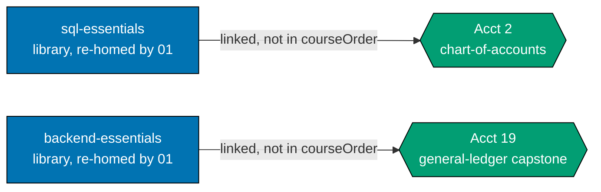
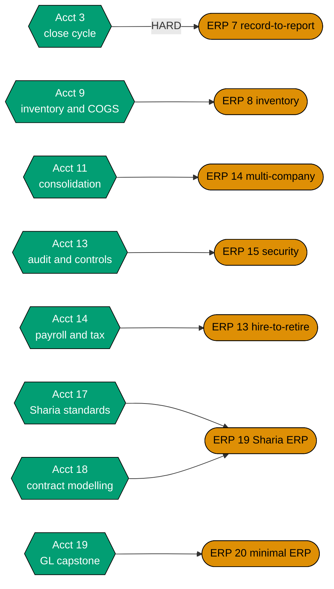
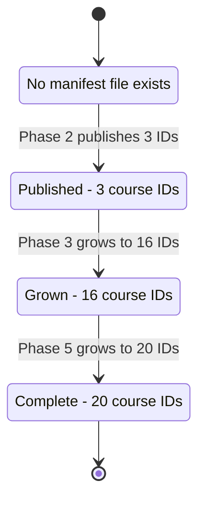
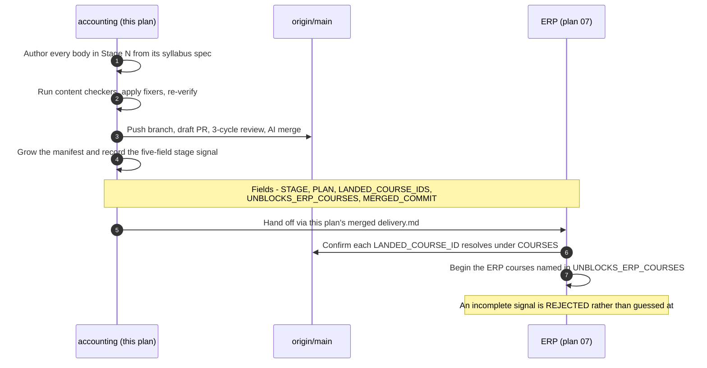

# Technical Documentation — Skills Path: Accounting

## Overview

This plan delivers one `skills/` path end-to-end: a twenty-course accounting corpus, its manifest,
and its landing content. It is the **first non-software-engineering subject** on the platform and the
**first 2-segment `pathId`** ever instantiated — plan 02 exercises that shape only through unit-test
fixtures.

It touches **no application code**. Its artefacts are markdown page bundles under
`apps/ayokoding-www/content/`, one YAML data file under
`apps/ayokoding-www/src/features/course-paths/manifests/skills/`, and twenty markdown spec files
inside this plan folder. Every component, resolver, schema, and route it depends on is built by
plans 01–03 and consumed here.

## The manifest ownership invariant (scoped to one file)

The programme's manifest-ownership invariant is scoped **per category**, and within `skills/` it is
scoped **per subject**:

| Plan | Owns                                                                  | Never writes                                                                 |
| ---- | --------------------------------------------------------------------- | ---------------------------------------------------------------------------- |
| 05   | `manifests/careers/**` (four files)                                   | anything under `manifests/skills/`                                           |
| 06   | `manifests/skills/accounting.yaml` (**this plan** — exactly one file) | `manifests/careers/**`, `manifests/skills/enterprise-resource-planning.yaml` |
| 07   | `manifests/skills/enterprise-resource-planning.yaml`                  | `manifests/careers/**`, `manifests/skills/accounting.yaml`                   |

**No plan among 05, 06 and 07 creates an `_index.md` under `paths/`.** Every structural index —
`paths/_index.md`, `paths/careers/_index.md`, the three `paths/careers/<arc>/_index.md`, and
`paths/skills/_index.md` — belongs to `ayokoding-learning-path-01-url-restructure` (A3 ruling,
2026-07-21). A path **landing** (`paths/skills/accounting/_index.md`) is this plan's; the **bucket**
it sits in is not.

**Consequence this plan must design for, not discover** (A3): `paths/skills/_index.md` renders
**empty** between plan 01 landing and this plan's Phase 2 publishing the first skills manifest. That
empty state is real and user-visible, and **plan 03 owns designing it**. This plan does not paper
over it, does not create a placeholder index, and does not treat it as a defect of its own.

## Path constants

- `<COURSES>` = `apps/ayokoding-www/content/en/learn/courses/` — course bundles; served at
  `/en/learn/courses/<course-id>` _(created by plan 01)_
- `<PATHS>` = `apps/ayokoding-www/content/en/learn/paths/` — path landings; served at
  `/en/learn/paths/<path-id>` _(created by plan 01)_
- `<LANDING>` = `<PATHS>skills/accounting/` — **this plan's only content home outside `<COURSES>`**
- `<FEAT>` = `apps/ayokoding-www/src/features/course-paths/` _(created by plans 02 and 03)_
- `<MANIFESTS>` = `<FEAT>manifests/` — YAML data files, nested to mirror slash path IDs
- `<MANIFEST>` = `<MANIFESTS>skills/accounting.yaml` — **this plan's only file under `<FEAT>`**
- `<SPEC>` = `plans/backlog/ayokoding-learning-path-06-skills-accounting/syllabus/courses/` — this
  plan's own 20-file spec layer _(see [DD-601](#design-decisions))_
- `<SPECPATHS>` = `plans/backlog/ayokoding-learning-path-06-skills-accounting/syllabus/paths/` — this
  plan's own path mirror, holding exactly `manifest-skills-accounting.md`
- Path ID: **`skills/accounting`** — the full slash string, category segment included, with no
  separate `category` field. Arc: `immediately-effective`, a required manifest field, recorded as
  data and omitted from the URL. **Nothing keys on segment count** — see
  [§`pathId` conformance rules](#pathid-conformance-rules-plan-02s-ruling--binding-not-re-derived-here).

## The twenty-course catalog

Reproduced from the 2026-07-21 `web-researcher` corpus research, which is the **decided** syllabus
seed for this plan. Course IDs, formats, prerequisite edges, and ramp order are **not re-derived
here** — authoring transcribes them.

> **The count of twenty is curriculum judgment, not a sourced fact** [Judgment call]. So is the
> partition into three stages. What is sourced is the dependency structure and the domain facts each
> course teaches; the packaging is an editorial decision.

`(SWE)` marks a **linked** cross-domain prerequisite into the existing software-engineering library —
linked, never walked ([DD-602](#design-decisions)).

| #   | Course ID                                    | Format            | Prerequisites                    | Stage |
| --- | -------------------------------------------- | ----------------- | -------------------------------- | ----- |
| 1   | `accounting-foundations`                     | By Example        | —                                | 1     |
| 2   | `chart-of-accounts-and-data-modeling`        | By Example        | 1, `sql-essentials` (SWE)        | 1     |
| 3   | `financial-statements-and-close-cycle`       | By Example        | 2                                | 1     |
| 4   | `accrual-accounting-and-revenue-recognition` | By Example        | 3                                | 2     |
| 5   | `accounts-payable-and-procure-to-pay`        | By Example        | 2                                | 2     |
| 6   | `accounts-receivable-and-order-to-cash`      | By Example        | 2, 4                             | 2     |
| 7   | `managerial-and-cost-accounting`             | By Example        | 3                                | 2     |
| 8   | `fixed-assets-and-depreciation`              | By Example        | 2                                | 2     |
| 9   | `inventory-and-cogs-accounting`              | By Example        | 2, 7                             | 2     |
| 10  | `lease-and-intangible-asset-accounting`      | By Example        | 8                                | 2     |
| 11  | `consolidation-and-multi-entity-accounting`  | By Example        | 3, 2                             | 2     |
| 12  | `financial-reporting-standards-ifrs-vs-gaap` | Annotated-concept | 4, 10                            | 2     |
| 13  | `audit-controls-and-compliance`              | Annotated-concept | 3                                | 2     |
| 14  | `payroll-and-tax-accounting-essentials`      | By Example        | 2                                | 2     |
| 15  | `treasury-and-cash-management`               | By Example        | 5, 6                             | 2     |
| 16  | `financial-reporting-and-xbrl`               | Annotated-concept | 12                               | 2     |
| 17  | `sharia-accounting-and-aaoifi-standards`     | Annotated-concept | 4, 12                            | 3     |
| 18  | `islamic-contract-modeling-for-systems`      | By Example        | 17, 2                            | 3     |
| 19  | `capstone-build-a-general-ledger-system`     | By Example        | 2, 3, `backend-essentials` (SWE) | 3     |
| 20  | `capstone-sharia-compliant-ledger`           | By Example        | 18, 19                           | 3     |

**Format counts**: 16 By Example, 4 Annotated-concept. Each maps to an existing maker/checker/fixer
agent trio (`apps-ayokoding-www-by-example-*`, `apps-ayokoding-www-annotated-concept-*`)
[Repo-grounded — all six agent files verified present under `.claude/agents/`].

**The ramp order is a valid topological order.** Every numbered prerequisite of course _n_ is a
course with a lower number, so `courseOrder` in catalog order satisfies
`checkPrerequisiteConsistency` by construction. Verified by inspection of the table above; re-checked
mechanically at every phase gate.

**No course ID collides with an existing library course** and no ID is a substring of another, which
is what makes the alternation-grep acceptance clauses in `delivery.md` sound.

## The ramp and its three stages

| Stage | Courses | Boundary           | Delivery phase | Reader outcome                                                                         |
| ----- | ------- | ------------------ | -------------- | -------------------------------------------------------------------------------------- |
| 1     | #1–#3   | **Dangerous 1** ⚡ | Phase 2        | Working, correctly balancing ledger; routine postings; three statements, single entity |
| 2     | #4–#16  | **Dangerous 2** ⚡ | Phase 3        | Most conventional systems a mid-size company runs                                      |
| 3     | #17–#20 | **Dangerous 3** ⚡ | Phase 5        | Full competence, including a Sharia-compliant ledger                                   |

**Standalone-useful subsets**, stated because they are what makes the immediately-effective claim
honest rather than rhetorical:

- **#1 alone** — correct cash-basis hand-posting.
- **#1 + #2** — designing a real ledger schema.
- **#1–#3** — the first genuinely dangerous point.

**Why the ramp is fast then slow.** Three courses to the first boundary, thirteen to the second. That
asymmetry is the direct consequence of the domain's silent-failure property (see
[prd.md §The silent-failure constraint](./prd.md#the-silent-failure-constraint-the-corpus-shaping-fact)):
a hand-built single-entity ledger fails **loudly** — it does not balance — while everything after it
fails **quietly**. Accelerating past #3 would hand a reader a tool that produces confident wrong
answers.

## How accounting joins the library DAG

R5 requires this plan to state explicitly whether the new subject domain **joins** the existing
prerequisite DAG or forms a **disjoint component**, and why.

**Ruling: it joins, as a near-disjoint leaf cluster with exactly two inbound edges and zero outbound
edges into software engineering.**



**Accessibility note.** Domain is carried by node **shape** (rectangle = existing library course,
hexagon = accounting course) and by every edge's explicit label, never by colour alone.

Three properties follow, and each matters downstream:

1. **Two inbound edges only.** `sql-essentials` → #2 and `backend-essentials` → #19. Both source
   courses are among plan 01's **37 re-homed bundles** [Repo-grounded — both directories present
   today under `apps/ayokoding-www/content/en/learn/fundamentally-strong/software-engineer/`], which
   is why this plan carries **no dependency on `ayokoding-learning-path-04-course-authoring`**
   ([DD-605](#design-decisions)).
2. **Zero outbound edges into software engineering.** No existing library course gains an accounting
   prerequisite. The library DAG is unchanged for every reader who never enters this path — a
   property that makes rollback total and side-effect-free.
3. **The accounting subgraph is internally dense and externally sparse.** 19 of the 20 courses have
   only in-domain prerequisites. That is what makes the path a _short spine over the shared library_
   rather than a second curriculum.

The outbound direction — accounting into ERP — is the plan-07 handoff, and it is substantial:



**Accessibility note.** Plan ownership is carried by node **shape** (hexagon = this plan, stadium =
plan 07); the one hard edge carries an explicit `HARD` label rather than relying on styling.

**The hard edge is `Acct 3 → ERP 7`.** Subledger-to-GL posting is meaningless without a balanced
ledger. Every other edge is a soft ordering preference. This is the whole reason Stage 1 publishes
before Stages 2 and 3 exist.

## Link, do not walk (the cross-domain composition rule)

`courseOrder` contains **only accounting course IDs**. `sql-essentials` and `backend-essentials` are
**linked** — declared in the dependent course's `prerequisites:` frontmatter, surfaced on that
course's page by plan 03's prerequisite display, and linked from the landing — but never inserted
into the path's walk.

**Why** ([DD-602](#design-decisions)):

- A subject path that walks its cross-domain prerequisites stops being a subject path. Twenty
  accounting courses plus a software-engineering on-ramp is a different product.
- The reader persona is a **systems builder**. Assuming zero accounting knowledge is correct;
  assuming zero SQL is not.
- Course **#1 has no prerequisites at all**, so a reader with neither accounting nor SQL still has a
  real entry point and only meets the library edge at #2 — where the prerequisite display tells them
  exactly what to go and read.

**A stale justification, corrected.** The research justified this rule by analogy: _"The existing AI
path already links rather than re-walks its shared SWE prerequisites."_ That analogy **no longer
holds** — the 2026-07-21 A1 amendment made `careers/immediately-effective/ai-engineer` a from-scratch
path that **includes** its prerequisites in `courseOrder`. The rule survives on its own reasoning
above; the analogy is recorded here as retired so nobody re-derives it from the same stale premise.

**A cross-plan wording conflict, recorded not diverged from** — see [OI-4](#open-verification-items-oi-1-through-oi-4).

## Manifest format

```yaml
# apps/ayokoding-www/src/features/course-paths/manifests/skills/accounting.yaml
pathId: skills/accounting
arc: immediately-effective
title: "Accounting for Systems Builders"
description: "Build a ledger that balances, then learn the mistakes that still balance."
courseOrder:
  - accounting-foundations
  - chart-of-accounts-and-data-modeling
  - financial-statements-and-close-cycle
  # … grows to 16 at Stage 2 and to 20 at Stage 3 …
```

Five properties this manifest must hold, each asserted at a gate:

1. **`pathId` is the FULL slash string, category segment included** — `skills/accounting`, exactly
   that. Not `accounting`, not a bare subject slug, and **never** a separate `category` field
   alongside a shortened id. The category lives inside the id.
2. **`arc` is a separate required field, present and set to `immediately-effective`**, even though
   the URL omits it (R8). It is recorded **as data**, never left implicit in landing prose. Modelling
   a skills path as arc-less would make a future second skills arc both a schema migration and a URL
   migration — exactly what R2 forbids.
3. **Every `courseOrder` entry is a plain course-ID string.** No `{ id, framing }` mappings
   ([DD-619](#design-decisions)): per-course framing exists so several careers paths can wrap one
   shared body differently, and every accounting body is exclusive to this path, so framing has
   nothing to disambiguate. Keeping entries plain also makes the line-shaped grep acceptance clauses
   in `delivery.md` sound.
4. **Neither `sql-essentials` nor `backend-essentials` appears in `courseOrder`.**
5. **Nothing anywhere keys on segment count** — see the rule below.

### `pathId` conformance rules (plan 02's ruling — binding, not re-derived here)

`ayokoding-learning-path-02-schema-and-prerequisite-dag` owns the `pathId` contract. This plan
conforms to it; it does not restate a variant of it.

- **Variable-depth by design.** Careers ids are 3 segments (`careers/<arc>/<role>`); skills ids are 2
  (`skills/<subject>`). **Validation is on the first-segment literal (`careers` | `skills`) plus
  manifest resolvability — never on arity.**
- **No clause, regex, route, glob, or check in this plan may assume a fixed number of segments.**
  Every pattern matches the **full id**. This is a live defect class, not a hypothetical: a sibling
  plan shipped a clause using a two-group path regex that silently stopped at the first `/` inside a
  3-segment careers URL and undercounted by one under `sort -u`. Every acceptance clause in this
  plan's `delivery.md` was written to avoid that shape and was proven falsifiable in both directions
  before landing.
- **"2-segment" is a fact about this instance, never an asserted invariant.** Where this document
  calls `skills/accounting` a 2-segment id, it is describing what this manifest happens to contain —
  not a property any check enforces. A future `skills/<arc>/<subject>` must be purely additive.
- **An unresolvable or malformed id is a HARD `safeParse` rejection.** Never silent coercion, never
  an alias, never normalization, never a nearest-match fallback. **This plan describes no lenient
  resolution behaviour anywhere.** The one adjacent behaviour it does verify — an invalid
  `?path=` on a course URL — is rejection **plus** the course's own canonical no-path view, which is
  the absence of a path context rather than a coerced one.

### Syllabus mirror filename (plan 02's ruling — binding)

The human-readable path mirror for this manifest is **`manifest-skills-accounting.md`**, carrying the
`skills-` category marker. A bare `manifest-accounting.md` is **not** acceptable.

The four existing careers mirrors keep their current un-prefixed names
(`manifest-immediately-effective-ai-engineer.md` and siblings) — renaming them would be pure churn
against a custody-frozen corpus — so the `skills-` marker is what makes the category unambiguous by
construction rather than by convention. Plan 07's mirror is
`manifest-skills-enterprise-resource-planning.md` by the same rule.

### Manifest growth lifecycle



Every transition carries a **falsifiable before/after deferred-ID check**: the IDs that are
deliberately absent at publication are asserted absent then, and asserted present after their growth
step. A manifest that stalls at three courses cannot pass as complete.

## Landing content contract — what it must convey

**Scope note.** This section specifies **what the landing says**, not **how it looks**. Every visual
decision — layout, component choice, mockups, renders, responsive behaviour — belongs to
`ayokoding-learning-path-03-navigation-ui`, which owns the programme's `assets/` and `assets/src/`
set. This plan ships no `assets/` folder.

The landing at `<LANDING>_index.md` must carry, in this order:

1. **The arc promise, stated once.** "Get up and running and become dangerous as fast as possible,
   then go deeper and deeper, on solid ground." There is **no arc chooser** on a skills landing —
   unlike `careers/`, where the arc is a real three-way branch point. The arc is constant (R8) and is
   stated, not selected.
2. **The ramp — the distinguishing requirement.** All three "dangerous by here" boundaries, each
   naming **both** what a reader can do and what they cannot yet do. This is the concept a skills
   path has and a careers path does not: a careers path converges on a role, a skills path converges
   on a capability with named intermediate landings. **This is the requirement handed to plan 03** as
   the skills-landing affordance worth designing.
3. **Why the ramp slows after #3.** One short paragraph on the silent-failure property. Without it,
   the slowdown reads as padding.
4. **The two linked prerequisites**, at their canonical `/en/learn/courses/<id>` URLs, with the
   course each one gates named (#2 and #19 respectively).
5. **Nothing that duplicates the manifest.** **No `courseOrder` in the landing.** The ordered course
   list renders from the loaded manifest; a hand-written list is a second source of truth that drifts.

**What the landing must not read like**: a table of contents. A reader arriving on a skills landing
is asking "how fast do I become useful, and how far does that get me?" — not "what topics are
covered?" Ordering the arc and the ramp **ahead of** the list is the mechanism that answers the
question actually being asked.

**Degradation is acceptable and planned for.** If plan 03 ships no dedicated ramp component, the
ramp is expressible as landing prose plus a markdown table. This plan ships **content only** and
never builds a component to close the gap ([DD-611](#design-decisions)).

## Sharia accounting — three models, not one

**There is no single "Sharia accounting standard."** Three structurally different jurisdictional
models coexist. A course presenting AAOIFI as "the" standard would be wrong, and this is a content
invariant asserted per course at #17, #18 and #20.

| Jurisdiction  | Model                                        | The fact most often got wrong                                                                                                                                                                    |
| ------------- | -------------------------------------------- | ------------------------------------------------------------------------------------------------------------------------------------------------------------------------------------------------ |
| **Bahrain**   | AAOIFI — standard-setting-body model         | AAOIFI keeps **two separate series**: Financial Accounting Standards ("what to book") and Shari'ah Standards ("what makes the contract compliant"). Conflating them is the common error.         |
| **Indonesia** | PSAK Syariah — parallel standard series      | DSAS proposes, DSN-MUI ratifies. AAOIFI is used as a **basis**, **not adopted**. The standard numbering itself is [Needs Verification] — see [OI-1](#open-verification-items-oi-1-through-oi-4). |
| **Malaysia**  | MFRS plus BNM Shariah Governance Policy 2019 | Single-standard-plus-governance-overlay. **Malaysia is not on AAOIFI's mandatory-adoption list.**                                                                                                |

### The load-bearing modelling fact

In murabaha the markup is **fixed and disclosed at the point of sale, in a trade with an underlying
asset changing hands** — not accrued over time on an outstanding balance. AAOIFI FAS 28 therefore
treats it as a **trading transaction**: a receivable and revenue from a sale, not interest income
from a loan.

**A murabaha receivable schedule and a conventional amortising loan schedule can look numerically
similar and must be modelled and recognised completely differently.** This is the core of
`islamic-contract-modeling-for-systems` (#18), and it is the domain's silent-failure property in its
sharpest form: the wrong model produces plausible numbers.

`[Verified]` **AAOIFI FAS numbers** for the contract types this corpus covers: FAS 3 (Mudaraba),
FAS 4 (Musharaka), FAS 7 (Salam), FAS 9 (Zakah), FAS 10 (Istisnaa), FAS 28 (Murabaha and deferred
payment sales), FAS 32–34 (Ijarah through sukuk-holder reporting). **FAS numbers outside this list
are `[Unverified]`** and must be re-verified against AAOIFI's own index before being written.

## Open verification items (OI-1 through OI-4)

The seeding research marked only **three** items `[Verified]`: the AAOIFI FAS index, AAOIFI's
adoption-by-country page, and IAI's PSAK Syariah index. Everything else is search-summarised
`[Unverified]`. Those markers are carried into this plan **as open items with named primary sources
and named resolution steps** — never restated as fact, never silently promoted.

### The rule every authoring step follows


**Accessibility note.** Node kind is carried by **shape** (diamond = decision, stadium = outcome,
rectangle = input) and every edge carries an explicit `yes` / `no` label. Square brackets are omitted
from the tag names inside labels because Mermaid would parse them as node syntax; the tags are
`[Verified]`, `[Needs Verification]` and `[Unverified]` in prose.

### The four items

| ID       | Status                 | Claim at risk                                                                                                                                                                                             | Named primary source to check                                                                                                                                                                                                                                                                                                                                                   | Blocks                                  |
| -------- | ---------------------- | --------------------------------------------------------------------------------------------------------------------------------------------------------------------------------------------------------- | ------------------------------------------------------------------------------------------------------------------------------------------------------------------------------------------------------------------------------------------------------------------------------------------------------------------------------------------------------------------------------- | --------------------------------------- |
| **OI-1** | `[Needs Verification]` | **Indonesian PSAK numbering.** Sources show both a "PSAK 59 / SIFAS 101-109" generation and a "PSAK 101-110" series. Both cannot be current.                                                              | **IAI's published PSAK Syariah standard list** (`iaiglobal.or.id`) — the index that was directly fetched, re-read for the numbering generation and its effective dates.                                                                                                                                                                                                         | Course #17 authoring                    |
| **OI-2** | `[Needs Verification]` | **Riba doctrinal basis.** Currently sourced only from Wikipedia, which is not a primary source.                                                                                                           | An **AAOIFI Shari'ah Standard** or an **IFSB publication**. The _practical_ consequence is well-attested (all standards bodies follow the orthodox position: profit must arise from trade, leasing, partnership or service risk, never a predetermined return on a pure loan); the minority time-value-of-money position is **not settled** and is not this corpus's to settle. | Course #17 authoring                    |
| **OI-3** | `[Unverified]`         | Every three-jurisdiction detail **beyond** the three fetched indexes — governance-process descriptions, adoption mechanics, effective dates.                                                              | The three fetched indexes plus **Bank Negara Malaysia's Shariah Governance Policy 2019** document itself.                                                                                                                                                                                                                                                                       | Courses #17, #18, #20                   |
| **OI-4** | open, **cross-plan**   | Plan 02's `tech-docs.md` states a doc-level rule: _"A path may omit a prerequisite only if it also omits every course that needs it."_ Read literally, that forbids this plan's link-don't-walk manifest. | Not a research item — a **wording seam**. Plan 02's implemented `checkPrerequisiteConsistency` already permits it (its own RED step asserts _"a prerequisite that is declared but omitted from the manifest is **not** reported"_), so only the prose rule needs a carve-out sentence for cross-domain linked prerequisites.                                                    | Nothing mechanically; routed in Phase 0 |

**OI-4 is routed, not fixed here.** Plan 02 custodies its own documents and this plan does not edit a
sibling plan folder. Phase 0 records the seam and hands it to the main thread; if it is never
amended, this plan's manifest still passes every implemented gate, so the seam is a documentation
defect rather than a blocker.

**Escape hatch for OI-1 and OI-2.** If a primary source cannot be reached, the affected course
**scopes around the unresolved claim** — teaching the structure (a parallel standard series exists;
profit must arise from real economic activity) without publishing a specific standard number or a
doctrinal derivation. Refusing to write the claim is always available and always preferred over
writing it unlabelled.

### Fast-moving facts, re-verify at authoring

Stable and safe to state: double-entry mechanics, the ASC 606 / IFRS 15 five-step model, process
names (P2P / O2C / R2R). Volatile and requiring a dated accuracy-note sidebar rather than the stable
spine: any tooling version pin, any XBRL taxonomy release, and any standard's effective date.

## Stage-signal contract (the plan-07 handoff)



**Five fields, all required:**

| Field                  | Meaning                                                                                           |
| ---------------------- | ------------------------------------------------------------------------------------------------- |
| `STAGE`                | `1`, `2`, or `3`                                                                                  |
| `PLAN`                 | `ayokoding-learning-path-06-skills-accounting`                                                    |
| `LANDED_COURSE_IDS`    | Every accounting course ID authored in this stage                                                 |
| `UNBLOCKS_ERP_COURSES` | The ERP course numbers this stage clears (Stage 1 → 7; Stage 2 → 8, 13, 14, 15; Stage 3 → 19, 20) |
| `MERGED_COMMIT`        | A real 40-character SHA on `origin/main`, checkable with `git cat-file -e`                        |

## Syllabus layer — custody and shape

This plan's syllabus layer has **two** halves, both **inside this plan folder** and never inside
`ayokoding-learning-path-02-schema-and-prerequisite-dag/syllabus/` ([DD-601](#design-decisions)):

| Half             | Location                                   | Contents                                                                            |
| ---------------- | ------------------------------------------ | ----------------------------------------------------------------------------------- |
| Per-course specs | `<SPEC>`                                   | 20 `<course-id>.md` files plus a folder `README.md`                                 |
| Path mirror      | `<SPECPATHS>manifest-skills-accounting.md` | The human-readable ordering this plan transcribes into `<MANIFEST>`'s `courseOrder` |

**The mirror filename is fixed by plan 02's ruling**: `manifest-skills-accounting.md`, with the
`skills-` category marker. A bare `manifest-accounting.md` is not acceptable. See
[§Syllabus mirror filename](#syllabus-mirror-filename-plan-02s-ruling--binding).

**Path ids inside every spec use the canonical prefixed form from the start** — `skills/accounting`,
never a bare `accounting`. Plan 02 flagged that its 121 existing course specs still carry stale
un-prefixed ids in their "In which paths" sections; it deliberately left them (custody-protected,
informational metadata, not runtime behaviour). **This plan does not edit them, and does not add to
that debt**: every path id this plan writes is prefixed on first authoring.

Each per-course spec is one `<course-id>.md` file stating:

- **Top matter** — course ID, format (By Example / Annotated-concept), primary language(s), short
  summary, and the stage it belongs to.
- **Scope note** — the usable slice, and what is deliberately deferred to a later course.
- **Why this exists** — the problem before the solution, and the keep-this-if-you-forget-everything
  idea.
- **Prerequisites** — transcribed exactly, including any linked `(SWE)` edge, in the shape the
  authored `_index.md` frontmatter will carry.
- **Scope boundary** — the named sibling course (accounting, library, or ERP) this course could be
  confused with, and the line between them.
- **Silent failure modes** — for every course from #4 onward, at least one outcome that still
  balances while being substantively wrong, and the observable signal (if any) that would reveal it.
  This is the section the authored `overview.md` must carry through.
- **Verification markers** — every external claim carried with its `[Verified]` / `[Unverified]` /
  `[Needs Verification]` tag from the research, never laundered.

## Design Decisions

> **Numbering note.** This plan uses the **`DD-6NN`** range: `6` marks plan 06, `NN` is the decision
> number. The five-way-split plans (01–05) share an inherited `DD-1`…`DD-45` space in which several
> tokens (`DD-34`, `DD-35`, `DD-39`) already carry two unrelated meanings. Starting at `DD-601`
> guarantees every decision token in this folder is unambiguous for an execution-grade reader and can
> never collide with a sibling plan's. Plan 07 is expected to use `DD-7NN` for the same reason.

- **DD-601 · The 20 syllabus specs live in this plan's own folder, not plan 02's corpus.** Plan 02
  custodies `syllabus/` under a **binding freeze**: _"This plan owns the folder and edits nothing
  inside it, with exactly one recorded exception."_ [Repo-grounded — plan 02
  `tech-docs.md §Custody rules`]. Adding 20 accounting specs would either violate that freeze or
  force a second custody exception for a subject plan 02 knows nothing about, and it would put a
  shared directory on a cross-plan seam — the exact failure mode A3 eliminated for `paths/skills/_index.md`.
  This plan therefore authors `<SPEC>` inside its own folder, mirroring plan 02's spec shape so a
  later consolidation is a pure move. Plan 07 does the same for ERP.
- **DD-602 · Link, do not walk.** `courseOrder` holds accounting IDs only; `sql-essentials` and
  `backend-essentials` are declared as frontmatter prerequisites and linked from the landing. Full
  reasoning in [§Link, do not walk](#link-do-not-walk-the-cross-domain-composition-rule), including
  the retirement of the research's now-stale AI-path analogy.
- **DD-603 · The manifest publishes at Stage 1 and grows twice, rather than publishing once at the
  end.** Three independent reasons: (a) the immediately-effective arc demands early payoff, and a
  path whose manifest appears only when all twenty bodies exist cannot express it; (b) this is the
  **first 2-segment `pathId` ever instantiated** — plan 02 exercises the shape only through unit-test
  fixtures — so publishing early is the architecture smoke test for the R2 variable-depth ruling, and
  discovering a depth assumption at course 20 would be far more expensive than at course 3; (c) it
  emits the Stage-1 signal that clears ERP #7 at the earliest possible moment. The silent-truncation
  risk this creates is mitigated by falsifiable before/after deferred-ID checks at every transition.
- **DD-604 · Three stage-completion signals, modelled on plan 04's band signal.** Same five-field
  discipline, same rejection rule for an incomplete signal. Reusing an established contract shape
  costs nothing and means plan 07 consumes signals it can already parse.
- **DD-605 · This plan has NO dependency on `ayokoding-learning-path-04-course-authoring`.**
  Accounting's only two cross-domain prerequisite edges resolve to `sql-essentials` and
  `backend-essentials`, both among plan 01's 37 re-homed bundles. Verified rather than assumed, and
  re-verified as a Phase 0 start precondition. The consequence is scheduling, not paperwork: this
  plan runs concurrently with plans 04 and 05 instead of behind a 90-body authoring run, which pulls
  ERP's unblock forward by the whole of that run.
- **DD-606 · `business/accounting.md` is mined, not transplanted.** Course #1 harvests the article's
  **running example** and its **narrative sequencing** (the order a first-time reader meets debits,
  credits, and the accounting equation), then discards the small-business-owner register and reframes
  for a systems builder. The schema and data-modelling layer the article lacks is **not** back-filled
  into #1 — that is course #2's subject, and pulling it forward would collapse the first ramp
  boundary. No paragraph moves verbatim. The article is `[Repo-grounded]` at 34.2 KB and is being
  relocated to `legacy/business/` by plan 01, so the mining happens against its post-move path.
- **DD-607 · Verification debt is resolved in a dedicated phase gating the Sharia stage, not up
  front.** OI-1 and OI-2 bite only at courses #17–#20. Front-loading them would delay the first ramp
  boundary — and therefore ERP's unblock — for claims that Stages 1 and 2 never make. Front-loading
  is also fragile: research resolved in Phase 1 and consumed in Phase 5 has had time to drift. The
  markers are carried verbatim into the Phase 1 specs so nothing is laundered in the meantime.
- **DD-608 · Three jurisdictional models, always three.** Courses #17, #18 and #20 each name AAOIFI,
  PSAK Syariah, and MFRS-plus-BNM, and none describes AAOIFI as "the" standard. Two specific facts
  are stated explicitly rather than left to inference, because both are commonly got wrong: Malaysia
  is **not** on AAOIFI's mandatory-adoption list, and Indonesia uses AAOIFI as a **basis** rather than
  adopting it. Asserted per course, and again at the Phase 5 gate.
- **DD-609 · Every course from #4 onward carries a "what still balances while being wrong"
  section.** A required `overview.md` section, not an author's-discretion callout, verified by a
  grep-checkable acceptance clause at its authoring step. Courses #1–#3 are exempt: a hand-built
  single-entity ledger fails loudly, so there is no silent failure to name yet, and inventing one
  would teach a false pattern. This is the single most direct encoding of the corpus-shaping
  constraint.
- **DD-610 · Formats are transcribed from the research table, not re-derived.** 16 By Example, 4
  Annotated-concept. The four Annotated-concept courses (#12, #13, #16, #17) are the ones whose
  subject is a landscape or a judgment framework rather than a mechanism a reader can execute — a
  worked example of "IFRS versus GAAP" would be a fiction. Each format routes to its existing maker /
  checker / fixer agent trio.
- **DD-611 · The ramp is content, and its design is plan 03's.** This plan states what the landing
  must convey (see [§Landing content contract](#landing-content-contract--what-it-must-convey)) and
  hands the **ramp affordance** to `ayokoding-learning-path-03-navigation-ui` as the distinguishing
  requirement of a skills landing. If plan 03 ships no dedicated component, the ramp degrades
  gracefully to landing prose plus a markdown table. **This plan never builds a component to close
  the gap** and ships no `assets/` folder, mockup, or render.
- **DD-612 · Mixed TDD posture, stated rather than assumed.** The manifest publication and both
  growth steps **are** RED → GREEN → REFACTOR cycles against
  `<MANIFESTS>published-manifests.unit.test.ts`-style assertions, because a YAML data file loaded and
  validated by application code is testable behaviour. Course bodies and the landing are **content**,
  produced by the maker-checker-fixer pipeline with no RED/GREEN/REFACTOR labels, because there is no
  failing assertion to write first for prose. Both postures appear in the same `delivery.md`, each
  labelled at its step.
- **DD-613 · The corpus is authored stage-by-stage, one course per sub-phase.** Each course is
  content-independent (it writes only its own subtree), so each gets its own branch, draft PR,
  3-cycle review, and `[AI]` merge, pipelining through review up to the in-force concurrency cap. The
  manifest mutation is the **only** serial sync point in each stage, and it happens once, at the
  stage's end.
- **DD-614 · The 20-course count and the three-stage partition are labelled `[Judgment call]`
  everywhere they appear**, including inside the catalog table. The dependency structure and the
  domain facts are sourced; the packaging is editorial.
- **DD-615 · Ownership is one manifest file, and no `_index.md` under `paths/`.** See
  [§The manifest ownership invariant](#the-manifest-ownership-invariant-scoped-to-one-file). Asserted
  mechanically at the Phase 6 gate as a directory-footprint check, so a boundary violation is a
  failing check rather than a review opinion.
- **DD-616 · The landing reads as an arc, not a table of contents.** The arc promise and the three
  ramp boundaries appear **before** the course list, and the list itself renders from the manifest.
  A skills-path reader is asking how fast they become useful and how far that gets them; a topic
  inventory does not answer that question.
- **DD-617 · Accounting joins the library DAG as a near-disjoint leaf cluster** — two inbound edges,
  zero outbound edges into software engineering. Stated explicitly because R5 requires this plan to
  say which, and because the answer has a consequence: the library DAG is unchanged for every reader
  who never enters this path, which makes rollback total and side-effect-free.
- **DD-618 · Course-existence is asserted by ID, never by a global directory count.** Plan 04 is
  authoring 90 bodies into `<COURSES>` **concurrently** with this plan, so
  `find <COURSES> -maxdepth 1 -type d | wc -l` is a moving target and any fixed expected total would
  be either wrong or accidentally right. Every acceptance clause therefore loops the 20 known IDs and
  counts misses. Corollary: **the 127-course figure is the careers/software-engineering catalog total
  and this plan's 20 courses are never folded into it** (R5).
- **DD-619 · `courseOrder` entries are plain ID strings, with no `framing` mappings.** Per-course
  framing exists so several careers paths can wrap one shared body differently; every accounting body
  belongs to exactly one path, so framing has nothing to disambiguate. This also keeps the
  line-shaped grep clauses in `delivery.md` sound.
- **DD-620 · No accounting course cites an ERP course.** The dependency is strictly one-directional,
  which is what lets the two skills plans proceed without a cycle. A scope-boundary statement against
  an ERP course is allowed and required where the subjects abut; a **prerequisite edge** into ERP is
  forbidden.
- **DD-621 · This plan conforms to plan 02's `pathId` and mirror-filename rulings rather than
  restating a variant of them.** Five consequences, each binding: (a) `pathId` is the **full slash
  string** `skills/accounting`, category segment included, with no separate `category` field;
  (b) `arc` is a **separate required field** recorded as data, not left implicit in landing prose;
  (c) **no clause, regex, route, glob, or check in this plan keys on segment count** — validation is
  first-segment literal plus resolvability, and every pattern matches the full id (the sibling-plan
  defect where a two-group path regex undercounted 3-segment careers ids is the reason this is stated
  as a rule rather than assumed); (d) an unresolvable or malformed id is a **hard `safeParse`
  rejection** — no coercion, alias, normalization, or nearest-match fallback appears anywhere in this
  plan; (e) the syllabus mirror is **`manifest-skills-accounting.md`**, carrying the `skills-`
  category marker, because the four careers mirrors keep their un-prefixed names and the marker is
  what disambiguates the category by construction. Corollary: this plan writes every path id in its
  own specs in the **canonical prefixed form from the start**, and never edits the 121 plan-02 specs
  that still carry stale un-prefixed ids in their "In which paths" sections — those are
  custody-protected informational metadata, and touching them would be a custody violation, not a fix.

- **DD-622 · "Never create an `_index.md`" means never create a STRUCTURAL index — the path landing
  is an `_index.md` and it IS this plan's.** A3 assigns `paths/_index.md`, `paths/careers/_index.md`,
  the three `paths/careers/<arc>/_index.md`, and `paths/skills/_index.md` to plan 01: those are
  **buckets**, and creating a bucket is IA work. `<LANDING>_index.md`
  (`content/en/learn/paths/skills/accounting/_index.md`) is a **landing**, is the content this plan
  exists to ship, and is created here. The two are distinguished by **position, not by filename**:
  anything at or above `paths/skills/` is structural and plan 01's; the leaf bundle at
  `paths/skills/accounting/` is this plan's. Recorded explicitly because an execution-grade reader
  hitting a bare "never create an `_index.md`" rule at the landing-authoring step would otherwise
  freeze or, worse, skip the deliverable. The mechanical check in
  [delivery.md Phase 6](./delivery.md#phase-6-section-and-app-verification) encodes exactly this
  split: it allows `paths/skills/accounting/_index.md` and fails on every other `_index.md` under
  `<PATHS>`.
- **DD-623 · Every id list in `delivery.md` is a shell ARRAY, never a space-separated string.** This
  repo's shell is **zsh** [Repo-grounded — `$ZSH_VERSION` is `5.9`, `$BASH_VERSION` unset], and zsh
  **does not word-split an unquoted parameter**: `X="a b c"; for i in $X` iterates **once**. A
  string-backed loop therefore makes every derived count read `1` instead of `20` while still exiting
  0 — a check that passes while measuring nothing, which is strictly worse than no check. All lists
  are arrays iterated as `"${NAME[@]}"`, the alternation strings are **derived from those arrays** so
  they cannot drift, and Phase 0 opens with a **length self-check** on all five arrays. That
  self-check is what makes every other count in `delivery.md` trustworthy; it is not optional
  boilerplate.

## UI-gate and API-gate posture (R9)

Both postures are declared explicitly. Per the
[api-quality-gate workflow](../../../repo-governance/workflows/api/api-quality-gate.md)'s
§Relationship to Other Gates, a plan bearing neither surface **is not thereby exempt** — exemption
belongs only to a plan with no reachable behavioural delta at all, and it must be stated here.

### UI gate — **exempt**, and here is the reasoning rather than the assertion

`swe-ui-checker` validates component **source**. This plan authors **zero** files under
`apps/ayokoding-www/src/features/course-paths/` other than one YAML **data** file — no `.tsx`, no
hook, no style. A checker run scoped to this plan's diff would scan zero component files and return
zero findings: a **vacuous pass**, which is worse than a recorded exemption because it looks like
evidence.

The components that render this plan's output (`path-landing.tsx`, `path-card.tsx`,
`prerequisite-list.tsx`, the `?path=` wiring) are authored and gated by
`ayokoding-learning-path-03-navigation-ui`, which is the programme's only component-bearing plan and
runs the gate itself.

**The exemption is narrow.** It covers the `ui-quality-gate` **only**. Manual behavioural
verification via Playwright MCP is **mandatory and performed** (Phase 7), with committed screenshot
evidence, and the **Rule-15 three-tester retest is mandatory and performed** — this plan ships a
user-visible landing and twenty user-visible course pages.

### API gate — **NOT exempt**

This plan has a reachable behavioural delta: **manifest integrity is behaviour.** A malformed or
inconsistent `skills/accounting.yaml` changes what the application resolves, renders, and links, and
it does so through code paths that fail closed (a manifest that does not validate is not loaded).
That the delta is exercised through a build-time loader rather than an HTTP endpoint does not make it
unreachable.

**How it is exercised, named explicitly**: the manifest's zod validation, `checkManifestIntegrity`,
and `checkPrerequisiteConsistency`, run as unit assertions at every manifest publication and growth
step and re-run as a sweep at the Phase 6 gate; plus the path-walk e2e that proves the 2-segment
`pathId` resolves end-to-end.

**What cannot run, and why** [Repo-grounded, verified 2026-07-21]: `api-quality-gate` requires a
running service and an identified contract. `ayokoding-www` publishes **no OpenAPI 3.x document and
no GraphQL SDL**; its only API route is `src/app/api/trpc/[trpc]/route.ts` (internal tRPC). The
workflow states an unreachable service is a `fail`, never a `pass`. **This plan therefore does not
claim the gate was run and passed.** It records what it exercises instead, which is what the
workflow's own §Relationship to Other Gates asks for.

**Rule-16 API exploratory retest — not applicable.** No REST or GraphQL endpoint changes;
`api-exploratory-tester` has nothing to exercise.

## Other exemptions (stated, not silently taken)

### Specs and Gherkin (app-code)

The [Feature Change Completeness Convention](../../../repo-governance/development/quality/feature-change-completeness.md)
binds app and lib **code** changes to companion `specs/` Gherkin. This plan changes no app or lib
code beyond one YAML data file; its content lives under `apps/ayokoding-www/content/`, which the
programme classifies as content (exempt from `specs:coverage`). The `course-paths` Gherkin companion
is owned by plans 02 and 03.

The eleven scenarios in [`prd.md`](./prd.md#acceptance-criteria-gherkin) are therefore a mixture: the
manifest and path-resolution scenarios bind to real unit and e2e assertions; the content scenarios
are **content-level acceptance criteria** bound to grep-checkable clauses and the ayokoding content
checkers. Each scenario's binding is named at its delivery step. The plan still runs
`npx nx affected -t specs:behavior:coverage` in verification to prove it introduced no regression.

### UI-design funnel

Recorded in [prd.md §UI-design-funnel disposition](./prd.md#ui-design-funnel-disposition). No net-new
screen, no net-new component, no `assets/` folder.

## File Impact

| Path                                       | Kind        | Note                                            |
| ------------------------------------------ | ----------- | ----------------------------------------------- |
| `<SPEC><course-id>.md` × 20                | _New files_ | This plan's own spec layer (DD-601)             |
| `<SPEC>../README.md`                       | _New file_  | Syllabus-folder index                           |
| `<SPECPATHS>manifest-skills-accounting.md` | _New file_  | Path mirror; filename fixed by plan 02's ruling |
| `<COURSES><course-id>/**` × 20             | _New dirs_  | Full page bundles, one per course               |
| `<LANDING>_index.md`                       | _New file_  | Path landing content — **no `courseOrder`**     |
| `<MANIFEST>`                               | _New file_  | The only file this plan writes under `<FEAT>`   |
| `<COURSES>_index.md`                       | Existing    | 20 catalog rows appended (created by plan 01)   |
| `learnings.md`, `evidence/`                | _New_       | Knowledge-capture log and screenshot evidence   |

**Never touched**: any `_index.md` under `<PATHS>` other than this plan's own landing bundle; any
existing library course; `manifests/careers/**`; `manifests/skills/enterprise-resource-planning.yaml`;
any file inside `ayokoding-learning-path-02-schema-and-prerequisite-dag/syllabus/`; any component,
schema, or resolver.

**No new package dependency.** No entry is added to `package.json`, `Cargo.toml`, or any other
manifest.

## Testing / Verification Strategy

| Level                     | What it verifies                                                                         | Mechanism                                                              |
| ------------------------- | ---------------------------------------------------------------------------------------- | ---------------------------------------------------------------------- |
| Manifest unit (TDD)       | Loads, zod-validates, integrity, prerequisite-consistency, exact `courseOrder` length    | `npx nx run ayokoding-www:test:unit`                                   |
| Path-walk e2e             | The 2-segment `pathId` resolves; `?path=` persists; prev/next follows manifest order     | `npx nx run ayokoding-www-fe-e2e:test:e2e`                             |
| Composition assertions    | Linked prerequisites absent from `courseOrder` **and** present in frontmatter            | Grep-checkable clauses on the manifest steps                           |
| Per-course content checks | Concept coverage, register, format, worked-example volume, scope boundary                | Matching `apps-ayokoding-www-*-checker`                                |
| Silent-failure assertion  | Every course #4+ carries its "what still balances while being wrong" section             | Grep-checkable clause on each authoring step                           |
| Sharia content assertions | Three named models per course; AAOIFI never "the" standard; the two commonly-wrong facts | Grep-checkable clauses plus `apps-ayokoding-www-facts-checker`         |
| Verification hygiene      | No open `[Needs Verification]` item when the Sharia stage begins                         | Phase 4 gate                                                           |
| Structural                | Bundle anatomy present; `prerequisites` declared                                         | `test -d` / `test -f` plus frontmatter grep                            |
| Ownership footprint       | Exactly one manifest file; zero `_index.md` created under `<PATHS>` outside the landing  | `find` plus `wc -l` at the Phase 6 gate                                |
| Section build             | The authored tree renders                                                                | `npx nx run ayokoding-www:build`                                       |
| Markdown quality          | markdownlint, link validation, heading hierarchy                                         | `npm run lint:md` plus the two `rhino-cli md` subcommands              |
| Regression                | No existing project's gates broke                                                        | `npx nx affected -t typecheck lint test:quick specs:behavior:coverage` |
| Manual behavioural        | Landing, ramp, and sample courses render at three breakpoints in `en`                    | Playwright MCP plus committed `evidence/` screenshots                  |
| Live-site retest          | Rule-15 EWT / UWT / DWT against the running landing and path walk                        | The three live-site testers                                            |

**Deliberately not cited as evidence anywhere**: `ayokoding-www:test:e2e` and
`ayokoding-www:test:integration` are no-op echo targets in this workspace and can never fail. The
real e2e project is `ayokoding-www-fe-e2e` [Repo-grounded — `apps/ayokoding-www-fe-e2e/` present].

**Locale scope**: `en` only. `id/belajar/` holds zero courses and zero paths [Repo-grounded —
`apps/ayokoding-www/content/id/` contains `belajar/`, `celoteh/`, `konten-video/` and no path
bucket], so an `id` walk-through would be fabricated rather than verified. The supported-locale set
is `["en", "id"]` [Repo-grounded — `apps/ayokoding-www/src/features/i18n/core/config.ts`]; the
`id` deferral is a recorded non-goal in
[brd.md §Business-Scope Non-Goals](./brd.md#business-scope-non-goals), not a skipped locale.

## Dependencies

| Dependency                                                               | Kind       | Note                                                                           |
| ------------------------------------------------------------------------ | ---------- | ------------------------------------------------------------------------------ |
| `ayokoding-learning-path-01-url-restructure` merged                      | hard, plan | `<COURSES>` namespace, `<PATHS>skills/_index.md`, the two linked prerequisites |
| `ayokoding-learning-path-02-schema-and-prerequisite-dag` merged          | hard, plan | `PathManifest` zod with `arc` + variable-depth `pathId`; integrity functions   |
| `ayokoding-learning-path-03-navigation-ui` merged                        | hard, plan | `path-landing.tsx`, `path-card.tsx`, `manifest-repository.ts`, `?path=` wiring |
| `apps-ayokoding-www-by-example-maker` + checker + fixer                  | agent      | The 16 By-Example bodies                                                       |
| `apps-ayokoding-www-annotated-concept-maker` + checker + fixer           | agent      | The 4 Annotated-concept bodies                                                 |
| `apps-ayokoding-www-general-maker` / `-general-checker`                  | agent      | Landing prose and `drilling/overview.md`                                       |
| `apps-ayokoding-www-facts-checker`                                       | agent      | Every standard number, jurisdiction claim, and doctrinal statement             |
| `apps-ayokoding-www-link-checker`                                        | agent      | Intra-course, cross-course, and outbound prerequisite links                    |
| `web-researcher`                                                         | agent      | OI-1, OI-2, OI-3, and every per-course accuracy pre-verify                     |
| `apps-ayokoding-www-deployer`                                            | agent      | Post-merge deploy to `prod-ayokoding-www`                                      |
| `repo-setup-manager`                                                     | agent      | Phase 0                                                                        |
| `nx run ayokoding-www:build` / `:test:unit` / `:specs:behavior:coverage` | Nx target  | [Repo-grounded — all three present in `apps/ayokoding-www/project.json`]       |
| `nx run ayokoding-www-fe-e2e:test:e2e`                                   | Nx target  | The real e2e project                                                           |
| `rhino-cli md links validate` / `md heading-hierarchy validate`          | CLI        | Run as raw `cargo run`, never as Nx targets                                    |
| `npm run lint:md`                                                        | npm script | markdownlint over the authored tree                                            |

## Rollback

Every artefact is **additive**. Nothing is moved, renamed, or deleted, so rollback is subtractive and
total — and because the accounting subgraph has **zero outbound edges into software engineering**
([DD-617](#design-decisions)), removing it cannot break any library course or any `careers/` manifest.

- **Per course**: `git rm -r <COURSES><course-id>/`, remove its row from `<COURSES>_index.md`, and
  remove its ID from `<MANIFEST>`. Safe in either order **only if the manifest edit lands first** —
  the reference direction is manifest → body, so a manifest entry with no bundle fails
  `checkManifestIntegrity` while a bundle with no manifest entry is merely unlisted.
- **Per stage**: revert that stage's merge commits in reverse order, then shrink `courseOrder` back
  to the previous stage's ID list. The corresponding stage signal is reverted with it, so plan 07
  never sees a stale signal.
- **Whole plan**: revert every merge in reverse order and delete `<MANIFEST>` and `<LANDING>`.
  `paths/skills/_index.md` survives — it is plan 01's, and it returns to the empty state plan 03
  designed.

**The one-way door**: once `ayokoding-learning-path-07-skills-erp` has authored an ERP course against
a stage signal, deleting that accounting course breaks plan 07's manifest downstream. Coordinate any
stage-level rollback with plan 07 before applying it.
