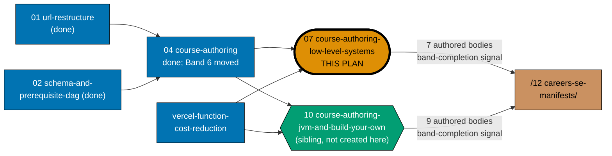
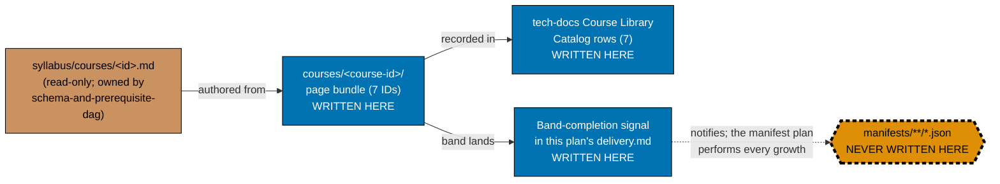

# Learning Path — Course Authoring: Low-Level Systems & Native Languages

## Delivery amendment — one final PR

All 7 courses remain within one plan branch and one delivery unit. The sole draft PR opens only in
Phase 7, after verification and Knowledge Capture, and carries the archival move, CI,
merge, and deploy. Earlier cohort or delivery-boundary PR wording is superseded.

Author **seven course bodies** — the C-family / native-OS / Rust half of the shared course
library's low-level-systems band — landing under
`apps/ayokoding-www/content/en/learn/courses/`:

1. `just-enough-c` (Primer, C)
2. `just-enough-cpp` (Primer, C++)
3. `linux-os` (By Example, C + shell)
4. `windows-os` (By Example, C + PowerShell)
5. `system-programming` (By Example, C)
6. `just-enough-rust` (Primer, Rust)
7. `modern-system-programming` (By Example, Rust)

This is one of **two plans splitting a single band** that was originally too big for one plan under
the repo's 5–15-course-per-plan rule. The source band —
[`ayokoding-learning-path-04-course-authoring`](../../done/2026-08-02__ayokoding-learning-path-04-course-authoring/README.md)'s
**Band 6, "Low-level systems, JVM & languages, internals builds"** (16 courses) — is split along a
natural **C-family/OS vs. JVM/advanced-languages** seam:

- **This plan (`07`)** owns **Band 6a — Low-level systems & native languages** (7 courses, listed
  above): the C/C++/Rust on-ramps plus the OS-internals and systems-programming courses built on top
  of them.
- **`ayokoding-learning-path-10-course-authoring-jvm-and-build-your-own`** (a sibling plan, authored
  by a different agent — **not created by this plan**) owns **Band 6b — JVM, advanced languages &
  build-your-own internals** (9 courses): `just-enough-java`, `enterprise-java-and-the-jvm`, `lisp`,
  `just-enough-fsharp`, `type-systems`, `compilers-parsers-and-transpilers`, `build-your-own-git`,
  `build-your-own-database`, `build-your-own-raft`.

7 + 9 = 16, the original Band 6 total. This plan touches only the 7 course-ID subtrees listed above,
plus this plan's own catalog row additions and band-completion signal — it never edits a manifest and
never touches any file the sibling plan or `ayokoding-learning-path-04-course-authoring` owns.

> **Source-of-truth note.** Every per-course detail below (format, concept/example counts, exact
> prerequisite chain, one-line scope) is copied **verbatim** from
> [`ayokoding-learning-path-04-course-authoring`'s tech-docs.md §Course Library
> Catalog](../../done/2026-08-02__ayokoding-learning-path-04-course-authoring/tech-docs.md#low-level-systems-jvm--languages-internals-builds),
> which is itself transcribed from the cross-plan
> [`syllabus/courses/`](../../done/2026-07-24__ayokoding-learning-path-02-schema-and-prerequisite-dag/syllabus/courses/README.md)
> spec files — never invented fresh. This plan's own authoring steps point at the same
> `syllabus/courses/<course-id>.md` spec files, never at plan04's catalog table (a table row is a
> summary, not a source).

## The manifest ownership invariant (binding — read before anything else)

> **This plan never edits a manifest file.** Every file under
> `apps/ayokoding-www/src/features/course-paths/manifests/` is owned by
> [`ayokoding-learning-path-12-careers-se-manifests`](../ayokoding-learning-path-12-careers-se-manifests/README.md).
> A step in this plan that creates, appends to, reorders, or re-verifies a `.json` manifest is a
> **boundary violation**, not a convenience. This invariant is inherited verbatim from
> `ayokoding-learning-path-04-course-authoring` — it binds every course-authoring split plan in this
> programme, not only the original one.

When this plan's one band lands, it records a **band-completion signal** in its own
[`delivery.md`](./delivery.md) and the manifest plan performs the growth. The signal is the entire
handoff contract; see [Band-completion signal contract](#band-completion-signal-contract) below.

## Position in the split

**Accessibility note.** Role is carried by node **shape** (rectangle = upstream, stadium = this
plan, hexagon = sibling, parallelogram = downstream) and by explicit label text (`THIS PLAN`, `not
created here`), never by fill colour alone. This plan's node additionally carries a **thicker
border**. Fills use the repo's verified accessible palette per the
[Color Accessibility Convention](../../../repo-governance/conventions/formatting/color-accessibility.md).

**No dependency edge exists between this plan and its sibling (`10`).** See
[tech-docs.md §Dependency-edge investigation against plan 10](./tech-docs.md#dependency-edge-investigation-against-plan-10)
for the full evidence trail: every one of plan 10's 9 courses' declared prerequisites was checked
against this plan's 7 course IDs, and none references any of them. The two plans run **fully in
parallel** now that their shared upstream (`04`, trimmed) and
`vercel-function-cost-reduction` are merged.

## Manifest-ownership boundary

**Accessibility note.** Write permission is carried by node **shape** and explicit label text
(`WRITTEN HERE` / `NEVER WRITTEN HERE` / `read-only`), and edge kind by **line style** plus edge
labels — never by fill colour alone. The forbidden node additionally carries a dashed thick border.

## Band-completion signal contract

This plan lands **one** band-completion signal (this plan's half of the original Band 6). The signal
MUST carry all five fields below, verbatim, in a fenced `text` block directly under the band's gate —
inherited unchanged from `ayokoding-learning-path-04-course-authoring`'s own contract. The `BAND`
field's wording matches the pattern the sibling plan
(`ayokoding-learning-path-10-course-authoring-jvm-and-build-your-own`) independently adopted for its
own half's signal, so the two partial signals read as a matched pair to the downstream manifest plan:

| Field               | Content                                                                                 |
| ------------------- | --------------------------------------------------------------------------------------- |
| `BAND`              | `Band 6 (Low-level systems & native-languages half) — ayokoding-learning-path-07`       |
| `PLAN`              | `ayokoding-learning-path-07-course-authoring-low-level-systems`                         |
| `LANDED_COURSE_IDS` | all 7 course IDs, one per line, in this plan's own listing order (courses 1–7 above)    |
| `GROW_MANIFESTS`    | every manifest the manifest plan must grow, by **full path** under `<MANIFESTS>`        |
| `FINAL_PR`          | the number of this plan's sole terminal archival PR, verified merged before consumption |

**`GROW_MANIFESTS` for this band is the three `software-engineer`-role manifests** — matching
`ayokoding-learning-path-04-course-authoring`'s own rule that "Bands 1–4/6/7 grow three" (this band was
originally numbered 6 in that plan, and none of these 7 courses feeds the fourth,
`ai-engineer`-role, path):

- `<MANIFESTS>careers/interview-ready/software-engineer.json`
- `<MANIFESTS>careers/immediately-effective/software-engineer.json`
- `<MANIFESTS>careers/fundamentally-strong/software-engineer.json`

A signal that names manifests loosely, or omits the merged `FINAL_PR`, is incomplete and the receiving plan
must reject it rather than guess — same rule as the source plan.

## Delivery Mode: worktree-to-pr

This plan has exactly one dedicated worktree, one persistent final-delivery branch, and one PR.
All authoring, verification, and Knowledge Capture phases commit on that branch without a push, PR, merge, or deployment. In Phase 7, the executor commits the archival move and
any index updates, opens the sole draft PR, completes the secret scan, local quality checks, and PR quality-gate verification and CI gates,
marks it ready, and performs the normal AI merge/deploy after the hardened preconditions hold.
No per-course, cohort, stage, or phase worktree/branch/PR is permitted.

## Depends-on

| Relation | Plan (full folder name) | Nature |
| -------- | ----------------------- | ------ |
| **blockedBy** | `ayokoding-learning-path-06-course-authoring-architecture-and-ai-harness` | **Hard; sole direct execution prerequisite.** It must be fully merged and archived on `origin/main` before Phase 0. All earlier completion and repository-baseline facts are transitive context, not extra plan prerequisites. |

**Phase 0 start check:** `git ls-tree -r --name-only origin/main plans/done | rg -q "__ayokoding-learning-path-06-course-authoring-architecture-and-ai-harness/README\.md$"` exits 0. This is this plan's only plan-level start gate.

## Verified independence from the other course-authoring split plans

This plan's number (`07`) and its sibling numbers (`05`, `06`, `08`, `09`, `11`) belong to the single
numbering track for the further decomposition of `ayokoding-learning-path-04-course-authoring`'s
remaining (not-yet-authored) bands into per-band plans. As of this plan's authoring time,
`ayokoding-learning-path-05-course-authoring-platform-and-concurrency`,
`-06-course-authoring-architecture-and-ai-harness`, `-08-course-authoring-security-and-ops`,
`-09-course-authoring-interview-technique`, and `-11-course-authoring-capstones` all exist on disk
as sibling `plans/backlog/` folders `[Repo-grounded — confirmed via directory listing]`, authored
concurrently by other agents per this split's own commissioning instructions. **There is no numbering
collision**: a full `plans/backlog/` directory listing confirms every `ayokoding-learning-path-*`
folder from `01` through `18` is uniquely and consistently numbered — this plan's own manifest
downstream (`ayokoding-learning-path-12-careers-se-manifests`) and the accounting/ERP splits
(`-14`/`-15`/`-16-skills-accounting-*`, `-17`/`-18-skills-erp-*`) all sit outside this plan's `05`–`11`
course-authoring numbering track.

**Verified independence from every one of those five siblings.** Unlike this plan's direct sibling
(`10`, the other Band-6 half), whose `build-your-own-raft` genuinely needs `just-enough-go` (owned by
`05-course-authoring-platform-and-concurrency`) and `distributed-systems` (owned by
`06-course-authoring-architecture-and-ai-harness`), **none of this plan's 7 courses' declared
prerequisites references any course outside this plan's own 7 IDs plus the already-shipped
`just-enough-bash`** (an existing Wave-1 course, live since `ayokoding-learning-path-01-url-restructure`
merged). Checked against every prerequisite cell in
[tech-docs.md §Course Library Catalog](./tech-docs.md#course-library-catalog): `just-enough-c` (—),
`just-enough-cpp` (`just-enough-c`), `linux-os` (`just-enough-c`, `just-enough-bash`), `windows-os`
(`just-enough-c`), `system-programming` (`just-enough-c`, `linux-os`), `just-enough-rust` (—),
`modern-system-programming` (`just-enough-rust`). This plan therefore carries **no repository baseline context
edge to any of the five further-split sibling plans** — only to the completed `04` baseline and
`vercel-function-cost-reduction` (new), stated above.

**Why `vercel-function-cost-reduction` is a historical reference for a content plan.** This plan adds 7
new content pages under `apps/ayokoding-www`. Until that plan's Cause-A/Cause-B fixes land, **every**
page on the site — including any page this plan authors — renders dynamically (a serverless function
invocation per view, zero CDN caching), compounding the exact cost problem that plan exists to fix.
Authoring 7 more pages while the site is mid-fix would (a) add further avoidable dynamic-render cost
before the root cause is addressed, and (b) risk touching the same `app/[locale]/layout.tsx` /
`middleware.ts` files that plan's Phases 1–4 are actively rewriting. Waiting for it to merge is
strictly cheaper than authoring concurrently and rebasing through a layout rewrite. See
[delivery.md Phase 0](./delivery.md) for the exact file-based precondition check drawn from that
plan's own README (Cause A: root layout `await headers()` removed; the now-purposeless
`middleware.ts` deleted per its Phase 1 and Phase 4).

## Judgment calls recorded in this plan

This plan makes the following reasonable calls where the task did not fully specify one, per the
instruction to proceed without grilling:

1. **Cohort split is 5 + 2, not a single 7-course cohort.** See
   [tech-docs.md §Why two cohorts, not one](./tech-docs.md#why-two-cohorts-not-one).
2. **Band-signal wording `Band 6 (Low-level systems & native-languages half) — ayokoding-learning-path-07`.**
   The original Band 6 had no sub-labels; this plan's informal prose still calls its half "Band 6a"
   for readability, but the actual `BAND` signal field uses the parenthetical-half phrasing above to
   match the pattern the sibling plan (`10`) independently adopted for its own signal — confirmed by
   reading that plan's own `README.md` during this authoring session, not asserted blind.
3. **This plan's own design-decision IDs use a `DD-LLS-` prefix** (`LLS` = Low-Level Systems), not the
   shared `DD-1`…`DD-40` pool `ayokoding-learning-path-04-course-authoring` and its siblings use — this
   avoids any risk of colliding with a decision ID the sibling plan or a future split independently
   picks from the same shared pool. See [tech-docs.md §Design Decisions](./tech-docs.md#design-decisions).
4. **`learnings.md` is included as a sixth file** even though the task named "the full 5-document
   set" — the standard plan structure treats `learnings.md` as a required transient companion file
   (referenced by this plan's own Phase 0 and Knowledge Capture phase), so it is included empty,
   ready for the executor to append to during execution.
5. **Delivery-boundary grouping.** Verification, manual testing, final CI integration, and knowledge
   capture all fold into one closeout unit ending at Phase 7 (Plan Archival) rather than each opening
   a separate PR — this plan has no supersession-sweep-style real content fix at the verification phase
   (unlike `ayokoding-learning-path-04-course-authoring`'s Phase 12), so nothing forces an earlier
   standalone boundary.

## Rule-15 three-tester retest — exemption recorded

**Exempt, with reasons stated (not silently omitted)** — identical reasoning to
`ayokoding-learning-path-04-course-authoring`, inherited because this plan is content-only in the
same way:

1. **It ships no screen and no component.** Every artefact is a markdown page bundle under
   `apps/ayokoding-www/content/en/learn/courses/`. The screens that render those pages are owned by
   `ayokoding-learning-path-03-navigation-ui` (already done), which carried the mandatory retest.
2. **Its output surface is already covered by dedicated checkers** —
   `apps-ayokoding-www-{primer,by-example}-checker`, `apps-ayokoding-www-facts-checker`, and
   `apps-ayokoding-www-link-checker` — content-domain checkers strictly stronger, for prose
   correctness, than a generalist live-site UX triad.
3. **The retest would test the other plan's surface**, producing findings this plan cannot act on.

**This is an exemption, not an omission**, and it is **narrow**: manual behavioural verification via
Playwright MCP is still mandatory and performed (see `delivery.md` Phase 4) — a sample of the 7
authored course pages is opened at all three breakpoints in the `en` content locale, with committed
screenshot evidence.

## Locale scope

This plan's content is authored **`en`-only** — matching every plan in this course-authoring family.
An Indonesian mirror is explicitly deferred (recorded decision, not an omission).

## Navigation

- [Business Requirements (brd.md)](./brd.md) — WHY these 7 bodies exist, business risks, and what
  "done" means in business terms.
- [Product Requirements (prd.md)](./prd.md) — personas, user stories, Gherkin acceptance criteria,
  the 7-course specifications, and product scope.
- [Technical Docs (tech-docs.md)](./tech-docs.md) — the authoring architecture, the Course Library
  Catalog rows for these 7 courses, the dependency-edge investigation against plan 10, and design
  decisions.
- [Delivery Checklist (delivery.md)](./delivery.md) — the phased, executable checklist.
- [Learnings (learnings.md)](./learnings.md) — knowledge-capture running log.
- **Cross-plan**:
  [`syllabus/courses/` catalog](../../done/2026-07-24__ayokoding-learning-path-02-schema-and-prerequisite-dag/syllabus/courses/README.md)
  ·
  [`ayokoding-learning-path-04-course-authoring`](../../done/2026-08-02__ayokoding-learning-path-04-course-authoring/README.md)
  (source band + trimmed baseline)
  ·
  [`ayokoding-learning-path-12-careers-se-manifests`](../ayokoding-learning-path-12-careers-se-manifests/README.md)
  (downstream consumer)
  · [`vercel-function-cost-reduction`](../../done/2026-08-02__vercel-function-cost-reduction/README.md)
  (historical reference)

## Provenance

This plan is one of **two** folders produced by splitting
`ayokoding-learning-path-04-course-authoring`'s **Band 6** (16 courses — too large for the
5–15-course-per-plan rule) along the natural C-family/OS vs. JVM/advanced-languages seam:

- **This plan (`07`)** — Band 6a, 7 courses (C-family / OS / Rust).
- **`ayokoding-learning-path-10-course-authoring-jvm-and-build-your-own`** — Band 6b, 9 courses
  (JVM / advanced languages / build-your-own internals), authored by a different agent, not created
  by this plan.

`ayokoding-learning-path-04-course-authoring` is the **source plan** for the split. Its completed
closeout trimmed Band 6 from its scope — its Band-6 phase, band-completion-signal slot, and these
seven slugs (plus the sibling plan's nine) are absent from its terminal 21-course scope. The archived
plan is therefore the concrete, checkable source of the now-satisfied baseline dependency stated
above; this plan's Phase 0 verifies that archived baseline before authoring begins (see
[delivery.md](./delivery.md)).
