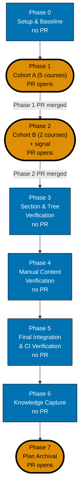

# Delivery Checklist — Course Authoring: Low-Level Systems & Native Languages

This checklist authors **7 course bodies** into
`apps/ayokoding-www/content/en/learn/courses/<course-id>/`: `just-enough-c`, `just-enough-cpp`,
`linux-os`, `windows-os`, `system-programming`, `just-enough-rust`, `modern-system-programming` — the
C-family/OS/Rust half of the original Band 6 split described in [README.md](./README.md) and
[tech-docs.md](./tech-docs.md).

> **This plan never edits a manifest file.** Every file under `<MANIFESTS>` belongs to
> [`ayokoding-learning-path-12-careers-se-manifests`](../ayokoding-learning-path-12-careers-se-manifests/README.md).
> This plan's only outbound artefact toward that plan is the **one** band-completion signal recorded
> at the end of Phase 2. See
> [README §The manifest ownership invariant](./README.md#the-manifest-ownership-invariant-binding--read-before-anything-else).
>
> **Cross-plan source of truth** — every course body is authored **from** its
> `syllabus/courses/<course-id>.md` spec at
> [`../../done/2026-07-24__ayokoding-learning-path-02-schema-and-prerequisite-dag/syllabus/`](../../done/2026-07-24__ayokoding-learning-path-02-schema-and-prerequisite-dag/syllabus/README.md).
> **Never copy those files into this plan.**
>
> **Legend** — `[AI]`: an agent performs the step (the default; unmarked steps are `[AI]`).
> `[HUMAN]`: only a human can do it. `[AI+HUMAN]`: agent prepares, human approves or finishes.
> Git-mechanical steps (worktree create/remove, branch, push, merge) are `[AI]`. **This plan contains
> no `[HUMAN]` step.**
>
> **Phase Gate** — every phase ends with a `### Phase N Gate` (must-pass verification) plus a
> `> **Pause Safety**:` note. A gate in a phase named as a delivery boundary in the
> [`### Delivery Boundaries`](#delivery-boundaries) table additionally covers integration (draft PR
> opened, 3-cycle PR-Review, CI green, `[AI]` merge, `ayokoding-www` deployed); a gate in an
> **intermediate** phase confirms the work is committed to its delivery unit's branch with nothing
> pushed for review yet — see
> [Plans Organization Convention §PRs Open at Delivery Boundaries](../../../repo-governance/conventions/structure/plans.md#prs-open-at-delivery-boundaries-not-every-phase-hard-rule).
>
> **Executor environment note — RTK / `grep -c` sanctioned-zero-assertion rule (inherited, condensed
> from `ayokoding-learning-path-04-course-authoring`'s own delivery.md).** This repo routes `git` (and
> other commands) through RTK via a Claude Code hook (see `CLAUDE.md` §RTK). For a clean `git diff`,
> `| grep -c .` reads **0** and is the sanctioned zero-assertion form used throughout this file; `| wc -l`
> is **never** used for a zero-assertion here, because RTK's own empty-output marker makes it read `1`
> on a clean diff, not `0`. For a non-zero count, interpose an explicit `grep -F …` / `grep -E …` path
> filter rather than trusting a bare `wc -l`. Count files with `git ls-files`, never `ls … | wc -l`
> (`ls` is `eza`-aliased and its OSC-8 hyperlinks corrupt anything piped further) and never a **bare**
> `find` (rewritten by the hook to `rtk find`, which reformats the result and drops unknown flags) —
> use a **piped** `find … | wc -l` when a real count is needed, or `git ls-files` when the search is
> pathspec-shaped.

## Worktree

Worktree path: `worktrees/ayokoding-learning-path-07-course-authoring-low-level-systems/`

Optional manual pre-provisioning (run from repo root):

```bash
claude --worktree ayokoding-learning-path-07-course-authoring-low-level-systems
```

The plan-execution Step 0 gate enters this worktree by default: it auto-provisions from the latest
`origin/main` when missing, syncs with `origin/main` before implementing, and prompts before deleting
the worktree after the plan is archived and pushed.

Every phase branches from the **latest `origin/main`** inside this one shared worktree
(`git fetch origin && git checkout main && git pull && git checkout -b ayokoding-learning-path-07-course-authoring-low-level-systems/<phase-slug>`)
and authors its work there, committing as it goes. Only the phase(s) named as a **delivery boundary**
in the [`### Delivery Boundaries`](#delivery-boundaries) table push that branch and open **their own
draft PR**; an intermediate phase commits (and may push the branch for durability) without opening
one. **Phase 0 is excluded from opening a PR under any circumstance**: its evidence artifacts ride
the Phase 1 PR.

## Delivery Mode: worktree-to-pr

Each **delivery boundary** named in the [`### Delivery Boundaries`](#delivery-boundaries) table —
Phase 1, Phase 2, and Phase 7; Phase 0 opens none — works in the shared worktree on its **own
branch**, opens a **draft PR** against `main`, runs the **PR-Review Maker→Fixer Cycle** (fan-out →
`pr-review-synthesis-maker` → `pr-review-fixer`, 3 sequential CI-gated cycles), flips the PR to ready,
and `[AI]` **merges it automatically once all quality gates are green** — then `[AI]` **deploys
`ayokoding-www` to `prod-ayokoding-www` after every merge**. An intermediate phase inside a delivery
unit instead commits (and may push for durability) to that unit's branch without opening a PR of its
own.

**Inherited sequential five-course delivery cohort cadence** (stated fresh here, not retrofitted —
this is a brand-new plan): courses are authored, checked, and committed **one at a time** within a
cohort; a draft PR opens only after the cohort is complete. This plan's 7 courses form **two
cohorts**: Cohort A (courses 1–5, Phase 1) and Cohort B (courses 6–7, Phase 2) — see
[tech-docs.md §Why two cohorts, not one](./tech-docs.md#why-two-cohorts-not-one) for the reasoning.
The two cohorts execute **sequentially** (Phase 2 begins only after Phase 1's PR is merged), not in
parallel, even though they are DAG-independent of each other — matching the one-cohort-at-a-time
operating model the inherited cadence itself uses.

**`[AI]` auto-merge is the repo default** (per the
[PR Merge Protocol](../../../repo-governance/development/workflow/pr-merge-protocol.md)): a PR merges
once 3 review cycles are complete (a hard ceiling, not a floor), 0 CRITICAL + 0 HIGH findings remain,
the branch is up-to-date with `origin/main`, all quality gates are green, and the surface-conditional
tester gates are resolved or exempt. This plan declares **no `[HUMAN]` merge gate**.

**Delivery-Boundary Integration Protocol** (fires once per delivery boundary — Phases 1, 2, and 7;
Phase 0 is excluded):

1. [AI] Sync the worktree to latest `origin/main` and branch:
   `git fetch origin && git checkout main && git pull && git checkout -b ayokoding-learning-path-07-course-authoring-low-level-systems/<phase-slug>`.
2. [AI] Stage only this phase's paths (`git add <explicit paths>` — never `git add -A`), commit
   thematically (Conventional Commits, imperative, no period), push the branch, open a **draft PR**
   against `main` (`gh pr create --draft --base main ...`).
3. [AI] Run the **PR-Review Maker→Fixer Cycle** (3 sequential CI-gated cycles), resolve every finding,
   then `gh pr ready`.
4. [AI] **Merge** once all quality gates are green — `[AI]` auto-merge per the repo default.
5. [AI] Dispatch `apps-ayokoding-www-deployer` to deploy `ayokoding-www` to `prod-ayokoding-www`.

## Depends-on

| Relation        | Plan (full folder name)                                              | Nature                                                                                                                       |
| --------------- | -------------------------------------------------------------------- | ---------------------------------------------------------------------------------------------------------------------------- |
| **blockedBy**   | `ayokoding-learning-path-04-course-authoring`                        | **Hard.** Merged, with Band 6 trimmed from its own scope — no duplicate-authoring race over these 7 course IDs.              |
| **blockedBy**   | `vercel-function-cost-reduction`                                     | **Hard.** Merged — the site no longer renders every page dynamically before this plan adds 7 more.                           |
| **independent** | `ayokoding-learning-path-10-course-authoring-jvm-and-build-your-own` | Sibling split of the same original Band 6. No shared file, no dependency edge either direction (verified, see tech-docs.md). |

**Start precondition (hard gate, checked in Phase 0)**: both blocking plans are **merged to
`origin/main`**, with the concrete checkable signals below. This plan does not start on a promise.

## Parallelization Model

**Cap**: honor the in-force subagent/PR-review concurrency cap.

- **Phase 0** is a single serial baseline.
- **Phase 1 (Cohort A, 5 courses)** — authored **one course at a time** in DAG order
  (`just-enough-c` → `just-enough-cpp`/`linux-os`/`windows-os` in any order → `system-programming`
  last, since it needs `linux-os`), per the inherited cadence. One shared branch, one PR at the end.
- **Phase 2 (Cohort B, 2 courses)** — authored one at a time (`just-enough-rust` →
  `modern-system-programming`, since the latter needs the former). One shared branch, one PR, plus
  the band-completion signal at the end.
- **Phases 3–6 (verification, manual test, CI integration, knowledge capture)** are serial,
  committing to one shared closeout branch, folding into Phase 7's PR.
- **Phase 7 (archival)** is the terminal serial node, depending on every prior phase.

**Path constants** (referenced throughout):

- `<COURSES>` = `apps/ayokoding-www/content/en/learn/courses/` (course bundles; served at
  `/en/learn/courses/<course-id>`)
- `<FEAT>` = `apps/ayokoding-www/src/features/course-paths/` (**never written here**)
- `<MANIFESTS>` = `<FEAT>manifests/` (**never written here**)
- `<SYLLABUS>` = `../../done/2026-07-24__ayokoding-learning-path-02-schema-and-prerequisite-dag/syllabus/`
  (cross-plan authoring source of truth — **never copied**)
- `<PLAN04>` = the resolved path to `ayokoding-learning-path-04-course-authoring`'s folder at
  execution time (`plans/in-progress/...` or, once archived, `plans/done/YYYY-MM-DD__...`) — resolved
  once in Phase 0 and recorded to `evidence/phase-0-snapshot.txt`.

### Delivery Boundaries

| Phase(s) | Delivery unit                                                                                                  | Worktree / branch                                                                | PR opens         |
| -------- | -------------------------------------------------------------------------------------------------------------- | -------------------------------------------------------------------------------- | ---------------- |
| 0        | — (setup and baseline)                                                                                         | —                                                                                | no               |
| 1        | Cohort A — 5 courses (`just-enough-c`, `just-enough-cpp`, `linux-os`, `windows-os`, `system-programming`)      | `ayokoding-learning-path-07-course-authoring-low-level-systems/cohort-a`         | yes — at Phase 1 |
| 2        | Cohort B — 2 courses (`just-enough-rust`, `modern-system-programming`) + the band-completion signal            | `ayokoding-learning-path-07-course-authoring-low-level-systems/cohort-b`         | yes — at Phase 2 |
| 3–7      | Closeout: structural verification, manual verification, final CI integration, knowledge capture, plan archival | `ayokoding-learning-path-07-course-authoring-low-level-systems/phase-7-closeout` | yes — at Phase 7 |

**Phases 3–6 are intermediate**: none produces a real content fix that by itself satisfies the
boundary test (coherent / green standalone / defensible on `main` / reviewable whole) independent of
what Phase 1 and 2 already shipped — unlike `ayokoding-learning-path-04-course-authoring`'s own Phase
12, this plan carries no supersession sweep. All four fold into Phase 7's closeout PR, which is the
plan's last change-producing phase and therefore always a boundary.

### Phase / delivery-flow diagram



**Accessibility note.** Boundary vs. intermediate is carried by node **shape** (stadium = boundary,
rectangle = intermediate) and by explicit `"PR opens"` / `"no PR"` label text, never by fill colour
alone; boundary nodes additionally carry a thicker border. Fills use the repo's verified accessible
palette per the
[Color Accessibility Convention](../../../repo-governance/conventions/formatting/color-accessibility.md).

---

## Phase 0: Environment Setup & Baseline

> _Executor: repo-setup-manager_

- [ ] [AI] Enter/provision the worktree and install dependencies: `npm install` — acceptance: exits
      0, `node_modules/` synchronized.
- [ ] [AI] Converge the toolchain: `npm run doctor -- --fix` — acceptance: exits 0 with no unresolved
      drift.
- [ ] [AI] **Resolve `<PLAN04>` and verify Band 6 is trimmed from its own scope** — command (run as
      one call):

  ```bash
  git ls-files -- 'plans/*/*ayokoding-learning-path-04-course-authoring/evidence/authored-body-slugs.txt'
  ```

  — acceptance: prints **exactly one** path (pipe to `grep -c .`, read **1**); record it as
  `<PLAN04_SLUGS>` in `evidence/phase-0-snapshot.txt`. Then:

  ```bash
  grep -cE '^(just-enough-c|just-enough-cpp|linux-os|windows-os|system-programming|just-enough-rust|modern-system-programming)$' "<PLAN04_SLUGS>"
  ```

  — acceptance: returns **0** (none of this plan's 7 slugs remain in plan04's own claimed list — the
  trim landed). This is the **load-bearing check** for this precondition. Falsifiable both ways:
  today (2026-08-01, before the trim lands), this reads **7** — verified live against plan04's
  current register, which still lists Phase 8 / Band 6 with all 16 slugs including this plan's 7 and
  still totals **90** lines. **Do not additionally assert a fixed total line count** (e.g. "90 − 16 =
  74") for `<PLAN04_SLUGS>`: this plan does not control, and cannot predict at authoring time, how
  many of plan04's _other_ remaining bands the concurrently-authored sibling plans
  (`05-course-authoring-platform-and-concurrency`, `06-course-authoring-architecture-and-ai-harness`,
  `08-course-authoring-security-and-ops`, `09-course-authoring-interview-technique`,
  `11-course-authoring-capstones`) also carve out of plan04's scope before this plan's own execution
  begins — plan04's final total could land anywhere from 74 (only Band 6 removed) down to a much
  smaller remainder (if every other band is also extracted). Pinning a specific total here would be a
  fabricated acceptance criterion this plan cannot ground. The only fact this plan needs, and the only
  one it asserts, is that its own 7 slugs are gone from plan04's list.

- [ ] [AI] **Verify `vercel-function-cost-reduction`'s concrete rendering-fix signal** — two checks,
      both required (`test ! -f` and a zero-count `grep`, read the printed number rather than
      `&&`-chaining since `grep -c` exits 1 on a zero count):

  ```bash
  test ! -f apps/ayokoding-www/src/middleware.ts
  grep -c 'await headers()' apps/ayokoding-www/src/app/layout.tsx
  ```

  — acceptance: the `test` exits 0 (the now-purposeless middleware is deleted, per that plan's
  Phase 4) **and** the `grep -c` prints **0** (Cause A's `await headers()` call is removed from the
  root layout, per that plan's Phase 1). Falsifiable both ways: today, before that plan merges, the
  `test` exits 1 (`middleware.ts` still present) and the `grep -c` prints **1** (the call is present at
  `apps/ayokoding-www/src/app/layout.tsx:24`, verified 2026-08-01). **Corroborating outcome-based
  check** (the two checks above are cause-based; this one is the effect they should produce): after a
  fresh `npx nx run ayokoding-www:build`,
  `python3 -c "import json;print(len(json.load(open('apps/ayokoding-www/.next/prerender-manifest.json'))['routes']))"`
  reads a number **≥ 2000** (close to the ~2,068-page content tree), not the pre-fix baseline of **4**
  (`dynamicRoutes: 0`, `routes` length 4 — measured 2026-08-01, matching the sibling plan `10`'s own
  independently-measured figure). This is the same signal
  `ayokoding-learning-path-10-course-authoring-jvm-and-build-your-own`'s Phase 0 uses, reproduced here
  for cross-plan consistency rather than re-derived differently.

- [ ] [AI] **Confirm all 7 course slugs are absent (no collision)** under `<COURSES>` — command:

  ```bash
  for s in just-enough-c just-enough-cpp linux-os windows-os system-programming just-enough-rust modern-system-programming; do
    test -e "apps/ayokoding-www/content/en/learn/courses/$s" && echo "EXISTS COURSES $s"
  done
  ```

  — acceptance: **zero** output lines. Falsifiable both ways:
  `mkdir -p apps/ayokoding-www/content/en/learn/courses/just-enough-cpp` makes the loop print
  `EXISTS COURSES just-enough-cpp`.

- [ ] [AI] Establish content baselines: `npx nx run ayokoding-www:build` and
      `npx nx run ayokoding-www:test:unit` — acceptance: both exit 0; record pass state in
      `evidence/phase-0-snapshot.txt`.
- [ ] [AI] **Create the authored-body slug register** —

  ```bash
  cat > evidence/authored-body-slugs.txt <<'EOF'
  just-enough-c
  just-enough-cpp
  linux-os
  windows-os
  system-programming
  just-enough-rust
  modern-system-programming
  EOF
  ```

  — acceptance: `wc -l < evidence/authored-body-slugs.txt` returns **7**, and
  `sort evidence/authored-body-slugs.txt | uniq -d | wc -l` returns **0**.

- [ ] [AI] **Record the authored-body baseline** —
      `while read -r s; do test -d "apps/ayokoding-www/content/en/learn/courses/$s" || echo "ABSENT $s"; done < evidence/authored-body-slugs.txt | wc -l`
      — acceptance: returns **7** today; must return **0** at archival (Phase 7). Record in
      `evidence/phase-0-snapshot.txt`.
- [ ] [AI] Confirm `learnings.md` exists in the plan folder with its H1 — command:
      `test -f learnings.md && head -1 learnings.md` — acceptance: file present, first line is
      `# Learnings: ayokoding-learning-path-07-course-authoring-low-level-systems`.
- [ ] [AI] **Cross-plan link gate** — confirm every reference in this plan's own files resolves:

  ```bash
  cargo run --release --quiet --manifest-path apps/rhino-cli/Cargo.toml -- md links validate \
    --quiet \
    --exclude plans/done \
    --exclude apps/ayokoding-www/content \
    --exclude apps/ose-www/content 2>&1 | grep -F "ayokoding-learning-path-07-course-authoring-low-level-systems"
  ```

  — acceptance: the `grep` finds **no** matching line (exits 1).

- [ ] [AI] **Confirm no manifest file changed in this phase** —
      `git diff --name-only origin/main...HEAD -- 'apps/ayokoding-www/src/features/course-paths/manifests/' | grep -c .`
      — acceptance: returns **0**.

### Phase 0 Gate

> All checks below must pass before starting Phase 1.

- [ ] [AI] `npm install` exited 0 and `npm run doctor -- --fix` reports no unresolved drift.
- [ ] [AI] `<PLAN04_SLUGS>` resolved to exactly one path; the trim confirmed (0 of this plan's 7 slugs
      remain in plan04's register — no assertion made about that register's total line count, which
      this plan does not control).
- [ ] [AI] `vercel-function-cost-reduction`'s signal confirmed (`middleware.ts` absent; `headers()`
      call removed from the root layout; the prerender-manifest route count ≥ 2000).
- [ ] [AI] All 7 course slugs confirmed absent under `<COURSES>` (zero `EXISTS` lines).
- [ ] [AI] `ayokoding-www:build` + `test:unit` baselines recorded green.
- [ ] [AI] `evidence/authored-body-slugs.txt` holds 7 unique slugs; the ABSENT-count baseline of 7 is
      recorded.
- [ ] [AI] Cross-plan link gate green.
- [ ] [AI] Zero manifest files touched.
- [ ] [AI] **No PR was opened for this phase and nothing was pushed**:
      `git ls-remote --heads origin "$(git branch --show-current)" | grep -c .` returns **0**, and
      `gh pr list --head "$(git branch --show-current)" --json number --jq 'length'` returns **0**.

> **Pause Safety**: only the toolchain, the two upstream preconditions, and the slug register were
> established — no course body exists yet, nothing is pushed, and no PR exists. Safe to stop
> indefinitely. To resume: re-run the two blocking-plan verification commands and the baseline build.

---

## Phase 1: Author Cohort A (5 courses — the C-family chain)

> Each course is authored as a full page-bundle into `<COURSES><course-id>/`, following the
> nine-step convention in
> [tech-docs.md §The per-course authoring convention](./tech-docs.md#the-per-course-authoring-convention-maker-checker-fixer-not-code-tdd).
> **Author each course body from its `<SYLLABUS>courses/<id>.md` spec, not from a fresh judgment call.**
> Courses are authored **one at a time** (inherited cadence); the cohort opens **one** draft PR after
> all 5 land.

- [ ] [AI] `just-enough-c` (Primer · C, `<SYLLABUS>courses/just-enough-c.md`) — convention steps 1–9
      complete; checkers clean (zero CRITICAL/HIGH/MEDIUM) — acceptance:
      `test -d "apps/ayokoding-www/content/en/learn/courses/just-enough-c/learning"` and
      `test -d "apps/ayokoding-www/content/en/learn/courses/just-enough-c/drilling"` both exit 0.
  - _Suggested executor: `apps-ayokoding-www-primer-maker`_
- [ ] [AI] `just-enough-cpp` (Primer · C++, `<SYLLABUS>courses/just-enough-cpp.md`; declares
      `just-enough-c` a prerequisite — DD-14's dedicated on-ramp) — convention steps 1–9 complete;
      checkers clean — acceptance: the `prerequisites` frontmatter array must list `just-enough-c` as
      a quoted exact element (matching the repo's `prerequisites: ["id1", "id2"]` convention), not
      merely contain `just-enough-cpp`'s own slug as a substring —
      `grep -F -q '"just-enough-c"' "apps/ayokoding-www/content/en/learn/courses/just-enough-cpp/_index.md"`
      exits 0.

  **Gherkin (binds) →** "just-enough-cpp declares its C on-ramp prerequisite"

  ```gherkin
  Scenario: just-enough-cpp declares its C on-ramp prerequisite
    Given the just-enough-cpp course is authored
    When a reader inspects its declared prerequisites
    Then it names just-enough-c as a prerequisite
    And its overview states the C-to-C++ progression rationale (DD-14's dedicated on-ramp)
  ```

  - _Suggested executor: `apps-ayokoding-www-primer-maker`_

- [ ] [AI] `linux-os` (By Example · C + shell, `<SYLLABUS>courses/linux-os.md`; declares `just-enough-c`
      and `just-enough-bash` as prerequisites) — convention steps 1–9 complete; checkers clean —
      acceptance:
      `grep -F -q 'just-enough-c' "apps/ayokoding-www/content/en/learn/courses/linux-os/_index.md"`
      exits 0 **and**
      `grep -F -q 'just-enough-bash' "apps/ayokoding-www/content/en/learn/courses/linux-os/_index.md"`
      exits 0 **and** its `overview.md` states an explicit Linux-family scope boundary against
      `windows-os`.
  - _Suggested executor: `apps-ayokoding-www-by-example-maker`_
- [ ] [AI] `windows-os` (By Example · C + PowerShell, `<SYLLABUS>courses/windows-os.md`; declares
      `just-enough-c` a prerequisite) — convention steps 1–9 complete; checkers clean — acceptance:
      `grep -F -q 'just-enough-c' "apps/ayokoding-www/content/en/learn/courses/windows-os/_index.md"`
      exits 0 **and** its `overview.md` states an explicit Windows-family scope boundary against
      `linux-os`.

  **Gherkin (binds) →** "linux-os and windows-os state distinct OS-family scope boundaries"

  ```gherkin
  Scenario: linux-os and windows-os state distinct OS-family scope boundaries
    Given linux-os and windows-os are both authored
    When a reader compares their overviews
    Then each explicitly scopes to its own OS family (Linux syscalls/filesystems vs. Windows internals/the API)
    And neither overview presents the other's OS family as in scope
  ```

  - _Suggested executor: `apps-ayokoding-www-by-example-maker`_

- [ ] [AI] `system-programming` (By Example · C, `<SYLLABUS>courses/system-programming.md`; declares
      `just-enough-c` and `linux-os` as prerequisites — authored **last** in this cohort since it
      needs `linux-os`) — convention steps 1–9 complete; checkers clean — acceptance:
      `grep -F -q 'just-enough-c' "apps/ayokoding-www/content/en/learn/courses/system-programming/_index.md"`
      exits 0 **and**
      `grep -F -q 'linux-os' "apps/ayokoding-www/content/en/learn/courses/system-programming/_index.md"`
      exits 0.

  **Gherkin (binds) →** "The C-family prerequisite chain resolves in declaration order"

  ```gherkin
  Scenario: The C-family prerequisite chain resolves in declaration order
    Given just-enough-c, linux-os, and system-programming are all authored
    When the library's prerequisite DAG is read for these three IDs
    Then linux-os declares just-enough-c and just-enough-bash as prerequisites
    And system-programming declares just-enough-c and linux-os as prerequisites
  ```

  - _Suggested executor: `apps-ayokoding-www-by-example-maker`_

- [ ] [AI] **Confirm no manifest file changed across this cohort's whole diff** —
      `git diff --name-only origin/main...HEAD -- 'apps/ayokoding-www/src/features/course-paths/manifests/' | grep -c .`
      — acceptance: returns **0**.
- [ ] [AI] **Add all 5 catalog rows** to `tech-docs.md` §Course Library Catalog (already present at
      authoring time in this plan's own file — verify they match the settled specs, do not re-derive)
      and list all 5 in `<COURSES>_index.md` — acceptance: 5 new list entries present.

### Phase 1 Gate

- [ ] [AI] All 5 Cohort-A bodies exist:
      `for s in just-enough-c just-enough-cpp linux-os windows-os system-programming; do test -d "apps/ayokoding-www/content/en/learn/courses/$s" || echo "ABSENT $s"; done | wc -l`
      returns **0** (returns 5 before this phase).
- [ ] [AI] `just-enough-cpp` declares `just-enough-c`; `linux-os` declares `just-enough-c` and
      `just-enough-bash`; `windows-os` declares `just-enough-c`; `system-programming` declares
      `just-enough-c` and `linux-os`.
- [ ] [AI] Checkers clean across all 5; `npx nx run ayokoding-www:build` and `npm run lint:md` exit 0.
- [ ] [AI] Catalog rows added for all 5; `<COURSES>_index.md` lists all 5; zero manifest files
      touched.
- [ ] [AI] Draft PR opened for Cohort A — this unit's own boundary; 3-cycle PR-Review complete; CI
      green; PR `[AI]`-merged; `ayokoding-www` deployed.

> **Pause Safety**: the complete C-family chain (`just-enough-c` → `just-enough-cpp` / `linux-os` /
> `windows-os` → `system-programming`) is live at canonical URLs; no manifest references any of it
> yet. Safe to stop indefinitely. To resume: re-run the 5-course presence check and the build.

---

## Phase 2: Author Cohort B (2 courses — the Rust chain) + band-completion signal

> Cohort B is DAG-independent of Cohort A (neither `just-enough-rust` nor
> `modern-system-programming` references any Cohort-A course), but executes **after** Phase 1 merges,
> per the inherited one-cohort-at-a-time cadence.

- [ ] [AI] `just-enough-rust` (Primer · Rust, `<SYLLABUS>courses/just-enough-rust.md`) — convention
      steps 1–9 complete; checkers clean — acceptance:
      `test -d "apps/ayokoding-www/content/en/learn/courses/just-enough-rust/learning"` and
      `test -d "apps/ayokoding-www/content/en/learn/courses/just-enough-rust/drilling"` both exit 0.
  - _Suggested executor: `apps-ayokoding-www-primer-maker`_
- [ ] [AI] `modern-system-programming` (By Example · Rust, `<SYLLABUS>courses/modern-system-programming.md`;
      declares `just-enough-rust` a prerequisite; states itself as `system-programming`'s (81) Rust
      counterpart — DD-LLS-2) — convention steps 1–9 complete; checkers clean — acceptance:
      `grep -F -q 'just-enough-rust' "apps/ayokoding-www/content/en/learn/courses/modern-system-programming/_index.md"`
      exits 0 **and** its `overview.md` contains the literal phrase
      `` `Rust counterpart to system-programming` `` verbatim (a fixed distinguishing phrase, not a
      bare substring match — `modern-system-programming`'s own self-referential slug/title mentions
      can never coincidentally produce this exact phrase) —
      `grep -F -q 'Rust counterpart to system-programming' "apps/ayokoding-www/content/en/learn/courses/modern-system-programming/overview.md"`
      exits 0 (the counterpart relationship is stated, not merely implied).

  **Gherkin (binds) →** "system-programming and modern-system-programming state their counterpart relationship"

  ```gherkin
  Scenario: system-programming and modern-system-programming state their counterpart relationship
    Given system-programming (C) and modern-system-programming (Rust) are both authored
    When a reader compares their overviews
    Then modern-system-programming's overview names system-programming as its C counterpart
    And each teaches the same close-to-metal principles in its own language's idiom without reproducing the other's worked examples
  ```

  - _Suggested executor: `apps-ayokoding-www-by-example-maker`_

- [ ] [AI] **Confirm no manifest file changed across this cohort's whole diff** —
      `git diff --name-only origin/main...HEAD -- 'apps/ayokoding-www/src/features/course-paths/manifests/' | grep -c .`
      — acceptance: returns **0**.
- [ ] [AI] **Add both catalog rows** to `tech-docs.md` §Course Library Catalog and list both in
      `<COURSES>_index.md`.
- [ ] [AI] **Record the one band-completion signal** — append this fenced block, verbatim with real
      values substituted, directly under this cohort's own section:

  ```text
  BAND: Band 6 (Low-level systems & native-languages half) — ayokoding-learning-path-07
  PLAN: ayokoding-learning-path-07-course-authoring-low-level-systems
  LANDED_COURSE_IDS:
  just-enough-c
  just-enough-cpp
  linux-os
  windows-os
  system-programming
  just-enough-rust
  modern-system-programming
  GROW_MANIFESTS:
  apps/ayokoding-www/src/features/course-paths/manifests/careers/interview-ready/software-engineer.yaml
  apps/ayokoding-www/src/features/course-paths/manifests/careers/immediately-effective/software-engineer.yaml
  apps/ayokoding-www/src/features/course-paths/manifests/careers/fundamentally-strong/software-engineer.yaml
  MERGED_COMMIT: <this cohort's origin/main merge commit SHA>
  ```

  — acceptance: all seven `LANDED_COURSE_IDS` resolve to a directory under `<COURSES>`; all three
  `GROW_MANIFESTS` paths are the software-engineer-role manifests only (never the `ai-engineer`
  manifest — none of these 7 courses is AI-engineering content); `MERGED_COMMIT` is filled in
  **after** this cohort's PR merges (a placeholder until then is acceptable mid-phase, but the gate
  below requires it resolved).

### Phase 2 Gate

- [ ] [AI] Both Cohort-B bodies exist:
      `for s in just-enough-rust modern-system-programming; do test -d "apps/ayokoding-www/content/en/learn/courses/$s" || echo "ABSENT $s"; done | wc -l`
      returns **0**.
- [ ] [AI] `modern-system-programming` declares `just-enough-rust` and names `system-programming` as
      its counterpart in its own overview.
- [ ] [AI] Checkers clean across both; `npx nx run ayokoding-www:build` and `npm run lint:md` exit 0.
- [ ] [AI] Catalog rows added for both; `<COURSES>_index.md` lists both; zero manifest files touched.
- [ ] [AI] The one band-completion signal is present with all five fields filled and a resolvable
      `MERGED_COMMIT` — `git cat-file -e "<the recorded SHA>^{commit}"` exits 0.
- [ ] [AI] Draft PR opened for Cohort B — this unit's own boundary; 3-cycle PR-Review complete; CI
      green; PR `[AI]`-merged; `ayokoding-www` deployed.

> **Pause Safety**: all 7 authored bodies are now live; the one band-completion signal is recorded
> and reachable. This plan's content-authoring surface is complete. Safe to stop. To resume: re-run
> the 7-slug presence check and the signal's `MERGED_COMMIT` resolution check.

---

## Phase 3: Section & Authored-Tree Verification

- [ ] [AI] **Verify all 7 authored bodies are present** —
      `while read -r s; do test -d "apps/ayokoding-www/content/en/learn/courses/$s" || echo "ABSENT $s"; done < evidence/authored-body-slugs.txt | wc -l`
      — acceptance: returns **0** (returned 7 at the Phase-0 baseline).
- [ ] [AI] **Verify every authored body declares prerequisites** —
      `while read -r s; do grep -F -q 'prerequisites:' "apps/ayokoding-www/content/en/learn/courses/$s/_index.md" || echo "MISSING $s"; done < evidence/authored-body-slugs.txt | wc -l`
      — acceptance: returns **0**.
- [ ] [AI] **Verify every authored body has both tracks** —
      `while read -r s; do test -d "apps/ayokoding-www/content/en/learn/courses/$s/learning" && test -d "apps/ayokoding-www/content/en/learn/courses/$s/drilling" || echo "INCOMPLETE $s"; done < evidence/authored-body-slugs.txt | wc -l`
      — acceptance: returns **0**.
- [ ] [AI] Run affected quality gates: `npx nx affected -t typecheck lint test:quick test:unit specs:behavior:coverage`
      — acceptance: exits 0. Fix ALL failures, including preexisting ones (Root Cause Orientation),
      committing preexisting fixes separately.
- [ ] [AI] Build the site: `npx nx run ayokoding-www:build` — acceptance: exits 0.
- [ ] [AI] Run link + heading-hierarchy + markdown validation:

  ```bash
  cargo run --release --manifest-path apps/rhino-cli/Cargo.toml -- md heading-hierarchy validate
  npm run lint:md
  cargo run --release --quiet --manifest-path apps/rhino-cli/Cargo.toml -- md links validate \
    --quiet \
    --exclude plans/done \
    --exclude apps/ose-www/content 2>&1 | grep -F "learn/courses/"
  ```

  — acceptance: the first two exit 0 and the scoped `grep` finds no line naming a `learn/courses/`
  path relevant to this plan's 7 bodies (exits 1).

  **Gherkin (binds) →** "The authored low-level-systems course bodies build and validate green"

  ```gherkin
  Scenario: The authored low-level-systems course bodies build and validate green
    Given all seven course bodies this plan authors have landed under the courses bucket
    When the ayokoding-www build, markdownlint, link validation, and heading-hierarchy validation run
    Then the build succeeds over the authored tree
    And link, heading-hierarchy, and markdownlint validation report no errors across the authored course bodies
  ```

- [ ] [AI] **Confirm zero manifest files touched across this plan's entire history** —
      `git diff --name-only origin/main...HEAD -- 'apps/ayokoding-www/src/features/course-paths/manifests/' | grep -c .`
      — acceptance: returns **0** on this phase's own branch.

### Phase 3 Gate

- [ ] [AI] All three 7-body structural loops (presence, prerequisites, both tracks) return 0.
- [ ] [AI] Affected `typecheck / lint / test:quick / test:unit / specs:behavior:coverage` exit 0.
- [ ] [AI] Build + heading-hierarchy + markdownlint green; the scoped link gate finds no failure.
- [ ] [AI] Zero manifest files touched on this branch.
- [ ] [AI] **No PR opens for this phase** (intermediate): committed on the shared closeout branch;
      nothing pushed for review yet — the closeout PR opens at Phase 7.

> **Pause Safety**: the authored 7-course tree passes every automated gate. Safe to stop. To resume:
> re-run the affected quality gates + build.

---

## Phase 4: Manual Content Verification (Playwright MCP)

> **Locale scope**: `en`-only — an Indonesian mirror is explicitly deferred.
>
> **Rule-15 exemption (recorded, not silently omitted)**: the three live-site testers are exempt for
> this plan, for the same three reasons recorded in
> [README §Rule-15](./README.md#rule-15-three-tester-retest--exemption-recorded). The exemption is
> narrow — the Playwright manual behavioural verification below is mandatory and performed.

- [ ] [AI] Confirm `en` is the content locale for these 7 courses — command:
      `while read -r s; do test -d "apps/ayokoding-www/content/en/learn/courses/$s" || echo "MISSING $s"; done < evidence/authored-body-slugs.txt | wc -l`
      returns **0**, and `test ! -d apps/ayokoding-www/content/id/learn/courses/just-enough-c`
      exits 0.
- [ ] [AI] Start dev server: `npx nx dev ayokoding-www` — acceptance: server up on port 3101.
- [ ] [AI] **Sample-verify all 7 authored course pages** at breakpoints 375 / 768 / 1280 px, via
      Playwright MCP: `browser_navigate` to `/en/learn/courses/<course-id>`, `browser_resize`, then
      `browser_snapshot` — acceptance: each page renders its overview, learning track, and drilling
      track; `html[lang]` is `en`; `browser_console_messages` reports **zero** errors per page per
      breakpoint.
- [ ] [AI] **Verify prerequisite rendering** — on `system-programming` (declares `just-enough-c` and
      `linux-os`), confirm both prerequisites are displayed and each link resolves to its canonical
      page — acceptance: both link targets return 200 and land on the named prerequisite.
- [ ] [AI] **Verify a drilling track renders** — open `linux-os`'s `drilling/overview.md` page and
      confirm all five fixed sections are present — acceptance: five section headings visible in
      `browser_snapshot`.
- [ ] [AI] Capture one screenshot per course per breakpoint to
      `evidence/phase-4-<course-id>-en-<breakpoint>px.png` — acceptance:
      `git ls-files -- 'evidence/phase-4-*-en-*px.png' | grep -c .` returns **21** (7 courses × 3
      breakpoints).
- [ ] [AI] Document the evidence in this checklist: reference each screenshot
      (``) and note the console/network status per course.
- [ ] [AI] **Record the rule-15 exemption in `learnings.md`** with its three reasons.
- [ ] [AI] **Confirm no manifest file changed in this phase** —
      `git diff --name-only origin/main...HEAD -- 'apps/ayokoding-www/src/features/course-paths/manifests/' | grep -c .`
      — acceptance: returns **0**.

### Phase 4 Gate

- [ ] [AI] All 7 courses verified across three breakpoints in `en`; zero console errors; prerequisite
      display and drilling-track rendering confirmed.
- [ ] [AI] 21 screenshots present under `evidence/` and referenced in this checklist.
- [ ] [AI] The rule-15 exemption is recorded with reasons; the triad itself is **not** run here.
- [ ] [AI] Zero manifest files touched.
- [ ] [AI] **No PR opens for this phase** (intermediate) — folds into Phase 7's closeout PR.

> **Pause Safety**: the authored 7-course tree is verified live and defect-clean in `en`. Safe to
> stop. To resume: restart the dev server and re-open one course per cohort.

---

## Phase 5: Final `origin/main` Integration & CI Verification

- [ ] [AI] Confirm no plan PR is still open:
      `gh pr list --search "ayokoding-learning-path-07-course-authoring-low-level-systems" --state open --json number --jq 'length'`
      — acceptance: returns **0**.
- [ ] [AI] Sync the worktree to latest `origin/main` and run the full affected suite:
      `npx nx affected -t typecheck lint test:quick test:unit specs:behavior:coverage` +
      `npx nx run ayokoding-www:build` — acceptance: all exit 0 on the integrated `main`.
- [ ] [AI] Monitor the final `main` CI run (poll every ~2 min; one
      `gh run view --json status,conclusion` per wakeup; never `gh run watch`) — acceptance: all
      GitHub Actions green; fix root causes and push follow-ups (own PR → review → `[AI]` merge) until
      green. Any follow-up PR carries the identical manifest-diff check on its own branch before it
      merges:
      `git diff --name-only origin/main...HEAD -- 'apps/ayokoding-www/src/features/course-paths/manifests/' | grep -c .`
      returns **0**.
- [ ] [AI] Confirm `prod-ayokoding-www` serves the authored bodies — spot-check all 7 canonical
      course URLs — acceptance: each returns 200 with the expected course title. Re-dispatch
      `apps-ayokoding-www-deployer` if any earlier deploy lagged.
- [ ] [AI] **Notify the downstream manifest plan** — confirm the one band-completion signal is
      present in this file on `origin/main`:

  ```bash
  git ls-tree -r --name-only origin/main -- plans | grep -F 'ayokoding-learning-path-07-course-authoring-low-level-systems/delivery.md'
  ```

  — prints **exactly one** path. Then:

  ```bash
  git show "origin/main:<the printed path>" | grep -cE '^MERGED_COMMIT: [0-9a-f]{7,40}$'
  ```

  — returns **1** (exactly one resolved signal). **Never put a glob in a `git show <rev>:<path>`
  argument** — it does not glob-expand and returns zero bytes silently.

### Phase 5 Gate

- [ ] [AI] Zero open plan PRs; both cohort PRs merged to `main`.
- [ ] [AI] Full affected suite + build green on integrated `main`; final `main` CI run green.
- [ ] [AI] `prod-ayokoding-www` serving all 7 authored bodies.
- [ ] [AI] The one band signal present on `origin/main` and reachable downstream.
- [ ] [AI] **No PR opens for this phase** (intermediate) — folds into Phase 7's closeout PR.

> **Pause Safety**: the whole plan is integrated on `main`, green in CI, and live in production; the
> downstream manifest plan has everything it needs. Safe to stop. To resume: re-run the affected
> suite on `main` and check CI/prod status.

---

## Phase 6: Knowledge Capture

> _Triage every surviving `learnings.md` entry before archival. See the
> [Knowledge Capture Convention](../../../repo-governance/development/quality/knowledge-capture.md)._

- [ ] [AI] Apply the litmus test to every `learnings.md` entry — keep only if a durable surface would
      catch this automatically next time; discard the rest with a one-line reason.
- [ ] [AI] Apply the **secret/sensitivity gate** to every surviving entry.
- [ ] [AI] Apply the **repo-relevance gate** — infra-private content never cross-routes into this
      repo.
- [ ] [AI] Route each surviving learning to exactly one durable home per the routing matrix; code
      homes are ALWAYS filed as a separate `plans/backlog/<slug>/` follow-up plan, never landed
      inline.
- [ ] [AI] If no generalizable learning surfaced, record `No generalizable learnings — <reason>` in
      `learnings.md`.
- [ ] [AI] **Confirm no manifest file changed in this phase** —
      `git diff --name-only origin/main...HEAD -- 'apps/ayokoding-www/src/features/course-paths/manifests/' | grep -c .`
      — acceptance: returns **0**.

### Phase 6 Gate

- [ ] [AI] Every `learnings.md` entry is terminal or the explicit "none" escape is present.
- [ ] [AI] No code-homed learning landed inline in this plan's own commits/PRs.
- [ ] [AI] Zero manifest files touched.
- [ ] [AI] **No PR opens for this phase** (intermediate) — folds into Phase 7's closeout PR.

> **Pause Safety**: `learnings.md` is fully triaged. Safe to stop. To resume: re-read `learnings.md`
> and confirm every entry is terminal.

---

## Phase 7: Plan Archival

- [ ] [AI] Verify ALL delivery checklist items are ticked.
- [ ] [AI] Verify the Knowledge Capture phase is complete.
- [ ] [AI] Verify ALL quality gates pass (local + CI) and the build is green.
- [ ] [AI] Verify ALL manual assertions pass (Playwright MCP) with committed evidence in `evidence/`.
- [ ] [AI] Verify the **rule-15 exemption is recorded with reasons** in `learnings.md` and in Phase 4
      — acceptance: `grep -F -q 'rule-15' learnings.md` exits 0.
- [ ] [AI] **Verify this plan's authored-body assertion** —
      `while read -r s; do test -d "apps/ayokoding-www/content/en/learn/courses/$s" || echo "ABSENT $s"; done < evidence/authored-body-slugs.txt | wc -l`
      returns **0**, and `wc -l < evidence/authored-body-slugs.txt` returns **7** — this plan asserts
      **7**, not the sibling plan's 9 nor the original band's 16.
- [ ] [AI] **Verify the ownership invariant held across this plan's entire history** —
      `git diff --name-only origin/main...HEAD -- 'apps/ayokoding-www/src/features/course-paths/manifests/' | grep -c .`
      returns **0** on this phase's own branch.
- [ ] [AI] **Re-run the cross-plan link gate**:

  ```bash
  cargo run --release --quiet --manifest-path apps/rhino-cli/Cargo.toml -- md links validate \
    --quiet \
    --exclude plans/done \
    --exclude apps/ayokoding-www/content \
    --exclude apps/ose-www/content 2>&1 | grep -F "ayokoding-learning-path-07-course-authoring-low-level-systems"
  ```

  — acceptance: the `grep` finds **no** matching line (exits 1).

- [ ] [AI] Move:
      `git mv plans/backlog/ayokoding-learning-path-07-course-authoring-low-level-systems/ plans/done/YYYY-MM-DD__ayokoding-learning-path-07-course-authoring-low-level-systems/`
      using today's **completion** date. (This plan may have been promoted to `plans/in-progress/`
      before execution began, per the standard lifecycle — substitute that path if so.)
- [ ] [AI] Update `plans/in-progress/README.md` (remove, if promoted there) and `plans/backlog/README.md`
      — remove the plan entry.
- [ ] [AI] Update `plans/done/README.md` — add the plan entry with completion date.
- [ ] [AI] Notify `ayokoding-learning-path-12-careers-se-manifests` that this band's signal is on
      `origin/main` (that plan's own Phase 0 preconditions read this plan's `delivery.md`) —
      acceptance: no dangling reference in that plan's `Depends-on` table.
- [ ] [AI] Commit the archival:
      `chore(plans): move ayokoding-learning-path-07-course-authoring-low-level-systems to done`.

### Phase 7 Gate

- [ ] [AI] All 7 authored bodies present; the slug register holds 7 unique lines.
- [ ] [AI] Zero manifest files touched across the plan's entire history.
- [ ] [AI] The cross-plan link gate is green.
- [ ] [AI] Plan folder is under
      `plans/done/YYYY-MM-DD__ayokoding-learning-path-07-course-authoring-low-level-systems/`; all
      READMEs updated; archival committed.
- [ ] [AI] Draft PR opened for the Phase 3–7 closeout unit (verification, manual evidence, CI
      integration, `learnings.md` triage, and the archival move — this unit's own boundary); 3-cycle
      PR-Review complete; CI green; PR `[AI]`-merged; deployed (no-op).

> **Pause Safety**: the plan is archived and its final PR `[AI]`-merged to `main`. Terminal state. To
> resume: nothing — the plan is complete.

---

### Commit Guidelines (all phases)

- [ ] [AI] Commit changes thematically — one course bundle per commit is the natural unit here.
- [ ] [AI] Follow Conventional Commits: `<type>(<scope>): <description>` (imperative, no period) —
      e.g. `feat(ayokoding-www): add just-enough-cpp course body`.
- [ ] [AI] Split domains/concerns into separate commits; preexisting fixes get their own commits.
- [ ] [AI] Do NOT bundle unrelated changes into a single commit.
- [ ] [AI] Stage only this plan's paths (`git add <explicit paths>`) — **never** `git add -A`; the
      sibling split plan and other work may be authored concurrently in the same repo.

### Local Quality Gates (Before Every Push)

- [ ] [AI] `npx nx affected -t typecheck` exits 0.
- [ ] [AI] `npx nx affected -t lint` exits 0.
- [ ] [AI] `npx nx affected -t test:quick test:unit` exits 0.
- [ ] [AI] `npx nx affected -t specs:behavior:coverage` exits 0.
- [ ] [AI] `npm run lint:md` exits 0.
- [ ] [AI] Fix ALL failures — including preexisting issues not caused by your changes (Root Cause
      Orientation).

### Note: plan location at archival time

This plan is created in
`plans/backlog/ayokoding-learning-path-07-course-authoring-low-level-systems/`. When work starts it
is promoted to
`plans/in-progress/ayokoding-learning-path-07-course-authoring-low-level-systems/` (no date prefix on
either); the `git mv` in Phase 7 then archives it to
`plans/done/YYYY-MM-DD__ayokoding-learning-path-07-course-authoring-low-level-systems/` using the
completion date.
