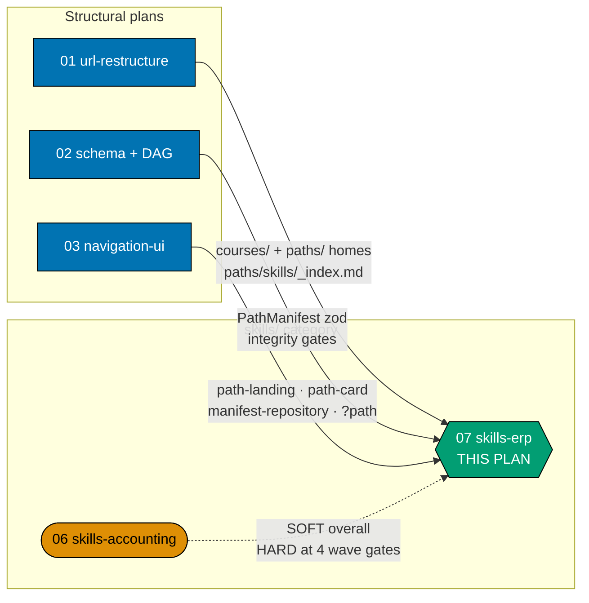
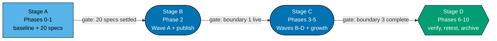

# Skills Path — Enterprise Resource Planning (path landing, manifest, and the 20-course ERP corpus)

> **Cross-plan source of truth**: the ERP catalog — course ids, formats, prerequisite edges, and ramp
> order — is settled in [tech-docs §The ERP catalog](./tech-docs.md#the-erp-catalog-20-courses-settled).
> Transcribe it; do not re-derive it. Its provenance is the `web-researcher` corpus study of
> 2026-07-21, whose verification markers are carried forward verbatim (see
> [tech-docs §Verification status carried forward](./tech-docs.md#verification-status-carried-forward-a4)).

This plan owns the **`skills/enterprise-resource-planning` product end-to-end**: the path landing at
`/en/learn/paths/skills/enterprise-resource-planning`, its single `PathManifest` YAML, the 20
syllabus specs that define the corpus, and the 20 authored course bodies the manifest orders.

It is the **seventh** plan of the `ayokoding-learning-path-*` programme and the second half of the
`skills/` category split (amendment A2 of the category-split decision record). Its sibling
`ayokoding-learning-path-06-skills-accounting` owns the accounting half. Neither writes into the
other's manifest, landing, or corpus.

## The one structural fact that shapes this plan

**ERP depends on Accounting one-directionally. There is no cycle.** Nothing in the accounting corpus
needs an ERP course, so no wave ordering deadlocks — accounting simply lands first where the two
touch.

That dependency is **soft overall and hard at four named points**:

- **Soft overall** — 10 of the 20 ERP courses have **zero** accounting dependency, direct or
  transitive. They are authorable fully concurrently with `ayokoding-learning-path-06-skills-accounting`,
  and they are enough to publish a live, standalone-useful ERP path before the accounting corpus is
  finished.
- **Hard first at ERP #7** — `record-to-report-systems` requires the accounting course
  `financial-statements-and-close-cycle` (Accounting #3), because subledger→GL posting is meaningless
  without a balanced ledger. This is the single edge that made 06 and 07 separate plans rather than
  one 40-course plan.
- **Hard again at three later boundaries** — inventory/COGS, payroll/consolidation/audit, and the
  Sharia + general-ledger-capstone cluster each gate a later authoring wave.

A blanket "blocked until 06 completes" would serialise ten courses that provably need nothing from
accounting. The dependency is therefore encoded **per wave**, not per plan — see
[tech-docs §Authoring waves](./tech-docs.md#authoring-waves-vs-reading-ramp-dd-3) and
[delivery.md](./delivery.md).

## The immediately-effective arc, always (R8)

Everything under `/en/learn/paths/skills/` is the **immediately-effective** arc: get up and running
and become dangerous as fast as possible, then go deeper and deeper on solid ground. The URL omits
the arc segment because the arc is **constant**, not because skills paths lack a pedagogy — the
manifest still records `arc: immediately-effective` (see
[tech-docs DD-7](./tech-docs.md#design-decisions)).

The research gives three explicit **"dangerous by here"** boundaries, and they are the spine of this
plan's delivery, not merely manifest metadata:

| Boundary | Reached after  | What the reader can do                                                                                                       | What they still cannot do                                                           |
| -------- | -------------- | ---------------------------------------------------------------------------------------------------------------------------- | ----------------------------------------------------------------------------------- |
| **1**    | course **#4**  | Install, configure and integrate a real ERP through its API — storefront↔inventory wiring, report automation, internal tools | Design correct P2P/O2C/R2R flows, extend without breaking upgrades, scope a rollout |
| **2**    | course **#10** | Correct core process flows, safe extension, the right integration pattern per case                                           | Production planning, multi-company/multi-currency, SoD enforcement, run a rollout   |
| **3**    | course **#20** | Full competence across the corpus                                                                                            | —                                                                                   |

Each boundary is a **delivery phase gate** and a **manifest growth point** (DD-6). The path ships
usable at boundary 1 and deepens; it never waits for boundary 3 to become a product.

## ERP's longer runway to first payoff — justified, not apologised for

ERP takes **three orientation courses before the first useful capstone at #4**, where accounting pays
off at #3. That extra step is a real property of the domain, not padding.

Without the master/transactional data model (#2) and the platform landscape (#3), a reader integrates
against the **wrong abstractions** and builds something that silently corrupts state — orphaned
purchase orders, double-counted inventory, GL entries that never reconcile. ERP's characteristic
failure is the same silent class accounting has: the integration returns 200, the screen renders, and
the ledger is wrong. Shortening the runway would not make a reader dangerous sooner; it would make
them dangerous to their employer's books.

This asymmetry against the sibling accounting path is a **landing-content requirement**, stated in
[tech-docs §Landing content requirements](./tech-docs.md#landing-content-requirements-what-plan-03-cannot-infer)
so plan 03 (which owns how the landing looks) can design for it.

## Scope

**In scope**

- The path landing `apps/ayokoding-www/content/en/learn/paths/skills/enterprise-resource-planning/_index.md`
  — prose, SEO, the ramp statement, the runway justification, and the outbound links to linked-not-walked
  cross-domain prerequisites. No `courseOrder` in the landing.
- The single manifest
  `apps/ayokoding-www/src/features/course-paths/manifests/skills/enterprise-resource-planning.yaml`,
  including `arc: immediately-effective`, published early and grown at each ramp boundary.
- **20 syllabus specs** under this plan's own `syllabus/courses/` — the authoring contract for the
  bodies (see [tech-docs DD-2](./tech-docs.md#design-decisions)) — plus the path-manifest mirror
  `syllabus/paths/manifest-skills-enterprise-resource-planning.md`, whose `skills-` filename marker is
  ruled by the schema owner (DD-22).
- **20 course bodies** under `apps/ayokoding-www/content/en/learn/courses/<course-id>/`, in four
  dependency-driven authoring waves.
- The ERP card in the skills category landing and the paths hub (populate only — never create).
- Manifest integrity, prerequisite-consistency, and no-forked-body verification at every phase gate.
- The A4 verification pass: every `[Unverified]` / `[Needs Verification]` marker carried forward with
  a named resolution step, never laundered into fact.

**Out of scope**

- **Anything accounting.** The accounting corpus, its manifest, and its landing are owned by
  `ayokoding-learning-path-06-skills-accounting`. This plan takes prerequisite edges **into** that
  corpus and never authors a line of it.
- **Any structural `_index.md`.** `paths/_index.md`, `paths/careers/_index.md`, the three
  `paths/careers/<arc>/_index.md`, and `paths/skills/_index.md` are all created by
  `ayokoding-learning-path-01-url-restructure` (amendment A3). This plan populates its own card into
  two of them and creates none. Its own **path landing** `_index.md` is a different thing entirely —
  see [tech-docs DD-15](./tech-docs.md#design-decisions), which disambiguates the two so an executor
  does not freeze on an apparent contradiction.
- **Any design asset.** Mockups, HTML sources, and PNG renders for every screen in this programme are
  owned by `ayokoding-learning-path-03-navigation-ui`, which already holds the whole `assets/` +
  `assets/src/` set. This plan ships **no** `assets/` folder. It states what the landing must convey;
  plan 03 owns how it looks.
- **Any rendering component, route, or schema.** `path-landing.tsx`, `path-card.tsx`,
  `manifest-repository.ts`, the `?path=` wiring (plan 03); the `PathManifest` zod schema and the pure
  `course-paths` core (plan 02).
- **Re-authoring any existing library course.** The 14 existing courses this corpus depends on are
  **linked, never walked** — the established cross-domain pattern.
- **The careers manifests and the careers corpus.** Owned by plans 04 and 05.
- **An Indonesian mirror.** `apps/ayokoding-www/content/id/belajar/` holds no courses and no paths
  [Repo-grounded], so a manifest over it would compose nothing.

## Prior art

_Required by the repo's two-pager/plan convention; this section is what the promotion carries forward._

**No existing course duplicates ERP.** The 121-course catalog under
`plans/backlog/ayokoding-learning-path-02-schema-and-prerequisite-dag/syllabus/courses/` is entirely
software engineering [Repo-grounded — 122 files = 121 specs + README]. `enterprise-resource-planning`
has **zero** existing material anywhere in the repo: no course, no article, no syllabus spec. ERP is
genuinely new ground, unlike accounting, which at least has a legacy long-form article to draw on.

**But the corpus draws real prerequisite edges into the existing library.** Fourteen existing courses
are the programme-level cross-domain surface for the two skills paths; all fourteen verified present
[Repo-grounded]:

`sql-essentials`, `advanced-sql-and-query-performance`, `backend-essentials`, `api-design`,
`domain-driven-design`, `event-driven-architecture`, `networking-essentials`, `security-essentials`,
`data-engineering`, `analytics-and-experimentation`, `project-management`, `it-governance-grc`,
`containers-and-orchestration`, `cloud-and-iac`.

**Eight of those are edges this plan's own corpus declares:**

| Existing course                 | Required by                                             |
| ------------------------------- | ------------------------------------------------------- |
| `backend-essentials`            | #4 `capstone-stand-up-and-integrate-an-open-source-erp` |
| `api-design`                    | #4 `capstone-stand-up-and-integrate-an-open-source-erp` |
| `event-driven-architecture`     | #10 `erp-integration-patterns`                          |
| `networking-essentials`         | #10 `erp-integration-patterns`                          |
| `security-essentials`           | #15 `erp-security-and-controls`                         |
| `data-engineering`              | #16 `erp-analytics-and-reporting`                       |
| `analytics-and-experimentation` | #16 `erp-analytics-and-reporting`                       |
| `project-management`            | #17 `erp-implementation-methodology`                    |

**Three scope-boundary risks** where a new ERP course abuts an existing one. Each is a stated
acceptance criterion on the affected body, not a hope (DD-10):

| New ERP course                   | Abuts                | Kept to                                   |
| -------------------------------- | -------------------- | ----------------------------------------- |
| `erp-analytics-and-reporting`    | `data-engineering`   | ERP-specific CDC / delta extraction only  |
| `erp-security-and-controls`      | `it-governance-grc`  | RBAC / SoD and COSO-SOX specifics only    |
| `erp-implementation-methodology` | `project-management` | Fit-gap, cutover, and data migration only |

**Cross-domain pattern inherited**: _link, do not walk._ The AI-engineer path already links rather
than re-walks shared prerequisites; both skills paths do the same, staying short spines over the
shared library (DD-9).

## Where this plan sits

**Accessibility note.** Plan category is carried by node shape (rectangle / stadium / hexagon) **and**
by the two labelled subgraph containers, never by colour alone. Edge strength is carried by line
style (solid = hard blocking edge; dotted = soft edge gating only some waves) **and** by the edge
labels. Fills use the verified accessible palette (`#0173B2` blue, `#DE8F05` orange, `#029E73` teal)
with black borders and WCAG-AA-contrasting text, per the
[Color Accessibility Convention](../../../repo-governance/conventions/formatting/color-accessibility.md).

## Depends-on

| Direction   | Plan (full folder name)                                  | Relationship                                                         |
| ----------- | -------------------------------------------------------- | -------------------------------------------------------------------- |
| `blockedBy` | `ayokoding-learning-path-01-url-restructure`             | hard — `courses/`, `paths/`, and `paths/skills/_index.md` must exist |
| `blockedBy` | `ayokoding-learning-path-02-schema-and-prerequisite-dag` | hard — `PathManifest` schema + integrity gates                       |
| `blockedBy` | `ayokoding-learning-path-03-navigation-ui`               | hard — a manifest with no renderer is invisible                      |
| `blockedBy` | `ayokoding-learning-path-06-skills-accounting`           | **soft overall, hard at four wave gates** — see the table below      |
| `blocks`    | _(none)_                                                 | terminal within the `skills/` category                               |

**No dependency on `ayokoding-learning-path-04-course-authoring` or
`ayokoding-learning-path-05-manifests`.** Those own the careers corpus and the careers manifests; this
plan shares directories with them but never a file. Their 127-course catalog figure is careers-only
and this corpus never folds into it (R5; see [tech-docs DD-19](./tech-docs.md#design-decisions)).

### The plan-06 dependency, encoded per wave

| Wave  | ERP courses                     | Accounting bodies required on `origin/main` before the wave starts                                                          | Concurrency with plan 06 |
| ----- | ------------------------------- | --------------------------------------------------------------------------------------------------------------------------- | ------------------------ |
| **A** | 1, 2, 3, 4, 5, 6, 9, 10, 17, 18 | **none**                                                                                                                    | fully concurrent         |
| **B** | 7, 8, 11, 12, 16                | `financial-statements-and-close-cycle`, `inventory-and-cogs-accounting`                                                     | gated                    |
| **C** | 13, 14, 15                      | `consolidation-and-multi-entity-accounting`, `audit-controls-and-compliance`, `payroll-and-tax-accounting-essentials`       | gated                    |
| **D** | 19, 20                          | `sharia-accounting-and-aaoifi-standards`, `islamic-contract-modeling-for-systems`, `capstone-build-a-general-ledger-system` | gated                    |

Each gate is a `test -d` check against the accounting course bundle, falsifiable in both directions:
it exits non-zero today and exits 0 once that accounting body is merged. The full derivation is in
[tech-docs §Authoring waves](./tech-docs.md#authoring-waves-vs-reading-ramp-dd-3).

## Delivery flow

Stage kind is carried by node shape (rectangle = setup/design, stadium = authoring, hexagon =
terminal) as well as by fill, so the progression reads correctly without colour.

| Phase | What ships                                        | Closing gate                                                |
| ----- | ------------------------------------------------- | ----------------------------------------------------------- |
| 0     | baseline + preconditions                          | toolchain green; 5 preconditions hold; 0 ERP bundles exist  |
| 1     | 20 syllabus specs + the A4 verification pass      | 20 spec files present; every marker carried, none laundered |
| 2     | Wave A bodies (10) + landing + manifest published | boundary **1** live; manifest holds 10 ids                  |
| 3     | Wave B bodies (5) + growth                        | boundary **2** live; manifest holds 15 ids                  |
| 4     | Wave C bodies (3) + growth                        | manifest holds 18 ids                                       |
| 5     | Wave D bodies (2) + growth                        | boundary **3** live; manifest holds 20 ids                  |
| 6     | section and app verification                      | all sweeps green; ownership boundary intact                 |
| 7     | manual UI verification + Rule-15 retest           | 6 screenshots committed; zero open defects                  |
| 8     | final `origin/main` integration                   | CI green on `main`; production serves the ERP path          |
| 9     | knowledge capture                                 | every `learnings.md` entry terminal                         |
| 10    | archival                                          | archived; the `skills/` category is complete                |

## Delivery Mode: worktree-to-pr

`worktree-to-pr` (the repo default, declared explicitly rather than inherited): work in
`worktrees/ayokoding-learning-path-07-skills-erp/`, open a draft PR per phase against `main`, run the
PR-Review Maker→Fixer Cycle (3 sequential CI-gated cycles), then `[AI]` merges once the review and all
quality gates are green — this plan declares **no** `[HUMAN]` merge gate. `ayokoding-www` is deployed
to `prod-ayokoding-www` after every merge. See [delivery.md](./delivery.md) for the `## Worktree` and
`## Delivery Mode` declarations and the PR-review-cycle steps.

## Navigation

- [Business Requirements (brd.md)](./brd.md) — WHY an ERP skills path exists as its own product and
  who it serves.
- [Product Requirements (prd.md)](./prd.md) — the personas, user stories, the ramp as a product
  promise, the Gherkin acceptance criteria, and product scope.
- [Technical Docs (tech-docs.md)](./tech-docs.md) — the settled 20-course catalog, the authoring-wave
  derivation, the design decisions (DD-1 … DD-23, including the schema-owner rulings on `pathId`
  shape and mirror naming), the diagrams, the R9 UI-gate and API-gate posture declarations, the
  landing content requirements for plan 03, and the A4 verification-status record.
- [Delivery Checklist (delivery.md)](./delivery.md) — the phased executable checklist.
- [Learnings (learnings.md)](./learnings.md) — knowledge-capture running log.

**Sibling plan, out of scope**: `ayokoding-learning-path-06-skills-accounting` owns the accounting
half of the `skills/` category. That plan folder may not yet exist on disk as this plan is written, so
it is named rather than linked; a link to a not-yet-created folder would fail
`md links validate`. Re-point to a real link once both plans coexist.
