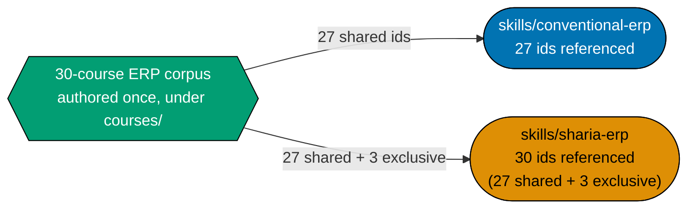

# Plan: Skills Paths — Enterprise Resource Planning

## Overview

Delivers **two** `skills/` paths — **`skills/conventional-erp`** (27 courses) and
**`skills/sharia-erp`** (27 shared + 3 Sharia-exclusive = 30 courses) — over **one** 30-course ERP
corpus, teaching the domain to build-founding depth without ever asking the reader to build, install,
or evaluate a system. This is the ERP half of the `skills/` category; the accounting half is
[`ayokoding-learning-path-06-skills-accounting`](../ayokoding-learning-path-06-skills-accounting/README.md).
Both plans belong to the `skills/` category of the AyoKoding learning-path programme. The shared
programme decisions this plan cites (`R*`/`A*` ids) are **folded in and owned locally** — see
[tech-docs.md §Programme decisions](./tech-docs.md#programme-decisions). This plan sits in **Wave 3**
of the programme's three-wave dependency DAG: it needs its Wave-2 predecessor
[`ayokoding-learning-path-06-skills-accounting`](../ayokoding-learning-path-06-skills-accounting/README.md)
merged, an edge that is **soft overall and hard at specific stage gates**, expressed at **stage
granularity** (never by course number) — see
[delivery.md §Depends-on](./delivery.md#depends-on-and-start-preconditions) and
[tech-docs.md §The 06→07 dependency edge](./tech-docs.md#the-0607-dependency-edge-stage-granularity-not-course-numbers).

**Naming harmonisation**: the non-Sharia path is **`conventional-erp`**, matching plan 06's
`conventional-accounting` — an earlier round of this plan called it "generic-erp"; that name is
retired. See [tech-docs.md §Naming harmonisation](./tech-docs.md#naming-harmonisation-dd-24).

## Scope

**In scope**: two path manifests, two path landings (content only — no new component), a 30-course
corpus (18 By Example, 12 Annotated-concept), 30 syllabus specs with module/topic breakdowns, a
Licensing and IP Compliance section, and the Gherkin coverage for both paths' navigation.

**Out of scope (A6/A7)**: no course builds, installs, or stands up an ERP system of any kind; no
course teaches vendor evaluation, selection, or implementation methodology. See
[tech-docs.md §What replaced the five removed courses](./tech-docs.md#what-replaced-the-five-removed-courses-a6--a7).

**Out of scope (ownership)**: this plan never edits an accounting file, a careers manifest, a
component, a design asset, or a structural `_index.md` (owned by
[`ayokoding-learning-path-01-url-restructure`](../../done/2026-07-23__ayokoding-learning-path-01-url-restructure/README.md)
per `A3`).

## Why two paths, one corpus (A10/A11)

`sharia-erp` is not an add-on assuming the conventional path — it covers the same 27-course foundation
`conventional-erp` does, plus 3 Sharia-exclusive courses. Per `A11` — the schema's own existing rule,
cited directly rather than reinvented (see
[`ayokoding-learning-path-02-schema-and-prerequisite-dag/tech-docs.md`](../../in-progress/ayokoding-learning-path-02-schema-and-prerequisite-dag/tech-docs.md#design-decisions)
lines 467, 474, 736 as of 2026-07-22 — plan 02 is an active, unarchived plan, so re-verify via `grep -n`
against the live file before relying on exact line numbers) — a course id's uniqueness is per-manifest, not library-wide, and no manifest may
copy a course body; every manifest references by id. The 27 shared course bodies are therefore
authored **once**; `<SHARMAN>`'s `courseOrder` interleaves them with the 3 Sharia-exclusive ids rather
than duplicating any file. Duplicating would desync silently — an edit to one copy never propagated
to the other produces two courses answering the same question differently, with no cross-file
consistency gate to catch it.

## Depth (A9)

The corpus expands past the originally-scoped 20 courses to **30**, sized by what the domain actually
requires: the cross-cutting spine (master data, document state machines, posting rules and account
determination, fiscal calendar, multi-entity, multi-currency, UoM conversion, numbering sequences,
audit trail), the module map, the subledger-to-GL relationship as the architectural crux, and the hard
parts (costing methods, negative stock and backdating, reservations/ATP, MRP netting, BOM
explosion/phantom BOMs, three-way-match tolerances/partials/returns, period close, stock concurrency,
and the EAV-vs-JSONB-vs-generated-schema extensibility axis). See
[tech-docs.md §The ERP catalog](./tech-docs.md#the-erp-catalog-30-courses-settled).

## Licensing (A8)

Every course is authored clean-room — no standards text, proprietary schema, or copyleft code is
reproduced. See [tech-docs.md §Licensing and IP Compliance](./tech-docs.md#licensing-and-ip-compliance-a8)
for the per-project licence table, the eleven safe-authoring rules, the legal basis (§102(b), EU
Directive 2009/24/EC Art. 1(2), _Baker v. Selden_), and the trademark rules. _Google v. Oracle_ is
deliberately not cited for API uncopyrightability — that case turned on fair use, not copyrightability.

## The 06→07 dependency edge — stage granularity, not course numbers

Plan 06's own prior `UNBLOCKS_ERP_COURSES` mapping was keyed to ERP course numbers, invalidated twice
over by both plans' rewrites. Both plans now express the edge at **stage granularity** — stage names
survive renumbering, course numbers do not.

| Accounting stage (plan 06)                                                | Unblocks this plan's stage                    | Mechanical gate (independent `test -d` checks, never reads plan 06's `delivery.md`) |
| ------------------------------------------------------------------------- | --------------------------------------------- | ----------------------------------------------------------------------------------- |
| Stage 1 ("Dangerous 1", ending at `financial-statements-and-close-cycle`) | Stage A start — **no gate**, fully concurrent | —                                                                                   |
| Stage 2 ("Dangerous 2" / conventional-accounting complete)                | Stage B — Conventional Enterprise Depth       | 5 accounting course ids resolve on `origin/main`                                    |
| Stage 3 ("Dangerous 3" / sharia-accounting complete)                      | Stage C — Sharia-Compliant Design             | 2 accounting course ids resolve on `origin/main`                                    |

See [tech-docs.md §The 06→07 dependency edge](./tech-docs.md#the-0607-dependency-edge-stage-granularity-not-course-numbers)
for the full table and the accounting-course-id coordination risk (the 7 cited ids are as named in
plan 06's own in-flight rewrite as of 2026-07-22 and require re-verification if plan 06 renames them
before Phase 3/4).

## Course count and stage structure

| Stage                                         | Courses | Accounting precondition          | Boundary reached                                                           |
| --------------------------------------------- | ------- | -------------------------------- | -------------------------------------------------------------------------- |
| A — Foundations & Architecture                | 15      | none                             | Dangerous 1 ⚡ (course 9)                                                  |
| B — Conventional Enterprise Depth             | 12      | conventional-accounting complete | Dangerous 2 (course 16), Dangerous 3 (course 27 — `conventional-erp` ends) |
| C — Sharia-Compliant Design (sharia-erp only) | 3       | sharia-accounting complete       | Dangerous 4 (course 30 — `sharia-erp` ends)                                |

**Total**: 30 courses (18 By Example, 12 Annotated-concept) — 27 in `skills/conventional-erp`, 30 in
`skills/sharia-erp`.

## Syllabus layer

Every course carries a syllabus with an explicit module/topic breakdown, mirroring the **format**
(not just the folder shape) `ayokoding-learning-path-02-schema-and-prerequisite-dag` already
established — verified against that plan's own
[`syllabus/README.md`](../../in-progress/ayokoding-learning-path-02-schema-and-prerequisite-dag/syllabus/README.md)
and two of its course files before authoring began; no stronger precedent was found. See
[`syllabus/README.md`](./syllabus/README.md) (this plan's own index) and
[tech-docs.md §Syllabus layer](./tech-docs.md#syllabus-layer--custody-and-shape-dd-31).

Syllabi are authored first from domain reasoning, confirmed second by a coverage-only
`web-researcher` pass (`A12`) — never the reverse, and the confirmation never adopts a curriculum's
structure. See [tech-docs.md §Syllabus confirmation order](./tech-docs.md#syllabus-confirmation-order-a12).

## Prior art

| Existing course (library)                                                                 | Relationship                                             |
| ----------------------------------------------------------------------------------------- | -------------------------------------------------------- |
| `domain-driven-design`                                                                    | prerequisite for course 4 (document state machines)      |
| `sql-essentials`                                                                          | prerequisite for course 22 (extension and customization) |
| `event-driven-architecture`, `networking-essentials`, `backend-essentials`, `api-design`  | prerequisites for course 23 (integration patterns)       |
| `security-essentials`                                                                     | prerequisite for course 26 (security and controls)       |
| `data-engineering`, `analytics-and-experimentation`, `advanced-sql-and-query-performance` | prerequisites for course 27 (analytics and reporting)    |

`project-management` (existing library) is **no longer** a prerequisite of any course in this
catalog — its only prior user, `erp-implementation-methodology`, is removed by `A7`. See
[tech-docs.md §What replaced the five removed courses](./tech-docs.md#what-replaced-the-five-removed-courses-a6--a7).

## Scope-boundary risks (grep-checkable, DD-10)

- `erp-analytics-and-reporting` stays scoped to ERP-specific CDC/delta-extraction, distinct from
  `data-engineering`'s general pipeline scope.
- `erp-security-and-controls` stays scoped to ERP-specific RBAC/SoD and COSO/SOX mapping, distinct
  from `it-governance-grc`'s general GRC scope.

Both courses carry a self-check worked example verifying the boundary explicitly.

## Delivery Mode

`worktree-to-pr` — see [delivery.md](./delivery.md#delivery-mode-worktree-to-pr). No `[HUMAN]` merge
gate is declared; `[AI]` merges every **delivery** phase once the PR-Review Maker→Fixer Cycle and CI
are green. Phase 0 is setup and baseline: it opens no PR, so the earliest PR is Phase 1's.

## Related documents

- [brd.md](./brd.md) — business rationale, risks (including the new licensing risk rows).
- [prd.md](./prd.md) — product spec, personas, Gherkin scenarios.
- [tech-docs.md](./tech-docs.md) — the full catalog, prerequisite graph, licensing section, and every
  Design Decision (DD-1 through DD-37).
- [delivery.md](./delivery.md) — the 11-phase execution checklist.
- [syllabus/](./syllabus/README.md) — the 30 per-course syllabus specs and two path-manifest mirrors.
