# Product Requirements — Skills Path: Enterprise Resource Planning

## Product Overview

One **path product**: `skills/enterprise-resource-planning`, served at
`/en/learn/paths/skills/enterprise-resource-planning`. It composes a **new 20-course ERP corpus**
authored by this plan, over the same shared library, schema, and rendering layers the four careers
paths already use.

Three artefacts make the product:

- **The manifest** — `arc: immediately-effective`, a `title`, a `description`, and an ordered
  `courseOrder` of ERP course ids, stored as a standalone YAML data file under
  `apps/ayokoding-www/src/features/course-paths/manifests/skills/enterprise-resource-planning.yaml`.
- **The landing** — a thin content anchor (prose and SEO only, **no `courseOrder`**) that states the
  ramp, justifies the runway, and links the cross-domain prerequisites the path deliberately does not
  walk.
- **The corpus** — 20 course bodies under `apps/ayokoding-www/content/en/learn/courses/<course-id>/`,
  each authored from its own syllabus spec.

The `skills/` grammar has **no arc segment** because the arc is constant, not absent (R2 / R8). The
manifest records the arc anyway, which is what keeps a future `skills/<arc>/<subject>` grammar a
purely additive change rather than a breaking URL migration.

## The ramp is the product promise

A skills path makes a promise a careers path does not: **how far in do I become useful?** The
research answers that with three named boundaries, and the product surfaces all three.

```mermaid
%% The reader's capability ramp. Node SHAPE encodes kind: rectangle = orientation,
%% stadium = capability boundary reached, hexagon = full competence.
%% Colours are redundant with shape and with the edge labels.
flowchart LR
    O["#1-#3 orientation<br/>history · data model<br/>platform landscape"]:::orient
    B1(["after #4<br/>DANGEROUS 1<br/>integrate a real ERP"]):::b1
    B2(["after #10<br/>DANGEROUS 2<br/>correct process flows<br/>safe extension"]):::b2
    B3{{"after #20<br/>DANGEROUS 3<br/>full competence"}}:::b3

    O -->|"first payoff capstone"| B1
    B1 -->|"P2P · O2C · R2R · inventory<br/>extension · integration"| B2
    B2 -->|"planning · multi-entity · controls<br/>analytics · methodology · sharia"| B3

    classDef orient fill:#56B4E9,stroke:#000000,color:#000000
    classDef b1 fill:#DE8F05,stroke:#000000,color:#000000
    classDef b2 fill:#0173B2,stroke:#000000,color:#FFFFFF
    classDef b3 fill:#029E73,stroke:#000000,color:#FFFFFF
```



**The runway is three courses, and that is deliberate.** Accounting pays off at its third course; ERP
pays off at its fourth. Without the master/transactional data model and the platform landscape, a
reader integrates against the wrong abstractions and silently corrupts state — orphaned purchase
orders, double-counted inventory, GL entries that never reconcile. The product states this reason on
the landing rather than hiding the extra step, because a hidden runway reads as padding and a
justified one reads as honest.

## Personas

- **A working software engineer whose employer runs an ERP (north-star)** — integrates against SAP,
  Odoo, Dynamics, or NetSuite and currently learns the data model by breaking it. Wants to be useful
  against a real system quickly, then understand why the flows are shaped the way they are. Owns
  software-engineering fundamentals already; owns **no** accounting.
- **An engineer scoping or evaluating an ERP** — has been asked whether to buy, extend, or build, and
  has no framework for the question. Needs the platform landscape, the fit-gap and cutover mechanics,
  and an honest account of what a rollout actually costs in engineering terms.
- **An engineer building Sharia-compliant enterprise systems** — needs to know that there is **no
  single Sharia accounting standard** and that the design consequence is jurisdictional pluggability,
  not a hardcoded chart of accounts.
- **A reader who deep-links an ERP course by share** — arrives with no path context and must get a
  coherent standalone view with prerequisites surfaced, plus an obvious way to enter the path.
- **Maintainer (content strategist / domain researcher / content author / reviewer)** — owns the ramp,
  closes the verification gaps, authors the corpus, and keeps the two skills paths from colliding.

## User Stories

- As a **working engineer whose employer runs an ERP**, I want to be able to install, configure, and
  integrate a real ERP after four courses, so that I get a payoff before I commit to twenty.
- As a **working engineer**, I want the landing to tell me exactly where usefulness starts and why the
  first three courses come before it, so that I can judge the investment instead of guessing.
- As a **working engineer**, I want the path to link the software-engineering courses it depends on
  rather than re-teaching them, so that I am not walked through `api-design` again.
- As a **reader with no accounting background**, I want the path to link the accounting courses its
  later stages depend on, so that I can pick them up when I reach them rather than being blocked at
  course one.
- As a **reader at boundary 1**, I want the path to tell me plainly what I still **cannot** do, so
  that I do not mistake "can integrate" for "can design the flows".
- As an **engineer scoping an ERP**, I want the implementation-methodology course to stay on fit-gap,
  cutover, and migration, so that it complements rather than duplicates `project-management`.
- As an **engineer building analytics on an ERP**, I want the analytics course to stay on ERP-specific
  CDC and delta extraction, so that it complements rather than duplicates `data-engineering`.
- As an **engineer building Sharia-compliant systems**, I want the Sharia ERP course to present three
  jurisdictional models and a pluggable design, so that I do not hardcode one standard and ship
  something wrong in two of three markets.
- As a **reader who deep-links an ERP course**, I want the canonical page to name the ERP path, so
  that I can enter the arc from wherever I landed.
- As the **maintainer**, I want the ten accounting-independent courses authored concurrently with the
  sibling accounting plan, so that half the corpus is not idle behind a plan it does not need.
- As the **maintainer**, I want the hard accounting edges checked mechanically before each wave, so
  that a course is never authored against a prerequisite that does not exist yet.
- As the **maintainer**, I want every deferred course id to carry a falsifiable before/after check, so
  that an early-published manifest cannot pass as complete.
- As the **maintainer**, I want every `[Unverified]` research claim carried forward with its marker,
  so that a search summary never becomes a stated fact in a published course.
- As a **screen-reader / keyboard user**, I want the ERP landing's ordered course list and its ramp
  markers to be fully navigable without a mouse, so that path selection and orientation work without
  pointing.

## Acceptance Criteria (Gherkin)

Thirteen scenarios. Each uses exactly one primary `Given`, one `When`, and one `Then`; every extra
precondition, action, or outcome chains with `And` or `But`.

### The dependency on the accounting corpus

```gherkin
Scenario: The ERP path publishes before the accounting corpus is complete
  Given the ten accounting-independent ERP courses are authored and the accounting corpus is still in progress
  When the ERP path manifest is published
  Then the manifest validates, the landing renders, and the path is reachable in production
  And no course in the published courseOrder declares an accounting prerequisite
```

```gherkin
Scenario: The record-to-report course waits for its accounting prerequisite
  Given the record-to-report-systems course has not been authored
  When the authoring wave containing it is about to start
  Then the financial-statements-and-close-cycle course bundle must already resolve on origin main
  And the wave does not start while that bundle is absent
```

```gherkin
Scenario: No ERP course is a prerequisite of any accounting course
  Given both skills corpora are published
  When the prerequisite graph is inspected
  Then no accounting course declares an ERP course as a prerequisite
  And the ERP subgraph is downstream-only, so the two corpora form no cycle
```

### The ramp as a product promise

```gherkin
Scenario: A reader is dangerous after the fourth course
  Given a reader has completed the first four ERP courses
  When they open the path landing
  Then the landing states that they can now install, configure, and integrate a real ERP through its API
  And it states plainly that they cannot yet design correct procure-to-pay, order-to-cash, or record-to-report flows
```

```gherkin
Scenario: A reader is dangerous again after the tenth course
  Given a reader has completed the first ten ERP courses
  When they open the path landing
  Then the landing states that they can now design correct core process flows, extend safely, and pick the right integration pattern
  And it states plainly that they cannot yet do production planning, multi-entity work, segregation-of-duties enforcement, or run a rollout
```

```gherkin
Scenario: The landing justifies the longer runway instead of hiding it
  Given the ERP path takes three orientation courses before its first useful capstone
  When a reader reads the landing before committing to the path
  Then the landing names the runway explicitly and gives its reason
  And the reason states that without the data model and the platform landscape a reader integrates against the wrong abstractions and silently corrupts state
```

### Composition and reuse

```gherkin
Scenario: The path links cross-domain prerequisites instead of walking them
  Given the ERP path manifest is published
  When a reader inspects its courseOrder
  Then no existing software-engineering course and no accounting course appears in courseOrder
  And the landing links out to those courses' canonical pages instead
```

```gherkin
Scenario: The manifest records its arc even though the URL omits it
  Given the skills URL grammar has no arc segment
  When the enterprise-resource-planning manifest is loaded and validated
  Then the manifest carries the field arc set to immediately-effective
  And the path id validates on its first segment skills and on resolving to an existing manifest, never on its segment count
```

```gherkin
Scenario: An early-published manifest cannot pass as complete
  Given the manifest is published with only the accounting-independent courses
  When the deferred course ids are checked against the manifest file
  Then every deferred id is provably absent at publication time
  And the same check returns the full set once the growth waves have landed
```

### Corpus correctness

```gherkin
Scenario: Each boundary-risk course states its scope boundary
  Given the analytics, security, and implementation-methodology ERP courses are authored
  When a reader compares each with the existing library course it abuts
  Then each course overview names the neighbouring course explicitly
  And each states what it deliberately leaves to that neighbour
```

```gherkin
Scenario: The Sharia ERP course is jurisdiction-plural
  Given the sharia-compliant-erp-design course is authored
  When a reader looks for the applicable accounting standard
  Then the course names AAOIFI, Indonesia's PSAK Syariah, and Malaysia's MFRS with the Bank Negara Shariah Governance Policy
  And it presents jurisdictional pluggability as the engineering requirement rather than naming one standard as canonical
```

```gherkin
Scenario: No unverified research claim is published as fact
  Given the corpus research marks integration surfaces, analyst positioning, and platform versions as unverified
  When any of those claims appears in an authored course body
  Then the claim sits in a dated accuracy-note sidebar or carries an explicit verification marker
  And no such claim appears unqualified in a course's stable spine
```

### Build health

```gherkin
Scenario: The ERP skills path builds and validates green
  Given the ERP manifest, its landing, and its twenty course bodies are published
  When the app build, the affected test tiers, and the link and heading validators run
  Then the build and every affected tier succeed
  And manifest integrity and prerequisite consistency report zero violations for the ERP manifest
```

## Product Scope

### In scope

- One `PathManifest` YAML at
  `apps/ayokoding-www/src/features/course-paths/manifests/skills/enterprise-resource-planning.yaml`,
  carrying `arc: immediately-effective`.
- One thin landing at
  `apps/ayokoding-www/content/en/learn/paths/skills/enterprise-resource-planning/_index.md` — prose,
  SEO metadata, the three ramp boundaries, the runway justification, and the outbound links to
  linked-not-walked cross-domain prerequisites. **No `courseOrder` in the landing.**
- 20 syllabus specs under this plan's own `syllabus/courses/`.
- 20 course bodies under `apps/ayokoding-www/content/en/learn/courses/<course-id>/`.
- Populating the ERP card in the skills category landing and the paths hub — populate only, never
  create.
- Manifest integrity, prerequisite-consistency, and no-forked-body verification at every phase gate.
- The A4 verification pass and its named open items.

### Out of scope

- **Any accounting course, spec, manifest, or landing.** Owned by
  `ayokoding-learning-path-06-skills-accounting`.
- **Any structural `_index.md`** under `paths/` — owned by `ayokoding-learning-path-01-url-restructure`.
- **Any design asset** — mockups, HTML sources, and PNG renders are owned by
  `ayokoding-learning-path-03-navigation-ui`.
- **Any rendering component, route wiring, or schema** — owned by plans 02 and 03.
- **Re-authoring any existing library course.** Link, do not walk.
- **The careers corpus, the careers manifests, and the 127-course careers catalog figure.**
- **Vendor certification preparation.**
- **A second skills arc** — skills paths are always `immediately-effective`.
- **An Indonesian mirror** — `id/belajar/` holds zero courses and zero paths [Repo-grounded].

### UI-design-funnel disposition

**Exempt — recorded explicitly, not silently omitted.** This plan adds **no net-new screen and no
net-new component**. Its landing renders through Screen 2 (path landing) and its cards through Screen 1
(paths hub) and Screen 1a (category landing), all three of which are designed, mocked, and rendered by
`ayokoding-learning-path-03-navigation-ui`, which holds the whole `assets/` + `assets/src/` set for the
programme.

What this plan owes plan 03 instead of a mockup is a **content specification**: the two things plan 03
cannot infer are the ramp boundaries and ERP's longer runway. Both are written up in
[tech-docs §Landing content requirements](./tech-docs.md#landing-content-requirements-what-plan-03-cannot-infer).

The exemption is scoped to the **design funnel only**. Because this plan ships a user-visible surface,
the **Rule-15 three-tester retest remains mandatory** and runs in
[Phase 7](./delivery.md#phase-7-manual-ui-verification-and-rule-15-three-tester-retest).

## Product-Level Risks

- **Serialisation risk**: the plan is treated as wholly blocked by plan 06, idling ten authorable
  courses. Mitigated by encoding the dependency per wave — Wave A declares zero accounting
  preconditions and the Phase-2 gate contains no accounting check.
- **Hard-edge erosion**: `record-to-report-systems` is authored against a guessed general ledger.
  Mitigated by a `test -d` precondition on the accounting bundle before Wave B starts, falsifiable
  both ways.
- **Runway misread**: the landing hides the three-course runway and reads as padded, or states it
  without a reason and reads as slow. Mitigated by making the justification a stated landing content
  requirement with the specific failure mode named (orphaned POs, double-counted inventory,
  non-reconciling GL entries).
- **Silent truncation**: the manifest is published at 10 ids and never grown. Mitigated by falsifiable
  deferral checks written at publication time, three dedicated growth phases, and a terminal
  twenty-id assertion.
- **Scope bleed**: an ERP course re-teaches `data-engineering`, `it-governance-grc`, or
  `project-management`. Mitigated by three named boundary risks, each with a grep-checkable
  "names its neighbour" acceptance clause on the affected body.
- **Verification laundering**: a search-summarised claim is published as fact. Mitigated by a dedicated
  verification phase, dated accuracy-note sidebars for volatile claims, and the facts checker on every
  body.
- **Sharia oversimplification**: the ERP design course presents AAOIFI as the standard. Mitigated by
  DD-12 and an acceptance clause that greps for all three jurisdictional models.
- **Cross-plan collision**: both skills plans edit the skills category landing. Mitigated by each plan
  populating only its own card and asserting its own card with a literal-string check rather than a
  total count.
- **Capstone CI fragility**: a capstone sample depends on a live third-party ERP. Mitigated by DD-14 —
  containerised or fixtured ERP only, no live-network dependency in any code sample.
- **Landing/manifest divergence**: the landing hand-lists courses and drifts from the manifest.
  Mitigated by the hard rule that no landing carries a `courseOrder`; the ordered list renders from
  the loaded manifest only.
- **Empty-state exposure**: the skills category landing renders empty between plan 01 and this plan.
  Not this plan's to fix — `ayokoding-learning-path-03-navigation-ui` owns the empty-state design
  (A3) — but this plan's Phase-2 gate is the moment the ERP slot stops being empty, and it asserts
  that transition.
