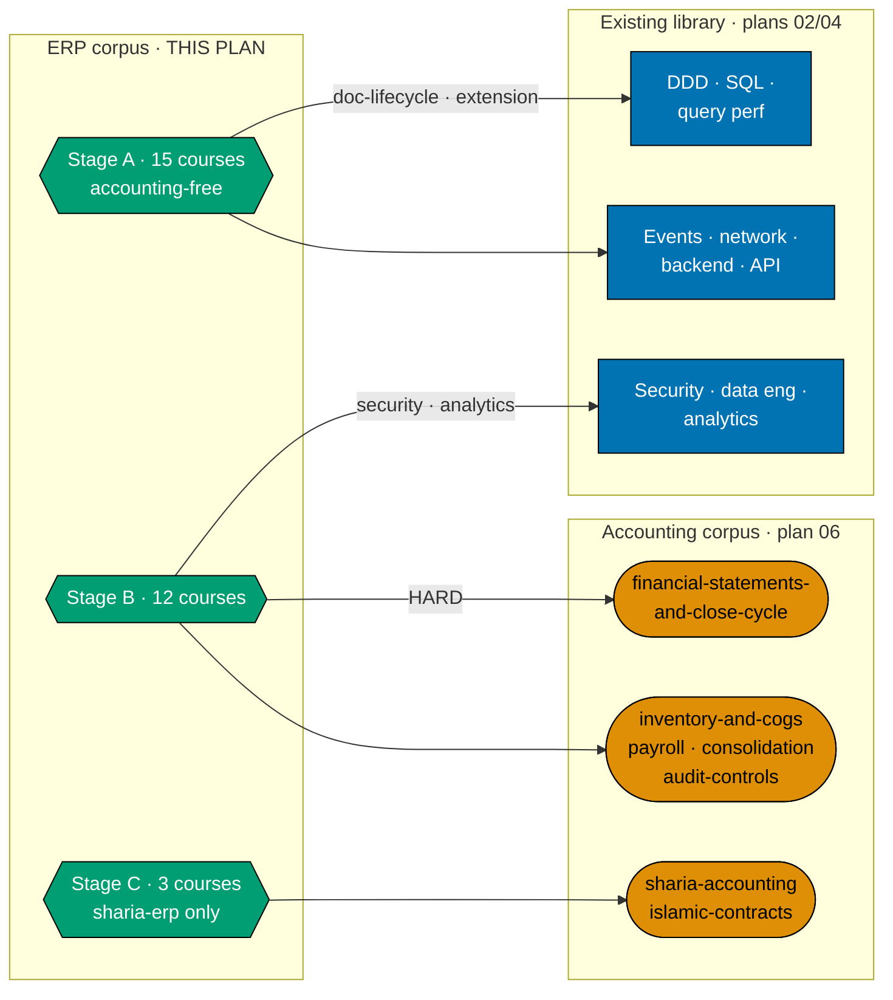
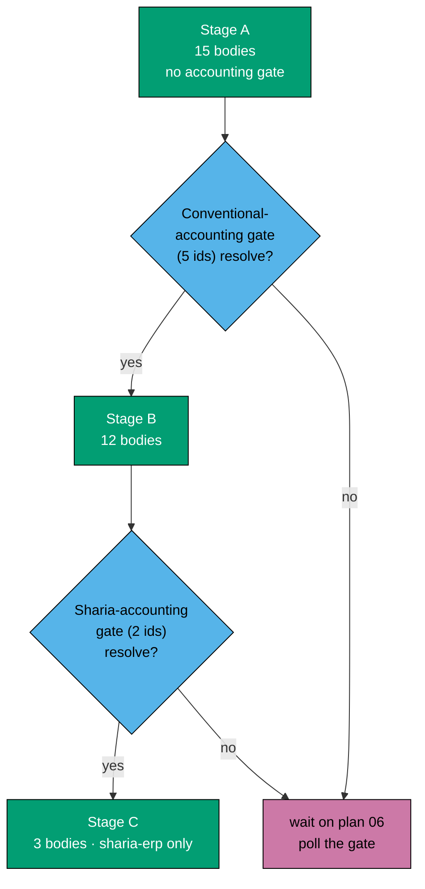
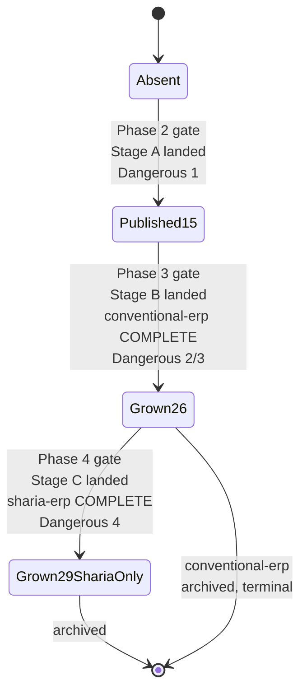

# Technical Documentation — Skills Paths: Enterprise Resource Planning

## Corpus Disposition

`archive-with-plan` — this plan custodies its own `syllabus/` corpus and no consumer **outside
`plans/`** reads it (no checker, agent, Nx target, build/generation step, or shipped content
front-matter names a syllabus path). The corpus therefore moves to `plans/done/` with the plan folder
on archival; the promotion trigger (name a non-plan reader) is not met. See
[Learning-Plan Syllabus Convention §Corpus Disposition](../../../repo-governance/conventions/structure/learning-plan-syllabus.md#corpus-disposition).

## Overview

This plan delivers **two `skills/` paths end-to-end** over **one 30-course ERP corpus**:
`skills/conventional-erp` (27 courses) and `skills/sharia-erp` (27 shared + 3 Sharia-exclusive = 30
courses). It is the ERP half of the `skills/` category; the accounting half is
`ayokoding-learning-path-06-skills-accounting`, whose own two-path split
(`skills/conventional-accounting` / `skills/sharia-accounting`) this plan mirrors structurally.

It touches **no application code** beyond two YAML data files and their co-located unit test. Every
component, resolver, schema, and route it depends on is built by plans 01–03 and consumed here.

| Layer                                                                                             | Owner                                                    | This plan's relationship |
| ------------------------------------------------------------------------------------------------- | -------------------------------------------------------- | ------------------------ |
| `courses/` + `paths/` content homes, structural `_index.md` files                                 | `ayokoding-learning-path-01-url-restructure`             | consumes                 |
| `PathManifest` zod schema, pure `course-paths` core, integrity gates                              | `ayokoding-learning-path-02-schema-and-prerequisite-dag` | consumes                 |
| `path-landing.tsx`, `path-card.tsx`, `manifest-repository.ts`, `?path=` wiring, all design assets | `ayokoding-learning-path-03-navigation-ui`               | consumes                 |
| The accounting corpus, its two manifests, and its two landings                                    | `ayokoding-learning-path-06-skills-accounting`           | depends on, never writes |
| **The ERP corpus, both manifests, both landings**                                                 | **this plan**                                            | **authors**              |

## The manifest ownership invariant (scoped to two data files)

Per the programme's manifest-ownership invariant (each plan owns its own data file(s) plus their
co-located unit test, never a sibling's), this plan owns **exactly two** YAML data files and **two**
co-located unit tests, one per manifest:

| Plan | Owns                                                                                                                                                                           | Never writes                                                                 |
| ---- | ------------------------------------------------------------------------------------------------------------------------------------------------------------------------------ | ---------------------------------------------------------------------------- |
| 06   | `manifests/skills/conventional-accounting.yaml`, `manifests/skills/sharia-accounting.yaml` + their unit test(s)                                                                | anything under `manifests/skills/conventional-erp.yaml` or `sharia-erp.yaml` |
| 07   | `manifests/skills/conventional-erp.yaml`, `manifests/skills/sharia-erp.yaml` (**this plan**) + `conventional-erp-manifest.unit.test.ts` and `sharia-erp-manifest.unit.test.ts` | `manifests/careers/**`, `manifests/skills/*accounting*.yaml`                 |

Both ERP manifests are owned by the **same plan**, and — per [DD-37](#design-decisions) — each owns
its own co-located unit test rather than sharing one: this conforms to sibling plan 06's own `DD-602`
ruling that "two manifests, two tests" is the one-test-per-data-file granularity used everywhere else
in the programme, regardless of whether the two manifests happen to sit inside one plan or two. An
earlier round of this plan combined both manifests' assertions into one `erp-manifests.unit.test.ts`
file, reasoning that a same-plan combination is not the cross-plan seam the 2026-07-21 ruling
targeted — that reasoning was correct about the seam but did not reconcile with plan 06's DD-602,
which faces the identical one-plan-two-manifests situation and explicitly rejects a combined file.
DD-37 corrects this.

## Path constants

- `<COURSES>` = `apps/ayokoding-www/content/en/learn/courses/` — course bundles, served at
  `/en/learn/courses/<course-id>`
- `<PATHS>` = `apps/ayokoding-www/content/en/learn/paths/` — path landings and structural indexes
- `<CONVLANDING>` = `<PATHS>skills/conventional-erp/_index.md` — **this plan's first landing**
- `<SHARLANDING>` = `<PATHS>skills/sharia-erp/_index.md` — **this plan's second landing**
- `<FEAT>` = `apps/ayokoding-www/src/features/course-paths/`
- `<MANIFESTS>` = `<FEAT>manifests/`
- `<CONVMAN>` = `<MANIFESTS>skills/conventional-erp.yaml`
- `<SHARMAN>` = `<MANIFESTS>skills/sharia-erp.yaml`
- `<MTEST_CE>` = `<MANIFESTS>skills/conventional-erp-manifest.unit.test.ts` — owned by this plan,
  asserts `<CONVMAN>` only
- `<MTEST_SE>` = `<MANIFESTS>skills/sharia-erp-manifest.unit.test.ts` — owned by this plan, asserts
  `<SHARMAN>` only
- `<SYL>` = `plans/backlog/ayokoding-learning-path-07-skills-erp/syllabus/courses/` — this plan's own
  per-course syllabus corpus (DD-2), each carrying an explicit module/topic breakdown (DD-31)
- `<SYLPATHS>` = `plans/backlog/ayokoding-learning-path-07-skills-erp/syllabus/paths/` — this plan's
  two path-manifest mirrors: `manifest-skills-conventional-erp.md` and
  `manifest-skills-sharia-erp.md` (DD-22)
- `<SPECS>` = `specs/apps/ayokoding/behavior/ayokoding-www/gherkin/course-paths/`
- Path ids: `skills/conventional-erp` and `skills/sharia-erp` — the **full** strings including the
  category segment; there is no separate `category` field, and **nothing keys on segment count**
  (R2 / DD-21)

### What this plan writes

- `<CONVMAN>`, `<SHARMAN>` — the two manifest files.
- `<CONVLANDING>`, `<SHARLANDING>` — the two path landings.
- `<COURSES><erp-course-id>/` — thirty new course bundles (27 shared + 3 Sharia-exclusive).
- `<SYL><erp-course-id>.md` + `<SYL>README.md` — thirty syllabus files inside this plan folder.
- `<SYLPATHS>manifest-skills-conventional-erp.md` and `<SYLPATHS>manifest-skills-sharia-erp.md` —
  the authoritative orderings each manifest's `courseOrder` is transcribed from (DD-22).
- One ERP card each in `<PATHS>_index.md` and `<PATHS>skills/_index.md` for **each** path (four card
  insertions total) — **populate only**.
- `<SPECS>skills-erp-paths.feature` and its step definitions.
- Twenty-nine new rows in `<COURSES>_index.md` — the shared course-catalog index — **populate only**.

### What this plan never touches

- Any file under `<MANIFESTS>careers/` or `<MANIFESTS>skills/*accounting*.yaml`.
- Any accounting course bundle, syllabus spec, or landing.
- Any structural `_index.md` — created by plan 01 (A3). This plan edits populated cards into two of
  them and creates none.
- Any component under `<FEAT>shell/` or `<FEAT>core/`.
- Any design asset. This plan ships no `assets/` folder.

## Naming harmonisation (DD-24)

An earlier round of this plan called the non-Sharia path "generic-erp". **It is `conventional-erp`**,
harmonised with `ayokoding-learning-path-06-skills-accounting`'s `conventional-accounting` — both
plans now use the same adjective for "the path without a jurisdictional Sharia model attached". This
section exists specifically so "generic-erp" is not reintroduced by a future edit that has not read
this file end to end.

## Two paths, one corpus (A10 / A11)

Per amendment `A10`, `skills/erp` splits into **`skills/conventional-erp`** (27 courses) and
**`skills/sharia-erp`** (27 shared + 3 Sharia-exclusive = 30 courses). **Both paths cover all the
basics** — `sharia-erp` is never an add-on module assuming the conventional path; a reader entering it
cold gets full grounding, because its `courseOrder` **includes** all 27 shared ids.

**A11 is the existing schema rule, not a new mechanism** — cited directly rather than re-derived
(line numbers current as of 2026-07-22; plan 02 is an active, unarchived plan, so re-verify via
`grep -n` against the live file before relying on exact line numbers):

- _"No course ID appears twice **within one manifest**"_ [Repo-grounded —
  `ayokoding-learning-path-02-schema-and-prerequisite-dag/tech-docs.md:467`]. Uniqueness is
  per-manifest, so the same course id may legally appear in both `<CONVMAN>` and `<SHARMAN>`.
- _"No course body is duplicated per path (all manifests reference courses **by ID**, never copy a
  body)"_ [Repo-grounded — same file, line 474].
- _"One body cannot encode four orders; moving order to the manifest [is what enables the shared
  library]"_ [Repo-grounded — same file, line 736, DD-1].

**Consequence**: the 27 shared course bodies are authored **once**, under `<COURSES>`, exactly as
every other course in the library is. `<SHARMAN>`'s `courseOrder` **interleaves** the 27 shared ids
with the 3 Sharia-exclusive ids into one ordered array. **Never duplicate a course file to serve two
paths** — a duplicated file desyncs silently: an edit to one copy that is never propagated to the
other produces two courses that answer the same question differently, and nothing in the toolchain
catches it, because the content checkers validate each file in isolation and there is no cross-file
consistency gate for prose. Reference by id is the only safe mechanism, and it is the cheaper one too:
30 bodies are authored, not 57.

## The ERP catalog (30 courses, settled)

Course ids, formats, prerequisite edges, and ramp order are **decided** here; Phase 1 transcribes them
into syllabus specs and does not re-derive them. The catalog is built around four load-bearing
concerns named in the domain-research grounding: the **cross-cutting spine** (master data, document
state machines, posting rules and account determination, fiscal calendar, multi-entity, multi-currency,
UoM conversion, numbering sequences, audit trail), the **module map**, the **subledger-to-GL
relationship as the architectural crux**, and the **hard parts** (costing methods, negative stock and
backdating, reservations/ATP, MRP netting, BOM explosion and phantom BOMs, three-way-match tolerances,
partials, returns, period close, stock concurrency, and the EAV-vs-JSONB-vs-generated-schema
extensibility axis).

`(SWE)` = an existing library course [Repo-grounded — all ten verified present under
`plans/in-progress/ayokoding-learning-path-02-schema-and-prerequisite-dag/syllabus/courses/`].
`(Acct)` = a course owned by `ayokoding-learning-path-06-skills-accounting` — the seven ids below are
as currently named in that plan's own in-flight rewrite (its README, read 2026-07-22); see
[§Cross-plan coordination risk](#cross-plan-coordination-risk-accounting-course-id-stability).

**The 30-course count, and its partition into content stages, is curriculum judgment, not a sourced
fact** [Judgment call] — per A9, the count is an output of covering the four load-bearing concerns
above, not a target.

### 27 shared courses (conventional-erp, also in sharia-erp)

| #   | Course id                                     | Format            | ERP prereqs | SWE prereqs                                                                               | Accounting prereqs                                | Authoring stage |
| --- | --------------------------------------------- | ----------------- | ----------- | ----------------------------------------------------------------------------------------- | ------------------------------------------------- | --------------- |
| 1   | `erp-foundations-and-history`                 | Annotated-concept | —           | —                                                                                         | —                                                 | A               |
| 2   | `erp-conceptual-data-model`                   | Annotated-concept | 1           | —                                                                                         | —                                                 | A               |
| 3   | `erp-module-map-and-architecture`             | Annotated-concept | 2           | —                                                                                         | —                                                 | A               |
| 4   | `erp-document-lifecycle-and-state-machines`   | Annotated-concept | 3           | `domain-driven-design`                                                                    | —                                                 | A               |
| 5   | `erp-posting-rules-and-account-determination` | By Example        | 4           | —                                                                                         | —                                                 | A               |
| 6   | `erp-subledger-to-gl-architecture`            | By Example        | 5           | —                                                                                         | —                                                 | A               |
| 7   | `erp-fiscal-calendar-and-period-close`        | Annotated-concept | 6           | —                                                                                         | —                                                 | A               |
| 8   | `erp-numbering-sequences-and-uom-conversion`  | Annotated-concept | 3           | —                                                                                         | —                                                 | A               |
| 9   | `erp-audit-trail-and-change-tracking`         | Annotated-concept | 4           | —                                                                                         | —                                                 | A               |
| 10  | `procure-to-pay-systems`                      | By Example        | 6           | —                                                                                         | —                                                 | A               |
| 11  | `order-to-cash-systems`                       | By Example        | 6           | —                                                                                         | —                                                 | A               |
| 12  | `erp-procurement-and-fulfillment-exceptions`  | By Example        | 10, 11      | —                                                                                         | —                                                 | A               |
| 13  | `record-to-report-systems`                    | By Example        | 6, 7        | —                                                                                         | `financial-statements-and-close-cycle` — **HARD** | B               |
| 14  | `inventory-and-warehouse-management`          | By Example        | 6           | —                                                                                         | `inventory-and-cogs-accounting`                   | B               |
| 15  | `erp-inventory-costing-methods`               | By Example        | 14          | —                                                                                         | _(transitive via 14)_                             | B               |
| 16  | `erp-inventory-integrity-and-concurrency`     | By Example        | 14          | —                                                                                         | _(transitive via 14)_                             | B               |
| 17  | `erp-bom-and-routing-architecture`            | By Example        | 2           | —                                                                                         | —                                                 | A               |
| 18  | `production-planning-and-mrp`                 | By Example        | 14, 17      | —                                                                                         | _(transitive via 14)_                             | B               |
| 19  | `demand-and-supply-planning`                  | Annotated-concept | 18          | —                                                                                         | _(transitive via 18)_                             | B               |
| 20  | `erp-availability-and-reservations`           | By Example        | 14, 18      | —                                                                                         | _(transitive via 14, 18)_                         | B               |
| 21  | `quality-management-and-inspection`           | By Example        | 12, 14, 17  | —                                                                                         | _(transitive via 14)_                             | B               |
| 22  | `erp-extension-and-customization`             | By Example        | 3           | `sql-essentials`                                                                          | —                                                 | A               |
| 23  | `erp-integration-patterns`                    | By Example        | 22          | `event-driven-architecture`, `networking-essentials`, `backend-essentials`, `api-design`  | —                                                 | A               |
| 24  | `human-capital-management-and-hire-to-retire` | Annotated-concept | 3           | —                                                                                         | `payroll-and-tax-accounting-essentials`           | B               |
| 25  | `multi-company-and-multi-currency-erp`        | By Example        | 13          | —                                                                                         | `consolidation-and-multi-entity-accounting`       | B               |
| 26  | `erp-security-and-controls`                   | Annotated-concept | 3           | `security-essentials`                                                                     | `audit-controls-and-compliance`                   | B               |
| 27  | `erp-analytics-and-reporting`                 | By Example        | 13          | `data-engineering`, `analytics-and-experimentation`, `advanced-sql-and-query-performance` | _(transitive via 13)_                             | B               |

### 3 Sharia-exclusive courses (sharia-erp only)

| #   | Course id                                  | Format            | ERP prereqs | Accounting prereqs                                                                | Authoring stage |
| --- | ------------------------------------------ | ----------------- | ----------- | --------------------------------------------------------------------------------- | --------------- |
| 28  | `sharia-compliant-erp-design`              | Annotated-concept | 25          | `islamic-contract-modeling-for-systems`, `sharia-accounting-and-aaoifi-standards` | C               |
| 29  | `islamic-contract-based-transaction-flows` | By Example        | 10, 11, 28  | _(transitive via 28)_                                                             | C               |
| 30  | `zakat-and-sharia-compliance-modules`      | Annotated-concept | 26, 28      | _(transitive via 28)_                                                             | C               |

**Format counts (30 total)**: 18 By Example, 12 Annotated-concept — each maps to an existing
maker/checker/fixer agent trio (`apps-ayokoding-www-by-example-*`,
`apps-ayokoding-www-annotated-concept-*`) [Repo-grounded — both trios verified present under
`.claude/agents/`].

**No id in the 30-course list is a substring of another**, and no id collides with an existing
software-engineering or accounting course id, which is what makes the alternation-grep acceptance
clauses in `delivery.md` sound.

### What replaced the five removed courses (A6 / A7)

The prior 20-course catalog is superseded. Five courses are removed and not replaced 1:1 — they are
replaced by **twelve** domain-depth courses that cover the cross-cutting spine, the subledger-to-GL
crux, and the hard parts instead:

| Removed course                                       | Removed by    | Reason                                                                                        |
| ---------------------------------------------------- | ------------- | --------------------------------------------------------------------------------------------- |
| `capstone-build-a-minimal-erp-core`                  | A6            | A construction exercise — the corpus teaches to build-founding depth, never builds            |
| `capstone-stand-up-and-integrate-an-open-source-erp` | A6 **and** A7 | Fails A6 (stands up/installs a running system) **and** A7 (buyer/consultant hands-on posture) |
| `erp-platform-landscape`                             | A7            | Vendor-landscape/buyer-competence material                                                    |
| `erp-implementation-methodology`                     | A7            | Buyer/consultant fit-gap-and-cutover material                                                 |
| `evaluating-and-selecting-an-erp`                    | A7            | Procurement/evaluation material                                                               |

**Direct consequence for the existing-library cross-domain surface**: `project-management` (existing
library) had exactly one user in the old catalog — the now-removed `erp-implementation-methodology` —
and drops out of this plan's cross-domain edges entirely as a result. It is not replaced; no remaining
course in the 30-course catalog needs project-management competence. `backend-essentials` and
`api-design`, previously the removed integrate-capstone's only edges, are **reassigned** to
`erp-integration-patterns` (course 23), which needs them for the same underlying reason (building and
consuming APIs against a real system) without requiring the reader to stand one up.

## The prerequisite graph — one DAG, ERP is a downstream-only subgraph

R5 requires this plan to state whether the new subject domain joins the existing prerequisite DAG or
forms a disjoint component. It joins. The ERP corpus declares ten edges into the existing
software-engineering library and seven **direct** edges into the accounting corpus — see the catalog
tables above [Repo-grounded]. Two of those seven edges originate from a single ERP course,
`sharia-compliant-erp-design` (course 28), which cites `islamic-contract-modeling-for-systems` and
`sharia-accounting-and-aaoifi-standards`. **These two ids' own combined transitive prerequisite chain
_inside the accounting corpus_** (a narrower quantity than the full seven-id closure, which reaches
sixteen) closes over exactly **ten** distinct accounting ids: `accounting-foundations`,
`chart-of-accounts-and-data-modeling`, `financial-statements-and-close-cycle`,
`journal-entries-and-posting-mechanics`, `accrual-accounting-and-revenue-recognition`,
`fixed-assets-and-depreciation`, `lease-and-intangible-asset-accounting`,
`financial-reporting-standards-ifrs-vs-gaap`, `sharia-accounting-and-aaoifi-standards`, and
`islamic-contract-modeling-for-systems` itself [Repo-grounded — independently re-derived from plan
06's own catalog table]. **No edge runs the other way**: no software-engineering course and no
accounting course declares an ERP course as a prerequisite. ERP is therefore a **downstream-only
subgraph** attached to the single library-wide DAG, exactly as the 20-course predecessor catalog was.



**Accessibility note.** Domain is carried by node shape (rectangle / stadium / hexagon) **and** by the
three labelled subgraph containers, never by colour alone. Fills use the verified accessible palette
per the
[Color Accessibility Convention](../../../repo-governance/conventions/formatting/color-accessibility.md).

## Authoring stages vs reading ramp (DD-3)

**Authoring order is not reading order.** The two manifests fix what a reader walks; the delivery
checklist fixes what an author writes next. Three **named** authoring stages replace the prior
lettered "waves" — named specifically so `ayokoding-learning-path-06-skills-accounting` can reference
them without depending on ERP course numbers, which do not survive this rewrite (see
[§The 06→07 dependency edge](#the-0607-dependency-edge-stage-granularity-not-course-numbers)).

| Authoring stage | Name                          | Courses (by id, authoring order)               | Count | Accounting precondition                                                                                                                                                                                                                                             |
| --------------- | ----------------------------- | ---------------------------------------------- | ----- | ------------------------------------------------------------------------------------------------------------------------------------------------------------------------------------------------------------------------------------------------------------------- |
| **A**           | Foundations & Architecture    | 1–12, 17, 22, 23                               | 15    | **none** — fully concurrent with plan 06                                                                                                                                                                                                                            |
| **B**           | Conventional Enterprise Depth | 13, 14, 15, 16, 18, 19, 20, 21, 24, 25, 26, 27 | 12    | accounting's **"conventional-accounting complete"** boundary — needs `financial-statements-and-close-cycle`, `inventory-and-cogs-accounting`, `payroll-and-tax-accounting-essentials`, `consolidation-and-multi-entity-accounting`, `audit-controls-and-compliance` |
| **C**           | Sharia-Compliant Design       | 28, 29, 30                                     | 3     | accounting's **"sharia-accounting complete"** boundary — needs `islamic-contract-modeling-for-systems`, `sharia-accounting-and-aaoifi-standards`                                                                                                                    |

Transitive derivations worth stating, because they are the ones an executor would get wrong:

- **Courses 18, 19, 20 (production planning, demand/supply planning, availability/reservations) look
  accounting-free** — their own declared prerequisites never name an accounting id directly. But all
  three transitively depend on course 14 (`inventory-and-warehouse-management`), which requires
  `inventory-and-cogs-accounting`, so all three belong to Stage B.
- **Course 21 (quality management and inspection) is Stage B for the same transitive reason** — its
  declared prerequisites are courses 12, 14 and 17, none of which is an accounting id, but course 14
  carries `inventory-and-cogs-accounting`, and the course's own disposition concepts (scrap, rework,
  supplier return) land on that valuation model. It reads after the planning cluster because its
  in-process inspection points attach to course 17's routing operations and its rejections to course
  12's exception flow, so every host document it gates has already been taught by position 21.
- **Course 27 (analytics and reporting) looks accounting-free** — its declared prerequisites are
  course 13 plus three software-engineering courses. Course 13 carries the hard edge, so course 27 is
  Stage B.
- **Course 17 (BOM and routing architecture) sits late in the content-stage ordering (planning) and
  early in the authoring order.** Its only prerequisite is course 2 (conceptual data model); deferring
  it to Stage B would idle authorable work for no reason.
- **Courses 25, 28, 29, 30 each carry a compound gate**: course 25 needs both course 13 (transitively
  `financial-statements-and-close-cycle`) and directly `consolidation-and-multi-entity-accounting` —
  both resolve by the time Stage B starts. Courses 28–30 each transitively need course 25's chain plus
  their own direct Sharia accounting ids, all of which resolve once Stage C's own precondition holds.



**Within a stage, bodies are content-independent** — each writes only its own subtree under
`<COURSES>`, so they pipeline concurrently through review, bounded by the in-force subagent cap.

## The 06→07 dependency edge (stage granularity, not course numbers)

The prior single-catalog plan's cross-plan handoff, and `ayokoding-learning-path-06-skills-accounting`'s
prior `UNBLOCKS_ERP_COURSES` mapping, both keyed the edge to **ERP course numbers**. Both rewrites
(this one and plan 06's own, in flight concurrently) invalidate that shape twice over: this plan's
course numbers moved with the A9 expansion, and plan 06's own numbers moved with its A6/A9 changes too.
**Course numbers do not survive either plan's renumbering; stage names do.**

Per plan 06's own README (`ayokoding-learning-path-06-skills-accounting/README.md`, read 2026-07-22):
_"The stage-signal contract... now names the ERP capability stage a given accounting stage unblocks —
described functionally... rather than by an ERP course number this plan has no authority to assert."_
This plan supplies the missing half of that contract — the **named ERP-side stages** plan 06 can point
at:

| Accounting stage (plan 06's naming)                                                                                                         | Unblocks ERP stage                                       | Mechanical gate (this plan's own, independent — never reads plan 06's `delivery.md`)                                                                                                                                                        |
| ------------------------------------------------------------------------------------------------------------------------------------------- | -------------------------------------------------------- | ------------------------------------------------------------------------------------------------------------------------------------------------------------------------------------------------------------------------------------------- |
| **Stage 1** — "Dangerous 1", ending where `financial-statements-and-close-cycle` lands                                                      | Stage A start (no gate — Stage A never depended on this) | —                                                                                                                                                                                                                                           |
| **Stage 2** — "Dangerous 2" / **conventional-accounting complete**, i.e. the whole `skills/conventional-accounting` `courseOrder` published | **Stage B — Conventional Enterprise Depth**              | `test -d <COURSES>financial-statements-and-close-cycle`, `…inventory-and-cogs-accounting`, `…payroll-and-tax-accounting-essentials`, `…consolidation-and-multi-entity-accounting`, `…audit-controls-and-compliance` — all five must resolve |
| **Stage 3** — "Dangerous 3" / **sharia-accounting complete**                                                                                | **Stage C — Sharia-Compliant Design**                    | `test -d <COURSES>islamic-contract-modeling-for-systems`, `…sharia-accounting-and-aaoifi-standards` — both must resolve                                                                                                                     |

This table is a **human/audit-readable coordination note, exactly as plan 06's own stage-signal
contract describes itself** — never a machine contract. This plan's actual gates in `delivery.md` are
independent, mechanical `test -d` checks against specific accounting course ids on `origin/main`; they
never parse plan 06's `delivery.md`, never read a "stage signal" record, and have no rejection logic
beyond "the directory does or does not exist yet". The stage names above exist so a human reviewing
either plan can see which side unblocks which without cross-referencing course numbers that neither
plan can promise to keep stable.

**The hard edge is `financial-statements-and-close-cycle → record-to-report-systems` (course 13).**
Subledger-to-GL posting is meaningless without a balanced ledger. This is the single edge that keeps
Stage A (15 courses) fully concurrent with plan 06 while Stage B (12 courses) waits.

### Cross-plan coordination risk (accounting course-id stability)

The seven accounting course ids cited above (`financial-statements-and-close-cycle`,
`inventory-and-cogs-accounting`, `payroll-and-tax-accounting-essentials`,
`consolidation-and-multi-entity-accounting`, `audit-controls-and-compliance`,
`islamic-contract-modeling-for-systems`, `sharia-accounting-and-aaoifi-standards`) are as named in
`ayokoding-learning-path-06-skills-accounting`'s own catalog as of its in-flight rewrite (README read
2026-07-22; its `tech-docs.md` catalog table was not yet updated to the two-path split at that same
read). **This is a genuine open coordination item, not a resolved fact**: if plan 06's rewrite renames
or restructures any of these seven ids before execution, this plan's `ACCT_GATE_*` arrays in
`delivery.md` must be updated to match before Phase 3 (Stage B) starts. The mechanical `test -d` gate
design fails **safely** if this happens — a renamed id simply never resolves and Stage B waits
indefinitely rather than authoring against a wrong assumption — but the wait would be for the wrong
reason until the id list is corrected. Flagged here rather than resolved, per the refuse-on-uncertainty
rule for a fact this plan cannot itself verify (only plan 06 can).

## Manifest format and lifecycle

### Shape (both manifests share this shape; only the ids differ)

```yaml
# apps/ayokoding-www/src/features/course-paths/manifests/skills/conventional-erp.yaml
pathId: skills/conventional-erp
arc: immediately-effective
title: Enterprise Resource Planning (Conventional)
description: >-
  Learn the architecture, the cross-cutting spine, and the hard parts of a conventional ERP —
  deep enough to found an implementation, never asked to build one.
courseOrder:
  - erp-foundations-and-history
  - erp-conceptual-data-model
  # ... 27 ids in ramp order
```

```yaml
# apps/ayokoding-www/src/features/course-paths/manifests/skills/sharia-erp.yaml
pathId: skills/sharia-erp
arc: immediately-effective
title: Enterprise Resource Planning (Sharia-Compliant)
description: >-
  The same conventional-ERP grounding, plus jurisdiction-plural Sharia-compliant design —
  covers all the basics; never assumes the conventional path.
courseOrder:
  - erp-foundations-and-history
  # ... the same 27 shared ids, interleaved with the 3 Sharia-exclusive ids after multi-company-and-multi-currency-erp
```

Four invariants specific to these manifests, three of them ruled by the schema owner
`ayokoding-learning-path-02-schema-and-prerequisite-dag` and binding on this plan (carried unchanged
from the prior design, DD-21):

- **`pathId` is the full string, category segment included** — `skills/conventional-erp` or
  `skills/sharia-erp`, nothing shorter. There is **no separate `category` field**.
- **Validation is on the first-segment literal plus resolvability, never on arity.**
- **`arc` is a separate required field, present even though the URL omits it** (R8 / DD-7).
- **`courseOrder` is each file's only YAML sequence.** Asserted at the REFACTOR step of the
  publication cycle.

### courseOrder arrays at each growth boundary

`<CONVMAN>` (27 ids, final; grows Stage A → B):

1. Stage A publication (15 ids): `erp-foundations-and-history`, `erp-conceptual-data-model`,
   `erp-module-map-and-architecture`, `erp-document-lifecycle-and-state-machines`,
   `erp-posting-rules-and-account-determination`, `erp-subledger-to-gl-architecture`,
   `erp-fiscal-calendar-and-period-close`, `erp-numbering-sequences-and-uom-conversion`,
   `erp-audit-trail-and-change-tracking`, `procure-to-pay-systems`, `order-to-cash-systems`,
   `erp-procurement-and-fulfillment-exceptions`, `erp-bom-and-routing-architecture`,
   `erp-extension-and-customization`, `erp-integration-patterns`.
2. Stage B growth (+12 ids → 27 total): insert `record-to-report-systems`,
   `inventory-and-warehouse-management`, `erp-inventory-costing-methods`,
   `erp-inventory-integrity-and-concurrency` after `erp-procurement-and-fulfillment-exceptions`;
   insert `production-planning-and-mrp`, `demand-and-supply-planning`,
   `erp-availability-and-reservations`, `quality-management-and-inspection` after
   `erp-bom-and-routing-architecture`; append
   `human-capital-management-and-hire-to-retire`, `multi-company-and-multi-currency-erp`,
   `erp-security-and-controls`, `erp-analytics-and-reporting` at the end.

`<SHARMAN>` (30 ids, final; grows Stage A → B → C):

1. Stage A (15 ids) — identical to `<CONVMAN>`'s Stage A publication.
2. Stage B growth (+12 → 27) — identical insertion positions to `<CONVMAN>`'s Stage B growth.
3. Stage C growth (+3 → 30): **append** `sharia-compliant-erp-design`,
   `islamic-contract-based-transaction-flows`, `zakat-and-sharia-compliance-modules` after the
   complete 27-id shared corpus — that is, after `erp-analytics-and-reporting` — so they occupy
   positions 28, 29 and 30. Stage C is appended, never inserted mid-corpus: this is what makes
   `zakat-and-sharia-compliance-modules` the terminal id and lets **Dangerous 4** mark the end of the
   path. Inserting the block ahead of `erp-security-and-controls` would end `sharia-erp` on two
   generic shared courses and strand the Dangerous 4 boundary mid-ramp.

**Never reorder an already-published id.** Every growth step inserts new ids at a fixed position
relative to what already exists; any reading-smoothness regression a growth step surfaces is fixed by
bridging prose **in place**, never by reordering.

### Lifecycle



Each transition carries a **falsifiable deferral check in both directions**: the ids added by the next
stage must be provably absent before the transition and provably present after.

## Landing content requirements (what plan 03 cannot infer)

`ayokoding-learning-path-03-navigation-ui` owns **how the landings look**. This plan ships no design
asset. What this plan owes plan 03 is a **content specification** for each of the two landings.

### Requirement L-1 — the ramp must be visible on both landings

| Boundary           | Reached after                                                                         | Can                                                                                                                                                                                         | Cannot                                                                                                                         | Path(s)                                |
| ------------------ | ------------------------------------------------------------------------------------- | ------------------------------------------------------------------------------------------------------------------------------------------------------------------------------------------- | ------------------------------------------------------------------------------------------------------------------------------ | -------------------------------------- |
| **Dangerous 1** ⚡ | `erp-audit-trail-and-change-tracking` (course 9 of 27/30)                             | Read and reason about how any real ERP structures documents, postings, and account determination — informed enough to review an implementation's design or ask a vendor the right questions | Reason about inventory costing, closing the books, or multi-entity consolidation — the domain's characteristic silent failures | both                                   |
| **Dangerous 2** ⚡ | `erp-inventory-integrity-and-concurrency` (course 16 of 27/30)                        | Explain the full subledger-to-GL relationship in practice (P2P/O2C/R2R) and the hard parts of inventory (costing methods, negative stock, backdating, concurrency)                          | Production planning, enterprise-scale concerns (multi-entity, payroll, security, analytics)                                    | both                                   |
| **Dangerous 3** ⚡ | `erp-analytics-and-reporting` (course 27 of 27/30) — **`conventional-erp` ENDS HERE** | Full conventional-ERP domain competence — deep enough to found a conventional implementation                                                                                                | Jurisdiction-plural Sharia-compliant ERP design                                                                                | both (terminal for `conventional-erp`) |
| **Dangerous 4** ⚡ | `zakat-and-sharia-compliance-modules` (course 30 of 30)                               | Full competence including jurisdiction-plural Sharia-compliant ERP design                                                                                                                   | —                                                                                                                              | `sharia-erp` only                      |

Every "Reached after" cell names a **course id**, not a bare ordinal — both manifests publish
partially before reaching full composition, and an ordinal would misresolve against a partially-grown
`courseOrder`.

### Requirement L-2 — the longer runway to Dangerous 1 must be justified, not hidden

ERP's Dangerous 1 lands after **9** courses; the sibling accounting path's Dangerous 1 lands after
**3**. This asymmetry is real and must be stated with its reason, not smoothed over: unlike
accounting's double-entry mechanics (a single, small, safe-to-assert foundation), ERP's cross-cutting
spine — document lifecycle, posting rules, the subledger-to-GL architecture, fiscal calendar,
numbering, and audit trail — has no small usable subset. Skipping any one of the six architecture-spine
courses leaves a reader unable to distinguish sound account-determination logic from broken, which
defeats the entire payoff: informed reasoning about a real system. A landing that hides this runway
reads as padded; one that states it without a reason reads as slow; one that justifies it reads as
honest.

### Requirement L-3 — the arc is stated once, not per URL

The skills category states the immediately-effective promise once (R8). Neither landing carries an arc
chooser.

### Requirement L-4 — linked-not-walked prerequisites are outbound links

Each landing carries outbound links to its own set of existing software-engineering and accounting
prerequisites, each to its canonical `/en/learn/courses/<id>` page. None appears in either
`courseOrder`.

### Requirement L-5 — sharia-erp states explicitly that it covers all the basics (A10)

The `sharia-erp` landing must state, in its own words, that it is **not** an add-on assuming the
conventional path — a reader entering cold gets full grounding, because 27 of its 30 courses are the
identical shared corpus `conventional-erp` teaches. This is a stated landing requirement precisely
because a reader skimming "Sharia-Compliant" in the title could otherwise assume they need
`conventional-erp` first; they do not.

## Verification status carried forward (A4)

The corpus research marks almost nothing ERP-specific `[Verified]`. Every marker is carried into the
syllabus specs and the course bodies with a named resolution step; **no `[Unverified]` claim is
restated as fact**.

### Safe to assert

Module names (FI / CO / MM / SD / PP / HCM), process names (P2P / O2C / R2R / H2R), the MRP algorithm,
double-entry mechanics, BOM explosion mechanics, and the EAV / JSONB / generated-schema extensibility
trade-off as a design-axis description (not a vendor claim). These are stable and go in a course's
**stable spine**.

### Requires re-verification at authoring time

| Claim class                                 | Status                                                                                                | Resolution step                                                                                                                                                                                                                                                                                                                                                                                                                                                                                                                                                                                                                                                                                                                                                                                                                                                                                                                                    |
| ------------------------------------------- | ----------------------------------------------------------------------------------------------------- | -------------------------------------------------------------------------------------------------------------------------------------------------------------------------------------------------------------------------------------------------------------------------------------------------------------------------------------------------------------------------------------------------------------------------------------------------------------------------------------------------------------------------------------------------------------------------------------------------------------------------------------------------------------------------------------------------------------------------------------------------------------------------------------------------------------------------------------------------------------------------------------------------------------------------------------------------- |
| ERP integration surfaces                    | Partly resolved 2026-07-22 — see resolution                                                           | **IDoc**: confirmed absent from SAP S/4HANA Cloud **Public** Edition (release 2508); on-prem/private cloud **retain** IDoc `[Web-cited: SAP Community — IDOCs are Still Safe for SAP S/4HANA (Clean Core Level B) — https://community.sap.com/t5/enterprise-resource-planning-blog-posts-by-members/idocs-are-still-safe-for-sap-s-4hana-sap-clean-core-extensibility-level-b/ba-p/14225439 ; accessed 2026-07-22]`. Assert only that; any "eventual retirement everywhere" framing is blog commentary and stays `[Needs Verification]`. **Dataverse dual-write**: **active and being enhanced** (async dual-write) — must **not** be stated as deprecated. **OData**: the Dataverse/Dynamics Web API is **OData v4.0**. Both: `[Web-cited: Microsoft Learn — Dual-write overview (updated 2026-04-03) — https://learn.microsoft.com/en-us/dynamics365/fin-ops-core/dev-itpro/data-entities/dual-write/dual-write-overview ; accessed 2026-07-22]` |
| Analyst positioning (Gartner MQ)            | `[Unverified]` and **weakly sourced** — paywalled, triangulated from vendor and analyst coverage only | never state a ranking as fact; frame as market commentary with its provenance, or omit — the corpus carries no evaluation/selection course to attach this to, so it should appear at most incidentally in `erp-module-map-and-architecture`. If Gartner is ever named, note only that Gartner split the single ERP Magic Quadrant into **three** segmented 2026 reports (Product-Centric, Service-Centric, Cloud ERP Finance); do **not** state MQ positioning as fact (paywalled)                                                                                                                                                                                                                                                                                                                                                                                                                                                                 |
| Platform version pins                       | `[Unverified]`                                                                                        | dated accuracy-note sidebar, never the stable spine                                                                                                                                                                                                                                                                                                                                                                                                                                                                                                                                                                                                                                                                                                                                                                                                                                                                                                |
| The 30-course count and its stage partition | `[Judgment call]` — curriculum judgment, explicitly not a sourced fact                                | labelled as judgment wherever stated                                                                                                                                                                                                                                                                                                                                                                                                                                                                                                                                                                                                                                                                                                                                                                                                                                                                                                               |

### Load-bearing for courses 28–30 — there is no single "Sharia accounting standard"

Three structurally different jurisdictional models coexist (AAOIFI/Bahrain, PSAK Syariah/Indonesia,
MFRS + BNM Shariah Governance Policy 2019/Malaysia). **The whole table is `[Unverified]`** pending the
primary-source re-verification pass in [delivery.md Phase 1.2](./delivery.md#12--the-a4-verification-pass-before-any-spec-asserts-a-fact).
The engineering lesson of `sharia-compliant-erp-design` is **jurisdictional pluggability**: the chart
of accounts, recognition rules, and disclosure set are configuration, not hardcoded constants. This
structural claim (three coexisting models, none universal) is independent of the `[Unverified]` cell
details and does not itself require re-verification (DD-12).

The Indonesian **PSAK numbering** is `[Verified]` — **PSAK 101-110 is the operative series; PSAK 59
was superseded.** The earlier conflict between a "PSAK 59 / SIFAS 101-109" generation and a "PSAK
101-110" series is resolved. Source: IAI's published PSAK Syariah standard list, re-confirmed by the
2026-07-22 `web-researcher` grounding run recorded as `OI-1` in
[plan 06's verification log](../ayokoding-learning-path-06-skills-accounting/verification-log.md).

One residual is carried forward `[Needs Verification]` and must not be restated as fact: the exact
PPSAK ratification date for PSAK 101 was **not** confirmed by that run. The corpus rule is therefore
to **cite the series and never a specific ratification date** until that residual is separately
resolved.

Relatedly, `OI-3` is `RESOLVED` for the adoption-relationship claim specifically: **Malaysia is not on
AAOIFI's mandatory-adoption list, and Indonesia uses AAOIFI as a basis rather than adopting it.**
Governance mechanics beyond that relationship — for instance the internal provisions of Bank Negara
Malaysia's Shariah Governance Policy — were not directly fetched and remain subject to the standing
fast-moving-facts re-verification rule.

`OI-2` (the riba doctrinal basis) **remains OPEN** and is not resolved by any of the above. Its
practical consequence is well-attested, but the minority time-value-of-money position is unsettled and
is not this corpus's to settle. No course may restate it as fact.

## Licensing and IP Compliance (A8)

**Every course in this corpus is authored clean-room.** No standards text, proprietary schema, or
copyleft code is reproduced anywhere. This section is the binding reference every syllabus and every
authored body cites. `A8` is a **programme-wide** posture — see
[§Programme decisions](#programme-decisions)
— and this section is this plan's own instance of that posture, kept consistent with it rather than
restating it. `A12`'s syllabus-confirmation order (below, and in
[§Syllabus layer](#syllabus-layer--custody-and-shape-dd-31)) is the sharpest instance of `A8` this
plan carries, because the confirmation step is exactly where a copyrighted curriculum's structure
could otherwise leak in.

**Reconciled with `DD-15` — a narrower, pre-existing decision, not a duplicate.** Every syllabus file
inherited from `ayokoding-learning-path-02-schema-and-prerequisite-dag` ends its Scope note with
"License-aware (DD-15)" — e.g. `syllabus/courses/actor-model-concurrency.md`'s Accuracy notes
distinguishing Akka's BSL-1.1 relicensing from Apache Pekko's Apache-2.0 fork. Tracing that id: the
`ayokoding-learning-path-02-schema-and-prerequisite-dag` plan's own current `DD-15` and `DD-27` govern
an unrelated **build-order** decision — the id was reused across plans. The syllabus files' own
"License-aware (DD-15)" phrasing is inherited from the earlier, now-archived
`plans/done/2026-07-19__fundamentally-strong-software-engineer/tech-docs.md` `DD-15`, **"License-aware
technology choices"**: when a reference tool or library's licence changes (its example: Terraform's
move to BUSL-1.1, resolved by preferring OpenTofu, MPL-2.0), the syllabus names the current, actually
open option rather than the legacy one. `DD-15` is therefore about **which reference technology a
syllabus points to**; this plan's `A8` section is about **what content may be reproduced from a
copyrighted source** (standards text, code, documentation, curricula). The two do not conflict —
`DD-15`'s "prefer the actually-open tool" posture is the same judgment as safe-authoring rule 5 below
("prefer permissive... describe copyleft projects behaviourally") — and this plan's syllabi carry both
tags: every syllabus's Scope note ends `License-aware (DD-15)` per the inherited convention, and this
`A8` section is the broader content-reproduction rule that additionally binds every course body. See
[DD-34](#design-decisions).

### Per-project licence table (`[Web-cited]` per row; access date 2026-07-22 unless noted)

| Project                                             | Licence            | Note                                                                                                                                                                                                                                                                                                                                                                                                                                                                                                             |
| --------------------------------------------------- | ------------------ | ---------------------------------------------------------------------------------------------------------------------------------------------------------------------------------------------------------------------------------------------------------------------------------------------------------------------------------------------------------------------------------------------------------------------------------------------------------------------------------------------------------------- |
| Odoo Community                                      | LGPLv3             | `[Web-cited: odoo/odoo LICENSE — "Odoo is published under the GNU LESSER GENERAL PUBLIC LICENSE, Version 3 (LGPLv3)" — https://raw.githubusercontent.com/odoo/odoo/17.0/LICENSE ; accessed 2026-07-22]`. Permissive-ish copyleft; describe behaviourally, never quote code                                                                                                                                                                                                                                       |
| Odoo Enterprise                                     | OEEL (proprietary) | `[Web-cited: Odoo official documentation — "Odoo 19 Enterprise Edition is licensed under the Odoo Enterprise Edition License v1.0" — https://www.odoo.com/documentation/master/legal/licenses.html ; accessed 2026-07-22]`. Never reference its internals beyond nominative naming                                                                                                                                                                                                                               |
| ERPNext                                             | GPLv3              | `[Web-cited: frappe/erpnext license.txt — "GNU GENERAL PUBLIC LICENSE, Version 3" — https://raw.githubusercontent.com/frappe/erpnext/develop/license.txt ; accessed 2026-07-22]`. Code is copyleft; docs are CC-BY-SA-3.0                                                                                                                                                                                                                                                                                        |
| Frappe Framework                                    | MIT                | `[Web-cited: frappe/frappe GitHub repository — "License: MIT" badge — https://github.com/frappe/frappe ; accessed 2026-07-22]`. The only fully permissive project in the table                                                                                                                                                                                                                                                                                                                                   |
| Tryton                                              | GPLv3+             | `[Web-cited: tryton/tryton-client LICENSE — "GNU GENERAL PUBLIC LICENSE Version 3" — https://github.com/tryton/tryton-client/blob/develop/LICENSE ; accessed 2026-07-22]`, corroborated by the Tryton community's own GPLv3-licensing discussion at https://discuss.tryton.org/t/gpl-v3-licence-restrictions/4454 (accessed 2026-07-22). Copyleft; describe behaviourally                                                                                                                                        |
| Apache OFBiz                                        | Apache-2.0         | `[Web-cited: ofbiz.apache.org/download.html — "Licensed under the Apache License, Version 2.0" — https://ofbiz.apache.org/download.html ; accessed 2026-07-22]`. Permissive; still never paste verbatim without attribution                                                                                                                                                                                                                                                                                      |
| Dolibarr                                            | GPLv3+             | `[Web-cited: Dolibarr/dolibarr COPYRIGHT — "distributed under the GNU General Public License ... version 3 ... or (at your option) any later version (GPL-3+)" — https://raw.githubusercontent.com/Dolibarr/dolibarr/develop/COPYRIGHT ; accessed 2026-07-22]`. Copyleft; describe behaviourally                                                                                                                                                                                                                 |
| iDempiere                                           | GPLv2              | `[Web-cited: idempiere/idempiere LICENSE.md — "GNU General Public License Version 2, June 1991" — https://raw.githubusercontent.com/idempiere/idempiere/release-11/LICENSE.md ; accessed 2026-07-22]`. Copyleft; describe behaviourally                                                                                                                                                                                                                                                                          |
| Metasfresh                                          | GPLv2              | `[Web-cited: metasfresh/metasfresh LICENSE.md — https://raw.githubusercontent.com/metasfresh/metasfresh/master/LICENSE.md ; accessed 2026-07-22]` — primary source confirms GPLv2; commercial offering is paid support on the same GPL code, **not** a separate proprietary edition. Secondary "GPLv2/GPLv3" characterization (per-repo licence variance) remains `[Needs Verification]`. Copyleft; describe behaviourally, never quote code                                                                     |
| ledger-cli (reference for GL mechanics)             | BSD-3-Clause       | `[Web-cited: ledger/ledger README.md license badge, linking to https://opensource.org/licenses/BSD-3-Clause — https://raw.githubusercontent.com/ledger/ledger/master/README.md ; accessed 2026-07-22]`. GitHub's automated license detector reports no recognized SPDX id for this repo's LICENSE file specifically (`[Needs Verification]` for the exact clause text); the project's own self-declared README badge is the primary signal used here. Permissive; safe to reference more directly than the above |
| Apache Fineract (reference for subledger mechanics) | Apache-2.0         | `[Web-cited: fineract.apache.org — "Licensed under the Apache License, Version 2.0" — https://fineract.apache.org/ ; accessed 2026-07-22]`. Permissive; safe to reference more directly than the above                                                                                                                                                                                                                                                                                                           |

**No public-domain chart-of-accounts template was found during authoring research.** Any chart of
accounts anywhere in this corpus (course 2's data-model examples, course 5's posting-rule worked
examples, and every By-Example course's sample company) must be **authored originally**.

### The eleven safe-authoring rules (bind every course in this plan)

1. Restate concepts in original words; never reproduce standards text, tables, or clause numbering
   layouts.
2. Cite standard number + title + official link where a standard is referenced at all; quote nothing.
3. Never translate a standard.
4. Author every chart of accounts, worked example, and dataset originally.
5. Reference implementations: prefer permissive (ledger-cli BSD-3-Clause, Apache Fineract Apache-2.0);
   describe copyleft projects (Odoo Community, ERPNext, Tryton, Dolibarr, iDempiere) behaviourally
   rather than quoting their code.
6. Never paste code from a copyleft codebase, in any quantity.
7. Use vendor names nominatively only — never in a course title, path segment, or product name.
8. Screenshots of proprietary software are out.
9. Carry `[Verified]` / `[Unverified]` / `[Needs Verification]` markers verbatim into course
   frontmatter or body where a claim depends on them.
10. Where a doctrinal or jurisdictional claim rests on secondary sources only, say so in the course.
11. When in doubt between describing and reproducing, describe.

### Syllabus confirmation order (A12)

A twelfth rule, specific to the syllabus layer and stated separately because it governs a step (Phase
1.2a) rather than a category of content: **author from domain reasoning first, confirm coverage
against a recognised curriculum second, and never let the confirmation step reorder or restructure
what was already written.** ASCM/APICS CPIM and CSCP topic outlines are commercial products whose
syllabus is the thing sold; treating them as a structure source rather than a coverage check is the
exact derivative-work risk `A8` guards against everywhere else in this corpus. See
[§Syllabus layer](#syllabus-layer--custody-and-shape-dd-31) for the three-step order and
[DD-32](#design-decisions) for the decision record.

### Legal basis

- **17 U.S.C. §102(b)** and **EU Directive 2009/24/EC Art. 1(2)** both exclude ideas, procedures,
  processes, and systems from copyright. Learning how a system works and reimplementing it is not
  infringement.
- **_Baker v. Selden_ (101 U.S. 99, 1879)** is **directly on point — it concerned a bookkeeping
  system.** The Court held the system itself unprotectable even though the book describing it was
  protected. This is the strongest authority for this corpus's clean-room posture, and it is
  especially apt for an ERP corpus since the case's own subject matter is a ledger system.
- Short identifiers such as table and field names fall outside copyright per **Copyright Office
  Circular 34** (names, titles, and short phrases are not protected).
- The genuinely contested zone is **non-literal structural copying**, tested under **_Computer
  Associates v. Altai_** abstraction-filtration-comparison. Because A6 removes all building from this
  corpus — no course asks the reader to construct a system whose structure could be compared to a
  reference implementation's — the corpus never approaches this zone.
- **_Google v. Oracle_ is deliberately not cited for the broader "APIs are uncopyrightable"
  proposition.** That case turned on **fair use** and assumed copyrightability arguendo; citing it here
  would overstate the settled law.

### Trademarks

SAP, Oracle, NetSuite, ERPNext, and Odoo are trademarks. Nominative reference (e.g. "how ERPNext models
stock ledger entries") is fine in course body prose; using any of them in a course title, path segment,
or product name is not. Neither `skills/conventional-erp` nor `skills/sharia-erp`, nor any of the 30
course ids, carries a vendor name — verified by construction and re-checked mechanically at Phase 6
(see [delivery.md](./delivery.md#phase-6-section-and-app-verification)).

## R9 gate posture (declared explicitly)

### UI gate — exempt, with the exemption stated

This plan authors **no** file under `<FEAT>shell/` or `<FEAT>core/`; its user-visible output is
content and data rendered by components `ayokoding-learning-path-03-navigation-ui` owns. A
component-scoped checker run would scan zero files and return a vacuous pass, so this plan is
**exempt from [`ui-quality-gate`](../../../repo-governance/workflows/ui/ui-quality-gate.md)** with the
Rule-15 three-tester retest as the mandatory non-vacuous substitute (Phase 7).

### API gate — NOT exempt

Both manifests are **reachable behavior** — loaded, zod-validated, and integrity-checked at build time
by `manifest-repository.ts`; a malformed or prerequisite-inconsistent manifest changes what the
application serves. That behavior is exercised through the app's own interface (unit integrity checks
plus the path-walk e2e), which this plan **names** rather than claiming a gate it cannot execute —
`ayokoding-www` has no OpenAPI 3.x document, no GraphQL SDL, and its only route is the internal tRPC
handler [Repo-grounded, R9's verified precondition state].

The third-party ERP APIs `erp-integration-patterns` teaches against are **subject matter, not shipped
surface** — the same status the syllabus already draws for target codebases in other courses. **The
binding consequence (DD-14) is a real delivery constraint**: no code sample in `erp-integration-patterns`,
or in any other course's worked examples, may depend on a **live network call to a third-party ERP**.
Every integration example runs on recorded fixtures or a containerised open-source ERP under the
author's own control — never a vendor's live SaaS. Unlike the prior 20-course catalog, no course in
this 30-course catalog stands up a live ERP as its own deliverable (A6/A7 removed the two courses that
did), which narrows this constraint's practical footprint but does not remove it — worked examples in
By Example courses can still show request/response payloads shaped like a real vendor's API.

## UI-design-funnel exemption (recorded explicitly)

This plan adds **no net-new screen and no net-new component**. Every screen its output appears on
(paths hub, category landing, and two path landings) is designed, mocked, and rendered by
`ayokoding-learning-path-03-navigation-ui`. This plan's obligation to plan 03 is the content
specification in [§Landing content requirements](#landing-content-requirements-what-plan-03-cannot-infer).

## Syllabus layer — custody and shape (DD-31)

Every one of the 30 courses carries a syllabus with an explicit **module/topic breakdown** — not just
a spec's top matter and prerequisites, but the ordered list of modules and the concrete topics under
each, at a granularity an author can write from directly. This mirrors both the **folder** convention
and the **per-course file format** `ayokoding-learning-path-02-schema-and-prerequisite-dag` already
established (`syllabus/courses/<id>.md` + `syllabus/paths/manifest-*.md`, and the internal section
shape of each course file — verified against `syllabus/courses/actor-model-concurrency.md` and
`syllabus/courses/computer-science-foundations.md` before authoring began) rather than inventing a new
structure. **No stronger precedent was found**, so plan 02's format is followed rather than a lighter
alternative:

| Half             | Location     | Contents                                                                                                         |
| ---------------- | ------------ | ---------------------------------------------------------------------------------------------------------------- |
| Per-course specs | `<SYL>`      | 30 `<course-id>.md` files (the `README.md` index sits one level up, at `syllabus/README.md`, not inside `<SYL>`) |
| Path mirrors     | `<SYLPATHS>` | `manifest-skills-conventional-erp.md` and `manifest-skills-sharia-erp.md`                                        |

**Required per-course syllabus sections, in plan 02's own order** (DD-33): a `# Title (Format[,
Language/domain tag])` header; a `**Course ID** · **Format** · **Language**` line; a **Short summary**;
a **Scope note** ending `License-aware (DD-15)` per the inherited convention (see
[§DD-15 and this plan's licensing section](#licensing-and-ip-compliance-a8)); **Why this exists · the
big idea** (problem-before-solution, keep-this-if-you-forget-everything, big ideas touched);
**Prerequisites** (prior ERP topics, cross-domain SWE/accounting ids, assumed knowledge); **Accuracy
notes**, honestly stating the Phase 1.2a confirmation pass has not yet run rather than fabricating a
verification date (A4); **Concepts** (`co-NN`, floor ≥ 8 — see [DD-35](#design-decisions) for why this
is 8 and not plan 02's 10 — each specific enough to confirm or refute —
"Advanced topics" is forbidden as a concept or module name); **Worked examples** (`ex-NN`,
Beginner/Intermediate/Advanced) for By Example courses only; a **Synthesis exercise — intra-topic**
section in place of plan 02's "Capstone spec" — same position, **renamed** because `A6` forbids any
build/implement/deploy framing even at intra-topic scope, so this plan's version is scoped to
design/annotate/trace, never construct (see [DD-25](#design-decisions)); a **Read more** section left
as an explicit pending placeholder rather than fabricated citations, since this plan's own
confirmation pass has not yet run; and **In which paths**, naming `skills/conventional-erp` and, where
applicable, `skills/sharia-erp` with each path's authoring stage.

**Module and concept titles must be specific enough to be confirmed or refuted.** "Advanced topics" is
forbidden as a module or concept title — it cannot be checked either way. Every module names the
concrete mechanism it covers (e.g. "Account determination via condition tables" rather than "Posting
concepts").

**Authored first from domain reasoning and the grounding research — confirmed second, and only for
coverage, never for structure (`A12`).** Per
[§Programme decisions](#programme-decisions), a
published curriculum may corroborate that a syllabus's coverage is right; it must never supply the
structure being written. The binding order, restated for this plan's own Phase 1:

1. Phase 1.1 authors all 30 syllabi from the cross-cutting spine, the module map, the subledger-to-GL
   crux, and the hard parts — the domain reasoning already settled in this file — with no external
   curriculum open yet.
2. Phase 1.2a runs a `web-researcher` **confirmation pass**, per-syllabus, asking a **coverage**
   question only: for planning/operations-heavy courses, against **APICS/ASCM CPIM and CSCP topic
   outlines**; for architecture/module-map content, against the **published module structures of the
   open-source systems in the licensing table above**, named nominatively only. The pass returns
   findings shaped as "topic X is missing" or "topic Y is not recognised in the field" — never as "
   reorder module N to match theirs".
3. A finding is actionable only as a coverage gap to fill by writing a new module or topic in this
   plan's own words. **The pass never reproduces a curriculum's text, module titles, or sequence**,
   and never lifts documentation prose — ERPNext's own docs, for example, carry a share-alike licence
   (CC-BY-SA-3.0) that a syllabus cannot satisfy by copying from it.

Where a topic is placed on domain-reasoning grounds rather than sourced from the grounding research,
it is marked `[Needs Verification]` in the syllabus, giving the Phase 1.2a pass something concrete to
confirm or refute without ever becoming the source of the syllabus's shape.

## Programme decisions

The `R*` rules and `A*` amendments this plan cites throughout were **folded in from the retired
shared programme file and are now owned locally** — this section is their sole home for plan 07. They are **programme-scope decisions, not governance rule ids**; nothing under
[`../../../repo-governance/`](../../../repo-governance/README.md) defines them, and they bind only the
`ayokoding-learning-path-*` programme. `A*` amendments are **later than** the `R*` rules and **win on
conflict**. Only the ids plan 07 actually cites are reproduced below.

| Id  | Decision                                                                                                                                                                                     |
| --- | -------------------------------------------------------------------------------------------------------------------------------------------------------------------------------------------- |
| R2  | `pathId` is **variable-depth by design** — `careers/<arc>/<role>` is 3 segments, `skills/<subject>` is 2; nothing may key on segment count                                                   |
| R5  | The full skills corpus is authored **in this programme**, not deferred                                                                                                                       |
| R8  | Every `skills/` path uses the **immediately-effective** arc, always                                                                                                                          |
| R9  | Every plan declares its **UI-gate and API-gate posture explicitly**; a plan bearing neither surface is _not_ thereby exempt and must state why                                               |
| A1  | `careers/immediately-effective/ai-engineer` assumes **no** prior software-engineering competence; prerequisites are included in `courseOrder`, not linked                                    |
| A2  | The skills category splits into **two** plans — 06 (accounting) and 07 (ERP), the latter `blockedBy` the former                                                                              |
| A3  | Plan 01 owns **every structural `_index.md`** under `paths/`; plans 05-07 own only their path landings, manifests and corpora                                                                |
| A4  | Research verification status is carried forward verbatim — an `[Unverified]` claim must never be restated as fact                                                                            |
| A6  | Plans 06-07 teach the **domain to build-founding depth** — enough to implement the software — but contain **no system-building courses**; building is out of scope for a path                |
| A7  | ERP's buyer/consultant courses are **replaced** by domain-depth courses; evaluation, selection and implementation-methodology material leaves the corpus                                     |
| A8  | **Strict clean-room licensing, programme-wide** — binds all seven plans, not only 06-07; nothing copyrighted is reproduced, and every concept is restated in original words with a citation  |
| A9  | Both corpora **expand past 20 courses** as the domain requires; every derived count follows                                                                                                  |
| A10 | The skills category carries **four** paths — `conventional-accounting`, `sharia-accounting`, `conventional-erp`, `sharia-erp`; each Sharia path covers the basics too, and `A11` governs how |
| A11 | Shared courses are **referenced by both manifests, authored once** — a Sharia path's `courseOrder` interleaves shared and Sharia-specific ids rather than duplicating files                  |
| A12 | Every syllabus is **independently authored, then externally confirmed** — a published curriculum may corroborate coverage but must never supply the structure being written                  |

### A6 — the build-founding-depth line

`A6` draws a line that is easy to misread in both directions, so it is stated positively and
negatively:

- **In scope**: the domain knowledge an implementer needs — double-entry mechanics, the
  subledger-to-general-ledger relationship, costing methods, period close, document state machines,
  posting rules, the failure modes each of these produces. Architecture is domain knowledge here: you
  cannot found an implementation without knowing how a ledger is structured.
- **Out of scope**: building it. No capstone that constructs a system, no "implement X" exercise, no
  scaffolded codebase the reader extends. A course may describe how a ledger system is architected;
  it may not ask the reader to build one.

The four courses this removes are `capstone-build-a-general-ledger-system`,
`capstone-sharia-compliant-ledger`, `capstone-build-a-minimal-erp-core`, and
`capstone-stand-up-and-integrate-an-open-source-erp`. The first three fail the build test; the fourth
fails `A7` as well, being buyer-competence material.

### A8 — licensing binds the whole programme

`A8` originally read as a plan-06/07 concern because the standards bodies are most visibly
restrictive there. That scoping was wrong: **every plan in the programme authors teaching material,
and teaching material is where copyright exposure concentrates.** The careers corpus carries its own
distinct hazards, and they are easy to miss precisely because programming content feels free:

- **Code examples** copied from documentation, tutorials, blog posts or Stack Overflow. Stack
  Overflow contributions are CC-BY-SA — attribution _and_ share-alike, which is a licence most course
  material cannot satisfy. Author examples originally.
- **Documentation prose** from a framework's official docs. Being free to read is not permission to
  reproduce; most project docs carry their own licence, and it is frequently copyleft.
- **Figures, diagrams and screenshots** lifted from vendor or project sites.
- **Book and course structure.** Reproducing a well-known book's chapter progression, or a paid
  course's module sequence, is the same derivative-work risk as `A12` addresses for syllabi.
- **Trademarks.** Language, framework and vendor names may be used nominatively but never in a course
  title, path segment, or anything that implies endorsement or affiliation.
- **Datasets and sample data** — author them; do not lift a dataset whose licence is unexamined.

The `A8` posture is therefore uniform across all seven plans: **describe, cite and link; never
reproduce.** Where a reader needs the source text, send them to the source.

### A12 — how a syllabus may and may not be confirmed

`A12` exists because the confirmation step introduces the exact risk the rest of `A8` guards against.
Published curricula — ACCA, CPA, CIMA, ASCM/APICS CPIM and CSCP, university course catalogues — are
**copyrighted works**, and several are commercial products whose syllabus _is_ the product. Checking
a syllabus against one is legitimate; deriving a syllabus from one is not.

The order of operations is what keeps this clean, and it is not optional:

1. Author the syllabus from domain reasoning and the plan's own research grounding.
2. **Then** research externally to ask whether the coverage is right — what a practitioner would
   expect that a draft omits, and what it includes that the field does not recognise.
3. Treat the answer as **evidence about coverage**, never as a structure to adopt. A finding is
   actionable as "this topic is missing"; it is never actionable as "reorder to match theirs."

Confirmation must never reproduce a curriculum's text, its module titles, or its sequence. Naming a
body as corroboration ("the topic appears in ASCM's CPIM outline") is nominative use and is fine;
transcribing its outline is not.

## Design Decisions

- **DD-1 · Plan 07 owns both ERP paths end to end.** `conventional-erp` and `sharia-erp` — landing,
  manifest, syllabus specs, and course bodies for both. The accounting half remains
  `ayokoding-learning-path-06-skills-accounting`'s. _Source: A2, extended by A10._ **Decided.**
- **DD-2 · The 30 syllabus specs live in this plan's own `syllabus/courses/`, not plan 02's.** Unchanged
  rationale from the prior design: plan 02 custodies the careers corpus under a byte-stability
  obligation. **Decided.**
- **DD-3 · Authoring order is derived from dependencies; reading order is each manifest's ramp.** Three
  named authoring stages (A: 15 bodies, B: 12, C: 3) replace the prior lettered waves, named
  specifically so plan 06 can reference them without ERP course numbers. **Decided.**
- **DD-4 · The `blockedBy` on plan 06 is soft overall and hard at two of the three stage gates.**
  Stage A declares **zero** accounting preconditions; Stages B and C each gate on a named set of
  accounting course bundles resolving on `origin/main`. **Decided.**
- **DD-5 · Both manifests are published early and grown, never held back until complete.** `<CONVMAN>`
  ships at 15 ids, grows to 27 (final). `<SHARMAN>` ships at 15, grows to 27, then to 30 (final). Every
  deferred id carries a falsifiable before/after check written at publication time. **Decided.**
- **DD-6 · The four "Dangerous N" boundaries are the delivery spine, not just manifest metadata.**
  Dangerous 1 (course 9) closes Phase 2, Dangerous 2 (course 16) and the conventional-erp-complete
  Dangerous 3 (course 27) close Phase 3, Dangerous 4 (course 30, sharia-erp only) closes Phase 4. Each
  is also a landing content requirement (L-1). **Decided.**
- **DD-7 · Both manifests record `arc: immediately-effective` even though the URL omits it.** Unchanged
  rationale (R8/R2). **Decided.**
- **DD-8 · The nine-course runway to Dangerous 1 is justified in the product, not shortened.** Unlike
  accounting's small, safe-to-assert double-entry foundation, ERP's architecture spine has no small
  usable subset; skipping any of its six courses defeats the "informed reasoning" payoff. Stated as a
  landing requirement (L-2). **Decided.**
- **DD-9 · Link, do not walk.** All ten software-engineering and seven accounting prerequisites are
  linked from the landings to their canonical pages and never appear in either `courseOrder`.
  **Decided.**
- **DD-10 · The remaining two scope-boundary risks are grep-checkable, not review-time opinions.**
  `erp-analytics-and-reporting` keeps to ERP-specific CDC and delta extraction versus
  `data-engineering`; `erp-security-and-controls` keeps to RBAC/SoD and COSO-SOX specifics versus
  `it-governance-grc`. (The third prior risk, `erp-implementation-methodology` versus
  `project-management`, no longer exists — that course is removed by A7.) **Decided.**
- **DD-11 · Verification status is carried forward verbatim and never laundered.** Unchanged rationale
  (A4). **Decided.**
- **DD-12 · `sharia-compliant-erp-design` teaches jurisdictional pluggability, not one standard.**
  Unchanged structural claim from the prior design; the cell-level detail remains `[Unverified]`
  pending Phase 1.2. **Decided.**
- **DD-13 · UI gate: exempt, with the exemption and its reason stated.** Unchanged rationale.
  **Decided.**
- **DD-14 · API gate: NOT exempt for the manifests; third-party ERP APIs are subject matter.** Restated
  for the new catalog: no course in the 30-course catalog stands up a live ERP; the constraint narrows
  to "no live network call to a third-party ERP in any worked example", scoped principally to
  `erp-integration-patterns`. **Decided.**
- **DD-15 · "Never create an `_index.md`" means never create a _structural_ index.** Both path
  landings, `<CONVLANDING>` and `<SHARLANDING>`, are `_index.md` files this plan **does** create — they
  are different artefacts from the structural indexes plan 01 owns. **Decided.**
- **DD-16 · Course formats are taken from the catalog as decided.** 18 By-Example, 12 Annotated-concept.
  **Decided.**
- **DD-17 · Course bodies follow the seven-step NEW-course authoring convention, restated in
  `delivery.md`.** Unchanged. **Decided.**
- **DD-18 · Content authoring is maker-checker-fixer; the code-bearing steps are TDD.** Unchanged.
  **Decided.**
- **DD-19 · The 127-course careers figure stays careers-only; ERP's 30 are additional.** Unchanged
  rationale (R5). **Decided.**
- **DD-20 · Locale scope is `en` only.** Unchanged (`id/belajar/` holds no courses or paths).
  **Decided.**
- **DD-21 · `pathId` is the full category-prefixed string; nothing keys on segment count.** Unchanged,
  now applies to both `skills/conventional-erp` and `skills/sharia-erp`. Accounting and
  existing-library prerequisite ids remain bare (no category prefix). **Decided.**
- **DD-22 · The path-manifest mirrors are named `manifest-skills-<subject>.md`.** Two files this time:
  `manifest-skills-conventional-erp.md` and `manifest-skills-sharia-erp.md`. **Decided.**
- **DD-23 · This plan's specs use the canonical prefixed path id(s) from the start; plan 02's 121
  existing specs are not touched.** Unchanged. Shared-course specs name **both** path ids in their "In
  which paths" section; Sharia-exclusive specs name `skills/sharia-erp` only. **Decided.**
- **DD-24 · Naming harmonisation: `conventional-erp`, not `generic-erp`.** Harmonises with plan 06's
  `conventional-accounting`. See [§Naming harmonisation](#naming-harmonisation-dd-24). **Decided.**
- **DD-25 · A6: no build capstones.** `capstone-build-a-minimal-erp-core` is removed; the corpus
  teaches to build-founding depth and never builds. No replacement capstone of any kind is introduced
  — even a "design, not build" capstone risks conflating architecture depth with a construction
  exercise, so the corpus simply ends its content stages with domain-depth courses instead of a
  terminal capstone. **Decided.**
- **DD-26 · A7: buyer/consultant material removed and replaced with domain-depth courses.**
  `erp-platform-landscape`, `erp-implementation-methodology`, `evaluating-and-selecting-an-erp`, and
  `capstone-stand-up-and-integrate-an-open-source-erp` (which fails both A6 and A7) are removed;
  twelve new architecture/hard-parts courses replace them. `project-management` (existing library)
  drops out of this plan's cross-domain edges as a direct consequence. **Decided.**
- **DD-27 · A9 depth expansion: 20 → 30 courses.** The count is an output of covering the cross-cutting
  spine, the module map, the subledger-to-GL crux, and the hard parts — not a target. **Decided.**
- **DD-28 · A10/A11: two paths, shared-course-by-reference architecture.** Cites plan 02's existing
  schema rule directly (`tech-docs.md:467`, `:474`, `:736` as of 2026-07-22 — re-verify via `grep -n`
  against the live file, as plan 02 is active and unarchived) rather than proposing a schema change; 27
  shared courses authored once, referenced by both manifests; 3 Sharia-exclusive courses referenced
  only by `<SHARMAN>`. **Decided.**
- **DD-29 · The ramp-boundary promise is re-grounded from "operate a real ERP" to "read, reason about,
  and design one".** A direct, honest consequence of A6/A7 removing all hands-on install/build/buy
  content — no course in this catalog claims the reader can operate a live production system.
  **Decided.**
- **DD-30 · Licensing & IP compliance is a first-class section (A8).** Legal basis: §102(b), EU
  Directive 2009/24/EC Art. 1(2), _Baker v. Selden_ (1879); the contested zone is
  _Computer Associates v. Altai_, which this corpus never approaches because A6 removes all building;
  _Google v. Oracle_ is deliberately not cited for API uncopyrightability, since that case decided on
  fair use. Trademark nominative-use rule stated. **Decided.**
- **DD-31 · Every course carries a syllabus module/topic breakdown, authored first from domain
  reasoning, confirmed second by `web-researcher`.** APICS/ASCM CPIM & CSCP topic outlines for
  planning/operations content; the open-source systems' published module structures (nominative
  reference only) for architecture/module-map content. Module titles must be specific enough to
  confirm or refute; a topic placed on domain-reasoning grounds alone is marked `[Needs
Verification]`. **Decided.**
- **DD-32 · The Phase 1.2a confirmation pass is coverage-only, per `A12`.** It may report a missing or
  unrecognised topic; it may never reorder a syllabus's modules or adopt a curriculum's sequence,
  because ASCM/APICS CPIM and CSCP outlines and the open-source systems' documentation (e.g. ERPNext's
  CC-BY-SA-3.0-licensed docs) are themselves copyrighted works whose structure is not this corpus's to
  copy. See [§Syllabus confirmation order](#syllabus-confirmation-order-a12). **Decided.**
- **DD-33 · The per-course syllabus file format is inherited from
  `ayokoding-learning-path-02-schema-and-prerequisite-dag`, not invented.** Verified against
  `syllabus/courses/actor-model-concurrency.md` and `syllabus/courses/computer-science-foundations.md`
  before authoring began; no stronger precedent was found. Section names, order, and the
  problem-before-solution framing are matched; the one deliberate rename is "Capstone spec" →
  "Synthesis exercise — intra-topic", required by `A6`'s no-build-exercise rule even at intra-topic
  scope (a build/implement/deploy framing is exactly what `A6` forbids). **Decided.**
- **DD-34 · `DD-15` (inherited syllabus convention) and this plan's `A8` section are reconciled, not
  duplicated.** `DD-15` — traced to the archived
  `plans/done/2026-07-19__fundamentally-strong-software-engineer/tech-docs.md` — governs **which
  reference technology a syllabus names** (prefer the actually-open option, e.g. OpenTofu over
  Terraform's BUSL-1.1); this plan's `A8` section governs **what content may be reproduced from a
  copyrighted source**. Every ERP syllabus carries both: the inherited "License-aware (DD-15)" Scope
  note tag, and this plan's eleven safe-authoring rules and per-project licence table. See
  [§Licensing and IP Compliance](#licensing-and-ip-compliance-a8). **Decided.**
- **DD-35 · The per-course concept floor is 8, not plan 02's 10.** The floor was originally stated as
  ≥ 10 by direct inheritance from plan 02, but plan 02's corpus is multi-pass-refined while this one is
  first-authored; a floor copied across without that adjustment is a number the plan cannot meet and
  did not meet. This mirrors plan 06's identical reasoning in its own `DD-627`, which scaled the same
  inherited floor to 8 for the same reason — **structure is mirrored exactly; volume is proportionate
  to a first-authored corpus.** Two consequences are deliberate. First, 8 is a floor and not a target:
  courses whose subject decomposes further carry more, and the corpus's architectural spine
  (`erp-module-map-and-architecture` at 13, `erp-document-lifecycle-and-state-machines` at 12,
  `erp-subledger-to-gl-architecture` at 11) sits at 11-13 without being trimmed to the floor. Second,
  `record-to-report-systems` is held to **≥ 10** rather than 8, because subledger-to-GL convergence is
  this corpus's own stated architectural crux and is the topic least able to afford
  under-decomposition. **Decided.**
- **DD-36 · Quality management is a dedicated course, not touchpoint-only coverage.**
  `quality-management-and-inspection` enters the catalog at reading position **21**, taking the corpus
  to 30 courses (27 shared + 3 Sharia-exclusive). The prior design carried QM only as a touchpoint —
  `erp-module-map-and-architecture`'s co-13 and `inventory-and-warehouse-management`'s co-08 — and
  named the open question in its own Accuracy notes: whether covering QM at its inventory and
  procurement touchpoints is sufficient, or whether the field would expect it as a module family in
  its own right. **That question is now answered in favour of a dedicated course**, on the reasoning
  that the touchpoint framing can teach _that_ stock may be held for inspection but cannot teach the
  decisions a builder has to make — what raises an inspection obligation, what is measured against
  which specification, how a sampled result becomes a lot verdict, and what each disposition does to
  stock and to value. Those are design decisions with wrong answers, which is this corpus's own test
  for a dedicated course. Both touchpoint concepts are **kept and re-pointed** at the new course
  rather than removed: the module map still needs QM inside its boundary, and the stock-type model
  still needs its inspection-blocked type. The two touchpoint courses keep their positions; the
  courses after 20 shift by one, and every derived count follows (A9's "every derived count follows"
  applies here exactly as it did when A9 first expanded the catalog past 20). Format is **By Example**, taking the
  format split to 18/12: a lot verdict, a usage decision and a disposition map are all traceable
  scenarios with determinate right answers, which is what the By Example format is for. **Decided.**
- **DD-37 · Per-manifest test-file granularity, conforming to the programme norm — supersedes the
  earlier combined-file approach.** `<CONVMAN>` and `<SHARMAN>` each own their own co-located unit
  test — `conventional-erp-manifest.unit.test.ts` (`<MTEST_CE>`) and `sharia-erp-manifest.unit.test.ts`
  (`<MTEST_SE>`) — rather than the single `erp-manifests.unit.test.ts` an earlier round of this plan
  combined them into. The earlier reasoning ("both manifests are owned by the same plan, so combining
  is not a cross-plan seam") was correct about the seam but did not reconcile with sibling plan 06's
  own `DD-602`, which faces the structurally identical one-plan-two-manifests situation and explicitly
  rules "two manifests, two tests, mirroring the one-test-per-data-file granularity used everywhere
  else in the programme" over inventing a combined file. This plan now conforms to that programme-wide
  precedent. **Decided.**

## File impact

| Path                                                              | Change | Note                                                                     |
| ----------------------------------------------------------------- | ------ | ------------------------------------------------------------------------ |
| `syllabus/README.md` + `<SYL><id>.md` × 30                        | new    | this plan's own syllabus corpus (DD-2, DD-31)                            |
| `<SYLPATHS>manifest-skills-conventional-erp.md`, `…sharia-erp.md` | new    | the two manifest mirrors this plan's `courseOrder`s are transcribed from |
| `<CONVMAN>`, `<SHARMAN>`                                          | new    | the two manifests; each grown across the authoring stages                |
| `<CONVLANDING>`, `<SHARLANDING>`                                  | new    | the two path landings (DD-15)                                            |
| `<COURSES><erp-course-id>/` × 30                                  | new    | course bundles, three authoring stages                                   |
| `<PATHS>_index.md`                                                | edit   | add two ERP cards — populate only                                        |
| `<PATHS>skills/_index.md`                                         | edit   | add two ERP cards — populate only                                        |
| `<COURSES>_index.md`                                              | edit   | add thirty catalog rows — populate only; file created by plan 01         |
| `<SPECS>skills-erp-paths.feature`                                 | new    | this plan's Gherkin, covering both paths                                 |
| `apps/ayokoding-www-fe-e2e/src/steps/skills-erp-paths.steps.ts`   | new    | step bindings; created by this plan, pairing 1:1 with the feature above  |
| `<MTEST_CE>`                                                      | new    | asserts `<CONVMAN>` only; owned by this plan alone (DD-37)               |
| `<MTEST_SE>`                                                      | new    | asserts `<SHARMAN>` only; owned by this plan alone (DD-37)               |

**No shared code file with any sibling plan** — unchanged rationale from the prior design (a file on a
cross-plan seam conflicts on merge and makes structure depend on merge order); this plan's own two
manifests each carry their own co-located unit test, matching the one-test-per-data-file granularity
used everywhere else in the programme (DD-37, conforming to plan 06's DD-602) — this is a
**within-plan** concern, not a cross-plan one.

## Rollback

Every delivery unit is a separate PR (see
[delivery.md §Delivery Boundaries](./delivery.md#delivery-boundaries) — several verification/retest
phases share one PR rather than opening their own), so rollback is per delivery unit:

- **Phase 1** (syllabus specs) — plan-folder-only; reverting removes the specs and nothing user-visible
  changes.
- **Phase 2** (Stage A + publication) — reverting removes both manifests (each at 15 ids), both
  landings, the four cards, and 15 course bundles. The skills category landing returns to its plan-01
  empty state for the ERP slot specifically, which plan 03 has designed for.
- **Phase 3** (Stage B growth) — reverting a growth PR returns both manifests to their previous id set
  (15 ids). The deferral checks are written in both directions precisely so a reverted growth is
  detectable rather than silent. `<CONVMAN>` reaches its terminal 27-id state at the end of this phase.
- **Phase 4** (Stage C growth) — reverting returns `<SHARMAN>` to 27 ids; `<CONVMAN>` is unaffected
  since it never grows past Phase 3.
- **Phases 5-10** — verification, retest, integration, knowledge capture, and archival ship no product
  change; reverting affects evidence and plan documents only.

No rollback path touches an accounting file, a careers manifest, or a component — this plan's blast
radius is exactly the files listed above.
