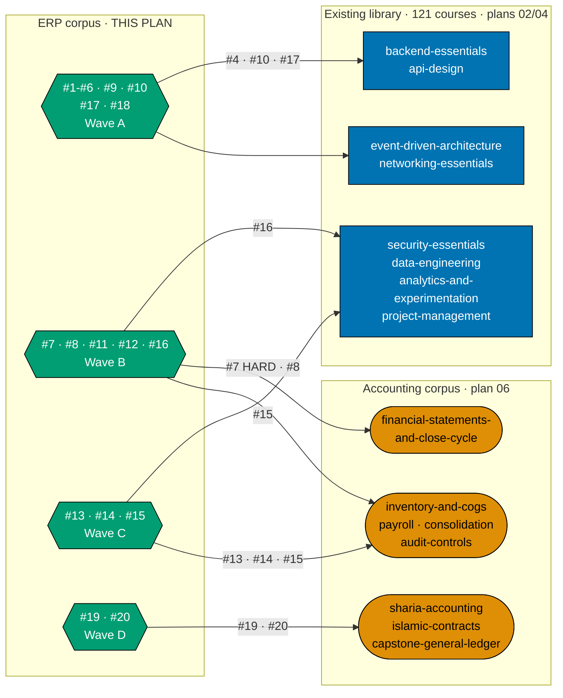
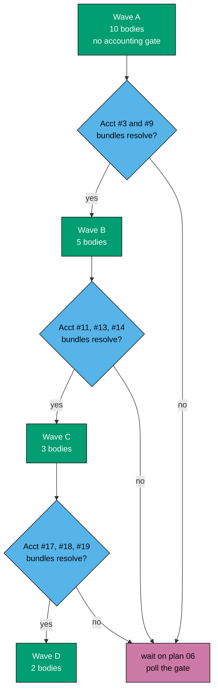
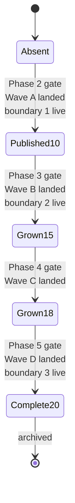

# Technical Documentation — Skills Path: Enterprise Resource Planning

## Overview

This plan ships one path product over a **new 20-course corpus**, reusing every layer the careers
category already built:

| Layer                                                                                             | Owner                                                    | This plan's relationship |
| ------------------------------------------------------------------------------------------------- | -------------------------------------------------------- | ------------------------ |
| `courses/` + `paths/` content homes, structural `_index.md` files                                 | `ayokoding-learning-path-01-url-restructure`             | consumes                 |
| `PathManifest` zod schema, pure `course-paths` core, integrity gates                              | `ayokoding-learning-path-02-schema-and-prerequisite-dag` | consumes                 |
| `path-landing.tsx`, `path-card.tsx`, `manifest-repository.ts`, `?path=` wiring, all design assets | `ayokoding-learning-path-03-navigation-ui`               | consumes                 |
| The accounting corpus, manifest, and landing                                                      | `ayokoding-learning-path-06-skills-accounting`           | depends on, never writes |
| **The ERP corpus, manifest, and landing**                                                         | **this plan**                                            | **authors**              |

### Path constants

- `<COURSES>` = `apps/ayokoding-www/content/en/learn/courses/` — course bundles, served at
  `/en/learn/courses/<course-id>`
- `<PATHS>` = `apps/ayokoding-www/content/en/learn/paths/` — path landings and structural indexes
- `<ERPLANDING>` = `<PATHS>skills/enterprise-resource-planning/_index.md` — **this plan's landing**
- `<FEAT>` = `apps/ayokoding-www/src/features/course-paths/`
- `<MANIFESTS>` = `<FEAT>manifests/`
- `<ERPMAN>` = `<MANIFESTS>skills/enterprise-resource-planning.yaml` — **this plan's only YAML**
- `<SYL>` = `plans/backlog/ayokoding-learning-path-07-skills-erp/syllabus/courses/` — this plan's own
  per-course syllabus corpus (DD-2)
- `<SYLPATHS>` = `plans/backlog/ayokoding-learning-path-07-skills-erp/syllabus/paths/` — this plan's
  path-manifest mirror; the file is `<SYLPATHS>manifest-skills-enterprise-resource-planning.md`
  (DD-22)
- `<SPECS>` = `specs/apps/ayokoding/behavior/ayokoding-www/gherkin/course-paths/` [Repo-grounded — the
  parent `gherkin/` directory exists today with `app-shell`, `content`, `i18n`, `navigation`,
  `search`, `tools` subdirectories]
- Path id: `skills/enterprise-resource-planning` — the **full** string including the category
  segment; there is no separate `category` field, and **nothing keys on segment count** (R2 / DD-21)

### What this plan writes

- `<ERPMAN>` — the single manifest file.
- `<ERPLANDING>` — the single path landing.
- `<COURSES><erp-course-id>/` — twenty new course bundles.
- `<SYL><erp-course-id>.md` + `<SYL>README.md` — twenty-one syllabus files inside this plan folder.
- `<SYLPATHS>manifest-skills-enterprise-resource-planning.md` — the authoritative ordering this plan's
  `courseOrder` is transcribed from (DD-22).
- One ERP card each in `<PATHS>_index.md` and `<PATHS>skills/_index.md` — **populate only**.
- `<SPECS>skills-erp-path.feature` and its step definitions.

### What this plan never touches

- Any file under `<MANIFESTS>careers/` or `<MANIFESTS>skills/accounting.yaml`.
- Any accounting course bundle, syllabus spec, or landing.
- Any structural `_index.md` — `<PATHS>_index.md`, `<PATHS>careers/_index.md`, the three
  `<PATHS>careers/<arc>/_index.md`, and `<PATHS>skills/_index.md` are all **created** by plan 01
  (A3). This plan edits two of them to add one card each and creates none.
- Any component under `<FEAT>shell/` or `<FEAT>core/`.
- Any design asset. This plan ships no `assets/` folder.

## The ERP catalog (20 courses, settled)

Transcribed from the `web-researcher` corpus study of 2026-07-21. **Course ids, formats, prerequisite
edges, and ramp order are decided** — Phase 1 transcribes them into syllabus specs and does not
re-derive them.

`(SWE)` = an existing library course [Repo-grounded — all eight verified present under
`plans/backlog/ayokoding-learning-path-02-schema-and-prerequisite-dag/syllabus/courses/`].
`(Acct)` = a course owned by `ayokoding-learning-path-06-skills-accounting`.

| #   | Course id                                            | Format            | ERP prereqs    | Existing-library prereqs                             | Accounting prereqs                                                                | Wave |
| --- | ---------------------------------------------------- | ----------------- | -------------- | ---------------------------------------------------- | --------------------------------------------------------------------------------- | ---- |
| 1   | `erp-foundations-and-history`                        | Annotated-concept | —              | —                                                    | —                                                                                 | A    |
| 2   | `erp-conceptual-data-model`                          | Annotated-concept | 1              | —                                                    | —                                                                                 | A    |
| 3   | `erp-platform-landscape`                             | Annotated-concept | 2              | —                                                    | —                                                                                 | A    |
| 4   | `capstone-stand-up-and-integrate-an-open-source-erp` | By Example        | 3              | `backend-essentials`, `api-design`                   | —                                                                                 | A    |
| 5   | `procure-to-pay-systems`                             | By Example        | 2              | —                                                    | —                                                                                 | A    |
| 6   | `order-to-cash-systems`                              | By Example        | 2              | —                                                    | —                                                                                 | A    |
| 7   | `record-to-report-systems`                           | By Example        | 2              | —                                                    | `financial-statements-and-close-cycle` — **HARD**                                 | B    |
| 8   | `inventory-and-warehouse-management`                 | By Example        | 2              | —                                                    | `inventory-and-cogs-accounting`                                                   | B    |
| 9   | `erp-extension-and-customization`                    | By Example        | 4              | —                                                    | —                                                                                 | A    |
| 10  | `erp-integration-patterns`                           | By Example        | 4              | `event-driven-architecture`, `networking-essentials` | —                                                                                 | A    |
| 11  | `production-planning-and-mrp`                        | By Example        | 8              | —                                                    | _(transitive via 8)_                                                              | B    |
| 12  | `demand-and-supply-planning`                         | Annotated-concept | 11             | —                                                    | _(transitive via 11)_                                                             | B    |
| 13  | `human-capital-management-and-hire-to-retire`        | Annotated-concept | 2              | —                                                    | `payroll-and-tax-accounting-essentials`                                           | C    |
| 14  | `multi-company-and-multi-currency-erp`               | By Example        | 7              | —                                                    | `consolidation-and-multi-entity-accounting`                                       | C    |
| 15  | `erp-security-and-controls`                          | Annotated-concept | 2              | `security-essentials`                                | `audit-controls-and-compliance`                                                   | C    |
| 16  | `erp-analytics-and-reporting`                        | By Example        | 7              | `data-engineering`, `analytics-and-experimentation`  | _(transitive via 7)_                                                              | B    |
| 17  | `erp-implementation-methodology`                     | Annotated-concept | 3, 5, 6        | `project-management`                                 | —                                                                                 | A    |
| 18  | `evaluating-and-selecting-an-erp`                    | Annotated-concept | 3, 17          | —                                                    | —                                                                                 | A    |
| 19  | `sharia-compliant-erp-design`                        | Annotated-concept | 14             | —                                                    | `islamic-contract-modeling-for-systems`, `sharia-accounting-and-aaoifi-standards` | D    |
| 20  | `capstone-build-a-minimal-erp-core`                  | By Example        | 19, 9, 5, 6, 8 | —                                                    | `capstone-build-a-general-ledger-system`                                          | D    |

**The 20-course count is curriculum judgment, not a sourced fact** [Judgment call] — carried forward
verbatim from the research, which labels it so explicitly (A4).

**Standalone-useful subsets** (the immediately-effective promise, made concrete): #4 is the first
payoff; #5 and #6 stand alone given #2; #9 and #10 stand alone for anyone integrating with an
already-deployed ERP.

## The prerequisite graph — one DAG, ERP is a downstream-only subgraph

R5 requires this plan to state whether the new subject domain **joins** the existing prerequisite DAG
or forms a **disjoint component**. It joins.

The ERP corpus declares eight edges into the existing software-engineering library and eight into the
accounting corpus. **No edge runs the other way**: no software-engineering course and no accounting
course declares an ERP course as a prerequisite. ERP is therefore a **downstream-only subgraph
attached to the single library-wide DAG**, not a second disjoint graph — which is exactly why
`checkPrerequisiteConsistency` can validate the ERP manifest against the same DAG the four careers
manifests use, with no schema or gate change.



**Accessibility note.** Domain is carried by node shape (rectangle / stadium / hexagon) **and** by the
three labelled subgraph containers, never by colour alone; edge meaning is carried by the edge labels.
Fills use the verified accessible palette per the
[Color Accessibility Convention](../../../repo-governance/conventions/formatting/color-accessibility.md).

## Authoring waves vs reading ramp (DD-3)

**Authoring order is not reading order.** The manifest fixes what a reader walks; the delivery
checklist fixes what an author writes next. Conflating them is what would produce the false conclusion
"ERP is blocked by accounting".

The waves are derived mechanically from the catalog: a course belongs to the **earliest** wave whose
accounting preconditions cover its own accounting prerequisites **and** the accounting prerequisites
of everything it transitively depends on.

| Wave  | ERP courses (authoring order)   | Count | Accounting bundles that must resolve on `origin/main` first                                                                 | Concurrency with plan 06 |
| ----- | ------------------------------- | ----- | --------------------------------------------------------------------------------------------------------------------------- | ------------------------ |
| **A** | 1, 2, 3, 4, 5, 6, 9, 10, 17, 18 | 10    | **none**                                                                                                                    | fully concurrent         |
| **B** | 7, 8, 11, 12, 16                | 5     | `financial-statements-and-close-cycle`, `inventory-and-cogs-accounting`                                                     | gated                    |
| **C** | 13, 14, 15                      | 3     | `consolidation-and-multi-entity-accounting`, `audit-controls-and-compliance`, `payroll-and-tax-accounting-essentials`       | gated                    |
| **D** | 19, 20                          | 2     | `sharia-accounting-and-aaoifi-standards`, `islamic-contract-modeling-for-systems`, `capstone-build-a-general-ledger-system` | gated                    |

Transitive derivations worth stating, because they are the ones an executor would get wrong:

- **#11 and #12 look accounting-free** — their declared prerequisites are #8 and #11. But #8 requires
  `inventory-and-cogs-accounting`, so both inherit that gate and belong to Wave B, not Wave A.
- **#16 looks accounting-free** — its declared prerequisites are #7 plus two software-engineering
  courses. #7 carries the hard edge, so #16 is Wave B.
- **#14 carries two accounting gates**, one directly (`consolidation-and-multi-entity-accounting`) and
  one transitively through #7 (`financial-statements-and-close-cycle`). Wave C covers both because
  Wave B has already landed by then.
- **#17 and #18 sit late in the reading ramp and early in the authoring order.** Nothing in either
  touches accounting; deferring them to a later wave would idle work for no reason.



**Within a wave, bodies are content-independent** — each writes only its own subtree under
`<COURSES>`, so they pipeline concurrently through review, bounded by the in-force subagent cap. The
prerequisite edges between them are **reading** constraints satisfied by the manifest order, not
authoring constraints, because every course's concepts, examples, and capstone are already settled in
its syllabus spec before any body is written.

## Manifest format and lifecycle

### Shape

```yaml
# apps/ayokoding-www/src/features/course-paths/manifests/skills/enterprise-resource-planning.yaml
pathId: skills/enterprise-resource-planning
arc: immediately-effective
title: Enterprise Resource Planning
description: >-
  Become useful against a real ERP fast, then go deep enough to design and build one.
courseOrder:
  - erp-foundations-and-history
  - erp-conceptual-data-model
  # ... in ramp order
```

Four invariants specific to this manifest, three of them ruled by the schema owner
`ayokoding-learning-path-02-schema-and-prerequisite-dag` and binding on this plan:

- **`pathId` is the full string, category segment included** — `skills/enterprise-resource-planning`,
  nothing shorter. There is **no separate `category` field**; the category is the first segment of the
  id itself (DD-21).
- **Validation is on the first-segment literal plus resolvability, never on arity.** `pathId` is
  variable-depth by design — careers ids carry three segments, skills ids carry two — so no schema
  rule, regex, route, glob, or acceptance clause in this plan may key on segment count. An
  unresolvable or malformed id is a **hard `safeParse` rejection**: never silent coercion, never an
  alias, never normalization (DD-21).
- **`arc` is a separate required field, present even though the URL omits it** (R8 / DD-7). A skills
  path is always the `immediately-effective` arc; the arc is recorded as **data**, not left implicit
  in prose, and keeping the field is what makes a future `skills/<arc>/<subject>` grammar purely
  additive.
- **`courseOrder` is the file's only YAML sequence.** This is asserted at the REFACTOR step of the
  publication cycle, and it is what makes a list-item count an exact `courseOrder` length rather than
  an approximation. Its entries are **course ids**, a different namespace from path ids, carrying
  **no** category prefix (DD-21).

### Lifecycle



Each transition carries a **falsifiable deferral check in both directions**: the ids added by the next
wave must be provably absent before the transition and provably present after. A manifest that grows
silently, or fails to grow, is caught at the gate that owns the transition rather than at archival.

## Landing content requirements (what plan 03 cannot infer)

`ayokoding-learning-path-03-navigation-ui` owns **how the landing looks** — Screen 2 (path landing),
Screen 1 (paths hub), and Screen 1a (category landing), together with every mockup and render in its
`assets/` and `assets/src/` folders. This plan ships no design asset and no mockup.

What this plan owes plan 03 is a **content specification**, because two requirements are properties of
the ERP domain that no navigation plan can derive from the manifest alone.

### Requirement L-1 — the ramp must be visible on the landing

A skills path answers a question a careers path never poses: **how far in do I become useful?** The
landing must surface all three "dangerous by here" boundaries, each as a pair — what the reader **can**
do and what they still **cannot**:

| Boundary | After | Can                                                                   | Cannot                                                                              |
| -------- | ----- | --------------------------------------------------------------------- | ----------------------------------------------------------------------------------- |
| 1        | #4    | install, configure, integrate a real ERP through its API              | design correct P2P/O2C/R2R flows; extend without breaking upgrades; scope a rollout |
| 2        | #10   | correct core process flows; safe extension; right integration pattern | production planning; multi-company/multi-currency; SoD enforcement; run a rollout   |
| 3        | #20   | full competence                                                       | —                                                                                   |

The **cannot** column is not decoration. Boundary 1's failure mode is a reader who mistakes "can
integrate" for "can design the flows" and produces orphaned purchase orders, double-counted inventory,
or GL entries that never reconcile — the silent failure class this corpus exists to prevent.

### Requirement L-2 — the longer runway must be justified, not hidden

ERP's first payoff is at course **#4**; the sibling accounting path's is at **#3**. **The two skills
landings are therefore not interchangeable**, and plan 03 must not design one template that assumes
they are.

The landing must state the extra orientation step **and its reason** in the same breath: without the
master/transactional data model (#2) and the platform landscape (#3), a reader integrates against the
wrong abstractions and silently corrupts state. A landing that hides the runway reads as padded; a
landing that names it without a reason reads as slow; a landing that justifies it reads as honest.

### Requirement L-3 — the arc is stated once, not per URL

The skills category states the immediately-effective promise once (R8). There is **no arc chooser** on
a skills landing, unlike `careers/`, where the arc is a real three-way branch point.

### Requirement L-4 — linked-not-walked prerequisites are outbound links

The landing carries outbound links to the eight existing software-engineering courses and the eight
accounting courses the corpus depends on, each to its canonical `/en/learn/courses/<id>` page. None of
them appears in `courseOrder` (DD-9).

## Verification status carried forward (A4)

The corpus research marks only three items `[Verified]`, **none of them ERP**. This domain is almost
entirely search-summarised `[Unverified]`. Every marker is carried into the syllabus specs and the
course bodies with a named resolution step; **no `[Unverified]` claim is restated as fact**.

### Safe to assert

Module names (FI / CO / MM / SD / PP), process names (P2P / O2C / R2R / H2R), the MRP algorithm, and
double-entry mechanics. These are stable and go in a course's **stable spine**.

### Requires re-verification at authoring time

| Claim class                      | Status                                                                                                    | Resolution step                                                                         |
| -------------------------------- | --------------------------------------------------------------------------------------------------------- | --------------------------------------------------------------------------------------- |
| ERP integration surfaces         | `[Unverified]` — IDoc retirement from SAP Cloud ERP Public Cloud, Dataverse dual-write, OData generations | `web-researcher` against vendor documentation before authoring #10                      |
| Analyst positioning (Gartner MQ) | `[Unverified]` and **weakly sourced** — paywalled, triangulated from vendor and analyst coverage only     | do not state a ranking as fact; frame as market commentary with its provenance, or omit |
| Platform version pins            | `[Unverified]`                                                                                            | dated accuracy-note sidebar, never the stable spine                                     |
| The 20-course count              | `[Judgment call]` — curriculum judgment, explicitly not a sourced fact                                    | labelled as judgment wherever stated                                                    |

### Named open item — the SAP source gap

A direct SAP-owned source returned **HTTP 403** during the research. Closing that gap with a working
**SAP Help Portal URL** is a tracked open item on this plan, resolved in Phase 1 before `#3
erp-platform-landscape` and `#10 erp-integration-patterns` are authored. If it cannot be closed, the
affected claims are framed with their provenance or dropped — they are not published unqualified.

### Load-bearing for #19 — there is no single "Sharia accounting standard"

Three structurally different jurisdictional models coexist:

| Model                                         | Jurisdiction | Shape                                                                                            |
| --------------------------------------------- | ------------ | ------------------------------------------------------------------------------------------------ |
| **AAOIFI**                                    | Bahrain      | standard-setting-body model; separate Financial Accounting and Shari'ah Standards series         |
| **PSAK Syariah**                              | Indonesia    | parallel standard series; DSAS proposes, DSN-MUI ratifies; AAOIFI used as **basis**, not adopted |
| **MFRS + BNM Shariah Governance Policy 2019** | Malaysia     | single-standard-plus-governance-overlay; **not** on AAOIFI's mandatory-adoption list             |

The engineering lesson of `sharia-compliant-erp-design` is therefore **jurisdictional pluggability**:
the chart of accounts, the recognition rules, and the disclosure set are configuration, not
hardcoded constants. A course presenting AAOIFI as "the" standard would be wrong (DD-12).

The Indonesian **PSAK numbering** is `[Needs Verification]` — sources show both a "PSAK 59 / SIFAS
101-109" generation and a "PSAK 101-110" series. Resolve against IAI's published list before any
standard number is written into #19.

## R9 gate posture (declared explicitly)

Per R9, every plan in this programme declares its UI-gate and API-gate posture. A plan bearing neither
surface is **not thereby exempt** — it must state the exemption and why.

### UI gate — exempt, with the exemption stated

This plan is **exempt from [`ui-quality-gate`](../../../repo-governance/workflows/ui/ui-quality-gate.md)**.

`swe-ui-checker` validates component **source**. This plan authors **no** file under `<FEAT>shell/` or
`<FEAT>core/`; its user-visible output is content (`_index.md` prose) and data (one YAML file)
rendered by components `ayokoding-learning-path-03-navigation-ui` owns. A checker run scoped to this
plan's diff would scan zero component files and return zero findings — a **vacuous** pass, not a real
one, so claiming the gate "ran and passed" would be misleading.

**The exemption is scoped to the automated component gate only.** Because this plan does ship a
user-visible surface, the **Rule-15 three-tester retest is mandatory** and runs in Phase 7. That is
the non-vacuous UI check for a content-and-data plan.

### API gate — NOT exempt

Two candidate API surfaces exist here, and they resolve in opposite directions. Both are stated
because the second one is the reflexive-exemption trap.

**1. The manifest is reachable behavior — this is why the plan is not exempt.** `<ERPMAN>` is loaded,
zod-validated, and integrity-checked at build time by `manifest-repository.ts`; a malformed or
prerequisite-inconsistent manifest changes what the application serves. That behavior is exercised
through the app's **own** interface — the unit-level integrity and prerequisite-consistency checks
plus the path-walk e2e — and this plan **names** those runs rather than claiming a gate it cannot
execute. `ayokoding-www` has no OpenAPI 3.x document and no GraphQL SDL, and its only API route is the
internal tRPC handler [Repo-grounded, per R9's verified precondition state], so `api-quality-gate`
cannot run as a loop here; the posture is a declaration plus a named substitute, not a claimed pass.

**2. The third-party ERP APIs the capstones teach against are subject matter, not shipped surface.**
Courses #4 (`capstone-stand-up-and-integrate-an-open-source-erp`) and #10
(`erp-integration-patterns`) teach a reader to integrate against a real ERP's API. That API belongs to
a vendor, not to this repo: this plan ships **no** reachable delta on it, exposes **no** endpoint
because of it, and could not run `api-quality-gate` against it without depending on a third party's
availability. It is subject matter in exactly the sense the syllabus already draws for target
codebases — evidence that principles transfer, never a surface this repo owns.

**The binding consequence of point 2 is a real delivery constraint (DD-14):** in courses #4 and #10,
no code sample may depend on a **live network call to a third-party ERP**. The capstone stands up a
containerised or fixtured open-source ERP locally; recorded fixtures back every integration example.
A course that needs someone else's SaaS to be up in order for CI to pass has turned subject matter
into a build dependency.

## UI-design-funnel exemption (recorded explicitly)

This plan adds **no net-new screen and no net-new component**. Every screen its output appears on —
Screen 1 (paths hub), Screen 1a (category landing), Screen 2 (path landing) — has a complete design
funnel owned by `ayokoding-learning-path-03-navigation-ui`, which holds the low-fi alternatives, the
hi-fi finalists, the named selection, the rationale, and the responsive record, along with the whole
`assets/` + `assets/src/` set.

This plan therefore ships **no `assets/` folder, no mockup, and no render**. Its obligation to plan 03
is the content specification in
[§Landing content requirements](#landing-content-requirements-what-plan-03-cannot-infer) — the two
things plan 03 cannot infer from a manifest.

The empty-state design for the skills category landing between plan 01 and this plan is likewise plan
03's (A3). This plan's Phase-2 gate is the moment the ERP slot stops being empty, and it asserts that
transition.

## Design Decisions

- **DD-1 · Plan 07 owns the ERP half of the `skills/` category, end to end.** Landing, manifest,
  syllabus specs, and course bodies. The accounting half — corpus, manifest, and landing — belongs to
  `ayokoding-learning-path-06-skills-accounting`, and neither plan writes into the other's files.
  _Source: amendment A2._ **Decided.**
- **DD-2 · The 20 syllabus specs live in this plan's own `syllabus/courses/`, not plan 02's.** Plan 02
  custodies the 121-spec careers corpus under a byte-stability obligation; writing twenty new files
  into it would be a cross-plan mutation of a custodied corpus on a live seam. This plan mirrors plan
  02's layout (`syllabus/courses/<id>.md` + a `README.md` catalog) inside its own folder, so the
  authoring convention transfers unchanged while custody stays clean. The same folder also carries
  `<SYLPATHS>manifest-skills-enterprise-resource-planning.md`, this path's manifest mirror (DD-22).
  **Decided.**
- **DD-3 · Authoring order is derived from dependencies; reading order is the manifest's ramp.** Four
  authoring waves (A: 10 bodies, B: 5, C: 3, D: 2) versus one 20-course reading ramp. Conflating them
  is what produces the false conclusion "ERP is blocked by accounting". See
  [§Authoring waves](#authoring-waves-vs-reading-ramp-dd-3). **Decided.**
- **DD-4 · The `blockedBy` on plan 06 is soft overall and hard at four named wave gates.** Wave A
  declares **zero** accounting preconditions and runs fully concurrently with plan 06; Waves B, C, and
  D each gate on a specific set of accounting course bundles resolving on `origin/main`, checked with
  `test -d`. A blanket block would idle ten provably independent courses. **Decided.**
- **DD-5 · The manifest is published early and grown, never held back until complete.** It ships with
  the ten Wave-A ids at the boundary-1 gate, then grows to 15, 18, and 20. Every deferred id carries a
  falsifiable before/after check written at publication time, so an early manifest cannot pass as a
  finished one. **Decided.**
- **DD-6 · The three "dangerous by here" boundaries are the delivery spine, not just manifest
  metadata.** Boundary 1 (after #4) closes Phase 2, boundary 2 (after #10) closes Phase 3, and
  boundary 3 (after #20) closes Phase 5. Each is also a landing content requirement (L-1). Cutting
  phases anywhere else would produce pauses that are safe for git and meaningless for a reader.
  **Decided.**
- **DD-7 · The manifest records `arc: immediately-effective` even though the URL omits it.** Skills
  paths are always this arc (R8); the URL drops the segment because the arc is constant, not absent.
  Keeping the field in the data model is what makes a future `skills/<arc>/<subject>` grammar a
  purely additive change rather than a breaking URL migration (R2). **Decided.**
- **DD-8 · The three-course runway to first payoff is justified in the product, not shortened.**
  Without the master/transactional data model and the platform landscape, a reader integrates against
  the wrong abstractions and silently corrupts state. Shortening the runway would not make a reader
  dangerous sooner; it would make them dangerous to their employer's books. The justification is a
  stated landing requirement (L-2), not left to prose luck. **Decided.**
- **DD-9 · Link, do not walk.** The eight existing software-engineering prerequisites and the eight
  accounting prerequisites are linked from the landing to their canonical pages and never appear in
  `courseOrder`. This is the established cross-domain pattern in this programme, and it keeps the ERP
  spine short over a shared library. **Decided.**
- **DD-10 · The three scope-boundary risks are grep-checkable acceptance criteria, not review-time
  opinions.** `erp-analytics-and-reporting` keeps to ERP-specific CDC and delta extraction versus
  `data-engineering`; `erp-security-and-controls` keeps to RBAC/SoD and COSO-SOX specifics versus
  `it-governance-grc`; `erp-implementation-methodology` keeps to fit-gap, cutover, and migration
  versus `project-management`. Each affected body must name its neighbour in its own `overview.md`.
  **Decided.**
- **DD-11 · Verification status is carried forward verbatim and never laundered.** Every `[Unverified]`
  and `[Needs Verification]` marker from the research reaches the syllabus specs with a named
  resolution step; fast-moving claims live in dated accuracy-note sidebars, never the stable spine;
  the 20-course count is labelled `[Judgment call]` wherever it appears. _Source: amendment A4._
  **Decided.**
- **DD-12 · `sharia-compliant-erp-design` teaches jurisdictional pluggability, not one standard.**
  AAOIFI, PSAK Syariah, and MFRS + BNM SGP 2019 are three structurally different models; Malaysia is
  not on AAOIFI's mandatory-adoption list. The engineering requirement is that the chart of accounts,
  recognition rules, and disclosure set are configuration. A course naming AAOIFI as "the" standard
  would be factually wrong. **Decided.**
- **DD-13 · UI gate: exempt, with the exemption and its reason stated.** No component source is
  authored here, so `swe-ui-checker` would scan zero files — a vacuous pass. The Rule-15 three-tester
  retest remains mandatory as the non-vacuous UI check. **Decided.**
- **DD-14 · API gate: NOT exempt for the manifest; third-party ERP APIs are subject matter.** The
  manifest is reachable behavior exercised through this app's own integrity checks and path-walk e2e,
  which the plan names rather than claiming a gate it cannot execute. The vendor ERP APIs taught in #4
  and #10 are not a surface this repo ships — and the binding consequence is that **no code sample in
  either course may depend on a live network call to a third-party ERP**. Containerised or fixtured
  ERP only. **Decided.**
- **DD-15 · "Never create an `_index.md`" means never create a _structural_ index.** A3 assigns
  `<PATHS>_index.md`, `<PATHS>careers/_index.md`, the three arc indexes, and `<PATHS>skills/_index.md`
  to plan 01. This plan's **path landing**, `<ERPLANDING>`, is also an `_index.md` file and **is**
  this plan's to create — they are different artefacts sharing a filename convention. Stating the
  disambiguation here prevents an executor freezing on an apparent contradiction. **Decided.**
- **DD-16 · Course formats are taken from the research table as decided.** Eleven By-Example courses
  and nine Annotated-concept courses, assigned per the catalog. Format drives which maker agent
  authors the body (`apps-ayokoding-www-by-example-maker` versus
  `apps-ayokoding-www-annotated-concept-maker`), so re-deciding format at authoring time would also
  re-route the executor. **Decided.**
- **DD-17 · Course bodies follow the seven-step NEW-course authoring convention, restated in this
  plan.** The convention (accuracy pre-verify → skeleton → learning track → drilling track → checkers
  → fixers → re-verify) is proven in `ayokoding-learning-path-04-course-authoring`. It is **restated**
  in this plan's `delivery.md` rather than cross-referenced, because a plan whose authoring contract
  lives in a sibling folder cannot be executed standalone. **Decided.**
- **DD-18 · Content authoring is maker-checker-fixer; the code-bearing steps are TDD.** Twenty course
  bodies and one landing are content and use no RED/GREEN/REFACTOR labels. The manifest publication,
  each growth step, and the Gherkin/e2e work **are** code-bearing and use the full three-substep
  cycle. **Decided.**
- **DD-19 · The 127-course figure stays careers-only; ERP's 20 are additional.** R5 is explicit. This
  plan never asserts a combined catalog count as a gate — a global count is fragile against the
  landing order of plans 04, 06, and 07. It asserts the presence of its **own twenty** bundles by id
  instead, which is exact and falsifiable in both directions. **Decided.**
- **DD-20 · Locale scope is `en` only.** `apps/ayokoding-www/content/id/belajar/` holds no courses and
  no paths [Repo-grounded], so an `id` manifest would compose nothing and an `id` verification walk
  would be fabricated rather than performed. The navigation mechanism itself is locale-neutral; this
  is a content-availability fact, recorded as a non-goal. **Decided.**
- **DD-21 · `pathId` is the full category-prefixed string; nothing keys on segment count.** Ruled by
  the schema owner and binding here: `pathId` is `skills/enterprise-resource-planning` exactly, with
  no separate `category` field. Because `pathId` is variable-depth by design (careers = 3 segments,
  skills = 2), validation asserts the **first-segment literal** (`careers` | `skills`) plus **manifest
  resolvability** — never arity. No regex, route pattern, glob, or acceptance clause in this plan may
  assume a segment count; every URL and id match in this plan is a **full-string literal** for exactly
  that reason. An unresolvable or malformed id is a **hard `safeParse` rejection** — no coercion, no
  aliasing, no normalization. **Course ids are a separate namespace and carry no category prefix**:
  the eight accounting prerequisites this corpus declares
  (`financial-statements-and-close-cycle`, `inventory-and-cogs-accounting`,
  `payroll-and-tax-accounting-essentials`, `consolidation-and-multi-entity-accounting`,
  `audit-controls-and-compliance`, `islamic-contract-modeling-for-systems`,
  `sharia-accounting-and-aaoifi-standards`, `capstone-build-a-general-ledger-system`) are written
  bare, never prefixed. This is a live defect class, not a hypothetical: a sibling plan shipped a
  clause using `grep -oE '/en/learn/paths/[a-z-]+/[a-z0-9-]+'`, which stops at the first `/` inside a
  three-segment careers URL and undercounts by one under `sort -u`. **Decided.**
- **DD-22 · The path-manifest mirror is named `manifest-skills-<subject>.md`.** This plan's mirror is
  `<SYLPATHS>manifest-skills-enterprise-resource-planning.md` — never a bare
  `manifest-enterprise-resource-planning.md`. The four existing careers mirrors keep their current
  un-prefixed names, because renaming them would be pure churn, so the `skills-` marker is what makes
  the category unambiguous by construction. Ruled by the schema owner; binding here. **Decided.**
- **DD-23 · This plan's specs use the canonical prefixed path id from the start; plan 02's 121
  existing specs are not touched.** The 121 careers course specs under plan 02's `syllabus/courses/`
  still carry stale un-prefixed path ids in their "In which paths" sections. Plan 02 deliberately left
  them — custody-protected, informational metadata, not runtime behaviour — so this plan **does not
  edit them**. Its own twenty specs write `skills/enterprise-resource-planning` in full, so the corpus
  adds nothing to that debt. **Decided.**

## File impact

| Path                                                        | Change | Note                                                                                       |
| ----------------------------------------------------------- | ------ | ------------------------------------------------------------------------------------------ |
| `<SYL>README.md` + `<SYL><id>.md` × 20                      | new    | this plan's own syllabus corpus (DD-2)                                                     |
| `<SYLPATHS>manifest-skills-enterprise-resource-planning.md` | new    | the manifest mirror this plan's courseOrder is transcribed from (DD-22)                    |
| `<ERPMAN>`                                                  | new    | the single manifest; grown four times                                                      |
| `<ERPLANDING>`                                              | new    | the path landing (DD-15)                                                                   |
| `<COURSES><erp-course-id>/` × 20                            | new    | course bundles, four authoring waves                                                       |
| `<PATHS>_index.md`                                          | edit   | add one ERP card — populate only                                                           |
| `<PATHS>skills/_index.md`                                   | edit   | add one ERP card — populate only                                                           |
| `<SPECS>skills-erp-path.feature`                            | new    | this plan's Gherkin                                                                        |
| `apps/ayokoding-www-fe-e2e/src/steps/course-paths.steps.ts` | edit   | step bindings; file created by plan 03                                                     |
| `<MANIFESTS>published-manifests.unit.test.ts`               | edit   | add the ERP manifest assertions; file owned by plan 05 — additive only, see the note below |

**The one shared code file.** The published-manifest unit test is created and owned by
`ayokoding-learning-path-05-manifests`. This plan **appends** its ERP assertions to it rather than
creating a parallel test file, because two files asserting "every published manifest is valid" would
drift. If that file does not exist when this plan runs — plan 05 is not a `blockedBy` — this plan
creates `<MANIFESTS>skills/erp-manifest.unit.test.ts` scoped to its own manifest instead, and the
Phase-2 step states both branches explicitly.

## Rollback

Every phase is a separate PR, so rollback is per phase:

- **Phases 1** (syllabus specs) — plan-folder-only; reverting the PR removes the specs and nothing
  user-visible changes.
- **Phase 2** (Wave A + publication) — reverting removes `<ERPMAN>`, `<ERPLANDING>`, the two cards,
  and ten course bundles. The skills category landing returns to its plan-01 empty state, which plan
  03 has designed for (A3), so the revert lands in a designed state rather than a broken one.
- **Phases 3-5** (growth) — reverting a growth PR returns the manifest to its previous id set. The
  deferral checks are written in both directions precisely so a reverted growth is detectable rather
  than silent.
- **Phases 6-10** — verification, retest, integration, knowledge capture, and archival ship no
  product change; reverting affects evidence and plan documents only.

No rollback path touches an accounting file, a careers manifest, or a component — this plan's blast
radius is exactly the files listed above.
