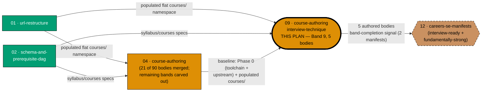

# Learning Path — Course Authoring: Interview-Technique Courses (Band 9)

## Delivery amendment — one final PR

All 5 courses remain within one plan branch and one delivery unit. The sole draft PR opens only in
Phase 6, after verification and Knowledge Capture, and carries the archival move, review cycle, CI,
merge, and deploy. Earlier cohort or delivery-boundary PR wording is superseded.

Author **Band 9 — Interview-technique courses**: the 5 course bodies
`coding-interview`, `take-home-and-live-coding`, `system-design-interview`,
`behavioral-and-leadership-interviews`, and `capstone-interview-loop`, landing under
`apps/ayokoding-www/content/en/learn/courses/`.

This plan owns **exactly one band** — the smallest of the nine authoring bands the shared course
library split into. Band 9 is also the original **"deferred" cluster**: DD-27
(see [tech-docs.md §Design Decisions Consumed](./tech-docs.md#design-decisions-consumed)) deliberately
kept the four interview courses and their capstone **out of** the `interview-ready` MVP gate, so that
authoring the fourth (AI-engineer) path's courses — the programme's stated priority #1 — was never
blocked waiting on interview-technique content. Band 9 was always going to land; DD-27 only ever
decided **when**, not **whether**.

> **Why a standalone plan instead of a phase inside `ayokoding-learning-path-04-course-authoring`.**
> Band 9 was originally Phase 11 of
> [`ayokoding-learning-path-04-course-authoring`](../../in-progress/ayokoding-learning-path-04-course-authoring/README.md).
> **[Repo-grounded, 2026-08-01]** That plan has authored **21 of its 90 bodies** so far — the six
> net-new AI-engineering courses plus Bands 1 and 2 (5 + 10 = 15), verified by
> `git ls-files -- 'apps/ayokoding-www/content/en/learn/courses/*/_index.md' | awk -F/ 'NF==8' | wc -l`
> returning **58** total course directories against the **37** re-homed bundles the URL-restructure
> plan populated (58 − 37 = 21 net-new). The remaining bands — 3, 4, 5, 6, 7, and 9 — are being carved
> into standalone sibling plans so each can proceed, review, and merge on its own schedule, independent
> of whatever cadence the parent plan (or any sibling) settles into; this plan is the Band-9 slice of
> that carve-out. This is a **content transfer, not a re-authoring**: the band's scope, course IDs,
> specs, and acceptance criteria are unchanged from the parent plan's own Phase 11 — only the plan
> boundary moved. The parent plan's own `tech-docs.md` and `delivery.md` are being trimmed of this
> band's content in a concurrent, separate edit; this plan does not touch that folder.

## Position relative to the course-authoring split

**Accessibility note.** Plan role is carried by node **shape** (rectangle = authoring plan, hexagon =
manifest-composing plan) and by explicit label text, never by fill colour alone. This plan is marked by
a **thicker border** and the literal text `THIS PLAN` in its label. `12 · careers-se-manifests` carries
a **dashed border** to flag its backlog (not-yet-started) status — the plan folder exists (see
[Depends-on](#depends-on) below) but has not begun execution — distinct from the done/in-progress
solid nodes. Fills use the verified accessible palette (`#029E73` teal, `#DE8F05`
orange, `#CA9161` tan) with black borders and WCAG-AA-contrasting text, per the
[Color Accessibility Convention](../../../repo-governance/conventions/formatting/color-accessibility.md).

## The manifest ownership invariant — THIS BAND IS THE SPECIAL CASE

> **This plan never edits a manifest file.** Every file under
> `apps/ayokoding-www/src/features/course-paths/manifests/` is owned by a downstream manifest-growth
> plan (see [Depends-on](#depends-on)). A step in this plan that creates, appends to, reorders, or
> re-verifies a `.yaml` manifest is a **boundary violation**, not a convenience.

Band 9 is the one band in the whole split whose manifest growth is **not** the usual three-manifest
pattern. Quoted **verbatim** from the parent plan's own binding record
([`ayokoding-learning-path-04-course-authoring/README.md` §Band-completion signal
contract](../../in-progress/ayokoding-learning-path-04-course-authoring/README.md#band-completion-signal-contract)),
so this plan does not risk generalizing the exception back into the rule it is an exception to:

> - **Band 9** → `<MANIFESTS>careers/interview-ready/software-engineer.yaml` and
>   `<MANIFESTS>careers/fundamentally-strong/software-engineer.yaml` **only** — the
>   `careers/immediately-effective/software-engineer` path omits the interview-technique band from its
>   `courseOrder` by design

**Read literally, twice, before authoring anything:**

- **Two manifests grow, not three.** `careers/immediately-effective/software-engineer.yaml` is
  deliberately **excluded** — that path's reader reaches the interview-technique courses (if at all)
  via their canonical course pages, never via that path's own `courseOrder`. This is a design decision
  the source plan made, not an oversight this plan corrects.
- **This asymmetry is downstream's problem to get right, not this plan's to fix.** This plan's only
  obligation is to **name the two manifests correctly** in its band-completion signal (see below). It
  never touches any manifest itself.

See [tech-docs.md §The two-of-three manifest asymmetry](./tech-docs.md#the-two-of-three-manifest-asymmetry-band-9s-special-case)
for the full permit/forbid table and a worked diagram distinguishing this band from the eight-band
default.

## Band-completion signal contract

This plan records **one** band-completion signal in its own [`delivery.md`](./delivery.md), carrying
the same five fields the parent plan's contract defines, verbatim, in a fenced `text` block:

| Field               | Content                                                                                                                                                                 |
| ------------------- | ----------------------------------------------------------------------------------------------------------------------------------------------------------------------- |
| `BAND`              | `Band 9 — Interview-technique courses`                                                                                                                                  |
| `PLAN`              | `ayokoding-learning-path-09-course-authoring-interview-technique`                                                                                                       |
| `LANDED_COURSE_IDS` | the 5 course IDs, one per line, in this plan's own listing order (see below)                                                                                            |
| `GROW_MANIFESTS`    | `<MANIFESTS>careers/interview-ready/software-engineer.yaml` and `<MANIFESTS>careers/fundamentally-strong/software-engineer.yaml` — **exactly these two, never a third** |
| Final delivery      | this plan's terminal archival PR; downstream work consumes the signal only after that PR merges                                                                         |

A signal that names three manifests is incomplete and the receiving plan must reject it rather than
guess. It becomes actionable only after this plan's terminal archival PR merges.

## Exact course list, in landing order

1. `coding-interview` — By Example, Python (patterns language-agnostic)
2. `take-home-and-live-coding` — By Example, Python
3. `system-design-interview` — Annotated-concept, no code (forward-links `system-design`)
4. `behavioral-and-leadership-interviews` — Annotated-concept, no code
5. `capstone-interview-loop` — Interview milestone, Python + prose (integrates courses 1–4)

Full per-course concept/example counts, prerequisites, and format detail: see
[tech-docs.md §Course Library Catalog (Band 9 rows)](./tech-docs.md#course-library-catalog-band-9-rows).

## Delivery Mode: worktree-to-pr

This plan has exactly one dedicated worktree, one persistent final-delivery branch, and one PR.
All authoring, verification, and Knowledge Capture phases commit on that branch without a push, PR,
review cycle, merge, or deployment. In Phase 6, the executor commits the archival move and
any index updates, opens the sole draft PR, completes the PR-Review Maker→Fixer Cycle and CI gates,
marks it ready, and performs the normal AI merge/deploy after the hardened preconditions hold.
No per-course, cohort, stage, or phase worktree/branch/PR is permitted.

## Depends-on

| Direction     | Plan (full folder name)                                                                                                                                                                                             | Nature                                                                                                                                                                                                                                                                                                                                                                                                                                                                                            |
| ------------- | ------------------------------------------------------------------------------------------------------------------------------------------------------------------------------------------------------------------- | ------------------------------------------------------------------------------------------------------------------------------------------------------------------------------------------------------------------------------------------------------------------------------------------------------------------------------------------------------------------------------------------------------------------------------------------------------------------------------------------------- |
| **blockedBy** | `ayokoding-learning-path-01-url-restructure`                                                                                                                                                                        | hard, transitive — populated flat `courses/` namespace + `courses/_index.md`; this plan needs the bucket to exist even though it does not itself re-home anything                                                                                                                                                                                                                                                                                                                                 |
| **blockedBy** | `ayokoding-learning-path-02-schema-and-prerequisite-dag`                                                                                                                                                            | hard, transitive — `syllabus/courses/<course-id>.md` specs for all 5 Band-9 IDs + the `prerequisites` frontmatter contract                                                                                                                                                                                                                                                                                                                                                                        |
| **blockedBy** | `ayokoding-learning-path-04-course-authoring`                                                                                                                                                                       | hard, baseline — this plan's Phase 0 requires the parent plan's own Phase 0 baseline (toolchain converged, both Wave-1 plans verified merged) and its already-populated `<COURSES>` namespace — **not** its full 90-body completion; Bands are mutually independent (see [tech-docs.md §Baseline precondition](./tech-docs.md#baseline-precondition-on-plan-04))                                                                                                                                  |
| **blockedBy** | `vercel-function-cost-reduction`                                                                                                                                                                                    | hard, new — Phases 1–4 of that plan fix `apps/ayokoding-www`'s prerendering so 5 new content pages land static rather than compounding the per-page function-invocation cost problem; see [tech-docs.md §The `vercel-function-cost-reduction` precondition](./tech-docs.md#the-vercel-function-cost-reduction-precondition)                                                                                                                                                                       |
| _(sibling)_   | `ayokoding-learning-path-05-course-authoring-platform-and-concurrency`                                                                                                                                              | none — Bands 3+4 (14 bodies); mutually content-independent, per plan04's own "Bands 1–4, 6, 7, and 9 are mutually independent" ordering rationale                                                                                                                                                                                                                                                                                                                                                 |
| _(sibling)_   | `ayokoding-learning-path-06-course-authoring-architecture-and-ai-harness`                                                                                                                                           | none — Band 5 (15 bodies, incl. the AI/harness cluster); mutually content-independent                                                                                                                                                                                                                                                                                                                                                                                                             |
| _(sibling)_   | `ayokoding-learning-path-07-course-authoring-low-level-systems`                                                                                                                                                     | none — Band 6, native/low-level half (7 bodies); mutually content-independent                                                                                                                                                                                                                                                                                                                                                                                                                     |
| _(sibling)_   | `ayokoding-learning-path-08-course-authoring-security-and-ops`                                                                                                                                                      | none — Band 7 (11 bodies); mutually content-independent                                                                                                                                                                                                                                                                                                                                                                                                                                           |
| _(sibling)_   | `ayokoding-learning-path-10-course-authoring-jvm-and-build-your-own`                                                                                                                                                | none — Band 6, JVM/advanced-language half (9 bodies); mutually content-independent                                                                                                                                                                                                                                                                                                                                                                                                                |
| _(sibling)_   | `ayokoding-learning-path-14-skills-accounting-foundations`, `-15-skills-accounting-enterprise-reporting`, `-16-skills-accounting-sharia-extension`, `-17-skills-erp-foundations`, `-18-skills-erp-enterprise-depth` | none — different track (`skills/` paths, not `careers/`); mutually content-independent; different course corpora. These five plans are the successors of the former `06-skills-accounting`/`07-skills-erp` plans, which were split before this plan's authoring                                                                                                                                                                                                                                   |
| **blocks**    | [`ayokoding-learning-path-12-careers-se-manifests`](../ayokoding-learning-path-12-careers-se-manifests/README.md)                                                                                                   | hard, but **only for two of that path's manifests** — the `interview-ready` and `fundamentally-strong` `software-engineer` manifests' growth. The `immediately-effective/software-engineer` manifest is **not** grown by this signal — see [the manifest ownership section above](#the-manifest-ownership-invariant--this-band-is-the-special-case). This plan is the successor (SE-manifest half) of the former single `05-manifests` plan, which was split in two before this plan's authoring. |
| _(no edge)_   | `ayokoding-learning-path-13-careers-ai-manifest`                                                                                                                                                                    | explicitly **no dependency** — the AI-engineer path never references any interview-technique course; stated here so a reader does not infer a missing edge. This plan is the successor (AI-manifest half) of the former single `05-manifests` plan                                                                                                                                                                                                                                                |

**Independent of siblings 05–08**: this plan's 5 course bodies are mutually content-independent of
every other band-split sibling plan's corpus — no shared file, no shared course ID.

## Not UI-bearing (Rule-15 exemption, reused reasoning)

Reusing the parent plan's own [Rule-15 exemption
reasoning](../../in-progress/ayokoding-learning-path-04-course-authoring/README.md#rule-15-three-tester-retest--exemption-recorded)
verbatim in substance, scoped to this plan's 5 bodies:

1. **This plan ships no screen and no component.** Every artefact is a markdown page bundle under
   `apps/ayokoding-www/content/en/learn/courses/`. The screens that render those pages are owned by
   `ayokoding-learning-path-03-navigation-ui` (already merged and archived to
   `plans/done/2026-07-25__ayokoding-learning-path-03-navigation-ui/`), which carried the mandatory
   retest for that surface.
2. **This plan's output is already covered by dedicated content checkers.** Every authored body passes
   `apps-ayokoding-www-{by-example,annotated-concept}-checker`, `apps-ayokoding-www-facts-checker`, and
   `apps-ayokoding-www-link-checker` — content-domain checkers strictly stronger, for prose
   correctness, than a generalist live-site UX triad.
3. **The retest would test the navigation plan's surface, not this plan's.** Pointing the triad at a
   course page exercises `PathRail`/`PathLanding` rendering, producing findings this plan cannot act
   on.

**This is an exemption, not an omission.** Manual behavioural verification via Playwright MCP is
**still mandatory and performed** (see [delivery.md](./delivery.md) Phase 3) — the 5 authored course
pages are opened at all three breakpoints in the `en` content locale, with committed screenshot
evidence. Only the three-tester triad is waived.

## Locale scope

`en`-only, per the parent plan's own Business-Scope Non-Goals — an Indonesian mirror of these 5
courses is explicitly **deferred**, a recorded decision rather than an omission. Every manual
verification step in this plan exercises `en` only and states the deferral inline.

## Navigation

- [Business Requirements (brd.md)](./brd.md) — WHY these 5 bodies exist, who they serve, the business
  risks of authoring them, and what "done" means in business terms.
- [Product Requirements (prd.md)](./prd.md) — personas, user stories, the Gherkin acceptance criteria
  this plan owns, the 5 course specifications, and product scope.
- [Technical Docs (tech-docs.md)](./tech-docs.md) — the authoring architecture (consumed from the
  parent plan), the two-of-three manifest asymmetry, the Course Library Catalog rows for these 5
  courses, and the two hard cross-plan preconditions.
- [Delivery Checklist (delivery.md)](./delivery.md) — the phased, executable checklist: Phase 0 setup
  → Phase 1 authoring → verification, manual test, CI readiness, knowledge capture, terminal archival PR.
- [Learnings (learnings.md)](./learnings.md) — knowledge-capture running log.
- **Cross-plan**:
  [parent course-authoring plan](../../in-progress/ayokoding-learning-path-04-course-authoring/README.md)
  ·
  [`syllabus/courses/` catalog](../../done/2026-07-24__ayokoding-learning-path-02-schema-and-prerequisite-dag/syllabus/courses/README.md)
  · [SE-manifest plan (12, successor to 05-manifests)](../ayokoding-learning-path-12-careers-se-manifests/README.md)
  · [`vercel-function-cost-reduction`](../../done/2026-08-02__vercel-function-cost-reduction/README.md)

## Provenance

This plan's scope, course IDs, specs, and acceptance criteria are transferred verbatim from
`ayokoding-learning-path-04-course-authoring`'s own Phase 11 (Band 9). Nothing about the band's content
was re-decided in the transfer — only the plan boundary moved, so authoring effort on the split's other
85 bodies (90 total minus this plan's 5), whether it stays with the parent plan or moves to one of the
other band-split sibling plans, can proceed independently of this band's own review/merge cadence. The
parent
plan's `README.md`, `tech-docs.md`, and `delivery.md` are being edited concurrently (by a separate
agent, in a separate session) to remove Band 9 from their own scope; this plan does not read or write
any file under that folder as part of its own delivery checklist — the citations above are read-only
cross-references, consistent with the manifest ownership invariant's spirit of "read to understand,
never to copy."
