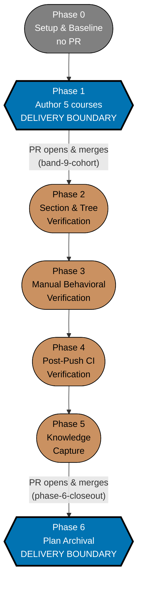

# Delivery Checklist — Course Authoring: Interview-Technique Courses (Band 9)

This checklist authors **5 course bodies** into `apps/ayokoding-www/content/en/learn/courses/<course-id>/`:
`coding-interview`, `take-home-and-live-coding`, `system-design-interview`,
`behavioral-and-leadership-interviews`, and `capstone-interview-loop`.

> **This plan never edits a manifest file.** Every file under
> `apps/ayokoding-www/src/features/course-paths/manifests/` (`<MANIFESTS>`) belongs to a downstream
> manifest-growth plan. This plan's only outbound artefact is the **one band-completion signal**
> recorded at the end of Phase 1. See
> [README.md §The manifest ownership invariant](./README.md#the-manifest-ownership-invariant--this-band-is-the-special-case)
> and
> [tech-docs.md §The manifest ownership invariant](./tech-docs.md#the-manifest-ownership-invariant-binding).
>
> **Cross-plan source of truth** — the `syllabus/` detail layer lives in
> [`../../done/2026-07-24__ayokoding-learning-path-02-schema-and-prerequisite-dag/syllabus/`](../../done/2026-07-24__ayokoding-learning-path-02-schema-and-prerequisite-dag/syllabus/README.md).
> Every course body is authored **from** its `syllabus/courses/<course-id>.md` spec. **Never copy
> those files into this plan.**
>
> **Legend** — `[AI]`: an agent performs the step (the default; unmarked steps are `[AI]`).
> `[HUMAN]`: only a human can do it (physical action, out-of-band approval, real-secret or
> privileged-credential handling). `[AI+HUMAN]`: agent prepares, human approves or finishes.
> Git-mechanical steps (worktree create/remove, branch, push, merge) are `[AI]`. **This plan contains
> no `[HUMAN]` step.**
>
> **Phase Gate** — every phase ends with a `### Phase N Gate` (must-pass verification) plus a
> `> **Pause Safety**:` note (safe-to-stop state + resume command). A gate in a phase named as a
> delivery boundary in the [`### Delivery Boundaries`](#delivery-boundaries) table additionally covers
> **integration** (draft PR opened, 3-cycle PR-Review, CI green, `[AI]` merge, `ayokoding-www`
> deployed); a gate in an intermediate phase instead confirms the work is committed to its delivery
> unit's branch with nothing pushed for review yet.
>
> **Executor environment note — RTK-wrapped commands emit an empty-output marker, not true
> emptiness**: this repo routes `git` (and other commands) through RTK via a Claude Code hook (see
> `CLAUDE.md` §RTK). For `git diff`, a **non-empty** result gets a three-line trailer appended
> (blank, `--- Changes ---`, blank), so `| wc -l` reads `N + 3` and `| grep -c .` reads `N + 1` for `N`
> changed paths. In the **clean** state the two forms **diverge**: `| grep -c .` reads `0`, but
> `| wc -l` reads `1` (a lone newline, not true zero-byte emptiness). **Every zero-assertion in this
> plan uses `| grep -c .`, never `| wc -l`, for exactly this reason.** `grep -c .` on a genuine
> zero-count exits status `1` — read the **printed number**, never `&&`-chain the command. Never use
> an `ls`-based emptiness assertion (`ls <dir> | wc -l` is unreliable under RTK for the same family of
> reasons; unrelated to the `git diff` trailer specifically).

## One-PR delivery contract (binding, 2026-08-01)

This 5-course plan is one inseparable delivery unit: every Phase 1–6 change lands in **one
worktree, one branch, and exactly one draft PR**. Courses may still be authored, checked, and
committed in their dependency order, but no intermediate phase may push, open a PR, run the PR
review cycle, merge, deploy, or record a merge SHA. Only Phase 6 opens the draft PR, after all
course work, verification, and Knowledge Capture are green; it includes the archival move to
`plans/done/`, then runs the PR-Review Maker→Fixer Cycle, CI verification, ready-for-review
transition, and the normal `[AI]` merge/deploy protocol. This contract supersedes every older
cohort or delivery-boundary PR reference below.

The `worktrees/ayokoding-learning-path-09-course-authoring-interview-technique/` path below is
this plan's only worktree; no per-course, cohort, phase, or closeout worktree is created.

## Worktree

Worktree path: `worktrees/ayokoding-learning-path-09-course-authoring-interview-technique/`

Optional manual pre-provisioning (run from repo root):

```bash
claude --worktree ayokoding-learning-path-09-course-authoring-interview-technique
```

The plan-execution Step 0 gate enters this worktree by default: it auto-provisions from the latest
`origin/main` when missing, syncs with `origin/main` before implementing, and prompts before deleting
the worktree after the plan is archived and pushed.

See [Worktree Path Convention](../../../repo-governance/conventions/structure/worktree-path.md) and
[Plans Organization Convention §Worktree Specification](../../../repo-governance/conventions/structure/plans.md#worktree-specification).

## Delivery Mode: worktree-to-pr

Each **delivery boundary** named in the [`### Delivery Boundaries`](#delivery-boundaries) table works
in the shared worktree on its own branch, opens a **draft PR** against `main`, runs the **PR-Review
Maker→Fixer Cycle** (fan-out → `pr-review-synthesis-maker` → `pr-review-fixer`, 3 sequential
CI-gated cycles), flips the PR to ready, and `[AI]` **merges it automatically once all quality gates
are green** — then `[AI]` **deploys `ayokoding-www` to `prod-ayokoding-www`** after every merge. An
intermediate phase inside a delivery unit instead commits (and may push for durability) to that unit's
branch without opening a PR of its own. See
[Plans Organization Convention §Delivery Mode](../../../repo-governance/conventions/structure/plans.md#delivery-mode)
and the [PR Review Quality Gate workflow](../../../repo-governance/workflows/pr/pr-review-quality-gate.md).

**One cohort, one PR (HARD, this plan's own scope decision).** With only 5 courses, this plan's entire
authoring phase is **one five-course cohort**: all 5 bodies are authored, checked, and committed
one at a time on a single shared branch, and **one draft PR** opens once all 5 have completed their
own maker-checker-fixer cycle. This plan does **not** invent multiple cohorts or per-course PRs — that
finer granularity served the parent plan's 90-body scope, not this plan's 5.

**`[AI]` auto-merge (DN-11, inherited default).** The repo's
[PR Merge Protocol](../../../repo-governance/development/workflow/pr-merge-protocol.md) has `[AI]`
merge the PR by default once its five hardened preconditions hold; this plan does not opt into a
`[HUMAN]` merge gate.

**Delivery-Boundary Integration Protocol** (fires once per delivery boundary — see the
[`### Delivery Boundaries`](#delivery-boundaries) table below; Phase 0 is excluded, per
[§Phase 0 Opens No PR](../../../repo-governance/conventions/structure/plans.md#phase-0-opens-no-pr--the-earliest-pr-is-phase-1-hard-rule)):

1. [AI] Sync the worktree to latest `origin/main` and branch:
   `git fetch origin && git checkout main && git pull && git checkout -b ayokoding-learning-path-09-course-authoring-interview-technique/<unit-slug>`.
2. [AI] **Run the local quality gate before pushing** —
   `npx nx affected -t typecheck lint test:quick test:unit specs:behavior:coverage` — acceptance: all
   exit 0; fix ALL failures found (including preexisting ones) before proceeding to step 3. This
   catches a typecheck or unit-test regression locally instead of relying on CI to surface it after
   the PR is already open.
3. [AI] Stage only this unit's paths (`git add <explicit paths>` — never `git add -A`), commit
   thematically (Conventional Commits, imperative, no period), push the branch, open a **draft PR**
   against `main` (`gh pr create --draft --base main ...`) — CI runs on the PR.
4. [AI] Run the **PR-Review Maker→Fixer Cycle** (3 sequential CI-gated cycles), resolve every finding,
   then `gh pr ready`.
5. [AI] **Merge** once all quality gates are green (typecheck, lint, `test:quick`, `test:unit`,
   `specs:behavior:coverage`, CI, the 3-cycle review) — `[AI]` auto-merge per DN-11.
6. [AI] Dispatch `apps-ayokoding-www-deployer` to deploy `ayokoding-www` to `prod-ayokoding-www`.

> **Important**: Fix ALL failures found during quality gates, not just those caused by your changes.
> This follows the root cause orientation principle — proactively fix preexisting errors encountered
> during work. Do not defer or mention-and-skip existing issues; commit preexisting fixes separately
> with their own conventional-commit messages.

## Depends-on

| Relation        | Plan (full folder name)                                   | Nature                                                                                                                                                                   |
| --------------- | --------------------------------------------------------- | ------------------------------------------------------------------------------------------------------------------------------------------------------------------------ |
| **blockedBy**   | `ayokoding-learning-path-01-url-restructure`              | Hard, transitive. Populated flat `<COURSES>` bucket + `<COURSES>_index.md`.                                                                                              |
| **blockedBy**   | `ayokoding-learning-path-02-schema-and-prerequisite-dag`  | Hard, transitive. `syllabus/courses/<id>.md` specs for the 5 Band-9 IDs + the `prerequisites` frontmatter contract.                                                      |
| **blockedBy**   | `ayokoding-learning-path-04-course-authoring`             | Hard, baseline — Phase 0 baseline + populated `<COURSES>` bucket, **not** full 90-body completion (see [tech-docs.md](./tech-docs.md#baseline-precondition-on-plan-04)). |
| **blockedBy**   | `vercel-function-cost-reduction`                          | Hard, new — Phases 1–4 fix `apps/ayokoding-www` prerendering (see [tech-docs.md](./tech-docs.md#the-vercel-function-cost-reduction-precondition)).                       |
| **blocks**      | `ayokoding-learning-path-12-careers-se-manifests`         | For the `interview-ready` and `fundamentally-strong` manifests' growth **only**.                                                                                         |
| **independent** | `ayokoding-learning-path-05` … `08`, `10` (band siblings) | Mutually content-independent — no shared file, no shared course ID.                                                                                                      |

**Start precondition (hard gate, checked in Phase 0)**: all four blocking plans/conditions above hold.
This plan does not start on a promise.

## Parallelization Model

**Cap**: honor the in-force subagent/PR-review concurrency cap (parallel-by-default, background
subagents capped per the orchestration convention). The main thread self-promotes nothing.

- **Phase 0** is a single serial baseline.
- **Phase 1 (5 Band-9 courses)** — the four interview-technique courses are content-independent
  (each writes only its own `<COURSES><id>/` subtree) and may author/check concurrently, bounded by
  the cap. `capstone-interview-loop` has a hard ordering constraint: it declares all four as
  prerequisites, so it is authored **after** the four (or in the same review cycle, once all four
  bundles exist on the shared branch).
- **Phases 2–6 (finalization)** are serial — each consumes the prior phase's output.

**Path constants** (referenced throughout):

- `<COURSES>` = `apps/ayokoding-www/content/en/learn/courses/` (course bundles; served at `/en/learn/courses/<course-id>`)
- `<FEAT>` = `apps/ayokoding-www/src/features/course-paths/` (**never written here**)
- `<MANIFESTS>` = `<FEAT>manifests/` (**never written here** — downstream manifest-plan property; read-only reference only)
- `<SYLLABUS>` = `../../done/2026-07-24__ayokoding-learning-path-02-schema-and-prerequisite-dag/syllabus/` (cross-plan authoring source of truth — **never copied**)
- `<SYLLABUS_ROOT>` = `<SYLLABUS>courses/` (discovered and verified in Phase 0's blocking-plan-#2 check,
  recorded in `evidence/phase-0-snapshot.txt`). Written as a doc-macro placeholder — like `<COURSES>`
  above — never as a `$SYLLABUS_ROOT` shell variable: exported shell state does not persist across
  this harness's separate tool-invocation boundaries, so every reference below substitutes the literal
  path directly rather than relying on a re-export.

### Delivery Boundaries

| Phase(s) | Delivery unit                                                                                          | Worktree / branch                                                                  | PR opens                          |
| -------- | ------------------------------------------------------------------------------------------------------ | ---------------------------------------------------------------------------------- | --------------------------------- |
| 0        | — (setup and baseline)                                                                                 | —                                                                                  | no                                |
| 1        | Band 9 — Interview-technique courses (5 bodies, one cohort)                                            | `ayokoding-learning-path-09-course-authoring-interview-technique/band-9-cohort`    | yes — at Phase 1, once all 5 land |
| 2–6      | Closeout: section/tree verification, manual evidence, final CI/main check, Knowledge Capture, archival | `ayokoding-learning-path-09-course-authoring-interview-technique/phase-6-closeout` | yes — at Phase 6                  |



**Accessibility note.** Delivery-boundary phases are carried by node **shape** (hexagon = boundary,
stadium = no-PR/intermediate) and by the literal `DELIVERY BOUNDARY` label, plus a thicker border; the
two PR-opening/merging transitions carry explicit edge labels rather than relying on colour alone.
Fills use the verified accessible palette per the
[Color Accessibility Convention](../../../repo-governance/conventions/formatting/color-accessibility.md).

Phase 1 is the plan's only content-authoring boundary and passes all four boundary-test criteria
standalone (coherent unit of meaning, green alone, defensible on `main`, reviewable as a whole) — one
five-course cohort is small enough that splitting it further would produce five PRs reviewing content
whose only cross-reference (the capstone's four prerequisites) spans all of them anyway. **Phases 2–5
are intermediate**: Phase 2's build/lint/link verification, Phase 3's screenshot evidence, and Phase
4's CI-monitoring produce no routine content change of their own (Phase 5's Knowledge Capture triage
may land a small inline note, per the convention) — all four fold into the Phase 6 closeout PR, which
is the plan's last change-producing phase and therefore always a boundary, per
[PRs Open at Delivery Boundaries](../../../repo-governance/conventions/structure/plans.md#prs-open-at-delivery-boundaries-not-every-phase-hard-rule).

---

## Phase 0: Environment Setup & Baseline

> _Executor: repo-setup-manager_
>
> **Cross-plan precondition (hard).** Four preconditions gate this phase — two upstream plans merged,
> the parent plan's own Phase 0 baseline established, and the `vercel-function-cost-reduction` fix
> landed. A body authored before any of these lands into the wrong place, from a spec that does not
> yet exist, or onto a site that is still knowingly over-cost.

- [ ] [AI] Enter/provision the worktree and install dependencies: `npm install` — acceptance: exits 0,
      `node_modules/` synchronized.
- [ ] [AI] Converge the toolchain: `npm run doctor -- --fix` — acceptance: exits 0 with no unresolved
      drift.
- [ ] [AI] **Verify blocking plan #1 merged** — the `<COURSES>` bucket exists and holds at least the 37
      re-homed bundles — command (single line):
      `test -d apps/ayokoding-www/content/en/learn/courses && test -f apps/ayokoding-www/content/en/learn/courses/_index.md && git ls-files -- 'apps/ayokoding-www/content/en/learn/courses/*/_index.md' | awk -F/ 'NF==8' | grep -c .`
      — acceptance: both `test` commands exit 0 and the count returns **at least 37**. Depth-filter
      with `awk -F/ 'NF==8'` (8 = the fixed path-component count of
      `apps/ayokoding-www/content/en/learn/courses/<slug>/_index.md`) — an un-filtered
      `git ls-files` count over-reports because each bundle also nests `drilling/_index.md` and
      `learning/_index.md` at deeper path levels. Falsifiable both ways: before the URL-restructure
      plan merges, the leading `test -d` exits non-zero and the `&&` chain short-circuits with no
      number printed at all; a count below 37 means the re-home is incomplete.
- [ ] [AI] **Verify blocking plan #2 merged** — the cross-plan syllabus layer is on `origin/main` and
      holds the 5 Band-9 spec files — command (single line):
      `git ls-files -- 'plans/done/*ayokoding-learning-path-02-schema-and-prerequisite-dag/syllabus/courses/README.md'`
      — acceptance: (a) prints **exactly one** path (pipe to `grep -c .`, read **1**); its directory is
      `<SYLLABUS_ROOT>`. (b) `test -d "<SYLLABUS_ROOT>"` exits 0. (c) all 5 spec files exist:
      `for f in coding-interview take-home-and-live-coding system-design-interview behavioral-and-leadership-interviews capstone-interview-loop; do test -f "<SYLLABUS_ROOT>/$f.md" || echo "MISSING $f"; done | grep -c .`
      returns `0`. Record the printed path to `evidence/phase-0-snapshot.txt` as
      `SYLLABUS_ROOT=<path>`. **Do not write this as a `test -d plans/done/*__…/syllabus/courses`
      glob** — this harness runs zsh, where an unmatched glob is a fatal error, not a literal; `git
  ls-files` expands its own quoted pathspec so neither zsh nor RTK ever sees the `*`.
- [ ] [AI] **Verify blocking plan #3 baseline — the parent plan's own Phase 0 established** — command
      (single line):
      `git log --oneline -1 -- plans/in-progress/ayokoding-learning-path-04-course-authoring/delivery.md | grep -c .`
      — acceptance: returns **1** (the parent plan's `delivery.md` has at least one commit on
      `origin/main`, i.e. its own Phase 0 has run and been committed). This is a **baseline** check,
      not a full-completion check — see [tech-docs.md §Baseline
      precondition](./tech-docs.md#baseline-precondition-on-plan-04) for why this plan does not require
      all of the parent plan's other 85 non-Band-9 bodies merged first.
- [ ] [AI] **Verify blocking plan #4 — the `vercel-function-cost-reduction` Phase 1–4 fix landed** —
      three checks, all required (single line each):
      `test ! -f apps/ayokoding-www/src/app/layout.tsx && echo OK1`;
      `test -f "apps/ayokoding-www/src/app/[locale]/layout.tsx" && echo OK2`;
      `test ! -f apps/ayokoding-www/src/middleware.ts && echo OK3`
      — acceptance: all three print their `OK<n>` marker. Falsifiable both ways: before that plan's
      Phase 1 merges, `apps/ayokoding-www/src/app/layout.tsx` still exists and `OK1` is not printed;
      reintroducing the file after the fix breaks the check again. See [tech-docs.md §The
      vercel-function-cost-reduction precondition](./tech-docs.md#the-vercel-function-cost-reduction-precondition)
      for the full three-phase signal table this check is grounded in.
- [ ] [AI] Establish content baselines: `npx nx run ayokoding-www:build` and
      `npx nx run ayokoding-www:test:unit` — acceptance: both exit 0; record pass state in
      `evidence/phase-0-snapshot.txt`.
- [ ] [AI] **Confirm all 5 Band-9 slugs are absent (no collision)** under `<COURSES>`:

  ```bash
  for s in coding-interview take-home-and-live-coding system-design-interview \
    behavioral-and-leadership-interviews capstone-interview-loop; do
    test -e "apps/ayokoding-www/content/en/learn/courses/$s" && echo "EXISTS $s"
  done
  ```

  — acceptance: **zero** output lines. Falsifiable both ways:
  `mkdir -p apps/ayokoding-www/content/en/learn/courses/coding-interview` makes the loop print
  `EXISTS coding-interview`, proving the check fires.

- [ ] [AI] **Create the authored-body slug register** — write the 5 slugs this plan authors, one per
      line, to `evidence/authored-body-slugs.txt`:

  ```bash
  cat > evidence/authored-body-slugs.txt <<'EOF'
  coding-interview
  take-home-and-live-coding
  system-design-interview
  behavioral-and-leadership-interviews
  capstone-interview-loop
  EOF
  ```

  — acceptance: `wc -l < evidence/authored-body-slugs.txt` returns **5**, and
  `sort evidence/authored-body-slugs.txt | uniq -d | wc -l` returns **0** (no duplicate slug).

- [ ] [AI] **Record the authored-body baseline (the falsifiable-both-ways anchor for archival)** —
      `while read -r s; do test -d "apps/ayokoding-www/content/en/learn/courses/$s" || echo "ABSENT $s"; done < evidence/authored-body-slugs.txt | grep -c .`
      — acceptance: returns **5** today (none authored yet), recorded in
      `evidence/phase-0-snapshot.txt`. The same command must return **0** at archival (Phase 6).
- [ ] [AI] Confirm `learnings.md` exists in the plan folder with its H1 — command:
      `test -f learnings.md && head -1 learnings.md` — acceptance: file present and the first line is
      `# Learnings: ayokoding-learning-path-09-course-authoring-interview-technique`.
- [ ] [AI] **Cross-plan link gate** — confirm every reference in this plan's own files resolves:

  ```bash
  cargo run --release --quiet --manifest-path apps/rhino-cli/Cargo.toml -- md links validate \
    --quiet \
    --exclude plans/done \
    --exclude apps/ayokoding-www/content \
    --exclude apps/ose-www/content 2>&1 | grep -F "ayokoding-learning-path-09-course-authoring-interview-technique"
  ```

  — acceptance: the `grep` finds **no** matching line (exits 1).

- [ ] [AI] **Confirm no manifest file changed in this phase** — this phase opens **no** PR (the
      Delivery-Boundary Integration Protocol applies from Phase 1 onward), but the manifest-isolation
      assertion still holds:
      `git diff --name-only origin/main...HEAD -- 'apps/ayokoding-www/src/features/course-paths/manifests/' | grep -c .`
      — acceptance: returns **0**.

### Phase 0 Gate

> All checks below must pass before starting Phase 1.

- [ ] [AI] `npm install` exited 0 and `npm run doctor -- --fix` reports no unresolved drift.
- [ ] [AI] All four blocking preconditions verified: `<COURSES>` bucket populated (≥ 37 bundles);
      `<SYLLABUS_ROOT>` located with all 5 Band-9 specs present; the parent plan's own Phase 0 baseline
      committed; the `vercel-function-cost-reduction` three-check signal (`OK1`/`OK2`/`OK3`) all print.
- [ ] [AI] `ayokoding-www:build` + `test:unit` baselines recorded green.
- [ ] [AI] All 5 Band-9 slugs confirmed absent (zero `EXISTS` lines).
- [ ] [AI] `evidence/authored-body-slugs.txt` holds 5 unique slugs; the ABSENT-count baseline of 5 is
      recorded in `evidence/phase-0-snapshot.txt`.
- [ ] [AI] Cross-plan link gate green (no line naming this plan's folder).
- [ ] [AI] Zero manifest files touched.
- [ ] [AI] **No PR was opened for this phase and nothing was pushed**:
      `git ls-remote --heads origin "$(git branch --show-current)" | grep -c .` returns **0**, and
      `gh pr list --head "$(git branch --show-current)" --json number --jq 'length'` returns **0**.

> **Pause Safety**: only the toolchain, the four upstream preconditions, and the slug register were
> established — no course body exists yet, nothing is pushed, and no PR exists. Safe to stop
> indefinitely. To resume: re-run the four blocking-plan verification commands and the baseline build.

---

## Phase 1: Author the 5 interview-technique courses (Band 9)

> Each course is authored as a full page-bundle into `<COURSES><course-id>/`. The four
> interview-technique courses are content-independent and may pipeline through review concurrently,
> bounded by the cap; `capstone-interview-loop` follows once all four exist on the shared branch,
> since it declares them all as prerequisites. Per-course concept/example/prerequisite/capstone detail
> is **already settled** in the cross-plan
> [`syllabus/courses/`](../../done/2026-07-24__ayokoding-learning-path-02-schema-and-prerequisite-dag/syllabus/courses/README.md) —
> author each course body from its `<SYLLABUS_ROOT>/<id>.md` spec, not from a fresh judgment call.

### Per-course authoring convention (applies to every course below)

1. [AI] **V (accuracy pre-verify)** — spot-check any dated, company-specific, or market-facing claim
   (e.g. a cited interview-loop format) via `web-researcher` — acceptance: no version- or
   market-pinned claim written `[Unverified]`; every volatile fact sits in a dated accuracy-note
   sidebar, not the stable spine.
2. [AI] **Skeleton** — create `<COURSES><course-id>/` (`_index.md` with `prerequisites: [...]` +
   `overview.md` + `learning/_index.md` + `drilling/_index.md`), mirroring the sibling bundle shape;
   the `course-id` slug and prerequisite chain are **settled** — use the exact values declared in
   `<SYLLABUS_ROOT>/<course-id>.md` — acceptance: `test -d "<COURSES><course-id>"`,
   `test -d "<COURSES><course-id>/learning"`, and `test -d "<COURSES><course-id>/drilling"` all exit
   0, and `grep -F -q 'prerequisites:' "<COURSES><course-id>/_index.md"` exits 0.
3. [AI] **Author learning track** — `overview.md` (purpose + `## Prerequisites` naming only earlier
   library courses + the refresh register, per `prd.md`), concept coverage, example/scenario pages +
   colocated `code/` where code-bearing, and `learning/capstone/` where applicable — acceptance: the
   course's own `overview.md` states its scope boundary against any sibling course it could be
   confused with.
4. [AI] **Author drilling track** — `drilling/overview.md` in the fixed five-section order —
   acceptance: all five sections present.
5. [AI] **Run content checkers** — the matching learning checker, `apps-ayokoding-www-facts-checker`,
   and `apps-ayokoding-www-link-checker` (plus `apps-ayokoding-www-general-checker` on
   `drilling/overview.md`) — acceptance: findings recorded. _(Content authoring is a
   maker-checker-fixer cycle, not code TDD — see
   [tech-docs.md §TDD exemption](./tech-docs.md#tdd-exemption-this-plan-ships-no-application-code).)_
6. [AI] **Apply content fixers** — resolve every CRITICAL/HIGH/MEDIUM finding via the matching fixer —
   acceptance: every finding addressed.
7. [AI] **Re-verify** — re-run checkers + `npx nx run ayokoding-www:build` + `npm run lint:md` —
   acceptance: zero CRITICAL/HIGH/MEDIUM remain; build + lint exit 0.
8. [AI] **Confirm no manifest file changed in this course's own diff**:
   `git diff --name-only origin/main...HEAD -- 'apps/ayokoding-www/src/features/course-paths/manifests/' | grep -c .`
   — acceptance: returns **0** on this plan's own branch before it merges.
9. [AI] **Licensing self-check (programme A8)** — grep this course's own worked-example code for the
   CC-BY-SA Stack Overflow hazard:
   `grep -rn 'stackoverflow\.com\|reddit\.com' "<COURSES><course-id>/learning/code/" 2>/dev/null | grep -c .`
   — acceptance: prints `0` (a zero-count `grep -c` exits 1 — do not chain with `&&`; read the printed
   output).

### The 5 courses

- [ ] [AI] `coding-interview` (By Example · Python, patterns language-agnostic; 24 concepts, 56 worked
      examples, settled per `<SYLLABUS_ROOT>/coding-interview.md`, 282 lines) — reload LeetCode-style
      pattern recognition + time-boxed problem-solving narration; hosts the interview-loop map —
      acceptance: all 9 convention steps complete; checkers report zero CRITICAL/HIGH/MEDIUM;
      `grep -F -q 'assumes' "<COURSES>coding-interview/overview.md"` exits 0 (the refresh register is
      stated).
  - _Suggested executor: `apps-ayokoding-www-by-example-maker`_

- [ ] [AI] `take-home-and-live-coding` (By Example · Python; 22 concepts, 50 worked examples, settled
      per `<SYLLABUS_ROOT>/take-home-and-live-coding.md`, 269 lines) — time-boxed take-home + observed
      live/pair technique: scope, test, README hygiene, thinking aloud — acceptance: all 9 convention
      steps complete; checkers report zero CRITICAL/HIGH/MEDIUM;
      `grep -F -q 'assumes' "<COURSES>take-home-and-live-coding/overview.md"` exits 0.
  - _Suggested executor: `apps-ayokoding-www-by-example-maker`_

- [ ] [AI] `system-design-interview` (Annotated-concept · no code; 22 concepts, 44 worked scenarios,
      settled per `<SYLLABUS_ROOT>/system-design-interview.md`, 263 lines; forward-links
      `system-design`) — the senior/staff system-design interview rubric + whiteboard flow —
      acceptance: all 9 convention steps complete; checkers report zero CRITICAL/HIGH/MEDIUM;
      `grep -F -q 'assumes' "<COURSES>system-design-interview/overview.md"` exits 0 **and**
      `grep -F -q 'system-design' "<COURSES>system-design-interview/overview.md"` exits 0 (the rubric
      course forward-links the depth course rather than re-teaching it, DD-10).

  **Gherkin (binds) →** "The system-design-interview course forward-links depth rather than
  re-teaching it"

  ```gherkin
  Scenario: The system-design-interview course forward-links depth rather than re-teaching it
    Given the system-design-interview course is authored
    When a reader compares its overview against the system-design course
    Then it teaches only the interview rubric and whiteboard flow
    And it forward-links system-design for architecture depth rather than re-teaching it
  ```

  - _Suggested executor: `apps-ayokoding-www-annotated-concept-maker`_

- [ ] [AI] `behavioral-and-leadership-interviews` (Annotated-concept · no code; 22 concepts, 42 worked
      scenarios, settled per `<SYLLABUS_ROOT>/behavioral-and-leadership-interviews.md`, 256 lines) —
      convention complete; checkers clean — coverage acceptance: the learning track explicitly covers
      framing an employment gap, a layoff, and a re-entry story, and treats senior/staff/EM leadership
      rounds as core (not optional) material. Verify:
      `for w in "employment gap" "layoff" "re-entry"; do grep -F -q -r -i "$w" "<COURSES>behavioral-and-leadership-interviews/learning/" || echo "MISSING $w"; done | grep -c .`
      returns **0** (returns 3 before this step, since the directory does not exist yet) **and**
      `grep -F -q 'assumes' "<COURSES>behavioral-and-leadership-interviews/overview.md"` exits 0.

  **Gherkin (binds) →** "The behavioral course covers the layoff and employment-gap narrative"

  ```gherkin
  Scenario: The behavioral course covers the layoff and employment-gap narrative
    Given the behavioral-and-leadership-interviews course is authored
    When an experienced re-entrant reads its learning track
    Then it explicitly covers framing an employment gap, a layoff, or a re-entry story
    And it treats senior/staff/EM leadership rounds as core material
  ```

  - _Suggested executor: `apps-ayokoding-www-annotated-concept-maker`_

- [ ] [AI] **Verify the refresh register across all four interview courses** — each course's
      `overview.md` states it assumes prior professional experience and frames the material as
      technique/breadth refresh, never a from-zero concept teach. Verify:
      `for s in coding-interview take-home-and-live-coding system-design-interview behavioral-and-leadership-interviews; do grep -F -q -i "assumes" "<COURSES>$s/overview.md" || echo "MISSING $s"; done | grep -c .`
      returns **0** (returns 4 before this phase, since none of the four directories exists yet).

  **Gherkin (binds) →** "Interview courses are written in a refresh register"

  ```gherkin
  Scenario: Interview courses are written in a refresh register
    Given the four new interview-technique courses are authored
    When an experienced engineer reads them
    Then each assumes prior professional experience and focuses on interview technique and breadth refresh
    And none teaches core concepts from zero
  ```

- [ ] [AI] `capstone-interview-loop` (Interview milestone · Python + prose; integrates the four
      courses above, no new concepts of its own, settled per
      `<SYLLABUS_ROOT>/capstone-interview-loop.md`, 98 lines; five ordered artefacts: coding round,
      take-home + live round, system-design walkthrough, behavioral mock round, score sheet) —
      convention complete; checkers clean — acceptance: its `_index.md` declares all four interview
      courses as prerequisites:
      `for s in coding-interview take-home-and-live-coding system-design-interview behavioral-and-leadership-interviews; do grep -F -q "$s" "<COURSES>capstone-interview-loop/_index.md" || echo "MISSING $s"; done | grep -c .`
      returns **0**.

  **Gherkin (binds) →** "The coding-agent capstone assembles the four interview courses into a
  runnable mock loop"

  ```gherkin
  Scenario: The coding-agent capstone assembles the four interview courses into a runnable mock loop
    Given the four interview-technique courses and capstone-interview-loop are authored
    When a reader completes the capstone
    Then they run a coding round, a take-home/live round, a system-design round, and a behavioral round
    And their `_index.md` declares all four interview courses as prerequisites
  ```

  - _Suggested executor: `apps-ayokoding-www-by-example-maker`_

- [ ] [AI] **Add the 5 catalog rows to `<COURSES>_index.md`** — one new list entry per landed course
      ID, in the order authored above — acceptance:
      `for s in coding-interview take-home-and-live-coding system-design-interview behavioral-and-leadership-interviews capstone-interview-loop; do grep -F -q "$s" "<COURSES>_index.md" || echo "MISSING $s"; done | grep -c .`
      returns **0**.

- [ ] [AI] **Record the one band-completion signal** — append the following fenced `text` block,
      verbatim in structure (fill in the real merge SHA once the cohort PR merges), to this file
      immediately below this step:

  ```text
  BAND: Band 9 — Interview-technique courses
  PLAN: ayokoding-learning-path-09-course-authoring-interview-technique
  LANDED_COURSE_IDS:
    coding-interview
    take-home-and-live-coding
    system-design-interview
    behavioral-and-leadership-interviews
    capstone-interview-loop
  GROW_MANIFESTS:
    <MANIFESTS>careers/interview-ready/software-engineer.yaml
    <MANIFESTS>careers/fundamentally-strong/software-engineer.yaml
  MERGED_COMMIT: <fill in at merge time>
  ```

  — acceptance: the block names **exactly two** `GROW_MANIFESTS` paths, never three; the receiving
  plan (`ayokoding-learning-path-12-careers-se-manifests`) rejects an incomplete signal rather than
  guessing.

  **Gherkin (binds) →** "The band-completion signal names exactly the two manifests this band feeds"

  ```gherkin
  Scenario: The band-completion signal names exactly the two manifests this band feeds
    Given all 5 Band-9 bodies are authored and merged to origin/main
    When the band-completion signal is recorded in delivery.md
    Then GROW_MANIFESTS names exactly careers/interview-ready/software-engineer.yaml and careers/fundamentally-strong/software-engineer.yaml
    And it does not name careers/immediately-effective/software-engineer.yaml
  ```

### Phase 1 Gate

> All checks below must pass before starting Phase 2.

- [ ] [AI] All 5 bodies exist:
      `for s in coding-interview take-home-and-live-coding system-design-interview behavioral-and-leadership-interviews capstone-interview-loop; do test -d "<COURSES>$s" || echo "ABSENT $s"; done | grep -c .`
      returns **0** (returns 5 before this phase).
- [ ] [AI] The refresh-register loop returns 0 across all four interview courses; the
      employment-gap/layoff/re-entry loop returns 0; `capstone-interview-loop` declares all four as
      prerequisites.
- [ ] [AI] `system-design-interview` forward-links `system-design` rather than re-teaching depth
      (DD-10).
- [ ] [AI] Checkers clean across all 5; build + `lint:md` exit 0.
- [ ] [AI] `<COURSES>_index.md` carries all 5 new entries.
- [ ] [AI] Band-completion signal recorded naming **exactly two** manifests; zero manifest files
      touched (`git diff --name-only origin/main...HEAD -- 'apps/ayokoding-www/src/features/course-paths/manifests/' | grep -c .`
      returns 0).
- [ ] [AI] The cohort PR is opened, the 3-cycle PR-Review Maker→Fixer Cycle is complete, the PR is
      `[AI]`-merged, and `ayokoding-www` is deployed to `prod-ayokoding-www`. The signal's
      `MERGED_COMMIT` field is filled in with the real merge SHA.

> **Pause Safety**: all 5 authored bodies are live on `origin/main`; the band-completion signal is
> recorded with a real merge SHA. The library is content-complete from this plan's side. Safe to stop.
> To resume: re-run the 5-slug presence check and the section build.

---

## Phase 2: Section & Authored-Tree Verification

- [ ] [AI] **Verify all 5 authored bodies are present** —
      `while read -r s; do test -d "<COURSES>$s" || echo "ABSENT $s"; done < evidence/authored-body-slugs.txt | grep -c .`
      — acceptance: returns **0**. Falsifiable both ways: this returned **5** at the Phase-0 baseline.
- [ ] [AI] **Verify every authored body declares prerequisites** —
      `while read -r s; do grep -F -q 'prerequisites:' "<COURSES>$s/_index.md" || echo "MISSING $s"; done < evidence/authored-body-slugs.txt | grep -c .`
      — acceptance: returns **0** (returns 5 at baseline).
- [ ] [AI] **Verify every authored body has both tracks** —
      `while read -r s; do test -d "<COURSES>$s/learning" && test -d "<COURSES>$s/drilling" || echo "INCOMPLETE $s"; done < evidence/authored-body-slugs.txt | grep -c .`
      — acceptance: returns **0**.
- [ ] [AI] **Supersession sweep — not applicable.** All 5 Band-9 bodies are Origin `N` (new), with no
      legacy `fundamentally-strong/software-engineer/` home — the parent plan's Q-A supersession
      obligation (a "superseded by" line for a course whose subject is covered by a legacy page)
      applies only to re-homed shipped topics 1–33, none of which this plan authors. No conditional
      sweep step is needed here.
- [ ] [AI] Run the full authored-tree build and lint sweep:
      `npx nx run ayokoding-www:build`, `npm run lint:md`, and the link-validation command from
      [tech-docs.md §Cross-plan syllabus/ reference rule](./tech-docs.md#cross-plan-syllabus-reference-rule-binding)
      — acceptance: all three exit 0 / print no matching line.

  **Gherkin (binds) →** "The authored Band-9 course library builds and validates green"

  ```gherkin
  Scenario: The authored Band-9 course library builds and validates green
    Given all 5 course bodies this plan authors have landed under the courses bucket
    When the ayokoding-www build, markdownlint, link validation, and heading-hierarchy validation run
    Then the build succeeds over the 5 authored course bodies
    And link, heading-hierarchy, and markdownlint validation report no errors across them
  ```

- [ ] [AI] Run heading-hierarchy validation over the 5 authored bodies (per the content-quality
      checker suite already invoked in Phase 1) — acceptance: zero heading-hierarchy violations
      reported for any of the 5 course bundles.

### Phase 2 Gate

- [ ] [AI] All 5 presence/prerequisite/track checks return 0.
- [ ] [AI] Build, `lint:md`, and link validation all pass with zero findings for this plan's own
      files.
- [ ] [AI] Work committed to the `phase-6-closeout` branch (see [Delivery
      Boundaries](#delivery-boundaries)); nothing pushed for review yet at this point.

> **Pause Safety**: the authored tree is structurally verified. Safe to stop. To resume: re-run the
> three presence/prerequisite/track loops and the build/lint/link sweep.

---

## Phase 3: Manual Behavioral Verification (Playwright MCP) — `en` locale, all 3 breakpoints

> **Rule-15 exemption reused (narrow).** Per [README.md §Not
> UI-bearing](./README.md#not-ui-bearing-rule-15-exemption-reused-reasoning), the three-tester triad
> (`web-exploratory-tester` / `web-usability-tester` / `web-design-tester`) is waived — this plan ships
> no screen. Manual Playwright verification below is still **mandatory**.
>
> **Single-locale scope (stated inline, not just cross-referenced).** This phase verifies the `en`
> locale only, across all 5 pages and all 3 breakpoints. No `id` (Indonesian) content exists for these
> 5 course IDs — this plan authors `en`-only bodies per its own Business-Scope Non-Goals (see
> [brd.md §Business-Scope Non-Goals](./brd.md#business-scope-non-goals)) — so there is no `id` page to
> navigate to or verify; this is a recorded content-scope deferral, not an incomplete locale sweep.

- [ ] [AI] Start the dev server: `npx nx dev ayokoding-www`.
- [ ] [AI] For each of the 5 authored course pages, at each of 3 breakpoints (375 / 768 / 1280 px),
      navigate to `/en/learn/courses/<course-id>` via `browser_navigate` + `browser_resize`.
- [ ] [AI] Inspect DOM via `browser_snapshot` — verify `html[lang="en"]`, the prerequisites list
      renders, and no untranslated or placeholder string appears.
- [ ] [AI] Check for JS errors via `browser_console_messages` — must be zero errors per page.
- [ ] [AI] Capture one screenshot per course per breakpoint via `browser_take_screenshot`, saved to
      `evidence/phase-3-<course-id>-en-<breakpoint>px.png` (15 screenshots: 5 courses × 3 breakpoints).
- [ ] [AI] Document evidence in this checklist: reference each screenshot
      (``).
- [ ] [AI] **Locale deferral stated inline** — an `id` (Indonesian) walk-through of these 5 courses is
      not performed; the `id` mirror is explicitly deferred per [brd.md §Business-Scope
      Non-Goals](./brd.md#business-scope-non-goals), not a silent omission.

### Phase 3 Gate

- [ ] [AI] 15 screenshots committed under `evidence/`, one per course per breakpoint, `en` locale.
- [ ] [AI] Zero JS console errors across all 5 pages at all 3 breakpoints.
- [ ] [AI] Work committed to the `phase-6-closeout` branch; nothing pushed for review yet.

> **Pause Safety**: manual verification evidence is committed locally. Safe to stop. To resume:
> re-open the dev server and re-capture any missing screenshot.

---

## Phase 4: Post-Push CI Verification

- [ ] [AI] Push the `phase-6-closeout` branch (durability only; no PR yet at this point):
      `git push origin ayokoding-learning-path-09-course-authoring-interview-technique/phase-6-closeout`.
- [ ] [AI] Monitor GitHub Actions on `origin/main` for the already-merged Phase 1 cohort PR — confirm
      the post-merge CI run on `main` is green (not merely the PR's own pre-merge run).
- [ ] [AI] If any CI check on `main` fails, fix immediately and push a follow-up commit to the
      `phase-6-closeout` branch before proceeding.

### Phase 4 Gate

- [ ] [AI] CI on `origin/main` (post Phase-1 merge) is green.
- [ ] [AI] No unresolved CI failure remains.

> **Pause Safety**: `main`'s CI state is confirmed green after this plan's content merge. Safe to
> stop. To resume: re-check the latest `main` workflow run status via `gh run list --branch main`.

---

## Phase 5: Knowledge Capture

- [ ] [AI] Apply the litmus test to every `learnings.md` entry — keep only entries where a durable
      surface would catch this automatically next time; discard the rest with a one-line reason.
- [ ] [AI] Apply the **secret/sensitivity gate** to every surviving entry — sanitize to `<placeholder>`
      tokens or discard if the entry cannot be sanitized without losing its meaning.
- [ ] [AI] Apply the **repo-relevance gate** to every surviving entry — this repo is `ose-public`; a
      public-governance learning may route to `repo-governance/` or `docs/` here, never to
      `ose-private`.
- [ ] [AI] Route each surviving entry to exactly one durable home (`repo-governance/`, `docs/`, an
      agent, a skill, or a `plans/backlog/` follow-up plan for larger non-code work).
- [ ] [AI] **Code-routing rule**: if a learning's home is `apps/`, `libs/`, or tests, file it as a
      separate `plans/backlog/` plan — never land it inline in this plan's own commits/PR. The sole
      carve-out is a bug/lint/test failure that blocks THIS plan's own scope, fixed inline as ordinary
      Root Cause Orientation work.
- [ ] [AI] Record the terminal state of every entry (routed inline / filed as backlog at `<path>` /
      discarded with reason) directly in `learnings.md`.
- [ ] [AI] If execution genuinely surfaced no generalizable learning, record the explicit escape
      `No generalizable learnings — <one-line reason>` instead.

### Phase 5 Gate

- [ ] [AI] Verify every `learnings.md` entry has reached a terminal state (routed / filed / discarded)
      or the explicit "none" escape is present.
- [ ] [AI] Verify no code-homed learning landed inline — every code-routed learning has a corresponding
      `plans/backlog/` folder.

> **Pause Safety**: all learnings are triaged to durable homes or explicitly discarded; nothing is
> left dangling in `learnings.md`. Safe to stop. To resume: re-check `learnings.md` for any entry
> without a terminal-state marker.

---

## Phase 6: Plan Archival

- [ ] [AI] Verify ALL delivery checklist items above are ticked.
- [ ] [AI] Verify ALL quality gates pass (local + CI): `npx nx affected -t typecheck lint test:quick
  test:unit specs:behavior:coverage` all exit 0 for `ayokoding-www`. Fix ALL failures, including
      preexisting ones (Root Cause Orientation).
- [ ] [AI] Verify ALL manual assertions pass with committed evidence in `evidence/` (15 screenshots +
      the Phase 0/2 snapshot text files).
- [ ] [AI] Verify the `en` locale was exercised at all 3 breakpoints across all 5 authored pages (the
      `id` mirror is a recorded deferral, not a gap).
- [ ] [AI] **Rule-15 not applicable** — no EWT/UWT/DWT findings exist to resolve; the triad was waived
      per [README.md §Not UI-bearing](./README.md#not-ui-bearing-rule-15-exemption-reused-reasoning).
- [ ] [AI] **Rule-16 not applicable** — no API surface exists for this plan.
- [ ] [AI] **Verify the plan's own terminal assertion** — the 5 authored-body baseline reads **0**
      ABSENT: `while read -r s; do test -d "apps/ayokoding-www/content/en/learn/courses/$s" || echo "ABSENT $s"; done < evidence/authored-body-slugs.txt | grep -c .`
      returns **0** (returned 5 at the Phase-0 baseline).
- [ ] [AI] **Archive the plan folder — on the `phase-6-closeout` branch, before opening the PR**, so
      the archival commit lands inside the same reviewed PR rather than as an unreviewed post-merge
      commit. Move this plan folder from `plans/backlog/` to `plans/done/` via
      `git mv plans/backlog/ayokoding-learning-path-09-course-authoring-interview-technique plans/done/YYYY-MM-DD__ayokoding-learning-path-09-course-authoring-interview-technique`
      (substitute the actual completion date; the `evidence/` subfolder moves with it).
- [ ] [AI] Update `plans/backlog/README.md` — remove this plan's entry.
- [ ] [AI] Update `plans/done/README.md` — add this plan's entry with its completion date.
- [ ] [AI] Update any other README that references this plan by its `backlog/` path.
- [ ] [AI] Commit: `chore(plans): move ayokoding-learning-path-09-course-authoring-interview-technique to done`.
- [ ] [AI] **Open the closeout PR** (`phase-6-closeout` branch, per [Delivery
      Boundaries](#delivery-boundaries)) carrying the archival commit above, run the 3-cycle PR-Review
      Maker→Fixer Cycle, and `[AI]` merge once all quality gates are green.
- [ ] [AI] Prompt the user before removing the worktree
      (`worktrees/ayokoding-learning-path-09-course-authoring-interview-technique/`) — confirm nothing
      is uncommitted or unpushed first.

### Phase 6 Gate

> All checks below must pass before the plan is considered complete.

- [ ] [AI] All delivery checklist items in this file are ticked.
- [ ] [AI] All quality gates (typecheck, lint, `test:quick`, `test:unit`, `specs:behavior:coverage`)
      pass for `ayokoding-www`, locally and in CI.
- [ ] [AI] The plan's own terminal assertion (5-slug ABSENT check) returns **0**.
- [ ] [AI] The plan folder move (`git mv` to `plans/done/`) and all three README updates are committed
      on the `phase-6-closeout` branch — verify with
      `git log --oneline -1 -- plans/done/*ayokoding-learning-path-09-course-authoring-interview-technique/README.md | grep -c .`
      returning **1**.
- [ ] [AI] The closeout PR carrying that archival commit is opened, the 3-cycle PR-Review Maker→Fixer
      Cycle is complete, all quality gates are green, and the PR is `[AI]`-merged — confirmed by
      `gh pr list --state merged --head ayokoding-learning-path-09-course-authoring-interview-technique/phase-6-closeout --json number --jq 'length'`
      returning **1**.

> **Pause Safety**: the plan is fully archived, all 5 bodies are live on `origin/main`, and the
> band-completion signal is available for `ayokoding-learning-path-12-careers-se-manifests` to consume.
> Nothing further to do. To resume a partial archival: re-run the terminal-assertion check above and
> continue from the first unticked step in this phase.
