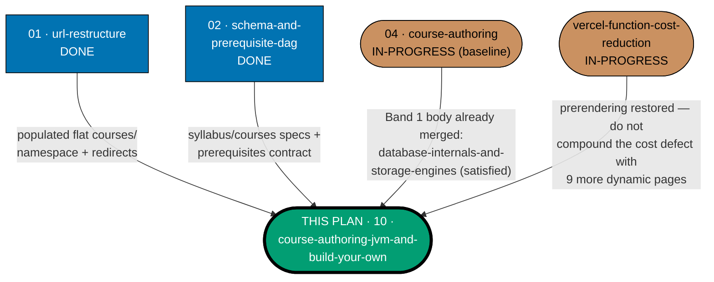
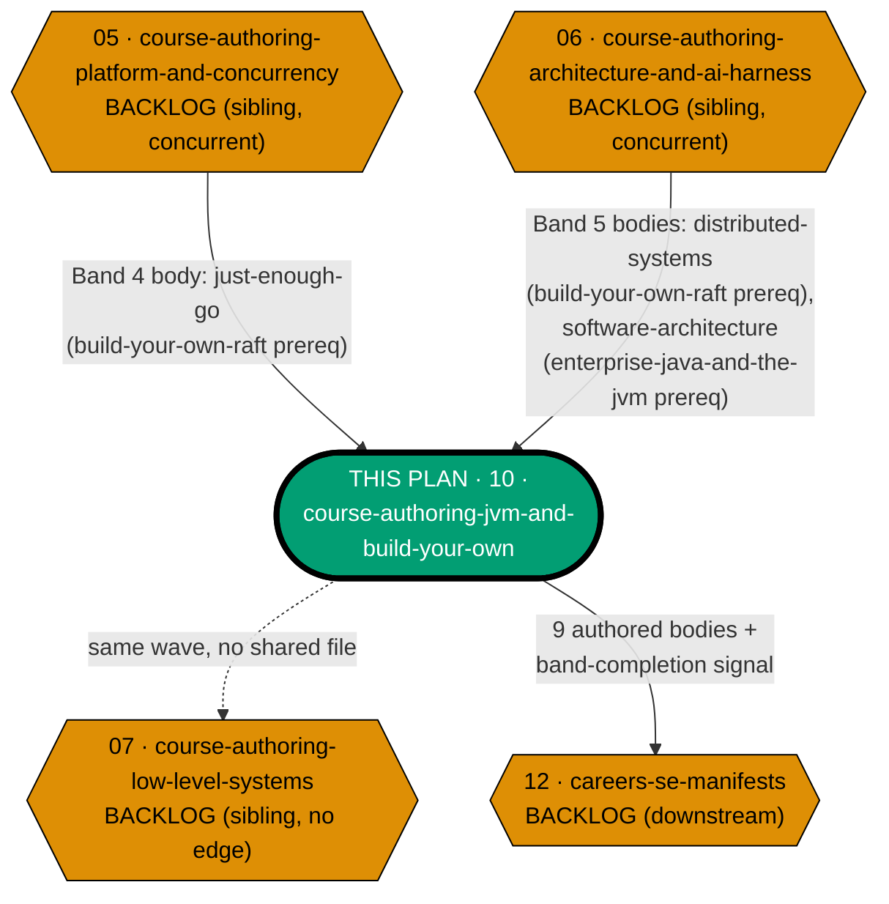

# Learning Path — Course Authoring: JVM, Advanced Languages & Build-Your-Own Internals

## Delivery amendment — one final PR

All 9 courses remain within one plan branch and one delivery unit. The sole draft PR opens only in
Phase 7, after verification and Knowledge Capture, and carries the archival move, review cycle, CI,
merge, and deploy. Earlier cohort or delivery-boundary PR wording is superseded.

Author **9 course bodies** — the JVM/advanced-language half of the original Band 6 — into
`apps/ayokoding-www/content/en/learn/courses/`: `just-enough-java`, `enterprise-java-and-the-jvm`,
`lisp`, `just-enough-fsharp`, `type-systems`, `compilers-parsers-and-transpilers`,
`build-your-own-git`, `build-your-own-database`, `build-your-own-raft`.

This plan is a **further split** of
[`ayokoding-learning-path-04-course-authoring`](../../in-progress/ayokoding-learning-path-04-course-authoring/README.md)'s
own **Band 6 — "Low-level systems, JVM & languages, internals builds"** (16 bodies), which is itself
too large for the 5–15-course-per-plan sizing rule. Band 6 splits along a natural content seam into
two sibling plans:

- **`ayokoding-learning-path-07-course-authoring-low-level-systems`** — "Low-Level Systems & Native
  Languages" (7 courses: `just-enough-c`, `just-enough-cpp`, `linux-os`, `windows-os`,
  `system-programming`, `just-enough-rust`, `modern-system-programming`). Authored by a different
  agent; **not created by this plan**.
- **This plan** — "JVM, Advanced Languages & Build-Your-Own Internals" (9 courses, listed above).

7 + 9 = 16, matching Band 6's full course count in
[`ayokoding-learning-path-04-course-authoring/tech-docs.md`'s Course Library Catalog](../../in-progress/ayokoding-learning-path-04-course-authoring/tech-docs.md#course-library-catalog)
`[Repo-grounded]`.

It owns no schema, no route, no component, no redirect — and, per the invariant every course-authoring
split plan carries, **no manifest**.

## The manifest ownership invariant (binding — read before anything else)

> **This plan never edits a manifest file.** Every file under
> `apps/ayokoding-www/src/features/course-paths/manifests/` is owned by
> [`ayokoding-learning-path-12-careers-se-manifests`](../ayokoding-learning-path-12-careers-se-manifests/README.md) —
> the successor to the retired `ayokoding-learning-path-05-manifests`, which composes `courseOrder`
> entries from every course-authoring plan's landed bodies, this one included, into the three
> `software-engineer`-role `careers/` manifests. A step in this plan that creates, appends to,
> reorders, or re-verifies a `.yaml` manifest is a **boundary violation**, not a
> convenience — see
> [`ayokoding-learning-path-04-course-authoring/README.md`'s own statement of this invariant](../../in-progress/ayokoding-learning-path-04-course-authoring/README.md#the-manifest-ownership-invariant-binding--read-before-anything-else),
> which this plan inherits verbatim.

When this plan's 9 bodies land, it records a **band-completion signal** (see
[Band-completion signal](#band-completion-signal-partial-band-6) below) in its own
[`delivery.md`](./delivery.md), and the manifest plan performs the growth. This plan never asserts the
127-course catalog total — that is the manifest plan's terminal assertion.

## Naming note — a real `-05-`/`-06-` prefix collision (observed, not fixed here)

**Updated — the manifest plan named `ayokoding-learning-path-05-manifests` no longer exists.** It was
retired and split into
[`ayokoding-learning-path-12-careers-se-manifests`](../ayokoding-learning-path-12-careers-se-manifests/README.md)
(the three `software-engineer`-role manifests this plan's courses feed) and
[`ayokoding-learning-path-13-careers-ai-manifest`](../ayokoding-learning-path-13-careers-ai-manifest/README.md)
(the one `ai-engineer` manifest, which does not consume this plan's Band-6 courses), mirroring
`ayokoding-learning-path-04-course-authoring/README.md`'s own corrected naming note. The `-05-`/`-06-`
prefix numerals were freed by that retirement and are now occupied by an unrelated, second numbering
track: `ayokoding-learning-path-05-course-authoring-platform-and-concurrency` and
`ayokoding-learning-path-06-course-authoring-architecture-and-ai-harness` — the further split of Band 6
(and, presumably, other oversized bands) out of `ayokoding-learning-path-04-course-authoring`. This is
the collision that genuinely remains: `05` and `06` are each in use by exactly one plan today (these two
course-authoring siblings), not by two plans apiece. This plan does not rename anything — it only
creates its own folder — but the collision is worth a human's attention before all these sibling plans
are promoted to `in-progress/`. Both `ayokoding-learning-path-05-course-authoring-platform-and-concurrency` and
`ayokoding-learning-path-06-course-authoring-architecture-and-ai-harness` **now exist on disk** under
`plans/backlog/`, each with a full five-file plan structure (README/brd/prd/tech-docs/delivery)
`[Repo-grounded — confirmed via directory listing]` — an earlier version of this note treated their
existence as an unconfirmed presumption; both are now directly readable, and reading them surfaced a
real gap this plan had missed (`enterprise-java-and-the-jvm`'s undeclared `software-architecture`
prerequisite — see [tech-docs.md's Course Library Catalog](./tech-docs.md#course-library-catalog) and
the `06` row below).

## Cross-plan dependency picture

This plan carries the **most inbound edges of any of the new Band-6-split sibling plans** — it is
blocked by four other course-authoring-family plans plus one infrastructure plan, and it blocks the
downstream careers-manifests plan.

Split into two diagrams (upstream inbound edges, then downstream/sibling edges) so neither exceeds
the accessible-diagram width guideline — `THIS` is the shared anchor node in both.

**Accessibility note.** Plan state is carried by node **shape** (rectangle = done, stadium =
in-progress, hexagon = backlog) and by the literal state word in every label, never by fill colour
alone. This plan's node carries an explicit `THIS PLAN` label and a thicker border. The sibling edge to
plan 07 uses a **dotted** line (no artefact crosses it) versus the **solid** lines that carry a named
artefact, per the
[Color Accessibility Convention](../../../repo-governance/conventions/formatting/color-accessibility.md).

### What each edge is, precisely

| Edge                                    | Nature                                  | What crosses it                                                                                                                                                                                                                           | Verification                                                                                                                                                                                                                                                                                                                                                                                                                                                                                                                                                                                                                                                                                                                                                         |
| --------------------------------------- | --------------------------------------- | ----------------------------------------------------------------------------------------------------------------------------------------------------------------------------------------------------------------------------------------- | -------------------------------------------------------------------------------------------------------------------------------------------------------------------------------------------------------------------------------------------------------------------------------------------------------------------------------------------------------------------------------------------------------------------------------------------------------------------------------------------------------------------------------------------------------------------------------------------------------------------------------------------------------------------------------------------------------------------------------------------------------------------- |
| `01` → this                             | hard `blockedBy` (transitive)           | populated flat `courses/` namespace + `courses/_index.md`                                                                                                                                                                                 | `[Repo-grounded]` — identical precondition `ayokoding-learning-path-04-course-authoring` already states and this plan inherits, since it authors into the same namespace.                                                                                                                                                                                                                                                                                                                                                                                                                                                                                                                                                                                            |
| `02` → this                             | hard `blockedBy` (transitive)           | `syllabus/courses/<course-id>.md` specs for all 9 courses + the `prerequisites` frontmatter contract                                                                                                                                      | `[Repo-grounded]` — all 9 spec files confirmed present under `plans/done/2026-07-24__ayokoding-learning-path-02-schema-and-prerequisite-dag/syllabus/courses/` (verified by direct file read; see [tech-docs.md](./tech-docs.md#course-library-catalog)).                                                                                                                                                                                                                                                                                                                                                                                                                                                                                                            |
| `04` → this                             | hard `blockedBy`, **already satisfied** | `build-your-own-database`'s prerequisite body `database-internals-and-storage-engines` (Band 1 of the original single plan04)                                                                                                             | `[Repo-grounded]` — confirmed directly via `test -d apps/ayokoding-www/content/en/learn/courses/database-internals-and-storage-engines` (exits 0) and plan04's own Course Library Catalog, which lists `database-internals-and-storage-engines` as a Band 1 (`T(36)`) authored body inside plan04's own already-merged scope. This is a real edge, satisfied by plan04's own progress rather than by a separate plan.                                                                                                                                                                                                                                                                                                                                                |
| `05` → this                             | hard `blockedBy`, **not yet satisfied** | `just-enough-go` (Band 4 — Concurrency languages), `build-your-own-raft`'s declared prerequisite                                                                                                                                          | `[Repo-grounded]` — confirmed via direct read of `ayokoding-learning-path-05-course-authoring-platform-and-concurrency/tech-docs.md:315`, which lists `just-enough-go` (`T(64)`, Primer, Go, prerequisites `—`). `just-enough-go` lives in the "CS foundations, paradigms & concurrency" catalog section (= Band 4), which now belongs to `ayokoding-learning-path-05-course-authoring-platform-and-concurrency`.                                                                                                                                                                                                                                                                                                                                                    |
| `06` → this                             | hard `blockedBy`, **not yet satisfied** | `distributed-systems` (Band 5 — Architecture, distributed & AI/harness), `build-your-own-raft`'s other declared prerequisite; **and** `software-architecture` (also Band 5), `enterprise-java-and-the-jvm`'s second declared prerequisite | `[Repo-grounded]` — confirmed via direct read of `ayokoding-learning-path-06-course-authoring-architecture-and-ai-harness/tech-docs.md:430,434`, which lists `software-architecture` (`T(42)`, Annotated-concept, Python) and `distributed-systems` (`T(46)`, By Example, Python) as this plan's own Band 5 rows. **This second prerequisite (`software-architecture`) was previously undeclared and ungated** — see [tech-docs.md's Course Library Catalog](./tech-docs.md#course-library-catalog) and [delivery.md's Phase 1 hard gate](./delivery.md#phase-1-cohort-1--5-bodies-java-lisp-f-type-systems), which now checks its existence immediately before `enterprise-java-and-the-jvm`'s own sub-phase, mirroring the existing `build-your-own-raft` pattern. |
| `vercel-function-cost-reduction` → this | hard `blockedBy`, **new**               | prerendering restored on `ayokoding-www` (Phases 1–2 of that plan)                                                                                                                                                                        | `[Repo-grounded]` — that plan's own README states the root cause (`apps/ayokoding-www` prerenders 0 of ~2,068 pages) and names `apps/ayokoding-www/src/app/[locale]/layout.tsx` becoming the root layout and the middleware's deletion as its Phase 1–3 fixes. See [Vercel Cost-Reduction Precondition](#vercel-cost-reduction-precondition) below.                                                                                                                                                                                                                                                                                                                                                                                                                  |
| this ⇢ `07`                             | sibling, **no dependency edge**         | none — verified: no course this plan authors lists any of `07`'s 7 courses (`just-enough-c`, `just-enough-cpp`, `linux-os`, `windows-os`, `system-programming`, `just-enough-rust`, `modern-system-programming`) as a prerequisite        | `[Repo-grounded]` — cross-checked every one of this plan's 9 catalog rows against `07`'s 7 course IDs; zero matches. See [tech-docs.md §Independence from plan 07](./tech-docs.md#independence-from-plan-07-verified).                                                                                                                                                                                                                                                                                                                                                                                                                                                                                                                                               |
| this → `12`                             | hard `blocks`                           | 9 authored bodies + the partial band-completion signal (this plan's half of Band 6)                                                                                                                                                       | Mirrors `ayokoding-learning-path-04-course-authoring`'s existing `blocks` edge to the manifest/careers plans; `12-careers-se-manifests` needs every course-authoring split plan's signal before composing the software-engineer manifests' final `courseOrder`.                                                                                                                                                                                                                                                                                                                                                                                                                                                                                                      |

### What I could NOT confirm

- **Whether `ayokoding-learning-path-05-course-authoring-platform-and-concurrency` and
  `ayokoding-learning-path-06-course-authoring-architecture-and-ai-harness` exist on disk** — **now
  resolved**: both folders exist under `plans/backlog/`, each with a full five-file plan structure,
  and both have been read directly (see the `05`/`06` rows in
  [the edge table above](#what-each-edge-is-precisely) and
  [tech-docs.md's Dependency verification record](./tech-docs.md#dependency-verification-record))
  `[Repo-grounded — confirmed via directory listing and direct file read]`. An earlier version of this
  plan treated their existence as an unconfirmed presumption; reading them directly surfaced a real,
  previously-missed gap (`enterprise-java-and-the-jvm`'s undeclared `software-architecture`
  prerequisite, owned by plan `06`). This plan's Phase 0 precondition checks and the Phase 1/Phase 2
  hard gates (see [delivery.md](./delivery.md)) still verify each body's **merge state**, not merely
  the sibling plan folder's existence, before `enterprise-java-and-the-jvm`'s and
  `build-your-own-raft`'s own sub-phases begin.
- **Any concept-level cross-reference from `build-your-own-git`, `build-your-own-database`, or
  `build-your-own-raft` back to plan 07's low-level courses** — the catalog table's `prerequisites`
  column is the only DAG-edge source of truth this plan can check without reading plan 07's own
  (not-yet-authored) spec or delivery content; no such edge is declared there. If plan 07 later
  discovers a genuine content dependency in the opposite direction (its courses needing one of this
  plan's 9), that is plan 07's own dependency to declare, not this plan's.

## Band-completion signal (partial Band 6)

This plan authors **9 of Band 6's 16 courses** — the JVM/advanced-language/build-your-own half. It
therefore records its own **partial band-completion signal**, distinct from the low-level sibling
plan's signal, using the same five-field contract
[`ayokoding-learning-path-04-course-authoring/README.md`](../../in-progress/ayokoding-learning-path-04-course-authoring/README.md#band-completion-signal-contract)
defines:

| Field               | Content                                                                                                                                                                                                                                                                                                                                                                 |
| ------------------- | ----------------------------------------------------------------------------------------------------------------------------------------------------------------------------------------------------------------------------------------------------------------------------------------------------------------------------------------------------------------------- |
| `BAND`              | `Band 6 (JVM/advanced-language/build-your-own half) — ayokoding-learning-path-10`                                                                                                                                                                                                                                                                                       |
| `PLAN`              | `ayokoding-learning-path-10-course-authoring-jvm-and-build-your-own`                                                                                                                                                                                                                                                                                                    |
| `LANDED_COURSE_IDS` | all 9 course IDs this plan authors, one per line, in this plan's own cohort order                                                                                                                                                                                                                                                                                       |
| `GROW_MANIFESTS`    | `<MANIFESTS>careers/interview-ready/software-engineer.yaml`, `<MANIFESTS>careers/immediately-effective/software-engineer.yaml`, `<MANIFESTS>careers/fundamentally-strong/software-engineer.yaml` — **exactly these three**, per this plan's commissioning instructions ("Band 6 routes to exactly these three") and consistent with plan04's own Bands-1–8 routing rule |
| Final delivery      | this plan's terminal archival PR; downstream work consumes the signal only after that PR merges                                                                                                                                                                                                                                                                         |

The manifest plan (`ayokoding-learning-path-12-careers-se-manifests`) needs **both** this plan's signal
and plan 07's signal before Band 6's `courseOrder` entries are complete across all 16 courses — but each signal
is independently actionable only after its owning plan's terminal archival PR merges, since the two
halves share no prerequisite edge (see
[the independence check above](#what-i-could-not-confirm)).

## Vercel Cost-Reduction Precondition

Per this plan's commissioning instructions, `vercel-function-cost-reduction` is treated as a hard
`blockedBy` precondition, **to be satisfied before this plan's authoring PRs deploy**, even though it
is currently `in-progress` rather than merged `[Repo-grounded — confirmed via directory listing:
plans/done/2026-08-02__vercel-function-cost-reduction/]`. The reasoning, read from that plan's own
`README.md` and `tech-docs.md` `[Repo-grounded]`:

- Root cause: `apps/ayokoding-www` prerenders **zero** of its ~2,068 content pages
  (`.next/prerender-manifest.json` shows `dynamicRoutes: 0`, `routes` length **4**) — every page view
  executes a serverless function, at **65% of the site's ~$57/month gross Vercel spend**.
- Fixes land in that plan's Phases 1–3: promoting `apps/ayokoding-www/src/app/[locale]/layout.tsx` to
  the root layout (deleting `app/layout.tsx`), moving `?path=` reading client-side, and deleting the
  now-purposeless middleware.
- **Concrete checkable signal** this plan's Phase 0 uses:
  `jq '.routes | length' apps/ayokoding-www/.next/prerender-manifest.json` reads **4** today and must
  read a number **≥ 2000** (close to the full ~2,068-page content tree) before this plan's sole PR
  deploy 9 more pages into the same, currently-uncached, cost-generating pattern.
- **Why this matters for this plan specifically**: every delivery boundary in this plan's
  `worktree-to-pr` mode triggers a production deploy to `prod-ayokoding-www`
  ([Delivery Mode](#delivery-mode-worktree-to-pr) below). Deploying 9 more always-dynamic pages before
  the cost-reduction plan lands would compound the exact defect that plan exists to fix, not merely
  fail to help it.

## Delivery Mode: worktree-to-pr

This plan has exactly one dedicated worktree, one persistent final-delivery branch, and one PR.
All authoring, verification, and Knowledge Capture phases commit on that branch without a push, PR,
review cycle, merge, or deployment. In Phase 7, the executor commits the archival move and
any index updates, opens the sole draft PR, completes the PR-Review Maker→Fixer Cycle and CI gates,
marks it ready, and performs the normal AI merge/deploy after the hardened preconditions hold.
No per-course, cohort, stage, or phase worktree/branch/PR is permitted.

## Cohort grouping and reasoning

9 courses is small enough for a single five-course cohort plus a four-course cohort, inheriting the
sequential five-course delivery cadence
[`ayokoding-learning-path-04-course-authoring`'s 2026-07-31 execution amendment](../../in-progress/ayokoding-learning-path-04-course-authoring/delivery.md#delivery-mode-worktree-to-pr)
established for its own remaining bodies:

- **Cohort 1 (5 courses)**: `just-enough-java`, `enterprise-java-and-the-jvm`, `lisp`,
  `just-enough-fsharp`, `type-systems` — the two Primer/By-Example JVM/Lisp pairs plus the
  type-systems course. Per the corrected
  [Course Library Catalog](./tech-docs.md#course-library-catalog), every prerequisite this cohort's
  courses declare — except one — already exists on disk today: `just-enough-java` →
  `object-oriented-programming-essentials`; `lisp` → `functional-programming`,
  `programming-paradigms`; `just-enough-fsharp` → `functional-programming`,
  `object-oriented-programming-essentials`; `type-systems` → `functional-programming`,
  `programming-paradigms`, `just-enough-typescript` (**not** `just-enough-fsharp` — an earlier version
  of this catalog had that backwards). The one genuine external blocker inside this cohort is
  `enterprise-java-and-the-jvm`'s second prerequisite, `software-architecture` (owned by plan `06`, not
  yet on disk) — gated by the hard-gate precondition immediately before this course's own sub-phase in
  [delivery.md's Phase 1](./delivery.md#phase-1-cohort-1--5-bodies-java-lisp-f-type-systems), not
  silently assumed satisfied.
- **Cohort 2 (4 courses)**: `compilers-parsers-and-transpilers`, `build-your-own-git`,
  `build-your-own-database`, `build-your-own-raft` — grouped together because the cohort's last three
  members are exactly the `build-your-own-*` trio, and `compilers-parsers-and-transpilers` is the
  smallest remaining course to round the cohort to four once the trio anchors it. **The trio is
  authored last within this plan, and last within cohort 2**, per this plan's commissioning
  instruction to defer the courses carrying external prerequisites as late as possible — giving the
  sibling plans (`04` for `build-your-own-database`'s Band-1 body, `05`/`06` for
  `build-your-own-raft`'s Band-4/5 bodies) maximum time to land before their bodies are needed.
  `compilers-parsers-and-transpilers` itself needs `just-enough-fsharp` and `type-systems` (both cohort
  1, already merged by the time cohort 2 starts) and the already-shipped
  `computer-science-foundations` (not `data-structures-and-algorithms-essentials` — corrected per the
  [Course Library Catalog](./tech-docs.md#course-library-catalog)), so it carries no additional
  external blocker.

This is a **judgment call** `[Judgment call]` on the cohort split — the task's own instruction offered
this exact 5+4 grouping as one reasonable option among "or your own sensible grouping"; this plan
adopts it as stated rather than inventing an alternative, since it already satisfies every stated
constraint (five-course cadence, build-your-own-last).

## Rule-15 three-tester retest — exemption recorded

**Exempt, with reasons stated**, for the same reasons
[`ayokoding-learning-path-04-course-authoring`](../../in-progress/ayokoding-learning-path-04-course-authoring/README.md#rule-15-three-tester-retest--exemption-recorded)
records and this plan inherits verbatim:

1. **It ships no screen and no component.** Every artefact is a markdown page bundle under
   `apps/ayokoding-www/content/en/learn/courses/`. The screens that render those pages are owned by
   `ayokoding-learning-path-03-navigation-ui` (already done), which carried the mandatory retest.
2. **Its output surface is already covered by dedicated checkers** —
   `apps-ayokoding-www-{by-example,primer}-checker` (this plan's 9 courses use only these two formats;
   see [tech-docs.md's Course Library Catalog](./tech-docs.md#course-library-catalog)),
   `apps-ayokoding-www-facts-checker`, and `apps-ayokoding-www-link-checker`.
3. **The retest would test the other plan's surface**, producing findings this plan cannot act on.

This is an exemption, not an omission: manual behavioural verification via Playwright MCP is **still
mandatory and still performed** (see [delivery.md](./delivery.md) Phase 4) — a sample of this plan's 9
authored pages is opened at all three breakpoints in the `en` content locale, with committed screenshot
evidence. Only the three-tester triad is waived.

## Locale scope

This plan's content is authored **`en`-only**, per the source plan's Business-Scope Non-Goals (an
Indonesian mirror is explicitly deferred, not omitted). Every manual-verification step exercises `en`
and states the deferral inline.

## Navigation

- [Business Requirements (brd.md)](./brd.md) — WHY these 9 bodies exist, who they serve, the business
  risks of the plan's dependency-heavy position, and what "done" means in business terms.
- [Product Requirements (prd.md)](./prd.md) — personas, user stories, the Gherkin acceptance criteria
  this plan owns, and product scope.
- [Technical Docs (tech-docs.md)](./tech-docs.md) — the 9-course catalog with concept/example counts
  and syllabus paths, the manifest-ownership diagram, the authoring architecture, and the full
  dependency-verification record.
- [Delivery Checklist (delivery.md)](./delivery.md) — the phased, executable checklist, including
  per-upstream-plan precondition checks in Phase 0.
- [Learnings (learnings.md)](./learnings.md) — knowledge-capture running log.
- **Cross-plan**:
  [`syllabus/` source of truth](../../done/2026-07-24__ayokoding-learning-path-02-schema-and-prerequisite-dag/syllabus/README.md)
  ·
  [course-authoring baseline plan (04)](../../in-progress/ayokoding-learning-path-04-course-authoring/README.md)
  · [manifest plan (12-careers-se-manifests)](../ayokoding-learning-path-12-careers-se-manifests/README.md)
  · [vercel-function-cost-reduction](../../done/2026-08-02__vercel-function-cost-reduction/README.md)

## Provenance

This plan is one of the further-split sibling plans produced by dividing
`ayokoding-learning-path-04-course-authoring`'s own Band 6 (16 courses, exceeding the 5–15-course
per-plan sizing rule) along a natural low-level/JVM content seam. It shares its `syllabus/` source of
truth, its manifest-ownership invariant, and its `worktree-to-pr` delivery mode with every plan in the
`ayokoding-learning-path-*` family.
