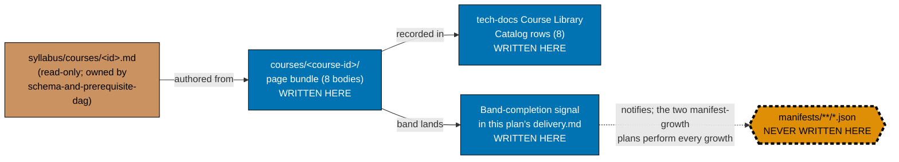

# Learning Path — Course Authoring: Capstones (Band 8)

## Delivery amendment — one final PR

All 8 courses remain within one plan branch and one delivery unit. The sole draft PR opens only in
Phase 7, after verification and Knowledge Capture, and carries the archival move, CI,
merge, and deploy. Earlier cohort or delivery-boundary PR wording is superseded.

Author **Band 8 — Remaining capstones**: the **8 course bodies**
`capstone-build-your-own-coding-agent`, `capstone-build-your-own-pentest-engine`,
`capstone-real-world-delivery`, `capstone-secure-service`, `capstone-data-pipeline`,
`capstone-concurrency-and-systems`, `capstone-concurrency-showdown`, and
`capstone-lead-at-altitude` — landing under `apps/ayokoding-www/content/en/learn/courses/`. Eight
courses fits the repo's 5–15-course plan-sizing rule as-is; no further splitting is needed within
this band.

This plan is a **further split of Band 8 out of**
[`ayokoding-learning-path-04-course-authoring`](../../done/2026-08-02__ayokoding-learning-path-04-course-authoring/README.md)
(itself Wave 2 of the five-way split of the closed
[`shared-course-library-and-learning-paths`](../../done/2026-07-21__shared-course-library-and-learning-paths/README.md)
plan). In the historical pre-split scope, Band 8 held eight course bodies as Phase 10; the compacted
Plan 04 closeout checklist intentionally retains only Phases 0–9. That historical scope is carved out
into this standalone folder, exactly as Bands 3+4, 5, 6a, 6b, 7, and 9 were each carved into their own
sibling plans. This plan owns **course bodies only**, exactly as
plan 04 did: no schema, no route, no component, no redirect — and, most importantly, **no manifest**.

> **This band is the synthesis layer of the whole course library, by design.** Every other
> course-authoring successor plan lands one thematic slice of new content. This band's 8 capstones
> instead **assemble** other bands' content into working end-to-end systems — a coding agent, a
> pentest engine, a secured service, a data pipeline, a deployed-as-code system, two concurrency
> builds, and a whole-journey leadership synthesis. That is precisely why this plan carries **the
> most inbound cross-plan dependency edges of any course-authoring successor plan**: capstones cannot
> be authored ahead of the material they assemble. See [§Position in the execution sequence](#position-in-the-execution-sequence)
> below for the full fan-in.
>
> **Cross-plan source of truth** — the authoritative per-course specs live in
> `plans/done/2026-07-24__ayokoding-learning-path-02-schema-and-prerequisite-dag/syllabus/courses/`.
> Do not copy them; do not author from any other source. Every course body in this plan is authored
> **from** its
> [`syllabus/courses/<course-id>.md`](../../done/2026-07-24__ayokoding-learning-path-02-schema-and-prerequisite-dag/syllabus/courses/README.md)
> spec file — never from a fresh judgment call. Six of the eight capstones are embedded inter-topic
> capstone specs inside three donor course files rather than their own top-level spec file:
> `capstone-real-world-delivery`, `capstone-secure-service`, and `capstone-data-pipeline` inside
> `defensive-security.md`; `capstone-concurrency-and-systems` and `capstone-concurrency-showdown`
> inside `compilers-parsers-and-transpilers.md`; `capstone-lead-at-altitude` inside
> `site-reliability-engineering.md`. The remaining two —
> `capstone-build-your-own-coding-agent` and `capstone-build-your-own-pentest-engine` — each have
> their own dedicated spec file. All eight were read in full at this plan's authoring time; see
> [tech-docs.md §Course Library Catalog](./tech-docs.md#course-library-catalog) for the exact
> per-course citation.

## Exact scope: 8 courses, in two cohorts

| #   | Course ID                                | Cohort                              | Kind                    |
| --- | ---------------------------------------- | ----------------------------------- | ----------------------- |
| 1   | `capstone-build-your-own-coding-agent`   | A (independent)                     | Harness milestone       |
| 2   | `capstone-build-your-own-pentest-engine` | A (independent)                     | Security milestone      |
| 3   | `capstone-secure-service`                | A (independent)                     | Security milestone      |
| 4   | `capstone-data-pipeline`                 | A (independent)                     | Data milestone          |
| 5   | `capstone-concurrency-showdown`          | A (independent)                     | Comparison milestone    |
| 6   | `capstone-concurrency-and-systems`       | B (dependency chain)                | Systems milestone       |
| 7   | `capstone-real-world-delivery`           | B (dependency chain)                | Full-stack milestone    |
| 8   | `capstone-lead-at-altitude`              | B (dependency chain, authored last) | Whole-journey milestone |

**Cohort rationale.** Verified against every one of the eight syllabus specs (see
[tech-docs.md §Confirmed per-capstone dependency map](./tech-docs.md#confirmed-per-capstone-dependency-map)),
`capstone-lead-at-altitude` is the only Band-8 capstone with an **intra-band** prerequisite. Its
embedded spec is disjunctive, not conjunctive: it takes **one of** `capstone-concurrency-and-systems`
**or** `capstone-real-world-delivery` — reader's/author's choice — as its starting artefact, never a
requirement for both. No other pair among the eight cites another Band-8 capstone. That single
intra-band edge is the entire ordering constraint inside this band, so the 8 courses split cleanly
into:

- **Cohort A (5, mutually independent within the band)** — `capstone-build-your-own-coding-agent`,
  `capstone-build-your-own-pentest-engine`, `capstone-secure-service`, `capstone-data-pipeline`,
  `capstone-concurrency-showdown`. None of these five cites any other Band-8 capstone as a
  prerequisite, so they pipeline concurrently through review, bounded by the in-force cap.
- **Cohort B (3, a genuine dependency chain)** — `capstone-concurrency-and-systems` and
  `capstone-real-world-delivery` (independent of each other; both are landed before the third as a
  **[Judgment call]** authorial safety margin — the spec itself only requires **one of** the two as
  `capstone-lead-at-altitude`'s starting artefact — so the author has a genuine free choice between
  them rather than being forced to whichever lands first), then `capstone-lead-at-altitude` last.

This also happens to group each cohort's heaviest cross-plan fan-in sensibly: Cohort B's three
courses are collectively this plan's most cross-plan-dependent (between them they touch plan 04,
plan 05, plan 06, and plan 08 — see the table below), so grouping them together means one cohort
absorbs the review load of confirming every upstream band actually landed, while Cohort A's five
courses (each needing a narrower 1–2-band slice) proceed with a lighter per-course precondition
check. **[Judgment call]**: the task brief offered either grouping and asked for the reasoning to be
stated; grouping by the single confirmed intra-band dependency edge, rather than a mechanical 5+3
slice by listing order, is the only grouping that is actually load-bearing rather than arbitrary.

## The manifest ownership invariant (binding — read before anything else)

> **This plan never edits a manifest file.** Every file under
> `apps/ayokoding-www/src/features/course-paths/manifests/` is owned by a downstream manifest-growth
> plan (`ayokoding-learning-path-12-careers-se-manifests` and
> `ayokoding-learning-path-13-careers-ai-manifest` — see [Depends-on](#depends-on) below). A step in
> this plan that creates, appends to, reorders, or re-verifies a `.json` manifest is a **boundary
> violation**, not a convenience. This is the identical invariant plan 04 carries, reproduced here
> because this plan is now the one authoring Band 8's bodies.

When Band 8 lands, this plan records **one band-completion signal** in its own
[`delivery.md`](./delivery.md) and the two manifest-growth plans each perform their own growth. The
signal is the entire handoff contract; see
[Band-completion signal contract](#band-completion-signal-contract) below.

## Position in the execution sequence

This plan follows `ayokoding-learning-path-10-course-authoring-jvm-and-build-your-own`; plan 12 is its sole successor. Course and manifest ownership references are implementation context, not extra execution prerequisites.

## Manifest-ownership boundary



**Accessibility note.** Write permission is carried by node **shape** and by explicit label text
(`WRITTEN HERE` / `NEVER WRITTEN HERE` / `read-only`), and edge kind by **line style** plus edge
labels — never by fill colour alone. The forbidden node additionally carries a dashed thick border.

## Band-completion signal contract

The two manifest-growth plans cannot act on a vague signal. This plan's single band-completion
signal, recorded in [`delivery.md`](./delivery.md) at the close of Cohort B, MUST carry all five
fields below, verbatim, in a fenced `text` block:

| Field               | Content                                                                                         |
| ------------------- | ----------------------------------------------------------------------------------------------- |
| `BAND`              | `Band 8 — Remaining capstones`                                                                  |
| `PLAN`              | `ayokoding-learning-path-11-course-authoring-capstones`                                         |
| `LANDED_COURSE_IDS` | all eight course IDs, one per line, in this plan's own listing order                            |
| `GROW_MANIFESTS`    | every manifest a downstream plan must grow, by **full path** under `<MANIFESTS>`                |
| Final delivery      | this plan's terminal archival PR; downstream work consumes the signal only after that PR merges |

**`GROW_MANIFESTS` for this band is four manifests** — Band 8 is one of only two bands (the other is
Band 5, in `ayokoding-learning-path-06-course-authoring-architecture-and-ai-harness`) that grows the
fourth path's manifest in addition to the three software-engineer-role manifests. Plan 06's own
README states it precisely: Band 5 "lands eight of the nine courses that manifest walks," and
`capstone-build-your-own-coding-agent` — authored in **this** plan — is confirmed as "the ninth
AI-cluster course" that "assembles courses 11–15 into a working coding-agent CLI." That confirmation
is why this band's signal also grows the AI-engineer manifest:

```text
BAND: Band 8 — Remaining capstones
PLAN: ayokoding-learning-path-11-course-authoring-capstones
LANDED_COURSE_IDS:
capstone-build-your-own-coding-agent
capstone-build-your-own-pentest-engine
capstone-secure-service
capstone-data-pipeline
capstone-concurrency-showdown
capstone-concurrency-and-systems
capstone-real-world-delivery
capstone-lead-at-altitude
GROW_MANIFESTS:
apps/ayokoding-www/src/features/course-paths/manifests/careers/interview-ready/software-engineer.json
apps/ayokoding-www/src/features/course-paths/manifests/careers/immediately-effective/software-engineer.json
apps/ayokoding-www/src/features/course-paths/manifests/careers/fundamentally-strong/software-engineer.json
apps/ayokoding-www/src/features/course-paths/manifests/careers/immediately-effective/ai-engineer.json
```

A signal that names manifests loosely or splits into partial signals per cohort is incomplete and the
receiving plans must reject it rather than guess. It becomes actionable only after this plan's terminal
archival PR merges.
`ayokoding-learning-path-12-careers-se-manifests` consumes the first three manifest lines;
`ayokoding-learning-path-13-careers-ai-manifest` consumes the fourth.

## Delivery Mode: worktree-to-pr

This plan has exactly one dedicated worktree, one persistent final-delivery branch, and one PR.
All authoring, verification, and Knowledge Capture phases commit on that branch without a push, PR, merge, or deployment. In Phase 7, the executor commits the archival move and
any index updates, opens the sole draft PR, completes the secret scan, local quality checks, and PR quality-gate verification and CI gates,
marks it ready, and performs the normal AI merge/deploy after the hardened preconditions hold.
No per-course, cohort, stage, or phase worktree/branch/PR is permitted.

## Depends-on

| Relation      | Plan (full folder name)                                              | Nature                                                                                                                                                                                                                         |
| ------------- | -------------------------------------------------------------------- | ------------------------------------------------------------------------------------------------------------------------------------------------------------------------------------------------------------------------------ |
| **blockedBy** | `ayokoding-learning-path-10-course-authoring-jvm-and-build-your-own` | **Hard; sole direct execution prerequisite.** It must be fully merged and archived on `origin/main` before Phase 0. All earlier completion and repository-baseline facts are transitive context, not extra plan prerequisites. |

**Phase 0 start check:** `git ls-tree -r --name-only origin/main plans/done | rg -q "__ayokoding-learning-path-10-course-authoring-jvm-and-build-your-own/README\.md$"` exits 0. This is this plan's only plan-level start gate.

## Rule-15 three-tester retest — exemption recorded

**Exempt, with reasons stated (not silently omitted)**, for the identical reasons plan 04 and every
sibling split plan already recorded. The
[User-Facing Delivery Hardening Convention](../../../repo-governance/development/quality/user-facing-delivery-hardening.md)
Rule 15 mandates a near-end `web-exploratory-tester` + `web-usability-tester` + `web-design-tester`
round for **web-UI feature-change** plans. This plan is not one:

1. **It ships no screen and no component.** Every artefact is a markdown page bundle under
   `apps/ayokoding-www/content/en/learn/courses/`. The screens that render those pages (`PathRail`,
   `PathLanding`, `PathCard`, the paths hub) are owned by
   `ayokoding-learning-path-03-navigation-ui`, which already carried the mandatory retest.
2. **Its output surface is already covered by dedicated checkers.** Every authored body passes the
   matching `apps-ayokoding-www-*-checker` (by-example for the code-heavy capstones,
   annotated-concept where a capstone's donor course is annotated-concept), plus
   `apps-ayokoding-www-facts-checker` and `apps-ayokoding-www-link-checker` — content-domain checkers
   strictly stronger, for prose correctness, than a generalist live-site UX triad.
3. **The retest would test the other plan's surface.** Pointing the triad at a course page exercises
   the navigation plan's rendering layer, producing findings this plan cannot act on.

**This is an exemption, not an omission**, and it is **narrow**: manual behavioural verification via
Playwright MCP is **still mandatory and still performed** (see [delivery.md](./delivery.md) Phase 4)
— a sample of this plan's own eight authored course pages is opened at all three breakpoints in the
`en` content locale, with committed screenshot evidence. Only the three-tester triad is waived.

## Locale scope

This plan's content is authored **`en`-only**. Per plan 04's own Business-Scope Non-Goals
(inherited), an Indonesian mirror of the section content is explicitly **deferred**, and the deferral
is a recorded decision rather than an omission. Every manual-verification step in this plan exercises
`en` and states the deferral inline; fabricating an `id` walk-through for content that does not exist
is forbidden.

## Navigation

- [Business Requirements (brd.md)](./brd.md) — WHY these 8 bodies exist, who they serve, the business
  risks of authoring them (concentrated on the heaviest-fan-in risk of any successor plan), and what
  "done" means in business terms.
- [Product Requirements (prd.md)](./prd.md) — personas, user stories, the Gherkin acceptance criteria
  this plan owns, and product scope.
- [Technical Docs (tech-docs.md)](./tech-docs.md) — the authoring architecture, the confirmed
  per-capstone dependency map with syllabus-spec citations, the Course Library Catalog rows for all
  eight bodies, the manifest-ownership diagram, and the two flagged cross-plan discrepancies.
- [Delivery Checklist (delivery.md)](./delivery.md) — the phased, executable checklist.
- [Learnings (learnings.md)](./learnings.md) — knowledge-capture running log.
- **Cross-plan**:
  [`syllabus/` source of truth](../../done/2026-07-24__ayokoding-learning-path-02-schema-and-prerequisite-dag/syllabus/README.md)
  ·
  [`syllabus/courses/` catalog](../../done/2026-07-24__ayokoding-learning-path-02-schema-and-prerequisite-dag/syllabus/courses/README.md)
  · [`ayokoding-learning-path-04-course-authoring` (baseline)](../../done/2026-08-02__ayokoding-learning-path-04-course-authoring/README.md)
  · [`ayokoding-learning-path-05-course-authoring-platform-and-concurrency`](../../done/2026-08-04__ayokoding-learning-path-05-course-authoring-platform-and-concurrency/README.md)
  · [`ayokoding-learning-path-06-course-authoring-architecture-and-ai-harness`](../../in-progress/ayokoding-learning-path-06-course-authoring-architecture-and-ai-harness/README.md)
  · [`ayokoding-learning-path-08-course-authoring-security-and-ops`](../ayokoding-learning-path-08-course-authoring-security-and-ops/README.md)
  · [`vercel-function-cost-reduction` (historical reference)](../../done/2026-08-02__vercel-function-cost-reduction/README.md)

## Provenance

This plan carves **Phase 10 (Band 8 — Remaining capstones, 8 bodies)** out of
[`ayokoding-learning-path-04-course-authoring`'s own delivery checklist](../../done/2026-08-02__ayokoding-learning-path-04-course-authoring/delivery.md),
which is itself Wave 2 of the five-way split of the closed
`plans/done/2026-07-21__shared-course-library-and-learning-paths/` plan. Plan 04's completed closeout
trimmed its own `README.md`, `tech-docs.md`, and `delivery.md` to remove Band 8's scope and hand it to
this folder. The remaining band splits (`05` Bands 3+4, archived in terminal PR #133, `06` Band 5, `07` Band 6a, `08` Band 7,
`09` Band 9, `10` Band 6b) remain backlog plans; this plan's dependency claims were verified directly
against each sibling's own `README.md` where it existed at this plan's authoring time (05, 06, 08 all
existed and were read in full), and against the primary syllabus specs otherwise.

**The `DD-34` / `DD-35` / `DD-39` tokens are not this split's decisions**, exactly as plan 04 and
every sibling split note for themselves: they are FS-SE-inherited tokens carrying unrelated meanings
in `syllabus/courses/**`, and travel with `syllabus/` into the schema plan. `DD-36`, `DD-37`, and
`DD-38` are unused. **Do not renumber to close the apparent gap.**
