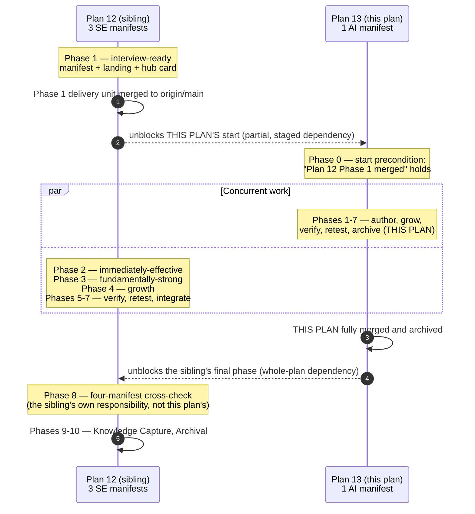
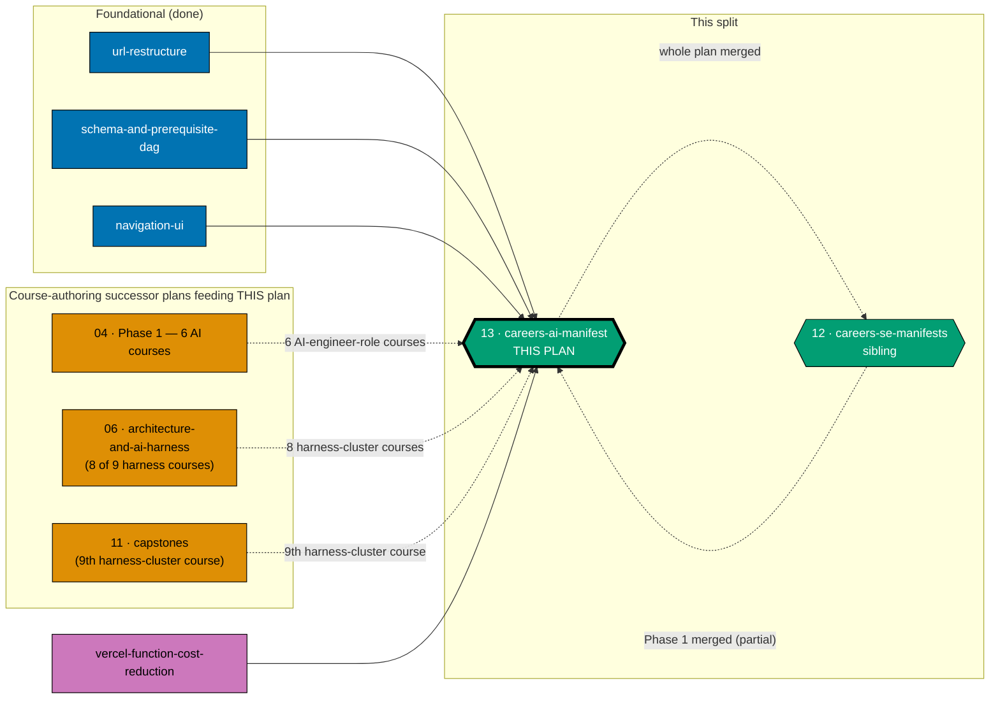
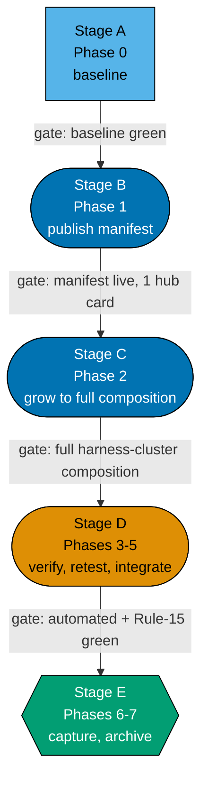

# Learning Path Manifest — the `careers/immediately-effective/ai-engineer` manifest

## Delivery amendment — one final PR and independent start

This plan uses one branch and its sole PR in Phase 7, after verification and Knowledge Capture; the
archival move, review cycle, CI, merge, and deploy are all in that final delivery. It no longer waits
for an intermediate Plan 12 merge: its manifest ownership is disjoint, and Plan 12 consumes this
plan only after this final PR merges. Earlier delivery-boundary wording is superseded.

> **Successor plan.** This plan and its sibling
> [`ayokoding-learning-path-12-careers-se-manifests`](../ayokoding-learning-path-12-careers-se-manifests/README.md)
> together replace the single prior plan that authored, published, grew, and verified all four
> `careers/` path manifests. The sibling owns the three `software-engineer`-role manifests
> (`interview-ready`, `immediately-effective/software-engineer`, `fundamentally-strong/software-engineer`).
> **This plan owns exactly one manifest**: `careers/immediately-effective/ai-engineer`. See
> [the sibling's README §Why 3 + 1, not 2 + 2](../ayokoding-learning-path-12-careers-se-manifests/README.md#why-3--1-not-2--2)
> for why the split is not symmetric.
>
> **Programme decisions** — this plan cites the shared `R*`/`A*` decision ids `R2`, `R4`, `R9`, `A8`;
> their definitions are folded into
> [tech-docs §Programme decisions](./tech-docs.md#programme-decisions). `A8` (programme-wide
> clean-room licensing) governs this plan's one landing-prose authoring step (Phase 1.2).

**Category scope.** The paths hub serves two categories: `careers/<arc>/<role>` (3 segments, 4 paths —
3 owned by the sibling plan, 1 owned here) and `skills/<subject>` (2 segments, 4 paths, owned by a
separate accounting/ERP split, disjoint subtree — see [§Depends-on](#depends-on)). This plan is
**one manifest only** — the sole `careers/` product with a distinct, non-software-engineering
endpoint.

The `careers/immediately-effective/ai-engineer` path is a genuine **from-scratch** AI-engineering path
(renamed and re-scoped 2026-07-21 from an earlier role-transition framing): it assumes **no** prior
software-engineering competence, **includes** the shared SWE-fundamentals prerequisite courses at the
head of `courseOrder` rather than linking them out, and teaches **building** AI systems (models,
agents, evals, inference serving) — not driving them (`agentic-coding` stays a separate, unrelated
axis). It **walks** (includes, never links) the nine-course AI/harness cluster.

Per DD-27's locked build order, authoring this path is **priority #1** for all authoring effort,
immediately behind the sibling plan's architecture-smoke-test-only interview-ready MVP.

## The plan-12 / plan-13 coupling (non-circular by construction)

One check — "a shared course names every path that includes it" — spans **all four** `careers/`
manifests and cannot resolve inside either plan alone. It lives in the sibling plan's own **final**
phase, since the sibling plan finishes the whole four-manifest product last (its fundamentally-strong
phase is the last manifest-authoring step in DD-27's build order, and its growth phase runs longest).
This plan therefore participates in a two-way, **sequential** dependency with the sibling plan:

- **This plan** is `blockedBy` **the sibling plan's Phase 1 delivery unit merged** — a partial, staged
  dependency on just the sibling's first delivery boundary (the interview-ready manifest + landing +
  hub card), not its whole plan. This mirrors the band-completion-signal pattern the course-authoring
  successor plans already use: a specific merged PR/commit is the checkable precondition.
- **The sibling plan's own final phase** (its four-manifest cross-check) is `blockedBy` **this plan
  fully merged** — a normal, whole-plan dependency, owned by that plan, not this one.

These are two distinct edges terminating at two distinct nodes in the **sibling's** phase sequence —
its Phase 1 (first) and its final phase (last) — so the coupling is sequential, never cyclic: this
plan's own start depends only on the sibling's Phase 1, never on the sibling's final phase, and the
sibling's final phase depends on this plan's whole completion, never on this plan needing anything back
from that final phase. See the sequence diagram below.

**Accessibility note.** As in the sibling's copy of this diagram, reading order (top to bottom, every
arrow pointing forward in time) is the accessibility device — no arrow points upward, which is the
structural proof of non-circularity.

## The manifest ownership invariant (scoped to this plan's one file)

_Binding._ **This plan owns exactly**
`apps/ayokoding-www/src/features/course-paths/manifests/careers/immediately-effective/ai-engineer.yaml`,
plus every step that creates, appends to, reorders, or re-verifies it. The sibling plan owns exactly its
three software-engineer-role files under the identical invariant. Neither plan edits the other's
manifest. The seven course-authoring successor plans own course **bodies only** and never edit either
plan's manifest.

## Scope

**In scope**

- The one `careers/immediately-effective/ai-engineer` `PathManifest` YAML data file under
  `apps/ayokoding-www/src/features/course-paths/manifests/careers/immediately-effective/`.
- Its thin content landing anchor at
  `apps/ayokoding-www/content/en/learn/paths/careers/immediately-effective/ai-engineer/_index.md`
  (prose/SEO only — no `courseOrder`).
- This plan's **one-card** slice of the paths-hub card population, inside the category-grouped hub
  layout `ayokoding-learning-path-03-navigation-ui` owns.
- Manifest integrity + prerequisite-consistency verification at every phase gate, scoped to this one
  manifest.
- The from-scratch progression-smoothness audit.
- All growth of this one manifest as the AI/harness cluster lands (from `ayokoding-learning-path-06`
  and `-11`'s own signals).

**Out of scope**

- The three `software-engineer`-role manifests, their landings, and their hub cards — owned entirely by
  `ayokoding-learning-path-12-careers-se-manifests`.
- The four-manifest "a shared course names every path" check and the terminal 127-course catalog
  assertion — both are the sibling plan's own final-phase responsibility (this plan's own manifest
  merely needs to exist for that check to run, but this plan does not perform the check itself).
- Any course **body** — authored by the seven course-authoring successor plans.
- The `PathManifest` zod schema, the pure `course-paths` core modules, the `<MANIFESTS>` directory
  itself, and the `syllabus/` detail layer — owned by
  `ayokoding-learning-path-02-schema-and-prerequisite-dag`.
- Every rendering component — owned by `ayokoding-learning-path-03-navigation-ui`.
- The flat `courses/` namespace, the `legacy/` bucket, and both redirect modules — owned by
  `ayokoding-learning-path-01-url-restructure`.
- The `skills/` category's four manifests — disjoint category subtree, no shared file.
- The `apps/ayokoding-www` root-layout dynamic-API removal, middleware deletion, and static-conversion
  work — owned by `vercel-function-cost-reduction`.

## Where this plan sits

**Accessibility note.** Group membership is carried by the labelled subgraph containers and by node
shape as well as by fill; this plan's node carries a thicker border. Edge kind is carried by line style
(solid = hard blocking, dotted = partial/staged or signal-only) and by edge labels. Fills use the
verified accessible palette (`#0173B2` blue, `#DE8F05` orange, `#029E73` teal, `#CC78BC` purple) with
black borders and WCAG-AA-contrasting text, per the
[Color Accessibility Convention](../../../repo-governance/conventions/formatting/color-accessibility.md).

## Delivery flow

| Phase | What ships                       | Closing gate                                                       |
| ----- | -------------------------------- | ------------------------------------------------------------------ |
| 1     | `ai-engineer` manifest + landing | manifest live, 1 hub card, from-scratch persona framing confirmed  |
| 2     | _(growth only)_                  | full 9-course harness-cluster walk landed                          |
| 3     | —                                | all automated sweeps green                                         |
| 4     | —                                | 6 screenshots committed (1 landing + hub slice); zero open defects |
| 5     | —                                | CI green on `main`; production serving this path                   |
| 6     | —                                | every `learnings.md` entry terminal                                |
| 7     | —                                | archived                                                           |

## Depends-on

| Direction   | Plan (full folder name)                                                       | Relationship                                                                                                                                                                            |
| ----------- | ----------------------------------------------------------------------------- | --------------------------------------------------------------------------------------------------------------------------------------------------------------------------------------- |
| `blockedBy` | `ayokoding-learning-path-03-navigation-ui`                                    | hard — merged to `origin/main` (done)                                                                                                                                                   |
| `blockedBy` | `ayokoding-learning-path-01-url-restructure`                                  | transitive (done)                                                                                                                                                                       |
| `blockedBy` | `ayokoding-learning-path-02-schema-and-prerequisite-dag`                      | transitive (done)                                                                                                                                                                       |
| `blockedBy` | `ayokoding-learning-path-12-careers-se-manifests` (**Phase 1 only, partial**) | hard — this plan's own Phase 0 start precondition; see [§The plan-12 / plan-13 coupling](#the-plan-12--plan-13-coupling-non-circular-by-construction)                                   |
| `blockedBy` | `ayokoding-learning-path-04-course-authoring` (Phase 1 — 6 AI courses)        | hard — this plan's Phase 1 GREEN step needs these six courses to author the manifest's AI-engineer-role spine                                                                           |
| `blockedBy` | `ayokoding-learning-path-06-course-authoring-architecture-and-ai-harness`     | hard for growth — 8 of the 9 AI/harness-cluster courses                                                                                                                                 |
| `blockedBy` | `ayokoding-learning-path-11-course-authoring-capstones`                       | hard for growth — the 9th/final AI/harness-cluster course                                                                                                                               |
| `blockedBy` | `vercel-function-cost-reduction`                                              | hard, new — see [§Vercel cost-reduction dependency](#vercel-cost-reduction-dependency-hard-both-plans) below                                                                            |
| _(no edge)_ | `ayokoding-learning-path-12-careers-se-manifests` (**whole-plan**)            | **this plan does not depend on the sibling's whole-plan completion** — the reverse whole-plan edge belongs to the sibling's own final phase, not to this plan; see the coupling section |
| _(no edge)_ | `ayokoding-learning-path-14`/`-15`/`-16` (the `skills/`-accounting split)     | **disjoint category subtree** — `careers/` vs `skills/`; no shared file.                                                                                                                |
| _(no edge)_ | `ayokoding-learning-path-17`/`-18` (the `skills/`-ERP split)                  | **disjoint category subtree** — same confirmation as above.                                                                                                                             |
| `blocks`    | _(none)_                                                                      | this plan blocks no other plan directly; the sibling's own final phase is `blockedBy` this plan, which is that plan's own edge to declare, not this plan's                              |

### Vercel cost-reduction dependency (hard, both plans)

Identical rationale to the sibling plan's own copy of this dependency — see
[the sibling plan's README](../ayokoding-learning-path-12-careers-se-manifests/README.md#vercel-cost-reduction-dependency-hard-both-plans).
This plan's one landing page and one hub card also land in the same `apps/ayokoding-www` app whose
layout and middleware that plan changes.

**Concrete checkable signal**:
`gh pr list --search "vercel-function-cost-reduction" --state merged --json number --jq 'length'`
returns a value ≥ 1 (its `ayokoding-www` delivery unit specifically).

### Why this plan does not wait for the sibling's other two manifests

Only the sibling's **first** phase (interview-ready) gates this plan's start — not its
immediately-effective or fundamentally-strong phases. Nothing in this plan's own manifest references,
composes, or depends on either of those two manifests; the interview-ready phase's role here is purely
to prove the shared architecture (routing, manifest loading, `?path=` context) against real content
before this plan's own authoring begins, mirroring the original programme's pre-split rationale for why
the AI path was ordered immediately after the smoke-test MVP rather than concurrently with it or
before it.

## Recorded judgment calls

### JC-5: this plan does not perform its own four-manifest check

Even though this plan's own manifest is one of the four referenced by the "a shared course names every
path" scenario, this plan does **not** implement or run that check itself. **Choice**: the check lives
entirely in the sibling plan's own final phase. **Reason**: the check needs all four manifests to
exist, and the sibling plan is provably the one that finishes last (per DD-27's build order); placing
it in this plan would require this plan to somehow know when the sibling's other two manifests have
also shipped, which this plan has no dependency edge on at all. Placing the check in the plan that
already has the coupling edge back to this one is the only placement that adds no new edge.

## Delivery Mode: worktree-to-pr

`worktree-to-pr` (the repo default): work in `worktrees/ayokoding-learning-path-13-careers-ai-manifest/`,
open a draft PR per **delivery boundary** — Phase 0 opens none — against `main`, run the PR-Review
Maker→Fixer Cycle (3 sequential CI-gated cycles), then `[AI]` merges automatically once the review and
all quality gates are green (repo default per **DN-11**, no `[HUMAN]` merge gate). `ayokoding-www` is
deployed to `prod-ayokoding-www` after every merge. See [delivery.md](./delivery.md) for the
`## Worktree`, `## Delivery Mode`, and `### Delivery Boundaries` declarations.

## Navigation

- [Business Requirements (brd.md)](./brd.md) — WHY the AI-engineer manifest is its own deliverable.
- [Product Requirements (prd.md)](./prd.md) — the persona, user stories, Gherkin acceptance criteria,
  and product scope.
- [Technical Docs (tech-docs.md)](./tech-docs.md) — the ownership invariant, the manifest format, the
  design decisions (DD-21 through DD-35, all reproduced here since they govern this plan's one
  manifest), and the growth-signal routing.
- [Delivery Checklist (delivery.md)](./delivery.md) — the phased executable checklist.
- [Learnings (learnings.md)](./learnings.md) — knowledge-capture running log.
- [Sibling plan — `ayokoding-learning-path-12-careers-se-manifests`](../ayokoding-learning-path-12-careers-se-manifests/README.md)
  — the three `software-engineer`-role manifests, coupled to this plan as described above.
- [Syllabus (cross-plan, read-only)](../../done/2026-07-24__ayokoding-learning-path-02-schema-and-prerequisite-dag/syllabus/README.md) —
  this plan's manifest mirror is
  [`manifest-immediately-effective-ai-engineer.md`](../../done/2026-07-24__ayokoding-learning-path-02-schema-and-prerequisite-dag/syllabus/paths/manifest-immediately-effective-ai-engineer.md).
