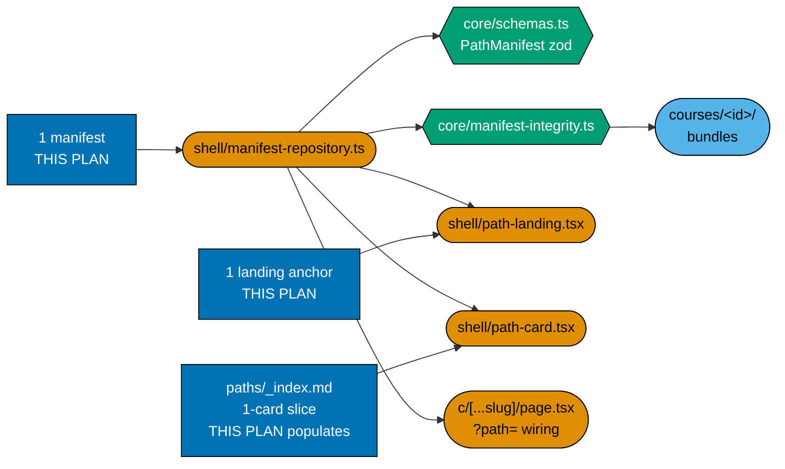
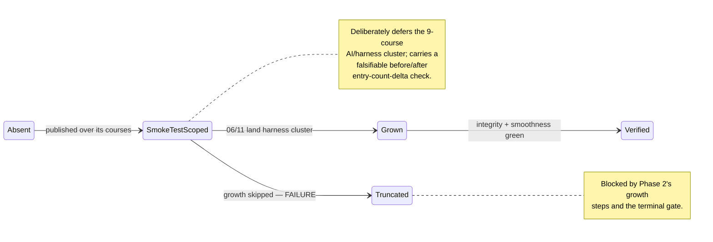

# Technical Documentation — Learning Path Manifest (AI-engineer)

## Corpus Custody

`custodied-by:ayokoding-learning-path-02-schema-and-prerequisite-dag` — this plan **reads** the shared
course corpus custodied by that plan but never edits, copies, or forks any file under it.

> **Cross-plan source of truth**: `plans/done/2026-07-24__ayokoding-learning-path-02-schema-and-prerequisite-dag/syllabus/`.
> Do not copy; do not author from any other source. This manifest's `courseOrder` is **transcribed**
> from its
> [`syllabus/paths/manifest-immediately-effective-ai-engineer.md`](../../done/2026-07-24__ayokoding-learning-path-02-schema-and-prerequisite-dag/syllabus/paths/manifest-immediately-effective-ai-engineer.md)
> mirror, never re-derived.

## Programme decisions

Folded in verbatim so this plan is self-contained.

| Id  | Decision                                                                                                                                              |
| --- | ----------------------------------------------------------------------------------------------------------------------------------------------------- |
| R2  | `pathId` is **variable-depth by design** — `careers/<arc>/<role>` is 3 segments, `skills/<subject>` is 2.                                             |
| R4  | Ownership split: the `careers/`-manifest plans are `careers/`-only; the `skills/` category is separate.                                               |
| R9  | Every plan declares its **UI-gate and API-gate posture explicitly**.                                                                                  |
| A8  | **Strict clean-room licensing, programme-wide** — nothing copyrighted is reproduced, and every concept is restated in original words with a citation. |

### A8 — licensing binds this plan's one landing

This plan's one landing anchor is original prose — no sentence, heading, or ordered list is lifted or
closely paraphrased from a third-party curriculum, syllabus, or course page. The landing-authoring step
in [delivery.md](./delivery.md) carries its own explicit A8 self-check.

## Overview

This plan delivers **one manifest**: `careers/immediately-effective/ai-engineer`, its thin content
landing anchor, this plan's one-card slice of the paths-hub population, the from-scratch smoothness
audit, and the manifest's growth as the AI/harness cluster lands.

| Layer                                                                    | Owner                                                    | This plan's relationship        |
| ------------------------------------------------------------------------ | -------------------------------------------------------- | ------------------------------- |
| URL / IA                                                                 | `ayokoding-learning-path-01-url-restructure`             | consumes                        |
| Schema / core / integrity                                                | `ayokoding-learning-path-02-schema-and-prerequisite-dag` | consumes                        |
| Rendering / route wiring                                                 | `ayokoding-learning-path-03-navigation-ui`               | consumes                        |
| Course bodies (6 AI-engineer-role courses, 9 AI/harness-cluster courses) | `ayokoding-learning-path-04`, `-06`, `-11`               | consumes (band signals)         |
| `apps/ayokoding-www` rendering-mode fix                                  | `vercel-function-cost-reduction`                         | consumes (repository-baseline check)    |
| **The `ai-engineer` manifest + landing + hub card**                      | **this plan**                                            | **produces**                    |
| The 3 `software-engineer`-role manifests                                 | `ayokoding-learning-path-12-careers-se-manifests`        | sibling — coupled, not consumed |
| `skills/` manifests + landings + corpus                                  | the accounting/ERP split plans                           | sibling — out of scope          |

## The manifest ownership invariant (scoped to this plan's one file)

**This plan owns exactly**
`apps/ayokoding-www/src/features/course-paths/manifests/careers/immediately-effective/ai-engineer.json`,
plus every step that creates, appends to, reorders, or re-verifies it. The sibling plan owns its three
software-engineer-role files under the identical invariant. This plan's mechanical checks never assume
the sibling's three files exist or do not exist — this plan's own gates are scoped to its one file only.

### What this plan writes

| Path                                                         | Kind    | Note                                                                                                         |
| ------------------------------------------------------------ | ------- | ------------------------------------------------------------------------------------------------------------ |
| `<MANIFESTS>careers/immediately-effective/ai-engineer.json`  | data    | created Phase 1, grown Phase 2                                                                               |
| `<MANIFESTS>careers/careers-ai-manifest.unit.test.ts`        | test    | asserts this plan's one manifest's shape, integrity, and growth state — **not shared** with the sibling plan |
| `<PATHS>careers/immediately-effective/ai-engineer/_index.md` | content | thin landing anchor, prose/SEO only                                                                          |
| `<PATHS>_index.md`                                           | content | this plan's **one-card** slice only — file owned by `ayokoding-learning-path-01-url-restructure`             |

### What this plan never touches

- Any file under `apps/ayokoding-www/content/en/learn/courses/` — read only.
- Any of the sibling plan's three manifest files or their landings/hub cards.
- Any file under `<MANIFESTS>skills/`.
- Any file under `<FEAT>core/` or `<FEAT>shell/`.
- Any redirect module, `next.config.ts` entry, `legacy/` content, or `apps/ayokoding-www` root
  layout/middleware file.

## Growth signal routing (this plan's two contributing course-authoring successor plans)

| Source plan                                                                            | Grows this plan's manifest?                                              |
| -------------------------------------------------------------------------------------- | ------------------------------------------------------------------------ |
| `ayokoding-learning-path-04-course-authoring` (Phase 1 — 6 AI-engineer-role courses)   | **yes — this plan's Phase 1 GREEN step needs these to author its spine** |
| `ayokoding-learning-path-06-course-authoring-architecture-and-ai-harness` (old Band 5) | **yes — 8 of the 9 AI/harness-cluster courses (Phase 2 growth)**         |
| `ayokoding-learning-path-11-course-authoring-capstones` (old Band 8)                   | **yes — the 9th/final AI/harness-cluster course (Phase 2 growth)**       |

Full routing table, including the sibling plan's six contributing source plans, is in
[the sibling plan's tech-docs §Growth signal routing](../ayokoding-learning-path-12-careers-se-manifests/tech-docs.md#growth-signal-routing-from-the-seven-course-authoring-successor-plans).

## Manifest format (inherited contract)

The `PathManifest` shape, its zod schema, and the integrity gates are authored and owned by
`ayokoding-learning-path-02-schema-and-prerequisite-dag`.

```json
{
  "pathId": "careers/immediately-effective/ai-engineer",
  "title": "AI Engineer",
  "description": "From-scratch AI-engineering track: build AI systems, not drive them.",
  "courseOrder": [
    "just-enough-python",
    "software-testing",
    "cicd-and-release-engineering",
    "backend-at-scale",
    "containers-and-orchestration",
    "computer-architecture",
    "site-reliability-engineering",
    "data-engineering",
    "data-structures-and-algorithms-essentials",
    "software-product-engineering",
    "frontend-essentials"
  ]
}
```

### Manifest integrity invariants

Re-run at every phase gate in this plan, scoped to this plan's own one manifest:

- Every `courseOrder` ID resolves to an existing course under `courses/<course-id>/`.
- No course ID appears twice.
- **Prerequisite-consistency**: every declared prerequisite present in the manifest appears before it.
- Course IDs are stable slugs.

## Architecture

### Component interaction



### Manifest lifecycle (this plan's one manifest)



## Design Decisions

This plan reproduces, by citation, the design decisions that govern its one manifest — all originally
recorded in the plan this split replaces, unchanged in substance by this split.

- **DD-21 · Scope: the AI path teaches building AI systems, not driving them.** `agentic-coding` stays
  a separate, unrelated axis.
- **DD-22 · Convergence axiom: paths converge per role, not globally.** This manifest converges on a
  distinct AI-engineer endpoint, never the software-engineering endpoint the sibling plan's three
  manifests share.
- **DD-23 · Path ID / second-URL-segment convention**, amended by **DD-34** (category segment) and
  retired for this path's own second segment by **DD-35** (below).
- **DD-24 · Original entry-point model: linked, not included, prerequisites** — **superseded for this
  path by DD-35.** Kept here, not deleted, because DD-33 and this path's own history cite it.
- **DD-27 · Build order (locked).** This manifest is authoring priority #1, immediately behind the
  sibling plan's architecture-smoke-test-only interview-ready MVP, and immediately ahead of the sibling
  plan's `immediately-effective/software-engineer` and `fundamentally-strong/software-engineer`
  manifests.
- **DD-28 · Course surgery permitted, six net-new AI courses.** Lives in the course-authoring
  plans; cited here because it is the source of this manifest's six net-new AI-engineer-role courses.
- **DD-33 · This manifest WALKS the AI/harness cluster** (amended in starting composition, not
  reversed, by DD-35). The nine-course cluster
  (`creating-ai-powered-apps`, `agentic-ai`, `browser-automation-with-cdp`, `the-agent-loop`,
  `agent-tools-and-mcp`, `agent-context-and-memory`, `agent-permissions-and-sandboxing`,
  `agent-orchestration-subagents-and-observability`, `capstone-build-your-own-coding-agent`) is
  **included** in `courseOrder`, never linked.
- **DD-34 · Category segment adopted** — every `careers/` path id carries a leading `careers/`
  segment; this manifest's file moved to `<MANIFESTS>careers/immediately-effective/ai-engineer.json`.
- **DD-35 · This path renamed and re-scoped: from-scratch, prerequisites included, not linked** —
  supersedes DD-24 for this path, amends DD-33 in starting composition only. The corrected syllabus
  mirror names 11 existing SWE-fundamentals courses moving from "linked" to "included":
  `just-enough-python`, `software-testing`, `cicd-and-release-engineering`, `backend-at-scale`,
  `containers-and-orchestration`, `computer-architecture`, `site-reliability-engineering`,
  `data-engineering`, `data-structures-and-algorithms-essentials`, `software-product-engineering`,
  `frontend-essentials` — each also declares its own further prerequisites, so the mirror itself notes
  the final included set is very likely larger than these 11. The mirror's prerequisite-consistent
  stage-by-stage ordering of this set was landed at the schema plan's own delivery Phase 1.4 (that plan
  is now archived); this plan transcribes it, never re-derives it. The resulting manifest is therefore
  **not** a fixed "6 → 15 courses" figure — the total is transcribed from what that plan's Phase 1.4
  landed, not fabricated here.

Full text of every decision above is reproduced verbatim, with its complete amendment chain, in the
plan this split replaces and in
[the sibling plan's tech-docs §Design Decisions](../ayokoding-learning-path-12-careers-se-manifests/tech-docs.md#design-decisions)
where it is cited for cross-referencing purposes. This plan does not introduce any new numbered design
decision of its own — the two new decisions this split adds (DD-40, the 3+1 split shape; DD-42, the
non-circular coupling) are owned and recorded by the sibling plan, as the canonical owner for
citation purposes, since they describe the shape of the split as a whole rather than this plan's one
manifest specifically. This plan's own contribution is DD-41's **application** — see
[the sibling plan's DD-41](../ayokoding-learning-path-12-careers-se-manifests/tech-docs.md#design-decisions)
for the Band-9 two-of-three correction, which does not apply to this plan's manifest at all (Band 9 is
scoped to the three software-engineer manifests only; this manifest is never a candidate for that
growth).

## UI-gate and API-gate posture (R9)

### UI gate — **exempt**

`swe-ui-checker` validates component **source**; this plan writes no `.tsx` file. Every rendering
component this plan's one landing and hub-card slice use is owned by
`ayokoding-learning-path-03-navigation-ui`. The exemption is narrow: manual behavioural verification and
the **Rule-15 three-tester retest are mandatory and performed**, scoped to this plan's one landing plus
its hub-card slice, at [Phase 4](./delivery.md#phase-4-manual-ui-verification-and-rule-15-three-tester-retest).

### API gate — **NOT exempt**

This plan has a reachable behavioural delta: manifest integrity scoped to its own one file.
`ayokoding-www` publishes no OpenAPI 3.x document and no GraphQL SDL, so `api-quality-gate` cannot run;
this plan records what it exercises instead (schema validation, `checkManifestIntegrity`,
prerequisite-consistency, the path-walk e2e).

## UI-design-funnel exemption (recorded explicitly)

No net-new component, no net-new screen — this plan contributes content and data to Screen 1 (paths
hub) and Screen 2 (path landing), both already funnelled and owned by
`ayokoding-learning-path-03-navigation-ui`. Manual UI verification, evidence capture, and the Rule-15
retest remain mandatory, scoped to this plan's one landing and its hub-card slice.

**Locale scope.** `en`-only; `id/belajar/` has zero courses and zero paths.

## File-Impact Analysis

Root-relative annotated tree — the scan-first source of truth for this plan's scope. **[E]** edit,
**[N]** new file/pattern, **[D]** delete, **[G]** generated/regenerated.

```text
.
├── apps/ayokoding-www/src/features/course-paths/manifests/careers/
│   ├── careers-ai-manifest.unit.test.ts [N] — created Phase 1, extended Phase 2
│   └── immediately-effective/ai-engineer.json [N] — created Phase 1, grown Phase 2
├── apps/ayokoding-www/content/en/learn/paths/
│   ├── _index.md [E] — populate this plan's 1-card slice (file created by plan 01)
│   └── careers/immediately-effective/ai-engineer/_index.md [N]
├── specs/apps/ayokoding/behavior/ayokoding-www/gherkin/course-paths/
│   └── path-composition.feature [N] — created Phase 1, extended Phase 2
└── apps/ayokoding-www-fe-e2e/src/steps/path-composition.steps.ts [N] — same cadence
└── plans/in-progress/ayokoding-learning-path-13-careers-ai-manifest/
    ├── tech-docs.md [E] — this file
    ├── delivery.md [E] — checkbox ticks and per-phase implementation notes
    ├── learnings.md [E] — running log, drained by the Knowledge Capture phase
    └── evidence/ [N] — phase-0 snapshot, growth records, Playwright screenshots
```

### More Detail

This plan owns exactly one manifest file. The single `[E]` row, `paths/_index.md`, is a
**populate-only** edit of a file plan 01 created — this plan appends its one hub card and the sibling
SE-manifests plan appends its three, so the two append disjoint slices to the same file and merge
cleanly.

`ai-engineer.json` is created in Phase 1 at its six-course smoke-test spine and **grown** in Phase 2
once the upstream AI-cluster band-completion signals land. It appears once in the tree because the
tree records intent per path, not per commit.

No `[D]` or `[G]` rows exist: this plan deletes nothing, and no emitter runs over its output.

| Path                                                                     | Change                                | Phase |
| ------------------------------------------------------------------------ | ------------------------------------- | ----- |
| `<MANIFESTS>careers/careers-ai-manifest.unit.test.ts`                    | created (Phase 1), extended (Phase 2) | 1-2   |
| `<MANIFESTS>careers/immediately-effective/ai-engineer.json`              | created (Phase 1), grown (Phase 2)    | 1-2   |
| `<PATHS>careers/immediately-effective/ai-engineer/_index.md`             | created                               | 1     |
| `<PATHS>_index.md`                                                       | edited (this plan's 1-card slice)     | 1     |
| `<SPECS>path-composition.feature`                                        | created (1), extended (2)             | 1-2   |
| `apps/ayokoding-www-fe-e2e/src/steps/path-composition.steps.ts`          | created (1), extended (2)             | 1-2   |
| `plans/backlog/ayokoding-learning-path-13-careers-ai-manifest/evidence/` | created (0), extended (2, 4)          | 0,2,4 |

## Testing Strategy

| Level                    | What it covers here                                                                                                                                                                                                      | Command                                                               |
| ------------------------ | ------------------------------------------------------------------------------------------------------------------------------------------------------------------------------------------------------------------------ | --------------------------------------------------------------------- |
| Unit                     | this plan's 1 manifest loads + zod-validates; integrity; prerequisite-consistency; growth check                                                                                                                          | `npm exec nx run ayokoding-www:test:unit`                                  |
| Specs (Gherkin coverage) | 2 of this plan's 4 `prd.md` scenarios bind step definitions; 1 is documentation-verified (Phase 1.3); 1 (build/validate green) is covered by Phase 3's aggregate verification sweep without a dedicated scenario binding | `npm exec nx run ayokoding-www:specs:behavior:coverage`                    |
| E2E                      | path-walk from this plan's one landing; `?path=` persistence; breadcrumb; prerequisite display                                                                                                                           | `npm exec nx run ayokoding-www-fe-e2e:test:e2e`                            |
| Build                    | this plan's one manifest resolves against currently-landed course bundles                                                                                                                                                | `npm exec nx run ayokoding-www:build`                                      |
| Manual                   | 1 landing + this plan's hub-card slice at 375/768/1280px, `en`, committed evidence                                                                                                                                       | Playwright MCP (Phase 4)                                              |
| Live-site triad          | Rule-15 EWT/UWT/DWT retest before archival, scoped to this plan's surfaces                                                                                                                                               | `web-exploratory-tester`, `web-usability-tester`, `web-design-tester` |

**TDD shape.** Phase 1 (first authoring) is Red→Green→Refactor. Phase 2's growth steps are data-edit
and follow the same exemption logic as the sibling plan's Bands 1-8-equivalent growth — appending
already-authored, already-ordered course IDs to a manifest whose integrity assertions already cover the
new data shape, so there is no new cross-manifest invariant to assert (unlike the sibling plan's Band-9
growth, which introduced a genuinely new invariant). The before/after entry-count-delta check is the
falsifiable safety property in both directions.

## Execution dependency

This plan has one direct execution prerequisite: `ayokoding-learning-path-12-careers-se-manifests`, fully merged and archived on `origin/main`. Course-level source citations and repository facts are implementation context, not extra plan dependencies.

## Rollback

- **The manifest-authoring unit (Phase 1)**: `git revert` the unit's merge commit. The manifest and its
  landing disappear; the hub card count drops by one; the sibling plan's three manifests are
  unaffected, since manifests are independent data files.
- **The growth unit (Phase 2)**: `git revert` returns the manifest to its pre-growth state; integrity
  still passes at the smaller scope.
- **No content or component rollback is ever required**, because this plan writes neither.
