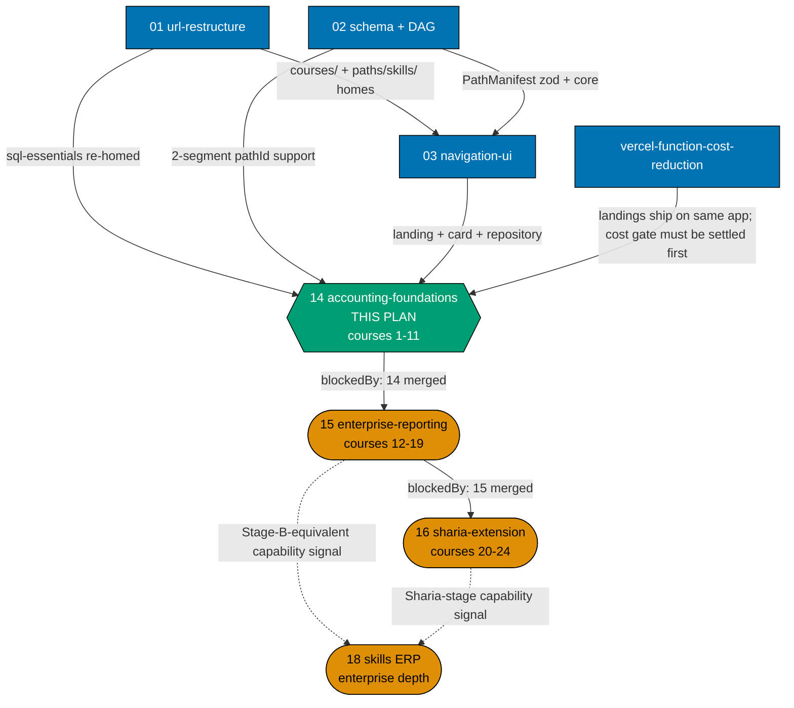
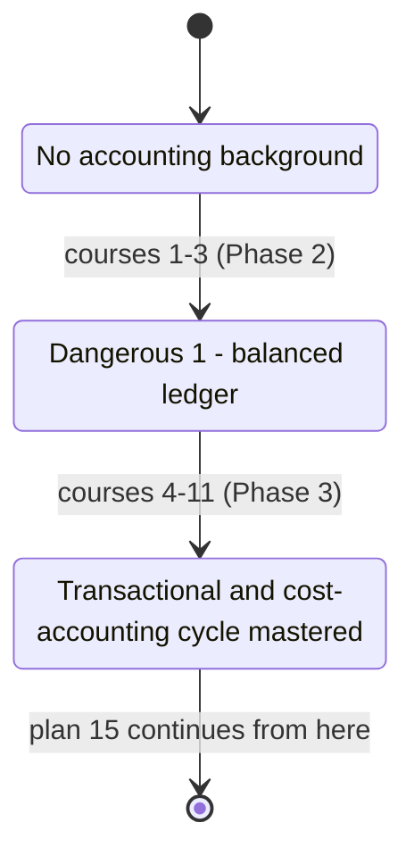

# Skills Paths — Accounting Foundations & Transactional Cycles

## Delivery amendment — one final PR

All 11 courses remain within one plan branch and one delivery unit. The sole draft PR opens only in
Phase 8, after verification and Knowledge Capture, and carries the archival move, review cycle, CI,
merge, and deploy. No earlier stage or delivery boundary opens a PR.

> **This plan is the first of a three-plan sequential chain** that replaces the retired
> `ayokoding-learning-path-06-skills-accounting/` design (24 courses, 2 manifests, 1 monolithic
> plan) with three smaller plans, each owning a contiguous course range and chained by hard
> `blockedBy` edges: **14 (this plan, courses #1–#11) → 15 (courses #12–#19) → 16 (courses
> #20–#24)**. The split preserves the source plan's business/product context — personas, the
> silent-failure constraint (DD-609), the licensing posture (A8) — verbatim across all three; see
> [tech-docs.md §Provenance of this split](./tech-docs.md#provenance-of-this-split) for the mapping
> from the retired plan's phases to this chain's plans.

This plan owns two path landings end-to-end for its own course range — content into
`/en/learn/paths/skills/conventional-accounting` and `/en/learn/paths/skills/sharia-accounting`
(A10) — **and creates both manifests for the first time**. It authors courses #1 through #11 of the
twenty-four-course catalog: the three shared foundation courses (Dangerous-1 boundary) plus the
eight-course transactional-and-cost-accounting cycle (journal entries through lease and intangible
assets). It creates **no `_index.md`** under `paths/` (plan 01 owns every structural index, per the
2026-07-21 A3 ruling) and authors **no course past #11** — courses #12–#24 belong to plans 15 and 16.

## Prior art

| Prior artefact                                                                      | Relationship to this plan                                                                                                                                                                                                                                                                                                                                                                |
| ----------------------------------------------------------------------------------- | ---------------------------------------------------------------------------------------------------------------------------------------------------------------------------------------------------------------------------------------------------------------------------------------------------------------------------------------------------------------------------------------- |
| `plans/backlog/ayokoding-learning-path-06-skills-accounting/` [Repo-grounded]       | **The direct predecessor this plan splits from.** Its 24-course catalog, two-manifest mechanics, licensing posture, personas, and silent-failure constraint are the baseline this plan and its two siblings restate for a narrower course range. The retired plan is not deleted by this plan — the person requesting this split removes it after verifying all three new folders exist. |
| `apps/ayokoding-www/content/en/learn/legacy/business/accounting.md` [Repo-grounded] | Course #1 mines its running example and narrative sequencing (DD-626), unchanged mechanism from the retired plan's own citation of this file.                                                                                                                                                                                                                                            |
| The 120-course software-engineering library                                         | **No course duplicates it.** One linked cross-domain prerequisite lands inside this plan's own range (`sql-essentials`, for course #2); the second (`backend-essentials`, for course #19) lands in plan 15's range.                                                                                                                                                                      |
| `ayokoding-learning-path-05-manifests`                                              | Structural analogue only, not a content source — unchanged reasoning from the retired plan.                                                                                                                                                                                                                                                                                              |

## Why two paths, not one (A10 + A11) — background, stated once here

A single `skills/accounting` path cannot honestly serve both readers this domain has: the systems
builder who will never touch a Sharia contract, and the systems builder building specifically for
Bahrain, Indonesia or Malaysia. **A10** splits the corpus into two paths instead —
`/en/learn/paths/skills/conventional-accounting` (nineteen courses, terminal in itself, reached at
the end of plan 15) and `/en/learn/paths/skills/sharia-accounting` (the same nineteen courses plus
five Sharia-specific ones, twenty-four total, completed at the end of plan 16). **Both paths cover
all the basics** — a reader entering `sharia-accounting` cold gets the full grounding.

**A11 governs how, and it is the schema's existing rule** (established by
`ayokoding-learning-path-02-schema-and-prerequisite-dag`, archived under `plans/done/`): manifest ID
uniqueness is scoped **per manifest**, not globally, and every manifest references course bodies
**by ID**, never by copy. The nineteen conventional courses are authored **once**, under
`<COURSES>`, and referenced by both manifests; the five Sharia-specific courses exist only in
`sharia-accounting.yaml`. **This plan (14) never duplicates a course to serve two paths** — full
reasoning, the two manifests' exact YAML shape, and the citation trail into plan 02's tech-docs:
[tech-docs.md §Two manifests, shared courses](./tech-docs.md#two-manifests-shared-courses-a10--a11).

This A10/A11 rationale is stated **once**, here in plan 14, as background context. Plans 15 and 16
reference this section rather than restating the full rationale — see each plan's own
`tech-docs.md §Provenance of this split`.

## No building — architecture, not construction (A6)

`A6` draws a line between **founding** an implementation and **building** one. Every course in this
plan's range teaches to the founding depth and stops there: double-entry mechanics, posting rules,
costing methods, and the failure modes each produces are in scope; **building** a system — a
capstone that constructs software, an "implement X" exercise, a scaffolded codebase — is not. No
course in this plan's range is an architecture-closing course (those are `general-ledger-system-architecture`,
course #19, in plan 15, and `sharia-ledger-system-architecture`, course #24, in plan 16); this
plan's own applied-synthesis sections are integrative worked scenarios, never build exercises. Full
statement: [tech-docs.md §Licensing and IP compliance / A6](./tech-docs.md#a6--the-build-founding-depth-line).

## The one constraint that shapes everything

**Accounting's characteristic failure mode is silent.** A trial balance still balances when
revenue is recognised in the wrong period, when a lease is misclassified as an operating cost, or
when inventory is costed on a method inconsistent with how it is actually consumed. Every total
foots; every control adds up; the numbers are plausible and substantively wrong.

That property is why this plan's own ramp slows down after course #3: three courses buy a reader a
correctly balancing ledger and the three statements — and that competence is exactly what makes the
next mistakes invisible to them. **Every course from #4 through #11 carries an explicit "what still
balances while being wrong" section** (DD-609); courses #1–#3 do not, because Stage 1 is
pre-Dangerous-1. The full statement, with its consequences for personas and acceptance criteria:
[prd.md §The silent-failure constraint](./prd.md#the-silent-failure-constraint-the-corpus-shaping-fact).

## Scope

**In scope**

- Content for both path landings at
  `apps/ayokoding-www/content/en/learn/paths/skills/conventional-accounting/_index.md` and
  `…/paths/skills/sharia-accounting/_index.md` — this plan **creates** both files (they do not exist
  before this plan runs) and states the Dangerous-1 boundary plus (on the Sharia landing) the
  path-choice affordance. Visual design is owned by `ayokoding-learning-path-03-navigation-ui`.
- **Two manifest data files, created for the first time** —
  `apps/ayokoding-www/src/features/course-paths/manifests/skills/conventional-accounting.yaml` and
  `…/manifests/skills/sharia-accounting.yaml` — plus each manifest's own co-located unit test. Both
  manifests are grown, within this plan, from 0 → 3 entries (Stage 1) → 11 entries (this plan's own
  second sub-phase). **Neither manifest reaches its full terminal size in this plan** — see
  [tech-docs.md §Staged manifest growth across the three-plan chain](./tech-docs.md#staged-manifest-growth-across-the-three-plan-chain).
- One shared Gherkin feature file (a Scenario Outline with two Examples rows, one per path) and its
  step-definition file.
- **Eleven syllabus specs** under this plan's own `syllabus/courses/` folder, courses #1–#11, each
  carrying an explicit module/topic breakdown.
- **This plan's own slice** of both path mirrors —
  `syllabus/paths/manifest-skills-conventional-accounting.md` (rows for courses #1–#11) and
  `syllabus/paths/manifest-skills-sharia-accounting.md` (the same eleven rows, since courses #1–#11
  are all shared-spine courses).
- **Eleven course bodies** under `apps/ayokoding-www/content/en/learn/courses/<course-id>/`.

**Out of scope**

- **Any `_index.md` under `paths/`** — plan 01's (A3).
- **Any ERP content** — `ayokoding-learning-path-18-skills-erp-enterprise-depth`'s.
- **Courses #12–#24** — plan 15 authors #12–#19; plan 16 authors #20–#24.
- **Re-authoring any existing library course.** `sql-essentials` is **linked**, never re-walked.
- **The `PathManifest` schema, the `course-paths` core modules, and every rendering component** —
  owned by plans 02 and 03.
- **The `careers/` manifests** — owned by `ayokoding-learning-path-12-careers-se-manifests` and
  `ayokoding-learning-path-13-careers-ai-manifest`.
- **An Indonesian mirror.** `id/belajar/` holds zero courses and zero paths.
- **Any building exercise, capstone, or scaffolded codebase (A6).**
- **Growing either manifest past 11 entries** — that is plan 15's (to 19) and plan 16's (to 24) work.

## Syllabus layer (new requirement, own slice)

Every one of this plan's eleven courses carries a syllabus with an explicit concept/worked-example
breakdown, per the [Learning-Plan `syllabus/` Folder Convention](../../../repo-governance/conventions/structure/learning-plan-syllabus.md).
This plan authors its own corpus inside its own folder — `syllabus/courses/<course-id>.md` per
course (11 files plus a folder `README.md`), `syllabus/paths/` for its own slice of the two path
mirrors — per A3's ownership split, rather than editing plan 02's custody-frozen corpus or any
sibling plan's own `syllabus/` folder. See
[tech-docs.md §Syllabus layer](./tech-docs.md#syllabus-layer--custody-and-shape).

**Every syllabus is authored first, confirmed second (A12).** Each syllabus is written from domain
reasoning before any external research touches it; only after a syllabus exists does Phase 1
dispatch `web-researcher`, and only to check **coverage**, never to supply or correct structure.

## Licensing (A8) — read before authoring any standards content

**IAI (Indonesia) is the strictest of the four bodies this corpus touches** — it forbids
reproduction or translation with no educational exception at all. **No public-domain chart of
accounts exists anywhere** — every chart of accounts in this plan's courses is originally authored.
Full posture table and the eleven safe-authoring rules:
[tech-docs.md §Licensing and IP Compliance](./tech-docs.md#licensing-and-ip-compliance-a8).

## Where this plan sits

**Accessibility note.** Role is carried by node **shape** (rectangle = upstream, hexagon = this
plan, stadium = downstream) and by every edge's explicit label, never by colour alone. Fills use
the repo's verified colour-blind-friendly palette with black borders and WCAG-AA-contrasting text,
per the [Color Accessibility Convention](../../../repo-governance/conventions/formatting/color-accessibility.md).

**This plan has NO edge to any course-authoring or careers-manifest plan** — confirmed, matching
the retired plan's own "no edge" findings for `ayokoding-learning-path-04-course-authoring` and
`ayokoding-learning-path-05-manifests`: this plan's one cross-domain prerequisite
(`sql-essentials`, for course #2) is among plan 01's 37 re-homed bundles, so this plan runs
**concurrently** with 04 and 05 rather than behind them. **This plan also carries no `blocks` edge
into `ayokoding-learning-path-18-skills-erp-enterprise-depth`** — that edge
is recorded only by plans 15 and 16, at stage granularity, once the conventional and Sharia spines
respectively reach their own terminal states (see
[tech-docs.md §Stage-signal contract](./tech-docs.md#stage-signal-contract-the-plan-18-handoff-stage-granularity)
for the reasoning behind that judgment call).

## The ramp — this plan's slice of both paths' pedagogy

Every path under `/en/learn/paths/skills/` is the **immediately-effective** arc, always (R8). This
plan delivers the first two ramp segments of both paths:

| Boundary                                      | After | Path(s) | A reader **can**                                                                                                                                                                            | A reader **cannot yet**                                                                                                                                                                       |
| --------------------------------------------- | ----- | ------- | ------------------------------------------------------------------------------------------------------------------------------------------------------------------------------------------- | --------------------------------------------------------------------------------------------------------------------------------------------------------------------------------------------- |
| **Dangerous 1** ⚡                            | #3    | both    | Build a working, correctly balancing ledger; make routine postings; produce the three statements for a single entity.                                                                       | Post journal entries with formal mechanics, recognise multi-period revenue, run AP/AR cycles, cost inventory, handle leases, or manage fixed assets.                                          |
| **Cycle-complete** (internal, this plan only) | #11   | both    | Post journal entries formally, recognise revenue, run full AP/AR cycles, apply managerial/cost accounting, depreciate fixed assets, cost inventory, and account for leases and intangibles. | Handle multi-currency translation, consolidate multiple entities, reconcile IFRS vs. GAAP, audit controls, payroll/tax, treasury, XBRL reporting, or architect a GL system — plan 15's range. |

**#1 alone is standalone-useful** (correct cash-basis hand-posting). **#1 + #2** is standalone-useful
for designing a real ledger schema. **#1–#3** is the first genuinely dangerous point. **This plan's
full eleven-course range is a genuine, internally-coherent competence milestone** — a mid-size
company's day-to-day transactional cycle — but it is **not** independently production-shippable as
"the whole path": both manifests remain at 11 of their eventual 19/24 entries when this plan ends,
so neither landing states path completeness here (that claim is plan 15's, for
`conventional-accounting`, at course #19).

## Delivery Mode: worktree-to-pr

This plan has exactly one dedicated worktree, one persistent final-delivery branch, and one PR.
All authoring, verification, and Knowledge Capture phases commit on that branch without a push, PR,
review cycle, merge, or deployment. In Phase 8, the executor commits the archival move and
any index updates, opens the sole draft PR, completes the PR-Review Maker→Fixer Cycle and CI gates,
marks it ready, and performs the normal AI merge/deploy after the hardened preconditions hold.
No per-course, cohort, stage, or phase worktree/branch/PR is permitted.

## Rule-15 disposition for this plan — scoped retest against the eleven-course slice

**This plan runs its own Rule-15 three-tester retest**, scoped to the two live partial landings as
they exist at this plan's end (11 of the eventual 19/24 courses). Rule 15's plain text recognizes
exactly two exemptions — CLI/text-output plans, and pure governance/no-behaviour-change plans — and
this plan matches neither: both landings are genuinely production-served, browser-rendered surfaces
after this plan merges. Rule 15's own stated gap (functional, behavioural-consistency, responsive,
accessibility, URL/IA, or passive-security defects; first-time-user confusion; runtime
design-token/design-system/spacing drift) applies identically whether a manifest holds 11 or 24
entries — an 11-course landing is a coherent, reachable UI surface for the triad to exercise, and
does not require a "complete" catalog to find a broken breadcrumb or a console error.

**Plan 15 and plan 16 each run their own follow-up retest**, scoped to their own incremental delta
(plan 15 grows `conventional-accounting` from 11 to 19 entries; plan 16 grows `sharia-accounting`
from 19 to 24) — a legitimate and already-precedented pattern elsewhere in this repo, since Rule 15
is a "near-end" gate per delivery unit, not a once-per-catalog gate. This plan's own retest, plus
the mandatory Playwright MCP manual verification, both run in this plan's
[delivery.md Phase 5](./delivery.md#phase-5-manual-ui-verification--rule-15-three-tester-retest).

## Depends-on

| Direction   | Plan (full folder name)                                             | Strength                                                                                                                                                                        |
| ----------- | ------------------------------------------------------------------- | ------------------------------------------------------------------------------------------------------------------------------------------------------------------------------- |
| `blockedBy` | `ayokoding-learning-path-01-url-restructure`                        | **hard** — the `courses/` namespace, `paths/skills/_index.md`, and the linked `sql-essentials`                                                                                  |
| `blockedBy` | `ayokoding-learning-path-02-schema-and-prerequisite-dag`            | **hard** — `PathManifest` schema with `arc` + variable-depth `pathId` support, x2 manifests                                                                                     |
| `blockedBy` | `ayokoding-learning-path-03-navigation-ui`                          | **hard** — a manifest with no renderer is invisible                                                                                                                             |
| `blockedBy` | `vercel-function-cost-reduction`                                    | **hard** — this plan ships landing pages in the same `ayokoding-www` app; see below                                                                                             |
| `blocks`    | `ayokoding-learning-path-15-skills-accounting-enterprise-reporting` | **hard** — plan 15 cannot grow either manifest past 11 entries or author course #12 until this plan's course bodies, manifests, and landings are merged                         |
| _(none)_    | `ayokoding-learning-path-04-course-authoring`                       | **no edge** — verified: the one linked prerequisite is plan 01's re-homed bundle                                                                                                |
| _(none)_    | `ayokoding-learning-path-12-careers-se-manifests`                   | **no edge** — disjoint manifest subtrees                                                                                                                                        |
| _(none)_    | `ayokoding-learning-path-13-careers-ai-manifest`                    | **no edge** — disjoint manifest subtrees                                                                                                                                        |
| _(none)_    | `ayokoding-learning-path-18-skills-erp-enterprise-depth`            | **no edge** — this plan emits no ERP-facing stage signal; see [tech-docs.md §Stage-signal contract](./tech-docs.md#stage-signal-contract-the-plan-18-handoff-stage-granularity) |

### The `vercel-function-cost-reduction` hard dependency

`plans/done/2026-08-02__vercel-function-cost-reduction/` [Repo-grounded — read in full at authoring
time] cuts `ayokoding-www`'s gross Vercel infrastructure spend from ~$57/month to under the $20/month
Pro-plan usage credit by fixing two rendering-dynamism causes in the app's root layout and its
`[...slug]` content page, which today force **every single content-page view to execute a
serverless function with zero CDN caching**. This plan adds two brand-new, permanently-live pages
(`paths/skills/conventional-accounting/_index.md`, `paths/skills/sharia-accounting/_index.md`) plus
eleven new course-page bundles to that same app — **more traffic-bearing pages compound the exact
cost problem that plan is fixing**, so this plan is treated as **hard-`blockedBy`** it, with a
concrete checkable signal: `git log origin/main --oneline | grep -q "vercel-function-cost-reduction"`
must return non-empty before Phase 0's baseline is recorded (see
[delivery.md §Depends-on and start preconditions](./delivery.md#depends-on-and-start-preconditions)).
Treated as **already merged/done** per the explicit instruction accompanying this plan's authoring —
this plan does not re-verify the cost-reduction plan's own acceptance criteria, only that its merge
commit is present on `origin/main`.

## Navigation

- [Business Requirements (brd.md)](./brd.md) — why the split lands as three plans, why this plan is
  first, and what "done" means in business terms for its own course range.
- [Product Requirements (prd.md)](./prd.md) — the silent-failure constraint, personas, user stories,
  Gherkin acceptance criteria, and product scope for courses #1–#11.
- [Technical Docs (tech-docs.md)](./tech-docs.md) — the eleven-course catalog slice, the staged
  manifest-growth mechanics, the licensing posture, the DAG join, and the design decisions.
- [Delivery Checklist (delivery.md)](./delivery.md) — the phased executable checklist.
- [Learnings (learnings.md)](./learnings.md) — knowledge-capture running log.
- `syllabus/courses/` and `syllabus/paths/` — created by Phase 1; this plan's own 11 per-course
  specs and its slice of the two `manifest-skills-*.md` path mirrors.
