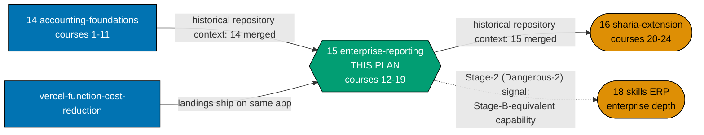
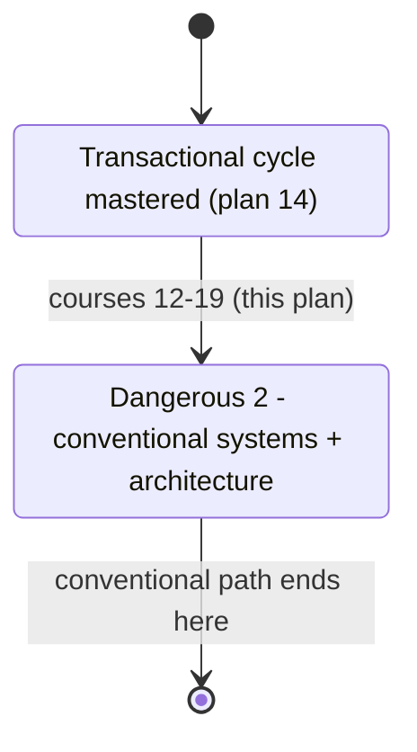

# Skills Paths — Accounting Enterprise Reporting & Architecture

## Delivery amendment — one final PR

All 8 courses remain within one plan branch and one delivery unit. The sole draft PR opens only in
Phase 7, after verification and Knowledge Capture, and carries the archival move, CI,
merge, and deploy. No earlier stage or delivery boundary opens a PR.

> **This plan is the second of a three-plan sequential chain** that replaces the retired
> the superseded accounting-programme draft/`design with three smaller plans:
> **`ayokoding-learning-path-14-skills-accounting-foundations` (courses #1–#11) → this plan
> (courses #12–#19) → `ayokoding-learning-path-16-skills-accounting-sharia-extension` (courses
> #20–#24)**. This plan is repository baseline context plan 14 and hard-blocks plan 16. It shares the retired
> plan's business/product context — personas, the silent-failure constraint (DD-609), the
> licensing posture (A8) — verbatim with its two siblings; the A10/A11 two-path rationale is stated
> once, in plan 14, and referenced here. See
> [tech-docs.md §Provenance of this split](./tech-docs.md#provenance-of-this-split).

This plan owns the **enterprise-reporting-and-architecture** half of the shared conventional
spine: courses #12 through #19 — multi-currency translation, consolidation, IFRS-vs-GAAP
reporting, audit and controls, payroll and tax, treasury, XBRL reporting, and the terminal
general-ledger-system-architecture course. **This plan grows both manifests from 11 to 19 entries,
and `conventional-accounting.json` reaches its terminal, frozen size here** — course #19 is the
Dangerous-2 boundary, and it is the point at which `conventional-accounting` becomes a genuinely
complete, standalone-shippable path. It creates **no `_index.md`** under `paths/` (plan 01's, per
A3) and authors **no course outside #12–#19** — courses #1–#11 are plan 14's, courses #20–#24 are
plan 16's.

## Prior art

| Prior artefact                                                                                      | Relationship to this plan                                                                                                                                                                                         |
| --------------------------------------------------------------------------------------------------- | ----------------------------------------------------------------------------------------------------------------------------------------------------------------------------------------------------------------- |
| the superseded accounting-programme draft (reproduced and owned locally)                       | **The direct predecessor this three-plan chain splits from.** Its Stage-2 course range (#4–#19 in its own numbering) is split across plan 14 (courses #4–#11) and this plan (courses #12–#19).                    |
| `ayokoding-learning-path-14-skills-accounting-foundations` [Planned — this plan's hard predecessor] | **Supplies the eleven already-merged shared courses** (#1–#11) and both manifests at their 11-entry starting state. This plan's own courses cite four of those eleven as prerequisites (#2, #3, #5, #6, #7, #11). |
| The 121-course software-engineering library                                                         | **No course duplicates it.** One linked cross-domain prerequisite lands inside this plan's own range (`backend-essentials`, for course #19) — the second and last such edge in the whole 24-course catalog.       |

## Why this plan's course range (#12–#19), and why it closes `conventional-accounting`

Plan 14's own `brd.md` states the rationale for the 11/8/5 split at the level of "foundations vs.
enterprise reporting vs. Sharia extension." This plan's own eight courses are the
**enterprise-reporting-and-architecture** half of the retired plan's original sixteen-course Stage
2: multi-currency and consolidation (the multi-entity/cross-border reporting cluster), IFRS-vs-GAAP
and XBRL (the cross-standard reporting cluster), audit/controls and payroll/tax (the
compliance/operational-control cluster), treasury (which depends on plan 14's own AP/AR courses),
and — closing the whole conventional spine — `general-ledger-system-architecture`, the
architecture-not-construction course (A6) that replaces the retired single-path design's deleted
`capstone-build-a-general-ledger-system` capstone.

**This is where `conventional-accounting` terminates.** At the end of this plan, that manifest
holds exactly 19 entries and **never grows again** — any later touch to
`conventional-accounting.json` (by plan 16 or any future plan) is itself a defect, verified
mechanically via `git diff --quiet` at every later gate.

## No building — architecture, not construction (A6)

Restated from plan 14: `A6` draws a line between **founding** an implementation and **building**
one. This plan's terminal course, `general-ledger-system-architecture` (#19), is the conventional
spine's own architecture-closing course — it teaches subledger-to-GL relationships, posting rules,
and document state machines **without** asking the reader to build a system. It carries the
**linked** `backend-essentials` cross-domain prerequisite the retired single-path design's deleted
capstone carried.

## The one constraint that shapes everything (restated, unchanged)

**Accounting's characteristic failure mode is silent.** Every course in this plan's range —
all eight of #12–#19 — carries the mandatory "what still balances while being wrong" section
(DD-609), continuing the requirement plan 14 established starting at course #4. Full statement:
[prd.md §The silent-failure constraint](./prd.md#the-silent-failure-constraint-continued).

## Scope

**In scope**

- Content updates to both path landings — `conventional-accounting`'s landing states **path
  completeness** at course #19 for the first time; `sharia-accounting`'s landing states the
  Dangerous-2 boundary and continues to promise the not-yet-authored Sharia stage.
- **Growing both existing manifest data files** from 11 to 19 entries, plus extending each
  manifest's existing co-located unit test (created by plan 14).
- Extending the shared Gherkin feature file's step definitions (from plan 14) to walk the full
  19-course shared spine.
- **Eight syllabus specs** under this plan's own `syllabus/courses/` folder, courses #12–#19.
- **This plan's own slice** of both path mirrors — `syllabus/paths/manifest-skills-conventional-accounting.md`
  and `syllabus/paths/manifest-skills-sharia-accounting.md` (rows for courses #12–#19 in each).
- **Eight course bodies** under `apps/ayokoding-www/content/en/learn/courses/<course-id>/`.
- **The Stage-2 (Dangerous-2) cross-plan stage signal**, unblocking
  `ayokoding-learning-path-18-skills-erp-enterprise-depth`'s Stage-B-equivalent
  capability — see [tech-docs.md §Stage-signal contract](./tech-docs.md#stage-signal-contract-the-plan-18-handoff-stage-granularity).
- **The full Rule-15 three-tester retest**, for the `conventional-accounting` landing — this plan's
  own choice, since that path is genuinely production-complete and standalone-shippable at this
  plan's end (see [§Rule-15 disposition](#rule-15-disposition-for-this-plan) below).

**Out of scope**

- **Any `_index.md` under `paths/`** — plan 01's (A3).
- **Any ERP content** — plan 18's.
- **Courses #1–#11 and #20–#24** — plan 14's and plan 16's respectively.
- **Re-authoring any existing library course.** `backend-essentials` is **linked**, never re-walked.
- **The `PathManifest` schema, the `course-paths` core modules, and every rendering component.**
- **The `careers/` manifests.**
- **An Indonesian mirror.**
- **Any building exercise, capstone, or scaffolded codebase (A6).**
- **Growing `sharia-accounting.json` past 19 entries** — that is plan 16's work.

## Syllabus layer (own slice)

This plan's eight courses carry syllabi with an explicit concept/worked-example breakdown, per the
[Learning-Plan `syllabus/` Folder Convention](../../../repo-governance/conventions/structure/learning-plan-syllabus.md),
authored inside this plan's own folder — never editing plan 14's or plan 02's `syllabus/`. Two of
this plan's eight courses (`financial-reporting-standards-ifrs-vs-gaap`,
`financial-reporting-and-xbrl`) use the Annotated-concept format, and `audit-controls-and-compliance`
is the third Annotated-concept course in this plan's range — see
[tech-docs.md §The eight-course catalog slice](./tech-docs.md#the-eight-course-catalog-slice-courses-1219).

## Licensing (A8)

Restated from plan 14: strict clean-room licensing binds every course. **No public-domain chart of
accounts exists anywhere.** This plan's range additionally cites XBRL taxonomy releases and
IFRS-vs-GAAP standard numbers, both volatile facts requiring a dated accuracy-note sidebar. Full
posture table: [tech-docs.md §Licensing and IP Compliance](./tech-docs.md#licensing-and-ip-compliance-a8).

## Where this plan sits

**Accessibility note.** Role is carried by node **shape** (rectangle = upstream, hexagon = this
plan, stadium = downstream) and by every edge's explicit label, never by colour alone.

## The ramp — this plan's slice

| Boundary           | After | Path(s)                                              | A reader **can**                                                                                                                                                            | A reader **cannot yet**                                                                 |
| ------------------ | ----- | ---------------------------------------------------- | --------------------------------------------------------------------------------------------------------------------------------------------------------------------------- | --------------------------------------------------------------------------------------- |
| **Dangerous 2** ⚡ | #19   | both (`conventional-accounting` **terminates here**) | Model most conventional systems a mid-size company runs, plus multi-currency/consolidation/reporting/audit/treasury, **and architect (not build) a general-ledger system**. | Build or reason about a Sharia-compliant ledger — courses #20–#24, plan 16's own range. |

**The whole `conventional-accounting` path (#1–#19) is standalone-useful and production-complete at
this plan's end** — a complete, shippable competence in its own right, not a truncated on-ramp.

## Delivery Mode: worktree-to-pr

This plan has exactly one dedicated worktree, one persistent final-delivery branch, and one PR.
All authoring, verification, and Knowledge Capture phases commit on that branch without a push, PR, merge, or deployment. In Phase 7, the executor commits the archival move and
any index updates, opens the sole draft PR, completes the secret scan, local quality checks, and PR quality-gate verification and CI gates,
marks it ready, and performs the normal AI merge/deploy after the hardened preconditions hold.
No per-course, cohort, stage, or phase worktree/branch/PR is permitted.

## Rule-15 disposition for this plan

**This plan runs the full Rule-15 three-tester retest**, for the `conventional-accounting` landing
and its complete 19-course walk. This is a deliberate choice, not the default: per the split's own
retest allocation (stated in the source task and carried forward here), the retest is normally
saved for the end of the whole three-plan chain (plan 16) — but `conventional-accounting` reaches
genuine production completeness **here**, at the end of this plan, and ships to production
standalone. Deferring its retest to plan 16 would mean shipping a "done" path to production without
ever running the live-site triad against it in its finished state, which this plan's own
maintainer judges to be the wrong trade-off for a path this plan explicitly declares complete. See
[delivery.md Phase 4](./delivery.md#phase-4-manual-ui-verification-and-full-rule-15-retest-conventional-accounting).

`sharia-accounting`'s own retest, covering the incremental delta plan 16 adds, runs once — in plan
16 — after that path reaches its own terminal state.

## Depends-on

| Relation | Plan (full folder name) | Nature |
| -------- | ----------------------- | ------ |
| **blockedBy** | `ayokoding-learning-path-14-skills-accounting-foundations` | **Hard; sole direct execution prerequisite.** It must be fully merged and archived on `origin/main` before Phase 0. All earlier completion and repository-baseline facts are transitive context, not extra plan prerequisites. |

**Phase 0 start check:** `git ls-tree -r --name-only origin/main plans/done | rg -q "__ayokoding-learning-path-14-skills-accounting-foundations/README\.md$"` exits 0. This is this plan's only plan-level start gate.

## Navigation

- [Business Requirements (brd.md)](./brd.md) — why this plan closes `conventional-accounting`, and
  what "done" means in business terms for courses #12–#19.
- [Product Requirements (prd.md)](./prd.md) — the silent-failure constraint (continued), personas,
  user stories, Gherkin acceptance criteria, and product scope for this plan's range.
- [Technical Docs (tech-docs.md)](./tech-docs.md) — the eight-course catalog slice, the manifest
  growth to 19, the stage-signal contract, and the design decisions.
- [Delivery Checklist (delivery.md)](./delivery.md) — the phased executable checklist, including the
  full Rule-15 retest.
- [Learnings (learnings.md)](./learnings.md) — knowledge-capture running log.
- `syllabus/courses/` and `syllabus/paths/` — created by Phase 1; this plan's own 8 per-course specs
  and its slice of the two `manifest-skills-*.md` path mirrors.
