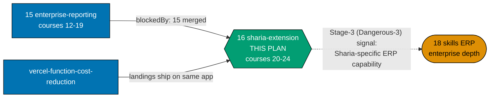
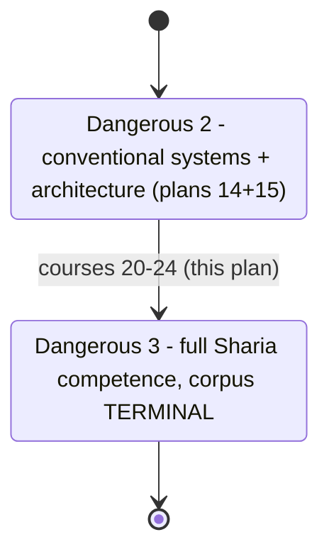
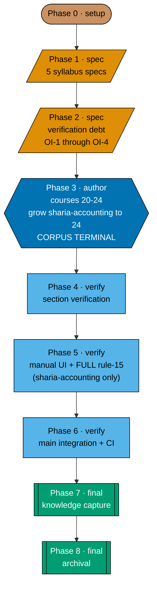

# Skills Paths — Accounting Sharia Extension

## Delivery amendment — one final PR

All 5 courses remain within one plan branch and one delivery unit. The sole draft PR opens only in
Phase 8, after verification and Knowledge Capture, and carries the archival move, review cycle, CI,
merge, and deploy. Earlier stage or delivery-boundary PR wording is superseded.

> **This plan is the third and final of a three-plan sequential chain** that replaces the retired
> `ayokoding-learning-path-06-skills-accounting/` design with three smaller plans:
> `ayokoding-learning-path-14-skills-accounting-foundations` (courses #1–#11) →
> `ayokoding-learning-path-15-skills-accounting-enterprise-reporting` (courses #12–#19) → **this
> plan (courses #20–#24)**. This plan is hard `blockedBy` plan 15. It shares the retired plan's
> business/product context — personas, the silent-failure constraint (DD-609), the licensing
> posture (A8) — verbatim with its two predecessors; the A10/A11 two-path rationale is stated once,
> in plan 14, and referenced here. See
> [tech-docs.md §Provenance of this split](./tech-docs.md#provenance-of-this-split).

This plan owns the **five Sharia-specific courses** that exist only in `sharia-accounting`, never
in `conventional-accounting`: `sharia-accounting-and-aaoifi-standards`,
`islamic-contract-modeling-for-systems`, `zakah-computation-and-reporting-for-systems`,
`sukuk-and-islamic-capital-markets-accounting`, and `sharia-ledger-system-architecture`. **This
plan grows `sharia-accounting.yaml` alone, from 19 to 24 entries — its terminal size —
and never touches `conventional-accounting.yaml`, which stays frozen at plan 15's own 19-entry
terminus.** It creates **no `_index.md`** under `paths/` (plan 01's, per A3) and authors **no**
course outside #20–#24.

## Prior art

| Prior artefact                                                                                               | Relationship to this plan                                                                                                                                                                                                      |
| ------------------------------------------------------------------------------------------------------------ | ------------------------------------------------------------------------------------------------------------------------------------------------------------------------------------------------------------------------------ |
| `plans/backlog/ayokoding-learning-path-06-skills-accounting/` [Repo-grounded]                                | **The direct predecessor this three-plan chain splits from.** Its Stage 3 (courses #20–#24 in its own numbering, Sharia-only) maps unchanged onto this plan's own course range — the split does not renumber the Sharia stage. |
| `ayokoding-learning-path-15-skills-accounting-enterprise-reporting` [Planned — this plan's hard predecessor] | Supplies the complete, 19-course shared spine and `sharia-accounting.yaml` at its 19-entry state. Two of this plan's five courses (#20, #23) cite plan 15's own courses (#14, #12) as prerequisites.                           |
| `ayokoding-learning-path-14-skills-accounting-foundations` [Planned]                                         | Course #20 also cites plan 14's own course #5 as a prerequisite; course #21 cites plan 14's course #2.                                                                                                                         |

## The Dangerous-3 boundary and the corpus's terminal state

This plan's own course #24 (`sharia-ledger-system-architecture`) is the retired plan's own
Dangerous-3 boundary, unchanged by the split — the point at which `sharia-accounting` reaches full
competence across both the conventional spine and the Sharia-specific extension. **This is the
corpus's own terminal state**: `sharia-accounting.yaml` reaches 24 entries here and never grows
again in any future plan.

## Why the Sharia stage sits at the end (restated, background)

Restated from plan 14's own README: applying conventional accrual/interest models to murabaha,
ijara, mudaraba or musharaka is the exact silent mistake AAOIFI and PSAK Syariah exist to prevent.
The Sharia stage cannot honestly land before the conventional spine (plan 14 and plan 15's own
19-course range) is solid — this is why this plan is the **last** of the three, not merely the
smallest.

## No building — architecture, not construction (A6)

This plan's own course #24, `sharia-ledger-system-architecture`, is the Sharia-specific
architecture-closing course, replacing the retired single-path design's deleted
`capstone-sharia-compliant-ledger` capstone with domain knowledge, never a build instruction. It
carries no separate linked SWE prerequisite of its own — it inherits `backend-essentials`'s
grounding through its own prerequisite on plan 15's course #19.

## The one constraint that shapes everything (restated, unchanged)

**Accounting's characteristic failure mode is silent.** Every course in this plan's range — all
five of #20–#24 — carries the mandatory "what still balances while being wrong" section (DD-609),
continuing the requirement plan 14 established and plan 15 continued. Full statement:
[prd.md §The silent-failure constraint](./prd.md#the-silent-failure-constraint-continued-at-its-most-consequential).

## Scope

**In scope**

- Content updates to the `sharia-accounting` landing — states the Dangerous-3 boundary and full
  24-course completeness for the first time. `conventional-accounting`'s landing is **not touched**
  by this plan.
- **Growing `sharia-accounting.yaml` alone** from 19 to 24 entries, plus extending its existing
  co-located unit test. `conventional-accounting.yaml` and its test are **never touched**.
- Extending the shared Gherkin feature file's step definitions to walk the full 24-course
  `sharia-accounting` path (the `conventional-accounting` walk stays at 19, verified unaffected).
- **Five syllabus specs** under this plan's own `syllabus/courses/` folder, courses #20–#24.
- **This plan's own slice** of the `sharia-accounting` path mirror only —
  `syllabus/paths/manifest-skills-sharia-accounting.md` (5 rows). **This plan creates no
  `manifest-skills-conventional-accounting.md` slice** — it never touches that manifest.
- **Five course bodies** under `apps/ayokoding-www/content/en/learn/courses/<course-id>/`.
- **Resolution of the carried verification debt** (OI-1 through OI-4, all Sharia-specific) before
  course #20 is authored — see [tech-docs.md §Open verification items](./tech-docs.md#open-verification-items-oi-1-through-oi-4).
- **The Stage-3 (Dangerous-3) cross-plan stage signal**, unblocking
  `ayokoding-learning-path-18-skills-erp-enterprise-depth`'s Sharia-specific
  courses.
- **The full Rule-15 three-tester retest, for the `sharia-accounting` landing only** — the
  incremental delta this three-plan chain has not yet had triad-tested (plan 15's own retest
  covered `conventional-accounting` only).

**Out of scope**

- **Any `_index.md` under `paths/`** — plan 01's (A3).
- **Any ERP content** — plan 18's.
- **Courses #1–#19** — plans 14 and 15.
- **Any edit to `conventional-accounting.yaml` or its landing or its unit test** — verified via
  `git diff --quiet` at every gate.
- **Re-authoring any existing library course.**
- **The `PathManifest` schema, the `course-paths` core modules, and every rendering component.**
- **The `careers/` manifests.**
- **An Indonesian mirror.**
- **Any building exercise, capstone, or scaffolded codebase (A6).**
- **A Rule-15 retest for `conventional-accounting`** — already run, in plan 15.

## Syllabus layer (own slice)

This plan's five courses carry syllabi with an explicit concept/worked-example breakdown, per the
[Learning-Plan `syllabus/` Folder Convention](../../../repo-governance/conventions/structure/learning-plan-syllabus.md),
authored inside this plan's own folder — never editing plan 14's, plan 15's, or plan 02's
`syllabus/`. Two of this plan's five courses (`sharia-accounting-and-aaoifi-standards`,
`sukuk-and-islamic-capital-markets-accounting`) use the Annotated-concept format. See
[tech-docs.md §The five-course catalog slice](./tech-docs.md#the-five-course-catalog-slice-courses-2024).

## Licensing (A8) — the strictest posture in the whole corpus

**IAI (Indonesia) is the strictest of the four bodies this corpus touches** — it forbids
reproduction or translation with no educational exception at all. **AAOIFI is free to read but has
no published permission-to-reproduce policy** (treated as closed). This plan's range is where the
full four-body posture table (IFRS Foundation, FASB, AAOIFI, IAI) applies in full, restated here
since plans 14 and 15 only needed the first two. Full posture table and the eleven safe-authoring
rules: [tech-docs.md §Licensing and IP Compliance](./tech-docs.md#licensing-and-ip-compliance-a8--the-full-four-body-posture-applying-in-full-for-the-first-time).

## Where this plan sits

**Accessibility note.** Role is carried by node **shape** and by every edge's explicit label, never
by colour alone.

## The ramp — this plan's slice, and the corpus's terminal boundary

| Boundary           | After | Path(s)                  | A reader **can**                                                                                                    |
| ------------------ | ----- | ------------------------ | ------------------------------------------------------------------------------------------------------------------- |
| **Dangerous 3** ⚡ | #24   | `sharia-accounting` only | Full competence across both corpora, including architecting (not building) a Sharia-compliant ledger. **Terminal.** |

**The whole `sharia-accounting` path (#1–#24) is standalone-useful and production-complete at this
plan's end.**

## Delivery flow

| Phase | Closing gate                                                                                                                    |
| ----- | ------------------------------------------------------------------------------------------------------------------------------- |
| 0     | Preconditions hold (15, 01, 02, 03, `vercel-function-cost-reduction` merged); baselines recorded green                          |
| 1     | 5 specs exist, each with a module/topic breakdown; every prerequisite edge (including cross-plan edges into 14/15) resolves     |
| 2     | OI-1 residual stated; OI-2 remains OPEN (verified, not assumed); OI-3 residual stated; OI-4 remains routed                      |
| 3     | `sharia-accounting.yaml` at 24 entries — **CORPUS TERMINAL**; `conventional-accounting.yaml` untouched; Stage-3 signal recorded |
| 4     | Integrity, prerequisite-consistency, licensing, and ownership sweeps all green                                                  |
| 5     | `sharia-accounting` landing verified live at three breakpoints; **full Rule-15 retest** for `sharia-accounting` complete        |
| 6     | CI green on `main`; production serves `sharia-accounting` as a complete, 24-course path                                         |
| 7     | Every `learnings.md` entry terminal                                                                                             |
| 8     | Archived; whole three-plan chain complete; `ayokoding-learning-path-18-skills-erp-enterprise-depth` fully unblocked             |

## Rule-15 disposition for this plan

**This plan runs the full Rule-15 three-tester retest, scoped to the `sharia-accounting` landing
only.** `conventional-accounting` was already fully retested at the end of plan 15 (it reached
production completeness there); re-testing it again here would duplicate work against unchanged
content. `sharia-accounting` has never been triad-tested in its complete, 24-course state — this
plan is the first and only point at which that path is genuinely done, so its retest belongs here,
completing the chain's retest allocation: **plan 15 tests `conventional-accounting`; this plan
tests `sharia-accounting`; no plan tests both, and no path ships to production without ever being
tested in its finished state.** See
[delivery.md Phase 5](./delivery.md#phase-5-manual-ui-verification-and-full-rule-15-retest-sharia-accounting).

## Depends-on

| Direction   | Plan (full folder name)                                             | Strength                                                                                                                                                                             |
| ----------- | ------------------------------------------------------------------- | ------------------------------------------------------------------------------------------------------------------------------------------------------------------------------------ |
| `blockedBy` | `ayokoding-learning-path-15-skills-accounting-enterprise-reporting` | **hard** — supplies the complete 19-course shared spine and `sharia-accounting.yaml` at its 19-entry state                                                                           |
| `blockedBy` | `ayokoding-learning-path-01-url-restructure`                        | **hard** — the `courses/` namespace, `paths/skills/_index.md`                                                                                                                        |
| `blockedBy` | `ayokoding-learning-path-02-schema-and-prerequisite-dag`            | **hard** — `PathManifest` schema, integrity functions                                                                                                                                |
| `blockedBy` | `ayokoding-learning-path-03-navigation-ui`                          | **hard** — a manifest with no renderer is invisible                                                                                                                                  |
| `blockedBy` | `vercel-function-cost-reduction`                                    | **hard** — this plan ships one more traffic-bearing page update on the same app                                                                                                      |
| `blocks`    | `ayokoding-learning-path-18-skills-erp-enterprise-depth`            | **soft overall, hard at the Sharia-stage capability** — see [tech-docs.md §Stage-signal contract](./tech-docs.md#stage-signal-contract-the-plan-18-handoff-sharia-stage-granularity) |

## Navigation

- [Business Requirements (brd.md)](./brd.md) — why this plan closes the whole three-plan chain, and
  what "done" means in business terms for courses #20–#24.
- [Product Requirements (prd.md)](./prd.md) — the silent-failure constraint (continued), personas,
  user stories, Gherkin acceptance criteria, and product scope for this plan's range.
- [Technical Docs (tech-docs.md)](./tech-docs.md) — the five-course catalog slice, the manifest
  growth to 24, the carried verification debt (OI-1 through OI-4), the stage-signal contract, and
  the design decisions.
- [Delivery Checklist (delivery.md)](./delivery.md) — the phased executable checklist, including
  the full Rule-15 retest for `sharia-accounting`.
- [Learnings (learnings.md)](./learnings.md) — knowledge-capture running log.
- `syllabus/courses/` and `syllabus/paths/` — created by Phase 1; this plan's own 5 per-course
  specs and its slice of the `sharia-accounting` path mirror.
