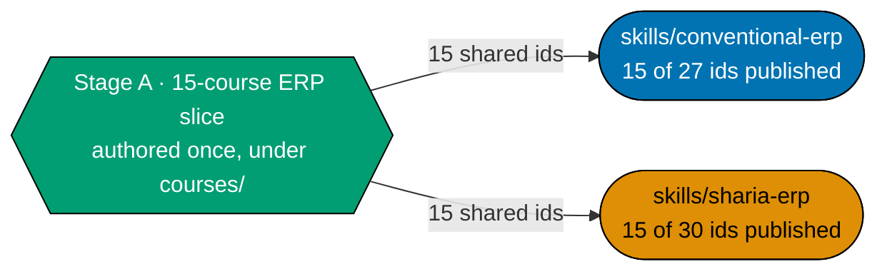

# Plan: Skills Path — ERP Foundations (Stage A)

## Delivery amendment — one final PR

All 15 courses remain within one plan branch and one delivery unit. The sole draft PR opens only in
Phase 8, after verification and Knowledge Capture, and carries the archival move, CI,
merge, and deploy. No earlier stage or delivery boundary opens a PR.

## Overview

Authors **Stage A — Foundations & Architecture**: 15 of the 30-course ERP corpus (courses `#1-12`,
`17`, `22`, `23`), and **publishes both** `skills/` ERP path manifests —
**`skills/conventional-erp`** and **`skills/sharia-erp`** — at **15 course ids each**. This is the
first of a two-plan split of the retired single-plan design
the superseded ERP-programme draft; the second half,
[`ayokoding-learning-path-18-skills-erp-enterprise-depth`](../ayokoding-learning-path-18-skills-erp-enterprise-depth/README.md)
(historical source context this plan), grows both manifests to their terminal 27/30-id state across Stage B and
Stage C.

**This 15-course publication is a real, deployable checkpoint, not a placeholder.** Both manifests
are schema-valid, e2e-tested, and deployed to `prod-ayokoding-www` at the end of this plan — a reader
visiting either path landing today gets a coherent, if smaller, experience, up through the
**Dangerous 1 ⚡** boundary (course 9, `erp-audit-trail-and-change-tracking`). See
[tech-docs.md §Stage A is a deployable milestone](./tech-docs.md#stage-a-is-a-deployable-milestone-dd-5).

## Why this plan exists (the split)

The source plan the superseded ERP-programme draft authored the full 30-course corpus and grew
both manifests across three authoring stages in one plan. Splitting it in two lets Stage A — which
carries **zero** accounting precondition and is independently deployable — proceed and ship on its
own schedule, instead of holding its already-complete, already-shippable 15-course state hostage to
Stage B/C's accounting-gate waits (which belong entirely to the successor plan). This plan is
Stage A only; [tech-docs.md §Why split at the Stage A/B boundary](./tech-docs.md#why-split-at-the-stage-ab-boundary)
states the reasoning in full.

## Scope

**In scope**: both ERP path manifests published fresh at 15 ids each, both path landings (content
only — no new component), 15 course bodies (courses `#1-12`, `17`, `22`, `23` — 8 By Example, 7
Annotated-concept), 15 syllabus specs with module/topic breakdowns, the general ERP Licensing and IP
Compliance posture, and Gherkin coverage for the Dangerous 1 boundary on both paths.

**Out of scope (A6/A7 — carried forward from the retired source plan)**: no course builds, installs,
or stands up an ERP system of any kind; no course teaches vendor evaluation, selection, or
implementation methodology.

**Out of scope (ownership)**: this plan never edits an accounting file, a careers manifest, a
component, a design asset, or a structural `_index.md` (owned by
`ayokoding-learning-path-01-url-restructure`, A3). It never authors a Stage B or Stage C course body —
those 15 courses (`#13-16`, `18-21`, `24-27` and `28-30`) belong entirely to
[`ayokoding-learning-path-18-skills-erp-enterprise-depth`](../ayokoding-learning-path-18-skills-erp-enterprise-depth/README.md).

## Why course 17 authors here despite reading late

Course 17 (`erp-bom-and-routing-architecture`) sits late in the **content-stage ordering**
(production planning, Stage B territory by subject matter) but early in the **authoring order**. Its
only prerequisite is course 2 (`erp-conceptual-data-model`, this plan's own Stage A); deferring it to
the successor plan would idle authorable work for no reason — three Stage B courses
(`production-planning-and-mrp`, `demand-and-supply-planning`, `quality-management-and-inspection`)
depend on it directly, so authoring it now unblocks the successor plan's own Stage B the moment this
plan merges. This reasoning is carried forward verbatim from the retired source plan's own DD-3 note.

## Depth and catalog (A9)

This plan's 15 courses are an authoring-order slice of the full, already-settled 30-course catalog —
see [tech-docs.md §The ERP catalog (this plan's 15-course slice)](./tech-docs.md#the-erp-catalog-this-plans-15-course-slice).
The 30-course catalog itself, its prerequisite edges, and its stage partition are **not re-derived
here** — they were settled once in the retired source plan and are transcribed, not redecided.

## Licensing (A8)

Every course is authored clean-room — no standards text, proprietary schema, or copyleft code is
reproduced. See [tech-docs.md §Licensing and IP Compliance](./tech-docs.md#licensing-and-ip-compliance-a8)
for the full per-project licence table and the eleven safe-authoring rules (general ERP posture; this
plan does not touch Sharia-specific standards bodies such as AAOIFI or PSAK directly — that material
belongs to the successor plan's Stage C sub-phase).

## Depends-on

| Relation | Plan (full folder name) | Nature |
| -------- | ----------------------- | ------ |
| **blockedBy** | `ayokoding-learning-path-16-skills-accounting-sharia-extension` | **Hard; sole direct execution prerequisite.** It must be fully merged and archived on `origin/main` before Phase 0. All earlier completion and repository-baseline facts are transitive context, not extra plan prerequisites. |

**Phase 0 start check:** `git ls-tree -r --name-only origin/main plans/done | rg -q "__ayokoding-learning-path-16-skills-accounting-sharia-extension/README\.md$"` exits 0. This is this plan's only plan-level start gate.

## Course count and stage structure (this plan's slice)

| Stage                          | Courses in this plan | Accounting precondition | Boundary reached                                |
| ------------------------------ | -------------------: | ----------------------- | ----------------------------------------------- |
| A — Foundations & Architecture |                   15 | none                    | Dangerous 1 ⚡ (course 9) — both manifests live |

**Total this plan authors**: 15 courses (8 By Example, 7 Annotated-concept) — see the full
per-course table in [tech-docs.md](./tech-docs.md#the-erp-catalog-this-plans-15-course-slice).

## Syllabus layer

Every course this plan authors carries a syllabus with an explicit module/topic breakdown, mirroring
the folder and per-course format the retired source plan established (itself mirroring
`ayokoding-learning-path-02-schema-and-prerequisite-dag`). See
[`syllabus/README.md`](./syllabus/README.md) (this plan's own index, scoped to its 15 courses) and
[tech-docs.md §Corpus Custody](./tech-docs.md#corpus-custody).

## Rule-15 retest decision

This plan runs **its own** three-tester Rule-15 retest at the Stage A checkpoint, rather than
deferring entirely to the successor plan's end-of-programme retest. See
[tech-docs.md §Rule-15 retest split decision](./tech-docs.md#rule-15-retest-split-decision) for the
reasoning.

## Delivery Mode: worktree-to-pr

This plan has exactly one dedicated worktree, one persistent final-delivery branch, and one PR.
All authoring, verification, and Knowledge Capture phases commit on that branch without a push, PR, merge, or deployment. In Phase 8, the executor commits the archival move and
any index updates, opens the sole draft PR, completes the secret scan, local quality checks, and PR quality-gate verification and CI gates,
marks it ready, and performs the normal AI merge/deploy after the hardened preconditions hold.
No per-course, cohort, stage, or phase worktree/branch/PR is permitted.

## Related documents

- [brd.md](./brd.md) — business rationale, risks.
- [prd.md](./prd.md) — product spec, personas, Gherkin scenarios.
- [tech-docs.md](./tech-docs.md) — the 15-course slice, prerequisite graph, licensing section, and
  every Design Decision.
- [delivery.md](./delivery.md) — the phased execution checklist.
- [syllabus/](./syllabus/README.md) — this plan's own 15 per-course syllabus specs and two
  path-manifest mirrors (authored at Phase 1; folder scaffolded here).

## Successor plan

[`ayokoding-learning-path-18-skills-erp-enterprise-depth`](../ayokoding-learning-path-18-skills-erp-enterprise-depth/README.md)
— Stage B (12 courses) + Stage C (3 courses, `sharia-erp` only), historical source context this plan, grows both
manifests to their terminal 27/30-id state.
